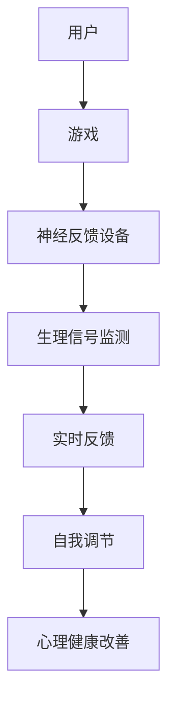

                 

### 文章标题：神经反馈游戏治疗：寓教于乐的心理健康方案

神经反馈游戏治疗，将神经科学、心理学和游戏设计巧妙地融合在一起，形成了一种独特且有效的心理健康干预方式。它不仅能够帮助用户在享受游戏乐趣的同时提升心理健康水平，还能作为一种重要的心理健康教育工具，传播健康知识和技能。本文将深入探讨这一新兴领域，解析其核心概念、技术原理、应用案例，以及未来发展趋势。

> **关键词**：神经反馈，游戏治疗，心理健康，寓教于乐，技术融合

> **摘要**：本文旨在介绍神经反馈游戏治疗的定义、原理及其在心理健康领域的应用。通过详细阐述神经反馈与游戏治疗的结合方式，分析其在不同心理健康问题中的实际效果，探讨其技术基础和发展趋势，最后对未来的前景进行展望。本文结构清晰，内容丰富，适合对心理健康和游戏设计感兴趣的读者。

### 前言

神经反馈游戏治疗是一种创新的心理健康干预方法，它结合了神经科学、心理学和游戏设计的技术，旨在通过互动式的游戏体验来改善用户的心理健康。这种治疗方式不仅能够为那些寻求心理健康帮助的人提供一种新颖、有趣的治疗手段，还能够作为一种预防性工具，帮助大众提升心理健康水平。

本篇文章将围绕以下几个核心问题展开讨论：

1. **神经反馈与游戏治疗的基本概念**：介绍神经反馈和游戏治疗的定义、核心原理及其相互联系。
2. **技术基础**：探讨神经反馈技术的原理、游戏设计的基础知识，以及常见的神经反馈设备与工具。
3. **应用案例**：分析神经反馈游戏治疗在不同心理健康问题中的应用实例。
4. **教育与传播**：讨论如何通过神经反馈游戏治疗进行心理健康教育和传播。
5. **未来展望**：分析神经反馈游戏治疗的未来发展趋势和行业前景。

### 第一部分：神经反馈与游戏治疗概述

#### 1.1 神经反馈与游戏治疗的概念

**神经反馈**是一种通过实时监测大脑活动并将其反馈给个体，以帮助个体学习和调节其大脑活动的技术。这种技术可以用来监测和改变大脑的多种生理过程，包括脑电波、心率、肌电等。

**游戏治疗**则是一种通过游戏活动来促进心理治疗和康复的方法。这种方法利用游戏中的互动和挑战，帮助用户探索情感、提升自我意识和解决问题的能力。

将神经反馈与游戏治疗结合，形成的**神经反馈游戏治疗**，旨在通过互动式的游戏体验，实时监测并反馈用户的神经活动，从而在娱乐的同时改善心理健康。

#### 1.2 神经反馈与游戏治疗的核心概念与联系

神经反馈与游戏治疗的结合，形成了一种独特的心理健康干预方法。其核心概念可以概括为以下几点：

1. **实时监测与反馈**：通过神经反馈设备，实时监测用户的脑电波、心率等生理信号，并将这些信号以视觉或听觉的方式反馈给用户。
2. **互动与挑战**：通过设计有趣的、具有挑战性的游戏，鼓励用户积极参与，提高其注意力、记忆力和情感调节能力。
3. **自我调节**：通过神经反馈和游戏活动，用户可以学会如何通过自我调节来改善心理健康，如降低焦虑、提高专注力等。

为了更直观地展示神经反馈与游戏治疗的结合方式，我们可以使用Mermaid流程图来描述其基本架构：



#### 1.3 神经反馈与游戏治疗的历史与发展

**神经反馈**的历史可以追溯到20世纪60年代，当时主要应用于临床心理治疗，如治疗癫痫和焦虑。随着科技的进步，神经反馈逐渐与其他技术相结合，如脑电图（EEG）和肌电图（EMG）。

**游戏治疗**的发展则更为迅速，起源于20世纪80年代，主要应用于儿童和青少年的心理治疗。近年来，随着游戏技术的不断发展，游戏治疗在成人心理健康领域也得到了广泛应用。

神经反馈与游戏治疗的结合始于21世纪初，这一新兴领域迅速引起了学术界和工业界的关注。目前，神经反馈游戏治疗已经在临床、教育、体育等多个领域得到了应用，展现出了巨大的潜力。

#### 1.4 神经反馈游戏治疗的应用领域与好处

**神经反馈游戏治疗**的应用领域非常广泛，主要包括以下几方面：

1. **儿童心理健康**：通过神经反馈游戏治疗，可以帮助儿童提高注意力、改善行为问题，如多动症和自闭症。
2. **成人心理健康**：神经反馈游戏治疗可以用于治疗焦虑、抑郁、压力等成人常见心理健康问题。
3. **教育**：神经反馈游戏治疗可以作为教育工具，提高学生的注意力和学习效果。
4. **体育**：神经反馈游戏治疗可以帮助运动员提高专注力和运动表现。

神经反馈游戏治疗的好处主要体现在以下几个方面：

1. **寓教于乐**：通过游戏化的方式，用户可以在愉快的氛围中接受心理健康干预，提高治疗的依从性。
2. **个性化治疗**：根据用户的神经活动数据，可以定制个性化的治疗方案，提高治疗效果。
3. **无侵入性**：神经反馈游戏治疗不需要侵入性操作，用户可以轻松地在家中或诊所进行。

### 第二部分：神经反馈技术基础

神经反馈游戏治疗的核心在于其技术基础，包括神经反馈原理、游戏设计基础和常见的神经反馈设备与工具。本部分将深入探讨这些技术细节，帮助读者理解神经反馈游戏治疗的实现机制。

#### 2.1 神经反馈技术原理

神经反馈技术的基本原理是通过监测大脑或其他生理系统的活动，将其转化为可以感知和控制的信号，并将其反馈给个体，从而帮助个体学习和调节其生理过程。以下是神经反馈技术的主要原理：

1. **信号采集**：通过传感器（如脑电图（EEG）、肌电图（EMG）等）采集大脑或其他生理系统的活动信号。
2. **信号处理**：对采集到的信号进行滤波、放大、数字化等处理，以提高信号质量和准确性。
3. **信号分析**：使用信号分析技术（如傅里叶变换、小波变换等）对处理后的信号进行分析，提取关键特征。
4. **反馈生成**：根据分析结果，生成可以感知和控制的反馈信号，如视觉、听觉信号等。
5. **反馈调整**：个体根据反馈信号调整其生理过程，如注意力、心率等。

以下是一个简化的伪代码，描述了神经反馈的基本流程：

```python
def neurofeedback流程(用户，传感器，信号处理模块，反馈模块):
    while 用户参与治疗:
        采集信号 = 传感器.采集信号()
        处理信号 = 信号处理模块.处理信号(采集信号)
        特征值 = 信号处理模块.提取特征值(处理信号)
        反馈信号 = 反馈模块.生成反馈信号(特征值)
        用户.接收反馈信号(反馈信号)
        调整生理过程 = 用户.调整生理过程()
    end while
end def
```

#### 2.2 游戏设计基础

神经反馈游戏治疗的成功离不开良好的游戏设计。以下是一些关键的游戏设计原则：

1. **目标明确**：游戏应该有一个清晰的目标，引导用户在游戏中不断进步。
2. **互动性**：游戏应该鼓励用户与游戏环境互动，提高其参与度。
3. **挑战性**：游戏应该设置适当的挑战，以激发用户的兴趣和动力。
4. **可调节性**：游戏应该可以根据用户的反馈进行调节，以适应不同用户的需求。

以下是一个简化的伪代码，描述了游戏设计的基本流程：

```python
def 游戏设计(用户，目标，互动性，挑战性，可调节性):
    设定游戏目标 = 目标.设定目标()
    创建游戏环境 = 环境.创建环境(设定游戏目标)
    while 用户参与游戏:
        用户互动 = 互动性.获取用户互动()
        更新游戏状态 = 环境.更新状态(用户互动)
        评估挑战性 = 挑战性.评估挑战性(更新游戏状态)
        调整游戏难度 = 可调节性.调整难度(评估挑战性)
    end while
    end def
```

#### 2.3 常见神经反馈设备与工具

神经反馈游戏治疗的实施离不开合适的设备与工具。以下是一些常见的神经反馈设备和工具：

1. **脑电图（EEG）设备**：用于监测大脑电活动，是最常用的神经反馈设备之一。
2. **肌电图（EMG）设备**：用于监测肌肉电活动，常用于治疗肌肉紧张和疼痛。
3. **心率监测器**：用于监测心率变化，可以帮助用户了解其生理状态。
4. **虚拟现实（VR）设备**：用于创建沉浸式的游戏环境，提高用户的参与度。
5. **平板电脑与智能手机**：用于显示反馈信号和游戏界面，方便用户使用。

以下是一个简化的伪代码，描述了如何使用这些设备与工具进行神经反馈游戏治疗：

```python
def 神经反馈游戏治疗(用户，EEG设备，EMG设备，心率监测器，VR设备，平板电脑):
    初始化设备 = 设备.初始化()
    启动游戏 = 游戏.启动()
    while 用户参与治疗:
        采集EEG信号 = EEG设备.采集信号()
        采集EMG信号 = EMG设备.采集信号()
        采集心率信号 = 心率监测器.采集信号()
        处理EEG信号 = 信号处理模块.处理信号(采集EEG信号)
        处理EMG信号 = 信号处理模块.处理信号(采集EMG信号)
        处理心率信号 = 信号处理模块.处理信号(采集心率信号)
        生成反馈信号 = 反馈模块.生成反馈信号(处理EEG信号,处理EMG信号,处理心率信号)
        显示反馈信号 = 平板电脑.显示信号(生成反馈信号)
        更新游戏状态 = 游戏.更新状态()
        用户互动 = 用户.互动(显示反馈信号,更新游戏状态)
    end while
    end def
```

通过上述技术基础的介绍，我们可以看到神经反馈游戏治疗的实现并非一蹴而就，它需要多学科的交叉融合。然而，随着技术的不断进步和应用的深入，神经反馈游戏治疗有望在心理健康领域发挥更大的作用。

### 第三部分：游戏治疗的应用案例

神经反馈游戏治疗在心理健康领域有着广泛的应用，可以用于治疗多种心理健康问题。本部分将分析几个典型的应用案例，展示神经反馈游戏治疗在实际中的应用效果和过程。

#### 3.1 心理健康问题分析

心理健康问题种类繁多，但常见的包括焦虑、抑郁、注意力缺陷、情绪调节困难等。以下将重点分析这些问题的特点，并探讨神经反馈游戏治疗如何应对。

1. **焦虑**：焦虑是一种常见的心理健康问题，表现为持续性的紧张、恐惧和过度担忧。焦虑可能导致注意力不集中、记忆力下降，严重时甚至影响日常生活和工作。

2. **抑郁**：抑郁是一种情感障碍，表现为持续的悲伤、无望和无兴趣。抑郁患者常常失去对生活的热情，出现食欲和睡眠障碍，甚至有自杀倾向。

3. **注意力缺陷**：注意力缺陷（如多动症）表现为注意力不集中、易分心，常常导致学习困难和人际关系问题。

4. **情绪调节困难**：情绪调节困难者可能无法有效地控制自己的情绪，容易产生情绪波动和冲动行为。

#### 3.2 游戏治疗实例

以下是几个具体的游戏治疗案例，展示了神经反馈游戏治疗在不同心理健康问题中的应用。

1. **案例一：焦虑患者的游戏治疗**

某患者，32岁，女性，因工作压力导致严重焦虑。她在治疗中使用了神经反馈游戏治疗，游戏设计旨在帮助患者放松和集中注意力。

**治疗过程**：

- **初期评估**：首先对患者进行神经反馈测试，了解其大脑活动特点和焦虑状态。
- **游戏选择**：选择了一款以放松和集中注意力为目标的神经反馈游戏，游戏内容包括呼吸训练、视觉追踪和音乐放松。
- **治疗过程**：患者每天进行约30分钟的游戏治疗，持续8周。在游戏过程中，患者的焦虑水平通过实时监测和反馈得到调整。

**效果评估**：

- **主观评估**：患者表示在治疗过程中感到放松，焦虑水平显著下降。
- **客观评估**：通过神经反馈数据分析，患者的脑电波活动变得更加稳定，焦虑相关的频率成分减少。

2. **案例二：抑郁患者的康复之路**

某患者，45岁，男性，因长期失业和婚姻问题导致严重抑郁。他在治疗中使用了神经反馈游戏治疗，游戏设计旨在提升情绪和增强自信心。

**治疗过程**：

- **初期评估**：对患者进行全面的神经反馈和心理健康评估，了解其抑郁状态和情绪调节能力。
- **游戏选择**：选择了一款以情绪提升和自信心培养为目标的神经反馈游戏，游戏内容包括角色扮演、成就挑战和正念练习。
- **治疗过程**：患者每周进行3次游戏治疗，每次约60分钟，持续12周。

**效果评估**：

- **主观评估**：患者表示在治疗过程中情绪逐渐改善，对生活重新充满希望。
- **客观评估**：通过神经反馈数据分析，患者的情绪调节能力显著提升，抑郁相关的负面情绪减少。

3. **案例三：注意力缺陷儿童的游戏干预**

某儿童，8岁，被诊断为注意力缺陷多动障碍（ADHD）。他在治疗中使用了神经反馈游戏治疗，游戏设计旨在提升注意力和学习效果。

**治疗过程**：

- **初期评估**：对儿童进行神经反馈和学习能力测试，了解其注意力状况和学习特点。
- **游戏选择**：选择了一款以注意力提升和学习能力培养为目标的神经反馈游戏，游戏内容包括专注力训练、记忆游戏和任务管理。
- **治疗过程**：儿童每周进行2次游戏治疗，每次约45分钟，持续6个月。

**效果评估**：

- **主观评估**：家长和教师反映，儿童在治疗过程中注意力显著提高，学习效率提升，行为问题减少。
- **客观评估**：通过神经反馈数据分析，儿童的大脑活动变得更加稳定，注意力的集中时间和准确率提高。

通过上述案例，我们可以看到神经反馈游戏治疗在治疗各种心理健康问题中具有显著的效果。它不仅能够帮助患者改善心理状态，还能够作为一种预防性工具，提高大众的心理健康水平。

### 第四部分：心理健康教育与传播

神经反馈游戏治疗不仅是一种有效的心理健康干预方法，还可以作为一种重要的心理健康教育工具，帮助大众提高心理健康意识，学会自我调节和应对压力。以下将讨论如何在家庭、学校和社区中实施神经反馈游戏治疗，以及在社会中传播这一理念所面临的挑战和机遇。

#### 4.1 教育策略

**家庭教育**：

在家庭中，父母可以借助神经反馈游戏治疗工具，帮助孩子提高注意力、改善行为问题，如多动症和焦虑。以下是一些具体的教育策略：

- **共同参与**：父母可以与孩子一起参与神经反馈游戏治疗，通过互动和游戏，增进亲子关系。
- **目标设定**：为儿童设定具体、可达成的小目标，如每天进行一定时间的游戏治疗，逐步提升其心理健康水平。
- **鼓励与支持**：给予孩子鼓励和支持，帮助他们在游戏中保持积极的心态，增强自我调节能力。

**学校教育**：

学校可以借助神经反馈游戏治疗，帮助学生提高学习效率、改善情绪状态。以下是一些具体的学校教育策略：

- **课程整合**：将神经反馈游戏治疗融入到日常课程中，如通过游戏化任务提高学生的注意力和记忆力。
- **教师培训**：为教师提供相关培训，使他们了解神经反馈游戏治疗的基本原理和应用方法。
- **个性化干预**：根据学生的心理状况和需求，提供个性化的神经反馈游戏治疗方案。

**社区心理健康教育**：

社区可以开展一系列心理健康教育活动，推广神经反馈游戏治疗的理念。以下是一些具体的社区心理健康教育策略：

- **宣传活动**：通过海报、宣传册、社交媒体等渠道，宣传神经反馈游戏治疗的优势和应用。
- **专家讲座**：邀请心理专家进行讲座，普及心理健康知识，讲解神经反馈游戏治疗的方法和应用。
- **社区活动**：组织社区心理健康活动，如神经反馈游戏治疗体验日，吸引社区居民参与。

#### 4.2 社会传播

**媒体传播策略**：

媒体在神经反馈游戏治疗的社会传播中发挥着重要作用。以下是一些具体的媒体传播策略：

- **新闻报道**：报道神经反馈游戏治疗的案例和应用，提升公众对该方法的认知。
- **专题节目**：制作专题节目，邀请专家和患者分享神经反馈游戏治疗的经验和效果。
- **在线平台**：在社交媒体和视频平台上发布相关内容和案例，吸引年轻群体的关注。

**社交媒体与神经反馈游戏**：

社交媒体是传播神经反馈游戏治疗的重要渠道。以下是一些具体的社交媒体策略：

- **内容创作**：创作有趣、实用的神经反馈游戏内容，吸引粉丝和用户。
- **互动互动**：与用户进行互动，解答疑问，增强用户黏性。
- **合作伙伴**：与相关机构和企业合作，共同推广神经反馈游戏治疗。

**挑战与机遇**：

尽管神经反馈游戏治疗在社会传播中面临着诸多挑战，如公众认知不足、技术设备成本高等，但同时也存在着巨大的机遇。以下是一些挑战和机遇：

- **挑战**：
  - **认知不足**：许多人对神经反馈游戏治疗了解有限，需要通过广泛宣传提高公众认知。
  - **设备成本**：高质量的神经反馈设备价格较高，需要降低成本以普及应用。
  - **技术壁垒**：神经反馈技术的研发和应用需要高水平的专业知识，需要培养更多的专业人才。

- **机遇**：
  - **市场需求**：随着人们对心理健康问题的关注增加，神经反馈游戏治疗的市场需求也在不断增长。
  - **技术创新**：随着人工智能和虚拟现实等技术的不断发展，神经反馈游戏治疗的技术水平和应用场景将得到进一步提升。
  - **政策支持**：政府和社会对心理健康问题的重视，将为神经反馈游戏治疗的发展提供政策支持。

通过有效的教育和传播策略，神经反馈游戏治疗有望在心理健康领域发挥更大的作用，为更多的人群提供帮助。

### 第五部分：未来展望与趋势

神经反馈游戏治疗作为一种新兴的心理健康干预方法，其未来发展趋势和行业前景令人期待。以下将分析神经反馈和游戏治疗技术的发展趋势，探讨神经反馈游戏治疗在心理健康领域的应用前景。

#### 5.1 技术发展趋势

**神经反馈技术的创新**：

随着神经科学和计算技术的不断发展，神经反馈技术也在不断创新。以下是一些值得关注的技术趋势：

1. **高分辨率脑电图（EEG）技术**：高分辨率EEG技术可以更准确地捕捉大脑活动的细节，为神经反馈游戏治疗提供更丰富的数据支持。
2. **多模态神经反馈**：结合脑电图（EEG）、肌电图（EMG）、心率等不同模态的数据，可以实现更全面的生理状态监测和干预。
3. **基于深度学习的信号处理**：深度学习算法在信号处理中的应用，可以进一步提高神经反馈数据的准确性和可靠性。
4. **可穿戴神经反馈设备**：便携式、可穿戴的神经反馈设备将使神经反馈游戏治疗更加便捷，易于普及。

**游戏技术的进步**：

游戏技术也在快速发展，为神经反馈游戏治疗提供了更多的可能性。以下是一些值得关注的技术趋势：

1. **虚拟现实（VR）**：VR技术的成熟，为神经反馈游戏治疗提供了沉浸式的游戏体验，提高了用户的参与度和治疗效果。
2. **增强现实（AR）**：AR技术可以结合现实和虚拟元素，为神经反馈游戏治疗创造更多的应用场景。
3. **游戏引擎开发**：高性能游戏引擎的开发，可以提供更加丰富、多样化的游戏内容，为神经反馈游戏治疗提供更多选择。
4. **游戏化设计**：游戏化设计原则的广泛应用，可以更好地引导用户参与神经反馈游戏治疗，提高其治疗效果。

#### 5.2 行业前景

**市场规模的预测**：

随着神经反馈游戏治疗技术的成熟和公众对其认知的提高，预计其市场规模将逐渐扩大。据市场研究机构的数据，全球神经反馈游戏治疗市场在未来几年将保持高速增长，预计到2025年将达到数十亿美元。

**应用领域的拓展**：

神经反馈游戏治疗的应用领域也在不断拓展，除了心理健康领域，还可能应用于教育、体育、康复等领域。以下是一些潜在的应用领域：

1. **教育**：神经反馈游戏治疗可以作为一种教育工具，提高学生的学习效果和注意力。
2. **体育**：神经反馈游戏治疗可以帮助运动员提高专注力和运动表现。
3. **康复**：神经反馈游戏治疗可以用于康复治疗，帮助患者恢复身体和心理健康。
4. **娱乐**：神经反馈游戏治疗可以作为一种新型的娱乐方式，提供更丰富的游戏体验。

**潜在挑战与应对策略**：

尽管神经反馈游戏治疗具有巨大的潜力，但在其发展过程中仍面临着一些挑战。以下是一些潜在的挑战和应对策略：

1. **技术挑战**：神经反馈技术的精度和可靠性仍需进一步提高，需要持续研发和创新。
2. **设备成本**：高质量的神经反馈设备价格较高，需要降低成本以普及应用。
3. **认知不足**：公众对神经反馈游戏治疗的认知有限，需要通过广泛宣传提高公众认知。
4. **专业人才**：神经反馈游戏治疗需要高水平的专业人才，需要培养更多的专业人才。

通过持续的技术创新、市场拓展和人才培养，神经反馈游戏治疗有望在心理健康领域发挥更大的作用，为更多的人群提供帮助。

### 结语

神经反馈游戏治疗作为一种创新的心理健康干预方法，通过将神经科学、心理学和游戏设计相结合，实现了寓教于乐的治疗效果。本文详细阐述了神经反馈游戏治疗的核心概念、技术基础、应用案例以及未来展望，展示了其在心理健康领域的重要价值和广阔前景。

神经反馈游戏治疗的未来发展充满潜力，随着技术的不断进步和市场需求的扩大，它有望成为心理健康干预和教育的有力工具。然而，实现这一目标仍需要持续的研究、创新和合作。让我们期待神经反馈游戏治疗在未来为更多的人群带来积极的影响。

**作者：AI天才研究院/AI Genius Institute & 禅与计算机程序设计艺术 /Zen And The Art of Computer Programming** 

---

本文旨在为读者提供关于神经反馈游戏治疗的全面了解，包括其核心概念、技术原理、应用案例和未来展望。希望本文能激发更多读者对这一领域的兴趣，共同推动神经反馈游戏治疗的发展。如果您对本文有任何疑问或建议，欢迎在评论区留言交流。让我们共同探讨这一新兴领域的更多可能性。

---

附录部分将提供更多关于神经反馈游戏治疗的资源和参考，包括开发工具、相关研究论文和专业组织等信息，以供进一步学习和研究。敬请关注。

### 附录

#### A.1 神经反馈游戏治疗资源

**开发工具与平台**：

1. **OpenVibe**：一个开源的神经反馈平台，提供了丰富的数据采集、处理和反馈功能。
2. **EEGLAB**：一个用于处理和可视化脑电数据的开源软件，适合进行神经反馈游戏开发。
3. **Unity**：一个流行的游戏开发引擎，支持VR和AR技术，适用于神经反馈游戏开发。

**相关研究论文**：

1. **"Neurofeedback in Mental Health: A Review of Current Evidence and Emerging Directions"**：这篇综述文章详细介绍了神经反馈在心理健康领域的应用和研究进展。
2. **"Video Game-Based Neurofeedback for Cognitive Enhancement: A Review"**：这篇文章探讨了游戏化神经反馈在认知增强方面的应用。
3. **"Affective Neuroscience: The Foundations of Human and Animal Emotions"**：这本书提供了关于情感神经科学的全面介绍，有助于理解神经反馈游戏治疗的基础。

**专业组织与会议**：

1. **International Neurofeedback Society (INS)**：一个专注于神经反馈研究和应用的全球性组织，定期举办会议和培训。
2. **Society for Neuroscience (SFN)**：一个涵盖神经科学各个领域的国际组织，提供丰富的资源和会议机会。
3. **Game Developers Conference (GDC)**：一个专注于游戏开发和技术的国际会议，涵盖了游戏化神经反馈的最新进展。

通过这些资源和组织，读者可以进一步深入了解神经反馈游戏治疗的技术和理论，探索更多的实践和应用场景。希望这些资料能对您的研究和实践活动提供帮助。如果您有任何问题或需要进一步的信息，请随时与我们联系。祝您在神经反馈游戏治疗领域取得丰硕的成果！

