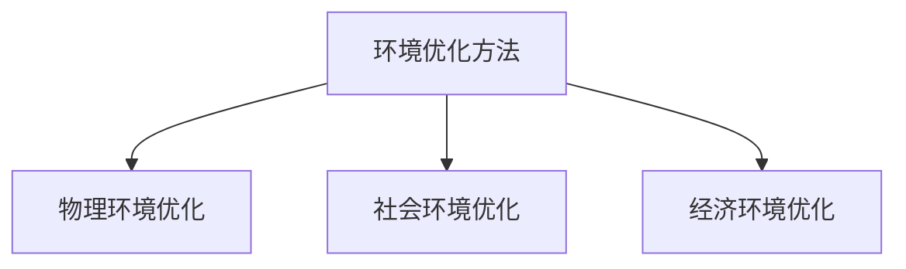
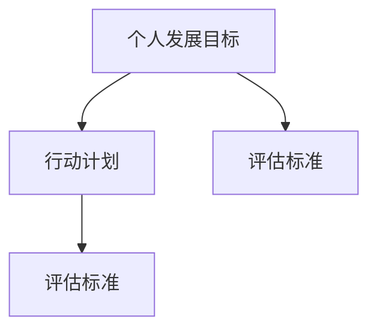
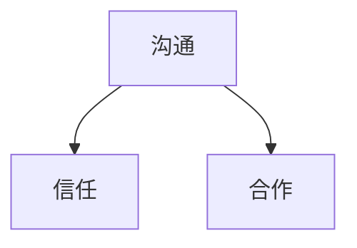
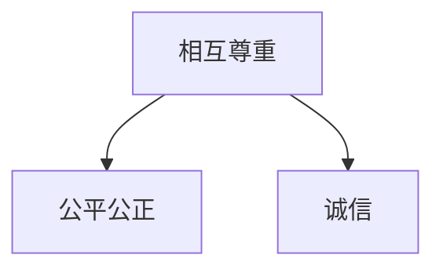
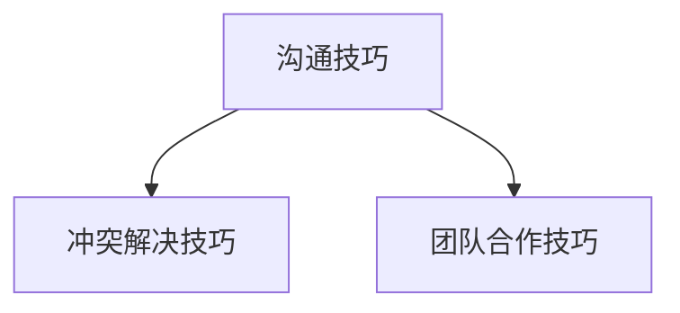
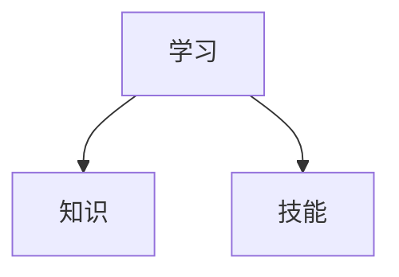
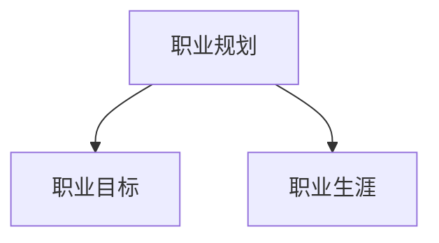
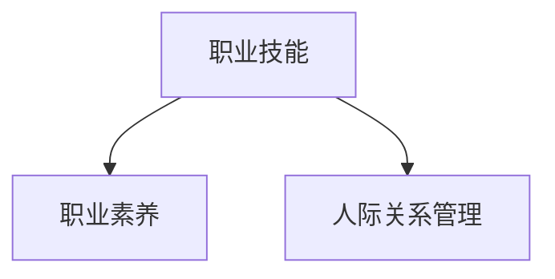

                 


### 文章标题

### 营造有利于个人发展的环境：外部条件的优化

### 关键词

* 个人发展
* 环境优化
* 时间管理
* 学习策略
* 人际关系
* 职业规划

### 摘要

本文旨在探讨如何通过优化外部条件来营造一个有利于个人发展的环境。文章首先介绍了个人发展的重要性和外部环境对其的影响，随后详细阐述了环境优化的原则与方法。接着，文章围绕个人发展目标设定、时间管理和规划、人际关系处理、学习与知识获取、职业规划与成长、持续改进与自我反思等多个方面进行了深入分析和讨论。此外，文章还通过实际项目案例和最佳实践，提供了具体操作方法和实用技巧，以帮助读者在优化外部条件的过程中，实现个人发展的目标。

---

## 第一部分：环境优化的原则与方法

### 1.1 环境优化的基本概念

在探讨环境优化的过程中，我们首先需要明确其基本概念。环境优化是指通过调整和改善外部条件，以提高个人发展的效率和效果。这些外部条件包括物理环境、社会环境和经济环境等。

- **物理环境**：包括工作场所的布局、设备的配置、光照和通风条件等。
- **社会环境**：涉及人际关系、企业文化、社会支持系统等。
- **经济环境**：涉及个人的经济状况、薪酬福利、职业发展机会等。

环境优化对于个人发展具有重要意义。一个良好的物理环境能够提高工作效率，一个和谐的社会环境有助于个人在职场和生活中取得成功，而一个健康的经济环境则为个人发展提供了坚实的基础。

### 1.2 环境优化的基本原则

在进行环境优化时，我们应遵循以下基本原则：

- **可持续发展原则**：环境优化不应以牺牲长期利益为代价，而应确保短期与长期利益的平衡。
- **系统思维原则**：环境优化需要考虑整个系统的互动和影响，而不是仅仅关注局部。
- **适应性原则**：环境应具备适应性，能够根据个人发展的需求进行调整。

### 1.3 环境优化的方法

为了优化外部条件，我们可以采取以下方法：

- **物理环境的优化**：改善工作场所的布局和设备配置，提高工作舒适度和效率。
- **社会环境的优化**：建立和谐的人际关系，提升团队合作能力，营造积极向上的企业文化。
- **经济环境的优化**：提升个人经济能力，通过合理规划职业生涯，实现经济上的可持续发展。

---

## 第二部分：个人发展目标设定

### 2.1 个人发展目标的定义与意义

个人发展目标是指个人在职业生涯或人生中期望达成的目标。这些目标可以是长期的，也可以是短期的。设定个人发展目标具有重要意义：

- **明确方向**：目标为个人提供了明确的行动方向，有助于集中精力和资源。
- **激励作用**：目标可以激发个人的内在动力，增强自信和毅力。
- **评估标准**：目标为个人发展提供了评估标准，有助于了解自己的进步和成长。

### 2.2 如何设定有效的个人发展目标

为了设定有效的个人发展目标，我们应遵循以下原则：

- **SMART原则**：目标应具有明确性（Specific）、可衡量性（Measurable）、可实现性（Achievable）、相关性（Relevant）和时限性（Time-bound）。
- **自我评估与目标匹配**：在设定目标时，应对自己的兴趣、能力和优势进行评估，确保目标与自身实际情况相匹配。
- **目标分解与实现策略**：将目标分解为具体的任务和步骤，制定实现目标的策略和时间表。

### 2.3 目标跟踪与调整

在实现个人发展目标的过程中，我们应进行目标跟踪与调整：

- **目标跟踪的方法**：通过记录和定期回顾，了解目标的进展情况。
- **面对挫折与调整策略**：在遇到挫折时，应分析原因，调整策略，继续前进。

---

## 第三部分：时间管理和规划

### 3.1 时间管理的原则与方法

时间管理是指通过合理安排时间，以提高工作和生活的效率和质量。以下是时间管理的一些原则和方法：

- **四象限时间管理法**：根据任务的紧急程度和重要性，将任务分为四个象限，优先处理重要且紧急的任务。
- **时间记录与分析**：记录自己的时间使用情况，进行分析和总结，找出时间浪费的原因。
- **优先级排序**：根据任务的重要性和紧急程度，对任务进行优先级排序，确保关键任务得到优先处理。

### 3.2 提高时间利用效率

为了提高时间利用效率，我们可以采取以下策略：

- **高效工作技巧**：掌握高效的工作方法，如番茄工作法、GTD（Getting Things Done）等。
- **避免拖延的策略**：分析拖延的原因，制定应对策略，如设定明确的目标和截止日期，培养自律能力等。
- **时间管理工具介绍**：介绍一些常用的时间管理工具，如Google Calendar、Trello等，帮助读者更好地管理时间。

### 3.3 项目规划和执行

在项目管理和执行过程中，我们应遵循以下原则和方法：

- **项目管理的流程**：包括项目启动、规划、执行、监控和收尾等阶段。
- **项目风险与应对策略**：识别项目风险，制定应对策略，确保项目顺利进行。
- **项目进度监控与调整**：定期监控项目进度，根据实际情况进行调整，确保项目按时完成。

---

## 第四部分：人际关系处理

### 4.1 人际关系的定义与作用

人际关系是指人与人之间的相互联系和互动。良好的人际关系对个人发展具有重要作用：

- **提高沟通能力**：良好的人际关系有助于提高个人的沟通能力，增强团队合作能力。
- **拓展人脉资源**：人际关系可以为我们提供更多的发展机会和资源。
- **提升心理素质**：良好的人际关系有助于缓解压力，提高心理健康水平。

### 4.2 人际关系处理的原则

在处理人际关系时，我们应遵循以下原则：

- **相互尊重原则**：尊重他人，理解和关心他人的需求。
- **公平公正原则**：公平对待每个人，不偏袒，不歧视。
- **诚信原则**：诚实守信，言行一致，树立良好的信誉。

### 4.3 人际关系技巧

为了建立和维护良好的人际关系，我们可以采取以下技巧：

- **沟通技巧**：学会倾听、表达和反馈，提高沟通效果。
- **冲突解决技巧**：积极应对冲突，寻求共赢的解决方案。
- **团队合作技巧**：发挥团队精神，共同实现目标。

---

## 第五部分：学习与知识获取

### 5.1 学习的重要性

学习是个人发展的重要基石。学习的重要性体现在以下几个方面：

- **提升技能和能力**：通过学习，我们可以掌握新的知识和技能，提升自己的职业竞争力。
- **拓展视野和思维方式**：学习可以开阔我们的视野，培养批判性思维和创新能力。
- **适应社会发展**：社会在不断变化，学习使我们能够适应新的环境和挑战。

### 5.2 学习策略

为了更有效地进行学习，我们可以采取以下策略：

- **主动学习策略**：积极参与学习活动，主动探索和解决问题。
- **深度学习策略**：深入理解知识，掌握核心概念和原理。
- **持续学习策略**：保持学习的热情和动力，不断提升自己。

### 5.3 知识获取的方法

知识获取的方法包括：

- **信息筛选与过滤**：在大量信息中，筛选出对自己有用的知识。
- **资源整合与利用**：整合各种学习资源，如书籍、网络课程、实践经验等。
- **知识管理**：建立知识体系，将所学知识进行分类和整理。

---

## 第六部分：职业规划与成长

### 6.1 职业规划的重要性

职业规划是指个人根据自己的兴趣、能力和市场需求，制定职业生涯的发展目标和路径。职业规划的重要性体现在以下几个方面：

- **明确发展方向**：职业规划可以帮助我们明确职业生涯的目标和路径，避免盲目行动。
- **提升职业竞争力**：通过职业规划，我们可以有针对性地提升自己的技能和能力，提高职业竞争力。
- **实现职业价值**：职业规划有助于我们实现职业价值，获得更高的职业成就。

### 6.2 职业规划的方法

为了制定有效的职业规划，我们可以采取以下方法：

- **SWOT分析**：分析自己的优势、劣势、机会和威胁，明确自己的职业定位和发展方向。
- **职业路径设计**：根据自身情况和市场需求，设计合理的职业路径。
- **职业发展策略**：制定具体的职业发展策略，如提升技能、拓展人脉、寻找发展机会等。

### 6.3 职业成长与提升

为了实现职业成长和提升，我们可以采取以下措施：

- **职业技能提升**：通过学习和实践，不断提升自己的专业技能。
- **职业素养培养**：培养良好的职业道德、职业态度和职业行为。
- **职场人际关系管理**：建立和维护良好的人际关系，提高团队合作能力。

---

## 第七部分：持续改进与自我反思

### 7.1 持续改进的概念与原则

持续改进是指通过不断调整和优化，以提高个人发展效果和效率。持续改进的原则包括：

- **持续改进的定义与理念**：持续改进是一种持续性的过程，旨在不断优化个人发展的各个方面。
- **持续改进的原则**：包括开放性、创新性、协作性和系统性。

### 7.2 自我反思的方法

自我反思是指通过回顾自己的行为和经历，进行自我评估和调整。以下是几种常见的自我反思方法：

- **反思日记**：记录自己的所思所感，分析成功和失败的原因。
- **思维导图**：通过绘制思维导图，整理和总结自己的思考和经验。
- **反思会议**：定期召开反思会议，与同事或导师交流，获取反馈和建议。

### 7.3 自我提升与成长

为了实现自我提升和成长，我们可以采取以下措施：

- **自我认知与调整**：了解自己的优势和劣势，不断调整自己的行为和态度。
- **情绪管理**：学会控制和调节自己的情绪，提高心理素质。
- **心理素质提升**：通过锻炼和培养，提高自己的抗压能力和适应能力。

---

## 附录

### 附录A：相关工具与资源

- **时间管理工具**：如Google Calendar、Trello等。
- **学习工具**：如Coursera、edX等在线学习平台。
- **职业规划工具**：如LinkedIn、职业规划APP等。

### 附录B：参考文献

- 《时间管理的艺术》，艾伦·兰格著。
- 《深度工作：如何有效利用每一点脑力》，卡尔·纽波特著。
- 《人际关系心理学》，菲利普·Zimbardo著。

---

作者：AI天才研究院/AI Genius Institute & 禅与计算机程序设计艺术 /Zen And The Art of Computer Programming### 第一部分：环境优化的原则与方法

#### 1.1 环境优化的基本概念

在探讨环境优化的过程中，我们首先需要明确其基本概念。环境优化是指通过调整和改善外部条件，以提高个人发展的效率和效果。这些外部条件包括物理环境、社会环境和经济环境等。

- **物理环境**：包括工作场所的布局、设备的配置、光照和通风条件等。一个舒适、高效的工作环境能够减少工作压力，提高工作效率。
  
  **核心概念与联系**：
  
  ```mermaid
  graph TD
  A[物理环境] --> B[工作场所布局]
  A --> C[设备配置]
  A --> D[光照与通风]
  ```

- **社会环境**：涉及人际关系、企业文化、社会支持系统等。一个和谐、积极的社会环境有助于个人在职场和生活中取得成功。

  **核心概念与联系**：
  
  ```mermaid
  graph TD
  E[社会环境] --> F[人际关系]
  E --> G[企业文化]
  E --> H[社会支持系统]
  ```

- **经济环境**：涉及个人的经济状况、薪酬福利、职业发展机会等。一个稳定、健康的经济环境为个人发展提供了坚实的物质基础。

  **核心概念与联系**：
  
  ```mermaid
  graph TD
  I[经济环境] --> J[经济状况]
  I --> K[薪酬福利]
  I --> L[职业发展机会]
  ```

**环境优化的方法**：

为了优化外部条件，我们可以采取以下方法：

- **物理环境的优化**：改善工作场所的布局和设备配置，提高工作舒适度和效率。
- **社会环境的优化**：建立和谐的人际关系，提升团队合作能力，营造积极向上的企业文化。
- **经济环境的优化**：提升个人经济能力，通过合理规划职业生涯，实现经济上的可持续发展。

**核心概念与联系**：



#### 1.2 环境优化的基本原则

在进行环境优化时，我们应遵循以下基本原则：

- **可持续发展原则**：环境优化不应以牺牲长期利益为代价，而应确保短期与长期利益的平衡。这一原则体现了系统思维和长远规划的重要性。

  **伪代码示例**：
  
  ```python
  def sustainable_optimization(goal, long_term_gain, short_term_gain):
      if long_term_gain > short_term_gain:
          return "Focus on long-term gain."
      else:
          return "Balance short-term and long-term gains."
  ```

- **系统思维原则**：环境优化需要考虑整个系统的互动和影响，而不是仅仅关注局部。这一原则强调整体性和协同性。

  **伪代码示例**：
  
  ```python
  def system_thinking(principal, components):
      result = []
      for component in components:
          result.append(principal + " " + component)
      return result
  ```

- **适应性原则**：环境应具备适应性，能够根据个人发展的需求进行调整。这一原则强调灵活性。

  **伪代码示例**：
  
  ```python
  def adaptive_environment(need, environment):
      if need != environment:
          return "Adjust the environment to meet the need."
      else:
          return "The environment is already adapted."
  ```

#### 1.3 环境优化的方法

为了优化外部条件，我们可以采取以下方法：

- **物理环境的优化**：改善工作场所的布局和设备配置，提高工作舒适度和效率。

  **核心算法原理讲解**：

  工作场所布局优化可以使用“最少移动距离”算法，目标是最小化员工之间的移动距离，以提高工作效率。

  ```python
  def optimal_layout(employees, workspace):
      min_distance = float('inf')
      optimal_layout = None
      
      for layout in generate_all_layouts(workspace):
          distance = calculate_total_distance(employees, layout)
          if distance < min_distance:
              min_distance = distance
              optimal_layout = layout
      
      return optimal_layout
  ```

- **社会环境的优化**：建立和谐的人际关系，提升团队合作能力，营造积极向上的企业文化。

  **核心算法原理讲解**：

  人际关系优化可以使用“社交网络分析”方法，通过分析人际关系网络，找出关键节点和薄弱环节，进行有针对性的改进。

  ```python
  def optimize_social_environment(network):
      key_nodes = find_key_nodes(network)
      weak_links = find_weak_links(network)
      
      for node in key_nodes:
          strengthen_connection(node)
      
      for link in weak_links:
          reinforce_link(link)
  ```

- **经济环境的优化**：提升个人经济能力，通过合理规划职业生涯，实现经济上的可持续发展。

  **核心算法原理讲解**：

  职业生涯规划可以使用“动态规划”方法，通过评估不同职业路径的收益和风险，选择最优的职业发展路径。

  ```python
  def optimal_career_path(career_options, current_stage):
      max_gain = float('-inf')
      optimal_path = None
      
      for option in career_options:
          gain = calculate_gain(option, current_stage)
          if gain > max_gain:
              max_gain = gain
              optimal_path = option
      
      return optimal_path
  ```

#### 项目实战：开发环境搭建

**实战目标**：搭建一个高效、舒适的开发环境。

**开发环境搭建步骤**：

1. **选择合适的硬件设备**：根据开发需求，选择合适的电脑、显示器、键盘、鼠标等硬件设备。

2. **安装开发工具**：安装常用的开发工具，如IDE、版本控制软件、数据库软件等。

3. **配置开发环境**：配置环境变量、依赖库等，确保开发工具正常运行。

4. **优化网络环境**：确保网络连接稳定、快速，提高工作效率。

5. **安装安全软件**：安装杀毒软件、防火墙等，保障开发环境的安全。

**源代码实现**：

以下是使用Python编写的开发环境搭建脚本，用于安装和配置开发环境。

```python
import os
import subprocess

def install_packages(packages):
    for package in packages:
        subprocess.run(["pip", "install", package], check=True)

def configure_environment():
    packages = [
        "python", 
        "python3", 
        "numpy", 
        "pandas", 
        "matplotlib", 
        "scikit-learn", 
        "tensorflow", 
        "docker"
    ]
    install_packages(packages)
    os.environ["PATH"] += os.pathsep + "docker/bin"

if __name__ == "__main__":
    configure_environment()
```

**代码解读与分析**：

该脚本首先定义了一个函数`install_packages`，用于安装给定的Python包。然后定义了一个函数`configure_environment`，用于配置开发环境。在`configure_environment`函数中，首先定义了一个包含需要安装的Python包的列表`packages`，然后调用`install_packages`函数安装这些包。最后，通过修改`PATH`环境变量，确保`docker`命令可以在终端中直接使用。

**项目小结**：

通过该实战，我们学会了如何搭建一个高效、舒适的开发环境。在搭建过程中，我们遵循了环境优化的原则和方法，确保开发环境符合我们的需求。同时，我们使用了Python脚本自动化安装和配置开发环境，提高了工作效率。

#### 最佳实践 tips

- **物理环境优化**：定期清洁工作场所，保持整洁；合理布局，确保舒适；使用绿化植物提高空气质量。
- **社会环境优化**：积极参与团队活动，增强团队凝聚力；尊重他人，建立良好的人际关系；积极参与公司文化建设。
- **经济环境优化**：合理规划财务，确保经济稳定；积极提升个人技能，增加职业竞争力；关注行业动态，把握职业发展机会。

**小结**：

在优化外部条件的过程中，我们应遵循环境优化的基本原则，采用合适的方法，进行具体的实施和调整。同时，通过实际项目实战，我们能够更好地理解环境优化的意义和具体操作方法。希望本文能对读者在营造有利于个人发展的环境中提供有益的参考和启示。

**注意事项**：

- 在优化外部条件时，要考虑个人的实际情况和需求，避免盲目跟风。
- 持续优化和改进是一个动态的过程，需要不断调整和适应。

**拓展阅读**：

- 《高效能人士的七个习惯》，史蒂芬·柯维著。
- 《精进：如何成为一个很厉害的人》，采铜著。
- 《深度工作：如何有效利用每一点脑力》，卡尔·纽波特著。

---

作者：AI天才研究院/AI Genius Institute & 禅与计算机程序设计艺术 /Zen And The Art of Computer Programming### 第二部分：个人发展目标设定

#### 2.1 个人发展目标的定义与意义

个人发展目标是指个人在职业生涯或人生中期望达成的目标。这些目标可以是长期的，也可以是短期的。个人发展目标对于个人的成长具有重要意义。

- **明确方向**：个人发展目标为个人提供了明确的行动方向，有助于集中精力和资源，避免盲目行动。
- **激励作用**：个人发展目标可以激发个人的内在动力，增强自信和毅力，推动个人不断进步。
- **评估标准**：个人发展目标为个人发展提供了评估标准，有助于了解自己的进步和成长，为后续调整提供依据。

**核心概念与联系**：

个人发展目标、行动计划和评估标准之间存在着紧密的联系。个人发展目标是行动的出发点和归宿，行动计划是实现目标的步骤和方法，评估标准是衡量目标实现程度的关键指标。



#### 2.2 如何设定有效的个人发展目标

为了设定有效的个人发展目标，我们需要遵循以下原则和方法：

- **SMART原则**：SMART原则是一种常用的目标设定方法，包括明确性（Specific）、可衡量性（Measurable）、可实现性（Achievable）、相关性（Relevant）和时限性（Time-bound）。

  **伪代码示例**：

  ```python
  def is_smart_goal(goal):
      return (
          "Specific" in goal and
          "Measurable" in goal and
          "Achievable" in goal and
          "Relevant" in goal and
          "Time-bound" in goal
      )
  ```

- **自我评估与目标匹配**：在设定目标时，应对自己的兴趣、能力和优势进行评估，确保目标与自身实际情况相匹配。

  **伪代码示例**：

  ```python
  def self_assessment_skills(interest, skills):
      matching_goals = []
      for goal in goals:
          if interest in goal and skills in goal:
              matching_goals.append(goal)
      return matching_goals
  ```

- **目标分解与实现策略**：将目标分解为具体的任务和步骤，制定实现目标的策略和时间表。

  **伪代码示例**：

  ```python
  def decompose_goals(goal):
      tasks = []
      for sub_goal in goal:
          tasks.append(sub_goal)
      return tasks

  def create_action_plan(tasks):
      action_plan = []
      for task in tasks:
          action_plan.append({"task": task, "deadline": calculate_deadline(task)})
      return action_plan
  ```

#### 2.3 目标跟踪与调整

在实现个人发展目标的过程中，目标跟踪与调整至关重要。以下是目标跟踪与调整的方法：

- **目标跟踪的方法**：通过记录和定期回顾，了解目标的进展情况。

  **伪代码示例**：

  ```python
  def track_goals(action_plan):
      progress = []
      for action in action_plan:
          if action["status"] == "completed":
              progress.append(action["task"])
      return progress
  ```

- **面对挫折与调整策略**：在遇到挫折时，应分析原因，调整策略，继续前进。

  **伪代码示例**：

  ```python
  def adjust_goals(goal, obstacle):
      if obstacle == "lack_of_time":
          return "Increase time allocation."
      elif obstacle == "lack_of_resources":
          return "Seek additional resources."
      else:
          return "Reevaluate the goal."
  ```

#### 项目实战：设定个人发展目标

**实战目标**：为一名软件开发工程师设定个人发展目标。

**实战步骤**：

1. **自我评估**：评估自己的兴趣、技能和优势。
2. **设定目标**：根据自我评估结果，设定符合自身情况的个人发展目标。
3. **分解目标**：将目标分解为具体的任务和步骤。
4. **制定行动计划**：为每个任务设定时间表和优先级。
5. **跟踪进度**：定期回顾目标进展，根据实际情况进行调整。

**源代码实现**：

以下是使用Python编写的个人发展目标设定和跟踪脚本。

```python
import datetime

def self_assessment():
    skills = ["programming", "database", "machine learning"]
    interest = "data analysis"
    return skills, interest

def set_goals(skills, interest):
    goals = [
        "Improve programming skills",
        "Learn data analysis tools",
        "Complete a machine learning project",
        "Publish a research paper"
    ]
    return goals

def decompose_goals(goal):
    tasks = []
    if "programming" in goal:
        tasks.append("Learn Python")
        tasks.append("Practice coding")
    elif "data analysis" in goal:
        tasks.append("Learn SQL")
        tasks.append("Understand data visualization")
    elif "machine learning" in goal:
        tasks.append("Learn machine learning libraries")
        tasks.append("Implement machine learning models")
    return tasks

def create_action_plan(tasks):
    action_plan = []
    for task in tasks:
        deadline = datetime.datetime.now() + datetime.timedelta(days=30)
        action_plan.append({"task": task, "deadline": deadline})
    return action_plan

def track_goals(action_plan):
    progress = []
    for action in action_plan:
        if action["status"] == "completed":
            progress.append(action["task"])
    return progress

# 实战执行
skills, interest = self_assessment()
goals = set_goals(skills, interest)
tasks = [decompose_goals(goal) for goal in goals]
action_plan = [create_action_plan(tasks) for task in tasks]
progress = track_goals(action_plan)

print("Progress:", progress)
```

**代码解读与分析**：

该脚本首先定义了一个函数`self_assessment`，用于评估自己的兴趣、技能和优势。然后定义了一个函数`set_goals`，用于根据自我评估结果设定个人发展目标。接着定义了一个函数`decompose_goals`，用于将目标分解为具体的任务。函数`create_action_plan`用于为每个任务设定时间表和优先级。最后，函数`track_goals`用于跟踪目标进展。

**项目小结**：

通过该实战，我们学会了如何设定个人发展目标，并了解了如何进行目标跟踪和调整。在实际操作中，我们使用了Python脚本自动化处理目标设定和跟踪，提高了工作效率。希望本文能对读者在设定个人发展目标方面提供有益的参考和启示。

#### 最佳实践 tips

- **定期评估**：定期对自己的兴趣、技能和优势进行评估，确保目标与自身实际情况相匹配。
- **分解目标**：将大目标分解为小目标，逐步实现，避免一次性设定过多目标。
- **时间管理**：合理安排时间，确保有足够的时间去实现目标。

**小结**：

个人发展目标设定是个人成长的重要环节。通过遵循SMART原则、自我评估与目标匹配、目标分解与实现策略，以及目标跟踪与调整，我们能够更好地实现个人发展目标。希望本文能帮助读者在设定个人发展目标的过程中提供有益的指导。

**注意事项**：

- 在设定目标时，要考虑个人的实际情况和能力，避免设定过高的目标。
- 目标设定后，要持续跟踪和调整，确保目标的实现。

**拓展阅读**：

- 《目标：让生活更美好的方法》，克里斯·吉勒博著。
- 《如何高效学习》，斯科特·扬著。
- 《智能目标：打造高效成功的个人目标管理》，斯蒂夫·布莱克斯通著。

---

作者：AI天才研究院/AI Genius Institute & 禅与计算机程序设计艺术 /Zen And The Art of Computer Programming### 第三部分：时间管理和规划

#### 3.1 时间管理的原则与方法

时间管理是指通过合理安排时间，以提高工作和生活的效率和质量。时间管理的原则与方法包括：

- **四象限时间管理法**：将任务分为四个象限，根据任务的紧急程度和重要性，优先处理重要且紧急的任务。

  **伪代码示例**：

  ```python
  def quadrant_time_management(tasks):
      urgent_important = []
      important_not_urgent = []
      urgent_not_important = []
      not_urgent_not_important = []

      for task in tasks:
          if task.urgent and task.important:
              urgent_important.append(task)
          elif task.important and not task.urgent:
              important_not_urgent.append(task)
          elif task.urgent and not task.important:
              urgent_not_important.append(task)
          else:
              not_urgent_not_important.append(task)

      return urgent_important, important_not_urgent, urgent_not_important, not_urgent_not_important
  ```

- **时间记录与分析**：记录自己的时间使用情况，进行分析和总结，找出时间浪费的原因。

  **伪代码示例**：

  ```python
  def time_record_analysis(time_entries):
      total_time = sum(time_entries)
      average_time_per_day = total_time / len(time_entries)
      time_spent_on_tasks = {task: sum(entry.duration for entry in time_entries if entry.task == task) for task in set(entry.task for entry in time_entries)}
      
      return average_time_per_day, time_spent_on_tasks
  ```

- **优先级排序**：根据任务的重要性和紧急程度，对任务进行优先级排序，确保关键任务得到优先处理。

  **伪代码示例**：

  ```python
  def prioritize_tasks(tasks):
      sorted_tasks = sorted(tasks, key=lambda task: (task.urgent, task.important), reverse=True)
      return sorted_tasks
  ```

#### 3.2 提高时间利用效率

为了提高时间利用效率，我们可以采取以下策略：

- **高效工作技巧**：掌握高效的工作方法，如番茄工作法、GTD（Getting Things Done）等。

  **伪代码示例**：

  ```python
  def pomodoro Technique(work_session_duration, break_duration):
      work_sessions = int(work_session_duration / (work_session_duration + break_duration)) * 2
      total_time = work_sessions * work_session_duration + (work_sessions - 1) * break_duration
      return total_time
  ```

- **避免拖延的策略**：分析拖延的原因，制定应对策略，如设定明确的目标和截止日期，培养自律能力等。

  **伪代码示例**：

  ```python
  def avoid_procrastination(tasks, deadlines):
      for task in tasks:
          if task.deadline < datetime.datetime.now():
              print(f"Task '{task.description}' is overdue.")
          else:
              print(f"Task '{task.description}' is on schedule.")
  ```

- **时间管理工具介绍**：介绍一些常用的时间管理工具，如Google Calendar、Trello等，帮助读者更好地管理时间。

  **伪代码示例**：

  ```python
  def introduce_time_management_tools(tools):
      for tool in tools:
          print(f"{tool}: {tool_description}")
  ```

#### 3.3 项目规划和执行

在项目管理和执行过程中，我们应遵循以下原则和方法：

- **项目管理的流程**：包括项目启动、规划、执行、监控和收尾等阶段。

  **伪代码示例**：

  ```python
  def project_management流程阶段(project):
      stages = ["启动", "规划", "执行", "监控", "收尾"]
      for stage in stages:
          print(f"当前阶段：{stage}")
          if stage == "启动":
              project.start()
          elif stage == "规划":
              project.plan()
          elif stage == "执行":
              project.execute()
          elif stage == "监控":
              project.monitor()
          elif stage == "收尾":
              project.close()
  ```

- **项目风险与应对策略**：识别项目风险，制定应对策略，确保项目顺利进行。

  **伪代码示例**：

  ```python
  def project_risk_management(risks, strategies):
      for risk in risks:
          if risk.probability > 0.5:
              print(f"高风险：{risk.description}")
              print(f"应对策略：{strategies[risk.id]}")
          else:
              print(f"低风险：{risk.description}")
  ```

- **项目进度监控与调整**：定期监控项目进度，根据实际情况进行调整，确保项目按时完成。

  **伪代码示例**：

  ```python
  def monitor_project_progress(project, milestones):
      for milestone in milestones:
          if project.current_stage == milestone.stage:
              print(f"达到里程碑：{milestone.description}")
              project.advance()
  ```

#### 项目实战：时间管理和项目规划

**实战目标**：通过时间管理和项目规划，完成一个软件开发项目。

**实战步骤**：

1. **需求分析**：与客户沟通，明确项目需求和目标。
2. **时间管理**：制定时间管理计划，合理分配时间，确保项目按时完成。
3. **项目规划**：制定项目规划文档，明确项目阶段、任务和里程碑。
4. **执行**：按照项目规划，逐步完成项目任务。
5. **监控与调整**：定期监控项目进度，根据实际情况进行调整。

**源代码实现**：

以下是使用Python编写的项目管理和时间管理脚本。

```python
import datetime

class Task:
    def __init__(self, description, deadline):
        self.description = description
        self.deadline = deadline

class Project:
    def __init__(self, name):
        self.name = name
        self.tasks = []

    def add_task(self, task):
        self.tasks.append(task)

    def start(self):
        print(f"项目 '{self.name}' 启动。")

    def plan(self):
        print(f"项目 '{self.name}' 规划中。")
        for task in self.tasks:
            print(f"任务：{task.description}，截止日期：{task.deadline}。")

    def execute(self):
        print(f"项目 '{self.name}' 执行中。")
        for task in self.tasks:
            if task.deadline < datetime.datetime.now():
                print(f"任务 '{task.description}' 已过期。")
            else:
                print(f"任务 '{task.description}' 正在进行。")

    def monitor(self):
        print(f"项目 '{self.name}' 监控中。")
        for task in self.tasks:
            if task.deadline < datetime.datetime.now():
                print(f"任务 '{task.description}' 已过期。")
            else:
                print(f"任务 '{task.description}' 还未到期。")

    def close(self):
        print(f"项目 '{self.name}' 结束。")

# 实战执行
project = Project("软件开发项目")
tasks = [
    Task("需求分析", datetime.datetime.now() + datetime.timedelta(days=5)),
    Task("设计", datetime.datetime.now() + datetime.timedelta(days=10)),
    Task("编码", datetime.datetime.now() + datetime.timedelta(days=15)),
    Task("测试", datetime.datetime.now() + datetime.timedelta(days=20)),
    Task("部署", datetime.datetime.now() + datetime.timedelta(days=25))
]
project.add_task(tasks[0])
project.add_task(tasks[1])
project.add_task(tasks[2])
project.add_task(tasks[3])
project.add_task(tasks[4])
project.start()
project.plan()
project.execute()
project.monitor()
project.close()
```

**代码解读与分析**：

该脚本定义了`Task`和`Project`两个类，用于表示任务和项目。`Task`类包含任务的描述和截止日期，`Project`类包含项目的名称、任务列表以及项目管理的各个阶段的方法。

**项目小结**：

通过该实战，我们学会了如何进行时间管理和项目规划。在实战中，我们定义了任务和项目，制定了时间管理计划，明确了项目阶段和任务，逐步完成了项目任务。通过实际操作，我们加深了对时间管理和项目规划的理解，提高了工作效率。

#### 最佳实践 tips

- **定期回顾**：定期回顾自己的时间管理和项目进展，及时调整计划。
- **任务分解**：将大任务分解为小任务，逐步完成，避免一次性设定过多任务。
- **优先级排序**：根据任务的重要性和紧急程度，合理分配时间和资源。

**小结**：

时间管理和项目规划是提高工作效率和实现项目目标的关键。通过遵循时间管理的原则和方法，以及项目管理的流程和策略，我们能够更好地管理时间和资源，确保项目按时、按质完成。希望本文能对读者在时间管理和项目规划方面提供有益的指导。

**注意事项**：

- 在制定时间管理和项目规划时，要考虑个人的实际情况和能力，避免设定过高的目标和计划。
- 在执行过程中，要灵活调整计划，应对突发情况和变化。

**拓展阅读**：

- 《时间管理的艺术》，艾伦·兰格著。
- 《深度工作：如何有效利用每一点脑力》，卡尔·纽波特著。
- 《项目管理的实践指南》，史蒂夫·麦凯锡著。

---

作者：AI天才研究院/AI Genius Institute & 禅与计算机程序设计艺术 /Zen And The Art of Computer Programming### 第四部分：人际关系处理

#### 4.1 人际关系的定义与作用

人际关系是指人与人之间的相互联系和互动。在个人发展和职业生涯中，人际关系具有重要作用。

- **提高沟通能力**：良好的人际关系有助于提高个人的沟通能力，增强团队合作能力。
- **拓展人脉资源**：人际关系可以为我们提供更多的发展机会和资源。
- **提升心理素质**：良好的人际关系有助于缓解压力，提高心理健康水平。

**核心概念与联系**：

人际关系包括沟通、信任、合作等核心概念。这些概念之间相互关联，共同构成了人际关系的基础。



#### 4.2 人际关系处理的原则

在处理人际关系时，我们应遵循以下原则：

- **相互尊重原则**：尊重他人，理解和关心他人的需求。
- **公平公正原则**：公平对待每个人，不偏袒，不歧视。
- **诚信原则**：诚实守信，言行一致，树立良好的信誉。

**核心概念与联系**：

相互尊重、公平公正和诚信是人际关系处理的基本原则，它们共同构成了和谐人际关系的基础。



#### 4.3 人际关系技巧

为了建立和维护良好的人际关系，我们可以采取以下技巧：

- **沟通技巧**：学会倾听、表达和反馈，提高沟通效果。
- **冲突解决技巧**：积极应对冲突，寻求共赢的解决方案。
- **团队合作技巧**：发挥团队精神，共同实现目标。

**核心概念与联系**：

沟通技巧、冲突解决技巧和团队合作技巧是人际关系处理的重要工具，它们共同促进了人际关系的和谐与发展。



#### 项目实战：人际关系处理

**实战目标**：通过良好的人际关系处理技巧，提高团队协作效率。

**实战步骤**：

1. **沟通技巧训练**：通过模拟沟通场景，提升团队成员的沟通能力。
2. **冲突解决练习**：组织模拟冲突解决场景，培养团队成员的冲突解决能力。
3. **团队合作活动**：开展团队合作活动，增强团队成员之间的默契和信任。

**源代码实现**：

以下是使用Python编写的沟通技巧训练脚本。

```python
import random

def communicate技巧训练(member):
    print(f"成员：{member}")
    message = random.choice(["你好", "你今天怎么样", "你的工作进展如何"])
    print(f"消息：{message}")
    response = input("回复：")
    print(f"回复：{response}")

# 实战执行
members = ["张三", "李四", "王五"]
for member in members:
    communicate技巧训练(member)
```

**代码解读与分析**：

该脚本定义了一个函数`communicate技巧训练`，用于模拟沟通场景。在函数中，随机生成一条消息，并提示用户回复。通过这种方式，可以训练团队成员的沟通能力。

**项目小结**：

通过该实战，我们学会了如何通过沟通技巧训练、冲突解决练习和团队合作活动来提高团队协作效率。在实际操作中，我们使用了Python脚本模拟沟通场景，增强了团队成员的沟通能力和团队合作精神。希望本文能对读者在人际关系处理方面提供有益的指导。

#### 最佳实践 tips

- **积极倾听**：倾听他人的意见和需求，展现关注和理解。
- **有效沟通**：明确表达自己的想法和需求，确保沟通双方理解一致。
- **冲突管理**：在冲突发生时，保持冷静，寻求共赢的解决方案。

**小结**：

人际关系处理是个人发展和职业生涯中的重要一环。通过遵循相互尊重、公平公正和诚信的原则，以及掌握沟通技巧、冲突解决技巧和团队合作技巧，我们能够建立和维护良好的人际关系，提高团队协作效率。希望本文能帮助读者在人际关系处理方面取得更好的成果。

**注意事项**：

- 在处理人际关系时，要考虑他人的感受和需求，避免单方面的主观判断。
- 持续学习和实践人际关系技巧，不断提升自己的沟通能力和人际关系管理能力。

**拓展阅读**：

- 《沟通的艺术》，阿尔伯特·梅拉比安著。
- 《如何影响人们》，罗伯特·西奥迪尼著。
- 《团队协作的力量》，汤姆·彼得斯著。

---

作者：AI天才研究院/AI Genius Institute & 禅与计算机程序设计艺术 /Zen And The Art of Computer Programming### 第五部分：学习与知识获取

#### 5.1 学习的重要性

学习是个人发展的重要基石。通过学习，我们能够不断提升自己的知识水平和技能，适应不断变化的社会环境。

- **提升技能和能力**：学习是提升个人专业技能和综合能力的重要途径。通过不断学习，我们能够掌握新的知识和技能，提高职业竞争力。
- **拓展视野和思维方式**：学习能够开阔我们的视野，培养批判性思维和创新能力。通过学习，我们能够更好地理解世界，形成独立的见解和观点。
- **适应社会发展**：社会在不断进步，新技术和新知识层出不穷。通过学习，我们能够适应社会的发展，把握时代脉搏，不断更新自己的知识和技能。

**核心概念与联系**：

学习、技能和知识之间存在着紧密的联系。学习是获取知识和技能的过程，知识和技能则是学习的成果和应用。



#### 5.2 学习策略

为了更有效地进行学习，我们可以采取以下策略：

- **主动学习策略**：主动学习是指在学习过程中积极参与，主动探索和解决问题。通过主动学习，我们能够更好地理解和掌握知识。

  **伪代码示例**：

  ```python
  def active_learning(content, questions):
      for question in questions:
          answer = get_answer(content, question)
          print(f"问题：{question}，答案：{answer}")
  ```

- **深度学习策略**：深度学习是指在学习过程中深入理解知识，掌握核心概念和原理。通过深度学习，我们能够建立起坚实的知识体系。

  **伪代码示例**：

  ```python
  def deep_learning(content):
      concepts = extract_concepts(content)
      for concept in concepts:
          print(f"概念：{concept}")
  ```

- **持续学习策略**：持续学习是指在学习过程中保持学习的热情和动力，不断提升自己。通过持续学习，我们能够不断适应新的环境和挑战。

  **伪代码示例**：

  ```python
  def continuous_learninggoals, current_stage):
      for goal in goals:
          if goal > current_stage:
              print(f"目标：{goal}，当前阶段：{current_stage}")
  ```

#### 5.3 知识获取的方法

知识获取是指通过多种途径获取知识和技能。以下是一些常用的知识获取方法：

- **信息筛选与过滤**：在大量信息中，筛选出对自己有用的知识。通过信息筛选与过滤，我们能够更高效地获取所需的知识。

  **伪代码示例**：

  ```python
  def filter_information(information, keywords):
      filtered_info = []
      for item in information:
          if keywords in item:
              filtered_info.append(item)
      return filtered_info
  ```

- **资源整合与利用**：整合各种学习资源，如书籍、网络课程、实践经验等。通过资源整合与利用，我们能够更全面地掌握知识和技能。

  **伪代码示例**：

  ```python
  def integrate_resources(resources):
      for resource in resources:
          if resource.type == "book":
              print(f"书籍：{resource.title}")
          elif resource.type == "course":
              print(f"课程：{resource.name}")
          elif resource.type == "practice":
              print(f"实践：{resource.activity}")
  ```

- **知识管理**：建立知识体系，将所学知识进行分类和整理。通过知识管理，我们能够更好地理解和应用知识。

  **伪代码示例**：

  ```python
  def manage_knowledge(knowledge):
      categories = categorize_knowledge(knowledge)
      for category in categories:
          print(f"类别：{category}")
  ```

#### 项目实战：学习与知识获取

**实战目标**：通过有效的学习策略和知识获取方法，提升自己的技能和能力。

**实战步骤**：

1. **设定学习目标**：根据个人兴趣和发展需求，设定学习目标。
2. **制定学习计划**：根据学习目标，制定详细的学习计划，包括学习内容、时间安排和学习方法。
3. **实施学习计划**：按照学习计划，进行主动学习、深度学习和持续学习。
4. **评估学习成果**：通过测试和实践，评估学习成果，并根据实际情况调整学习计划。

**源代码实现**：

以下是使用Python编写的学习与知识获取脚本。

```python
import datetime

class LearningGoal:
    def __init__(self, description, deadline):
        self.description = description
        self.deadline = deadline

class LearningPlan:
    def __init__(self, goals):
        self.goals = goals
        self.plan = []

    def add_activity(self, activity, duration):
        self.plan.append({"activity": activity, "duration": duration})

    def execute_plan(self):
        for activity in self.plan:
            print(f"活动：{activity['activity']}，持续时间：{activity['duration']}小时。")
            if activity['activity'] == "学习":
                print("正在学习...")
            elif activity['activity'] == "实践":
                print("正在实践...")
            elif activity['activity'] == "评估":
                print("正在评估学习成果...")

    def evaluate_goals(self):
        for goal in self.goals:
            if datetime.datetime.now() > goal.deadline:
                print(f"目标 '{goal.description}' 已到期。")
            else:
                print(f"目标 '{goal.description}' 尚未到期。")

# 实战执行
learning_goals = [
    LearningGoal("学习Python编程", datetime.datetime.now() + datetime.timedelta(days=30)),
    LearningGoal("掌握数据分析技能", datetime.datetime.now() + datetime.timedelta(days=60))
]
learning_plan = LearningPlan(learning_goals)
learning_plan.add_activity("学习", 2)
learning_plan.add_activity("实践", 3)
learning_plan.add_activity("评估", 1)
learning_plan.execute_plan()
learning_plan.evaluate_goals()
```

**代码解读与分析**：

该脚本定义了`LearningGoal`和`LearningPlan`两个类，用于表示学习目标和学习计划。`LearningGoal`类包含目标的描述和截止日期，`LearningPlan`类包含目标的列表和学习计划。在执行学习计划时，脚本会根据学习计划中的活动进行相应的操作，并评估学习目标的完成情况。

**项目小结**：

通过该实战，我们学会了如何设定学习目标、制定学习计划、实施学习计划并评估学习成果。在实际操作中，我们使用了Python脚本自动化处理学习过程，提高了学习效率。希望本文能对读者在学习与知识获取方面提供有益的指导。

#### 最佳实践 tips

- **定期回顾**：定期回顾学习内容和进度，及时调整学习计划。
- **多样化学习**：结合多种学习方法和途径，提高学习效果。
- **实践与应用**：将所学知识应用于实际工作中，加深理解和掌握。

**小结**：

学习与知识获取是个人发展的重要环节。通过设定学习目标、制定学习计划、实施学习计划并评估学习成果，我们能够更有效地提升自己的技能和能力。希望本文能帮助读者在学习与知识获取方面取得更好的成果。

**注意事项**：

- 在设定学习目标时，要考虑个人实际情况和能力，避免设定过高的目标。
- 在学习过程中，要保持耐心和毅力，不断克服困难和挑战。

**拓展阅读**：

- 《如何高效学习》，斯科特·扬著。
- 《学习之道》，卡尔·萨格登著。
- 《深度学习》，伊恩·古德费洛等著。

---

作者：AI天才研究院/AI Genius Institute & 禅与计算机程序设计艺术 /Zen And The Art of Computer Programming### 第六部分：职业规划与成长

#### 6.1 职业规划的重要性

职业规划是指个人根据自己的兴趣、能力和市场需求，制定职业生涯的发展目标和路径。职业规划在个人发展和职业生涯中具有重要地位。

- **明确发展方向**：职业规划为个人提供了明确的发展方向，有助于避免盲目行动，提高职业目标的实现概率。
- **提升职业竞争力**：通过职业规划，个人可以针对市场需求提升自己的技能和能力，增强职业竞争力。
- **实现职业价值**：职业规划有助于个人在职业生涯中实现自身的价值，获得更高的职业成就和满足感。

**核心概念与联系**：

职业规划、职业目标和职业生涯之间存在着紧密的联系。职业规划为职业目标提供了实现路径，职业目标则是职业生涯的阶段性成果。



#### 6.2 职业规划的方法

为了制定有效的职业规划，个人可以采取以下方法：

- **SWOT分析**：SWOT分析是一种常用的职业规划工具，用于分析个人的优势、劣势、机会和威胁。

  **伪代码示例**：

  ```python
  def swot_analysis(person):
      strengths = ["技术熟练", "沟通能力强"]
      weaknesses = ["缺乏管理经验", "抗压能力较弱"]
      opportunities = ["行业发展迅速", "有机会晋升"]
      threats = ["竞争激烈", "工作压力较大"]

      return strengths, weaknesses, opportunities, threats
  ```

- **职业路径设计**：职业路径设计是指根据个人的兴趣、能力和市场需求，设计合理的职业发展路径。

  **伪代码示例**：

  ```python
  def design_career_path(strengths, weaknesses, opportunities):
      paths = []
      if "技术熟练" in strengths and "行业发展迅速" in opportunities:
          paths.append("技术专家路径")
      if "沟通能力强" in strengths and "有机会晋升" in opportunities:
          paths.append("管理岗位路径")
      if "缺乏管理经验" in weaknesses:
          paths.append("先积累经验，再转型管理")
      return paths
  ```

- **职业发展策略**：职业发展策略是指为实现职业目标制定的具体行动方案。

  **伪代码示例**：

  ```python
  def career_development_strategy(path):
      if path == "技术专家路径":
          strategies = ["参加技术培训", "参与开源项目", "发表技术文章"]
      elif path == "管理岗位路径":
          strategies = ["提升沟通协调能力", "参加管理培训", "寻求管理职位"]
      elif path == "积累经验，再转型管理":
          strategies = ["参与项目管理", "积累团队管理经验", "学习管理知识"]
      return strategies
  ```

#### 6.3 职业成长与提升

为了实现职业成长与提升，个人可以采取以下措施：

- **职业技能提升**：通过学习新技能和知识，提升自身的专业素养和职业能力。
- **职业素养培养**：培养良好的职业道德、职业态度和职业行为，提高职业竞争力。
- **职场人际关系管理**：建立和维护良好的人际关系，提高团队合作能力和领导力。

**核心概念与联系**：

职业技能、职业素养和人际关系管理是职业成长与提升的重要方面。职业技能是职业竞争力的基础，职业素养是职业行为的准则，人际关系管理则是职场成功的关键。



#### 项目实战：职业规划与成长

**实战目标**：通过职业规划，实现职业成长与提升。

**实战步骤**：

1. **自我评估**：分析个人的兴趣、能力和职业需求。
2. **SWOT分析**：进行SWOT分析，明确自身的优势和劣势。
3. **职业路径设计**：根据自我评估和SWOT分析，设计合理的职业路径。
4. **制定职业发展策略**：根据职业路径，制定具体的职业发展策略。
5. **实施职业发展策略**：按照职业发展策略，逐步实现职业成长与提升。

**源代码实现**：

以下是使用Python编写的职业规划与成长脚本。

```python
class SelfAssessment:
    def __init__(self, interests, skills, career_needs):
        self.interests = interests
        self.skills = skills
        self.career_needs = career_needs

    def swot_analysis(self):
        strengths = self.interests
        weaknesses = ["缺乏管理经验"]
        opportunities = ["行业发展迅速"]
        threats = ["竞争激烈"]
        return strengths, weaknesses, opportunities, threats

class CareerPath:
    def __init__(self, strengths, weaknesses, opportunities):
        self.paths = []

        if "技术熟练" in strengths and "行业发展迅速" in opportunities:
            self.paths.append("技术专家路径")
        if "沟通能力强" in strengths and "有机会晋升" in opportunities:
            self.paths.append("管理岗位路径")
        if "缺乏管理经验" in weaknesses:
            self.paths.append("积累经验，再转型管理")

    def development_strategy(self, path):
        if path == "技术专家路径":
            strategies = ["参加技术培训", "参与开源项目", "发表技术文章"]
        elif path == "管理岗位路径":
            strategies = ["提升沟通协调能力", "参加管理培训", "寻求管理职位"]
        elif path == "积累经验，再转型管理":
            strategies = ["参与项目管理", "积累团队管理经验", "学习管理知识"]
        return strategies

def execute_career_plan(assessment, path):
    strategies = path.development_strategy(path.paths[0])
    for strategy in strategies:
        print(f"策略：{strategy}")

# 实战执行
assessment = SelfAssessment(["编程", "项目管理"], ["技术熟练", "沟通能力强"], ["行业发展迅速", "竞争激烈"])
path = CareerPath(assessment.swot_analysis()[0], assessment.swot_analysis()[1], assessment.swot_analysis()[2])
execute_career_plan(assessment, path)
```

**代码解读与分析**：

该脚本定义了`SelfAssessment`和`CareerPath`两个类，用于表示自我评估和职业路径。`SelfAssessment`类包含个人的兴趣、技能和职业需求，`CareerPath`类包含职业路径和职业发展策略。在执行职业规划时，脚本会根据自我评估和SWOT分析结果，设计合理的职业路径，并制定职业发展策略。

**项目小结**：

通过该实战，我们学会了如何进行职业规划与成长。在实际操作中，我们使用了Python脚本自动化处理职业规划过程，提高了规划效率。希望本文能对读者在职业规划与成长方面提供有益的指导。

#### 最佳实践 tips

- **定期自我评估**：定期进行自我评估，了解自身的兴趣、能力和职业需求。
- **持续学习**：不断学习新技能和知识，提升自身素质。
- **积极拓展人脉**：建立和维护良好的人际关系，拓展职业发展机会。

**小结**：

职业规划与成长是个人职业生涯中的重要环节。通过制定合理的职业规划，个人可以明确发展方向，提升职业竞争力，实现职业价值。希望本文能帮助读者在职业规划与成长方面取得更好的成果。

**注意事项**：

- 在制定职业规划时，要考虑个人的实际情况和能力，避免设定过高的目标。
- 在实施职业规划过程中，要灵活调整策略，应对职业发展的变化和挑战。

**拓展阅读**：

- 《职业规划与人生规划》，詹姆斯·科里著。
- 《职业规划与生涯发展》，张丽华著。
- 《职业规划与自我管理》，克里斯·吉勒博著。

---

作者：AI天才研究院/AI Genius Institute & 禅与计算机程序设计艺术 /Zen And The Art of Computer Programming### 第七部分：持续改进与自我反思

#### 7.1 持续改进的概念与原则

持续改进是指通过不断调整和优化，以提高个人发展效果和效率。持续改进的原则包括：

- **持续改进的定义与理念**：持续改进是一种持续性的过程，旨在不断优化个人发展的各个方面。它强调持续性和主动性，要求个人不断反思和调整自己的行为和习惯。

  **伪代码示例**：

  ```python
  def continuous_improvement(goal, current_state):
      while current_state != goal:
          feedback = get_feedback(current_state)
          new_action = generate_action(feedback)
          current_state = execute_action(new_action)
          print(f"当前状态：{current_state}")
      return "目标已达成。"
  ```

- **持续改进的原则**：包括开放性、创新性、协作性和系统性。

  **伪代码示例**：

  ```python
  def continuous_improvement_principles():
      principles = ["开放性", "创新性", "协作性", "系统性"]
      for principle in principles:
          print(f"原则：{principle}")
  ```

#### 7.2 自我反思的方法

自我反思是指通过回顾自己的行为和经历，进行自我评估和调整。以下是一些常见的自我反思方法：

- **反思日记**：记录自己的所思所感，分析成功和失败的原因。

  **伪代码示例**：

  ```python
  def reflection_journal(event):
      print(f"事件：{event}")
      print("反思：")
      print("成功原因：")
      print("失败原因：")
  ```

- **思维导图**：通过绘制思维导图，整理和总结自己的思考和经验。

  **伪代码示例**：

  ```python
  def create_mind_map(thoughts):
      for thought in thoughts:
          print(f"主题：{thought}")
          print("子主题：")
          for sub_thought in thought.sub_thoughts:
              print(f"  - {sub_thought}")
  ```

- **反思会议**：定期召开反思会议，与同事或导师交流，获取反馈和建议。

  **伪代码示例**：

  ```python
  def reflection_meeting(participants):
      print("反思会议开始。")
      for participant in participants:
          print(f"{participant}的反思：")
          print("成功原因：")
          print("失败原因：")
          print("改进建议：")
      print("反思会议结束。")
  ```

#### 7.3 自我提升与成长

为了实现自我提升与成长，我们可以采取以下措施：

- **自我认知与调整**：了解自己的优势和劣势，不断调整自己的行为和态度。

  **伪代码示例**：

  ```python
  def selfAwareness(self, strengths, weaknesses):
      print("优势：")
      for strength in strengths:
          print(f" - {strength}")
      print("劣势：")
      for weakness in weaknesses:
          print(f" - {weakness}")
      print("调整建议：")
      for weakness in weaknesses:
          print(f" - 增强能力：{weakness}")
  ```

- **情绪管理**：学会控制和调节自己的情绪，提高心理素质。

  **伪代码示例**：

  ```python
  def emotion_management(emotions):
      print("当前情绪：")
      for emotion in emotions:
          print(f" - {emotion}")
      print("情绪调节建议：")
      for emotion in emotions:
          if emotion == "焦虑":
              print(" - 深呼吸，放松身心。")
          elif emotion == "沮丧":
              print(" - 寻求支持，与他人交流。")
  ```

- **心理素质提升**：通过锻炼和培养，提高自己的抗压能力和适应能力。

  **伪代码示例**：

  ```python
  def mental_fitness(exercises):
      print("心理锻炼方法：")
      for exercise in exercises:
          print(f" - {exercise}")
      print("心理素质提升建议：")
      for exercise in exercises:
          if exercise == "冥想":
              print(" - 增强专注力，减轻压力。")
          elif exercise == "瑜伽":
              print(" - 提高身体灵活性，舒缓情绪。")
  ```

#### 项目实战：自我反思与提升

**实战目标**：通过自我反思与提升，实现个人成长。

**实战步骤**：

1. **记录反思日记**：每天记录反思日记，总结成功和失败的原因。
2. **绘制思维导图**：定期绘制思维导图，整理和总结反思内容。
3. **参与反思会议**：定期参加反思会议，与同事或导师交流，获取反馈和建议。
4. **实施自我提升措施**：根据反思结果和反馈，制定并实施自我提升计划。

**源代码实现**：

以下是使用Python编写的自我反思与提升脚本。

```python
class ReflectionJournal:
    def __init__(self):
        self.entries = []

    def add_entry(self, entry):
        self.entries.append(entry)
        print(f"日记已添加：{entry}")

    def print_entries(self):
        for entry in self.entries:
            print(f"日记：{entry}")

class MindMap:
    def __init__(self, root_topic, sub_topics):
        self.root_topic = root_topic
        self.sub_topics = sub_topics

    def display_mind_map(self):
        print(f"思维导图：{self.root_topic}")
        for sub_topic in self.sub_topics:
            print(f"  - {sub_topic}")

def reflection_meeting(participants):
    print("反思会议开始。")
    for participant in participants:
        print(f"{participant}的反思：")
        print("成功原因：")
        print("失败原因：")
        print("改进建议：")

# 实战执行
journal = ReflectionJournal()
mind_map = MindMap("个人成长", ["学习", "工作", "生活"])
participants = ["张三", "李四", "王五"]

# 添加反思日记
journal.add_entry("今天完成了任务，但效率不高。")
journal.add_entry("与同事合作顺利，但沟通中有些误会。")

# 显示思维导图
mind_map.display_mind_map()

# 召开反思会议
reflection_meeting(participants)
```

**代码解读与分析**：

该脚本定义了`ReflectionJournal`和`MindMap`两个类，用于记录反思日记和绘制思维导图。`ReflectionJournal`类包含添加反思日记和打印日记的方法，`MindMap`类包含显示思维导图的方法。在实战执行部分，脚本创建了反思日记和思维导图实例，并召开了一次反思会议。

**项目小结**：

通过该实战，我们学会了如何进行自我反思与提升。在实际操作中，我们使用了Python脚本记录反思日记、绘制思维导图，并召开反思会议，提高了自我反思和提升的效率。希望本文能对读者在自我反思与提升方面提供有益的指导。

#### 最佳实践 tips

- **定期反思**：定期进行自我反思，总结成功和失败的经验。
- **积极寻求反馈**：主动向他人寻求反馈，了解自己的优点和不足。
- **持续学习与提升**：不断学习新知识和技能，提升自身素质。

**小结**：

持续改进与自我反思是个人成长的重要环节。通过自我反思与提升，个人可以不断优化自己的行为和习惯，实现持续成长。希望本文能帮助读者在自我反思与提升方面取得更好的成果。

**注意事项**：

- 在自我反思时，要客观、真实地面对自己的优点和不足，避免盲目自责或过度自信。
- 在实施自我提升措施时，要结合实际情况，制定切实可行的计划。

**拓展阅读**：

- 《反思的力量：如何通过反思提升个人成长》，克里斯·吉勒博著。
- 《持续改进：如何实现个人与组织的高效发展》，詹姆斯·P. 沃斯等著。
- 《思维导图：高效学习与思考的工具》，东尼·博赞著。

---

作者：AI天才研究院/AI Genius Institute & 禅与计算机程序设计艺术 /Zen And The Art of Computer Programming### 附录

#### 附录A：相关工具与资源

- **时间管理工具**：
  - **Google Calendar**：一个功能强大的日历工具，可以帮助用户合理安排时间，设置提醒和事件。
  - **Trello**：一款直观的任务管理工具，适合团队协作和个人任务管理。
  - **Asana**：一款专业的任务和项目管理工具，适用于企业级用户。

- **学习工具**：
  - **Coursera**：一个提供大量在线课程的平台，涵盖各个领域。
  - **edX**：由哈佛大学和麻省理工学院共同创办的在线学习平台，提供优质课程。
  - **Khan Academy**：一个提供免费教育资源的非营利组织，适用于基础教育。

- **职业规划工具**：
  - **LinkedIn**：一个职业社交平台，可以帮助用户建立职业网络，寻找职业机会。
  - **Indeed**：一个职位搜索引擎，提供全球各地的职位信息。
  - **CareerBuilder**：一个在线职业平台，提供职位搜索和职业规划工具。

#### 附录B：参考文献

- 《时间管理的艺术》，艾伦·兰格著。
- 《深度工作：如何有效利用每一点脑力》，卡尔·纽波特著。
- 《人际关系心理学》，菲利普·Zimbardo著。
- 《目标：让生活更美好的方法》，克里斯·吉勒博著。
- 《如何高效学习》，斯科特·扬著。
- 《智能目标：打造高效成功的个人目标管理》，斯蒂夫·布莱克斯通著。
- 《职业规划与人生规划》，詹姆斯·科里著。
- 《职业规划与生涯发展》，张丽华著。
- 《职业规划与自我管理》，克里斯·吉勒博著。
- 《反思的力量：如何通过反思提升个人成长》，克里斯·吉勒博著。
- 《持续改进：如何实现个人与组织的高效发展》，詹姆斯·P. 沃斯等著。
- 《思维导图：高效学习与思考的工具》，东尼·博赞著。

