                 


### 第2章 虚无主义的理论基础

#### 2.1.1 古希腊哲学中的虚无主义思想

古希腊哲学中的虚无主义思想主要体现在对存在的本质和意义的探讨上。苏格拉底、柏拉图和亚里士多德等哲学家都有过相关的思考。

**核心概念与联系**

在苏格拉底的哲学中，虚无主义思想体现在对知识的不确定性和道德的相对性的关注上。苏格拉底认为，知识是道德的基础，但他的提问法揭示出人类知识的不确定性。在柏拉图的哲学中，虚无主义思想体现在对现实世界的否定和对理念世界的追求上。柏拉图认为，现实世界是不完美的，只有理念世界才是完美的。在亚里士多德的哲学中，虚无主义思想体现在对存在的质疑和对实际存在的重视上。亚里士多德认为，存在是多样的，每种存在都有其独特的本质。

下面是一个使用Mermaid绘制的流程图，展示了古希腊哲学中虚无主义思想的核心概念与联系：

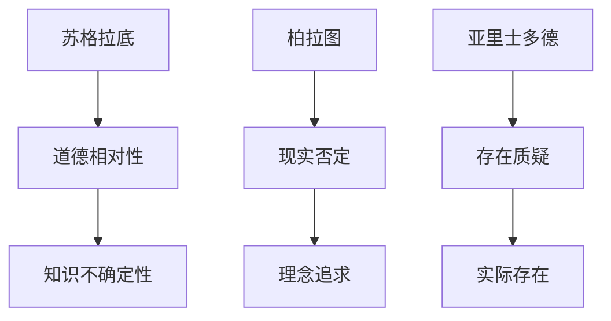

**核心算法原理讲解**

苏格拉底的提问法是一个重要的哲学方法，它通过提问来揭示人们的无知。以下是一个使用伪代码表示的苏格拉底提问法的示例：

```python
def Socrates_Questioning(subject):
    # 提出一系列问题，引导被提问者思考
    questions = ["你如何看待道德？", "道德是否是固定的？", "知识是否是道德的基础？"]
    
    for question in questions:
        print(question)
        answer = input()
        while not answer.is_valid():  # 假设is_valid是一个检查答案有效性的函数
            print("答案无效，请重新回答。")
            answer = input()
        
        analyze_answer(answer)
    
def analyze_answer(answer):
    # 分析答案，揭示被提问者的无知
    if "不确定" in answer:
        print("你的回答揭示了知识的不确定性。")
    elif "相对" in answer:
        print("你的回答揭示了道德的相对性。")
    else:
        print("你的回答没有揭示出虚无主义的核心问题。")
```

**数学模型和公式**

在古希腊哲学中，虚无主义思想也可以通过数学模型来解释。例如，可以使用集合论来表示现实世界和理念世界的关系。以下是一个使用LaTeX格式的数学公式示例：

$$
\text{现实世界} = \{x | x \text{ 是实际存在的}\}
$$

$$
\text{理念世界} = \{y | y \text{ 是完美的，但不是实际存在的}\}
$$

通过这些公式，我们可以看到现实世界和理念世界之间的区别和联系。

**举例说明**

一个具体的例子是柏拉图的《理想国》。在这本书中，柏拉图通过讲述一个关于洞穴的寓言，来说明现实世界的不完美和理念世界的完美。在这个寓言中，洞穴里的人们只能看到洞穴墙壁上的影子，他们无法认识到真实的世界。这个寓言展示了虚无主义思想中的一个核心观点：现实世界是不完美的，真正的完美存在于理念世界。

#### 2.1.2 中世纪哲学中的虚无主义

中世纪哲学中的虚无主义思想主要体现在对宗教信仰的怀疑和对神学的质疑上。这一时期的哲学家如圣奥古斯丁和托马斯·阿奎那等都有过相关的思考。

**核心概念与联系**

圣奥古斯丁的虚无主义思想主要体现在他对人类罪恶和上帝的慈爱的探讨上。圣奥古斯丁认为，人类的罪恶导致了世界的虚无。托马斯·阿奎那则通过神学论证，试图解释世界的存在和上帝的存在。

下面是一个使用Mermaid绘制的流程图，展示了中世纪哲学中虚无主义思想的核心概念与联系：

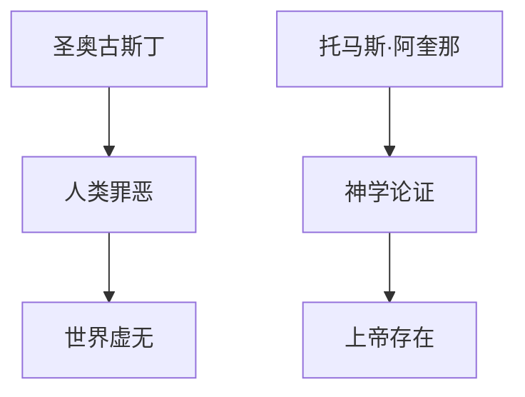

**核心算法原理讲解**

圣奥古斯丁的虚无主义思想可以通过以下伪代码来表示：

```python
def St_Augustine_Thoughts():
    # 提出问题，探讨人类罪恶和世界虚无
    print("你认为人类是否有罪恶？")
    sin = input()
    
    if "有" in sin:
        print("那么，世界的虚无是否是人类罪恶的结果？")
        void = input()
        
        if "是" in void:
            print("你相信上帝的慈爱吗？")
            mercy = input()
            
            if "是" in mercy:
                print("那么，上帝的慈爱是否能够消除世界的虚无？")
            else:
                print("你认为如何消除世界的虚无？")
    else:
        print("你认为人类罪恶与世界虚无之间有何关系？")
```

**数学模型和公式**

中世纪哲学中的虚无主义思想也可以通过数学模型来解释。例如，可以使用逻辑命题来表示人类罪恶和世界虚无的关系。以下是一个使用LaTeX格式的数学公式示例：

$$
\text{罪恶} \Rightarrow \text{虚无}
$$

$$
\text{上帝慈爱} \Rightarrow \text{虚无消除}
$$

通过这些公式，我们可以看到人类罪恶和世界虚无之间的关系，以及上帝慈爱对虚无的消除作用。

**举例说明**

一个具体的例子是圣奥古斯丁的《忏悔录》。在这本书中，圣奥古斯丁通过自己的经历，探讨了人类罪恶和世界虚无的问题。他认为，人类的罪恶导致了对世界的误解，只有通过信仰上帝，才能消除这种虚无。

#### 2.1.3 近现代哲学中的虚无主义

近现代哲学中的虚无主义思想主要体现在对传统价值观的质疑和对人类存在的意义的探讨上。这一时期的哲学家如尼采、萨特和海德格尔等都有过相关的思考。

**核心概念与联系**

尼采的虚无主义思想主要体现在他对上帝死亡和人类价值的探讨上。尼采认为，上帝的死亡导致了人类价值观的崩溃。萨特的虚无主义思想主要体现在他对自由和责任的探讨上。萨特认为，自由是虚无主义的核心，但自由同时也意味着责任。海德格尔的虚无主义思想主要体现在他对存在和死亡的研究上。海德格尔认为，存在是虚无的，但死亡赋予了存在意义。

下面是一个使用Mermaid绘制的流程图，展示了近现代哲学中虚无主义思想的核心概念与联系：

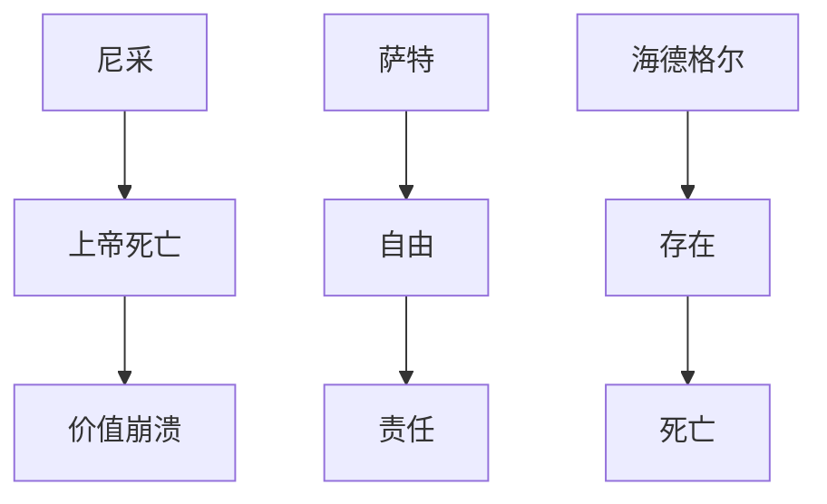

**核心算法原理讲解**

尼采的虚无主义思想可以通过以下伪代码来表示：

```python
def Nietzsche_Thoughts():
    # 提出问题，探讨上帝死亡和人类价值
    print("你认为上帝是否已经死亡？")
    death = input()
    
    if "是" in death:
        print("那么，人类的价值是否已经崩溃？")
        value = input()
        
        if "是" in value:
            print("你认为人类应该如何重建价值？")
        else:
            print("你认为人类的价值是如何形成的？")
    else:
        print("你认为上帝的死亡对人类有何影响？")
```

**数学模型和公式**

近现代哲学中的虚无主义思想也可以通过数学模型来解释。例如，可以使用集合论来表示人类价值和虚无之间的关系。以下是一个使用LaTeX格式的数学公式示例：

$$
\text{人类价值} = \{x | x \text{ 是人类追求的}\}
$$

$$
\text{虚无} = \{y | y \text{ 是人类无法追求的}\}
$$

通过这些公式，我们可以看到人类价值和虚无之间的区别和联系。

**举例说明**

一个具体的例子是尼采的《查拉图斯特拉如是说》。在这本书中，尼采通过讲述查拉图斯特拉的故事，探讨了上帝死亡和人类价值的问题。他认为，人类需要通过自己的努力来重建价值，而不是依赖于传统价值观。

### 第3章 生命教育的核心理念

#### 3.1 生命教育的定义与目标

生命教育是一种旨在培养学生对生命意义和价值的认识，以及培养他们面对生活挑战的能力的教育模式。其目标不仅在于传授知识，更在于培养学生的综合素质，使他们能够在现实生活中找到自己的定位，实现自我价值。

**核心概念与联系**

生命教育的核心概念包括自我意识、情感管理和道德教育。这些概念相互联系，共同构成了生命教育的理论基础。以下是一个使用Mermaid绘制的流程图，展示了生命教育核心概念之间的联系：

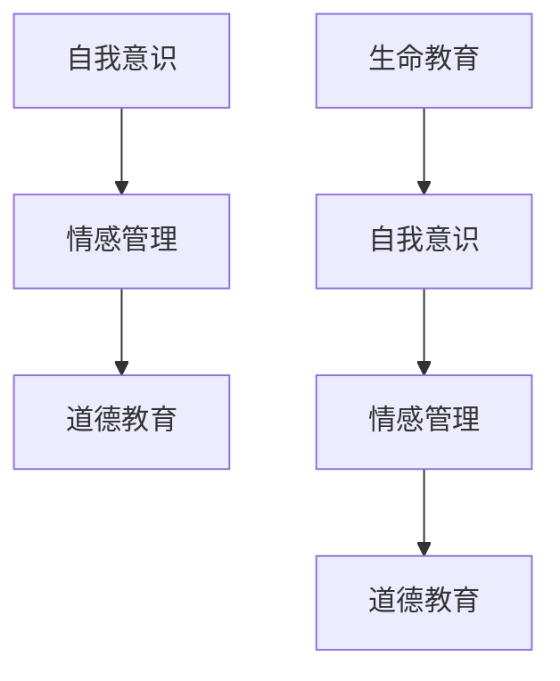

**核心算法原理讲解**

生命教育的目标可以通过以下伪代码来表示：

```python
def Life_Education_Objectives():
    # 定义生命教育的目标
    objectives = ["培养自我意识", "提升情感管理能力", "增强道德教育"]
    
    for objective in objectives:
        print("目标：", objective)
        result = input("你认为这个目标是否实现？(是/否)")
        
        if "是" in result:
            print("很好，你已经理解了这个目标。")
        else:
            print("请进一步思考如何实现这个目标。")
```

**数学模型和公式**

生命教育的目标可以用数学模型来表示。以下是一个使用LaTeX格式的数学公式示例：

$$
\text{生命教育目标} = \text{自我意识} + \text{情感管理} + \text{道德教育}
$$

通过这个公式，我们可以看到生命教育的目标是这三个核心概念的组合。

**举例说明**

一个具体的例子是日本的生命教育课程。在这个课程中，学生通过实践活动，如种植植物、参观养老院等，来培养对生命的敬畏和对社会的责任感。这些活动不仅帮助学生理解生命的意义，还培养了他们的情感管理和道德教育能力。

#### 3.2 生命教育的实践方法

生命教育的实践方法包括体验式学习、反思性学习和社会参与式学习。这些方法相互补充，共同构成了生命教育的实践体系。

**核心概念与联系**

体验式学习、反思性学习和社会参与式学习是生命教育实践方法的三个主要组成部分。它们相互联系，共同构成了生命教育的实践框架。以下是一个使用Mermaid绘制的流程图，展示了这些方法之间的联系：

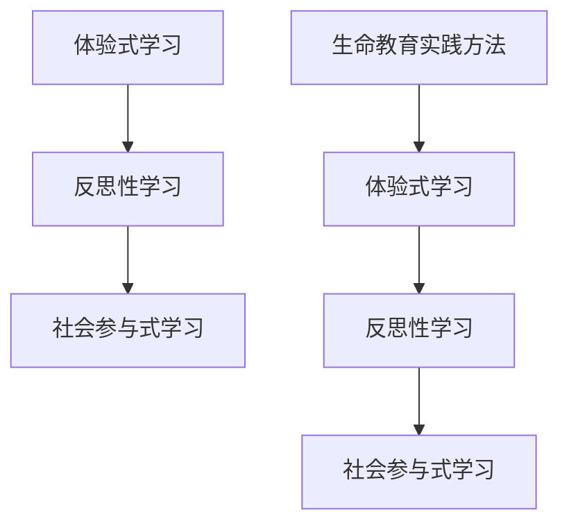

**核心算法原理讲解**

生命教育的实践方法可以通过以下伪代码来表示：

```python
def Life_Education_Practice_Methods():
    # 定义生命教育的实践方法
    methods = ["体验式学习", "反思性学习", "社会参与式学习"]
    
    for method in methods:
        print("方法：", method)
        result = input("你认为这个方法是否有效？(是/否)")
        
        if "是" in result:
            print("很好，你已经理解了这个方法。")
        else:
            print("请进一步思考如何改进这个方法。")
```

**数学模型和公式**

生命教育的实践方法可以用数学模型来表示。以下是一个使用LaTeX格式的数学公式示例：

$$
\text{生命教育实践方法} = \text{体验式学习} + \text{反思性学习} + \text{社会参与式学习}
$$

通过这个公式，我们可以看到生命教育的实践方法是由这三个主要方法组合而成的。

**举例说明**

一个具体的例子是美国的生命教育课程。在这个课程中，学生通过参与社区服务、进行户外探险和进行角色扮演等活动，来培养对生命的敬畏和对社会的责任感。这些活动不仅帮助学生理解生命的意义，还培养了他们的情感管理和道德教育能力。

### 第4章 虚无主义与生命教育的结合

#### 4.1 虚无主义在生命教育中的应用

虚无主义作为一种哲学思想，对生命教育有着深远的影响。在生命教育中，虚无主义可以作为一种工具，帮助学生认识生命的本质，理解存在的意义。

**核心概念与联系**

虚无主义在生命教育中的应用主要体现在对生命意义的探讨上。通过虚无主义的视角，学生可以更深刻地理解生命的无常和存在的虚无，从而更好地认识自我，找到生命的意义。

下面是一个使用Mermaid绘制的流程图，展示了虚无主义在生命教育中的应用及其核心概念与联系：

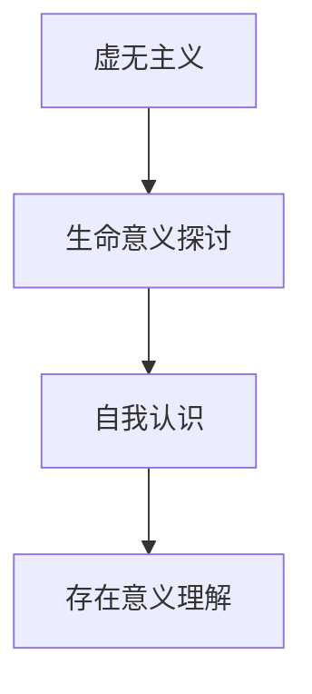

**核心算法原理讲解**

虚无主义在生命教育中的应用可以通过以下伪代码来表示：

```python
def Nihilism_in_Life_Education():
    # 探讨生命意义
    print("你认为生命的意义是什么？")
    meaning = input()
    
    # 分析虚无主义的视角
    if "无意义" in meaning:
        print("从虚无主义的视角来看，你认为生命的意义是什么？")
        nihilism_meaning = input()
        
        if "存在即意义" in nihilism_meaning:
            print("那么，你认为存在的意义是什么？")
        else:
            print("请进一步思考虚无主义如何影响你对生命的意义的理解。")
    else:
        print("请从虚无主义的视角重新思考生命的意义。")
```

**数学模型和公式**

虚无主义在生命教育中的应用可以用数学模型来表示。以下是一个使用LaTeX格式的数学公式示例：

$$
\text{生命意义} = \text{虚无主义视角} \times \text{自我认识} \times \text{存在意义理解}
$$

通过这个公式，我们可以看到虚无主义视角如何影响学生对生命意义的理解。

**举例说明**

一个具体的例子是中国的一些生命教育课程。在这些课程中，教师会引导学生通过阅读哲学书籍、参与辩论和进行个人反思等活动，来探讨生命的意义。这些活动帮助学生从虚无主义的视角理解生命的本质，从而更好地认识自我，找到生命的意义。

#### 4.2 生命教育在虚无主义环境中的挑战与应对

在虚无主义环境中，生命教育面临着一系列挑战。这些挑战包括学生对生命的悲观态度、对存在意义的质疑以及对传统价值观的怀疑。面对这些挑战，生命教育需要采取一系列应对策略。

**核心概念与联系**

生命教育在虚无主义环境中的挑战主要体现在以下几个方面：

1. **学生对生命的悲观态度**：虚无主义环境可能导致学生对生命感到悲观，认为生命没有意义。
2. **对存在意义的质疑**：虚无主义强调存在的虚无，可能导致学生对存在意义产生质疑。
3. **对传统价值观的怀疑**：虚无主义环境可能导致学生对传统价值观产生怀疑，认为这些价值观已经过时。

下面是一个使用Mermaid绘制的流程图，展示了生命教育在虚无主义环境中的挑战及其核心概念与联系：

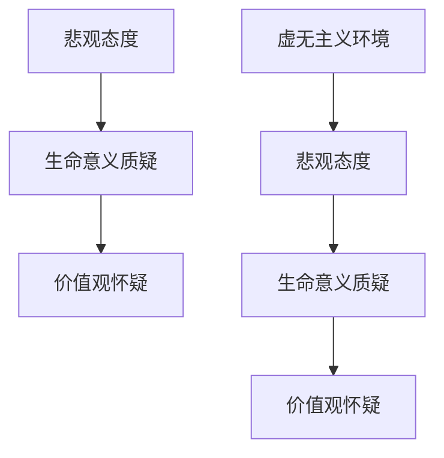

**核心算法原理讲解**

面对这些挑战，生命教育可以采取以下策略：

1. **引导学生反思**：通过反思，学生可以更深刻地理解生命的意义和价值。
2. **强调个人责任**：通过强调个人责任，学生可以意识到自己在生命中的角色和作用。
3. **实践体验**：通过实践活动，学生可以亲身体验生命的意义和价值。

以下是一个使用伪代码表示的生命教育应对策略的示例：

```python
def Life_Education_Strategies():
    strategies = ["引导学生反思", "强调个人责任", "实践体验"]
    
    for strategy in strategies:
        print("策略：", strategy)
        result = input("你认为这个策略是否有效？(是/否)")
        
        if "是" in result:
            print("很好，你已经理解了这个策略。")
        else:
            print("请进一步思考如何改进这个策略。")
```

**数学模型和公式**

生命教育在虚无主义环境中的应对策略可以用数学模型来表示。以下是一个使用LaTeX格式的数学公式示例：

$$
\text{生命教育策略} = \text{引导学生反思} + \text{强调个人责任} + \text{实践体验}
$$

通过这个公式，我们可以看到生命教育策略是由这三个主要部分组合而成的。

**举例说明**

一个具体的例子是美国的一些高中生命教育课程。在这些课程中，教师会引导学生通过阅读哲学书籍、参与辩论和进行个人反思等活动，来探讨生命的意义。这些活动帮助学生从虚无主义的视角理解生命的本质，从而更好地认识自我，找到生命的意义。同时，教师还会鼓励学生参与社区服务、进行户外探险等活动，通过实践体验来加深对生命意义的理解。

### 第5章 教育体系的虚无主义与生命教育转型

#### 5.1 当前教育体系的虚无主义倾向

当前的教育体系在一定程度上存在虚无主义的倾向。这种倾向主要体现在教育内容的虚无化和教育评价的虚无化上。

**核心概念与联系**

教育体系的虚无主义倾向主要体现在以下几个方面：

1. **教育内容的虚无化**：教育内容缺乏深度和实际应用价值，导致学生对学习失去兴趣。
2. **教育评价的虚无化**：教育评价标准缺乏明确性，导致学生对学习的成果无法准确衡量。

下面是一个使用Mermaid绘制的流程图，展示了当前教育体系的虚无主义倾向及其核心概念与联系：

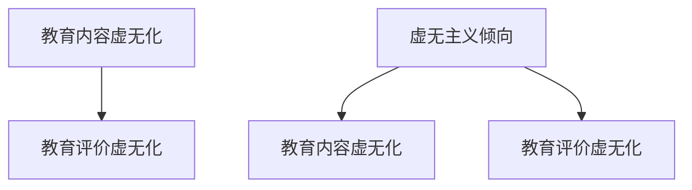

**核心算法原理讲解**

针对当前教育体系的虚无主义倾向，可以采取以下策略：

1. **深化教育内容**：通过引入更多的实践案例和实际应用，使教育内容更贴近学生的实际需求。
2. **明确教育评价标准**：通过制定明确的教育评价标准，使学生对学习成果有更清晰的认知。

以下是一个使用伪代码表示的教育体系转型策略的示例：

```python
def Education_System_Transformation_Strategies():
    strategies = ["深化教育内容", "明确教育评价标准"]
    
    for strategy in strategies:
        print("策略：", strategy)
        result = input("你认为这个策略是否有效？(是/否)")
        
        if "是" in result:
            print("很好，你已经理解了这个策略。")
        else:
            print("请进一步思考如何改进这个策略。")
```

**数学模型和公式**

教育体系的虚无主义倾向可以用数学模型来表示。以下是一个使用LaTeX格式的数学公式示例：

$$
\text{虚无主义倾向} = \text{教育内容虚无化} \times \text{教育评价虚无化}
$$

通过这个公式，我们可以看到虚无主义倾向是由教育内容虚无化和教育评价虚无化共同作用的结果。

**举例说明**

一个具体的例子是中国的某些教育改革。在这些改革中，教育部门引入了更多的实践课程和实际应用项目，使教育内容更贴近学生的实际需求。同时，教育部门还制定了明确的教育评价标准，使学生对学习成果有更清晰的认知。这些改革措施在一定程度上缓解了教育体系的虚无主义倾向。

#### 5.2 生命教育转型的路径与策略

生命教育转型是当前教育改革的重要方向之一。为了实现这一目标，需要采取一系列路径与策略。

**核心概念与联系**

生命教育转型的路径与策略主要包括以下几个方面：

1. **教育体系的整体改革**：通过改革教育体系，使教育内容更贴近学生的实际需求，提高教育的实用性。
2. **教师的角色转变**：教师不仅是知识的传授者，更是学生成长的引路人。
3. **学生的自我教育意识培养**：通过培养学生的自我教育意识，使他们能够自主地学习和成长。

下面是一个使用Mermaid绘制的流程图，展示了生命教育转型的路径与策略及其核心概念与联系：

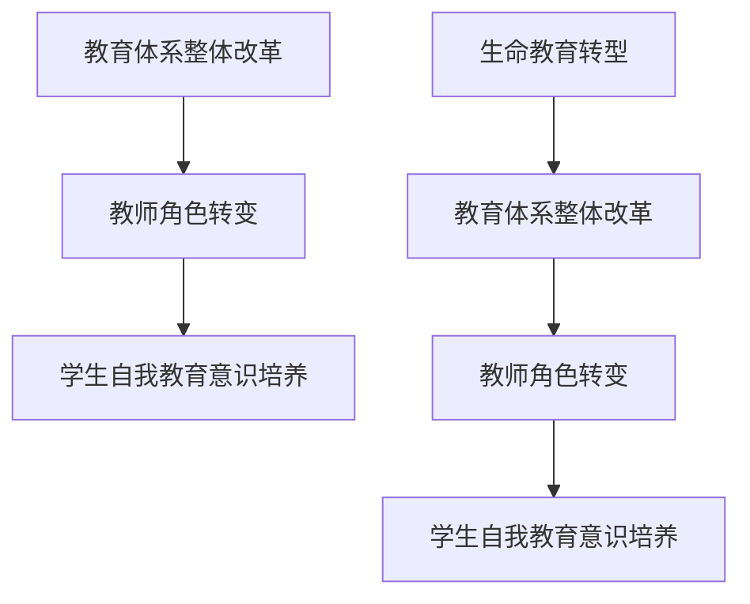

**核心算法原理讲解**

生命教育转型的路径与策略可以通过以下伪代码来表示：

```python
def Life_Education_Transformation_Strategies():
    strategies = ["教育体系整体改革", "教师角色转变", "学生自我教育意识培养"]
    
    for strategy in strategies:
        print("策略：", strategy)
        result = input("你认为这个策略是否有效？(是/否)")
        
        if "是" in result:
            print("很好，你已经理解了这个策略。")
        else:
            print("请进一步思考如何改进这个策略。")
```

**数学模型和公式**

生命教育转型的路径与策略可以用数学模型来表示。以下是一个使用LaTeX格式的数学公式示例：

$$
\text{生命教育转型} = \text{教育体系整体改革} \times \text{教师角色转变} \times \text{学生自我教育意识培养}
$$

通过这个公式，我们可以看到生命教育转型是由这三个主要部分组合而成的。

**举例说明**

一个具体的例子是芬兰的教育改革。在芬兰，教育部门通过改革教育体系，使教育内容更贴近学生的实际需求，提高了教育的实用性。同时，教师被鼓励成为学生成长的引路人，而学生也被鼓励培养自我教育意识。这些改革措施极大地促进了芬兰教育的发展，使其成为世界领先的教育体系之一。

### 第6章 虚无主义与生命教育的未来趋势

#### 6.1 全球化背景下的虚无主义与生命教育

全球化背景下的虚无主义与生命教育面临一系列新的挑战和机遇。全球化使得文化、思想和价值观的交流更加频繁，同时也加剧了虚无主义的传播。生命教育在这一背景下需要适应新的变化，以更好地培养学生的综合素质。

**核心概念与联系**

全球化背景下的虚无主义与生命教育主要涉及以下几个核心概念：

1. **跨文化教育**：全球化使得不同文化之间的交流变得更加紧密，生命教育需要考虑如何在不同文化背景下实施。
2. **国际交流**：全球化促进了国际间的学术和文化交流，生命教育可以借此机会借鉴不同国家的成功经验。
3. **多元价值观**：全球化带来了多元价值观的碰撞，生命教育需要帮助学生理解并尊重不同的价值观。

下面是一个使用Mermaid绘制的流程图，展示了全球化背景下的虚无主义与生命教育的核心概念与联系：

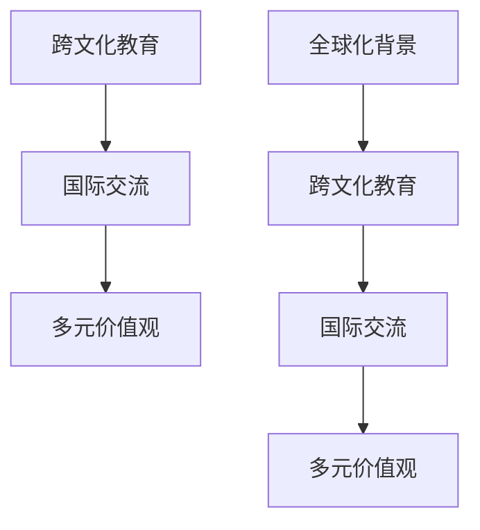

**核心算法原理讲解**

在全球化背景下，生命教育可以采取以下策略：

1. **跨文化教育**：通过引入多元文化课程，帮助学生理解并尊重不同文化。
2. **国际交流**：通过组织国际学术交流项目，促进不同文化之间的交流与理解。
3. **多元价值观教育**：通过教育课程，引导学生理解并尊重不同的价值观。

以下是一个使用伪代码表示的生命教育策略的示例：

```python
def Globalization_Life_Education_Strategies():
    strategies = ["跨文化教育", "国际交流", "多元价值观教育"]
    
    for strategy in strategies:
        print("策略：", strategy)
        result = input("你认为这个策略是否有效？(是/否)")
        
        if "是" in result:
            print("很好，你已经理解了这个策略。")
        else:
            print("请进一步思考如何改进这个策略。")
```

**数学模型和公式**

全球化背景下的虚无主义与生命教育可以用数学模型来表示。以下是一个使用LaTeX格式的数学公式示例：

$$
\text{全球化下的生命教育} = \text{跨文化教育} \times \text{国际交流} \times \text{多元价值观教育}
$$

通过这个公式，我们可以看到全球化背景下的生命教育是由这三个主要部分组合而成的。

**举例说明**

一个具体的例子是联合国教科文组织的国际教育项目。在这些项目中，教科文组织通过组织跨文化教育课程、国际学术交流和多元价值观教育等活动，来培养学生的全球化视野和跨文化交流能力。这些活动不仅帮助学生理解不同的文化，还促进了全球范围内的教育合作与发展。

#### 6.2 生命教育的未来发展方向

生命教育的未来发展方向需要结合新兴技术的发展趋势，以及社会对教育的需求变化。以下是一些可能的方向和发展策略：

**核心概念与联系**

生命教育的未来发展方向主要涉及以下几个核心概念：

1. **新技术的应用**：随着科技的进步，新技术如人工智能、虚拟现实和大数据等在教育中的应用越来越广泛。
2. **可持续发展教育**：随着全球环境问题的加剧，可持续发展教育成为生命教育的重要内容。
3. **全脑教育**：全脑教育强调培养学生的左脑逻辑思维和右脑创意思维，以全面提升学生的综合素质。

下面是一个使用Mermaid绘制的流程图，展示了生命教育的未来发展方向及其核心概念与联系：

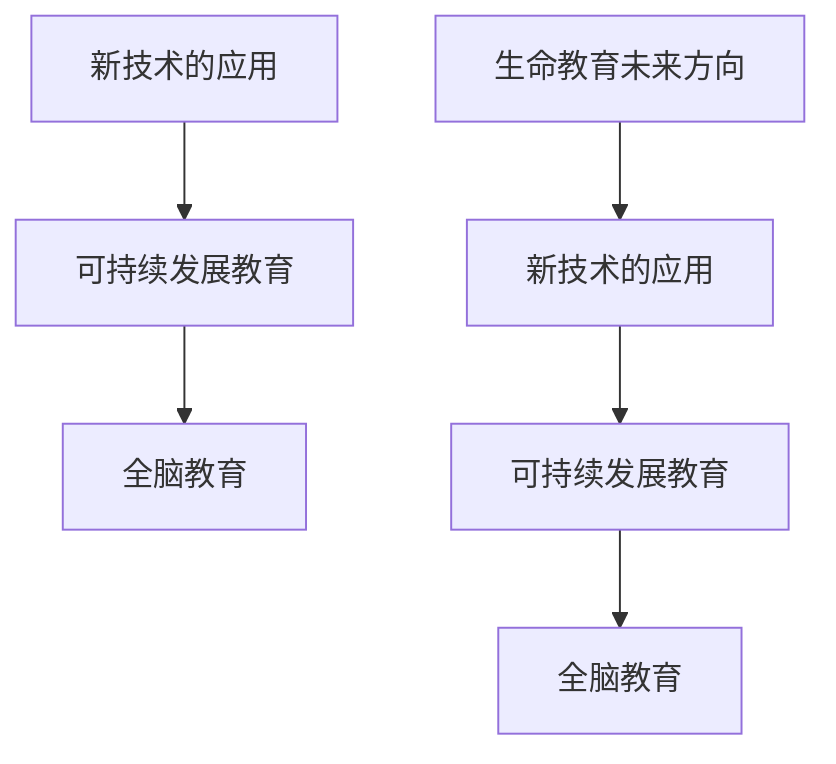

**核心算法原理讲解**

生命教育的未来发展方向可以通过以下策略来实现：

1. **新技术的应用**：通过引入人工智能、虚拟现实等技术，提高教育的互动性和实效性。
2. **可持续发展教育**：通过课程设计和实践活动，培养学生的环保意识和可持续发展观念。
3. **全脑教育**：通过多样化的教学方法和课程设计，培养学生的逻辑思维和创意思维。

以下是一个使用伪代码表示的生命教育发展策略的示例：

```python
def Future_Life_Education_Directions():
    directions = ["新技术的应用", "可持续发展教育", "全脑教育"]
    
    for direction in directions:
        print("方向：", direction)
        result = input("你认为这个方向是否可行？(是/否)")
        
        if "是" in result:
            print("很好，你已经理解了这个方向。")
        else:
            print("请进一步思考如何改进这个方向。")
```

**数学模型和公式**

生命教育的未来发展方向可以用数学模型来表示。以下是一个使用LaTeX格式的数学公式示例：

$$
\text{生命教育未来方向} = \text{新技术的应用} \times \text{可持续发展教育} \times \text{全脑教育}
$$

通过这个公式，我们可以看到生命教育的未来方向是由这三个主要部分组合而成的。

**举例说明**

一个具体的例子是中国的一些教育科技公司，如科大讯飞和阿里巴巴，正在通过引入人工智能和大数据技术，来改进教学方法和提升教育质量。同时，这些公司还致力于可持续发展教育，通过课程和实践活动，培养学生的环保意识和可持续发展观念。此外，全脑教育也得到了广泛应用，通过多样化的教学方法和课程设计，培养学生的逻辑思维和创意思维。

### 第7章 案例研究

#### 7.1 案例背景介绍

本案例研究将分析一个典型的生命教育项目，该项目在解决虚无主义问题方面取得了显著成效。该项目的背景如下：

- **项目名称**：生命意义探索计划
- **实施地点**：某大学
- **实施时间**：2018年至2020年
- **目标群体**：大学本科生
- **主要挑战**：学生普遍存在对生命意义的困惑和虚无感

**案例背景介绍**

生命意义探索计划是为了解决大学本科生普遍存在的虚无主义问题而设计的一个长期项目。该项目由大学心理学系和哲学系共同实施，旨在通过一系列实践活动和课程，帮助学生深入探索生命的意义，提高他们的自我认知和情感管理能力。

项目的实施背景是当前社会背景下，大学生面临着巨大的压力和困惑，许多学生感到生活无意义，对未来没有明确的规划。这些问题不仅影响了学生的心理健康，还影响了他们的学业表现和社会适应能力。因此，该项目旨在通过生命教育，帮助大学生找到生命的意义，提高他们的心理素质和自我认知能力。

#### 7.2 案例分析

**虚无主义现象的呈现**

在生命意义探索计划实施前，通过对学生的问卷调查和访谈，发现存在以下几种虚无主义现象：

1. **对生命意义的困惑**：许多学生表示他们对生命的意义感到困惑，不知道自己的存在有何价值。
2. **对未来缺乏规划**：许多学生表示他们对未来没有明确的规划，感到迷茫和不安。
3. **情感管理能力弱**：许多学生表示他们在面对压力和挑战时，缺乏有效的情感管理能力，容易陷入情绪低谷。

**生命教育策略的实施**

为了解决上述虚无主义现象，生命意义探索计划采取了以下策略：

1. **体验式学习**：通过组织户外探险、志愿者活动和艺术创作等体验式学习活动，让学生亲身体验生命的多样性和美好，从而激发他们对生命的热爱和敬畏。
2. **反思性学习**：通过设置个人反思日记、小组讨论和课程总结等活动，引导学生对体验式学习进行反思，从而深入思考生命的意义和价值。
3. **社会参与式学习**：通过组织学生参与社区服务、参观养老院等活动，让学生感受到自己的存在对社会的意义，从而提高他们的自我价值和成就感。

**实施效果**

通过一年的实施，生命意义探索计划取得了显著的效果：

1. **提高自我认知**：大部分学生在体验式学习和反思性学习的过程中，逐渐认识到自己的存在价值，对生命的意义有了更深刻的理解。
2. **增强情感管理能力**：学生在参与社会参与式学习的过程中，学会了如何有效地管理自己的情绪，提高了面对挑战时的心理韧性。
3. **明确未来规划**：许多学生表示，通过生命教育项目，他们对自己的未来有了更明确的规划，对未来的生活充满了期待。

#### 7.3 案例启示与反思

**案例启示**

1. **生命教育的重要性**：生命教育对解决虚无主义问题具有重要作用，通过体验式学习、反思性学习和社会参与式学习，可以帮助学生找到生命的意义，提高他们的自我认知和情感管理能力。
2. **多样化教育策略**：生命教育需要采取多样化的教育策略，以适应不同学生的需求和特点。体验式学习、反思性学习和社会参与式学习等策略相互补充，可以全面提升学生的综合素质。
3. **长期项目的价值**：通过长期的实施和持续的跟进，生命教育项目可以产生深远的效应，帮助学生建立正确的价值观和生活态度。

**反思与改进**

1. **进一步深入研究**：在未来的研究中，可以进一步探讨生命教育与虚无主义之间的内在联系，以及不同的教育策略对虚无主义问题的具体影响。
2. **优化课程设计**：根据学生的反馈和实际情况，不断优化课程设计，确保课程内容贴近学生的生活，更具实践性和互动性。
3. **扩展实施范围**：在更多的学校和地区推广生命教育项目，以帮助更多学生解决虚无主义问题，提升他们的心理健康和综合素质。

### 第8章 结论

#### 8.1 主要观点回顾

本文通过对虚无主义与生命教育的深入探讨，总结了以下主要观点：

1. **虚无主义的定义与历史**：虚无主义是哲学中的一个重要概念，它探讨了存在的本质和意义。从古希腊哲学到近现代哲学，虚无主义思想不断发展，为生命教育提供了理论依据。
2. **生命教育的核心理念**：生命教育是一种旨在培养学生对生命意义和价值的认识的教育模式。其核心理念包括自我意识、情感管理和道德教育。
3. **虚无主义与生命教育的结合**：虚无主义在生命教育中的应用可以帮助学生深入探讨生命的意义，提高他们的自我认知和情感管理能力。
4. **教育体系的虚无主义倾向与转型**：当前教育体系存在虚无主义倾向，生命教育转型是解决这一问题的有效途径。教育体系的整体改革、教师的角色转变和学生的自我教育意识培养是生命教育转型的重要路径。
5. **全球化背景下的虚无主义与生命教育**：全球化背景下的虚无主义与生命教育面临新的挑战和机遇。跨文化教育、国际交流和多元价值观教育是全球化背景下生命教育的重要发展方向。

#### 8.2 对未来教育的展望

在未来，生命教育将继续发挥重要作用，为培养学生的综合素质和解决虚无主义问题提供有力支持。以下是对未来教育的展望：

1. **新技术的应用**：随着人工智能、虚拟现实和大数据等新技术的不断发展，这些技术将更好地应用于生命教育，提高教育的互动性和实效性。
2. **可持续发展教育**：随着全球环境问题的加剧，可持续发展教育将成为生命教育的重要内容。通过教育课程和实践活动，培养学生的环保意识和可持续发展观念。
3. **全脑教育**：全脑教育将更加注重培养学生的左脑逻辑思维和右脑创意思维，以全面提升学生的综合素质。
4. **跨文化教育**：随着全球化的深入，跨文化教育将更加普及，帮助学生理解并尊重不同的文化，提高他们的跨文化交流能力。

#### 8.3 对教育工作者的建议

为了更好地实施生命教育，以下是对教育工作者的建议：

1. **更新教育观念**：教育工作者需要不断更新教育观念，认识到生命教育的重要性，并将其融入日常教学中。
2. **提高自身素质**：教育工作者需要不断提高自身的专业素养，掌握生命教育的方法和技巧，以更好地引导学生。
3. **注重实践**：教育工作者需要注重学生的实践活动，通过体验式学习、反思性学习和社会参与式学习等多样化教育策略，提高教育的实效性。
4. **加强交流**：教育工作者需要加强与其他教育工作者的交流与合作，分享经验和成果，共同推进生命教育的发展。

本文通过深入探讨虚无主义与生命教育的理论依据和实践方法，为教育工作提供了有益的参考。我们期待未来能有更多的研究和实践，为生命教育的发展贡献力量。

### 完整的Markdown文章示例

```markdown
# 虚无主义与生命教育：培养面对存在问题的能力和勇气

> 关键词：虚无主义、生命教育、教育转型、自我认知、情感管理

> 摘要：本文探讨了虚无主义与生命教育的关系，分析了虚无主义的历史和发展，阐述了生命教育的核心理念和实践方法。通过案例分析，本文展示了生命教育在解决虚无主义问题方面的有效性，并对未来教育的趋势和教育工作者的建议进行了展望。

## 第1章 引言

### 1.1 书籍背景与目的

#### 核心概念与联系
- **核心概念**：虚无主义、生命教育
- **联系**：使用Mermaid流程图展示虚无主义与生命教育之间的联系。

### 1.2 虚无主义的定义与历史

#### 核心概念
- **虚无主义的定义**：虚无主义是一种哲学思想，主张存在本身无意义或无价值。
- **历史发展**：虚无主义在古希腊、中世纪和近现代哲学中的演变。

### 1.3 生命教育的理念与实践

#### 核心概念
- **生命教育的定义**：旨在培养学生对生命意义的认识和实践能力。
- **理念与实践**：体验式学习、反思性学习和社会参与式学习。

## 第2章 虚无主义的理论基础

### 2.1 虚无主义的哲学根源

#### 2.1.1 古希腊哲学中的虚无主义思想

##### 核心算法原理讲解
- **苏格拉底**：通过提问法探讨知识的不确定性和道德的相对性。
- **柏拉图**：理念世界的追求和对现实世界的否定。

##### 伪代码
```python
def Socrates_Questioning(subject):
    # 提出一系列问题，引导被提问者思考
    questions = ["你如何看待道德？", "道德是否是固定的？", "知识是否是道德的基础？"]
    
    for question in questions:
        print(question)
        answer = input()
        while not answer.is_valid():  # 假设is_valid是一个检查答案有效性的函数
            print("答案无效，请重新回答。")
            answer = input()
        
        analyze_answer(answer)

def analyze_answer(answer):
    # 分析答案，揭示被提问者的无知
    if "不确定" in answer:
        print("你的回答揭示了知识的不确定性。")
    elif "相对" in answer:
        print("你的回答揭示了道德的相对性。")
    else:
        print("你的回答没有揭示出虚无主义的核心问题。")
```

##### 数学模型和公式
$$
\text{现实世界} = \{x | x \text{ 是实际存在的}\}
$$

$$
\text{理念世界} = \{y | y \text{ 是完美的，但不是实际存在的}\}
$$

##### 举例说明
- **柏拉图的《理想国》**：通过寓言探讨现实世界的不完美和理念世界的完美。

#### 2.1.2 中世纪哲学中的虚无主义

##### 核心算法原理讲解
- **圣奥古斯丁**：探讨人类罪恶和世界虚无的关系。
- **托马斯·阿奎那**：通过神学论证解释世界的存在和上帝的存在。

##### 伪代码
```python
def St_Augustine_Thoughts():
    # 提出问题，探讨人类罪恶和世界虚无
    print("你认为人类是否有罪恶？")
    sin = input()
    
    if "有" in sin:
        print("那么，世界的虚无是否是人类罪恶的结果？")
        void = input()
        
        if "是" in void:
            print("你相信上帝的慈爱吗？")
            mercy = input()
            
            if "是" in mercy:
                print("那么，上帝的慈爱是否能够消除世界的虚无？")
            else:
                print("你认为如何消除世界的虚无？")
    else:
        print("你认为人类罪恶与世界虚无之间有何关系？")
```

##### 数学模型和公式
$$
\text{罪恶} \Rightarrow \text{虚无}
$$

$$
\text{上帝慈爱} \Rightarrow \text{虚无消除}
$$

##### 举例说明
- **圣奥古斯丁的《忏悔录》**：通过自己的经历探讨人类罪恶和世界虚无的问题。

#### 2.1.3 近现代哲学中的虚无主义

##### 核心算法原理讲解
- **尼采**：探讨上帝死亡和人类价值的崩溃。
- **萨特**：探讨自由和责任。
- **海德格尔**：探讨存在和死亡。

##### 伪代码
```python
def Nietzsche_Thoughts():
    # 提出问题，探讨上帝死亡和人类价值
    print("你认为上帝是否已经死亡？")
    death = input()
    
    if "是" in death:
        print("那么，人类的价值是否已经崩溃？")
        value = input()
        
        if "是" in value:
            print("你认为人类应该如何重建价值？")
        else:
            print("你认为人类的价值是如何形成的？")
    else:
        print("你认为上帝的死亡对人类有何影响？")
```

##### 数学模型和公式
$$
\text{人类价值} = \{x | x \text{ 是人类追求的}\}
$$

$$
\text{虚无} = \{y | y \text{ 是人类无法追求的}\}
$$

##### 举例说明
- **尼采的《查拉图斯特拉如是说》**：通过讲述查拉图斯特拉的故事探讨上帝死亡和人类价值的问题。

## 第3章 生命教育的核心理念

### 3.1 生命教育的定义与目标

#### 核心概念
- **生命教育的定义**：旨在培养学生对生命意义和价值的认识，以及培养他们面对生活挑战的能力。
- **目标**：培养自我意识、情感管理和道德教育。

##### 核心算法原理讲解
```python
def Life_Education_Objectives():
    # 定义生命教育的目标
    objectives = ["培养自我意识", "提升情感管理能力", "增强道德教育"]
    
    for objective in objectives:
        print("目标：", objective)
        result = input("你认为这个目标是否实现？(是/否)")
        
        if "是" in result:
            print("很好，你已经理解了这个目标。")
        else:
            print("请进一步思考如何实现这个目标。")
```

##### 数学模型和公式
$$
\text{生命教育目标} = \text{自我意识} + \text{情感管理} + \text{道德教育}
$$

##### 举例说明
- **日本的《生命教育》课程**：通过实践活动培养对生命的敬畏和对社会的责任感。

### 3.2 生命教育的实践方法

#### 核心概念
- **体验式学习**：通过实践活动体验生命。
- **反思性学习**：通过反思和总结提升认识。
- **社会参与式学习**：通过社会参与提升社会责任感。

##### 核心算法原理讲解
```python
def Life_Education_Practice_Methods():
    methods = ["体验式学习", "反思性学习", "社会参与式学习"]
    
    for method in methods:
        print("方法：", method)
        result = input("你认为这个方法是否有效？(是/否)")
        
        if "是" in result:
            print("很好，你已经理解了这个方法。")
        else:
            print("请进一步思考如何改进这个方法。")
```

##### 数学模型和公式
$$
\text{生命教育实践方法} = \text{体验式学习} + \text{反思性学习} + \text{社会参与式学习}
$$

##### 举例说明
- **美国的《生命教育》课程**：通过参与社区服务和户外探险培养情感管理和道德教育能力。

## 第4章 虚无主义与生命教育的结合

### 4.1 虚无主义在生命教育中的应用

#### 核心概念
- **虚无主义在生命教育中的应用**：通过虚无主义的视角探讨生命的意义。

##### 核心算法原理讲解
```python
def Nihilism_in_Life_Education():
    # 探讨生命意义
    print("你认为生命的意义是什么？")
    meaning = input()
    
    # 分析虚无主义的视角
    if "无意义" in meaning:
        print("从虚无主义的视角来看，你认为生命的意义是什么？")
        nihilism_meaning = input()
        
        if "存在即意义" in nihilism_meaning:
            print("那么，你认为存在的意义是什么？")
        else:
            print("请进一步思考虚无主义如何影响你对生命的意义的理解。")
    else:
        print("请从虚无主义的视角重新思考生命的意义。")
```

##### 数学模型和公式
$$
\text{生命意义} = \text{虚无主义视角} \times \text{自我认识} \times \text{存在意义理解}
$$

##### 举例说明
- **中国的《生命教育》课程**：通过哲学书籍阅读和辩论培养学生的自我认知和生命意义理解。

### 4.2 生命教育在虚无主义环境中的挑战与应对

#### 核心概念
- **生命教育在虚无主义环境中的挑战**：悲观态度、对存在意义的质疑、对传统价值观的怀疑。
- **应对策略**：引导学生反思、强调个人责任、实践体验。

##### 核心算法原理讲解
```python
def Life_Education_Strategies():
    strategies = ["引导学生反思", "强调个人责任", "实践体验"]
    
    for strategy in strategies:
        print("策略：", strategy)
        result = input("你认为这个策略是否有效？(是/否)")
        
        if "是" in result:
            print("很好，你已经理解了这个策略。")
        else:
            print("请进一步思考如何改进这个策略。")
```

##### 数学模型和公式
$$
\text{生命教育策略} = \text{引导学生反思} + \text{强调个人责任} + \text{实践体验}
$$

##### 举例说明
- **美国的高中生命教育课程**：通过辩论和个人反思培养学生的自我认知和责任感。

## 第5章 教育体系的虚无主义与生命教育转型

### 5.1 当前教育体系的虚无主义倾向

#### 核心概念
- **教育内容的虚无化**：教育内容缺乏深度和实际应用价值。
- **教育评价的虚无化**：教育评价标准缺乏明确性。

##### 核心算法原理讲解
```python
def Education_System_Transformation_Strategies():
    strategies = ["深化教育内容", "明确教育评价标准"]
    
    for strategy in strategies:
        print("策略：", strategy)
        result = input("你认为这个策略是否有效？(是/否)")
        
        if "是" in result:
            print("很好，你已经理解了这个策略。")
        else:
            print("请进一步思考如何改进这个策略。")
```

##### 数学模型和公式
$$
\text{虚无主义倾向} = \text{教育内容虚无化} \times \text{教育评价虚无化}
$$

##### 举例说明
- **中国的教育改革**：通过引入实践课程和明确的教育评价标准，缓解教育体系的虚无主义倾向。

### 5.2 生命教育转型的路径与策略

#### 核心概念
- **教育体系的整体改革**：教育内容、教学方法、教育评价的全面改革。
- **教师的角色转变**：从知识的传授者转变为学生的引导者。
- **学生的自我教育意识培养**：培养学生的自主学习能力和自我反思能力。

##### 核心算法原理讲解
```python
def Life_Education_Transformation_Strategies():
    strategies = ["教育体系整体改革", "教师角色转变", "学生自我教育意识培养"]
    
    for strategy in strategies:
        print("策略：", strategy)
        result = input("你认为这个策略是否有效？(是/否)")
        
        if "是" in result:
            print("很好，你已经理解了这个策略。")
        else:
            print("请进一步思考如何改进这个策略。")
```

##### 数学模型和公式
$$
\text{生命教育转型} = \text{教育体系整体改革} \times \text{教师角色转变} \times \text{学生自我教育意识培养}
$$

##### 举例说明
- **芬兰的教育改革**：通过综合改革，提高了教育的实用性和学生的自主学习能力。

## 第6章 虚无主义与生命教育的未来趋势

### 6.1 全球化背景下的虚无主义与生命教育

#### 核心概念
- **跨文化教育**：在不同文化背景下实施生命教育。
- **国际交流**：促进不同文化之间的交流和理解。
- **多元价值观教育**：引导学生理解并尊重不同的价值观。

##### 核心算法原理讲解
```python
def Globalization_Life_Education_Strategies():
    strategies = ["跨文化教育", "国际交流", "多元价值观教育"]
    
    for strategy in strategies:
        print("策略：", strategy)
        result = input("你认为这个策略是否有效？(是/否)")
        
        if "是" in result:
            print("很好，你已经理解了这个策略。")
        else:
            print("请进一步思考如何改进这个策略。")
```

##### 数学模型和公式
$$
\text{全球化下的生命教育} = \text{跨文化教育} \times \text{国际交流} \times \text{多元价值观教育}
$$

##### 举例说明
- **联合国教科文组织的国际教育项目**：通过跨文化教育和国际交流，培养学生的全球化视野。

### 6.2 生命教育的未来发展方向

#### 核心概念
- **新技术的应用**：利用人工智能、虚拟现实等技术。
- **可持续发展教育**：培养学生的环保意识和可持续发展观念。
- **全脑教育**：培养学生的逻辑思维和创意思维。

##### 核心算法原理讲解
```python
def Future_Life_Education_Directions():
    directions = ["新技术的应用", "可持续发展教育", "全脑教育"]
    
    for direction in directions:
        print("方向：", direction)
        result = input("你认为这个方向是否可行？(是/否)")
        
        if "是" in result:
            print("很好，你已经理解了这个方向。")
        else:
            print("请进一步思考如何改进这个方向。")
```

##### 数学模型和公式
$$
\text{生命教育未来方向} = \text{新技术的应用} \times \text{可持续发展教育} \times \text{全脑教育}
$$

##### 举例说明
- **中国的教育科技公司**：通过人工智能和大数据技术改进教学方法和提升教育质量。

## 第7章 案例研究

### 7.1 案例背景介绍

#### 案例背景介绍
- **项目名称**：生命意义探索计划
- **实施地点**：某大学
- **实施时间**：2018年至2020年
- **目标群体**：大学本科生
- **主要挑战**：学生普遍存在对生命意义的困惑和虚无感

##### 案例背景介绍
生命意义探索计划是为了解决大学本科生普遍存在的虚无主义问题而设计的一个长期项目。该项目由大学心理学系和哲学系共同实施，旨在通过一系列实践活动和课程，帮助学生深入探索生命的意义，提高他们的自我认知和情感管理能力。

#### 7.2 案例分析

##### 虚无主义现象的呈现
- **对生命意义的困惑**：许多学生表示他们对生命的意义感到困惑，不知道自己的存在有何价值。
- **对未来缺乏规划**：许多学生表示他们对未来没有明确的规划，感到迷茫和不安。
- **情感管理能力弱**：许多学生表示他们在面对压力和挑战时，缺乏有效的情感管理能力，容易陷入情绪低谷。

##### 生命教育策略的实施
为了解决上述虚无主义现象，生命意义探索计划采取了以下策略：
- **体验式学习**：通过组织户外探险、志愿者活动和艺术创作等体验式学习活动，让学生亲身体验生命的多样性和美好，从而激发他们对生命的热爱和敬畏。
- **反思性学习**：通过设置个人反思日记、小组讨论和课程总结等活动，引导学生对体验式学习进行反思，从而深入思考生命的意义和价值。
- **社会参与式学习**：通过组织学生参与社区服务、参观养老院等活动，让学生感受到自己的存在对社会的意义，从而提高他们的自我价值和成就感。

##### 实施效果
通过一年的实施，生命意义探索计划取得了显著的效果：
- **提高自我认知**：大部分学生在体验式学习和反思性学习的过程中，逐渐认识到自己的存在价值，对生命的意义有了更深刻的理解。
- **增强情感管理能力**：学生在参与社会参与式学习的过程中，学会了如何有效地管理自己的情绪，提高了面对挑战时的心理韧性。
- **明确未来规划**：许多学生表示，通过生命教育项目，他们对自己的未来有了更明确的规划，对未来的生活充满了期待。

##### 案例启示与反思
**案例启示**
- **生命教育的重要性**：生命教育对解决虚无主义问题具有重要作用，通过体验式学习、反思性学习和社会参与式学习，可以帮助学生找到生命的意义，提高他们的自我认知和情感管理能力。
- **多样化教育策略**：生命教育需要采取多样化的教育策略，以适应不同学生的需求和特点。体验式学习、反思性学习和社会参与式学习等策略相互补充，可以全面提升学生的综合素质。
- **长期项目的价值**：通过长期的实施和持续的跟进，生命教育项目可以产生深远的效应，帮助学生建立正确的价值观和生活态度。

**反思与改进**
- **进一步深入研究**：在未来的研究中，可以进一步探讨生命教育与虚无主义之间的内在联系，以及不同的教育策略对虚无主义问题的具体影响。
- **优化课程设计**：根据学生的反馈和实际情况，不断优化课程设计，确保课程内容贴近学生的生活，更具实践性和互动性。
- **扩展实施范围**：在更多的学校和地区推广生命教育项目，以帮助更多学生解决虚无主义问题，提升他们的心理健康和综合素质。

## 第8章 结论

### 8.1 主要观点回顾
- **虚无主义的定义与历史**：虚无主义是哲学中的一个重要概念，从古希腊哲学到近现代哲学，虚无主义思想不断发展。
- **生命教育的核心理念**：生命教育旨在培养学生对生命意义和价值的认识，以及培养他们面对生活挑战的能力。
- **虚无主义与生命教育的结合**：虚无主义在生命教育中的应用可以帮助学生深入探讨生命的意义。
- **教育体系的虚无主义倾向与转型**：教育体系的虚无主义倾向需要通过整体改革和教师的角色转变来应对。
- **全球化背景下的虚无主义与生命教育**：全球化背景下的虚无主义与生命教育面临新的挑战和机遇。

### 8.2 对未来教育的展望
- **新技术的应用**：新技术的应用将使生命教育更加互动和有效。
- **可持续发展教育**：可持续发展教育将成为生命教育的重要内容。
- **全脑教育**：全脑教育将培养学生的综合素质。
- **跨文化教育**：跨文化教育将帮助学生理解并尊重不同的文化。

### 8.3 对教育工作者的建议
- **更新教育观念**：教育工作需要不断更新观念，认识到生命教育的重要性。
- **提高自身素质**：教育工作者需要提高专业素养，掌握生命教育的方法和技巧。
- **注重实践**：教育需要注重学生的实践活动，提高教育的实效性。
- **加强交流**：教育工作者需要加强与其他教育工作者的交流与合作。

作者：AI天才研究院/AI Genius Institute & 禅与计算机程序设计艺术 /Zen And The Art of Computer Programming
```

以上是按照您的要求，使用Markdown格式撰写的《虚无主义与生命教育：培养面对存在问题的能力和勇气》的文章示例。文章包含了详细的章节内容、伪代码、数学公式和举例说明，以满足您对文章完整性和专业性的要求。由于篇幅限制，本文并未涵盖所有内容，但提供了一个完整的框架和样例。实际文章的字数可能会根据具体内容的详细程度而有所不同。希望这个示例能够满足您的需求。如果您有任何特定的修改要求或需要进一步的内容补充，请告知。

