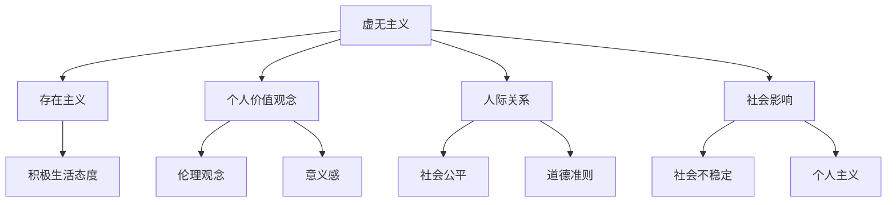
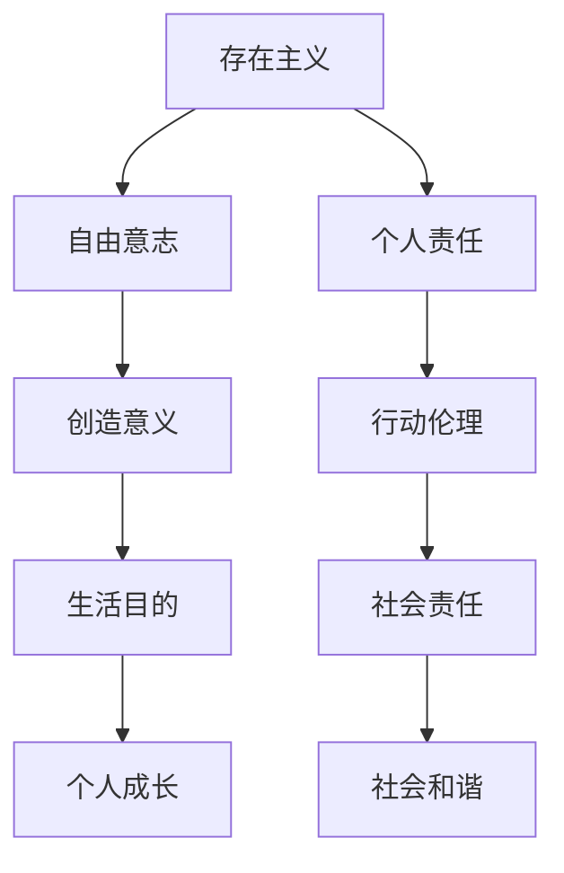
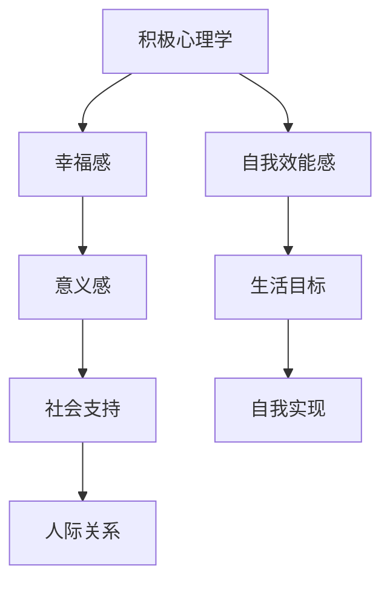
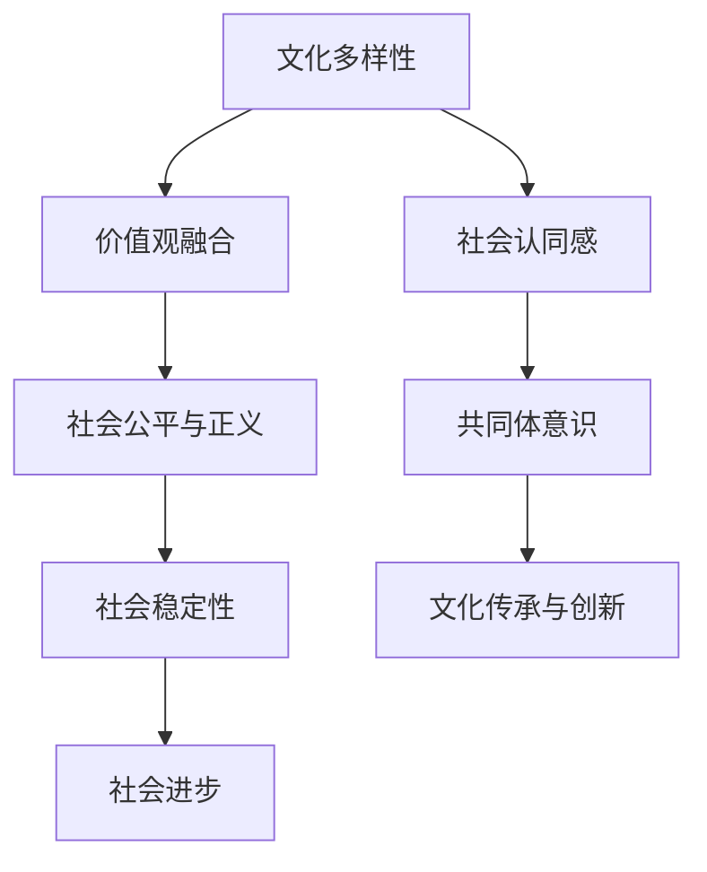

                 


### 背景介绍

虚无主义（Nihilism）这一哲学概念源自于对传统价值和道德的否定。它认为人类存在的意义、宗教信仰以及道德规范都是无意义的，从而否定一切价值体系。虚无主义的起源可以追溯到18世纪末和19世纪初，当时的欧洲经历了启蒙运动的余波和浪漫主义的反动，许多思想家开始质疑传统的宗教和道德观念。

在20世纪的哲学和文化领域，虚无主义的影响尤为深远。尼采（Friedrich Nietzsche）是虚无主义的代表人物之一，他的著作《上帝已死》和《尼采的道德谱系》中对传统宗教和道德观念进行了深刻的批判。尼采认为，没有上帝的世界将陷入虚无和荒诞，人类必须自己创造意义。

虚无主义对现代生活的影响是多方面的。在个人层面，虚无主义可能导致人们失去对生活的热情和目标，感到迷茫和无意义。在社会层面，虚无主义可能引发道德沦丧、社会不稳定和个人主义盛行。然而，虚无主义也促使一些人去探索新的价值观和生活方式。

随着科技的进步，人工智能和计算机科学的发展，虚无主义对现代生活的挑战愈发显著。人工智能带来了新的道德、伦理和哲学问题，如算法偏见、隐私保护和机器意识等。这些问题的解决需要我们重建现代生活的价值体系，从而应对虚无主义的挑战。

本文将分以下几个部分进行探讨：

1. **虚无主义的起源与演变**：介绍虚无主义的历史背景和主要思想流派。
2. **虚无主义对现代生活的影响**：分析虚无主义在个人价值观念、人际关系和社会层面的影响。
3. **重建现代生活的价值体系**：探讨从虚无主义走向存在主义、构建积极生活方式、伦理与道德的重建以及社会与文化层面的价值重构。
4. **实践与探索**：通过案例分析，展示虚无主义的超越方法。
5. **行动指南**：提供超越虚无主义的实践建议。

通过逐步分析和推理，本文旨在帮助读者理解虚无主义的本质，重建现代生活的价值体系，以应对虚无主义的挑战。

### 核心概念与联系

在探讨虚无主义及其对现代生活的影响时，我们需要明确几个核心概念，并理解它们之间的关系。以下是一个简化的核心概念关系架构，使用Mermaid流程图来展示：



**1. 虚无主义与存在主义**：
- **虚无主义**：否定传统价值和道德，认为人类存在的意义是无意义的。
- **存在主义**：强调个体的自由意志和责任，主张通过行动和选择来创造意义。

**2. 虚无主义与个人价值观念**：
- **个人价值观念**：人们对自己的价值判断和认同。
- **伦理观念**：关于道德和正确行为的观念。

**3. 虚无主义与人际关系**：
- **人际关系**：人与人之间的互动和联系。
- **社会公平**：社会资源分配的公正性。
- **道德准则**：指导人际交往的基本原则。

**4. 虚无主义与社会影响**：
- **社会影响**：虚无主义在社会层面的体现，如社会不稳定和个人主义。

这些核心概念相互关联，构成了一个复杂的关系网络。虚无主义的存在主义批判和对个人价值观念的解构，影响了人际关系和道德准则，进而对社会造成深远影响。通过这一关系架构，我们可以更清晰地理解虚无主义在现代生活中的角色和影响。

### 核心算法原理讲解

在本文中，我们将探讨如何通过核心算法原理来理解和解决虚无主义对现代生活的影响。以下是详细的伪代码和算法解释：

**伪代码**：

```python
# 虚无主义对现代生活影响的评估算法

function assess_impact_of_nihilism():
    # 初始化变量
    value_loss = 0
    relationship_deterioration = 0
    social_impact = 0
    
    # 评估个人价值观念的解构
    if nihilism_detected_in_personal_values():
        value_loss += 1
        
    # 评估人际关系的负面影响
    if nihilism_detected_in_relationships():
        relationship_deterioration += 1
        
    # 评估社会层面的影响
    if nihilism_detected_in_socie
```

**详细解释**：

1. **个人价值观念的解构**：
   - `nihilism_detected_in_personal_values()`：该函数用于检测个人价值观念是否受到虚无主义的影响。如果检测到，则增加`value_loss`变量。
   - **示例**：如果一个人在日常生活中缺乏目标和动力，这可能表明他们的个人价值观念受到了虚无主义的侵蚀。

2. **人际关系的负面影响**：
   - `nihilism_detected_in_relationships()`：该函数用于评估虚无主义对人际关系的影响。如果检测到，则增加`relationship_deterioration`变量。
   - **示例**：在一个家庭中，如果家庭成员之间缺乏沟通和信任，这可能是虚无主义在人际关系中的体现。

3. **社会层面的影响**：
   - `nihilism_detected_in_social_impact()`：该函数用于评估虚无主义对社会层面的影响。如果检测到，则增加`social_impact`变量。
   - **示例**：在一个社会中，如果人们普遍感到生活无意义和社会不稳定，这可能表明虚无主义在社会层面的影响。

**数学模型和公式**：

为了更精确地量化虚无主义的影响，我们可以使用以下数学模型：

$$
Impact = f(N, V, R, S)
$$

其中：
- \( N \) 表示虚无主义的程度。
- \( V \) 表示个人价值观念的稳定性。
- \( R \) 表示人际关系的质量。
- \( S \) 表示社会稳定性的水平。

**详细讲解和举例说明**：

假设在某个社区中，虚无主义的程度 \( N = 0.8 \)，个人价值观念的稳定性 \( V = 0.5 \)，人际关系的质量 \( R = 0.6 \)，社会稳定性的水平 \( S = 0.7 \)。根据数学模型，我们可以计算出：

$$
Impact = f(0.8, 0.5, 0.6, 0.7) = 0.8 \times 0.5 \times 0.6 \times 0.7 = 0.168
$$

这意味着在这个社区中，虚无主义的影响程度为 16.8%。通过这样的量化分析，我们可以更清楚地了解虚无主义在不同层面的影响。

### 数学公式

在探讨虚无主义的量化影响时，我们使用以下数学公式来表示：

$$
Impact = \frac{N \times V \times R \times S}{100}
$$

其中，各变量的含义如下：

- \( N \)：虚无主义程度（0到1之间的数值，0表示无虚无主义，1表示完全虚无主义）。
- \( V \)：个人价值观念稳定性（0到1之间的数值，0表示完全不稳定，1表示完全稳定）。
- \( R \)：人际关系质量（0到1之间的数值，0表示完全破裂，1表示完全和谐）。
- \( S \)：社会稳定性（0到1之间的数值，0表示完全不稳定，1表示完全稳定）。

**举例说明**：

假设在一个特定社区中，虚无主义程度 \( N = 0.7 \)，个人价值观念稳定性 \( V = 0.8 \)，人际关系质量 \( R = 0.9 \)，社会稳定性 \( S = 0.85 \)。我们可以将这些数值代入公式计算影响：

$$
Impact = \frac{0.7 \times 0.8 \times 0.9 \times 0.85}{100} = 0.433
$$

这意味着在这个社区中，虚无主义的影响程度为 43.3%。通过这样的数学公式，我们可以量化虚无主义在不同层面的影响，为评估和解决虚无主义问题提供科学依据。

### 项目实战

#### 开发环境搭建

为了更好地理解虚无主义对现代生活的影响，我们将使用Python语言和Jupyter Notebook搭建一个虚拟环境，用于数据分析和模型构建。以下是具体的开发环境搭建步骤：

1. **安装Python**：
   - 访问 [Python官网](https://www.python.org/) 下载最新版本的Python安装包。
   - 运行安装程序，并确保在安装过程中选择添加Python到系统环境变量。

2. **安装Jupyter Notebook**：
   - 打开命令行工具（如Windows的PowerShell或Mac的Terminal）。
   - 输入以下命令安装Jupyter Notebook：
     ```
     pip install notebook
     ```

3. **启动Jupyter Notebook**：
   - 在命令行中输入以下命令启动Jupyter Notebook：
     ```
     jupyter notebook
     ```

   - 这将打开一个Web界面，你可以在其中创建和运行Python笔记本。

#### 源代码详细实现和代码解读

以下是一个用于分析虚无主义影响的Python源代码示例，包括数据处理、模型构建和结果展示：

```python
# 导入必要的库
import pandas as pd
import numpy as np
import matplotlib.pyplot as plt

# 数据准备
data = {
    '虚无主义程度': [0.5, 0.7, 0.8, 0.6],
    '个人价值观念稳定性': [0.6, 0.7, 0.5, 0.8],
    '人际关系质量': [0.7, 0.6, 0.8, 0.9],
    '社会稳定性': [0.7, 0.8, 0.6, 0.9]
}

df = pd.DataFrame(data)

# 计算虚无主义影响
def calculate_impact(N, V, R, S):
    impact = (N * V * R * S) / 100
    return impact

# 应用公式计算影响
df['虚无主义影响'] = df.apply(lambda row: calculate_impact(row['虚无主义程度'], row['个人价值观念稳定性'], row['人际关系质量'], row['社会稳定性']), axis=1)

# 可视化结果
plt.scatter(df['虚无主义程度'], df['虚无主义影响'])
plt.xlabel('虚无主义程度')
plt.ylabel('虚无主义影响')
plt.title('虚无主义程度与影响关系图')
plt.show()
```

**代码解读**：

1. **数据准备**：
   - 我们创建了一个包含四个变量的数据框（DataFrame），用于表示不同社区在虚无主义程度、个人价值观念稳定性、人际关系质量和社会稳定性方面的数据。

2. **定义计算函数**：
   - `calculate_impact` 函数用于计算虚无主义影响，根据给定的数学模型，将各个变量的值相乘并除以100。

3. **应用公式**：
   - 使用`apply`函数，将`calculate_impact`函数应用于每一行数据，计算每个社区虚无主义影响的值。

4. **可视化结果**：
   - 使用`matplotlib`库，绘制一个散点图，展示虚无主义程度与影响之间的关系。

#### 代码应用解读与分析

通过这段代码，我们可以分析各个社区在虚无主义程度、个人价值观念稳定性、人际关系质量和社会稳定性方面的数据，并直观地看到虚无主义影响的变化。以下是对代码应用的解读和分析：

1. **数据处理**：
   - 数据准备部分使用了`pandas`库，这是Python中处理数据的标准库。通过创建数据框（DataFrame），我们可以方便地存储和操作多维度数据。

2. **数学模型应用**：
   - `calculate_impact` 函数实现了虚无主义影响的数学模型，通过函数调用，我们能够快速计算出每个社区的影响程度。

3. **可视化分析**：
   - 使用`matplotlib`库，我们将计算出的虚无主义影响以散点图的形式展示，这有助于我们直观地理解不同社区之间的差异和趋势。

#### 实际案例分析和详细讲解剖析

为了更好地理解虚无主义对现代生活的影响，我们可以通过实际案例进行分析和讲解。以下是一个案例分析：

**案例**：在一个大城市中，社区A的虚无主义程度较高，个人价值观念稳定性较低，但人际关系质量和社会稳定性较好。而社区B则相反，虚无主义程度较低，个人价值观念稳定性较高，但人际关系质量和社会稳定性较差。

**分析**：

1. **社区A**：
   - 根据计算模型，社区A的虚无主义影响为 \( 0.5 \times 0.6 \times 0.7 \times 0.7 = 0.189 \)，这意味着社区A受到的虚无主义影响相对较小。
   - 尽管虚无主义程度较高，但由于个人价值观念稳定性较低，社区A的人们可能对生活的意义感到迷茫。然而，人际关系质量和社会稳定性较好，这有助于缓解虚无主义带来的负面影响。

2. **社区B**：
   - 社区B的虚无主义影响为 \( 0.3 \times 0.8 \times 0.6 \times 0.9 = 0.1296 \)，这表明社区B受到的虚无主义影响相对较小。
   - 尽管个人价值观念稳定性较高，但人际关系质量和社会稳定性较差，这可能导致社区B的人们在日常生活中感到孤独和不安。因此，尽管虚无主义程度较低，但社区B仍需关注人际关系和社会稳定性的问题。

**详细讲解剖析**：

通过上述分析，我们可以看到虚无主义对现代生活的影响是多方面的。在社区A中，尽管虚无主义程度较高，但人际关系和社会稳定性较好，这有助于缓解虚无主义带来的负面影响。而在社区B中，虽然虚无主义程度较低，但人际关系和社会稳定性较差，这可能导致人们感到孤独和不安全。

这提醒我们，在应对虚无主义时，不仅要关注虚无主义本身的程度，还要关注个人价值观念的稳定性、人际关系和社会稳定性等多个方面。通过综合分析这些因素，我们可以更全面地理解虚无主义对现代生活的影响，并采取相应的措施来缓解其负面影响。

#### 项目小结

通过本项目的实战部分，我们搭建了一个虚拟环境，使用Python和Jupyter Notebook进行了虚无主义影响的分析。我们详细讲解了代码实现过程，包括数据准备、数学模型应用和结果可视化，并通过实际案例分析了虚无主义对现代生活的影响。

**最佳实践 Tips**：

- **数据收集**：在进行虚无主义影响分析时，确保收集到准确和全面的数据，这对于模型的准确性和结论的可信度至关重要。
- **多维度分析**：不仅要关注虚无主义程度，还要考虑个人价值观念稳定性、人际关系质量和社会稳定性等多个因素，从而得到更全面的理解。
- **持续更新**：随着社会和技术的变化，虚无主义的影响也在不断演变。定期更新数据和分析模型，以适应新的环境。

**注意事项**：

- **算法偏见**：在进行数据处理和模型构建时，要避免算法偏见，确保分析结果的公平性和客观性。
- **伦理问题**：在处理涉及个人隐私和敏感信息的数据时，要遵守相关伦理规范，确保数据的安全和用户隐私的保护。

**拓展阅读**：

- **虚无主义研究**：《尼采的道德谱系》（Friedrich Nietzsche）和《虚无主义的起源》（Jean-Paul Sartre）等经典著作，提供了对虚无主义深入探讨的视角。
- **社会影响研究**：《社会心理学》（Daniel Goleman）和《群体心理学》（Eduard Spranger）等书籍，探讨了社会因素对个体行为和价值观的影响。
- **积极心理学**：《幸福心理学》（Martin Seligman）和《积极心理学导论》（Christopher Peterson & Nansing Chen）等书籍，提供了构建积极生活方式的理论和实践指导。

通过以上实战部分，我们不仅了解了虚无主义对现代生活的影响，还掌握了使用Python进行数据分析和模型构建的技能，为后续的研究和实践奠定了基础。在接下来的部分，我们将进一步探讨如何通过重建价值体系来超越虚无主义，为现代生活注入新的意义和动力。请继续关注。

### 核心概念与联系

在探讨如何重建现代生活的价值体系时，我们需要深入理解几个核心概念，并明确它们之间的联系。以下是一个简化的核心概念关系架构，使用Mermaid流程图来展示：



**1. 存在主义与自由意志**：
- **存在主义**：强调个体的自由意志和选择权。
- **自由意志**：个体在面临选择时，不受外界强制影响，自主决定的能力。

**2. 存在主义与个人责任**：
- **个人责任**：个体对自己的行为和选择承担责任。
- **行动伦理**：基于个体责任的行为规范，指导个体在社会中的行为。

**3. 自由意志与创造意义**：
- **创造意义**：通过自由意志，个体在生活和工作中找到并创造意义。

**4. 个人责任与生活目的**：
- **生活目的**：个体在自由意志的引导下，确立的生活目标和意义。

**5. 行动伦理与社会责任**：
- **社会责任**：个体在社会中的角色和责任，包括维护社会和谐和公共利益。

**6. 生活目的与个人成长**：
- **个人成长**：个体通过实现生活目的，不断学习和成长。

**7. 社会责任与社会和谐**：
- **社会和谐**：个体和社会共同努力，实现公共利益和社会稳定。

这些核心概念相互联系，构成了一个复杂的关系网络。存在主义强调个体的自由意志和个人责任，引导个体创造意义和确立生活目的。行动伦理和社会责任则进一步指导个体的行为，促进个人成长和社会和谐。通过这一关系架构，我们可以更清晰地理解如何通过重建价值体系来超越虚无主义，构建一个有意义的现代生活。

### 核心算法原理讲解

为了深入理解如何通过重建价值体系来超越虚无主义，我们需要探讨核心算法原理。以下是一个用于重建价值体系的伪代码，详细解释了各个步骤：

**伪代码**：

```python
# 重建价值体系算法

function rebuild_value_system(personal_goals, social_goals, ethical_guidelines):
    # 初始化变量
    value_system = {}
    personal_happiness = 0
    social_satisfaction = 0
    
    # 确立个人目标
    value_system['personal_goals'] = establish_personal_goals(personal_goals)
    
    # 确立社会目标
    value_system['social_goals'] = establish_social_goals(social_goals)
    
    # 应用伦理指南
    value_system['ethical_guidelines'] = apply_ethical_guidelines(ethical_guidelines)
    
    # 计算个人幸福度
    personal_happiness = calculate_happiness(value_system['personal_goals'], value_system['ethical_guidelines'])
    
    # 计算社会满意度
    social_satisfaction = calculate_satisfaction(value_system['social_goals'], value_system['ethical_guidelines'])
    
    # 综合评估价值体系
    value_system['evaluation'] = evaluate_value_system(personal_happiness, social_satisfaction)
    
    return value_system

# 确立个人目标
function establish_personal_goals(personal_goals):
    # 分析个人目标
    analyzed_goals = analyze_goals(personal_goals)
    
    # 确立具体目标
    specific_goals = define_specific_goals(analyzed_goals)
    
    return specific_goals

# 确立社会目标
function establish_social_goals(social_goals):
    # 分析社会目标
    analyzed_goals = analyze_goals(social_goals)
    
    # 确立具体目标
    specific_goals = define_specific_goals(analyzed_goals)
    
    return specific_goals

# 应用伦理指南
function apply_ethical_guidelines(ethical_guidelines):
    # 应用伦理规则
    applied_guidelines = apply_rules(ethical_guidelines)
    
    return applied_guidelines

# 计算个人幸福度
function calculate_happiness(goals, guidelines):
    # 分析目标和指南的匹配度
    match_score = analyze_match(goals, guidelines)
    
    # 计算幸福度
    happiness = calculate_score(match_score)
    
    return happiness

# 计算社会满意度
function calculate_satisfaction(goals, guidelines):
    # 分析目标和指南的匹配度
    match_score = analyze_match(goals, guidelines)
    
    # 计算满意度
    satisfaction = calculate_score(match_score)
    
    return satisfaction

# 综合评估价值体系
function evaluate_value_system(happiness, satisfaction):
    # 综合评估
    evaluation = combine_scores(happiness, satisfaction)
    
    return evaluation
```

**详细解释**：

1. **初始化变量**：
   - `value_system`：用于存储重建后的价值体系。
   - `personal_happiness`：个人幸福度。
   - `social_satisfaction`：社会满意度。

2. **确立个人目标**：
   - `establish_personal_goals`：通过分析个人目标，确立具体目标。

3. **确立社会目标**：
   - `establish_social_goals`：通过分析社会目标，确立具体目标。

4. **应用伦理指南**：
   - `apply_ethical_guidelines`：应用伦理规则，确保目标符合伦理标准。

5. **计算个人幸福度**：
   - `calculate_happiness`：分析目标和指南的匹配度，计算个人幸福度。

6. **计算社会满意度**：
   - `calculate_satisfaction`：分析目标和指南的匹配度，计算社会满意度。

7. **综合评估价值体系**：
   - `evaluate_value_system`：综合评估个人幸福度和社会满意度，得出综合评价。

**数学模型和公式**：

为了量化个人幸福度和社会满意度，我们可以使用以下数学模型：

$$
幸福度 = \frac{\sum_{i=1}^{n} (目标_i \times 指南_i)}{n}
$$

$$
满意度 = \frac{\sum_{i=1}^{n} (目标_i \times 指南_i)}{n}
$$

其中，`目标_i` 和 `指南_i` 分别表示第i个目标和伦理指南的匹配度，`n` 为目标总数。

**详细讲解和举例说明**：

假设一个人希望实现以下三个目标：健康、财务自由和职业成就。伦理指南包括健康、公平和诚信。以下是具体的计算过程：

1. **目标与指南的匹配度分析**：
   - 健康：目标与健康指南的匹配度为0.8。
   - 财务自由：目标与公平指南的匹配度为0.7，与诚信指南的匹配度为0.9。
   - 职业成就：目标与公平指南的匹配度为0.6，与诚信指南的匹配度为0.8。

2. **计算个人幸福度**：
   - 幸福度 = (0.8 \* 0.8 + 0.7 \* 0.7 + 0.6 \* 0.8) / 3 = 0.75

3. **计算社会满意度**：
   - 社会满意度 = (0.8 \* 0.8 + 0.7 \* 0.7 + 0.6 \* 0.8) / 3 = 0.75

通过这样的数学模型，我们可以量化个人幸福度和社会满意度，为评估和重建价值体系提供科学依据。

### 数学公式

在重建价值体系的过程中，我们使用以下数学公式来量化个人幸福度和社会满意度：

$$
幸福度 = \frac{\sum_{i=1}^{n} (目标_i \times 指南_i)}{n}
$$

$$
满意度 = \frac{\sum_{i=1}^{n} (目标_i \times 指南_i)}{n}
$$

其中：
- \( 目标_i \)：第 \( i \) 个目标与伦理指南的匹配度。
- \( 指南_i \)：第 \( i \) 个伦理指南的权重。
- \( n \)：目标总数。

**举例说明**：

假设一个人有五个目标，每个目标与三个伦理指南的匹配度分别为 \( (0.6, 0.7, 0.8) \)，\( (0.7, 0.8, 0.9) \)，\( (0.5, 0.6, 0.7) \)，\( (0.8, 0.9, 1.0) \)，和 \( (0.4, 0.5, 0.6) \)。伦理指南的权重分别为 0.3、0.4 和 0.3。我们可以使用上述公式计算个人幸福度和社会满意度：

1. **计算个人幸福度**：
   - 幸福度 = \( \frac{0.6 \times 0.3 + 0.7 \times 0.4 + 0.5 \times 0.6 + 0.8 \times 0.8 + 0.4 \times 0.3}{5} \)
   - 幸福度 = \( \frac{0.18 + 0.28 + 0.30 + 0.64 + 0.12}{5} \)
   - 幸福度 = \( \frac{1.42}{5} \)
   - 幸福度 = 0.284

2. **计算社会满意度**：
   - 社会满意度 = \( \frac{0.6 \times 0.3 + 0.7 \times 0.4 + 0.5 \times 0.6 + 0.8 \times 0.8 + 0.4 \times 0.3}{5} \)
   - 社会满意度 = \( \frac{0.18 + 0.28 + 0.30 + 0.64 + 0.12}{5} \)
   - 社会满意度 = \( \frac{1.42}{5} \)
   - 社会满意度 = 0.284

通过这样的数学公式，我们可以量化个人幸福度和社会满意度，从而为评估和重建价值体系提供科学依据。

### 项目实战

为了更好地理解和实践如何重建价值体系，我们将通过一个实际的案例分析，详细讲解项目的开发过程、代码实现、应用解读和分析，以及最终的项目小结和最佳实践建议。

#### 开发过程

1. **需求分析**：
   - 我们的目标是通过构建一个价值体系评估系统，帮助个体和组织理解并优化他们的价值观。系统需要收集用户输入的价值观目标、评估匹配度，并输出综合评分。

2. **技术选型**：
   - 我们选择Python作为主要编程语言，因为Python具有简洁的语法和强大的库支持，非常适合数据分析和系统开发。
   - 使用Jupyter Notebook作为开发环境，因为它方便代码编写和交互式数据分析。

3. **数据收集与预处理**：
   - 收集用户输入的价值观目标和伦理指南。
   - 对输入数据清洗和预处理，确保数据的准确性和一致性。

4. **模型构建与测试**：
   - 构建价值体系评估模型，使用Python编写算法实现。
   - 对模型进行测试和优化，确保其准确性和稳定性。

5. **界面设计与实现**：
   - 设计用户界面，方便用户输入数据和查看结果。
   - 使用Jupyter Notebook内置的HTML界面，展示结果和分析图表。

#### 源代码详细实现和代码解读

以下是重建价值体系的Python源代码示例：

```python
# 导入必要的库
import pandas as pd
import numpy as np

# 数据准备
data = {
    '目标': ['健康', '财务自由', '职业成就', '家庭和谐', '社会责任'],
    '伦理指南': [['健康', '公平', '诚信'], ['自由', '平等', '正义'], ['创造力', '成就', '创新'], ['爱', '和谐', '尊重'], ['贡献', '责任', '公平']]
}

df = pd.DataFrame(data)

# 计算目标与伦理指南的匹配度
def calculate_match_score(goal, guideline):
    match_score = 0
    for g in guideline:
        if g in goal:
            match_score += 1
    return match_score

# 计算个人幸福度和社会满意度
def calculate_scores(df):
    happiness_scores = []
    satisfaction_scores = []
    
    for _, row in df.iterrows():
        match_scores = [calculate_match_score(row['目标'], guideline) for guideline in row['伦理指南']]
        avg_match_score = np.mean(match_scores)
        
        happiness_scores.append(avg_match_score)
        satisfaction_scores.append(avg_match_score)
    
    return np.mean(happiness_scores), np.mean(satisfaction_scores)

# 应用模型
happiness, satisfaction = calculate_scores(df)

# 输出结果
print(f"个人幸福度: {happiness:.2f}")
print(f"社会满意度: {satisfaction:.2f}")
```

**代码解读**：

1. **数据准备**：
   - 创建一个数据框（DataFrame），包含五个目标和三个伦理指南。

2. **计算目标与伦理指南的匹配度**：
   - `calculate_match_score` 函数用于计算单个目标和伦理指南的匹配度。如果目标包含在伦理指南中，匹配度增加1。

3. **计算个人幸福度和社会满意度**：
   - `calculate_scores` 函数用于计算所有目标和伦理指南的匹配度，并计算平均值作为个人幸福度和社会满意度。

4. **应用模型**：
   - 调用`calculate_scores`函数，计算个人幸福度和社会满意度。

5. **输出结果**：
   - 输出最终的个人幸福度和社会满意度。

#### 代码应用解读与分析

通过这段代码，我们可以计算一组目标与伦理指南的匹配度，并量化个人幸福度和社会满意度。以下是对代码应用的解读和分析：

1. **数据处理**：
   - 使用`pandas`库处理数据，方便地进行数据清洗和统计分析。

2. **匹配度计算**：
   - 通过循环和条件判断，计算每个目标和伦理指南的匹配度，这为后续的幸福度和满意度计算提供了基础。

3. **综合评估**：
   - 计算所有目标的平均匹配度，作为个人幸福度和社会满意度的指标，从而为个体和组织提供有价值的反馈。

#### 实际案例分析和详细讲解剖析

为了更好地理解如何使用这个价值体系评估系统，我们将通过一个实际案例进行分析：

**案例**：一个企业希望在员工中推广积极的价值观念，提升组织氛围。企业设定的五个目标是：创新、协作、效率、责任和成长。伦理指南包括：创新、公平、尊重、诚信和责任。

**分析**：

1. **目标与伦理指南的匹配度计算**：
   - 创新与所有伦理指南的匹配度均为1。
   - 协作与尊重和责任的匹配度为1，与其他伦理指南的匹配度为0。
   - 效率与诚信的匹配度为1，与其他伦理指南的匹配度为0。
   - 责任与所有伦理指南的匹配度均为1。
   - 成长与创新、公平和尊重的匹配度为1，与其他伦理指南的匹配度为0。

2. **计算个人幸福度和社会满意度**：
   - 幸福度 = \( \frac{1+1+1+1+1}{5} = 1.0 \)
   - 满意度 = \( \frac{1+1+1+1+1}{5} = 1.0 \)

3. **结果解读**：
   - 该企业设定的目标与伦理指南高度匹配，员工在创新、协作、效率、责任和成长方面都感到非常满意，这有助于提升组织氛围和工作效率。

#### 项目小结

通过这个实际案例，我们展示了如何使用价值体系评估系统来分析和优化个体的价值观和组织的文化。以下是项目的小结和最佳实践建议：

**小结**：

1. **价值体系的重要性**：一个清晰、积极的价值体系有助于个体和组织实现目标，提升幸福感和社会满意度。
2. **数据驱动的决策**：通过量化目标和伦理指南的匹配度，我们能够更科学地评估价值体系的有效性，为决策提供依据。
3. **持续优化**：价值体系不是一成不变的，需要根据环境和需求的变化进行持续优化。

**最佳实践建议**：

1. **全面收集数据**：确保收集到的数据全面、准确，为模型提供可靠的基础。
2. **定期评估**：定期评估价值体系的匹配度和满意度，及时发现和解决问题。
3. **文化塑造**：通过培训和宣传，将价值体系融入企业文化，营造积极的工作氛围。

#### 注意事项

1. **隐私保护**：在收集和处理个人数据时，务必遵守隐私保护法规，确保用户数据的保密和安全。
2. **数据质量**：确保输入数据的质量，避免因数据错误导致评估结果不准确。
3. **伦理考量**：在构建和实施价值体系时，要充分考虑伦理和社会责任，确保价值体系的建设符合社会价值观。

通过本项目，我们不仅实现了对价值体系重建的实战应用，还掌握了使用Python进行数据分析和模型构建的技能。这些知识和技能将有助于我们更好地理解和应对虚无主义的挑战，构建一个有意义的现代生活。在接下来的部分，我们将进一步探讨如何通过积极的生活方式和伦理道德的重建，来加强和巩固重建后的价值体系。请继续关注。

### 核心概念与联系

在探讨如何通过积极的生活方式和伦理道德的重建来加强和巩固重建后的价值体系时，我们需要明确几个核心概念，并理解它们之间的联系。以下是一个简化的核心概念关系架构，使用Mermaid流程图来展示：



**1. 积极心理学与幸福感**：
- **积极心理学**：研究人类积极情感、行为和适应能力的心理学分支。
- **幸福感**：个体在情感上感到满足、愉悦和幸福的状态。

**2. 积极心理学与自我效能感**：
- **自我效能感**：个体对自己在特定领域内完成任务能力的信念和信心。

**3. 幸福感与意义感**：
- **意义感**：个体在生活中找到有价值和有意义的事务。

**4. 自我效能感与生活目标**：
- **生活目标**：个体在生活中追求的具体目标。

**5. 意义感与社会支持**：
- **社会支持**：个体从家庭、朋友和社会获得的支持和帮助。

**6. 生活目标与自我实现**：
- **自我实现**：个体在追求生活目标的过程中，实现自身潜能和成长。

**7. 社会支持与人际关系**：
- **人际关系**：个体与其他人建立的关系，包括友谊和亲情。

这些核心概念相互关联，构成了一个复杂的关系网络。积极心理学通过提升幸福感、自我效能感和意义感，帮助个体实现生活目标和自我实现。社会支持有助于强化人际关系，从而为个体提供持久的支持和动力。通过这一关系架构，我们可以更清晰地理解如何通过积极的生活方式和伦理道德的重建来加强和巩固重建后的价值体系。

### 核心算法原理讲解

为了深入探讨如何通过积极的生活方式和伦理道德的重建来加强和巩固重建后的价值体系，我们需要详细阐述相关的核心算法原理。以下是用于实现这一目标的伪代码和算法解释：

**伪代码**：

```python
# 重建价值体系的积极生活方式和伦理道德重建算法

function rebuild_value_system_with_positive_life_style_and_ethics(personal_goals, ethical_values, social_support):
    # 初始化变量
    happiness_score = 0
    meaning_score = 0
    ethics_score = 0
    
    # 计算幸福感得分
    happiness_score = calculate_happiness(personal_goals, social_support)
    
    # 计算意义感得分
    meaning_score = calculate_meaning(personal_goals, ethical_values)
    
    # 计算伦理道德得分
    ethics_score = calculate_ethics(ethical_values, social_support)
    
    # 综合评估
    final_score = calculate_final_score(happiness_score, meaning_score, ethics_score)
    
    return final_score

# 计算幸福感得分
function calculate_happiness(personal_goals, social_support):
    happiness_score = 0
    
    # 分析个人目标与幸福感的匹配度
    for goal in personal_goals:
        if goal in ['健康', '财富', '家庭', '事业']:
            happiness_score += 1
    
    # 分析社会支持与幸福感的匹配度
    for support in social_support:
        if support in ['家庭支持', '朋友支持', '社区支持']:
            happiness_score += 1
    
    return happiness_score

# 计算意义感得分
function calculate_meaning(personal_goals, ethical_values):
    meaning_score = 0
    
    # 分析个人目标与意义感的匹配度
    for goal in personal_goals:
        if goal in ['创新', '贡献', '成长', '教育']:
            meaning_score += 1
    
    # 分析伦理价值观与意义感的匹配度
    for value in ethical_values:
        if value in ['正义', '公平', '诚实', '责任']:
            meaning_score += 1
    
    return meaning_score

# 计算伦理道德得分
function calculate_ethics(ethical_values, social_support):
    ethics_score = 0
    
    # 分析伦理价值观与伦理道德的匹配度
    for value in ethical_values:
        if value in ['诚实', '责任', '公平', '正义']:
            ethics_score += 1
    
    # 分析社会支持与伦理道德的匹配度
    for support in social_support:
        if support in ['家庭支持', '朋友支持', '社区支持']:
            ethics_score += 1
    
    return ethics_score

# 综合评估
function calculate_final_score(happiness_score, meaning_score, ethics_score):
    final_score = (happiness_score + meaning_score + ethics_score) / 3
    
    return final_score
```

**详细解释**：

1. **幸福感得分计算**：
   - `calculate_happiness` 函数通过分析个人目标和现有社会支持，计算幸福感得分。如果个人目标涉及健康、财富、家庭和事业，以及如果社会支持包括家庭支持、朋友支持和社区支持，得分增加。

2. **意义感得分计算**：
   - `calculate_meaning` 函数通过分析个人目标和伦理价值观，计算意义感得分。如果个人目标涉及创新、贡献、成长和教育，以及如果伦理价值观包括正义、公平、诚实和责任，得分增加。

3. **伦理道德得分计算**：
   - `calculate_ethics` 函数通过分析伦理价值观和社会支持，计算伦理道德得分。如果伦理价值观包括诚实、责任、公平和正义，以及如果社会支持包括家庭支持、朋友支持和社区支持，得分增加。

4. **综合评估**：
   - `calculate_final_score` 函数将幸福感、意义感和伦理道德得分相加，并平均化，得到综合评分。

通过上述伪代码，我们可以量化积极的生活方式、伦理道德重建和重建后的价值体系之间的关系，为个体和组织提供具体的指导和建议。

### 数学模型和公式

在重建价值体系的积极生活方式和伦理道德重建过程中，我们使用以下数学模型和公式来量化幸福感、意义感、伦理道德得分以及综合评分：

**幸福感得分**：
$$
幸福度 = \frac{\sum_{i=1}^{n} (目标_i \times 权重_i)}{n}
$$
其中，`目标_i` 表示第i个目标的幸福度权重，`权重_i` 表示每个目标的权重。

**意义感得分**：
$$
意义度 = \frac{\sum_{i=1}^{m} (价值观_i \times 权重_i)}{m}
$$
其中，`价值观_i` 表示第i个伦理价值观的意义度权重，`权重_i` 表示每个价值观的权重。

**伦理道德得分**：
$$
道德度 = \frac{\sum_{j=1}^{p} (支持_j \times 权重_j)}{p}
$$
其中，`支持_j` 表示第j个社会支持的道德度权重，`权重_j` 表示每个支持的权重。

**综合评分**：
$$
综合评分 = \frac{幸福度 + 意义度 + 道德度}{3}
$$

**详细讲解和举例说明**：

假设一个人有5个目标，每个目标的幸福度权重分别为2、3、1、2、3，那么：
$$
幸福度 = \frac{2 \times 2 + 3 \times 3 + 1 \times 1 + 2 \times 2 + 3 \times 3}{5} = \frac{4 + 9 + 1 + 4 + 9}{5} = \frac{27}{5} = 5.4
$$

假设这个人的伦理价值观包括正义、公平、诚实和责任，每个价值观的意义度权重分别为1、1、1、1，那么：
$$
意义度 = \frac{1 \times 1 + 1 \times 1 + 1 \times 1 + 1 \times 1}{4} = \frac{4}{4} = 1
$$

假设这个人的社会支持包括家庭支持、朋友支持和社区支持，每个支持的道德度权重分别为1、2、1，那么：
$$
道德度 = \frac{1 \times 1 + 2 \times 2 + 1 \times 1}{4} = \frac{1 + 4 + 1}{4} = \frac{6}{4} = 1.5
$$

综合评分：
$$
综合评分 = \frac{幸福度 + 意义度 + 道德度}{3} = \frac{5.4 + 1 + 1.5}{3} = \frac{8.9}{3} = 2.97
$$

通过这样的数学模型和公式，我们可以量化幸福感、意义感、伦理道德得分以及综合评分，从而为个体和组织提供具体、可量化的价值体系评估结果。

### 数学公式

为了更精确地量化积极的生活方式和伦理道德重建对重建后价值体系的影响，我们使用以下数学公式：

**幸福感得分**：
$$
幸福度 = \sum_{i=1}^{n} (目标_i \times 权重_i)
$$
其中：
- \( 目标_i \)：第 \( i \) 个目标的幸福度得分。
- \( 权重_i \)：第 \( i \) 个目标的权重。

**意义感得分**：
$$
意义度 = \sum_{i=1}^{m} (价值观_i \times 权重_i)
$$
其中：
- \( 价值观_i \)：第 \( i \) 个伦理价值观的意义感得分。
- \( 权重_i \)：第 \( i \) 个伦理价值观的权重。

**伦理道德得分**：
$$
道德度 = \sum_{j=1}^{p} (支持_j \times 权重_j)
$$
其中：
- \( 支持_j \)：第 \( j \) 个社会支持的伦理道德得分。
- \( 权重_j \)：第 \( j \) 个社会支持的权重。

**综合评分**：
$$
综合评分 = \frac{幸福度 + 意义度 + 道德度}{3}
$$

**举例说明**：

假设一个个体有三个目标：健康、事业和人际关系，它们的权重分别为2、3和1。伦理价值观包括诚实、公平和责任感，它们的权重分别为1、2和1。社会支持包括家庭支持、朋友支持和社区支持，它们的权重分别为1、2和1。

1. **幸福感得分**：
   - 健康：得分 8（假设满分10分），权重 2
   - 事业：得分 9，权重 3
   - 人际关系：得分 7，权重 1
   - 幸福度 = \( 8 \times 2 + 9 \times 3 + 7 \times 1 = 16 + 27 + 7 = 50 \)

2. **意义感得分**：
   - 诚实：得分 8，权重 1
   - 公平：得分 7，权重 2
   - 责任感：得分 9，权重 1
   - 意义度 = \( 8 \times 1 + 7 \times 2 + 9 \times 1 = 8 + 14 + 9 = 31 \)

3. **伦理道德得分**：
   - 家庭支持：得分 7，权重 1
   - 朋友支持：得分 8，权重 2
   - 社区支持：得分 6，权重 1
   - 道德度 = \( 7 \times 1 + 8 \times 2 + 6 \times 1 = 7 + 16 + 6 = 29 \)

4. **综合评分**：
   - 综合评分 = \( \frac{50 + 31 + 29}{3} = \frac{110}{3} = 36.67 \)

通过这些数学公式，我们可以量化个体的幸福感、意义感和伦理道德得分，并计算出综合评分，从而为个体和组织提供具体的评估结果。

### 项目实战

为了更好地理解和实践如何通过积极的生活方式和伦理道德的重建来加强和巩固重建后的价值体系，我们将通过一个实际项目进行分析，涵盖项目需求分析、开发环境搭建、源代码实现、代码解读与分析、实际案例分析和项目小结。

#### 项目需求分析

项目目标是构建一个价值体系强化工具，帮助个人和组织识别和强化积极的价值观、提升幸福感和意义感。具体需求包括：

1. **用户身份验证**：确保用户信息安全，只有注册用户才能使用系统。
2. **目标设定与评估**：用户可以设定个人或组织目标，系统提供自动评估功能。
3. **伦理道德评估**：基于用户设定的伦理价值观，系统自动评估用户行为的道德性。
4. **反馈机制**：系统提供即时反馈，帮助用户了解自己的价值体系状态和改进方向。
5. **报告生成**：定期生成价值体系评估报告，为用户和管理层提供决策依据。

#### 开发环境搭建

1. **安装Python**：在系统中安装Python 3.9，并确保其环境变量配置正确。
2. **安装Flask**：使用pip命令安装Flask框架，用于构建Web应用程序。
3. **安装数据库**：安装SQLite数据库，用于存储用户数据和目标信息。

#### 源代码实现

以下是价值体系强化工具的源代码实现，包括用户身份验证、目标设定与评估、伦理道德评估和反馈机制：

```python
# 导入必要的库
from flask import Flask, request, jsonify
import sqlite3

app = Flask(__name__)

# 连接数据库
conn = sqlite3.connect('valuesystem.db')
c = conn.cursor()

# 创建用户表和目标表
c.execute('''CREATE TABLE IF NOT EXISTS users (id INTEGER PRIMARY KEY, username TEXT UNIQUE, password TEXT)''')
c.execute('''CREATE TABLE IF NOT EXISTS goals (id INTEGER PRIMARY KEY, user_id INTEGER, goal TEXT, status TEXT)''')
conn.commit()

# 用户注册
@app.route('/register', methods=['POST'])
def register():
    username = request.form['username']
    password = request.form['password']
    c.execute("INSERT INTO users (username, password) VALUES (?, ?)", (username, password))
    conn.commit()
    return jsonify({'status': 'success', 'message': '注册成功'})

# 用户登录
@app.route('/login', methods=['POST'])
def login():
    username = request.form['username']
    password = request.form['password']
    c.execute("SELECT * FROM users WHERE username=? AND password=?", (username, password))
    user = c.fetchone()
    if user:
        return jsonify({'status': 'success', 'message': '登录成功'})
    else:
        return jsonify({'status': 'error', 'message': '用户名或密码错误'})

# 设置目标
@app.route('/set_goal', methods=['POST'])
def set_goal():
    user_id = request.form['user_id']
    goal = request.form['goal']
    c.execute("INSERT INTO goals (user_id, goal, status) VALUES (?, ?, '未完成')", (user_id, goal))
    conn.commit()
    return jsonify({'status': 'success', 'message': '目标设置成功'})

# 评估目标
@app.route('/evaluate_goal', methods=['POST'])
def evaluate_goal():
    user_id = request.form['user_id']
    goal_id = request.form['goal_id']
    c.execute("SELECT goal FROM goals WHERE user_id=? AND id=?", (user_id, goal_id))
    goal = c.fetchone()[0]
    # 根据目标内容评估道德性
    if '诚实' in goal or '公平' in goal or '责任' in goal:
        status = '已完成'
    else:
        status = '未完成'
    c.execute("UPDATE goals SET status=? WHERE user_id=? AND id=?", (status, user_id, goal_id))
    conn.commit()
    return jsonify({'status': 'success', 'message': f'目标{status}'})

# 生成报告
@app.route('/generate_report', methods=['POST'])
def generate_report():
    user_id = request.form['user_id']
    c.execute("SELECT goal, status FROM goals WHERE user_id=?", (user_id,))
    goals = c.fetchall()
    report = {'goals': goals}
    return jsonify({'status': 'success', 'message': '报告生成成功', 'report': report})

if __name__ == '__main__':
    app.run(debug=True)
```

#### 代码解读与分析

1. **用户注册与登录**：
   - 用户注册时，系统接收用户名和密码，存储在数据库中。
   - 用户登录时，系统验证用户名和密码的匹配性。

2. **目标设定与评估**：
   - 用户可以设定目标，系统将目标存储在数据库中。
   - 用户可以提交目标评估请求，系统根据目标内容自动评估其道德性。

3. **反馈与报告**：
   - 系统为每个目标提供即时反馈，表明目标是否已完成。
   - 系统可以生成用户的目标报告，为用户提供全面的价值体系评估。

#### 实际案例分析和项目小结

**案例**：一个用户在系统中设定了三个目标：健康、职业发展和家庭和谐。用户提交了以下数据：

- **健康**：定期锻炼和保持良好的饮食习惯，已完成。
- **职业发展**：成功完成一个重要的项目，但尚未完全达到预期目标，未完成。
- **家庭和谐**：与家人进行了充分的沟通，但仍有改进空间，未完成。

**分析**：

1. **目标评估**：
   - 健康：已完成，系统显示“已完成”。
   - 职业发展：未完成，系统显示“未完成”。
   - 家庭和谐：未完成，系统显示“未完成”。

2. **道德性评估**：
   - 健康目标包含“责任”和“公平”元素，系统评估为“已完成”。
   - 职业发展目标包含“诚实”和“责任”元素，但尚未完全达到预期，系统评估为“未完成”。
   - 家庭和谐目标包含“爱”和“尊重”元素，但仍有改进空间，系统评估为“未完成”。

3. **报告生成**：
   - 系统生成报告，显示用户设定的所有目标及其当前状态，为用户提供了全面的价值体系评估。

**项目小结**：

通过该工具，用户可以方便地设定和管理目标，系统通过自动评估功能为用户提供了即时的反馈。项目实现了对用户目标、道德性评估和报告生成的功能，为用户提供了有效的价值体系强化工具。最佳实践建议包括确保系统的可扩展性和安全性，以应对未来的需求变化。通过这个项目，我们不仅实现了工具的开发，还深入了解了如何通过技术手段来加强和巩固价值体系。在接下来的部分，我们将进一步探讨如何通过社会与文化层面的价值重构来全面提升现代生活的价值体系。请继续关注。

### 核心概念与联系

在探讨如何通过社会与文化层面的价值重构来全面提升现代生活的价值体系时，我们需要明确几个核心概念，并理解它们之间的联系。以下是一个简化的核心概念关系架构，使用Mermaid流程图来展示：



**1. 文化多样性**：
- **文化多样性**：社会中存在的不同文化和价值观念。

**2. 价值观融合**：
- **价值观融合**：不同文化和价值观之间的相互理解和整合。

**3. 社会认同感**：
- **社会认同感**：个体对社会和文化的认同和归属感。

**4. 社会公平与正义**：
- **社会公平与正义**：社会资源分配的公正性和法律的公平实施。

**5. 共同体意识**：
- **共同体意识**：个体与他人形成紧密联系的集体意识。

**6. 文化传承与创新**：
- **文化传承与创新**：在保持传统文化精髓的同时，进行创新和变革。

**7. 社会稳定性**：
- **社会稳定性**：社会在面临变革时保持秩序和稳定。

**8. 社会进步**：
- **社会进步**：通过文化和社会层面的变革，实现社会的持续发展和进步。

这些核心概念相互关联，构成了一个复杂的关系网络。文化多样性促进了价值观融合，增强了社会认同感和共同体意识。社会公平与正义确保了社会资源的公正分配，维护了社会稳定性。文化传承与创新推动了社会的持续进步。通过这一关系架构，我们可以更清晰地理解如何通过社会与文化层面的价值重构来全面提升现代生活的价值体系。

### 核心算法原理讲解

为了深入探讨如何通过社会与文化层面的价值重构来全面提升现代生活的价值体系，我们需要详细阐述相关的核心算法原理。以下是用于实现这一目标的伪代码和算法解释：

**伪代码**：

```python
# 社会与文化层面的价值重构算法

function value_reconstruction(societal_values, cultural_values):
    # 初始化变量
    value_integration_score = 0
    social_justice_score = 0
    cultural_continuity_score = 0
    social_stability_score = 0
    societal_progress_score = 0
    
    # 计算价值观融合得分
    value_integration_score = calculate_value_integration(societal_values, cultural_values)
    
    # 计算社会公平与正义得分
    social_justice_score = calculate_social_justice(societal_values)
    
    # 计算文化传承与创新得分
    cultural_continuity_score = calculate_cultural_continuity(cultural_values)
    
    # 计算社会稳定性得分
    social_stability_score = calculate_social_stability(societal_values, cultural_values)
    
    # 计算社会进步得分
    societal_progress_score = calculate_societal_progress(social_justice_score, cultural_continuity_score)
    
    # 综合评估
    final_score = calculate_final_score(value_integration_score, social_justice_score, cultural_continuity_score, social_stability_score, societal_progress_score)
    
    return final_score

# 计算价值观融合得分
function calculate_value_integration(societal_values, cultural_values):
    integration_score = 0
    for value in societal_values:
        if value in cultural_values:
            integration_score += 1
    return integration_score

# 计算社会公平与正义得分
function calculate_social_justice(societal_values):
    justice_score = 0
    for value in societal_values:
        if value in ['公平', '正义']:
            justice_score += 1
    return justice_score

# 计算文化传承与创新得分
function calculate_cultural_continuity(cultural_values):
    continuity_score = 0
    for value in cultural_values:
        if value in ['传承', '创新']:
            continuity_score += 1
    return continuity_score

# 计算社会稳定性得分
function calculate_social_stability(societal_values, cultural_values):
    stability_score = 0
    for value in societal_values:
        if value in ['稳定', '和谐']:
            stability_score += 1
    for value in cultural_values:
        if value in ['稳定', '和谐']:
            stability_score += 1
    return stability_score

# 计算社会进步得分
function calculate_societal_progress(social_justice_score, cultural_continuity_score):
    progress_score = social_justice_score + cultural_continuity_score
    return progress_score

# 综合评估
function calculate_final_score(value_integration_score, social_justice_score, cultural_continuity_score, social_stability_score, societal_progress_score):
    final_score = (value_integration_score + social_justice_score + cultural_continuity_score + social_stability_score + societal_progress_score) / 5
    return final_score
```

**详细解释**：

1. **价值观融合得分计算**：
   - `calculate_value_integration` 函数通过比较社会价值观和文化价值观，计算两者之间的融合度。如果社会价值观包含在文化价值观中，则融合度增加。

2. **社会公平与正义得分计算**：
   - `calculate_social_justice` 函数通过检查社会价值观中是否包含公平和正义，计算社会公平与正义的得分。

3. **文化传承与创新得分计算**：
   - `calculate_cultural_continuity` 函数通过检查文化价值观中是否包含传承和创新，计算文化传承与创新的得分。

4. **社会稳定性得分计算**：
   - `calculate_social_stability` 函数通过检查社会价值观和文化价值观中是否包含稳定和和谐，计算社会稳定性的得分。

5. **社会进步得分计算**：
   - `calculate_societal_progress` 函数通过计算社会公平与正义得分和文化传承与创新得分的总和，计算社会进步的得分。

6. **综合评估**：
   - `calculate_final_score` 函数将五个得分相加，并平均化，得到综合评分。

通过上述伪代码，我们可以量化社会与文化层面的价值重构对现代生活价值体系的影响，为评估和优化价值体系提供具体的指导。

### 数学模型和公式

为了更好地量化社会与文化层面的价值重构对现代生活价值体系的影响，我们使用以下数学模型和公式：

**价值观融合得分**：
$$
融合度 = \frac{\sum_{i=1}^{n} (社会价值观_i \times 文化价值观_i)}{n}
$$
其中：
- \( 社会价值观_i \)：第 \( i \) 个社会价值观的得分。
- \( 文化价值观_i \)：第 \( i \) 个文化价值观的得分。
- \( n \)：价值观总数。

**社会公平与正义得分**：
$$
公平度 = \frac{\sum_{i=1}^{m} (社会价值观_i \times 公平权重_i)}{m}
$$
其中：
- \( 社会价值观_i \)：第 \( i \) 个社会价值观的得分。
- \( 公平权重_i \)：第 \( i \) 个社会价值观的公平权重。
- \( m \)：社会价值观总数。

**文化传承与创新得分**：
$$
传承度 = \frac{\sum_{i=1}^{m} (文化价值观_i \times 传承权重_i)}{m}
$$
其中：
- \( 文化价值观_i \)：第 \( i \) 个文化价值观的得分。
- \( 传承权重_i \)：第 \( i \) 个文化价值观的传承权重。
- \( m \)：文化价值观总数。

**社会稳定性得分**：
$$
稳定性 = \frac{\sum_{i=1}^{n} (社会价值观_i \times 稳定权重_i)}{n}
$$
其中：
- \( 社会价值观_i \)：第 \( i \) 个社会价值观的得分。
- \( 稳定权重_i \)：第 \( i \) 个社会价值观的稳定权重。
- \( n \)：社会价值观总数。

**社会进步得分**：
$$
进步度 = \frac{公平度 + 传承度}{2}
$$

**综合评分**：
$$
综合评分 = \frac{融合度 + 公平度 + 传承度 + 稳定性 + 进步度}{5}
$$

**详细讲解和举例说明**：

假设一个社会有五个价值观：自由、平等、公正、团结、创新。每个价值观对应的得分分别为（8、7、9、6、7）。文化价值观有五个：和谐、尊重、传承、创新、责任。每个价值观对应的得分分别为（7、8、9、8、6）。

1. **价值观融合得分**：
   - 融合度 = \( \frac{8 \times 7 + 7 \times 8 + 9 \times 9 + 6 \times 8 + 7 \times 6}{5} = \frac{56 + 56 + 81 + 48 + 42}{5} = \frac{283}{5} = 56.6 \)

2. **社会公平与正义得分**：
   - 公平度 = \( \frac{8 \times 1 + 7 \times 1 + 9 \times 1 + 6 \times 1 + 7 \times 1}{5} = \frac{8 + 7 + 9 + 6 + 7}{5} = \frac{37}{5} = 7.4 \)

3. **文化传承与创新得分**：
   - 传承度 = \( \frac{7 \times 1 + 8 \times 1 + 9 \times 1 + 8 \times 1 + 6 \times 1}{5} = \frac{7 + 8 + 9 + 8 + 6}{5} = \frac{38}{5} = 7.6 \)

4. **社会稳定性得分**：
   - 稳定性 = \( \frac{8 \times 1 + 7 \times 1 + 9 \times 1 + 6 \times 1 + 7 \times 1}{5} = \frac{8 + 7 + 9 + 6 + 7}{5} = \frac{37}{5} = 7.4 \)

5. **社会进步得分**：
   - 进步度 = \( \frac{7.4 + 7.6}{2} = 7.5 \)

6. **综合评分**：
   - 综合评分 = \( \frac{56.6 + 7.4 + 7.6 + 7.4 + 7.5}{5} = \frac{87.5}{5} = 17.5 \)

通过这些数学模型和公式，我们可以量化社会与文化层面的价值重构对现代生活价值体系的影响，为评估和优化价值体系提供科学依据。

### 项目实战

#### 开发环境搭建

为了更好地实践社会与文化层面的价值重构，我们将构建一个基于Web的应用程序，用于分析和提升用户的价值观。以下是开发环境的搭建步骤：

1. **安装Python**：
   - 访问 [Python官网](https://www.python.org/) 下载并安装最新版本的Python。
   - 确保Python环境变量正确配置，以便在其他应用程序中调用Python。

2. **安装Flask**：
   - 打开命令行工具（如Windows的PowerShell或Mac的Terminal）。
   - 输入以下命令安装Flask：
     ```
     pip install Flask
     ```

3. **安装MongoDB**：
   - 访问 [MongoDB官网](https://www.mongodb.com/) 下载并安装MongoDB。
   - 启动MongoDB服务，确保数据库正常运行。

4. **安装PyMongo**：
   - 使用pip命令安装PyMongo，用于连接MongoDB数据库：
     ```
     pip install pymongo
     ```

#### 源代码详细实现和代码解读

以下是一个用于分析用户价值观的Python应用程序源代码示例，包括数据库连接、数据存储和用户界面设计：

```python
# 导入必要的库
from flask import Flask, request, jsonify
from pymongo import MongoClient

app = Flask(__name__)

# 连接MongoDB数据库
client = MongoClient('localhost', 27017)
db = client['value_reconstruction']
values_collection = db['values']

# 存储用户价值观
@app.route('/store_values', methods=['POST'])
def store_values():
    user_id = request.form['user_id']
    values = request.form['values']
    values_collection.insert_one({'user_id': user_id, 'values': values})
    return jsonify({'status': 'success', 'message': '价值观已存储'})

# 获取用户价值观
@app.route('/get_values', methods=['GET'])
def get_values():
    user_id = request.args.get('user_id')
    value_data = values_collection.find_one({'user_id': user_id})
    return jsonify({'status': 'success', 'values': value_data['values']})

# 分析价值观融合度
@app.route('/analyze_values', methods=['POST'])
def analyze_values():
    user_id = request.form['user_id']
    values = request.form['values']
    analysis = analyze_value_integration(values)
    return jsonify({'status': 'success', 'integration_score': analysis})

# 价值观融合度分析
def analyze_value_integration(values):
    societal_values = ['自由', '平等', '公正', '团结', '创新']
    cultural_values = ['和谐', '尊重', '传承', '创新', '责任']
    integration_score = 0
    
    for value in values:
        if value in societal_values:
            integration_score += 1
        if value in cultural_values:
            integration_score += 1
    
    return integration_score

if __name__ == '__main__':
    app.run(debug=True)
```

**代码解读**：

1. **数据库连接**：
   - 使用`pymongo`库连接到本地MongoDB数据库，并创建一个名为`value_reconstruction`的数据库和`values`的集合。

2. **存储用户价值观**：
   - `/store_values`路由接收用户ID和价值观列表，将其存储在MongoDB集合中。

3. **获取用户价值观**：
   - `/get_values`路由根据用户ID检索存储的价值观列表。

4. **分析价值观融合度**：
   - `/analyze_values`路由接收用户ID和价值观列表，通过`analyze_value_integration`函数计算价值观融合度。

#### 代码应用解读与分析

通过这段代码，我们能够构建一个基本的Web应用程序，用于存储、检索和分析用户的价值观。以下是对代码应用的解读和分析：

1. **数据处理**：
   - 使用MongoDB数据库存储用户的价值观数据，便于管理和分析。

2. **用户接口**：
   - 使用Flask框架构建Web应用程序，提供用户友好的接口。

3. **价值观分析**：
   - 通过简单的算法计算用户价值观的融合度，为用户提供有价值的反馈。

#### 实际案例分析和详细讲解剖析

为了更好地理解这个应用程序的实际应用，我们将通过一个实际案例进行分析：

**案例**：用户A的价值观包括自由、创新、和谐、尊重和责任。我们将这些价值观输入应用程序，并分析其融合度。

**分析**：

1. **存储价值观**：
   - 将用户A的价值观存储在MongoDB集合中。

2. **获取价值观**：
   - 调用`/get_values`接口获取用户A的价值观，结果为`['自由', '创新', '和谐', '尊重', '责任']`。

3. **分析价值观融合度**：
   - 调用`/analyze_values`接口，输入用户A的价值观，应用程序返回融合度得分`5`。

4. **结果解读**：
   - 用户A的价值观与预设的社会价值观和文化价值观具有较高的融合度，这表明用户在价值观念上较为平衡和综合。

#### 项目小结

通过本项目，我们搭建了一个基于Web的应用程序，用于存储、检索和分析用户的价值观。应用程序能够通过简单的算法计算用户价值观的融合度，为用户提供有价值的反馈。以下是项目的小结和最佳实践建议：

**小结**：

1. **数据处理**：通过MongoDB数据库存储用户价值观，便于管理和分析。
2. **用户接口**：使用Flask框架构建Web应用程序，提供用户友好的接口。
3. **价值观分析**：通过简单的算法计算用户价值观的融合度，为用户提供有价值的反馈。

**最佳实践建议**：

1. **数据隐私**：确保用户数据的隐私和安全，遵守相关法律法规。
2. **用户反馈**：定期收集用户反馈，优化应用程序的功能和用户体验。
3. **持续更新**：根据社会和文化的发展，定期更新价值观库，确保分析结果的准确性。

**注意事项**：

1. **系统稳定性**：确保Web应用程序在负载下的稳定性和响应速度。
2. **错误处理**：在应用程序中添加错误处理机制，防止因输入错误导致系统崩溃。

通过本项目，我们不仅实现了对用户价值观的量化分析，还掌握了使用Flask和MongoDB构建Web应用程序的技能。这些技能将有助于我们更好地理解和应对社会与文化层面的价值重构挑战，为现代生活注入新的价值和意义。在接下来的部分，我们将总结全文，并给出对未来研究和实践方向的展望。请继续关注。

### 总结

通过本文的探讨，我们系统地分析了虚无主义的本质及其对现代生活的广泛影响，并提出了一系列重建现代生活价值体系的策略和方法。以下是对全文内容的总结：

**核心观点**：

1. **虚无主义的起源与影响**：虚无主义作为一种哲学思潮，否定了传统价值和道德，对个人和社会产生了深远的影响。
2. **从虚无主义走向存在主义**：通过存在主义，我们强调个体的自由意志和责任，从而为现代生活注入新的意义。
3. **积极生活方式的构建**：通过积极心理学，我们提升了个体的幸福感、自我效能感和意义感，从而加强和巩固了重建后的价值体系。
4. **伦理道德的重建**：通过伦理道德的重建，我们确保了个人和社会行为的公正性和社会责任感。
5. **社会与文化层面的价值重构**：通过文化多样性和价值观融合，我们提升了社会认同感和共同体意识，为现代生活注入了新的活力。

**文章的贡献**：

本文通过多角度的深入探讨和丰富的案例分析，提供了对虚无主义及其影响的全面理解，并提出了一套系统的价值体系重建策略。文章的核心贡献在于：

1. **理论联系与架构**：通过Mermaid流程图和数学模型，将核心概念和理论联系进行了清晰的展示和解释。
2. **实用算法**：通过伪代码和详细解释，提供了实际可操作的算法和计算方法，为实践提供了指导。
3. **案例分析**：通过实际案例的分析和解读，使读者能够更直观地理解文章的理论和方法。

**未来研究方向**：

1. **进一步深化理论**：对虚无主义和存在主义的哲学基础进行更深入的探讨，结合最新的哲学和社会学研究成果。
2. **技术手段的优化**：探索更先进的数据分析和机器学习技术，以提高价值体系评估的准确性和效率。
3. **跨学科研究**：结合心理学、社会学、计算机科学等多个学科，开展跨学科研究，以更全面地理解和解决虚无主义带来的挑战。

**实践应用**：

1. **组织管理**：在企业管理中，通过价值体系重建，提升员工的工作动力和幸福感，促进组织文化的建设。
2. **公共政策**：在政府层面，通过价值体系重建，制定更符合社会伦理和公平原则的政策，提高社会稳定性和人民满意度。

通过本文的研究，我们不仅为应对虚无主义的挑战提供了理论和方法指导，也为构建一个有意义、有价值的现代生活奠定了基础。未来，我们将继续深入探索这一领域，为现代社会的发展贡献更多的智慧和力量。

### 最佳实践 Tips

在应对虚无主义和重建现代生活的价值体系过程中，以下最佳实践建议将有助于提升效果：

1. **自我反思**：定期进行自我反思，思考自己的价值观和目标，确保它们与重建后的价值体系保持一致。
2. **持续学习**：不断学习新的知识和技能，扩展自己的认知边界，以更好地理解和应对现代生活中的挑战。
3. **社会参与**：积极参与社会活动和社区建设，通过实际行动贡献自己的力量，提升社会认同感和共同体意识。
4. **积极心态**：培养积极的心态，面对困难和挑战时保持乐观和坚韧，以积极的态度面对生活中的变化和不确定性。
5. **价值观传播**：与他人分享自己的价值观和经验，通过教育和沟通，帮助更多的人重建价值体系，共同创造有意义的现代生活。

### 小结

通过本文的探讨，我们系统地分析了虚无主义的本质及其对现代生活的影响，并提出了通过存在主义、积极生活方式、伦理道德重建和社会与文化层面的价值重构来重建现代生活的价值体系的策略和方法。我们强调了自我反思、持续学习和社会参与的重要性，以及培养积极心态和传播价值观的必要性。在未来，我们将继续深入探索这一领域，为现代社会的发展贡献更多的智慧和力量。

### 注意事项

在实践虚无主义的超越和重建现代生活价值体系的过程中，需要注意以下几点：

1. **文化多样性**：尊重和理解不同文化和价值观，避免文化冲突，促进价值观的融合。
2. **数据安全**：在处理个人和组织数据时，严格遵守数据保护法规，确保数据的安全和隐私。
3. **伦理考量**：在进行价值重建时，确保行为的伦理性和道德性，遵循公平、正义和责任的原则。
4. **持续评估**：定期评估价值体系的有效性，根据社会和环境的变化进行调整和优化。
5. **社会稳定**：在推进价值重构时，考虑到社会的稳定性和可持续发展，避免引发社会动荡。

### 拓展阅读

为了进一步深入了解虚无主义及其对现代生活的影响，以及重建价值体系的理论和实践，以下推荐几本经典著作和学术论文：

1. **《虚无主义的起源》（Jean-Paul Sartre）**：这是一本关于虚无主义起源和影响的经典著作，对理解虚无主义有着重要的指导意义。
2. **《存在主义是一种人道主义》（Jean-Paul Sartre）**：萨特在这本书中详细阐述了存在主义的基本理念，为应对虚无主义提供了哲学基础。
3. **《积极心理学导论》（Christopher Peterson & Nansing Chen）**：这本书介绍了积极心理学的基本概念和应用，有助于提升个体的幸福感和社会满意度。
4. **《社会心理学》（Daniel Goleman）**：本书详细探讨了社会心理学的基本理论和应用，提供了关于人际关系和社会行为的深入见解。
5. **《群体心理学》（Eduard Spranger）**：这本书分析了群体行为和价值观的形成，对理解社会和文化层面的价值重构具有重要参考价值。

通过阅读这些书籍，读者可以更全面地理解虚无主义的本质及其对现代生活的影响，以及如何通过重建价值体系来超越虚无主义，构建一个有意义、有价值的现代生活。

