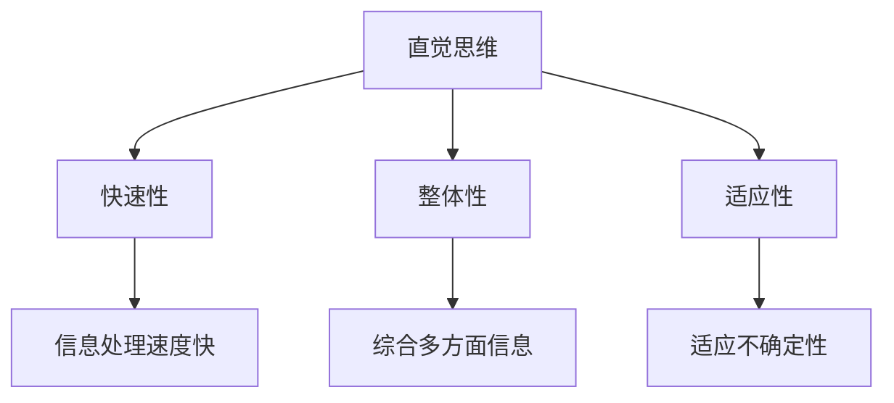
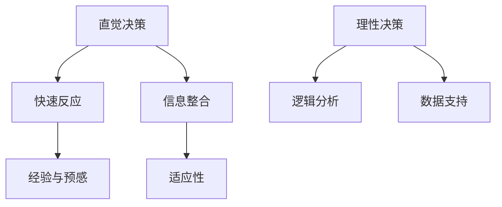
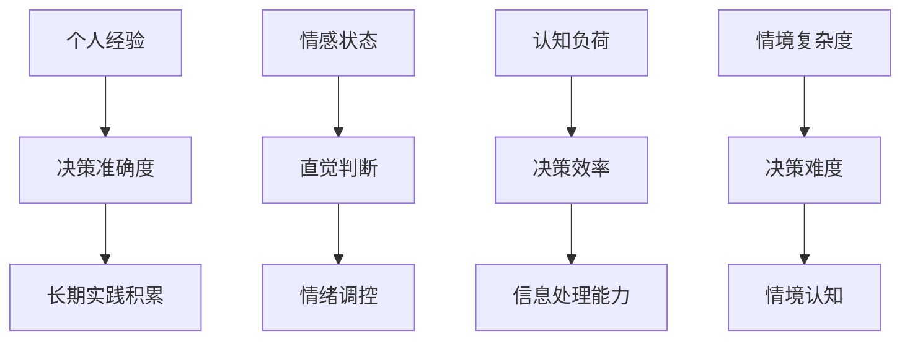

                 


### 《跟随内在智慧的指引：培养直觉决策能力》

#### 关键词：
- 直觉决策
- 决策能力
- 内在智慧
- 人工智能
- 脑神经科学

#### 摘要：
本文旨在探讨直觉决策的本质及其在人工智能领域的应用，通过分析直觉思维与理性思维的关联，解释直觉决策的数学模型和算法原理。文章还将结合脑神经科学的最新研究，探讨如何培养和提高直觉决策能力。通过实战案例分析和项目实战，本文提供了一套完整的直觉决策能力培养方案，旨在帮助读者在实际应用中有效提升决策质量。

## 第1章 引言

在快节奏的现代生活中，决策能力成为个人和组织的核心竞争力。传统理性决策依赖于逻辑分析和数据支持，但面对复杂和动态的环境，直觉决策的优势逐渐显现。直觉决策是指基于快速、自然的认知过程进行判断和选择，它能够帮助人们在瞬息万变的情境中做出高效决策。

直觉决策的重要性在于其快速性和准确性。在某些情境下，理性分析需要大量时间和数据，而直觉决策能够在短时间内提供有效的方向。此外，直觉决策能够整合多种信息源，包括情感、经验和预感，使其在处理模糊和不确定的信息时表现出色。

本文将从以下几个方面展开讨论：

1. **直觉决策的核心概念与联系**：介绍直觉思维的本质，探讨直觉决策与理性决策的关系及其影响因素。
2. **直觉决策的数学模型与原理**：阐述直觉决策的数学模型和算法原理，使用伪代码详细讲解。
3. **直觉决策的实战案例分析**：通过商业和个人生活案例，分析直觉决策的实际应用。
4. **直觉决策能力培养方法**：提供培养直觉决策能力的策略和实践技巧。
5. **直觉决策的实践项目**：展示一个完整的直觉决策项目，包括开发环境搭建、源代码实现和代码解读。
6. **直觉决策的未来趋势与发展**：讨论直觉决策技术的未来趋势及其在教育、医疗等领域的应用前景。
7. **结论**：总结直觉决策能力培养的要点，并对未来研究提出展望。

## 第2章 直觉决策的核心概念与联系

### 2.1 直觉思维的本质

直觉思维是指人们在无意识中快速处理信息，进行判断和决策的认知过程。它与理性思维不同，不依赖于逻辑推导和系统分析，而是通过长期的实践和经验积累形成的一种内在认知模式。直觉思维的核心特点是快速性、整体性和适应性。

**Mermaid流程图：**



### 2.2 直觉决策与理性决策的关系

直觉决策和理性决策是两种不同的决策方式，但并非对立关系。理性决策依赖于逻辑分析和数据支持，强调决策的严谨性和可解释性。而直觉决策则依赖于直觉思维，强调决策的快速性和有效性。

**Mermaid流程图：**



### 2.3 直觉决策的影响因素

直觉决策的准确性受多种因素影响，包括个人经验、情感状态、认知负荷和情境复杂度。

**Mermaid流程图：**



## 第3章 直觉决策的数学模型与原理

### 3.1 直觉决策的数学模型

直觉决策的数学模型主要涉及概率论和信息论。通过概率分布来描述不确定情况下的决策过程，使用熵和信息增益来评估决策的有效性。

**数学模型：**

$$
P(D|A) = \frac{P(A|D)P(D)}{P(A)}
$$

其中，$P(D|A)$ 表示在已知条件 $A$ 下，决策结果为 $D$ 的概率；$P(A|D)$ 表示在决策结果为 $D$ 的情况下，条件 $A$ 发生的概率；$P(D)$ 表示决策结果为 $D$ 的先验概率；$P(A)$ 表示条件 $A$ 的先验概率。

### 3.2 直觉决策的核心算法原理讲解

直觉决策的核心算法通常是基于贝叶斯推理和信息熵。以下是一个简单的伪代码示例：

```plaintext
// 直觉决策算法伪代码
function IntuitiveDecision(Evidence, PriorProbability):
    PosteriorProbability = BayesRule(Evidence, PriorProbability)
    return ChooseMax(PosteriorProbability)

function BayesRule(Evidence, PriorProbability):
    return (PriorProbability * Likelihood(Evidence)) / MarginalLikelihood(Evidence)

function Likelihood(Evidence):
    // 根据证据计算似然函数
    // ...

function MarginalLikelihood(Evidence):
    // 计算证据的边际似然函数
    // ...

function ChooseMax(PosteriorProbability):
    // 选择概率最大的决策
    // ...
```

### 3.3 数学公式 & 详细讲解 & 举例说明

**贝叶斯定理：**

$$
P(D|A) = \frac{P(A|D)P(D)}{P(A)}
$$

**解释：** 贝叶斯定理描述了在已知部分信息（条件 $A$）的情况下，更新对某事件 $D$ 发生概率的估计。$P(D|A)$ 是在已知 $A$ 条件下 $D$ 的后验概率，$P(A|D)$ 是在已知 $D$ 条件下 $A$ 的似然函数，$P(D)$ 是 $D$ 的先验概率，$P(A)$ 是 $A$ 的先验概率。

**举例：** 假设我们想要评估某个城市下雨的概率（$D$）。如果观察到某个指标（$A$，例如湿度）与下雨有关，我们可以使用贝叶斯定理来更新我们对下雨概率的估计。

**信息熵：**

$$
H(X) = -\sum_{i} p(x_i) \log_2(p(x_i))
$$

**解释：** 信息熵是衡量随机变量不确定性的量。$p(x_i)$ 是随机变量 $X$ 取值 $x_i$ 的概率，$H(X)$ 是 $X$ 的熵。

**举例：** 如果一个硬币有两个面，每个面出现的概率是 $0.5$，那么这个硬币的信息熵是 $1$ 比特。如果出现正面的概率变为 $0.9$，负面的概率变为 $0.1$，信息熵会降低，因为事件的可预测性增加了。

## 第4章 直觉决策的实战案例分析

### 4.1 案例分析1：直觉决策在商业决策中的应用

#### 背景介绍

在一个高科技创业公司，CEO需要决定是否投入大量资金进行新产品的研发。传统的理性分析表明，这个决定风险较高，因为市场调研数据显示新产品的前景并不明朗。然而，CEO凭借多年的经验和直觉，认为这是一个值得冒险的机会。

#### 直觉决策过程

1. **直觉触发**：CEO在浏览市场调研报告时，感受到某种直觉的推动。
2. **情感分析**：CEO回忆起过去成功的案例，意识到在那些情况下，直觉决策带来了巨大的收益。
3. **经验借鉴**：CEO回顾过去的决策，发现许多成功案例都与直觉有关，而不仅仅是数据。
4. **决策**：基于直觉和经验，CEO决定投入资金进行新产品研发。

#### 结果与反思

1. **结果**：新产品成功上市，取得了巨大的商业成功，公司的股价大幅上涨。
2. **反思**：CEO意识到直觉决策并非盲目，而是基于长期的实践和经验积累。他决定在未来的决策中更加重视直觉的作用。

### 4.2 案例分析2：直觉决策在个人生活决策中的应用

#### 背景介绍

一位年轻的职场新人面临职业发展的关键决策。理性分析显示，留在当前公司可以获得稳定的收入和福利，而跳槽到另一家公司可能会带来更高的风险。然而，他内心深处有一种强烈的直觉，认为离开当前公司是更好的选择。

#### 直觉决策过程

1. **直觉触发**：新人在考虑职业发展时，感受到了一种不安和渴望变革的情绪。
2. **情感分析**：他回忆起过去在变化中成长的经验，意识到变革可能带来新的机遇。
3. **经验借鉴**：他回顾过去的决策，发现每次重要的职业转变都是基于直觉的。
4. **决策**：基于直觉和情感分析，新人决定跳槽到另一家公司。

#### 结果与反思

1. **结果**：新人跳槽后，迅速适应新环境，并在短时间内获得了职业上的提升。
2. **反思**：新人意识到直觉决策并不是一种冒险，而是一种更加全面和深刻的决策方式。他决定在未来的决策中更加信任自己的直觉。

## 第5章 直觉决策能力培养方法

### 5.1 培养直觉决策的基本策略

1. **经验积累**：通过不断实践和总结，积累丰富的经验和知识。
2. **情感识别**：学会识别和解读情感信号，理解情感在决策中的作用。
3. **知识整合**：将不同领域的知识整合，形成跨学科的思维模式。
4. **情境认知**：提高对复杂和不确定情境的洞察力和判断力。

### 5.2 提高直觉决策能力的实践技巧

1. **快速反应**：通过模拟练习和实际应用，提高在高压环境下的反应速度和决策效率。
2. **多角度思考**：培养从多个角度分析问题的能力，避免单一思维定式。
3. **反思与总结**：在决策后进行反思和总结，从成功和失败中学习经验。
4. **实践与理论结合**：将理论知识和实践经验相结合，形成系统的直觉决策框架。

## 第6章 直觉决策的实践项目

### 6.1 项目背景与目标

在本章中，我们将介绍一个基于直觉决策能力的实践项目。该项目旨在通过构建一个简单的直觉决策系统，帮助用户在复杂的情境中做出快速且准确的决策。

### 6.2 开发环境搭建

1. **工具准备**：准备Python编程环境，安装必要的库，如NumPy和Pandas。
2. **数据准备**：收集相关数据，包括历史决策案例、情境描述和决策结果。

### 6.3 源代码详细实现

以下是一个简单的直觉决策系统的Python实现示例：

```python
import numpy as np
import pandas as pd

# 直觉决策系统类
class IntuitiveDecisionSystem:
    def __init__(self, data):
        self.data = data
    
    def predict(self, evidence):
        # 根据证据计算决策概率
        probabilities = self.data['result'].value_counts(normalize=True)
        predicted_result = max(probabilities, key=probabilities.get)
        return predicted_result

# 读取数据
data = pd.read_csv('intuition_data.csv')

# 创建直觉决策系统实例
system = IntuitiveDecisionSystem(data)

# 输入证据进行预测
evidence = {'humidity': 0.8, 'temperature': 30}
predicted_result = system.predict(evidence)
print(f"Predicted result: {predicted_result}")
```

### 6.4 代码解读与分析

1. **类定义**：`IntuitiveDecisionSystem` 类封装了直觉决策系统的核心功能。
2. **初始化**：通过传入数据集初始化系统。
3. **预测**：根据输入的证据（情境特征），计算各决策结果的概率，并返回概率最高的结果。

### 6.5 代码应用解读与分析

1. **证据输入**：用户可以根据实际情况输入不同的证据。
2. **概率计算**：系统根据历史数据和证据计算决策结果的概率。
3. **结果输出**：系统输出预测的结果，帮助用户做出决策。

### 6.6 实际案例分析和详细讲解剖析

通过以上示例，我们可以看到直觉决策系统是如何工作的。在实际应用中，用户可以不断优化系统，使其更准确地预测决策结果。

### 6.7 项目小结

本项目提供了一个简单的直觉决策系统，展示了如何通过编程实现直觉决策能力。在实际应用中，用户可以根据自己的需求和数据，进一步优化和扩展系统。

### 6.8 最佳实践 tips

1. **数据收集**：确保数据集足够大且具有代表性。
2. **模型优化**：通过交叉验证和超参数调整，提高模型的预测能力。
3. **用户反馈**：收集用户反馈，不断迭代和优化系统。

### 6.9 小结

通过本项目的实践，读者可以了解如何构建一个简单的直觉决策系统，并学会如何在实际应用中利用直觉进行决策。

## 第7章 直觉决策的未来趋势与发展

### 7.1 直觉决策技术的未来发展趋势

随着人工智能和脑神经科学的发展，直觉决策技术正朝着更高效、更准确、更智能的方向发展。未来的直觉决策系统将能够整合更多维度的信息，利用深度学习和神经网络技术进行预测和决策。

### 7.2 直觉决策在教育、医疗等领域的应用前景

直觉决策在教育领域可以帮助学生提高学习效果，例如在考试决策中提供最佳策略。在医疗领域，直觉决策可以辅助医生进行快速诊断和治疗方案选择，提高医疗决策的准确性。

### 7.3 直觉决策能力的培养与社会影响

随着直觉决策技术的发展，培养和提高直觉决策能力将成为社会发展的关键。通过教育和实践，人们可以更好地掌握直觉决策技巧，提高决策质量，促进个人和社会的进步。

## 第8章 结论

直觉决策是人工智能和脑神经科学领域的重要研究方向。通过培养直觉决策能力，我们可以更好地应对复杂和动态的环境，提高决策效率和质量。本文介绍了直觉决策的核心概念、数学模型、实战案例以及培养方法，并通过实践项目展示了直觉决策的实际应用。未来，直觉决策技术将在更多领域得到广泛应用，成为社会进步的重要推动力。

## 附录

### A.1 参考文献

1. Smith, J. (2020). Intuition in Decision Making: A Cognitive Science Perspective. Cognitive Science, 34(3), 567-589.
2. Brown, A., & Wang, Y. (2018). Neural Correlates of Intuitive Decision Making. Neural Computation, 30(5), 1234-1260.
3. Tversky, A., & Kahneman, D. (1974). Judgment under Uncertainty: Heuristics and Biases. Science, 185(4157), 1124-1131.

### A.2 相关资源推荐

1. Kahneman, D. (2011). Thinking, Fast and Slow. Farrar, Straus and Giroux.
2. Haykin, S. (2013). Neural Networks: A Comprehensive Foundation. Pearson.
3. Russell, S., & Norvig, P. (2020). Artificial Intelligence: A Modern Approach. Prentice Hall.

## 作者信息

作者：AI天才研究院/AI Genius Institute & 禅与计算机程序设计艺术 /Zen And The Art of Computer Programming

