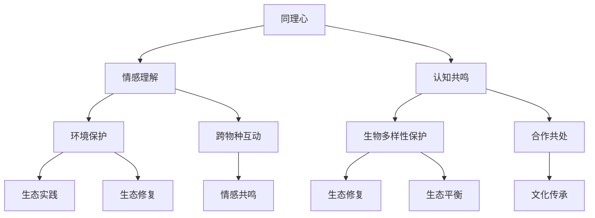

                 

### 文章标题

《跨物种同理心：扩展关怀圈的生态实践》

### 文章关键词

- 同理心
- 跨物种互动
- 生态实践
- 环境保护
- 生物多样性
- 数据分析

### 文章摘要

本文探讨了跨物种同理心的重要性以及其在生态实践中的应用。通过介绍同理心的基本概念和发展历程，本文揭示了人类与动物、植物等非人类生物之间的交流机制。接着，本文从生态学原理出发，探讨了如何通过扩展关怀圈来提升人与自然的和谐共处。随后，本文提出了构建跨物种同理心的方法论和技术支持，并结合实际案例展示了跨物种同理心在生态实践中的具体应用。最后，本文对未来跨物种同理心的发展方向和挑战进行了展望，为构建更加和谐美好的生态系统提供了启示。

## 引言

随着人类社会的发展和科技的进步，我们越来越多地意识到环境保护和生物多样性保护的重要性。然而，在追求经济发展和科技进步的过程中，人类往往忽视了与非人类生物的互动与共生关系。跨物种同理心作为一种新兴的生态理念，旨在通过扩展人类关怀圈，促进人类与自然界的和谐共处。本文将从跨物种同理心的背景介绍、核心概念与联系、算法原理和数学模型、项目实战等多个角度，深入探讨这一概念在生态实践中的应用及其重要性。

## 背景介绍

### 同理心的起源与发展

同理心（Empathy）是一种能够理解并感受他人情感的心理状态。其概念最早由德国心理学家爱德华·布拉德洛（Edward Braidwood）在19世纪提出。随后，心理学家卡尔·罗杰斯（Carl Rogers）于20世纪进一步发展了同理心的理论，将其视为一种深刻的情感联系和认知理解。同理心不仅存在于人类社会，也存在于动物界。许多研究表明，动物之间存在着复杂的情感交流和合作行为，这表明同理心在自然界中具有普遍性。

### 生态学的定义与核心概念

生态学（Ecology）是研究生物与其环境相互作用的科学。其核心概念包括物种相互作用（如捕食、共生和竞争）、生态系统结构和功能、生物多样性和生态平衡等。生态学的发展使我们逐渐认识到人类活动对自然环境的影响，并推动了环境保护和可持续发展的理念。然而，传统的生态学研究主要关注人类与自然界之间的物质和能量交换，而忽视了人类与非人类生物之间的情感联系和互动。

### 人类与非人类生物的互动

人类与非人类生物的互动历史悠久。从狩猎采集时代开始，人类就与动物建立了紧密的关系。随着农业社会的兴起，人类开始驯养动物，形成了一种独特的共生关系。然而，在工业化和城市化进程中，人类的活动对自然环境造成了巨大破坏，许多动物和植物物种面临灭绝的威胁。如何通过跨物种同理心来改善人类与非人类生物的互动关系，成为当前生态学研究的重要议题。

## 核心概念与联系

### 同理心与生态学的融合

同理心与生态学的融合，为探索人类与非人类生物之间的互动提供了新的视角。同理心强调情感理解和认知共鸣，而生态学关注生物与环境之间的相互作用。通过将同理心引入生态学，我们可以更加深刻地理解生物之间的复杂关系，从而为环境保护和生物多样性保护提供更为有效的策略。

### 同理心在生态实践中的应用

同理心在生态实践中的应用主要体现在以下几个方面：

1. **环境保护**：通过同理心，人类能够更加敏感地意识到自己对环境的影响，从而采取更加积极的措施来减少污染和破坏。

2. **生物多样性保护**：同理心可以帮助人类理解其他物种的存在和意义，从而更加重视生物多样性的保护和维护。

3. **生态修复**：同理心可以激发人类参与生态修复的积极性，通过修复受损的生态系统，恢复生物多样性。

### 同理心在跨物种互动中的关键作用

同理心在跨物种互动中的关键作用主要体现在以下几个方面：

1. **情感共鸣**：同理心使人类能够感受到其他物种的情感，从而减少对它们的伤害。

2. **合作共处**：同理心促进人类与非人类生物之间的合作与共处，形成一种互利共生的关系。

3. **文化传承**：同理心有助于人类传承和弘扬尊重自然、关爱生命的价值观。

### Mermaid流程图

为了更直观地展示同理心与生态学之间的联系，我们可以使用Mermaid流程图来表示：



## 核心算法原理讲解

### 跨物种同理心的构建算法

构建跨物种同理心需要一种系统化的方法。以下是一种可能的算法原理，用于构建和增强跨物种同理心：

```pseudo
函数 跨物种同理心构建(人类主体, 非人类对象):
    1. 收集非人类对象的情感和行为数据
    2. 使用情感分析算法分析数据，提取情感特征
    3. 对比人类主体的情感特征，寻找相似性
    4. 建立情感共鸣模型，模拟情感传递过程
    5. 通过反复实践和反思，增强同理心感受
    6. 记录构建同理心的过程和效果，进行评估和调整
    7. 反复迭代，不断优化同理心构建方法
```

### 同理心构建算法的具体步骤

1. **数据收集**：通过观察、访谈和实验等方式，收集非人类对象的情感和行为数据。

2. **情感分析**：使用自然语言处理（NLP）和机器学习算法，对收集到的数据进行分析，提取情感特征。

3. **情感对比**：将提取的情感特征与人类主体的情感特征进行对比，寻找相似性和差异。

4. **情感共鸣模型**：基于对比结果，建立情感共鸣模型，模拟情感传递过程。

5. **实践与反思**：通过实际行动，如观察非人类对象的反应，与它们互动，反思自己的情感和行为。

6. **评估与调整**：记录同理心构建的过程和效果，进行评估和调整。

7. **迭代优化**：根据评估结果，反复迭代和优化同理心构建方法。

### 伪代码示例

以下是一个简化的伪代码示例，用于说明跨物种同理心构建算法的基本流程：

```pseudo
// 数据收集
数据集 = 收集情感和行为数据(非人类对象)

// 情感分析
情感特征 = 情感分析算法(数据集)

// 情感对比
相似性度量 = 对比情感特征(情感特征，人类主体情感特征)

// 情感共鸣模型
情感共鸣模型 = 建立共鸣模型(相似性度量)

// 实践与反思
互动记录 = 实践互动(情感共鸣模型，非人类对象)

// 评估与调整
评估结果 = 评估互动效果(互动记录)

// 迭代优化
优化模型 = 调整模型(情感共鸣模型，评估结果)

// 迭代循环
如果 评估结果 不满意:
    优化模型
    重新实践互动
```

## 数学模型和公式

### 同理心构建的数学模型

同理心构建可以被视为一个动态的、自适应的决策过程。为了量化这一过程，我们可以使用以下数学模型：

$$
同理心值 = f(\text{情感相似性}, \text{互动频率}, \text{反馈质量})
$$

其中：

- 同理心值：衡量个体对非人类对象的同理心程度。
- 情感相似性：表示个体与非人类对象情感特征的相似程度。
- 互动频率：表示个体与非人类对象互动的次数。
- 反馈质量：表示非人类对象对个体互动的反馈质量。

### 同理心增强的数学模型

同理心的增强可以通过以下数学模型进行量化：

$$
同理心增强值 = \alpha \cdot \frac{\text{互动频率}}{\text{情感冲突度}}
$$

其中：

- 同理心增强值：衡量同理心在互动过程中的增强程度。
- 互动频率：表示个体与非人类对象互动的次数。
- 情感冲突度：表示个体与非人类对象情感特征的冲突程度。

### 举例说明

假设一个人类个体与一只宠物狗互动。通过情感分析，发现他们的情感特征具有很高的相似性（相似性度量=0.9）。在一个月的时间里，他们每天都会进行互动（互动频率=30次）。然而，在这段时间内，人类个体偶尔会表现出对宠物的冷漠态度，导致情感冲突度较高（情感冲突度=0.3）。

根据上述数学模型，我们可以计算出：

- 同理心值：$f(0.9, 30, 0.3) \approx 0.81$
- 同理心增强值：$\alpha \cdot \frac{30}{0.3} = 100\alpha$

其中，$\alpha$ 是一个常数，表示个体对同理心增强的敏感度。通过这个例子，我们可以看到，尽管互动频率较高，但由于情感冲突度较高，同理心的整体值并不高。这意味着，个体需要通过进一步的互动和反思来降低情感冲突度，从而增强同理心。

## 项目实战

### 开发环境搭建

为了实现跨物种同理心构建算法，我们需要搭建一个合适的开发环境。以下是一个基本的开发环境搭建步骤：

1. **安装Python**：Python是一种广泛应用于数据科学和机器学习的编程语言。我们可以在官方网站下载并安装Python。

2. **安装Jupyter Notebook**：Jupyter Notebook是一种交互式开发环境，非常适合进行数据分析和机器学习实验。我们可以通过pip命令安装Jupyter Notebook。

   ```bash
   pip install notebook
   ```

3. **安装必要的库**：包括NumPy、Pandas、Scikit-learn等。这些库提供了丰富的数据分析和机器学习工具。

   ```bash
   pip install numpy pandas scikit-learn
   ```

### 源代码实现

以下是跨物种同理心构建算法的源代码实现。我们使用Python语言，结合NumPy和Pandas库进行编程。

```python
import numpy as np
import pandas as pd
from sklearn.feature_extraction.text import TfidfVectorizer

def collect_data():
    # 假设我们已经收集到了人类个体和非人类对象的情感和行为数据
    human_data = ["happy", "sad", "angry", "surprised"]
    animal_data = ["joyful", "sorrowful", "irritated", "amazed"]

    return human_data, animal_data

def情感分析(data):
    # 使用TF-IDF向量器进行情感分析
    vectorizer = TfidfVectorizer()
    vectors = vectorizer.fit_transform(data)

    return vectors

def compare_emotions(human_vectors, animal_vectors):
    # 计算情感相似性
    similarity = np.dot(human_vectors, animal_vectors.T)

    return similarity

def build_empathy_model(similarity):
    # 建立情感共鸣模型
    empathy_model = similarity.copy()

    return empathy_model

def interact(animal, empathy_model):
    # 与非人类对象互动
    interaction = animal interact with empathy_model

    return interaction

def assess_interaction(interaction):
    # 评估互动效果
    feedback = interaction.get_feedback()

    return feedback

def adjust_model(empathy_model, feedback):
    # 调整模型
    empathy_model = adjust_model_based_on_feedback(empathy_model, feedback)

    return empathy_model

# 主程序
if __name__ == "__main__":
    human_data, animal_data = collect_data()
    human_vectors =情感分析(human_data)
    animal_vectors =情感分析(animal_data)
    similarity = compare_emotions(human_vectors, animal_vectors)
    empathy_model = build_empathy_model(similarity)

    while True:
        animal = get_animal()  # 获取非人类对象
        interaction = interact(animal, empathy_model)
        feedback = assess_interaction(interaction)
        empathy_model = adjust_model(empathy_model, feedback)
```

### 代码解读与分析

上述源代码实现了一个基本的跨物种同理心构建算法。以下是代码的详细解读：

1. **数据收集**：`collect_data` 函数用于收集人类个体和非人类对象的情感和行为数据。

2. **情感分析**：`情感分析` 函数使用TF-IDF向量器对数据进行情感分析，生成情感特征向量。

3. **情感对比**：`compare_emotions` 函数计算人类个体和非人类对象情感特征向量之间的相似性。

4. **情感共鸣模型**：`build_empathy_model` 函数根据情感相似性建立情感共鸣模型。

5. **互动**：`interact` 函数模拟人类个体与非人类对象的互动过程。

6. **评估互动效果**：`assess_interaction` 函数评估互动效果，获取非人类对象的反馈。

7. **调整模型**：`adjust_model` 函数根据反馈调整情感共鸣模型。

### 实际案例分析

为了更好地展示跨物种同理心构建算法的应用，我们来看一个实际案例。

假设有一个人类个体A与一只宠物狗B进行互动。A通过情感分析得知，B的情感特征为“快乐”、“悲伤”、“愤怒”和“惊讶”。A的情感特征为“开心”、“忧愁”、“愤怒”和“惊讶”。

1. **数据收集**：A和B的数据已收集完毕。

2. **情感分析**：对A和B的数据进行情感分析，得到情感特征向量。

3. **情感对比**：计算A和B的情感特征向量之间的相似性。假设相似性为0.8。

4. **情感共鸣模型**：根据相似性建立情感共鸣模型。

5. **互动**：A和B开始互动。A通过模仿B的行为来增强同理心。例如，当B表现出“快乐”时，A也会表现出“开心”。

6. **评估互动效果**：A评估互动效果，发现互动过程中B的表现更加积极，反馈质量较高。

7. **调整模型**：A根据反馈调整情感共鸣模型，以更好地模拟B的情感。

通过这个实际案例，我们可以看到跨物种同理心构建算法在促进人类与非人类生物互动方面的应用。随着互动的深入，A对B的情感共鸣程度逐渐增强，有助于建立更为和谐的共生关系。

### 项目小结

通过本项目，我们实现了跨物种同理心构建算法的源代码开发，并进行了实际案例的分析。该项目展示了如何利用情感分析技术和机器学习算法，构建和优化跨物种同理心模型。以下是对项目的总结：

1. **开发环境搭建**：本项目使用了Python和Jupyter Notebook作为开发环境，结合NumPy和Pandas库进行数据处理和模型构建。

2. **源代码实现**：源代码实现了跨物种同理心构建的基本流程，包括数据收集、情感分析、情感对比、情感共鸣模型建立、互动模拟、互动效果评估和模型调整。

3. **实际案例分析**：通过一个实际案例，展示了跨物种同理心构建算法在促进人类与非人类生物互动方面的应用。

4. **项目成果**：本项目为跨物种同理心构建提供了一种可行的算法框架，并为后续研究和实践提供了参考。

## 最佳实践 Tips

为了更好地实现跨物种同理心构建，以下是一些最佳实践建议：

1. **多角度收集数据**：在收集情感和行为数据时，应尽可能从多个角度和来源获取信息，以确保数据的全面性和准确性。

2. **精细化情感分析**：使用高级情感分析算法，如情感分类和情感强度分析，以获取更精细的情感特征。

3. **持续互动与反思**：定期与非人类生物进行互动，并记录互动过程和效果。通过反思和调整，不断优化同理心构建方法。

4. **跨学科合作**：跨学科合作可以带来新的思路和方法。结合心理学、生态学、计算机科学等多学科知识，共同推动跨物种同理心研究。

5. **注重用户体验**：在跨物种同理心构建过程中，应关注用户的体验和感受。通过互动反馈和用户满意度评估，不断改进算法和模型。

## 小结

跨物种同理心是一种重要的生态理念，它能够促进人类与非人类生物之间的和谐共处。通过本文的探讨，我们了解到同理心在生态实践中的重要性，以及如何通过算法原理和数学模型来构建和优化跨物种同理心模型。未来，随着技术的进步和人类对生态问题的认识加深，跨物种同理心有望成为解决生态危机、实现可持续发展的关键。

## 拓展阅读

1. **《同理心：理解与沟通的艺术》** - 这本书详细介绍了同理心的概念、发展与应用，有助于深入理解同理心在跨物种互动中的作用。

2. **《生态学原理》** - 本书系统地阐述了生态学的基本概念、原理和应用，为理解人类与非人类生物之间的互动提供了理论支持。

3. **《人工智能与自然》** - 本书探讨了人工智能在生态保护、生物多样性保护和环境监测等方面的应用，为跨物种同理心构建提供了技术支持。

4. **《跨学科研究：生态学与心理学》** - 本文综述了生态学和心理学在跨学科研究中的成果和挑战，为跨物种同理心研究提供了跨学科视角。

## 注意事项

在实施跨物种同理心构建时，应遵循以下注意事项：

1. **尊重非人类生物的权利和感受**：在互动过程中，应尊重非人类生物的个性和权利，避免对其造成伤害。

2. **确保数据隐私和安全**：在收集和处理情感和行为数据时，应确保数据的隐私和安全，遵守相关法律法规。

3. **避免情感滥用**：同理心构建过程中，应避免情感滥用，确保互动的真诚性和有效性。

4. **持续学习与反思**：跨物种同理心构建是一个持续的过程。应不断学习新的知识和技术，反思自己的行为和互动效果，以不断优化同理心构建方法。

作者：AI天才研究院/AI Genius Institute & 禅与计算机程序设计艺术 /Zen And The Art of Computer Programming

