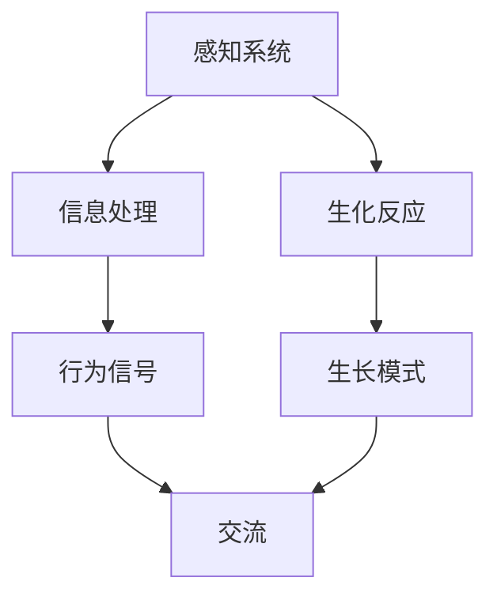

                 

### 文章标题

《跨物种沟通工作坊：探索与动植物的非语言交流》

### 文章关键词

- 跨物种沟通
- 非语言交流
- 动植物交流
- 感知系统
- 信息传递
- 植物学
- 生态学
- 生物信息学

### 文章摘要

本文旨在探讨动植物之间的非语言交流现象，通过分析动植物的感知系统、信息传递方式及其在自然界的应用，揭示跨物种沟通的奥秘。文章首先介绍了跨物种沟通的重要性，随后详细阐述了动植物沟通的基本原理，包括感知系统、信息传递方式和心理学基础。接着，本文分别从植物和动物的角度探讨了它们之间的非语言交流，并通过实例分析展示了这些交流方式的具体应用。最后，文章提出了跨物种沟通的方法与技巧，并对未来跨物种沟通的研究和应用进行了展望。

## 引言：跨物种沟通的重要性

### 1.1 跨物种沟通的内涵

跨物种沟通（Interspecies Communication）指的是不同物种之间通过特定的信号和信息进行交流的过程。这种沟通不仅限于人类与动物之间的互动，还包括植物与其他动物、植物与植物之间的交流。传统的沟通模式通常依赖于语言、文字和声音，但跨物种沟通则依赖于各种非语言信号，如化学物质、电信号、声音和物理接触等。

在生物学和生态学领域，跨物种沟通的研究具有重要的意义。首先，它有助于我们理解生物之间复杂的相互作用关系，包括捕食与被捕食、共生与竞争等。例如，植物通过释放特定的化学信号来吸引有益昆虫或抵御害虫，动物则通过声音、体态和化学信号进行社会行为和繁殖策略的协调。其次，跨物种沟通研究可以为我们提供新的生态保护和农业管理策略。例如，通过理解植物与昆虫之间的交流机制，我们可以开发出更加环保的害虫防治方法。

### 1.2 本书内容概述

本书将系统地探讨跨物种沟通的各个方面，旨在为读者提供一个全面、深入的了解。本书共分为七个主要部分：

1. **引言**：介绍跨物种沟通的重要性，定义相关概念，并概述本书的内容和目标。
   
2. **动植物沟通的基本原理**：探讨动植物感知系统、信息传递方式和心理学基础，为后续章节打下理论基础。

3. **植物的非语言交流**：详细分析植物如何通过化学和物理信号进行交流，并提供实例说明。

4. **动物的非语言交流**：研究动物如何使用声音、化学信号和其他非语言手段进行交流，并结合实际案例进行讨论。

5. **跨物种沟通的方法与技巧**：介绍跨物种沟通的研究方法和技术手段，包括观察法、实验法和数据分析技术。

6. **跨物种沟通的应用**：探讨跨物种沟通在农业、医学和教育等领域的实际应用。

7. **跨物种沟通的未来展望**：展望跨物种沟通研究的未来发展方向，探讨面临的挑战和机遇。

通过本书的阅读，读者将不仅能够了解跨物种沟通的基本知识，还能掌握相关的研究方法和应用技巧，为深入探索这一领域奠定基础。

## 动植物沟通的基本原理

### 2.1 动植物沟通的定义

动植物沟通（Animal and Plant Communication）是指不同物种之间通过特定的信号和信息进行的交流过程。这种沟通形式与人类之间的语言沟通不同，它不依赖于文字和口头语言，而是依赖于各种非语言的信号和信息传递方式。在自然界中，动植物之间的沟通是它们生存和繁衍的重要手段，它们通过这种方式来传递信息、协调行为，甚至影响彼此的生理状态。

动植物沟通的研究不仅有助于我们更好地理解生物之间的相互作用，还能为生态保护和生物技术应用提供科学依据。例如，通过研究植物与昆虫之间的沟通机制，我们可以开发出更加环保的农业害虫防治方法，减少对环境的破坏。

### 2.2 动植物沟通的生理基础

动植物沟通的生理基础主要涉及它们的感知系统和信息处理能力。首先，动植物的感知系统决定了它们能够接收和解读哪些类型的信号。植物具有复杂的化学感知系统，能够识别和响应环境中的化学信号，如挥发性有机化合物（VOCs）和植物激素。而动物则具有多种感觉器官，如眼睛、耳朵、嗅觉器官和触觉器官，这些器官使它们能够感知到不同类型的物理和化学信号。

#### 2.2.1 植物的感知系统

植物通过其叶片、根系和整体生物结构感知环境变化。例如，植物能够通过叶片感知光线强度、方向和颜色，从而调节生长方向和光合作用效率。此外，植物可以通过根系感知土壤的湿度和化学成分，以便调整水分和营养吸收。在化学感知方面，植物能够检测到昆虫释放的化学信号，如信息素（pheromones），这有助于它们预测潜在的危险或机遇。

#### 2.2.2 动物的感知系统

动物则通过其视觉、听觉、嗅觉和触觉系统感知环境。例如，许多动物可以通过声音识别同种或异种个体的存在，使用嗅觉来寻找食物或配偶，通过视觉判断猎物的位置和运动轨迹。在化学感知方面，动物能够识别和响应环境中的化学信号，如信息素和警告信号。

#### 2.2.3 动植物信息处理方式的差异

动植物在信息处理方式上也存在显著差异。植物通常通过整体生物体进行信息处理，即整个植物体对信息进行整合和处理。这种整体性使得植物能够在复杂的环境中灵活地响应各种信号。而动物则通常通过特定的感官器官进行信息处理，每个感官器官对特定类型的信息进行解析和处理。

### 2.3 动植物沟通的心理学基础

动植物沟通不仅涉及生理基础，还与心理学密切相关。心理学研究动物和植物如何通过行为和生理反应来传递和解读信息。

#### 2.3.1 动物的行为心理学

动物行为心理学研究动物如何通过特定的行为信号进行交流。例如，动物可以通过肢体动作、面部表情、声音和气味等非语言信号来传递信息。这些信号不仅用于同种个体之间的交流，还用于与异种个体（包括人类）的互动。例如，狗可以通过摇尾巴、舔人等行为来与人类建立联系，而猫则通过咕噜声和身体姿势来传达它的情绪状态。

#### 2.3.2 植物的行为心理学

植物的行为心理学研究植物如何通过特定的生化反应和生长模式来传递信息。虽然植物无法进行传统意义上的行为反应，但它们可以通过化学信号、电信号和物理运动来传递信息。例如，植物能够通过化学信号来警示邻近植物潜在的危险，并通过调整生长方向来避免不良环境。

### 2.4 动植物沟通的核心概念和关系架构

为了更好地理解动植物沟通，我们可以通过Mermaid流程图来展示核心概念和关系架构。以下是动植物沟通的核心概念及其关系的Mermaid表示：



在这个流程图中，感知系统（A）和信息处理（B）是动植物沟通的基础，行为信号（C）和生化反应（D）是动植物通过不同方式传递信息的方式，而生长模式（E）是植物特有的信息传递方式。这些方式最终都指向交流（F），即不同物种之间通过信号和信息进行的互动。

通过上述内容，我们可以看出，动植物沟通是一个复杂而广泛的现象，涉及多个学科领域的知识。理解这些基本原理不仅有助于我们深入探讨跨物种沟通的奥秘，还能为相关领域的研究和应用提供理论基础。

### 2.5 核心算法原理讲解

在深入探讨动植物沟通的核心算法原理之前，我们需要先了解几个关键概念，包括化学信号识别、信息编码与解码、以及行为反应模型。这些概念构成了动植物沟通算法的基础。

#### 2.5.1 化学信号识别

化学信号识别是动植物沟通的关键环节。植物和动物都具备识别特定化学物质的能力，这些化学物质可以是挥发性有机化合物（VOCs）、信息素或其他化学信号。例如，某些植物能够识别特定昆虫释放的信息素，从而触发防御机制或吸引益虫。化学信号识别通常涉及以下几个步骤：

1. **信号接收**：植物或动物通过其特定的感知器官接收化学信号。
2. **信号识别**：感知器官中的化学受体与信号分子结合，识别出特定信号。
3. **信号传递**：识别后的信号通过细胞内的信号传导途径传递到相应的处理中心。

以下是一个简化的伪代码，描述植物对信息素的识别过程：

```pseudo
function detect_pheromone(pheromone, receptor):
    if receptor.binds_to(pheromone):
        return "Signal detected"
    else:
        return "No signal"
```

#### 2.5.2 信息编码与解码

信息编码与解码是动植物沟通中的另一个重要环节。信息编码是指动植物如何将信息转化为特定的化学或物理信号，以便传递给接收者。信息解码则是指接收者如何解读这些信号。

在植物中，信息编码通常涉及植物激素的合成和分泌。例如，当植物受到昆虫攻击时，它们会合成并释放特定的激素，这些激素可以传递给邻近的植物，提醒它们准备防御。以下是一个简化的伪代码，描述植物激素的编码与传递过程：

```pseudo
function encode_signal(damage):
    hormone = produce_hormone(damage)
    emit_hormone(hormone)
    return "Signal encoded and emitted"

function receive_signal(hormone):
    if detect_hormone(hormone):
        trigger_defensive_response()
        return "Signal received"
    else:
        return "No signal received"
```

在动物中，信息编码与解码通常涉及行为信号的生成和识别。例如，动物通过特定的姿势、声音或气味来传递信息。以下是一个简化的伪代码，描述动物行为信号的编码与解码过程：

```pseudo
function encode_signal(message):
    signal = generate_signal(message)
    emit_signal(signal)
    return "Signal encoded and emitted"

function decode_signal(signal):
    if recognize_signal(signal):
        process_message()
        return "Signal decoded"
    else:
        return "No signal decoded"
```

#### 2.5.3 行为反应模型

行为反应模型是动植物如何根据接收到的信号做出相应反应的机制。在植物中，这种行为反应可能包括生长模式的调整、化学物质的分泌、甚至生物体的移动。以下是一个简化的伪代码，描述植物对信息素信号的行为反应：

```pseudo
function respond_to_signal(signal):
    if signal == "Warning":
        trigger_defensive_reactions()
    elif signal == "Reward":
        initiate_repellent_reactions()
    else:
        return "No response"
```

在动物中，行为反应可能包括寻找食物、逃避危险、寻找配偶等。以下是一个简化的伪代码，描述动物对行为信号的响应：

```pseudo
function respond_to_signal(signal):
    if signal == "Food":
        pursue_food()
    elif signal == "Mate":
        initiate_mating_behavior()
    elif signal == "Escape":
        evade_danger()
    else:
        return "No response"
```

通过这些伪代码示例，我们可以看到，动植物沟通的算法原理涉及多个环节，包括信号识别、信息编码与解码、以及行为反应。这些原理共同构成了动植物沟通的复杂机制，使得不同物种之间能够通过非语言信号进行有效交流。

### 2.6 数学模型和公式

在动植物沟通的研究中，数学模型和公式是描述和解释这些复杂现象的重要工具。以下将介绍几个关键数学模型和公式，并详细解释它们在跨物种沟通中的应用。

#### 2.6.1 信息素扩散模型

信息素扩散模型是描述信息素在环境中传播的重要模型。信息素通常通过气态或液态介质扩散，其浓度随时间和距离变化。一个简单的信息素扩散模型可以使用以下公式来描述：

$$
\frac{\partial C}{\partial t} = D \frac{\partial^2 C}{\partial x^2}
$$

其中，$C$ 是信息素的浓度，$t$ 是时间，$D$ 是扩散系数，$x$ 是空间坐标。这个方程表示信息素浓度随时间和空间的变化关系，反映了信息素在介质中的扩散过程。

#### 2.6.2 信息素敏感度模型

信息素敏感度模型用于描述生物体对信息素的感知能力。一个常见的信息素敏感度模型是 Hill 方程，它描述了信号分子浓度与反应率之间的关系：

$$
r = \frac{K_n}{(1 + \frac{[S]}{n})^n}
$$

其中，$r$ 是反应率，$K_n$ 是半最大反应浓度，$[S]$ 是信息素浓度，$n$ 是 Hill 系数，它反映了信号分子浓度对反应的敏感性。这个模型可以用来分析生物体如何响应不同浓度的信息素。

#### 2.6.3 行为选择模型

行为选择模型用于描述生物体在接收多个信号时的决策过程。一个经典的行为选择模型是概率选择模型，它基于各个信号的权重来计算最终的行为选择概率。以下是一个简化的概率选择模型：

$$
P(\text{行为}) = \sum_{i} w_i p_i
$$

其中，$P(\text{行为})$ 是选择某种行为的概率，$w_i$ 是第 $i$ 个信号的权重，$p_i$ 是第 $i$ 个信号的出现概率。这个模型可以帮助我们理解生物体如何基于多种信号做出最佳决策。

#### 2.6.4 社会信息整合模型

社会信息整合模型描述了个体如何整合来自其他个体的信号来做出决策。一个简单的整合模型是基于加权的平均，公式如下：

$$
\text{整合值} = \sum_{i} w_i x_i
$$

其中，$w_i$ 是第 $i$ 个信号的权重，$x_i$ 是第 $i$ 个信号的值。这个模型可以用来分析动物群体如何通过信息共享和协作来提高决策效率。

通过这些数学模型和公式，我们可以定量地描述和预测动植物之间的沟通行为。这些模型不仅帮助我们更好地理解跨物种沟通的机制，还为相关领域的研究和应用提供了重要的理论基础。

### 2.7 实例说明

为了更好地理解动植物沟通的原理，我们将通过两个具体实例来详细说明这些概念的应用。

#### 2.7.1 植物间的化学信号交流

**实例背景**：在一片森林中，一棵遭受昆虫攻击的树木会释放出特定的化学信号，如芥子油醇（methyl salicylate）。这种信号不仅会传递给邻近的树木，还会引起它们产生防御反应。

**步骤1：信号接收**：邻近的树木通过其叶片上的化学传感器接收到了芥子油醇信号。

**步骤2：信号识别**：这些传感器识别出芥子油醇分子，并通过细胞内的信号传导途径将信号传递到植物的生长中心。

**步骤3：信号传递**：植物的生长中心将信号通过细胞间的信号传导网络传递到整个植物体。

**步骤4：信号响应**：受到信号刺激的植物开始合成并释放自身的防御物质，如黄酮类化合物（flavonoids），这些物质可以抵御进一步的昆虫攻击。

**伪代码实现**：

```pseudo
function detect_and_respond_to_pheromone(pheromone, sensor):
    if sensor.detects(pheromone):
        trigger_defensive_response()
        return "Signal received and responded"
    else:
        return "No signal detected"
```

#### 2.7.2 动物间的声音信号交流

**实例背景**：在夜晚的森林中，一只狼通过发出特定的声音信号（如狼嚎）来与其他狼群保持联系，以协调狩猎行为。

**步骤1：信号产生**：狼通过其声带发出狼嚎，声波在空气中传播。

**步骤2：信号接收**：其他狼群通过其听觉器官接收到了狼嚎声。

**步骤3：信号识别**：狼群的听觉传感器识别出狼嚎声，并通过神经传递将信号传递到大脑。

**步骤4：信号处理**：大脑分析狼嚎声的特征，如音调、节奏和频率，以确定信号的来源和含义。

**步骤5：信号响应**：根据接收到的信号，狼群可能采取行动，如集合狩猎或保持警戒。

**伪代码实现**：

```pseudo
function detect_and_process_sound(sound, sensor):
    if sensor.detects(sound):
        analyze_sound_features(sound)
        respond_to_signal()
        return "Signal received and processed"
    else:
        return "No signal detected"
```

通过这两个实例，我们可以看到动植物沟通的具体过程，以及如何通过伪代码实现这些过程。这些实例不仅帮助我们理解动植物沟通的基本原理，还为实际应用提供了参考。

### 植物的非语言交流

植物作为自然界中最古老的生物，拥有着独特的非语言交流机制，这些机制使它们能够应对环境变化、抵御害虫和增强自身生存能力。植物的交流方式主要包括化学信号和物理信号两种类型，以下将详细探讨这些方式及其应用。

#### 3.1 植物的感知能力

植物通过其复杂的感知系统来识别和响应环境中的各种信号。这些信号可以来自外部环境，如光线、温度、湿度、土壤成分和昆虫的攻击；也可以来自植物自身，如营养供应和激素水平的变化。植物的主要感知器官包括叶片、根系和整体生物结构。

- **叶片**：叶片是植物进行光合作用的主要器官，也是感知外界信号的重要部位。叶片中的气孔和细胞间隙能够感知空气中的化学物质和温度变化。

- **根系**：根系能够感知土壤中的水分、养分和化学成分，这些感知能力有助于植物调整水分和营养吸收。

- **整体生物结构**：植物的整体结构，如茎和叶柄，可以通过生长方向和形态变化来响应光线的方向和强度。

#### 3.2 植物的信息传递方式

植物通过多种方式传递信息，其中化学信号和物理信号是最为重要和常见的两种方式。

- **化学信号**：化学信号是植物之间交流的主要方式，这些信号可以是挥发性有机化合物（VOCs）、植物激素和其他化学物质。

  - **挥发性有机化合物（VOCs）**：植物能够释放多种挥发性有机化合物，如芥子油醇、萜烯和醛类，这些化合物可以在空气中传播，吸引有益昆虫或警告邻近植物潜在的危险。

  - **植物激素**：植物激素如茉莉酸（jasmonic acid）、水杨酸（salicylic acid）等，可以调节植物的生长、发育和防御反应。例如，当植物受到昆虫攻击时，它们会释放茉莉酸，触发防御反应。

- **物理信号**：物理信号包括机械刺激、电信号和光信号等。

  - **机械刺激**：植物能够通过机械刺激感知外界压力，如土壤的紧密度和根的压力。这些信号有助于植物调整其生长模式和根系扩展。

  - **电信号**：植物体内存在微弱的电信号，这些信号参与植物的生长、发育和响应环境变化。

  - **光信号**：植物通过叶片中的光感受器感知光线的强度、方向和波长，这些信号有助于植物进行光合作用和生长方向的调整。

#### 3.3 植物非语言交流的实例分析

植物的非语言交流在自然界中有着广泛的应用，以下通过几个实例来具体说明这些交流方式。

- **植物之间的危险预警**：当一棵植物受到昆虫攻击时，它会释放出特定的化学信号，如芥子油醇，这种信号可以传递给周围的植物。邻近的植物接收到这些信号后，会启动自身的防御机制，如合成黄酮类化合物，以抵御潜在的害虫攻击。

- **植物与昆虫的互利共生**：某些植物可以通过释放特定的化学信号来吸引有益昆虫，如蜜蜂和蝴蝶，这些昆虫帮助植物进行传粉，从而提高植物的繁殖成功率。例如，迷迭香（Rosemary）可以通过释放萜烯类化合物来吸引蜜蜂。

- **植物对环境变化的响应**：植物可以通过化学信号感知环境变化，如干旱、盐碱化和污染。例如，当土壤水分不足时，植物会释放特定的化学信号，激活其节水机制，如关闭气孔，减少水分蒸发。

- **植物之间的协调生长**：植物可以通过化学信号调节彼此的生长速度和方向，以避免竞争和资源浪费。例如，当植物发现周围空间有限时，它们会释放抑制生长的化学信号，减缓自己的生长速度。

通过上述实例，我们可以看到植物非语言交流的多样性和复杂性。这些交流方式不仅有助于植物应对各种环境挑战，还为植物与昆虫、环境之间的复杂关系提供了深刻的洞见。

### 动物的非语言交流

动物通过非语言信号进行交流是自然界中的一种普遍现象。这些信号可以是声音、化学物质、体态和物理接触等多种形式。以下将详细探讨动物的非语言交流方式及其应用。

#### 4.1 动物的感知能力

动物通过多种感觉器官感知环境中的非语言信号。这些感觉器官包括眼睛、耳朵、鼻子、皮肤和味蕾等。

- **视觉信号**：动物可以通过眼睛识别视觉信号，如身体姿势、面部表情和动作等。例如，狗可以通过观察人类的肢体动作和面部表情来解读人类的情绪和意图。

- **听觉信号**：动物通过耳朵感知声音信号，如叫声、鸣叫和脚步声。例如，鸟类通过鸣叫来传递警告信号或吸引配偶。

- **化学信号**：动物通过鼻子识别化学信号，如信息素和气味。例如，狮子通过识别其他狮子的尿液气味来界定领地范围。

- **触觉信号**：动物通过皮肤感知触觉信号，如身体的接触和温度变化。例如，老鼠通过触觉感知地面的震动来寻找食物。

- **味觉信号**：动物通过味蕾感知味道信号，如食物的甜味、苦味和盐味。这些信号有助于动物选择食物和避免有害物质。

#### 4.2 动物的信息传递方式

动物通过多种方式传递信息，这些方式主要包括声音、化学物质、体态和物理接触。

- **声音信号**：声音是动物之间最常用的信息传递方式之一。动物可以通过叫声、鸣叫、咆哮和尖啸等声音传递警告、求救、繁殖和领地信息。例如，狼通过集体嚎叫来协调狩猎和传达警告。

- **化学信号**：化学信号是通过释放特定的化学物质来传递信息。这些化学物质可以是信息素、气味和尿液等。例如，许多动物通过尿液在领地周围留下化学标记，以警告其他个体保持距离。

- **体态信号**：动物通过身体姿势、面部表情和动作来传递信息。这些信号可以是攻击、屈服、求偶和警告等。例如，猫通过展示其尾巴和耳朵来传达它的情绪状态。

- **物理接触**：物理接触是通过身体接触来传递信息。例如，狗通过舔人和拥抱来与人类建立情感联系。

#### 4.3 动物非语言交流的实例分析

动物的非语言交流在自然界中有着广泛的应用，以下通过几个实例来具体说明这些交流方式。

- **动物之间的群体协作**：动物通过非语言信号进行群体协作，如狼群在狩猎过程中通过嚎叫和身体姿势来协调行动。这种协作有助于提高狩猎成功率。

- **动物的领地防御**：动物通过化学信号和体态信号来防御领地。例如，狗通过尿液标记和身体姿态来警告其他动物保持距离。

- **动物的繁殖行为**：动物通过声音和体态信号进行繁殖行为。例如，鸟类通过鸣叫和舞蹈来吸引配偶。

- **动物的捕食策略**：动物通过声音和视觉信号来追踪猎物。例如，狐狸通过嗅探和倾听来定位猎物的位置。

通过上述实例，我们可以看到动物非语言交流的多样性和复杂性。这些交流方式不仅有助于动物在自然界中生存和繁衍，还为研究动物行为提供了重要的线索。

### 跨物种沟通的方法与技巧

跨物种沟通的研究需要多种方法和技术手段，这些方法和技术有助于我们系统地收集和分析跨物种交流的信号和信息。以下将介绍几种主要的方法与技巧，并详细解释其在跨物种沟通研究中的应用。

#### 5.1 观察法

观察法是跨物种沟通研究中最为常用的方法之一。通过直接观察动物和植物的行为，研究者可以收集到大量关于非语言交流的实证数据。观察法可以分为现场观察和实验室观察两种类型。

- **现场观察**：现场观察通常在自然环境或野外实验室进行，研究者可以实时记录动物和植物的行为，如身体姿势、声音、化学信号等。这种方法有助于理解跨物种交流在自然条件下的真实表现。

  - **实例**：在野外观察蜜蜂与花朵之间的交流，研究者可以记录蜜蜂的访问频率、花朵的开放时间和蜜蜂的采集行为，从而分析它们之间的相互作用。

- **实验室观察**：实验室观察通常在受控环境中进行，研究者可以精确控制实验条件，以研究特定信号和信息的作用。例如，通过实验室饲养动物，研究者可以分析不同化学信号对动物行为的影响。

  - **实例**：在实验室中，研究者可以播放特定频率的声音信号，观察动物的反应，以研究声音信号在动物交流中的作用。

#### 5.2 实验法

实验法是跨物种沟通研究中的重要手段，通过设计和实施实验，研究者可以验证假设并得出可靠的结论。实验法包括控制实验和现场实验两种类型。

- **控制实验**：控制实验通常在实验室环境中进行，研究者通过控制变量来分析特定因素对跨物种交流的影响。例如，研究者可以设置对照组和实验组，比较不同条件下动物的行为反应。

  - **实例**：在实验室中，研究者可以通过注射特定激素来模拟植物受到攻击的情景，观察邻近植物的反应，以研究化学信号在植物防御中的作用。

- **现场实验**：现场实验通常在自然环境中进行，研究者通过改变环境条件来研究跨物种交流的变化。例如，研究者可以在农田中引入特定的昆虫，观察植物对害虫的防御反应。

  - **实例**：在农田中，研究者可以通过改变农药使用量和种类，观察不同条件下植物和昆虫的相互作用，以评估农药对生态系统的影响。

#### 5.3 数据分析法

数据分析法是跨物种沟通研究中的关键环节，通过数据分析和处理，研究者可以提取和理解跨物种交流中的复杂信息。以下是一些常用的数据分析方法：

- **统计分析**：统计分析用于评估不同变量之间的关系，例如，通过相关分析和回归分析来研究化学信号浓度与植物反应速率的关系。

  - **实例**：研究者可以通过分析植物对信息素的反应时间，来评估信息素浓度对植物防御反应的影响。

- **模式识别**：模式识别用于识别和分类数据中的规律和模式，例如，通过机器学习和人工智能技术来识别动物声音信号中的特定模式。

  - **实例**：研究者可以使用机器学习算法来分析动物叫声，识别不同类型的叫声及其对应的含义。

- **时间序列分析**：时间序列分析用于分析随时间变化的数据，例如，通过时间序列分析来研究植物对环境变化的响应。

  - **实例**：研究者可以通过分析植物生长数据，如叶面积、光合作用速率等，来研究植物对气候变化的适应策略。

通过上述方法和技术，研究者可以系统地研究跨物种沟通的机制和规律，从而为生态保护、农业管理和生物技术应用提供科学依据。

### 跨物种沟通在农业中的应用

跨物种沟通在农业中具有广泛的应用潜力，通过理解植物与昆虫之间的交流机制，可以为农业生产带来诸多益处。以下将详细探讨跨物种沟通在农业中的应用及其具体实践。

#### 6.1 提高作物产量

植物与昆虫之间的跨物种沟通对于作物的生长和产量至关重要。通过研究和模拟植物如何通过化学和物理信号吸引有益昆虫，可以有效提高作物产量。以下是一些具体应用实例：

- **植物信息素诱捕技术**：植物信息素是植物用来吸引或排斥昆虫的重要信号。利用这一原理，科学家开发了植物信息素诱捕技术。通过释放特定植物的信息素，可以吸引或诱捕害虫，从而减少害虫对作物的损害。

  - **实例**：在温室种植黄瓜时，科学家发现释放黄瓜的特定信息素可以有效吸引并诱捕黄瓜蚜虫，从而减少农药的使用，提高黄瓜产量。

- **生物农药开发**：植物与昆虫之间的交流机制为生物农药的开发提供了新的方向。通过提取和模拟植物释放的化学信号，可以开发出对害虫有选择性的生物农药。

  - **实例**：基于植物信息素开发的生物农药可以有效控制玉米螟，减少化学农药的使用，同时保护环境。

- **植物共生系统**：植物与某些昆虫之间存在共生关系，这些昆虫可以帮助植物传粉，提高作物的繁殖成功率。例如，蜜蜂可以帮助果树传粉，提高果树的产量。

  - **实例**：在苹果园中，通过引入蜜蜂来帮助果树传粉，可以显著提高苹果的产量和质量。

#### 6.2 害虫综合治理（IPM）

害虫综合治理（Integrated Pest Management，IPM）是一种综合性的害虫管理策略，它结合了多种管理方法，包括农业、生物、化学和物理方法，以减少害虫对作物的影响。跨物种沟通在IPM中发挥着重要作用，以下是一些具体应用：

- **生物控制技术**：通过引入天敌昆虫和捕食性昆虫来控制害虫。这些天敌昆虫通过跨物种沟通机制，如信息素，可以识别和定位害虫。

  - **实例**：在稻田中引入蜘蛛和蜻蜓等捕食性昆虫，可以减少稻田害虫的数量，提高水稻的产量。

- **预警系统**：利用跨物种沟通机制建立害虫预警系统，通过监测植物和昆虫之间的信号变化，提前发现害虫的发生和扩散。

  - **实例**：在果园中，通过监测植物对害虫的化学信号反应，可以提前发现害虫的入侵，及时采取防治措施。

- **植物抗性培育**：通过培育具有更强抗性基因的作物，使作物能够抵御害虫的侵袭。这些抗性基因可以通过植物与昆虫的跨物种沟通机制进行传递。

  - **实例**：通过基因编辑技术，培育出对某些害虫具有天然抗性的玉米品种，可以有效减少农药的使用，提高玉米产量。

通过跨物种沟通的研究和应用，农业生产不仅可以实现害虫的有效治理，还可以提高作物产量和质量，减少对环境的污染，为可持续发展提供支持。

### 跨物种沟通在医学中的应用

跨物种沟通在医学领域中具有广泛的应用潜力，通过研究动植物之间的非语言交流机制，可以为医学研究、疾病预防和治疗提供新的思路和方法。以下将详细探讨跨物种沟通在医学中的应用及其具体实践。

#### 6.1 生物学研究

跨物种沟通的研究为生物学研究提供了丰富的数据和理论支持。通过研究动植物之间的交流方式，科学家可以揭示许多生物学现象，如信号传递、细胞间通信、基因调控等。以下是一些具体应用：

- **基因表达调控**：植物与昆虫之间的交流涉及到一系列的基因表达调控机制。例如，当植物受到昆虫攻击时，会通过基因调控机制合成特定的化学信号，以触发防御反应。这一机制为研究基因调控网络提供了新的视角。

  - **实例**：通过基因编辑技术，科学家可以模拟植物与昆虫的交流，研究特定基因对植物防御反应的影响，从而开发出新的植物抗虫基因。

- **细胞间通信**：动植物之间的交流涉及到细胞间信号的传递和接收。例如，植物通过释放化学信号来调节周围植物的生长和发育。这一机制为研究细胞间通信提供了新的模型。

  - **实例**：通过细胞共培养实验，科学家可以研究植物化学信号对动物细胞的影响，从而揭示细胞间通信的机制。

- **神经生物学**：动物之间的跨物种交流涉及到神经系统的参与。例如，通过研究动物的声音信号和化学信号，科学家可以揭示神经信号传递和接收的机制。

  - **实例**：通过记录和解析动物的声音信号，科学家可以研究动物间的社会行为和情感交流，从而为神经生物学研究提供新数据。

#### 6.2 疾病预防

跨物种沟通的研究对于疾病的预防和控制具有重要意义。通过研究动植物之间的交流机制，科学家可以开发出新的疾病预防策略，如下述实例：

- **传染病预防**：许多传染病是由动植物传播的，如禽流感、埃博拉病毒等。通过研究动植物之间的交流机制，科学家可以预测和控制传染病的传播。

  - **实例**：通过研究鸟类之间的声音信号，科学家可以预测禽流感的传播路径，从而采取针对性的预防措施。

- **慢性病管理**：一些慢性病，如心血管疾病和糖尿病，与植物激素的代谢异常有关。通过研究植物激素在动物体内的作用，科学家可以开发出新的慢性病管理策略。

  - **实例**：通过研究植物激素对动物血糖水平的影响，科学家可以开发出新的糖尿病药物，帮助患者更好地控制血糖。

- **环境健康监测**：植物对环境变化非常敏感，通过研究植物对污染物的响应机制，科学家可以开发出新的环境健康监测方法。

  - **实例**：通过监测植物体内的化学信号变化，科学家可以预测空气污染程度，从而采取相应的环境保护措施。

#### 6.3 治疗策略

跨物种沟通的研究为疾病治疗提供了新的策略和方法。通过研究动植物之间的非语言交流机制，科学家可以开发出新的治疗方法，如下述实例：

- **细胞疗法**：植物与动物之间的信号传递机制为细胞疗法提供了新的思路。例如，科学家可以通过调节植物信号，促进干细胞向特定细胞类型分化，从而治疗某些疾病。

  - **实例**：通过调节植物激素，科学家可以诱导干细胞分化为神经细胞，用于治疗神经退行性疾病。

- **免疫疗法**：动物之间的跨物种交流涉及到免疫系统的参与。通过研究这一机制，科学家可以开发出新的免疫疗法。

  - **实例**：通过模拟动物之间的免疫信号传递，科学家可以开发出新的免疫调节剂，用于治疗自身免疫性疾病。

- **心理治疗**：动物之间的情感交流对于心理治疗具有重要意义。通过研究动物行为和心理状态的变化，科学家可以开发出新的心理治疗策略。

  - **实例**：通过观察动物的行为信号，心理学家可以了解患者的情感状态，从而制定个性化的心理治疗方案。

通过跨物种沟通的研究，医学领域不仅能够更好地理解疾病的本质，还能为疾病预防、治疗和健康管理提供新的工具和方法。这些研究不仅有助于提高人类健康水平，也为保护生物多样性和生态环境提供了科学支持。

### 跨物种沟通在教育中的应用

跨物种沟通的研究在教育领域中也展现出广阔的应用前景，通过引入跨学科知识和实践，可以为学生提供丰富而独特的学习体验。以下将详细探讨跨物种沟通在教育中的应用及其具体实践。

#### 7.1 科学教育

跨物种沟通的研究为科学教育提供了新的视角和素材，有助于激发学生对生物学、生态学和生物信息学的兴趣。

- **项目式学习**：教师可以设计跨学科项目，让学生通过研究动植物之间的非语言交流来理解生态系统的复杂性和生物之间的相互作用。例如，学生可以研究植物如何通过化学信号来吸引或排斥昆虫，从而理解生态平衡的重要性。

  - **实例**：在高中生物学课程中，教师可以组织学生进行“植物信息素研究项目”，让学生通过实验和数据分析来探究植物信息素的作用和影响。

- **模拟实验**：通过模拟实验，学生可以直观地了解跨物种沟通的机制。例如，教师可以设计一个模拟植物与昆虫交流的实验，使用信息素模型来展示植物如何通过化学信号来调节昆虫行为。

  - **实例**：在初中科学课程中，教师可以组织“植物信息素影响昆虫行为”的模拟实验，通过使用不同的信息素模型来观察和记录昆虫的反应。

- **实践应用**：教师可以引导学生将跨物种沟通的知识应用于实际环境中，如研究城市绿化中的植物配置和害虫防治。这有助于学生理解科学知识在实际生活中的应用价值。

  - **实例**：在高中环境科学课程中，教师可以引导学生进行“校园植物与昆虫研究项目”，通过调查和数据分析来提出改善校园生态环境的建议。

#### 7.2 技术教育

跨物种沟通的研究与计算机科学、人工智能和生物信息学等领域的交叉融合，为技术教育提供了新的机会。

- **编程与数据分析**：学生可以通过编程和数据分析来模拟和解释跨物种沟通的机制。例如，学生可以使用Python编写代码来模拟植物信息素扩散和昆虫行为反应。

  - **实例**：在计算机科学课程中，教师可以设计一个“植物信息素扩散模拟项目”，让学生使用Python编写程序，模拟信息素在环境中的扩散过程。

- **机器学习应用**：教师可以引导学生使用机器学习技术来分析跨物种沟通的数据，例如，通过机器学习算法来识别和分类动物叫声或化学信号。

  - **实例**：在人工智能课程中，教师可以组织“动物叫声识别项目”，让学生使用机器学习技术来开发一个可以识别不同类型动物叫声的应用程序。

- **虚拟现实与增强现实**：通过虚拟现实和增强现实技术，学生可以身临其境地体验跨物种沟通的实验过程。例如，学生可以参与虚拟的植物与昆虫互动实验，观察和记录不同条件下的行为变化。

  - **实例**：在科学教育中，教师可以使用虚拟现实技术创建“植物与昆虫互动实验室”，让学生在虚拟环境中进行实验，从而更深入地理解跨物种沟通的机制。

#### 7.3 环境教育

跨物种沟通的研究对于环境保护和生态意识的培养具有重要意义，通过结合实际案例，学生可以更好地理解生态系统的复杂性和保护生物多样性的重要性。

- **环境调查**：教师可以组织学生进行环境调查，研究当地植物与昆虫的交流情况，并提出保护建议。这有助于学生将理论知识应用于实际环境中。

  - **实例**：在环境科学课程中，教师可以组织“校园植物与昆虫调查项目”，让学生实地观察和记录植物与昆虫的交流行为，并分析其对生态环境的影响。

- **社区参与**：教师可以引导学生参与社区环境保护项目，如植物种植和害虫防治。这有助于学生理解跨物种沟通在生态保护中的作用。

  - **实例**：在社区服务课程中，教师可以组织学生参与“社区花园建设项目”，通过种植植物和实施害虫综合治理策略来改善社区生态环境。

- **环保意识培养**：通过跨物种沟通的研究，学生可以更深入地理解生态系统的脆弱性和重要性，从而培养环保意识和社会责任感。

  - **实例**：在环境教育中，教师可以通过讲解跨物种沟通的案例，引导学生思考如何通过保护生物多样性来维护生态平衡。

通过跨物种沟通的研究，教育领域不仅可以提供丰富的学习资源，还可以培养学生的科学素养、技术能力和环保意识，为未来的可持续发展做出贡献。

### 跨物种沟通的未来展望

跨物种沟通作为一门新兴的跨学科研究领域，正逐渐受到越来越多的关注。在未来的发展过程中，这一领域面临着诸多挑战和机遇。

#### 8.1 挑战

1. **技术瓶颈**：虽然目前跨物种沟通的研究已经取得了一些进展，但在信号识别、信息传递机制和跨物种交互等方面仍存在许多技术瓶颈。例如，如何精确地检测和识别复杂的化学信号，以及如何设计出有效的信息传递和响应机制。

2. **数据获取和处理**：跨物种沟通涉及大量的数据，包括生物化学信号、行为数据和环境数据等。如何高效地获取、存储和处理这些数据，是当前研究中的一个重要挑战。

3. **伦理和法律问题**：随着跨物种沟通技术的不断发展，如何确保这些技术不会对生物多样性、生态系统和人类健康造成负面影响，以及如何制定相应的伦理和法律规范，是未来需要认真考虑的问题。

4. **跨学科合作**：跨物种沟通研究涉及生物学、生态学、计算机科学、人工智能等多个学科，如何有效地整合这些学科的知识和资源，是未来研究中的一个重要挑战。

#### 8.2 机遇

1. **技术创新**：随着生物技术、信息技术和人工智能技术的快速发展，未来有望出现更加精确和高效的跨物种沟通技术。例如，通过基因编辑和生物传感器技术，可以实现对化学信号的精确识别和响应。

2. **生态保护**：跨物种沟通的研究有助于我们更好地理解生物之间的相互作用关系，从而为生态保护和生物多样性维护提供科学依据。例如，通过研究植物与昆虫之间的交流机制，可以开发出更加环保的害虫防治方法。

3. **农业和医学应用**：跨物种沟通在农业和医学领域具有广泛的应用潜力。通过理解植物与昆虫之间的交流机制，可以开发出新的农作物育种技术和病虫害防治策略；通过研究动物之间的交流机制，可以开发出新的疾病预防和治疗手段。

4. **教育和社会发展**：跨物种沟通的研究为科学教育和社会发展提供了新的资源和机会。通过引入跨学科知识和实践，可以激发学生对科学和自然的兴趣，培养他们的创新能力和环保意识。

#### 8.3 未来发展趋势

1. **跨学科融合**：跨物种沟通研究将进一步加强与生物学、生态学、计算机科学、人工智能等领域的融合，通过多学科合作来推动该领域的发展。

2. **数据驱动**：未来跨物种沟通研究将更加注重数据驱动的方法，通过大数据分析和机器学习技术，深入挖掘和解释跨物种交流中的复杂规律。

3. **生态工程**：随着技术的进步，生态工程将成为跨物种沟通研究的一个重要方向。通过设计特定的生物和化学信号系统，可以实现对生态系统的精确调控和优化。

4. **人机交互**：随着人工智能技术的发展，跨物种沟通研究将逐渐拓展到人机交互领域。例如，通过理解动物与人类之间的交流机制，可以开发出更加智能和人性化的机器人系统。

通过上述探讨，我们可以看到，跨物种沟通研究在未来面临着诸多挑战和机遇。随着技术的进步和多学科合作的加强，跨物种沟通研究必将为人类更好地理解自然界、保护生态环境和推动社会发展做出重要贡献。

