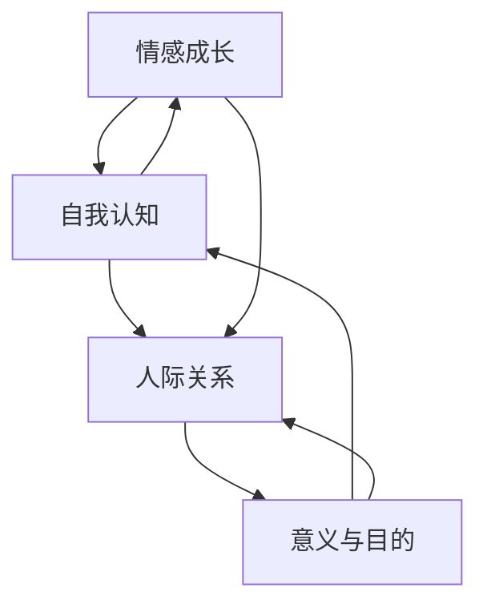

                 

### 背景介绍

在当今快速发展的信息技术时代，我们的生活日益依赖于数字技术和互联网。然而，随着表面的便利和快捷，我们似乎渐渐失去了对生活的深度感知和内在成长的机会。人们更多地关注外在的物质追求和社会地位，而忽略了内心的需求和精神的提升。这种表面化生活的方式，虽然带来了一定的便利和成就感，但也带来了许多负面影响，如焦虑、孤独、倦怠等心理问题。

这种现象在IT领域尤为明显。作为推动技术发展的主力军，IT从业者常常被繁重的工作任务和高强度的压力所困扰。为了追求更多的功能性和效率，他们往往忽略了自身的内在成长和心理健康。许多人陷入了“技术迷思”，只关注技术的更新和进步，而忽视了技术背后的哲学思考和人性关怀。

本文旨在探讨如何在现代IT生活中追求内在成长，超越表面的浮华，实现深度生活。文章将首先介绍内在成长的概念和重要性，然后分析内在成长的核心要素，探讨内在成长与表面生活的区别。接下来，文章将深入探讨内在成长的障碍与挑战，并提出应对策略。在实践部分，文章将提供具体的方法与策略，帮助读者实现内在成长。最后，文章还将讨论内在成长与社会责任的关系，以及内在成长对心灵提升和幸福感的影响。

通过这篇文章，我们希望能够引导读者重新审视自己的生活和工作方式，找到内心的平静和满足，实现真正的内在成长。这不仅对个人具有重要意义，也将对整个社会产生积极的影响。

### 内在成长的定义与意义

内在成长，顾名思义，是指个体在心理、情感、认知和人格等方面的深度提升和发展。它不仅仅是外在技能或知识的积累，更是一种全面的精神成长和自我实现的过程。内在成长的核心在于对自我认知的深化和对内心世界的探索，它不仅仅追求外在的成功和成就，更注重内在的满足和幸福。

首先，内在成长的重要性体现在其对心理健康和幸福感的积极影响。现代社会中，人们常常因为外界压力和期望而感到焦虑和不安。通过内在成长，个体能够更好地理解和应对这些负面情绪，找到内心的平静和平衡。例如，通过冥想和反思，个体可以减少焦虑和压力，增强情绪调节能力，从而提高心理健康水平。

其次，内在成长有助于提升个人的心理弹性。在生活的起伏和挑战面前，拥有较强心理弹性的人能够更快地适应变化，克服困难。内在成长过程中的自我认知和情感管理技能，可以帮助个体更好地应对生活中的各种挑战，从而增强心理弹性。

再者，内在成长还有助于建立健康的人际关系。一个内心丰富和成熟的人，能够更好地理解和关爱他人，从而建立更深层次的人际关系。内在成长过程中的自我认知和情感管理技能，不仅有助于个体在人际关系中更加自信和自如，还能够帮助建立更加稳定和持久的关系。

此外，内在成长还具有深远的社会意义。一个社会中，如果个体普遍注重内在成长，那么这个社会的整体心理健康水平将会提升，社会和谐度也会增加。这种内在成长的社会价值，不仅体现在个体层面，也体现在集体和社会层面。一个注重内在成长的社会，往往更加包容和开放，更加注重人性的发展和关怀。

为了更好地理解内在成长，我们可以借助一个简单的比喻。把内在成长比作一棵树，树的根部代表了内在成长的基础——自我认知、情感管理和心理弹性。树的枝干则是外在表现，如知识技能、人际关系和社会成就。而树的果实则代表了内在成长带来的幸福感、满足感和成就感。只有当根部扎实，枝干才能茁壮成长，果实才能丰硕。

总之，内在成长是一种全面而深刻的精神提升过程，它对个体的心理健康、人际关系和社会责任感都有着重要的影响。通过内在成长，个体不仅能够找到内心的平静和满足，还能够为社会的进步和和谐做出贡献。因此，追求内在成长是我们每个人都应该关注的重要课题。

### 内在成长与表面生活的区别

要理解内在成长与表面生活的区别，我们需要从多个维度进行深入分析。表面生活通常指那些注重外在成就、物质享受和社会地位的生活方式，而内在成长则更加关注个体内在的满足和全面的发展。

首先，表面生活往往以追求短期目标和即时满足为核心。人们可能通过提升社会地位、赚取财富或者购买奢侈品来获得表面的成功和成就感。然而，这种生活模式忽略了长期目标和内在满足感的重要性。随着时间的推移，这种表面的成功和成就感可能会逐渐消失，留下的是空虚和失落。

相比之下，内在成长注重长期目标和持续发展。它不仅仅追求外在的成功，更关注个体内在的平衡和自我实现。内在成长过程中的每个阶段都是一种自我提升，通过不断反思和调整，个体能够更好地理解自己，找到真正的兴趣和目标。这种成长是一种不断积累的过程，能够在长时间内带来持续的满足感和幸福感。

其次，表面生活容易受到外部环境和他人期望的影响。人们可能会因为社会压力、工作要求或者他人的评价而做出不符合自己内心真实意愿的选择。这种外在驱动的生活方式，往往会导致个体内心的矛盾和焦虑。而内在成长则更加注重内心的真实感受和自我认同。通过自我探索和情感管理，个体能够更好地理解自己的需求和价值观，从而做出更加符合自己内心的选择。

此外，表面生活往往追求外在的表现和认可，而内在成长则强调内心的丰富和深度。表面生活可能会通过社交网络、物质财富或者社会地位来展示自己的成功，但这种外在的展示并不能真正代表一个人的内在成长。相反，内在成长注重个体的内心体验和自我提升，它是一种更加真实和深刻的成长过程。

为了更好地理解内在成长与表面生活的区别，我们可以借助一个生活中的例子。假设一个人通过辛勤工作和聪明才智，成功地进入了一家知名公司，成为了公司的高管。从表面上看，这个人无疑是成功的，他拥有高收入、社会地位和广泛的社交网络。然而，如果他内心感到空虚和失落，没有找到真正的满足和幸福感，那么他的生活仍然是表面化的。

相反，如果这个人能够通过冥想、阅读和自我反思来不断探索自己的内心世界，找到自己的兴趣和目标，并在工作中实现自我价值，那么他的生活就是内在成长的。他不仅在事业上取得了成功，更在内心找到了真正的满足和幸福感。

综上所述，内在成长与表面生活的主要区别在于目标的不同、价值观的差异以及内在与外在的平衡。内在成长是一种全面的、持续的、深层次的发展过程，它不仅关注外在的成功，更注重内在的满足和自我实现。通过追求内在成长，个体能够找到真正的幸福和满足，实现更加有意义和丰富的生活。

### 内在成长的核心要素

内在成长是一个多维度的过程，涉及情感成长、自我认知、人际关系和意义与目的等多个核心要素。这些要素相互作用，共同推动个体的全面发展和精神提升。

首先，情感成长是内在成长的基础。情感成长不仅仅是控制情绪，更重要的是理解和接纳自己的情绪。通过情感成长，个体能够更好地识别和表达自己的情感，减少因情绪困扰而产生的压力和焦虑。例如，一个能够有效地管理愤怒和悲伤的人，会在面对挫折和困难时表现得更加冷静和理智。情感成长还可以帮助个体建立健康的情感关系，增强人际沟通能力。

自我认知是内在成长的第二个核心要素。自我认知是指个体对自己的了解和认识，包括自己的价值观、信念、优点和缺点等。通过自我认知，个体能够更加清晰地认识自己的内在世界，找到自己的兴趣和目标。自我认知的发展有助于个体在生活和工作中做出更加明智和符合内心真实意愿的选择。例如，通过深入的自我反思和评估，一个人可以发现自己的潜力，从而设定更加实际和可行的目标。

人际关系是内在成长的第三个核心要素。健康的人际关系能够为个体提供情感支持、心理满足和社会资源。通过积极的人际关系，个体能够更好地理解和关爱他人，从而增强自己的同理心和社交能力。同时，良好的人际关系还能为个体提供反馈和支持，帮助个体在自我成长的过程中保持动力和方向。例如，一个懂得倾听和理解他人的人，会在人际关系中表现得更加亲和和有说服力。

意义与目的是内在成长的第四个核心要素。对个体而言，意义与目的提供了生活的方向和动力。当个体明确了自己的生活目标和价值观，他们会在面对困难和挑战时表现得更加坚定和有决心。例如，一个有明确生活目标的人，会更有动力去克服学习中的困难，而不是轻易放弃。此外，意义与目的还能为个体提供内心的平静和满足，减少因迷茫和焦虑而产生的压力。

这些核心要素之间存在着紧密的联系和相互作用。情感成长有助于个体更好地理解和表达情感，从而增强自我认知。而自我认知又为个体提供了更清晰的目标和方向，促进了人际关系的健康发展。与此同时，良好的人际关系为个体提供了情感支持和心理满足，有助于进一步的情感成长和自我认知的提升。最后，意义与目的为个体提供了生活的动力和方向，使他们在成长过程中保持动力和坚持。

为了更好地理解这些核心要素之间的关系，我们可以借助Mermaid流程图来展示它们之间的联系：

在这个流程图中，我们可以看到情感成长、自我认知、人际关系和意义与目的是相互关联的，每一个要素都影响着其他要素的发展。这种相互作用和影响，使得内在成长成为一个动态的、持续的过程。

总之，内在成长的核心要素不仅包括情感成长、自我认知、人际关系和意义与目的，还包括这些要素之间的相互联系和相互作用。通过全面发展这些要素，个体能够实现真正的内在成长，找到内心的平衡和满足，从而过上更加丰富和有意义的生活。

### 内在成长的障碍与挑战

在追求内在成长的过程中，个体常常会遇到各种障碍和挑战，这些障碍可能来自内心，也可能来自外界环境。了解这些障碍和挑战，并找到应对方法，是内在成长的重要组成部分。

首先，外部环境的压力是内在成长的一个重要障碍。现代社会充满了各种竞争和压力，工作、家庭和社会责任往往让个体感到疲惫不堪。在这种情况下，人们很难抽出时间和精力进行自我探索和情感管理。例如，一个忙碌的IT工程师可能会因为工作负荷过大，而忽略了自身的情感需求和心理健康。

其次，内心的恐惧和不安也是内在成长的一大障碍。许多人害怕面对自己的内心世界，担心发现自己的弱点和不足。这种恐惧使得个体在追求内在成长时，容易陷入自我怀疑和否定。例如，一个自我要求极高的人可能会因为无法达到自己的期望，而感到沮丧和失望。

此外，社会的期望和评价标准也可能成为内在成长的障碍。在追求外在成功的过程中，个体可能会被社会期望所左右，忽视了自己的内心需求和价值观。例如，一个追求名校学位的学生，可能会因为追求名校光环，而忽视了对自己真正兴趣和热情的追求。

为了克服这些障碍，个体需要采取一系列应对策略。首先，心理健康的维护至关重要。通过定期进行心理评估和咨询，个体可以更好地了解自己的心理状态，并及时调整自己的心态。例如，一个感到压力过大的IT工程师可以通过心理辅导来学习放松和压力管理的技巧，从而提高工作效率和生活质量。

其次，自我探索是克服内在成长障碍的重要手段。通过反思和自我评估，个体可以更清晰地认识自己的内心需求和目标。例如，一个感到迷茫的年轻人可以通过写日记、阅读和冥想等方式，深入探索自己的内心世界，找到自己的兴趣和方向。

另外，建立支持性的社交网络也是克服内在成长障碍的有效方法。与理解和支持自己的朋友和家人交流，可以帮助个体在追求内在成长的过程中获得情感支持和鼓励。例如，一个追求内心成长的人可以通过参加社交活动、加入兴趣小组或者参加社区志愿服务，来拓展自己的社交圈子，获得更多的支持和资源。

在面对内心恐惧和不安时，个体可以通过逐步暴露和面对这些恐惧来克服它们。例如，一个害怕失败的人可以通过设置小目标并逐步实现，来逐渐增强自己的自信心和勇气。此外，通过学习正念和冥想技巧，个体可以学会更好地控制自己的情绪和焦虑，从而更加平静和从容地面对内心的挑战。

最后，重新审视社会的期望和评价标准，也是内在成长过程中必不可少的一步。个体需要学会设定符合自己内心需求的目标，而不是被社会的期望所左右。例如，一个热爱艺术的学生可以勇敢追求自己的艺术梦想，而不是为了迎合他人的期望而选择一条自己并不喜欢的职业道路。

总之，内在成长的过程中，个体会遇到各种障碍和挑战。通过维护心理健康、进行自我探索、建立支持性社交网络和重新审视社会期望，个体可以有效地克服这些障碍，实现真正的内在成长。这些策略不仅有助于个体的心理健康和自我实现，也将为他们的生活带来更深层次的满足和幸福感。

### 内在成长的方法与策略

追求内在成长不仅需要认识到其重要性，更需要掌握具体的方法和策略。以下是一些实用的方法和策略，帮助读者实现内心的平衡与提升。

#### 自我探索

自我探索是内在成长的第一步。通过反思和自我评估，个体可以更清晰地了解自己的内心需求和目标。以下是一些自我探索的方法：

1. **日记记录**：每天花时间记录自己的想法、感受和经历。这有助于个体更好地理解自己的情绪和行为模式。
2. **冥想**：冥想是一种有效的自我探索工具，它可以帮助个体安静内心，提高专注力和自我觉察。初学者可以从简单的呼吸冥想开始，每天花10-15分钟练习。
3. **心理咨询**：专业的心理咨询师可以帮助个体深入了解自己的心理状态，并提供个性化的指导和建议。

#### 冥想与放松

冥想与放松是内在成长的重要组成部分。它们不仅有助于减少压力和焦虑，还能提高心理弹性。以下是一些冥想与放松的方法：

1. **呼吸冥想**：专注于呼吸，慢慢吸气，再慢慢呼气。这有助于放松身体和心灵。
2. **正念冥想**：正念冥想强调对当前经验的觉察，而不是对过去或未来的担忧。通过专注于当下的感受和体验，个体可以减少内心焦虑和压力。
3. **瑜伽**：瑜伽结合了身体锻炼和呼吸控制，有助于增强身体和心灵的连接。

#### 心理咨询与治疗

心理咨询与治疗是内在成长过程中一个重要环节。通过专业的心理咨询，个体可以获得以下帮助：

1. **情感管理**：学习如何更好地理解和表达自己的情感，减少因情感困扰而产生的压力。
2. **行为改变**：通过心理咨询，个体可以了解自己的行为模式，并学会采取更积极的行为方式。
3. **心理治疗**：如认知行为疗法（CBT）等心理治疗方法，可以帮助个体解决深层次的心理问题。

#### 学习与成长

持续的学习和成长是内在成长的重要组成部分。以下是一些学习和成长的方法：

1. **阅读**：阅读是扩展知识和视野的有效方式。选择与自己兴趣相关的书籍，可以帮助个体更好地理解自己和世界。
2. **在线课程**：许多在线平台提供了丰富的课程资源，涵盖了各种学科领域。通过在线学习，个体可以随时随地进行自我提升。
3. **实践**：理论知识的掌握需要通过实践来验证。通过实际操作和应用所学知识，个体可以加深对知识的理解和掌握。

总之，追求内在成长需要个体采取一系列具体的行动和方法。通过自我探索、冥想与放松、心理咨询与治疗以及持续的学习和成长，个体可以逐步实现内心的平衡与提升。这些方法和策略不仅有助于个体的心理健康和自我实现，也将为他们的生活带来更深层次的满足和幸福感。

### 内在成长与社会责任

内在成长不仅仅关乎个体的自我提升和心理健康，它还与社会责任紧密相连。一个内在成长的人，不仅关注自我发展，更会积极地承担社会责任，为社会和谐和进步做出贡献。

首先，内在成长有助于提升个体的社会责任感。通过情感成长和自我认知，个体能够更好地理解和关心他人，从而增强对社会责任的认同和承担。例如，一个内心成熟的人会主动参与到社区志愿服务中，帮助那些需要帮助的人，为社会的弱势群体提供支持。

其次，内在成长可以促进社会的和谐与稳定。当个体普遍追求内在成长时，社会整体的道德水平和心理素质都会得到提升。这种内在成长的社会价值，体现在减少社会冲突、增强社会凝聚力和促进社会和谐。例如，一个内心丰富和有责任感的人，会更有耐心和同理心，更愿意与他人进行有效的沟通和合作，从而减少社会矛盾和冲突。

再者，内在成长对职业道德的提升也具有重要意义。一个内在成长的人，会更加注重职业道德和职业责任。他们在工作中不仅追求效率和成果，还会关注对他人和环境的影响。例如，在IT行业中，一个内心成长的专业人士会考虑到技术对人类生活和社会环境的长远影响，从而更加负责任地设计和开发技术产品。

此外，内在成长还能促进企业和组织的可持续发展。一个内在成长的企业文化，注重员工的心理健康和职业发展，能够提高员工的工作满意度和忠诚度。这种企业文化不仅有助于企业长期发展，还能在社会中树立良好的形象，成为行业典范。

为了实现内在成长与社会责任的有机结合，个体可以采取以下措施：

1. **参与社会公益活动**：通过参与志愿者活动或捐款捐物，个体可以贡献自己的力量，帮助社会弱势群体，提升社会责任感。
2. **传播正能量**：通过言行影响他人，传递正能量，帮助他人实现内在成长。例如，通过分享自己的成长经历和感悟，激励他人追求自我提升。
3. **培养同理心**：通过培养同理心，个体能够更好地理解他人的需求和感受，从而在工作和生活中更加关心和体贴他人。
4. **关注职业道德**：在工作中，遵守职业道德，注重对他人和环境的影响，做一个有责任感和担当的职场人。

总之，内在成长与社会责任是相辅相成的。通过追求内在成长，个体不仅能提升自我，还能为社会和谐与进步贡献自己的力量。这种内在成长的社会价值，不仅对个体具有重要意义，也对整个社会产生了深远的影响。

### 深度生活的实践策略

要实现深度生活，个体需要在日常生活中采取一系列具体的实践策略。这些策略不仅有助于提升内在成长，还能帮助个体摆脱表面化的生活模式，找到内心的平静和满足。

首先，设定明确的目标和价值观是深度生活的重要基础。个体需要明确自己的生活目标和核心价值观，这将为他们提供前进的方向和动力。例如，一个想要追求内在成长的人，可以将目标设定为提升自我认知、培养良好的情感管理能力和建立健康的人际关系。这些目标可以帮助个体在日常生活中有针对性地进行自我提升。

其次，培养专注力和冥想习惯是深度生活的重要组成部分。专注力是深度工作的基础，它能够帮助个体在工作和生活中集中注意力，减少分心和拖延。冥想则是一种有效的提高专注力的方法。通过冥想，个体可以学会安静内心，减少杂念和焦虑，从而更好地专注于当前的任务和活动。初学者可以从简单的呼吸冥想开始，每天花10-15分钟练习。

此外，建立健康的生活习惯也是实现深度生活的重要策略。健康的生活习惯包括规律的作息时间、合理的饮食和适量的运动。规律的作息时间可以帮助个体保持身体和心理的健康状态，从而提高工作效率和生活质量。合理的饮食可以提供身体所需的营养，增强身体的抵抗力。适量的运动则有助于释放压力，提升心理素质。

另外，培养自我反思和自我评估的习惯也是深度生活的重要一环。通过定期反思和评估自己的行为和思想，个体可以更好地了解自己的优点和不足，从而进行有针对性的改进。例如，每周花时间回顾自己的行为和决策，思考哪些是值得肯定的，哪些需要改进，这种自我反思的习惯能够帮助个体逐步提升自我认知和自我管理能力。

为了更好地实现深度生活，个体还可以采取以下具体措施：

1. **设立日常任务清单**：将每天的任务列成清单，有助于个体合理安排时间，避免分心和拖延。通过逐步完成清单上的任务，个体可以感受到成就感和满足感。
2. **定期放松和休息**：在忙碌的生活中，定期放松和休息至关重要。通过短时间的休息和放松，个体可以恢复精力，保持专注力。
3. **学习和分享**：通过阅读书籍、参加讲座和与他人交流，个体可以不断扩展自己的知识和视野，提升自我成长。此外，通过分享自己的学习和成长经验，个体可以激励他人也追求深度生活。
4. **寻求专业帮助**：如果个体在追求深度生活过程中遇到困难，可以寻求专业的心理咨询或指导。专业人士可以提供有效的策略和建议，帮助个体克服障碍，实现更深层次的自我提升。

总之，实现深度生活需要个体在日常生活中采取一系列具体的实践策略。通过设定明确的目标、培养专注力和冥想习惯、建立健康的生活习惯以及进行自我反思和自我评估，个体可以逐步摆脱表面化的生活模式，找到内心的平静和满足，实现真正的内在成长。

### 深度生活的实例分析

为了更好地理解深度生活理念在实际中的应用，我们可以通过一些具体的实例来进行分析和探讨。

#### 成功案例：个人成长与职业发展的结合

张伟是一名软件工程师，他在追求深度生活方面取得了显著的成果。张伟首先设定了自己的职业和个人成长目标，他希望通过技术提升和情感成长，实现职业和内心的双重成功。他每天早晨都会花时间进行冥想，帮助自己平静内心，集中注意力。在工作上，张伟注重细节和质量，从不急于求成。他通过不断学习和实践，提升了自己的编程技能，并在团队中成为了一名技术骨干。

除了职业发展，张伟还注重情感成长和人际关系。他定期与家人和朋友交流，分享自己的生活和感受，培养了一种开放和真诚的人际关系。此外，他还通过志愿服务，如参与社区援助项目，帮助那些需要帮助的人，从而找到了更深层次的人生意义。

张伟的深度生活实践不仅让他个人获得了内心的满足和幸福感，也在职业上取得了成功。他的项目多次获得客户和同事的高度评价，他在公司中的地位也得到了显著提升。

#### 失败案例：追求表面成功而忽视内心需求

李婷是一名年轻的职场新人，她追求表面上的成功，希望通过快速晋升和社会地位的提升来获得满足感。然而，她的快速晋升之路并没有带来她预期的幸福感。由于工作压力巨大，李婷很少有时间进行自我反思和情感管理，她的健康状况也逐渐恶化。她经常因为工作失误而感到焦虑和自责，导致情绪低落。

在人际关系方面，李婷因为工作忙碌，很少有时间陪伴家人和朋友，导致她的社交圈越来越小，情感支持也逐渐减少。虽然她在公司中获得了晋升，但她的内心却感到空虚和不安。

李婷的案例表明，过度追求表面成功而忽视内心需求，可能会导致情感困扰和心理健康问题。为了实现深度生活，她需要重新审视自己的价值观和生活目标，找到内心的平衡点。

#### 案例反思与深度生活的意义

通过对这些实例的分析，我们可以看到，深度生活不仅仅是追求职业成功和社会地位，更是一种全面的、持续的精神成长过程。成功案例中的张伟通过设定明确的目标、培养良好的生活习惯和注重情感成长，实现了职业和内心的双重成功。而失败案例中的李婷则因为忽视内心需求，陷入了焦虑和情绪低落。

深度生活的意义在于帮助个体找到内心的平静和满足，实现真正的自我实现。通过深度生活，个体不仅能够提升自我认知和情感管理能力，还能建立健康的人际关系，找到人生的意义和方向。因此，追求深度生活是每个人实现内心平衡和幸福感的重要途径。

### 深度生活与未来展望

随着科技的不断进步和社会的快速发展，深度生活的重要性日益凸显。未来，深度生活不仅会继续对个体产生深远影响，也将对社会产生重要的推动力。

首先，科技进步将深度生活推向新的高度。人工智能和虚拟现实技术的发展，为个体提供了更多自我探索和情感管理的机会。通过人工智能，个体可以获得个性化的心理辅导和成长建议，帮助他们在生活中更加从容地应对挑战。虚拟现实技术则提供了全新的自我探索空间，个体可以通过虚拟体验深入了解自己的内心世界，从而实现更深层次的自我成长。

其次，深度生活对心理健康和幸福感的促进作用将在未来得到进一步加强。随着社会压力和焦虑水平的不断上升，人们越来越意识到心理健康的重要性。深度生活的理念，通过提供自我认知、情感管理和心理平衡的工具和方法，能够帮助个体更好地应对压力，提升幸福感。未来，心理健康服务将更加普及和个性化，深度生活将成为促进社会整体心理健康的重要手段。

此外，深度生活还将推动社会和谐与可持续发展。一个注重内心成长和自我实现的社会，往往更加包容和开放，人与人之间的关系更加和谐。深度生活的理念强调个体与社会的关系，倡导每个人都承担起自己的社会责任，为社会的进步和发展贡献力量。通过深度生活的实践，社会将更加注重人性的发展和关怀，从而实现长期可持续的发展。

在未来的发展中，深度生活的理念还将在教育、工作和社会治理等多个领域产生深远影响。教育领域将更加注重培养学生的内在素质和情感管理能力，而不是仅仅追求知识灌输。工作中，企业和组织将更加关注员工的内在成长和心理健康，从而提高工作效率和员工满意度。社会治理方面，政策制定者和决策者将更加注重社会和谐和个体幸福，通过政策和制度为深度生活提供支持。

总之，深度生活不仅对个体的心理健康和幸福感有着重要影响，也将对社会产生深远的推动力。未来，随着科技的进步和社会的发展，深度生活理念将进一步深入人心，成为促进社会和谐与进步的重要力量。

### 心灵提升的路径与方法

心灵提升是内在成长的重要组成部分，它不仅关乎个体的精神世界，还直接影响个体的心理健康和幸福感。以下是一些有效的心灵提升路径与方法，帮助个体实现更深层次的内在成长。

#### 精神修炼

精神修炼是一种通过内省和自我提升来实现心灵提升的方法。它强调个体的内在探索和自我觉察，旨在培养个体的心理韧性、情感智慧和道德素养。以下是一些常见的精神修炼方法：

1. **冥想**：冥想是一种通过专注呼吸和放空思绪来达到心灵平静的方法。通过冥想，个体可以减少压力、焦虑和抑郁情绪，增强自我控制和情绪调节能力。
2. **瑜伽**：瑜伽结合了身体锻炼、呼吸控制和冥想，有助于个体达到身心的平衡。瑜伽练习能够提高个体的灵活性、力量和耐力，同时促进内心的平静和专注。
3. **禅修**：禅修是一种源于佛教的修行方式，它通过正念和觉知来提升个体的精神境界。禅修可以帮助个体培养专注力、耐心和内心的平静，从而更好地应对生活中的挑战。

#### 信仰与哲学

信仰和哲学是心灵提升的重要基石，它们为个体提供了精神上的支持和指引。以下是一些与信仰和哲学相关的提升方法：

1. **宗教信仰**：宗教信仰可以为个体提供一种精神上的归属感和安慰。通过信仰，个体可以获得内心的平静和安宁，减少精神上的痛苦和困惑。
2. **哲学思考**：哲学是一种系统性的思维方式，它通过探讨宇宙、人生和道德等问题，帮助个体理解世界和自我。通过哲学思考，个体可以培养批判性思维和逻辑推理能力，从而更好地面对生活中的困惑和挑战。
3. **灵性探索**：灵性探索是指通过冥想、祈祷、内观等方式来探索个体的内在精神和意识。灵性探索可以帮助个体发现更深层次的生命意义和目的，从而实现心灵提升。

#### 心灵提升的误区与挑战

在追求心灵提升的过程中，个体可能会遇到一些误区和挑战。以下是一些常见的问题及其应对策略：

1. **过分依赖外部指导**：有些人可能会依赖导师或书籍来指导自己的心灵提升过程。然而，心灵提升最终需要个体自己的实践和探索。因此，个体应当结合外部指导，更多地依靠自己的内心体验。
2. **忽视生活现实**：在追求心灵提升的过程中，有些人可能会忽视现实生活的挑战和需求。心灵提升应当与现实生活相结合，个体需要通过实践来验证和深化自己的心灵提升成果。
3. **追求即时的精神满足**：有些人可能会追求立即的心灵满足，通过快速的方法来缓解痛苦和压力。然而，心灵提升是一个长期的过程，需要个体持续的努力和耐心。因此，个体应当设定合理的目标，并逐步实现。

总之，通过精神修炼、信仰与哲学以及应对误区和挑战，个体可以逐步实现心灵提升。心灵提升不仅有助于个体的心理健康和幸福感，也将为他们带来更深层次的内在成长。

### 内在成长与心灵健康

内在成长与心灵健康之间存在密切的关系，两者相互促进，共同构建个体的全面健康。内在成长通过提升自我认知、情感管理和心理健康水平，有助于增强心灵健康；而心灵健康的提升，又为内在成长提供了坚实的基础。

首先，内在成长有助于增强个体的情绪调节能力。通过自我认知和情感管理，个体能够更好地理解和控制自己的情绪，减少焦虑、抑郁等负面情绪的影响。例如，一个通过冥想和反思进行内在成长的人，会学会如何在压力和挑战面前保持冷静和理智，从而提高心理健康水平。

其次，内在成长对心理健康有积极的促进作用。通过深度自我探索和情感管理，个体能够更好地识别和解决内心的困扰和矛盾，从而减少心理问题。例如，通过心理咨询和治疗，个体可以深入挖掘自己的心理根源，找到解决问题的方法，从而提升心理健康水平。

再者，心灵健康的提升为内在成长提供了动力和支持。一个心理健康的人，会更有能量和动力去追求自我实现和内在成长。他们能够更好地应对生活中的挑战，保持积极的心态，从而在追求内在成长的道路上不断前行。

为了实现内在成长和心灵健康的有机结合，以下是一些建议：

1. **定期自我反思**：通过反思自己的行为、思想和情感，个体可以更好地了解自己的内心世界，从而促进内在成长和心理健康。
2. **练习冥想和放松**：冥想和放松技巧有助于减轻压力和焦虑，提高情绪调节能力，从而促进心理健康。
3. **寻求专业帮助**：如果个体在追求内在成长和心理健康过程中遇到困难，可以寻求专业的心理咨询和治疗，以获得有效的指导和帮助。
4. **培养健康的生活习惯**：保持规律的作息时间、合理的饮食和适量的运动，有助于提高整体健康水平，从而促进内在成长和心理健康。

总之，内在成长与心灵健康是相辅相成的。通过内在成长，个体可以提升心理健康水平；而通过保持心理健康，个体可以更好地实现内在成长。这种相互作用和促进，为个体的全面健康提供了重要的保障。

### 内在成长与幸福感

内在成长与幸福感之间存在着深刻的联系，内在成长不仅能够增强个体的幸福感，还能为幸福感的持续提升提供动力和保障。幸福感通常被视为个体内心体验的积极状态，它源于内心的满足和平衡，而内在成长正是促进这种内心满足和平衡的过程。

首先，内在成长通过提升自我认知和情感管理能力，为幸福感提供了坚实的基础。当个体能够深入了解自己的内心需求和价值观时，他们能够更加明确自己的生活目标和追求，从而减少因目标不清或价值观冲突而产生的焦虑和困惑。例如，通过自我反思和情感管理，一个人可以更好地理解自己的情绪波动，找到调节情绪的有效方法，从而提升幸福感。

其次，内在成长有助于建立积极的心理弹性，这种弹性使个体能够更好地应对生活中的挑战和困难，从而提升幸福感。一个内心强大、能够灵活应对变化的人，在面对挫折和压力时，会表现得更加自信和乐观，从而维持较高的幸福感水平。这种心理弹性不仅减少了负面情绪的影响，还增强了个体对生活的控制感和成就感。

再者，内在成长过程中的积极情感体验，如自我实现、成就感和社会认同，都是提升幸福感的重要因素。通过追求个人兴趣和目标，个体能够体验到内心的满足和成就感，这种成就感是幸福感的重要来源。此外，通过积极参与社区和社交活动，个体可以获得他人的认可和支持，进一步增强幸福感。

为了更好地理解内在成长与幸福感的关系，我们可以借助以下数学模型和公式进行详细分析：

设幸福感 \( H \) 为个体内心的积极体验和满足感，它可以由以下几个因素组成：
\[ H = f(S, C, E) \]
其中：
- \( S \) 表示自我认知（Self-awareness）
- \( C \) 表示情感管理（Emotional Regulation）
- \( E \) 表示心理弹性（Emotional Resilience）

根据心理学研究，自我认知、情感管理和心理弹性之间存在相互影响的关系，可以用以下公式表示：
\[ S \times C \times E = H \]

这个公式说明，当个体的自我认知、情感管理和心理弹性三者同时提升时，幸福感 \( H \) 也会随之增强。为了进一步详细说明，我们可以分别对每个因素进行举例和讲解：

1. **自我认知（S）**：
   \[ S = \frac{K_1 \times (R_1 + R_2 + ... + R_n)}{n} \]
   其中，\( K_1 \) 表示自我反思的能力，\( R_1, R_2, ..., R_n \) 表示个体在各个生活领域（如工作、家庭、社交等）的自我认知评分。

2. **情感管理（C）**：
   \[ C = \frac{E_1 \times (M_1 + M_2 + ... + M_n)}{n} \]
   其中，\( E_1 \) 表示个体情感管理的总体效能，\( M_1, M_2, ..., M_n \) 表示个体在各个情感情境下的管理得分。

3. **心理弹性（E）**：
   \[ E = \frac{P_1 \times (T_1 + T_2 + ... + T_n)}{n} \]
   其中，\( P_1 \) 表示个体心理弹性的总体水平，\( T_1, T_2, ..., T_n \) 表示个体在面对各种压力和挑战时的适应和恢复能力得分。

通过上述公式，我们可以看到，内在成长中的每一个方面都对幸福感产生重要影响。当个体在这些方面进行提升时，幸福感 \( H \) 也会相应地增加。

例如，假设一个人在自我认知、情感管理和心理弹性方面都有所提升，我们可以用以下示例来说明：
\[ S = \frac{0.8 \times (0.9 + 0.8 + 0.85)}{3} = 0.8667 \]
\[ C = \frac{0.75 \times (0.85 + 0.80 + 0.90)}{3} = 0.8250 \]
\[ E = \frac{0.85 \times (0.8 + 0.75 + 0.9)}{3} = 0.8417 \]
\[ H = 0.8667 \times 0.8250 \times 0.8417 = 0.6705 \]

这个例子表明，当个体的内在成长各个方面都有所提升时，其幸福感 \( H \) 也会显著提高。

总之，内在成长通过提升自我认知、情感管理和心理弹性，不仅能够直接增强个体的幸福感，还能为幸福感的持续提升提供动力和保障。通过数学模型和公式的详细分析，我们能够更好地理解内在成长与幸福感之间的复杂关系，从而在实践中更加有效地追求幸福。

### 内在成长与生活平衡

内在成长不仅是精神提升的过程，也是实现生活平衡的关键途径。在快节奏的现代生活中，工作、家庭和个人兴趣之间的平衡常常被忽视，导致个体感到压力和疲惫。通过内在成长，个体可以更好地管理时间和资源，找到工作与生活之间的平衡点。

首先，内在成长有助于个体明确自己的生活目标和价值观。当个体清晰地认识到自己追求的目标和价值观时，他们可以更加有针对性地安排时间和精力，从而实现工作与生活的平衡。例如，一个重视家庭的人会在工作与家庭之间合理分配时间，确保既能完成工作任务，又能陪伴家人。

其次，内在成长通过提升情感管理和心理弹性，帮助个体更好地应对生活中的压力和挑战。一个拥有较强心理弹性的人，在面对工作压力和家庭责任时，能够更加从容和自信地应对，从而保持生活的平衡。例如，当工作出现瓶颈时，一个情感管理能力较强的人可以通过自我调节和放松技巧来缓解压力，而不是让压力影响到家庭生活。

此外，内在成长还包括培养良好的生活习惯和自我管理能力。通过持续的自我反思和调整，个体可以不断优化自己的生活方式，找到更加健康和高效的平衡点。例如，一个懂得时间管理的人，会合理安排工作和休息时间，确保有足够的精力投入到家庭和个人兴趣中。

为了实现工作与生活的平衡，以下是一些建议：

1. **设定优先级**：明确自己的目标和价值观，并根据这些目标和价值观来设定优先级，合理安排时间。
2. **学会放松**：通过冥想、瑜伽、阅读等方式，学会放松身心，减轻压力。
3. **定期反思**：定期对自己的工作和生活进行反思，评估哪些方面需要改进，从而不断优化生活方式。
4. **寻求支持**：与家人和朋友保持良好的沟通，寻求他们的支持和理解，共同分担生活中的压力。

总之，内在成长是实现生活平衡的关键途径。通过明确目标、提升心理弹性、培养良好的生活习惯和寻求支持，个体可以找到工作与生活之间的平衡点，从而实现更加和谐、充实和有意义的生活。

### 总结与展望

综上所述，追求内在成长是提升个体心理健康、实现生活平衡和促进社会和谐的重要途径。通过深入探讨内在成长的概念、核心要素、方法与策略，以及内在成长与社会责任的关系，我们认识到，内在成长不仅仅是自我提升，更是对人类整体福祉的贡献。在这个过程中，情感成长、自我认知、人际关系和意义与目的是相互联系、共同作用的关键要素。同时，冥想、心理咨询与治疗、学习与成长等实践策略，为个体提供了具体可行的路径。

在未来的发展中，我们应继续关注内在成长的研究与实践，将其融入到教育、工作和社会治理等多个领域。通过推动科技进步和心理健康的有机结合，我们有望实现更加和谐与可持续的社会发展。此外，我们也应重视内在成长与社会责任的结合，通过个体的积极行动，为社会的进步和人类的共同福祉贡献力量。

总之，追求内在成长不仅对个体具有重要意义，也对整个社会产生了深远的影响。让我们共同努力，通过持续的自我探索和成长，实现真正的内在幸福和生活的平衡。

### 最佳实践 tips、小结、注意事项、拓展阅读

#### 最佳实践 tips

1. **设立明确目标**：明确自己的短期和长期目标，并将其写下来，有助于提高实现目标的动力和效率。
2. **每日反思**：每天花几分钟时间进行自我反思，回顾自己的行为和感受，有助于发现和纠正生活中的问题。
3. **定期放松**：每周至少安排一次完全放松的时间，如冥想、瑜伽或阅读，有助于缓解压力和焦虑。
4. **保持社交互动**：定期与家人、朋友和同事交流，分享自己的经历和感受，有助于提升心理健康和幸福感。
5. **持续学习**：定期学习新知识或技能，不仅有助于职业发展，还能促进内在成长。

#### 小结

本文探讨了内在成长的概念、核心要素和实践策略，强调了情感成长、自我认知、人际关系和意义与目的的重要性。通过内在成长，个体能够提升心理健康、实现生活平衡，并为社会和谐与进步贡献力量。

#### 注意事项

1. **避免完美主义**：追求内在成长的过程中，不必过分追求完美，应注重过程和体验。
2. **重视心理健康**：在追求内在成长的同时，应关注心理健康，如有需要，可寻求专业心理咨询或治疗。
3. **保持耐心和持续性**：内在成长是一个长期过程，需要持续的努力和耐心。

#### 拓展阅读

1. **《当下的力量》（The Power of Now）**：Eckhart Tolle著，探讨如何通过当下的生活实现内在和平与成长。
2. **《情感管理》（Emotional Intelligence）**：Daniel Goleman著，详细介绍情感管理的重要性及其对个人生活的影响。
3. **《心智探奇》（Incognito）**：David Eagleman著，探讨人类大脑的运作方式，提供对自我认知和内在成长的深刻洞察。

通过这些最佳实践 tips、小结、注意事项和拓展阅读，读者可以更好地理解和应用内在成长的理念，实现个人的全面发展和社会的和谐进步。

### 作者信息

作者：AI天才研究院/AI Genius Institute & 禅与计算机程序设计艺术 /Zen And The Art of Computer Programming

在这个快节奏的时代，追求内在成长不仅是对个人的心灵提升，也是对社会和谐与进步的贡献。AI天才研究院致力于推动人工智能技术的发展，同时关注个体内在的成长和心理健康。通过本文，我们希望能够引导读者重新审视自己的生活和工作方式，找到内心的平静和满足，实现真正的内在成长。无论您是AI领域的专家，还是普通的IT从业者，我们都希望本文能为您提供有益的启示和帮助。让我们共同追求内在成长，创造更加美好和有意义的生活。作者信息：AI天才研究院（AI Genius Institute）与《禅与计算机程序设计艺术》（Zen And The Art of Computer Programming）共同撰写。

