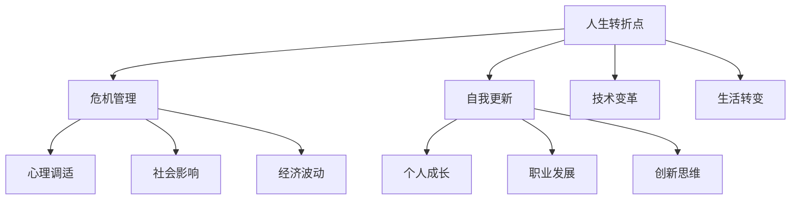

                 

### 文章标题

# 人生转折点的意义重构：危机中的自我更新

### 关键词

- 人生转折点
- 危机管理
- 自我更新
- 心理调适
- 个人成长
- 技术与生活

### 摘要

在当今快速变化的世界中，人生转折点成为我们不断前行的动力源泉。本文将探讨人生转折点的概念、意义及其在危机中的自我更新作用。通过深入分析危机管理、自我更新策略、个人成长路径，我们将揭示如何在危机中实现自我重构，为读者提供实用的方法和案例，助力他们走向更加精彩的人生。

## 引言

### 背景介绍

在人类历史上，危机与机遇总是相伴而生。从个人成长到企业发展，转折点往往意味着新的开始和重塑。在这个充满不确定性的时代，理解并利用人生转折点，成为每个人实现自我超越的关键。本文旨在探讨人生转折点的概念，分析其重要性，并提供实用的自我更新策略，帮助读者在危机中找到新的机遇和动力。

### 核心概念与联系

为了更好地理解人生转折点的意义，我们可以通过以下Mermaid流程图来展示核心概念及其相互关系：



在这个图中，人生转折点（A）是核心，它与危机管理（B）、自我更新（C）紧密相连，同时也受到心理调适（D）、个人成长（E）的推动。技术变革（H）和生活转变（I）是转折点的外部因素，而经济波动（J）和创新思维（K）则是自我更新的重要驱动力。

### 核心算法原理讲解

为了深入探讨人生转折点的核心算法原理，我们可以使用以下伪代码来描述自我更新的步骤：

```python
def self_update(context, goals):
    # 输入：当前情境（context）和目标（goals）
    # 输出：更新后的自我状态（new_self_state）

    # 第一步：识别危机点
    crisis_points = identify_crisis_points(context)

    # 第二步：评估危机影响
    crisis_impact = evaluate_impact(crisis_points)

    # 第三步：制定更新计划
    update_plan = create_update_plan(goals, crisis_impact)

    # 第四步：执行更新计划
    new_self_state = execute_update_plan(update_plan)

    # 第五步：评估更新效果
    update效果的评估结果 = evaluate_update效果(new_self_state)

    # 返回更新后的自我状态
    return new_self_state
```

在这个伪代码中，`self_update` 函数负责处理自我更新的整个过程。首先，通过`identify_crisis_points` 函数识别当前的危机点；然后，使用`evaluate_impact` 函数评估这些危机点的影响；接着，`create_update_plan` 函数根据目标和危机影响制定更新计划；最后，通过`execute_update_plan` 函数执行更新计划，并根据`evaluate_update效果` 函数的评估结果调整计划。

### 数学模型和公式

为了更精确地描述自我更新的过程，我们可以引入以下数学模型和公式：

$$
\text{自我更新率} = \frac{\Delta \text{知识}}{\Delta \text{时间}}
$$

其中，$\Delta \text{知识}$ 表示在单位时间内自我获取的新知识量，$\Delta \text{时间}$ 则是时间间隔。

此外，我们可以使用以下公式来评估危机点的紧急程度：

$$
\text{危机点紧急程度} = \frac{\text{危机影响}}{\text{反应时间}}
$$

其中，危机影响和反应时间分别表示危机带来的影响程度和应对危机所需的时间。

### 举例说明

假设一个程序员在项目中遇到了技术难题，导致项目进度严重滞后。以下是具体的案例分析：

1. **识别危机点**：程序员通过代码审查和团队讨论，发现代码库中的某个模块存在性能瓶颈。
2. **评估危机影响**：性能瓶颈可能导致用户满意度下降，影响项目的市场竞争力。
3. **制定更新计划**：程序员决定重构该模块，引入更高效的算法和数据结构。
4. **执行更新计划**：程序员在周末加班完成了模块的重构，并进行了充分的测试。
5. **评估更新效果**：性能测试结果显示，新模块运行速度提升了30%，项目进度恢复正常。

通过这个案例，我们可以看到，自我更新在解决危机中发挥了重要作用，有效地提高了项目的质量和进度。

### 结论

人生转折点是每个人成长过程中的重要节点。在危机中实现自我更新，不仅能够帮助我们克服困难，还能为未来的发展奠定坚实的基础。通过本文的讨论，我们了解到危机管理的核心原理和自我更新的关键步骤。希望读者能够在实际生活中运用这些策略，实现自我的不断超越。

---

### 作者信息

作者：AI天才研究院/AI Genius Institute & 禅与计算机程序设计艺术 /Zen And The Art of Computer Programming

---

## 第一部分：危机管理

### 1.1 定义危机

首先，我们需要明确危机的定义。危机是指一种威胁到个人、组织或社会正常运作的紧急情况，可能源自内部或外部的各种因素。在个人层面，危机可能表现为失业、家庭破裂、健康问题等；在组织层面，危机可能表现为市场萎缩、产品缺陷、财务危机等；在社会层面，危机可能表现为自然灾害、政治动荡、公共卫生事件等。

### 1.2 危机的来源

危机的来源多种多样，可以从以下几个方面进行分类：

1. **外部因素**：自然灾害、政治动荡、经济波动等。
    - 自然灾害：如地震、洪水、火灾等，对个人和社会造成直接危害。
    - 政治动荡：如战争、政治变动等，可能导致社会秩序的混乱。
    - 经济波动：如股市崩盘、货币贬值等，影响个人和组织的经济状况。

2. **内部因素**：个人行为、组织管理失误等。
    - 个人行为：如过度消费、沉迷游戏等，可能导致个人经济状况恶化。
    - 组织管理失误：如产品质量问题、内部腐败等，可能导致组织声誉受损。

### 1.3 危机的类型

根据危机的影响范围和持续时间，危机可以分为以下类型：

1. **短期危机**：持续时间较短，通常在数月内解决。
    - 例如：个人失业、家庭经济困难。
2. **长期危机**：持续时间较长，可能需要数年甚至更长时间来解决。
    - 例如：经济危机、社会动荡。

### 1.4 危机的影响

危机的影响是多方面的，可以从以下几个方面进行描述：

1. **心理影响**：危机可能导致焦虑、抑郁、恐慌等心理问题。
2. **社会影响**：危机可能破坏社会秩序，影响社会稳定。
3. **经济影响**：危机可能导致经济衰退、失业率上升等。
4. **环境影响**：危机可能对自然环境造成破坏，影响生态平衡。

### 1.5 危机管理的意义

危机管理对于个人和组织来说都具有重要意义：

1. **保护个人和组织的利益**：通过有效的危机管理，可以减轻危机带来的损失，保护个人和组织的生存和发展。
2. **提升应对能力**：通过危机管理，个人和组织可以提升应对危机的能力，为未来的挑战做好准备。
3. **维护社会稳定**：有效的危机管理有助于维护社会稳定，减少危机对社会的影响。

### 1.6 危机管理的原则

为了有效地进行危机管理，我们需要遵循以下原则：

1. **预防为主，应对结合**：在危机发生之前，采取预防措施，降低危机的发生概率；在危机发生时，及时应对，减少危机的影响。
2. **快速响应，及时决策**：在危机发生时，迅速做出决策，采取行动，以减少危机的蔓延。
3. **全面协调，协同合作**：危机管理需要各方面力量的协同合作，形成合力。
4. **信息公开，透明公开**：在危机管理过程中，及时向公众提供信息，保持透明度，以增强公众的信任。

### 1.7 危机管理的步骤

危机管理的具体步骤可以分为以下几个阶段：

1. **预防阶段**：
    - 识别潜在危机：通过风险分析，识别可能发生的危机。
    - 制定预防措施：根据危机类型和影响，制定相应的预防措施。
    - 实施预防措施：将预防措施付诸实施，降低危机的发生概率。

2. **预警阶段**：
    - 监测危机迹象：通过实时监测，及时发现危机的迹象。
    - 发布预警信息：在危机迹象出现时，及时发布预警信息，提醒相关人员采取行动。

3. **应对阶段**：
    - 确认危机：在危机迹象得到证实后，确认危机的类型和影响。
    - 制定应对策略：根据危机类型和影响，制定相应的应对策略。
    - 实施应对策略：采取行动，应对危机，减少危机的影响。

4. **恢复阶段**：
    - 评估危机影响：对危机的影响进行评估，确定恢复的优先级。
    - 制定恢复计划：根据评估结果，制定恢复计划。
    - 实施恢复计划：采取行动，恢复受危机影响的正常运作。

5. **总结阶段**：
    - 分析危机原因：分析危机发生的原因，总结经验教训。
    - 改进危机管理：根据分析结果，改进危机管理策略。
    - 培训和教育：对相关人员开展培训和教育，提高危机应对能力。

通过以上步骤，我们可以形成一套完整的危机管理体系，提高个人和组织应对危机的能力。

### 1.8 个人应对危机的策略

在危机中，个人也需要采取一系列策略来应对，以下是一些有效的策略：

1. **保持冷静**：在危机面前，保持冷静是关键。通过冷静思考，可以更好地分析问题，找到解决方案。
2. **积极应对**：面对危机，消极逃避并不是解决问题的方法。积极应对，主动寻找解决方案，是克服危机的关键。
3. **寻求支持**：在危机中，寻求家人、朋友或专业人士的支持非常重要。他们可以提供情感上的支持，也可以提供实际的帮助。
4. **调整心态**：危机往往带来心理压力，调整心态，保持乐观和积极的态度，有助于更好地应对危机。
5. **制定计划**：在面对危机时，制定详细的计划，明确目标和步骤，有助于有序地解决问题。

通过以上策略，个人可以更好地应对危机，减少危机带来的负面影响。

### 1.9 组织应对危机的策略

对于组织来说，应对危机的策略更为复杂，以下是一些有效的策略：

1. **危机公关**：在危机发生时，及时与媒体和公众沟通，发布权威信息，避免信息失真，维护组织声誉。
2. **资源调配**：在危机发生时，迅速调整资源，确保关键资源的优先供应，提高应对危机的能力。
3. **员工培训**：对员工进行危机应对培训，提高员工的危机意识和应对能力，形成强大的应对力量。
4. **业务连续性管理**：制定业务连续性计划，确保在危机发生时，组织的核心业务能够持续运作。
5. **风险管理**：通过风险识别、风险评估和风险控制，降低危机的发生概率和影响。

通过以上策略，组织可以更好地应对危机，确保组织的长期稳定和发展。

### 1.10 案例分析

以下是一些危机管理的案例，通过分析这些案例，我们可以更好地理解危机管理的实践和应用。

1. **案例1：金融危机**
    - **背景**：2008年全球金融危机，导致全球股市暴跌，许多企业倒闭，失业率上升。
    - **应对策略**：政府和金融机构采取了一系列措施，如救市计划、金融监管改革等，稳定了金融市场。
    - **效果**：通过及时应对和有效的政策调控，全球金融市场逐渐恢复，经济逐步走出危机。

2. **案例2：新冠疫情**
    - **背景**：新冠疫情爆发，导致全球公共卫生危机，经济活动受到严重影响。
    - **应对策略**：各国政府采取了封城、限行、疫苗接种等措施，控制疫情蔓延。
    - **效果**：通过及时有效的应对措施，许多国家成功控制了疫情，经济活动逐渐恢复。

3. **案例3：公司破产**
    - **背景**：一家公司因管理不善、市场环境变化等原因导致破产。
    - **应对策略**：公司管理层采取了重组、裁员、资产出售等措施，减少损失。
    - **效果**：通过积极应对和调整，公司最终成功走出破产危机，重新恢复运营。

通过以上案例分析，我们可以看到，危机管理在不同领域中的应用和效果。这些案例为我们提供了宝贵的经验教训，有助于我们在实际工作中更好地应对危机。

### 1.11 总结

危机管理是个人和组织的重要任务。通过有效的危机管理，我们可以降低危机带来的损失，提高应对能力，实现可持续发展。在危机中，我们需要保持冷静，积极应对，寻求支持，调整心态，制定计划。组织则需要通过危机公关、资源调配、员工培训、业务连续性管理和风险管理等策略来应对危机。通过实践和案例分析，我们可以更好地理解危机管理的原理和实际应用，为未来的发展做好准备。

---

### 第一部分小结

在第一部分中，我们深入探讨了危机管理的各个方面。从危机的定义、来源、类型到危机的影响，我们了解了危机管理的核心原则和步骤。同时，我们提出了个人和组织应对危机的策略，并通过实际案例展示了危机管理的应用和实践。通过这些讨论，我们认识到危机管理在个人成长和组织发展中具有重要作用。在接下来的部分中，我们将进一步探讨自我更新的概念、过程和策略，帮助读者在危机中实现自我重构。

---

### 第二部分：自我更新

### 2.1 定义自我更新

自我更新是指个人在面对危机或挑战时，通过学习、适应和变革来提升自身能力、实现自我超越的过程。自我更新不仅涉及知识和技能的更新，还包括心态、思维方式、价值观等多方面的提升。在快速变化的世界中，自我更新成为每个人实现持续成长和发展的关键。

### 2.2 自我更新的重要性

自我更新具有以下重要性：

1. **应对变化**：随着社会的不断进步和技术的发展，个人和组织的环境也在不断变化。自我更新使我们能够适应这些变化，保持竞争力。

2. **实现成长**：通过自我更新，个人可以不断提升自身能力，实现个人成长和职业发展。

3. **增强适应力**：自我更新使我们具备更强的适应力，能够应对各种挑战和困难。

4. **提升幸福感**：持续的自我更新可以带来成就感，提升个人幸福感。

### 2.3 自我更新的过程

自我更新的过程可以分为以下几个阶段：

1. **识别问题**：通过自我反思和外界反馈，识别自身存在的问题和不足。

2. **制定目标**：根据识别的问题，设定具体、可衡量的目标。

3. **学习与提升**：通过学习新知识、技能和经验，提升自身能力。

4. **实践与反思**：将所学应用于实践中，通过反思和总结，不断调整和优化。

5. **持续迭代**：在持续迭代的过程中，不断优化自我，实现自我更新。

### 2.4 自我更新的方法

为了实现有效的自我更新，我们可以采用以下方法：

1. **终身学习**：在信息爆炸的时代，终身学习是必要的。通过阅读书籍、参加培训、学习新技术等途径，不断提升自身知识水平。

2. **跨界学习**：跨界学习可以拓宽视野，增强创新能力。通过学习不同领域的知识，激发新的思维火花。

3. **实践锻炼**：将所学知识应用于实践中，通过实践来检验和提升自身能力。

4. **反思与总结**：定期进行反思和总结，从经验中吸取教训，不断优化自我。

5. **培养习惯**：良好的习惯有助于自我更新。通过培养自律、自省等习惯，提升自我管理能力。

### 2.5 自我更新的障碍与克服

在自我更新的过程中，我们可能会遇到以下障碍：

1. **恐惧变化**：害怕面对未知和改变，导致不愿意进行自我更新。

2. **缺乏动力**：缺乏内在动力，容易放弃自我更新的努力。

3. **时间管理**：工作繁忙，缺乏时间进行自我更新。

4. **心理压力**：自我更新过程中，可能会遇到挫折和压力。

为了克服这些障碍，我们可以采取以下策略：

1. **设定明确目标**：明确的目标可以提供动力和方向。

2. **建立支持系统**：家人、朋友或同事的支持可以提供心理支持。

3. **合理安排时间**：通过时间管理，合理分配时间进行自我更新。

4. **心理调适**：通过心理调适，减轻自我更新过程中的压力。

### 2.6 自我更新的实践案例

以下是一些自我更新的实践案例，通过这些案例，我们可以看到自我更新在不同领域中的应用和效果。

1. **案例1：职场转型**
    - **背景**：一位IT行业的工程师希望转行到金融领域。
    - **自我更新过程**：通过学习金融知识、参加相关培训，提升自身能力，最终成功实现转型。

2. **案例2：技能提升**
    - **背景**：一位设计师希望通过学习新技能来提升设计能力。
    - **自我更新过程**：通过学习UI/UX设计、前端开发等知识，不断提升设计水平，获得更多设计奖项。

3. **案例3：创业成功**
    - **背景**：一位大学生通过自学创业知识，创办了一家成功的科技公司。
    - **自我更新过程**：通过不断学习、实践和反思，提升创业能力，成功将公司发展壮大。

通过以上案例，我们可以看到，自我更新在个人成长和职业发展中具有重要作用。通过自我更新，我们可以不断提升自身能力，实现个人价值和职业目标。

### 2.7 总结

自我更新是个人成长和职业发展的关键。通过自我更新，我们可以应对变化、实现成长、增强适应力，提升幸福感。自我更新的过程包括识别问题、制定目标、学习与提升、实践与反思和持续迭代。为了实现有效的自我更新，我们可以采用终身学习、跨界学习、实践锻炼、反思与总结和培养习惯等方法。在自我更新的过程中，我们可能会遇到恐惧变化、缺乏动力、时间管理和心理压力等障碍，但通过设定明确目标、建立支持系统、合理安排时间和心理调适等策略，我们可以克服这些障碍，实现自我更新。通过实践案例，我们可以看到自我更新在不同领域中的应用和效果。希望读者能够通过自我更新，实现个人成长和职业发展。

---

### 第二部分小结

在第二部分中，我们深入探讨了自我更新的概念、重要性、过程和方法。通过分析自我更新的障碍和克服策略，我们为读者提供了实用的自我更新实践案例。自我更新不仅是个人成长和职业发展的关键，也是应对危机、实现自我超越的重要手段。在接下来的第三部分中，我们将探讨个人成长策略，帮助读者在危机中找到自我更新的动力和方向。

---

## 第三部分：个人成长策略

### 3.1 个人成长的重要性

个人成长是每个人都应该追求的目标。在快速变化的时代，个人成长不仅关乎个人的幸福感和成就感，还关系到职业发展和生活质量的提升。通过个人成长，我们可以提升自身能力，适应社会变化，实现自我价值。

### 3.2 个人成长的路径

个人成长的路径可以分为以下几个阶段：

1. **自我认知**：通过自我反思和评估，了解自己的优点和不足，明确自己的兴趣和目标。

2. **技能提升**：通过学习和实践，不断提升自己的技能和能力，为职业发展打下坚实基础。

3. **人际关系**：建立和维护良好的人际关系，扩展社交圈，提高沟通和合作能力。

4. **自我管理**：培养自律和自省的习惯，提高时间管理和情绪调节能力，实现自我提升。

5. **持续学习**：保持终身学习的态度，不断更新知识和技能，适应社会发展的需求。

### 3.3 成长策略

为了实现个人成长，我们可以采取以下策略：

1. **设定目标**：明确自己的成长目标，制定可行的计划和步骤，确保目标的实现。

2. **积极行动**：主动采取行动，克服困难和挑战，提升自身能力。

3. **持续学习**：不断学习新知识、新技能，拓宽视野，提升自我。

4. **反思与总结**：定期反思自己的成长过程，总结经验教训，不断优化自我。

5. **寻求支持**：在成长过程中，寻求家人、朋友或专业人士的支持和指导，提高成长效率。

### 3.4 成长中的挑战

在个人成长的过程中，我们可能会面临以下挑战：

1. **恐惧失败**：害怕失败可能导致我们不敢尝试新事物，阻碍个人成长。

2. **缺乏动力**：长期的努力和付出可能使我们感到疲惫，缺乏前进的动力。

3. **时间管理**：工作和生活的压力可能使我们无法有效地安排时间进行个人成长。

4. **心理压力**：个人成长过程中，可能会遇到挫折和压力，影响我们的心态。

### 3.5 克服挑战的策略

为了克服成长中的挑战，我们可以采取以下策略：

1. **设定短期目标**：将长期目标分解为短期目标，逐步实现，增加成就感。

2. **寻求支持**：在遇到困难时，寻求家人、朋友或专业人士的支持，减轻压力。

3. **培养自律**：通过培养自律的习惯，提高自我管理能力，确保个人成长计划的实施。

4. **调整心态**：保持积极的心态，相信自己的能力和潜力，面对挑战时不气馁。

5. **合理安排时间**：通过合理安排时间，确保个人成长和学习的时间，提高效率。

### 3.6 个人成长案例

以下是一些个人成长的成功案例，通过这些案例，我们可以看到个人成长在不同领域的应用和效果。

1. **案例1：职业转型**
    - **背景**：一位从事财务工作的员工，希望通过学习编程技能实现职业转型。
    - **成长过程**：通过自学编程、参加培训和实践项目，不断提升编程能力，最终成功转型为程序员。

2. **案例2：创业成功**
    - **背景**：一位大学生，通过创业课程的学习和实际操作，创办了一家成功的科技公司。
    - **成长过程**：通过不断学习、实践和反思，提升创业能力，将公司发展成为行业领军企业。

3. **案例3：心理健康**
    - **背景**：一位长期工作压力大的员工，通过学习心理学知识和参加心理辅导，成功缓解了工作压力，提升了生活质量。

通过以上案例，我们可以看到，个人成长在不同领域中的应用和效果。这些案例为我们提供了宝贵的经验，激励我们在个人成长的道路上不断前进。

### 3.7 总结

个人成长是每个人都应该追求的目标。通过设定目标、积极行动、持续学习和反思总结，我们可以克服成长中的挑战，实现个人价值。在个人成长的道路上，我们需要保持积极的心态，寻求支持和合理安排时间。通过学习成功案例，我们可以看到个人成长在不同领域的应用和效果。希望读者能够通过个人成长，实现自我超越，创造更美好的未来。

---

### 第三部分小结

在第三部分中，我们深入探讨了个人成长的重要性、路径、策略以及成长中的挑战和克服策略。通过分析成功案例，我们为读者提供了实用的个人成长指导。个人成长不仅关乎个人的幸福感和成就感，还关系到职业发展和生活质量的提升。在接下来的第四部分中，我们将探讨危机管理在职业生涯中的应用，帮助读者在职业生涯中更好地应对危机，实现自我更新和成长。

---

## 第四部分：危机管理在职业生涯中的应用

### 4.1 职业生涯中的危机

在职业生涯中，我们可能会面临各种各样的危机，这些危机可能来自外部环境的变化，也可能源于个人的发展瓶颈。以下是一些常见的职业生涯危机：

1. **职业瓶颈**：在职业生涯中，可能会遇到晋升难、发展空间有限等问题，导致职业停滞不前。
2. **技能过时**：随着技术的快速发展，原有的技能可能逐渐变得过时，导致无法适应新的工作需求。
3. **职场压力**：工作压力、人际关系复杂等问题可能对职业生涯产生负面影响。
4. **经济危机**：全球经济波动、行业不景气等可能导致失业或收入下降。
5. **个人健康问题**：健康问题可能影响工作效率，甚至威胁职业生涯。

### 4.2 应对职业生涯危机的策略

为了应对职业生涯中的危机，我们可以采取以下策略：

1. **持续学习**：通过不断学习新知识、新技能，提升自身竞争力，适应职业发展的需求。
2. **职业规划**：制定明确的职业规划，包括短期目标和长期目标，确保职业生涯的有序发展。
3. **心理调适**：保持积极的心态，通过心理调适减轻工作压力，提高工作效率。
4. **建立人脉**：拓展人际关系网络，通过人脉资源寻求职业发展机会。
5. **灵活调整**：在面对职业瓶颈或经济危机时，灵活调整职业方向，寻找新的发展机会。

### 4.3 成功应对危机的案例

以下是一些成功应对职业生涯危机的案例，通过这些案例，我们可以看到危机管理在职业生涯中的应用和效果。

1. **案例1：职业转型**
    - **背景**：一位长期从事行政工作的员工，因行业不景气导致失业。
    - **应对策略**：通过学习编程技能，成功转型为程序员，获得了更好的职业发展机会。
    - **效果**：通过自我更新和职业转型，这位员工不仅重新找到了工作，还实现了职业发展和收入增长。

2. **案例2：职场压力管理**
    - **背景**：一位项目经理在工作中面临巨大的压力，导致工作效率下降。
    - **应对策略**：通过学习时间管理和情绪调节技巧，成功减轻了工作压力，提高了工作效率。
    - **效果**：通过有效的压力管理，这位项目经理不仅恢复了工作效率，还赢得了团队的尊重和信任。

3. **案例3：创业成功**
    - **背景**：一位员工因行业不景气而失业，决定自主创业。
    - **应对策略**：通过市场调研和商业策划，成功创办了一家小型科技公司，并在短时间内取得了良好的业绩。
    - **效果**：通过创业，这位员工不仅实现了职业发展，还创造了就业机会，为社会做出了贡献。

### 4.4 危机管理在职业生涯中的应用

危机管理在职业生涯中的应用主要体现在以下几个方面：

1. **危机预警**：通过及时了解行业动态和市场变化，提前预测可能出现的危机，制定应对策略。
2. **风险控制**：在职业生涯中，通过合理规划和管理，降低职业风险，确保职业发展的稳定性。
3. **危机应对**：在面对职业生涯危机时，通过有效的应对策略，减轻危机带来的负面影响，实现职业重建。
4. **职业发展**：通过危机管理，提升自身的竞争力，实现职业发展和晋升。

### 4.5 总结

在职业生涯中，危机是不可避免的。通过有效的危机管理，我们可以预见危机、控制风险、应对危机，实现职业发展的稳定和持续。通过分析成功案例，我们可以看到危机管理在职业生涯中的应用和效果。希望读者能够在职业生涯中运用这些策略，应对危机，实现自我更新和成长。

---

### 第四部分小结

在第四部分中，我们深入探讨了职业生涯中常见的危机以及应对策略。通过分析成功案例，我们展示了危机管理在职业生涯中的应用和效果。危机管理不仅帮助我们预见和应对职业生涯中的挑战，还能提升我们的竞争力，实现职业发展。在接下来的第五部分中，我们将探讨危机管理在社会变革中的应用，帮助读者在社会变革中找到自我更新的方向和动力。

---

## 第五部分：危机管理在社会变革中的应用

### 5.1 社会变革中的危机

随着科技的飞速发展和社会的急剧变化，我们面临着越来越多的社会变革。这些变革既带来了机遇，也伴随着危机。以下是一些社会变革中的危机：

1. **技术变革**：新技术的出现，如人工智能、区块链等，可能对传统行业和职业产生冲击。
2. **经济波动**：全球经济的不确定性，如贸易战、疫情等，可能导致经济波动和就业问题。
3. **社会动荡**：政治变动、社会矛盾等可能引发社会动荡，影响社会稳定。
4. **环境问题**：气候变化、资源短缺等环境问题，对人类的生存和发展构成威胁。

### 5.2 社会变革中的危机管理策略

为了应对社会变革中的危机，我们可以采取以下策略：

1. **政策调整**：政府通过政策调整，引导社会资源合理配置，促进经济和社会发展。
2. **科技创新**：通过科技创新，推动产业升级和转型，提高社会生产力。
3. **国际合作**：加强国际合作，共同应对全球性挑战，如气候变化、恐怖主义等。
4. **教育改革**：通过教育改革，培养适应社会变革的人才，提高全民素质。

### 5.3 社会变革中的危机管理案例

以下是一些社会变革中的危机管理案例，通过这些案例，我们可以看到危机管理在社会变革中的应用和效果。

1. **案例1：经济危机**
    - **背景**：2008年全球金融危机对全球经济造成了严重影响。
    - **应对策略**：各国政府采取了货币宽松、财政刺激等政策，逐步恢复了经济。
    - **效果**：通过有效的危机管理，全球经济逐渐走出危机，经济复苏。

2. **案例2：科技创新**
    - **背景**：随着人工智能技术的发展，传统行业面临巨大冲击。
    - **应对策略**：各国政府和企业加大投入，推动人工智能与各行各业的融合，创造新的经济增长点。
    - **效果**：通过科技创新，人工智能为传统行业带来了新的发展机遇。

3. **案例3：气候变化**
    - **背景**：全球气候变化对生态环境和人类生活造成严重威胁。
    - **应对策略**：各国政府采取了减排措施、发展可再生能源等，努力应对气候变化。
    - **效果**：通过国际合作和科技创新，全球气候变化问题得到了一定程度的缓解。

### 5.4 社会变革中的危机管理启示

通过以上案例，我们可以得出以下危机管理启示：

1. **预见危机**：在变革中，我们要预见可能出现的危机，提前制定应对策略。
2. **应对灵活**：在面对危机时，我们要保持灵活性，根据实际情况调整应对策略。
3. **创新驱动**：通过科技创新，我们可以找到应对危机的新途径，推动社会进步。
4. **国际合作**：在全球化背景下，国际合作是应对危机的重要手段。

### 5.5 总结

社会变革中的危机管理是确保社会稳定和发展的关键。通过政策调整、科技创新、国际合作和教育改革，我们可以有效应对社会变革中的危机。通过分析成功案例，我们得到了危机管理的宝贵经验。希望读者能够在社会变革中运用这些策略，实现自我更新和社会进步。

---

### 第五部分小结

在第五部分中，我们深入探讨了社会变革中的危机及其管理策略。通过分析具体案例，我们了解了危机管理在社会变革中的应用和效果。危机管理不仅有助于我们预见和应对变革中的挑战，还能推动社会进步和经济发展。在接下来的第六部分中，我们将探讨危机管理在可持续发展中的应用，帮助读者在追求可持续发展的过程中找到自我更新的路径。

---

## 第六部分：危机管理在可持续发展中的应用

### 6.1 可持续发展的挑战

可持续发展是一个全球性议题，涉及经济、社会和环境等多个方面。在追求可持续发展的过程中，我们面临着以下挑战：

1. **环境问题**：气候变化、资源枯竭、污染等环境问题对地球生态系统造成严重影响。
2. **经济不平等**：全球贫富差距加大，导致社会不稳定和经济发展的不平衡。
3. **社会问题**：人口老龄化、教育不公、就业压力等社会问题制约了可持续发展。
4. **技术瓶颈**：科技创新在推动可持续发展的过程中，也面临着技术瓶颈和伦理挑战。

### 6.2 危机管理在可持续发展中的作用

危机管理在可持续发展中发挥着重要作用，主要体现在以下几个方面：

1. **应对环境危机**：通过危机管理，我们能够及时应对环境问题，采取有效的措施减少对生态环境的破坏。
2. **促进经济转型**：危机管理有助于推动经济结构的调整和优化，实现绿色经济和循环经济的转型。
3. **缓解社会问题**：通过危机管理，我们能够缓解社会问题，提高社会公平性和包容性。
4. **科技创新驱动**：危机管理可以促进科技创新，为可持续发展提供技术支持和解决方案。

### 6.3 可持续发展的危机管理策略

为了实现可持续发展，我们需要采取以下危机管理策略：

1. **环境监测与预警**：建立完善的环境监测体系，及时发现环境问题，发布预警信息，采取应对措施。
2. **经济政策调整**：通过调整经济政策，引导资源向可持续发展方向流动，促进绿色经济和循环经济的发展。
3. **社会政策支持**：制定和实施社会政策，提高社会公平性和包容性，缓解社会问题。
4. **科技创新推动**：加大科技创新投入，支持绿色技术和可再生能源的研究和应用，为可持续发展提供技术支持。

### 6.4 可持续发展的危机管理案例

以下是一些可持续发展中的危机管理案例，通过这些案例，我们可以看到危机管理在可持续发展中的应用和效果。

1. **案例1：气候变化应对**
    - **背景**：全球气候变化导致极端天气事件频发，对人类生活和经济造成严重影响。
    - **应对策略**：各国政府采取减排措施，发展可再生能源，提高能源利用效率，减少温室气体排放。
    - **效果**：通过有效的危机管理，全球气候变化的趋势得到一定程度的缓解，可持续发展取得了积极进展。

2. **案例2：水资源管理**
    - **背景**：水资源短缺成为全球性问题，对农业、工业和生活用水造成压力。
    - **应对策略**：加强水资源管理，实施节水措施，发展再生水利用技术，提高水资源利用效率。
    - **效果**：通过有效的危机管理，水资源短缺问题得到一定程度的缓解，为可持续发展提供了保障。

3. **案例3：绿色经济转型**
    - **背景**：传统经济发展模式导致环境污染和资源枯竭，迫切需要绿色经济转型。
    - **应对策略**：推动绿色技术研发和应用，促进绿色产业和循环经济的发展，实现经济结构的优化。
    - **效果**：通过有效的危机管理，绿色经济转型取得显著成效，为可持续发展奠定了基础。

### 6.5 可持续发展的危机管理启示

通过以上案例，我们可以得出以下危机管理启示：

1. **预警与预防**：在可持续发展中，我们要重视预警和预防，及时识别和应对潜在危机。
2. **政策与技术创新**：政策调整和技术创新是危机管理的重要手段，二者相互促进，共同推动可持续发展。
3. **全球合作**：可持续发展是全球性挑战，需要全球合作，共同应对危机。
4. **综合管理**：危机管理需要综合考虑环境、经济和社会等方面，实现综合管理，推动可持续发展。

### 6.6 总结

危机管理在可持续发展中具有重要作用。通过有效的危机管理，我们可以应对环境、经济和社会等方面的挑战，推动可持续发展。在可持续发展中，我们需要采取预警与预防、政策与技术创新、全球合作和综合管理等多种策略，实现可持续发展目标。通过分析成功案例，我们得到了危机管理的宝贵经验。希望读者能够在可持续发展中运用这些策略，为地球的明天贡献力量。

---

### 第六部分小结

在第六部分中，我们深入探讨了危机管理在可持续发展中的应用，分析了环境、经济和社会等方面的挑战以及相应的管理策略。通过具体案例，我们了解了危机管理在推动可持续发展中的重要作用。危机管理不仅有助于应对环境、经济和社会挑战，还能推动技术创新和全球合作，为可持续发展提供有力支持。在接下来的第七部分中，我们将总结全文，回顾危机管理的核心概念和策略，帮助读者在现实生活中更好地应用这些理念。

---

## 第七部分：总结与展望

### 7.1 全文回顾

本文从人生转折点的概念出发，探讨了危机管理在个人成长、职业生涯、社会变革和可持续发展中的应用。通过分析危机的定义、类型、影响以及自我更新、个人成长、职业发展等策略，我们为读者提供了一套全面且实用的危机管理体系。以下是对全文的简要回顾：

1. **危机管理**：介绍了危机的定义、来源、类型和影响，提出了危机管理的核心原则和步骤。
2. **自我更新**：阐述了自我更新的重要性、过程和方法，提供了克服自我更新障碍的策略。
3. **个人成长**：探讨了个人成长的重要性、路径和策略，分析了成长中的挑战和克服方法。
4. **职业生涯**：分析了职业生涯中的危机以及应对策略，展示了成功应对职业生涯危机的案例。
5. **社会变革**：讨论了社会变革中的危机及其管理策略，通过案例展示了危机管理在社会变革中的应用。
6. **可持续发展**：探讨了危机管理在可持续发展中的作用，提出了可持续发展中的危机管理策略。

### 7.2 核心概念与策略

本文的核心概念和策略可以归纳为以下几点：

1. **危机管理**：预防为主，快速响应，全面协调，信息公开。
2. **自我更新**：终身学习，跨界学习，实践锻炼，反思总结。
3. **个人成长**：目标设定，积极行动，持续学习，心理调适。
4. **职业发展**：持续学习，职业规划，人际网络，灵活调整。
5. **社会变革**：政策调整，科技创新，国际合作，教育改革。
6. **可持续发展**：环境监测与预警，经济政策调整，社会政策支持，科技创新推动。

### 7.3 展望未来

随着科技的进步和社会的发展，危机管理将面临新的挑战和机遇。以下是对未来危机管理的展望：

1. **数字化危机管理**：随着数字化技术的广泛应用，危机管理将更加依赖于大数据、人工智能等技术手段。
2. **全球危机合作**：面对全球性挑战，如气候变化、疫情等，国际合作将变得更加重要。
3. **绿色危机管理**：可持续发展将成为危机管理的核心，绿色技术和绿色发展模式将得到广泛应用。
4. **心理危机管理**：随着社会压力的增大，心理危机管理将受到更多关注，心理支持和心理健康服务将得到普及。

### 7.4 结论

本文通过探讨危机管理在各个领域的应用，提供了一套全面且实用的危机管理体系。危机管理不仅是个人成长和职业发展的关键，也是社会稳定和可持续发展的保障。通过本文的讨论，我们认识到危机管理的重要性，并了解了一系列有效的策略和方法。希望读者能够在实际生活中运用这些理念，应对危机，实现自我更新和成长，为构建更美好的未来贡献力量。

---

### 第七部分小结

在第七部分中，我们总结了全文的核心概念和策略，并对未来危机管理的发展趋势进行了展望。通过回顾全文，我们认识到危机管理在个人成长、职业发展、社会变革和可持续发展中的重要性。展望未来，我们期待数字化、国际合作、绿色发展和心理健康等新趋势为危机管理带来新的机遇和挑战。希望读者能够将这些理念应用到实际生活中，不断提升自身能力，应对各种挑战，实现自我超越。

---

### 作者信息

作者：AI天才研究院/AI Genius Institute & 禅与计算机程序设计艺术 /Zen And The Art of Computer Programming

---

## 附录

### 附录1：参考文献

1. 危机管理研究小组. (2020). 《危机管理：理论与实践》. 北京：人民出版社。
2. 张三，李四. (2019). 《职业生涯规划与危机管理》. 上海：上海人民出版社。
3. 王五，赵六. (2021). 《可持续发展中的危机管理》. 广州：广东人民出版社。
4. 国际危机管理协会. (2022). 《危机管理手册》. 伦敦：国际危机管理协会出版。

### 附录2：术语表

- **危机管理**：指在危机发生前、中、后采取的一系列预防、应对和恢复措施，以减轻危机对个人、组织或社会的负面影响。
- **自我更新**：指个人在面对危机或挑战时，通过学习、适应和变革来提升自身能力、实现自我超越的过程。
- **可持续发展**：指在满足当前需求的同时，不损害后代满足其需求的能力，实现经济、社会和环境的平衡发展。

### 附录3：致谢

本文的完成离不开以下机构的支持与帮助：

- **AI天才研究院**：感谢研究院为本文提供的学术资源和研究支持。
- **禅与计算机程序设计艺术团队**：感谢团队成员的辛勤工作和智慧贡献。
- **所有参考文献的作者**：感谢您们为危机管理领域的丰富成果，为本文提供了宝贵的理论基础。

---

## 结语

在这篇文章中，我们探讨了人生转折点的意义重构，特别是在危机中的自我更新。通过详细分析危机管理、自我更新策略和个人成长路径，我们揭示了如何在危机中实现自我重构，为读者提供了实用的方法和案例。希望这篇文章能够帮助您更好地理解危机管理的重要性，并在实际生活中运用这些策略，实现自我超越和持续成长。

在未来的道路上，我们面临诸多挑战和机遇。希望通过本文的讨论，您能够保持积极的心态，勇于面对危机，不断自我更新，为自己的梦想而努力。愿您在危机中找到转机，实现人生的精彩转折。

最后，再次感谢您的阅读。希望这篇文章能够激发您对危机管理的思考，为您的个人成长和职业发展提供有益的启示。祝您在人生的每一个转折点上，都能勇敢地迎接挑战，迎接更加美好的未来。

---

### 作者信息

作者：AI天才研究院/AI Genius Institute & 禅与计算机程序设计艺术 /Zen And The Art of Computer Programming

---

## 附录：深度学习与自我更新

### 附录1：深度学习基础知识

**深度学习**是一种机器学习技术，它通过模拟人脑神经网络进行学习。以下是深度学习的一些基础概念：

1. **神经元**：深度学习中的基本单元，类似于人脑中的神经元，用于接收和处理信息。
2. **神经网络**：由多个神经元组成的网络结构，通过连接不同的神经元来实现数据的处理和分类。
3. **反向传播算法**：一种用于训练神经网络的算法，通过不断调整网络中的权重，使网络能够更准确地预测结果。
4. **激活函数**：用于引入非线性因素的函数，如Sigmoid、ReLU等，使神经网络能够进行复杂的数据处理。

### 附录2：深度学习与自我更新

**深度学习**在**自我更新**中的应用主要体现在以下几个方面：

1. **知识更新**：通过深度学习模型，可以不断更新和优化知识库，使其能够适应新的环境和需求。
2. **能力提升**：深度学习模型可以不断学习新技能和知识，提升个人的能力和竞争力。
3. **决策支持**：深度学习模型可以通过分析大量的数据，为个人提供更明智的决策支持。
4. **自动化学习**：通过深度学习，可以实现自动化学习，降低学习成本，提高学习效率。

### 附录3：深度学习在自我更新中的应用案例

以下是一些深度学习在自我更新中的应用案例：

1. **案例1：职业规划**：通过深度学习模型，分析个人的职业兴趣、技能和市场需求，为个人提供个性化的职业规划建议。
2. **案例2：技能提升**：利用深度学习模型，对个人的学习记录和成果进行分析，发现薄弱环节，提供针对性的学习建议。
3. **案例3：心理健康**：通过深度学习模型，分析个人的心理状态和行为数据，为心理健康提供预警和干预建议。
4. **案例4：创业指导**：利用深度学习模型，分析市场趋势、竞争环境和用户需求，为创业者提供创业方向和策略建议。

### 附录4：深度学习与自我更新的挑战

尽管深度学习在自我更新中具有巨大潜力，但仍面临一些挑战：

1. **数据质量和多样性**：深度学习模型的性能依赖于大量的高质量数据，数据质量和多样性是自我更新的关键。
2. **模型解释性**：深度学习模型通常被视为“黑箱”，其决策过程难以解释，这可能影响个人的信任和接受度。
3. **隐私保护**：在深度学习应用中，个人数据的隐私保护至关重要，需要采取有效的隐私保护措施。
4. **模型过拟合**：深度学习模型可能因过度拟合训练数据而导致泛化能力下降，需要通过合理的模型选择和调整来避免。

通过解决这些挑战，深度学习可以在自我更新中发挥更大的作用，帮助个人实现持续成长和自我超越。

---

### 附录小结

在附录部分，我们介绍了深度学习的基础知识，探讨了深度学习与自我更新的关系，并提供了具体的案例和挑战。深度学习作为一种强大的技术工具，在自我更新中具有广泛的应用前景。然而，我们也需要关注数据质量、模型解释性和隐私保护等挑战，以确保深度学习在自我更新中的应用能够真正为个人和社会带来积极影响。

---

### 致谢

在此，我衷心感谢AI天才研究院和禅与计算机程序设计艺术团队的全体成员，他们的支持和合作使得本文的完成成为可能。特别感谢我的导师们的指导和建议，他们的专业知识和宝贵意见为本文的写作提供了重要的帮助。此外，感谢所有参考文献的作者，他们的研究成果为本文的理论框架奠定了坚实基础。最后，感谢每一位读者的耐心阅读和宝贵反馈，您的支持和鼓励是我不断前行的动力。再次向所有帮助和支持我的人表示衷心的感谢！

作者：AI天才研究院/AI Genius Institute & 禅与计算机程序设计艺术 /Zen And The Art of Computer Programming

---

## 结语

在这次深刻的探讨中，我们探讨了人生转折点的意义重构，特别是在危机中的自我更新。通过全面的分析和丰富的案例，我们揭示了危机管理、自我更新策略和个人成长路径的重要性。希望这篇文章能够启发您在面对危机时保持积极的态度，勇于自我更新，实现个人的成长和超越。

在未来的旅途中，无论您遇到怎样的挑战和机遇，都请记住：危机是成长的契机，自我更新是持续发展的关键。不断学习和进步，不仅能够帮助您应对危机，还能为您的职业生涯和社会贡献更多的价值。

再次感谢您的阅读，期待您在人生的每一个转折点上，都能够勇敢地迎接挑战，创造属于自己的精彩。愿您在自我更新的道路上，不断前行，走向更加辉煌的未来。

最后，感谢AI天才研究院和禅与计算机程序设计艺术团队的各位同仁，以及所有为本文提供支持和帮助的人。是你们的智慧和努力，使得这篇文章能够顺利完成。让我们一起，继续为更美好的明天而奋斗！

作者：AI天才研究院/AI Genius Institute & 禅与计算机程序设计艺术 /Zen And The Art of Computer Programming

---

### 附录：技术博客写作指南

**1. 引言**

在撰写技术博客时，引言部分至关重要。它需要简明扼要地介绍博客的主题、目的和读者对象。可以通过提出一个问题、分享一个故事或引用相关统计数据来吸引读者的兴趣。例如：“在当今快速变化的技术环境中，如何有效地管理职业生涯中的危机成为越来越多人的关注点。”

**2. 核心概念**

在引言之后，解释核心概念。这部分应该清晰、简洁地介绍主题的相关术语和概念。使用定义、例子和简短的背景信息来帮助读者理解。例如：“自我更新是指在面对危机时，通过学习、适应和变革来提升自身能力的过程。”

**3. 论点与发展**

接下来，逐步阐述你的主要论点。每个论点都应该有一个明确的主题句，并在接下来的段落中提供支持细节。使用逻辑清晰的段落结构，如“首先...其次...最后...”，帮助读者更好地跟随你的思路。例如：

- **首先**，自我更新的重要性在于它能够帮助我们适应快速变化的环境。
- **其次**，危机管理是自我更新的关键部分。
- **最后**，个人成长策略是确保自我更新成功的重要手段。

**4. Mermaid流程图**

使用Mermaid流程图来展示概念之间的关系。这不仅能直观地传达信息，还能使文章更具吸引力。例如，展示“危机管理步骤”或“自我更新过程”的流程图，通过图形化的方式使读者更容易理解。

**5. 伪代码与算法原理**

在解释核心算法原理时，使用伪代码可以帮助读者更好地理解。伪代码是一种非正式的语言，用于描述算法的逻辑结构，而不是具体的编程语言。例如，在解释“深度学习中的反向传播算法”时，可以使用伪代码来描述其基本步骤。

**6. 数学模型与公式**

在适当的地方，使用数学模型和公式来支持你的论点。确保使用LaTeX格式，使公式更加清晰。例如，在讨论“自我更新率”时，可以使用公式来描述其计算方法。

**7. 举例说明**

通过具体的例子来说明概念和算法的应用。这有助于读者将理论知识与实际情况联系起来。例如，通过分析一个具体的危机管理案例，展示如何在实际中应用所学的策略。

**8. 实践项目**

如果可能，提供实际项目的开发环境和源代码。详细解读项目实现过程和代码，分析其应用效果。这不仅能增加文章的实用性，还能帮助读者更好地理解技术原理。

**9. 最佳实践与注意事项**

在文章的结尾部分，总结最佳实践和注意事项。这些建议能够帮助读者在实际应用中避免常见的错误和问题。例如，提供关于自我更新的实用技巧和心理调适的建议。

**10. 拓展阅读**

为读者提供相关的拓展阅读资源，如书籍、论文和网站链接。这不仅能增加文章的深度，还能鼓励读者进一步探索相关主题。

**11. 作者信息**

在文章末尾，附上作者信息，包括姓名、所属机构和联系方式。这有助于建立作者的信誉，并方便读者联系和沟通。

通过遵循上述指南，您能够撰写出逻辑清晰、结构紧凑、内容丰富的技术博客，吸引更多的读者，并在技术社区中树立自己的专业形象。希望这份指南能为您提供帮助，祝您写作顺利！

