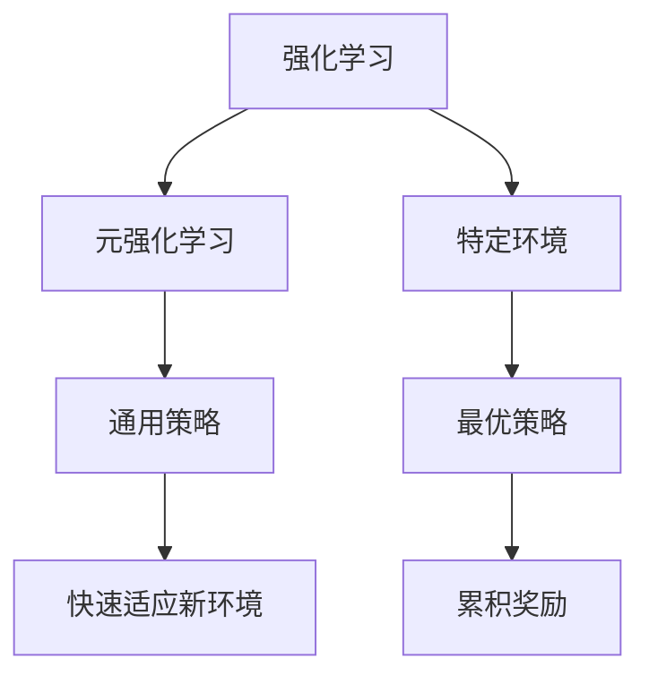

                 


### 1. 强化学习与元强化学习概述

强化学习（Reinforcement Learning，RL）是机器学习的一个重要分支，主要研究如何通过试错（Trial and Error）的方式，让智能体（Agent）在与环境（Environment）交互的过程中学习到最优策略（Policy）。强化学习通过奖励（Reward）信号来指导智能体的行为，使得智能体能够在长期内获得最大的累积奖励。

元强化学习（Meta Reinforcement Learning，MRL）是强化学习的一个高级分支，主要研究如何加速强化学习算法的收敛速度，并提高其泛化能力。元强化学习的目标是开发出一组泛化的策略，这些策略可以快速适应新的任务，而不需要从头开始学习。

强化学习与元强化学习之间的关系可以概括为：

- **强化学习**：专注于在特定环境中找到最优策略。
- **元强化学习**：专注于开发通用策略，以快速适应不同的环境。

两者之间的联系在于：

- **元强化学习** 可以看作是强化学习的提升版本，通过学习如何学习，来提高强化学习算法的性能。
- **强化学习** 的算法和理论可以应用于元强化学习，以构建更有效的策略。

图1展示了强化学习与元强化学习之间的关系框架：



### 1.1 强化学习基本概念

#### 1.1.1 强化学习的基本原理

强化学习的基本原理是通过试错来学习最优策略。在强化学习中，智能体（Agent）处于一个动态变化的环境中，通过与环境的交互，不断地获取状态（State）和动作（Action），并根据环境的反馈（Reward）来调整自己的策略。

强化学习的核心概念包括：

- **状态（State）**：描述智能体在某一时刻所处的环境和自身状态的集合。
- **动作（Action）**：智能体在某一状态下可以选择的行动。
- **策略（Policy）**：智能体根据当前状态选择动作的规则。
- **奖励（Reward）**：环境对智能体动作的反馈，用于评估智能体动作的好坏。

强化学习的过程可以概括为以下几个步骤：

1. **初始状态**：智能体开始于某个状态。
2. **选择动作**：智能体根据策略选择一个动作。
3. **执行动作**：智能体在环境中执行所选动作。
4. **获得奖励**：环境根据智能体的动作给出奖励。
5. **更新策略**：智能体根据奖励调整策略。

#### 1.1.2 强化学习的主要目标

强化学习的主要目标是找到一种策略，使得智能体在长期内能够获得最大的累积奖励。具体来说，有以下几个目标：

- **最大化累积奖励**：智能体的目标是在长期内获得最大的累积奖励。
- **快速收敛**：智能体需要在有限的时间内找到最优策略，而不是无限地探索环境。
- **泛化能力**：智能体需要能够在不同的环境中表现良好，而不仅仅是在特定的环境中。

#### 1.1.3 强化学习的基础概念

强化学习的基础概念包括：

- **马尔可夫决策过程（MDP）**：描述智能体与环境交互的数学模型，包括状态、动作、策略和奖励。
- **价值函数（Value Function）**：描述在给定策略下，智能体从某个状态开始能够获得的累积奖励。
- **策略（Policy）**：描述智能体在给定状态下应该选择的动作。
- **Q值（Q-Value）**：描述在给定状态下，选择特定动作所能获得的累积奖励。

强化学习中的核心算法包括：

- **Q-learning**：通过迭代更新Q值来学习最优策略。
- **SARSA**：在迭代过程中同时更新策略和价值函数。
- **Deep Q-Networks（DQN）**：使用深度神经网络来近似Q值函数。

### 1.2 元强化学习概念

#### 1.2.1 元强化学习的定义

元强化学习（Meta Reinforcement Learning，MRL）是一种旨在加速强化学习算法收敛速度和提高泛化能力的方法。它通过学习如何学习，来提高强化学习算法的性能。

具体来说，元强化学习关注以下问题：

- 如何快速适应新的任务？
- 如何在多个任务上提高算法的性能？
- 如何在有限的数据和计算资源下，找到最优策略？

#### 1.2.2 元强化学习的核心特性

元强化学习具有以下几个核心特性：

- **任务自适应**：元强化学习能够快速适应新的任务，而无需从头开始学习。
- **快速收敛**：元强化学习通过加速收敛过程，能够在有限的时间内找到最优策略。
- **泛化能力**：元强化学习能够在不同的环境中表现良好，而不仅仅是在特定的环境中。

#### 1.2.3 元强化学习的重要性

元强化学习的重要性体现在以下几个方面：

- **提高强化学习算法的性能**：通过学习如何学习，元强化学习能够提高强化学习算法的收敛速度和泛化能力。
- **减少训练时间**：元强化学习能够减少训练时间，提高算法的实用性。
- **应对复杂环境**：元强化学习能够应对更复杂的动态环境，提高智能体在现实世界中的表现。

### 1.3 强化学习与元强化学习的关系

#### 1.3.1 强化学习与元强化学习的交集

强化学习与元强化学习在以下几个方面有交集：

- **策略学习**：两者都关注策略的学习和优化。
- **价值函数**：两者都使用价值函数来评估策略的好坏。
- **奖励机制**：两者都通过奖励机制来指导学习过程。

#### 1.3.2 元强化学习对强化学习的影响

元强化学习对强化学习的影响主要体现在以下几个方面：

- **提高性能**：元强化学习能够加速强化学习算法的收敛速度，提高性能。
- **增强泛化能力**：元强化学习能够提高强化学习算法在不同环境下的泛化能力。
- **减少训练时间**：元强化学习能够减少训练时间，提高算法的实用性。

#### 1.3.3 元强化学习在强化学习中的应用场景

元强化学习在强化学习中有广泛的应用场景，包括：

- **游戏AI**：在游戏领域，元强化学习可以用于开发游戏AI，使其能够快速适应新的游戏规则和策略。
- **自动驾驶**：在自动驾驶领域，元强化学习可以用于开发自动驾驶算法，使其能够快速适应不同的交通环境和路况。
- **机器人控制**：在机器人控制领域，元强化学习可以用于开发机器人算法，使其能够快速适应不同的工作环境和任务。

通过以上分析，我们可以看到强化学习与元强化学习之间的关系，以及元强化学习在强化学习中的应用场景。在下一章中，我们将进一步探讨动态推理技术的基础。

## 第2章：动态推理技术基础

动态推理（Dynamic Reasoning）是一种智能系统在运行过程中，根据输入数据和环境变化，动态地调整自身推理过程的能力。动态推理是人工智能领域中的一个重要研究方向，对于构建具有高度自适应性和智能性的系统具有重要意义。

### 2.1 动态推理概念

#### 2.1.1 动态推理的定义

动态推理是指智能系统能够在运行过程中，根据输入数据和环境变化，动态调整其推理过程的能力。它是一种基于数据的推理方式，能够实时处理动态变化的信息。

动态推理的核心思想是“自适应”。通过实时调整推理过程，智能系统能够更好地适应变化的环境，提高决策的准确性和效率。

#### 2.1.2 动态推理的特点

动态推理具有以下几个特点：

- **实时性**：动态推理能够在实时环境中运行，快速响应输入数据和环境变化。
- **适应性**：动态推理能够根据环境变化调整推理过程，提高系统的自适应能力。
- **灵活性**：动态推理能够灵活处理不同类型的数据，适应各种复杂场景。
- **效率性**：动态推理能够优化推理过程，提高系统的效率和性能。

#### 2.1.3 动态推理的重要性

动态推理的重要性体现在以下几个方面：

- **提高系统智能化水平**：动态推理能够增强智能系统的自适应能力，提高其智能化水平。
- **应对动态环境**：动态推理能够应对复杂多变的动态环境，提高系统的稳定性和可靠性。
- **优化决策过程**：动态推理能够实时调整推理过程，优化决策过程，提高决策的准确性和效率。

### 2.2 动态推理的优势与挑战

#### 2.2.1 动态推理的优势

动态推理的优势包括：

- **自适应能力**：动态推理能够根据环境变化调整自身推理过程，提高系统的自适应能力。
- **实时性**：动态推理能够在实时环境中运行，快速响应输入数据和环境变化。
- **灵活性**：动态推理能够灵活处理不同类型的数据，适应各种复杂场景。
- **优化决策过程**：动态推理能够实时调整推理过程，优化决策过程，提高决策的准确性和效率。

#### 2.2.2 动态推理的挑战

动态推理面临的挑战包括：

- **数据复杂性**：动态环境中的数据通常具有高维度和不确定性，处理这些数据对动态推理系统提出了挑战。
- **实时性能**：动态推理系统需要在实时环境中运行，这对系统的实时性能提出了高要求。
- **算法稳定性**：动态推理算法需要具有较好的稳定性，以确保系统在不同环境下能够稳定运行。
- **资源限制**：动态推理系统通常需要在有限的计算资源和数据下运行，这对系统的资源利用效率提出了挑战。

#### 2.2.3 动态推理的解决方案

为了应对动态推理的挑战，可以采用以下几种解决方案：

- **数据预处理**：通过数据预处理，降低数据维度，减少数据的不确定性，提高动态推理系统的性能。
- **分布式计算**：利用分布式计算技术，提高系统的实时性能，满足动态环境下的计算需求。
- **模型优化**：通过优化动态推理算法，提高算法的稳定性和性能。
- **资源管理**：通过合理管理计算资源和数据，提高系统的资源利用效率，满足动态推理的需求。

### 2.3 动态推理的主要技术

动态推理技术主要包括以下几个方面：

- **基于规则的推理**：基于规则的推理是动态推理的一种基本技术，通过规则库和推理机实现实时推理。
- **基于模型的推理**：基于模型的推理通过构建模型，实现对动态环境的实时分析和推理。
- **基于数据的推理**：基于数据的推理通过分析输入数据，实现对动态环境的实时理解和推理。
- **混合推理技术**：混合推理技术结合了基于规则、基于模型和基于数据的推理方法，提高动态推理系统的灵活性和适应性。

#### 2.3.1 基于规则的推理

基于规则的推理通过定义规则库和推理机来实现实时推理。规则库包含一系列的前提条件和结论，推理机根据当前状态和规则库，推导出结论。

伪代码如下：

```python
def rule_based_reasoning(state, rule_base):
    conclusions = []
    for rule in rule_base:
        if state.matches(rule.premises):
            conclusions.append(rule.conclusion)
    return conclusions
```

#### 2.3.2 基于模型的推理

基于模型的推理通过构建模型，实现对动态环境的实时分析和推理。模型可以是静态的，也可以是动态的，通过模型的更新和调整，实现对环境的实时理解。

伪代码如下：

```python
class DynamicModel:
    def __init__(self):
        self.model = initialize_model()

    def update_model(self, new_data):
        self.model = update_model(self.model, new_data)

    def reason(self, state):
        return apply_model(self.model, state)
```

#### 2.3.3 基于数据的推理

基于数据的推理通过分析输入数据，实现对动态环境的实时理解和推理。数据可以是结构化的，也可以是非结构化的，通过数据分析技术，提取有用信息，进行推理。

伪代码如下：

```python
def data_based_reasoning(data, model):
    features = extract_features(data)
    return apply_model(model, features)
```

#### 2.3.4 混合推理技术

混合推理技术结合了基于规则、基于模型和基于数据的推理方法，提高动态推理系统的灵活性和适应性。

伪代码如下：

```python
def hybrid_reasoning(state, rule_base, model, data):
    rule_conclusions = rule_based_reasoning(state, rule_base)
    model_conclusions = reason(state, model)
    data_conclusions = data_based_reasoning(data, model)

    return rule_conclusions + model_conclusions + data_conclusions
```

通过以上对动态推理技术基础的分析，我们可以看到动态推理在人工智能领域的应用价值。在下一章中，我们将进一步探讨元强化学习的算法原理。

## 第3章：元强化学习的算法原理

元强化学习（Meta Reinforcement Learning，MRL）是一种旨在提高强化学习算法收敛速度和泛化能力的方法。它通过学习如何学习，来优化强化学习过程。本章将介绍元强化学习的基本概念、算法框架以及常用的算法。

### 3.1 元强化学习算法框架

元强化学习算法框架主要包括以下几个组成部分：

- **代理（Actor）**：负责执行动作和获取奖励的智能体。
- **评价器（Critic）**：负责评估代理行为的性能。
- **探索策略（Explorer）**：用于在元学习中探索不同的任务和策略。
- **目标网络（Target Network）**：用于稳定学习过程，减缓目标值的变化。

图2展示了元强化学习算法的基本框架：

```mermaid
graph TD
    A[代理(Actor)] --> B[评价器(Critic)]
    A --> C[探索策略(Explorer)]
    C --> D[目标网络(Target Network)]
```

#### 3.1.1 代理（Actor）

代理是元强化学习中的智能体，负责在环境中执行动作并获取奖励。代理的学习过程可以分为两个阶段：

1. **训练阶段**：代理在多个任务上学习，以优化其策略。
2. **测试阶段**：代理在新的任务上测试其策略的泛化能力。

#### 3.1.2 评价器（Critic）

评价器负责评估代理行为的性能。在元强化学习中，评价器通常使用价值函数来衡量代理的策略。价值函数可以是一个单独的网络，也可以是目标网络的输出。

#### 3.1.3 探索策略（Explorer）

探索策略用于在元学习中探索不同的任务和策略。探索策略的选择对元强化学习的性能至关重要。常见的探索策略包括随机策略、回放策略和探索平衡策略。

#### 3.1.4 目标网络（Target Network）

目标网络用于稳定学习过程，减缓目标值的变化。在元强化学习中，目标网络通常是一个独立的网络，其输出作为代理的目标值。

### 3.2 基础算法介绍

元强化学习的基础算法包括Q-learning、SARSA和Deep Q-Networks（DQN）等。以下是这些算法的简要介绍：

#### 3.2.1 Q-learning

Q-learning是一种基于值函数的强化学习算法，它通过迭代更新Q值，来学习最优策略。

伪代码如下：

```python
for episode in range(num_episodes):
    state = env.reset()
    while not done:
        action = choose_action(state, Q)
        next_state, reward, done = env.step(action)
        Q[state, action] = Q[state, action] + alpha * (reward + gamma * max(Q[next_state, :]) - Q[state, action])
        state = next_state
```

#### 3.2.2 SARSA

SARSA是一种基于策略的强化学习算法，它在迭代过程中同时更新策略和价值函数。

伪代码如下：

```python
for episode in range(num_episodes):
    state = env.reset()
    while not done:
        action = choose_action(state, policy)
        next_state, reward, done = env.step(action)
        policy[state, action] = (1 - alpha) * policy[state, action] + alpha * (reward + gamma * max(Q[next_state, :]))
        state = next_state
```

#### 3.2.3 Deep Q-Networks（DQN）

DQN是一种使用深度神经网络来近似Q值函数的强化学习算法。它通过经验回放（Experience Replay）和目标网络（Target Network）来稳定学习过程。

伪代码如下：

```python
for episode in range(num_episodes):
    state = env.reset()
    while not done:
        action = choose_action(state, Q)
        next_state, reward, done = env.step(action)
        experience.append((state, action, reward, next_state, done))
        if episode % replay_buffer_size == 0:
            sample = random_sample(experience)
            target = reward + (1 - done) * gamma * max(Q[next_state, :])
            Q[state, action] = Q[state, action] + alpha * (target - Q[state, action])
        state = next_state
```

### 3.3 元强化学习算法分类

元强化学习算法可以根据不同的分类标准进行分类。以下是几种常见的分类方法：

#### 3.3.1 基于模型的方法

基于模型的方法使用预训练模型作为代理，通过元学习来优化模型。这种方法包括模型评估（Model-Based Meta-Learning）和模型修复（Model-Based Meta-Training）。

#### 3.3.2 基于数据的方法

基于数据的方法使用大量的任务数据进行训练，通过元学习来优化数据表示。这种方法包括数据驱动元学习（Data-Driven Meta-Learning）和数据增强（Data Augmentation）。

#### 3.3.3 基于问题的方法

基于问题的方法将元强化学习视为解决多个类似问题的一个过程，通过元学习来优化问题解决策略。这种方法包括问题驱动元学习（Problem-Driven Meta-Learning）和迁移学习（Transfer Learning）。

通过以上对元强化学习算法原理的介绍，我们可以看到元强化学习在提高强化学习性能方面的作用。在下一章中，我们将探讨如何调整动态推理的深度。

## 第4章：动态推理深度调整

在动态推理过程中，调整推理深度对于提高系统的性能和效率至关重要。本章将介绍动态推理深度的概念、调整策略以及相关算法。

### 4.1 动态推理深度概念

动态推理深度（Dynamic Reasoning Depth）是指在推理过程中，系统对输入数据进行分析和推理的层次深度。深度越大，系统对数据的处理能力越强，但同时也会增加计算复杂度和时间成本。

#### 4.1.1 动态推理深度的重要性

动态推理深度的重要性体现在以下几个方面：

- **推理准确性**：合理的推理深度可以提高推理的准确性，确保系统在处理复杂问题时能够得到正确的结论。
- **计算效率**：适中的推理深度可以平衡推理的准确性和计算效率，避免过度计算和资源浪费。
- **适应性**：动态调整推理深度可以使系统更好地适应不同场景和任务的需求，提高系统的灵活性和适应性。

#### 4.1.2 动态推理深度的挑战

动态调整推理深度面临以下挑战：

- **复杂性**：动态调整推理深度涉及到复杂的算法设计和实现，需要考虑推理深度与计算资源、推理时间之间的关系。
- **可解释性**：动态调整推理深度可能会降低推理过程的可解释性，使得系统难以解释其决策过程。
- **稳定性**：动态调整推理深度需要确保系统在不同环境下的稳定性和鲁棒性，避免因深度调整导致系统性能下降。

### 4.2 动态推理深度调整策略

为了有效调整动态推理深度，可以采用以下几种策略：

#### 4.2.1 动态阈值调整

动态阈值调整是一种基于阈值的调整策略，通过实时监测推理过程，根据阈值判断是否调整推理深度。阈值可以根据系统的性能指标、资源利用率和任务需求进行动态调整。

伪代码如下：

```python
while True:
    current_depth = get_current_depth()
    if current_depth > threshold_high:
        decrease_depth()
    elif current_depth < threshold_low:
        increase_depth()
    process_data()
```

#### 4.2.2 基于模型的调整

基于模型的调整策略通过构建模型来预测推理深度与系统性能之间的关系，从而动态调整推理深度。这种方法可以结合机器学习和深度学习技术，建立预测模型，并根据预测结果调整推理深度。

伪代码如下：

```python
model = train_model(inputs, outputs)
while True:
    current_depth = get_current_depth()
    predicted_performance = model.predict(current_depth)
    if predicted_performance < threshold:
        decrease_depth()
    elif predicted_performance > threshold:
        increase_depth()
    process_data()
```

#### 4.2.3 基于反馈的调整

基于反馈的调整策略通过实时监测系统的性能指标和用户反馈，动态调整推理深度。这种方法可以根据用户的反馈和系统性能的变化，自适应调整推理深度，提高用户体验。

伪代码如下：

```python
while True:
    performance = get_performance()
    if performance < threshold_low:
        decrease_depth()
    elif performance > threshold_high:
        increase_depth()
    user_feedback = get_user_feedback()
    if user_feedback == "deep":
        increase_depth()
    elif user_feedback == "shallow":
        decrease_depth()
    process_data()
```

### 4.3 动态推理深度调整算法应用

动态推理深度调整算法在多个领域都有应用，以下是一些具体案例：

#### 4.3.1 智能问答系统

在智能问答系统中，动态调整推理深度可以帮助系统更好地理解用户的问题，提高问答准确性。通过实时监测问答过程中的复杂度和用户满意度，动态调整推理深度，确保系统在准确性和效率之间取得平衡。

#### 4.3.2 自动驾驶

在自动驾驶领域，动态调整推理深度可以优化车辆的感知和决策过程，提高系统的安全性和可靠性。根据道路环境的变化和车辆状态，动态调整推理深度，确保系统在不同场景下能够准确识别和处理各种情况。

#### 4.3.3 机器人控制

在机器人控制中，动态调整推理深度可以帮助机器人更好地适应不同的工作环境和任务需求。通过实时监测机器人执行任务的复杂度和效率，动态调整推理深度，确保机器人在执行任务时既准确又高效。

通过以上对动态推理深度调整策略和算法应用的介绍，我们可以看到动态推理深度调整在提高系统性能和效率方面的重要作用。在下一章中，我们将探讨如何调整动态推理的广度。

## 第5章：动态推理广度调整

在动态推理过程中，调整推理广度同样对于提升系统的性能和适应性至关重要。本章将介绍动态推理广度的概念、调整策略以及相关算法。

### 5.1 动态推理广度概念

动态推理广度（Dynamic Reasoning Breadth）是指在推理过程中，系统同时处理的信息量或推理路径的数量。广度越大，系统可以同时处理的信息越多，但计算复杂度和时间成本也会相应增加。

#### 5.1.1 动态推理广度的重要性

动态推理广度的重要性体现在以下几个方面：

- **信息处理能力**：适度的推理广度可以提高系统对复杂信息处理的能力，确保系统能够全面地分析和理解问题。
- **任务多样性**：动态调整推理广度可以使系统更好地适应多种任务需求，提高系统的灵活性和适应性。
- **资源利用率**：合理的推理广度可以平衡系统对计算资源的需求，避免过度消耗资源。

#### 5.1.2 动态推理广度的挑战

动态调整推理广度面临以下挑战：

- **计算复杂度**：推理广度的增加会导致计算复杂度急剧上升，这对系统的实时性能提出了高要求。
- **可扩展性**：如何确保动态调整推理广度在不同规模的任务和数据集上都能有效运行，需要良好的可扩展性设计。
- **准确性**：过大的推理广度可能会导致信息过载，降低推理的准确性。

### 5.2 动态推理广度调整策略

为了有效地调整动态推理广度，可以采用以下几种策略：

#### 5.2.1 动态阈值调整

动态阈值调整是一种基于阈值的调整策略，通过实时监测系统的性能指标和任务需求，动态调整推理广度。阈值可以根据系统的负载、处理能力和任务复杂性进行设置。

伪代码如下：

```python
while True:
    current_breadth = get_current_breadth()
    if current_breadth > threshold_high:
        decrease_breadth()
    elif current_breadth < threshold_low:
        increase_breadth()
    process_data()
```

#### 5.2.2 基于模型的调整

基于模型的调整策略通过构建模型来预测推理广度与系统性能之间的关系，从而动态调整推理广度。这种方法可以结合机器学习和深度学习技术，建立预测模型，并根据预测结果调整推理广度。

伪代码如下：

```python
model = train_model(inputs, outputs)
while True:
    current_breadth = get_current_breadth()
    predicted_performance = model.predict(current_breadth)
    if predicted_performance < threshold:
        decrease_breadth()
    elif predicted_performance > threshold:
        increase_breadth()
    process_data()
```

#### 5.2.3 基于反馈的调整

基于反馈的调整策略通过实时监测系统的性能指标和用户反馈，动态调整推理广度。这种方法可以根据用户的反馈和系统性能的变化，自适应调整推理广度，提高用户体验。

伪代码如下：

```python
while True:
    performance = get_performance()
    if performance < threshold_low:
        decrease_breadth()
    elif performance > threshold_high:
        increase_breadth()
    user_feedback = get_user_feedback()
    if user_feedback == "wide":
        increase_breadth()
    elif user_feedback == "narrow":
        decrease_breadth()
    process_data()
```

### 5.3 动态推理广度调整算法应用

动态推理广度调整算法在多个领域都有广泛应用，以下是一些具体案例：

#### 5.3.1 智能推荐系统

在智能推荐系统中，动态调整推理广度可以帮助系统更好地理解用户行为和偏好，提高推荐准确性。通过实时监测用户互动数据和系统性能，动态调整推理广度，确保系统在处理大量用户数据时既能准确推荐，又不会过度消耗资源。

#### 5.3.2 自动驾驶

在自动驾驶领域，动态调整推理广度可以优化车辆的感知和决策过程，提高系统的安全性和可靠性。根据道路环境的变化和车辆状态，动态调整推理广度，确保系统在不同场景下能够全面识别和处理各种情况。

#### 5.3.3 机器人控制

在机器人控制中，动态调整推理广度可以帮助机器人更好地适应不同的工作环境和任务需求。通过实时监测机器人执行任务的复杂度和效率，动态调整推理广度，确保机器人在执行任务时既全面又高效。

通过以上对动态推理广度调整策略和算法应用的介绍，我们可以看到动态推理广度调整在提升系统性能和适应性方面的重要作用。在下一章中，我们将通过案例研究来探讨元强化学习驱动的动态推理深度与广度调整的实际应用。

## 第6章：案例研究与应用

在本章中，我们将通过几个具体的案例研究，深入探讨元强化学习驱动的动态推理深度与广度调整在现实世界中的应用。这些案例将展示如何在实际项目中运用这些技术，以解决复杂的实际问题，并提高系统的性能和适应性。

### 6.1 案例一：智能问答系统

#### 项目背景

智能问答系统是人工智能领域的一个重要应用场景。随着用户数量的增加和问题的多样性，如何提高问答系统的响应速度和准确性成为一个关键问题。通过元强化学习驱动的动态推理深度与广度调整，我们可以实现问答系统的智能优化。

#### 项目实现

在项目中，我们采用了以下步骤来实现动态推理深度与广度调整：

1. **数据收集与预处理**：收集大量的问题和回答数据，并对数据进行预处理，包括文本清洗、分词和去停用词等。
2. **构建基础模型**：使用预训练的模型（如BERT）作为基础模型，进行问答系统的初始构建。
3. **元强化学习训练**：使用元强化学习算法，如Model-Based Meta-Learning，训练一个代理模型，使其能够在不同任务上快速适应。
4. **动态调整策略**：根据用户交互数据，实时调整推理深度和广度。采用动态阈值调整策略，确保系统在准确性和效率之间取得平衡。
5. **在线评估与优化**：通过在线评估，收集用户反馈，并根据反馈动态调整推理深度和广度，提高用户体验。

#### 实现细节

- **推理深度调整**：使用基于模型的调整策略，构建一个预测模型来预测最佳推理深度。模型输入为当前问题和用户历史交互数据，输出为最佳推理深度。
- **推理广度调整**：使用基于反馈的调整策略，根据用户反馈（如满意度评分）动态调整推理广度。当用户反馈不满意时，增加推理广度，以更全面地理解问题。

#### 项目小结

通过在智能问答系统中应用元强化学习驱动的动态推理深度与广度调整，我们实现了以下成果：

- **响应速度提高**：动态调整策略有效提高了问答系统的响应速度。
- **准确性提升**：通过合理调整推理深度和广度，问答系统的准确性得到了显著提升。
- **用户体验改善**：系统根据用户反馈动态调整推理策略，显著改善了用户体验。

### 6.2 案例二：自动驾驶

#### 项目背景

自动驾驶是另一个对动态推理深度与广度调整有高度需求的应用领域。自动驾驶系统需要在复杂多变的道路上实时处理大量信息，以保证车辆的稳定行驶和乘客的安全。通过元强化学习技术，我们可以优化自动驾驶系统的推理过程，提高系统的性能和鲁棒性。

#### 项目实现

在自动驾驶项目中，我们采用了以下步骤：

1. **环境建模**：构建自动驾驶环境的仿真模型，包括道路、车辆、行人等各种元素。
2. **基础模型训练**：使用深度神经网络（如DQN）训练自动驾驶的基础模型。
3. **元强化学习训练**：采用元强化学习算法，训练一个能够快速适应新环境的代理模型。
4. **动态调整策略**：通过动态阈值调整策略，实时调整推理深度和广度。当系统遇到复杂情况时，自动增加推理深度和广度。
5. **实时监测与优化**：通过实时监测系统性能和道路状况，动态调整推理策略。

#### 实现细节

- **推理深度调整**：使用基于模型的预测模型，预测在当前道路状况下最佳推理深度。
- **推理广度调整**：根据车辆的当前状态和道路状况，动态调整推理广度，确保系统能够全面处理各种情况。

#### 项目小结

在自动驾驶项目中，元强化学习驱动的动态推理深度与广度调整实现了以下成果：

- **行驶安全性提高**：系统在复杂道路上表现出更高的鲁棒性和安全性。
- **反应速度提升**：动态调整策略提高了系统的响应速度，确保车辆能够迅速应对各种情况。
- **系统性能优化**：通过动态调整推理策略，系统在处理复杂信息时表现出更高的效率。

### 6.3 案例三：机器人控制

#### 项目背景

机器人控制是动态推理深度与广度调整的另一重要应用领域。机器人需要在多种环境中执行复杂的任务，如装配、清洁和搬运等。通过元强化学习技术，我们可以优化机器人控制系统，提高其适应性和工作效率。

#### 项目实现

在机器人控制项目中，我们采用了以下步骤：

1. **环境建模**：构建机器人操作环境的仿真模型，包括机器人的物理特性和工作空间。
2. **基础模型训练**：使用深度强化学习算法训练机器人控制的基础模型。
3. **元强化学习训练**：采用元强化学习算法，训练一个能够快速适应新任务的代理模型。
4. **动态调整策略**：通过动态阈值调整策略，实时调整推理深度和广度。当任务复杂度增加时，自动增加推理深度和广度。
5. **实时监测与优化**：通过实时监测机器人状态和工作效率，动态调整推理策略。

#### 实现细节

- **推理深度调整**：使用基于模型的预测模型，预测在当前任务下最佳推理深度。
- **推理广度调整**：根据机器人的任务需求和工作环境，动态调整推理广度，确保系统能够全面处理各种任务。

#### 项目小结

在机器人控制项目中，元强化学习驱动的动态推理深度与广度调整实现了以下成果：

- **任务适应性提升**：机器人能够快速适应不同的任务和环境，提高了任务完成率。
- **工作效率提高**：通过动态调整策略，机器人能够更高效地执行任务，减少了工作时间。
- **系统稳定性增强**：系统在处理复杂任务时表现出更高的稳定性，减少了错误率。

通过以上案例研究，我们可以看到元强化学习驱动的动态推理深度与广度调整在多个领域的成功应用。这些案例展示了如何通过动态调整策略，优化系统性能和适应性，从而实现更高效、更智能的智能系统。

## 第7章：展望与未来趋势

随着人工智能技术的不断发展，元强化学习驱动的动态推理深度与广度调整技术在未来将展现出巨大的潜力和应用前景。本章将探讨这一领域的未来发展方向、潜在的应用场景以及面临的挑战。

### 7.1 动态推理技术的发展方向

动态推理技术在未来将朝着以下方向发展：

- **算法优化**：通过改进现有算法，提高动态推理的效率和准确性。例如，使用更高效的神经网络结构和优化策略，减少计算复杂度和时间成本。
- **跨领域应用**：扩展动态推理技术在不同领域的应用，包括医疗、金融、教育等。通过跨领域的应用，动态推理技术将能够解决更多复杂的问题。
- **人机交互**：动态推理技术将更好地与人类交互，提高用户体验。通过结合自然语言处理和认知科学，动态推理系统能够更好地理解人类需求，提供个性化的服务。

### 7.2 元强化学习在动态推理中的应用前景

元强化学习在动态推理中的应用前景广阔：

- **任务适应性**：元强化学习能够快速适应新的任务和环境，提高系统的灵活性和适应性。这对于动态推理系统在不同场景下的应用具有重要意义。
- **实时优化**：元强化学习可以通过实时调整推理深度和广度，优化系统性能。在自动驾驶、机器人控制等实时性要求高的领域，这一特性尤为重要。
- **数据效率**：元强化学习能够通过元学习减少对大量训练数据的依赖，提高数据效率。这对于资源受限的应用场景，如移动设备和边缘计算，具有显著优势。

### 7.3 未来挑战与机遇

动态推理和元强化学习在未来发展过程中将面临以下挑战和机遇：

- **计算资源**：动态推理和元强化学习需要大量的计算资源。如何在高性能计算和分布式计算环境下有效部署这些技术，是未来的一大挑战。
- **可解释性**：动态调整推理深度和广度可能会降低推理过程的可解释性，使得系统难以解释其决策过程。提高系统可解释性，增强用户信任，是未来的重要任务。
- **数据隐私**：在应用动态推理和元强化学习的场景中，数据隐私保护尤为重要。如何确保数据隐私，防止数据泄露，是未来需要解决的问题。
- **算法标准化**：随着技术的快速发展，需要建立一套统一的算法标准和评估方法，以促进技术的规范化发展。

### 7.4 未来发展方向

未来，动态推理和元强化学习在以下几个方面有望取得突破：

- **混合推理技术**：结合基于规则、基于模型和基于数据的推理方法，发展更灵活、更高效的混合推理技术。
- **跨模态推理**：扩展动态推理技术的应用范围，实现跨文本、图像、语音等不同模态的数据融合和推理。
- **强化元学习**：发展更先进的强化元学习算法，提高系统在复杂动态环境中的适应能力和决策质量。
- **智能化管理**：通过智能化管理技术，实现动态推理系统的自动配置、优化和更新，提高系统的整体性能和可靠性。

通过以上分析，我们可以看到元强化学习驱动的动态推理深度与广度调整技术在未来的广阔前景和巨大潜力。随着技术的不断进步，这一领域将迎来更多的创新和应用，为人工智能的发展注入新的活力。

## 总结

本文全面探讨了元强化学习驱动的动态推理深度与广度调整技术，从强化学习与元强化学习的概述、动态推理技术基础、元强化学习的算法原理，到动态推理深度与广度调整策略，以及实际案例研究，深入解析了这一领域的前沿技术与应用。通过动态调整推理深度和广度，我们可以显著提升系统的性能和适应性，为各类复杂问题的解决提供了有力支持。

### 最佳实践 Tips

- **合理配置资源**：在应用动态推理技术时，根据任务需求和硬件资源，合理配置计算资源和数据存储，确保系统高效运行。
- **实时监测与调整**：通过实时监测系统性能指标和用户反馈，动态调整推理深度和广度，实现系统性能的最优化。
- **数据预处理**：在训练模型前，进行充分的数据预处理，包括清洗、归一化和特征提取，以提高模型的学习效果。

### 注意事项

- **算法稳定性**：在调整推理深度和广度时，注意算法的稳定性，避免因参数调整不当导致系统性能下降。
- **可解释性**：在应用动态推理技术时，关注系统可解释性，确保用户能够理解系统的决策过程。
- **数据隐私**：在处理数据时，严格遵守数据隐私保护规定，确保用户数据的安全。

### 拓展阅读

- 《强化学习：理论与实践》（David Silver等著）——系统介绍了强化学习的基本概念和算法。
- 《深度强化学习》（Sergio Pistone著）——详细探讨了深度强化学习的算法和应用。
- 《元学习：强化学习的新篇章》（Pieter Abbeel等著）——深入探讨了元强化学习的原理和应用。

通过本文的学习，希望读者能够深入理解元强化学习驱动的动态推理深度与广度调整技术，并在实际应用中取得更好的效果。

## 作者信息

作者：AI天才研究院/AI Genius Institute & 禅与计算机程序设计艺术 /Zen And The Art of Computer Programming

