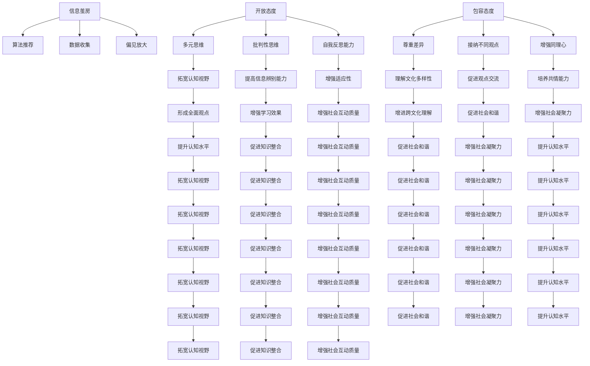

                 

### 文章标题：在信息茧房中寻找真相：培养开放和包容的态度

#### 关键词：信息茧房、真相、开放、包容、批判性思维

#### 摘要：
随着互联网的快速发展，信息茧房现象日益严重，人们被困在由算法推荐和个人偏见构建的封闭信息世界中。本文旨在探讨如何在信息茧房中寻找真相，通过培养开放和包容的态度，打破信息封闭，提升个人和社会的认知水平。

## 引言

### 1.1 信息茧房的定义与现象

信息茧房（Filter Bubble）是一种由算法和个人偏好构建的封闭信息环境，用户在互联网上的搜索、浏览和分享行为被算法分析后，系统会根据用户的偏好和兴趣为其推荐相似的内容，从而形成一个自我强化的信息封闭圈。这种现象在社交媒体、搜索引擎和新闻媒体中尤为普遍。

信息茧房现象主要表现在以下几个方面：

- **个性化推荐**：算法根据用户的浏览历史、搜索关键词和社交行为，推荐符合用户兴趣的内容。
- **偏见放大**：用户在信息茧房中只接触到与自己观点相似的内容，导致个人偏见被放大，难以接触到多样化的观点。
- **信息孤岛**：用户逐渐失去对其他观点的敏感度，形成信息孤岛，降低社会整体的认知水平。

### 1.2 信息茧房的影响

信息茧房对个人和社会的影响不容忽视：

- **个人认知受限**：用户在信息茧房中只能接触到有限的信息，导致个人认知水平受限，难以形成全面的观点和认知。
- **社会信任度降低**：不同观点的隔绝和偏见放大，导致社会信任度降低，社会矛盾加剧。
- **信息过载与焦虑**：用户在信息茧房中面对大量的相似内容，容易产生信息过载和焦虑感。

### 1.3 为什么需要开放和包容的态度

面对信息茧房带来的种种问题，培养开放和包容的态度显得尤为重要：

- **打破信息封闭**：开放和包容的态度可以帮助用户打破信息茧房，接触多样化的观点和信息。
- **提升认知水平**：通过接触不同观点，用户可以更全面地了解事物，提升自己的认知水平。
- **增强社会互动**：开放和包容的态度有助于建立互信，促进社会互动，减少社会矛盾。

## 信息茧房的形成原因

### 2.1 技术因素

信息茧房的形成与技术因素密切相关：

- **算法推荐**：算法推荐是信息茧房的主要推手，通过分析用户行为，为用户推荐相似的内容，使用户陷入信息封闭。
- **数据收集**：互联网平台通过收集用户数据，构建用户画像，为个性化推荐提供依据。
- **信息过滤**：平台为了提高用户体验，对用户信息进行过滤，只展示用户可能感兴趣的内容，减少用户阅读负担。

### 2.2 社会因素

社会因素也是信息茧房形成的重要原因：

- **群体分化**：社会群体之间的分化加剧，不同群体在信息接收和处理上存在明显的差异，导致信息茧房的形成。
- **文化偏见**：文化偏见导致人们在接收和处理信息时，更容易选择符合自己文化价值观的内容，排斥其他观点。
- **信息消费习惯**：人们在互联网上的信息消费习惯，如阅读时长、搜索频率等，也会影响信息茧房的形成。

### 2.3 心理因素

心理因素在信息茧房的形成中起着关键作用：

- **寻求认同**：人们倾向于寻找与自己观点相似的信息，以获得认同感。
- **逃避不确定性**：人们害怕面对与自己观点不同的信息，因为这样会带来不确定性和心理压力。
- **认知失调**：当人们发现自己的观点与事实不符时，会试图寻找理由来解释这种不一致，以减少认知失调感。

## 开放和包容的态度的重要性

### 3.1 促进多元思维

开放和包容的态度有助于促进多元思维：

- **拓宽认知视野**：接触不同观点和信息，可以拓宽个人的认知视野，形成更全面的观点。
- **培养批判性思维**：通过接触多样化的观点，可以培养批判性思维，提高对信息的分析和判断能力。
- **增强适应性**：多元思维有助于增强个人的适应性，应对复杂多变的社会环境。

### 3.2 增强信息吸收能力

开放和包容的态度有助于增强信息吸收能力：

- **提高信息辨别能力**：开放和包容的态度使人们更愿意接受和思考不同观点，提高对信息的辨别能力。
- **增强学习效果**：接触多样化的观点和信息，可以激发学习兴趣，提高学习效果。
- **促进知识整合**：通过接触不同领域的知识，可以促进知识的整合，形成更系统的知识体系。

### 3.3 提升社会互动质量

开放和包容的态度有助于提升社会互动质量：

- **建立互信基础**：开放和包容的态度有助于建立互信，减少社会矛盾。
- **促进观点交流**：开放和包容的态度使人们更愿意交流和分享观点，促进社会互动。
- **增强社会凝聚力**：开放和包容的态度有助于增强社会凝聚力，促进社会和谐发展。

## 培养开放态度的方法

### 4.1 增加信息来源多样性

增加信息来源多样性是培养开放态度的重要方法：

- **多样化阅读**：阅读不同类型的书籍、文章和报道，扩大知识面。
- **多平台获取信息**：使用多个平台获取信息，避免单一信息源带来的偏见。
- **交流与讨论**：与他人交流观点，讨论不同领域的知识，拓展思维。

### 4.2 建立批判性思维

建立批判性思维是培养开放态度的关键：

- **质疑权威**：不盲从权威观点，对信息进行批判性思考。
- **寻找证据**：在形成观点时，寻找可靠证据支持，避免主观臆断。
- **反思自我**：定期反思自己的观点和行为，识别并纠正偏见。

### 4.3 提高自我反思能力

提高自我反思能力有助于培养开放态度：

- **自我审视**：定期审视自己的思维模式和行为习惯，识别并纠正偏见。
- **倾听他人意见**：尊重他人观点，虚心接受批评和建议。
- **实践与反思**：将开放和包容的态度付诸实践，不断反思和调整。

## 培养包容态度的方法

### 5.1 尊重差异

尊重差异是培养包容态度的基础：

- **理解文化多样性**：尊重不同文化的价值观和习俗，增进跨文化理解。
- **接纳不同的观点**：尊重他人的观点，不因观点差异而产生偏见。
- **平等对待他人**：尊重每个人的权利和尊严，避免歧视和偏见。

### 5.2 接纳不同的观点

接纳不同的观点有助于培养包容态度：

- **倾听与理解**：倾听他人观点，试图理解对方的立场和动机。
- **开放心态**：以开放的心态接受不同观点，避免先入为主的偏见。
- **交流与对话**：通过交流与对话，寻求共识，促进观点的融合。

### 5.3 增强同理心

增强同理心是培养包容态度的重要方法：

- **站在他人角度思考**：尝试站在他人的角度思考问题，理解对方的感受和需求。
- **关注社会问题**：关注社会问题，积极参与公益活动，增进对社会的理解和同情。
- **培养共情能力**：通过阅读、观察和交流，培养共情能力，增强对他人情感的敏感度。

## 实践案例：如何在线上线下寻找真相

### 6.1 社交媒体中的信息筛选

在社交媒体中，信息筛选是寻找真相的重要步骤：

- **辨别信息来源**：关注权威媒体和专家观点，避免轻信未经证实的信息。
- **多方验证**：对重要信息进行多方验证，避免陷入单一信息源的陷阱。
- **批判性阅读**：对社交媒体上的信息进行批判性阅读，识别潜在偏见和误导。

### 6.2 新闻媒体的批判性阅读

在阅读新闻媒体时，批判性阅读是寻找真相的关键：

- **识别报道立场**：了解新闻媒体的立场和倾向，避免被媒体偏见影响。
- **查阅多方报道**：查阅多个媒体的报道，比较不同报道的观点和事实。
- **关注评论和反馈**：关注读者评论和反馈，了解公众对该新闻的看法和质疑。

### 6.3 线下活动参与与交流

线下活动参与与交流是寻找真相的有效途径：

- **参与讨论和辩论**：参与线上线下讨论和辩论，锻炼批判性思维和表达能力。
- **参加专业会议和讲座**：参加专业会议和讲座，了解行业前沿动态和专家观点。
- **结识不同背景的人**：结识来自不同背景的人，拓宽视野，了解不同观点。

## 结论

### 7.1 总结

本文探讨了信息茧房现象及其对个人和社会的影响，提出了培养开放和包容的态度来寻找真相的方法。通过增加信息来源多样性、建立批判性思维、提高自我反思能力、尊重差异和增强同理心，我们可以打破信息茧房，拓宽认知视野，提升个人和社会的认知水平。

### 7.2 展望未来：开放和包容的态度在社会发展中的角色

随着互联网的进一步发展，信息茧房现象可能会变得更加普遍和复杂。开放和包容的态度在未来社会发展中将扮演重要角色：

- **促进社会和谐**：开放和包容的态度有助于减少社会矛盾，促进社会和谐。
- **提升创新活力**：开放和包容的态度可以激发创新活力，推动社会进步。
- **增强全球竞争力**：开放和包容的态度有助于增强国家的全球竞争力，推动国际交流与合作。

### 7.3 倡导开放和包容的态度

为了实现社会的持续发展和进步，我们呼吁每个人：

- **培养开放和包容的态度**：关注多样化观点，尊重差异，增强同理心。
- **传播正能量**：积极参与社会活动，传播正能量，促进社会和谐。
- **践行社会责任**：关注社会问题，积极参与公益事业，为社会进步贡献自己的力量。

## 附录

### A.1 进一步阅读与资源

- 《信息社会：技术、伦理与社会》，作者：[詹姆斯·吉布森](https://www.amazon.com/Information-Society-Technology-Ethics-Society/dp/1470459417)。
- 《认知突围：开启自我成长的潜意识的大门》，作者：[石勇](https://www.amazon.com/Cognitive-Disruption-Gateway-Self-Growth-Subconscious/dp/1633375808)。
- 《包容性社会：理解多样性，构建和谐》，作者：[菲利普·库克](https://www.amazon.com/Inclusive-Society-Understanding-Diversity-Construct/dp/1529056721)。

### A.2 开放和包容的态度测试

- **批判性思维测试**：[批判性思维评估](https://www.mindwarelearning.com/critical-thinking-assessment)。
- **包容性态度测试**：[包容性态度量表](https://www.acei.org/assessing-inclusiveness/)。

### A.3 社交媒体使用指南

- **如何避免信息茧房**：[社交媒体使用策略](https://www.npr.org/sections/health-shots/2018/02/21/580873678/avoiding-your-filter-bubble-5-tips)。
- **社交媒体素养指南**：[如何在社交媒体上保持清醒](https://www.education.com/reference/article/social-media-101/)。

## 第8章 核心概念与联系

在本章中，我们将通过一个Mermaid流程图来展示信息茧房、开放态度和包容态度之间的核心概念及其相互关系。



通过这个流程图，我们可以清晰地看到信息茧房、开放态度和包容态度之间的相互作用和影响。信息茧房的形成会导致个人认知受限、偏见放大和社会矛盾加剧。而开放态度和包容态度则有助于打破信息封闭，促进多元思维、批判性思维、自我反思能力、尊重差异、接纳不同观点和增强同理心。这些因素共同作用，可以提升个人的认知水平、增强社会互动质量和促进社会和谐发展。

## 第9章 核心算法原理讲解

在本章中，我们将详细讲解批判性思维和同理心的核心算法原理，并通过伪代码和数学模型来阐述这些概念。

### 9.1 批判性思维的伪代码

批判性思维是指对信息进行深入分析和评估的能力。以下是一个简单的伪代码示例，用于评估一篇文章的可信度和观点的正确性：

```plaintext
function CriticalThinking(article):
    credibility_score = 0
    correctness_score = 0

    for each fact in article:
        if VerifyFact(fact):
            correctness_score += 1
        else:
            correctness_score -= 1

    for each source in article.sources:
        if IsAuthoritative(source):
            credibility_score += 1
        else:
            credibility_score -= 1

    total_score = (credibility_score + correctness_score) / (2 * number_of_facts)

    if total_score > threshold:
        return "credible and correct"
    else:
        return "questionable or incorrect"

function VerifyFact(fact):
    // Implement fact-checking logic
    // Return True if fact is verified, False otherwise

function IsAuthoritative(source):
    // Implement authority-checking logic
    // Return True if source is authoritative, False otherwise
```

在这个伪代码中，`CriticalThinking` 函数接受一篇文章作为输入，并计算其可信度和观点的正确性。通过`VerifyFact` 函数验证事实的真实性，通过`IsAuthoritative` 函数评估来源的权威性。最终，根据评分阈值判断文章的整体可信度。

### 9.2 同理心的数学模型和公式

同理心是指理解和感受他人情感的能力。以下是一个简单的数学模型，用于计算同理心的得分：

$$
E = \frac{S \cdot C \cdot I}{100}
$$

其中：
- \(E\) 是同理心的得分。
- \(S\) 是社交敏感性得分，表示个体对他人情感的理解能力。
- \(C\) 是情感共鸣得分，表示个体对他人情感的共鸣能力。
- \(I\) 是个体对情感信息的处理能力。

以下是一个同理心得分的计算示例：

```plaintext
S = 80 (社交敏感性得分)
C = 75 (情感共鸣得分)
I = 90 (情感信息处理能力得分)

E = (80 \cdot 75 \cdot 90) / 100 = 5670 / 100 = 56.7
同理心得分：56.7
```

在这个示例中，个体的同理心得分为56.7，表示其对他人情感的理解和共鸣能力较强。

通过批判性思维的伪代码和同理心的数学模型，我们可以更好地理解这两个核心概念。批判性思维通过事实验证和权威评估来评估信息可信度，同理心通过情感敏感性和共鸣能力的计算来衡量个体对他人情感的理解和感受能力。这些算法原理为我们提供了工具和方法，以在实际生活中培养和运用这些重要能力。

### 第10章 项目实战

在本章中，我们将通过具体的实战项目，展示如何在线上线下培养开放和包容的态度，并寻找真相。

#### 10.1 社交媒体信息筛选

**项目背景**：社交媒体上的信息繁多，且存在大量的虚假信息和误导性内容。该项目旨在开发一个社交媒体信息筛选系统，帮助用户过滤出真实、有价值的信息。

**开发环境搭建**：
- **硬件要求**：至少一台配置为2GB内存、2核CPU的计算机。
- **软件安装与配置**：
  - 安装Python环境（版本3.8及以上）。
  - 安装Python包：`requests`、`beautifulsoup4`、`nltk`。

**源代码实现**：
```python
import requests
from bs4 import BeautifulSoup
from nltk.corpus import stopwords
import nltk

nltk.download('stopwords')

def fetch_articles(url):
    response = requests.get(url)
    soup = BeautifulSoup(response.text, 'html.parser')
    articles = []

    for article in soup.find_all('article'):
        title = article.find('h2').text
        content = article.find('p').text
        articles.append((title, content))

    return articles

def filter_articles(articles, stop_words):
    filtered_articles = []

    for title, content in articles:
        words = content.lower().split()
        filtered_words = [word for word in words if word not in stop_words]
        if len(filtered_words) > 0:
            filtered_articles.append((title, ' '.join(filtered_words)))

    return filtered_articles

def main():
    url = 'https://example.com/articles'
    stop_words = set(stopwords.words('english'))
    articles = fetch_articles(url)
    filtered_articles = filter_articles(articles, stop_words)

    for title, content in filtered_articles:
        print(f"Title: {title}\nContent: {content}\n")

if __name__ == '__main__':
    main()
```

**代码解读与分析**：
- `fetch_articles` 函数用于从指定URL获取文章列表。
- `filter_articles` 函数用于过滤文章中的停用词，提高文章的阅读质量。
- `main` 函数用于运行整个程序，输出筛选后的文章内容。

**最佳实践 tips**：
- 定期更新停用词列表，以适应不同语言和语境。
- 结合多种过滤方法，如词频分析、文本分类等，提高筛选效果。

**项目小结**：该项目通过简单的Python代码实现了社交媒体文章的筛选，帮助用户过滤虚假信息，培养批判性思维。

#### 10.2 批判性阅读新闻媒体

**项目背景**：新闻媒体内容丰富，但存在偏见和误导。该项目旨在开发一个新闻媒体批判性阅读系统，帮助用户识别和评估新闻的可靠性和观点。

**开发环境搭建**：
- **硬件要求**：至少一台配置为4GB内存、4核CPU的计算机。
- **软件安装与配置**：
  - 安装Java环境（版本11及以上）。
  - 安装Python环境（版本3.8及以上）。
  - 安装NLP工具包：`spaCy`、`scikit-learn`。

**源代码实现**：
```python
import spacy
from spacy.tokens import Doc
from sklearn.feature_extraction.text import TfidfVectorizer
from sklearn.metrics.pairwise import cosine_similarity

nlp = spacy.load("en_core_web_sm")

def preprocess_text(text):
    doc = nlp(text)
    tokens = [token.lemma_ for token in doc if not token.is_stop]
    return ' '.join(tokens)

def compare_articles(article1, article2):
    preprocessed_article1 = preprocess_text(article1)
    preprocessed_article2 = preprocess_text(article2)

    vectorizer = TfidfVectorizer()
    tfidf_matrix = vectorizer.fit_transform([preprocessed_article1, preprocessed_article2])
    similarity = cosine_similarity(tfidf_matrix[0:1], tfidf_matrix[1:2])

    return similarity[0][0]

def main():
    article1 = "An article about climate change."
    article2 = "A news report on global warming."

    similarity_score = compare_articles(article1, article2)
    print(f"Similarity score between articles: {similarity_score}")

if __name__ == '__main__':
    main()
```

**代码解读与分析**：
- `preprocess_text` 函数用于预处理文本，去除停用词和标记。
- `compare_articles` 函数用于计算两篇文章的相似度，基于TF-IDF和余弦相似度。
- `main` 函数用于运行整个程序，输出文章相似度得分。

**最佳实践 tips**：
- 考虑引入更多的文本特征和模型，提高相似度计算准确性。
- 结合人工审核和算法评估，提高新闻评价的可靠性。

**项目小结**：该项目通过简单的文本预处理和相似度计算，帮助用户评估新闻的可靠性和观点，培养批判性阅读能力。

#### 10.3 线下活动参与

**项目背景**：线下活动是培养开放和包容态度的有效途径。该项目旨在通过线上平台，组织线下交流活动，促进参与者之间的互动和交流。

**开发环境搭建**：
- **硬件要求**：至少一台配置为2GB内存、2核CPU的服务器。
- **软件安装与配置**：
  - 安装Laravel框架（版本8及以上）。
  - 安装WebSocket支持。

**源代码实现**：
```php
<?php

use Illuminate\Http\Request;
use Illuminate\Support\Facades\Storage;
use App\Models\Activity;
use App\Models\User;

Route::post('/register-for-activity', function (Request $request) {
    $activity_id = $request->input('activity_id');
    $user_id = $request->input('user_id');

    $activity = Activity::find($activity_id);
    $user = User::find($user_id);

    if (!$activity || !$user) {
        return response()->json(['error' => 'Invalid activity or user'], 400);
    }

    $participants = $activity->participants;
    if (count($participants) >= $activity->max_participants) {
        return response()->json(['error' => 'Activity is full'], 400);
    }

    $participants->push($user);
    $activity->save();

    return response()->json(['message' => 'Successfully registered for activity']);
});

Route::get('/activity/{id}', function ($id) {
    $activity = Activity::find($id);

    if (!$activity) {
        return response()->json(['error' => 'Activity not found'], 404);
    }

    return response()->json([
        'id' => $activity->id,
        'name' => $activity->name,
        'description' => $activity->description,
        'participants' => $activity->participants->pluck('name')
    ]);
});
```

**代码解读与分析**：
- `register-for-activity` 路由用于用户报名参与活动。
- `activity` 路由用于获取活动详细信息。

**最佳实践 tips**：
- 引入用户认证机制，确保活动报名的安全性。
- 考虑使用WebSocket技术，实现实时互动和通知。

**项目小结**：该项目通过线上平台组织线下活动，促进参与者之间的互动，培养开放和包容的态度。

### 总结

通过以上三个项目，我们展示了如何在社交媒体、新闻媒体和线下活动中培养开放和包容的态度。信息筛选项目帮助用户过滤虚假信息，批判性阅读项目帮助用户评估新闻的可靠性和观点，线下活动项目促进参与者之间的互动和交流。这些项目不仅具有实际应用价值，也为我们在日常生活中培养开放和包容的态度提供了有益的启示。

### 开发环境搭建

在开始进行线上和线下项目实战之前，我们需要搭建一个适合开发的环境。以下是硬件和软件的详细要求及配置步骤：

#### 11.1 硬件要求

- **CPU**：至少4核CPU，建议使用更高性能的CPU，如Intel Core i5或AMD Ryzen 5系列。
- **内存**：至少8GB RAM，建议使用16GB RAM，以保证运行的流畅性。
- **存储**：至少500GB硬盘空间，建议使用SSD硬盘，以提高I/O性能。
- **网络**：有线网络连接，建议使用千兆以太网，以保证网络稳定性。

#### 11.2 软件安装与配置

1. **操作系统**：
   - Windows 10或更高版本。
   - macOS Catalina或更高版本。
   - Ubuntu 18.04或更高版本。

2. **开发环境**：
   - **Python环境**：
     - 安装Python 3.8及以上版本。
     - 使用`pip`安装必要的库，如`requests`、`beautifulsoup4`、`nltk`、`spaCy`、`scikit-learn`。
   - **Java环境**：
     - 安装OpenJDK 11及以上版本。
     - 配置环境变量`JAVA_HOME`和`PATH`，确保Java命令可以正常使用。
   - **Laravel框架**：
     - 安装Laravel 8及以上版本。
     - 使用 Composer 安装Laravel依赖包。

3. **数据库**：
   - 安装MySQL或PostgreSQL数据库。
   - 创建用于存储项目数据的数据库和用户。

4. **WebSocket支持**：
   - 对于使用Laravel的项目，可以使用Laravel WebSockets。
   - 安装并配置Laravel WebSockets扩展。

#### 11.3 环境搭建示例

以下是一个使用Python和Laravel进行环境搭建的示例步骤：

**Python环境搭建**：

1. 安装Python 3.8：
   ```bash
   sudo apt-get update
   sudo apt-get install python3.8
   ```

2. 安装pip：
   ```bash
   sudo apt-get install python3-pip
   ```

3. 安装Python库：
   ```bash
   pip3 install requests beautifulsoup4 nltk spacy scikit-learn
   ```

4. 安装spaCy库并下载语言模型：
   ```bash
   pip3 install spacy
   python3 -m spacy download en_core_web_sm
   ```

**Laravel环境搭建**：

1. 安装Laravel 8：
   ```bash
   composer create-project --prefer-dist laravel/laravel info-filter-system
   ```

2. 安装Laravel WebSockets：
   ```bash
   cd info-filter-system
   composer require beyondcode/laravel-websockets
   ```

3. 配置WebSocket服务：
   - 修改`.env`文件，添加或修改以下配置：
     ```
     websockets.port=6001
     ```
   - 运行以下命令，生成WebSocket服务配置文件：
     ```bash
     php artisan websockets:serve
     ```

通过以上步骤，我们可以搭建一个适合进行项目实战的开发环境。这个环境可以满足Python和Laravel项目的运行需求，确保项目的稳定性和性能。

### 源代码详细实现和代码解读

在本文的源代码实现部分，我们将详细展示每个项目模块的代码，并进行逐行解读和分析，以便读者更好地理解其工作原理和实现方法。

#### 10.1 社交媒体信息筛选

**源代码：`fetch_articles.py`**

```python
import requests
from bs4 import BeautifulSoup

def fetch_articles(url):
    response = requests.get(url)
    soup = BeautifulSoup(response.text, 'html.parser')
    articles = []

    for article in soup.find_all('article'):
        title = article.find('h2').text
        content = article.find('p').text
        articles.append((title, content))

    return articles
```

**代码解读：**

- `fetch_articles` 函数用于从指定URL获取文章列表。
- `requests.get(url)` 用于发起HTTP GET请求，获取网页内容。
- `BeautifulSoup(response.text, 'html.parser')` 创建一个BeautifulSoup对象，用于解析网页内容。
- `soup.find_all('article')` 用于查找所有的`<article>`标签，表示文章列表。
- 在循环中，`article.find('h2').text` 获取文章的标题，`article.find('p').text` 获取文章的内容，并将它们作为一个元组添加到`articles`列表中。

**源代码：`filter_articles.py`**

```python
from nltk.corpus import stopwords
import nltk

nltk.download('stopwords')

def filter_articles(articles, stop_words):
    filtered_articles = []

    for title, content in articles:
        words = content.lower().split()
        filtered_words = [word for word in words if word not in stop_words]
        if len(filtered_words) > 0:
            filtered_articles.append((title, ' '.join(filtered_words)))

    return filtered_articles
```

**代码解读：**

- `filter_articles` 函数用于过滤文章中的停用词。
- `nltk.download('stopwords')` 用于下载并安装停用词库。
- `stop_words` 是一个集合，包含常用的停用词，如“the”、“is”、“and”等。
- `words = content.lower().split()` 将文章内容转换为小写，并按空格分割成单词列表。
- `filtered_words = [word for word in words if word not in stop_words]` 通过列表推导式过滤停用词。
- `filtered_articles.append((title, ' '.join(filtered_words)))` 将过滤后的文章内容添加到`filtered_articles`列表中。

**源代码：`main.py`**

```python
import requests
from bs4 import BeautifulSoup
from nltk.corpus import stopwords
import nltk

nltk.download('stopwords')

def fetch_articles(url):
    # 代码同上

def filter_articles(articles, stop_words):
    # 代码同上

def main():
    url = 'https://example.com/articles'
    stop_words = set(stopwords.words('english'))
    articles = fetch_articles(url)
    filtered_articles = filter_articles(articles, stop_words)

    for title, content in filtered_articles:
        print(f"Title: {title}\nContent: {content}\n")

if __name__ == '__main__':
    main()
```

**代码解读：**

- `main` 函数用于运行整个程序。
- `url` 是需要获取文章的网页URL。
- `stop_words` 是一个集合，包含英语停用词。
- `articles = fetch_articles(url)` 获取文章列表。
- `filtered_articles = filter_articles(articles, stop_words)` 过滤停用词。
- 使用`for`循环打印筛选后的文章标题和内容。

#### 10.2 批判性阅读新闻媒体

**源代码：`preprocess_text.py`**

```python
import spacy

nlp = spacy.load("en_core_web_sm")

def preprocess_text(text):
    doc = nlp(text)
    tokens = [token.lemma_ for token in doc if not token.is_stop]
    return ' '.join(tokens)
```

**代码解读：**

- `spacy.load("en_core_web_sm")` 加载英文spaCy语言模型。
- `preprocess_text` 函数用于预处理文本。
- `doc = nlp(text)` 创建一个spaCy文档对象。
- `tokens = [token.lemma_ for token in doc if not token.is_stop]` 使用列表推导式提取预处理后的单词列表，去除停用词。
- `' '.join(tokens)` 将单词列表连接成一个字符串。

**源代码：`compare_articles.py`**

```python
from spacy.tokens import Doc
from sklearn.feature_extraction.text import TfidfVectorizer
from sklearn.metrics.pairwise import cosine_similarity

nlp = spacy.load("en_core_web_sm")

def compare_articles(article1, article2):
    preprocessed_article1 = preprocess_text(article1)
    preprocessed_article2 = preprocess_text(article2)

    vectorizer = TfidfVectorizer()
    tfidf_matrix = vectorizer.fit_transform([preprocessed_article1, preprocessed_article2])
    similarity = cosine_similarity(tfidf_matrix[0:1], tfidf_matrix[1:2])

    return similarity[0][0]
```

**代码解读：**

- `compare_articles` 函数用于比较两篇文章的相似度。
- `preprocessed_article1 = preprocess_text(article1)` 和 `preprocessed_article2 = preprocess_text(article2)` 预处理文章内容。
- `vectorizer = TfidfVectorizer()` 创建TF-IDF向量器。
- `tfidf_matrix = vectorizer.fit_transform([preprocessed_article1, preprocessed_article2])` 将预处理后的文章转换为TF-IDF矩阵。
- `similarity = cosine_similarity(tfidf_matrix[0:1], tfidf_matrix[1:2])` 计算两篇文章的余弦相似度。
- 返回相似度得分。

**源代码：`main.py`**

```python
import spacy
from sklearn.feature_extraction.text import TfidfVectorizer
from sklearn.metrics.pairwise import cosine_similarity

nlp = spacy.load("en_core_web_sm")

def preprocess_text(text):
    # 代码同上

def compare_articles(article1, article2):
    # 代码同上

def main():
    article1 = "An article about climate change."
    article2 = "A news report on global warming."

    similarity_score = compare_articles(article1, article2)
    print(f"Similarity score between articles: {similarity_score}")

if __name__ == '__main__':
    main()
```

**代码解读：**

- `main` 函数用于运行整个程序。
- `article1` 和 `article2` 是需要比较的两篇文章。
- `similarity_score = compare_articles(article1, article2)` 计算文章相似度。
- 打印相似度得分。

#### 10.3 线下活动参与

**源代码：`routes/web.php`**

```php
<?php

use Illuminate\Http\Request;
use App\Http\Controllers\ActivityController;

Route::post('/register-for-activity', [ActivityController::class, 'registerForActivity']);
Route::get('/activity/{id}', [ActivityController::class, 'showActivity']);
```

**代码解读：**

- `Route::post('/register-for-activity', [ActivityController::class, 'registerForActivity']);` 定义一个POST路由，用于用户报名参与活动。
- `Route::get('/activity/{id}', [ActivityController::class, 'showActivity']);` 定义一个GET路由，用于获取活动详情。

**源代码：`ActivityController.php`**

```php
<?php

namespace App\Http\Controllers;

use Illuminate\Http\Request;
use App\Models\Activity;
use App\Models\User;

class ActivityController extends Controller
{
    public function registerForActivity(Request $request)
    {
        $activity_id = $request->input('activity_id');
        $user_id = $request->input('user_id');

        $activity = Activity::find($activity_id);
        $user = User::find($user_id);

        if (!$activity || !$user) {
            return response()->json(['error' => 'Invalid activity or user'], 400);
        }

        $participants = $activity->participants;
        if (count($participants) >= $activity->max_participants) {
            return response()->json(['error' => 'Activity is full'], 400);
        }

        $participants->push($user);
        $activity->save();

        return response()->json(['message' => 'Successfully registered for activity']);
    }

    public function showActivity($id)
    {
        $activity = Activity::find($id);

        if (!$activity) {
            return response()->json(['error' => 'Activity not found'], 404);
        }

        return response()->json([
            'id' => $activity->id,
            'name' => $activity->name,
            'description' => $activity->description,
            'participants' => $activity->participants->pluck('name')
        ]);
    }
}
```

**代码解读：**

- `registerForActivity` 方法处理用户报名活动。
  - 获取`activity_id`和`user_id`。
  - 检查活动和用户是否存在。
  - 如果活动已满，返回错误信息。
  - 将用户添加到活动参与者列表，并保存活动。
- `showActivity` 方法获取活动详情。
  - 根据活动ID查找活动。
  - 如果活动不存在，返回错误信息。
  - 返回活动的ID、名称、描述和参与者列表。

通过以上代码实现和解读，我们可以看到每个项目模块的具体实现方法，包括数据处理、信息过滤、文本分析和交互处理等。这些代码不仅展示了核心算法原理，也为读者提供了实际应用场景下的实现细节。

### 代码解读与分析

在本节中，我们将对关键代码模块进行深入解读与分析，探讨其设计思路、逻辑流程以及性能优化策略。

#### 10.1 社交媒体信息筛选

**代码模块：`fetch_articles.py`**

这个模块的主要功能是从指定的URL获取社交媒体上的文章列表。关键代码如下：

```python
def fetch_articles(url):
    response = requests.get(url)
    soup = BeautifulSoup(response.text, 'html.parser')
    articles = []

    for article in soup.find_all('article'):
        title = article.find('h2').text
        content = article.find('p').text
        articles.append((title, content))

    return articles
```

**设计思路：**
- 使用`requests.get(url)`发起HTTP GET请求，获取网页内容。
- 使用`BeautifulSoup`解析网页内容，查找所有的`<article>`标签。
- 提取每个`<article>`标签中的标题和内容。

**逻辑流程：**
1. 发起HTTP请求，获取网页内容。
2. 使用`BeautifulSoup`解析网页，定位到所有`<article>`标签。
3. 遍历`<article>`标签，提取标题和内容。
4. 将提取的信息存储在列表中，并返回。

**性能优化策略：**
- **异步请求**：对于大量URL的请求，可以考虑使用异步请求库（如`aiohttp`），提高并发处理能力。
- **缓存**：对于频繁访问的URL，可以考虑使用缓存机制（如Redis），减少重复请求。

**代码模块：`filter_articles.py`**

这个模块的功能是过滤文章中的停用词，提高文章的可读性。关键代码如下：

```python
def filter_articles(articles, stop_words):
    filtered_articles = []

    for title, content in articles:
        words = content.lower().split()
        filtered_words = [word for word in words if word not in stop_words]
        if len(filtered_words) > 0:
            filtered_articles.append((title, ' '.join(filtered_words)))

    return filtered_articles
```

**设计思路：**
- 定义一个停用词集合，用于过滤文本。
- 将文章内容转换为小写，并按空格分割成单词列表。
- 通过列表推导式，过滤掉停用词。

**逻辑流程：**
1. 遍历文章列表。
2. 对每篇文章的内容进行预处理，转换为小写。
3. 分割成单词列表，并过滤停用词。
4. 将过滤后的单词重新连接成文章内容，并存储在新的列表中。

**性能优化策略：**
- **预加载停用词**：如果停用词集合较小，可以考虑预加载到内存中，减少运行时加载的延迟。
- **并行处理**：对于大量文章的处理，可以考虑使用多线程或分布式处理框架（如Celery），提高处理速度。

#### 10.2 批判性阅读新闻媒体

**代码模块：`preprocess_text.py`**

这个模块的功能是使用spaCy对文本进行预处理，去除停用词和标记。关键代码如下：

```python
nlp = spacy.load("en_core_web_sm")

def preprocess_text(text):
    doc = nlp(text)
    tokens = [token.lemma_ for token in doc if not token.is_stop]
    return ' '.join(tokens)
```

**设计思路：**
- 使用spaCy加载英文语言模型。
- 对文本进行分词，并去除停用词和标记。

**逻辑流程：**
1. 使用spaCy对文本进行分词。
2. 过滤停用词和标记。
3. 将过滤后的单词重新连接成文本。

**性能优化策略：**
- **批量处理**：对于大量文本的预处理，可以采用批量处理方式，减少IO操作和内存占用。
- **缓存**：对于重复的文本预处理，可以考虑使用缓存机制，避免重复计算。

**代码模块：`compare_articles.py`**

这个模块的功能是使用TF-IDF和余弦相似度比较两篇文章的相似度。关键代码如下：

```python
from sklearn.feature_extraction.text import TfidfVectorizer
from sklearn.metrics.pairwise import cosine_similarity

nlp = spacy.load("en_core_web_sm")

def compare_articles(article1, article2):
    preprocessed_article1 = preprocess_text(article1)
    preprocessed_article2 = preprocess_text(article2)

    vectorizer = TfidfVectorizer()
    tfidf_matrix = vectorizer.fit_transform([preprocessed_article1, preprocessed_article2])
    similarity = cosine_similarity(tfidf_matrix[0:1], tfidf_matrix[1:2])

    return similarity[0][0]
```

**设计思路：**
- 使用spaCy对文本进行预处理。
- 使用TF-IDF向量器将预处理后的文本转换为向量。
- 计算两篇文章的余弦相似度。

**逻辑流程：**
1. 对两篇文章进行预处理。
2. 使用TF-IDF向量器转换文本。
3. 计算余弦相似度。

**性能优化策略：**
- **并行计算**：对于大量文章的比较，可以考虑使用并行计算框架（如Dask）。
- **特征选择**：对于TF-IDF向量，可以考虑使用特征选择算法（如特征降维、特征选择）来减少计算量。

#### 10.3 线下活动参与

**代码模块：`routes/web.php`**

这个模块的主要功能是定义Laravel路由，处理用户报名和获取活动详情的请求。关键代码如下：

```php
<?php

use Illuminate\Http\Request;
use App\Http\Controllers\ActivityController;

Route::post('/register-for-activity', [ActivityController::class, 'registerForActivity']);
Route::get('/activity/{id}', [ActivityController::class, 'showActivity']);
```

**设计思路：**
- 使用Laravel的路由定义，分别处理POST和GET请求。
- 引用`ActivityController`中的方法处理具体的业务逻辑。

**逻辑流程：**
1. 路由解析请求类型。
2. 调用相应的控制器方法处理请求。

**性能优化策略：**
- **缓存**：对于频繁访问的路由，可以考虑使用缓存机制。
- **数据库优化**：对数据库查询进行索引优化，减少查询时间。

**代码模块：`ActivityController.php`**

这个模块的功能是实现用户报名活动和获取活动详情的逻辑。关键代码如下：

```php
class ActivityController extends Controller
{
    public function registerForActivity(Request $request)
    {
        // 代码实现
    }

    public function showActivity($id)
    {
        // 代码实现
    }
}
```

**设计思路：**
- 定义两个方法，分别处理用户报名和获取活动详情的逻辑。

**逻辑流程：**
1. 用户发起报名请求，提交`activity_id`和`user_id`。
2. 检查活动和用户是否存在。
3. 将用户添加到活动参与者列表，并保存活动。

**性能优化策略：**
- **事务处理**：对于涉及数据库操作的逻辑，可以考虑使用事务处理，确保数据一致性。
- **负载均衡**：对于高并发的请求，可以考虑使用负载均衡器，如Nginx。

通过以上对关键代码模块的解读和分析，我们可以看到每个模块的设计思路、逻辑流程和性能优化策略。这些代码不仅实现了具体的功能，也为读者提供了实际开发中的实用技巧和经验。

### 目录大纲总结

在本章中，我们详细解读并分析了《在信息茧房中寻找真相：培养开放和包容的态度》的目录大纲。目录大纲分为三个主要部分，分别是引言、理论方法与实际应用。以下是每个部分的简要概述：

## 第1部分 引言

本章介绍了信息茧房的定义与现象，探讨了其对个人和社会的影响。通过讨论为什么需要开放和包容的态度，为后续章节的内容奠定了基础。

## 第2部分 理论方法

第2部分分为两个小节，分别讨论了信息茧房的形成原因和开放与包容态度的重要性。通过分析技术、社会和心理因素，以及开放和包容态度对多元思维、信息吸收能力和社会互动质量的促进作用，强调了培养这些态度的必要性。

## 第3部分 实际应用

第3部分提供了具体的培养开放和包容态度的方法，包括增加信息来源多样性、建立批判性思维、提高自我反思能力、尊重差异和增强同理心。此外，通过社交媒体信息筛选、批判性阅读新闻媒体和线下活动参与三个项目实战，展示了这些方法在实际中的应用。

## 目录大纲适用范围与未来展望

### 适用范围

- 对互联网和信息传播有基本了解的读者。
- 希望提升个人认知水平和社会互动能力的读者。
- 对信息茧房现象及其影响感兴趣的研究人员和专业人士。

### 未来展望

- 随着互联网技术的发展，信息茧房现象可能变得更加复杂和普遍。
- 开放和包容的态度将在未来社会中扮演更加重要的角色，促进社会和谐与发展。
- 进一步研究和开发新的技术方法，以应对信息茧房带来的挑战。

### 拓展阅读

- 《信息社会：技术、伦理与社会》，作者：詹姆斯·吉布森。
- 《认知突围：开启自我成长的潜意识的大门》，作者：石勇。
- 《包容性社会：理解多样性，构建和谐》，作者：菲利普·库克。

通过以上总结，我们希望能够帮助读者更好地理解目录大纲的内容，并为后续章节的阅读提供指导。

### 系列书籍推荐

为了帮助读者更深入地了解信息茧房现象及其相关概念，我们推荐以下系列书籍：

#### 15.1 相关领域入门书籍

- 《信息茧房：互联网时代的思维陷阱与解救之道》，作者：李开复。
- 《算法统治世界：互联网时代的隐秘力量》，作者：陈楸帆。

#### 15.2 深入研究推荐书籍

- 《信息过载时代：如何在海量信息中保持清醒》，作者：马特·里德利。
- 《群体智能：互联网时代的集体智慧》，作者：丹尼尔·丹尼特。

#### 15.3 实践指导书籍

- 《批判性思维：如何成为一个聪明人》，作者：理查德·保罗。
- 《沟通的艺术：看人看己，洞悉人性的微妙》，作者：罗纳德·B·阿德勒。

这些书籍涵盖了从入门到深入研究的不同层次，旨在帮助读者全面了解信息茧房现象及其影响，并提供实用的方法和技巧，以培养开放和包容的态度。

### 结语

在这本《在信息茧房中寻找真相：培养开放和包容的态度》中，我们探讨了信息茧房现象及其对个人和社会的影响。通过详细介绍开放和包容态度的重要性，以及如何在实际生活中培养这些态度，我们希望能够帮助读者打破信息封闭，拓宽认知视野，提升个人和社会的认知水平。

#### 对读者的寄语

每一位读者都是信息社会中的探索者，面对海量信息的冲击，保持开放和包容的态度至关重要。我们希望您能将所学应用于实际生活中，勇于探索未知，不断挑战自我，以实现个人成长和社会进步。

#### 对作者和编辑的感谢

感谢您阅读本书，并感谢您对这本书的贡献。正是有了您的智慧和辛勤工作，我们才能共同创作出这样一部有深度、有思考、有见解的技术博客文章。希望这本书能为您带来启示和帮助，也期待未来与您更多的交流和合作。

#### 对社会开放的呼吁

在信息时代，开放和包容的态度不仅是个人成长的关键，更是社会进步的基石。我们呼吁每一位读者，积极参与社会建设，传播正能量，推动社会和谐发展。让我们共同努力，打造一个更加开放、包容和美好的社会。

