                 

基于您提供的标题《在信息茧房中寻找真相：培养开放和包容的态度》以及文章的目录大纲，我将逐步构建文章的结构，确保内容详实、逻辑清晰，并符合您的要求。

### 文章标题：在信息茧房中寻找真相：培养开放和包容的态度

#### 关键词：
- 信息茧房
- 开放态度
- 包容态度
- 真相
- 个体认知
- 社会交往
- 跨文化交流

#### 摘要：
本文旨在探讨信息茧房现象及其对个体和社会的影响，并通过培养开放和包容的态度，寻求突破信息茧房的方法。文章分为五个部分：引言、信息茧房的影响、突破信息茧房的方法、开放和包容态度的培养、社会角色的责任与作用，以及结论。通过详细分析和实际案例，本文为读者提供了在复杂信息环境中培养批判性思维、跨文化交流能力以及多元信息获取策略的实用建议。

### 引言

#### 1.1 信息茧房的概念与成因

信息茧房是指个体在信息获取和处理过程中，因自身偏好、社会环境等因素，逐渐形成一个封闭的信息环境，导致其认知、行为和价值观的局限。信息茧房的成因主要包括以下几点：

- **信息过载**：在互联网时代，信息爆炸使得人们难以处理海量信息，倾向于选择自己熟悉和感兴趣的内容。
- **算法推荐**：互联网平台通过算法推荐，将个体限制在特定的信息圈内，强化其已有观点。
- **社会心理**：个体存在从众心理，容易受到周围环境和群体的影响，减少对异见信息的接触。

#### 1.2 信息茧房对个体和社会的影响

信息茧房对个体和社会产生了一系列负面影响：

- **认知受限**：个体难以接触到多元观点，导致思维狭隘，判断力下降。
- **心理健康问题**：长期处于封闭信息环境，个体可能感到焦虑、孤独和无助。
- **社会交往障碍**：个体与外界交流减少，人际关系疏远，社会信任度降低。

#### 1.3 突破信息茧房的必要性

为了克服信息茧房的负面影响，培养开放和包容的态度至关重要。这不仅有助于个体全面发展，也是社会和谐发展的重要基础。

### 第二部分 信息茧房对个体和社会的影响

#### 2.1 认知受限与信息茧房

##### 2.1.1 个体认知的局限

个体在信息茧房中，由于接触的信息有限，容易形成认知偏见。以下是一个Mermaid流程图，展示个体认知受限的过程：

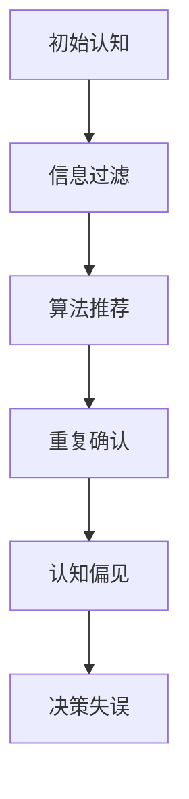

##### 2.1.2 社会认知的偏差

社会认知的偏差源于信息茧房中的群体效应。以下是社会认知偏差的Mermaid流程图：

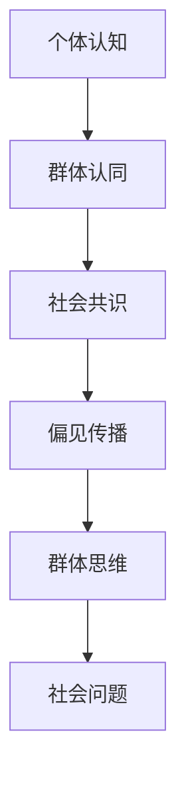

##### 2.1.3 信息茧房对心理健康的影响

信息茧房可能引发心理健康问题，如焦虑、抑郁和孤独。以下是影响过程的Mermaid流程图：

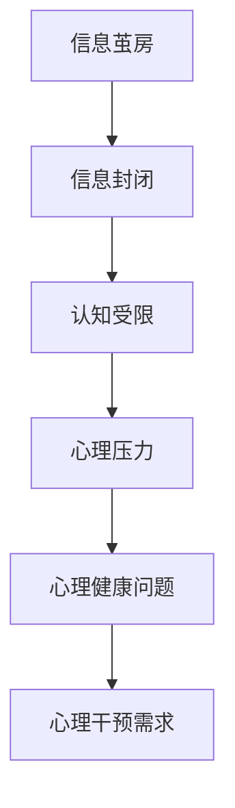

#### 2.2 社交障碍与信息茧房

##### 2.2.1 社交网络的封闭性

信息茧房导致社交网络封闭，人们更倾向于与相似背景的人交流，减少多元观点的接触。以下是社交障碍的Mermaid流程图：

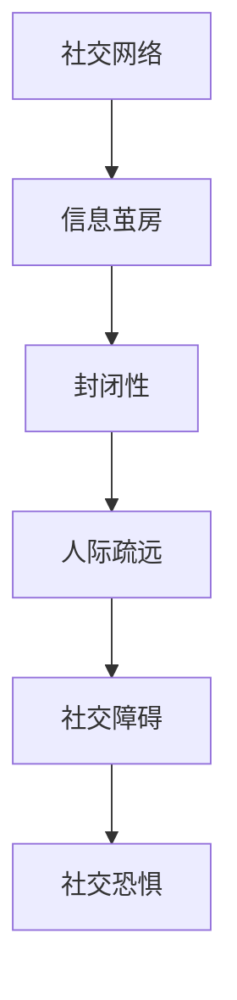

##### 2.2.2 社交障碍对人际关系的影响

社交障碍可能导致人际关系疏远，影响社会信任。以下是影响的Mermaid流程图：

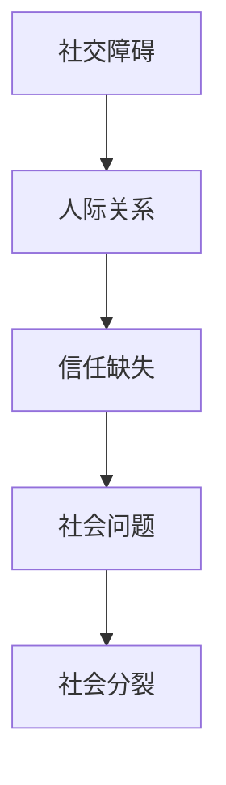

##### 2.2.3 信息茧房对社会交往的阻碍

信息茧房阻碍了社会交往，导致社会共同体意识减弱。以下是阻碍过程的Mermaid流程图：

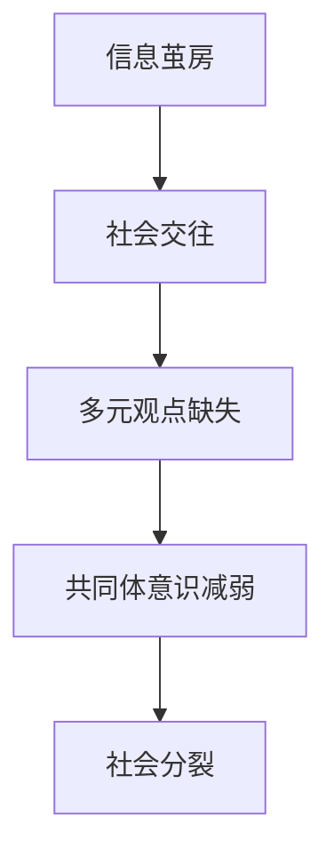

#### 2.3 社会问题与信息茧房

##### 2.3.1 社会共识的缺失

信息茧房导致社会共识难以形成，社会矛盾加剧。以下是缺失过程的Mermaid流程图：

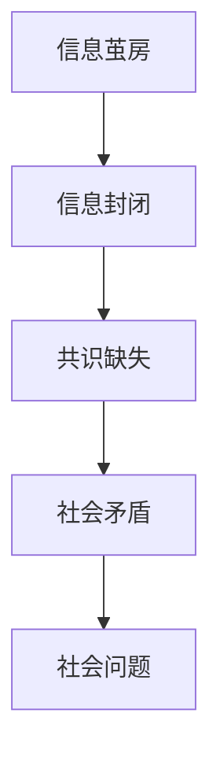

##### 2.3.2 社会信任的危机

信息茧房加剧了社会信任危机，影响了社会的稳定和发展。以下是危机过程的Mermaid流程图：

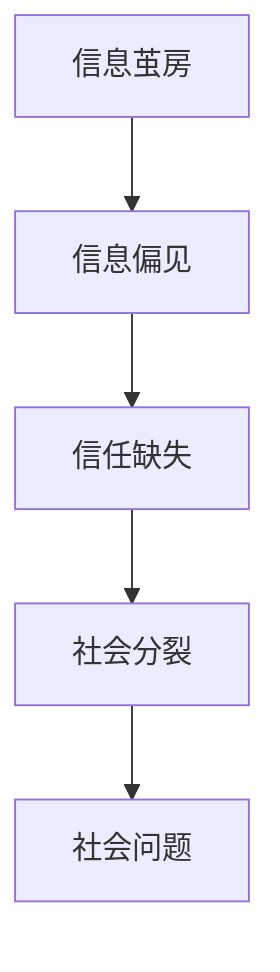

##### 2.3.3 信息茧房对社会发展的制约

信息茧房阻碍了社会进步和创新，影响了社会的发展。以下是制约过程的Mermaid流程图：

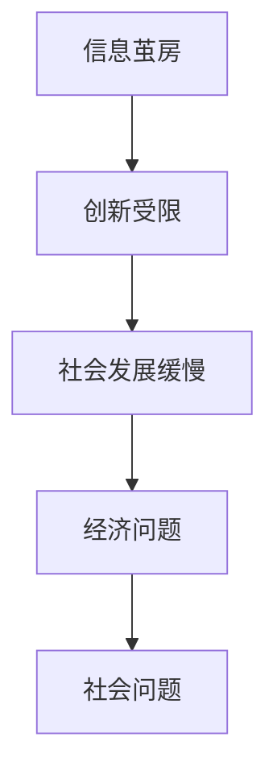

### 第三部分 如何突破信息茧房

#### 3.1 培养开放态度的重要性

##### 3.1.1 开放态度的定义与特征

开放态度是指个体在信息获取和处理过程中，能够接受和尊重不同观点和信息的品质。以下是开放态度的Mermaid流程图：

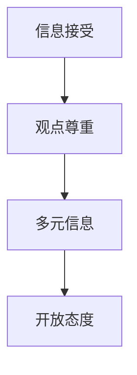

##### 3.1.2 开放态度对突破信息茧房的作用

开放态度能够帮助个体突破信息茧房的限制，以下是作用的Mermaid流程图：

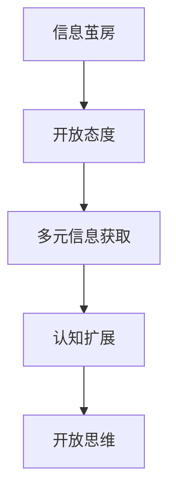

##### 3.1.3 开放态度的培养途径

培养开放态度的途径包括：

1. **多样化信息获取**：通过多渠道获取信息，增加信息接触面。
2. **批判性思维**：培养批判性思维，对信息进行独立判断。
3. **跨文化交流**：通过跨文化交流，增进对不同文化的理解和尊重。

#### 3.2 培养包容态度的重要性

##### 3.2.1 包容态度的定义与特征

包容态度是指个体在信息交流和互动中，能够接受和尊重不同观点和个体的品质。以下是包容态度的Mermaid流程图：

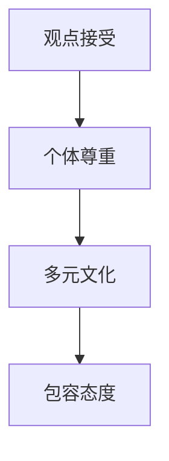

##### 3.2.2 包容态度对突破信息茧房的作用

包容态度能够促进个体之间的沟通和合作，有助于打破信息茧房的封闭性。以下是作用的Mermaid流程图：

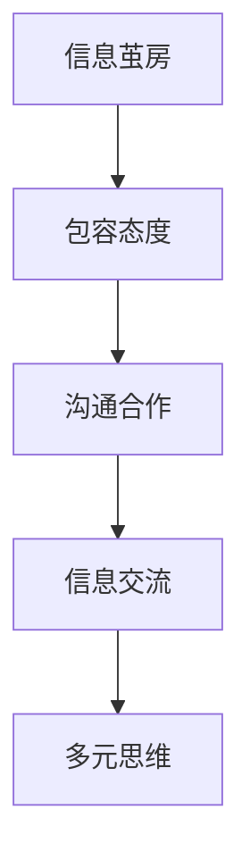

##### 3.2.3 包容态度的培养途径

培养包容态度的途径包括：

1. **多元文化教育**：通过多元文化教育，增进对不同文化的理解和尊重。
2. **心理教育**：通过心理教育，培养个体对差异的包容心理。
3. **互动交流**：通过互动交流，增强个体之间的理解和信任。

#### 3.3 跨文化交流与信息获取

##### 3.3.1 跨文化交流的重要性

跨文化交流是突破信息茧房的重要途径。以下是重要性的Mermaid流程图：

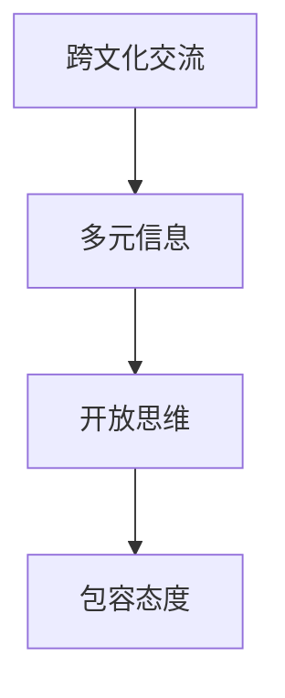

##### 3.3.2 跨文化交流的方法与技巧

跨文化交流的方法包括：

1. **语言学习**：通过学习不同语言，增进对其他文化的理解。
2. **文化体验**：通过实地体验，加深对其他文化的感性认识。
3. **跨文化沟通**：通过有效的沟通技巧，促进文化间的交流和理解。

##### 3.3.3 多角度信息获取的策略

多角度信息获取的策略包括：

1. **多源信息收集**：通过多种渠道收集信息，避免单一信息源的局限。
2. **信息验证**：对获取的信息进行验证，确保信息的真实性和可靠性。
3. **多角度分析**：从不同角度分析信息，形成全面的认识。

### 第四部分 开放和包容的态度的培养

#### 4.1 批判性思维与信息辨别

##### 4.1.1 批判性思维的重要性

批判性思维是培养开放和包容态度的关键。以下是重要性的Mermaid流程图：

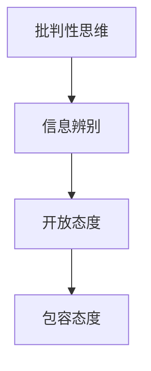

##### 4.1.2 批判性思维的培养

批判性思维的培养包括：

1. **问题提出**：培养提出问题的能力，激发思考。
2. **信息分析**：对获取的信息进行分析，识别信息的优点和不足。
3. **逻辑推理**：通过逻辑推理，形成独立的判断和观点。

##### 4.1.3 信息辨别的技巧

信息辨别的技巧包括：

1. **来源验证**：对信息的来源进行验证，确保信息的可信度。
2. **事实核查**：对信息的真实性进行核查，避免被虚假信息误导。
3. **观点对比**：对比不同观点，形成全面的认知。

#### 4.2 跨文化交流与包容态度

##### 4.2.1 跨文化交流的原则

跨文化交流的原则包括：

1. **尊重差异**：尊重不同文化间的差异，避免文化偏见。
2. **有效沟通**：通过有效沟通，增进对其他文化的理解和信任。
3. **文化适应**：适应其他文化的习俗和规则，促进交流的顺利进行。

##### 4.2.2 跨文化交流的实践

跨文化交流的实践包括：

1. **语言学习**：通过学习其他语言，增进对其他文化的理解。
2. **文化交流活动**：参与文化交流活动，加深对其他文化的感性认识。
3. **跨文化团队工作**：在跨文化团队中工作，提高跨文化沟通和合作能力。

##### 4.2.3 包容态度的建立

包容态度的建立包括：

1. **文化教育**：通过文化教育，培养对不同文化的尊重和理解。
2. **心理调适**：通过心理调适，培养对文化差异的包容心理。
3. **社会互动**：通过社会互动，增进对不同文化的认知和接纳。

#### 4.3 多元信息获取与理解

##### 4.3.1 多元信息获取的途径

多元信息获取的途径包括：

1. **多渠道信息收集**：通过多种渠道收集信息，避免单一信息源的局限。
2. **多角度分析**：从不同角度分析信息，形成全面的认知。
3. **信息验证**：对获取的信息进行验证，确保信息的真实性和可靠性。

##### 4.3.2 多元信息的理解与融合

多元信息的理解与融合包括：

1. **信息对比**：对比不同信息，识别信息的共性和差异。
2. **知识整合**：整合多元信息，形成新的知识体系。
3. **批判性思考**：通过批判性思考，形成独立的判断和观点。

##### 4.3.3 信息素养的提升

信息素养的提升包括：

1. **信息检索能力**：提高信息检索能力，快速获取所需信息。
2. **信息处理能力**：提高信息处理能力，有效利用信息。
3. **信息素养教育**：通过信息素养教育，培养信息素养。

### 第五部分 社会角色与信息茧房

#### 5.1 教育者的角色与责任

##### 5.1.1 教育者在信息茧房中的角色

教育者在信息茧房中的角色是引导和培养个体突破信息茧房，培养开放和包容的态度。以下是教育者角色的Mermaid流程图：

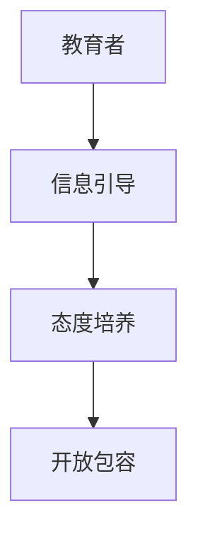

##### 5.1.2 教育者的责任与挑战

教育者的责任是培养下一代具备批判性思维、跨文化交流能力和多元信息获取能力。以下是责任与挑战的Mermaid流程图：

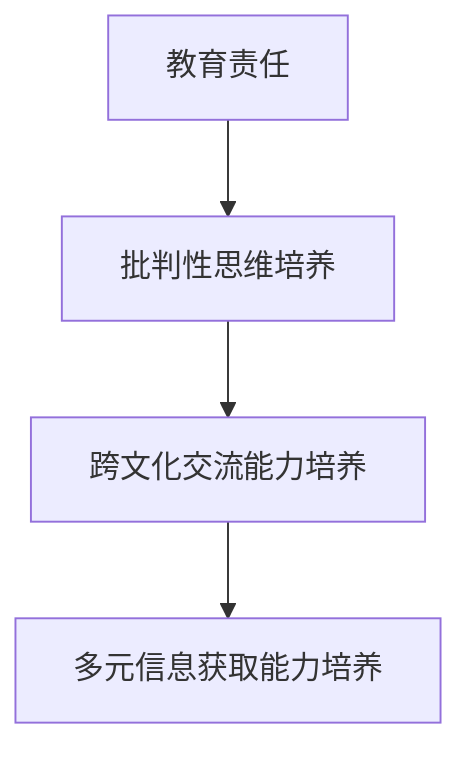

##### 5.1.3 教育者的策略与实践

教育者的策略与实践包括：

1. **课程设计**：设计多元化的课程，涵盖不同领域的知识。
2. **教学方法**：采用互动式教学方法，激发学生的思考。
3. **跨文化教育**：引入跨文化教育，培养学生的跨文化沟通能力。

#### 5.2 媒体人的角色与责任

##### 5.2.1 媒体人在信息茧房中的角色

媒体人在信息茧房中的角色是提供多元化的信息，促进公众对信息的全面理解。以下是媒体人角色的Mermaid流程图：

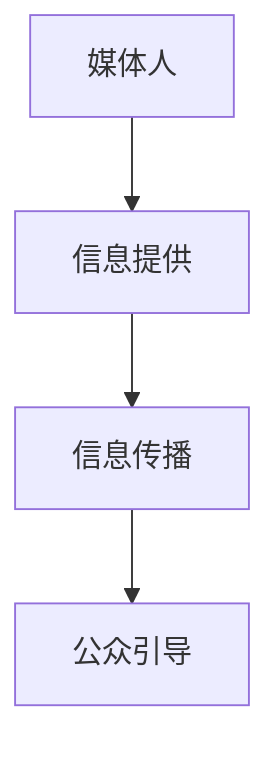

##### 5.2.2 媒体人的责任与挑战

媒体人的责任是传播真实、客观、多元的信息，促进社会的和谐发展。以下是责任与挑战的Mermaid流程图：

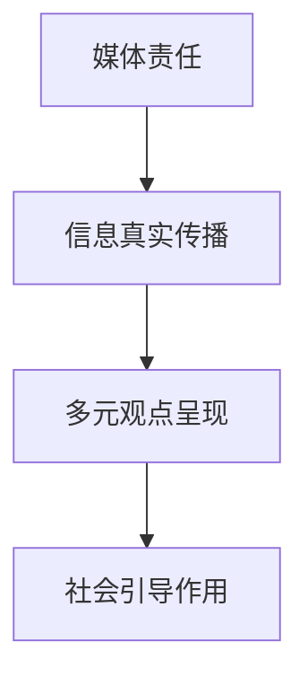

##### 5.2.3 媒体人的策略与实践

媒体人的策略与实践包括：

1. **内容审核**：加强对内容审核，确保信息的真实性和客观性。
2. **多元化报道**：通过多元化报道，提供全面的信息。
3. **互动交流**：与公众互动，了解公众的需求和观点。

#### 5.3 政策制定者的角色与责任

##### 5.3.1 政策制定者在信息茧房中的角色

政策制定者在信息茧房中的角色是制定相关政策，引导社会公众突破信息茧房的限制。以下是政策制定者角色的Mermaid流程图：

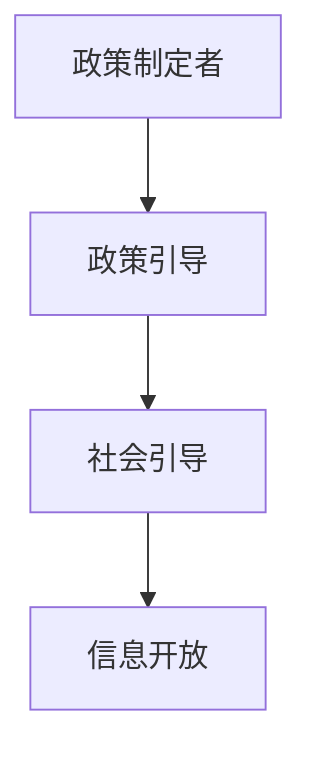

##### 5.3.2 政策制定者的责任与挑战

政策制定者的责任是制定有效的政策，促进社会信息环境的健康发展。以下是责任与挑战的Mermaid流程图：

```mermaid
graph TD
A[政策责任] --> B[信息开放政策]
B --> C[多元信息传播政策]
C --> D[社会信息管理政策]
```

##### 5.3.3 政策制定者的策略与实践

政策制定者的策略与实践包括：

1. **政策制定**：制定有利于信息开放的法律法规。
2. **监管实施**：加强信息监管，确保信息的真实性和公正性。
3. **公众参与**：鼓励公众参与政策制定和实施，提高政策的有效性。

### 结论

#### 6.1 突破信息茧房的总结

信息茧房是一个复杂的社会现象，对个体和社会产生了诸多负面影响。通过培养开放和包容的态度，我们可以突破信息茧房的限制，实现全面的发展。

#### 6.2 开放和包容态度的实践

开放和包容态度的实践是突破信息茧房的关键。通过批判性思维、跨文化交流和多元信息获取，我们可以培养开放和包容的态度，实现个体和

