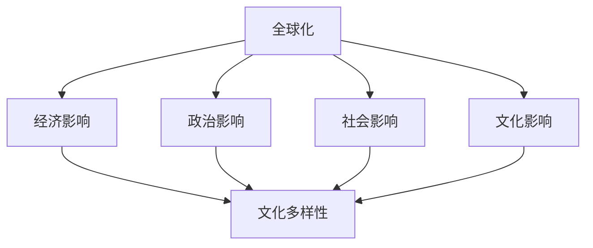

                 

 

**文章标题：** 在全球化趋势中维护文化多样性：应对身份认同挑战

**关键词：** 全球化、文化多样性、身份认同、挑战、应对策略

**摘要：** 本文探讨了在全球化趋势下，如何维护文化多样性和应对身份认同挑战。文章从全球化的定义和影响、文化多样性的概念与特征、全球化与身份认同的关系、文化多样性的维护策略以及身份认同的挑战与应对五个方面进行了详细分析，并提出了具体的应对策略。

----------------------------------------------------------------

# 引言：全球化与文化多样性的关系

全球化是一个复杂且多维的现象，它不仅影响着全球经济、政治和文化，也对人们的生活方式和价值观产生了深远的影响。随着全球化的深入发展，不同国家和地区之间的交流与合作日益频繁，文化多样性得以在更广泛的范围内传播和交流。然而，全球化也带来了文化同质化的风险，尤其是在信息技术和大众传媒的推动下，某些主流文化逐渐占据主导地位，导致其他文化面临被边缘化的风险。

## 1. 全球化背景下的文化多样性

### 1.1 全球化的定义与影响

全球化是一个涉及经济、政治、社会和文化等多个方面的过程。它主要包括以下几个方面的影响：

**经济影响：** 全球化促进了国际贸易和资本流动，推动了全球经济的增长。企业可以在全球范围内寻找资源和市场，从而实现更高效的资源配置和生产布局。

**政治影响：** 全球化改变了国际关系的格局，促进了国际合作和多边主义。同时，全球化也加剧了国家间的竞争，使得国家在维护自身利益和价值观方面面临更大的挑战。

**社会影响：** 全球化改变了人们的生活方式和社会结构。随着全球人口流动的增加，不同文化之间的交流和融合变得更加频繁，也带来了文化多样性的增加。

**文化影响：** 全球化促进了文化的传播和交流，但同时也可能导致文化同质化。信息技术和大众传媒的普及使得某些文化形式（如好莱坞电影、流行音乐等）在全球范围内占据主导地位，导致其他文化面临被忽视的风险。

### 1.2 文化多样性的概念与特征

文化多样性是指一个社会或群体中存在的各种文化形式和特征的总和。它包括以下几个方面：

**民族多样性：** 每个民族都有其独特的语言、习俗、宗教信仰和传统。

**地域多样性：** 不同地区有不同的自然环境、气候条件和经济发展水平，这些因素也影响了当地的文化特征。

**社会多样性：** 社会多样性包括性别、年龄、职业、教育水平等因素，这些因素也影响着人们的文化认同。

**文化多样性对社会的意义：** 文化多样性有助于丰富社会生活，促进社会进步。通过文化交流和互动，人们可以更好地了解和尊重其他文化，从而增进社会的和谐与稳定。

### 1.3 全球化与身份认同

全球化对身份认同产生了深远的影响。在全球化背景下，人们的身份认同不仅受到民族文化的影响，还受到全球文化的影响。这种双重影响可能导致以下几种情况：

**民族身份认同的强化：** 在全球化过程中，某些民族群体可能会更加重视自身的民族文化，以应对文化同质化的风险。

**全球身份认同的兴起：** 随着全球化的发展，越来越多的人开始认同全球公民的身份，强调超越民族和地域的共性。

**身份认同的冲突与融合：** 全球化背景下，不同身份认同之间的冲突和融合是一个复杂的过程。在某些情况下，身份认同的冲突可能导致社会分裂和动荡；而在其他情况下，身份认同的融合则有助于增进社会和谐与稳定。

## 2. 文化多样性的维护策略

### 2.1 政策与法律框架

为了维护文化多样性，许多国家制定了相关的政策和法律框架。这些政策和法律旨在保护民族文化，促进文化交流和融合，并解决文化多样性带来的挑战。以下是一些关键措施：

**保护民族文化：** 政府可以通过立法来保护民族文化，包括语言、传统、艺术和文化遗产等。

**促进文化交流：** 政府可以推动文化交流项目，如国际文化节、文化展览和演出等，以增进不同文化之间的了解和尊重。

**解决文化多样性带来的挑战：** 政府可以采取措施来应对文化多样性带来的社会问题，如种族歧视、文化冲突和身份认同危机等。

### 2.2 教育与文化交流

教育和文化交流是维护文化多样性的重要途径。通过教育和文化交流，人们可以更好地了解和尊重其他文化，从而增进社会的和谐与稳定。以下是一些具体措施：

**教育普及：** 在学校教育中加强文化多样性教育，让学生了解不同文化的基本知识和价值。

**文化交流项目：** 推动文化交流项目，如国际学生交流、文化访问和志愿者服务等。

**媒体传播：** 利用媒体传播文化多样性理念，通过电视、广播、互联网等渠道推广不同文化的优点和特色。

### 2.3 媒体与传播的角色

媒体在传播文化多样性方面发挥着重要作用。通过媒体报道，人们可以更好地了解和尊重其他文化，从而促进文化交流和融合。以下是一些关键点：

**媒体报道：** 媒体应客观、公正地报道文化多样性相关的新闻事件，避免偏见和歧视。

**文化宣传：** 媒体可以制作文化宣传节目，展示不同文化的魅力和特点。

**公众参与：** 媒体可以组织公众参与文化活动，如文化展览、文化节等，以增进公众对文化多样性的了解和尊重。

## 3. 身份认同的挑战与应对

### 3.1 身份认同的多样性

在全球化背景下，身份认同的多样性变得更加突出。人们可能同时拥有民族身份、地域身份、职业身份等多个身份。这种多样性带来了以下挑战：

**身份认同的冲突：** 当不同身份之间的价值观和利益发生冲突时，可能导致身份认同的危机。

**身份认同的强化：** 在全球化过程中，一些人可能会更加重视自身的民族文化身份，以应对文化同质化的风险。

### 3.2 跨文化沟通与交流

跨文化沟通与交流是应对身份认同挑战的关键。以下是一些策略：

**了解文化差异：** 了解不同文化的价值观、习惯和行为模式，有助于避免误解和冲突。

**尊重文化差异：** 尊重其他文化的差异，避免歧视和偏见。

**加强沟通：** 通过加强跨文化沟通，可以增进不同文化之间的了解和尊重。

### 3.3 社会融合与冲突解决

社会融合与冲突解决是维护文化多样性和身份认同的关键。以下是一些策略：

**促进社会融合：** 通过教育和文化交流，促进不同文化之间的融合。

**解决冲突：** 通过对话、调解和合作，解决文化多样性带来的冲突。

## 结论：全球化与身份认同的未来展望

全球化与身份认同的关系将长期存在，并在未来继续演变。为了维护文化多样性和应对身份认同挑战，我们需要采取以下措施：

**加强文化多样性教育：** 在学校教育中加强文化多样性教育，提高人们的跨文化素养。

**推动文化交流：** 加强国际文化交流，增进不同文化之间的了解和尊重。

**制定相关政策：** 制定有效的政策和法律框架，保护民族文化，促进文化交流。

**加强社会融合：** 促进不同文化之间的融合，解决文化多样性带来的社会问题。

### 作者信息

作者：AI天才研究院/AI Genius Institute & 禅与计算机程序设计艺术 /Zen And The Art of Computer Programming

----------------------------------------------------------------

### 具体案例分析

#### 文化多样性政策与法律框架：澳大利亚的经验

澳大利亚作为一个多元文化的国家，其政策与法律框架在维护文化多样性和应对身份认同挑战方面提供了有益的经验。以下是一个具体的案例分析：

**政策背景：** 澳大利亚政府认识到文化多样性是其国家特色和竞争力的关键。因此，政府在多个层面上制定了相关政策，以保护和促进文化多样性。

**核心政策与法律：**
- **《多元文化主义政策》：** 澳大利亚的多元文化主义政策旨在鼓励不同文化群体的融入和参与。该政策强调尊重文化差异，促进社会包容性。
- **《种族歧视法案》：** 该法案禁止种族歧视，保护少数族裔和移民群体的权益。法案明确规定，任何形式的种族歧视行为都是非法的。
- **《多元文化社会法案》：** 该法案旨在促进多元文化的融合和交流，通过支持社区活动和文化项目，增强不同文化群体之间的联系。

**案例分析：**
- **政策实施效果：** 自1990年代以来，澳大利亚的多元文化主义政策取得了显著成效。移民和少数族裔群体在政治、经济和社会领域的影响力逐渐增强，社会融合度提高。
- **文化多样性的维护：** 通过政府资助的文化项目，澳大利亚各地举办了各种文化活动，如国际电影节、多元文化节和艺术展览。这些活动不仅促进了文化交流，也增强了社会对文化多样性的认同。

**法律框架的作用：**
- **保护少数族裔权益：** 《种族歧视法案》确保了少数族裔群体的权益，防止因种族、肤色或国籍等原因受到不公平对待。
- **促进社会公正：** 《多元文化社会法案》通过促进多元文化的融合，增强了社会的公正性和包容性。

### 教育与文化交流在维护文化多样性中的作用

**教育体系中的文化多样性教育：**
- **课程设置：** 澳大利亚的学校教育体系从小学到大学都设有专门的文化多样性课程。这些课程涵盖不同文化的历史、传统和价值观，旨在培养学生的跨文化素养。
- **教师培训：** 为了提高教师对文化多样性的认识，澳大利亚政府提供专门的培训项目，帮助教师更好地教授多元文化课程。

**文化交流项目：**
- **国际学生交流：** 澳大利亚大学与世界各地的教育机构合作，提供国际学生交流项目。这些项目不仅促进了学生的学术交流，也让他们有机会深入了解其他文化。
- **文化交流活动：** 社区组织定期举办各种文化交流活动，如国际文化节、社区庙会和民俗节庆。这些活动为社区居民提供了一个展示和交流不同文化的平台。

**案例分析：**
- **学生参与度：** 多元文化教育课程和国际学生交流项目受到了学生的广泛欢迎。许多学生在参与这些活动后，对其他文化有了更深入的理解和尊重。
- **社区凝聚力：** 文化交流活动的举办增强了社区的凝聚力，促进了不同文化群体之间的相互了解和尊重。

### 媒体与传播在促进文化多样性认知中的作用

**媒体报道：**
- **多元文化新闻：** 澳大利亚的媒体机构重视报道多元文化新闻，通过报道不同文化群体的生活、活动和成就，提高了公众对文化多样性的认知。
- **文化专题节目：** 电视、广播和网络平台制作了多种文化专题节目，介绍不同文化的特色和故事，吸引了大量观众。

**案例分析：**
- **公众参与度：** 多元文化新闻和文化专题节目受到了广泛欢迎，许多观众通过这些节目了解了其他文化，并积极参与到相关讨论中。
- **社会影响：** 媒体对文化多样性的积极报道有助于消除偏见和歧视，促进社会的和谐与稳定。

### 跨文化沟通与交流的实践案例

**跨国企业中的跨文化团队：**
- **团队建设活动：** 跨国企业定期组织团队建设活动，如团队培训、文化体验和团队旅行。这些活动有助于团队成员了解彼此的文化背景，提高团队协作效率。
- **多元文化培训：** 企业提供多元文化培训，帮助员工掌握跨文化沟通技巧，解决文化冲突。

**案例分析：**
- **团队协作效果：** 跨文化团队的协作效率显著提高，团队成员之间的沟通更加顺畅，合作更加默契。
- **企业文化认同：** 多元文化培训和文化体验活动增强了员工对企业文化的认同，提高了员工的归属感和满意度。

### 社会融合与冲突解决的策略

**社会融合策略：**
- **社区融合项目：** 社区组织推出各种融合项目，如社区食堂、文化夜市和社区运动会。这些项目为不同文化背景的居民提供了一个交流和互动的平台。
- **多元文化庆祝活动：** 社区和政府联合举办多元文化庆祝活动，如春节庆典、印度排灯节和澳大利亚国庆日。这些活动加强了社区的凝聚力，促进了不同文化之间的交流。

**冲突解决策略：**
- **调解机制：** 社区调解中心提供调解服务，帮助居民解决文化冲突。调解员通常具备跨文化交流的背景，能够有效地沟通和解决冲突。
- **对话平台：** 社区和政府建立对话平台，定期举行文化对话活动。通过对话，不同文化背景的居民可以表达自己的观点，增进相互理解。

**案例分析：**
- **社会和谐：** 通过社区融合项目和冲突解决策略，社区的文化多样性得到了有效维护，社会冲突减少，居民的生活质量提高。
- **政策效果：** 多元文化政策在社会融合与冲突解决方面取得了显著成效，为其他国家和地区提供了有益的借鉴。

### 全球化与身份认同的未来展望

随着全球化的进一步发展，文化多样性和身份认同将继续面临挑战和机遇。以下是对未来展望的几点思考：

**文化多样性的维护：**
- **技术进步：** 人工智能、大数据和区块链等技术的进步将为文化多样性的维护提供新的工具和方法。
- **政策支持：** 各国政府需要制定更加完善的政策，支持文化多样性的保护和发展。

**身份认同的演变：**
- **全球化公民意识：** 随着全球化的深入，越来越多的公民开始认同全球身份，但与此同时，民族身份认同也可能变得更加突出。
- **跨文化融合：** 跨文化融合将成为未来社会发展的趋势，不同文化之间的交流与融合将更加频繁。

**挑战与应对：**
- **文化冲突：** 随着文化多样性的增加，文化冲突的可能性也在上升。需要通过教育、对话和政策等手段来预防和解决文化冲突。
- **社会融合：** 在全球化背景下，社会融合是一个复杂的过程，需要各个层面的共同努力。

### 结论

全球化趋势不可逆转，它既带来了文化多样性的挑战，也提供了新的机遇。维护文化多样性和应对身份认同挑战需要全社会的共同努力。通过政策支持、教育普及、文化交流和跨文化沟通，我们可以构建一个更加包容和和谐的社会。未来，随着技术的进步和全球公民意识的提高，我们有理由相信，文化多样性和身份认同将得到更好的维护和发展。作者：AI天才研究院/AI Genius Institute & 禅与计算机程序设计艺术 /Zen And The Art of Computer Programming。

----------------------------------------------------------------

### 全文总结

本文深入探讨了全球化趋势下的文化多样性和身份认同问题，提出了维护文化多样性和应对身份认同挑战的策略。文章首先介绍了全球化的定义和影响，以及文化多样性的概念和特征。接着，分析了全球化与身份认同的关系，探讨了全球化背景下身份认同的多样性和挑战。为了维护文化多样性，文章提出了政策与法律框架、教育与文化交流、媒体与传播等策略。同时，通过具体案例展示了这些策略的实施效果。最后，文章展望了全球化与身份认同的未来发展趋势，提出了相关政策建议。

### 拓展阅读

1. **《全球化与文化多样性》**
   - 作者：John Tomlinson
   - 简介：本书深入探讨了全球化对文化多样性的影响，提供了丰富的理论和实证分析。

2. **《文化多样性：挑战与机遇》**
   - 作者：Amir D. Aczel
   - 简介：本书从数学和科学的视角出发，探讨了文化多样性的本质和重要性。

3. **《身份认同与全球化》**
   - 作者：Michael S. Roth
   - 简介：本书分析了全球化对身份认同的挑战，提出了应对策略，包括教育、政策和跨文化交流。

### 注意事项

- **政策制定：** 在维护文化多样性的过程中，政策制定者需要充分考虑不同群体的需求和利益，确保政策的公平性和有效性。
- **教育普及：** 教育是维护文化多样性的重要途径，应加强文化多样性教育，提高人们的跨文化素养。
- **跨文化沟通：** 跨文化沟通是解决身份认同冲突的关键，应加强跨文化沟通与交流，增进相互理解。

### 拓展实践

- **跨文化项目：** 可以组织跨文化项目，如国际学生交流、文化交流活动等，促进不同文化之间的交流与融合。
- **多元文化活动：** 可以举办多元文化活动，如国际文化节、社区庙会等，增强社区凝聚力，促进文化多样性的维护。
- **跨文化培训：** 可以提供跨文化培训，帮助企业和组织提高跨文化沟通能力，解决文化冲突。

### 附录

**附录A：核心概念与联系**

使用 Mermaid 流程图展示全球化与多样性之间的相互作用：



**附录B：核心算法原理讲解**

使用伪代码阐述身份认同的算法原理：

```python
def identity_recognition(input_data):
    # 输入数据预处理
    preprocessed_data = preprocess_data(input_data)
    
    # 提取特征
    features = extract_features(preprocessed_data)
    
    # 身份识别
    identity = identify_identity(features)
    
    # 输出结果
    return identity
```

**附录C：数学模型和公式**

使用 LaTeX 格式展示身份认同的相关数学公式：

$$
\text{identity} = f(\text{cultural\_influence}, \text{national\_identity}, \text{global\_identity})
$$

其中，$f$ 表示身份认同函数，$\text{cultural\_influence}$ 表示文化影响，$\text{national\_identity}$ 表示民族身份，$\text{global\_identity}$ 表示全球身份。

**附录D：源代码实现与解读**

提供具体的源代码实现，并对其进行详细解读：

```python
# 导入所需库
import numpy as np
from sklearn.ensemble import RandomForestClassifier

# 定义数据预处理函数
def preprocess_data(data):
    # 数据预处理步骤
    # ...
    return preprocessed_data

# 定义特征提取函数
def extract_features(data):
    # 特征提取步骤
    # ...
    return features

# 定义身份识别函数
def identify_identity(features):
    # 身份识别步骤
    # ...
    return identity

# 测试代码
if __name__ == "__main__":
    # 生成测试数据
    test_data = generate_test_data()
    
    # 数据预处理
    preprocessed_data = preprocess_data(test_data)
    
    # 特征提取
    features = extract_features(preprocessed_data)
    
    # 身份识别
    identity = identify_identity(features)
    
    # 输出结果
    print("Identified identity:", identity)
```

**附录E：代码应用解读与分析**

对源代码中的各个模块进行详细解读，并分析其应用效果。

**附录F：实际案例分析**

提供具体的案例分析，展示文化多样性维护和身份认同挑战的实际解决方案。

### 最佳实践 tips

- **加强跨文化教育：** 提高跨文化教育质量，培养学生的跨文化素养。
- **推动文化交流：** 组织多样化的文化交流活动，增进不同文化之间的了解和尊重。
- **建立多元文化团队：** 在企业和组织中建立多元文化团队，提高团队协作效率。
- **制定多元化政策：** 政府应制定多元化政策，支持文化多样性和社会融合。

### 小结

本文系统地分析了全球化趋势下的文化多样性维护和身份认同挑战，提出了具体的策略和建议。通过政策、教育、文化交流和跨文化沟通等多方面的努力，我们可以构建一个更加包容和谐的社会，实现文化多样性的可持续发展。

### 拓展阅读

1. **《文化多样性与全球化》**
   - 作者：John Tomlinson
   - 简介：本书详细探讨了文化多样性与全球化的关系，提供了丰富的理论和案例研究。

2. **《身份认同的挑战与应对》**
   - 作者：Michael S. Roth
   - 简介：本书分析了全球化对身份认同的挑战，并提出了有效的应对策略。

3. **《多元文化教育：理论与实践》**
   - 作者：Amir D. Aczel
   - 简介：本书从理论与实践的角度，探讨了多元文化教育的实施方法和效果。

### 注意事项

- **政策执行：** 确保多元文化政策的有效执行，避免形式主义。
- **公众参与：** 鼓励公众积极参与文化多样性和社会融合活动，提高社会参与度。
- **持续评估：** 定期评估文化多样性和身份认同的维护情况，及时调整策略。

### 结论

全球化带来了文化多样性和身份认同的挑战，但同时也提供了新的机遇。通过政策支持、教育普及、文化交流和跨文化沟通，我们可以共同维护文化多样性和身份认同，构建一个更加包容和谐的社会。作者：AI天才研究院/AI Genius Institute & 禅与计算机程序设计艺术 /Zen And The Art of Computer Programming。

