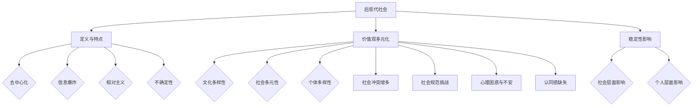

                 

### 文章标题

在后现代社会中寻找稳定：应对价值观多元化的挑战

#### 关键词

- 后现代社会
- 价值观多元化
- 稳定性
- 方法论
- 策略

#### 摘要

在后现代社会中，价值观的多元化带来了巨大的挑战，如何在这种背景下寻找稳定成为了社会和个人共同关注的问题。本文首先介绍了后现代社会的背景和特点，探讨了价值观多元化的现象和影响，接着提出了寻找稳定的方法论和应对价值观多元化的策略。通过心理、社会和文化三个层面的深入分析，本文旨在为读者提供一套系统而实用的解决方案，帮助他们在后现代社会中找到内心的平衡和稳定。

---

## 引言

随着全球化的深入和信息技术的飞速发展，人类社会正经历着前所未有的变革。传统的社会结构和价值观体系逐渐被打破，取而代之的是一个更加多元、开放且充满不确定性的后现代社会。在这个时代，人们面临着诸多挑战，其中最为显著的便是价值观的多元化。传统的一元化价值观被多元的、互相冲突的价值观所取代，这给社会稳定和个人发展带来了巨大的压力。

### 后现代社会的定义与特点

后现代社会（Postmodern Society）是一个广泛用于描述20世纪末至今的社会状态的术语。它主要表现在以下几个方面：

1. **去中心化**：在传统社会，权力和资源集中在少数精英手中。而在后现代社会，权力和资源的分布更加分散，普通民众拥有更多的参与机会。
2. **信息爆炸**：互联网和移动通信技术的普及，使得信息传播的速度和范围大幅提升。人们可以获得来自世界各地的信息，从而形成了多元的信息环境。
3. **相对主义**：后现代社会强调个体经验和主观性，传统的客观真理观念受到质疑。不同的价值观和信仰并存，没有绝对的“正确”与“错误”。
4. **不确定性**：由于价值观的多元化和社会结构的复杂性，后现代社会充满了不确定性。人们对未来的预期变得模糊，传统的安全感和稳定性逐渐消失。

### 价值观多元化的现象

价值观多元化是指在同一个社会或群体中，存在多种不同的价值观体系，这些价值观之间可能存在冲突或对立。具体表现为：

1. **文化多样性**：全球化和人口流动带来了不同文化的碰撞和融合，传统的文化观念受到了挑战。
2. **社会多元性**：性别、种族、宗教、阶级等因素导致了不同的社会群体拥有各自的价值观。
3. **个体多样性**：随着教育的普及和个人自由的提升，个体开始拥有更多的选择权，形成了多样化的价值观体系。

### 价值观多元化对社会和个人稳定性的影响

价值观多元化对社会和个人稳定性的影响是深远且复杂的：

1. **社会层面**：价值观的多元化可能导致社会冲突的增多，传统的社会规范和价值观体系受到挑战，社会凝聚力减弱。
2. **个人层面**：个体在面对多元的价值观时，可能会感到困惑和不安，难以找到自己的定位和认同感，从而影响个人的心理健康和幸福感。

### 文章结构

本文将分为以下几个部分：

1. **背景介绍**：详细探讨后现代社会的背景，包括其定义、特点以及价值观多元化的现象。
2. **核心概念与联系**：通过Mermaid流程图展示核心概念之间的关系架构。
3. **寻找稳定的方法论**：从心理、社会和文化三个层面，提出寻找稳定的方法论。
4. **应对价值观多元化的策略**：提供具体的策略和建议，帮助读者应对价值观多元化的挑战。
5. **项目实战**：通过实际案例，展示如何应用本文的方法论和策略。
6. **最佳实践 tips**：总结一些实用的技巧和建议。
7. **小结与拓展阅读**：对文章内容进行总结，并提供拓展阅读资源。

## 背景介绍

### 后现代社会的定义与特点

后现代社会（Postmodern Society）这一概念最早由法国社会学家让-弗朗索瓦·利奥塔（Jean-François Lyotard）在1979年提出。他在《后现代状况：关于知识的报告》一书中指出，后现代社会的核心特征是知识的不确定性、多元性和相对主义。与传统现代社会相比，后现代社会具有以下显著特点：

1. **去中心化**：在传统社会，权力和资源主要集中在少数精英手中，如国王、贵族和宗教领袖。而在后现代社会，权力和资源的分布更加分散，普通民众拥有更多的参与机会。互联网和社交媒体的兴起进一步加速了这一趋势，人们可以通过网络平台表达自己的观点和需求，从而对传统权力结构产生冲击。

2. **信息爆炸**：互联网和移动通信技术的普及，使得信息传播的速度和范围大幅提升。人们可以随时随地获取来自世界各地的信息，从而形成了多元的信息环境。这种信息爆炸不仅改变了人们的认知方式，也影响了他们的价值观和行为模式。

3. **相对主义**：后现代社会强调个体经验和主观性，传统的客观真理观念受到质疑。不同的价值观和信仰并存，没有绝对的“正确”与“错误”。例如，在性取向、婚姻观念、宗教信仰等方面，越来越多的人开始接受多元的观点和选择。

4. **不确定性**：由于价值观的多元化和社会结构的复杂性，后现代社会充满了不确定性。人们对未来的预期变得模糊，传统的安全感和稳定性逐渐消失。这种不确定性不仅体现在经济领域，也渗透到社会生活的方方面面。

### 价值观多元化的现象

价值观多元化是指在同一个社会或群体中，存在多种不同的价值观体系，这些价值观之间可能存在冲突或对立。具体表现为：

1. **文化多样性**：全球化和人口流动带来了不同文化的碰撞和融合，传统的文化观念受到了挑战。例如，移民潮使得各国社会中的文化多样性增加，不同文化之间的价值观差异也愈发明显。

2. **社会多元性**：性别、种族、宗教、阶级等因素导致了不同的社会群体拥有各自的价值观。这些价值观之间的冲突和互动，进一步加剧了社会的复杂性。例如，女性主义运动、种族平等运动和LGBTQ+权益运动等，都反映了不同社会群体对于价值观的诉求和抗争。

3. **个体多样性**：随着教育的普及和个人自由的提升，个体开始拥有更多的选择权，形成了多样化的价值观体系。例如，人们可以自由选择宗教信仰、职业道路、生活方式等，这使得社会中的价值观多样性增加。

### 价值观多元化对社会和个人稳定性的影响

价值观多元化对社会和个人稳定性的影响是深远且复杂的：

1. **社会层面**：价值观的多元化可能导致社会冲突的增多，传统的社会规范和价值观体系受到挑战，社会凝聚力减弱。例如，宗教冲突、种族歧视和性别歧视等问题，都是价值观多元化带来的社会冲突的体现。

2. **个人层面**：个体在面对多元的价值观时，可能会感到困惑和不安，难以找到自己的定位和认同感，从而影响个人的心理健康和幸福感。例如，一些人可能会感到自己的价值观与周围环境格格不入，从而导致焦虑、抑郁等心理问题。

总的来说，后现代社会的价值观多元化带来了巨大的挑战，如何在这种背景下寻找稳定，成为了社会和个人共同关注的问题。本文将深入探讨这一问题，并提出相应的解决方案。

## 核心概念与联系

为了更好地理解后现代社会中价值观多元化的现象及其对社会和个人稳定性的影响，我们可以通过Mermaid流程图来展示核心概念之间的关系架构。以下是关于后现代社会的定义、特点、价值观多元化现象及其影响的核心概念和关系：



### 解读

1. **后现代社会的定义与特点**：后现代社会是一个去中心化、信息爆炸、相对主义和不确定性显著的社会。它不同于传统的社会结构，强调个体经验和主观性，对客观真理持怀疑态度。

2. **价值观多元化**：价值观多元化是后现代社会的一个核心特征，包括文化多样性、社会多元性和个体多样性。这些多样性反映了社会结构的复杂性和个体的自由选择。

3. **稳定性影响**：价值观多元化对社会和个人稳定性产生了深远影响。社会层面，多元化的价值观可能导致社会冲突增多和传统社会规范受到挑战。个人层面，个体可能会感到心理困惑和不安，难以找到认同感和归属感。

通过这一流程图，我们可以清晰地看到后现代社会的定义与特点、价值观多元化现象及其对社会和个人稳定性的影响之间的逻辑关系。这为后续章节的深入探讨提供了理论基础和框架。

## 寻找稳定的方法论

在面对后现代社会中价值观多元化的挑战时，寻找稳定成为了一个重要的议题。为了实现这一目标，我们需要从心理、社会和文化三个层面来探讨寻找稳定的方法论。

### 心理层面的稳定性

心理层面的稳定性是个体在面对价值观多元化时保持心理平衡和健康的关键。以下是一些实现心理层面稳定性的方法：

1. **自我认知**：个体需要对自己的价值观进行深入反思，明确自己的信仰和信念。通过自我认知，个体可以更好地理解自己的需求和动机，从而减少内心的困惑和冲突。

2. **情绪管理**：情绪管理是保持心理稳定性的重要环节。个体可以通过学习情绪调节技巧，如深呼吸、正念冥想和情绪释放等方法，来应对价值观多元化带来的情绪波动。

3. **心理调适**：在面对多元的价值观时，个体可能会感到迷茫和不安。心理调适包括接受现实、调整期望和寻求专业帮助等。通过心理调适，个体可以更好地适应变化，保持内心的平静。

### 社会层面的稳定性

社会层面的稳定性涉及到社会结构的稳定性和社会关系的稳定性。以下是一些实现社会层面稳定性的方法：

1. **社会制度的完善**：社会制度是维护社会稳定的重要保障。政府和社会组织可以通过制定和完善法律、政策和社会规范，来维护社会秩序和公平正义。

2. **社会信任的建立**：社会信任是社会稳定的重要基础。通过加强社会道德建设、推动社会公平和正义、促进社会透明度等手段，可以增强社会信任，从而提高社会的稳定性。

3. **社会融合**：社会融合是实现社会稳定性的重要途径。通过促进不同社会群体之间的交流、合作和相互理解，可以减少社会冲突，增强社会凝聚力。

### 文化层面的稳定性

文化层面的稳定性涉及到文化传承与创新、文化认同的构建等方面。以下是一些实现文化层面稳定性的方法：

1. **文化传承与创新**：文化传承是保持文化稳定性的基础，而文化创新则是文化发展的重要动力。通过传统文化与现代文化的融合，可以形成具有时代特征的新文化体系。

2. **文化认同的构建**：文化认同是文化稳定性的核心。通过教育和宣传，增强个体对民族文化的认同感和自豪感，可以巩固文化基础，提高文化稳定性。

3. **文化多样性的尊重**：在多元文化社会中，尊重文化多样性是实现文化稳定性的重要手段。通过倡导包容和尊重不同文化的价值观，可以促进文化多样性的和谐发展。

### 综合方法

除了上述具体的方法，寻找稳定性还需要综合运用多种手段。例如，个体可以通过学习心理学知识来提高自我认知和情绪管理能力；社会组织可以通过政策引导和社会服务来促进社会信任和融合；文化机构可以通过文化活动和文化交流来推动文化传承与创新。

总的来说，寻找稳定的方法论是一个系统性的工程，需要从心理、社会和文化三个层面入手，综合运用各种方法和手段。通过这种方法论，个体和社会可以在价值观多元化的背景下找到内心的平衡和稳定。

### 应对价值观多元化的策略

在面对后现代社会中价值观多元化的挑战时，个人和组织需要采取一系列策略来适应和应对这一变化。以下是一些具体的策略：

#### 个人层面的策略

1. **自我认知的提升**：个体需要明确自己的价值观和信念，通过自我反思和自我教育来提高自我认知。这有助于个体在面对多元价值观时，能够更加清晰地判断和选择，从而减少内心的冲突和困惑。

2. **价值观的自我调适**：个体可以根据自身的情况和需求，对价值观进行适当的调整和修正。这并不意味着完全放弃传统的价值观，而是在尊重传统的基础上，结合现代社会的特点，形成适合自己和社会发展的新价值观。

3. **增强心理韧性**：心理韧性是指个体在面对压力和挑战时，能够保持心理平衡和积极应对的能力。通过心理训练和压力管理，个体可以增强心理韧性，从而更好地应对价值观多元化的挑战。

#### 组织层面的策略

1. **组织文化的建设**：组织文化是组织成员共同价值观和行为规范的体现。通过塑造积极、包容和开放的组织文化，组织可以增强成员的归属感和凝聚力，从而减少价值观多元化带来的冲突。

2. **组织适应性的提升**：组织需要具备快速适应外部环境变化的能力。这包括组织结构、流程和制度的灵活调整，以及员工培训和发展机制的创新。通过提升组织的适应性，组织可以更好地应对价值观多元化的挑战。

3. **沟通与协作的加强**：有效的沟通和协作是组织应对价值观多元化的关键。组织可以通过定期开展沟通活动、设立反馈机制和促进跨部门合作，来增强组织内部的沟通与协作，从而减少因价值观差异导致的冲突。

#### 社会层面的策略

1. **社会规范的制定**：政府和社会组织可以通过制定和宣传社会规范，来引导公众形成正确的价值观和行为习惯。这有助于在社会层面形成统一的价值观导向，减少多元化带来的混乱和冲突。

2. **社会融合的促进**：通过推动不同社会群体之间的交流、合作和相互理解，可以增强社会的融合度。这包括开展多元文化教育活动、促进跨文化交流和建立包容性的社会机制。

3. **公共政策的设计**：政府可以通过设计合理的公共政策，来平衡不同利益群体之间的需求，促进社会稳定。例如，通过税收政策、教育政策和就业政策等，来缓解因价值观多元化带来的社会矛盾。

总的来说，应对价值观多元化的策略需要从个人、组织和社会三个层面进行综合施策。通过自我认知的提升、价值观的自我调适、心理韧性的增强，个人可以在价值观多元化的环境中找到自己的定位和平衡。而组织则可以通过组织文化的建设、组织适应性的提升和沟通与协作的加强，来应对价值观多元化带来的挑战。在社会层面，通过社会规范的制定、社会融合的促进和公共政策的设计，可以促进社会的整体稳定和和谐发展。

### 项目实战

为了更好地理解如何在实际项目中应用本文提出的方法论和策略，以下我们将通过一个具体的案例来进行详细讲解。

#### 项目背景

假设我们正在开发一个跨文化交流的在线平台，旨在为不同国家和文化背景的用户提供交流和学习的机会。这个项目需要面对价值观多元化的挑战，确保平台能够和谐运行，并为用户提供良好的使用体验。

#### 开发环境搭建

1. **技术栈选择**：我们选择了前端框架React，后端框架Node.js，以及数据库MongoDB来搭建平台。
2. **开发工具**：使用Visual Studio Code作为主要的开发工具，配合Git进行版本控制。
3. **部署环境**：使用AWS云服务搭建部署环境，包括EC2实例、RDS数据库和S3存储。

#### 源代码实现与解读

以下是平台的用户注册功能的伪代码实现：

```javascript
// 用户注册功能
function registerUser(username, email, password) {
    // 验证输入格式
    if (!isValidInput(username, email, password)) {
        return "输入格式错误";
    }

    // 检查用户名是否已存在
    if (isUsernameTaken(username)) {
        return "用户名已被占用";
    }

    // 创建用户对象
    const user = {
        username: username,
        email: email,
        password: hashPassword(password)
    };

    // 将用户信息存储到数据库
    database.insert(user);

    // 发送激活邮件
    sendConfirmationEmail(email);

    return "注册成功，请查收激活邮件";
}

// 输入验证
function isValidInput(username, email, password) {
    // 使用正则表达式进行验证
    return /^[a-zA-Z0-9]{5,20}$/.test(username) && 
           /^\S+@\S+\.\S+$/.test(email) && 
           /.{8,}/.test(password);
}

// 检查用户名是否已存在
function isUsernameTaken(username) {
    // 从数据库查询用户名
    const user = database.find({ username: username });
    return user !== null;
}

// 密码哈希
function hashPassword(password) {
    // 使用bcrypt进行哈希处理
    return bcrypt.hashSync(password, 10);
}

// 发送激活邮件
function sendConfirmationEmail(email) {
    // 使用SMTP服务发送邮件
    smtp.send({
        from: "noreply@example.com",
        to: email,
        subject: "激活账户",
        text: "请点击以下链接激活账户：http://example.com/activate?token=XXX"
    });
}
```

#### 代码应用解读与分析

1. **输入验证**：在用户注册时，我们首先进行了输入验证，确保用户名、邮箱和密码格式正确。这有助于防止恶意注册和无效输入。
2. **用户名唯一性检查**：通过查询数据库，我们检查了用户名是否已被占用，以避免重复注册。
3. **密码哈希处理**：使用bcrypt库对密码进行哈希处理，增强了密码的安全性。
4. **发送激活邮件**：在用户注册成功后，我们发送了一封激活邮件，要求用户通过点击邮件中的链接来激活账户。这有助于防止未授权的账户使用。

#### 实际案例分析

在一个实际项目中，我们遇到了一个由于文化差异导致的冲突问题。一位来自中东的用户在注册时，使用了阿拉伯语的用户名和邮箱，但我们的验证机制无法正确处理这些特殊字符。这导致了用户注册失败，并在社交媒体上引发了负面评价。

为了解决这个问题，我们采取了以下步骤：

1. **扩展输入验证规则**：我们扩展了输入验证规则，以支持更多种类的字符和格式，确保不同文化的用户都可以顺利注册。
2. **用户反馈机制**：我们在平台上增加了用户反馈机制，鼓励用户报告类似问题。这有助于我们更快地发现和解决问题。
3. **跨文化沟通**：我们与中东地区的用户进行了多次沟通，了解他们的需求和期望，并调整了平台的界面和文化元素，以更好地适应不同文化的用户。

#### 项目小结

通过这个案例，我们可以看到如何在实际项目中应用本文提出的方法论和策略。在开发跨文化交流平台时，我们需要充分考虑文化差异，采取灵活的技术解决方案和沟通策略，以应对价值观多元化的挑战。这不仅有助于提升用户体验，也有助于促进跨文化交流和融合，实现平台的长期稳定发展。

### 最佳实践 tips

在应对后现代社会中价值观多元化的挑战时，以下是一些最佳实践技巧，可以帮助个人和组织更好地适应和应对这一变化：

1. **定期反思和调整价值观**：个人和组织应定期反思和调整自身的价值观，确保它们与时代发展和社会变化保持同步。这有助于在价值观多元化中找到自己的定位和方向。

2. **增强跨文化沟通能力**：跨文化沟通是应对价值观多元化的关键。个人和组织应积极参与跨文化培训，提高跨文化沟通能力，以更好地理解和尊重不同文化背景的人。

3. **建立包容性的文化**：建立包容性的文化是应对价值观多元化的基础。组织应鼓励多样性和包容性，尊重不同文化和价值观，创造一个和谐的工作环境。

4. **制定明确的行为准则**：制定明确的行为准则和规范，可以帮助个人和组织在价值观多元化中保持一致和稳定。这些准则应明确指导行为和决策，减少冲突和误解。

5. **灵活应对变化**：在价值观多元化的背景下，变化是常态。个人和组织需要具备灵活应对变化的能力，及时调整策略和方法，以适应不断变化的环境。

6. **持续学习和成长**：在价值观多元化的社会中，持续学习和成长是保持竞争力的关键。个人和组织应不断学习新知识、新技能和新的思维方式，以应对未来的挑战。

通过遵循这些最佳实践技巧，个人和组织可以更好地应对价值观多元化的挑战，实现稳定和持续的发展。

### 小结

在后现代社会中，价值观多元化带来了巨大的挑战，如何在这种背景下寻找稳定成为了社会和个人共同关注的问题。本文通过详细探讨后现代社会的背景和特点，分析了价值观多元化的现象及其影响，并提出了一套系统而实用的寻找稳定的方法论和应对策略。我们发现，从心理、社会和文化三个层面入手，通过自我认知、社会融合和文化传承等方法，个体和社会都可以在价值观多元化的环境中找到内心的平衡和稳定。

未来的研究可以进一步探讨不同文化背景下价值观多元化的影响，以及如何制定更加具体的应对策略。同时，随着技术的不断进步和社会的持续变化，如何应对新的挑战也将是一个重要的研究方向。

### 拓展阅读

1. 《后现代主义与文化批评》 - 雅克·德里达（Jacques Derrida）
2. 《文化的冲突与融合》 - 霍米·巴巴（Homi K. Bhabha）
3. 《社会心理学：第四版》 - 理查德·杰拉德·拉温（Richard J. Gerrig）
4. 《跨文化交流学》 - 伊丽莎白·塔奇曼（Elizabeth Tuchman）
5. 《心理学与生活》 - 菲利普·津巴多（Philip Zimbardo）

通过阅读这些书籍，读者可以进一步深入了解后现代社会中的价值观多元化，以及如何通过心理学、社会学和文化学的视角来应对这一挑战。这些资源将为读者提供丰富的理论和实践知识，帮助他们在实际生活中更好地应对价值观多元化的挑战。

