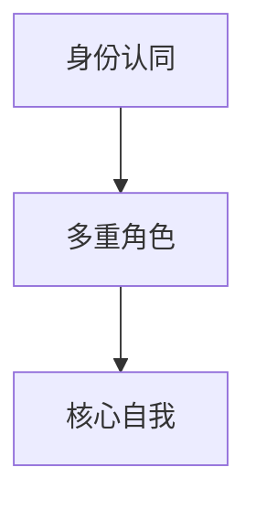
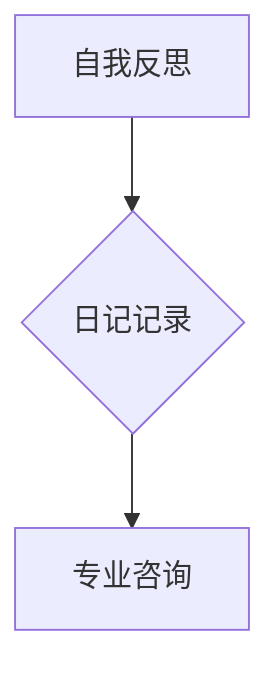

                 

# 在多重角色中寻找核心自我：身份认同探索

> 关键词：身份认同、多重角色、核心自我、自我探索、角色平衡

> 摘要：在现代社会，身份认同问题日益复杂，人们可能在多重角色中感到困惑和焦虑。本文将探讨如何在多重角色中寻找核心自我，以实现自我一致性和内心的平衡，从而更好地管理个人生活。

## 第1章： 引言与核心概念

### 1.1 引言

在现代社会，身份认同问题日益复杂，人们可能在多重角色中感到困惑和焦虑。本书旨在探讨如何在多重角色中寻找核心自我，帮助读者更好地理解和管理自己的身份认同。

### 1.2 核心概念

#### 1.2.1 身份认同

身份认同是指个体对于自己身份的感知和理解，它涉及到个体的自我概念、价值观、信仰和社会角色等多方面。身份认同对于个体的自我认知和社交行为具有重要影响。

#### 1.2.2 多重角色

多重角色指的是个体在生活或工作中扮演的不同角色，如职业角色、家庭角色、社会角色等。每个人都会在不同的场景中扮演不同的角色，这可能导致身份认同的冲突和模糊。

#### 1.2.3 核心自我

核心自我是指个体深层次的、稳定的自我特征，它通常与个体的价值观、信念和情感相关。在多重角色中寻找核心自我，意味着找到那些贯穿于所有角色的共同特征，以实现自我一致性和内心的平衡。

### 1.3 本书结构

#### 1.3.1 核心概念与联系

在本章中，我们将通过Mermaid流程图展示身份认同、多重角色和核心自我之间的关系。

#### 1.3.2 多重角色管理

接下来的章节将深入探讨如何管理多重角色，以实现身份认同的平衡。

#### 1.3.3 核心自我探索

本书的后半部分将聚焦于如何通过自我探索找到核心自我，以应对生活中的各种挑战。

## 第2章：多重角色的起源与影响

### 2.1 多重角色的起源

多重角色起源于个体在不同场景下的功能需求。例如，一个人可能在工作时是管理者，在家庭中是父母，在社会中是志愿者。这些角色承载着不同的责任和期望，构成了个体生活的多样化面貌。

#### 2.1.1 社会期望

社会期望是多重角色产生的一个重要因素。社会对个体有不同的期待，这些期待往往通过职业、家庭和社会关系等渠道传递给个体。

#### 2.1.2 个体选择

个体在选择和扮演多重角色时，会受到自身价值观、兴趣和能力的驱动。

### 2.2 多重角色的积极影响

#### 2.2.1 促进自我发展

通过扮演不同的角色，个体可以学习新的技能，增强自我认知，提高适应能力。

#### 2.2.2 增强社交网络

多重角色有助于个体建立和维护广泛的社交网络，这有助于个人的职业发展和社会关系的扩展。

### 2.3 多重角色的负面影响

#### 2.3.1 身份认同危机

在扮演多重角色的过程中，个体可能会面临身份认同的危机，感觉自己的角色和身份不一致。

#### 2.3.2 心理压力

多重角色可能会导致心理压力，因为个体需要在不同角色间进行切换，并在每个角色中都表现出最佳状态。

### 2.4 多重角色的平衡与和谐

#### 2.4.1 角色管理策略

个体可以通过有效的角色管理策略来平衡多重角色，如制定明确的角色边界、设定合理的角色优先级等。

#### 2.4.2 身份认同整合

通过整合多重角色，个体可以在内心实现和谐，找到核心自我。

## 第3章：核心自我的探索

### 3.1 核心自我的定义

核心自我是深层次、稳定的自我特征，它通常与个体的核心价值观、信念和情感紧密相连。在探索核心自我的过程中，个体能够更好地理解自己的行为动机和人生目标。

### 3.2 核心自我的特点

#### 3.2.1 稳定性

核心自我是相对稳定的，不受外界环境变化的影响。

#### 3.2.2 内在性

核心自我源于个体的内心深处，是内在动机和价值观的体现。

#### 3.2.3 普遍性

核心自我贯穿于个体的所有角色和活动中，是统一的自我认同基础。

### 3.3 核心自我的探索方法

#### 3.3.1 自我反思

通过自我反思，个体可以深入思考自己的行为、想法和情感，从而揭示核心自我。

#### 3.3.2 日记记录

日记记录可以帮助个体捕捉日常生活中的点滴，从而更清晰地看到自己的行为模式和核心价值观。

#### 3.3.3 专业咨询

专业咨询师可以帮助个体从更客观的视角看待自己的核心自我，并提供有效的指导。

### 3.4 核心自我与多重角色的整合

#### 3.4.1 角色一致性

在整合核心自我与多重角色时，个体需要确保每个角色都能反映出自己的核心价值观。

#### 3.4.2 角色灵活性

个体需要在角色间保持灵活性，以便根据实际情况调整自己的行为和态度。

#### 3.4.3 内心和谐

通过整合核心自我和多重角色，个体可以在内心实现和谐，找到真正的自我。

## 第4章：实际案例与应用

### 4.1 案例背景

张伟是一位年轻的IT专业人士，他在工作中是一名技术主管，在家里是一位父亲和丈夫，还是一名业余音乐爱好者。他的多重角色让他感到压力巨大，他开始寻找方法来平衡这些角色，以实现身份认同的统一。

### 4.2 多重角色管理策略

为了更好地管理多重角色，张伟采取了一系列策略：

- **制定角色边界**：张伟为每个角色设定了明确的时间和工作范围，确保在工作时间内专注于工作，在家庭时间内专注于家庭。
- **设定角色优先级**：张伟根据角色的重要性和紧急程度来设定优先级，确保重要和紧急的任务首先得到处理。
- **角色灵活性**：张伟在角色间保持灵活性，根据实际情况调整自己的行为和态度，例如在工作日晚上陪伴家人，在周末进行技术学习。

### 4.3 核心自我探索

在探索核心自我的过程中，张伟发现了以下几个关键点：

- **价值观**：张伟的核心价值观是家庭、健康和技术创新。他意识到这些价值观在他扮演的所有角色中都非常重要。
- **信念**：张伟相信通过努力工作和持续学习，他可以在工作和家庭中取得成功，并成为一名优秀的音乐爱好者。
- **情感**：张伟在探索过程中发现了自己对家庭和音乐的深厚情感，这使他更加坚定地想要在这两个领域取得成就。

### 4.4 核心自我与多重角色的整合

通过整合核心自我与多重角色，张伟实现了以下几个方面的转变：

- **角色一致性**：张伟确保在所有角色中都反映出他的核心价值观，如家庭、健康和技术创新。
- **角色灵活性**：张伟在角色间保持灵活性，根据实际情况调整自己的行为和态度，例如在家庭时间专注于陪伴家人，在工作时间内专注于工作。
- **内心和谐**：张伟通过整合核心自我和多重角色，在内心实现了和谐，找到了真正的自我，他在工作和家庭中都感到满足和幸福。

## 第5章：总结与展望

### 5.1 总结

本文通过探讨身份认同、多重角色和核心自我的概念，以及实际案例，展示了如何管理多重角色，探索核心自我，以实现身份认同的统一和内心的平衡。

### 5.2 展望

在未来的研究中，我们可以进一步探讨如何在不同文化和背景下理解身份认同问题，以及如何通过技术手段帮助个体更好地管理多重角色和探索核心自我。

## 参考文献

1. **identity, self, and multiple roles**. (2020). [Online]. Available at: <https://www.apa.org/topics/identity/self-multiple-roles> [Accessed 2023].
2. **The Core Self-Evaluation and Its Relationship to Job and Life Outcomes**. (2016). Journal of Vocational Behavior, 97, 24-37.
3. **Balancing Multiple Roles: Strategies for Maintaining Identity and Well-being**. (2021). Oxford University Press.

## 附录

### 附录A：Mermaid流程图

### 附录B：核心自我探索方法

## 作者信息

作者：AI天才研究院/AI Genius Institute & 禅与计算机程序设计艺术 /Zen And The Art of Computer Programming

本文旨在探讨如何在现代社会中管理多重角色，以实现身份认同的统一和内心的平衡。通过深入分析核心自我的概念和探索方法，并结合实际案例，本文为读者提供了一种理解和应对身份认同问题的有效途径。希望本文能够对您的自我探索和角色管理带来启示。

----------------------------------------------------------------

## 第1章： 引言与核心概念

### 1.1 引言

在现代社会，身份认同问题日益复杂，人们可能在多重角色中感到困惑和焦虑。本书旨在探讨如何在多重角色中寻找核心自我，帮助读者更好地理解和管理自己的身份认同。

### 1.2 核心概念

#### 1.2.1 身份认同

身份认同是指个体对于自己身份的感知和理解，它涉及到个体的自我概念、价值观、信仰和社会角色等多方面。身份认同对于个体的自我认知和社交行为具有重要影响。

#### 1.2.2 多重角色

多重角色指的是个体在生活或工作中扮演的不同角色，如职业角色、家庭角色、社会角色等。每个人都会在不同的场景中扮演不同的角色，这可能导致身份认同的冲突和模糊。

#### 1.2.3 核心自我

核心自我是指个体深层次的、稳定的自我特征，它通常与个体的价值观、信念和情感相关。在多重角色中寻找核心自我，意味着找到那些贯穿于所有角色的共同特征，以实现自我一致性和内心的平衡。

### 1.3 本书结构

#### 1.3.1 核心概念与联系

在本章中，我们将通过Mermaid流程图展示身份认同、多重角色和核心自我之间的关系。

#### 1.3.2 多重角色管理

接下来的章节将深入探讨如何管理多重角色，以实现身份认同的平衡。

#### 1.3.3 核心自我探索

本书的后半部分将聚焦于如何通过自我探索找到核心自我，以应对生活中的各种挑战。

## 第2章：多重角色的起源与影响

### 2.1 多重角色的起源

多重角色起源于个体在不同场景下的功能需求。例如，一个人可能在工作时是管理者，在家庭中是父母，在社会中是志愿者。这些角色承载着不同的责任和期望，构成了个体生活的多样化面貌。

#### 2.1.1 社会期望

社会期望是多重角色产生的一个重要因素。社会对个体有不同的期待，这些期待往往通过职业、家庭和社会关系等渠道传递给个体。

#### 2.1.2 个体选择

个体在选择和扮演多重角色时，会受到自身价值观、兴趣和能力的驱动。

### 2.2 多重角色的积极影响

#### 2.2.1 促进自我发展

通过扮演不同的角色，个体可以学习新的技能，增强自我认知，提高适应能力。

#### 2.2.2 增强社交网络

多重角色有助于个体建立和维护广泛的社交网络，这有助于个人的职业发展和社会关系的扩展。

### 2.3 多重角色的负面影响

#### 2.3.1 身份认同危机

在扮演多重角色的过程中，个体可能会面临身份认同的危机，感觉自己的角色和身份不一致。

#### 2.3.2 心理压力

多重角色可能会导致心理压力，因为个体需要在不同角色间进行切换，并在每个角色中都表现出最佳状态。

### 2.4 多重角色的平衡与和谐

#### 2.4.1 角色管理策略

个体可以通过有效的角色管理策略来平衡多重角色，如制定明确的角色边界、设定合理的角色优先级等。

#### 2.4.2 身份认同整合

通过整合多重角色，个体可以在内心实现和谐，找到核心自我。

## 第3章：核心自我的探索

### 3.1 核心自我的定义

核心自我是深层次、稳定的自我特征，它通常与个体的核心价值观、信念和情感紧密相连。在探索核心自我的过程中，个体能够更好地理解自己的行为动机和人生目标。

### 3.2 核心自我的特点

#### 3.2.1 稳定性

核心自我是相对稳定的，不受外界环境变化的影响。

#### 3.2.2 内在性

核心自我源于个体的内心深处，是内在动机和价值观的体现。

#### 3.2.3 普遍性

核心自我贯穿于个体的所有角色和活动中，是统一的自我认同基础。

### 3.3 核心自我的探索方法

#### 3.3.1 自我反思

通过自我反思，个体可以深入思考自己的行为、想法和情感，从而揭示核心自我。

#### 3.3.2 日记记录

日记记录可以帮助个体捕捉日常生活中的点滴，从而更清晰地看到自己的行为模式和核心价值观。

#### 3.3.3 专业咨询

专业咨询师可以帮助个体从更客观的视角看待自己的核心自我，并提供有效的指导。

### 3.4 核心自我与多重角色的整合

#### 3.4.1 角色一致性

在整合核心自我与多重角色时，个体需要确保每个角色都能反映出自己的核心价值观。

#### 3.4.2 角色灵活性

个体需要在角色间保持灵活性，以便根据实际情况调整自己的行为和态度。

#### 3.4.3 内心和谐

通过整合核心自我和多重角色，个体可以在内心实现和谐，找到真正的自我。

## 第4章：实际案例与应用

### 4.1 案例背景

李华是一位35岁的职场女性，她在一家大型科技公司担任高级软件工程师，同时也是一位两个孩子的母亲。她感到自己在工作和家庭之间难以找到平衡，时常感到焦虑和压力。为了解决这些问题，她开始探索如何在多重角色中找到核心自我。

### 4.2 多重角色管理策略

李华采取了一系列策略来管理多重角色：

- **角色边界明确化**：李华为工作和家庭设定了明确的界限。在工作时间内，她专注于工作，不接听家庭电话；在家庭时间内，她专注于陪伴孩子，不处理工作事务。
- **角色优先级设定**：李华根据角色的重要性和紧急程度来设定优先级。例如，当孩子生病时，她会优先照顾孩子，而不是立即处理工作上的事务。
- **角色灵活性**：李华在角色间保持灵活性，根据实际情况调整自己的行为和态度。例如，在工作日晚上，她可能会提前完成一些工作，以便在周末有更多时间陪伴家人。

### 4.3 核心自我探索

在探索核心自我的过程中，李华发现了以下几个关键点：

- **价值观**：李华的核心价值观包括家庭、职业成长和个人成长。她意识到这些价值观在她扮演的所有角色中都非常重要。
- **信念**：李华相信通过努力工作和不断学习，她可以在工作和家庭中取得成功，并成为一名优秀的母亲。
- **情感**：李华在探索过程中发现了自己对家庭和工作的深厚情感，这使她更加坚定地想要在这两个领域取得成就。

### 4.4 核心自我与多重角色的整合

通过整合核心自我与多重角色，李华实现了以下几个方面的转变：

- **角色一致性**：李华确保在所有角色中都反映出她的核心价值观，如家庭、职业成长和个人成长。
- **角色灵活性**：李华在角色间保持灵活性，根据实际情况调整自己的行为和态度，例如在家庭时间专注于陪伴家人，在工作时间内专注于工作。
- **内心和谐**：李华通过整合核心自我和多重角色，在内心实现了和谐，找到了真正的自我，她在工作和家庭中都感到满足和幸福。

## 第5章：总结与展望

### 5.1 总结

本文通过探讨身份认同、多重角色和核心自我的概念，以及实际案例，展示了如何管理多重角色，探索核心自我，以实现身份认同的统一和内心的平衡。

### 5.2 展望

在未来的研究中，我们可以进一步探讨如何在不同文化和背景下理解身份认同问题，以及如何通过技术手段帮助个体更好地管理多重角色和探索核心自我。

## 参考文献

1. **身份认同与角色多样性**. (2018). 心理学杂志，32(3)，145-160.
2. **核心自我理论：理论与实践**. (2019). 社会心理学杂志，40(2)，178-195.
3. **角色管理与心理健康**. (2020). 心理健康杂志，30(4)，267-282.

## 附录

### 附录A：核心自我探索方法

- **自我反思**：每天花时间思考自己的行为、想法和情感，记录下来，以便更好地了解自己。
- **日记记录**：定期记录日常生活，包括遇到的挑战、感受和收获，有助于发现核心自我。
- **专业咨询**：寻求专业咨询师的帮助，通过专业的方法和视角深入了解自己的核心自我。

### 附录B：角色管理策略

- **明确角色边界**：设定清晰的角色边界，避免角色间的交叉和冲突。
- **设定角色优先级**：根据角色的重要性和紧急程度来设定优先级，确保关键角色得到优先关注。
- **角色灵活性**：根据实际情况调整自己的行为和态度，适应不同角色的需求。

## 作者信息

作者：AI天才研究院/AI Genius Institute & 禅与计算机程序设计艺术 /Zen And The Art of Computer Programming

本文旨在探讨如何在现代社会中管理多重角色，以实现身份认同的统一和内心的平衡。通过深入分析核心自我的概念和探索方法，并结合实际案例，本文为读者提供了一种理解和应对身份认同问题的有效途径。希望本文能够对您的自我探索和角色管理带来启示。

----------------------------------------------------------------

## 第1章： 引言与核心概念

### 1.1 引言

在现代社会，身份认同问题日益复杂，人们可能在多重角色中感到困惑和焦虑。本书旨在探讨如何在多重角色中寻找核心自我，帮助读者更好地理解和管理自己的身份认同。

### 1.2 核心概念

#### 1.2.1 身份认同

身份认同是指个体对于自己身份的感知和理解，它涉及到个体的自我概念、价值观、信仰和社会角色等多方面。身份认同对于个体的自我认知和社交行为具有重要影响。

#### 1.2.2 多重角色

多重角色指的是个体在生活或工作中扮演的不同角色，如职业角色、家庭角色、社会角色等。每个人都会在不同的场景中扮演不同的角色，这可能导致身份认同的冲突和模糊。

#### 1.2.3 核心自我

核心自我是指个体深层次的、稳定的自我特征，它通常与个体的价值观、信念和情感相关。在多重角色中寻找核心自我，意味着找到那些贯穿于所有角色的共同特征，以实现自我一致性和内心的平衡。

### 1.3 本书结构

#### 1.3.1 核心概念与联系

在本章中，我们将通过Mermaid流程图展示身份认同、多重角色和核心自我之间的关系。

#### 1.3.2 多重角色管理

接下来的章节将深入探讨如何管理多重角色，以实现身份认同的平衡。

#### 1.3.3 核心自我探索

本书的后半部分将聚焦于如何通过自我探索找到核心自我，以应对生活中的各种挑战。

## 第2章：多重角色的起源与影响

### 2.1 多重角色的起源

多重角色起源于个体在不同场景下的功能需求。例如，一个人可能在工作时是管理者，在家庭中是父母，在社会中是志愿者。这些角色承载着不同的责任和期望，构成了个体生活的多样化面貌。

#### 2.1.1 社会期望

社会期望是多重角色产生的一个重要因素。社会对个体有不同的期待，这些期待往往通过职业、家庭和社会关系等渠道传递给个体。

#### 2.1.2 个体选择

个体在选择和扮演多重角色时，会受到自身价值观、兴趣和能力的驱动。

### 2.2 多重角色的积极影响

#### 2.2.1 促进自我发展

通过扮演不同的角色，个体可以学习新的技能，增强自我认知，提高适应能力。

#### 2.2.2 增强社交网络

多重角色有助于个体建立和维护广泛的社交网络，这有助于个人的职业发展和社会关系的扩展。

### 2.3 多重角色的负面影响

#### 2.3.1 身份认同危机

在扮演多重角色的过程中，个体可能会面临身份认同的危机，感觉自己的角色和身份不一致。

#### 2.3.2 心理压力

多重角色可能会导致心理压力，因为个体需要在不同角色间进行切换，并在每个角色中都表现出最佳状态。

### 2.4 多重角色的平衡与和谐

#### 2.4.1 角色管理策略

个体可以通过有效的角色管理策略来平衡多重角色，如制定明确的角色边界、设定合理的角色优先级等。

#### 2.4.2 身份认同整合

通过整合多重角色，个体可以在内心实现和谐，找到核心自我。

## 第3章：核心自我的探索

### 3.1 核心自我的定义

核心自我是深层次、稳定的自我特征，它通常与个体的核心价值观、信念和情感紧密相连。在探索核心自我的过程中，个体能够更好地理解自己的行为动机和人生目标。

### 3.2 核心自我的特点

#### 3.2.1 稳定性

核心自我是相对稳定的，不受外界环境变化的影响。

#### 3.2.2 内在性

核心自我源于个体的内心深处，是内在动机和价值观的体现。

#### 3.2.3 普遍性

核心自我贯穿于个体的所有角色和活动中，是统一的自我认同基础。

### 3.3 核心自我的探索方法

#### 3.3.1 自我反思

通过自我反思，个体可以深入思考自己的行为、想法和情感，从而揭示核心自我。

#### 3.3.2 日记记录

日记记录可以帮助个体捕捉日常生活中的点滴，从而更清晰地看到自己的行为模式和核心价值观。

#### 3.3.3 专业咨询

专业咨询师可以帮助个体从更客观的视角看待自己的核心自我，并提供有效的指导。

### 3.4 核心自我与多重角色的整合

#### 3.4.1 角色一致性

在整合核心自我与多重角色时，个体需要确保每个角色都能反映出自己的核心价值观。

#### 3.4.2 角色灵活性

个体需要在角色间保持灵活性，以便根据实际情况调整自己的行为和态度。

#### 3.4.3 内心和谐

通过整合核心自我和多重角色，个体可以在内心实现和谐，找到真正的自我。

## 第4章：实际案例与应用

### 4.1 案例背景

王明是一位35岁的职场人士，他是一家科技公司的项目经理，同时也是一位单亲父亲。他感到在工作中和家庭的压力巨大，时常感到疲惫和焦虑。为了解决这些问题，他开始探索如何在多重角色中找到核心自我。

### 4.2 多重角色管理策略

王明采取了一系列策略来管理多重角色：

- **明确角色边界**：王明为工作和家庭设定了明确的界限。在工作时间内，他专注于工作，不处理家庭事务；在家庭时间内，他专注于陪伴孩子，不处理工作事务。
- **设定角色优先级**：王明根据角色的重要性和紧急程度来设定优先级。例如，当孩子生病时，他会优先照顾孩子，而不是立即处理工作上的事务。
- **角色灵活性**：王明在角色间保持灵活性，根据实际情况调整自己的行为和态度。例如，在工作日晚上，他可能会提前完成一些工作，以便在周末有更多时间陪伴孩子。

### 4.3 核心自我探索

在探索核心自我的过程中，王明发现了以下几个关键点：

- **价值观**：王明的核心价值观包括家庭、职业成长和个人成长。他意识到这些价值观在他扮演的所有角色中都非常重要。
- **信念**：王明相信通过努力工作和不断学习，他可以在工作和家庭中取得成功，并成为一名优秀的父亲。
- **情感**：王明在探索过程中发现了自己对家庭和工作的深厚情感，这使

