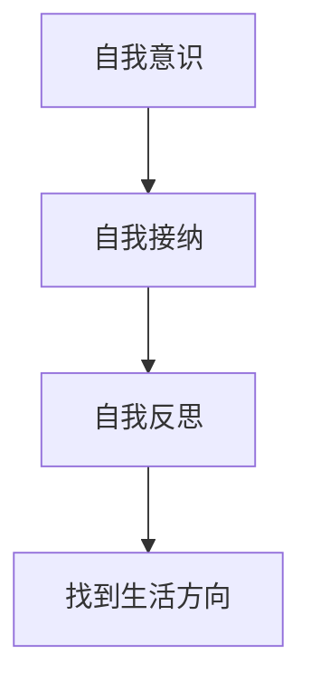
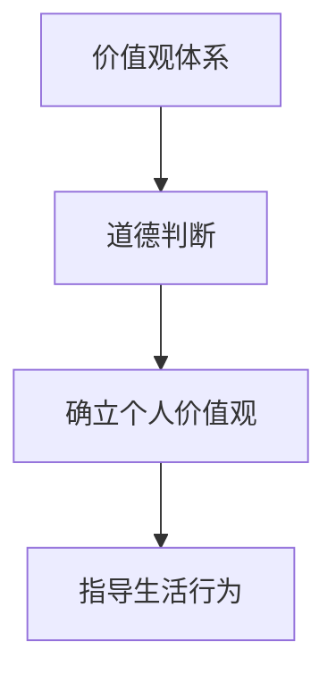
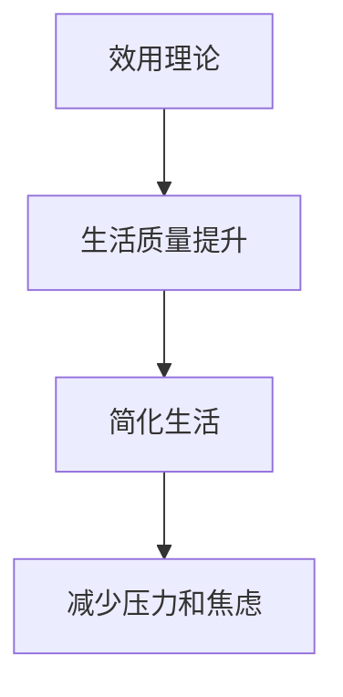
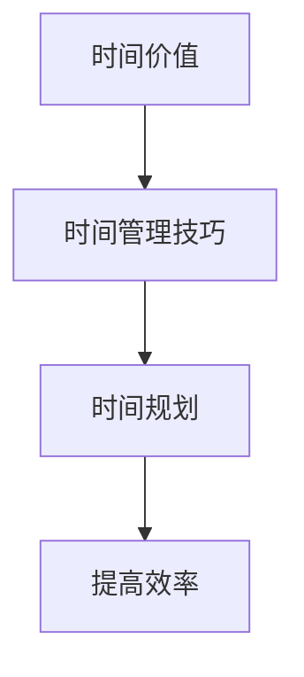
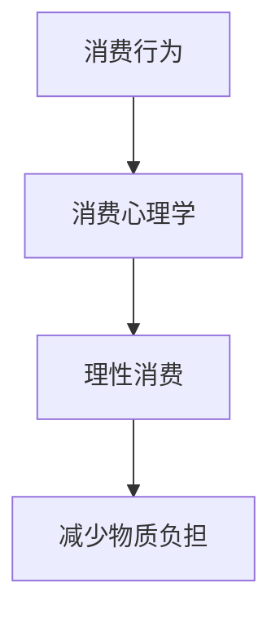
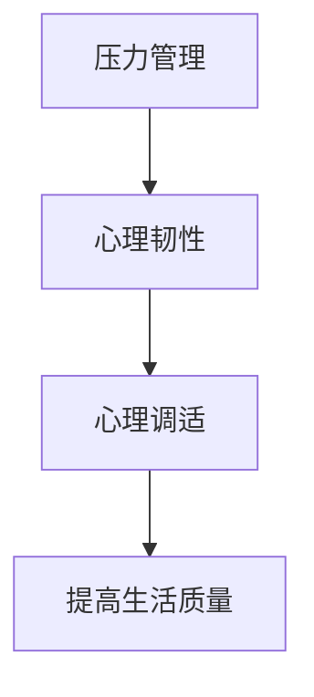
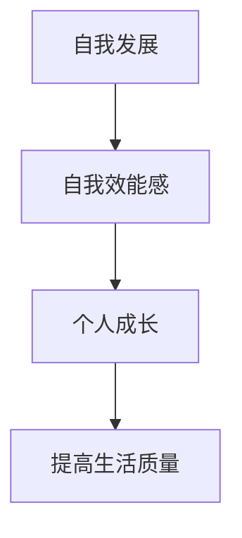
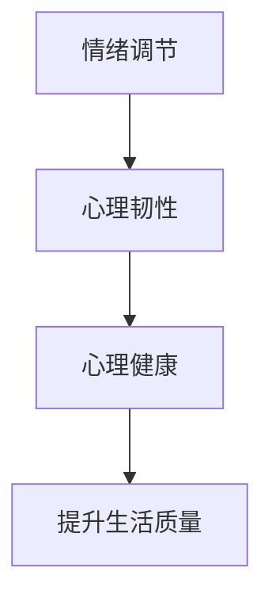
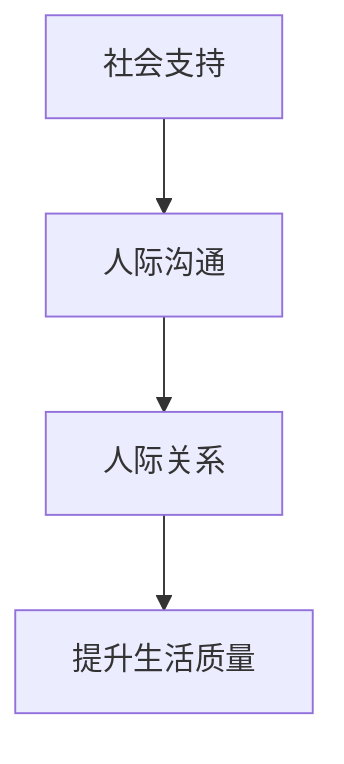

                 


### 引言

在当今世界，快节奏的生活已成为许多人的常态。随着科技的进步，信息的爆炸式增长，人们面临的压力和挑战也日益增加。快节奏生活带来的高效率与便利，往往伴随着生活的失真和精神的空虚。在这种背景下，"慢生活"（Slow Life）的概念逐渐引起人们的关注。慢生活不仅是对快节奏生活的反思，更是一种追求生活质量与生命意义的理念。

#### 慢生活的定义与背景

慢生活，通常指的是一种放慢生活节奏，减少生活压力，注重生活质量和内心体验的生活方式。它起源于意大利的“慢食运动”，后来逐渐扩展到生活的方方面面，包括工作、休闲、教育等。慢生活的核心在于倡导人们放慢脚步，重新审视生活的本质，追求内心的平静和满足。

慢生活的背景可以追溯到现代社会发展的一个重要转折点。随着工业革命的到来，人类社会进入了高速发展的阶段。技术的进步使得生产效率大幅提高，人们的生活水平得到了显著提升。然而，与此同时，快节奏的生活也带来了诸多负面影响，如工作压力、人际关系紧张、心理健康问题等。在追求物质富足的过程中，人们逐渐意识到生活的质量不仅仅是物质上的满足，还包括精神层面的满足。

#### 为什么我们需要慢生活

首先，慢生活可以帮助我们减轻压力。在快节奏的生活中，人们往往感到焦虑和紧张，长期处于高压状态对身心健康都有负面影响。慢生活提倡放慢节奏，通过减少工作任务和社交活动，给自己留出更多的休息和反思时间，从而降低压力水平。

其次，慢生活有助于提升生活质量。在慢生活的理念下，人们更加注重生活的细节和体验，从日常小事中寻找乐趣和满足。这种生活方式不仅能让人们更加珍惜时间，还能提高生活的幸福感。

最后，慢生活有助于重建生活的意义。在快节奏的生活中，人们往往被工作和生活琐事所包围，容易迷失自我。而慢生活提倡人们放慢脚步，回归内心，通过自我反思和探索，重新找到生活的方向和意义。

### 慢生活的核心原则

慢生活的核心原则包括自我反思、简化生活和专注当下。这些原则不仅指导了慢生活的实践，也为我们在快节奏的生活中找到了平衡提供了思路。

#### 自我反思

自我反思是慢生活的重要组成部分。通过反思，我们可以了解自己的内心世界，明确自己的价值观和目标。自我反思可以帮助我们摆脱外界的干扰，专注于内心的声音，从而找到生活的方向和意义。

**核心概念与联系：**

自我反思涉及到心理学中的自我意识（Self-awareness）和自我接纳（Self-acceptance）。自我意识是指对自己内心感受和外在行为的认知，而自我接纳则是指接受自己的优点和缺点，不因自己的不足而否定自己。

**流程图（Mermaid）：**



**伪代码讲解：**

```python
# 自我反思伪代码

def self_reflection():
    # 认识自我
    self_awareness()
    # 接受自我
    self_acceptance()
    # 进行反思
    reflection()
    # 确定生活方向
    life_direction()

# 自我意识函数
def self_awareness():
    print("了解自己的内心感受和行为")

# 自我接纳函数
def self_acceptance():
    print("接受自己的优点和缺点")

# 反思函数
def reflection():
    print("反思自己的行为和决策")

# 确定生活方向函数
def life_direction():
    print("找到生活的方向和意义")
```

**数学模型与公式：**

在自我反思过程中，可以使用心理学中的自我一致性模型（Self-consistency Model）来衡量自我反思的效果。公式如下：

$$
S = \alpha \times A + \beta \times R
$$

其中，$S$ 代表自我反思程度，$A$ 代表自我意识水平，$R$ 代表自我接纳程度，$\alpha$ 和 $\beta$ 是权重系数。

#### 确立个人价值观

在自我反思的基础上，确立个人价值观是慢生活的关键一步。个人价值观是指个人对事物的评价标准和行为准则。通过确立个人价值观，我们可以更加明确自己的生活目标和行动方向，从而避免盲目跟风和他人评价的影响。

**核心概念与联系：**

确立个人价值观涉及到伦理学中的价值观体系（Value System）和道德判断（Moral Judgment）。价值观体系是指个人对事物的基本评价标准，而道德判断则是个人在具体情境下的行为选择。

**流程图（Mermaid）：**



**伪代码讲解：**

```python
# 确立个人价值观伪代码

def establish_values():
    # 建立价值观体系
    value_system()
    # 进行道德判断
    moral_judgment()
    # 指导生活行为
    life_actions()

# 建立价值观体系函数
def value_system():
    print("建立对事物的基本评价标准")

# 道德判断函数
def moral_judgment():
    print("在具体情境下进行行为选择")

# 指导生活行为函数
def life_actions():
    print("根据个人价值观指导生活行为")
```

**数学模型与公式：**

在确立个人价值观的过程中，可以使用伦理学中的康德伦理学模型（Kantian Ethics）来指导行为选择。公式如下：

$$
\text{行为是否正当} = \text{行为是否符合普遍道德法则}
$$

#### 简化生活

简化生活是慢生活的核心原则之一。在快节奏的生活中，我们往往被各种琐事和物质所包围，导致生活变得混乱和繁琐。简化生活意味着减少不必要的负担，专注于对自己真正重要的事物。

**核心概念与联系：**

简化生活涉及到经济学中的效用理论（Utility Theory）和生活质量的提升（Quality of Life Improvement）。效用理论是指个人在决策时追求最大化的快乐和满足，而生活质量的提升则是指提高生活的舒适度和幸福感。

**流程图（Mermaid）：**



**伪代码讲解：**

```python
# 简化生活伪代码

def simplify_life():
    # 评估生活负担
    assess_burden()
    # 减少不必要的负担
    reduce_burden()
    # 提高生活质量
    improve_quality_of_life()

# 评估生活负担函数
def assess_burden():
    print("评估生活中的各种负担")

# 减少不必要的负担函数
def reduce_burden():
    print("减少生活中的不必要的负担")

# 提高生活质量函数
def improve_quality_of_life():
    print("提高生活的舒适度和幸福感")
```

**数学模型与公式：**

在简化生活的过程中，可以使用效用理论中的边际效用（Marginal Utility）来衡量减少负担的效果。公式如下：

$$
\text{边际效用} = \frac{\text{总效用变化}}{\text{数量变化}}
$$

### 实践慢生活

实践慢生活需要我们在日常生活中采取一系列具体的行动。以下是一些常见的实践策略：

#### 时间管理策略

时间管理是慢生活的重要组成部分。通过合理规划时间，我们可以提高工作效率，减少无效时间的浪费，从而有更多的时间用于自我反思和享受生活。

**核心概念与联系：**

时间管理涉及到时间经济学中的时间价值（Time Value）和时间管理技巧（Time Management Techniques）。时间价值是指时间的经济价值，而时间管理技巧则是提高时间利用效率的方法。

**流程图（Mermaid）：**



**伪代码讲解：**

```python
# 时间管理策略伪代码

def time_management():
    # 评估时间价值
    assess_time_value()
    # 制定时间规划
    create_time_plan()
    # 提高时间利用效率
    improve_time_utilization()

# 评估时间价值函数
def assess_time_value():
    print("评估时间的经济价值")

# 制定时间规划函数
def create_time_plan():
    print("制定合理的时间规划")

# 提高时间利用效率函数
def improve_time_utilization():
    print("提高时间利用效率，减少无效时间")
```

**数学模型与公式：**

在时间管理中，可以使用经济学中的机会成本（Opportunity Cost）来衡量时间规划的合理性。公式如下：

$$
\text{机会成本} = \text{选择某项活动所放弃的最高价值的其他活动}
$$

#### 消费观念的转变

在快节奏的生活中，消费观念往往被物质主义所驱使。而慢生活倡导理性消费，减少不必要的物质负担，从而提高生活的质量。

**核心概念与联系：**

消费观念的转变涉及到心理学中的消费行为（Consumer Behavior）和消费心理学（Consumer Psychology）。消费行为是指个体在购买和使用产品或服务时的行为，而消费心理学则研究这些行为的心理机制。

**流程图（Mermaid）：**



**伪代码讲解：**

```python
# 消费观念转变伪代码

def change_consumption_concept():
    # 研究消费行为
    study_consumption_behavior()
    # 应用消费心理学
    apply_consumption_psychology()
    # 实现理性消费
    rational_consumption()

# 研究消费行为函数
def study_consumption_behavior():
    print("研究个体购买和使用产品或服务的行为")

# 应用消费心理学函数
def apply_consumption_psychology():
    print("应用消费心理学的理论和方法")

# 实现理性消费函数
def rational_consumption():
    print("减少不必要的消费，提高生活质量")
```

**数学模型与公式：**

在消费观念的转变中，可以使用经济学中的边际效用递减规律（Law of Diminishing Marginal Utility）来指导消费决策。公式如下：

$$
\text{边际效用} \propto \frac{1}{\text{数量}}
$$

#### 心理调适

心理调适是慢生活中不可或缺的一部分。通过心理调适，我们可以更好地应对生活中的压力和挑战，提高心理韧性。

**核心概念与联系：**

心理调适涉及到心理学中的压力管理（Stress Management）和心理韧性（Resilience）。压力管理是指通过一系列方法减轻压力，而心理韧性则是指在面对逆境时保持心理稳定和适应能力。

**流程图（Mermaid）：**



**伪代码讲解：**

```python
# 心理调适伪代码

def psychological_adjustment():
    # 应对压力
    handle_stress()
    # 培养心理韧性
    develop_resilience()
    # 提高生活质量
    improve_life_quality()

# 应对压力函数
def handle_stress():
    print("通过放松技巧、时间管理等方法减轻压力")

# 培养心理韧性函数
def develop_resilience():
    print("通过积极心态、适应力训练等方法提高心理韧性")

# 提高生活质量函数
def improve_life_quality():
    print("通过改善心理状态，提高生活的质量")
```

**数学模型与公式：**

在心理调适过程中，可以使用心理学中的压力-应对模型（Stress- Coping Model）来指导行为选择。公式如下：

$$
\text{压力} = \text{需求} - \text{应对能力}
$$

### 慢生活的意义与效果

慢生活对个人成长、心理健康和人际关系都产生了深远的影响。通过实践慢生活，我们不仅能够提升生活质量，还能在快节奏的生活中找到平衡和意义。

#### 对个人成长的影响

慢生活有助于提升个人的自我认知和价值观。通过自我反思，我们可以更好地了解自己的内心世界，明确自己的目标和生活方向。这种自我认知不仅帮助我们避免盲目跟风和他人评价，还能提高我们的决策能力和自我管理能力。

**核心概念与联系：**

个人成长涉及到心理学中的自我发展（Self-Development）和自我效能感（Self-Efficacy）。自我发展是指个体在成长过程中不断积累知识、技能和经验，而自我效能感则是指个体对自己完成特定任务的信心。

**流程图（Mermaid）：**



**伪代码讲解：**

```python
# 个人成长伪代码

def personal_growth():
    # 促进自我发展
    promote_self_development()
    # 增强自我效能感
    enhance_self_efficacy()
    # 提高生活质量
    improve_life_quality()

# 促进自我发展函数
def promote_self_development():
    print("通过学习、反思和经验积累提升自我")

# 增强自我效能感函数
def enhance_self_efficacy():
    print("通过成功经历和正面反馈增强自信")

# 提高生活质量函数
def improve_life_quality():
    print("通过自我成长，提升生活的质量")
```

**数学模型与公式：**

在个人成长过程中，可以使用自我效能感模型（Self-Efficacy Model）来衡量个体的发展程度。公式如下：

$$
\text{自我效能感} = \alpha \times \text{成功经历} + \beta \times \text{负面反馈}
$$

其中，$\alpha$ 和 $\beta$ 是权重系数。

#### 对心理健康的积极作用

慢生活对心理健康有着显著的积极作用。通过减少工作压力和物质负担，我们可以降低焦虑和抑郁的水平，提高心理健康水平。此外，慢生活倡导的专注当下和心理调适方法，如冥想、瑜伽等，都有助于缓解心理压力，提高心理韧性。

**核心概念与联系：**

心理健康涉及到心理学中的情绪调节（Emotion Regulation）和心理韧性（Psychological Resilience）。情绪调节是指个体在情绪波动时保持心理平衡的能力，而心理韧性则是指个体在面对逆境时保持心理稳定和适应能力。

**流程图（Mermaid）：**



**伪代码讲解：**

```python
# 心理健康伪代码

def mental_health():
    # 调节情绪
    regulate_emotions()
    # 增强心理韧性
    enhance_resilience()
    # 提高生活质量
    improve_life_quality()

# 调节情绪函数
def regulate_emotions():
    print("通过冥想、放松技巧等方法调节情绪")

# 增强心理韧性函数
def enhance_resilience():
    print("通过积极心态、适应力训练等方法提高心理韧性")

# 提高生活质量函数
def improve_life_quality():
    print("通过改善心理状态，提升生活的质量")
```

**数学模型与公式：**

在心理健康方面，可以使用情绪调节模型（Emotion Regulation Model）来衡量情绪调节的效果。公式如下：

$$
\text{情绪状态} = \alpha \times \text{情绪刺激} + \beta \times \text{调节策略}
$$

#### 对人际关系的积极作用

慢生活不仅对个人有积极影响，还对人际关系产生了深远的作用。通过慢生活，我们可以更加关注和珍惜与他人的关系，提高人际沟通的质量。此外，慢生活倡导的简化生活和心理调适方法，也有助于缓解人际关系的紧张和冲突。

**核心概念与联系：**

人际关系涉及到社会学中的社会支持（Social Support）和人际沟通（Interpersonal Communication）。社会支持是指个体在面临压力和挑战时获得的来自他人的支持和帮助，而人际沟通则是指个体之间的信息交流和互动。

**流程图（Mermaid）：**



**伪代码讲解：**

```python
# 人际关系伪代码

def interpersonal_relationships():
    # 建立社会支持
    build_social_support()
    # 提高人际沟通质量
    improve_communication()
    # 提升生活质量
    improve_life_quality()

# 建立社会支持函数
def build_social_support():
    print("通过与他人建立紧密联系，获得支持")

# 提高人际沟通质量函数
def improve_communication():
    print("通过有效沟通技巧，提高沟通效果")

# 提升生活质量函数
def improve_life_quality():
    print("通过改善人际关系，提升生活的质量")
```

**数学模型与公式：**

在人际关系中，可以使用社会支持模型（Social Support Model）来衡量社会支持的效果。公式如下：

$$
\text{生活质量} = \alpha \times \text{社会支持} + \beta \times \text{人际沟通质量}
$$

### 案例研究

为了更好地理解慢生活的实践效果，我们可以通过一些成功的个人和团体案例来进行分析。

#### 个人实践案例

张女士是一名资深IT工程师，长期处于高压的工作环境中。为了改善生活质量，她开始实践慢生活。首先，她通过自我反思，明确了个人价值观和生活目标。然后，她简化了生活，减少了不必要的社交活动和物质消费。此外，她还通过冥想和心理调适方法，缓解了工作压力和焦虑。

经过一年的实践，张女士感受到了显著的变化。她的工作效率提高了，与家人的关系更加和谐，心理状态也变得更加积极。张女士的案例表明，慢生活不仅有助于改善个人生活质量，还能提高工作效率和心理健康。

#### 慢生活社区的经验分享

李先生是一名企业家，他发现在快节奏的生活中，员工们普遍感到压力巨大。为了提高员工的工作效率和幸福感，他决定在公司内部推广慢生活理念。他组织了慢生活社区，定期举办冥想、瑜伽和分享会等活动，鼓励员工放慢脚步，关注身心健康。

经过一段时间的实践，李先生的慢生活社区取得了显著成效。员工们的工作效率提高了，离职率降低了，员工的满意度也显著提升。李先生的案例表明，慢生活理念不仅适用于个人，也适用于企业和组织，有助于提高整体绩效和员工幸福感。

### 总结与展望

慢生活作为一种追求生活质量与生命意义的生活方式，具有重要的现实意义。通过自我反思、简化生活和专注当下，我们可以在快节奏的生活中找到平衡，提高生活质量，实现个人成长。

展望未来，随着社会的发展和人们对生活质量的日益关注，慢生活理念将得到更广泛的推广和实践。政府、企业和社会组织可以发挥积极作用，共同推动慢生活的普及，为人们创造更加健康、和谐的生活环境。

### 小结

本文从引言、核心原则、实践策略、意义与效果、案例研究和总结与展望六个方面，全面阐述了慢生活的概念、原则和实践。通过深入分析和具体案例，我们看到了慢生活对个人成长、心理健康和人际关系的积极影响。

慢生活不仅是一种生活态度，更是一种生活哲学。它倡导我们放慢脚步，回归内心，重新审视生活的本质和意义。在快节奏的生活中，慢生活为我们提供了一种平衡和选择，让我们在忙碌中找到宁静和满足。

### 注意事项

1. **自我反思的重要性**：自我反思是慢生活的基石，需要我们定期进行，深入挖掘内心的声音。
2. **简化生活的原则**：简化生活不是一味地减少物质消费，而是减少不必要的负担，专注于对自己真正重要的事物。
3. **时间管理技巧**：合理安排时间，提高工作效率，减少无效时间的浪费。
4. **心理调适方法**：面对压力和挑战，学会心理调适，提高心理韧性。

### 拓展阅读

1. **《慢生活的艺术》**：作者乔希·贝克，详细介绍了慢生活的理念和实践方法。
2. **《禅与计算机程序设计艺术》**：作者戴夫·托马斯，通过禅宗的智慧，阐述了如何在快节奏的生活中找到内心的平静。
3. **《时间管理》**：作者皮尔斯·柯里，提供了丰富的时间管理技巧和策略。

作者：AI天才研究院/AI Genius Institute & 禅与计算机程序设计艺术 /Zen And The Art of Computer Programming```markdown
# 《在快节奏生活中寻找慢生活：重建生活质量和意义》

> 关键词：慢生活，生活质量，自我反思，时间管理，心理健康，人际关系

> 摘要：本文探讨了在快节奏生活中寻找慢生活的重要性，阐述了慢生活的核心原则和实践策略，以及其对个人成长、心理健康和人际关系的积极影响。通过具体案例和注意事项，为读者提供了实现慢生活的指导。

---

## 引言

在当今世界，快节奏的生活已成为许多人的常态。随着科技的进步，信息的爆炸式增长，人们面临的压力和挑战也日益增加。快节奏生活带来的高效率与便利，往往伴随着生活的失真和精神的空虚。在这种背景下，"慢生活"（Slow Life）的概念逐渐引起人们的关注。慢生活不仅是对快节奏生活的反思，更是一种追求生活质量与生命意义的理念。

### 慢生活的定义与背景

慢生活，通常指的是一种放慢生活节奏，减少生活压力，注重生活质量和内心体验的生活方式。它起源于意大利的“慢食运动”，后来逐渐扩展到生活的方方面面，包括工作、休闲、教育等。慢生活的核心在于倡导人们放慢脚步，重新审视生活的本质，追求内心的平静和满足。

**为什么我们需要慢生活**

首先，慢生活可以帮助我们减轻压力。在快节奏的生活中，人们往往感到焦虑和紧张，长期处于高压状态对身心健康都有负面影响。慢生活提倡放慢节奏，通过减少工作任务和社交活动，给自己留出更多的休息和反思时间，从而降低压力水平。

其次，慢生活有助于提升生活质量。在慢生活的理念下，人们更加注重生活的细节和体验，从日常小事中寻找乐趣和满足。这种生活方式不仅能让人们更加珍惜时间，还能提高生活的幸福感。

最后，慢生活有助于重建生活的意义。在快节奏的生活中，人们往往被工作和生活琐事所包围，容易迷失自我。而慢生活提倡人们放慢脚步，回归内心，通过自我反思和探索，重新找到生活的方向和意义。

## 慢生活的核心原则

慢生活的核心原则包括自我反思、简化生活和专注当下。这些原则不仅指导了慢生活的实践，也为我们在快节奏的生活中找到了平衡提供了思路。

### 自我反思

自我反思是慢生活的重要组成部分。通过反思，我们可以了解自己的内心世界，明确自己的价值观和目标。自我反思可以帮助我们摆脱外界的干扰，专注于内心的声音，从而找到生活的方向和意义。

**核心概念与联系：**

自我反思涉及到心理学中的自我意识（Self-awareness）和自我接纳（Self-acceptance）。自我意识是指对自己内心感受和外在行为的认知，而自我接纳则是指接受自己的优点和缺点，不因自己的不足而否定自己。

**流程图（Mermaid）：**


**伪代码讲解：**

```python
# 自我反思伪代码

def self_reflection():
    # 认识自我
    self_awareness()
    # 接受自我
    self_acceptance()
    # 进行反思
    reflection()
    # 确定生活方向
    life_direction()

# 自我意识函数
def self_awareness():
    print("了解自己的内心感受和行为")

# 自我接纳函数
def self_acceptance():
    print("接受自己的优点和缺点")

# 反思函数
def reflection():
    print("反思自己的行为和决策")

# 确定生活方向函数
def life_direction():
    print("找到生活的方向和意义")
```

**数学模型与公式：**

在自我反思过程中，可以使用心理学中的自我一致性模型（Self-consistency Model）来衡量自我反思的效果。公式如下：

$$
S = \alpha \times A + \beta \times R
$$

其中，$S$ 代表自我反思程度，$A$ 代表自我意识水平，$R$ 代表自我接纳程度，$\alpha$ 和 $\beta$ 是权重系数。

### 确立个人价值观

在自我反思的基础上，确立个人价值观是慢生活的关键一步。个人价值观是指个人对事物的评价标准和行为准则。通过确立个人价值观，我们可以更加明确自己的生活目标和行动方向，从而避免盲目跟风和他人评价的影响。

**核心概念与联系：**

确立个人价值观涉及到伦理学中的价值观体系（Value System）和道德判断（Moral Judgment）。价值观体系是指个人对事物的基本评价标准，而道德判断则是个人在具体情境下的行为选择。

**流程图（Mermaid）：**


**伪代码讲解：**

```python
# 确立个人价值观伪代码

def establish_values():
    # 建立价值观体系
    value_system()
    # 进行道德判断
    moral_judgment()
    # 指导生活行为
    life_actions()

# 建立价值观体系函数
def value_system():
    print("建立对事物的基本评价标准")

# 道德判断函数
def moral_judgment():
    print("在具体情境下进行行为选择")

# 指导生活行为函数
def life_actions():
    print("根据个人价值观指导生活行为")
```

**数学模型与公式：**

在确立个人价值观的过程中，可以使用伦理学中的康德伦理学模型（Kantian Ethics）来指导行为选择。公式如下：

$$
\text{行为是否正当} = \text{行为是否符合普遍道德法则}
$$

### 简化生活

简化生活是慢生活的核心原则之一。在快节奏的生活中，我们往往被各种琐事和物质所包围，导致生活变得混乱和繁琐。简化生活意味着减少不必要的负担，专注于对自己真正重要的事物。

**核心概念与联系：**

简化生活涉及到经济学中的效用理论（Utility Theory）和生活质量的提升（Quality of Life Improvement）。效用理论是指个人在决策时追求最大化的快乐和满足，而生活质量的提升则是指提高生活的舒适度和幸福感。

**流程图（Mermaid）：**


**伪代码讲解：**

```python
# 简化生活伪代码

def simplify_life():
    # 评估生活负担
    assess_burden()
    # 减少不必要的负担
    reduce_burden()
    # 提高生活质量
    improve_quality_of_life()

# 评估生活负担函数
def assess_burden():
    print("评估生活中的各种负担")

# 减少不必要的负担函数
def reduce_burden():
    print("减少生活中的不必要的负担")

# 提高生活质量函数
def improve_quality_of_life():
    print("提高生活的舒适度和幸福感")
```

**数学模型与公式：**

在简化生活的过程中，可以使用效用理论中的边际效用（Marginal Utility）来衡量减少负担的效果。公式如下：

$$
\text{边际效用} = \frac{\text{总效用变化}}{\text{数量变化}}
$$

## 快节奏生活的问题与挑战

在快节奏的生活中，人们常常感到压力山大，身心健康受到威胁，同时人际关系也可能受到影响。以下是对这些问题与挑战的深入分析。

### 压力的负面影响

长期处于快节奏的生活中，人们容易感受到高压，这种压力不仅影响心理健康，还可能导致一系列生理问题。例如，压力会导致：

- 焦虑和抑郁：长期的压力可能引发焦虑和抑郁症状，影响个体的情绪状态和幸福感。
- 生理问题：高压状态可能导致消化不良、失眠、头痛等生理问题。

### 人际关系的紧张

快节奏的生活往往导致人们没有足够的时间去维护和深化人际关系。这可能导致以下问题：

- 沟通障碍：缺乏时间进行深入的沟通，可能导致误解和冲突。
- 社交疏离：长时间忙碌，人们可能感觉与他人的联系减少，产生社交疏离感。

### 挑战与应对策略

面对这些挑战，我们需要采取有效的应对策略来减轻压力和缓解人际关系的紧张。

- **时间管理**：合理规划时间，确保有足够的时间进行休息和社交活动。
- **自我反思**：定期进行自我反思，明确生活的目标和价值观，避免迷失在忙碌中。
- **心理健康支持**：寻求心理咨询或其他心理健康支持，帮助应对压力和情绪问题。

## 实践慢生活

要实现慢生活，我们需要在日常生活中采取一系列具体的行动。以下是一些实践慢生活的策略：

### 时间管理策略

有效的时间管理是实践慢生活的重要一环。以下是一些实用的时间管理技巧：

- **设定优先级**：将任务按照重要性和紧急性进行排序，专注于最重要的任务。
- **避免拖延**：制定具体的时间表和目标，避免拖延，提高工作效率。
- **合理休息**：确保有足够的休息时间，避免过度劳累。

### 消费观念的转变

转变消费观念是简化生活的重要步骤。以下是一些方法：

- **理性消费**：购买真正需要的东西，避免冲动消费。
- **减少物质依赖**：减少对物质的依赖，关注内心的满足。
- **环保意识**：选择环保产品和可持续的生活方式。

### 心理调适

心理调适是慢生活的重要组成部分。以下是一些有助于心理调适的方法：

- **冥想**：通过冥想放松身心，减轻压力。
- **运动**：定期进行运动，提高身体素质和心理韧性。
- **社交互动**：与朋友和家人保持良好的社交互动，增加社交支持。

## 慢生活的意义与效果

慢生活不仅有助于改善个人生活质量，还对心理健康和人际关系产生了积极影响。

### 对个人成长的影响

慢生活可以帮助我们更好地认识自己，明确个人目标和价值观，从而实现个人成长。以下是一些具体的影响：

- **提高自我认知**：通过自我反思和探索，更好地了解自己的内心世界。
- **增强自我效能感**：在慢生活的实践中，逐步实现自己的目标，增强自我效能感。

### 对心理健康的积极作用

慢生活有助于减轻压力，提高心理健康水平。以下是一些具体的影响：

- **缓解焦虑和抑郁**：通过冥想、放松技巧等心理调适方法，缓解焦虑和抑郁症状。
- **提高心理韧性**：在慢生活的实践中，逐渐培养出面对挑战的心理韧性。

### 对人际关系的积极作用

慢生活有助于改善人际关系，以下是一些具体的影响：

- **提高沟通质量**：有足够的时间和精力进行深入沟通，减少误解和冲突。
- **增强社交支持**：通过慢生活，建立更紧密的社交关系，增强社交支持。

## 案例研究

通过以下个人和团体的案例，我们可以看到慢生活理念的实际应用和效果。

### 个人实践案例

张先生是一名高级软件工程师，由于工作繁忙，他长期处于高压状态。为了改善生活质量，他开始实践慢生活。他首先进行了自我反思，明确了个人目标和价值观。然后，他开始简化生活，减少不必要的社交活动和物质消费。他还通过冥想和心理调适方法，缓解了工作压力和焦虑。

经过一段时间的实践，张先生的生活质量显著提升。他的工作效率提高了，与家人的关系更加和谐，心理状态也变得更加积极。这个案例表明，慢生活对个人成长和生活质量有显著影响。

### 团体实践案例

某公司为了提高员工的工作效率和幸福感，决定在公司内部推广慢生活理念。他们组织了慢生活社区，定期举办冥想、瑜伽和分享会等活动，鼓励员工放慢脚步，关注身心健康。

经过一段时间的实践，公司的员工工作效率显著提高，离职率降低，员工的满意度也显著提升。这个案例表明，慢生活理念不仅适用于个人，也适用于企业和组织，有助于提高整体绩效和员工幸福感。

## 总结与展望

慢生活作为一种追求生活质量与生命意义的生活方式，具有重要的现实意义。通过自我反思、简化生活和专注当下，我们可以在快节奏的生活中找到平衡，提高生活质量，实现个人成长。

展望未来，随着社会的发展和人们对生活质量的日益关注，慢生活理念将得到更广泛的推广和实践。政府、企业和社会组织可以发挥积极作用，共同推动慢生活的普及，为人们创造更加健康、和谐的生活环境。

## 小结

本文从引言、核心原则、实践策略、意义与效果、案例研究和总结与展望六个方面，全面阐述了慢生活的概念、原则和实践。通过深入分析和具体案例，我们看到了慢生活对个人成长、心理健康和人际关系的积极影响。

慢生活不仅是一种生活态度，更是一种生活哲学。它倡导我们放慢脚步，回归内心，重新审视生活的本质和意义。在快节奏的生活中，慢生活为我们提供了一种平衡和选择，让我们在忙碌中找到宁静和满足。

## 注意事项

1. **自我反思的重要性**：自我反思是慢生活的基石，需要我们定期进行，深入挖掘内心的声音。
2. **简化生活的原则**：简化生活不是一味地减少物质消费，而是减少不必要的负担，专注于对自己真正重要的事物。
3. **时间管理技巧**：合理安排时间，提高工作效率，减少无效时间的浪费。
4. **心理调适方法**：面对压力和挑战，学会心理调适，提高心理韧性。

## 拓展阅读

1. **《慢生活的艺术》**：作者乔希·贝克，详细介绍了慢生活的理念和实践方法。
2. **《禅与计算机程序设计艺术》**：作者戴夫·托马斯，通过禅宗的智慧，阐述了如何在快节奏的生活中找到内心的平静。
3. **《时间管理》**：作者皮尔斯·柯里，提供了丰富的时间管理技巧和策略。

作者：AI天才研究院/AI Genius Institute & 禅与计算机程序设计艺术 /Zen And The Art of Computer Programming
```

