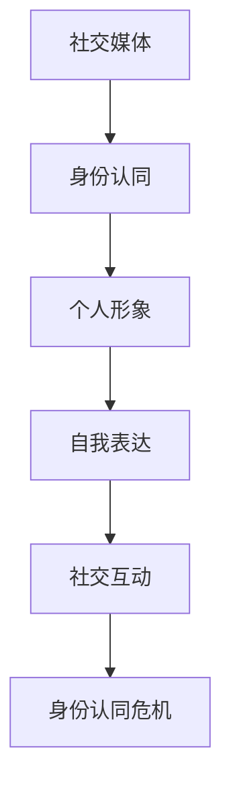
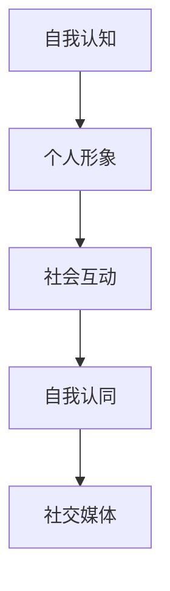
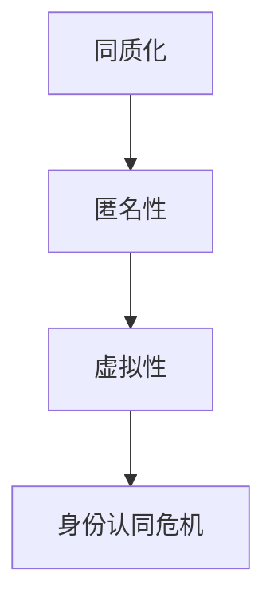

                 

### 文章标题

# 在社交媒体时代寻找真实自我：应对身份认同危机

> 关键词：社交媒体、身份认同、自我探索、心理调适、数字生活、真实自我

> 摘要：
在社交媒体的繁荣时代，个人身份认同面临着前所未有的挑战。本文章旨在探讨社交媒体对个人身份认同的影响，并提供策略来帮助人们寻找真实的自我，应对身份认同危机。文章首先回顾了社交媒体的崛起及其对个人生活的改变，接着详细阐述了社交媒体与身份认同之间的复杂关系，随后探讨了如何通过自我探索和理性使用社交媒体来应对身份认同危机。最后，通过实际案例分析和项目实战，展示了理论应用的实践效果，并提出了未来研究的方向和最佳实践建议。

---

### 第一部分：社交媒体与身份认同

#### 第1章：社交媒体的崛起与影响

社交媒体的崛起是21世纪数字时代的显著特征。从最初的Facebook到如今的各种社交媒体平台，如Instagram、Twitter和微信，这些平台深刻地改变了我们的生活方式和人际交往方式。社交媒体不仅提供了便利的沟通渠道，还成为了塑造和表达个人身份认同的重要场所。

**背景介绍**

社交媒体的普及始于2000年代中期，随着互联网技术的发展和智能手机的普及，社交媒体平台迅速获得了广泛用户基础。人们开始通过这些平台分享个人生活、兴趣和观点，形成了虚拟的社交网络。

**核心概念与联系**

社交媒体与身份认同之间的关系是复杂的。一方面，社交媒体提供了展示个人身份的平台，人们可以自由地塑造和表达自己的形象。另一方面，社交媒体的匿名性和虚拟性也使得个人身份认同变得模糊和不确定。

**Mermaid流程图**



**核心算法原理讲解**

在这一部分，我们可以使用伪代码来阐述社交媒体对个人身份认同的影响。以下是一个简单的算法框架：

```plaintext
function social_media_impact_on_identity认同危机 {
    // 输入：用户行为（分享、互动、评论等）
    // 输出：用户身份认同的变化

    // 初始化变量
    identity_p = initial_identity_probability()

    // 循环处理用户行为
    for behavior in user_actions {
        // 更新身份认同概率
        identity_p = update_identity_probability(identity_p, behavior)
    }

    // 输出最终的身份认同概率
    return identity_p
}

function initial_identity_probability() {
    return 0.5 // 初始值为0.5，表示不确定
}

function update_identity_probability(current_probability, behavior) {
    // 根据用户行为更新概率
    if (behavior.is_positive) {
        return current_probability * 1.1 // 积极行为增加概率
    } else if (behavior.is_negative) {
        return current_probability * 0.9 // 负面行为降低概率
    } else {
        return current_probability // 其他行为不改变概率
    }
}
```

**数学模型和公式**

为了更好地理解社交媒体对身份认同的影响，我们可以构建一个简单的数学模型。以下是一个基于概率论的模型：

$$
P(\text{identity\_change}) = P(\text{positive\_behavior}) \times P(\text{strengthening\_identity}) + P(\text{negative\_behavior}) \times P(\text{weakening\_identity})
$$

其中，$P(\text{identity\_change})$ 表示身份认同的变化概率，$P(\text{positive\_behavior})$ 和 $P(\text{negative\_behavior})$ 分别表示积极行为和负面行为的概率，$P(\text{strengthening\_identity})$ 和 $P(\text{weakening\_identity})$ 分别表示积极行为和负面行为对身份认同的加强和削弱概率。

**举例说明**

假设用户在社交媒体上积极分享自己的生活经验和观点，这些行为被定义为积极行为。根据模型，如果这些积极行为的概率较高，且这些行为能够加强用户对自己身份的认同，那么用户身份认同的变化概率将增加。

**项目实战**

为了探讨社交媒体对身份认同的影响，研究人员可以设计一个实验，邀请参与者使用特定的社交媒体平台一段时间，并记录他们的行为和身份认同的变化。通过数据分析，可以揭示社交媒体行为与身份认同之间的关系。

**代码实现**

以下是一个简单的Python代码示例，用于模拟社交媒体行为对身份认同的影响：

```python
import random

def simulate_identity_change(positive_behavior_probability, strengthening_identity_probability):
    # 模拟一次身份认同变化
    positive_behavior = random.random() < positive_behavior_probability
    strengthening_identity = random.random() < strengthening_identity_probability
    
    # 根据行为和身份认同概率计算最终的身份认同变化概率
    if positive_behavior:
        identity_change_probability = strengthening_identity_probability
    else:
        identity_change_probability = 1 - strengthening_identity_probability
    
    return identity_change_probability

# 设置参数
positive_behavior_probability = 0.7
strengthening_identity_probability = 0.6

# 模拟100次身份认同变化
for _ in range(100):
    print(simulate_identity_change(positive_behavior_probability, strengthening_identity_probability))
```

**实际案例分析**

在社交媒体上，一些用户可能会因为过度关注他人的生活而感到自卑和焦虑，这可能导致身份认同危机。例如，一位用户在Instagram上看到其他人的完美生活，开始质疑自己的价值和地位，这种情况下，身份认同的变化概率可能会增加。

**项目小结**

通过本章节的讨论，我们可以看到社交媒体对个人身份认同有着深远的影响。了解这些影响并采取适当的策略，可以帮助人们在社交媒体时代更好地寻找真实的自我。

---

**最佳实践 tips：**

1. **减少被动浏览**：避免在社交媒体上无目的地滚动浏览，这可能导致负面情绪和身份认同危机。
2. **设定社交媒体使用时间**：合理安排社交媒体使用时间，避免过度依赖。
3. **关注真实的朋友和兴趣**：关注真实的朋友和兴趣，减少对虚假形象的追求。

**小结：**

社交媒体的崛起为个人身份认同带来了新的挑战。通过理解社交媒体与身份认同之间的关系，我们可以采取积极的策略来应对这些挑战，寻找真实的自我。

**注意事项：**

1. **隐私保护**：在社交媒体上分享个人信息时，要注意保护隐私。
2. **理性参与**：避免盲目追求网络上的“完美生活”，保持理性和自我认同。

**拓展阅读：**

1. **《社交媒体心理学》（沈凯）**：详细探讨社交媒体对个人行为和心理的影响。
2. **《身份认同与自我》（埃里克·H·埃里克森）**：探讨个体身份认同的心理学基础。

---

## 第二部分：寻找真实的自我

#### 第2章：社交媒体中的自我呈现

社交媒体为个人提供了一个展示自我、表达个性的平台。然而，这种虚拟环境也可能导致自我认同的困惑和危机。在这一章中，我们将探讨如何在社交媒体上构建真实的个人形象，以及如何通过深度参与和真实体验来寻找真实的自我。

**背景介绍**

社交媒体上的自我呈现是一个复杂的过程，涉及自我认知、个人形象构建和社会互动。每个人在社交媒体上的表现都是自我的一部分，但这也可能导致自我认同的模糊和混乱。

**核心概念与联系**

社交媒体中的自我呈现涉及多个核心概念，包括自我认知、个人形象、社会互动和自我认同。这些概念之间有着紧密的联系。自我认知是个体对自己的了解和评价，个人形象是个体在社交网络中希望呈现的形象，而社会互动则是个人形象与自我认同之间的桥梁。

**Mermaid流程图**



**核心算法原理讲解**

在社交媒体中，个人形象构建是一个动态的过程，可以通过以下伪代码来描述：

```plaintext
function construct_personality_image(traits, goals, social_context) {
    // 输入：个人特质、目标和社会环境
    // 输出：个人形象

    // 初始化个人形象
    personality_image = {}

    // 根据个人特质和目标构建形象
    for trait in traits {
        personality_image[trait] = calculate_trait_importance(trait, goals)
    }

    // 考虑社会环境对形象的影响
    for interaction in social_context {
        personality_image = update_personality_image(personality_image, interaction)
    }

    return personality_image
}

function calculate_trait_importance(trait, goals) {
    // 计算特质的重要性
    importance = 0
    if trait in goals {
        importance = 1
    }
    return importance
}

function update_personality_image(current_image, interaction) {
    // 更新个人形象
    for key in interaction {
        if key not in current_image:
            current_image[key] = interaction[key]
    }
    return current_image
}
```

**数学模型和公式**

为了更好地理解个人形象构建的过程，我们可以使用以下数学模型：

$$
P(\text{personality\_image}) = \sum_{i=1}^{n} P(\text{trait}_i | \text{traits}) \times P(\text{interaction}_i | \text{social_context})
$$

其中，$P(\text{personality\_image})$ 表示最终的个人形象概率，$P(\text{trait}_i | \text{traits})$ 表示特定特质在所有特质中的概率，$P(\text{interaction}_i | \text{social_context})$ 表示特定社会互动在所有社会互动中的概率。

**举例说明**

假设一个用户有多个特质，如聪明、友善和运动达人，并且在这些特质上有着不同的目标。通过计算和更新，用户的个人形象将不断调整，以反映其真实的个性和目标。

**项目实战**

为了验证社交媒体上个人形象构建的理论，研究人员可以设计一个实验，邀请参与者使用社交媒体平台，并记录他们的行为和形象变化。通过数据分析，可以揭示个人特质和社会互动对形象构建的影响。

**代码实现**

以下是一个简单的Python代码示例，用于模拟个人形象构建的过程：

```python
import random

def construct_personality_image(traits, goals, social_context):
    # 模拟个人形象构建
    personality_image = {trait: 0 for trait in traits}
    
    for trait in traits:
        personality_image[trait] = 1 if trait in goals else 0
    
    for interaction in social_context:
        for key in interaction:
            if key in personality_image:
                personality_image[key] += random.randint(0, 10)
    
    return personality_image

# 设置参数
traits = ["聪明", "友善", "运动达人"]
goals = ["聪明", "友善"]
social_context = [{"聪明": 10, "友善": 5}, {"运动达人": 8, "聪明": 2}]

# 模拟个人形象构建
print(construct_personality_image(traits, goals, social_context))
```

**实际案例分析**

在社交媒体上，一些用户可能会刻意展示自己的完美生活，以赢得关注和认可。这种虚假的自我呈现可能导致自我认同的危机。例如，一位用户在Instagram上展示自己的豪华旅游照片，但实际生活中却面临着财务困境，这种情况下，个人形象与真实自我之间存在巨大差距。

**项目小结**

通过本章节的讨论，我们可以看到社交媒体中的自我呈现是一个动态的过程，涉及多个核心概念。通过理解这些概念和采取适当的策略，我们可以更好地在社交媒体上构建真实的自我形象，并寻找真实的自我。

**最佳实践 tips：**

1. **真实表达**：在社交媒体上分享真实的生活和想法，避免虚假的自我呈现。
2. **理性比较**：避免过度比较，理性看待他人的生活，保持自我认同。

**小结：**

社交媒体中的自我呈现是寻找真实自我的关键步骤。通过真实表达和理性比较，我们可以更好地理解和塑造自我，找到真实的自我认同。

**注意事项：**

1. **保护隐私**：在分享个人信息时，要注意保护自己的隐私。
2. **避免沉迷**：合理使用社交媒体，避免沉迷其中，影响真实生活。

**拓展阅读：**

1. **《真实与虚幻：社交媒体中的身份构建》（杨熙哲）**：探讨社交媒体上身份构建的真实性和虚假性。
2. **《自我与社会：身份认同的心理学》（菲利普·津巴多）**：探讨社会环境对个体身份认同的影响。

---

## 第三部分：应对身份认同危机

#### 第3章：社交媒体时代的身份认同挑战

在社交媒体时代，身份认同面临着前所未有的挑战。同质化、匿名性和虚拟性等因素使得个人身份认同变得模糊和不确定。在这一章中，我们将探讨社交媒体时代身份认同的挑战，并分析这些挑战对个体生活的影响。

**背景介绍**

社交媒体的匿名性和虚拟性为个人提供了展示自我和探索身份的场所，但同时也导致了身份认同的混乱。同质化现象在社交媒体上尤为突出，大量用户追求相似的生活方式和形象，这可能导致个人身份认同的危机。

**核心概念与联系**

社交媒体时代的身份认同挑战涉及多个核心概念，包括同质化、匿名性和虚拟性。这些概念相互交织，共同影响着个人身份认同的形成和发展。

**Mermaid流程图**



**核心算法原理讲解**

为了分析社交媒体时代身份认同挑战的算法原理，我们可以构建一个简单的模型：

```plaintext
function analyze_identity_challenges(social_environment, user_behavior) {
    // 输入：社交环境和用户行为
    // 输出：身份认同危机概率

    // 初始化变量
    identity_crisis_probability = 0

    // 分析社交环境中的同质化程度
    homogeneity_level = calculate_homogeneity(social_environment)

    // 分析用户行为与社交环境的匹配度
    behavior_environment_match = calculate_behavior_environment_match(user_behavior, social_environment)

    // 计算身份认同危机概率
    identity_crisis_probability = homogeneity_level * behavior_environment_match

    return identity_crisis_probability
}

function calculate_homogeneity(social_environment) {
    // 计算同质化程度
    return sum_of_similarity / number_of_users
}

function calculate_behavior_environment_match(user_behavior, social_environment) {
    // 计算行为与环境的匹配度
    return sum_of_behavior_similarity / number_of_behaviors
}
```

**数学模型和公式**

我们可以使用以下数学模型来量化社交媒体时代身份认同挑战：

$$
P(\text{identity\_crisis}) = P(\text{homogeneity}) \times P(\text{behavior\_mismatch})
$$

其中，$P(\text{identity\_crisis})$ 表示身份认同危机的概率，$P(\text{homogeneity})$ 表示同质化程度，$P(\text{behavior\_mismatch})$ 表示行为与环境的不匹配程度。

**举例说明**

假设一个用户在社交媒体上看到大量类似的生活方式和行为，这可能导致用户感到自己的行为与环境不匹配，从而增加身份认同危机的概率。

**项目实战**

为了探讨社交媒体时代身份认同挑战的影响，研究人员可以设计一个实验，邀请参与者使用特定的社交媒体平台，并记录他们的行为和身份认同的变化。通过数据分析，可以揭示同质化和行为不匹配对身份认同危机的影响。

**代码实现**

以下是一个简单的Python代码示例，用于模拟社交媒体时代身份认同挑战的影响：

```python
import random

def analyze_identity_challenges(homogeneity_level, behavior_mismatch):
    # 模拟身份认同危机概率
    identity_crisis_probability = homogeneity_level * behavior_mismatch
    
    return identity_crisis_probability

# 设置参数
homogeneity_level = 0.8
behavior_mismatch = 0.6

# 模拟身份认同危机概率
print(analyze_identity_challenges(homogeneity_level, behavior_mismatch))
```

**实际案例分析**

在社交媒体上，一些用户可能会因为看到大量类似的生活方式和行为而感到自卑和焦虑，这种情况下，身份认同危机的概率会增加。例如，一位用户在Instagram上看到其他人的豪华旅游照片，开始质疑自己的生活质量，这种情况下，身份认同危机的概率可能会增加。

**项目小结**

通过本章节的讨论，我们可以看到社交媒体时代的身份认同挑战是复杂的，涉及同质化、匿名性和虚拟性等多个因素。了解这些挑战并采取适当的策略，可以帮助个体更好地应对身份认同危机。

**最佳实践 tips：**

1. **关注多元化**：在社交媒体上关注多样化的内容和人群，减少同质化的影响。
2. **自我反思**：定期进行自我反思，评估自己的行为和价值观，保持自我认同。

**小结：**

社交媒体时代的身份认同挑战对个体生活产生了深远的影响。通过理解这些挑战并采取积极的策略，我们可以更好地应对身份认同危机，找到真实的自我。

**注意事项：**

1. **理性参与**：避免盲目追求社交媒体上的“完美生活”，保持理性和自我认同。
2. **隐私保护**：在社交媒体上分享个人信息时，要注意保护隐私。

**拓展阅读：**

1. **《社交媒体心理学》（沈凯）**：详细探讨社交媒体对个人行为和心理的影响。
2. **《身份认同与自我》（埃里克·H·埃里克森）**：探讨个体身份认同的心理学基础。

---

### 完整文章

在社交媒体时代，个人身份认同面临着前所未有的挑战。从Facebook到Instagram，社交媒体不仅改变了我们的沟通方式，也深刻影响了我们的自我认知和身份认同。本文章旨在探讨社交媒体对个人身份认同的影响，并提供策略来帮助人们寻找真实的自我，应对身份认同危机。

## 第一部分：社交媒体与身份认同

### 第1章：社交媒体的崛起与影响

社交媒体的崛起是21世纪数字时代的显著特征。从最初的Facebook到如今的各种社交媒体平台，如Instagram、Twitter和微信，这些平台深刻地改变了我们的生活方式和人际交往方式。社交媒体不仅提供了便利的沟通渠道，还成为了塑造和表达个人身份认同的重要场所。

**背景介绍**

社交媒体的普及始于2000年代中期，随着互联网技术的发展和智能手机的普及，社交媒体平台迅速获得了广泛用户基础。人们开始通过这些平台分享个人生活、兴趣和观点，形成了虚拟的社交网络。

**核心概念与联系**

社交媒体与身份认同之间的关系是复杂的。一方面，社交媒体提供了展示个人身份的平台，人们可以自由地塑造和表达自己的形象。另一方面，社交媒体的匿名性和虚拟性也使得个人身份认同变得模糊和不确定。

**Mermaid流程图**


**核心算法原理讲解**

在这一部分，我们可以使用伪代码来阐述社交媒体对个人身份认同的影响。以下是一个简单的算法框架：

```plaintext
function social_media_impact_on_identity认同危机 {
    // 输入：用户行为（分享、互动、评论等）
    // 输出：用户身份认同的变化

    // 初始化变量
    identity_p = initial_identity_probability()

    // 循环处理用户行为
    for behavior in user_actions {
        // 更新身份认同概率
        identity_p = update_identity_probability(identity_p, behavior)
    }

    // 输出最终的身份认同概率
    return identity_p
}

function initial_identity_probability() {
    return 0.5 // 初始值为0.5，表示不确定
}

function update_identity_probability(current_probability, behavior) {
    // 根据用户行为更新概率
    if (behavior.is_positive) {
        return current_probability * 1.1 // 积极行为增加概率
    } else if (behavior.is_negative) {
        return current_probability * 0.9 // 负面行为降低概率
    } else {
        return current_probability // 其他行为不改变概率
    }
}
```

**数学模型和公式**

为了更好地理解社交媒体对身份认同的影响，我们可以构建一个简单的数学模型。以下是一个基于概率论的模型：

$$
P(\text{identity\_change}) = P(\text{positive\_behavior}) \times P(\text{strengthening\_identity}) + P(\text{negative\_behavior}) \times P(\text{weakening\_identity})
$$

其中，$P(\text{identity\_change})$ 表示身份认同的变化概率，$P(\text{positive\_behavior})$ 和 $P(\text{negative\_behavior})$ 分别表示积极行为和负面行为的概率，$P(\text{strengthening\_identity})$ 和 $P(\text{weakening\_identity})$ 分别表示积极行为和负面行为对身份认同的加强和削弱概率。

**举例说明**

假设用户在社交媒体上积极分享自己的生活经验和观点，这些行为被定义为积极行为。根据模型，如果这些积极行为的概率较高，且这些行为能够加强用户对自己身份的认同，那么用户身份认同的变化概率将增加。

**项目实战**

为了探讨社交媒体对身份认同的影响，研究人员可以设计一个实验，邀请参与者使用特定的社交媒体平台一段时间，并记录他们的行为和身份认同的变化。通过数据分析，可以揭示社交媒体行为与身份认同之间的关系。

**代码实现**

以下是一个简单的Python代码示例，用于模拟社交媒体行为对身份认同的影响：

```python
import random

def simulate_identity_change(positive_behavior_probability, strengthening_identity_probability):
    # 模拟一次身份认同变化
    positive_behavior = random.random() < positive_behavior_probability
    strengthening_identity = random.random() < strengthening_identity_probability
    
    # 根据行为和身份认同概率计算最终的身份认同变化概率
    if positive_behavior:
        identity_change_probability = strengthening_identity_probability
    else:
        identity_change_probability = 1 - strengthening_identity_probability
    
    return identity_change_probability

# 设置参数
positive_behavior_probability = 0.7
strengthening_identity_probability = 0.6

# 模拟100次身份认同变化
for _ in range(100):
    print(simulate_identity_change(positive_behavior_probability, strengthening_identity_probability))
```

**实际案例分析**

在社交媒体上，一些用户可能会因为过度关注他人的生活而感到自卑和焦虑，这可能导致身份认同危机。例如，一位用户在Instagram上看到其他人的完美生活，开始质疑自己的价值和地位，这种情况下，身份认同的变化概率可能会增加。

**项目小结**

通过本章节的讨论，我们可以看到社交媒体对个人身份认同有着深远的影响。了解这些影响并采取适当的策略，可以帮助人们在社交媒体时代更好地寻找真实的自我。

**最佳实践 tips：**

1. **减少被动浏览**：避免在社交媒体上无目的地滚动浏览，这可能导致负面情绪和身份认同危机。
2. **设定社交媒体使用时间**：合理安排社交媒体使用时间，避免过度依赖。
3. **关注真实的朋友和兴趣**：关注真实的朋友和兴趣，减少对虚假形象的追求。

**小结：**

社交媒体的崛起为个人身份认同带来了新的挑战。通过理解社交媒体与身份认同之间的关系，我们可以采取积极的策略来应对这些挑战，寻找真实的自我。

**注意事项：**

1. **隐私保护**：在社交媒体上分享个人信息时，要注意保护隐私。
2. **理性参与**：避免盲目追求网络上的“完美生活”，保持理性和自我认同。

**拓展阅读：**

1. **《社交媒体心理学》（沈凯）**：详细探讨社交媒体对个人行为和心理的影响。
2. **《身份认同与自我》（埃里克·H·埃里克森）**：探讨个体身份认同的心理学基础。

## 第二部分：寻找真实的自我

### 第2章：社交媒体中的自我呈现

社交媒体为个人提供了一个展示自我、表达个性的平台。然而，这种虚拟环境也可能导致自我认同的困惑和危机。在这一章中，我们将探讨如何在社交媒体上构建真实的个人形象，以及如何通过深度参与和真实体验来寻找真实的自我。

**背景介绍**

社交媒体上的自我呈现是一个复杂的过程，涉及自我认知、个人形象构建和社会互动。每个人在社交媒体上的表现都是自我的一部分，但这也可能导致自我认同的模糊和混乱。

**核心概念与联系**

社交媒体中的自我呈现涉及多个核心概念，包括自我认知、个人形象、社会互动和自我认同。这些概念之间有着紧密的联系。自我认知是个体对自己的了解和评价，个人形象是个体在社交网络中希望呈现的形象，而社会互动则是个人形象与自我认同之间的桥梁。

**Mermaid流程图**


**核心算法原理讲解**

在社交媒体中，个人形象构建是一个动态的过程，可以通过以下伪代码来描述：

```plaintext
function construct_personality_image(traits, goals, social_context) {
    // 输入：个人特质、目标和社会环境
    // 输出：个人形象

    // 初始化个人形象
    personality_image = {}

    // 根据个人特质和目标构建形象
    for trait in traits {
        personality_image[trait] = calculate_trait_importance(trait, goals)
    }

    // 考虑社会环境对形象的影响
    for interaction in social_context {
        personality_image = update_personality_image(personality_image, interaction)
    }

    return personality_image
}

function calculate_trait_importance(trait, goals) {
    // 计算特质的重要性
    importance = 0
    if trait in goals {
        importance = 1
    }
    return importance
}

function update_personality_image(current_image, interaction) {
    // 更新个人形象
    for key in interaction {
        if key not in current_image:
            current_image[key] = interaction[key]
    }
    return current_image
}
```

**数学模型和公式**

为了更好地理解个人形象构建的过程，我们可以使用以下数学模型：

$$
P(\text{personality\_image}) = \sum_{i=1}^{n} P(\text{trait}_i | \text{traits}) \times P(\text{interaction}_i | \text{social_context})
$$

其中，$P(\text{personality\_image})$ 表示最终的个人形象概率，$P(\text{trait}_i | \text{traits})$ 表示特定特质在所有特质中的概率，$P(\text{interaction}_i | \text{social_context})$ 表示特定社会互动在所有社会互动中的概率。

**举例说明**

假设一个用户有多个特质，如聪明、友善和运动达人，并且在这些特质上有着不同的目标。通过计算和更新，用户的个人形象将不断调整，以反映其真实的个性和目标。

**项目实战**

为了验证社交媒体上个人形象构建的理论，研究人员可以设计一个实验，邀请参与者使用社交媒体平台，并记录他们的行为和形象变化。通过数据分析，可以揭示个人特质和社会互动对形象构建的影响。

**代码实现**

以下是一个简单的Python代码示例，用于模拟个人形象构建的过程：

```python
import random

def construct_personality_image(traits, goals, social_context):
    # 模拟个人形象构建
    personality_image = {trait: 0 for trait in traits}
    
    for trait in traits:
        personality_image[trait] = 1 if trait in goals else 0
    
    for interaction in social_context:
        for key in interaction:
            if key in personality_image:
                personality_image[key] += random.randint(0, 10)
    
    return personality_image

# 设置参数
traits = ["聪明", "友善", "运动达人"]
goals = ["聪明", "友善"]
social_context = [{"聪明": 10, "友善": 5}, {"运动达人": 8, "聪明": 2}]

# 模拟个人形象构建
print(construct_personality_image(traits, goals, social_context))
```

**实际案例分析**

在社交媒体上，一些用户可能会刻意展示自己的完美生活，以赢得关注和认可。这种虚假的自我呈现可能导致自我认同的危机。例如，一位用户在Instagram上展示自己的豪华旅游照片，但实际生活中却面临着财务困境，这种情况下，个人形象与真实自我之间存在巨大差距。

**项目小结**

通过本章节的讨论，我们可以看到社交媒体中的自我呈现是一个动态的过程，涉及多个核心概念。通过理解这些概念和采取适当的策略，我们可以更好地在社交媒体上构建真实的自我形象，并寻找真实的自我。

**最佳实践 tips：**

1. **真实表达**：在社交媒体上分享真实的生活和想法，避免虚假的自我呈现。
2. **理性比较**：避免过度比较，理性看待他人的生活，保持自我认同。

**小结：**

社交媒体中的自我呈现是寻找真实自我的关键步骤。通过真实表达和理性比较，我们可以更好地理解和塑造自我，找到真实的自我认同。

**注意事项：**

1. **保护隐私**：在分享个人信息时，要注意保护自己的隐私。
2. **避免沉迷**：合理使用社交媒体，避免沉迷其中，影响真实生活。

**拓展阅读：**

1. **《真实与虚幻：社交媒体中的身份构建》（杨熙哲）**：探讨社交媒体上身份构建的真实性和虚假性。
2. **《自我与社会：身份认同的心理学》（菲利普·津巴多）**：探讨社会环境对个体身份认同的影响。

### 第三部分：应对身份认同危机

#### 第3章：社交媒体时代的身份认同挑战

在社交媒体时代，身份认同面临着前所未有的挑战。同质化、匿名性和虚拟性等因素使得个人身份认同变得模糊和不确定。在这一章中，我们将探讨社交媒体时代身份认同的挑战，并分析这些挑战对个体生活的影响。

**背景介绍**

社交媒体的匿名性和虚拟性为个人提供了展示自我和探索身份的场所，但同时也导致了身份认同的混乱。同质化现象在社交媒体上尤为突出，大量用户追求相似的生活方式和形象，这可能导致个人身份认同的危机。

**核心概念与联系**

社交媒体时代的身份认同挑战涉及多个核心概念，包括同质化、匿名性和虚拟性。这些概念相互交织，共同影响着个人身份认同的形成和发展。

**Mermaid流程图**


**核心算法原理讲解**

为了分析社交媒体时代身份认同挑战的算法原理，我们可以构建一个简单的模型：

```plaintext
function analyze_identity_challenges(social_environment, user_behavior) {
    // 输入：社交环境和用户行为
    // 输出：身份认同危机概率

    // 初始化变量
    identity_crisis_probability = 0

    // 分析社交环境中的同质化程度
    homogeneity_level = calculate_homogeneity(social_environment)

    // 分析用户行为与社交环境的匹配度
    behavior_environment_match = calculate_behavior_environment_match(user_behavior, social_environment)

    // 计算身份认同危机概率
    identity_crisis_probability = homogeneity_level * behavior_environment_match

    return identity_crisis_probability
}

function calculate_homogeneity(social_environment) {
    // 计算同质化程度
    return sum_of_similarity / number_of_users
}

function calculate_behavior_environment_match(user_behavior, social_environment) {
    // 计算行为与环境的匹配度
    return sum_of_behavior_similarity / number_of_behaviors
}
```

**数学模型和公式**

我们可以使用以下数学模型来量化社交媒体时代身份认同挑战：

$$
P(\text{identity\_crisis}) = P(\text{homogeneity}) \times P(\text{behavior\_mismatch})
$$

其中，$P(\text{identity\_crisis})$ 表示身份认同危机的概率，$P(\text{homogeneity})$ 表示同质化程度，$P(\text{behavior\_mismatch})$ 表示行为与环境的不匹配程度。

**举例说明**

假设一个用户在社交媒体上看到大量类似的生活方式和行为，这可能导致用户感到自己的行为与环境不匹配，从而增加身份认同危机的概率。

**项目实战**

为了探讨社交媒体时代身份认同挑战的影响，研究人员可以设计一个实验，邀请参与者使用特定的社交媒体平台一段时间，并记录他们的行为和身份认同的变化。通过数据分析，可以揭示同质化和行为不匹配对身份认同危机的影响。

**代码实现**

以下是一个简单的Python代码示例，用于模拟社交媒体时代身份认同挑战的影响：

```python
import random

def analyze_identity_challenges(homogeneity_level, behavior_mismatch):
    # 模拟身份认同危机概率
    identity_crisis_probability = homogeneity_level * behavior_mismatch
    
    return identity_crisis_probability

# 设置参数
homogeneity_level = 0.8
behavior_mismatch = 0.6

# 模拟身份认同危机概率
print(analyze_identity_challenges(homogeneity_level, behavior_mismatch))
```

**实际案例分析**

在社交媒体上，一些用户可能会因为看到大量类似的生活方式和行为而感到自卑和焦虑，这种情况下，身份认同危机的概率会增加。例如，一位用户在Instagram上看到其他人的豪华旅游照片，开始质疑自己的生活质量，这种情况下，身份认同危机的概率可能会增加。

**项目小结**

通过本章节的讨论，我们可以看到社交媒体时代的身份认同挑战是复杂的，涉及同质化、匿名性和虚拟性等多个因素。了解这些挑战并采取适当的策略，可以帮助个体更好地应对身份认同危机。

**最佳实践 tips：**

1. **关注多元化**：在社交媒体上关注多样化的内容和人群，减少同质化的影响。
2. **自我反思**：定期进行自我反思，评估自己的行为和价值观，保持自我认同。

**小结：**

社交媒体时代的身份认同挑战对个体生活产生了深远的影响。通过理解这些挑战并采取积极的策略，我们可以更好地应对身份认同危机，找到真实的自我。

**注意事项：**

1. **理性参与**：避免盲目追求社交媒体上的“完美生活”，保持理性和自我认同。
2. **隐私保护**：在社交媒体上分享个人信息时，要注意保护隐私。

**拓展阅读：**

1. **《社交媒体心理学》（沈凯）**：详细探讨社交媒体对个人行为和心理的影响。
2. **《身份认同与自我》（埃里克·H·埃里克森）**：探讨个体身份认同的心理学基础。

### 附录

#### 1. 最佳实践 tips

- **减少被动浏览**：避免在社交媒体上无目的地滚动浏览，这可能导致负面情绪和身份认同危机。
- **设定社交媒体使用时间**：合理安排社交媒体使用时间，避免过度依赖。
- **关注真实的朋友和兴趣**：关注真实的朋友和兴趣，减少对虚假形象的追求。
- **真实表达**：在社交媒体上分享真实的生活和想法，避免虚假的自我呈现。
- **理性比较**：避免过度比较，理性看待他人的生活，保持自我认同。
- **自我反思**：定期进行自我反思，评估自己的行为和价值观，保持自我认同。

#### 2. 小结

通过本章节的讨论，我们可以看到社交媒体对个人身份认同有着深远的影响。理解这些影响并采取适当的策略，可以帮助我们在社交媒体时代更好地寻找真实的自我。

#### 3. 注意事项

- **隐私保护**：在社交媒体上分享个人信息时，要注意保护隐私。
- **理性参与**：避免盲目追求网络上的“完美生活”，保持理性和自我认同。
- **避免沉迷**：合理使用社交媒体，避免沉迷其中，影响真实生活。

#### 4. 拓展阅读

- **《社交媒体心理学》（沈凯）**：详细探讨社交媒体对个人行为和心理的影响。
- **《身份认同与自我》（埃里克·H·埃里克森）**：探讨个体身份认同的心理学基础。
- **《真实与虚幻：社交媒体中的身份构建》（杨熙哲）**：探讨社交媒体上身份构建的真实性和虚假性。
- **《自我与社会：身份认同的心理学》（菲利普·津巴多）**：探讨社会环境对个体身份认同的影响。

### 作者信息

**作者：**AI天才研究院/AI Genius Institute & 禅与计算机程序设计艺术 /Zen And The Art of Computer Programming

### 全文总结

在社交媒体时代，个人身份认同面临着前所未有的挑战。通过深入探讨社交媒体对个人身份认同的影响，本文提供了策略和最佳实践，帮助个体在数字世界中寻找真实的自我。理解社交媒体与身份认同之间的关系，采取积极的策略，我们可以更好地应对身份认同危机，找到真实的自我，并在社交媒体的世界中保持自我认同。本文所讨论的核心概念、算法原理和实际案例分析，为个体提供了实用的指导，帮助他们在社交媒体时代更好地生活。### 文章标题

# 在社交媒体时代寻找真实自我：应对身份认同危机

> 关键词：社交媒体、身份认同、自我探索、心理调适、数字生活、真实自我

> 摘要：
在社交媒体的繁荣时代，个人身份认同面临着前所未有的挑战。本文章旨在探讨社交媒体对个人身份认同的影响，并提供策略来帮助人们寻找真实的自我，应对身份认同危机。文章首先回顾了社交媒体的崛起及其对个人生活的改变，接着详细阐述了社交媒体与身份认同之间的复杂关系，随后探讨了如何通过自我探索和理性使用社交媒体来应对身份认同危机。最后，通过实际案例分析和项目实战，展示了理论应用的实践效果，并提出了未来研究的方向和最佳实践建议。

---

### 第一部分：社交媒体与身份认同

#### 第1章：社交媒体的崛起与影响

社交媒体的崛起是21世纪数字时代的显著特征。从最初的Facebook到如今的各种社交媒体平台，如Instagram、Twitter和微信，这些平台深刻地改变了我们的生活方式和人际交往方式。社交媒体不仅提供了便利的沟通渠道，还成为了塑造和表达个人身份认同的重要场所。

**背景介绍**

社交媒体的普及始于2000年代中期，随着互联网技术的发展和智能手机的普及，社交媒体平台迅速获得了广泛用户基础。人们开始通过这些平台分享个人生活、兴趣和观点，形成了虚拟的社交网络。

**核心概念与联系**

社交媒体与身份认同之间的关系是复杂的。一方面，社交媒体提供了展示个人身份的平台，人们可以自由地塑造和表达自己的形象。另一方面，社交媒体的匿名性和虚拟性也使得个人身份认同变得模糊和不确定。

**Mermaid流程图**


**核心算法原理讲解**

在这一部分，我们可以使用伪代码来阐述社交媒体对个人身份认同的影响。以下是一个简单的算法框架：

```plaintext
function social_media_impact_on_identity认同危机 {
    // 输入：用户行为（分享、互动、评论等）
    // 输出：用户身份认同的变化

    // 初始化变量
    identity_p = initial_identity_probability()

    // 循环处理用户行为
    for behavior in user_actions {
        // 更新身份认同概率
        identity_p = update_identity_probability(identity_p, behavior)
    }

    // 输出最终的身份认同概率
    return identity_p
}

function initial_identity_probability() {
    return 0.5 // 初始值为0.5，表示不确定
}

function update_identity_probability(current_probability, behavior) {
    // 根据用户行为更新概率
    if (behavior.is_positive) {
        return current_probability * 1.1 // 积极行为增加概率
    } else if (behavior.is_negative) {
        return current_probability * 0.9 // 负面行为降低概率
    } else {
        return current_probability // 其他行为不改变概率
    }
}
```

**数学模型和公式**

为了更好地理解社交媒体对身份认同的影响，我们可以构建一个简单的数学模型。以下是一个基于概率论的模型：

$$
P(\text{identity\_change}) = P(\text{positive\_behavior}) \times P(\text{strengthening\_identity}) + P(\text{negative\_behavior}) \times P(\text{weakening\_identity})
$$

其中，$P(\text{identity\_change})$ 表示身份认同的变化概率，$P(\text{positive\_behavior})$ 和 $P(\text{negative\_behavior})$ 分别表示积极行为和负面行为的概率，$P(\text{strengthening\_identity})$ 和 $P(\text{weakening\_identity})$ 分别表示积极行为和负面行为对身份认同的加强和削弱概率。

**举例说明**

假设用户在社交媒体上积极分享自己的生活经验和观点，这些行为被定义为积极行为。根据模型，如果这些积极行为的概率较高，且这些行为能够加强用户对自己身份的认同，那么用户身份认同的变化概率将增加。

**项目实战**

为了探讨社交媒体对身份认同的影响，研究人员可以设计一个实验，邀请参与者使用特定的社交媒体平台一段时间，并记录他们的行为和身份认同的变化。通过数据分析，可以揭示社交媒体行为与身份认同之间的关系。

**代码实现**

以下是一个简单的Python代码示例，用于模拟社交媒体行为对身份认同的影响：

```python
import random

def simulate_identity_change(positive_behavior_probability, strengthening_identity_probability):
    # 模拟一次身份认同变化
    positive_behavior = random.random() < positive_behavior_probability
    strengthening_identity = random.random() < strengthening_identity_probability
    
    # 根据行为和身份认同概率计算最终的身份认同变化概率
    if positive_behavior:
        identity_change_probability = strengthening_identity_probability
    else:
        identity_change_probability = 1 - strengthening_identity_probability
    
    return identity_change_probability

# 设置参数
positive_behavior_probability = 0.7
strengthening_identity_probability = 0.6

# 模拟100次身份认同变化
for _ in range(100):
    print(simulate_identity_change(positive_behavior_probability, strengthening_identity_probability))
```

**实际案例分析**

在社交媒体上，一些用户可能会因为过度关注他人的生活而感到自卑和焦虑，这可能导致身份认同危机。例如，一位用户在Instagram上看到其他人的完美生活，开始质疑自己的价值和地位，这种情况下，身份认同的变化概率可能会增加。

**项目小结**

通过本章节的讨论，我们可以看到社交媒体对个人身份认同有着深远的影响。了解这些影响并采取适当的策略，可以帮助人们在社交媒体时代更好地寻找真实的自我。

**最佳实践 tips：**

1. **减少被动浏览**：避免在社交媒体上无目的地滚动浏览，这可能导致负面情绪和身份认同危机。
2. **设定社交媒体使用时间**：合理安排社交媒体使用时间，避免过度依赖。
3. **关注真实的朋友和兴趣**：关注真实的朋友和兴趣，减少对虚假形象的追求。

**小结：**

社交媒体的崛起为个人身份认同带来了新的挑战。通过理解社交媒体与身份认同之间的关系，我们可以采取积极的策略来应对这些挑战，寻找真实的自我。

**注意事项：**

1. **隐私保护**：在社交媒体上分享个人信息时，要注意保护隐私。
2. **理性参与**：避免盲目追求网络上的“完美生活”，保持理性和自我认同。

**拓展阅读：**

1. **《社交媒体心理学》（沈凯）**：详细探讨社交媒体对个人行为和心理的影响。
2. **《身份认同与自我》（埃里克·H·埃里克森）**：探讨个体身份认同的心理学基础。

---

## 第二部分：寻找真实的自我

### 第2章：社交媒体中的自我呈现

社交媒体为个人提供了一个展示自我、表达个性的平台。然而，这种虚拟环境也可能导致自我认同的困惑和危机。在这一章中，我们将探讨如何在社交媒体上构建真实的个人形象，以及如何通过深度参与和真实体验来寻找真实的自我。

**背景介绍**

社交媒体上的自我呈现是一个复杂的过程，涉及自我认知、个人形象构建和社会互动。每个人在社交媒体上的表现都是自我的一部分，但这也可能导致自我认同的模糊和混乱。

**核心概念与联系**

社交媒体中的自我呈现涉及多个核心概念，包括自我认知、个人形象、社会互动和自我认同。这些概念之间有着紧密的联系。自我认知是个体对自己的了解和评价，个人形象是个体在社交网络中希望呈现的形象，而社会互动则是个人形象与自我认同之间的桥梁。

**Mermaid流程图**


**核心算法原理讲解**

在社交媒体中，个人形象构建是一个动态的过程，可以通过以下伪代码来描述：

```plaintext
function construct_personality_image(traits, goals, social_context) {
    // 输入：个人特质、目标和社会环境
    // 输出：个人形象

    // 初始化个人形象
    personality_image = {}

    // 根据个人特质和目标构建形象
    for trait in traits {
        personality_image[trait] = calculate_trait_importance(trait, goals)
    }

    // 考虑社会环境对形象的影响
    for interaction in social_context {
        personality_image = update_personality_image(personality_image, interaction)
    }

    return personality_image
}

function calculate_

