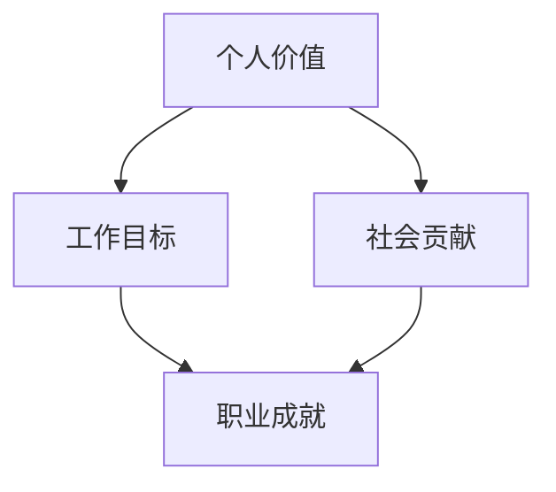

                 

### 《在职场中寻找更高意义：超越薪资和地位的精神追求》

---

**关键词**：职场意义、精神追求、职业成长、个人价值、职场平衡

**摘要**：在当今高度竞争的职场环境中，薪资和地位的追求已经成为许多人职业规划的焦点。然而，随着人们对于生活质量的不断追求，越来越多的人开始意识到，职场中的更高意义不仅仅体现在薪资和地位上，更在于精神层面的追求。本文将探讨职场中的精神追求，以及如何在这些追求中找到个人的价值和满足感。

---

### 目录大纲

下面是《在职场中寻找更高意义：超越薪资和地位的精神追求》的目录大纲：

---

## 第一部分：理解职场意义

### 第1章：职场意义的定义与重要性

#### 1.1 职场意义的内涵

#### 1.2 职场意义的重要性

#### 1.3 薪资与地位之外的价值

### 第2章：职场意义与个人成长

#### 2.1 职场意义与职业规划

#### 2.2 职场意义与个人成长

#### 2.3 职场意义与心理素质

## 第二部分：探索职场中的更高意义

### 第3章：超越物质追求的精神成长

#### 3.1 精神成长的重要性

#### 3.2 职场中精神成长的方法

#### 3.3 精神成长与物质追求的关系

### 第4章：寻找职场中的使命与愿景

#### 4.1 使命与愿景的定义

#### 4.2 如何找到个人的使命与愿景

#### 4.3 使命与愿景对职场的影响

### 第5章：职场中的个人价值观

#### 5.1 个人价值观的内涵

#### 5.2 如何发现与塑造个人价值观

#### 5.3 个人价值观在职场中的应用

## 第三部分：实践中的精神追求

### 第6章：平衡工作与生活的艺术

#### 6.1 工作与生活的关系

#### 6.2 如何平衡工作与生活

#### 6.3 平衡工作与生活的意义

### 第7章：职场中的个人品牌建设

#### 7.1 个人品牌的定义与重要性

#### 7.2 如何打造个人品牌

#### 7.3 个人品牌在职场中的应用

### 第8章：职场中的自我超越

#### 8.1 自我超越的意义

#### 8.2 如何在职场中实现自我超越

#### 8.3 自我超越对职业生涯的影响

## 第四部分：职场精神追求的案例研究

### 第9章：职场精神追求的成功案例

#### 9.1 案例一：A的职场精神追求之路

#### 9.2 案例二：B的职场精神追求与成长

#### 9.3 案例三：C的职场精神追求与领导力

### 第10章：职场精神追求的挑战与应对

#### 10.1 挑战一：职场压力与焦虑

#### 10.2 挑战二：职场竞争与人际关系

#### 10.3 应对策略：如何在挑战中保持精神追求

## 附录：职场精神追求的资源与工具

### 附录1：推荐阅读书目

### 附录2：职场精神追求相关课程与培训

### 附录3：职场精神追求的实用工具与资源

---

## 《在职场中寻找更高意义：超越薪资和地位的精神追求》

---

**作者**：AI天才研究院/AI Genius Institute & 禅与计算机程序设计艺术 /Zen And The Art of Computer Programming

---

### 第一部分：理解职场意义

---

## 第1章：职场意义的定义与重要性

### 1.1 职场意义的内涵

职场意义并不仅仅是我们每天所做的工作，它更是一个深层次的概念，涉及到个人价值、工作目标和社会贡献。用Mermaid流程图来描述职场意义的核心概念，我们可以画出以下架构：

在这个架构中，个人价值、工作目标和社会贡献共同构成了职场意义的三大支柱。个人价值是指个人在工作中所体现的独特能力和价值，工作目标是指个人希望通过工作实现的职业发展目标，而社会贡献则是指个人通过工作对社会产生的正面影响。

### 1.2 职场意义的重要性

职场意义对于个人职业生涯的重要性不言而喻。首先，它为个人提供了持续前进的动力。一个明确的职场意义可以激发个人的工作热情和积极性，使他们在面对挑战和困难时更加坚定和有信心。

其次，职场意义有助于个人职业规划的制定。一个清晰的职业目标可以帮助个人在职业生涯中更好地规划自己的发展路径，从而实现个人价值的最大化。

最后，职场意义对个人的心理健康也有积极影响。一个有意义的职业可以减轻工作带来的压力，提高个人的幸福感和满足感，从而促进心理健康的维护。

### 1.3 薪资与地位之外的价值

虽然薪资和地位在职场中占据重要地位，但它们并不是衡量职场意义的唯一标准。从另一个角度来看，职场意义的价值往往超越薪资和地位。

首先，工作对个人成长的价值是无法用金钱衡量的。通过工作，个人可以获得丰富的经验、技能和知识，这些都是金钱无法买来的宝贵财富。

其次，工作对人际关系的影响也是不可忽视的。一个有意义的职业可以使个人在职场中建立良好的人际关系，从而为个人的职业发展提供更多的机会和支持。

综上所述，职场意义不仅包括薪资和地位，还包括个人价值、职业目标和社交价值等多个方面。理解并重视这些方面，可以帮助个人在职场中找到更高的意义。

---

### 第一部分：理解职场意义

---

## 第2章：职场意义与个人成长

### 2.1 职场意义与职业规划

职场意义与职业规划密不可分。一个明确的职业规划可以帮助个人更好地理解职场意义，并为实现这个意义提供明确的路径。

首先，职场意义在职业规划中的指导作用体现在以下几个方面：

1. **目标设定**：一个清晰的职场意义可以帮助个人设定明确的职业目标，从而为职业规划提供方向。
2. **路径选择**：了解职场意义可以帮助个人选择适合自己的职业路径，避免盲目跟风或过度追求短期利益。
3. **持续激励**：明确的职业规划可以激发个人在工作中的持续动力，使他们在面对挑战时更加坚定。

其次，职场意义对个人职业规划的影响还体现在以下几个方面：

1. **技能提升**：为了实现职场意义，个人需要不断提升自己的技能和知识，这有助于他们在职业领域中保持竞争力。
2. **资源整合**：一个明确的职业规划可以帮助个人更好地整合内外部资源，为职业发展提供更多的支持。
3. **心理准备**：面对职场中的各种挑战和变化，一个明确的职业规划可以帮助个人保持积极的心态，从而更好地应对各种情况。

### 2.2 职场意义与个人成长

职场意义不仅是职业规划的一部分，更是个人成长的重要推动力。

首先，职场意义可以激发个人的学习兴趣。一个有意义的职业可以激发个人对相关领域的热情，促使他们不断学习新知识、掌握新技能。

其次，职场意义可以帮助个人建立自信。通过实现职场意义，个人可以在工作中获得成就感和满足感，从而增强自信心。

最后，职场意义对个人心理素质的提升也具有重要作用。一个有意义的职业可以帮助个人更好地应对职场压力，提高心理韧性。

### 2.3 职场意义与心理素质

职场意义对个人心理素质的影响主要体现在以下几个方面：

1. **压力管理**：一个有意义的职业可以减轻工作带来的压力，提高个人的心理韧性。
2. **情绪调节**：通过实现职场意义，个人可以获得积极的情绪体验，有助于情绪调节和心理平衡。
3. **自我实现**：职场意义可以满足个人对自我实现的需求，从而提高个人的心理健康水平。

总之，职场意义不仅是职业规划的一部分，更是个人成长和心理素质提升的重要推动力。理解并重视职场意义，可以帮助个人在职业生涯中实现全面的发展。

---

## 第二部分：探索职场中的更高意义

---

### 第3章：超越物质追求的精神成长

#### 3.1 精神成长的重要性

在职场中，物质追求往往是一个显著的目标，如薪资、福利和地位。然而，随着人们对生活质量的追求逐渐提升，精神成长的重要性也逐渐凸显。

首先，精神成长对个人的心理健康有着直接的影响。一个心理健康的人能够在面对职场压力和挑战时保持冷静和乐观，从而更好地应对各种困难。

其次，精神成长有助于提高个人的工作效率和创造力。一个心态积极、充满活力的人往往能够更加专注地工作，提出创新的解决方案。

最后，精神成长对于个人的职业生涯发展也具有重要作用。一个有精神追求的人更容易在职场中获得认可和尊重，从而在职业道路上获得更多的机会。

#### 3.2 职场中精神成长的方法

要在职场中实现精神成长，以下几种方法可以提供帮助：

1. **自我反思**：定期进行自我反思，了解自己的价值观、目标和现状，有助于明确职业发展的方向。

2. **终身学习**：持续学习新知识和技能，不仅可以提升个人竞争力，还能为精神成长提供源源不断的动力。

3. **心理调适**：学会应对职场压力和挫折，如通过锻炼、冥想或与朋友交流来缓解心理压力。

4. **积极心态**：培养积极的心态，对工作中的挑战和困难保持乐观态度，有助于在精神层面获得成长。

#### 3.3 精神成长与物质追求的关系

精神成长与物质追求并非对立的关系，而是相辅相成的。一个平衡的心态可以使个人在追求物质的同时，不忘追求精神上的满足。

首先，精神成长可以为物质追求提供动力。一个精神富足的人更有可能追求高质量的生活，而不仅仅是追求物质上的富足。

其次，物质追求可以为精神成长提供支持。一定的物质基础可以保证个人有足够的时间和资源去追求精神上的满足。

总之，职场中的精神成长不仅有助于提高个人心理健康和职业发展，还能为物质追求提供动力和支持。一个平衡的心态是关键，使个人能够在追求物质的同时，不忘追求精神上的满足。

---

### 第4章：寻找职场中的使命与愿景

#### 4.1 使命与愿景的定义

在职场中，使命和愿景是两个至关重要的概念，它们为个人和团队提供了明确的方向和动力。

**使命**是指组织或个人存在的根本目的和价值。它回答了“我们为什么存在”的问题。一个清晰的使命可以帮助个人和团队理解自己的核心价值，并以此为基础制定长远的目标。

**愿景**则是关于未来的一种想象和期望。它回答了“我们想要成为什么”的问题。一个具有吸引力的愿景可以激发团队和个人的斗志，使他们为实现这一目标而努力。

#### 4.2 如何找到个人的使命与愿景

找到个人的使命和愿景是一个深刻而复杂的过程，需要自我反思和深入思考。以下是一些方法可以帮助个人找到自己的使命和愿景：

1. **自我反思**：花时间思考自己的价值观、兴趣和优势，了解自己的长期目标和人生目标。

2. **探索兴趣**：尝试不同的工作和活动，了解自己真正感兴趣的事物，这些往往与个人的使命和愿景密切相关。

3. **倾听内心**：静下心来，倾听内心的声音，了解自己对工作的热情和激情所在。

4. **求助导师**：与有经验的人交流，从他们的经验和见解中获取启示，有助于更清晰地看到自己的使命和愿景。

5. **实践探索**：通过实际行动来验证和调整自己的使命和愿景，实践是最好的检验标准。

#### 4.3 使命与愿景对职场的影响

个人的使命和愿景对职场有着深远的影响：

1. **指导职业规划**：明确的使命和愿景可以帮助个人在职业生涯中做出更明智的决策，避免盲目跟风或随意变动。

2. **激励个人成长**：一个有吸引力的愿景可以激发个人的学习热情和进取心，促使他们在工作中不断成长。

3. **提升团队凝聚力**：当团队成员都认同组织的使命和愿景时，他们更愿意为共同的目标而努力，从而提升团队凝聚力和执行力。

4. **增强组织竞争力**：一个有使命和愿景的组织更容易吸引和留住优秀的员工，从而提升整体竞争力。

总之，找到并坚守个人的使命和愿景，不仅有助于个人的职业发展，也能为职场带来积极的影响。

---

### 第5章：职场中的个人价值观

#### 5.1 个人价值观的内涵

个人价值观是指个人对事物的评价标准和行为准则，是个人内心深处对对错、善恶、美丑的判断。在职场中，个人价值观不仅影响个人的行为和决策，也影响着团队和组织的文化。

首先，个人价值观是个人行为的基础。个人的行为往往受到价值观的指导，一个具有正直、勤奋和责任感的个人，会在工作中表现出更高的职业道德和责任心。

其次，个人价值观对人际关系有着重要的影响。一个价值观相似或相近的团队更容易形成和谐的同事关系，从而提高团队协作效率。

最后，个人价值观对组织文化有着深远的影响。一个组织文化的形成离不开每个成员的个人价值观，一个具有共同价值观的团队更容易形成积极向上的组织文化。

#### 5.2 如何发现与塑造个人价值观

发现和塑造个人价值观是一个长期而深入的过程，以下方法可以帮助个人更好地理解和塑造自己的价值观：

1. **自我反思**：定期进行自我反思，了解自己在不同情境下的行为和决策，从中发现个人价值观的影子。

2. **阅读与学习**：通过阅读书籍、文章和聆听演讲，了解不同的价值观体系，从中汲取营养，丰富自己的价值观。

3. **交流与讨论**：与朋友、同事或导师交流，分享自己的观点和经验，从他人的反馈中了解自己的价值观。

4. **实践检验**：将个人价值观应用到实际工作和生活中，通过实践来验证和调整自己的价值观。

#### 5.3 个人价值观在职场中的应用

在职场中，个人价值观的应用体现在以下几个方面：

1. **决策与行为**：在职场决策和行为中，个人价值观起到重要的指导作用，帮助个人做出符合自己价值观的选择。

2. **团队协作**：一个具有共同价值观的团队更容易形成和谐的协作关系，提高团队效率。

3. **组织文化**：个人价值观对组织文化的形成和发展有着重要的影响，一个具有积极价值观的组织文化可以吸引和留住优秀的员工。

总之，个人价值观是职场中不可或缺的一部分，它不仅影响着个人的行为和决策，也影响着团队和组织的文化。发现和塑造个人价值观，并在职场中应用，可以帮助个人在职业生涯中实现自我价值。

---

### 第6章：平衡工作与生活的艺术

#### 6.1 工作与生活的关系

在职场中，工作与生活之间的关系是一个复杂而微妙的平衡。一方面，工作为我们提供了收入、成就感和社会地位；另一方面，生活提供了我们休息、娱乐和家庭的时间。这两者之间的平衡对于个人的整体幸福感和工作效率至关重要。

首先，工作与生活的平衡有助于提高工作效率。一个过度工作的人往往无法集中精力，容易出错，而一个生活充实的人则能够以更加饱满的精神状态投入到工作中。

其次，工作与生活的平衡对于个人的心理健康有着重要的影响。长期的工作压力和缺乏休息容易导致心理疾病，如焦虑和抑郁。而一个平衡的生活可以缓解这些压力，提高个人的心理健康水平。

#### 6.2 如何平衡工作与生活

为了在职场中实现工作与生活的平衡，以下几种方法可以提供帮助：

1. **时间管理**：合理规划时间，确保有足够的时间用于工作、休息和家庭。使用工具如日历和待办事项列表，可以帮助个人更好地管理时间。

2. **设置边界**：明确工作时间和休息时间的边界，避免工作过度侵占休息时间。例如，在工作时间结束后，尽量不处理工作相关的邮件或消息。

3. **健康生活**：保持健康的生活习惯，如定期锻炼、健康饮食和充足的睡眠。这些习惯有助于提高个人的整体健康水平，从而更好地应对工作压力。

4. **情感支持**：建立良好的社交网络，与家人、朋友和同事保持紧密的联系。这些支持系统可以在个人面临压力和挑战时提供帮助和安慰。

5. **兴趣爱好**：培养兴趣爱好，如阅读、旅行或艺术创作。这些爱好可以提供情感上的满足和放松，帮助个人从工作中解脱出来。

#### 6.3 平衡工作与生活的意义

平衡工作与生活的意义不仅体现在个人的幸福感和心理健康上，还影响着职业发展和长期职业生涯。

首先，平衡工作与生活有助于个人的职业发展。一个充满活力和健康的人更容易在工作中取得成就，从而在职业生涯中实现更高的目标。

其次，平衡工作与生活有助于建立积极的工作文化。当员工感受到工作与生活的平衡时，他们更愿意为组织贡献自己的力量，从而提高组织的整体效率和竞争力。

最后，平衡工作与生活有助于个人的长期幸福。一个长期处于工作与生活不平衡状态的人，可能会面临心理健康问题、婚姻和家庭问题等，这些问题会影响个人的长期幸福和满足感。

总之，平衡工作与生活是职场中一个至关重要的任务。通过合理的时间管理、健康的生活习惯、情感支持和兴趣爱好，个人可以在职场中实现工作与生活的平衡，从而提高工作效率、心理健康和整体幸福感。

---

### 第7章：职场中的个人品牌建设

#### 7.1 个人品牌的定义与重要性

个人品牌是指个人在职场中通过自己的技能、知识、经验和行为建立起来的独特形象和声誉。一个强大的个人品牌能够帮助个人在职场中获得更多的机会和认可，从而提升职业竞争力。

首先，个人品牌有助于提升职业竞争力。一个具有强大个人品牌的人更容易在招聘过程中脱颖而出，因为他们能够通过个人品牌展示自己的优势和独特性。

其次，个人品牌有助于建立职业信誉。一个良好的个人品牌能够为个人在职场中的行为和决策提供有力的支持和背书，从而增强他人对个人的信任和认可。

最后，个人品牌有助于实现职业发展。一个强大的个人品牌可以吸引更多的机会和资源，为个人的职业成长提供更多的支持和推动力。

#### 7.2 如何打造个人品牌

要打造一个强大的个人品牌，以下几种方法可以提供帮助：

1. **专业素养**：提升自己的专业技能和知识水平，通过不断学习和实践，成为行业内的专家。

2. **社交媒体**：利用社交媒体平台，如LinkedIn、Twitter和Facebook等，展示自己的专业知识和经验，与行业内的专家和同行建立联系。

3. **内容创作**：撰写技术博客、发表学术论文或制作视频教程，通过内容创作来展示自己的专业见解和思考。

4. **积极参与**：参加行业会议、研讨会和工作坊，通过参与行业活动来扩大人脉和影响力。

5. **积极沟通**：在与同事、上级和客户的沟通中，展示自己的专业素养和积极态度，从而提升个人形象。

6. **持续改进**：不断反思和改进自己的工作方法，通过持续的自我提升来保持个人品牌的竞争力。

#### 7.3 个人品牌在职场中的应用

个人品牌在职场中的应用主要体现在以下几个方面：

1. **招聘机会**：一个强大的个人品牌可以吸引更多的招聘机会，提高个人在求职过程中的竞争力。

2. **职业发展**：一个良好的个人品牌可以助力个人在职业发展过程中获得更多的机会和支持，从而实现更高的职业目标。

3. **人脉网络**：通过个人品牌，个人可以吸引更多的行业专家和同行，建立强大的人脉网络，从而为职业发展提供更多的资源和机会。

4. **职业影响力**：一个强大的个人品牌可以提升个人在行业内的地位和影响力，为个人在职场中争取更多的资源和话语权。

总之，个人品牌是职场中不可或缺的一部分。通过专业素养、社交媒体、内容创作、积极参与、积极沟通和持续改进，个人可以打造一个强大的个人品牌，从而在职场中实现更高的目标。

---

### 第8章：职场中的自我超越

#### 8.1 自我超越的意义

在职场中，自我超越是指个人通过不断挑战自己、超越现有的能力和成就，实现更高层次的自我成长和职业发展。自我超越对于个人和组织的成功具有重要意义。

首先，自我超越有助于个人实现职业发展。通过自我超越，个人可以不断提升自己的技能和知识，开拓新的职业领域，从而在职业生涯中实现更高的成就和地位。

其次，自我超越有助于提高个人竞争力。一个能够自我超越的人往往具备更强的适应能力和学习能力，能够在快速变化的职场环境中保持竞争力。

最后，自我超越对于组织的发展也具有重要意义。一个组织中的成员如果都能够自我超越，那么整个组织就会充满活力和创新力，从而在竞争中获得优势。

#### 8.2 如何在职场中实现自我超越

要在职场中实现自我超越，以下几种方法可以提供帮助：

1. **设定挑战性的目标**：设定具有挑战性的目标，激励自己不断前进。这些目标可以是个人技能的提升、新的项目参与或者职位晋升等。

2. **持续学习**：不断学习新的知识和技能，通过参加培训课程、阅读专业书籍和与行业专家交流，提升自己的专业素养。

3. **接受挑战**：勇于接受新的挑战和任务，通过实践来提升自己的能力和经验。

4. **反思与改进**：定期反思自己的工作表现，识别不足之处并采取改进措施，通过持续的自我提升来实现自我超越。

5. **积极心态**：保持积极的心态，对待挑战和困难时保持乐观和自信，相信自己能够克服困难，实现自我超越。

#### 8.3 自我超越对职业生涯的影响

自我超越对职业生涯有着深远的影响：

1. **提升职业成就**：通过自我超越，个人可以在职业生涯中实现更高的成就和地位，从而获得更多的职业满足感。

2. **增强竞争力**：自我超越有助于提升个人的竞争力，使其在职场中具备更强的适应能力和学习能力，从而在竞争中获得优势。

3. **促进职业发展**：自我超越可以开拓新的职业领域和机会，为个人的职业发展提供更多的选择和可能性。

4. **提升职业幸福感**：通过自我超越，个人可以不断提升自己的能力和成就，从而获得更高的职业幸福感和满足感。

总之，自我超越是职场中不可或缺的一部分。通过设定挑战性的目标、持续学习、接受挑战、反思与改进和保持积极心态，个人可以在职场中实现自我超越，从而在职业生涯中实现更高的目标。

---

### 第9章：职场精神追求的成功案例

#### 9.1 案例一：A的职场精神追求之路

A是一名软件工程师，他在职场中的精神追求体现在对技术的热爱和对代码艺术的追求。以下是他实现职场精神追求的步骤：

1. **自我反思**：A在职业生涯初期，意识到自己对编程的热爱和对技术的好奇心，决定将技术作为自己的职业方向。

2. **终身学习**：A通过参加在线课程、阅读技术书籍和参与开源项目，不断提升自己的技术能力和知识水平。

3. **代码艺术**：A追求代码的优雅和高效，他深入研究了各种编程语言和框架，致力于编写简洁、高效的代码。

4. **分享与交流**：A通过撰写技术博客、参加技术会议和与同行交流，分享自己的技术和经验，提升自己的影响力。

通过这些步骤，A在职场中实现了自己的精神追求，成为了一名备受尊敬的软件工程师。

#### 9.2 案例二：B的职场精神追求与成长

B是一名产品经理，他的职场精神追求体现在对用户需求的深刻理解和产品的极致追求。以下是他实现职场精神追求的步骤：

1. **用户研究**：B通过用户访谈、问卷调查和市场研究，深入了解用户的需求和痛点。

2. **产品思维**：B培养了自己的产品思维，注重用户体验和产品价值，致力于打造用户喜爱的产品。

3. **持续改进**：B不断反思和改进自己的工作方法，通过用户反馈和数据分析，优化产品设计和功能。

4. **领导力**：B通过积极沟通和团队合作，带领团队实现产品的成功，从而在职业生涯中不断成长。

通过这些步骤，B在职场中实现了自己的精神追求，成为了一名优秀的产品经理。

#### 9.3 案例三：C的职场精神追求与领导力

C是一名项目经理，他的职场精神追求体现在对项目管理的深入理解和领导力的提升。以下是他实现职场精神追求的步骤：

1. **项目管理知识**：C通过学习项目管理相关的理论和工具，提升自己的项目管理能力。

2. **团队领导**：C注重团队建设，通过沟通和激励，提升团队的凝聚力和执行力。

3. **风险管理**：C通过风险识别和应对策略，确保项目的顺利进行。

4. **持续学习**：C不断学习新的管理方法和工具，保持自己的竞争力。

通过这些步骤，C在职场中实现了自己的精神追求，成为了一名出色的项目经理。

---

### 第10章：职场精神追求的挑战与应对

#### 10.1 挑战一：职场压力与焦虑

在职场中，压力和焦虑是常见的心理问题，尤其对于追求精神成长的人来说，这些挑战更加明显。以下是一些应对策略：

1. **时间管理**：合理规划时间，确保有足够的时间用于工作和休息，避免过度劳累。

2. **心理调适**：通过冥想、瑜伽或深呼吸等放松技巧，缓解心理压力。

3. **积极心态**：保持积极的心态，对待工作中的挑战和困难时，保持乐观和自信。

4. **社交支持**：与家人、朋友和同事保持良好的社交关系，从他们那里获得支持和鼓励。

5. **专业咨询**：如果压力和焦虑影响到了日常生活，可以寻求专业的心理咨询帮助。

#### 10.2 挑战二：职场竞争与人际关系

职场竞争和复杂的人际关系是职场精神追求中的另一个挑战。以下是一些应对策略：

1. **专业素养**：提升自己的专业能力和素养，增强在职场中的竞争力。

2. **沟通技巧**：培养良好的沟通技巧，与他人建立积极和谐的人际关系。

3. **团队协作**：学会在团队中发挥自己的优势，与他人合作，共同实现目标。

4. **边界意识**：明确个人和工作边界，避免过度干涉他人的工作和生活。

5. **冲突管理**：学会处理职场中的冲突，通过沟通和协商，寻求问题的解决方案。

#### 10.3 应对策略：如何在挑战中保持精神追求

在面对职场中的各种挑战时，保持精神追求至关重要。以下是一些建议：

1. **自我反思**：定期进行自我反思，了解自己的精神追求和职业目标，确保自己在面对挑战时仍然坚定。

2. **调整期望**：合理调整自己的期望值，避免因过高期望导致的压力和焦虑。

3. **专注当下**：专注于当前的工作和任务，避免因过多关注未来可能出现的挑战而分散精力。

4. **持续学习**：通过不断学习和提升，增强自己在职场中的竞争力，从而更好地应对挑战。

5. **积极心态**：保持积极的心态，相信自己有能力克服挑战，实现精神追求。

总之，职场精神追求虽然面临各种挑战，但通过合理的应对策略和坚定的信念，个人可以在职场中实现自己的精神追求。

---

## 附录：职场精神追求的资源与工具

#### 附录1：推荐阅读书目

1. **《深度工作：如何有效利用每一点脑力》**
   - 作者：卡尔·纽波特
   - 内容：介绍了如何在现代职场中提高工作效率，实现深度工作。

2. **《赋能：打造积极向上的组织文化》**
   - 作者：琳达·希尔和南希·史密斯
   - 内容：探讨了如何通过激发员工的潜能，打造积极向上的组织文化。

3. **《精进：如何成为一个很厉害的人》**
   - 作者：采铜
   - 内容：提供了关于个人成长和职业发展的实用建议。

#### 附录2：职场精神追求相关课程与培训

1. **《职场心理调适与压力管理》**
   - 课程内容：教授如何应对职场压力，提高心理健康水平。

2. **《领导力与团队管理》**
   - 课程内容：介绍领导力的核心要素，以及如何管理一个高效的团队。

3. **《个人品牌打造与职业发展》**
   - 课程内容：帮助个人了解如何打造个人品牌，提升职场竞争力。

#### 附录3：职场精神追求的实用工具与资源

1. **时间管理工具**：如Trello、Asana和Google Calendar，帮助个人更好地管理时间和任务。

2. **学习资源**：如Coursera、Udemy和edX，提供各种在线课程和学习资源。

3. **职业规划工具**：如LinkedIn和CareerBuilder，帮助个人了解职业市场和规划职业路径。

通过阅读书籍、参加课程和利用工具，个人可以在职场中更好地实现精神追求。

---

### 总结

在职场中寻找更高的意义，不仅仅是追求薪资和地位的提升，更是对精神层面的追求。从理解职场意义的内涵，到探索职场中的精神成长、使命与愿景，再到个人价值观的发现与塑造，每一个环节都对我们如何平衡工作与生活、打造个人品牌和实现自我超越有着深刻的启示。通过这些方法，个人可以在职场中实现全面的发展，找到属于自己的更高意义。

让我们记住，职场中的精神追求并不是一个孤立的追求，而是一个与物质追求相辅相成的过程。一个平衡的心态，可以帮助我们在追求物质的同时，不忘追求精神上的满足。希望这篇文章能够激发您对职场精神追求的思考，让每个人都能在职场中找到属于自己的光芒。

---

**作者**：AI天才研究院/AI Genius Institute & 禅与计算机程序设计艺术 /Zen And The Art of Computer Programming

---

