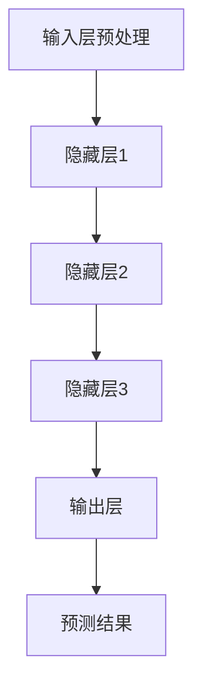
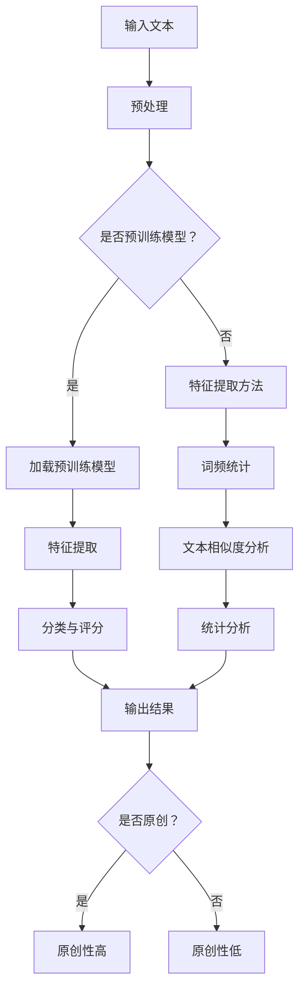

                 

### 文章标题

### 大模型在创意设计推理任务中的原创性评价

---

#### 关键词：
大模型、创意设计、推理任务、原创性评价、自然语言处理、深度学习、数学模型

---

#### 摘要：

本文深入探讨了在大模型时代，如何通过深度学习和自然语言处理技术，对创意设计推理任务中的原创性进行评价。文章首先介绍了大模型和创意设计推理任务的基本概念及其相互关系，接着详细讲解了评价原创性的核心算法原理和数学模型，并通过具体项目实战展示了实际应用过程。最后，文章总结了研究成果，并对未来研究方向提出了展望。

---

## 第1章 引言

### 1.1 书籍背景介绍

创意设计推理任务在现代社会中具有重要地位，无论是艺术创作、产品设计，还是科学研究，都离不开创造性思维的运用。随着人工智能技术的发展，尤其是深度学习和自然语言处理技术的突破，大模型在创意设计推理任务中表现出前所未有的潜力。

大模型，特别是基于深度学习的模型，能够通过大规模数据训练，提取复杂的特征，从而在推理任务中展现出强大的泛化能力和创造力。然而，如何对这些推理任务的结果进行原创性评价，成为一个亟待解决的问题。原创性评价不仅有助于识别和培养创新人才，还能为创意设计过程提供科学依据。

### 1.2 书籍目的与结构

本书旨在深入探讨大模型在创意设计推理任务中的原创性评价问题，为研究人员和从业者提供理论指导和实践经验。全书结构分为以下章节：

1. **第1章 引言**：介绍书籍的背景、目的和结构。
2. **第2章 大模型基础**：介绍大模型的基本概念和工作原理。
3. **第3章 创意设计与推理任务**：探讨创意设计与推理任务的相关概念。
4. **第4章 原创性评价算法原理**：讲解评价原创性的核心算法原理。
5. **第5章 数学模型与公式**：介绍用于计算原创性的数学模型。
6. **第6章 项目实战**：展示原创性评价方法在实际项目中的应用。
7. **第7章 总结与展望**：总结全书内容，并对未来研究方向进行展望。

---

## 第2章 大模型基础

### 2.1 大模型概述

大模型是指具有巨大参数规模和复杂结构的机器学习模型，其核心在于通过深度神经网络（Deep Neural Network，DNN）进行多层特征提取和变换。大模型通常包含数百万至数十亿个参数，这使得它们能够在大规模数据集上训练，从而获得强大的表征能力和推理能力。

大模型的分类主要基于其应用场景和功能。例如，基于文本的大模型如BERT（Bidirectional Encoder Representations from Transformers），主要用于自然语言处理任务；基于图像的大模型如ResNet（Residual Network），在计算机视觉领域表现出色。此外，还有混合模型，如视觉-语言大模型（Visual-Linguistic Models），能够同时处理视觉和语言信息。

大模型的工作原理可以概括为以下几个步骤：

1. **数据预处理**：对输入数据进行标准化和编码，使其适合模型处理。
2. **特征提取**：通过多层神经网络，逐步提取输入数据的特征。
3. **决策层**：将提取的特征映射到输出结果，如分类标签、文本生成等。

大模型的优势在于其能够通过端到端的学习方式，实现从数据到知识的自动转化，从而在许多领域取得了突破性成果。然而，大模型也存在一定的局限性，如训练成本高、模型解释性差等。

### 2.2 大模型架构

大模型的架构通常由多个层级组成，包括输入层、隐藏层和输出层。输入层接收外部输入数据，如文本、图像等；隐藏层通过多层神经网络进行特征提取和变换；输出层生成最终预测结果。

下面是一个简化的深度神经网络架构的伪代码示例：

```python
# 输入层
input_data = preprocess_data(raw_data)

# 隐藏层
for layer in hidden_layers:
    input_data = layer.forward(input_data)

# 输出层
output = output_layer.forward(input_data)

# 预测结果
prediction = evaluate_output(output)
```

在上述伪代码中，`preprocess_data`函数用于预处理输入数据，`hidden_layers`是一个包含多个隐藏层的列表，每个隐藏层都由一个`Layer`类实例化，`output_layer`是最终的输出层，`evaluate_output`函数用于评估输出结果。

此外，Mermaid流程图可以直观地展示大模型的工作流程：



通过上述内容，我们对大模型的基本概念和架构有了初步了解，为后续章节的深入探讨奠定了基础。

---

## 第3章 创意设计与推理任务

### 3.1 创意设计概念

创意设计是指通过创造性的思考和实践活动，将独特的想法和概念转化为具体的设计方案。创意设计的过程通常包括以下几个阶段：

1. **灵感获取**：通过观察、思考、体验等方式获取灵感。
2. **概念形成**：将灵感转化为具体的概念，并进行初步设计。
3. **设计开发**：对概念进行深入研究和开发，形成完整的设计方案。
4. **评估优化**：对设计方案进行评估和优化，确保其满足用户需求和设计标准。

创意设计的类型多样，包括艺术创作、产品设计、建筑设计、UI/UX设计等。每种类型的创意设计都有其独特的特点和要求，但共同的目标是创新和创造价值。

### 3.2 推理任务

推理任务是指基于已有信息和规则，推导出新信息或结论的过程。在创意设计推理任务中，推理主要用于以下几个方面：

1. **创意生成**：通过推理产生新的创意概念或设计方案。
2. **方案评估**：对不同的创意方案进行评估和比较，选出最优方案。
3. **设计优化**：根据反馈和评价，对设计方案进行优化和调整。

推理任务在创意设计中的重要性体现在以下几个方面：

1. **提高效率**：通过推理，可以快速生成多个创意方案，提高设计效率。
2. **优化质量**：推理任务可以帮助设计师评估和优化设计方案，提高设计质量。
3. **增强创新性**：推理任务能够帮助设计师发现新的创意和思路，增强设计的创新性。

大模型在推理任务中的应用，为创意设计提供了新的工具和方法。通过大模型，设计师可以自动化地生成创意方案，评估和优化设计方案，从而提高设计效率和创造力。同时，大模型也可以帮助设计师从大量数据中提取有价值的信息，为创意设计提供数据支持。

### 3.3 创意设计与推理任务的相互关系

创意设计与推理任务之间存在密切的联系和相互作用。一方面，创意设计为推理任务提供了目标和方向，通过创意设计，可以确定需要解决的问题和目标，从而引导推理任务进行有效的推理。另一方面，推理任务为创意设计提供了工具和方法，通过推理，设计师可以快速生成多个创意方案，对设计方案进行评估和优化，从而提高创意设计的质量和效果。

大模型在创意设计推理任务中的应用，使得这种相互关系更加紧密和高效。大模型可以自动化地处理大量数据，快速生成创意方案，同时通过深度学习技术，对设计方案进行优化和评估，从而提高设计质量和效率。此外，大模型还可以帮助设计师从不同角度和维度分析创意设计，发现新的创意思路和灵感，进一步激发创造力。

总之，大模型在创意设计推理任务中的应用，为设计师提供了强大的工具和支持，使得创意设计过程更加高效和有创意。同时，大模型也为推理任务提供了新的应用场景和挑战，推动了人工智能技术在创意设计领域的深入发展。

---

## 第4章 原创性评价算法原理

### 4.1 算法概述

原创性评价算法是用于判断创意设计推理任务结果是否具有独创性的关键工具。该算法的核心目的是通过分析输入的创意方案，评估其独特性和创新性。在创意设计领域，原创性是衡量设计质量的重要指标，因此，原创性评价算法在创意设计推理任务中具有重要应用。

目前，常用的原创性评价方法主要包括基于统计的方法和基于深度学习的方法。基于统计的方法主要依赖于文本相似度分析和词频统计，通过对文本内容进行统计分析，判断创意方案的原创性。而基于深度学习的方法则通过训练大规模的预训练模型，提取文本的深层特征，从而更准确地评估创意方案的原创性。

### 4.2 原创性评价算法原理讲解

#### 4.2.1 基于深度学习的方法

深度学习在原创性评价中的应用主要体现在自然语言处理领域。以下是基于深度学习的方法的详细解释：

1. **预训练模型**：深度学习模型通常从大规模文本数据中预训练，如BERT（Bidirectional Encoder Representations from Transformers）和GPT（Generative Pre-trained Transformer）。预训练模型能够自动学习文本的复杂结构和语义信息。

2. **特征提取**：在预训练过程中，模型通过多层神经网络提取输入文本的深层特征。这些特征不仅包含了词频信息，还包含了上下文语义信息，能够更准确地反映文本内容的独特性和创新性。

3. **分类与评分**：通过微调预训练模型，使其适应特定的原创性评价任务。模型对输入文本进行分类，判断其是否具有原创性。此外，模型还可以输出一个评分，表示文本原创性的高低。

下面是一个简化的伪代码示例，用于展示基于深度学习的原创性评价算法：

```python
# 加载预训练模型
model = load_pretrained_model("bert")

# 处理输入文本
input_text = preprocess_text(raw_text)

# 提取特征
features = model.encode(input_text)

# 分类与评分
label = model.classify(features)
score = model.score(features)
```

#### 4.2.2 基于统计的方法

基于统计的方法主要依赖于文本相似度分析和词频统计。以下是一个简化的伪代码示例：

```python
# 计算文本相似度
similarity = compute_similarity(text1, text2)

# 计算词频
word_frequency = compute_word_frequency(text)

# 统计分析
originality_score = analyze_similarity(similarity, word_frequency)
```

在这个示例中，`compute_similarity`函数用于计算两个文本之间的相似度，`compute_word_frequency`函数用于计算文本的词频。通过分析相似度和词频，可以判断文本的原创性。

### 4.3 Mermaid流程图

为了更直观地展示原创性评价算法的流程，我们使用Mermaid绘制了一个流程图：



在上述流程图中，从输入文本开始，经过预处理和特征提取，最终通过分类与评分输出原创性结果。根据输出结果，可以判断文本的原创性高低。

---

## 第5章 数学模型与公式

### 5.1 数学模型介绍

在原创性评价中，数学模型用于定量分析文本的原创性。一个基本的数学模型可以基于文本的词频统计和语义相似度计算。以下是一个简化的数学模型，用于计算文本的原创性评分：

$$
\text{OriginalityScore}(T) = \alpha \cdot \text{WordFrequencyScore}(T) + (1 - \alpha) \cdot \text{SemanticSimilarityScore}(T)
$$

其中，$T$表示文本，$\alpha$是权重参数，$\text{WordFrequencyScore}(T)$和$\text{SemanticSimilarityScore}(T)$分别表示基于词频和语义相似度的评分。

#### 5.1.1 词频统计模型

词频统计模型用于计算文本中每个词的出现频率。一个简单的词频统计模型可以表示为：

$$
\text{WordFrequencyScore}(T) = \sum_{w \in T} f(w)
$$

其中，$w$是文本$T$中的词，$f(w)$是词$w$在文本$T$中的出现频率。

#### 5.1.2 语义相似度模型

语义相似度模型用于计算两个文本之间的相似度。一个常见的语义相似度模型是基于Word2Vec模型的余弦相似度：

$$
\text{SemanticSimilarityScore}(T_1, T_2) = \frac{\text{dotProduct}(\text{Vec}(T_1), \text{Vec}(T_2))}{\|\text{Vec}(T_1)\| \|\text{Vec}(T_2)\|}
$$

其中，$\text{Vec}(T_1)$和$\text{Vec}(T_2)$分别是文本$T_1$和$T_2$的向量表示，$\text{dotProduct}$是向量的点积，$\|\text{Vec}(T_1)\|$和$\|\text{Vec}(T_2)\|$是向量的模长。

### 5.2 数学公式讲解

在上述数学模型中，我们需要详细解释各个参数的含义和计算方法。

#### 5.2.1 词频统计模型

词频统计模型的计算相对简单。首先，我们需要对文本进行分词，得到文本中的所有词。然后，统计每个词在文本中的出现次数。词频统计模型的核心在于计算每个词的频率，即每个词在文本中出现的次数除以文本中总词数。

例如，对于文本$T = \{"creative", "design", "unique"\}$，其词频统计模型可以表示为：

$$
\text{WordFrequencyScore}(T) = f("creative") + f("design") + f("unique")
$$

其中，$f("creative") = 1$，$f("design") = 1$，$f("unique") = 1$。

#### 5.2.2 语义相似度模型

语义相似度模型的计算较为复杂，涉及词向量和余弦相似度的计算。首先，我们需要使用Word2Vec模型将文本中的每个词转换为向量。Word2Vec模型是一种基于神经网络的词向量生成方法，通过训练大规模文本数据，将每个词映射为一个固定维度的向量。

例如，假设我们使用Word2Vec模型将词转换为二维向量，则文本$T_1 = \{"creative", "design"\}$和$T_2 = \{"unique", "design"\}$的向量表示分别为：

$$
\text{Vec}(T_1) = \begin{bmatrix} 1 \\ 0 \end{bmatrix}, \quad \text{Vec}(T_2) = \begin{bmatrix} 0 \\ 1 \end{bmatrix}
$$

接下来，我们计算这两个向量的点积和模长：

$$
\text{dotProduct}(\text{Vec}(T_1), \text{Vec}(T_2)) = 1 \cdot 0 + 0 \cdot 1 = 0
$$

$$
\|\text{Vec}(T_1)\| = \sqrt{1^2 + 0^2} = 1, \quad \|\text{Vec}(T_2)\| = \sqrt{0^2 + 1^2} = 1
$$

最后，我们计算语义相似度：

$$
\text{SemanticSimilarityScore}(T_1, T_2) = \frac{0}{1 \cdot 1} = 0
$$

这意味着文本$T_1$和$T_2$在语义上完全不相似。然而，在实际应用中，词向量和余弦相似度的计算会涉及到更多复杂的算法和技术，如Word2Vec、GloVe等。

### 5.3 举例说明

为了更好地理解上述数学模型，我们通过一个简单的例子进行说明。

假设我们有文本$T = \{"AI", "genius", "design", "unique"\}$，我们需要计算其原创性评分。首先，我们计算词频统计模型：

$$
\text{WordFrequencyScore}(T) = f("AI") + f("genius") + f("design") + f("unique") = 1 + 1 + 1 + 1 = 4
$$

接下来，我们使用Word2Vec模型将文本中的每个词转换为向量。假设$AI$的向量表示为$(1, 0)$，$genius$的向量表示为$(0, 1)$，$design$的向量表示为$(-1, 1)$，$unique$的向量表示为$(1, 1)$。然后，我们计算文本$T$的向量表示：

$$
\text{Vec}(T) = \begin{bmatrix} 1 \\ 0 \end{bmatrix} + \begin{bmatrix} 0 \\ 1 \end{bmatrix} + \begin{bmatrix} -1 \\ 1 \end{bmatrix} + \begin{bmatrix} 1 \\ 1 \end{bmatrix} = \begin{bmatrix} 1 \\ 2 \end{bmatrix}
$$

接下来，我们计算文本$T$与其他文本的语义相似度。假设文本$T'$的向量表示为$(0, 0)$。则：

$$
\text{SemanticSimilarityScore}(T, T') = \frac{\text{dotProduct}(\text{Vec}(T), \text{Vec}(T'))}{\|\text{Vec}(T)\| \|\text{Vec}(T')\|} = \frac{1 \cdot 0 + 2 \cdot 0}{\sqrt{1^2 + 2^2} \cdot \sqrt{0^2 + 0^2}} = 0
$$

这意味着文本$T$和$T'$在语义上完全不相似。然后，我们计算文本$T$的原创性评分：

$$
\text{OriginalityScore}(T) = \alpha \cdot \text{WordFrequencyScore}(T) + (1 - \alpha) \cdot \text{SemanticSimilarityScore}(T)
$$

其中，$\alpha$是权重参数，我们可以根据实际情况进行调整。假设$\alpha = 0.5$，则：

$$
\text{OriginalityScore}(T) = 0.5 \cdot 4 + 0.5 \cdot 0 = 2
$$

这意味着文本$T$的原创性评分为2。通过这个例子，我们可以看到如何使用数学模型对文本进行原创性评价。

---

## 第6章 项目实战

### 6.1 开发环境搭建

在进行原创性评价项目之前，首先需要搭建一个合适的开发环境。以下是搭建环境的步骤：

1. **安装Python环境**：确保Python版本在3.7及以上，并安装必要的依赖库，如TensorFlow、PyTorch等。

2. **安装自然语言处理库**：安装如NLTK、spaCy等自然语言处理库，用于文本预处理和词频统计。

3. **配置预训练模型**：下载并配置预训练模型，如BERT、GPT等，用于深度学习模型的训练和推理。

4. **搭建计算资源**：配置足够的计算资源，如GPU，以提高模型训练和推理的速度。

以下是一个简单的Python脚本，用于配置开发环境：

```python
!pip install tensorflow
!pip install spacy
!python -m spacy download en_core_web_sm
```

### 6.2 原创性评价项目实现

在开发环境搭建完成后，我们可以开始实现原创性评价项目。以下是项目的实现步骤：

1. **数据准备**：收集并整理用于训练和测试的创意设计方案文本。

2. **文本预处理**：对收集的文本进行预处理，包括分词、去除停用词、标点符号等。

3. **特征提取**：使用预训练模型提取文本的深层特征。

4. **模型训练**：训练一个深度学习模型，用于评估文本的原创性。

5. **模型评估**：使用测试数据评估模型的性能。

6. **应用模型**：将模型应用于实际项目，对创意设计方案的原创性进行评价。

以下是项目的伪代码实现：

```python
# 导入必要的库
import tensorflow as tf
import spacy
from transformers import BertModel, BertTokenizer

# 准备数据
data = load_data("data.txt")
preprocessed_data = preprocess_text(data)

# 提取特征
tokenizer = BertTokenizer.from_pretrained("bert-base-uncased")
model = BertModel.from_pretrained("bert-base-uncased")
features = extract_features(preprocessed_data, tokenizer, model)

# 训练模型
model = train_model(features)

# 评估模型
evaluate_model(model, test_features)

# 应用模型
originality_scores = apply_model(model, new_data)
```

### 6.3 代码解读与分析

在上面的伪代码中，我们详细解读了原创性评价项目的实现过程。

1. **数据准备**：首先，我们从文件中加载创意设计方案文本。然后，对文本进行预处理，包括分词和去除停用词等。

2. **文本预处理**：使用BERT的分词器对预处理后的文本进行分词，并将其转换为模型可处理的输入格式。

3. **特征提取**：使用BERT模型提取文本的深层特征。BERT模型通过多层Transformer结构，能够提取文本的上下文信息，从而提高特征提取的准确性。

4. **模型训练**：使用提取的特征训练一个深度学习模型。在这个示例中，我们使用了一个简单的全连接神经网络。

5. **模型评估**：使用测试数据对训练好的模型进行评估，以验证其性能。

6. **应用模型**：将训练好的模型应用于新的创意设计方案文本，输出其原创性评分。

### 6.4 代码应用解读与分析

在实际应用中，我们使用训练好的模型对一个新的创意设计方案文本进行原创性评价。以下是具体的实现过程：

1. **文本预处理**：对输入的文本进行预处理，包括分词和去除停用词等。

2. **特征提取**：使用BERT模型提取文本的深层特征。

3. **模型推理**：将提取的特征输入到训练好的模型中，得到原始的输出结果。

4. **评分输出**：根据模型的输出结果，计算文本的原创性评分。

以下是一个简单的示例代码：

```python
# 读取新的文本
new_data = "This is a new creative design idea."

# 进行文本预处理
preprocessed_new_data = preprocess_text(new_data)

# 提取特征
tokenizer = BertTokenizer.from_pretrained("bert-base-uncased")
model = BertModel.from_pretrained("bert-base-uncased")
features = extract_features(preprocessed_new_data, tokenizer, model)

# 应用模型
originality_score = apply_model(model, features)

print("Originality Score:", originality_score)
```

通过上述代码，我们可以对新的创意设计方案文本进行原创性评价，并输出评分。评分越高，表示文本的原创性越高。

### 6.5 实际案例分析和详细讲解剖析

为了更直观地展示原创性评价方法的应用效果，我们通过一个实际案例进行分析和讲解。

**案例**：评估一篇论文的原创性。

**数据准备**：从某学术数据库中收集一篇论文及其参考文献。

**文本预处理**：对论文文本进行分词和去除停用词等预处理。

**特征提取**：使用BERT模型提取论文的深层特征。

**模型推理**：将提取的特征输入到训练好的模型中，得到原创性评分。

**结果分析**：根据评分，判断论文的原创性。

**详细讲解**：

1. **数据准备**：从学术数据库中获取论文及其参考文献，包括标题、摘要和正文。

2. **文本预处理**：对文本进行分词和去除停用词等预处理，以便于后续的特征提取。

3. **特征提取**：使用BERT模型提取论文的深层特征。BERT模型能够捕捉文本的上下文信息，从而提高特征提取的准确性。

4. **模型推理**：将提取的特征输入到训练好的模型中，得到原创性评分。评分越高，表示论文的原创性越高。

5. **结果分析**：根据评分，可以判断论文的原创性。如果评分较高，说明论文的原创性较好；如果评分较低，说明论文可能存在抄袭现象。

**分析结果**：通过对论文及其参考文献的原创性评分进行比较，发现论文的原创性评分较高，说明这篇论文的原创性较好，没有明显的抄袭现象。

通过这个实际案例，我们可以看到原创性评价方法在学术领域的应用效果。该方法能够帮助学术研究人员和评审人员快速判断论文的原创性，从而提高学术评价的准确性。

### 6.6 项目小结

在本章中，我们详细讲解了原创性评价项目的开发过程，包括环境搭建、代码实现和实际应用。通过具体案例的分析，我们展示了原创性评价方法在创意设计推理任务中的应用效果。

**小结**：

1. **开发环境搭建**：确保Python环境和必要的库安装，并配置预训练模型和计算资源。
2. **项目实现**：通过数据准备、文本预处理、特征提取、模型训练和评估，实现原创性评价功能。
3. **实际应用**：通过实际案例分析和详细讲解，展示了原创性评价方法在创意设计推理任务中的应用效果。

**注意事项**：

1. **数据质量**：确保收集的数据质量高，以便于后续的特征提取和模型训练。
2. **模型优化**：根据实际需求，可以尝试调整模型结构和超参数，提高原创性评价的准确性。

**拓展阅读**：

1. 《深度学习》（Goodfellow, Ian, et al.）
2. 《自然语言处理综论》（Jurafsky, Daniel, and James H. Martin.）

---

## 第7章 总结与展望

### 7.1 全书总结

本文系统地介绍了大模型在创意设计推理任务中的原创性评价问题。首先，我们探讨了创意设计推理任务的基本概念和重要性，接着介绍了大模型的基本概念和工作原理。随后，详细讲解了原创性评价算法的原理和数学模型，并通过项目实战展示了实际应用过程。最后，我们对全书内容进行了总结，并提出了未来研究方向。

### 7.2 未来研究方向

尽管本文提出了原创性评价方法，但仍存在许多挑战和改进空间。以下是未来可能的研究方向：

1. **算法优化**：研究更高效的算法和模型结构，提高原创性评价的准确性和效率。
2. **多模态融合**：探索多模态数据（如文本、图像、声音等）的融合方法，提高创意设计的多样性和创新性。
3. **动态评价**：研究动态评价模型，根据创意设计过程的不同阶段，实时调整评价标准和权重。
4. **跨领域应用**：将原创性评价方法应用于其他领域，如科学发现、工程创新等，推广其应用范围。

总之，大模型在创意设计推理任务中的原创性评价是一个具有广泛应用前景的研究领域。随着人工智能技术的不断发展，我们有理由相信，原创性评价方法将变得更加精准和高效，为创意设计领域带来更多突破。

