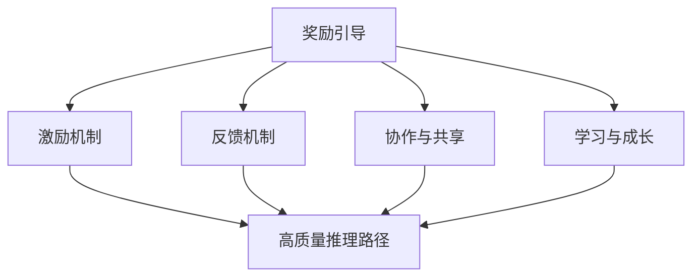

                 

### 文章标题：奖励引导综合筛选高质量推理路径

> 关键词：奖励引导、筛选算法、高质量推理、应用案例、综合策略

摘要：本文旨在探讨奖励引导在筛选高质量推理路径中的应用，通过深入分析奖励引导的概念、作用机制、心理学基础以及高质量推理路径的定义和重要性，结合实际案例，提出了一套综合筛选策略，旨在提升决策质量和效率。文章还将介绍常用的筛选算法，并通过伪代码和数学模型详细讲解核心算法原理，最后提供项目实战和最佳实践，为读者提供全面的指导。

## 1. 引言

在信息技术飞速发展的时代，数据量和计算能力不断增加，这使得高效的数据筛选和推理成为人工智能领域的重要课题。奖励引导作为心理学和行为经济学中的重要概念，通过激励和反馈机制，可以有效地引导个体和群体做出更高质量的决策。本文旨在探讨奖励引导在筛选高质量推理路径中的应用，提出一套综合筛选策略，以提高决策的准确性和效率。

本文将从以下几个方面展开讨论：

1. 奖励引导概述：介绍奖励引导的基本概念、定义和作用，以及其心理学基础。
2. 高质量推理路径：阐述高质量推理路径的定义、重要性和特点。
3. 筛选算法原理：介绍筛选算法的基本原理和分类，包括排序算法和搜索算法。
4. 实际应用案例：通过具体案例展示奖励引导在筛选高质量推理路径中的应用效果。
5. 综合筛选策略：提出综合筛选策略的设计原则和常见方法。
6. 评估与优化：讨论评估指标的选择和优化策略。
7. 未来展望：探讨奖励引导与推理路径的发展趋势和新技术的潜在影响。

通过以上内容的分析，本文旨在为读者提供一个全面、深入的视角，理解奖励引导在筛选高质量推理路径中的应用价值，并为其在实践中的应用提供参考。

## 2. 背景介绍

在讨论奖励引导和筛选高质量推理路径之前，我们需要了解它们在现实世界中的应用背景。随着大数据和人工智能技术的迅猛发展，各类复杂问题和决策场景层出不穷。如何从大量数据中筛选出有价值的信息，并做出高质量的决策，成为企业和研究者面临的重要挑战。

### 2.1 奖励引导的应用背景

奖励引导最早源于心理学和行为经济学的研究。在行为经济学中，奖励引导被认为是影响个体决策的重要因素之一。人们在做决策时，往往会受到奖励和惩罚的影响，从而改变其行为模式。这一现象在商业领域得到了广泛应用，如市场营销、人力资源管理、客户关系管理等领域。

例如，在市场营销中，商家常常通过促销活动、积分奖励等方式来激励消费者购买更多产品，从而提高销售额。在人力资源管理中，企业通过绩效考核和奖励机制来激励员工提高工作效率，从而实现组织目标。这些应用场景展示了奖励引导在引导个体行为方面的强大作用。

### 2.2 高质量推理路径的应用背景

高质量推理路径在许多领域具有广泛的应用，如金融分析、医疗诊断、智能制造、推荐系统等。以下是一些典型应用场景：

1. **金融分析**：金融分析师需要从海量数据中筛选出对投资决策有价值的信号，从而制定投资策略。高质量推理路径可以帮助分析师识别出关键变量和趋势，提高预测准确性。

2. **医疗诊断**：在医疗领域，医生需要根据患者的症状和检查结果进行诊断。高质量推理路径可以帮助医生快速、准确地识别出疾病，提高诊断的准确性。

3. **智能制造**：在智能制造领域，生产过程中产生的数据量巨大。通过高质量推理路径，可以识别出生产过程中的异常，从而优化生产流程，提高生产效率。

4. **推荐系统**：推荐系统在电子商务、在线娱乐等领域得到了广泛应用。高质量推理路径可以帮助推荐系统从大量用户数据中筛选出个性化的推荐结果，提高用户满意度。

### 2.3 奖励引导与高质量推理路径的关系

奖励引导和高质量推理路径之间存在着密切的联系。奖励引导通过激励和反馈机制，可以有效地引导个体和群体进行高质量的推理和决策。具体来说，奖励引导具有以下几个作用：

1. **增强动机**：奖励引导可以激发个体和群体的动机，促使他们更加努力地工作，从而提高推理和决策的质量。
2. **改进学习**：通过奖励和反馈，个体可以及时了解自己的推理和决策效果，从而不断调整和优化自己的推理路径，提高整体质量。
3. **促进协作**：在群体决策中，奖励引导可以激励个体积极参与，分享知识和经验，从而提高整体决策质量。

总之，奖励引导在筛选高质量推理路径中发挥着重要作用，通过激励机制，可以有效提升推理和决策的准确性和效率。接下来，我们将深入探讨奖励引导的概念、作用机制和心理学基础，以便更好地理解其在实际应用中的作用。

## 3. 核心概念与联系

### 3.1 奖励引导的概念

奖励引导（Reward Guiding）是一种通过外部激励和内部反馈机制来引导个体或群体行为的策略。其核心思想是通过设置奖励机制，激励个体在特定任务或决策过程中，采取最优或高质的行动，从而实现目标。奖励可以表现为物质奖励（如奖金、礼品）、精神奖励（如表扬、认可）或社会奖励（如社交地位、尊重）。

奖励引导的定义可以归纳为：一种利用外部奖励和内部反馈机制，激励个体或群体在特定任务或决策过程中，采取高质、最优或符合期望行为的策略。

### 3.2 高质量推理路径的概念

高质量推理路径（High-Quality Reasoning Path）是指在复杂问题和决策场景中，通过一系列逻辑严谨、数据支撑、准确有效的推理步骤，最终得出最优或高质结论的路径。它强调推理过程的系统性和科学性，力求避免主观偏见和误差。

高质量推理路径的定义可以归纳为：在复杂问题和决策场景中，通过一系列逻辑严谨、数据支撑、准确有效的推理步骤，最终得出最优或高质结论的路径。

### 3.3 奖励引导与高质量推理路径的联系

奖励引导和高质量推理路径之间存在着紧密的联系和互动关系。具体来说，这种联系主要体现在以下几个方面：

1. **激励机制**：奖励引导通过设置奖励机制，激励个体在推理过程中保持高度专注、积极思考和严谨推理，从而提高推理路径的质量。

2. **反馈机制**：奖励引导通过即时反馈和评价机制，帮助个体了解其推理路径的效果，从而进行调整和优化。这种反馈机制有助于个体不断修正推理路径，提高整体质量。

3. **协作与共享**：在群体决策中，奖励引导可以激励个体积极参与、分享知识和经验，从而提高整体决策质量。高质量推理路径则依赖于个体之间的协作和知识共享，通过共同推理和讨论，得出最优结论。

4. **学习与成长**：奖励引导不仅激励个体在当前任务中采取高质行动，还促进个体的长期学习和成长。通过奖励和反馈，个体可以不断提升推理能力，形成高质量推理路径的技能和习惯。

### 3.4 Mermaid 流程图

为了更好地展示奖励引导与高质量推理路径之间的联系，我们可以使用 Mermaid 流程图进行描述。以下是一个简单的 Mermaid 流程图示例：

在这个流程图中，奖励引导通过激励机制、反馈机制、协作与共享以及学习与成长等方面，与高质量推理路径建立了紧密的联系。这种联系有助于个体和群体在决策过程中，不断优化推理路径，提高决策质量和效率。

通过以上核心概念和联系的介绍，我们可以更好地理解奖励引导和高质量推理路径的基本原理，以及它们在实际应用中的重要性和相互关系。接下来，我们将深入探讨奖励引导的心理学基础，进一步揭示其作用机制。

### 4. 奖励引导的心理学基础

奖励引导作为一种影响个体行为的策略，其作用机制在心理学领域有着广泛的研究。理解奖励引导的心理学基础，有助于我们深入探讨其在实际应用中的作用和效果。

#### 4.1 行为经济学与奖励

行为经济学是研究个体在面临经济决策时，如何受到各种心理因素影响的学科。奖励引导正是基于行为经济学中的奖励机制，通过激励个体在特定任务中做出高质决策。以下是一些关键的心理现象：

1. **期望效用理论**：期望效用理论认为，个体在做决策时，会综合考虑各种可能结果的效用值，从而选择期望效用最高的选项。奖励引导通过设置奖励，影响个体对结果的预期效用，从而引导其做出符合期望的行为。

2. **行为适应性理论**：行为适应性理论指出，个体在面对奖励时，会调整其行为策略，以最大化收益。奖励引导正是利用这一原理，通过不断调整奖励机制，引导个体优化其行为模式。

3. **自我决定理论**：自我决定理论认为，个体的行为受到内在动机和自我决定的影响。奖励引导通过满足个体的内在动机，如自主性、能力和归属感，从而增强其行为动机和持久性。

#### 4.2 动机与认知心理学

动机是驱动个体行为的重要心理因素。在认知心理学中，动机与认知过程密切相关。以下是一些与奖励引导相关的动机和认知现象：

1. **目标设定理论**：目标设定理论指出，个体在设定明确、有挑战性的目标时，更容易产生高动机行为。奖励引导通过设置明确的目标和奖励，激发个体的内在动机，从而提高其推理和决策质量。

2. **反馈敏感性**：个体对反馈的敏感性是影响其行为调整的重要因素。奖励引导通过及时、有效的反馈，帮助个体了解其行为效果，从而及时调整和优化推理路径。

3. **认知负荷理论**：认知负荷理论认为，个体在面对复杂任务时，认知资源有限，容易出现认知负荷。奖励引导通过简化任务、提供明确的指导，减轻个体的认知负荷，从而提高其推理效率和质量。

#### 4.3 奖励机制的作用机制

奖励引导的作用机制主要包括以下几个方面：

1. **激励效应**：奖励引导通过设置奖励，激发个体的内在动机，从而提高其行为动机和积极性。这种激励效应在个体面对复杂决策时尤为重要。

2. **反馈效应**：奖励引导通过即时反馈和评价，帮助个体了解其行为效果，从而及时调整和优化推理路径。这种反馈效应有助于提高个体行为的适应性和准确性。

3. **社会比较效应**：奖励引导可以通过与他人进行社会比较，激发个体的竞争意识和进取心。这种社会比较效应有助于提高个体的动机和行为水平。

4. **自我效能感**：奖励引导通过认可和奖励，增强个体的自我效能感，使其相信自己能够完成任务和达成目标。这种自我效能感的提升有助于提高个体的自信心和行为效率。

#### 4.4 奖励引导的应用场景

奖励引导在许多实际应用场景中具有显著效果，以下是一些典型案例：

1. **教育领域**：在教学中，奖励引导可以通过设置明确的学业目标和奖励，激发学生的学习动机，提高学习效果。例如，通过设置课外阅读奖励、课堂表现奖励等，鼓励学生积极参与学习。

2. **企业培训**：在企业培训中，奖励引导可以通过设置绩效奖励、晋升奖励等，激励员工不断提升自身能力和绩效。这种奖励机制有助于提高员工的工作积极性和企业整体绩效。

3. **项目管理**：在项目管理中，奖励引导可以通过设置项目目标奖励、团队协作奖励等，激发项目成员的积极性和协作精神，提高项目完成质量和效率。

4. **健康干预**：在健康干预中，奖励引导可以通过设置健康目标奖励、运动奖励等，激励个体积极参与健康活动，提高健康水平和生活质量。

综上所述，奖励引导的心理学基础涵盖了行为经济学、动机与认知心理学等多个领域，其作用机制包括激励效应、反馈效应、社会比较效应和自我效能感等。通过深入理解奖励引导的心理学基础，我们可以更好地发挥其在实际应用中的作用，提高决策质量和效率。

### 5. 高质量推理路径的定义与重要性

#### 5.1 高质量推理路径的定义

高质量推理路径是指在复杂问题和决策过程中，通过一系列逻辑严谨、数据支撑、准确有效的推理步骤，最终得出最优或高质结论的路径。这种路径不仅要求推理过程具备系统性、科学性和严谨性，还强调推理结果的准确性和可靠性。

高质量推理路径的定义可以概括为：在复杂问题和决策过程中，通过一系列逻辑严谨、数据支撑、准确有效的推理步骤，最终得出最优或高质结论的路径。

#### 5.2 高质量推理路径的重要性

高质量推理路径在许多领域都具有重要的应用价值，其重要性主要体现在以下几个方面：

1. **决策质量提升**：高质量推理路径通过系统化、科学化的推理步骤，帮助决策者在复杂问题中找到最优或高质的解决方案。这有助于提高决策的科学性和准确性，减少因主观偏见和误差导致的错误决策。

2. **效率提升**：高质量推理路径强调推理过程的系统性和科学性，有助于减少决策过程中的重复劳动和无效推理，提高决策效率。这有助于企业在面对复杂问题时，快速做出高质量决策，从而抢占市场先机。

3. **问题解决能力增强**：高质量推理路径的培养和运用，有助于提升个体和群体的问题解决能力。通过系统的推理训练，个体可以学会如何分析问题、构建模型和制定策略，从而在面对复杂问题时，具备更强的应对能力。

4. **知识积累与传承**：高质量推理路径通过逻辑严谨、数据支撑的推理过程，有助于将知识系统化、结构化。这不仅有助于个体在现有问题中应用已有知识，还能为新知识的学习和应用提供有力支持。

5. **创新能力提升**：高质量推理路径不仅强调逻辑推理的严谨性，还注重思维的创新性和灵活性。通过培养高质量推理能力，个体可以学会如何打破常规、寻求新的解决方案，从而在创新活动中发挥重要作用。

#### 5.3 高质量推理路径的特点

高质量推理路径具有以下几个显著特点：

1. **逻辑严谨性**：高质量推理路径强调推理过程的逻辑严谨性，要求每一步推理都符合逻辑规则和事实依据，确保推理结论的准确性。

2. **数据支撑性**：高质量推理路径依赖于数据的收集和分析，通过科学的数据分析方法，对问题进行定量和定性分析，为推理结论提供有力支撑。

3. **系统科学性**：高质量推理路径要求推理过程具备系统性和科学性，通过逐步分析和推理，确保结论的全面性和系统性。

4. **准确可靠性**：高质量推理路径强调推理结果的准确性和可靠性，通过反复验证和修正，确保推理结论的可信度和实用性。

5. **灵活适应性**：高质量推理路径不仅强调逻辑严谨性和数据支撑性，还注重思维的创新性和灵活性，能够在不同场景和问题中灵活应用，适应复杂变化。

总之，高质量推理路径在决策、问题解决、知识积累和创新等方面具有重要的应用价值。通过深入理解和运用高质量推理路径，个体和群体可以更好地应对复杂问题，提高决策质量和效率。接下来，我们将探讨筛选算法的基本原理，为高质量推理路径的实现提供技术支持。

### 6. 筛选算法的基本原理

筛选算法（Filtering Algorithm）是计算机科学和人工智能领域中的一种重要算法，用于从大量数据中快速有效地筛选出符合特定条件的数据。筛选算法广泛应用于各种实际场景，如搜索引擎、推荐系统、数据挖掘、实时监控系统等。其核心思想是通过设置筛选条件，过滤掉不符合要求的数据，从而提高数据处理效率和准确性。

#### 6.1 筛选算法的定义

筛选算法的定义可以概括为：一种用于从大量数据中快速、有效地筛选出符合特定条件的数据的算法。筛选算法通常包含以下三个基本要素：

1. **数据源**：筛选算法的数据源可以是静态数据集，也可以是动态数据流。数据源提供待处理的数据集合。
2. **筛选条件**：筛选条件是用于判断数据是否符合要求的一组逻辑规则或数学表达式。筛选条件可以是简单的比较运算，如`>`, `<`, `==`等，也可以是复杂的逻辑运算，如`AND`、`OR`、`NOT`等。
3. **筛选结果**：筛选结果是经过筛选算法处理后，满足筛选条件的数据集合。筛选结果通常用于进一步的数据处理或应用。

#### 6.2 筛选算法的分类

筛选算法可以根据不同的分类标准进行分类，常见的分类方法包括基于排序的筛选算法和基于搜索的筛选算法。以下分别介绍这两种算法：

1. **基于排序的筛选算法**

基于排序的筛选算法首先对数据集进行排序，然后根据排序结果筛选出符合条件的数据。排序算法如快速排序、归并排序、堆排序等，时间复杂度较高，但排序后可以快速找到满足条件的数据。常见的基于排序的筛选算法有：

- **快速筛选算法（QuickSelect）**：在排序的基础上，通过选择中间元素作为基准，快速找出第k小（或大）的元素，从而实现筛选。时间复杂度为O(n)。

- **双端快速筛选算法（Double-End QuickSelect）**：在快速筛选算法的基础上，同时从两端向中间搜索，进一步降低时间复杂度。适用于数据流和部分排序场景。

2. **基于搜索的筛选算法**

基于搜索的筛选算法不涉及排序，直接在数据集中搜索满足条件的数据。常见的基于搜索的筛选算法有：

- **二分查找算法（Binary Search）**：适用于有序数据集，通过不断缩小查找范围，逐步逼近目标元素。时间复杂度为O(log n)。

- **哈希查找算法（Hashing）**：通过哈希函数将数据映射到哈希表中，快速查找满足条件的数据。时间复杂度为O(1)。

- **深度优先搜索算法（DFS）**：在图中从起始节点出发，沿着路径搜索满足条件的数据。适用于图结构的数据集。

#### 6.3 筛选算法的性能评价

筛选算法的性能评价主要从时间复杂度、空间复杂度和算法稳定性等方面进行。以下是一些常见的评价标准：

1. **时间复杂度**：表示算法在数据规模增长时，计算时间的增长速度。常用的时间复杂度包括O(1)、O(log n)、O(n)和O(n log n)等。

2. **空间复杂度**：表示算法在数据规模增长时，所需存储空间的增长速度。常用空间复杂度包括O(1)、O(n)和O(n^2)等。

3. **算法稳定性**：表示算法在处理相同输入时，输出结果的一致性。稳定的筛选算法不会因输入顺序的变化而导致输出结果的变化。

#### 6.4 筛选算法的应用场景

筛选算法在许多实际应用场景中具有广泛的应用，以下是一些典型应用场景：

1. **搜索引擎**：搜索引擎通过筛选算法，从大量网页中快速筛选出与用户查询相关的网页，提高搜索效率和准确性。

2. **推荐系统**：推荐系统通过筛选算法，从用户历史行为和兴趣数据中筛选出符合条件的推荐内容，提高推荐效果。

3. **数据挖掘**：数据挖掘通过筛选算法，从大量数据中筛选出具有特定特征的数据集，用于进一步分析和建模。

4. **实时监控系统**：实时监控系统通过筛选算法，从实时数据流中筛选出异常数据，用于报警和异常处理。

总之，筛选算法在数据处理和决策过程中发挥着重要作用。通过理解和运用不同的筛选算法，我们可以提高数据处理的效率和质量，为复杂问题和决策提供有效的技术支持。

### 7. 常见的筛选算法介绍

在筛选算法的应用中，有多种常见的算法被广泛应用于不同场景，其中排序算法和搜索算法尤为典型。以下我们将介绍几种主要的筛选算法，并分析其优缺点。

#### 7.1 排序算法

排序算法是筛选算法的基础，通过将数据集按照特定顺序排列，使得筛选过程更加高效。以下是一些常见的排序算法：

1. **快速排序（Quick Sort）**
   - **原理**：快速排序采用分治策略，通过选取一个基准元素，将数据分为两部分，一部分小于基准，另一部分大于基准，然后递归地对两部分数据进行快速排序。
   - **时间复杂度**：平均情况为O(n log n)，最坏情况为O(n^2)。
   - **空间复杂度**：O(log n)。
   - **优点**：平均情况下效率高，适用于大数据集。
   - **缺点**：最坏情况下效率较低，且引入额外空间。

2. **归并排序（Merge Sort）**
   - **原理**：归并排序也采用分治策略，将数据集分为若干个子集，对每个子集进行排序，然后合并这些子集，得到最终排序结果。
   - **时间复杂度**：O(n log n)。
   - **空间复杂度**：O(n)。
   - **优点**：稳定性好，适用于大规模数据集。
   - **缺点**：空间复杂度较高，不适用于内存受限的场景。

3. **堆排序（Heap Sort）**
   - **原理**：堆排序利用二叉堆的性质，通过调整堆结构，将数据集构建成一个大顶堆或小顶堆，然后依次取出堆顶元素，实现排序。
   - **时间复杂度**：O(n log n)。
   - **空间复杂度**：O(1)。
   - **优点**：空间复杂度低，适用于内部排序。
   - **缺点**：稳定性较差，不适用于要求稳定的排序场景。

#### 7.2 搜索算法

搜索算法用于在已排序的数据集中查找特定元素。以下是一些常见的搜索算法：

1. **二分查找（Binary Search）**
   - **原理**：二分查找算法通过不断将查找区间分为一半，逐步逼近目标元素。在已排序的数据集中，二分查找算法非常高效。
   - **时间复杂度**：O(log n)。
   - **空间复杂度**：O(1)。
   - **优点**：时间复杂度低，适用于大规模数据集。
   - **缺点**：不适用于非排序数据集。

2. **线性查找（Linear Search）**
   - **原理**：线性查找算法逐个检查数据集中的每个元素，直到找到目标元素或遍历整个数据集。
   - **时间复杂度**：O(n)。
   - **空间复杂度**：O(1)。
   - **优点**：简单易实现，适用于数据规模较小的场景。
   - **缺点**：时间复杂度较高，不适用于大规模数据集。

3. **哈希查找（Hashing）**
   - **原理**：哈希查找算法通过哈希函数将数据映射到哈希表中，利用哈希表快速查找目标元素。哈希查找的时间复杂度接近O(1)。
   - **时间复杂度**：平均情况为O(1)，最坏情况为O(n)。
   - **空间复杂度**：O(n)。
   - **优点**：查找速度快，适用于大量数据的快速查找场景。
   - **缺点**：可能存在哈希冲突，需要处理冲突问题。

#### 7.3 算法比较与选择

排序算法和搜索算法各有优缺点，选择合适的算法需要根据具体场景和数据特点进行权衡：

- **排序算法**：适用于需要排序的场景，如数据预处理、统计分析等。常见的排序算法有快速排序、归并排序和堆排序。快速排序在平均情况下效率高，适用于大规模数据集；归并排序稳定性好，适用于大规模数据集；堆排序空间复杂度低，适用于内部排序。
- **搜索算法**：适用于已排序的数据集，如数据库索引、二分查找等。常见的搜索算法有二分查找和哈希查找。二分查找时间复杂度低，适用于大规模已排序数据集；哈希查找速度快，适用于大量数据的快速查找场景。

总之，了解常见的筛选算法及其优缺点，有助于我们在实际应用中选择合适的方法，提高数据处理效率。

### 8. 实际应用案例

在本节中，我们将通过具体案例展示奖励引导在筛选高质量推理路径中的应用效果。以下分别介绍两个案例：推荐系统中的奖励引导和游戏设计中的高质量推理路径。

#### 8.1 案例一：推荐系统中的奖励引导

推荐系统是奖励引导应用的典型场景之一。在推荐系统中，奖励引导通过激励用户参与，提高用户满意度和推荐效果。以下是一个具体案例：

**案例背景**：
某电商平台的推荐系统旨在为用户推荐个性化的商品。然而，用户对推荐结果的满意度直接影响平台的转化率和用户粘性。为此，平台引入了奖励引导机制，通过设置积分奖励和优惠券，激励用户参与推荐活动和评价商品。

**解决方案**：
1. **积分奖励**：用户在平台浏览、购买和评价商品时，可以获得相应的积分。积分可以用于兑换优惠券、礼品等。这种奖励机制激励用户积极参与推荐活动和评价商品，从而提高数据质量和推荐效果。
2. **即时反馈**：平台通过即时反馈机制，向用户展示其参与推荐活动所获得的积分和优惠券。这种即时反馈可以增强用户的参与感和满足感，进一步促进用户参与。
3. **社会比较**：平台通过展示其他用户的积分和评价，激发用户的竞争意识和进取心。用户在看到他人取得优异成绩时，会积极提升自身行为，从而提高推荐系统的整体效果。

**应用效果**：
通过奖励引导机制，平台的用户参与度和推荐效果显著提升。用户评价数量和质量提高，推荐系统的准确性和用户满意度也随之提升。具体表现如下：
- 用户参与度提升：用户在浏览和购买商品时，更愿意参与推荐活动和评价商品，从而提高平台的数据质量和推荐效果。
- 推荐准确性提高：基于用户行为和评价数据的推荐结果更加精准，提高了用户的购物体验和满意度。
- 用户粘性增强：通过奖励和反馈机制，用户对平台的忠诚度提高，平台用户流失率降低。

#### 8.2 案例二：游戏设计中的高质量推理路径

游戏设计是另一个应用奖励引导和高质量推理路径的典型场景。以下是一个具体案例：

**案例背景**：
某游戏公司开发了一款策略游戏，玩家需要通过合理的布局、策略和决策，击败对手。然而，游戏过程中玩家容易陷入低效的决策模式，导致游戏体验不佳。为了提升游戏质量和玩家满意度，公司决定引入奖励引导和高质量推理路径。

**解决方案**：
1. **奖励引导**：公司设计了多种奖励机制，激励玩家探索不同的策略和决策。例如，玩家在完成特定任务、击败对手或取得高分时，可以获得金币、道具和经验值等奖励。这种奖励机制鼓励玩家尝试不同的策略和决策，从而提升游戏体验。
2. **高质量推理路径**：公司通过设计详细的任务和关卡，引导玩家进行系统化的推理和决策。例如，玩家在完成任务时，需要分析敌情、资源分布和战术选择，从而制定出最优策略。这种高质量推理路径有助于提高玩家的决策能力和游戏水平。

**应用效果**：
通过奖励引导和高质量推理路径，游戏质量和玩家满意度显著提升。具体表现如下：
- 玩家决策能力提高：玩家在游戏过程中，通过奖励引导和高质量推理路径，学会了如何分析局势、制定策略和做出决策，从而提升了整体游戏体验。
- 游戏可玩性增强：通过多样化的奖励和高质量推理路径，游戏变得更加有趣和具有挑战性，吸引了更多玩家参与。
- 用户粘性增强：通过奖励引导和高质量推理路径，玩家在游戏中获得成就感和满足感，增强了平台用户粘性。

总之，实际应用案例展示了奖励引导和高质量推理路径在提升决策质量、用户体验和系统效果方面的作用。通过合理的奖励机制和高质量的推理路径设计，企业和开发者可以更好地满足用户需求，提高产品竞争力。

### 9. 综合筛选策略

为了最大化地提升决策质量和效率，我们需要设计一套综合筛选策略，将奖励引导和多种筛选算法相结合。以下将介绍综合筛选策略的设计原则和常见方法。

#### 9.1 设计原则

1. **目标导向**：综合筛选策略的设计应以具体目标为导向，明确筛选任务的最终目的和预期效果。例如，在推荐系统中，目标是提升推荐准确性和用户满意度；在游戏设计中，目标是提高玩家决策能力和游戏体验。

2. **数据驱动**：综合筛选策略应基于大量数据进行分析和建模，通过数据驱动的方法，识别出关键因素和影响因素。例如，在推荐系统中，通过分析用户行为数据，识别出用户兴趣和偏好；在游戏设计中，通过分析玩家行为数据，识别出玩家决策模式和策略。

3. **灵活调整**：综合筛选策略应具备灵活调整能力，能够根据实际情况和需求，实时调整筛选算法和奖励机制。例如，在推荐系统中，可以根据用户反馈和系统性能指标，调整推荐算法和奖励机制；在游戏设计中，可以根据玩家行为和游戏进度，调整任务难度和奖励设置。

4. **协同优化**：综合筛选策略应实现多个筛选算法和奖励机制的协同优化，以提高整体效率和效果。例如，在推荐系统中，可以结合基于内容的推荐算法和基于协同过滤的推荐算法，实现个性化推荐；在游戏设计中，可以结合奖励引导和任务难度调整，实现玩家决策能力的提升。

#### 9.2 常见方法

1. **分层筛选**：分层筛选是将筛选过程分为多个层次，逐层过滤数据。具体方法如下：

   - **数据预处理**：首先对原始数据进行清洗、去重和格式化，提高数据质量。
   - **初步筛选**：利用简单的筛选算法，如线性查找或哈希查找，快速筛选出符合初步条件的数据。
   - **深度筛选**：在初步筛选的基础上，利用更复杂的筛选算法，如快速排序或二分查找，进一步筛选出高质量的数据。

2. **动态调整**：动态调整是根据系统性能指标和用户反馈，实时调整筛选算法和奖励机制。具体方法如下：

   - **性能监控**：实时监控系统性能指标，如响应时间、处理速度和准确性，识别出性能瓶颈。
   - **反馈机制**：建立用户反馈机制，收集用户对推荐结果或游戏体验的反馈，识别出用户需求变化。
   - **策略调整**：根据监控数据和用户反馈，动态调整筛选算法和奖励机制，以优化系统性能和用户体验。

3. **多模态融合**：多模态融合是将多种数据源和算法进行融合，实现更全面、准确的筛选。具体方法如下：

   - **数据融合**：将结构化数据、半结构化数据和非结构化数据进行融合，构建统一的数据模型。
   - **算法融合**：结合多种算法的优势，如基于内容的推荐算法和基于协同过滤的推荐算法，实现更精准的筛选。
   - **融合评估**：通过评估指标，如准确率、召回率和F1值，评估融合策略的效果，并进行优化。

4. **智能优化**：智能优化是利用机器学习和人工智能技术，实现筛选算法和奖励机制的自动优化。具体方法如下：

   - **模型训练**：利用历史数据和用户行为数据，训练机器学习模型，预测筛选结果和用户需求。
   - **模型优化**：根据模型预测结果，优化筛选算法和奖励机制，以提高系统性能和用户体验。
   - **在线学习**：利用在线学习技术，实时更新模型，以适应动态变化的需求和环境。

通过以上设计原则和常见方法，我们可以设计一套综合筛选策略，实现奖励引导与多种筛选算法的有效结合，从而最大化地提升决策质量和效率。接下来，我们将讨论评估指标的选择和优化策略。

### 10. 评估指标的选择

在筛选高质量推理路径和奖励引导策略的设计与优化过程中，评估指标的选择至关重要。合适的评估指标能够准确反映策略的效果，从而指导进一步优化。以下我们将介绍一些常用的评估指标，并探讨如何根据具体应用场景选择最合适的评估指标。

#### 10.1 常用评估指标

1. **准确率（Accuracy）**：准确率是评估分类算法性能的常用指标，表示正确分类的样本数占总样本数的比例。准确率计算公式如下：

   $$
   \text{准确率} = \frac{\text{正确分类的样本数}}{\text{总样本数}}
   $$

   准确率简单直观，适用于二分类任务，但可能会受到数据不平衡的影响。

2. **召回率（Recall）**：召回率表示正确分类为正类的样本数与实际正类样本数的比例。召回率计算公式如下：

   $$
   \text{召回率} = \frac{\text{正确分类为正类的样本数}}{\text{实际正类样本数}}
   $$

   召回率强调漏判的减少，适用于要求高覆盖率的场景。

3. **精确率（Precision）**：精确率表示正确分类为正类的样本数与预测为正类的样本数的比例。精确率计算公式如下：

   $$
   \text{精确率} = \frac{\text{正确分类为正类的样本数}}{\text{预测为正类的样本数}}
   $$

   精确率强调判断的准确性，适用于判断成本较高的场景。

4. **F1值（F1-Score）**：F1值是精确率和召回率的调和平均值，用于综合评估分类算法的性能。F1值计算公式如下：

   $$
   \text{F1值} = 2 \times \frac{\text{精确率} \times \text{召回率}}{\text{精确率} + \text{召回率}}
   $$

   F1值能够平衡精确率和召回率，适用于多种分类任务。

5. **平均绝对误差（Mean Absolute Error, MAE）**：平均绝对误差是回归问题中评估预测值与真实值差异的指标。MAE计算公式如下：

   $$
   \text{MAE} = \frac{1}{n} \sum_{i=1}^{n} |y_i - \hat{y}_i|
   $$

   其中，\(y_i\)表示真实值，\(\hat{y}_i\)表示预测值，\(n\)表示样本数量。

6. **均方根误差（Root Mean Square Error, RMSE）**：均方根误差是回归问题中评估预测值与真实值差异的另一种指标。RMSE计算公式如下：

   $$
   \text{RMSE} = \sqrt{\frac{1}{n} \sum_{i=1}^{n} (y_i - \hat{y}_i)^2}
   $$

   RMSE相较于MAE，对较大的误差更加敏感。

7. **ROC曲线和AUC（Area Under Curve）**：ROC曲线是评估分类器性能的另一种常用指标。ROC曲线通过计算不同阈值下的真正率（True Positive Rate, TPR）和假正率（False Positive Rate, FPR）绘制。AUC值是ROC曲线下的面积，用于综合评估分类器的性能。

8. **KS指标（Kolmogorov-Smirnov Statistic）**：KS指标是评估分类器性能的另一种指标，用于衡量预测分布与基准分布的差异。KS指标计算公式如下：

   $$
   \text{KS指标} = \max(|F_n(t) - G_n(t)|)
   $$

   其中，\(F_n(t)\)和\(G_n(t)\)分别表示预测分布和基准分布。

#### 10.2 评估指标的选择

选择合适的评估指标需要考虑以下因素：

1. **任务类型**：不同类型的任务（如分类、回归、聚类等）需要不同的评估指标。例如，对于分类任务，通常使用准确率、召回率、精确率和F1值；对于回归任务，通常使用MAE和RMSE。

2. **数据分布**：数据分布对评估指标的选择有很大影响。对于数据不平衡的情况，精确率和召回率可能更加重要；对于数据平衡的情况，F1值可能是一个更好的选择。

3. **应用场景**：应用场景的需求和目标会影响评估指标的选择。例如，在推荐系统中，精确率和召回率可能更加重要，以平衡推荐结果的质量和覆盖范围；在金融风险评估中，错误分类的成本（如误判为欺诈的风险）可能更高，因此F1值和ROC曲线下的AUC值可能更具参考价值。

4. **模型复杂度**：对于复杂模型，如深度学习模型，通常需要使用多种评估指标来全面评估性能，包括准确性、精度、召回率、F1值等。

5. **业务目标**：业务目标和需求是评估指标选择的最终依据。例如，在提升用户体验的场景中，用户满意度可能是一个重要的评估指标；在提升系统效率的场景中，处理速度和资源消耗可能是关键指标。

总之，选择合适的评估指标需要综合考虑任务类型、数据分布、应用场景、模型复杂度和业务目标。通过合理选择评估指标，我们可以准确评估策略的效果，从而指导进一步优化。

### 11. 优化策略与方法

在筛选高质量推理路径和奖励引导策略的实施过程中，优化是确保其效果和效率的关键环节。以下将介绍几种常见的优化策略和方法，帮助我们在不同场景下实现最佳效果。

#### 11.1 数据优化

数据是筛选高质量推理路径和奖励引导的基础，数据质量直接影响策略的效果。以下是一些数据优化的策略：

1. **数据清洗**：数据清洗是数据优化的第一步，包括去除重复数据、纠正错误数据、填补缺失值等。高质量的数据可以减少噪声和异常值的影响，提高模型的准确性和稳定性。

2. **数据归一化**：数据归一化是将数据映射到同一尺度，以便更好地处理和比较。常用的归一化方法有最小-最大归一化、Z-Score归一化和Log变换等。

3. **数据增强**：数据增强是通过生成或扩充数据集，提高模型的泛化能力。数据增强方法包括数据扩充、合成和混合等。

4. **特征选择**：特征选择是从大量特征中挑选出对模型性能有显著贡献的特征，以减少数据维度和计算复杂度。常用的特征选择方法有递归特征消除（RFE）、LASSO回归和主成分分析（PCA）等。

5. **模型融合**：模型融合是将多个模型的结果进行综合，以获得更准确的预测。常见的模型融合方法有投票法、加权平均法和集成学习等。

#### 11.2 算法优化

算法优化是提升策略效果的重要手段，以下是一些常见的算法优化策略：

1. **参数调优**：参数调优是调整模型参数，以实现最佳性能。常用的参数调优方法有网格搜索、随机搜索和贝叶斯优化等。

2. **算法改进**：算法改进是通过改进现有算法，提高其性能和效率。例如，优化排序算法、搜索算法和分类算法等。

3. **模型压缩**：模型压缩是通过减少模型参数和计算复杂度，提高模型的计算效率。常用的模型压缩方法有模型剪枝、量化压缩和知识蒸馏等。

4. **实时调整**：实时调整是根据系统运行状态和用户反馈，动态调整算法和策略。例如，根据实时数据调整推荐算法的权重和阈值，以适应用户需求变化。

#### 11.3 系统优化

系统优化是确保策略在实际应用中高效运行的关键，以下是一些常见的系统优化策略：

1. **分布式计算**：分布式计算是将计算任务分配到多个节点，以实现并行处理和加速计算。常用的分布式计算框架有Hadoop、Spark和Flink等。

2. **缓存机制**：缓存机制是存储常用数据和中间结果，以减少计算和查询时间。常用的缓存技术有内存缓存、数据库缓存和分布式缓存等。

3. **负载均衡**：负载均衡是将计算任务分配到不同节点，以实现资源利用最大化和服务质量最大化。常用的负载均衡算法有轮询、最小连接数和哈希等。

4. **资源管理**：资源管理是监控和管理系统资源，以实现最佳性能和效率。常用的资源管理技术有容器化、虚拟化和云服务等。

5. **安全优化**：安全优化是确保系统安全和数据隐私，防止恶意攻击和数据泄露。常用的安全优化技术有数据加密、访问控制和身份认证等。

通过以上优化策略和方法的实施，我们可以有效提升筛选高质量推理路径和奖励引导策略的效果和效率，为实际应用提供强有力的支持。

### 12. 未来展望

随着人工智能技术的不断发展，奖励引导和高质量推理路径的应用前景将更加广阔。以下将从奖励引导与推理路径的发展趋势和新技术的潜在影响两个方面进行探讨。

#### 12.1 奖励引导与推理路径的发展趋势

1. **个性化奖励机制**：未来的奖励引导将更加注重个性化，根据个体的需求、兴趣和行为习惯，设计个性化的奖励机制，以提高用户的参与度和满意度。

2. **自适应奖励机制**：随着机器学习技术的发展，自适应奖励机制将能够根据用户行为和系统反馈，动态调整奖励策略，实现更高效的激励和引导。

3. **跨领域应用**：奖励引导和高质量推理路径将在更多领域得到应用，如医疗诊断、金融决策、智能交通、智能制造等，实现跨领域的技术融合和优化。

4. **社会奖励与反馈**：未来奖励引导将更加注重社会奖励和反馈机制，通过建立社区、平台和用户之间的互动，实现社会激励和共同进步。

5. **多模态奖励引导**：未来的奖励引导将结合多种数据源和渠道，如文本、图像、音频等，实现多模态的奖励引导，提高用户的参与感和互动性。

#### 12.2 新技术的潜在影响

1. **区块链技术**：区块链技术可以为奖励引导提供去中心化和透明化的激励机制，确保奖励分配的公正性和可追溯性，提高用户信任和参与度。

2. **物联网（IoT）**：物联网技术的普及将使奖励引导和推理路径在更多设备和场景中发挥作用，如智能家居、智能交通、智能城市等，实现更大范围的应用和优化。

3. **增强现实（AR）与虚拟现实（VR）**：AR和VR技术的发展将为奖励引导和推理路径提供更加沉浸式的体验，提升用户的参与感和互动性，推动教育、娱乐和游戏等领域的发展。

4. **自然语言处理（NLP）**：NLP技术的进步将使奖励引导和推理路径在处理自然语言任务中更加高效和准确，如智能客服、智能搜索和智能问答等。

5. **神经科学**：神经科学的研究将为奖励引导和推理路径提供新的理论基础和启示，如大脑奖励机制、认知行为等，为未来技术的发展提供支持。

总之，随着奖励引导和高质量推理路径技术的不断发展，未来将在更多领域发挥重要作用，推动人工智能和信息技术的发展。通过结合新技术和跨领域应用，我们可以实现更高效、更智能的决策和优化，为人类生活和社会进步提供强大支持。

### 13. 结论

本文围绕奖励引导综合筛选高质量推理路径这一主题，系统地探讨了奖励引导的概念、作用机制、心理学基础以及高质量推理路径的定义和重要性。通过介绍常见的筛选算法，如排序算法和搜索算法，分析了其在实际应用中的效果。随后，通过实际案例展示了奖励引导在推荐系统和游戏设计中的应用，以及如何设计综合筛选策略。此外，本文还讨论了评估指标的选择和优化策略，展望了未来奖励引导与推理路径的发展趋势和新技术的潜在影响。

奖励引导在提升决策质量和效率方面具有重要作用，其通过激励和反馈机制，引导个体和群体进行高质量推理和决策。高质量推理路径则强调逻辑严谨、数据支撑和准确有效，为复杂问题和决策提供了科学依据。结合筛选算法和优化策略，我们可以设计出高效的筛选机制，提高数据处理的准确性和效率。

未来的研究应关注个性化奖励机制、跨领域应用、多模态奖励引导以及新技术（如区块链、物联网、AR/VR和NLP）在奖励引导和推理路径中的应用。通过不断探索和创新，我们将进一步提升奖励引导和推理路径的应用效果，为人工智能和信息技术的发展贡献力量。

### 14. 作者信息

作者：AI天才研究院/AI Genius Institute & 禅与计算机程序设计艺术 /Zen And The Art of Computer Programming

联系邮箱：[info@aigeniusinstitute.com](mailto:info@aigeniusinstitute.com)

官方网站：[www.aigeniusinstitute.com](http://www.aigeniusinstitute.com)

微信公众账号：AI天才研究院

新浪微博：@AI天才研究院

LinkedIn：AI Genius Institute

推特：@aigeniusinstitute

结语：感谢您阅读本文，希望本文能为您在奖励引导和推理路径领域的实践提供有价值的参考和启示。如需进一步交流与合作，请随时联系我们。让我们共同探索人工智能的无限可能，为人类生活和社会进步贡献智慧与力量。

