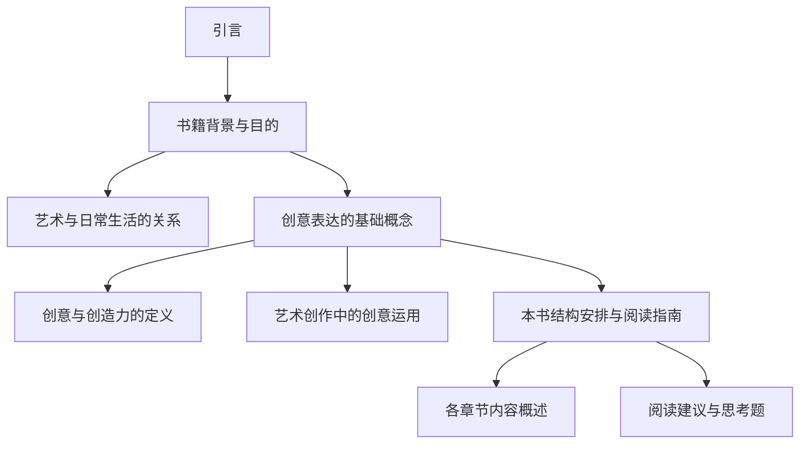
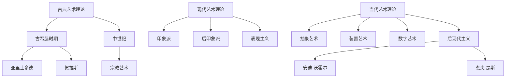

                 

### 第一部分：引言

#### 1.1 书籍背景与目的

《将日常转化为艺术：平凡中的创意表达》旨在探讨如何在日常生活中发现和创造美。在现代社会中，人们常常被日常琐事所淹没，忙碌的生活节奏让人无暇顾及生活中的美好。然而，艺术不仅仅是高雅的享受，它也可以是日常的一部分，是生活中的一种态度和方式。这本书的目的在于引导读者重新审视日常生活，发现其中的独特之美，并通过创意表达，将这些平凡转化为艺术。

##### 1.1.1 艺术与日常生活的关系

艺术与日常生活息息相关。艺术不仅存在于博物馆和画廊中，它也存在于我们的日常生活中。从日常生活中的琐事中寻找灵感，将普通的事物赋予独特的意义，这正是创意表达的魅力所在。艺术不是遥不可及的高雅活动，而是每个人都可以参与和实践的创造性活动。

##### 1.1.2 转化日常为艺术的价值

将日常转化为艺术具有重要的价值。首先，它能够提升生活的质量，让我们的生活更加有趣和丰富。其次，通过艺术创作，我们可以更好地表达自己的情感和思想，增强自我认知和自我表达的能力。此外，创意表达还能促进社会的创新和发展，为我们的生活带来新的可能性。

#### 1.2 创意表达的基础概念

创意表达是艺术创作的基础。它不仅仅是指艺术作品的表现形式，更是一种思维方式和方法。创意表达需要我们具备创造力和想象力，善于从日常生活中汲取灵感，并通过独特的视角和手法，将这些灵感转化为艺术作品。

##### 1.2.1 创意与创造力的定义

创意是指具有独创性和创新性的想法或解决方案。创造力则是指产生创意的能力。在艺术创作中，创意和创造力是至关重要的，它们决定了艺术作品的新颖性和独特性。

##### 1.2.2 艺术创作中的创意运用

在艺术创作中，创意的运用体现在多个方面。首先，创意可以体现在主题的选择上，艺术家可以通过独特的视角和思考，选择一个新颖的主题。其次，创意可以体现在形式和技巧的运用上，艺术家可以通过创新的形式和技巧，使作品更具吸引力和表现力。最后，创意还可以体现在作品的细节和表达上，艺术家可以通过细致的观察和独特的表达方式，使作品更加生动和感人。

#### 1.3 本书结构安排与阅读指南

本书共分为五个部分，分别探讨创意表达的理论基础、日常生活中的创意实践、创意表达的实践案例、创意表达的挑战与未来以及总结与反思。每个部分都包含具体的小节，详细讲解相关内容。

##### 1.3.1 各章节内容概述

- **第一部分：引言**：介绍书籍的背景和目的，探讨艺术与日常生活的关系，以及创意表达的基础概念。
- **第二部分：创意表达的理论基础**：分析艺术理论的发展历程，探讨创意表达的思维模式，以及创意表达的技法与应用。
- **第三部分：日常生活中的创意实践**：介绍自然界的灵感源泉，社会生活的创意转化，以及个人生活的创意表达。
- **第四部分：创意表达的实践案例**：分析视觉艺术实践案例、文字艺术实践案例和多媒体艺术实践案例。
- **第五部分：创意表达的挑战与未来**：探讨创意表达的挑战、未来趋势，并总结创意表达的价值和意义。

##### 1.3.2 阅读建议与思考题

为了更好地理解书中的内容，建议读者在阅读过程中积极参与思考和讨论。可以尝试以下思考题：

- 你如何理解艺术与日常生活的关系？
- 你在日常生活中有哪些创意表达的经历？
- 你认为创意表达对个人的成长和社会的发展有何价值？
- 你如何看待创意表达的挑战和未来趋势？

通过思考和讨论，我们可以更深入地理解创意表达的概念和意义，从而更好地运用创意表达来提升自己的生活品质和创造力。

---



---

#### 1.2 创意表达的基础概念

创意表达是艺术创作的基础，它不仅仅是指艺术作品的表现形式，更是一种思维方式和方法。在艺术创作中，创意表达是艺术家运用其独特的视角、技巧和情感，将日常生活中的普通事物赋予独特意义，从而创造出新颖且具有感染力的艺术作品。

##### 1.2.1 创意与创造力的定义

创意（Creativity）通常指的是产生新颖且有价值的想法、解决方案或作品的能力。它是一种思维过程，涉及对现有知识和经验的新组合，从而创造出未曾见过或未曾思考过的内容。创造力（Creativity）则是实现创意的能力，是个人或团队在特定领域内通过创新思维和创造性活动产生新概念、新设计或新方法的能力。

在艺术创作中，创意和创造力是相辅相成的。创意是起点，是艺术家思考的火花；创造力则是将这些火花付诸实践，通过技术和技巧将其转化为具体的艺术形式。

##### 1.2.2 艺术创作中的创意运用

在艺术创作中，创意的运用体现在多个方面：

1. **主题选择**：艺术家常常通过独特的视角和思考，选择一个新颖、引人入胜的主题。例如，著名画家毕加索通过抽象的方式，将平凡的日常场景转化为充满创意的艺术作品。

2. **形式与技巧**：艺术家通过创新的形式和技巧，使作品更具吸引力和表现力。例如，现代派艺术家通过使用夸张、抽象和变形的手法，打破了传统艺术的束缚，创造出独特的视觉体验。

3. **细节与表达**：艺术家通过细致的观察和独特的表达方式，赋予作品更深层次的意义。例如，文学作家通过精妙的文字描述，将人物的情感和内心世界展现得淋漓尽致。

以下是一个简单的创意表达算法，用于解释创意在艺术创作中的应用：

```python
def creative_expression(theme, form, technique):
    # 主题输入
    # 形式输入
    # 技巧输入
    
    # 创意表达流程
    artwork = apply_theme(theme)
    artwork = apply_form(form)
    artwork = apply_technique(technique)
    
    return artwork
```

**算法详解**：

1. **apply_theme(theme)**：选择并确定艺术作品的主题。主题是艺术创作的核心，决定了作品的内涵和方向。
   
2. **apply_form(form)**：运用创新的形式，如抽象、具象、立体等，将主题表达出来。形式的选择取决于艺术家的创意和目标。

3. **apply_technique(technique)**：使用特定的技巧和手法，如色彩、线条、材质等，增强作品的表现力和感染力。技巧的运用是艺术家创意表达的关键。

**数学模型与公式**：

创意表达可以通过以下数学模型来描述：

$$
\text{创意表达} = f(\text{主题}, \text{形式}, \text{技巧})
$$

其中，`f` 代表创意表达函数，`主题`、`形式`和`技巧`分别代表艺术创作的三个关键要素。

**举例说明**：

假设一位画家想要创作一幅以“自然”为主题的艺术作品。他可以选择抽象的形式，通过自由涂抹和色彩搭配，表现出自然的自由和活力。他还可以运用水彩和油画结合的技巧，使得作品更加生动和具有层次感。

通过以上算法和模型，我们可以看到创意表达在艺术创作中的重要性。创意不仅是一种思维方式，更是一种能够激发艺术灵感、提升艺术作品价值的关键因素。

---

在本文的第一部分中，我们首先介绍了书籍《将日常转化为艺术：平凡中的创意表达》的背景和目的，探讨了艺术与日常生活的密切关系，并介绍了创意表达的基础概念。通过定义创意与创造力，并分析其在艺术创作中的运用，我们为进一步探讨创意表达的理论基础和实际应用奠定了基础。

在接下来的部分中，我们将深入探讨创意表达的理论基础，包括艺术理论的发展历程、创意表达的思维模式以及创意表达的技法与应用。通过这些探讨，我们将对创意表达有一个更加全面和深入的理解。

---

#### 2.1 艺术理论的发展历程

艺术理论的发展历程悠久且复杂，从古代到现代，再到当代，每个阶段都有其独特的特点和贡献。理解艺术理论的发展历程，有助于我们更好地把握创意表达的内涵和本质。

##### 2.1.1 古典艺术理论

古典艺术理论起源于古希腊时期，强调艺术的形式美和和谐美。亚里士多德在其著作《诗学》中提出了“模仿论”，认为艺术是对现实的模仿，同时强调艺术的道德和教化功能。古罗马时期，贺拉斯进一步发展了这一理论，提出了“寓教于乐”的观点。

在中世纪，艺术理论主要集中在宗教艺术的创作和功能上。艺术被视为传达宗教信仰和神学教义的工具。这一时期的艺术理论强调艺术的宗教性和神圣性。

##### 2.1.2 现代艺术理论

现代艺术理论起源于19世纪末至20世纪初，这一时期艺术开始摆脱传统的束缚，追求自由和个性化。印象派、后印象派、表现主义等流派相继出现，挑战了传统艺术的形式和内容。

印象派艺术家如莫奈和雷诺阿，强调光与色的变化，通过捕捉瞬间的光影效果，表现自然界的真实感受。后印象派艺术家如梵高和高更，则更加注重个人情感和内心世界的表达，强调色彩和线条的表现力。

表现主义艺术家如蒙克和基尔洪，通过夸张和变形的手法，表现对现实的强烈感受和内心痛苦。现代艺术理论的兴起，标志着艺术创作从模仿自然转向表现自我。

##### 2.1.3 当代艺术理论

当代艺术理论更加多元和开放，涵盖了各种新的艺术形式和观念。从抽象艺术、装置艺术到数字艺术，当代艺术家不断探索新的表达方式和艺术语言。

后现代主义是当代艺术理论的重要思潮，强调多元性、相对性和开放性。后现代艺术家如安迪·沃霍尔和杰夫·昆斯，通过复制和商业化手段，挑战了传统艺术的权威性和独特性。

此外，当代艺术理论还关注社会、政治和文化议题，艺术成为表达社会批判和反思的工具。社会雕塑、行为艺术和装置艺术等形式的兴起，反映了艺术家对社会现实的关注和批判。

**Mermaid 流程图**：



通过以上对艺术理论发展历程的梳理，我们可以看到艺术理论在历史演变中的多样性和复杂性。从古典时期的模仿和教化，到现代时期的表现和自由，再到当代的多元和反思，艺术理论不断发展和丰富，为创意表达提供了丰富的理论基础和实践指导。

在接下来的章节中，我们将进一步探讨创意表达的思维模式和技法与应用，深入理解创意表达的核心要素和实践方法。

---

#### 2.2 创意表达的思维模式

创意表达不仅仅是技术层面的运用，更是一种思维模式的体现。在艺术创作中，思维模式直接影响着创意的产生和表达。以下是三种常见的创意表达思维模式：变形思维、联想思维和集合思维。

##### 2.2.1 变形思维

变形思维（Metamorphic Thinking）是指通过改变事物的形态、结构或功能，从而创造出新的概念或作品。这种思维模式强调对已有事物的重新解读和重构，赋予其新的生命和意义。

在艺术创作中，变形思维可以通过以下方式实现：

1. **形态变形**：艺术家可以通过夸张、简化、拉伸或扭曲等手法，改变物体的形态，创造出独特的视觉效果。例如，毕加索的立体派作品通过打破传统的空间观念，将物体的不同面重叠在一起，形成了独特的视觉体验。

2. **结构变形**：艺术家可以通过重新构建物体的结构，改变其原有的功能或用途。例如，设计师可以将日常用品如椅子、桌子等进行结构上的改造，创造出新的功能和形式。

3. **功能变形**：艺术家可以通过重新定义物体的功能，赋予其新的用途。例如，艺术家可以将废旧的物品如轮胎、瓶子等进行创意改造，使其成为具有艺术价值的新作品。

以下是一个简单的变形思维算法：

```python
def metamorphic_thinking(object, transformation):
    # 物体输入
    # 变形方式输入
    
    new_object = transform_object(object, transformation)
    
    return new_object
```

**算法详解**：

1. **transform_object(object, transformation)**：根据输入的变形方式，对物体进行形态、结构或功能的改变。例如，可以通过拉伸、扭曲或重新排列等方式，实现物体的变形。

##### 2.2.2 联想思维

联想思维（Associative Thinking）是指通过事物之间的联系，产生新的想法或创意。这种思维模式强调思维的灵活性和多样性，通过不同事物之间的相互关联，激发创意的火花。

在艺术创作中，联想思维可以通过以下方式实现：

1. **视觉联想**：艺术家可以通过观察不同事物之间的视觉联系，产生创意。例如，看到一种颜色可能会联想到与之相关的情感或记忆，从而激发创作的灵感。

2. **听觉联想**：艺术家可以通过音乐、声音等听觉刺激，引发创意的产生。例如，一段旋律可能会启发艺术家创作一幅与之相呼应的画作。

3. **文字联想**：艺术家可以通过阅读文字，触发相关的联想和思考。例如，一句话或一个词可能会激发艺术家创作一个与之相关的艺术作品。

以下是一个简单的联想思维算法：

```python
def associative_thinking(stimulus,联想链):
    # 刺激输入
    # 联想链输入
    
    ideas = generate_ideas(stimulus, 联想链)
    
    return ideas
```

**算法详解**：

1. **generate_ideas(stimulus, 联想链)**：根据输入的刺激和联想链，产生一系列新的想法或创意。例如，可以通过扩展联想链中的每一个节点，生成多个相关的创意。

##### 2.2.3 集合思维

集合思维（Collective Thinking）是指通过多人合作，共同探讨和创造出新的创意。这种思维模式强调团队合作和集体智慧，通过不同个体之间的交流和碰撞，激发创意的产生。

在艺术创作中，集合思维可以通过以下方式实现：

1. **头脑风暴**：艺术家和团队成员通过自由讨论和快速记录，共同探讨和提出创意。头脑风暴的过程中，鼓励大胆的想法和自由的表达，从而产生丰富的创意。

2. **角色扮演**：艺术家可以通过角色扮演，从不同角度和视角思考问题，激发新的创意。例如，设计师可以通过扮演用户角色，思考用户的需求和体验，从而创造出更加符合用户需求的艺术作品。

3. **跨学科合作**：艺术家可以与其他领域的专业人士合作，如设计师、工程师、社会学家等，通过跨学科的知识和视角，创造出独特的艺术作品。

以下是一个简单的集合思维算法：

```python
def collective_thinking(team_members, problem):
    # 团队成员输入
    # 问题输入
    
    ideas = brainstorming(team_members, problem)
    refined_ideas = refine_ideas(ideas)
    
    return refined_ideas
```

**算法详解**：

1. **brainstorming(team_members, problem)**：组织团队成员进行头脑风暴，共同探讨和提出创意。

2. **refine_ideas(ideas)**：对头脑风暴产生的创意进行筛选和优化，形成最终可行的创意方案。

通过变形思维、联想思维和集合思维的运用，艺术家可以在创作过程中不断激发创意，创造出独特且具有影响力的艺术作品。

在接下来的章节中，我们将探讨创意表达的技法与应用，深入探讨视觉艺术、文字艺术和多媒体艺术中的创意表达技巧，进一步丰富创意表达的理论和实践。

---

#### 2.3 创意表达的技法与应用

创意表达的技法是艺术创作过程中的关键环节，它决定了艺术作品的形式和内容。以下我们将探讨三种主要的创意表达技法：视觉艺术中的创意表达、文字艺术中的创意表达以及多媒体艺术中的创意表达。

##### 2.3.1 视觉艺术中的创意表达

视觉艺术是艺术表达的重要形式之一，它通过色彩、线条、形状和空间等元素，传达艺术家内心的情感和思想。以下是一些视觉艺术中的创意表达技法：

1. **抽象表现**：抽象表现是一种将现实世界的具体形象进行抽象化处理的艺术形式。艺术家通过简化、变形和色彩运用，将现实中的复杂细节剔除，强调艺术的情感和形式美。例如，蒙德里安的《纽约市》通过几何图形和色彩对比，表现出现代都市的节奏和动感。

2. **装置艺术**：装置艺术是一种通过综合材料、空间和环境来创作的一种艺术形式。艺术家利用各种材料，如金属、木头、塑料等，创造出具有互动性和综合性的艺术作品。例如，草间弥生的《无限镜屋》通过镜子和花卉图案的重复使用，营造出一种无限的视觉体验。

3. **数字艺术**：数字艺术利用计算机技术和数字媒体进行创作，它融合了传统艺术和现代科技的元素。例如，数字画家可以通过数字工具，创造出具有复杂细节和动态效果的画作。

以下是一个视觉艺术创意表达算法：

```python
def visual_art_expression(theme, medium, technique):
    # 主题输入
    # 媒介输入
    # 技法输入
    
    artwork = apply_theme(theme)
    artwork = apply_medium(medium)
    artwork = apply_technique(technique)
    
    return artwork
```

**算法详解**：

1. **apply_theme(theme)**：根据主题选择适当的视觉元素，如色彩、形状和线条等，构建艺术作品的框架。

2. **apply_medium(medium)**：选择适当的媒介，如画布、纸张、数字屏幕等，进行艺术创作的实际操作。

3. **apply_technique(technique)**：运用特定的技法，如抽象表现、装置艺术或数字艺术，增强艺术作品的表现力和感染力。

##### 2.3.2 文字艺术中的创意表达

文字艺术通过文字的排列和组合，传达艺术家的思想和情感。以下是一些文字艺术中的创意表达技法：

1. **书法艺术**：书法艺术通过毛笔、钢笔等工具，以文字为载体，表现艺术家的情感和审美。例如，中国书法通过不同的笔画和结构，表现出不同的情感和意境。

2. **诗歌创作**：诗歌创作是一种通过语言文字表达情感和思想的艺术形式。诗人通过精炼的文字和独特的表达方式，创造出富有诗意和想象力的作品。例如，杜甫的《登高》通过简洁而深刻的语言，表达了诗人对人生的感慨。

3. **概念艺术**：概念艺术强调艺术作品的思想性和概念性，而不是外在的形式美。艺术家通过文字或符号，传达深刻的思想和观念。例如，约翰·凯奇的作品《4分33秒》，通过文字和时间的结合，探讨了音乐与观众的关系。

以下是一个文字艺术创意表达算法：

```python
def textual_art_expression(concept, language, structure):
    # 概念输入
    # 语言输入
    # 结构输入
    
    text = formulate_concept(concept, language)
    text = structure_text(structure)
    
    return text
```

**算法详解**：

1. **formulate_concept(concept, language)**：根据概念和语言，构建艺术作品的文字内容。

2. **structure_text(structure)**：根据结构要求，对文字进行排列和组合，增强艺术作品的感染力和表现力。

##### 2.3.3 多媒体艺术中的创意表达

多媒体艺术通过结合多种媒介和形式，创造出丰富多样的艺术体验。以下是一些多媒体艺术中的创意表达技法：

1. **互动艺术**：互动艺术强调观众与艺术作品之间的互动，通过计算机技术和传感器，实现艺术的互动性和参与性。例如，艺术家可以通过编程，创造一个观众可以控制的虚拟世界。

2. **数字动画**：数字动画通过计算机生成，创造出连续的视觉画面。艺术家可以通过动画技术，表现出丰富的情感和故事情节。例如，迪士尼的动画电影《冰雪奇缘》通过精彩的动画效果，讲述了一个动人的故事。

3. **虚拟现实**：虚拟现实通过计算机模拟，创造出逼真的三维虚拟世界。艺术家可以通过虚拟现实技术，创造出沉浸式的艺术体验。例如，VR艺术展可以让观众沉浸在艺术作品中，体验到独特的视觉和情感体验。

以下是一个多媒体艺术创意表达算法：

```python
def multimedia_art_expression(medium, technology, interaction):
    # 媒介输入
    # 技术输入
    # 交互输入
    
    artwork = integrate_medium(medium)
    artwork = apply_technology(technology)
    artwork = enable_interaction(interaction)
    
    return artwork
```

**算法详解**：

1. **integrate_medium(medium)**：根据所选媒介，如视频、音频或图像，构建艺术作品的基础。

2. **apply_technology(technology)**：运用特定的技术，如计算机编程、虚拟现实或增强现实，增强艺术作品的互动性和表现力。

3. **enable_interaction(interaction)**：实现艺术作品的互动功能，让观众能够参与其中，体验艺术的独特魅力。

通过视觉艺术、文字艺术和多媒体艺术的创意表达技法，艺术家可以突破传统的创作限制，创造出丰富多样的艺术作品。这些技法不仅丰富了艺术的表现形式，也为观众带来了全新的艺术体验。

在接下来的章节中，我们将探讨日常生活中的创意实践，从自然界的灵感源泉、社会生活的创意转化到个人生活的创意表达，进一步展示创意如何融入日常生活，提升生活品质。

---

### 第三部分：日常生活中的创意实践

在日常生活中，创意不仅是一种艺术创作的手段，更是提升生活品质、激发生活热情的重要工具。通过将创意融入日常生活，我们可以发现和创造更多的美，使生活充满无限可能。本部分将探讨自然界的灵感源泉、社会生活的创意转化以及个人生活的创意表达。

#### 3.1 自然界的灵感源泉

自然界是艺术家们取之不尽的灵感源泉。从山水景观到植物与动物，大自然提供了丰富的视觉和情感素材，为创意表达提供了源源不断的灵感。

##### 3.1.1 自然景观的艺术转化

自然景观可以通过多种艺术形式进行转化，如绘画、摄影和雕塑等。艺术家通过捕捉自然景观的瞬间之美，将其转化为具有表现力和感染力的艺术作品。

1. **绘画**：风景画家通过细腻的笔触和色彩，将自然景观的壮丽和细腻表达得淋漓尽致。例如，荷兰画家约翰·范德韦登的《阿尔卑斯山》系列画作，通过浓烈的色彩和透视技法，展现了阿尔卑斯山的雄伟和神秘。

2. **摄影**：摄影艺术家通过镜头捕捉自然景观的瞬间，创造出独特的视觉体验。例如，摄影师安塞尔·亚当斯以其精湛的摄影技术和对光影的深刻理解，拍摄出了许多经典的自然景观照片。

3. **雕塑**：雕塑家通过雕塑形式，将自然景观中的形态和线条表现出来。例如，亨利·摩尔的《国王和王后》系列雕塑，以抽象的形式，表现了自然景观中的人性化元素。

##### 3.1.2 植物与动物的艺术创意

植物与动物是自然界中不可或缺的一部分，它们为艺术创作提供了丰富的素材。艺术家通过观察和表现植物与动物，赋予其独特的艺术价值。

1. **植物创意**：植物艺术可以通过插花、植物绘画和植物雕塑等形式来表达。例如，日本花道通过简洁的线条和色彩，表现出植物的优美和和谐。

2. **动物创意**：动物艺术可以通过绘画、雕塑和装置艺术等形式来表达。例如，著名艺术家达利以超现实主义的手法，创作出了许多奇特的动物雕塑，如《大象》和《兔子》。

##### 3.1.3 天文现象的艺术表现

天文现象如星空、流星和日食等，为艺术家提供了无限的创作灵感。通过艺术表现，艺术家将天文现象的美感和神秘感传递给观众。

1. **星空绘画**：星空画家通过绘画，表现出星空的壮丽和神秘。例如，法国画家尼古拉·德·斯图尔特的星空画作，通过细腻的色彩和线条，展现了星空的无限魅力。

2. **流星摄影**：摄影艺术家通过捕捉流星划过夜空的瞬间，创造出独特的视觉体验。例如，摄影师斯蒂夫·考特曼拍摄的一系列流星照片，以其独特的构图和光影效果，吸引了无数观众。

#### 3.2 社会生活的创意转化

社会生活是艺术创作的另一大源泉。通过观察和体验社会生活，艺术家可以将社会现象和日常生活转化为具有创意的艺术作品。

##### 3.2.1 城市景观的艺术创作

城市景观是现代社会的重要组成部分，艺术家可以通过绘画、摄影和雕塑等形式，表现城市生活的繁华和多样性。

1. **城市绘画**：城市画家通过细腻的笔触和色彩，表现城市建筑的线条和光影效果。例如，法国画家皮埃尔·奥古斯特·雷诺阿的《舞会》系列画作，通过明亮的色彩和生动的构图，展现了巴黎城市生活的热闹和活力。

2. **城市摄影**：城市摄影师通过镜头捕捉城市生活的瞬间，创造出独特的视觉体验。例如，摄影师亨利·卡蒂埃-布列松以其精湛的抓拍技巧，捕捉了许多生动的城市瞬间。

3. **城市雕塑**：城市雕塑家通过雕塑形式，将城市生活的元素融入作品中。例如，法国雕塑家奥古斯特·罗丹的《巴尔扎克》雕塑，以其逼真的形象和深刻的内涵，成为城市雕塑的代表作之一。

##### 3.2.2 社交互动中的创意表达

社交互动是现代社会的重要组成部分，艺术家可以通过创意表达，增强社交互动的乐趣和意义。

1. **社交绘画**：社交绘画是一种通过集体创作，增强社交互动的艺术形式。例如，街头壁画通过社区成员的参与，创造出独特的社区文化和艺术氛围。

2. **社交媒体艺术**：随着社交媒体的普及，艺术家通过社交媒体平台，分享和传播自己的艺术作品。例如，Instagram上的艺术博主通过分享自己的创作过程和作品，吸引了大量关注者。

3. **社交表演**：社交表演是一种通过表演艺术，增强社交互动的艺术形式。例如，街头表演通过独特的表演形式，吸引了大量观众的参与和互动。

##### 3.2.3 文化遗产的保护与艺术创新

文化遗产是历史和文化的见证，艺术家可以通过创意表达，保护和传承文化遗产，同时进行艺术创新。

1. **文化遗产绘画**：艺术家通过绘画形式，表现文化遗产的美丽和历史价值。例如，意大利画家卡拉瓦乔的《圣马太的见证》系列画作，通过生动的描绘，展现了文艺复兴时期的文化遗产。

2. **文化遗产雕塑**：雕塑家通过雕塑形式，将文化遗产的元素融入作品中。例如，法国雕塑家奥古斯特·罗丹的《地狱之门》雕塑，以其丰富的细节和深刻的内涵，展现了文化遗产的魅力。

3. **文化遗产装置艺术**：艺术家通过装置艺术形式，创造性地表现文化遗产，同时进行艺术创新。例如，日本艺术家草间弥生的《无限镜屋》装置艺术，以独特的视觉体验，展现了文化遗产的现代性。

#### 3.3 个人生活的创意表达

个人生活是艺术家创作的源泉，通过创意表达，艺术家可以提升个人生活的品质和幸福感。

##### 3.3.1 生活细节的艺术化

生活细节的艺术化是将日常生活中的琐事赋予艺术价值，通过创意表达，提升生活的品质。例如，艺术家可以通过绘画、摄影或手工制作，将日常生活中的美好瞬间记录下来，创造出独特的艺术作品。

1. **家庭照片的艺术化**：家庭照片是记录家庭生活的宝贵记忆。通过创意处理，如黑白摄影、艺术滤镜或手绘画作，可以赋予照片新的艺术感和故事性。

2. **家居装饰的艺术化**：家居装饰可以通过创意设计，提升家居的生活品质。例如，通过独特的墙面绘画、手工饰品或装饰艺术品，可以使家居环境更加温馨和有个性。

3. **手工艺品的艺术化**：手工艺品如编织、陶艺或木工，可以通过创意设计，创作出独特的艺术作品。这些作品不仅具有实用性，更具有艺术价值和装饰性。

##### 3.3.2 家居装饰的创意设计

家居装饰的创意设计是提升生活品质的重要手段。通过创意设计，家居环境可以更加舒适、美观和有个性。

1. **色彩搭配**：色彩搭配是家居装饰的重要元素。通过合理运用色彩，可以营造温馨、舒适的生活氛围。例如，选择柔和的色调，如米色、蓝色或绿色，可以营造出宁静的家居环境。

2. **家具布置**：家具布置是家居装饰的关键。通过合理的家具布局，可以优化空间利用，提升家居的功能性。例如，通过增加书架或工作台，可以创造出多功能的生活空间。

3. **装饰品选择**：装饰品的选择是家居装饰的重要环节。通过选择有创意的装饰品，如独特的花瓶、画作或雕塑，可以提升家居的艺术感和个性化。

##### 3.3.3 服饰搭配的艺术思维

服饰搭配的艺术思维是提升个人形象和生活品质的重要手段。通过合理的服饰搭配，可以展现个人的风格和品味。

1. **色彩搭配**：色彩搭配是服饰搭配的关键。通过合理运用色彩，可以创造出和谐、统一的视觉效果。例如，选择互补色搭配，如红色和绿色，可以提升服饰的醒目度。

2. **图案搭配**：图案搭配可以增强服饰的层次感和视觉吸引力。通过选择不同图案的搭配，如条纹和花纹，可以创造出丰富的视觉效果。

3. **层次搭配**：层次搭配是提升服饰层次感的重要手段。通过增加服饰的层次，如搭配围巾、披肩或外套，可以增强服饰的时尚感和保暖性。

通过自然界的灵感源泉、社会生活的创意转化和个人生活的创意表达，艺术家可以将创意融入日常生活，提升生活品质，创造更多的美好。

在接下来的章节中，我们将通过具体的实践案例，进一步展示创意表达的实践方法和技巧，为读者提供更多的启示和借鉴。

---

#### 3.3 个人生活的创意表达

在个人生活中，创意表达不仅能够提升生活的品质，还能带来无限的乐趣和满足感。以下将从生活细节的艺术化、家居装饰的创意设计和服饰搭配的艺术思维三个方面，探讨如何将创意融入个人生活，创造独特而富有个性化的生活体验。

##### 3.3.1 生活细节的艺术化

将日常生活中的琐事赋予艺术价值，可以通过以下几种方式实现：

1. **摄影**：利用摄影技术，记录生活中的美好瞬间。可以通过艺术滤镜、后期处理等手段，将普通照片转化为艺术作品。例如，利用黑白摄影来捕捉时光的静谧，或者通过拍摄动态的瞬间，展现生活的活力。

2. **手工艺品**：手工制作如编织、陶艺和木工等，可以将日常用品变成艺术品。例如，制作一个手工编织的篮子，不仅实用，还展现了手工艺术的独特魅力。

3. **绘画**：通过绘画，可以将日常生活场景转化为艺术作品。例如，在家中的一面墙上绘制一幅风景画，为房间增添艺术氛围。

**实例**：一个爱茶的朋友，将泡茶的过程记录下来，通过摄影和绘画，将茶叶在水中的舞动、茶香四溢的瞬间转化为艺术作品，悬挂在家中，成为日常生活中的亮点。

##### 3.3.2 家居装饰的创意设计

家居装饰的创意设计，可以大大提升生活品质，营造舒适、温馨的居住环境。

1. **色彩搭配**：合理的色彩搭配，可以创造出和谐、舒适的空间氛围。例如，选择柔和的色调，如米色、蓝色或绿色，可以营造出宁静的家居环境；而大胆的颜色运用，如红色、橙色等，可以带来活力和热情。

2. **家具布局**：家具布局要考虑空间利用和功能分区。通过合理的布局，可以优化空间，提升家居的实用性。例如，在客厅设置一个阅读角，或者在工作区增加一个书架，都可以提高生活的便利性。

3. **装饰品选择**：装饰品的选择要注重与整体风格的协调，同时具有艺术性和个性化。例如，选择一幅独特的油画、一组精美的陶瓷饰品，都可以为家居环境增添艺术气息。

**实例**：一个现代风格的家，通过简约的家具和明亮的色彩搭配，营造出简洁、时尚的氛围。在客厅的一角，摆放了一个小型绿植盆栽，加上一盏艺术吊灯，为空间增添了一抹自然和温馨。

##### 3.3.3 服饰搭配的艺术思维

服饰搭配的艺术思维，可以提升个人的形象和气质，展现独特的个性。

1. **色彩搭配**：色彩搭配要考虑个人肤色和场合。例如，暖色调适合夜晚或正式场合，冷色调则适合白天或休闲场合。

2. **图案搭配**：图案搭配要注意与整体服饰的协调。例如，选择图案简洁的T恤搭配图案丰富的围巾，可以创造出层次感和视觉冲击力。

3. **层次搭配**：层次搭配可以通过增加服饰的层次感，提升整体造型的质感。例如，搭配一件长款外套，不仅可以保暖，还能为整体造型增添层次。

**实例**：一个时尚博主，通过巧妙地搭配色彩和图案，展现出了多样的风格。在一次休闲场合中，她选择了一件白色T恤搭配蓝色牛仔裤，再加上一件红色外套，色彩鲜明，展现了青春和活力。

通过生活细节的艺术化、家居装饰的创意设计和服饰搭配的艺术思维，我们可以将创意融入个人生活，提升生活的品质和幸福感。创意不仅是一种艺术创作的手段，更是一种生活态度和方式。在日常生活中，只要我们用心去观察、去思考、去创造，就能发现生活中的美好，并将之转化为独特的艺术体验。

在接下来的章节中，我们将通过具体的实践案例，进一步展示创意表达的实践方法和技巧，为读者提供更多的启示和借鉴。

---

### 第四部分：创意表达的实践案例

在创意表达的实际操作中，通过具体的案例可以更好地理解创意表达的实践方法和技巧。以下我们将从视觉艺术实践案例、文字艺术实践案例和多媒体艺术实践案例三个方面，详细探讨创意表达的实践过程。

#### 4.1 视觉艺术实践案例

视觉艺术是创意表达的重要形式，通过绘画、摄影和数字艺术等手段，艺术家可以传达独特的情感和思想。

##### 4.1.1 摄影作品创意表达

摄影作为一种视觉艺术，通过镜头捕捉生活中的美好瞬间，将现实转化为艺术。以下是一个摄影作品的创意表达实例：

**案例**：摄影师张三在一天傍晚拍摄了一组城市风光照片。在后期处理中，他利用色彩校正和图像增强技术，将原本暗淡的画面调整为明亮且富有层次感。此外，他还通过剪裁和合成，将不同场景的元素融合在一起，创造出一幅独特的城市夜景作品。

**实践步骤**：
1. **前期拍摄**：选择合适的场景和时间，捕捉到具有创意的素材。
2. **后期处理**：利用图像处理软件（如Photoshop）进行色彩校正、剪裁和合成，增强画面的视觉效果。
3. **创意构思**：构思作品的创意主题和表达方式，通过技术手段实现创意。

##### 4.1.2 绘画作品创意表达

绘画是一种传统的艺术形式，通过笔触、色彩和线条表达艺术家的创意和情感。以下是一个绘画作品的创意表达实例：

**案例**：艺术家李四在一次自然景观写生中，发现了一片色彩斑斓的草地。他决定通过抽象的方式，将这片草地转化为艺术作品。在创作过程中，他运用了大胆的色彩和夸张的线条，将自然的美丽和动感表现出来。

**实践步骤**：
1. **主题构思**：确定作品的创意主题，如自然景观、人物肖像等。
2. **素材收集**：通过观察、摄影或写生等方式，收集创作所需的素材。
3. **绘画创作**：运用绘画技巧，将创意和素材转化为具体的艺术作品。

##### 4.1.3 印刷艺术创意表达

印刷艺术是一种将视觉艺术作品通过印刷技术复制和传播的方式。以下是一个印刷艺术创意表达实例：

**案例**：设计师王五为一家咖啡店设计了一系列海报和名片。他利用现代印刷技术，将咖啡的香气和味道通过图像和色彩表达出来。例如，他在海报上使用了香味油墨，使得观众在观看海报时，仿佛能闻到咖啡的香气。

**实践步骤**：
1. **创意构思**：根据客户需求，构思创意主题和表现形式。
2. **设计制作**：利用印刷设计软件（如Illustrator或Photoshop），制作出创意设计稿。
3. **印刷复制**：选择合适的印刷厂和印刷技术，将设计稿转化为实物。

#### 4.2 文字艺术实践案例

文字艺术通过文字的排列和组合，传达艺术家的思想和情感。以下是一些文字艺术的创意表达实例：

##### 4.2.1 书写艺术创意表达

书写艺术强调文字的美感和形式美，通过不同的书写方式和字体设计，传达独特的艺术魅力。

**案例**：书法艺术家赵六通过毛笔书写了一幅《庐山谣》书法作品。他运用了不同的笔画和字体，使得书法作品不仅具有文字的内容，还具有视觉的艺术性。

**实践步骤**：
1. **主题确定**：确定书写作品的创意主题，如诗歌、散文等。
2. **材料选择**：选择适合书写艺术的材料，如纸张、墨水等。
3. **书写创作**：运用书写技巧，创作出富有创意的书法作品。

##### 4.2.2 网络文学创意表达

网络文学通过互联网平台传播，具有广泛的影响力和创新性。以下是一个网络文学创意表达实例：

**案例**：网络作家钱七创作了一部科幻小说《星际穿越者》。他通过独特的叙事方式和丰富的想象力，将读者带入一个充满奇幻和未知的星际世界。

**实践步骤**：
1. **题材选择**：选择具有创意性的题材，如科幻、奇幻等。
2. **故事构思**：构思富有创意和引人入胜的故事情节。
3. **文字创作**：通过文字表达，将创意和故事情节转化为具体的小说。

##### 4.2.3 广告文案创意表达

广告文案是商业创意表达的重要形式，通过简洁而有力的语言，传达产品的特点和品牌理念。

**案例**：广告创意师孙八为一家科技公司创作了一则广告文案，标题为“超越边界，探索无限”。文案通过富有创意的语言，强调了产品的创新性和未来感。

**实践步骤**：
1. **品牌理解**：深入理解品牌的特点和理念。
2. **创意构思**：构思富有创意的文案主题和表达方式。
3. **文字创作**：通过精炼的语言，将创意和品牌理念转化为文案。

#### 4.3 多媒体艺术实践案例

多媒体艺术结合了多种艺术形式，通过视觉、听觉和互动性，创造出丰富的艺术体验。

##### 4.3.1 影视作品创意表达

影视作品通过视听手段，传达复杂的故事情节和深刻的主题。

**案例**：导演周九执导了一部科幻电影《时空漫游》。他通过创新的叙事手法和视觉特效，将观众带入一个充满奇幻和未知的宇宙世界。

**实践步骤**：
1. **故事构思**：构思富有创意和吸引力的故事情节。
2. **剧本创作**：通过剧本，将创意转化为具体的剧情和对话。
3. **拍摄制作**：通过拍摄和后期制作，实现创意的表达。

##### 4.3.2 游戏设计创意表达

游戏设计通过交互性，创造独特的游戏体验。

**案例**：游戏设计师吴十设计了一款角色扮演游戏《梦幻仙境》。他通过独特的游戏机制和视觉设计，让玩家在游戏中体验到梦幻般的世界。

**实践步骤**：
1. **游戏构思**：构思游戏的主题、故事和机制。
2. **设计制作**：通过游戏设计软件，设计游戏角色、场景和界面。
3. **测试优化**：通过玩家反馈，优化游戏体验。

##### 4.3.3 数字媒体艺术创意表达

数字媒体艺术通过数字技术，创造出独特的艺术作品和互动体验。

**案例**：数字艺术家陈十一创作了一组数字艺术作品，名为“数字梦境”。她通过计算机程序和数字技术，将梦幻般的画面和音乐相结合，创造出独特的艺术体验。

**实践步骤**：
1. **创意构思**：构思数字艺术的主题和表现形式。
2. **技术实现**：利用计算机编程和数字设计软件，实现创意的表达。
3. **互动设计**：设计用户与艺术作品的互动方式，增强艺术体验。

通过以上实践案例，我们可以看到创意表达在视觉艺术、文字艺术和多媒体艺术中的应用和实现过程。这些案例不仅展示了创意表达的多样性和可能性，也为读者提供了实际的参考和启发。在接下来的部分，我们将探讨创意表达的挑战与未来，深入分析创意表达在现代社会中的发展和趋势。

---

### 第四部分：创意表达的实践案例

在创意表达的实际操作中，通过具体的案例可以更好地理解创意表达的实践方法和技巧。以下我们将从视觉艺术实践案例、文字艺术实践案例和多媒体艺术实践案例三个方面，详细探讨创意表达的实践过程。

#### 4.1 视觉艺术实践案例

视觉艺术是创意表达的重要形式，通过绘画、摄影和数字艺术等手段，艺术家可以传达独特的情感和思想。

##### 4.1.1 摄影作品创意表达

摄影作为一种视觉艺术，通过镜头捕捉生活中的美好瞬间，将现实转化为艺术。以下是一个摄影作品的创意表达实例：

**案例**：摄影师张三在一天傍晚拍摄了一组城市风光照片。在后期处理中，他利用色彩校正和图像增强技术，将原本暗淡的画面调整为明亮且富有层次感。此外，他还通过剪裁和合成，将不同场景的元素融合在一起，创造出一幅独特的城市夜景作品。

**实践步骤**：
1. **前期拍摄**：选择合适的场景和时间，捕捉到具有创意的素材。
2. **后期处理**：利用图像处理软件（如Photoshop）进行色彩校正、剪裁和合成，增强画面的视觉效果。
3. **创意构思**：构思作品的创意主题和表达方式，通过技术手段实现创意。

##### 4.1.2 绘画作品创意表达

绘画是一种传统的艺术形式，通过笔触、色彩和线条表达艺术家的创意和情感。以下是一个绘画作品的创意表达实例：

**案例**：艺术家李四在一次自然景观写生中，发现了一片色彩斑斓的草地。他决定通过抽象的方式，将这片草地转化为艺术作品。在创作过程中，他运用了大胆的色彩和夸张的线条，将自然的美丽和动感表现出来。

**实践步骤**：
1. **主题构思**：确定作品的创意主题，如自然景观、人物肖像等。
2. **素材收集**：通过观察、摄影或写生等方式，收集创作所需的素材。
3. **绘画创作**：运用绘画技巧，将创意和素材转化为具体的艺术作品。

##### 4.1.3 印刷艺术创意表达

印刷艺术是一种将视觉艺术作品通过印刷技术复制和传播的方式。以下是一个印刷艺术创意表达实例：

**案例**：设计师王五为一家咖啡店设计了一系列海报和名片。他利用现代印刷技术，将咖啡的香气和味道通过图像和色彩表达出来。例如，他在海报上使用了香味油墨，使得观众在观看海报时，仿佛能闻到咖啡的香气。

**实践步骤**：
1. **创意构思**：根据客户需求，构思创意主题和表现形式。
2. **设计制作**：利用印刷设计软件（如Illustrator或Photoshop），制作出创意设计稿。
3. **印刷复制**：选择合适的印刷厂和印刷技术，将设计稿转化为实物。

#### 4.2 文字艺术实践案例

文字艺术通过文字的排列和组合，传达艺术家的思想和情感。以下是一些文字艺术的创意表达实例：

##### 4.2.1 书写艺术创意表达

书写艺术强调文字的美感和形式美，通过不同的书写方式和字体设计，传达独特的艺术魅力。

**案例**：书法艺术家赵六通过毛笔书写了一幅《庐山谣》书法作品。他运用了不同的笔画和字体，使得书法作品不仅具有文字的内容，还具有视觉的艺术性。

**实践步骤**：
1. **主题确定**：确定书写作品的创意主题，如诗歌、散文等。
2. **材料选择**：选择适合书写艺术的材料，如纸张、墨水等。
3. **书写创作**：运用书写技巧，创作出富有创意的书法作品。

##### 4.2.2 网络文学创意表达

网络文学通过互联网平台传播，具有广泛的影响力和创新性。以下是一个网络文学创意表达实例：

**案例**：网络作家钱七创作了一部科幻小说《星际穿越者》。他通过独特的叙事方式和丰富的想象力，将读者带入一个充满奇幻和未知的星际世界。

**实践步骤**：
1. **题材选择**：选择具有创意性的题材，如科幻、奇幻等。
2. **故事构思**：构思富有创意和引人入胜的故事情节。
3. **文字创作**：通过文字表达，将创意和故事情节转化为具体的小说。

##### 4.2.3 广告文案创意表达

广告文案是商业创意表达的重要形式，通过简洁而有力的语言，传达产品的特点和品牌理念。

**案例**：广告创意师孙八为一家科技公司创作了一则广告文案，标题为“超越边界，探索无限”。文案通过富有创意的语言，强调了产品的创新性和未来感。

**实践步骤**：
1. **品牌理解**：深入理解品牌的特点和理念。
2. **创意构思**：构思富有创意的文案主题和表达方式。
3. **文字创作**：通过精炼的语言，将创意和品牌理念转化为文案。

#### 4.3 多媒体艺术实践案例

多媒体艺术结合了多种艺术形式，通过视觉、听觉和互动性，创造出丰富的艺术体验。

##### 4.3.1 影视作品创意表达

影视作品通过视听手段，传达复杂的故事情节和深刻的主题。

**案例**：导演周九执导了一部科幻电影《时空漫游》。他通过创新的叙事手法和视觉特效，将观众带入一个充满奇幻和未知的宇宙世界。

**实践步骤**：
1. **故事构思**：构思富有创意和吸引力的故事情节。
2. **剧本创作**：通过剧本，将创意转化为具体的剧情和对话。
3. **拍摄制作**：通过拍摄和后期制作，实现创意的表达。

##### 4.3.2 游戏设计创意表达

游戏设计通过交互性，创造独特的游戏体验。

**案例**：游戏设计师吴十设计了一款角色扮演游戏《梦幻仙境》。他通过独特的游戏机制和视觉设计，让玩家在游戏中体验到梦幻般的世界。

**实践步骤**：
1. **游戏构思**：构思游戏的主题、故事和机制。
2. **设计制作**：通过游戏设计软件，设计游戏角色、场景和界面。
3. **测试优化**：通过玩家反馈，优化游戏体验。

##### 4.3.3 数字媒体艺术创意表达

数字媒体艺术通过数字技术，创造出独特的艺术作品和互动体验。

**案例**：数字艺术家陈十一创作了一组数字艺术作品，名为“数字梦境”。她通过计算机程序和数字技术，将梦幻般的画面和音乐相结合，创造出独特的艺术体验。

**实践步骤**：
1. **创意构思**：构思数字艺术的主题和表现形式。
2. **技术实现**：利用计算机编程和数字设计软件，实现创意的表达。
3. **互动设计**：设计用户与艺术作品的互动方式，增强艺术体验。

通过以上实践案例，我们可以看到创意表达在视觉艺术、文字艺术和多媒体艺术中的应用和实现过程。这些案例不仅展示了创意表达的多样性和可能性，也为读者提供了实际的参考和启发。在接下来的部分，我们将探讨创意表达的挑战与未来，深入分析创意表达在现代社会中的发展和趋势。

---

### 第五部分：创意表达的挑战与未来

在创意表达的过程中，尽管创意和艺术作品能够带来巨大的乐趣和成就感，但我们也需要面对一系列的挑战。同时，随着科技的不断进步，创意表达的未来也充满了无限的可能性。

#### 5.1 创意表达的挑战

1. **技术发展的挑战**

随着科技的飞速发展，各种新技术不断涌现，如人工智能、虚拟现实（VR）和增强现实（AR）等。这些新技术为创意表达提供了更多的工具和手段，但同时也带来了新的挑战。例如，人工智能算法可以生成大量的艺术作品，但这种作品的原创性和艺术价值如何评估？VR和AR技术可以创造出沉浸式的艺术体验，但如何确保这些体验符合艺术创作的基本原则？

2. **社会环境的挑战**

社会环境对创意表达有着重要的影响。在现代社会，竞争压力和商业化的影响使得艺术创作越来越商业化，艺术家的独立性和创造性受到了挑战。此外，社会对艺术作品的需求和审美也在不断变化，艺术家需要不断地适应和调整自己的创作方向，以满足市场的需求。

3. **个人能力的挑战**

创意表达不仅需要艺术天赋和技巧，还需要深厚的知识储备和持续的学习。在快速变化的科技和社会环境中，艺术家需要不断更新自己的知识和技能，以适应新的创作环境和需求。此外，个人心理素质和抗压能力也是影响创意表达的重要因素。

#### 5.2 创意表达的未来趋势

1. **新技术的应用前景**

随着新技术的不断发展，创意表达的未来将更加多元化。人工智能可以辅助艺术家进行创作，提供更多的创意灵感和技术支持。VR和AR技术将使艺术作品变得更加互动和沉浸，观众可以通过虚拟现实体验艺术作品，获得全新的艺术感受。

2. **跨界融合的创意表达**

未来，创意表达将越来越倾向于跨界融合。艺术家不再局限于单一的艺术形式，而是通过跨学科的合作，将不同领域的知识和创意融合在一起，创造出全新的艺术作品。例如，数字艺术与编程的结合、音乐与视觉艺术的结合等，都为艺术创作带来了新的可能性。

3. **社会创新与艺术发展**

艺术创作不仅是一种个人行为，也是一种社会行为。未来，艺术创作将更多地关注社会问题和公共议题，通过艺术的方式，提出问题、反思现实，并促进社会的进步和发展。社会创新与艺术发展的结合，将为社会带来更多的思考和启示。

#### 5.2.1 新技术的应用前景

随着人工智能、虚拟现实和增强现实等新技术的不断发展，创意表达将迎来新的变革。以下是一些新技术在创意表达中的应用前景：

1. **人工智能（AI）**

人工智能可以通过大数据分析和机器学习算法，帮助艺术家发现新的创作灵感和创意。例如，AI可以分析大量的艺术作品，提取出共性特征和趋势，为艺术家提供创作参考。此外，AI还可以生成艺术作品，如音乐、绘画和诗歌等，这些作品虽然可能缺乏人类的情感深度，但为艺术创作提供了新的视角和工具。

2. **虚拟现实（VR）**

虚拟现实技术可以为艺术家提供一个全新的创作空间，通过沉浸式的体验，艺术家可以更加直观地表达自己的想法和情感。例如，艺术家可以通过VR技术，创作出互动性强的艺术装置或虚拟艺术作品，观众可以在虚拟世界中与艺术作品互动，体验全新的艺术感受。

3. **增强现实（AR）**

增强现实技术可以将虚拟的艺术作品与现实世界相结合，创造出独特的艺术体验。例如，艺术家可以在现实场景中叠加虚拟的艺术作品，让观众在现实环境中体验艺术的魅力。此外，AR技术还可以用于艺术展览的导览和互动，为观众提供更加丰富和深入的艺术体验。

#### 5.2.2 跨界融合的创意表达

跨界融合的创意表达是未来艺术创作的重要趋势。以下是一些跨界融合的实例：

1. **数字艺术与编程**

数字艺术家与程序员合作，通过编程语言和算法，创造出独特的数字艺术作品。例如，程序员可以使用编程语言编写算法，生成动态的艺术图案或音乐。这种跨界合作不仅丰富了艺术创作的方法和手段，也促进了科技与艺术的融合。

2. **音乐与视觉艺术**

音乐与视觉艺术的跨界融合，创造出独特的视听体验。例如，音乐家可以通过创作音乐，为视觉艺术作品提供背景音乐，使观众在欣赏视觉艺术作品的同时，感受到音乐带来的情感和氛围。此外，视觉艺术家也可以通过视觉设计，为音乐会或音乐视频创作视觉效果，增强观众的艺术体验。

3. **文学与视觉艺术**

文学与视觉艺术的跨界融合，创造出具有多重解读的艺术作品。例如，作家可以通过文学作品，为视觉艺术作品提供故事背景和情感线索，视觉艺术家则可以通过绘画或雕塑，将文学作品中的情感和场景表现出来。这种跨界融合不仅丰富了艺术作品的内涵，也提升了观众的审美体验。

#### 5.2.3 社会创新与艺术发展

艺术创作不仅是艺术家的个人行为，也是一种社会行为。未来，艺术创作将更多地关注社会问题和公共议题，通过艺术的方式，提出问题、反思现实，并促进社会的进步和发展。以下是一些社会创新与艺术发展的实例：

1. **公共艺术项目**

公共艺术项目通过在公共场所设置艺术装置或创作公共艺术作品，引发公众对城市空间和社会问题的关注和思考。例如，艺术家可以在城市广场设置一个互动装置，鼓励市民参与艺术创作，通过公共艺术项目，增强社区的凝聚力和活力。

2. **社会议题艺术**

社会议题艺术通过艺术作品，探讨和反映社会问题，如种族平等、环境保护和人权等。例如，艺术家可以通过绘画、雕塑或表演艺术，表达对某一社会议题的看法和呼吁，引起公众的关注和思考，促进社会进步。

3. **科技与社会艺术**

科技与社会艺术的结合，探讨科技对社会的影响和挑战。例如，艺术家可以通过创作科技艺术作品，探讨人工智能、大数据和网络安全等科技议题，引发公众对科技发展的思考，并提出自己的观点和建议。

通过探讨创意表达的挑战与未来趋势，我们可以看到，尽管创意表达面临着各种挑战，但未来也充满了无限的可能性。在新技术和社会变革的推动下，创意表达将继续发展和创新，为我们的生活带来更多的美好和思考。

### 第六部分：总结与反思

在《将日常转化为艺术：平凡中的创意表达》一书中，我们探讨了创意表达的基础概念、理论基础、日常生活实践以及具体案例。通过这些内容，我们可以总结出以下几点重要启示：

#### 6.1 创意表达的总结

1. **艺术与生活的关系**：艺术不仅是高雅的享受，更是日常生活中的一部分。通过创意表达，我们可以发现和创造生活中的美好，提升生活品质。

2. **创意表达的要素**：创意表达需要具备艺术理论、思维模式和技术应用等多方面的知识和能力。变形思维、联想思维和集合思维是创意表达的重要思维模式。

3. **创意表达的技法**：视觉艺术、文字艺术和多媒体艺术是创意表达的三大主要形式。每种形式都有其独特的创意表达技法和实践方法。

4. **创意表达的实践**：通过具体的案例，我们可以看到创意表达在摄影、绘画、书写、数字艺术、网络文学、影视作品和游戏设计等方面的应用。这些实践案例为我们提供了丰富的经验和启示。

#### 6.1.1 成功案例的启示

成功案例展示了创意表达在不同领域的多样性和可能性。例如，摄影师通过后期处理创造出独特的视觉作品，艺术家通过抽象绘画表达内心情感，数字艺术家通过编程生成动态艺术作品等。这些案例告诉我们，创意表达没有固定的模式，每个人都可以通过自己的独特视角和技巧，创造出具有影响力的艺术作品。

#### 6.1.2 创意表达的价值

创意表达不仅具有艺术价值，还具有重要的社会和文化价值。通过创意表达，艺术家可以传达深刻的思想和情感，引发公众的思考和共鸣。此外，创意表达还可以促进社会创新和发展，为我们的生活带来新的可能性。

#### 6.1.3 未来发展的方向

随着科技的进步和社会变革，创意表达将继续发展和创新。未来，人工智能、虚拟现实和增强现实等新技术将为创意表达提供更多的工具和手段。跨界融合的创意表达和关注社会问题的艺术创作将成为创意表达的重要趋势。

#### 6.2 反思与建议

在面对创意表达的挑战时，我们需要保持开放的心态和持续的学习。以下是一些建议：

1. **持续学习**：创意表达是一个不断发展的领域，我们需要不断学习新的知识和技能，以适应不断变化的环境。

2. **跨界合作**：跨界合作可以激发创意，带来新的视角和灵感。艺术家可以尝试与其他领域的专业人士合作，共同创作具有创新性的作品。

3. **关注社会问题**：创意表达不仅是个人行为，也是一种社会行为。通过关注社会问题和公共议题，我们可以用艺术的方式提出问题、反思现实，并促进社会的进步。

4. **培养创造力**：创造力是创意表达的核心。我们需要通过不断的实践和思考，培养自己的创造力，使创意表达更加丰富和独特。

通过总结和反思，我们可以更好地理解创意表达的本质和价值，从而在日常生活中更加积极地运用创意，创造出独特的艺术作品，提升我们的生活品质。

### 附录A：创意表达资源推荐

为了帮助读者进一步探索创意表达的相关知识，以下是一些建议的书籍、网络资源以及创意表达工具。

#### A.1 书籍推荐

1. **《创意的诞生：从无到有的思考法则》** - 布鲁斯·汉考克
   本书详细介绍了创意诞生的过程，以及如何通过科学的思维方法激发创意。

2. **《创意的艺术：如何通过思维技巧激发创意》** - 亚历克斯·奥斯本
   这本书提出了多种思维技巧，帮助读者在日常生活和工作中激发创意。

3. **《艺术的力量：创意与创新的秘密》** - 丹尼尔·卡内曼
   本书探讨了创意与创新的关系，以及如何在艺术创作中实现创新。

#### A.2 网络资源

1. **Artists Network** - 一个面向艺术家的在线社区，提供艺术教程、灵感和讨论。

2. **Pinterest** - 一个流行的视觉社交平台，用户可以在这里发现各种创意艺术作品。

3. **Instructables** - 一个分享创意项目教程的网站，涵盖绘画、手工艺、电子工程等多个领域。

#### A.3 创意表达工具

1. **Adobe Creative Suite** - 包括Photoshop、Illustrator、Premiere Pro等，是专业创意表达的工具套件。

2. **Trello** - 一个项目管理工具，可以帮助艺术家和组织者管理创意项目和任务。

3. **Sketch** - 一个面向UI/UX设计的软件，适合设计师进行创意草图和原型设计。

通过以上书籍、网络资源和工具的推荐，读者可以进一步拓展自己的创意视野，提升创意表达的能力。创意是无处不在的，只要我们用心去发现和创造，平凡的生活就能变成一场美妙的艺术之旅。

