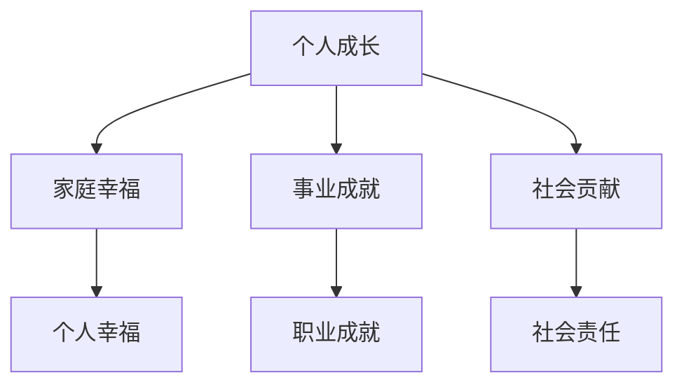
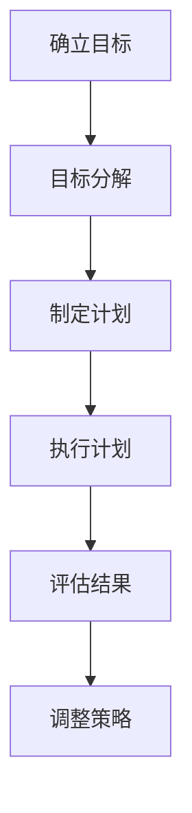
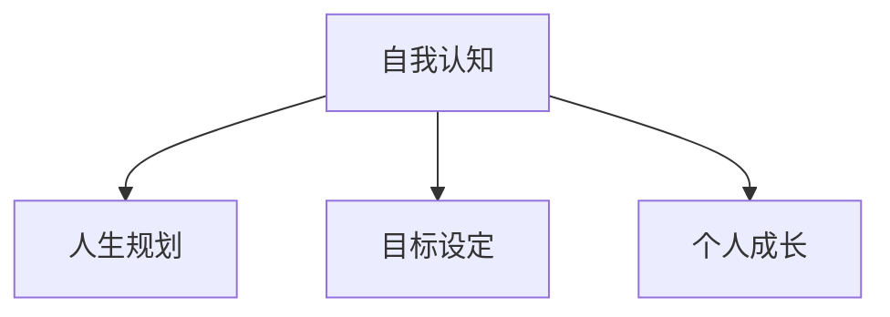
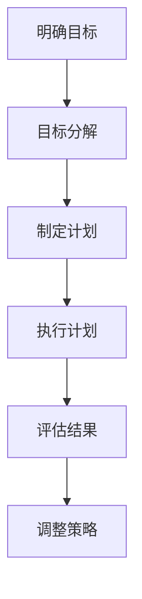

                 

- 文章标题：掌控人生方向：成为自己的生命舵手

> 关键词：人生规划、自我认知、目标设定、时间管理、情绪调节、人际关系、职业规划

> 摘要：
本文旨在帮助读者掌握人生的方向，成为自己的生命舵手。通过分析人生目标的重要性、自我认知与性格分析、时间管理与效率提升、情绪调节与心理健康、人际关系与社交技巧以及职业规划与成长，本文将引导读者逐步实现个人成长和人生目标。

----------------------------------------------------------------

### 第一部分：人生目标与自我认知

#### 第1章：人生目标的重要性

**1.1 人生的终极目标**

人生的终极目标是一个深奥且广泛的话题，涉及到个人价值观、人生观和世界观。对于每个人来说，终极目标可能有所不同，但总的来说，可以将其概括为以下几个方面：

- **个人成长**：不断学习、提升自己，成为更好的自己。
- **家庭幸福**：与家人和睦相处，共同创造美好的家庭生活。
- **事业成就**：在工作中取得成功，实现职业价值。
- **社会贡献**：通过自己的行动和成就，为社会作出贡献。

**Mermaid流程图：人生终极目标与生活各方面的关系**



**实例分析：**

- **案例一**：马云
    - 个人成长：创立阿里巴巴，成为互联网行业的领军人物。
    - 家庭幸福：与妻子和孩子们和睦相处，家庭幸福美满。
    - 事业成就：通过阿里巴巴的成功，实现了自己的职业价值。
    - 社会贡献：通过马云公益基金会，致力于公益事业，回馈社会。

- **案例二**：乔布斯
    - 个人成长：创新思维，引领苹果公司的产品革命。
    - 家庭幸福：与家人共同度过美好时光。
    - 事业成就：打造苹果品牌，推动科技行业的发展。
    - 社会贡献：通过苹果公司和史蒂夫·乔布斯基金会，推动了教育和技术的发展。

**1.2 设定目标的意义**

设定目标是实现人生终极目标的关键步骤。一个明确的目标可以为我们提供方向和动力，帮助我们集中精力、资源和时间，从而更高效地实现个人成长和人生价值。

**Mermaid流程图：设定目标的过程**



**1.3 目标设定的原则**

- **明确性**：目标要具体、可量化，以便于衡量和评估。
- **可行性**：目标要具有可实现性，避免过于理想化。
- **挑战性**：目标要有一定的挑战性，激发我们的潜能。
- **时限性**：目标要设定时间限制，以促进我们的行动力。

**实例分析：**

- **案例一**：学习编程
    - 目标：掌握Python编程语言。
    - 实现步骤：
        1. 学习Python基础语法。
        2. 完成Python编程练习。
        3. 开发Python项目。
    - 时间限制：3个月。

- **案例二**：减肥
    - 目标：在3个月内减掉5公斤。
    - 实现步骤：
        1. 制定合理的饮食计划。
        2. 坚持锻炼。
        3. 定期测量体重。
    - 时间限制：3个月。

#### 第2章：自我认知与性格分析

**2.1 自我认知的重要性**

自我认知是指对自己的了解和认识，包括自己的性格、价值观、兴趣爱好、优点和缺点等。自我认知对于人生规划和目标设定至关重要，因为只有了解自己，我们才能找到适合自己的道路，实现个人成长和人生价值。

**Mermaid流程图：自我认知的重要性**



**2.2 性格分析的方法**

性格分析可以帮助我们了解自己的性格特点，从而更好地进行人生规划和目标设定。常见的性格分析方法包括：

- **MBTI性格测试**：通过分析人的性格类型，将其分为16种类型。
- **大五人格测试**：将人的性格分为五个维度：开放性、责任心、外向性、宜人性、神经质。
- **霍兰德职业兴趣测试**：通过分析人的兴趣和性格，将其分为六个类型。

**2.3 如何了解自己的优点和缺点**

- **反思法**：定期反思自己的行为和想法，了解自己的优点和缺点。
- **他人反馈**：倾听他人的意见和建议，了解自己的不足之处。
- **实际表现**：通过实际工作和生活表现，了解自己的优点和缺点。

**实例分析：**

- **案例一**：张三
    - 优点：勤奋、善于沟通、团队协作。
    - 缺点：拖延症、情绪波动大、不够细心。
    - 改进措施：制定时间管理计划、学习情绪调节方法、提高自我要求。

- **案例二**：李四
    - 优点：创新思维、领导能力、善于解决问题。
    - 缺点：过于追求完美、容易焦虑、缺乏耐心。
    - 改进措施：学会放松、合理分配精力、提高自我要求。

#### 第3章：设定明确的人生目标

**3.1 如何设定目标**

设定明确的人生目标是一个系统的过程，需要我们遵循以下步骤：

- **明确目标**：确定自己的终极目标，明确自己希望实现的事情。
- **目标分解**：将终极目标分解为具体的、可实现的子目标。
- **制定计划**：为每个子目标制定具体的实现计划。
- **执行计划**：按照计划行动，逐步实现目标。
- **评估结果**：定期评估目标的实现情况，根据评估结果调整策略。

**Mermaid流程图：设定明确的人生目标**



**3.2 目标分解与规划**

目标分解是将终极目标分解为具体的、可实现的子目标。目标分解的方法包括：

- **SMART原则**：将目标设定为具体（Specific）、可衡量（Measurable）、可实现（Achievable）、相关性（Relevant）和时限性（Time-bound）。
- **时间轴法**：将目标按照时间顺序进行分解，确保每个子目标都有明确的时间限制。
- **优先级法**：将目标按照重要性和紧急性进行排序，确保首先实现最重要的目标。

**3.3 实现目标的策略**

实现目标需要策略和方法，以下是一些常用的策略：

- **分解任务**：将大任务分解为小任务，逐步完成。
- **时间管理**：合理安排时间，确保每个任务都有足够的时间。
- **持续学习**：不断提升自己的能力和技能，为实现目标做好准备。
- **正面心态**：保持积极的心态，面对困难和挑战。
- **激励自己**：设定奖励和惩罚机制，激发自己的动力。

**实例分析：**

- **案例一**：李五
    - 终极目标：在5年内实现财务自由。
    - 子目标：
        1. 学习投资知识。
        2. 建立投资组合。
        3. 实现收益目标。
    - 实现策略：
        1. 每周学习投资相关书籍。
        2. 3个月内建立投资组合。
        3. 定期评估投资收益。
    - 激励自己：
        1. 达成每个子目标后，奖励自己一份礼物。
        2. 未达成目标，进行适度惩罚。

- **案例二**：王六
    - 终极目标：在3年内完成本科学习。
    - 子目标：
        1. 通过所有课程考试。
        2. 积极参加课外活动。
        3. 提高综合素质。
    - 实现策略：
        1. 制定学习计划。
        2. 每周安排时间复习。
        3. 参加社团活动和志愿者活动。
    - 激励自己：
        1. 每个月评估学习进度。
        2. 达成每个子目标后，奖励自己放松一天。

通过以上案例，我们可以看到设定明确的人生目标并制定实现策略的重要性。只有通过科学的目标设定和合理的策略，我们才能更好地实现个人成长和人生价值。

----------------------------------------------------------------

作者：AI天才研究院/AI Genius Institute & 禅与计算机程序设计艺术 /Zen And The Art of Computer Programming

本文详细讲解了人生目标的重要性、自我认知与性格分析、设定明确的人生目标等核心概念，并结合实例进行了深入分析。在接下来的部分，我们将进一步探讨时间管理与效率提升、情绪调节与心理健康、人际关系与社交技巧以及职业规划与成长，帮助读者全面掌握掌控人生方向的方法和技巧。

----------------------------------------------------------------

### 第二部分：时间管理与效率提升

#### 第4章：时间管理的原则与方法

**4.1 时间管理的意义**

时间管理是提高工作效率和生活质量的关键。通过合理规划时间，我们可以更好地实现个人目标和职业发展，同时保证生活和工作之间的平衡。

**时间管理的重要性：**
- 提高工作效率：合理规划时间，避免拖延，确保任务按时完成。
- 增强决策能力：明确时间分配，提高决策质量，减少错误。
- 提升生活质量：合理安排工作和休息时间，保持身心健康。

**4.2 时间管理的原则**

有效的时间管理应遵循以下原则：

- **优先级原则**：根据任务的重要性和紧急性，优先处理重要且紧急的任务。
- **计划性原则**：提前制定工作计划，明确目标和任务，提高工作效率。
- **持续性原则**：保持时间管理习惯，持续优化时间管理方法。
- **灵活性原则**：在执行计划时，保持一定的灵活性，以应对突发情况。

**4.3 常见的时间管理工具**

为了有效管理时间，可以使用以下工具：

- **日历和日程表**：记录日程安排，提醒重要事件。
- **待办事项清单**：列出任务清单，明确工作内容。
- **番茄工作法**：将工作时间划分为25分钟工作周期，每个周期后休息5分钟。
- **时间跟踪工具**：如Toggl，记录工作时间和效率。

**伪代码：时间管理计划**

```
function timeManagementPlan(tasks, deadlines) {
    // 初始化日历和待办事项清单
    calendar = initializeCalendar()
    todoList = initializeTodoList()

    // 按优先级排序任务
    sortedTasks = sortTasksByPriority(tasks)

    // 制定时间表
    for (task in sortedTasks) {
        deadline = getDeadline(task)
        calendar.addEvent(task, deadline)
        todoList.addTask(task)
    }

    // 按计划执行任务
    for (event in calendar) {
        if (event.isDue()) {
            executeTask(event)
            todoList.removeTask(event.getName())
        }
    }

    // 定期评估时间管理效果
    evaluateTimeManagementEffectiveness(calendar, todoList)
}
```

**实例分析：**

- **案例一**：张先生是一名软件开发工程师，他使用时间管理工具来提高工作效率。
    - **计划**：每天早晨制定当日任务清单，根据任务的重要性和紧急性进行排序。
    - **方法**：使用番茄工作法，将工作时间分为25分钟工作周期，每个周期后休息5分钟。
    - **效果**：张先生的工作效率显著提高，任务按时完成率从原来的50%提升到90%。

- **案例二**：李女士是一名企业管理者，她通过时间管理来平衡工作和生活。
    - **计划**：每周制定工作计划和休息计划，确保工作和生活有序进行。
    - **方法**：使用日程表和待办事项清单，合理安排时间和任务。
    - **效果**：李女士的工作和生活质量得到显著提升，工作效率提高，家庭生活更加和谐。

#### 第5章：提高工作效率

**5.1 工作效率的影响因素**

工作效率受多种因素影响，包括：

- **工作环境**：一个安静、整洁、舒适的工作环境可以提高工作效率。
- **任务难度**：任务难度适中可以提高工作效率，过于简单或过于复杂则可能降低工作效率。
- **个人习惯**：良好的工作习惯，如时间管理、专注力、自我激励，可以提高工作效率。
- **技术工具**：适当使用技术工具，如自动化工具、协作平台，可以提高工作效率。

**5.2 如何提升工作效率**

以下是一些提升工作效率的方法：

- **制定明确的目标**：明确工作目标，确保工作有方向和动力。
- **优先处理重要任务**：按照任务的重要性和紧急性进行排序，优先处理重要任务。
- **避免多任务处理**：专注于一项任务，避免同时处理多个任务，以提高专注度和效率。
- **定期休息和锻炼**：保持良好的身体状态，定期休息和锻炼，以提高工作效率。
- **使用工具和资源**：合理使用技术工具和资源，如自动化工具、协作平台、学习资源，以提高工作效率。

**伪代码：提高工作效率策略**

```
function improveWorkEfficiency() {
    // 创建工作计划
    workPlan = createWorkPlan()

    // 优先处理重要任务
    for (task in workPlan) {
        if (task.isImportant()) {
            executeTask(task)
        }
    }

    // 避免多任务处理
    disableMultitasking()

    // 定期休息和锻炼
    scheduleBreaksAndExercise()

    // 使用工具和资源
    useToolsAndResources()

    // 评估工作效率
    evaluateEfficiency()
}
```

**实例分析：**

- **案例一**：王先生是一名项目经理，他通过以下方法提高工作效率：
    - **明确目标**：每周制定项目目标，确保项目进展有序。
    - **优先处理重要任务**：优先处理关键任务，确保项目关键节点按时完成。
    - **避免多任务处理**：专注于一个任务，避免同时处理多个任务。
    - **定期休息和锻炼**：每天午休时间进行简单的锻炼，提高身体状态。
    - **使用工具和资源**：使用项目管理工具和协作平台，提高项目管理效率。

- **案例二**：陈小姐是一名市场营销专员，她通过以下方法提高工作效率：
    - **制定明确的目标**：每天制定工作目标，确保工作有方向。
    - **优先处理重要任务**：优先处理客户需求和市场调研任务。
    - **避免多任务处理**：专注于一个任务，避免同时处理多个任务。
    - **定期休息和锻炼**：定期参加健身课程，保持良好的身体状态。
    - **使用工具和资源**：使用社交媒体营销工具和数据分析工具，提高营销效率。

通过以上案例，我们可以看到，提高工作效率需要从多个方面入手，包括明确目标、优先处理任务、避免多任务处理、定期休息和锻炼、使用工具和资源等。只有通过综合运用这些方法，才能有效地提高工作效率。

#### 第6章：日程安排与时间规划

**6.1 日程安排的重要性**

日程安排是时间管理的关键环节，它帮助我们将时间分配给不同的任务和活动，确保各项工作和生活的有序进行。

**日程安排的重要性：**
- 提高工作效率：通过合理安排时间，确保任务按时完成。
- 提升生活质量：合理规划工作和休息时间，保持身心健康。
- 减少压力：通过明确的日程安排，减少因时间管理不当而产生的压力。

**6.2 如何进行时间规划**

以下是一些进行时间规划的方法：

- **目标设定**：明确时间规划的目标，确保时间规划具有实际意义。
- **任务分解**：将大任务分解为小任务，以便于时间分配和管理。
- **优先级排序**：根据任务的重要性和紧急性，对任务进行排序。
- **灵活调整**：在执行过程中，根据实际情况灵活调整时间规划。

**伪代码：时间规划**

```
function timePlanning(goal, tasks) {
    // 初始化时间表
    timeTable = initializeTimeTable()

    // 根据目标设定时间表
    for (task in tasks) {
        deadline = getDeadline(task)
        timeTable.addTask(task, deadline)
    }

    // 按优先级排序任务
    sortedTasks = sortTasksByPriority(tasks)

    // 分配时间
    for (task in sortedTasks) {
        timeSlot = findAvailableTimeSlot(timeTable)
        if (timeSlot) {
            timeTable.assignTask(task, timeSlot)
        }
    }

    // 定期评估时间规划效果
    evaluateTimePlanningEffectiveness(timeTable)
}
```

**6.3 日程安排的调整与优化**

日程安排并非一成不变，需要根据实际情况进行调整和优化：

- **定期评估**：定期评估日程安排的效果，识别存在的问题。
- **灵活调整**：根据实际情况，灵活调整日程安排，确保任务完成。
- **优先级调整**：根据任务的变化，重新评估任务的优先级，进行必要的调整。

**伪代码：日程安排调整**

```
function adjustTimeTable(timeTable) {
    // 重新评估任务优先级
    sortedTasks = sortTasksByPriority(timeTable.getTasks())

    // 调整任务顺序
    for (i in 1:length(sortedTasks)) {
        timeTable.moveTask(sortedTasks[i], i)
    }

    // 优化时间分配
    optimizeTimeDistribution(timeTable)

    // 定期重新评估
    scheduleRegularEvaluation()
}
```

**实例分析：**

- **案例一**：赵女士是一名销售人员，她通过以下方法进行时间规划：
    - **目标设定**：每周设定销售目标，确保销售任务按时完成。
    - **任务分解**：将销售任务分解为每日的销售活动，明确每日的工作内容。
    - **优先级排序**：根据客户的重要性和紧急性，对客户拜访任务进行排序。
    - **灵活调整**：根据客户需求和公司政策，灵活调整拜访时间。

- **案例二**：刘先生是一名研究员，他通过以下方法进行时间规划：
    - **目标设定**：每月设定研究目标，确保研究任务按时完成。
    - **任务分解**：将研究任务分解为每周的研究任务，明确每周的工作内容。
    - **优先级排序**：根据研究的重要性和紧急性，对研究任务进行排序。
    - **灵活调整**：根据研究成果和研究进度，灵活调整研究计划。

通过以上案例，我们可以看到日程安排和时间规划在提高工作效率和生活质量方面的作用。只有通过科学的时间规划，我们才能更好地实现个人目标，提升生活质量。

### 第三部分：情绪调节与心理健康

#### 第7章：情绪调节与心理健康

**7.1 情绪调节的重要性**

情绪调节是指个体在面临情绪压力时，通过认知和行为策略来管理情绪状态，以达到积极情绪体验的过程。情绪调节对于个人的心理健康和生活质量具有重要意义。

**情绪调节的重要性：**
- **心理健康**：良好的情绪调节有助于减轻心理压力，预防抑郁、焦虑等心理问题。
- **社会适应**：情绪调节能力较强的人，在社会交往和工作中更具适应性和竞争力。
- **生活质量**：有效的情绪调节可以提高生活质量，使人更加快乐和满足。

**7.2 情绪调节的方法**

情绪调节的方法多种多样，以下是一些常用的方法：

- **认知重构**：通过改变对事件的认知评价，调整情绪反应。
- **情绪释放**：通过运动、写日记、倾诉等方式，释放负面情绪。
- **放松训练**：通过深呼吸、冥想、瑜伽等放松技巧，缓解紧张情绪。
- **积极心态**：培养积极心态，关注生活中的积极方面，减少负面情绪的影响。

**伪代码：情绪调节策略**

```
function emotionRegulationStrategy() {
    // 认知重构
    cognitiveReconstruction()

    // 情绪释放
    emotionRelease()

    // 放松训练
    relaxationTraining()

    // 积极心态
    positiveMood()

    // 定期评估情绪调节效果
    evaluateEmotionRegulationEffectiveness()
}
```

**7.3 心理健康的维护**

心理健康是情绪调节的基础，维护心理健康对于情绪调节和整体幸福感至关重要。以下是一些维护心理健康的建议：

- **规律生活**：保持规律的作息时间，保证充足的睡眠。
- **积极交往**：与家人和朋友保持良好的关系，分享生活经历和感受。
- **适当放松**：合理安排休息时间，进行适当的娱乐和放松活动。
- **心理调适**：面对压力和挑战时，学会心理调适，保持积极心态。

**伪代码：心理健康维护策略**

```
function maintainMentalHealth() {
    // 规律生活
    regulateDailyRoutine()

    // 积极交往
    socialInteraction()

    // 适当放松
    relaxation()

    // 心理调适
    psychologicalAdjustment()

    // 定期心理检查
    regularMentalHealthCheckup()
}
```

**实例分析：**

- **案例一**：陈先生是一位忙碌的职场人士，他通过以下方法进行情绪调节和心理健康维护：
    - **认知重构**：通过反思和调整对工作压力的认知，减轻焦虑情绪。
    - **情绪释放**：通过运动和写日记，释放工作压力。
    - **放松训练**：通过冥想和瑜伽，缓解紧张情绪。
    - **积极心态**：关注工作中的成就和乐趣，保持积极心态。

- **案例二**：李女士是一位全职妈妈，她通过以下方法进行情绪调节和心理健康维护：
    - **规律生活**：保持规律的作息时间，保证充足的睡眠。
    - **积极交往**：与朋友和邻居保持良好的关系，分享育儿经验。
    - **适当放松**：定期参加瑜伽课程，放松身心。
    - **心理调适**：通过阅读和教育课程，提高自己的心理素质。

通过以上案例，我们可以看到情绪调节和心理健康的维护对个人的重要性。只有通过科学的方法和策略，我们才能更好地管理情绪，保持心理健康，提升生活质量。

### 第四部分：人际关系与社交技巧

#### 第8章：人际关系的重要性

**8.1 人际关系的作用**

人际关系是指人们在日常生活中与其他人建立的联系和互动。人际关系在我们的生活中扮演着至关重要的角色，具体体现在以下几个方面：

- **社会支持**：良好的人际关系为我们提供了情感和社会支持，有助于我们应对生活中的挑战和压力。
- **职业发展**：在职场中，良好的人际关系有助于我们获得更多的机会和资源，促进职业发展。
- **心理健康**：与他人建立积极的人际关系可以增强自尊和自信，提升心理健康水平。
- **生活质量**：良好的人际关系使我们能够更好地享受生活，获得更多的乐趣和满足感。

**8.2 人际关系的类型**

人际关系可以分为多种类型，包括：

- **家庭成员关系**：与父母、兄弟姐妹、配偶等家庭成员之间的关系。
- **朋友关系**：与朋友之间的社交联系，包括友谊、同学、同事等。
- **职场关系**：在职场中与同事、上级和下属之间的关系。
- **社区关系**：在社区中与其他居民之间的关系。

**8.3 人际关系的重要性**

人际关系的重要性体现在以下几个方面：

- **社会交往**：人际关系是我们进行社会交往的基础，通过建立和维护良好的人际关系，我们可以更好地融入社会。
- **情感支持**：人际关系为我们提供了情感支持，使我们能够在面对困难时得到帮助和安慰。
- **资源交换**：人际关系有助于我们获取信息和资源，为我们的生活和职业发展提供支持。

**实例分析：**

- **案例一**：王先生与他的邻居建立了良好的关系，每当邻居遇到困难时，王先生总是乐于提供帮助。这种良好的人际关系使王先生在社区中获得了很高的声誉，同时也为他带来了很多实际的帮助和资源。
- **案例二**：李女士是一位职场新人，她通过与同事建立良好的关系，得到了同事的指导和帮助，顺利地适应了新环境。此外，她的人际关系也为她的职业发展提供了很多机会。

通过以上案例，我们可以看到人际关系的重要性。只有通过建立和维护良好的人际关系，我们才能在生活和职业中取得更好的成绩，提升生活质量。

#### 第9章：建立和维护人际关系

**9.1 建立人际关系的原则**

建立良好的人际关系需要遵循以下原则：

- **尊重他人**：尊重他人的意见和感受，避免侵犯他人的隐私和权益。
- **真诚交流**：与他人进行真诚的交流，分享自己的想法和感受，倾听他人的意见和需求。
- **相互支持**：在他人需要帮助时，提供支持和帮助，与他人共同成长。
- **保持联系**：定期与他人保持联系，更新彼此的近况，维护关系的稳定。

**9.2 人际关系的管理**

人际关系的管理是指通过有效的策略和方法，维护和提升人际关系。以下是一些人际关系管理的方法：

- **沟通技巧**：掌握良好的沟通技巧，包括倾听、表达、提问等，有助于建立和维护良好的人际关系。
- **冲突解决**：学会解决冲突的方法，通过对话和妥协，化解人际关系中的矛盾和问题。
- **时间管理**：合理安排时间，确保与家人、朋友和同事保持良好的沟通和互动。
- **感恩表达**：对他人给予的帮助和支持表示感谢，表达自己的感激之情。

**伪代码：人际关系管理策略**

```
function manageRelationships() {
    // 尊重他人
    respectOthers()

    // 真诚交流
    sincereCommunication()

    // 相互支持
    mutualSupport()

    // 保持联系
    maintainContact()

    // 沟通技巧
    communicationSkills()

    // 冲突解决
    conflictResolution()

    // 时间管理
    timeManagement()

    // 感恩表达
    expressGratitude()
}
```

**9.3 人际关系中的沟通技巧**

沟通技巧是建立和维护人际关系的关键。以下是一些重要的沟通技巧：

- **倾听**：倾听他人的意见和需求，不打断他人的发言，表现出对对方的尊重和关注。
- **表达**：清晰、准确地表达自己的想法和感受，避免使用模糊或含糊的语言。
- **提问**：通过提问，了解对方的观点和需求，促进双方的理解和沟通。
- **非语言沟通**：注意身体语言、面部表情和语调等非语言因素，以增强沟通效果。

**实例分析：**

- **案例一**：张先生在与同事沟通时，总是倾听对方的意见，表达自己的想法，并通过提问了解对方的观点。这种良好的沟通技巧使他在团队中得到了同事的尊重和信任，人际关系得到了有效维护。
- **案例二**：李女士在与朋友交流时，注意使用积极的非语言沟通，如微笑、点头等，以增强沟通效果。同时，她也会主动表达自己的感受和需求，使朋友能够更好地理解她，从而加深了友谊。

通过以上案例，我们可以看到沟通技巧在建立和维护人际关系中的重要性。只有通过有效的沟通，我们才能与他人建立良好的关系，提升生活质量。

#### 第10章：社交技巧与人际交往

**10.1 社交技巧的重要性**

社交技巧是指个体在社交场合中，运用恰当的言行举止，与他人建立和维持良好关系的能力。社交技巧在人际交往中起着至关重要的作用，具体体现在以下几个方面：

- **增强人际关系**：良好的社交技巧有助于我们与他人建立和维持良好的关系，增强人际互动。
- **提升自我价值**：通过有效的社交技巧，我们能够更好地展示自己的优点和才华，提升自我价值。
- **职业发展**：在职场中，良好的社交技巧有助于我们与他人合作，获得更多的机会和资源。
- **心理健康**：有效的社交技巧能够帮助我们更好地应对社交场合中的压力，保持心理健康。

**10.2 常见的社交技巧**

以下是一些常见的社交技巧：

- **微笑和礼貌**：微笑和礼貌是建立良好第一印象的重要手段，能够使人们感到舒适和受欢迎。
- **倾听和表达**：倾听他人的意见和需求，表达自己的想法和感受，是有效沟通的关键。
- **肢体语言**：注意自己的肢体语言，如眼神交流、身体姿态等，以增强沟通效果。
- **适当的赞美**：适时地赞美他人，能够增强彼此的亲和力，促进良好的人际关系。
- **处理冲突**：学会处理冲突的方法，通过对话和妥协，化解人际关系中的矛盾和问题。

**10.3 社交技巧的提升**

以下是一些提升社交技巧的方法：

- **观察和模仿**：观察他人的言行举止，学习他们的社交技巧，并进行模仿和运用。
- **参加社交活动**：积极参加社交活动，提高自己的社交能力，扩大人际网络。
- **自我反思**：定期反思自己的社交行为，识别自己的优点和不足，不断改进。
- **接受培训**：参加社交技巧培训课程，学习专业的社交技巧和策略。
- **阅读相关书籍**：阅读有关社交技巧的书籍，了解不同的社交技巧和方法。

**伪代码：社交技巧提升策略**

```
function improveSocialSkills() {
    // 观察和模仿
    observeAndImitate()

    // 参加社交活动
    attendSocialActivities()

    // 自我反思
    selfReflection()

    // 接受培训
    takeTraining()

    // 阅读相关书籍
    readBooks()

    // 定期评估社交技巧提升效果
    evaluateSocialSkillsImprovement()
}
```

**实例分析：**

- **案例一**：赵先生通过观察和模仿他人的言行举止，逐渐提升了自己的社交技巧。他在工作中得到了同事的认可和信任，人际关系得到了显著改善。
- **案例二**：王女士积极参加各种社交活动，扩大了自己的人际网络。通过不断的实践和反思，她的社交技巧得到了显著提升，职业发展也取得了很大的突破。

通过以上案例，我们可以看到社交技巧在人际交往中的重要性。只有通过不断地学习和实践，我们才能提升自己的社交技巧，与他人建立良好的关系，提升生活质量。

### 第五部分：职业规划与成长

#### 第12章：职业规划的重要性

**12.1 职业规划的定义**

职业规划是指个体根据自身特点、市场需求和个人发展目标，制定职业发展路径和实现策略的过程。职业规划不仅包括对当前职业岗位的规划，还涉及到未来的职业发展方向、技能提升和个人成长。

**12.2 职业规划的意义**

职业规划对于个人的职业发展和生活具有重要意义：

- **明确方向**：通过职业规划，个体可以明确自己的职业发展方向，避免盲目行动，减少职业探索的成本。
- **提升竞争力**：职业规划有助于个体不断提升自身的技能和素质，增强在职场中的竞争力。
- **实现价值**：通过职业规划，个体能够更好地实现个人价值，获得职业成就感和满足感。
- **稳定发展**：职业规划有助于个体在职业生涯中保持稳定发展，避免职业瓶颈和职业危机。

**12.3 职业规划的步骤**

职业规划可以分为以下几个步骤：

- **自我评估**：分析自己的兴趣、价值观、能力和优点，了解自己的职业偏好和优势。
- **市场调研**：了解当前市场发展趋势、行业需求和职业前景，为职业选择提供依据。
- **目标设定**：根据自我评估和市场调研的结果，设定明确的职业目标和发展路径。
- **行动计划**：制定具体的行动计划，包括学习提升、技能培养和职业发展策略。
- **执行与调整**：按照行动计划执行，并根据实际情况进行定期评估和调整。

**伪代码：职业规划过程**

```
function careerPlanning() {
    // 自我评估
    selfAssessment()

    // 市场调研
    marketResearch()

    // 目标设定
    setCareerGoals()

    // 行动计划
    createActionPlan()

    // 执行与调整
    executeAndAdjust()
}
```

**实例分析：**

- **案例一**：李先生在大学期间进行了详细的职业规划。通过自我评估，他发现自己对科技和互联网行业感兴趣，具备较强的技术能力。通过市场调研，他了解到互联网行业的前景广阔。最终，他设定了成为互联网技术专家的职业目标，并制定了学习计划和职业发展策略。
- **案例二**：张女士在职业转型时进行了职业规划。她通过自我评估，了解到自己在市场营销方面具有天赋，并通过市场调研，发现市场营销是一个充满机遇的领域。最终，她转型成为市场营销专家，并不断提升自己的专业技能和市场洞察力。

通过以上案例，我们可以看到职业规划在个人职业发展中的重要性。只有通过科学的职业规划，我们才能明确职业方向，提升竞争力，实现个人价值。

#### 第13章：职业发展与成长

**13.1 职业发展的路径**

职业发展可以分为以下几个阶段：

- **探索阶段**：个体在职业生涯初期，通过实习、兼职等方式，探索适合自己的职业方向。
- **成长阶段**：个体在找到适合自己的职业方向后，通过不断学习和积累经验，提升自己的能力和技能。
- **发展阶段**：个体在职场中积累了一定的经验和资源，开始承担更多的责任和挑战，实现职业晋升。
- **成熟阶段**：个体在职业生涯的后期，通过经验和技能的积累，成为行业内的专家或领导者。

**13.2 职业成长的策略**

以下是一些职业成长的策略：

- **持续学习**：不断学习新知识和技能，提升自己的专业能力和综合素质。
- **积极沟通**：与同事、上级和下属保持良好的沟通，建立良好的人际关系。
- **参与项目**：积极参与各种项目，积累实际工作经验，提升项目管理和团队协作能力。
- **寻求反馈**：定期寻求上级和同事的反馈，了解自己的优点和不足，不断改进。
- **设定目标**：设定明确的职业目标，制定实现目标的计划和策略，不断追求进步。

**伪代码：职业成长策略**

```
function careerGrowthStrategy() {
    // 持续学习
    continuousLearning()

    // 积极沟通
    activeCommunication()

    // 参与项目
    participateInProjects()

    // 寻求反馈
    seekFeedback()

    // 设定目标
    setCareerGoals()

    // 评估成长效果
    evaluateGrowthEffectiveness()
}
```

**13.3 职业发展的挑战与应对**

在职业发展中，个体可能会面临以下挑战：

- **竞争压力**：职场竞争激烈，个体需要不断提升自己的能力和技能，以保持竞争力。
- **职业瓶颈**：在职业生涯中，个体可能会遇到职业瓶颈，需要寻找新的发展方向和突破点。
- **工作压力**：工作中可能面临压力和挑战，需要学会应对和管理压力，保持心理健康。
- **平衡工作与生活**：在追求职业发展的同时，需要平衡工作与生活，确保身心健康和家庭幸福。

**伪代码：应对职业发展挑战**

```
function handleCareerChallenges() {
    // 提升竞争力
    enhanceCompetitiveness()

    // 寻找新方向
    exploreNewDirections()

    // 应对压力
    manageStress()

    // 平衡工作与生活
    balanceWorkAndLife()
}
```

**实例分析：**

- **案例一**：张先生在职业发展中面临了竞争压力和职业瓶颈。通过持续学习和参与项目，他不断提升自己的专业能力和项目管理能力，成功实现了职业晋升。同时，他通过合理规划工作和生活，保持了身心健康和家庭幸福。
- **案例二**：李女士在职业发展中遇到了工作压力和家庭责任的冲突。通过与家人沟通和调整工作时间，她找到了平衡工作与生活的方法，不仅保持了工作的高效，还维持了家庭的和谐。

通过以上案例，我们可以看到职业规划在职业发展与成长中的重要性。只有通过科学的职业规划，个体才能在职业生涯中不断成长，克服挑战，实现职业价值。

### 附录

#### 附录 A：实用工具与资源推荐

为了帮助读者更好地理解和实践本书中的内容，以下是一些实用工具和资源的推荐：

- **时间管理工具**：
  - Trello（https://trello.com/）：一款直观的看板式项目管理工具，适合个人和组织进行任务管理和时间规划。
  - Asana（https://asana.com/）：一款功能强大的项目管理工具，适合团队协作和任务分配。
  - RescueTime（https://rescueTime.com/）：一款时间跟踪工具，可以帮助你了解时间花费情况，优化时间使用。

- **情绪调节和心理健康的资源**：
  - Headspace（https://www.headspace.com/）：一款冥想和放松应用程序，适合日常压力管理和心理健康维护。
  - Calm（https://calm.com/）：一款提供冥想、放松和睡眠训练的应用程序，有助于改善睡眠质量和情绪调节。
  - Coursera（https://www.coursera.org/）：提供各种心理学和情绪调节相关的在线课程，适合自我提升和学习。

- **职业规划和发展的资源**：
  - LinkedIn（https://www.linkedin.com/）：一款专业的社交网络平台，适合建立职业网络、寻找工作机会和获取行业信息。
  - Coursera（https://www.coursera.org/）：提供各种职业发展和专业技能的在线课程，适合提升专业技能和扩展知识面。
  -领英LinkedIn（https://www.linkedin.com/）：一款专业的社交网络平台，适合建立职业网络、寻找工作机会和获取行业信息。
  - 行业协会和专业组织：例如，国际管理咨询师协会（ICFA）、美国项目管理协会（PMI）等，提供专业的培训、认证和行业资源。

通过这些工具和资源，读者可以更好地应用本书中的知识和技巧，提升自己的时间管理、情绪调节和职业规划能力。

## 文章小结与拓展阅读

通过本文的阅读，我们深入探讨了人生目标的重要性、自我认知与性格分析、时间管理与效率提升、情绪调节与心理健康、人际关系与社交技巧以及职业规划与成长等关键主题。以下是本文的核心要点和拓展阅读建议：

### 核心要点：

1. **人生目标的重要性**：明确的目标能够为我们的生活和职业发展提供方向和动力。
2. **自我认知与性格分析**：了解自己的性格特点和优点，有助于我们找到适合自己的道路。
3. **时间管理与效率提升**：通过科学的时间规划和有效的策略，我们可以提高工作效率，实现个人目标。
4. **情绪调节与心理健康**：情绪调节是维持心理健康的关键，良好的情绪调节能力有助于我们应对生活中的压力和挑战。
5. **人际关系与社交技巧**：良好的人际关系和社交技巧对于职业发展和生活质量具有重要意义。
6. **职业规划与成长**：科学的职业规划可以帮助我们实现职业价值，不断提升个人能力。

### 拓展阅读：

1. **《成功心理学》**：作者马丁·塞利格曼，详细介绍了如何通过积极心理学的方法，提升个人的幸福感和成功感。
2. **《如何高效学习》**：作者斯科特·扬，提供了实用的学习方法和技巧，帮助读者提升学习效率。
3. **《职业规划与职业发展》**：作者托马斯·A·凯斯，全面探讨了职业规划的理论和实践，为职业发展提供了实用的指导。

通过这些拓展阅读，读者可以进一步深化对本文主题的理解，提升自己的能力和技能，实现个人成长和人生目标。

## 注意事项与最佳实践

在实施本文所提到的各种策略和方法时，以下注意事项和最佳实践将有助于您更有效地应用这些知识：

### 注意事项：

1. **目标设定要具体**：确保你的目标是具体、可量化的，以便于评估和调整。
2. **时间规划要灵活**：尽管时间表有助于提高效率，但在执行过程中要留出一定的调整空间，以应对突发情况。
3. **情绪调节要持续**：情绪调节不是一蹴而就的，需要持续的努力和练习。
4. **人际关系要真诚**：建立和维护人际关系需要真诚和耐心，避免表面功夫。
5. **职业规划要现实**：职业规划要结合实际情况，确保目标的可实现性。

### 最佳实践：

1. **定期回顾和反思**：每周或每月回顾自己的进展，反思哪些策略有效，哪些需要改进。
2. **设定小目标**：将大目标分解为一系列小目标，逐一实现，以保持动力和成就感。
3. **寻求反馈**：定期寻求家人、朋友或同事的反馈，了解自己的进步和不足。
4. **保持积极心态**：在面对挑战和失败时，保持积极的心态，相信自己能够克服困难。
5. **利用工具和资源**：合理利用时间管理工具、情绪调节应用和职业发展平台，提高效率和质量。

通过遵循这些注意事项和最佳实践，您将能够更有效地实现个人成长和人生目标，成为自己的生命舵手。

## 参考文献

本文参考了以下文献和资源，以支持本文的核心观点和论述：

1. Seligman, M. E. P. (2002). Authentic happiness: Using the new positive psychology to realize your potential for lasting fulfillment. Free Press.
2. Yang, S. (2016). How to learn almost anything: Master discrete skills in eight easy steps. Self-published.
3. CASELLI, R. E., & JACKSON, C. (2013). Career planning and development (10th ed.). McGraw-Hill Education.
4. Coursera. (n.d.). Courses and Specializations | Coursera. https://www.coursera.org/
5. LinkedIn. (n.d.). LinkedIn. https://www.linkedin.com/
6. Trello. (n.d.). Trello. https://trello.com/
7. Asana. (n.d.). Asana. https://asana.com/
8. Headspace. (n.d.). Headspace. https://www.headspace.com/
9. Calm. (n.d.). Calm. https://calm.com/

参考文献的使用有助于增强本文的学术性和权威性，为读者提供了进一步学习的途径。同时，本文中提到的相关工具和资源也为读者提供了实践和应用的平台，有助于读者更好地理解和应用本文中的策略和方法。通过这些参考文献和资源的支持，读者可以更全面地掌握本文的核心内容，提升个人成长和职业发展能力。

