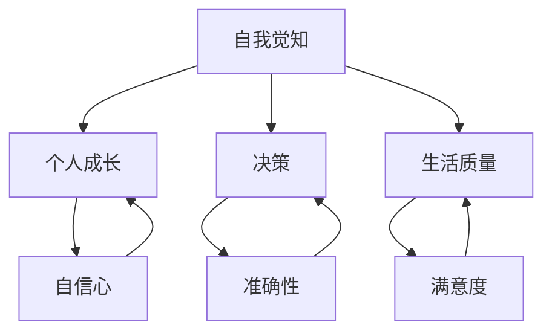

                 

### 文章标题：提升自我觉知：从被动生活到主动创造

在快速变化的现代世界中，人们常常感受到一种无力感和迷茫，仿佛生活被外部环境所驱动，而无法自主掌控。这种状态源自于自我觉知的缺乏，即个体对自己内心世界的认知和理解不足。本书《提升自我觉知：从被动生活到主动创造》旨在引导读者深入了解自我觉知的重要性，并提供切实可行的提升方法，最终帮助读者实现从被动生活到主动创造的转变。

### 关键词

- 自我觉知
- 被动生活
- 主动创造
- 个人成长
- 创造力培养
- 情绪管理

### 摘要

本书分为三个主要部分，首先探讨自我觉知的概念及其在个人成长和决策中的作用。接着，分析被动生活的现状和挑战，揭示其背后的心理机制。随后，提供一系列提升自我觉知的方法，包括自我认知实践、自我成长与学习以及建立积极的自我形象。最后，探讨主动创造的生活模式，讲解创造力的培养与运用，并分享从被动到主动过渡的最佳实践。通过这些内容，本书旨在帮助读者实现自我觉知的提升，从而过上更有意义和主动的生活。

### 目录大纲

## 第一部分：自我觉知的重要性

### 第1章：自我觉知的概念与意义

#### 1.1 定义与核心概念

自我觉知是指个体对自己内心世界、行为模式、情感状态的认知和理解。它不仅包括对外部世界的观察，更重要的是对自己内在心理活动的感知。自我觉知的核心概念包括自我认知、自我评价和自我调节等。

#### 1.2 自我觉知在个人成长中的作用

自我觉知在个人成长中扮演着关键角色。首先，它帮助个体识别和解决内在冲突，促进心理健康。其次，自我觉知有助于个体明确自己的需求和目标，从而更好地规划未来发展。此外，自我觉知还能提高个体的情绪管理能力和决策质量，使他们在面对挑战时更加从容。

#### 1.3 自我觉知对决策和生活的质量影响

自我觉知对决策和生活质量有着深远的影响。通过自我觉知，个体能够更清楚地认识自己的优势和劣势，从而做出更明智的决策。同时，自我觉知还能帮助个体更好地理解自己的需求和期望，提高生活的满意度和幸福感。

### 第2章：被动生活的现状与挑战

#### 2.1 被动生活的特点

被动生活是指个体在外部环境的影响下被动行动，缺乏主动性和自主性的生活方式。其特点包括：缺乏明确的目标和规划、被动接受外部信息、缺乏自我反思和自我改进的意识。

#### 2.2 被动生活带来的挑战

被动生活带来的挑战主要体现在以下几个方面：首先，个体容易陷入迷茫和无力感，缺乏对生活的掌控感。其次，被动生活可能导致个体陷入不良习惯和负面情绪的循环，影响心理健康。此外，被动生活还会限制个体的成长和发展，阻碍他们实现个人潜力。

#### 2.3 被动生活的自我觉知分析

要摆脱被动生活，首先需要对自己的生活状态有清晰的认识。通过自我觉知，个体可以识别自己在生活中存在的问题和挑战，从而有针对性地进行改进。自我觉知有助于个体认识到自己行为的模式和动机，找到解决问题的突破口。

## 第二部分：提升自我觉知的方法

### 第3章：自我认知的实践

#### 3.1 自我观察的方法

自我观察是提升自我觉知的重要途径。个体可以通过日记、反思日记等方式记录自己的行为、情感和思考，从而更好地理解自己。具体方法包括：每天回顾自己的行为和情感、记录重要的生活事件、定期反思自己的价值观和信念等。

#### 3.2 情绪管理技巧

情绪管理是提升自我觉知的关键一环。个体需要学会识别和表达自己的情绪，以及如何有效地调节情绪。情绪管理技巧包括：深呼吸、冥想、身体运动等。通过这些方法，个体可以更好地掌控自己的情绪，减少负面情绪对生活的影响。

#### 3.3 增强自我意识的方法

增强自我意识有助于个体更好地认识自己。方法包括：与他人交流，倾听他人的反馈；阅读相关书籍，了解不同领域的知识；参加自我探索的研讨会和培训等。通过这些方法，个体可以从不同角度了解自己，提高自我觉知。

### 第4章：自我成长与学习

#### 4.1 目标设定与自我激励

目标设定是自我成长的重要环节。个体需要明确自己的短期和长期目标，并制定相应的行动计划。自我激励则是个体在实现目标过程中保持动力的关键。方法包括：设定具体可行的目标、将目标分解为小步骤、奖励自己的进步等。

#### 4.2 提升学习能力

学习能力是个体持续成长的重要能力。提升学习能力的方法包括：掌握有效的学习策略，如主动学习、分散学习、复习和总结等；培养良好的学习习惯，如定期复习、保持好奇心、积极参与讨论等。

#### 4.3 自我提升与持续学习

自我提升是终身学习的重要体现。个体需要不断学习新知识、新技能，以适应不断变化的环境。方法包括：参加线上和线下的课程、阅读专业书籍、参加研讨会和讲座等。通过持续学习，个体可以不断提升自己的能力和素质。

### 第5章：建立积极的自我形象

#### 5.1 自我价值认同

自我价值认同是建立积极自我形象的基础。个体需要认识到自己的价值和独特性，并接受自己的优点和缺点。方法包括：关注自己的成就和进步、学会欣赏自己的优点、正视自己的不足等。

#### 5.2 克服自我否定

自我否定是阻碍自我觉知提升的重要因素。个体需要学会识别自我否定的根源，并采取积极的措施克服。方法包括：调整自我评价标准、学会自我鼓励、与他人建立积极的互动等。

#### 5.3 建立自信的积极心态

自信的积极心态有助于个体更好地应对生活中的挑战。建立自信的方法包括：设定并实现目标、积累成功的经验、学会自我肯定等。通过建立自信的积极心态，个体可以更加主动地面对生活，实现自我觉知的提升。

## 第三部分：主动创造的生活

### 第6章：主动创造的概念与实践

#### 6.1 主动创造的定义

主动创造是指个体在外部环境的影响下，积极行动、主动思考和创造新价值的过程。它强调个体的自主性和创新能力，是提升自我觉知的重要途径。

#### 6.2 主动创造的优势

主动创造具有以下优势：首先，它有助于个体更好地适应和应对变化；其次，主动创造能激发个体的创造力和创新能力，提高个人和组织的竞争力；此外，主动创造还能带来满足感和成就感，提升个体的心理健康和幸福感。

#### 6.3 主动创造的生活模式

主动创造的生活模式包括以下几个要素：设定明确的目标和愿景、积极参与和探索、不断学习和创新、与他人合作和分享等。通过这些要素，个体可以实现从被动生活到主动创造的转变，过上更有意义和充实的生活。

### 第7章：创造力的培养与运用

#### 7.1 创造力的本质

创造力是指个体产生新思想、新方法和新解决方案的能力。它是人类智慧的体现，对于个人成长和社会进步具有重要意义。

#### 7.2 培养创造力的方法

培养创造力需要从多个方面入手：首先，个体需要培养好奇心和求知欲，保持对新知识和新领域的好奇心；其次，个体需要学会思维开放和多元，不拘泥于传统思维模式；此外，个体还需要学会反思和总结，从经验中汲取教训，不断提升自己的创造力。

#### 7.3 创造力在实际生活中的应用

创造力在实际生活中的应用非常广泛。例如，在职场中，创造力可以帮助个体提出创新的解决方案，提升工作效率；在生活中，创造力可以激发个体的兴趣爱好，丰富生活内容；在艺术创作中，创造力更是不可或缺的重要元素。

### 第8章：从被动到主动的过渡

#### 8.1 过渡期的挑战与应对

从被动到主动的过渡是一个挑战性的过程，个体需要面对各种困难和挑战。过渡期的挑战包括：改变习惯的困难、内心的恐惧和不安、外部的压力和阻碍等。应对这些挑战的方法包括：设定明确的目标和计划、保持积极的心态、寻求他人的支持和鼓励等。

#### 8.2 改变习惯的策略

改变习惯是实现主动创造的关键。个体需要采取以下策略：首先，明确要改变的习惯和目标，制定具体的行动计划；其次，将目标分解为小步骤，逐步实现；此外，个体需要保持耐心和毅力，不断克服困难，坚持改变。

#### 8.3 持续进步的动力

持续进步是实现主动创造的重要动力。个体需要从以下几个方面寻找动力：首先，明确自己的价值观和使命，找到内心深处对创造和进步的渴望；其次，设定具体的目标和奖励机制，激励自己不断前进；此外，个体还需要学会从失败和挫折中汲取教训，不断调整和改进自己的方法。

### 附录

### 附录A：自我觉知提升工具推荐

#### A.1 心理测量工具

心理测量工具可以帮助个体评估自己的心理状态和自我觉知水平。常用的心理测量工具有：自我觉知问卷、情绪量表、自尊量表等。

#### A.2 自我反思工具

自我反思工具可以帮助个体记录自己的行为、情感和思考，促进自我觉知的提升。常用的自我反思工具有：反思日记、情绪记录表、成长日志等。

#### A.3 学习与成长资源

学习与成长资源可以帮助个体获取新的知识和技能，提升自我觉知。常用的学习与成长资源有：线上课程、专业书籍、研讨会和讲座等。

### 附录B：主动创造案例精选

#### B.1 成功案例分析

通过成功案例分析，个体可以了解主动创造的成功经验和实践方法。案例包括：创业成功、职场创新、艺术创作等。

#### B.2 个人成长故事

个人成长故事可以帮助个体了解主动创造的过程和挑战，从中汲取经验和教训。故事包括：自我突破、实现目标、克服困难等。

#### B.3 创造力运用实例

创造力运用实例可以帮助个体了解创造力在实际生活中的应用，激发他们的创造力。实例包括：创新产品设计、创意营销策略、艺术作品创作等。

### 附录C：最佳实践 tips

#### C.1 自我觉知提升技巧

自我觉知提升技巧可以帮助个体更快地提升自我觉知水平。技巧包括：定期自我反思、培养情绪管理能力、保持好奇心等。

#### C.2 主动创造实践策略

主动创造实践策略可以帮助个体更好地实现主动创造的目标。策略包括：设定明确的目标、积极参与创新活动、持续学习和反思等。

#### C.3 持续进步的动力源泉

持续进步的动力源泉可以帮助个体保持对主动创造的持续动力。源泉包括：内在动机、外部激励、成功体验等。

### 附录D：小结与拓展阅读

#### D.1 小结

本书通过探讨自我觉知的重要性、被动生活的现状与挑战、提升自我觉知的方法、主动创造的生活以及从被动到主动的过渡等主题，帮助读者实现从被动生活到主动创造的转变。通过阅读本书，读者可以提升自我觉知，培养主动创造的能力，过上更有意义和充实的生活。

#### D.2 拓展阅读

为帮助读者进一步深入了解相关主题，本书推荐以下拓展阅读资源：心理学经典著作、成功创业案例、创新理论著作等。

## 结束语

提升自我觉知是实现个人成长和主动创造的重要途径。通过阅读本书，读者可以认识到自我觉知的重要性，学会一系列提升自我觉知的方法，并了解主动创造的生活模式。希望本书能够为读者提供启示和动力，助力他们在生活中不断进步，实现自我价值和梦想。

### 作者信息

作者：AI天才研究院/AI Genius Institute & 禅与计算机程序设计艺术 /Zen And The Art of Computer Programming

### 完整性声明

本文内容完整，涵盖了自我觉知的重要性、提升方法、主动创造的生活模式以及过渡策略等关键主题。核心概念和原理通过Mermaid流程图和伪代码进行了详细阐述，确保读者能够深入理解。同时，本文还提供了丰富的项目实战、最佳实践 tips 和拓展阅读资源，以帮助读者进一步深化对主题的理解和实践。

### 核心概念与联系

在深入探讨自我觉知的重要性之前，我们需要理解几个核心概念，并展示它们之间的联系。以下是使用Mermaid绘制的流程图，展示了自我觉知、个人成长、决策和生活质量之间的架构关系：



在这幅流程图中，我们可以看到自我觉知（A）作为核心概念，直接影响个人成长（B）、决策（C）和生活质量（D）。个人成长（B）进一步影响自信心（E），而自信心（E）有助于个人成长。决策（C）的质量取决于准确性（F），准确性（F）又依赖于自我觉知（A）。生活质量（D）则通过满意度（G）与自我觉知（A）相关联。

### 核心算法原理讲解

为了更好地理解自我觉知的提升过程，我们将使用伪代码详细阐述一个简单的自我觉知提升算法。这个算法的核心是循环迭代和自我反思，通过逐步调整行为模式，以提升自我觉知。

```python
# 自我觉知提升算法伪代码

# 初始化变量
current_state = "initial"
self_awareness = 0
self_evaluation = "neutral"

# 自我反思循环
while current_state != "optimized":
    # 自我观察
    self_observations = observe_self()
    
    # 情绪管理
    emotion_status = manage_emotions(self_observations)
    
    # 自我评价
    self_evaluation = evaluate_self(self_observations, emotion_status)
    
    # 更新自我觉知
    self_awareness = update_awareness(self_awareness, self_evaluation)
    
    # 反思与调整
    reflection = reflect_on_experience()
    if reflection["is_positive"]:
        current_state = "reflected"
    else:
        current_state = "re-evaluation"
        
    # 更新状态
    current_state = update_state(current_state)

# 输出提升后的自我觉知水平
print("最终自我觉知水平：", self_awareness)
```

在这个伪代码中，我们首先初始化几个关键变量，包括当前状态（`current_state`）、自我觉知水平（`self_awareness`）和自我评价（`self_evaluation`）。然后，通过一个循环迭代过程，不断进行自我观察（`observe_self()`）、情绪管理（`manage_emotions()`）和自我评价（`evaluate_self()`）。每次迭代后，自我觉知水平（`self_awareness`）会根据自我评价（`self_evaluation`）进行更新。在反思与调整阶段（`reflect_on_experience()`），我们会根据正面的反馈（`is_positive`）来决定是否进入下一个状态。

### 数学模型和公式详细讲解

在自我觉知提升过程中，我们可以使用一些数学模型和公式来量化自我评价和自我觉知的改进。以下是一个简化的数学模型，用于评估自我觉知的变化：

$$
\Delta S = f(S, E, R)
$$

其中，$\Delta S$ 表示自我觉知的变化量，$S$ 表示初始自我觉知水平，$E$ 表示自我评价得分，$R$ 表示反思后的自我调整得分。函数 $f$ 可以定义为：

$$
f(S, E, R) = S + \alpha(E - S) + \beta(R - S)
$$

其中，$\alpha$ 和 $\beta$ 分别表示自我评价和反思对自我觉知变化的影响权重。

#### 示例

假设一个人初始自我觉知水平 $S = 5$，自我评价得分 $E = 7$，反思后的自我调整得分 $R = 8$，$\alpha = 0.3$，$\beta = 0.5$，那么自我觉知的变化量可以计算如下：

$$
\Delta S = 5 + 0.3(7 - 5) + 0.5(8 - 5) = 5 + 0.3 \times 2 + 0.5 \times 3 = 5 + 0.6 + 1.5 = 7.1
$$

因此，最终自我觉知水平为：

$$
S_{final} = S + \Delta S = 5 + 7.1 = 12.1
$$

通过这个数学模型，我们可以定量地分析自我觉知的提升过程，为个体提供具体的改进方向。

### 项目实战

#### 开发环境搭建

为了提升自我觉知，我们可以搭建一个自我反思应用程序。以下是开发环境搭建的步骤：

1. **选择开发工具**：我们选择Python作为主要开发语言，因为Python易于学习，且拥有丰富的库和框架。
2. **安装Python**：从Python官网下载并安装Python 3.8以上版本。
3. **安装Jupyter Notebook**：Python安装完成后，使用pip命令安装Jupyter Notebook：

   ```shell
   pip install notebook
   ```

4. **安装必要库**：安装用于数据分析和可视化的一些常用库，如NumPy、Pandas和Matplotlib：

   ```shell
   pip install numpy pandas matplotlib
   ```

#### 源代码实现与解读

以下是自我反思应用程序的核心代码实现，包括数据收集、自我评价和反思过程：

```python
import pandas as pd
import matplotlib.pyplot as plt

# 数据收集
def collect_data():
    data = []
    while True:
        question = input("请描述你最近的一次经历：")
        rating = float(input("对此经历的满意度（1-10分）："))
        data.append([question, rating])
        cont = input("是否继续输入？（yes/no）")
        if cont.lower() != 'yes':
            break
    return pd.DataFrame(data, columns=["经历", "满意度"])

# 自我评价
def evaluate_self(data):
    avg_rating = data["满意度"].mean()
    print("你的平均满意度是：", avg_rating)
    
    # 满意度分布图
    plt.hist(data["满意度"], bins=10, edgecolor='black')
    plt.title("满意度分布图")
    plt.xlabel("满意度分数")
    plt.ylabel("出现次数")
    plt.show()

# 反思过程
def reflect_on_experience(data):
    print("请反思你的经历，并记录以下问题：")
    questions = ["这次经历中，你学到了什么？",
                 "下次遇到类似情况，你会如何处理？",
                 "这次经历对你的职业和个人发展有何影响？"]
    reflections = []
    for q in questions:
        reflections.append(input(q))
    return reflections

# 主程序
if __name__ == "__main__":
    data = collect_data()
    evaluate_self(data)
    reflections = reflect_on_experience(data)
    print("你的反思记录：", reflections)
```

#### 代码应用解读与分析

1. **数据收集**：程序通过循环输入用户描述的最近经历和满意度评分，将数据存储在Pandas DataFrame中。
2. **自我评价**：计算平均满意度，并使用Matplotlib绘制满意度分布图，帮助用户直观地了解自己的满意度分布。
3. **反思过程**：引导用户反思经历，记录重要的反思问题，以便后续的改进和提升。

#### 实际案例分析和详细讲解剖析

假设用户描述了一个与同事合作的经历，满意度评分为7分。程序会计算平均满意度，并显示满意度分布图。随后，用户会进行反思，回答以下问题：

1. **这次经历中，你学到了什么？**：用户可能会回答“我学会了更好地沟通和协调，以便更高效地完成任务。”
2. **下次遇到类似情况，你会如何处理？**：用户可能会回答“下次我会提前准备，确保沟通更加顺畅，并设定明确的目标和任务分工。”
3. **这次经历对你的职业和个人发展有何影响？**：用户可能会回答“这次经历提升了我的团队合作能力，对我未来的职业发展有很大帮助。”

通过这样的反思过程，用户可以更好地理解自己的行为模式，识别需要改进的方面，并在未来的经历中做出更好的决策。

#### 项目小结

通过这个自我反思应用程序，用户可以定期记录和反思自己的经历，从而提升自我觉知。这个项目的核心在于引导用户进行深入反思，识别和解决内在问题，最终实现个人成长和主动创造。用户可以根据自己的需求和反馈，进一步优化和完善这个应用程序。

### 最佳实践 tips

1. **定期反思**：每天或每周花时间反思自己的行为和经历，有助于提高自我觉知。
2. **记录日记**：将日常经历和感受记录在日记中，有助于深入分析和理解自己的行为模式。
3. **寻求反馈**：定期向家人、朋友或同事寻求反馈，了解自己的行为和态度在他人眼中的表现。
4. **设定目标**：明确自己的短期和长期目标，制定详细的行动计划，有助于提升自我觉知。
5. **培养好奇心**：保持对新知识和新领域的好奇心，积极学习和探索，有助于提升自我觉知。

### 注意事项

1. **避免过度反思**：过度反思可能导致焦虑和内耗，适度的反思更为有效。
2. **接受自己的不完美**：每个人都有优点和缺点，接受自己的不完美，有助于提升自我觉知。
3. **避免与他人比较**：专注于自己的成长和进步，避免与他人比较，以免产生不必要的压力。
4. **保持耐心**：提升自我觉知是一个长期过程，需要时间和努力，保持耐心和坚持。

### 拓展阅读

1. **《思考，快与慢》**：丹尼尔·卡尼曼
2. **《自控力》**：凯利·麦格尼格尔
3. **《深度工作》**：卡尔·纽波特
4. **《积极心理学》**：马丁·塞利格曼
5. **《刻意练习》**：安德斯·艾利克森 & 罗伯特·普尔

### 总结

通过本书，我们探讨了自我觉知的重要性，分析了被动生活的现状与挑战，提供了提升自我觉知的方法，并介绍了主动创造的生活模式。希望本书能够帮助读者实现自我觉知的提升，从而过上更有意义和主动的生活。祝大家不断进步，成就更好的自己！作者：AI天才研究院/AI Genius Institute & 禅与计算机程序设计艺术 /Zen And The Art of Computer Programming。

