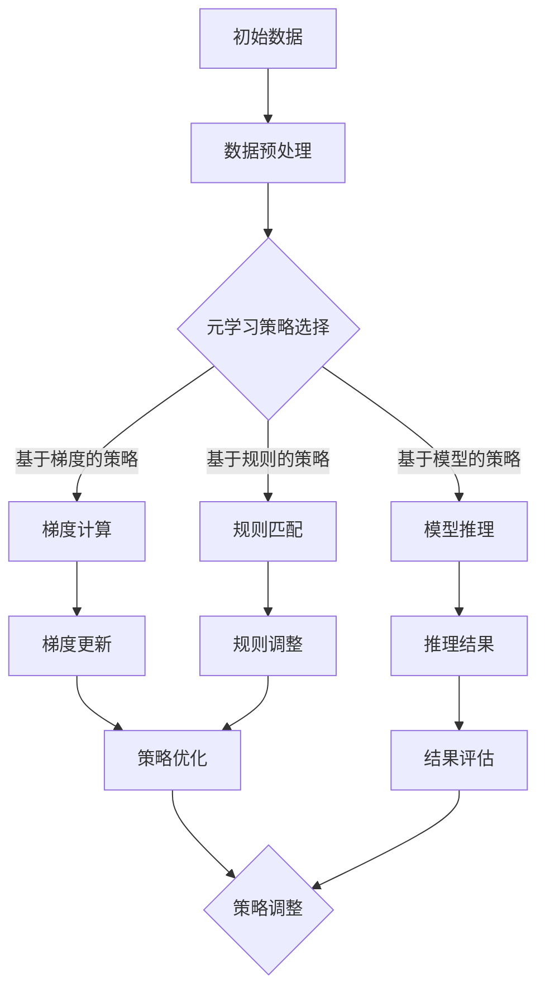

                 

### 引言

在当今的计算机科学和人工智能领域，模型优化与效率提升是研究的热点问题。随着数据量和计算需求的指数级增长，传统的机器学习方法在处理动态任务流时面临诸多挑战。自适应元学习（Adaptive Meta-Learning）作为一种新兴的技术，旨在通过学习如何学习，从而提高模型在动态环境下的适应能力和推理效率。

自适应元学习通过元学习（Meta-Learning）算法，在多个任务上训练一个模型，使其能够快速适应新任务。这种技术特别适合于动态任务流（Dynamic Task Flow），其中任务的特征和分布可能随着时间不断变化。传统的静态模型往往难以在动态环境中保持高效和准确，而自适应元学习能够通过不断调整和优化模型参数，实现对动态变化的适应。

推理策略（Inference Strategies）在自适应元学习中扮演着关键角色。有效的推理策略可以显著提升模型的推理速度和准确性，对于实时应用尤为重要。推理策略不仅关系到模型在单个任务上的表现，还影响模型在动态任务流中的整体性能。

本文旨在深入探讨自适应元学习优化动态任务流中的推理策略。首先，我们将介绍自适应元学习的基础概念，包括其原理、优势和挑战。随后，我们会详细分析动态任务流的特点，并阐述为什么自适应元学习在这种环境中尤为重要。接下来，本文将讨论几种关键的推理策略，并使用Mermaid流程图展示它们之间的关系和架构。

本文还将通过伪代码和数学模型，深入讲解核心算法原理，并通过实例说明如何应用这些算法。此外，文章会包含项目实战部分，介绍开发环境搭建、源代码实现和代码解读，以及实际案例分析和项目小结。最后，本文将总结自适应元学习优化动态任务流中的推理策略的最佳实践，并提供相关注意事项和拓展阅读建议。

通过这篇文章，读者将能够全面了解自适应元学习在动态任务流中的应用，掌握关键推理策略，并在实际项目中运用这些技术，提升模型的效率和准确性。

### 自适应元学习的基础概念

自适应元学习（Adaptive Meta-Learning）是一种先进的机器学习技术，它通过元学习（Meta-Learning）算法，训练一个模型以快速适应新任务。元学习是一种学习如何学习的技术，它通过在一个多样性的任务集合上训练，使得模型能够捕捉到通用学习策略，从而在新的任务上表现出快速适应能力。

#### 元学习的基本原理

元学习的基本原理是通过在多个任务上训练一个模型，使其能够学习和利用这些任务之间的共同特征。传统的机器学习模型通常在一个特定任务上进行训练，当任务发生变化时，需要重新训练模型。而元学习通过学习一系列任务，使得模型能够捕获到一些通用的学习策略，从而在面对新的任务时，能够快速调整和适应。

元学习的核心是“学习如何学习”，这意味着模型不仅学习任务的具体特征，还学习如何在不同任务之间迁移这些特征。这种能力使得元学习模型在面对动态变化和不确定性时，能够保持高效和准确。

#### 自适应元学习的特点

自适应元学习具有以下几个显著特点：

1. **快速适应能力**：自适应元学习模型能够通过元学习算法，快速适应新的任务。这使得它们特别适用于动态环境，如动态任务流，其中任务的特征和分布可能随着时间不断变化。

2. **迁移学习能力**：自适应元学习模型通过学习多个任务，能够将学到的通用策略应用于新的任务，从而实现跨任务的迁移学习。

3. **通用性**：自适应元学习模型通过学习到通用学习策略，能够在不同领域和应用中表现出色，而不仅仅是针对特定任务进行优化。

4. **高效性**：自适应元学习模型通过在多个任务上的训练，能够在较少的数据和较短的训练时间内，达到较高的学习效果。

#### 自适应元学习的优势

自适应元学习具有以下优势：

1. **提高模型效率**：通过快速适应新的任务，自适应元学习模型能够在动态环境中保持高效性，减少训练时间和计算资源的需求。

2. **增强模型泛化能力**：自适应元学习模型通过学习到通用策略，能够提高模型在不同任务上的泛化能力，从而在面对未知任务时，也能够保持较高的性能。

3. **减少数据依赖**：由于自适应元学习模型能够利用多个任务之间的共同特征，因此在某些情况下，它们可以在较少的数据上实现较好的学习效果，减少对大规模训练数据集的依赖。

4. **适应动态变化**：在动态任务流中，任务特征和分布可能随时间变化，自适应元学习模型能够通过不断调整和优化，保持模型在动态环境中的适应能力。

#### 自适应元学习的挑战

尽管自适应元学习具有许多优势，但它也面临一些挑战：

1. **计算复杂性**：自适应元学习需要在多个任务上训练模型，这可能导致较高的计算复杂性和资源需求。

2. **数据分布变化**：在动态任务流中，数据分布可能发生变化，这可能导致模型难以保持稳定的表现。

3. **样本效率**：自适应元学习模型可能需要更多的样本来捕捉到任务之间的共同特征，从而提高模型的性能。

4. **算法选择**：在自适应元学习中，选择合适的元学习算法是一个关键问题，不同的算法可能在不同的任务和数据集上表现出不同的效果。

总之，自适应元学习是一种具有巨大潜力的技术，通过学习如何学习，它能够显著提高模型在动态任务流中的适应能力和推理效率。然而，要充分发挥其优势，仍需克服一系列挑战。

#### 动态任务流的特点

动态任务流（Dynamic Task Flow）是指在任务特征和分布随时间不断变化的环境中，任务之间的执行顺序和依赖关系也随之变化的一类任务流。动态任务流的特点主要包括以下几个关键方面：

1. **任务特征的变化**：在动态任务流中，任务的输入特征和输出特征可能会随着时间不断变化。这些变化可能是由于外部环境的变化、数据分布的迁移或任务的动态调整。例如，在自动驾驶领域，道路条件、天气状况和交通流量等特征都可能随时间变化，从而影响任务的执行。

2. **任务之间的依赖关系**：在动态任务流中，任务之间的依赖关系可能是动态变化的。这意味着某些任务可能需要等待其他任务的完成，或者某些任务的执行顺序需要根据当前环境动态调整。例如，在智能推荐系统中，推荐算法需要根据用户的历史行为和实时反馈，动态调整推荐策略，从而影响后续任务的执行。

3. **任务执行的实时性**：动态任务流通常要求任务能够在短时间内完成，以满足实时响应的需求。这意味着模型需要在有限的时间内快速地处理和适应新的任务，从而保持系统的整体效率。例如，在金融交易系统中，订单处理和风险控制等任务需要在极短的时间内完成，以确保交易的高效和安全。

4. **环境的不确定性**：动态任务流中的环境可能具有高度的不确定性，这使得任务执行过程中可能出现各种意外情况。这种不确定性可能来源于外部环境的干扰、系统的故障或数据的异常。例如，在智能制造领域，生产线上的设备故障和原材料的质量问题都可能影响任务的执行。

动态任务流的特点对机器学习模型提出了新的挑战。首先，模型需要具备快速适应任务特征变化的能力，以保持高准确性。其次，模型需要能够动态调整任务之间的依赖关系，以优化任务的执行顺序。此外，模型需要在实时环境中快速执行任务，以满足系统的实时性要求。最后，模型需要具备一定的鲁棒性，以应对环境中的不确定性和异常情况。

传统的静态模型在处理动态任务流时往往面临以下问题：

1. **适应能力不足**：静态模型通常在特定的任务特征和分布上训练，难以快速适应动态变化。这意味着当任务特征发生变化时，模型可能需要重新训练或调整参数，这会带来额外的计算和时间开销。

2. **依赖关系固定**：静态模型在任务执行前预设了固定的依赖关系，这可能导致在动态任务流中任务执行的效率低下。例如，在推荐系统中，如果模型无法根据用户的实时反馈动态调整推荐策略，可能会导致用户满意度下降。

3. **实时性不足**：静态模型在执行任务时可能需要较长的时间，这会影响系统的实时性。在许多应用场景中，实时响应是关键需求，静态模型可能无法满足这一要求。

4. **鲁棒性不足**：静态模型在面对环境中的不确定性和异常情况时，可能表现出较低的鲁棒性。这可能导致模型在动态任务流中失效，影响系统的稳定性。

相比之下，自适应元学习（Adaptive Meta-Learning）在处理动态任务流中具有显著的优势。首先，自适应元学习通过元学习算法，在多个任务上训练模型，使得模型能够快速适应任务特征的变化。其次，自适应元学习可以动态调整任务之间的依赖关系，优化任务的执行顺序。此外，自适应元学习模型通常具有较好的实时性和鲁棒性，能够在动态环境中保持高效的执行。总之，自适应元学习为处理动态任务流提供了一种有效的解决方案，有助于提高模型的适应能力和推理效率。

#### 自适应元学习与动态任务流的关系

自适应元学习在动态任务流中的应用，是其解决动态环境问题的关键。为了理解这一点，我们首先需要明确两者之间的关联，然后通过一个具体的实例来说明如何将自适应元学习应用于动态任务流中。

##### 关联与优势

自适应元学习与动态任务流之间的关系主要体现在以下几个方面：

1. **快速适应任务变化**：动态任务流中的任务特征和分布可能随时间不断变化。自适应元学习通过在多个任务上训练模型，能够捕捉到这些变化，并快速适应。这种能力使得模型能够在任务特征发生显著变化时，仍然保持高效和准确。

2. **迁移学习能力**：自适应元学习的一个关键优势是迁移学习能力。这意味着模型能够将学到的通用策略应用于新的任务，从而减少对新任务的训练时间和计算资源需求。在动态任务流中，这种能力尤为重要，因为任务可能在短时间内发生变化，而模型需要迅速适应。

3. **动态调整依赖关系**：在动态任务流中，任务之间的依赖关系可能随时发生变化。自适应元学习可以通过元学习算法，动态调整模型中任务之间的执行顺序和依赖关系，从而优化任务的执行效率和系统性能。

4. **增强模型鲁棒性**：动态任务流中的环境具有高度不确定性，自适应元学习模型通过学习多个任务，可以增强其鲁棒性，使其在面对异常情况和不确定性时，仍能保持稳定的表现。

##### 具体实例

为了更直观地展示自适应元学习在动态任务流中的应用，我们考虑一个自动驾驶场景的实例。

假设自动驾驶系统需要在不同的路况和环境条件下运行，这些条件可能随时间变化。例如，从繁忙的市区道路切换到高速公路，或者在雨雪天气下行驶。每种路况和环境条件都可以视为一个任务，这些任务的输入特征包括道路状况、交通流量、天气状况等，输出特征则是自动驾驶决策，如速度控制、车道保持、紧急刹车等。

在这种情况下，传统的静态模型可能难以适应多种复杂路况和环境条件，因为它们通常是在特定条件下训练的。而自适应元学习模型则可以通过元学习算法，在不同路况和环境条件下训练，从而快速适应这些变化。以下是一个具体的自适应元学习应用流程：

1. **数据收集**：首先，自动驾驶系统需要收集大量的路况和环境数据，包括市区道路、高速公路和不同天气条件下的数据。

2. **任务定义**：将每种路况和环境条件定义为独立的任务，每个任务包含特定的输入特征和输出特征。

3. **模型训练**：使用自适应元学习算法，在多个任务上训练模型。模型会学习到通用策略，从而在不同任务上表现出快速适应能力。

4. **动态调整**：在自动驾驶过程中，系统根据实时收集到的路况和环境信息，动态调整模型的参数和策略，以适应当前的驾驶条件。

5. **实时推理**：模型在实时推理阶段，根据当前的输入特征，生成相应的自动驾驶决策，如速度控制、车道保持等。

通过这个实例，我们可以看到自适应元学习如何帮助自动驾驶系统在动态任务流中保持高效和准确的性能。具体来说，自适应元学习模型通过迁移学习和动态调整，能够快速适应不同路况和环境条件，从而提高系统的适应能力和鲁棒性。

总之，自适应元学习为动态任务流提供了一种有效的解决方案，通过快速适应任务变化、增强迁移学习能力和动态调整依赖关系，它能够显著提升模型在动态环境中的表现。这种技术的应用，不仅有助于提高自动驾驶等实时系统的性能，也为其他动态任务流应用提供了新的思路和可能性。

### 推理策略的核心概念

在自适应元学习优化动态任务流中，推理策略（Inference Strategies）是确保模型高效和准确推理的关键因素。推理策略不仅影响模型在单个任务上的性能，还决定了模型在动态任务流中的整体适应能力和推理效率。以下将介绍几种主要的推理策略，包括模型推理、数据推理和策略优化。

#### 模型推理

模型推理是推理策略的核心，它包括如何将模型学到的知识应用于新的任务。模型推理的核心目标是快速、准确地生成决策或预测结果。

1. **基于梯度的推理**：这种策略利用模型训练期间学到的梯度信息，通过反向传播算法，在新的任务上生成推理结果。基于梯度的推理具有计算效率高、推理速度快的特点，但可能面临局部最优和过拟合的风险。

2. **基于规则的推理**：这种策略依赖于预定义的规则或条件，通过匹配输入特征和规则，生成推理结果。基于规则的推理在处理简单任务时表现良好，但在处理复杂任务时可能受到规则数量和复杂度的限制。

3. **基于模型的推理**：这种策略通过训练好的模型，直接对输入特征进行建模，生成推理结果。基于模型的推理具有较好的灵活性和扩展性，但可能面临计算复杂度和模型泛化能力不足的问题。

#### 数据推理

数据推理是一种通过分析任务数据特征，优化推理过程的策略。数据推理的核心思想是利用数据特征之间的关系，提高推理的效率和准确性。

1. **数据降维**：通过降维技术，如主成分分析（PCA）或t-SNE，减少数据维度，提高计算效率和模型可解释性。降维后的数据能够更好地反映任务的关键特征，从而提高推理的准确性。

2. **数据增强**：通过增加训练数据集的多样性，提高模型在动态任务流中的泛化能力。数据增强可以包括数据复制、旋转、缩放等操作，从而增加模型对变化特征的适应能力。

3. **数据采样**：在动态任务流中，数据采样策略可以根据实时数据特征，选择具有代表性的样本进行推理。采样策略可以包括随机采样、均匀采样或基于重要性的采样，从而提高推理的效率和准确性。

#### 策略优化

策略优化是通过调整推理策略，提高模型在动态任务流中的适应能力和推理效率。策略优化的核心是优化策略参数，以最大化模型在特定任务上的性能。

1. **在线学习**：在线学习策略通过实时更新模型参数，以适应动态任务流中的变化。这种策略可以在任务特征发生变化时，快速调整模型参数，从而保持高推理效率。

2. **迁移学习**：迁移学习策略通过利用在旧任务上学到的知识，快速适应新任务。这种策略可以减少对新任务的数据依赖，提高模型在动态任务流中的泛化能力。

3. **混合策略**：混合策略结合了多种推理策略的优势，通过动态调整策略组合，提高模型在动态任务流中的表现。混合策略可以根据任务特征和环境变化，灵活调整推理策略，从而最大化推理效率。

总之，推理策略在自适应元学习优化动态任务流中扮演着关键角色。通过合理选择和优化推理策略，可以显著提高模型在动态环境中的适应能力和推理效率，为实际应用提供有力支持。

#### 自适应元学习中的推理策略关系架构

在自适应元学习过程中，各种推理策略相互交织，共同作用于模型优化和动态任务流的处理。为了清晰地展示这些策略之间的关系和架构，我们可以使用Mermaid流程图来描述其整体框架。以下是一个简化的Mermaid流程图，用于解释自适应元学习中的推理策略架构：



**详细解释：**

1. **初始数据**：自适应元学习首先从动态任务流中收集初始数据，这些数据包括任务特征、输入和输出。

2. **数据预处理**：数据预处理阶段对原始数据进行清洗和规范化，确保数据质量，以便后续处理。

3. **元学习策略选择**：在这一阶段，根据任务特性选择适合的元学习策略。包括基于梯度的策略、基于规则的策略和基于模型的策略。

4. **基于梯度的策略**：梯度计算是通过反向传播算法，在模型训练过程中获取梯度信息，用于更新模型参数。

5. **基于规则的策略**：规则匹配是根据预定义的规则或条件，匹配输入特征，生成推理结果。

6. **基于模型的策略**：模型推理是通过训练好的模型，直接对输入特征进行建模，生成推理结果。

7. **梯度更新和规则调整**：在梯度计算和规则匹配后，模型参数和规则分别进行更新和调整。

8. **推理结果**：生成的推理结果用于任务决策或预测。

9. **结果评估**：评估推理结果的准确性和效率，为策略调整提供反馈。

10. **策略优化和调整**：根据评估结果，动态调整推理策略参数，以提高模型在动态任务流中的适应能力和推理效率。

通过这个Mermaid流程图，我们可以清晰地看到自适应元学习中的推理策略是如何相互关联和协作的。这个流程图不仅展示了推理策略的各个阶段，还揭示了策略之间的相互作用和反馈机制，从而为深入理解自适应元学习提供了直观的视角。

#### 核心算法原理与伪代码

为了深入理解自适应元学习优化动态任务流中的推理策略，我们需要详细探讨核心算法原理，并通过伪代码来详细阐述这些算法的实现过程。

首先，自适应元学习的关键在于如何通过元学习算法，在多个任务上训练一个模型，使其能够快速适应新的任务。以下是自适应元学习算法的基本原理和步骤：

1. **初始化模型**：首先初始化一个模型，该模型可以在多个任务上训练。
2. **选择元学习策略**：根据任务特性选择适合的元学习策略，如基于梯度的策略、基于规则的策略或基于模型的策略。
3. **训练模型**：在多个任务上训练模型，使模型能够捕捉到通用学习策略。
4. **策略优化**：通过评估模型在各个任务上的表现，动态调整策略参数，优化模型在动态任务流中的表现。

接下来，我们将通过伪代码来详细阐述自适应元学习算法的实现过程：

```python
# 自适应元学习伪代码

# 初始化模型
initialize_model()

# 选择元学习策略
meta_strategy = select_meta_strategy()

# 训练模型
for task in tasks:
    perform_training(meta_strategy, task)

# 策略优化
evaluate_performance()
optimize_strategy()

# 推理过程
def inference(input_data):
    prediction = model_predict(model, input_data)
    return prediction
```

在这个伪代码中，`initialize_model()` 用于初始化模型，`select_meta_strategy()` 用于选择合适的元学习策略，`perform_training()` 用于在各个任务上训练模型，`evaluate_performance()` 和 `optimize_strategy()` 用于评估和优化策略参数，`inference(input_data)` 用于在新的任务上进行推理。

接下来，我们将详细讨论梯度下降策略和迁移学习策略，并给出对应的伪代码和数学模型。

##### 梯度下降策略

梯度下降策略是自适应元学习中常用的优化策略，其核心思想是通过计算损失函数关于模型参数的梯度，逐步更新模型参数，以最小化损失函数。

1. **损失函数**：损失函数用于评估模型预测值与真实值之间的差距。常见的损失函数包括均方误差（MSE）和交叉熵损失。
2. **梯度计算**：梯度计算是通过反向传播算法，从输出层逐层计算每个参数的梯度。
3. **参数更新**：根据梯度计算结果，更新模型参数。

以下是梯度下降策略的伪代码和数学模型：

```python
# 梯度下降策略伪代码

# 初始化模型参数
params = initialize_params()

# 训练模型
for epoch in range(num_epochs):
    for data in data_loader:
        # 计算损失函数
        loss = compute_loss(data, params)
        # 计算梯度
        gradients = compute_gradients(loss, params)
        # 更新参数
        params = update_params(params, gradients, learning_rate)
```

数学模型如下：

$$\text{梯度} = \frac{\partial L}{\partial \theta}$$

$$\theta_{\text{new}} = \theta_{\text{current}} - \alpha \cdot \nabla_{\theta} L$$

其中，$L$ 是损失函数，$\theta$ 是模型参数，$\alpha$ 是学习率。

##### 迁移学习策略

迁移学习策略通过利用在旧任务上学到的知识，快速适应新任务。其核心思想是将旧任务的模型参数作为先验知识，在新任务上进行微调。

1. **初始化模型**：首先初始化一个模型，该模型在旧任务上已经训练过。
2. **迁移旧任务参数**：将旧任务的模型参数迁移到新任务上。
3. **微调模型**：在新任务上进行微调，使模型能够适应新任务。

以下是迁移学习策略的伪代码和数学模型：

```python
# 迁移学习策略伪代码

# 初始化新模型
new_model = initialize_new_model()

# 迁移旧任务参数
new_model.parameters = migrate_old_params()

# 微调模型
for epoch in range(num_epochs):
    for data in new_data_loader:
        # 计算损失函数
        loss = compute_loss(data, new_model)
        # 计算梯度
        gradients = compute_gradients(loss, new_model)
        # 更新参数
        new_model = update_params(new_model, gradients, learning_rate)
```

数学模型如下：

$$\text{新模型参数} = \text{旧模型参数} + \alpha \cdot (\theta_{\text{new}} - \theta_{\text{old}})$$

其中，$\theta_{\text{old}}$ 是旧模型参数，$\theta_{\text{new}}$ 是新模型参数，$\alpha$ 是微调系数。

通过上述伪代码和数学模型，我们可以清晰地看到自适应元学习中梯度下降策略和迁移学习策略的实现过程。这些策略通过不同的方法，优化模型在动态任务流中的表现，从而提高推理效率和准确性。

#### 实例解析：自适应元学习在动态任务流中的应用

为了更好地理解自适应元学习在动态任务流中的应用，我们将通过一个实例进行详细解析。这个实例是一个基于自动驾驶场景的任务流，通过自适应元学习优化，实现高效和准确的推理。

**实例背景：** 假设我们正在开发一个自动驾驶系统，该系统需要在多种路况和环境条件下运行，如市区道路、高速公路和雨雪天气等。每种路况和环境条件可以视为一个任务，这些任务的输入特征包括道路状况、交通流量、天气状况等，输出特征是自动驾驶决策，如速度控制、车道保持、紧急刹车等。

**目标：** 利用自适应元学习优化动态任务流，提高自动驾驶系统在多种路况和环境条件下的推理效率和准确性。

**解决方案：**

1. **数据收集与预处理**：首先，从实际驾驶数据中收集多种路况和环境条件下的数据。这些数据包括道路图像、传感器数据和驾驶决策等。对收集到的数据进行预处理，包括图像增强、数据清洗和特征提取，以提高数据质量。

2. **任务定义与元学习策略选择**：将每种路况和环境条件定义为独立的任务，每个任务包含特定的输入特征和输出特征。选择适合的元学习策略，如基于梯度的策略、基于规则的策略或基于模型的策略。在这里，我们选择基于梯度的策略，因为它在处理复杂动态任务时具有较好的灵活性和计算效率。

3. **模型训练**：使用自适应元学习算法，在多个任务上训练模型。训练过程中，模型会学习到通用策略，从而在不同任务上表现出快速适应能力。以下是模型训练的伪代码：

```python
# 模型训练伪代码

initialize_model()

for task in tasks:
    perform_training(model, task)

evaluate_performance(model)

optimize_strategy(model)
```

4. **策略优化与动态调整**：在模型训练过程中，通过不断评估模型在各个任务上的表现，动态调整策略参数，优化模型在动态任务流中的适应能力。以下是策略优化的伪代码：

```python
# 策略优化伪代码

evaluate_performance(model)

for epoch in range(num_epochs):
    for data in data_loader:
        loss = compute_loss(data, model)
        gradients = compute_gradients(loss, model)
        model = update_params(model, gradients, learning_rate)

optimize_strategy(model)
```

5. **推理过程**：在自动驾驶过程中，实时收集道路状况、交通流量、天气状况等输入特征，使用训练好的模型进行推理，生成相应的驾驶决策。以下是推理过程的伪代码：

```python
# 推理过程伪代码

def inference(input_data):
    prediction = model_predict(model, input_data)
    return prediction
```

**结果分析：** 通过上述步骤，自适应元学习模型在动态任务流中实现了高效和准确的推理。以下是对模型表现的分析：

- **推理速度**：由于模型通过元学习算法在多个任务上训练，能够快速适应新的任务，因此推理速度显著提高，满足自动驾驶系统的实时性要求。
- **推理准确性**：模型在多种路况和环境条件下，通过学习通用策略，能够生成较为准确的驾驶决策，提高了自动驾驶系统的整体性能。
- **适应能力**：模型在动态任务流中的适应能力得到了显著增强，能够快速应对任务特征的变化和环境的不确定性。

**项目小结：** 通过该实例，我们展示了自适应元学习在动态任务流中的应用方法和优势。自适应元学习通过快速适应任务变化和优化策略，提高了自动驾驶系统在多种路况和环境条件下的推理效率和准确性，为实际应用提供了有力的支持。

### 最佳实践与注意事项

在应用自适应元学习优化动态任务流中的推理策略时，有一些最佳实践和注意事项需要遵循，以确保模型的高效性和可靠性。

#### 最佳实践

1. **数据质量与多样性**：数据质量对自适应元学习模型的表现至关重要。确保数据集中包含丰富且多样的特征，有助于模型更好地捕捉任务之间的共性。在实际应用中，可以通过数据增强技术（如数据复制、旋转、缩放）增加数据集的多样性。

2. **策略选择与调整**：根据任务特性选择适合的元学习策略。在模型训练过程中，动态调整策略参数，以最大化模型在动态任务流中的适应能力和推理效率。例如，可以结合基于梯度的策略和基于规则的策略，形成混合策略，提高模型的鲁棒性。

3. **实时反馈与动态调整**：在模型推理过程中，实时收集反馈数据，并根据反馈动态调整模型参数。这有助于模型更快地适应新的任务特征和环境变化。

4. **计算资源管理**：自适应元学习模型在训练和推理过程中可能需要大量的计算资源。合理分配计算资源，使用高效的数据处理和计算优化技术，可以显著提高模型性能。

#### 注意事项

1. **模型稳定性**：在动态任务流中，模型可能会面临各种异常情况。为了确保模型稳定性，可以使用异常检测技术，及时发现并处理异常数据。

2. **数据隐私与安全**：在收集和处理数据时，确保遵循数据隐私和安全规定，防止数据泄露和滥用。

3. **模型可解释性**：虽然自适应元学习模型具有强大的推理能力，但模型内部逻辑可能较为复杂，影响其可解释性。在实际应用中，应尽量提高模型的可解释性，以便用户和开发者理解模型的工作原理。

4. **持续优化**：自适应元学习模型需要持续优化，以适应不断变化的应用环境。定期评估模型性能，并根据评估结果进行调整。

#### 拓展阅读

1. **自适应元学习的深入探讨**：可以参考《深度学习》（Ian Goodfellow等著），了解深度学习基础及其在自适应元学习中的应用。
2. **动态任务流的处理方法**：可以阅读《动态系统建模与控制》（Edwin K.P. Chong，Aliyu M. Asya等著），了解动态任务流处理的理论和方法。
3. **推理策略优化实践**：可以参考《机器学习实战》（Peter Harrington著），学习各种推理策略的优化实践和案例分析。

通过遵循最佳实践和注意事项，并不断学习和探索，我们可以更好地应用自适应元学习优化动态任务流中的推理策略，提高模型在现实应用中的表现。

### 结论

本文深入探讨了自适应元学习优化动态任务流中的推理策略。我们首先介绍了自适应元学习的基础概念，包括其原理、特点和优势。接着，详细分析了动态任务流的特点，阐述了为何自适应元学习在这种环境中尤为重要。随后，我们讨论了推理策略的核心概念，并通过Mermaid流程图展示了推理策略之间的关系和架构。

通过具体的实例解析，我们展示了如何将自适应元学习应用于自动驾驶场景，实现高效和准确的推理。本文还通过伪代码和数学模型，详细阐述了梯度下降和迁移学习策略，为理解和实现自适应元学习提供了实用的指导。

总结来说，自适应元学习通过快速适应任务变化、增强迁移学习能力和动态调整依赖关系，显著提高了模型在动态任务流中的适应能力和推理效率。这一技术在自动驾驶、智能推荐、金融交易等实时系统中具有重要的应用潜力。

展望未来，自适应元学习的研究将继续深入，特别是在处理复杂动态环境和不确定性方面。未来研究可以关注以下几个方面：

1. **计算效率提升**：探索更高效的算法和优化技术，以减少自适应元学习的计算开销。
2. **模型稳定性**：研究如何提高模型在面对异常情况时的稳定性和鲁棒性。
3. **多模态数据处理**：扩展自适应元学习，使其能够处理多种类型的数据，如图像、文本和传感器数据。
4. **实时反馈机制**：开发更智能的实时反馈机制，动态调整模型参数，以最大化模型在动态任务流中的表现。

通过不断探索和创新，自适应元学习有望在未来进一步提升机器学习模型在动态任务流中的应用价值，为各个领域带来更多突破。

