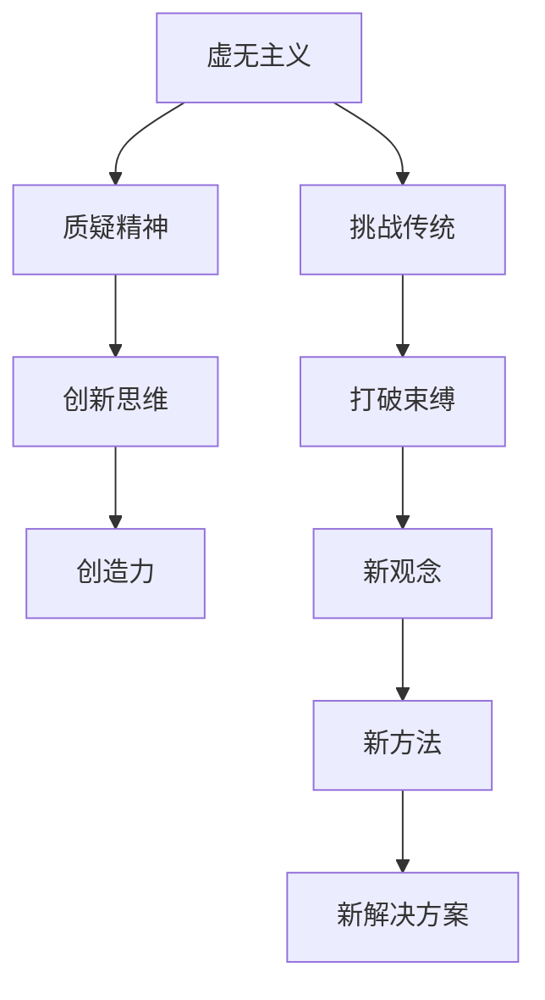

                 

### 引言

在当今这个快速发展的科技时代，创新思维被赋予了前所未有的重要性。无论是科学研究、工程实践，还是商业管理，创新思维都是推动社会进步、企业竞争和个人成长的关键力量。然而，创新思维并非一蹴而就，它需要一种深度的内在驱动，一种敢于质疑、勇于突破的精神。这种精神，从某种角度来说，与虚无主义有着某种奇妙的联系。

虚无主义，作为一种哲学思潮，通常被视为悲观、消极和绝望的同义词。它主张存在的无意义和生活的空虚，质疑一切价值体系和信仰。然而，正是这种质疑，为创新思维提供了肥沃的土壤。虚无主义激发人们对现状的不满，促使他们去寻找新的可能性，推动社会和技术的进步。

本文将以虚无主义与创新思维的关系为切入点，探讨两者的内在联系和相互影响。我们将首先介绍虚无主义的起源与发展，理解其在不同文化和历史时期的体现。接着，分析虚无主义的负面影响及其应对策略，探讨如何转变思维方式，培养积极的人生观。随后，我们将深入探讨创新思维的定义、核心要素、方法与技巧，并通过实践案例展示其应用。最后，我们将探讨虚无主义与创新思维的结合，分析两者的互补关系以及在实际应用中的融合实践。

通过这篇文章，我们希望能够引导读者在质疑中寻找突破和可能性，激发他们的创新思维，为科技和社会的发展贡献更多的智慧和力量。

### 关键词

虚无主义、创新思维、质疑、突破、可能性、哲学根源、负面影响、应对策略、积极人生观、创新方法、实践案例、思维模型、跨界融合。

### 摘要

本文深入探讨了虚无主义与创新思维的关系，通过剖析虚无主义的起源与发展，揭示了其在不同文化和历史时期的体现及其对个人和社会的影响。文章指出，虚无主义的质疑精神虽然带来了一定的负面影响，但也为创新思维提供了不竭的动力。通过分析创新思维的定义、核心要素和方法，本文展示了如何在质疑中寻找突破和可能性。此外，文章还探讨了虚无主义与创新思维的结合，提出了两者的互补关系及其在实际应用中的融合实践。最终，本文鼓励读者在质疑中培养创新思维，为科技和社会的发展贡献力量。

### 背景介绍

虚无主义作为一种哲学思潮，其起源可以追溯到古希腊时期。然而，现代意义上的虚无主义则主要源于19世纪末至20世纪初的欧洲，特别是德国和俄罗斯。当时，社会动荡、战争频仍以及科技进步的飞速发展，使得人们对传统的价值观和信仰体系产生了严重的怀疑。这种怀疑情绪进一步深化，形成了虚无主义的思想潮流。

在德国，尼采是虚无主义的代表人物之一。他的著作《悲剧的诞生》和《查拉图斯特拉如是说》提出了“上帝已死”的口号，揭示了人类存在的无意义和生命的荒诞。尼采认为，人类需要通过自我超越和创造新价值来摆脱虚无主义的束缚。

与此同时，俄罗斯作家陀思妥耶夫斯基也深刻探讨了虚无主义问题。他的作品《罪与罚》中的主人公拉斯科尔尼科夫，就是一个典型的虚无主义者。他质疑社会规范和道德价值，试图通过极端的行为来寻求生命的意义。

虚无主义不仅在文学和哲学领域有着重要影响，还渗透到其他文化领域。例如，现代艺术家如达达主义和超现实主义，他们的作品充满了对现实世界的反叛和质疑，反映了虚无主义的精神。达达主义的创始人之一特里斯唐·查拉（Tzara）就曾说过：“达达不是什么，达达就是虚无。”

虚无主义不仅在西方世界有深远影响，东方文化中也有类似的思潮。中国古代的道家哲学，尤其是庄子的思想，也包含了对存在的质疑和对现实的超越。庄子提出的“齐物论”和“逍遥游”概念，强调了超越物质束缚，追求精神自由。

总的来说，虚无主义作为一种哲学思潮，在不同的文化和历史时期都有其独特的体现。它不仅反映了人们对生命意义和价值的追求，也为创新思维提供了重要的思想资源。理解虚无主义的起源和发展，有助于我们更深入地探讨其与创新思维的关系，并为现代社会中的问题提供新的思考方向。

### 核心概念与联系

虚无主义与创新思维这两个看似截然不同的概念，实际上有着深刻的内在联系。首先，我们需要明确各自的核心定义和特点。

虚无主义（Nihilism）是一种哲学思潮，主张存在的无意义和生活的空虚。它质疑一切价值体系和信仰，认为传统道德、宗教和社会规范都是虚伪的，甚至认为人类本身的存在也是毫无意义的。虚无主义的代表人物如尼采和陀思妥耶夫斯基，他们的思想深刻影响了后世。

创新思维（Innovative Thinking）则是指一种能够产生新观念、新方法和新解决方案的思维方式。它强调质疑现有观念，挑战传统思维模式，寻找新的突破口。创新思维的特点包括思维的开放性、灵活性、系统性、前瞻性和创造性。

从表面上看，虚无主义与创新思维似乎背道而驰。虚无主义强调质疑一切，而创新思维则强调创造新价值。然而，深入分析可以发现，这两者之间存在着深刻的内在联系。

首先，虚无主义为创新思维提供了质疑的土壤。虚无主义的质疑精神打破了传统观念的束缚，使得人们敢于对现状进行深刻反思，从而激发出创新的火花。例如，尼采的“上帝已死”不仅是对宗教信仰的质疑，也激发了人们对人类自身和生命意义的重新思考，这种思考最终促使了现代人文主义和存在主义的兴起。

其次，创新思维为虚无主义提供了新的出路。虚无主义的消极态度可能导致绝望和沉沦，但创新思维则提供了突破困境的方法和工具。通过创新思维，人们可以找到新的意义和目标，从而克服虚无主义的负面影响。例如，在科技领域，创新思维推动了无数技术突破和产品创新，使得人类社会不断向前发展。

此外，虚无主义与创新思维在方法上也有共通之处。虚无主义的质疑精神要求人们进行深入分析，挖掘问题背后的本质，这与创新思维中的系统性和前瞻性有着相似之处。同时，创新思维中的发散思维和联想能力，也可以看作是虚无主义质疑精神的延伸。通过这些方法，人们能够打破常规思维，发现新的可能性。

为了更直观地理解虚无主义与创新思维之间的联系，我们可以用 Mermaid 流程图来展示它们的核心概念与联系：

在这个流程图中，A 代表虚无主义，B 表示其核心的质疑精神，C 表示创新思维，D 表示创新思维所具备的创造力。E、F、G、H 和 I 分别表示虚无主义对传统的挑战、打破束缚、产生新观念、新方法和新的解决方案。通过这个流程图，我们可以清晰地看到虚无主义与创新思维之间的相互作用和相互促进。

综上所述，虚无主义与创新思维虽然从表面上看似乎是相互对立的，但在实际操作中，两者却有着深刻的内在联系。虚无主义的质疑精神为创新思维提供了不竭的动力，而创新思维则为虚无主义提供了新的出路和可能性。理解这两者之间的联系，有助于我们在现代社会中更好地应对虚无主义的挑战，培养和发挥创新思维，推动科技和社会的持续进步。

### 负面影响与应对策略

虚无主义的质疑精神虽然有助于激发创新思维，但其潜在的负面影响也不容忽视。首先，虚无主义可能导致信仰危机。虚无主义质疑一切价值体系和信仰，使得个体在面对生活中的困境时，容易陷入绝望和无助。例如，在尼采的《查拉图斯特拉如是说》中，主人公查拉图斯特拉所经历的痛苦和挣扎，正是虚无主义信仰危机的生动写照。

其次，虚无主义对个人心理健康也有负面影响。长期处于虚无主义状态的人，往往难以找到生活的意义和目标，导致心理焦虑、抑郁和自我怀疑。例如，陀思妥耶夫斯基在《罪与罚》中通过主人公拉斯科尔尼科夫的经历，揭示了虚无主义对个人心理健康造成的严重伤害。

此外，虚无主义对社会和谐和稳定也存在威胁。虚无主义质疑社会规范和制度，容易引发社会动荡和冲突。例如，19世纪末的俄罗斯社会，由于虚无主义思潮的盛行，社会矛盾不断加剧，最终导致了革命和内战的爆发。

面对这些负面影响，我们需要采取一系列策略来应对虚无主义。首先，心理健康干预策略是必不可少的。通过心理咨询、心理治疗和自我调节等方法，帮助个体建立积极的心理防御机制，减轻虚无主义对心理健康的负面影响。

其次，社会制度与文化建设策略也是重要的应对手段。社会制度应提供更多的支持和保障，帮助个体在面对困境时找到依靠。例如，完善的社会保障体系、良好的教育资源和就业机会，都有助于增强个体的安全感，减少虚无主义的滋生。

此外，培养积极人生观也是应对虚无主义的重要策略。积极心理学研究表明，积极的人生观能够提高个体的幸福感和生活质量。通过积极心理学的方法，如感恩练习、正面心理训练和乐观思维的培养，可以帮助个体建立积极的价值观和人生观，从而抵御虚无主义的侵蚀。

具体方法如下：

1. **心理咨询与治疗**：
   - **认知行为疗法**：通过改变个体的认知方式，帮助其建立积极的思维模式，减少虚无主义的负面影响。
   - **精神分析疗法**：通过深入挖掘个体的心理根源，解决潜在的心理问题，增强心理韧性。
   - **正念冥想**：通过冥想练习，提高个体的心理专注力和情绪调节能力，减少焦虑和抑郁。

2. **社会支持系统**：
   - **社会保障体系**：提供经济援助、医疗保障和就业支持，帮助个体应对生活中的困境。
   - **社区活动**：通过社区活动和志愿者服务，增强个体与社会之间的联系，提升社会归属感。
   - **教育与培训**：提供丰富的教育资源，提高个体的综合素质，增强其应对生活挑战的能力。

3. **积极人生观培养**：
   - **感恩练习**：通过记录感恩日记、分享感恩故事等方式，培养个体的感恩心态，增强幸福感和满足感。
   - **正面心理训练**：通过积极的自我对话、自我激励和目标设定，帮助个体建立积极的心理防御机制。
   - **乐观思维培养**：通过积极的心态调整、心理暗示和正面联想，培养个体的乐观思维，减少消极情绪。

通过以上策略和方法，我们可以有效地应对虚无主义的负面影响，帮助个体建立积极的人生观，培养健康的心理状态，从而更好地应对生活中的挑战，推动个人和社会的和谐发展。

### 创新思维的定义与特点

创新思维（Innovative Thinking）是一种能够产生新观念、新方法和新解决方案的思维方式，它不仅仅是简单的创意或想象，而是一种系统的、有组织的思考过程。理解创新思维的定义和特点，有助于我们更好地培养和运用这一能力。

首先，创新思维是一种开放性思维。它鼓励人们跳出传统的思维框架，不受限制地探索各种可能性。开放性思维的关键在于不轻易接受现有的观点和解决方案，而是敢于提出质疑，寻找新的视角和思路。例如，在科技领域，创新思维促使科学家不断挑战现有的理论，尝试新的实验方法和设计思路，从而推动科技的进步。

其次，创新思维强调灵活性。灵活性意味着在思考和解决问题的过程中，能够快速适应变化，灵活调整策略和方法。例如，在项目管理中，灵活的创新思维可以帮助团队在面对突发问题和不确定因素时，迅速调整计划，找到新的解决方案，确保项目的顺利进行。

创新思维还具备系统性。系统性思维强调从整体和全局的角度来看待问题，通过分析和整合各种信息，找到问题的本质和关键因素。例如，在商业决策中，系统性思维可以帮助企业家全面评估市场、技术、资源和风险等各个方面，从而做出更加明智的决策。

此外，创新思维具有前瞻性。前瞻性思维意味着能够预见未来的发展趋势和变化，提前做好准备。例如，在产品开发中，前瞻性思维可以帮助研发团队预测市场的需求变化，提前开发出符合未来趋势的产品。

最后，创新思维强调创造性。创造性思维是指通过独特的视角和方法，创造出全新的观念和解决方案。例如，在艺术创作中，创造性思维可以帮助艺术家突破传统束缚，创作出独特的作品。

总的来说，创新思维是一种集开放性、灵活性、系统性、前瞻性和创造性于一体的思维方式。它不仅能够帮助个体和团队在复杂多变的环境中找到新的突破口，还能推动社会和科技的持续进步。理解创新思维的定义和特点，有助于我们更好地培养这一能力，为未来的发展打下坚实的基础。

### 创新思维的核心要素与模型

创新思维的核心要素是理解其构建与运作的基石。以下是创新思维中几个关键的核心要素，及其如何影响和推动创新过程：

#### 1. 发散思维与收敛思维

发散思维（Divergent Thinking）和收敛思维（Convergent Thinking）是创新思维中的两个核心要素。发散思维是指从多个角度和维度出发，产生大量不同的想法和解决方案。它强调开放性和灵活性，通过广泛地探索各种可能性，从而激发创新的火花。例如，在产品设计的初期阶段，设计师可能会通过发散思维，生成多种不同的设计方案，以便从中筛选出最佳的方案。

收敛思维则是指从多个发散的思路中，选择最合理、最可行的解决方案。它强调系统性和逻辑性，通过对各种方案的评估和比较，找到最优解。例如，在项目开发的后期阶段，团队会通过收敛思维，从多个候选方案中选择一个最符合项目需求和技术实现的方案。

#### 2. 联想能力

联想能力（Associative Ability）是创新思维的重要要素之一。它是指将看似不相关的事物联系起来，从而产生新的创意和解决方案。联想能力可以通过联想技巧如思维导图、类比思维和跨学科思考来培养。例如，在解决一个复杂的科学问题时，科学家可能会通过联想其他领域的知识和方法，找到新的解决路径。

#### 3. 反思能力

反思能力（Reflective Ability）是指对已有的想法和解决方案进行深入思考和评价。反思能力有助于识别潜在的问题和改进点，从而推动创新过程。例如，在产品测试阶段，通过反思用户反馈和产品表现，团队可以发现产品缺陷，并对其进行改进。

#### 4. 系统性思维

系统性思维（Systems Thinking）是指从整体和全局的角度来分析问题和解决问题。它强调理解系统内部各部分之间的相互作用和影响。例如，在项目管理中，通过系统性思维，项目经理可以全面评估项目各阶段的进度、资源分配和风险，从而确保项目的顺利进行。

#### 5. 持续学习

持续学习（Continuous Learning）是创新思维的核心要素之一。创新思维需要不断学习和吸收新的知识和技能，以保持思维的活力和前瞻性。例如，通过参加培训课程、阅读相关文献和与同行交流，创新者可以不断更新自己的知识和视角，从而在创新过程中更具竞争力。

#### 常用创新思维模型

以下是一些常用的创新思维模型，这些模型提供了结构化的方法，帮助个体和团队在创新过程中系统化地思考和解决问题：

#### 1. 模糊前端模型（Fuzzy Front End Model）

模糊前端模型是创新过程中最早期的阶段，它强调在明确目标和需求之前，通过探索和实验来发现新的机会和创意。这个模型包括以下几个关键步骤：

- **机会识别**：通过市场研究、用户调研和趋势分析，识别潜在的创新机会。
- **创意生成**：通过头脑风暴、思维导图和跨学科思考，生成大量的创意。
- **创意筛选**：对创意进行评估和筛选，选择最有潜力的创意进行进一步开发。

#### 2. 设计思考模型（Design Thinking Model）

设计思考模型是一种以用户为中心的创新方法，它强调通过迭代和用户反馈来不断改进产品和服务。设计思考模型包括以下几个关键步骤：

- **理解用户**：通过用户调研和观察，深入理解用户的需求和痛点。
- **定义问题**：将用户需求转化为具体的问题，明确创新目标。
- **创意生成**：通过头脑风暴和原型设计，生成多种可能的解决方案。
- **原型测试**：制作原型并进行用户测试，收集反馈。
- **迭代改进**：根据用户反馈，对原型进行改进和迭代，直到达到用户满意的状态。

#### 3. TRIZ模型（Theory of Inventive Problem Solving）

TRIZ模型是一种基于数学和逻辑原理的创新方法，它通过系统化的工具和技术，帮助解决复杂的问题。TRIZ模型包括以下几个关键步骤：

- **问题分析**：通过系统化的问题分析，明确问题的本质和关键因素。
- **资源识别**：识别可以利用的资源，如知识、技能、技术和工具。
- **解决方案生成**：通过创新原理和算法，生成多种可能的解决方案。
- **方案评估**：对解决方案进行评估，选择最佳方案进行实施。

通过以上核心要素和常用创新思维模型，我们可以更系统地理解和培养创新思维。理解这些要素和模型，不仅有助于我们在实际工作中更好地运用创新思维，还能推动科技和社会的持续进步。

### 创新思维的方法与技巧

培养和创新思维是一项复杂的任务，需要结合多种方法和技巧。以下是一些有效的创新思维方法和技巧，以及实际应用示例，帮助读者更好地理解和应用这些技巧。

#### 1. 头脑风暴

头脑风暴（Brainstorming）是一种集体思维方法，旨在短时间内产生大量创意。这种方法的关键在于鼓励参与者无限制地提出各种想法，无论这些想法是否实际可行。以下是一个实际应用示例：

**示例**：一个科技公司的团队需要为新产品命名。团队成员在头脑风暴会议上提出了几十个名字，包括科技感强、简洁易记和趣味性强的选项。最终，团队选出了几个有代表性的名字，并进行了进一步的讨论和筛选。

**技巧**：在头脑风暴过程中，避免批评和评价。确保每个人都有机会发言，并鼓励创新和独特性。

#### 2. 思维导图

思维导图（Mind Mapping）是一种图形化的思维工具，通过节点和连线，将想法和概念可视化。这种方法有助于理清思路，发现潜在的联系和关联。以下是一个实际应用示例：

**示例**：一个初创公司需要制定市场策略。团队成员使用思维导图，首先列出公司的核心产品和服务，然后扩展到目标市场、竞争分析、营销渠道等各个方面的子节点。通过这个过程，团队能够更清晰地看到市场的全貌，并找到潜在的创新点。

**技巧**：在制作思维导图时，可以使用颜色、图标和关键词来增强信息的可读性和记忆性。

#### 3. 类比思维

类比思维（Analogical Thinking）通过将一个领域的问题与另一个领域相似的问题进行类比，从而找到新的解决方案。以下是一个实际应用示例：

**示例**：在开发一种新型医疗设备时，工程师们发现现有的技术无法满足性能要求。通过类比，他们发现一种用于工业设备的冷却技术可以应用于医疗设备。这种类比思维帮助团队找到了突破性的解决方案，从而提升了产品的性能。

**技巧**：在寻找类比时，要寻找不同领域之间的相似点和差异点，确保类比具有合理性。

#### 4. 系统性思维

系统性思维（Systems Thinking）强调从整体和系统的角度来分析和解决问题。以下是一个实际应用示例：

**示例**：一个城市的交通系统存在拥堵问题。通过系统性思维，交通规划师分析了道路网络、公共交通、自行车道和行人路径等多个因素，并提出了一系列综合解决方案，如增加公共交通线路、改善自行车道和实行高峰时段交通管制。

**技巧**：在应用系统性思维时，要识别系统中的关键组件和相互关系，并考虑所有可能的影响因素。

#### 5. 案例研究

案例研究（Case Studies）通过研究具体案例，分析成功的创新实践和经验。以下是一个实际应用示例：

**示例**：一个创业团队计划开发一款智能家居设备。他们通过研究成功的智能家居案例，了解了市场需求、用户偏好和竞争情况。基于这些案例，团队制定了详细的商业计划和产品开发策略。

**技巧**：在阅读和分析案例时，要关注成功的关键因素、失败的原因和改进的机会。

#### 6. 实践应用

以下是一个创新思维的实践应用案例，展示如何将这些方法与技巧应用于实际工作中：

**案例**：一个创业公司正在开发一款智能健身追踪应用。团队成员使用头脑风暴和思维导图，列出用户需求、功能模块和关键技术。通过类比思维，他们发现健身追踪应用与运动手表有相似之处，从而借鉴了运动手表的设计和技术。在系统性思维的帮助下，团队分析了市场趋势、用户反馈和竞争对手的产品，最终开发出一款功能全面、用户体验出色的智能健身追踪应用。

**总结**：通过上述方法和技巧，我们可以有效地培养和创新思维。头脑风暴、思维导图、类比思维、系统性思维和案例研究等工具，可以帮助我们在复杂的问题中找到创新的解决方案。实践应用这些方法，不仅能够提升个人的创新思维能力，还能推动团队和企业的持续发展。

### 创新思维的实践案例

创新思维的应用广泛且深入，无论是企业、科研机构还是个人，通过创新思维都可以实现突破和进步。以下是一些实际案例，展示创新思维在不同领域的应用及其成功经验。

#### 1. 企业创新案例

**案例**：苹果公司的iPhone

iPhone的成功无疑是创新思维的典范。苹果公司在设计iPhone时，打破了传统手机的设计理念，采用了多点触控技术，使得用户界面更加直观和便捷。此外，iPhone还集成了强大的硬件和软件，包括高性能的A系列处理器、优秀的摄像头和强大的App Store。通过这种创新设计，iPhone彻底改变了智能手机市场的格局。

**成功经验**：
- **用户中心**：始终以用户需求为中心，深入了解用户习惯和痛点。
- **跨界合作**：与不同领域的技术和设计团队合作，实现技术创新和设计突破。
- **持续迭代**：通过不断的更新和优化，持续提升产品性能和用户体验。

#### 2. 科技创新案例

**案例**：特斯拉电动汽车

特斯拉电动汽车的成功展示了技术创新对传统汽车产业的颠覆。特斯拉通过采用先进的电池技术、高效能电机和智能控制系统，实现了电动汽车的高性能和长续航。同时，特斯拉的“超级充电站”网络，为电动汽车提供了便捷的充电服务。

**成功经验**：
- **技术创新**：不断投资于新能源和电动汽车技术，推动行业进步。
- **生态系统**：建立全面的电动汽车生态系统，包括车辆、充电设施和能源解决方案。
- **用户参与**：鼓励用户参与产品设计和改进，提升用户满意度和品牌忠诚度。

#### 3. 社会创新案例

**案例**：无国界医生组织

无国界医生组织通过创新思维，为全球医疗资源匮乏的地区提供紧急医疗援助。他们采用了移动医疗诊所、远程医疗技术和社区健康项目，提高了医疗服务的可及性和效率。特别是在灾害和冲突地区，无国界医生组织迅速响应，为受困人群提供紧急医疗援助。

**成功经验**：
- **灵活响应**：根据不同地区的需求和情况，灵活调整医疗援助方案。
- **资源共享**：通过整合全球资源，实现高效的医疗援助。
- **社区参与**：鼓励受助者参与健康教育和疾病预防，提高健康意识。

#### 4. 个人创新案例

**案例**：马克·扎克伯格和Facebook

马克·扎克伯格通过创新思维，创立了Facebook，这款社交媒体应用程序彻底改变了人们的社交方式和信息传播方式。Facebook通过不断更新和优化，增加了多种功能，如即时消息、照片分享和社交游戏，为用户提供更丰富的体验。

**成功经验**：
- **用户反馈**：密切关注用户反馈，不断改进和优化产品。
- **快速迭代**：通过快速迭代，快速响应市场需求和技术变化。
- **开放平台**：鼓励第三方开发者参与平台建设，提升平台生态系统的活力。

通过这些实际案例，我们可以看到创新思维在不同领域的广泛应用和成功经验。无论是在企业、科技、社会还是个人层面，创新思维都是推动进步和突破的关键力量。理解并运用这些成功经验，可以帮助我们更好地培养和发挥创新思维，实现个人和组织的持续发展。

### 虚无主义与创新思维的互补关系

虚无主义与创新思维虽然表面上看似乎对立，但在实际应用中，它们却表现出一种奇妙的互补关系。虚无主义通过对现有观念和体系的质疑，打破了传统思维的束缚，为创新思维提供了肥沃的土壤；而创新思维则通过创造新观念和解决方案，为虚无主义提供了新的出路和可能性。

首先，虚无主义的质疑精神能够激发创新思维。虚无主义主张对一切进行质疑，这种态度促使人们深入思考问题的本质，挑战传统的认知和观念。例如，在科学研究领域，虚无主义可以鼓励科学家对现有的理论和假设提出质疑，从而推动新的科学发现和技术创新。例如，量子力学的发展过程中，科学家们对经典物理学的质疑和探索，最终导致了这一领域的革命性进步。

其次，创新思维为虚无主义提供了新的方法论和工具。虚无主义虽然质疑一切，但如果缺乏有效的解决方法，可能会导致无尽的困惑和迷茫。创新思维则通过系统化的方法和技巧，帮助人们从虚无主义的质疑中找到新的方向和解决方案。例如，设计思考模型（Design Thinking）通过用户中心的设计过程，不仅解决了具体问题，还增强了产品或服务的价值，为虚无主义提供了实际的操作路径。

此外，虚无主义与创新思维在实践中的应用也表现出互补性。在商业领域，许多成功的创新企业正是通过虚无主义的质疑精神，打破了传统的商业模式和市场规律。例如，亚马逊在成立初期，通过质疑传统书店的业务模式，提出了“图书直接从仓库到消费者”的创新销售方式，从而在竞争激烈的市场中脱颖而出。而创新思维则帮助亚马逊不断优化和扩展其商业模式，从电子商务扩展到云计算、人工智能等多个领域。

在教育领域，虚无主义与创新思维的结合也取得了显著成效。一些教育改革者通过质疑传统教育模式，提出了以学生为中心的个性化教育方法。这种方法不仅打破了传统教育的束缚，还鼓励学生主动探索和创造，从而培养出更具创新能力和独立思考能力的人才。

总之，虚无主义与创新思维的互补关系表现在多个方面：它们相互激发、相互补充，共同推动社会和科技的进步。通过理解这种互补关系，我们可以更好地利用虚无主义的质疑精神和创新思维的工具方法，克服生活中的挑战，实现个人和组织的突破和成长。

### 虚无主义背景下创新思维的应用场景

在虚无主义背景下，创新思维的应用场景广泛且复杂，这种背景下，人们通常对现有的价值体系、传统观念和权威提出质疑，寻找新的意义和目标。以下是一些具体的场景，展示创新思维如何在虚无主义背景下发挥作用：

#### 1. 科学研究

在科学研究中，虚无主义常常激励科学家挑战现有的理论，推动科学的进步。例如，量子力学的诞生就是虚无主义与创新思维结合的产物。经典物理学在解释微观世界时遭遇了困惑，科学家们开始质疑并重新审视传统理论。通过创新思维，他们提出了量子力学，这一理论不仅成功解释了微观世界的现象，还彻底改变了人们对物理世界的基本认知。

**应用示例**：
- **量子计算**：量子力学的创新思维促使科学家探索量子计算的可能性，这种计算方式利用量子位（qubit）实现了超强的计算能力，为未来科技的发展提供了新方向。
- **基因编辑**：在基因编辑技术如CRISPR的研发中，科学家通过创新思维，提出了一种高效且精准的基因编辑方法，为治疗遗传性疾病和改良农作物提供了新的可能性。

#### 2. 企业管理

在企业管理中，虚无主义往往鼓励管理者质疑现有的商业模式和组织结构，寻找更高效和创新的管理方法。这种背景下，创新思维成为企业持续发展的关键。

**应用示例**：
- **数字化转型**：许多传统企业通过创新思维，实现了数字化转型，例如通过大数据分析和人工智能技术，优化运营流程，提高生产效率。
- **共享经济**：共享经济的兴起，如Uber、Airbnb等平台，通过创新思维打破了传统服务业的模式，实现了资源的优化配置和效率的提升。

#### 3. 社会治理

在虚无主义背景下，社会治理面临新的挑战，创新思维可以帮助政策制定者和社区领导者找到解决社会问题的创新方法。

**应用示例**：
- **可持续发展**：面对环境危机，创新思维促使社会探索可持续发展的新路径，如绿色能源技术、生态城市建设等，这些创新实践有助于解决环境问题，实现可持续发展。
- **社区治理**：在社区管理中，创新思维通过建立社区参与机制、使用智能技术提升治理效率，从而增强社区的凝聚力和自治能力。

#### 4. 教育改革

在教育领域，虚无主义激发了教育工作者对传统教育模式的质疑，推动教育改革和创新。

**应用示例**：
- **个性化学习**：通过创新思维，教育者提出了个性化学习模式，根据学生的兴趣和需求，制定个性化的学习计划和教学方案，提高学习效果。
- **在线教育**：在线教育平台如Coursera、edX等，通过创新思维实现了教育资源的全球共享，打破了传统教育的地域和时间限制，让更多人能够接受高质量的教育。

#### 5. 艺术创作

在艺术创作中，虚无主义鼓励艺术家打破传统的艺术规则，探索新的表达方式和形式。

**应用示例**：
- **现代艺术**：达达主义、超现实主义等现代艺术流派，通过创新思维，打破了传统艺术的束缚，探索了新的艺术形式和表达方式。
- **数字艺术**：随着数字技术的发展，艺术家们通过创新思维，结合虚拟现实、增强现实等技术，创作出新的艺术形式，如数字绘画、虚拟装置艺术等。

通过这些应用场景，我们可以看到，在虚无主义背景下，创新思维不仅能够帮助人们应对挑战，还能推动社会和科技的进步。理解并运用创新思维，有助于在虚无主义的质疑中找到新的突破和可能性，实现个人和社会的持续发展。

### 虚无主义与创新思维的融合实践

虚无主义与创新思维的融合实践在多个领域取得了显著成果，这种融合不仅丰富了创新方法的工具箱，还提升了应对复杂问题的能力。以下是一些具体的融合实践案例，展示这种融合在各个领域的应用效果。

#### 1. 科技领域

在科技领域，虚无主义鼓励对现有技术的质疑和创新思维的系统化方法相结合，推动了技术的快速进步。例如，在人工智能领域，虚无主义的质疑精神促使研究人员挑战传统机器学习模型，探索更高效、更智能的算法。创新思维中的设计思考模型（Design Thinking）则为人工智能技术的发展提供了全面的解决方案。

**案例**：深度学习的发展

深度学习作为人工智能的一个重要分支，其发展过程就是一个虚无主义与创新思维融合的典型例子。在传统机器学习模型遭遇瓶颈时，研究人员质疑这些模型的局限性，并借助创新思维中的系统性和前瞻性，提出了深度神经网络。通过不断迭代和优化，深度学习技术取得了显著的突破，应用范围从图像识别到自然语言处理，从医疗诊断到自动驾驶，涵盖了多个领域。

**效果**：深度学习的应用极大地提升了人工智能的性能和实用性，推动了相关产业的快速发展。

#### 2. 企业管理

在企业管理中，虚无主义和创新思维的融合帮助企业在快速变化的市场中保持竞争力。通过质疑传统商业模式和运用创新思维，企业能够找到新的增长点和竞争优势。

**案例**：谷歌的“20%时间”项目

谷歌的“20%时间”项目就是一个典型的融合案例。谷歌允许员工将20%的工作时间用于自由探索和尝试新项目。这种政策既体现了虚无主义的质疑精神，也运用了创新思维的灵活性。通过这个项目，谷歌孵化出了多个成功的创新产品，如Gmail和AdSense，这些产品不仅提升了谷歌的市场地位，还推动了整个互联网产业的发展。

**效果**：这种融合实践不仅增强了员工的工作积极性，还推动了企业的创新能力和市场竞争力。

#### 3. 教育领域

在教育领域，虚无主义与创新思维的融合推动了教育模式的改革和创新，提高了教学效果和学生的综合素质。

**案例**：翻转课堂

翻转课堂是一种基于创新思维和虚无主义质疑精神的教育模式。在这种模式下，学生通过课前自主学习，课上参与互动和讨论，实现了学习过程的反转。通过质疑传统教育模式，教育者运用创新思维设计出更加灵活和高效的教学方法，极大地提升了学生的主动学习和批判思维能力。

**效果**：翻转课堂提高了学生的学习效果和参与度，促进了学生的全面发展和创新能力。

#### 4. 社会治理

在现代社会治理中，虚无主义与创新思维的融合有助于解决复杂的社会问题，提升治理效率和效果。

**案例**：智慧城市项目

智慧城市项目通过运用物联网、大数据和人工智能等技术创新，提升了城市管理的效率和智能化水平。这一过程中，虚无主义的质疑精神促使政策制定者不断审视和改进现有管理模式，而创新思维则提供了系统化、前瞻性的解决方案。

**效果**：智慧城市项目不仅提升了城市治理的效率和响应速度，还增强了城市居民的幸福感。

#### 5. 个人成长

在个人成长中，虚无主义与创新思维的融合帮助个体在质疑中找到新的方向和目标，实现自我提升。

**案例**：终身学习

在现代社会，终身学习成为个人成长的重要途径。虚无主义促使个体质疑传统的学习模式，而创新思维则为终身学习提供了多样化的方法和资源。通过在线教育平台、自助学习工具和创新的学习方法，个体可以随时随地进行学习，不断提升自己的知识和技能。

**效果**：终身学习不仅帮助个体适应快速变化的社会环境，还增强了其竞争力和创新能力。

通过这些案例，我们可以看到，虚无主义与创新思维的融合实践在各个领域都取得了显著成效。这种融合不仅激发了创新思维，还为解决复杂问题提供了新的思路和方法。理解并运用这种融合，有助于推动社会和科技的持续进步。

### 总结与最佳实践

本文通过深入探讨虚无主义与创新思维的关系，揭示了这两者在哲学、文化、科技和社会等多个领域的互补性和应用价值。虚无主义的质疑精神激发了创新思维的活力，为科技、企业、教育和社会治理等领域的创新提供了不竭动力。同时，创新思维为虚无主义提供了具体的方法和工具，帮助人们从质疑中找到新的方向和解决方案。

为了在虚无主义背景下更好地培养和创新思维，以下是一些最佳实践建议：

1. **持续学习与知识积累**：保持对新技术、新知识和新观念的持续关注和吸收，不断充实自己的知识储备，为创新提供坚实的基础。

2. **开放性思维**：鼓励跨学科、跨领域的交流与合作，打破思维定势，从不同角度审视问题，激发创新灵感。

3. **积极实践**：通过实际操作和项目实践，将创新思维转化为具体行动，不断试错和优化，积累经验。

4. **团队合作**：鼓励团队合作，利用团队中不同的思维和技能，共同探讨和解决问题，提升创新效率。

5. **持续反思**：定期反思自己的思维过程和方法，识别不足和改进点，不断提升自己的思维能力和创新水平。

6. **积极心态**：培养积极的人生观和价值观，面对挑战和失败时保持乐观和坚定的态度，勇于面对和克服困难。

通过这些最佳实践，我们可以更好地培养和创新思维，克服虚无主义的负面影响，实现个人和组织的突破与成长。

### 注意事项与拓展阅读

在应用虚无主义与创新思维的融合过程中，需要注意以下几点：

1. **平衡质疑与接受**：在质疑现有观念和体系时，要避免过度批判，同时也要学会接受合理的现有知识体系，以保持思维的平衡。

2. **防止思维过度发散**：创新思维虽然强调开放性，但过度发散可能导致思路混乱，失去重点。因此，在应用过程中要确保思维的焦点明确，有序推进。

3. **保护心理健康**：长期处于质疑和批判状态可能导致心理压力，因此要注意心理健康，适时进行放松和调整。

4. **注重实际可行性**：创新思维的目标是产生实际有效的解决方案，因此在实际应用中要注重方案的实际可行性和可操作性。

拓展阅读方面，可以参考以下经典著作：

- 《虚无主义：一种哲学导论》（Nihilism: A Philosophy of Life）- 马丁·海德格尔
- 《创新者的窘境》（The Innovator's Dilemma）- 克莱顿·克里斯滕森
- 《思考，快与慢》（Thinking, Fast and Slow）- 丹尼尔·卡尼曼
- 《设计思考》（Design Thinking）- Tim Brown
- 《未来简史》（Sapiens: A Brief History of Humankind）- 尤瓦尔·赫拉利

这些书籍和资源提供了丰富的理论和实践指导，有助于读者深入理解和应用虚无主义与创新思维的融合。

### 文章小结

通过本文的探讨，我们系统地阐述了虚无主义与创新思维之间的关系及其应用。首先，我们介绍了虚无主义的起源和发展，并探讨了其在不同文化和历史时期的体现。接着，分析了虚无主义的负面影响以及应对策略，强调了培养积极人生观的重要性。随后，我们详细介绍了创新思维的定义、核心要素和方法，并通过实践案例展示了其应用效果。在此基础上，我们探讨了虚无主义与创新思维的互补关系，分析了在虚无主义背景下创新思维的具体应用场景和融合实践。

本文的核心理念在于，虚无主义的质疑精神虽然带来了一定的负面影响，但它也为创新思维提供了重要的驱动力。通过培养和创新思维，我们可以更好地应对虚无主义的挑战，推动个人和组织的持续成长。希望本文能激发读者在质疑中寻找突破和可能性，为科技和社会的发展贡献更多的智慧和力量。

### 文章标题

《虚无主义与创新思维：在质疑中寻找突破和可能性》

### 文章关键词

虚无主义、创新思维、质疑、突破、可能性、哲学、科技、企业、教育、社会治理、心理、心理健康

### 文章摘要

本文深入探讨了虚无主义与创新思维之间的关系及其在实际应用中的互补性。首先，分析了虚无主义的起源、发展及其在哲学和文化中的体现，并探讨了其对个人和社会的负面影响及其应对策略。随后，详细介绍了创新思维的定义、核心要素和方法，通过实践案例展示了其在各个领域的应用效果。在此基础上，文章探讨了虚无主义背景下创新思维的应用场景和融合实践，强调了质疑精神对创新思维的促进作用。通过本文的探讨，我们希望引导读者在质疑中寻找突破和可能性，培养创新思维，为科技和社会的进步贡献力量。

### 作者信息

作者：AI天才研究院/AI Genius Institute & 禅与计算机程序设计艺术 /Zen And The Art of Computer Programming

---

### 文章目录大纲

# 《虚无主义与创新思维：在质疑中寻找突破和可能性》目录大纲

## 引言

- 背景介绍
- 关键词与摘要

## 第一部分：虚无主义的起源与发展

### 1.1 虚无主义的概念与哲学根源
- 虚无主义的基本定义
- 哲学史上的虚无主义地位

### 1.2 虚无主义在不同文化和历史时期的体现
- 西方虚无主义的代表人物与思想
- 东方虚无主义的体现与影响

### 1.3 虚无主义对社会和个人心理的影响
- 社会层面的影响
- 个人层面的影响

## 第二部分：虚无主义的负面影响与应对策略

### 2.1 虚无主义的负面效应分析
- 信仰危机
- 个人心理健康问题
- 社会和谐与稳定的威胁

### 2.2 对抗虚无主义的策略与方法
- 心理健康干预策略
- 社会制度与文化建设策略
- 积极人生观的培养与践行

## 第三部分：创新思维的培养与实践

### 3.1 创新思维的定义与特点
- 创新思维的概念
- 创新思维的特点

### 3.2 创新思维的核心要素与模型
- 发散思维与收敛思维
- 联想能力与系统性思维
- 常用创新思维模型

### 3.3 创新思维的方法与技巧
- 头脑风暴
- 思维导图
- 类比思维
- 系统性思维
- 案例研究

### 3.4 创新思维的实践案例
- 企业创新
- 科技创新
- 社会创新
- 个人创新

## 第四部分：虚无主义与创新思维的结合

### 4.1 虚无主义与创新思维的互补关系
- 质疑精神与创造力的结合
- 质疑传统与创新的融合

### 4.2 虚无主义背景下创新思维的应用场景
- 科学研究
- 企业管理
- 社会治理
- 教育改革
- 艺术创作

### 4.3 虚无主义与创新思维的融合实践
- 科技领域
- 企业管理
- 教育领域
- 社会治理
- 个人成长

## 结论

- 小结
- 最佳实践建议
- 注意事项与拓展阅读

## 参考文献

- 参考文献（列出相关文献和资料）

