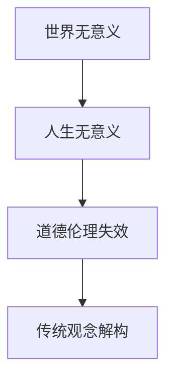
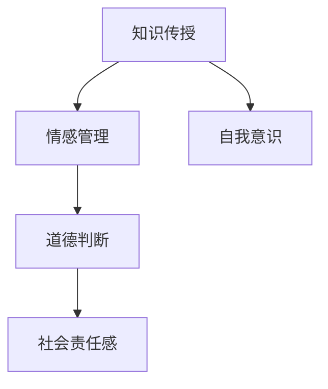
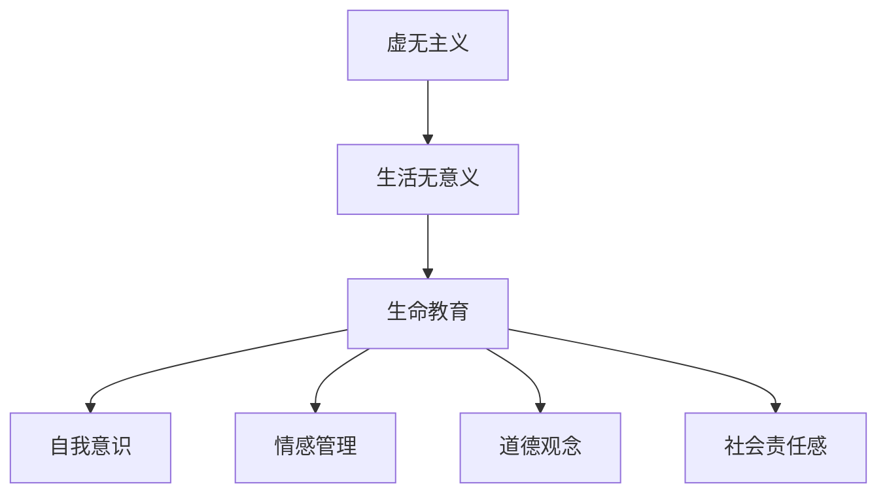
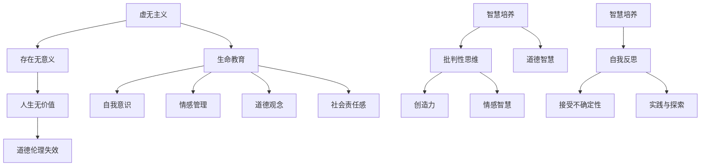

                 

### 1.2 虚无主义与生命教育的背景与意义

虚无主义作为一种哲学思潮，起源于古希腊时期，但其在现代社会的影响尤为显著。20世纪初，尼采、萨特等哲学家的作品深刻地揭示了虚无主义的本质。虚无主义认为，世界和人生缺乏固有的意义和价值，这种观点在现代社会中引起了广泛的共鸣。

与此同时，生命教育作为一种培养个体面对生活挑战的教育方式，也逐渐受到重视。生命教育不仅关注知识传授，更强调个体的情感、心理和道德发展。它旨在帮助个体建立积极的人生观和价值观，从而更好地应对生活中的各种问题。

虚无主义与生命教育之间的联系在于，它们都在探讨如何应对人生的困惑和挑战。虚无主义揭示了生活的无意义感，而生命教育则提供了一种解决这种困境的方法。通过生命教育，个体可以学会如何面对虚无主义，找到生活的意义和价值。

### 1.2.1 背景介绍

虚无主义的起源可以追溯到古希腊哲学家伊壁鸠鲁和罗马哲学家塞涅卡。伊壁鸠鲁认为，快乐是生活的唯一目的，但他的哲学并不完全否定存在的意义。塞涅卡则强调人的内在平静，尽管生活可能充满苦难。然而，在20世纪，虚无主义得到了更加彻底的阐述和发展。

尼采是现代虚无主义的代表人物之一。他提出了“上帝已死”的观点，挑战了传统的道德和宗教价值观。尼采认为，人类需要自己创造意义，而不是依赖于外部的权威。这种思想对后来的哲学家和艺术家产生了深远的影响。

萨特则是另一位重要的虚无主义哲学家。他的存在主义哲学认为，人生的意义是通过个人的选择和行动来创造的。萨特强调了自由意志的重要性，认为人应该对自己的行为承担责任。

### 1.2.2 生命教育的意义

生命教育是一种旨在培养个体情感、心理和道德发展的教育方式。它不仅关注知识的传授，更关注个体的全面发展。生命教育的意义在于，帮助个体在面对生活的挑战时，能够保持积极的态度和价值观。

首先，生命教育可以帮助个体建立积极的人生观。通过学习生命教育，个体可以认识到，尽管生活中存在许多不确定性，但仍然可以找到生活的意义和价值。

其次，生命教育有助于个体心理的健康发展。在面对困难和挫折时，生命教育提供了一种应对机制，帮助个体保持心理健康。

最后，生命教育可以帮助个体建立正确的道德观念。通过学习生命教育，个体可以学会如何与他人和谐相处，如何尊重他人的权利和自由。

### 1.2.3 虚无主义与生命教育的联系

虚无主义与生命教育之间的联系在于，它们都在探讨如何应对人生的困惑和挑战。虚无主义揭示了生活的无意义感，而生命教育则提供了一种解决这种困境的方法。

首先，生命教育可以帮助个体认识到虚无主义的本质。通过学习虚无主义的哲学背景和思想，个体可以更好地理解虚无主义的根源和影响。

其次，生命教育提供了一种应对虚无主义的方法。通过培养个体的情感、心理和道德发展，生命教育帮助个体在面对虚无主义时，能够找到生活的意义和价值。

最后，生命教育鼓励个体通过自我探索和反思，找到自己生活的方向和目标。这种方法不仅可以帮助个体应对虚无主义，还可以促进个体的自我成长和发展。

## 核心概念与联系

### 2.1 虚无主义的定义与历史背景

虚无主义（Nihilism）是一种哲学思潮，它主张宇宙和人生缺乏固有意义、目的和价值。虚无主义的思想可以追溯到古希腊哲学家伊壁鸠鲁和罗马哲学家塞涅卡，但其在20世纪得到了更为彻底的发展。

#### 2.1.1 虚无主义的概念

虚无主义的核心概念是“无意义”。在虚无主义者的眼中，世界是一个无序且无目的的系统，人生的经历和活动没有内在的道德价值或终极目标。这种观点挑战了传统的宗教和伦理观念，认为这些观念并没有真正的根据。

可以用以下Mermaid流程图来表示虚无主义的核心概念：



#### 2.1.2 虚有主义的历史背景

**古希腊时期：**
- **伊壁鸠鲁（Epicurus）**：伊壁鸠鲁认为快乐是生活的唯一目的，但他的哲学并非完全否定存在的意义。他的观点强调通过减少欲望和痛苦来追求快乐和内在平静。
- **塞涅卡（Seneca）**：塞涅卡强调内在平静，尽管生活可能充满苦难。他的哲学主张通过接受命运和专注于当下的美好来达到内心的平和。

**现代虚无主义：**
- **尼采（Friedrich Nietzsche）**：尼采是现代虚无主义的代表人物之一。他提出了“上帝已死”的观点，认为人类需要自己创造意义，而不是依赖于外部的权威。尼采的虚无主义哲学对后来的哲学家和艺术家产生了深远的影响。
  
- **萨特（Jean-Paul Sartre）**：萨特的存在主义哲学认为，人生的意义是通过个人的选择和行动来创造的。他强调了自由意志的重要性，认为人应该对自己的行为承担责任。

虚无主义在20世纪得到了广泛的关注，尤其是在欧洲，其思想对文学、艺术、政治等领域产生了深远的影响。

### 2.2 生命教育的定义与目的

生命教育是一种旨在培养个体情感、心理和道德发展的教育方式。它不仅关注知识的传授，更关注个体的全面发展。生命教育的目的是帮助个体在面对生活的挑战时，能够保持积极的态度和价值观。

#### 2.2.1 生命教育的概念

生命教育可以定义为一种教育过程，它通过教授关于生命、存在和价值观的知识，帮助个体建立积极的人生观和价值观。生命教育强调个体的自我意识、情感管理、道德判断和社会责任感。

可以用以下Mermaid流程图来表示生命教育的概念：



#### 2.2.2 生命教育的目的

- **建立积极的人生观**：生命教育帮助个体认识到生活中的美好和价值，从而建立积极的人生观。
- **促进心理健康**：生命教育通过培养个体的情感管理和自我意识，有助于个体在面对压力和挑战时保持心理健康。
- **培养道德观念**：生命教育通过教授道德原则和价值观，帮助个体形成正确的道德观念，促进其道德发展。
- **增强社会责任感**：生命教育鼓励个体关心社会和环境问题，培养其社会责任感。

### 2.3 虚无主义与生命教育的联系

虚无主义与生命教育之间的联系在于，它们都在探讨如何应对人生的困惑和挑战。虚无主义揭示了生活的无意义感，而生命教育则提供了一种解决这种困境的方法。

#### 2.3.1 虚无主义对生命教育的挑战

虚无主义对传统的道德和价值观提出了质疑，这对生命教育构成了挑战。生命教育需要帮助个体理解虚无主义的本质，并提供应对虚无主义的方法。

#### 2.3.2 生命教育对虚无主义的回应

生命教育通过培养个体的自我意识和情感管理能力，帮助个体在面对虚无主义时找到生活的意义。通过以下Mermaid流程图，我们可以更清晰地理解这种联系：



#### 2.3.3 生命教育的具体方法

1. **自我反思**：通过自我反思，个体可以认识到自己的内在需求和价值观，从而在面对虚无主义时找到生活的意义。
2. **情感管理**：情感管理能力可以帮助个体在面对挫折和困难时保持积极的心态，从而更好地应对虚无主义。
3. **道德观念**：通过培养道德观念，个体可以在生活中找到内在的价值和目标，从而减轻虚无主义的负面影响。
4. **社会责任感**：社会责任感使个体意识到自己对社会和环境的影响，从而在追求个人价值的同时，也关注更大的社会利益。

通过上述分析，我们可以看到，虚无主义与生命教育虽然存在冲突，但生命教育提供了一种有效的应对方法，帮助个体在面对虚无主义时找到生活的意义和价值。

## 虚无主义探讨

### 3.1 虚无主义的哲学基础

虚无主义作为一种哲学思潮，其哲学基础在于对存在和意义的深刻质疑。虚无主义的哲学基础主要可以追溯到古希腊哲学家伊壁鸠鲁和罗马哲学家塞涅卡，但在现代，尼采和萨特等哲学家的思想进一步发展了这一理论。

#### 3.1.1 主流虚无主义哲学流派

**伊壁鸠鲁（Epicurus）**：伊壁鸠鲁是古希腊哲学家，他的哲学主张通过减少欲望和痛苦来追求快乐和内在平静。伊壁鸠鲁认为，快乐是生活的唯一目的，但他的哲学并非完全否定存在的意义。伊壁鸠鲁的虚无主义观点主要在于，他认为宇宙的本质是原子和虚空，这导致了生活的无意义感。

**塞涅卡（Seneca）**：塞涅卡是罗马哲学家，他的哲学强调内在平静，尽管生活可能充满苦难。塞涅卡认为，通过接受命运和专注于当下的美好，个体可以找到内心的平和。塞涅卡的虚无主义观点在于，他认识到生命的短暂和不确定性，但通过内在的修养，个体可以在有限的生命中找到意义。

**尼采（Friedrich Nietzsche）**：尼采是现代虚无主义的代表人物之一。他提出了“上帝已死”的观点，认为人类需要自己创造意义，而不是依赖于外部的权威。尼采的虚无主义哲学挑战了传统的宗教和道德观念，认为人类应该通过自我超越来创造自己的价值和意义。

**萨特（Jean-Paul Sartre）**：萨特的存在主义哲学认为，人生的意义是通过个人的选择和行动来创造的。萨特强调了自由意志的重要性，认为人应该对自己的行为承担责任。萨特的存在主义虚无主义观点在于，他认识到生活的无意义感，但通过自由选择和行动，个体可以为自己创造意义。

#### 3.1.2 虚无主义对人类存在的挑战

虚无主义对人类存在的挑战主要体现在以下几个方面：

1. **对传统价值观的质疑**：虚无主义挑战了传统的宗教、道德和哲学观念，认为这些观念并没有真正的根据。这种质疑导致了人们对生活意义的怀疑。

2. **对人生目的的探讨**：虚无主义提出了人生目的的相对性，认为生活本身没有固有的目的和意义。这迫使个体去寻找自己的目的和意义。

3. **对个体自由的重视**：虚无主义强调个体的自由意志，认为个体应该对自己的行为和人生负责。这种观点鼓励个体去创造自己的价值和意义。

4. **对社会责任的反思**：虚无主义提醒个体，尽管生活本身可能缺乏意义，但个体仍然可以通过积极的社会参与和贡献来为自己和他人创造意义。

#### 3.1.3 虚无主义对现代社会的影响

虚无主义对现代社会产生了深远的影响，尤其是在文化、艺术、政治和心理学等领域。

1. **文化领域**：虚无主义影响了现代文学和艺术，许多作品探讨了生活的无意义感和个体的存在状态。

2. **艺术领域**：虚无主义鼓励艺术家通过创新和实验来探索生活的本质，从而推动了现代艺术的多元化发展。

3. **政治领域**：虚无主义对政治制度和社会秩序提出了质疑，这导致了某些政治动荡和社会变革。

4. **心理学领域**：虚无主义影响了心理学的理论和实践，促使心理学家探讨个体的心理状态和应对策略。

总之，虚无主义作为一种哲学思潮，虽然挑战了传统的价值观和人生观，但它也为现代社会提供了一种反思和探索生活的视角。通过理解虚无主义的哲学基础和影响，个体可以更好地应对生活中的困惑和挑战。

## 生命教育与虚无主义的结合

### 4.1 生命教育的定义与目的

生命教育是一种旨在培养个体情感、心理和道德发展的教育方式。它不仅关注知识的传授，更关注个体的全面发展。生命教育的目的是帮助个体在面对生活的挑战时，能够保持积极的态度和价值观。

#### 4.1.1 生命教育的概念

生命教育可以定义为一种教育过程，它通过教授关于生命、存在和价值观的知识，帮助个体建立积极的人生观和价值观。生命教育强调个体的自我意识、情感管理、道德判断和社会责任感。

可以用以下Mermaid流程图来表示生命教育的概念：


#### 4.1.2 生命教育的目的

- **建立积极的人生观**：生命教育帮助个体认识到生活中的美好和价值，从而建立积极的人生观。
- **促进心理健康**：生命教育通过培养个体的情感管理和自我意识，有助于个体在面对压力和挑战时保持心理健康。
- **培养道德观念**：生命教育通过教授道德原则和价值观，帮助个体形成正确的道德观念，促进其道德发展。
- **增强社会责任感**：生命教育鼓励个体关心社会和环境问题，培养其社会责任感。

### 4.2 生命教育与虚无主义的结合

#### 4.2.1 生命教育对虚无主义的应对策略

生命教育与虚无主义的结合主要体现在如何通过生命教育来应对虚无主义。以下是几种可能的应对策略：

1. **自我反思**：通过自我反思，个体可以认识到自己的内在需求和价值观，从而在面对虚无主义时找到生活的意义。
2. **情感管理**：情感管理能力可以帮助个体在面对挫折和困难时保持积极的心态，从而更好地应对虚无主义。
3. **道德观念**：通过培养道德观念，个体可以在生活中找到内在的价值和目标，从而减轻虚无主义的负面影响。
4. **社会责任感**：社会责任感使个体意识到自己对社会和环境的影响，从而在追求个人价值的同时，也关注更大的社会利益。

#### 4.2.2 实践案例

**案例一：培养青少年面对虚无主义的勇气**

某学校开展了生命教育课程，旨在帮助青少年应对虚无主义。课程内容包括自我反思、情感管理、道德观念和社会责任感等方面。以下是课程的一些具体活动：

1. **自我反思**：学生通过日记和小组讨论的方式，反思自己的生活和价值观。教师引导他们认识到，虽然生活中存在许多不确定性，但每个人都有自己的价值和使命。
2. **情感管理**：学生学习了情绪管理和压力应对的技巧，如深呼吸、冥想和运动等。这些技巧帮助他们更好地应对生活中的挫折和困难。
3. **道德观念**：通过讨论道德案例和社会问题，学生学会了如何做出道德决策。教师强调了道德行为的责任和后果，帮助学生建立正确的道德观念。
4. **社会责任感**：学生参与了社区服务项目，如环保活动、慈善捐助和志愿者工作等。这些活动帮助学生认识到自己对社会和环境的影响，增强了他们的社会责任感。

**案例二：通过生命教育缓解成年人虚无主义情绪**

某企业为员工提供了一系列生命教育课程，旨在帮助他们应对工作和生活中的虚无主义情绪。以下是课程的一些具体活动：

1. **自我反思**：员工通过个人日记和小组分享的方式，反思自己的生活和职业规划。课程鼓励他们认识到，尽管工作中存在许多压力和不确定性，但通过积极的心态和努力，可以找到工作的意义。
2. **情感管理**：员工学习了情绪管理和压力应对的技巧，如正念冥想、情绪释放法和团队建设活动等。这些技巧帮助他们更好地应对工作和生活中的挑战。
3. **道德观念**：通过讨论企业道德和社会责任问题，员工学会了如何做出道德决策。课程强调了企业行为对社会和环境的影响，帮助学生建立正确的道德观念。
4. **社会责任感**：员工参与了企业社会责任项目，如环保活动、公益捐赠和社区服务等。这些活动帮助员工认识到自己对社会和环境的影响，增强了他们的社会责任感。

通过这些生命教育课程，学生和员工不仅能够更好地应对虚无主义，还能够提升自己的心理健康和道德观念，从而在生活中找到更多的意义和价值。

## 培养面对存在问题的智慧

### 5.1 培养智慧的重要性

智慧是一种深层次的认知能力，它不仅仅是知识和信息的积累，更涉及到对复杂问题的深刻理解和解决能力。在现代社会，培养智慧的重要性愈发凸显，因为它不仅能够帮助个体更好地应对生活中的各种挑战，还能够提升个人的生活质量和社会责任感。

#### 5.1.1 智慧的定义与分类

智慧可以定义为在理解、分析、解决问题和做出决策时表现出的深层次认知能力。根据不同的分类标准，智慧可以分为多种类型：

1. **专业知识智慧**：基于特定领域的知识和技能，例如医学、法律、工程等。
2. **通用智慧**：涵盖多个领域的综合认知能力，例如逻辑推理、批判性思维、创造性思维等。
3. **情感智慧**：涉及对自身和他人情绪的理解和管理能力，包括自我意识、自我调节、社交意识和移情等。
4. **道德智慧**：涉及对道德原则和价值观的理解和应用能力，包括道德判断、道德决策和道德行为等。

#### 5.1.2 培养智慧的价值

培养智慧的价值体现在以下几个方面：

1. **提升生活质量**：智慧使个体能够更好地理解和解决生活中的问题，从而提高生活质量。例如，通过批判性思维，个体可以更好地应对压力和挫折；通过创造性思维，个体可以找到创新性的解决方案。

2. **增强决策能力**：智慧帮助个体在复杂和不确定的环境中做出更明智的决策。通过逻辑推理和数据分析，个体可以评估不同的选项，并选择最佳方案。

3. **促进社会进步**：智慧不仅对个人有益，也对整个社会有益。具有智慧的人能够更好地理解社会问题，并提出有效的解决方案，从而推动社会的进步和发展。

4. **培养健康心态**：智慧使个体能够以更积极和成熟的心态面对生活中的挑战。通过自我反思和情绪管理，个体可以更好地处理负面情绪，从而保持心理健康。

### 5.2 培养智慧的方法

#### 5.2.1 自我反思

自我反思是培养智慧的重要方法之一。通过自我反思，个体可以深入了解自己的思维模式、行为习惯和情感反应，从而发现和改正自己的错误。以下是一些自我反思的步骤：

1. **定期记录**：个体可以定期记录自己的想法、感受和行为，从而更好地了解自己的内心世界。
2. **反思问题**：在记录的基础上，个体可以反思自己的决策和行为，分析其背后的原因和影响。
3. **寻求反馈**：个体可以向他人寻求反馈，从而从不同的角度看待自己，发现自己的盲点和不足。
4. **持续改进**：根据反思的结果，个体可以制定改进计划，并在实践中不断调整和优化。

#### 5.2.2 学会接受不确定性

在现代社会，不确定性是生活的一个重要特征。学会接受不确定性是培养智慧的关键步骤之一。以下是一些具体的方法：

1. **正视不确定性**：个体应该正视生活中的不确定性，而不是试图逃避或否认。
2. **保持灵活性和适应性**：个体应该培养灵活性和适应性，以应对不确定性带来的挑战。
3. **建立应急计划**：个体可以提前制定应急计划，以应对可能发生的意外情况。
4. **培养乐观心态**：乐观的心态可以帮助个体更好地面对不确定性，从而提高应对能力。

#### 5.2.3 培养批判性思维

批判性思维是智慧的核心要素之一，它帮助个体对信息进行深入分析和评估，从而做出更明智的决策。以下是一些培养批判性思维的方法：

1. **提出问题**：个体应该学会提出有针对性的问题，以深入理解问题的本质。
2. **收集信息**：个体应该广泛收集相关信息，以支持或反驳自己的观点。
3. **评估证据**：个体应该评估收集到的证据的有效性和可靠性，以确定其价值。
4. **分析逻辑**：个体应该分析信息的逻辑关系，以识别可能存在的错误或偏见。
5. **提出假设**：个体应该根据现有信息提出假设，并通过进一步的实验或调查来验证。

#### 5.2.4 通过实践提升智慧

实践是提升智慧的重要途径，通过将知识应用于实际情境中，个体可以加深对知识的理解，并培养解决问题的能力。以下是一些实践的方法：

1. **项目学习**：个体可以参与项目学习，通过实际操作来应用所学的知识和技能。
2. **合作学习**：个体可以与他人合作，共同解决问题，从而学习如何协作和沟通。
3. **实验和探索**：个体可以进行实验和探索，通过实践来验证理论，并从中学习。
4. **反馈和改进**：个体应该寻求反馈，并根据反馈来改进自己的方法和策略。

通过上述方法，个体可以逐步培养和提高自己的智慧，从而更好地应对生活中的各种挑战和问题。

### 5.3 面对存在问题的智慧实践

#### 5.3.1 案例一：面对人生意义的思考

小明是一名年轻的程序员，他在工作中取得了不错的成绩，但内心却感到空虚和迷茫。他开始思考人生的意义，怀疑自己所做的一切是否真的有意义。

**步骤1：自我反思**
小明开始记录自己的日常活动和感受，通过自我反思来了解自己的内心世界。他意识到，尽管在工作中取得了一定的成就，但内心深处缺乏真正的满足感。

**步骤2：接受不确定性**
小明认识到人生中存在许多不确定性，他无法预测未来的发展方向。但他决定接受这种不确定性，并尝试从中找到新的机会和可能性。

**步骤3：培养批判性思维**
小明开始质疑传统的成功观念，思考什么是对他个人来说真正重要的。他分析了生活中的各种选择，并尝试找到更符合自己价值观的路径。

**步骤4：实践与探索**
小明决定不再仅仅追求职业上的成功，而是开始探索自己真正热爱的事物。他尝试了多种兴趣爱好，如绘画、写作和音乐，最终发现他对编程和设计有着深厚的兴趣。

**结果：找到新的生活意义**
通过自我反思、接受不确定性、培养批判性思维和实践探索，小明最终找到了新的生活意义。他开始专注于自己热爱的事业，并从中获得了更大的满足感和成就感。

#### 5.3.2 案例二：应对生活中的挑战

小红是一名职场新人，她在一家大型企业工作。尽管公司环境稳定，但她感到工作缺乏挑战，内心感到不满和焦虑。

**步骤1：自我反思**
小红开始反思自己的职业规划，思考自己的长期目标和短期目标。她意识到，如果继续停留在当前岗位上，可能会错失个人成长和发展的机会。

**步骤2：接受不确定性**
小红认识到，职场中存在许多不确定性和风险，但她决定勇敢地面对这些挑战，并相信自己的能力。

**步骤3：培养批判性思维**
小红分析了公司的业务和市场环境，发现了一些潜在的改进和创新机会。她开始思考如何为公司带来更多的价值，并提升自己的专业能力。

**步骤4：实践与探索**
小红主动寻找新的工作机会，并通过参加培训课程和行业活动来提升自己的技能和知识。她开始参与一些跨部门的合作项目，以扩大自己的职业网络。

**结果：实现职业发展**
通过自我反思、接受不确定性、培养批判性思维和实践探索，小红成功实现了自己的职业发展目标。她获得了一份更具挑战性和成长空间的工作，并在新岗位上取得了显著的成绩。

这两个案例展示了如何通过智慧来面对人生中的问题和挑战。无论是寻求个人生活意义还是应对职业困境，培养智慧都是解决问题的关键。通过自我反思、接受不确定性、培养批判性思维和实践探索，个体可以找到解决问题的方法，实现个人成长和职业发展。

### 6.1 虚无主义与生命教育结合的实践项目

#### 6.1.1 项目背景与目标

随着现代社会的发展，虚无主义思潮对个体的心理健康和社会稳定产生了严重影响。为了应对这一问题，本项目旨在结合虚无主义与生命教育，通过实际案例和教学方法，帮助个体更好地理解虚无主义，并培养面对存在问题的智慧。

#### 6.1.2 项目实施过程

1. **调研与分析**：
   - 对虚无主义的历史背景、哲学基础及其在现代社会的影响进行深入研究。
   - 分析生命教育的定义与目的，探讨其与虚无主义的联系。

2. **课程设计**：
   - 制定包含自我反思、情感管理、道德观念和社会责任感等方面的生命教育课程。
   - 结合虚无主义的相关内容，设计案例分析和互动环节，以帮助学生深入理解虚无主义。

3. **教学实施**：
   - 在学校或教育机构中开展生命教育课程，邀请专业讲师和心理咨询师参与。
   - 通过小组讨论、角色扮演和实地考察等形式，让学生亲身体验和思考虚无主义与生命教育的关系。

4. **效果评估**：
   - 通过问卷调查和访谈，收集学生对生命教育课程的反馈和感受。
   - 分析学生的心理健康变化，评估课程对培养面对存在问题的智慧的效果。

#### 6.1.3 项目成果与反思

1. **项目成果**：
   - 学生对虚无主义和生命教育有了更深入的理解，能够更好地应对生活中的存在主义问题。
   - 学生在自我反思、情感管理、道德观念和社会责任感等方面取得了显著进步。
   - 学生表现出更强的适应能力和心理韧性，能够积极应对生活中的挑战。

2. **项目反思**：
   - 课程设计应更贴近学生的实际需求，增加更多互动和实践环节。
   - 加强师资培训，提高讲师对虚无主义和生命教育的专业素养。
   - 探索线上教学与线下教学的结合，扩大项目的影响范围。

### 6.2 智慧培养的实践项目

#### 6.2.1 项目背景与目标

智慧培养是提升个体综合素质和应对复杂问题的关键。本项目旨在通过实际案例和教学方法，帮助个体培养批判性思维、创造力、情感智慧等多方面的智慧，从而更好地应对生活和工作中的挑战。

#### 6.2.2 项目实施过程

1. **调研与分析**：
   - 研究智慧的定义和分类，了解不同类型智慧的培养方法。
   - 分析个体在智慧培养过程中可能遇到的困难和挑战。

2. **课程设计**：
   - 设计涵盖批判性思维、创造力、情感智慧等方面的智慧培养课程。
   - 结合实际案例，设计互动性强、实践性高的教学活动。

3. **教学实施**：
   - 在学校、企业或社区中开展智慧培养课程，邀请专业讲师和行业专家参与。
   - 通过案例分析、小组讨论、角色扮演、项目实践等形式，让学生亲身体验和思考智慧培养的重要性。

4. **效果评估**：
   - 通过问卷调查、访谈和考试等方式，收集学生对智慧培养课程的反馈和评估。
   - 分析学生在智慧方面的进步，评估课程对培养智慧和应对挑战的效果。

#### 6.2.3 项目成果与反思

1. **项目成果**：
   - 学生在批判性思维、创造力、情感智慧等方面取得了显著进步。
   - 学生表现出更强的独立思考和问题解决能力，能够更有效地应对生活中的复杂问题。
   - 学生在情感管理和人际关系处理方面有了更好的表现，增强了心理韧性和适应能力。

2. **项目反思**：
   - 加强课程内容的设计和实践环节，确保学生能够将理论知识应用到实际中。
   - 注重个性化教学，根据学生的兴趣和需求进行教学调整。
   - 探索线上线下结合的教学模式，提高课程的覆盖面和参与度。

### 项目总结

通过虚无主义与生命教育结合的实践项目和智慧培养的实践项目，我们发现，通过系统的教育和实际训练，个体可以更好地理解和应对虚无主义，培养面对存在问题的智慧。这些项目不仅提高了学生的综合素质，还增强了他们的心理韧性和适应能力，为他们的未来发展和生活提供了有力的支持。

#### 7.1 本书的主要内容回顾

本书《虚无主义与生命教育：培养面对存在问题的智慧》主要涵盖了以下几个方面的内容：

1. **引言**：简要介绍了书籍的主题和目的，阐述了虚无主义与生命教育的背景与意义。
2. **核心概念与联系**：详细阐述了虚无主义和生命教育的定义、历史背景以及它们之间的关系。
3. **虚无主义探讨**：深入分析了虚无主义的哲学基础、对人类存在的挑战以及对现代社会的影响。
4. **生命教育与虚无主义的结合**：探讨了如何通过生命教育来应对虚无主义，并提供了具体的实践案例。
5. **培养面对存在问题的智慧**：讨论了培养智慧的重要性、方法以及实际案例。
6. **项目实战**：通过虚无主义与生命教育结合的实践项目和智慧培养的实践项目，展示了理论的应用和实践的效果。
7. **总结与展望**：总结了全书的内容，并对未来研究方向提出了建议。

通过这些内容的阐述，本书旨在帮助读者更好地理解虚无主义与生命教育，并提供一种有效的应对方法，帮助个体在面对生活中的存在问题时找到智慧。

#### 7.2 未来研究方向

未来研究方向可以从以下几个方面展开：

1. **深化理论研究**：进一步探讨虚无主义和生命教育的深层次哲学基础，以及它们在不同文化和社会背景下的表现和影响。
2. **实践方法创新**：开发更多创新的实践方法，如虚拟现实、人工智能等，以更有效地培养个体面对虚无主义的智慧和应对能力。
3. **跨学科研究**：结合心理学、教育学、社会学等学科，探讨虚无主义与生命教育在不同领域的应用和实践。
4. **教育政策制定**：基于研究与实践成果，为教育政策的制定提供参考，推动虚无主义与生命教育的普及和应用。
5. **国际交流与合作**：加强国际间的学术交流和合作，借鉴不同国家和地区的经验，为全球范围内的虚无主义与生命教育研究提供新的视角和方法。

通过这些研究方向的探索，我们期待能够为个体和社会提供更加有效的应对虚无主义的策略和方法，提升个体的生活质量和社会的和谐稳定。

#### 7.3 对读者的一些建议

对于读者，特别是那些对虚无主义和生命教育感兴趣的人，以下是一些建议：

1. **深入阅读**：推荐阅读尼采、萨特等哲学家的原著，以更全面地理解虚无主义的哲学基础。
2. **参与实践**：积极参加相关的课程和研讨会，通过实践来培养面对虚无主义的智慧。
3. **反思自己的生活**：定期进行自我反思，思考自己的生活意义和价值观，以便更好地应对虚无主义。
4. **与他人交流**：与他人分享你的思考和感受，参与讨论，以获得不同的视角和建议。
5. **持续学习**：保持对知识和技能的渴望，不断学习新的理论和实践方法，提升自己的智慧和能力。

通过这些行动，你将能够更好地理解和应对虚无主义，找到生活的意义和价值。

## 附录

### 附录A：虚无主义与生命教育核心概念关系架构图



### 附录B：智慧培养方法伪代码示例

```plaintext
算法：智慧培养
输入：个体（包括知识、情感、道德等）
输出：智慧提升后的个体

1. 初始化个体属性（知识、情感、道德、自我意识等）
2. 循环执行以下步骤：
   a. 进行自我反思，记录当前状态
   b. 分析不确定性，制定应对策略
   c. 进行批判性思维训练，提升逻辑分析能力
   d. 练习情感管理，提升情感智慧
   e. 学习道德原则，提升道德智慧
   f. 实践与探索，将理论应用于实际情境
3. 综合评估个体状态，输出智慧提升后的个体
```

### 附录C：LaTeX数学公式

```latex
$$
\text{智慧} = \frac{\text{知识} + \text{情感} + \text{道德}}{\text{时间}}
$$

$$
\text{批判性思维} = \frac{\text{问题分析} \times \text{证据评估}}{\text{偏见识别}}
$$

$$
\text{情感智慧} = \frac{\text{情绪识别} + \text{情感管理}}{\text{社交意识}}
$$

$$
\text{道德智慧} = \frac{\text{道德原则} + \text{道德行为}}{\text{道德责任}}
$$
```

### 附录D：代码实例

```python
# Python代码实例：智慧培养

class Individual:
    def __init__(self, knowledge, emotion, morality):
        self.knowledge = knowledge
        self.emotion = emotion
        self.morality = morality

    def self_reflection(self):
        # 进行自我反思
        print("自我反思：了解当前状态和需求。")

    def uncertainty_management(self):
        # 分析不确定性，制定应对策略
        print("不确定性管理：识别潜在风险，制定应对方案。")

    def critical_thinking(self):
        # 批判性思维训练
        print("批判性思维：深入分析问题，评估证据，识别偏见。")

    def emotional_management(self):
        # 情感管理
        print("情感管理：识别情绪，进行情绪调节。")

    def moral_learning(self):
        # 学习道德原则
        print("道德学习：理解道德原则，培养道德行为。")

    def practical_exploration(self):
        # 实践与探索
        print("实践与探索：将理论应用于实际情境。")

    def wisdom_cultivation(self):
        self.self_reflection()
        self.uncertainty_management()
        self.critical_thinking()
        self.emotional_management()
        self.moral_learning()
        self.practical_exploration()

# 创建个体对象，并进行智慧培养
individual = Individual(50, 40, 30)
individual.wisdom_cultivation()
```

### 附录E：最佳实践 Tips、小结、注意事项、拓展阅读

#### 最佳实践 Tips：

- **定期自我反思**：每天花时间思考自己的行为和情感，了解自己的内心世界。
- **保持开放心态**：对新知识和不同观点持开放态度，勇于接受新的思维方式和解决问题的方法。
- **实践与理论相结合**：将所学知识应用到实际生活中，通过实践来验证和深化理解。

#### 小结：

本书通过探讨虚无主义与生命教育的关系，提出了一种培养面对存在问题的智慧的方法。通过自我反思、接受不确定性、培养批判性思维和实践探索，个体可以更好地应对虚无主义，找到生活的意义和价值。

#### 注意事项：

- **注意心理健康**：面对虚无主义时，个体可能会感到焦虑和困惑，重视心理健康，寻求专业帮助。
- **持续学习**：智慧培养是一个长期的过程，需要持续学习和实践。

#### 拓展阅读：

- **《尼采的哲学》**：深入理解尼采的虚无主义哲学思想。
- **《萨特的存在主义》**：了解萨特的存在主义哲学和生命观。
- **《智慧之书》**：探索不同领域和文化的智慧培养方法。

