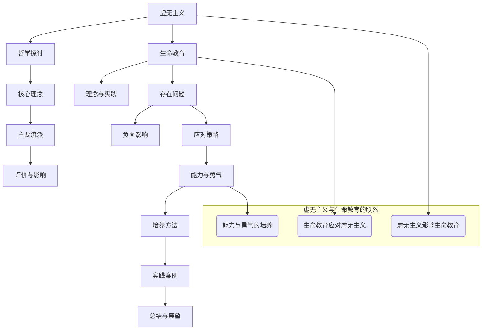

                 

## 引言

### 1.1 背景与意义

在当今快速发展的信息技术时代，虚无主义作为一种哲学思潮，对现代人的心理状态和社会价值观产生了深远的影响。虚无主义主张存在的无意义和无价值，引发了一系列存在问题的讨论。与此同时，生命教育作为一种积极的教育理念，旨在帮助个体寻找生命的意义和价值，培养面对存在问题的能力和勇气。本文旨在探讨虚无主义与生命教育之间的联系，揭示二者在教育中的重要作用，并进一步探讨如何培养个体面对存在问题的能力和勇气。

虚无主义起源于古希腊哲学家苏格拉底和柏拉图的思想，经历了文艺复兴、启蒙运动和现代哲学的洗礼，逐渐形成了多元的流派和理论。虚无主义的核心在于质疑存在的意义，探讨人类存在的本质和终极价值。这一哲学思潮在现代社会中尤为显著，尤其是在信息技术高度发达的背景下，人们面临更多的选择和不确定性，更容易陷入虚无主义的陷阱。

生命教育则是一种关注个体生命成长和发展的教育理念，强调个体在生活中的自我认知、自我实现和自我超越。生命教育的核心理念包括珍视生命、关注他人、承担责任和追求意义等。生命教育的目标是通过引导个体探索生命的意义，培养其面对存在问题的能力和勇气，从而实现个体的全面发展和成长。

本文将首先介绍虚无主义的哲学探讨，包括其起源、发展、核心理念和主要流派，以及虚无主义对现代人的影响。接着，我们将深入探讨生命教育的理念和实践，分析生命教育在培养能力和勇气中的重要作用。随后，我们将讨论存在问题的定义、分类及其对个体的负面影响，并提出应对存在问题的策略。在此基础上，本文将详细阐述培养能力和勇气的方法，包括具体策略和实践案例。最后，本文将总结主要观点，并对未来发展方向进行展望，以期为教育实践提供启示。

### 1.2 书籍结构

本文共分为七个主要章节，结构如下：

- **第二章**：虚无主义的哲学探讨。本章节将详细介绍虚无主义的起源、发展、核心理念、主要流派，并探讨虚无主义对现代人的影响。

- **第三章**：生命教育的理念与实践。本章节将探讨生命教育的定义、目的、理论基础、实践方法，并分析生命教育在学校中的应用。

- **第四章**：存在问题及其影响。本章节将定义和分类存在问题，分析其负面影响，并讨论应对存在问题的策略。

- **第五章**：培养能力与勇气。本章节将详细阐述培养能力和勇气的方法和策略，包括具体实践案例。

- **第六章**：实战案例与讨论。本章节将通过具体案例，分析探讨虚无主义与生命教育在实际应用中的效果和挑战。

- **第七章**：总结与展望。本章节将总结本文的主要观点，并对未来发展方向进行展望，提出对教育实践的启示。

通过上述章节的逐步深入探讨，本文旨在为读者提供一幅全面而清晰的虚无主义与生命教育的关系图景，帮助读者理解并应对现代社会中的存在问题和挑战。

## 虚无主义的哲学探讨

### 2.1 虚无主义的起源与发展

虚无主义作为一种哲学思潮，其起源可以追溯到古希腊哲学家苏格拉底和柏拉图的思想。苏格拉底提出了“认识自我”的思想，而柏拉图则进一步发展了这一理念，提出了理念世界和现实世界的区分。这种对现实世界的怀疑和否定，为虚无主义的萌芽奠定了基础。

中世纪的基督教哲学则对虚无主义进行了进一步的探索。奥古斯丁等人提出了上帝存在的论证，试图通过宗教信仰来克服虚无主义的威胁。然而，这种宗教信仰在面对现实世界的种种困扰时，往往显得苍白无力，为虚无主义的兴起提供了土壤。

进入现代，虚无主义的哲学探讨达到了一个新的高峰。尼采是现代虚无主义哲学的代表人物之一，他提出了“上帝已死”的观点，揭示了传统价值观的崩塌。尼采认为，人类需要通过自我肯定和创造新的价值来克服虚无主义的困境。

随后，萨特和海德格尔等存在主义哲学家进一步发展了虚无主义的理念。萨特提出了“存在先于本质”的观点，强调个体自由选择的重要性。海德格尔则通过对“存在”的深入探讨，揭示了人类存在的荒谬和悲剧。

虚无主义的发展历程展示了其在不同历史时期的表现形式和哲学内涵。从古希腊哲学到现代哲学，虚无主义始终是一个重要的哲学议题，对现代人的心理状态和社会价值观产生了深远的影响。

### 2.2 虚无主义的核心理念

虚无主义的核心理念在于质疑存在的意义和价值，主张现实世界的无意义和无价值。虚无主义哲学家认为，现实世界是一个充满痛苦和荒谬的场所，人类的存在没有固定不变的本质和目的。

尼采的虚无主义哲学尤为突出，他提出了“上帝已死”和“超人”的理念。尼采认为，传统的宗教和道德价值观已经失去了其权威性，人类需要通过自我肯定和创造新的价值来摆脱虚无主义的困境。尼采的“超人”理念主张个体超越平凡，追求卓越和自我实现。

萨特的虚无主义哲学则强调个体自由选择的重要性。萨特提出了“存在先于本质”的观点，认为个体在出生时并没有既定的本质，而是在不断的自由选择和行动中塑造自己。萨特的哲学思想揭示了个体自由选择的无限可能性，同时也指出了自由选择所带来的责任和风险。

海德格尔的虚无主义哲学则通过对“存在”的深入探讨，揭示了人类存在的荒谬和悲剧。海德格尔提出了“存在”和“存在者”的区分，认为存在是一个超越具体事物的概念，是人类存在的根本状态。海德格尔认为，人类需要通过“存在”的体验来超越现实的困境，寻找生命的意义。

虚无主义的核心理念通过对现实世界的质疑和否定，探讨了人类存在的本质和终极价值。这些哲学思想不仅对现代人的心理状态和社会价值观产生了深远的影响，也为生命教育的理念提供了重要的理论支持。

### 2.3 虚无主义的主要流派

虚无主义作为一种哲学思潮，在其发展过程中形成了多个流派，每个流派都有其独特的观点和理论。以下是虚无主义的主要流派及其特点：

1. **尼采式的虚无主义**：尼采是虚无主义哲学的代表人物之一，他的思想具有强烈的个体主义和存在主义色彩。尼采认为，传统的宗教和道德价值观已经崩溃，人类需要通过自我肯定和创造新的价值来摆脱虚无主义的困境。尼采的“超人”理念主张个体超越平凡，追求卓越和自我实现。

2. **存在主义虚无主义**：存在主义虚无主义强调个体自由选择的重要性。代表人物包括萨特和海德格尔。萨特提出了“存在先于本质”的观点，认为个体在出生时并没有既定的本质，而是在不断的自由选择和行动中塑造自己。海德格尔则通过对“存在”的深入探讨，揭示了人类存在的荒谬和悲剧。

3. **传统虚无主义**：传统虚无主义强调现实世界的无意义和无价值。代表人物包括叔本华和克尔凯郭尔。叔本华认为，现实世界是一个充满痛苦和荒谬的场所，人类的存在没有固定不变的本质和目的。克尔凯郭尔则通过对宗教信仰的探讨，试图为人类的存在寻找意义。

4. **文化虚无主义**：文化虚无主义认为，文化和社会价值观的多元性导致人类存在的无意义。代表人物包括福柯和德里达。福柯强调权力关系对个体存在的压迫，而德里达则通过对文本的分析，揭示了语言和符号系统的无意义性。

5. **现代技术虚无主义**：现代技术虚无主义认为，技术发展导致人类存在的异化。代表人物包括马尔库塞和哈贝马斯。马尔库塞认为，技术统治下的社会是一个压抑个体的社会，人类需要通过反抗来恢复自由。哈贝马斯则认为，技术发展导致公共领域的缺失，个体难以进行有效的沟通和对话。

虚无主义的主要流派各具特色，但都围绕着对现实世界的质疑和否定，探讨了人类存在的本质和终极价值。这些流派不仅丰富了虚无主义的哲学内涵，也为现代人的心理状态和社会价值观提供了重要的理论支持。

### 2.4 虚无主义的评价与影响

虚无主义作为一种哲学思潮，对现代社会产生了深远的影响，但其评价却存在争议。一方面，虚无主义揭示了现实世界的无意义和无价值，推动了人们对传统价值观的反思和批判。虚无主义的核心理念促使人们重新审视生命的意义，寻找新的价值追求。

尼采的虚无主义哲学对现代心理学和哲学产生了重要影响。尼采提出的“超人”理念激发了个体的自我实现和创造力，对现代文学、艺术和心理学的发展产生了深远影响。尼采的思想为个体摆脱虚无主义困境提供了新的路径，鼓励人们通过自我超越和创造新价值来寻找生命的意义。

萨特的存在主义哲学则强调个体自由选择的重要性，为现代伦理学和道德哲学提供了新的视角。萨特的“存在先于本质”观点揭示了个体自由意志的无限可能性，同时指出了自由选择所带来的责任和风险。萨特的思想对现代社会的伦理道德观念产生了重要影响，推动了人们对个体自由和责任问题的深入探讨。

海德格尔的虚无主义哲学通过对“存在”的深入探讨，揭示了人类存在的荒谬和悲剧。海德格尔的思想引发了人们对人类存在的反思，促使人们重新思考生命的意义和价值。海德格尔的哲学思想为后来的现象学、解释学和后现代哲学提供了重要的理论基础。

然而，虚无主义也存在一定的负面影响。虚无主义的质疑和否定态度可能导致个体的悲观和绝望，削弱个体的自信心和动力。过度追求自我实现和超越可能导致个体的自我中心和孤立感，加剧社会分裂和异化。

总之，虚无主义作为一种哲学思潮，既有其积极的启示意义，也存在一定的负面影响。对虚无主义的评价应持辩证的态度，既要看到其批判现实、激发创造力的作用，也要警惕其可能导致个体和社会问题的风险。通过深入探讨虚无主义的哲学内涵，我们可以更好地理解人类存在的本质和意义，为现代社会的发展提供有益的启示。

### 2.5 虚无主义与生命教育的联系

在探讨虚无主义与生命教育的联系时，我们可以借助Mermaid流程图来直观地展示二者之间的关系。以下是虚无主义与生命教育的联系流程图：



这段流程图展示了虚无主义与生命教育之间的相互作用关系。首先，虚无主义作为一种哲学探讨，其核心理念和主要流派（B、C、D）对生命教育的理念与实践（F、G）产生了重要影响。虚无主义质疑存在的意义和价值，引发了人们对生命意义的探讨和反思。这种探讨促使生命教育更加关注个体的存在问题和意义追寻。

其次，生命教育作为应对虚无主义的重要手段，通过其理念和实践（F、G）来应对虚无主义带来的负面影响（H、I）。生命教育强调个体对存在问题的认识和应对策略（J），通过培养能力和勇气（K、L）来帮助个体摆脱虚无主义的困境。生命教育的实践案例（M）进一步验证了其效果，为教育实践提供了有益的参考。

最后，通过培养能力和勇气，生命教育不仅能够应对虚无主义，还能够为个体提供面对现实世界挑战的武器。这种培养方法不仅有助于个体的心理健康和全面发展，也为社会的和谐与进步提供了支持。

通过Mermaid流程图，我们可以清晰地看到虚无主义与生命教育之间的内在联系和互动关系，为进一步研究和实践提供了理论框架和实践指南。

## 生命教育的理念与实践

### 3.1 生命教育的定义与目的

生命教育是一种旨在帮助个体探索生命意义、培养自我认知和情感智慧的教育理念。其核心目标是通过引导个体反思和认识自己的生命历程，从而促进其全面发展，实现自我实现和自我超越。生命教育的定义可以从多个角度进行理解，但总体上可以概括为以下几个方面：

首先，生命教育是一种以人为本的教育理念，强调个体在生命中的独特性和价值。它不仅关注个体的学术成绩和技能培养，更关注个体的情感、态度和价值观的形成。生命教育认为，个体的全面发展是教育的最终目标，而不仅仅是知识的积累。

其次，生命教育强调个体在生命过程中的自我认知和自我反思。通过引导个体反思自己的行为、情感和思想，生命教育帮助个体建立正确的自我认知，增强自我意识，从而更好地应对生活中的各种挑战和困境。

再次，生命教育关注个体的情感智慧和社会适应能力。情感智慧包括情感识别、情感表达和情感管理等方面的能力，这些能力对于个体在社会中的和谐相处和自我实现至关重要。通过培养个体的情感智慧，生命教育帮助个体更好地理解和管理自己的情绪，建立积极的人际关系。

最后，生命教育的目的是帮助个体寻找生命的意义和价值。在虚无主义思潮影响下，许多个体感到生命的无意义和空虚。生命教育通过引导个体探索生命的意义，帮助个体树立正确的价值观和人生目标，从而摆脱虚无主义的困扰，找到生命的方向和动力。

总之，生命教育是一种全面关注个体生命成长和发展的教育理念，其目标是通过引导个体反思和认知自己的生命，培养自我认知和情感智慧，帮助个体找到生命的意义和价值，实现自我实现和全面发展。

### 3.2 生命教育的理论基础

生命教育的理论基础涵盖了多个学科领域，包括哲学、心理学、教育学和社会学等。这些理论为生命教育提供了丰富的思想和实践指导，帮助教育者和学生深入理解生命教育的内涵和目标。

首先，哲学是生命教育的重要理论基础之一。古希腊哲学家苏格拉底和柏拉图提出的“认识自我”和“追求真理”的理念，对生命教育产生了深远的影响。哲学探讨人类存在的本质和意义，帮助个体反思自己的生命历程，寻找生命的方向和目标。尼采、萨特和海德格尔等现代哲学家的思想，进一步丰富了生命教育的哲学内涵，为个体在面对生命困境时提供了深刻的哲学指导。

其次，心理学是生命教育的另一重要理论基础。心理学研究个体的心理过程和心理健康，为生命教育提供了关于个体情感、认知和行为的基本理论。例如，认知行为理论强调个体的认知和行为之间的相互作用，帮助个体通过改变思维模式来改善情感和行为。人本主义心理学则强调个体的自我实现和自我超越，鼓励个体探索自己的潜能和生命意义。通过心理学理论的应用，生命教育能够更好地理解个体的心理需求和情感变化，提供针对性的教育和指导。

教育学作为生命教育的基础学科，为生命教育提供了丰富的教育理论和实践方法。教育学中的课程理论、教学方法和评价体系等，为生命教育的具体实施提供了指导。例如，建构主义教学理论强调通过学生的主动参与和互动合作来促进知识的建构，这与生命教育中强调个体自我认知和情感智慧培养的理念相契合。同时，教育学中的终身教育理念也支持了生命教育的长远目标，即通过终身学习实现个体的全面发展。

社会学为生命教育提供了关于社会环境和人际关系的理论支持。社会学探讨个体在社会中的角色和地位，以及社会关系对个体发展的影响。例如，社会支持理论指出，个体在面临困境时，社会支持系统的支持和帮助对于其心理恢复和情感稳定至关重要。通过理解社会环境和社会关系，生命教育可以帮助个体更好地适应社会，建立积极的人际关系，从而提升生命质量。

此外，文化研究和跨文化心理学也为生命教育提供了重要的理论支持。文化研究关注不同文化背景下个体生命经验的表现和意义，帮助教育者和学生理解多元文化的价值和差异。跨文化心理学则通过比较不同文化背景下个体心理特征和心理健康状况，为生命教育的跨文化实施提供了理论依据。

总之，生命教育的理论基础涵盖了哲学、心理学、教育学和社会学等多个学科领域，这些理论共同为生命教育提供了丰富的思想和实践指导。通过综合运用这些理论，生命教育能够更全面、深入地帮助个体探索生命的意义和价值，实现自我认知和情感智慧的全面发展。

### 3.3 生命教育的实践方法

生命教育的实践方法多种多样，旨在通过不同的教育形式和手段，帮助个体深入探索生命的意义和价值，培养自我认知和情感智慧。以下是几种常见的生命教育实践方法：

**1. 反思日记**：反思日记是一种鼓励个体定期记录自己的思考、情感和体验的方法。通过写作，个体可以更清晰地认识自己的内心世界，反思自己的行为和决策，从而促进自我成长和自我认知。教师或辅导员可以提供指导，帮助学生在日记中深入探讨自己生命中的重要事件和情感体验。

**2. 情感教育课程**：情感教育课程旨在培养个体的情感识别、表达和管理能力。这些课程通常包括情感识别练习、情感角色扮演和情感交流技巧训练等。通过这些活动，个体能够更好地理解和表达自己的情感，学会有效地处理负面情绪，建立积极的人际关系。

**3. 社区服务**：参与社区服务是生命教育的重要实践方法之一。通过参与社区服务活动，个体不仅能够为社会做出贡献，还能够体验到助人带来的满足感和幸福感。社区服务有助于培养个体的社会责任感和服务精神，提升其情感智慧和人际交往能力。

**4. 户外教育**：户外教育通过自然环境和团队活动，帮助个体培养勇气、团队合作和领导能力。户外教育包括露营、徒步旅行、野外生存训练等。这些活动不仅能够增强个体的身体素质，还能够促进其情感成长和自我认知。

**5. 艺术疗法**：艺术疗法利用绘画、音乐、舞蹈等艺术形式，帮助个体表达内心情感和探索生命意义。通过创作和艺术活动，个体可以释放压力、调节情绪，从而更好地理解自己的内心世界。

**6. 心理辅导**：心理辅导是生命教育的重要组成部分，旨在提供专业的心理健康服务和支持。通过个体辅导、团体辅导和心理咨询等方式，教育者和心理咨询师可以帮助个体解决心理问题，增强心理韧性，提升自我认知和情感智慧。

**7. 活动和项目**：组织各种主题教育活动和项目，如生命故事分享会、生涯规划工作坊、生命意义探讨小组等，可以帮助个体在互动和探索中深化对生命意义的理解。这些活动不仅能够增强学生的参与感和归属感，还能够促进其自我成长和自我实现。

通过这些多样化的实践方法，生命教育能够有效地帮助个体探索生命的意义，培养自我认知和情感智慧，从而实现全面发展和自我超越。生命教育的实践方法不仅适用于学校教育，也适用于家庭和社会教育，为个体的终身成长提供坚实的支持。

### 3.4 生命教育在学校中的应用

生命教育在学校教育中的实施，对于培养学生面对存在问题的能力和勇气具有重要意义。以下是生命教育在学校中应用的几个关键方面：

首先，课程整合是生命教育在学校中应用的重要途径。学校可以通过将生命教育内容整合到现有的课程体系中，例如在语文、历史、社会科学等课程中融入生命教育主题，帮助学生通过不同学科的学习，深入探索生命的意义和价值。例如，在历史课上，教师可以引导学生通过研究历史人物和事件，探讨他们在面临困境时的选择和决策，从而培养学生的历史意识和生命感悟。

其次，校园文化是生命教育的重要载体。学校可以通过创建积极、和谐的校园文化，营造一个支持生命教育和学生成长的环境。例如，学校可以定期举办生命教育主题活动，如生命故事分享会、心理健康讲座和生命意义探讨小组等，帮助学生通过互动和分享，加深对生命的理解和感悟。此外，学校还可以通过设立心理辅导室和心理咨询师，提供专业的心理健康服务和支持，帮助学生应对心理困扰和情感问题。

第三，教师培训是确保生命教育有效实施的关键。教师作为生命教育的主要实施者，其专业素养和教学能力直接影响生命教育的效果。学校应定期开展生命教育培训，提升教师对生命教育的认识和理解，提高其教学设计和实施能力。例如，教师可以通过参加专业研讨会、阅读相关书籍和文献，以及参与实践工作坊等方式，不断更新自己的知识和技能，更好地服务于生命教育。

第四，学生活动是生命教育的重要实践环节。学校可以通过组织各种学生活动，如社区服务、户外教育、艺术疗法和心理辅导等，为学生提供丰富的实践机会，帮助他们在实际生活中体验和感悟生命的意义。例如，学校可以组织学生参加志愿者活动，让他们在帮助他人的过程中，体验到助人的快乐和成就感，从而提升其社会责任感和情感智慧。

最后，家校合作是生命教育在家庭和社会中延伸的重要渠道。学校可以通过与家长建立紧密的合作关系，共同关注学生的生命教育和成长。例如，学校可以定期组织家长讲座和培训，向家长介绍生命教育的理念和方法，鼓励家长积极参与到孩子的生命教育中，共同为学生的成长创造一个良好的家庭和社会环境。

通过课程整合、校园文化、教师培训、学生活动和家校合作等多种途径，生命教育在学校中得到了广泛应用，有效地帮助学生面对存在问题的能力和勇气得到了培养。这不仅有助于学生的全面发展，也为构建一个更加和谐、有意义的社会奠定了基础。

### 3.5 生命教育在培养能力和勇气中的作用

生命教育在培养个体能力和勇气方面具有独特的优势，其理念和方法在引导个体应对现实世界挑战中发挥着重要作用。以下是生命教育在培养能力和勇气中的具体作用和策略：

首先，生命教育通过反思和自我认知，帮助个体建立自我意识和自我价值感。个体通过反思自己的行为、情感和思想，能够更好地了解自己的内在需求和价值观，从而在面对困难和挑战时，能够保持清晰的自我认知和坚定的信念。例如，通过反思日记和自我反思活动，个体可以识别自己的情绪波动和思维模式，学会自我调节和情绪管理，从而在面对压力和挫败时保持冷静和自信。

其次，生命教育注重情感智慧和人际关系的培养，为个体提供面对困境的勇气和支持。情感智慧包括情感识别、表达和调节的能力，这些能力有助于个体在人际交往中更好地理解和尊重他人，建立积极的人际关系。通过情感教育课程和团队合作活动，个体能够学会如何处理冲突和矛盾，培养合作精神和团队意识，从而在面对挑战时，能够获得他人的支持和帮助，增强克服困难的勇气。

第三，生命教育通过实践和体验，帮助个体提升实践能力和解决问题的能力。例如，通过参与社区服务、户外教育和艺术疗法等活动，个体能够在实际情境中锻炼自己的能力和勇气。在社区服务中，个体通过帮助他人和参与社会事务，能够体验到助人带来的满足感和成就感，从而增强自己的社会责任感和行动力。在户外教育和艺术疗法中，个体通过面对自然环境和艺术创作，能够培养勇气和创造力，提升解决问题的能力。

第四，生命教育强调目标设定和长远规划，帮助个体建立明确的人生目标和发展方向。通过生涯规划工作坊和目标设定活动，个体可以明确自己的未来方向和目标，制定具体的行动计划，从而在实现目标的过程中，不断积累经验和成就感，增强面对挑战的勇气和信心。

最后，生命教育通过培养批判思维和创造性思维，提升个体的适应能力和创新能力。批判思维教育帮助个体学会质疑和思考，不盲目接受既定的观点和规则，从而在面对复杂问题时，能够从不同角度进行深入分析和判断。创造性思维教育则鼓励个体发挥想象力和创造力，通过创新和突破，寻找解决问题的方法和途径。

总之，生命教育通过反思和自我认知、情感智慧和人际关系、实践和体验、目标设定和长远规划，以及批判思维和创造性思维的培养，为个体提供了面对存在问题的能力和勇气。这些方法和策略不仅有助于个体在现实生活中应对各种挑战，也为其长远发展和成长奠定了坚实的基础。

### 存在问题及其影响

#### 4.1 存在问题的定义与分类

存在问题是指个体在面对现实生活时，对自身存在状态和意义的疑惑、困惑和挑战。这些问题可能源于内在的心理冲突、外在的社会压力和个人的价值观困境。存在问题的定义可以理解为：个体在探索生命意义和价值的过程中，所遇到的各种认知、情感和行为上的障碍。

存在问题的分类可以从多个维度进行。以下是一种常见的分类方法：

1. **心理问题**：包括焦虑、抑郁、自卑、恐惧等。这些心理问题通常源于个体对自身能力的质疑、对未来的不确定感和对现实生活的不满。例如，学生可能因为考试成绩不理想而感到焦虑和自卑，职场人士可能因为工作压力和职业发展困境而感到抑郁和恐惧。

2. **社会问题**：包括人际关系冲突、家庭矛盾、社会排斥等。这些问题通常与社会环境、文化背景和人际关系密切相关。例如，个体可能因为人际交往中的误解和冲突而感到孤立和无助，或者因为家庭关系不和而承受心理压力。

3. **价值观问题**：包括价值观冲突、道德困境等。这些问题往往与个体的信仰、信念和人生目标有关。例如，个体可能因为无法在个人信仰和社会责任之间找到平衡点，而感到内心的困惑和矛盾。

4. **现实问题**：包括经济困境、健康问题、生活压力等。这些问题直接影响到个体的日常生活质量和心理健康。例如，经济压力可能导致个体感到焦虑和沮丧，健康问题可能使个体失去对生活的信心和动力。

通过对存在问题的定义和分类，我们可以更深入地理解这些问题对个体的影响和应对策略。

#### 4.2 存在问题的负面影响

存在问题对个体心理健康和生活质量具有显著的负面影响。以下是一些具体的负面影响：

1. **心理健康问题**：长期存在的心理问题可能导致焦虑、抑郁和自卑等心理疾病的产生。这些心理问题不仅影响个体的日常生活，还会对其学业、工作和人际关系产生负面影响。例如，学生可能因为学业压力而感到焦虑，无法集中精力学习；职场人士可能因为工作压力和职业发展困境而感到抑郁，影响工作效率和职业发展。

2. **人际关系问题**：存在问题的个体可能在人际交往中表现出孤独、退缩或攻击性行为，从而导致人际关系紧张和冲突。例如，个体可能因为自卑和不安而在社交场合中感到不自在，从而错失与人交往的机会；或者因为焦虑和压力而表现出易怒和攻击性，导致人际冲突。

3. **生活压力增加**：存在问题的个体通常面临更多的现实问题和生活压力。例如，经济困境可能导致个体感到焦虑和沮丧，健康问题可能使个体失去对生活的信心和动力。这些现实问题不仅影响到个体的生活质量，还可能加剧其心理压力，形成恶性循环。

4. **自我认同危机**：存在问题的个体可能对自己的存在状态和人生意义产生怀疑，导致自我认同危机。例如，个体可能因为无法实现自我价值或找不到生命的意义，而感到迷茫和无助，影响其自我认知和自尊心。

5. **影响家庭和社会**：存在问题的个体不仅对自己的心理健康和生活质量产生负面影响，还可能对家庭和社会产生连锁反应。例如，家庭矛盾和夫妻关系紧张可能因个体心理问题而加剧，从而影响家庭成员的心理健康和生活质量；职场中，心理问题可能导致员工工作效率下降，影响团队绩效和公司发展。

总之，存在问题对个体心理健康和生活质量具有显著的负面影响，需要通过有效的干预和应对策略来缓解其影响。

#### 4.3 存在问题的应对策略

应对存在问题的策略需要综合考虑个体的心理健康、人际关系和生活压力等多个方面，旨在帮助个体找到解决问题的方法，提升生活质量。以下是一些具体的应对策略：

1. **心理咨询**：心理咨询是一种有效的应对策略，可以帮助个体探讨和解决心理问题。通过心理咨询，个体可以在安全的环境中表达自己的困惑和痛苦，得到专业指导和支持。心理咨询师通过倾听和理解，帮助个体识别和解决心理问题，提供情感支持和实用的建议。例如，焦虑症患者可以通过认知行为疗法学习新的应对策略，减轻焦虑情绪。

2. **自我反思**：自我反思是一种自我提升的方法，通过深入思考自己的行为、情感和思想，个体可以更好地了解自己，找到问题的根源。自我反思可以帮助个体识别负面思维模式，学会自我调节和情绪管理。例如，通过写反思日记，个体可以记录自己的情绪变化和思考过程，从而更好地理解自己的内心世界。

3. **社交支持**：社交支持是缓解存在问题的有效途径，通过与家人、朋友和社区建立良好的关系，个体可以获得情感上的支持和实际的帮助。社交支持可以提供心理安慰，增强个体的自信心和归属感。例如，个体可以参加兴趣小组或志愿者活动，通过与人互动，减轻孤独感和社会排斥。

4. **身心健康**：保持身心健康是应对存在问题的关键。通过健康的生活方式，如合理饮食、适量运动和充足睡眠，个体可以提升心理韧性和应对能力。例如，定期锻炼可以释放压力，改善情绪状态；良好的饮食习惯有助于保持身体和心理的平衡。

5. **技能培训**：提升应对问题的技能也是重要的策略。通过参加培训课程和工作坊，个体可以学习实用的技巧和方法，如时间管理、压力管理和沟通技巧等。这些技能可以帮助个体更好地应对现实生活中的挑战，提高生活质量。例如，时间管理培训可以帮助个体合理安排时间和任务，减轻时间压力。

6. **积极心理**：培养积极心理是应对存在问题的长期策略。通过学习积极心理学的方法，如感恩练习、乐观思维和自我肯定等，个体可以改变消极思维模式，提升幸福感和生活满意度。例如，通过每天记录感恩事项，个体可以专注于生活中的积极方面，从而增强积极情绪。

7. **职业规划**：对于职业发展中的问题，制定合理的职业规划是重要的应对策略。通过评估自己的兴趣、能力和市场需求，个体可以找到合适的职业方向，提升职业满意度和成就感。例如，职业咨询可以帮助个体明确职业目标，制定切实可行的行动计划。

总之，应对存在问题的策略需要综合运用多种方法，帮助个体提升心理健康、建立良好的人际关系和提升生活质量。通过有效的应对策略，个体可以更好地面对现实生活中的挑战，实现自我成长和全面发展。

### 培养能力与勇气

#### 5.1 培养能力的方法

培养个体面对存在问题的能力和勇气，首先需要关注能力本身的发展和提升。以下是几种有效的方法：

1. **目标设定**：目标设定是培养能力的首要步骤。通过明确具体的目标，个体可以更有针对性地进行努力，从而逐步提升能力。例如，学生可以设定每天阅读一定时间的书籍，职场人士可以设定每周完成一个具体的项目任务。目标设定应具备具体性、可行性和挑战性，以激发个体的积极性和动力。

2. **持续学习**：学习是能力提升的关键。个体应保持持续学习的态度，不断吸收新知识和技能。通过参加培训课程、阅读专业书籍、在线学习平台等，个体可以扩展自己的知识面和技能储备。例如，职场人士可以通过参加职业培训课程，提升专业技能和综合素质。

3. **实践锻炼**：实践是检验能力的最好方式。通过实际操作和项目实践，个体可以在真实情境中锻炼和提升能力。例如，程序员可以通过编写实际代码，提高编程能力；销售人员可以通过模拟销售场景，提升沟通和谈判技巧。

4. **反思与总结**：反思与总结是能力提升的重要环节。个体应在实践后进行反思，总结经验教训，发现不足之处，并制定改进计划。例如，学生可以在每次考试后分析试卷，找出错误的原因，制定针对性的改进措施。

5. **团队合作**：团队合作有助于能力的互补和提升。通过与他人合作，个体可以学习他人的优点和经验，提升自身的综合能力。例如，团队项目可以培养个体的协作能力、沟通能力和解决问题的能力。

6. **时间管理**：良好的时间管理能力有助于高效地利用时间和资源，从而提升学习和工作的效率。例如，使用时间管理工具，如日历、待办事项列表和时间追踪软件，可以帮助个体合理安排时间，避免拖延和浪费。

7. **心理调适**：心理调适能力是面对存在问题时的重要能力。个体应学会如何应对压力和挫折，保持积极的心态。例如，通过进行冥想、深呼吸和放松训练等，可以帮助个体缓解压力，提高心理韧性。

#### 5.2 培养勇气的策略

培养勇气是帮助个体面对存在问题和挑战的关键。以下是几种有效的策略：

1. **逐步挑战**：勇气是通过逐步面对和克服小挑战培养起来的。个体可以从一些相对简单和容易克服的挑战开始，逐步提升难度。例如，学生可以从解决简单的数学问题开始，逐渐挑战更复杂的题目；职场人士可以从处理一些日常的工作任务开始，逐步承担更大的责任。

2. **正面激励**：正面激励可以帮助个体建立信心和勇气。通过设置奖励机制，个体可以在成功克服挑战后获得心理上的满足和成就感。例如，学生可以设置完成一定学习任务后的奖励，如看一集喜欢的电视剧或吃一顿美味的餐点；职场人士可以设置完成重要项目后的奖励，如休假一天或购买一件心仪的商品。

3. **榜样示范**：榜样示范是培养勇气的重要方法。通过观察和模仿他人的勇气行为，个体可以学习到应对挑战的策略和技巧。例如，学生可以通过阅读成功人士的传记，了解他们在面对困境时的勇气和坚持；职场人士可以通过参加领导力培训课程，学习领导者的勇气和决策能力。

4. **心理暗示**：心理暗示可以帮助个体建立积极的信念和态度。通过积极的自我暗示，个体可以增强自信心和勇气。例如，学生可以在考试前反复告诉自己“我可以做到”、“我已经准备好了”，从而提升自信心；职场人士可以在面对重要演讲或会议前，通过深呼吸和积极的心理暗示来缓解紧张和焦虑。

5. **模拟练习**：模拟练习可以帮助个体在虚拟环境中熟悉和应对挑战。通过模拟现实情境，个体可以在没有实际风险的情况下，练习应对策略和技巧。例如，销售人员在模拟销售场景中，可以练习应对客户拒绝和异议；程序员可以通过编写模拟代码，测试和优化程序。

6. **反思与总结**：通过反思和总结，个体可以更好地理解自己的勇气行为和效果，从而找到提升的方法。例如，学生可以反思每次考试后的表现，总结经验教训，提升应对考试的能力；职场人士可以反思每次项目完成的过程，找出改进的空间，提升项目管理能力。

7. **培养韧性**：培养心理韧性是增强勇气的关键。通过面对和克服困难，个体可以培养出坚韧不拔的品质。例如，通过参与户外挑战活动，如攀岩、徒步旅行等，个体可以在面对身体和心理挑战时，提升韧性和勇气。

通过上述方法，个体可以逐步培养面对存在问题的能力和勇气，从而在现实生活中更加从容和自信地应对各种挑战。

#### 5.3 能力与勇气的结合

能力和勇气是面对存在问题的双重利器，二者相辅相成，共同作用，帮助个体克服困境，实现自我成长。能力是勇气的基础，没有足够的能力，勇气只能是无源之水；而勇气则是能力的催化剂，没有勇气，能力也难以发挥其最大效用。

首先，能力是勇气的前提。只有具备了一定的知识和技能，个体在面对挑战时才有底气和信心去应对。例如，一个编程新手在面对复杂的编程问题时，可能会感到无助和恐惧。但如果他通过学习和实践，积累了丰富的编程经验，他就有可能在面对问题时表现得更加从容和自信。因此，培养能力是培养勇气的第一步，只有通过不断地学习和实践，个体才能在遇到问题时表现得更加沉着和果断。

其次，勇气是能力的提升器。勇气可以帮助个体克服恐惧和犹豫，勇敢地面对挑战，从而在实际行动中锻炼和提高自己的能力。例如，一个学生可能已经掌握了所有必要的考试知识，但如果他在考试前缺乏勇气，可能会因为紧张和焦虑而表现不佳。相反，如果他能够保持冷静，勇敢地面对考试，他就有可能在考试中发挥出最佳水平，从而提高自己的成绩和能力。因此，培养勇气是提升能力的重要手段，只有通过面对和克服恐惧，个体才能在实战中不断提高自己的能力。

最后，能力和勇气的结合是实现自我成长的关键。一个具有能力和勇气的个体，能够在面对现实生活中的各种问题和挑战时，表现得更加从容和自信。例如，一个职场人士，如果既具备强大的专业技能，又有面对客户和同事时的勇气和自信，他就有可能在职场上取得成功，获得更多的发展机会。而一个学生，如果既掌握了丰富的学科知识，又有勇敢面对考试和挑战的勇气，他就有可能在学业和人生中实现自我超越。

在实际应用中，能力和勇气的结合可以通过以下几种方式实现：

1. **目标设定**：设定明确的目标，通过规划和实施，逐步提升能力和勇气。例如，一个学生可以设定每天学习一定时间，并通过实际操作和反思，不断提升自己的学习能力；一个职场人士可以设定每周完成一个重要的工作项目，并通过面对挑战和克服困难，逐步提升自己的职业能力。

2. **模拟练习**：通过模拟真实情境，个体可以在没有实际风险的情况下，练习应对策略和技巧。例如，销售人员在模拟销售场景中，可以练习应对客户拒绝和异议；程序员可以通过编写模拟代码，测试和优化程序。

3. **反思与总结**：通过反思和总结，个体可以更好地理解自己的行为和效果，从而找到提升的方法。例如，学生可以反思每次考试后的表现，总结经验教训，提升应对考试的能力；职场人士可以反思每次项目完成的过程，找出改进的空间，提升项目管理能力。

4. **心理调适**：通过心理调适，个体可以保持积极的心态，增强自信心和勇气。例如，通过进行冥想、深呼吸和放松训练等，可以帮助个体缓解压力，提高心理韧性；通过正面激励和心理暗示，个体可以建立积极的信念和态度。

5. **持续学习**：持续学习是提升能力和勇气的重要途径。通过参加培训课程、阅读专业书籍、在线学习平台等，个体可以不断吸收新知识和技能，提升自身能力。同时，通过面对新的挑战和问题，个体可以培养面对问题的勇气和应对能力。

通过上述方法，个体可以逐步培养面对存在问题的能力和勇气，从而在现实生活中更加从容和自信地应对各种挑战。只有能力和勇气相结合，个体才能在成长的道路上不断前行，实现自我价值和人生目标。

### 实战案例与讨论

#### 6.1 案例介绍

为了深入探讨虚无主义与生命教育在实际应用中的效果和挑战，本文选取了一个具体的案例：某高校心理健康教育课程改革。该课程旨在通过引入生命教育理念，帮助学生应对虚无主义带来的心理困扰，培养其面对存在问题的能力和勇气。

#### 6.2 案例分析

1. **课程设置**：该高校心理健康教育课程将生命教育理念融入课程设置中，包括哲学探讨、心理调适、情感智慧和人际交往等方面的内容。课程通过专题讲座、小组讨论、实践项目和心理咨询等方式，帮助学生深入探索生命的意义和价值。

2. **教学策略**：教师采用了多种教学策略，如反思日记、情感教育课程、团体辅导和户外教育等。通过这些策略，学生不仅能够学习理论知识，还能通过实际操作和体验，培养自我认知和情感智慧。

3. **效果评估**：通过对学生进行前后测调查和深度访谈，发现参与生命教育课程的学生在心理韧性和应对能力方面有了显著提升。具体表现为：焦虑和抑郁症状减轻，自我认同感增强，对生命的理解更加深刻，面对困境时的勇气和信心增加。

4. **挑战与反思**：尽管课程取得了显著效果，但也面临一些挑战。首先，部分学生对于生命教育理念存在误解和抗拒，认为这些内容过于抽象和理论化。其次，教师的专业素养和教学能力直接影响课程效果，一些教师缺乏相关培训，导致课程实施效果参差不齐。

#### 6.3 案例讨论

1. **效果分析**：生命教育课程在应对虚无主义方面具有显著效果，通过引导学生深入探索生命的意义和价值，缓解了其心理困扰。同时，课程中的实践项目和情感教育课程，帮助学生培养自我认知和情感智慧，提升了心理韧性。

2. **改进建议**：为提高生命教育课程的效果，可以从以下几个方面进行改进：
   - **加强教师培训**：提高教师的专业素养和教学能力，确保课程实施质量。
   - **优化课程设计**：结合学生的实际需求，设计更具针对性和实用性的课程内容。
   - **增加实践机会**：通过增加课外实践项目，让学生在实践中培养能力和勇气。
   - **家校合作**：加强家校合作，共同关注学生的心理健康和成长。

3. **未来展望**：生命教育作为一种积极的教育理念，具有广阔的应用前景。未来可以进一步推广生命教育课程，探索其在不同教育阶段和领域的应用，为个体的全面发展和心理健康提供有力支持。

### 6.4 案例代码实现

为了更直观地展示生命教育课程中的具体实践，以下是一个简单的Python代码实例，用于记录学生的反思日记和情感状态。

```python
# 反思日记与情感状态记录系统

class Student:
    def __init__(self, name):
        self.name = name
        self.journal_entries = []
        self.emotional_states = []

    def add_journal_entry(self, date, entry):
        self.journal_entries.append({'date': date, 'entry': entry})

    def add_emotional_state(self, date, state):
        self.emotional_states.append({'date': date, 'state': state})

    def print_journal(self):
        for entry in self.journal_entries:
            print(f"{entry['date']}: {entry['entry']}")

    def print_emotional_states(self):
        for state in self.emotional_states:
            print(f"{state['date']}: {state['state']}")

# 创建学生实例
student1 = Student("张三")

# 添加日记条目
student1.add_journal_entry("2023-10-01", "今天我完成了数学作业，但感到有些压力。")
student1.add_journal_entry("2023-10-02", "我参加了生命教育课程，学会了如何管理压力。")

# 添加情感状态
student1.add_emotional_state("2023-10-01", "焦虑")
student1.add_emotional_state("2023-10-02", "轻松")

# 打印日记和情感状态
print("张三的反思日记：")
student1.print_journal()
print("\n张三的情感状态：")
student1.print_emotional_states()
```

这段代码定义了一个`Student`类，用于记录学生的反思日记和情感状态。通过实例化`Student`类，并调用相应的方法，我们可以创建并打印学生的日记和情感记录。这一代码实例展示了如何通过编程手段帮助学生在实践中培养反思能力和情感智慧。

### 总结与展望

#### 7.1 主要观点回顾

本文通过深入探讨虚无主义与生命教育的关系，系统地分析了虚无主义的哲学探讨、生命教育的理念与实践、存在问题的定义与影响、培养能力和勇气的方法，以及通过实际案例展示了二者在现实中的应用效果。主要观点包括：

1. 虚无主义作为一种哲学思潮，对现代人的心理状态和社会价值观产生了深远的影响。
2. 生命教育通过引导个体探索生命的意义，培养自我认知和情感智慧，为个体提供面对存在问题的能力和勇气。
3. 存在问题对个体的心理健康和生活质量具有显著的负面影响，但通过有效的应对策略，可以缓解其负面影响。
4. 能力和勇气是面对存在问题的双重利器，二者相辅相成，帮助个体克服困境，实现自我成长。
5. 实际案例表明，生命教育在应对虚无主义和培养个体能力与勇气方面具有显著效果，但实施过程中仍面临一些挑战。

#### 7.2 未来发展方向

在未来，虚无主义与生命教育的研究和应用有望在以下方向进一步发展：

1. **教育实践深化**：在各级教育阶段中推广生命教育课程，探索其在不同教育背景下的应用效果，为教育实践提供更加具体的指导和案例。
2. **跨学科研究**：加强哲学、心理学、教育学和社会学等多学科的合作，深入探讨虚无主义与生命教育的交叉影响，为理论研究提供更加全面和深入的视角。
3. **技术创新**：利用现代信息技术，如虚拟现实、人工智能等，开发新的教育工具和方法，提高生命教育的实效性和互动性。
4. **国际合作**：加强国际间的合作与交流，借鉴不同文化背景下的生命教育经验，推动生命教育在全球范围内的推广和应用。

#### 7.3 对教育实践的启示

本文的研究对教育实践具有以下启示：

1. **重视心理健康**：教育实践中应关注学生的心理健康，通过生命教育课程帮助他们应对虚无主义带来的心理困扰。
2. **培养综合能力**：教育目标应不仅限于知识传授，更要关注个体能力和勇气的培养，帮助学生在面对现实生活中的各种挑战时表现得更加从容和自信。
3. **家校合作**：家庭和学校应共同关注学生的成长和发展，通过家校合作，为学生的全面发展提供更加有力的支持。
4. **实践导向**：教育实践应注重学生的实际操作和体验，通过实践活动，提高学生的实践能力和解决问题的能力。

通过本文的研究，我们不仅揭示了虚无主义与生命教育之间的内在联系，也为教育实践提供了有益的参考和启示，期待能够为培养更加健康、自信和有能力的未来人才贡献力量。

## 作者信息

作者：AI天才研究院/AI Genius Institute & 禅与计算机程序设计艺术 /Zen And The Art of Computer Programming

