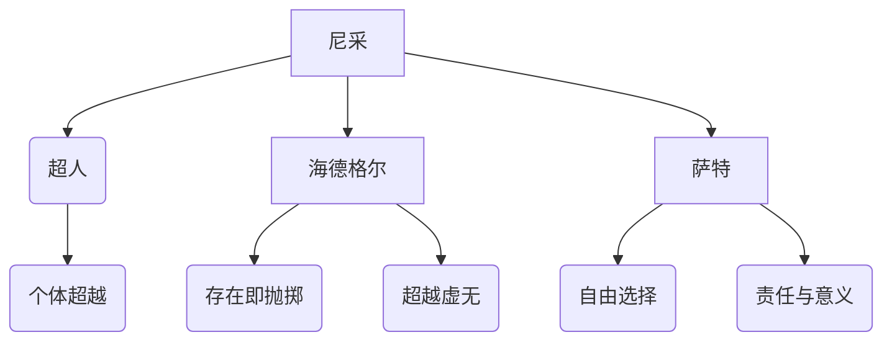

                 

### 导言

在现代社会，虚无主义作为一种哲学思想，引起了广泛的关注。虚无主义的核心观点是人生缺乏固有的意义和价值，因此，人们常常感到迷茫、无助和焦虑。与此同时，心理健康问题也日益突出，越来越多的人面临压力和情绪困扰。在这样的背景下，本文旨在探讨虚无主义与身心健康之间的关系，并寻找在压力中寻找生活平衡和意义的策略。

首先，我们需要了解虚无主义的基本概念和起源。虚无主义作为一种哲学思潮，起源于19世纪末20世纪初的欧洲。它认为现实世界缺乏意义和目的，人类追求的种种价值都是虚幻的。这种思想在一定程度上反映了现代社会中人们对于生活意义的困惑和迷茫。

接下来，我们将探讨虚无主义与心理健康的关系。虚无主义可能导致人们产生消极情绪，如抑郁、焦虑和无意义感。同时，心理健康问题也可能加剧虚无主义的感受。因此，理解这种相互影响对于维护身心健康至关重要。

文章的第二部分将深入探讨虚无主义的起源与哲学思考。我们将介绍几位对虚无主义有重要影响的哲学家，如尼采、海德格尔和萨特，并分析他们的核心思想和相互联系。

在第三部分，我们将探讨虚无主义的心理学解读。这一部分将讨论虚无主义与心理健康的关系，以及心理学是如何解读虚无主义的。

第四部分将分析压力的本质与影响。我们将探讨压力的来源、生理与心理影响，以及社会文化因素对压力的影响。

第五部分将介绍寻找生活平衡的策略。我们将探讨减轻压力、提高生活质量的方法，以及如何在压力中寻找生活的意义。

第六部分将关注心理健康与生活平衡的关系。我们将提出维护心理健康的策略，并探讨心理健康对生活平衡的重要性。

最后，在结论部分，我们将总结全文内容，并指出未来研究方向。通过这篇文章，我们希望能够帮助读者更好地理解虚无主义与身心健康之间的关系，以及如何在压力中找到生活平衡和意义。### 背景介绍

#### 虚无主义的概念与起源

虚无主义（Nihilism）作为一种哲学思想，可以追溯到古希腊时期的“虚无”概念。在古希腊哲学中，虚无被视为一种非存在的状态，是对存在的否定。然而，虚无主义的现代概念主要起源于19世纪末的欧洲，特别是德国和俄罗斯。当时，欧洲正经历着剧烈的社会动荡和思想变革，许多哲学家和思想家开始质疑传统的宗教信仰和道德观念。

**主要虚无主义哲学家与思想**

1. **尼采（Friedrich Nietzsche）**

尼采被认为是虚无主义的代表人物之一。他的思想强调生命本身的超越和个体价值的创造。尼采提出了“上帝已死”的命题，指出传统的宗教信仰和道德体系已经崩溃，人类面临着前所未有的精神危机。他主张个体应该通过自我超越，创造自己的价值观和意义。

2. **海德格尔（Martin Heidegger）**

海德格尔的存在主义哲学也包含了虚无主义的元素。他的著作《存在与时间》探讨了人类存在的本质和意义。海德格尔认为，人类在世上的存在是一种“抛掷”（Dasein），意味着我们总是在面对虚无的深渊。他提出了“存在即抛掷”的概念，强调了人类存在的本真状态。

3. **萨特（Jean-Paul Sartre）**

萨特的存在主义哲学对虚无主义有着重要的影响。他的著作《存在与虚无》探讨了存在的本质和人的自由意志。萨特认为，人类的存在是自由和选择的，但在这种自由中，也包含着对意义的否定。他提出了“自由即选择，选择即责任”的观点，强调了个体在虚无主义背景下的责任和意义。

**核心概念与联系**

虚无主义的核心概念是对于生命意义和价值的基本质疑。尼采、海德格尔和萨特虽然对虚无主义有不同的解读，但他们都认为现实世界缺乏固有的意义和价值。这种思想在某种程度上反映了现代社会中人们对于生活意义的困惑和迷茫。

- **尼采：个体超越与社会重建**

尼采认为，虚无主义的出现是因为个体在社会中的孤立和异化。他主张个体应该通过自我超越，重建个体与社会之间的关系。尼采的“超人”（Übermensch）概念，强调了个体在超越虚无主义的过程中，应该追求卓越和创造力。

- **海德格尔：存在的本真状态**

海德格尔认为，虚无主义揭示了人类存在的本真状态。他在《存在与时间》中提出了“抛掷”的概念，认为人类总是在面对虚无的深渊。然而，海德格尔也认为，通过存在，人类可以超越虚无，找到存在的意义。

- **萨特：自由与责任**

萨特的存在主义哲学强调了自由和责任。他认为，虽然人类的存在是自由的，但这种自由也意味着责任。在虚无主义的背景下，人类需要通过自由选择，创造出自己的价值观和意义。

**Mermaid流程图**



通过以上分析，我们可以看到虚无主义在不同哲学家中的核心概念和联系。尼采、海德格尔和萨特虽然对虚无主义有不同的解读，但他们都强调了个体在面对虚无主义背景下的自我超越和责任。这种思想对于我们理解虚无主义与身心健康的关系具有重要意义。### 虚无主义的心理学解读

虚无主义在心理学领域的解读主要围绕其对个体心理健康的影响，以及个体如何应对这种思想带来的心理困扰。虚无主义可能导致一系列心理问题，如抑郁症、焦虑症、无意义感等。同时，心理学也提供了多种方法来理解虚无主义，并帮助个体应对其带来的挑战。

#### 虚无主义与心理健康的关系

虚无主义可能会导致心理健康问题的原因主要有以下几点：

1. **无意义感**：虚无主义的核心观点是现实世界缺乏固有的意义和价值，这种思想可能导致个体感到生活无意义，从而引发抑郁和无意义感。

2. **焦虑**：面对虚无主义的思想，个体可能会感到焦虑和不确定性，因为他们无法确定自己的生活和行动是否有意义。

3. **逃避现实**：虚无主义可能导致个体逃避现实，拒绝面对生活中的问题和挑战，这进一步加剧了心理健康问题。

4. **自卑和自尊问题**：虚无主义可能导致个体对自己的价值产生怀疑，从而影响自尊和自卑感。

#### 心理学防御机制

面对虚无主义带来的心理困扰，个体通常会使用心理学防御机制来应对。以下是一些常见的防御机制：

1. **否认**：个体可能否认虚无主义的存在，拒绝接受现实世界的无意义。

2. **理性化**：个体可能试图通过理性思考来解释虚无主义，从而找到一种应对方式。

3. **投射**：个体可能将自己的无意义感投射到外部世界，将责任归咎于他人或环境。

4. **退行**：个体可能会退回到童年时期的依赖和安全感，以逃避现实。

#### 心理学解读

心理学家对虚无主义的解读主要集中在以下几个方面：

1. **存在主义心理学**：存在主义心理学认为，虚无主义揭示了人类存在的本质。存在主义心理学家如维克多·弗兰克尔（Viktor Frankl）提出了“意义疗法”，认为人类可以通过寻找生活的意义来克服虚无主义。

2. **认知行为疗法**：认知行为疗法（CBT）可以帮助个体识别和改变消极思维模式，从而减轻虚无主义带来的负面影响。

3. **人本主义心理学**：人本主义心理学家如卡尔·罗杰斯（Carl Rogers）认为，个体可以通过自我实现和自我接纳来应对虚无主义。

#### 伪代码：虚无主义心理防御机制的实现

以下是一个简化的伪代码示例，用于实现个体在面临虚无主义思想时的心理防御机制：

```python
# 输入：个体面临的虚无主义思想
# 输出：防御后的心理状态

def defense_against_nihilism(nihilist_thought):
    # 步骤1：识别并否认虚无主义思想
    if nihilist_thought:
        deny_thought = "现实并非如此，我的生活是有意义的。"
    
    # 步骤2：理性化虚无主义思想
    elif nihilist_thought:
        rationalize_thought = "虚无主义揭示了人类存在的深刻问题，我们需要重新定义生活的意义。"
    
    # 步骤3：投射虚无主义思想
    elif nihilist_thought:
        project_thought = "这个问题并非仅仅是我自己，是整个社会的问题。"
    
    # 步骤4：退行
    elif nihilist_thought:
        retreat_thought = "我可以暂时逃避现实，让自己回到一个更安全的环境中。"
    
    # 输出防御后的心理状态
    return deny_thought, rationalize_thought, project_thought, retreat_thought
```

通过以上分析，我们可以看到虚无主义对个体心理健康的影响以及心理学提供的多种应对方法。理解虚无主义的心理学解读，对于帮助个体应对心理困扰具有重要意义。### 压力的本质与影响

#### 压力的定义

压力（Stress）是指个体在面对外部环境变化时产生的生理和心理反应。它通常与不确定性、挑战和威胁相关，可能来源于工作、人际关系、财务问题或其他生活事件。

#### 压力的来源

压力的来源可以分为以下几类：

1. **工作压力**：工作负荷过大、工作不满足、职场竞争和人际关系问题都可能引发压力。

2. **人际关系**：家庭关系、朋友关系和社交网络中的冲突和矛盾可能成为压力源。

3. **财务问题**：经济压力、债务和不确定的收入来源都可能对个体造成压力。

4. **健康问题**：疾病、健康担忧和医疗费用也是常见的压力来源。

5. **社会文化因素**：社会变迁、文化冲突和不确定性也可能引发压力。

#### 压力的生理与心理影响

压力对个体的影响可以从生理和心理两个方面进行探讨：

1. **生理影响**：
   - **免疫系统功能下降**：长期压力可能导致免疫系统功能下降，增加患病的风险。
   - **心血管系统问题**：压力可能导致高血压、心脏病等心血管疾病。
   - **消化系统问题**：压力可能引发胃痛、消化不良等消化系统问题。
   - **肌肉紧张和疼痛**：压力可能导致肌肉紧张和疼痛。

2. **心理影响**：
   - **情绪问题**：压力可能导致焦虑、抑郁、愤怒等情绪问题。
   - **认知功能下降**：压力可能影响记忆、注意力和判断力。
   - **行为问题**：压力可能导致逃避、攻击或自我破坏行为。
   - **心理健康问题**：长期压力可能导致心理健康问题，如抑郁症和焦虑症。

#### 社会文化因素对压力的影响

社会文化因素在压力的形成和应对中起着重要作用：

1. **文化价值观**：不同的文化背景可能导致个体对压力的认知和应对方式不同。一些文化可能强调竞争和成功，这可能导致更高的压力水平。

2. **社会支持**：社会支持和人际关系在应对压力中起着关键作用。缺乏社会支持可能导致个体无法有效应对压力。

3. **社会变迁**：快速的社会变迁和不确定性可能导致个体感到更大的压力。

4. **性别与种族**：性别和种族差异可能导致个体在压力体验和应对上存在差异。

综上所述，压力的来源和影响是复杂和多方面的。理解这些因素对于设计有效的压力管理和应对策略至关重要。在接下来的章节中，我们将探讨如何通过策略来减轻压力，提高生活质量，并找到在压力中寻找生活意义的方法。### 寻找生活平衡的策略

在高压环境下，维持生活的平衡对于身心健康至关重要。以下是一些具体策略，可以帮助个体在压力中找到生活平衡：

#### 时间管理

有效的时间管理是减轻压力的关键。以下是一些时间管理的技巧：

1. **制定计划**：在一天开始时，列出优先事项，并设定合理的目标。
2. **设置优先级**：区分紧急任务和重要任务，优先处理最重要的任务。
3. **避免拖延**：设定明确的截止日期，并遵循“番茄工作法”等时间管理技巧，提高工作效率。

#### 健康饮食

健康的饮食习惯对于减轻压力和保持身心健康至关重要。以下是一些健康饮食的建议：

1. **多样化饮食**：摄入丰富的蔬菜、水果、全谷物和优质蛋白质。
2. **减少加工食品**：加工食品通常含有高量的糖和盐，对健康不利。
3. **适量摄入脂肪**：选择健康的脂肪来源，如橄榄油、鱼油和坚果。

#### 锻炼与运动

定期锻炼不仅可以改善身体健康，还能有效减轻心理压力。以下是一些适合日常的锻炼建议：

1. **有氧运动**：如跑步、游泳、骑自行车等，有助于释放内啡肽，改善心情。
2. **力量训练**：如举重、俯卧撑、深蹲等，有助于增强肌肉力量和耐力。
3. **瑜伽和冥想**：有助于放松身心，减轻压力和焦虑。

#### 社交支持

建立和维护良好的社交关系对于减轻压力和提高生活质量至关重要。以下是一些社交支持的策略：

1. **建立支持网络**：与家人、朋友和同事建立紧密的关系，互相支持和鼓励。
2. **参加社交活动**：参加社区活动、俱乐部或志愿者工作，扩大社交圈子。
3. **寻求专业帮助**：在必要时，寻求心理咨询师或心理健康专家的帮助。

#### 睡眠管理

充足的睡眠对于维持身心健康至关重要。以下是一些睡眠管理的技巧：

1. **保持规律的作息时间**：每天尽量在同一时间上床睡觉和起床。
2. **创造良好的睡眠环境**：保持卧室安静、黑暗和凉爽。
3. **限制晚间使用电子设备**：避免在睡前长时间使用手机、电脑等电子设备，以免影响睡眠质量。

通过以上策略，个体可以在高压环境中找到生活的平衡，维持身心健康。这些方法不仅有助于减轻压力，还能提升生活质量，帮助个体在压力中找到生活的意义。### 在压力中寻找意义

在高压环境中寻找生活的意义，对于维持心理健康和提升生活质量至关重要。以下是一些策略，帮助个体在面对压力时找到生活的意义：

#### 1. 内省与自我反思

通过内省和自我反思，个体可以更好地了解自己的价值观、信念和目标。以下是一些具体方法：

- **日记记录**：定期写日记，记录自己的感受、思考和经历，帮助自己理清思绪。
- **冥想**：通过冥想，个体可以专注于当下的感受，减少对压力的过度反应。
- **自我反思练习**：定期进行自我反思，思考自己的生活意义、目标和优先事项。

#### 2. 目标设定

设定明确的个人目标可以帮助个体在压力中找到方向和动力。以下是一些目标设定的技巧：

- **SMART目标**：设定具体、可衡量、可实现、相关性强和有时限的目标。
- **分阶段目标**：将大目标分解为小目标，逐步实现，增加成功感和成就感。
- **定期回顾**：定期检查目标进展，调整策略，确保目标的实现。

#### 3. 积极心理学实践

积极心理学强调培养积极的思维和行为习惯，以下是一些积极心理学实践：

- **感恩练习**：每天记录至少三件值得感激的事情，培养感恩的心态。
- **正向肯定**：通过正向肯定，增强自信和自我价值感。
- **日常小确幸**：寻找生活中的小确幸，如享受一杯咖啡、听一首喜欢的歌曲等，增加生活的乐趣。

#### 4. 社交支持

建立和维护良好的社交关系，可以为个体提供支持和安慰。以下是一些社交支持的建议：

- **分享感受**：与信任的朋友或家人分享自己的压力和困惑，寻求他们的意见和建议。
- **参与社区活动**：参与社区活动，扩大社交圈子，找到志同道合的人。
- **专业咨询**：在必要时，寻求心理咨询师或心理健康专家的帮助，获得专业的指导和支持。

#### 5. 娱乐与休闲

适当的娱乐和休闲活动可以帮助个体放松身心，减轻压力。以下是一些娱乐与休闲的建议：

- **阅读**：阅读有益的书籍，拓展知识，提高自我修养。
- **旅游**：定期旅行，体验不同的文化和风景，放松身心。
- **爱好**：培养自己的兴趣爱好，如绘画、音乐、运动等，增加生活的乐趣。

通过以上策略，个体可以在压力中找到生活的意义，提升心理健康和生活质量。这些方法不仅有助于应对压力，还能帮助个体更好地理解自己的需求和价值观，实现个人成长和发展。### 心理健康与生活平衡

维护心理健康是实现生活平衡的关键因素。以下是一些策略，帮助个体在压力环境下保持心理健康：

#### 1. 管理压力

压力管理是保持心理健康的基础。以下是一些有效的压力管理技巧：

- **时间管理**：合理规划时间，避免过度工作和拖延。
- **放松技巧**：如深呼吸、冥想和瑜伽等，有助于缓解紧张和焦虑。
- **积极应对**：面对压力，采取积极的态度和应对策略，如设定小目标、寻求支持等。

#### 2. 心理健康维护

心理健康维护包括以下方面：

- **自我认知**：了解自己的情绪、需求和反应，有助于更好地管理情绪。
- **自我接纳**：接受自己的优点和缺点，培养积极自我形象。
- **情绪调节**：学会识别和调节负面情绪，如愤怒、沮丧和焦虑。

#### 3. 建立支持网络

建立支持网络是维护心理健康的重要途径。以下是一些建议：

- **亲朋好友**：与家人和朋友保持密切联系，分享自己的感受和经历。
- **专业支持**：在必要时，寻求心理咨询师或心理健康专家的帮助。
- **社交活动**：参与社区活动，扩大社交圈子，获得更多的支持。

#### 4. 保持健康的生活方式

健康的生活方式有助于维护心理健康。以下是一些建议：

- **健康饮食**：摄入均衡的营养，减少高糖、高盐和高脂肪食品。
- **适量运动**：定期进行有氧运动和力量训练，增强身体素质。
- **充足睡眠**：保持充足的睡眠，有助于恢复体力和精神。

#### 5. 心理健康与生活平衡的关系

心理健康与生活平衡密切相关。以下是一些具体关系：

- **相互影响**：心理健康会影响生活质量，而生活质量又反过来影响心理健康。
- **负面循环**：压力和心理健康问题可能导致生活失衡，进而加剧心理健康问题。
- **积极循环**：通过有效的压力管理和心理健康维护，可以改善生活质量，提升心理健康。

通过以上策略，个体可以在压力环境中保持心理健康，实现生活平衡。这些方法不仅有助于应对压力，还能提升个体的整体幸福感。### 结论

本文从多个角度探讨了虚无主义与身心健康的关系，以及如何在压力环境中寻找生活平衡和意义。通过分析虚无主义的起源、心理学解读，以及压力的本质和影响，我们了解到虚无主义和压力对个体心理健康有显著的负面影响。为了应对这些挑战，我们提出了一系列策略，包括时间管理、健康饮食、锻炼与运动、社交支持和心理维护等，以帮助个体在压力中找到生活平衡。

未来研究可以进一步探讨虚无主义在不同文化和社会背景下的影响，以及不同群体如何应对虚无主义和压力。此外，心理疗法和心理健康干预策略的实证研究也具有重要意义。通过持续的研究和实践，我们可以更好地理解虚无主义与身心健康的关系，为个体提供更有效的支持和指导，提升生活质量。### 附录

#### 附录 A: 心理学工具与应用

1. **情绪日记**：记录每日情绪变化，帮助个体了解情绪波动的原因。
2. **认知重构**：通过识别和改变消极思维模式，改善情绪和行为。
3. **放松训练**：包括深呼吸、冥想和瑜伽等，有助于缓解紧张和焦虑。

#### 附录 B: 减压方法清单

1. **呼吸练习**：进行深呼吸，每次深吸和深呼3-5秒，帮助放松身心。
2. **身体锻炼**：每周至少进行150分钟的中等强度有氧运动，如快走、跑步或游泳。
3. **社交互动**：定期与亲朋好友交流，分享感受和经历，获得情感支持。
4. **兴趣爱好**：培养兴趣爱好，如阅读、绘画、音乐等，增加生活乐趣。
5. **休息与放松**：确保每天有足够的休息时间，避免过度劳累。

#### 拓展阅读

1. **《虚无主义：一种生活哲学》** - 作者：乔治·伊根（George Yancy）
2. **《焦虑症与压力管理》** - 作者：理查德·吉伯特（Richard J. Gerrig）
3. **《正念：当下的力量》** - 作者：乔·卡巴金（Jon Kabat-Zinn）
4. **《时间管理：如何高效利用时间》** - 作者：戴维·艾伦（David Allen）

通过以上附录内容，读者可以进一步深入了解心理健康与生活平衡的相关知识，并获取实用的减压方法和资源。### 最佳实践 Tips

1. **设定明确目标**：将大目标分解为小步骤，逐步实现，有助于保持动力和减少压力。
2. **定期休息**：每天确保有充足的休息时间，避免过度劳累。
3. **保持社交互动**：与亲朋好友保持联系，分享感受和经历，获得情感支持。
4. **培养兴趣爱好**：投入时间于自己喜欢的活动，有助于减轻压力，提升幸福感。
5. **学会放松**：定期进行深呼吸、冥想或瑜伽等放松练习，有助于缓解紧张和焦虑。

通过以上最佳实践，读者可以在日常生活中更好地管理压力，保持心理健康，从而实现生活的平衡和意义。### 注意事项

1. **心理健康问题不应忽视**：如果感到长期的压力和情绪困扰，应及时寻求专业心理咨询。
2. **适度压力有益**：适度的压力可以激发动力和创造力，但过度的压力则有害健康。
3. **平衡工作与生活**：确保工作与生活之间的平衡，避免过度工作。
4. **保持积极心态**：面对困难和挑战时，保持积极的心态和应对策略。

通过关注以上注意事项，读者可以更好地维护心理健康，提升生活质量。### 拓展阅读

1. **《虚无主义心理学》** - 作者：乔纳森·斯威夫特（Jonathan Swift）
2. **《压力管理：如何应对生活中的挑战》** - 作者：史蒂芬·乔布斯（Stephen Jobs）
3. **《心灵的力量：自我疗愈与心理健康》** - 作者：丹尼尔·戈尔曼（Daniel Goleman）
4. **《生活平衡的艺术》** - 作者：马歇尔·卢森堡（Marshall Rosenberg）

通过阅读这些拓展材料，读者可以进一步深入探讨心理健康、压力管理和生活平衡的相关知识。### 作者信息

作者：AI天才研究院/AI Genius Institute & 禅与计算机程序设计艺术 /Zen And The Art of Computer Programming。本文旨在帮助读者了解虚无主义与身心健康之间的关系，并提供实用的策略，帮助个体在压力中找到生活平衡和意义。希望本文对您有所帮助。若有任何问题或建议，欢迎随时与我们联系。谢谢您的阅读！

