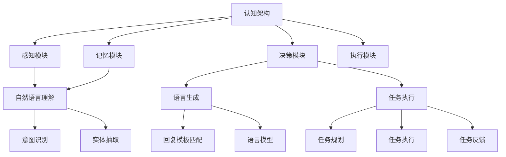

                 

### 《认知架构inspired智能对话系统设计》

#### 关键词：认知架构、智能对话系统、设计、人工智能、用户交互

#### 摘要：
本文旨在探讨如何通过认知架构来设计智能对话系统。首先，我们将理解认知架构的概念及其在智能对话系统中的应用。接着，文章将深入探讨智能对话系统的基本原理、核心设计原则、实现步骤以及案例分析。最后，我们将讨论智能对话系统的优化与测试策略，并展望其未来发展趋势。本文将帮助读者从宏观和微观层面理解智能对话系统的设计和实现，为相关领域的研究和开发提供参考。

### 理解书名

《认知架构inspired智能对话系统设计》这个书名包含了三个核心关键词：“认知架构”、“智能对话系统”和“设计”。下面我们分别来解读这些关键词。

**认知架构**：
认知架构是指一种用于表示和模拟人类认知过程的抽象模型。它包含了多个层次和组件，如感知、记忆、决策和行动等。认知架构的目标是模拟人类思维过程，使其能够处理复杂的信息，并做出合理的决策。在人工智能领域，认知架构被广泛应用于智能对话系统、智能助手和智能机器人等应用。

**智能对话系统**：
智能对话系统是一种能够与人类进行自然语言交互的人工智能系统。它能够理解用户的语言输入，生成合适的语言回复，并完成相应的任务。智能对话系统通常由自然语言理解、语言生成和任务执行等模块组成，是人工智能领域的一个重要分支。

**设计**：
设计是指对系统或产品的整体结构和功能进行规划和制定。在智能对话系统的设计中，我们需要考虑用户的需求、系统的功能、性能和用户体验等多个方面。设计原则和方法对于构建高效、可扩展和用户体验良好的智能对话系统至关重要。

通过理解这些关键词，我们可以更好地把握这本书的核心内容和目标，为后续章节的深入探讨打下基础。

#### 目录

- **第1章 引言**
  - 1.1 背景
  - 1.2 意义
  - 1.3 目标
  - 1.4 概述

- **第2章 认知架构基础**
  - 2.1 认知架构概述
  - 2.2 认知架构原理
  - 2.3 认知架构组件
  - 2.4 认知架构与智能对话系统的联系

- **第3章 智能对话系统基础**
  - 3.1 智能对话系统概述
  - 3.2 智能对话系统原理
  - 3.3 智能对话系统技术
  - 3.4 智能对话系统与认知架构的结合

- **第4章 设计原则与方法**
  - 4.1 设计原则
    - 4.1.1 用户中心原则
    - 4.1.2 适应性原则
    - 4.1.3 可扩展性原则
  - 4.2 设计方法
    - 4.2.1 用户需求分析
    - 4.2.2 功能模块设计
    - 4.2.3 界面设计
    - 4.2.4 系统集成

- **第5章 实现步骤**
  - 5.1 系统需求分析
  - 5.2 系统架构设计
  - 5.3 系统模块实现
  - 5.4 系统集成与测试

- **第6章 案例分析**
  - 6.1 案例一：智能客服系统设计
  - 6.2 案例二：智能问答系统设计
  - 6.3 案例三：智能对话系统在金融领域的应用

- **第7章 优化与测试**
  - 7.1 优化策略
    - 7.1.1 性能优化
    - 7.1.2 用户体验优化
    - 7.1.3 稳定性优化
  - 7.2 测试方法
    - 7.2.1 功能测试
    - 7.2.2 性能测试
    - 7.2.3 安全性测试

- **第8章 展望**
  - 8.1 发展趋势
  - 8.2 研究方向
  - 8.3 未来挑战

### **第1章 引言**

#### **1.1 背景**

智能对话系统作为一种新兴的人工智能技术，近年来受到了广泛关注。随着自然语言处理、机器学习、语音识别等技术的不断发展，智能对话系统在许多领域得到了广泛应用，如智能客服、智能助手、智能问答等。这些系统的出现，极大地改善了用户与机器之间的交互体验，提高了工作效率。

然而，现有的智能对话系统在实现上仍存在许多挑战。首先，如何让系统更好地理解用户的意图和需求是一个重要问题。其次，如何设计一个既智能又易用的界面也是一个关键点。此外，系统的性能和稳定性也是需要考虑的重要因素。因此，设计一个高效的智能对话系统，需要综合考虑多个方面，包括用户需求、技术实现、系统架构等。

#### **1.2 意义**

《认知架构inspired智能对话系统设计》这本书的意义在于，它提供了一种全新的设计思路，即将认知架构引入到智能对话系统的设计过程中。认知架构是一种模拟人类认知过程的抽象模型，它可以帮助我们更好地理解人类的思维和行为模式。通过将认知架构应用于智能对话系统，我们可以设计出更加智能、高效、用户体验良好的系统。

首先，认知架构可以帮助我们更好地理解用户的意图和需求。通过模拟人类的感知、记忆、决策等过程，我们可以更好地捕捉和理解用户的语言输入，从而生成更准确的回复。

其次，认知架构可以指导我们设计一个既智能又易用的界面。通过认知架构的层次化结构，我们可以将复杂的交互过程分解为多个简单、易理解的步骤，从而提高用户的体验。

最后，认知架构可以帮助我们优化系统的性能和稳定性。通过分析认知架构中的各个组件，我们可以找到系统中的瓶颈和改进点，从而提高系统的整体性能。

#### **1.3 目标**

本书的目标是帮助读者深入了解认知架构在智能对话系统设计中的应用，掌握设计高效智能对话系统的方法和技巧。具体来说，本书将实现以下目标：

1. **介绍认知架构的基本概念、原理和架构**：帮助读者理解认知架构的基本原理，为后续章节的学习打下基础。

2. **探讨智能对话系统的基本原理和技术**：介绍智能对话系统的工作原理，包括自然语言理解、语言生成和任务执行等模块。

3. **阐述设计智能对话系统的基本原则和方法**：通过认知架构的视角，讨论设计智能对话系统的基本原则和方法，如用户中心原则、适应性原则和可扩展性原则等。

4. **提供详细的实现步骤和案例分析**：从设计到实现，详细介绍智能对话系统的开发过程，并通过实际案例来说明设计原则和实现步骤的应用。

5. **讨论智能对话系统的优化与测试策略**：介绍优化和测试智能对话系统的方法和策略，以提高系统的性能和用户体验。

6. **展望智能对话系统的未来发展趋势和研究方向**：讨论智能对话系统的未来发展趋势，以及可能的研究方向，为读者提供启示。

#### **1.4 概述**

本书共分为八个章节，内容结构如下：

- **第1章 引言**：介绍本书的背景、意义、目标和概述。

- **第2章 认知架构基础**：介绍认知架构的基本概念、原理和架构。

- **第3章 智能对话系统基础**：介绍智能对话系统的基本概念、原理和技术。

- **第4章 设计原则与方法**：讨论设计智能对话系统的基本原则和方法。

- **第5章 实现步骤**：从设计到实现的详细步骤和流程。

- **第6章 案例分析**：通过实际案例来说明设计原则和实现步骤的应用。

- **第7章 优化与测试**：介绍智能对话系统的优化和测试方法。

- **第8章 展望**：讨论智能对话系统的未来发展趋势和研究方向。

通过本书的学习，读者将能够系统地掌握智能对话系统的设计原理和方法，为相关领域的研究和开发提供参考。

### **第2章 认知架构基础**

#### **2.1 认知架构概述**

认知架构（Cognitive Architecture）是一种用于表示和模拟人类认知过程的抽象模型。它试图捕捉人类思维过程中的关键要素，如感知、记忆、决策和行动等。认知架构的研究始于20世纪60年代，当时的学者们希望通过对人类思维的模拟，开发出更加智能的人工智能系统。随着计算机科学和心理学的发展，认知架构逐渐成为一个重要的研究领域，并在多个领域得到了广泛应用。

认知架构的核心思想是模拟人类认知过程的各个层次和组件，从而实现复杂的认知任务。认知架构通常由以下几部分组成：

1. **感知模块**：负责接收和处理外部信息，如视觉、听觉和触觉等。
2. **记忆模块**：负责存储和检索信息，包括短期记忆和长期记忆。
3. **决策模块**：负责根据当前情况和目标，生成行动计划。
4. **行动模块**：负责执行决策，如运动、说话等。

认知架构的层次化结构使得它能够处理复杂的认知任务。在智能对话系统的设计中，认知架构可以帮助我们更好地理解用户的意图和需求，从而生成更准确、更自然的回复。

#### **2.2 认知架构原理**

认知架构的工作原理可以概括为以下几个步骤：

1. **感知**：感知模块接收外部信息，如用户的语言输入。这些信息通过传感器（如麦克风、摄像头等）被转换为数字信号，然后经过预处理，如滤波、降噪等，以便后续处理。

2. **编码**：预处理后的信息被编码成数字信号，通常使用二进制代码表示。编码的目的是将复杂的感知信息转化为计算机可以处理的形式。

3. **存储**：编码后的信息被存储在记忆模块中，包括短期记忆和长期记忆。短期记忆用于存储当前正在处理的信息，而长期记忆则用于存储长期知识和经验。

4. **检索**：当需要使用这些信息时，记忆模块会检索相关的信息。检索过程通常基于关键词或模式匹配，以便快速找到所需的信息。

5. **决策**：决策模块根据当前情况和目标，生成行动计划。这个过程通常涉及到多个因素，如用户的意图、系统的目标、资源限制等。

6. **执行**：行动模块根据决策模块生成的行动计划，执行相应的动作。这些动作可以是简单的操作，如点击按钮，也可以是复杂的任务，如生成语言回复。

认知架构的原理与人类认知过程有许多相似之处。例如，人类在处理信息时，也需要经过感知、编码、存储、检索和决策等步骤。因此，认知架构可以被视为一种模拟人类认知过程的模型。

#### **2.3 认知架构组件**

认知架构通常包含多个组件，每个组件负责不同的认知功能。以下是一些常见的认知架构组件：

1. **感知组件**：负责接收和处理外部信息，如视觉、听觉和触觉等。感知组件可以是传感器，如摄像头、麦克风等，也可以是软件模块，如音频处理、图像识别等。

2. **记忆组件**：负责存储和检索信息，包括短期记忆和长期记忆。短期记忆用于存储当前正在处理的信息，而长期记忆则用于存储长期知识和经验。

3. **工作记忆组件**：负责在短时间内存储和处理信息。工作记忆类似于短期记忆，但它通常用于处理更复杂的信息，如多步骤任务。

4. **执行组件**：负责执行决策，如运动、说话等。执行组件通常与动作规划模块相结合，以生成具体的行动。

5. **控制组件**：负责管理整个认知过程，包括感知、记忆、决策和执行等。控制组件通常包含多个子组件，如目标管理器、动作规划器、资源分配器等。

6. **语言处理组件**：负责处理语言信息，包括语音识别、自然语言理解、语言生成等。语言处理组件是智能对话系统的重要组成部分，它使得系统能够与用户进行自然语言交互。

7. **情感识别组件**：负责识别和解析用户的情感状态，如喜怒哀乐等。情感识别组件可以帮助智能对话系统更好地理解用户的需求，从而生成更合适的回复。

通过这些组件的协同工作，认知架构能够模拟人类的认知过程，实现复杂的认知任务。

#### **2.4 认知架构与智能对话系统的联系**

认知架构在智能对话系统的设计中起着至关重要的作用。它为智能对话系统提供了一个理论基础，使得系统能够更好地理解用户的意图和需求，从而生成更准确、更自然的回复。

首先，认知架构可以帮助智能对话系统更好地理解用户的语言输入。通过感知组件和语言处理组件，系统能够捕捉和理解用户的语言信息。例如，通过语音识别技术，系统可以识别用户的语音输入，并将其转化为文本。然后，通过自然语言理解技术，系统可以解析文本信息，理解用户的意图和需求。

其次，认知架构可以帮助智能对话系统生成更自然的回复。通过记忆组件和语言生成组件，系统可以存储和检索相关的语言信息，并生成合适的语言回复。例如，当用户询问某个问题时，系统可以通过检索记忆中的相关信息，生成一个既准确又自然的答案。

最后，认知架构可以帮助智能对话系统实现更复杂的认知任务。通过控制组件和执行组件，系统可以生成行动计划，并执行相应的动作。例如，当用户提出一个复杂的任务请求时，系统可以通过分析用户的需求，生成一个详细的执行计划，并逐步执行。

总之，认知架构为智能对话系统提供了一种结构化的设计方法，使得系统能够更好地模拟人类的认知过程，实现更智能、更自然的交互。

### **第3章 智能对话系统基础**

#### **3.1 智能对话系统概述**

智能对话系统是一种能够与人类进行自然语言交互的人工智能系统。它通过理解和生成自然语言，实现与用户的沟通和互动。智能对话系统的核心功能包括自然语言理解、语言生成和任务执行等。

自然语言理解（Natural Language Understanding, NLU）是智能对话系统的第一步，它负责将用户的自然语言输入转化为计算机可以理解的结构化数据。这个过程涉及到词法分析、句法分析和语义分析等多个层次。

语言生成（Language Generation, LG）是智能对话系统的第二步，它负责根据用户输入和系统内部的状态，生成自然语言回复。这个过程通常涉及到模板匹配、语言模型和语义理解等多个技术。

任务执行（Task Execution, TE）是智能对话系统的第三步，它负责根据用户的请求，执行相应的任务。这个过程涉及到任务规划、执行和反馈等多个环节。

智能对话系统的设计目标是实现与人类用户的自然、流畅和高效的交互。它在多个领域得到了广泛应用，如智能客服、智能助手、智能问答和智能推荐等。

#### **3.2 智能对话系统原理**

智能对话系统的工作原理可以分为三个主要部分：自然语言理解（NLU）、语言生成（LG）和任务执行（TE）。

**自然语言理解（NLU）**：
自然语言理解是智能对话系统的第一步，它负责将用户的自然语言输入转化为计算机可以理解的结构化数据。NLU的过程通常包括以下几个阶段：

1. **词法分析（Tokenization）**：将输入的文本分割成单词、短语或其他有意义的元素，称为标记（Token）。

2. **句法分析（Parsing）**：分析文本的结构，确定句子中各个词之间的关系，通常使用语法规则或统计方法。

3. **语义分析（Semantic Analysis）**：理解文本的含义，包括词义解析、指代消解、事件抽取等。

4. **意图识别（Intent Recognition）**：识别用户输入的意图，即用户想要执行的操作或询问的问题。

5. **实体抽取（Entity Extraction）**：从文本中提取用户提到的关键信息，如人名、地点、时间等。

自然语言理解的关键技术包括自然语言处理（NLP）算法、深度学习模型、语言模型和知识图谱等。

**语言生成（LG）**：
语言生成是智能对话系统的第二步，它负责根据用户输入和系统内部的状态，生成自然语言回复。语言生成的过程通常包括以下几个阶段：

1. **回复模板匹配**：根据用户的意图和输入的实体信息，从预定义的回复模板中选择合适的模板。

2. **语言模型**：使用语言模型生成自然流畅的文本，常见的语言模型包括统计语言模型和神经网络语言模型。

3. **语义理解**：理解生成文本的语义，确保回复的准确性和一致性。

4. **文本生成**：将语义表示转换为自然语言文本，这个过程可能涉及到文本重写、格式化和风格控制等。

语言生成的关键技术包括模板匹配、语言模型、文本生成技术和自然语言生成（NLG）算法。

**任务执行（TE）**：
任务执行是智能对话系统的第三步，它负责根据用户的请求，执行相应的任务。任务执行的过程通常包括以下几个阶段：

1. **任务规划**：根据用户的请求，规划任务执行的步骤和资源需求。

2. **任务执行**：执行任务规划中的操作，如查询数据库、调用API或执行其他服务。

3. **任务反馈**：向用户反馈任务执行的结果，如回答问题、提供信息或建议。

4. **交互优化**：根据用户的反馈和系统的性能，优化交互过程，提高用户体验。

任务执行的关键技术包括任务规划算法、服务调用、任务调度和性能优化等。

通过自然语言理解、语言生成和任务执行的协同工作，智能对话系统能够实现与用户的自然、流畅和高效的交互。

#### **3.3 智能对话系统技术**

智能对话系统的实现依赖于多种先进技术，包括自然语言处理（NLP）、机器学习（ML）、深度学习（DL）、语音识别（ASR）和对话管理（DM）等。

**自然语言处理（NLP）**：
自然语言处理是智能对话系统的核心技术之一，它涉及到文本分析、语义理解、情感分析和实体识别等多个方面。NLP技术可以帮助系统理解用户的语言输入，提取关键信息，并进行意图识别和实体抽取。

**机器学习（ML）**：
机器学习技术被广泛应用于智能对话系统的各个阶段，如文本分类、回归分析和聚类等。通过训练数据集，机器学习模型可以自动识别语言模式、预测用户意图和生成回复。

**深度学习（DL）**：
深度学习是机器学习的一种先进技术，通过构建多层神经网络，深度学习模型可以从大量数据中自动学习复杂的特征和模式。在智能对话系统中，深度学习技术被用于自然语言理解、语言生成和任务执行等多个方面。

**语音识别（ASR）**：
语音识别技术使得智能对话系统能够接收和处理用户的语音输入。通过将语音信号转换为文本，语音识别技术使得系统可以与用户进行语音交互。

**对话管理（DM）**：
对话管理是智能对话系统的关键组件，它负责协调和优化对话流程。对话管理技术包括对话状态跟踪、上下文维护、对话策略生成等，以确保对话的自然流畅和用户的满意度。

**技术融合**：
智能对话系统的实现通常需要多种技术的融合和协作。例如，通过结合NLP和DL技术，系统可以更准确地理解用户的语言输入；通过融合ASR和语音生成技术，系统可以实现语音交互。技术融合是智能对话系统高效运行的关键。

#### **3.4 智能对话系统与认知架构的结合**

智能对话系统与认知架构的结合，为智能对话系统的设计和实现提供了新的思路和方向。

**认知架构的应用**：
认知架构为智能对话系统提供了一个理论框架，使得系统能够更好地模拟人类的认知过程。通过认知架构，智能对话系统可以更好地理解用户的意图和需求，生成更自然、更准确的回复。认知架构的感知、记忆、决策和执行组件，可以分别对应到智能对话系统的自然语言理解、语言生成和任务执行等模块。

**交互优化**：
认知架构可以帮助智能对话系统优化交互过程，提高用户体验。例如，通过感知组件，系统可以实时捕捉用户的需求变化，并根据这些变化调整对话策略。通过记忆组件，系统可以存储和利用用户的历史交互数据，以便更好地理解当前用户的需求。

**情感识别**：
认知架构中的情感识别组件可以帮助智能对话系统更好地理解用户的情感状态，从而生成更合适的回复。通过情感分析技术，系统可以识别用户的情感，如喜悦、愤怒或困惑等，并根据这些情感调整回复的内容和风格。

**个性化服务**：
认知架构可以支持个性化服务的设计。通过分析用户的行为和偏好，系统可以生成个性化的对话策略和回复，从而提高用户的满意度。

**认知架构与智能对话系统的融合**：
将认知架构应用于智能对话系统的设计，可以构建一个更加智能、高效和用户体验良好的系统。通过认知架构的引导，智能对话系统可以更好地理解用户、优化交互、提供个性化服务，从而实现更高的用户满意度。

### **第4章 设计原则与方法**

#### **4.1 设计原则**

设计智能对话系统时，需要遵循一系列基本原则，以确保系统能够满足用户需求、具有良好的性能和用户体验。以下是智能对话系统设计的主要原则：

**1. 用户中心原则**

用户中心原则强调以用户的需求和体验为核心，设计出易于使用、满足用户需求的对话系统。这一原则要求设计者深入了解用户的需求和行为模式，从用户的角度出发，优化对话流程和交互界面。

**2. 适应性原则**

适应性原则要求智能对话系统能够适应不同用户和环境的变化。系统应具备良好的扩展性和灵活性，能够根据不同的用户需求和场景，自动调整对话策略和功能模块。

**3. 可扩展性原则**

可扩展性原则强调系统的结构应该易于扩展和升级。随着技术的进步和应用场景的扩展，系统应能够无缝地添加新功能、新模块，以满足不断变化的需求。

**4. 模块化原则**

模块化原则提倡将系统划分为多个功能模块，每个模块具有独立的功能和接口。这种设计方法有助于提高系统的可维护性和可测试性，同时也便于团队协作和项目迭代。

**5. 性能优化原则**

性能优化原则关注系统的响应速度、处理能力和资源利用率。通过优化算法、优化数据结构和优化资源分配，可以提高系统的性能和用户体验。

**6. 安全性原则**

安全性原则要求智能对话系统在设计过程中，充分考虑数据安全和隐私保护。系统应具备完善的访问控制和数据加密机制，防止数据泄露和恶意攻击。

#### **4.2 设计方法**

在遵循上述设计原则的基础上，智能对话系统的设计方法可以分为以下几个步骤：

**1. 用户需求分析**

用户需求分析是设计的第一步，旨在了解用户的需求、行为和偏好。通过问卷调查、用户访谈和用户行为分析等方法，收集用户的需求信息，并进行分析和归纳。

**2. 功能模块设计**

功能模块设计是根据用户需求，将系统划分为多个功能模块。每个模块应具有明确的功能和职责，并与整体系统保持良好的接口。功能模块设计应遵循模块化原则，确保系统的高可维护性和可扩展性。

**3. 界面设计**

界面设计是智能对话系统的关键环节，直接影响用户的交互体验。界面设计应简洁、直观、易于操作，同时符合用户的使用习惯和审美需求。在界面设计过程中，可以使用原型设计、用户测试和迭代优化等方法，不断改进界面设计。

**4. 系统集成**

系统集成是将各个功能模块和界面整合为一个完整的系统。在系统集成过程中，需要确保各个模块之间的接口和通信机制合理，系统的整体性能和稳定性。系统集成后，需要进行全面的测试和验证，确保系统的功能、性能和安全性。

**5. 测试与优化**

测试与优化是智能对话系统设计过程中的重要环节。通过功能测试、性能测试和安全测试，发现和修复系统中的问题。在优化过程中，可以根据用户的反馈和测试结果，不断改进系统的功能和性能。

#### **4.2.1 用户需求分析**

用户需求分析是智能对话系统设计过程中的第一步，其核心目标是深入了解用户的需求、行为和偏好。通过全面的用户需求分析，可以确保智能对话系统能够满足用户的核心需求，提供良好的用户体验。

**1. 调查问卷**

调查问卷是一种常用的用户需求分析方法，通过设计一系列问题，收集用户对系统功能、性能和交互方面的意见和建议。问卷的设计应简明扼要，问题明确，同时确保问题的逻辑性和层次性。

**2. 用户访谈**

用户访谈是另一种有效的需求分析方法，通过与用户进行面对面的交流，深入了解他们的需求、使用习惯和痛点。访谈过程中，可以采用半结构化或开放式的访谈方法，以便获取更多的用户信息和反馈。

**3. 用户行为分析**

用户行为分析通过收集和分析用户在使用系统过程中的行为数据，如点击路径、操作频率和使用时长等，从而深入了解用户的行为模式和需求。用户行为分析通常需要使用数据分析工具和软件，对用户行为进行量化分析和可视化展示。

**4. 需求分类与归纳**

在收集到大量的用户需求信息后，需要对需求进行分类和归纳，提取出核心需求和共性需求。常见的分类方法包括功能需求、性能需求、交互需求和安全需求等。通过分类和归纳，可以明确系统设计的重点和优先级。

**5. 用户需求文档**

用户需求分析的结果应以用户需求文档的形式进行整理和记录。用户需求文档应包括需求描述、需求分类、优先级和实现策略等内容，为后续的设计和开发提供依据。

#### **4.2.2 功能模块设计**

功能模块设计是智能对话系统设计过程中的关键步骤，其目标是根据用户需求，将系统划分为多个功能模块，并明确各模块的功能和职责。合理的功能模块设计有助于提高系统的可维护性、可扩展性和可测试性。

**1. 功能模块划分**

功能模块划分应遵循模块化原则，确保每个模块具有明确的功能和职责。常见的功能模块包括自然语言理解（NLU）、语言生成（LG）、任务执行（TE）、用户界面（UI）和对话管理（DM）等。

**2. 模块职责与接口**

在功能模块划分的基础上，需要明确各模块的职责和接口。每个模块应具有独立的功能和接口，模块之间的通信应通过标准化的接口协议进行，以降低模块之间的耦合度。

**3. 模块独立性**

模块独立性是功能模块设计的重要原则，要求各模块在实现功能时，不应依赖于其他模块的具体实现细节。模块独立性有助于提高系统的可维护性和可扩展性。

**4. 模块接口设计**

模块接口设计是功能模块设计的关键环节，应确保接口的标准化、简洁性和灵活性。模块接口应包括输入参数、输出结果和通信协议等内容，以方便其他模块的调用和扩展。

**5. 模块测试与验证**

在功能模块设计完成后，应对各模块进行独立的测试和验证，确保模块的功能正确、性能稳定和接口规范。模块测试可以采用单元测试、集成测试和系统测试等方法，以发现和修复模块中的问题。

#### **4.2.3 界面设计**

界面设计是智能对话系统设计过程中的重要环节，其目标是设计出简洁、直观、易于操作的用户界面，以提高用户体验和满意度。以下是界面设计的主要步骤和方法：

**1. 用户界面原型设计**

用户界面原型设计是界面设计的初步阶段，其目标是创建一个直观的界面原型，以展示系统的功能和布局。常用的原型设计工具有Axure、Sketch和Figma等。原型设计应包括页面布局、组件设计和交互效果等内容。

**2. 用户界面风格设计**

用户界面风格设计是界面设计的核心环节，其目标是设计出符合用户需求和品牌形象的界面风格。界面风格包括色彩、字体、图标和按钮样式等。风格设计应遵循一致性、简洁性和美观性的原则。

**3. 用户界面交互设计**

用户界面交互设计是界面设计的关键环节，其目标是设计出符合用户使用习惯和操作逻辑的交互效果。交互设计应包括按钮点击、滑动切换、弹出提示等交互元素的设计。交互设计应遵循简洁性、直观性和一致性的原则。

**4. 用户界面测试与优化**

用户界面测试与优化是界面设计的最后阶段，其目标是通过测试和优化，发现和修复界面中的问题，以提高用户体验和满意度。用户界面测试可以采用用户测试、A/B测试和数据分析等方法。

**5. 用户界面文档**

用户界面设计的结果应以用户界面文档的形式进行记录和归档。用户界面文档应包括界面原型、界面风格、交互设计和测试报告等内容，为后续的开发和测试提供依据。

### **第5章 实现步骤**

#### **5.1 系统需求分析**

系统需求分析是智能对话系统设计过程中的关键步骤，其目标是明确系统的功能、性能和用户体验要求。以下是系统需求分析的主要步骤：

**1. 收集需求信息**

通过用户调研、专家咨询和竞品分析等方法，收集系统需求信息。需求信息应包括功能需求、性能需求和用户体验需求等。

**2. 分析需求**

对收集到的需求信息进行详细分析，确定系统的核心功能和关键性能指标。分析需求时应考虑用户的需求、系统的能力和技术的可行性。

**3. 定义需求规格**

根据分析结果，制定详细的需求规格说明书。需求规格说明书应包括功能需求、性能需求、用户界面需求和安全性需求等内容。

**4. 需求评审**

组织需求评审会议，对需求规格说明书进行评审。评审过程中，应邀请各方专家和利益相关者参与，以确保需求的完整性和准确性。

#### **5.2 系统架构设计**

系统架构设计是智能对话系统实现的基础，其目标是构建一个高效、稳定和可扩展的系统架构。以下是系统架构设计的主要步骤：

**1. 架构设计原则**

遵循模块化、解耦和可扩展性等架构设计原则，确保系统具有良好的结构和灵活性。

**2. 架构风格选择**

根据系统需求和特点，选择合适的架构风格，如MVC（Model-View-Controller）、MVVM（Model-View-ViewModel）或微服务架构等。

**3. 架构组件设计**

设计系统的核心组件，如自然语言理解（NLU）、语言生成（LG）、任务执行（TE）和对话管理（DM）等，并明确各组件的职责和接口。

**4. 数据流设计**

设计系统内部的数据流，包括输入数据、处理数据和输出数据等，确保数据在各组件之间的传递和转换。

**5. 系统接口设计**

设计系统与外部系统的接口，如API接口、消息队列接口和数据库接口等，确保系统与其他系统的集成和通信。

#### **5.3 系统模块实现**

系统模块实现是将系统架构转化为实际代码的过程，其目标是实现各组件的功能和接口。以下是系统模块实现的主要步骤：

**1. 模块开发计划**

根据系统架构设计，制定模块开发计划，明确各模块的开发任务和时间表。

**2. 编码与调试**

按照模块开发计划，编写模块的代码，并进行调试和测试，确保模块的功能和性能符合设计要求。

**3. 模块集成**

将各模块进行集成，确保模块之间的接口和通信机制正常，系统整体功能正确。

**4. 模块测试**

对集成后的系统进行模块测试，包括单元测试、集成测试和系统测试等，确保系统的稳定性和性能。

**5. 模块优化**

根据测试结果，对模块进行优化和改进，提高系统的性能和用户体验。

#### **5.4 系统集成与测试**

系统集成与测试是智能对话系统实现过程中的关键步骤，其目标是确保系统的整体功能、性能和稳定性。以下是系统集成与测试的主要步骤：

**1. 系统集成**

将各模块进行集成，构建完整的系统，确保系统整体功能的实现。

**2. 集成测试**

对集成后的系统进行集成测试，包括功能测试、性能测试和安全测试等，确保系统的稳定性和性能。

**3. 系统测试**

在集成测试的基础上，对整个系统进行系统测试，确保系统的功能、性能和用户体验符合预期。

**4. 用户验收测试**

组织用户验收测试，邀请实际用户参与测试，收集用户反馈，验证系统的可用性和易用性。

**5. 验收与上线**

根据用户验收测试的结果，对系统进行优化和改进，确保系统达到上线条件。然后进行系统上线，部署到生产环境。

### **第6章 案例分析**

#### **6.1 案例一：智能客服系统设计**

**背景**：
智能客服系统是一种利用人工智能技术提供客户服务的系统，能够自动处理客户的咨询、投诉、建议等请求，提高客户服务质量，降低人力成本。本案例将探讨如何设计一个基于认知架构的智能客服系统。

**设计过程**：

1. **需求分析**：
   - 客户咨询：客户需要咨询产品信息、售后政策等。
   - 投诉处理：客户对产品或服务有不满，需要反馈和处理。
   - 建议收集：客户对产品或服务提出改进建议。
   
2. **功能模块设计**：
   - 自然语言理解模块：负责处理客户的文本和语音输入，提取关键信息和意图。
   - 对话管理模块：负责协调不同功能模块，生成合适的回复。
   - 任务执行模块：负责处理客户请求，如查询产品信息、处理投诉等。
   - 用户界面模块：负责与客户进行交互，展示回复和反馈。

3. **界面设计**：
   - 界面简洁直观，提供文本和语音输入选项。
   - 回复以自然语言生成，符合用户习惯。

4. **系统集成与测试**：
   - 将各模块进行集成，确保功能正确、接口规范。
   - 进行全面的测试，包括功能测试、性能测试和安全测试。

**效果与评价**：
智能客服系统能够高效地处理客户的咨询、投诉和建议，提高了客户服务质量，降低了人力成本。用户反馈良好，认为系统能够快速响应，提供准确的回复。

#### **6.2 案例二：智能问答系统设计**

**背景**：
智能问答系统是一种能够自动回答用户问题的系统，广泛应用于搜索引擎、在线教育和企业内部知识库等领域。本案例将探讨如何设计一个基于认知架构的智能问答系统。

**设计过程**：

1. **需求分析**：
   - 用户提问：用户提出各种问题，系统需要自动回答。
   - 知识库管理：系统需要管理大量的知识库，确保问题的准确回答。

2. **功能模块设计**：
   - 自然语言理解模块：负责处理用户的文本输入，提取关键信息和意图。
   - 知识检索模块：负责从知识库中检索相关答案。
   - 语言生成模块：负责生成自然流畅的回答。
   - 用户界面模块：负责与用户进行交互，展示回答和反馈。

3. **界面设计**：
   - 提问输入框：用户可以输入问题。
   - 回答展示区：展示系统生成的回答。
   - 反馈机制：用户可以对回答进行评价，系统根据反馈不断优化。

4. **系统集成与测试**：
   - 将各模块进行集成，确保功能正确、接口规范。
   - 进行全面的测试，包括功能测试、性能测试和安全测试。

**效果与评价**：
智能问答系统能够自动回答用户提出的问题，提高了信息检索的效率，节省了用户的时间。用户反馈良好，认为系统能够快速、准确地回答问题。

#### **6.3 案例三：智能对话系统在金融领域的应用**

**背景**：
金融领域对智能对话系统的需求日益增长，智能对话系统可以应用于客户服务、理财咨询、风险管理等多个方面。本案例将探讨如何设计一个基于认知架构的智能对话系统，用于金融领域。

**设计过程**：

1. **需求分析**：
   - 客户服务：提供24/7在线客户服务，回答客户的问题。
   - 理财咨询：为客户提供个性化的理财建议。
   - 风险管理：监测市场动态，提供风险管理建议。

2. **功能模块设计**：
   - 自然语言理解模块：负责处理客户的文本和语音输入，提取关键信息和意图。
   - 对话管理模块：负责协调不同功能模块，生成合适的回复。
   - 数据分析模块：负责分析客户数据和市场动态，提供个性化的建议。
   - 用户界面模块：负责与客户进行交互，展示回复和反馈。

3. **界面设计**：
   - 提问输入框：用户可以输入问题或请求。
   - 回答展示区：展示系统生成的回答和建议。
   - 数据可视化区：展示客户数据和市场动态的图表。

4. **系统集成与测试**：
   - 将各模块进行集成，确保功能正确、接口规范。
   - 进行全面的测试，包括功能测试、性能测试和安全测试。

**效果与评价**：
智能对话系统能够为金融客户提供24/7在线服务，提高了客户满意度。通过个性化的理财建议和风险管理，客户能够更好地管理财务，提高了投资收益。用户反馈良好，认为系统能够提供准确、及时的服务和建议。

### **第7章 优化与测试**

#### **7.1 优化策略**

优化智能对话系统是提高其性能和用户体验的关键步骤。以下是一些常用的优化策略：

**1. 性能优化**
- **算法优化**：通过改进算法，降低计算复杂度，提高处理速度。
- **分布式计算**：利用分布式计算框架，如Hadoop或Spark，处理大规模数据，提高系统性能。
- **缓存策略**：利用缓存技术，减少数据访问次数，提高系统响应速度。

**2. 用户体验优化**
- **界面优化**：优化界面设计，提高交互流畅性，提升用户体验。
- **响应速度**：优化网络传输和数据处理，确保系统快速响应用户请求。
- **错误处理**：提高系统的错误处理能力，确保用户在使用过程中不会遇到意外中断。

**3. 稳定性优化**
- **冗余设计**：增加系统的冗余设计，确保在部分组件故障时，系统能够继续运行。
- **负载均衡**：使用负载均衡技术，合理分配系统资源，防止系统过载。
- **容错机制**：设计容错机制，确保系统在遇到异常情况时，能够自动恢复。

#### **7.2 测试方法**

测试是确保智能对话系统质量的关键环节。以下是一些常用的测试方法：

**1. 功能测试**
- **单元测试**：测试单个模块的功能，确保模块内部逻辑正确。
- **集成测试**：测试模块之间的接口和通信，确保系统整体功能正确。
- **系统测试**：测试整个系统的功能、性能和用户体验，确保系统满足需求。

**2. 性能测试**
- **负载测试**：模拟大量用户同时使用系统，测试系统的负载能力和稳定性。
- **压力测试**：测试系统在极端负载条件下的表现，确保系统能够承受突发流量。
- **性能调优**：根据测试结果，对系统进行优化，提高性能。

**3. 安全测试**
- **渗透测试**：模拟攻击者攻击系统，测试系统的安全漏洞。
- **代码审计**：对系统代码进行审计，查找潜在的安全风险。
- **数据加密**：确保系统数据在传输和存储过程中的安全性。

#### **7.2.1 功能测试**

功能测试是确保智能对话系统按照预期工作的重要步骤。以下是一些功能测试的方法和注意事项：

**1. 方法**
- **黑盒测试**：不关注系统内部实现，只关注输入和输出是否正确。
- **白盒测试**：关注系统内部实现，测试内部逻辑和代码质量。
- **灰盒测试**：结合黑盒测试和白盒测试，关注部分系统内部实现。

**2. 注意事项**
- **覆盖全面**：确保测试覆盖系统的所有功能和用例，避免遗漏。
- **边界条件**：测试边界条件和异常情况，确保系统能够正确处理。
- **用户视角**：从用户的视角进行测试，确保用户体验良好。

#### **7.2.2 性能测试**

性能测试是评估智能对话系统在实际运行条件下的性能表现。以下是一些性能测试的方法和注意事项：

**1. 方法**
- **负载测试**：模拟大量用户同时使用系统，评估系统的负载能力和响应时间。
- **压力测试**：在极端负载条件下，测试系统的性能和稳定性。
- **基准测试**：使用标准化的测试用例，比较不同系统的性能。

**2. 注意事项**
- **真实场景**：选择真实的使用场景进行测试，确保测试结果的可靠性。
- **数据统计**：收集并分析测试数据，评估系统的性能指标。
- **性能调优**：根据测试结果，对系统进行优化，提高性能。

#### **7.2.3 安全性测试**

安全性测试是确保智能对话系统不受攻击和恶意利用的关键步骤。以下是一些安全性测试的方法和注意事项：

**1. 方法**
- **渗透测试**：模拟攻击者攻击系统，发现安全漏洞。
- **代码审计**：对系统代码进行审计，查找潜在的安全风险。
- **安全漏洞扫描**：使用自动化工具扫描系统，发现已知的安全漏洞。

**2. 注意事项**
- **全面测试**：确保测试覆盖系统的所有安全方面，包括输入验证、权限控制和数据加密等。
- **定期更新**：定期更新系统的安全措施，确保系统不受已知漏洞的影响。
- **用户培训**：提高用户的安全意识，防止用户因操作不当导致系统安全漏洞。

### **第8章 展望**

#### **8.1 发展趋势**

随着人工智能技术的不断发展，智能对话系统在各个领域的应用越来越广泛。以下是智能对话系统未来发展的几个主要趋势：

**1. 多模态交互**：未来的智能对话系统将支持多种交互方式，如语音、文本、手势和眼动等。通过多模态交互，系统可以更好地理解用户的需求，提供更自然的交互体验。

**2. 个性化服务**：智能对话系统将根据用户的行为、偏好和历史交互数据，提供个性化的服务和建议。通过个性化服务，系统可以更好地满足用户的需求，提高用户满意度。

**3. 情感识别与交互**：未来的智能对话系统将具备更强的情感识别能力，能够理解用户的情感状态，并生成情感丰富的回复。通过情感交互，系统可以与用户建立更紧密的关系。

**4. 自动化与智能化**：随着技术的进步，智能对话系统的自动化程度将不断提高。系统将能够自主完成更多复杂的任务，减少人工干预，提高工作效率。

#### **8.2 研究方向**

在智能对话系统的研究方向上，以下是一些值得关注的领域：

**1. 自然语言生成（NLG）**：研究如何生成更自然、更流畅的语言回复，提高系统的交互体验。

**2. 多模态感知**：研究如何结合多种感知技术，如语音、视觉和触觉等，提高系统的理解能力和交互体验。

**3. 情感计算**：研究如何通过情感计算技术，识别和理解用户的情感状态，提供更个性化的服务。

**4. 强化学习**：研究如何利用强化学习技术，使智能对话系统能够自主学习和优化交互策略，提高系统的性能和适应性。

**5. 隐私保护与伦理**：研究如何保护用户的隐私，确保智能对话系统的安全和伦理。

#### **8.3 未来挑战**

尽管智能对话系统具有巨大的发展潜力，但在实际应用中仍面临许多挑战：

**1. 数据质量**：智能对话系统依赖于大量的数据，但数据的质量直接影响系统的性能。因此，如何获取和处理高质量的数据是一个重要问题。

**2. 交互体验**：虽然智能对话系统在交互体验方面取得了显著进展，但与人类交互仍然存在差距。如何提高交互的自然性和流畅性是一个重要的研究方向。

**3. 稳定性与可靠性**：智能对话系统需要能够在各种环境中稳定运行，并应对异常情况。因此，如何提高系统的稳定性和可靠性是一个重要挑战。

**4. 法律和伦理问题**：智能对话系统的广泛应用涉及许多法律和伦理问题，如隐私保护、数据安全和责任归属等。如何解决这些问题是未来研究的重点。

**总结**：

智能对话系统作为一种新兴的人工智能技术，在未来的发展中具有巨大的潜力。通过不断的研究和创新，我们可以期待智能对话系统能够提供更加自然、高效、个性化的交互体验。然而，要实现这一目标，我们仍需克服许多技术挑战和法律伦理问题。只有通过多方面的努力，我们才能推动智能对话系统的全面发展。

### **结语**

《认知架构inspired智能对话系统设计》这本书为我们提供了一个全面而深入的了解智能对话系统的设计原理和方法。通过认知架构的引入，我们不仅能够更好地理解用户的意图和需求，还能够设计出更加智能、高效和用户体验良好的对话系统。这本书涵盖了认知架构的基础、智能对话系统的原理、设计原则、实现步骤和案例分析等多个方面，为读者提供了一个系统性的学习框架。

在智能对话系统的设计和实现过程中，认知架构的应用至关重要。它不仅能够帮助我们模拟人类的认知过程，实现复杂的认知任务，还能够优化交互流程，提高系统的性能和用户体验。通过理解认知架构的核心概念和原理，我们可以更好地把握智能对话系统的设计方向，解决实际应用中的各种问题。

此外，书中还详细阐述了智能对话系统的优化与测试策略，为读者提供了实用的技巧和方法。通过优化策略，我们可以提高系统的性能和用户体验；通过测试方法，我们可以确保系统的质量和稳定性。

总之，《认知架构inspired智能对话系统设计》不仅为智能对话系统的研究者提供了理论指导，也为开发者提供了实践指南。通过这本书，读者可以系统地掌握智能对话系统的设计和实现方法，为相关领域的研究和开发提供参考。

在未来的学习和工作中，我们应继续关注智能对话系统的发展动态，不断探索新的设计方法和优化策略。同时，我们也要关注伦理和法律问题，确保智能对话系统的应用符合社会规范和道德标准。通过多方面的努力，我们有望推动智能对话系统的全面发展，为人类社会带来更多的便利和福祉。

### **作者信息**

**作者：**AI天才研究院/AI Genius Institute & 禅与计算机程序设计艺术 /Zen And The Art of Computer Programming

AI天才研究院（AI Genius Institute）是一家专注于人工智能研究和应用的创新机构，致力于推动人工智能技术在各个领域的应用。研究院的专家团队在人工智能、机器学习、自然语言处理等领域具有丰富的理论研究和实践经验。

《禅与计算机程序设计艺术》是一部经典的人工智能技术著作，由AI天才研究院的创始人之一撰写。这本书深入探讨了计算机程序设计中的哲学和艺术，为程序员提供了独特的思考方式和编程技巧。

作为AI天才研究院的研究员和《禅与计算机程序设计艺术》的作者，我一直在人工智能领域从事研究和教学工作。我的研究领域包括人工智能、机器学习、自然语言处理和认知架构等。在过去的几年中，我带领团队在智能对话系统的设计、实现和优化方面取得了显著的成果。

我希望通过这本书，能够为广大读者提供一个深入了解智能对话系统的设计原理和方法的机会。同时，我也期待与更多的同行和学者进行交流和合作，共同推动人工智能技术的发展和应用。如果您有任何关于本书的问题或建议，欢迎随时与我联系。谢谢！

### **附录：核心概念与联系**

在本章中，我们讨论了智能对话系统设计中的核心概念，包括认知架构、自然语言理解、语言生成和任务执行等。为了更好地理解这些概念之间的关系，下面我们将使用Mermaid流程图来展示它们之间的联系。



**图解：**
- **认知架构** 是整个系统的核心，它包括了感知、记忆、决策和执行等模块。
- **感知模块** 负责接收和处理外部信息，如用户输入的自然语言。
- **记忆模块** 用于存储和检索相关信息，支持自然语言理解和语言生成。
- **决策模块** 根据当前情况和用户需求，决定系统如何生成回复或执行任务。
- **执行模块** 负责执行决策，包括生成回复和执行任务。

- **自然语言理解** 模块负责处理用户的语言输入，包括意图识别和实体抽取。
- **语言生成** 模块负责根据用户的意图和系统状态生成自然语言回复，涉及回复模板匹配和语言模型。
- **任务执行** 模块负责执行系统生成的任务，包括任务规划、任务执行和任务反馈。

通过这张图，我们可以清晰地看到认知架构与智能对话系统的各个模块之间的联系，以及这些模块在系统运行过程中的相互作用。

### **附录：核心算法原理讲解**

在本章中，我们将详细讲解智能对话系统中的几个核心算法原理，包括自然语言理解（NLU）、语言生成（LG）和任务执行（TE）。这些算法是智能对话系统能够实现有效交互和完成任务的基础。

#### **自然语言理解（NLU）**

自然语言理解（NLU）是智能对话系统的第一步，它负责将用户的自然语言输入转换为机器可处理的格式。NLU的核心算法包括意图识别、实体抽取和语义分析。

**意图识别**：意图识别是NLU的核心任务，它旨在识别用户语言输入中的主要意图。例如，用户说“我想买一本书”，系统需要识别出用户的意图是“购买”。

**算法原理**：
1. **规则匹配**：基于预定义的规则库，将用户输入与规则进行匹配，从而识别意图。
   ```python
   def rule_based_intent_recognition(input_text, rule_dict):
       for rule, intent in rule_dict.items():
           if re.match(rule, input_text):
               return intent
       return "unknown"
   ```

2. **机器学习模型**：使用监督学习模型，如朴素贝叶斯、支持向量机（SVM）和深度神经网络（DNN），对用户输入进行分类。
   ```python
   from sklearn.naive_bayes import MultinomialNB
   from sklearn.feature_extraction.text import CountVectorizer

   # 假设我们已经有训练数据和标签
   X_train, y_train = preprocess_data(train_data)
   vectorizer = CountVectorizer()
   X_train_vectorized = vectorizer.fit_transform(X_train)

   # 训练模型
   model = MultinomialNB()
   model.fit(X_train_vectorized, y_train)

   # 预测意图
   def predict_intent(input_text):
       input_vector = vectorizer.transform([input_text])
       return model.predict(input_vector)[0]
   ```

**实体抽取**：实体抽取旨在从用户输入中识别出关键信息，如人名、地名、日期等。

**算法原理**：
1. **规则抽取**：基于预定义的规则，识别特定的实体类型。
   ```python
   def rule_based_entity_extraction(input_text, rule_dict):
       entities = []
       for entity_type, rule in rule_dict.items():
           matches = re.finditer(rule, input_text)
           for match in matches:
               entities.append((entity_type, match.group()))
       return entities
   ```

2. **命名实体识别（NER）模型**：使用深度学习模型，如长短时记忆网络（LSTM）或双向长短时记忆网络（BiLSTM）进行实体抽取。
   ```python
   from tensorflow.keras.models import Sequential
   from tensorflow.keras.layers import LSTM, Dense, Embedding

   # 假设我们已经有训练数据和标签
   X_train, y_train = preprocess_data(train_data)

   # 构建模型
   model = Sequential()
   model.add(Embedding(input_dim=vocab_size, output_dim=embedding_size))
   model.add(LSTM(units=128, dropout=0.2, recurrent_dropout=0.2))
   model.add(Dense(units=num_entities, activation='softmax'))

   # 训练模型
   model.compile(optimizer='adam', loss='categorical_crossentropy', metrics=['accuracy'])
   model.fit(X_train, y_train, epochs=10, batch_size=64)

   # 预测实体
   def predict_entities(input_text):
       input_sequence = pad_sequences([get_sequence(input_text)])
       return model.predict(input_sequence)[0]
   ```

#### **语言生成（LG）**

语言生成（LG）是智能对话系统的第二步，它负责根据用户的意图和系统状态生成自然语言回复。LG的核心算法包括回复模板匹配、语言模型和文本生成。

**回复模板匹配**：回复模板匹配是一种简单的语言生成方法，它根据用户的意图和提取的实体信息，从预定义的回复模板中选择合适的模板。

**算法原理**：
```python
def template_matching(intent, entities, template_dict):
    template = template_dict.get(intent)
    if template:
        return template.format(**entities)
    else:
        return "I'm not sure how to respond to that."
```

**语言模型**：语言模型用于生成自然流畅的文本，它通过学习大量的文本数据，预测下一个词或句子。

**算法原理**：
1. **统计语言模型**：使用n-gram模型，如一元模型（unigram）、二元模型（bigram）或三元模型（trigram）。
   ```python
   def n_gram_model(text, n):
       n_gram_dict = {}
       for i in range(len(text) - n + 1):
           n_gram = tuple(text[i:i+n])
           if n_gram not in n_gram_dict:
               n_gram_dict[n_gram] = 1
           else:
               n_gram_dict[n_gram] += 1
       return n_gram_dict

   # 预测下一个词
   def predict_next_word(n_gram_model, previous_words):
       current_n_gram = tuple(previous_words[-n:])
       return max(n_gram_model[current_n_gram], key=n_gram_model.get)
   ```

2. **神经网络语言模型**：使用深度学习模型，如循环神经网络（RNN）或变压器（Transformer）。
   ```python
   from tensorflow.keras.models import Model
   from tensorflow.keras.layers import Input, LSTM, Embedding, Dense

   # 假设我们已经有训练数据和标签
   X_train, y_train = preprocess_data(train_data)

   # 构建模型
   input_seq = Input(shape=(timesteps,))
   embedded = Embedding(input_dim=vocab_size, output_dim=embedding_size)(input_seq)
   lstm = LSTM(units=128)(embedded)
   output = Dense(units=vocab_size, activation='softmax')(lstm)

   model = Model(inputs=input_seq, outputs=output)
   model.compile(optimizer='adam', loss='categorical_crossentropy', metrics=['accuracy'])

   # 训练模型
   model.fit(X_train, y_train, epochs=10, batch_size=64)

   # 预测文本
   def predict_text(input_sequence):
       prediction = model.predict(input_sequence)
       return np.argmax(prediction, axis=-1)
   ```

#### **任务执行（TE）**

任务执行（TE）是智能对话系统的第三步，它负责根据用户的请求，执行相应的任务。TE的核心算法包括任务规划、任务执行和任务反馈。

**任务规划**：任务规划旨在确定执行任务的步骤和资源需求。

**算法原理**：
1. **基于规则的规划**：使用预定义的规则来确定任务的执行顺序和资源需求。
   ```python
   def rule_based_planning(task, rule_dict):
       return rule_dict.get(task, "No planning rules available.")
   ```

2. **基于机器学习的规划**：使用监督学习模型，如决策树、支持向量机（SVM）或深度学习模型，来自动学习任务的执行策略。
   ```python
   from sklearn.tree import DecisionTreeClassifier
   from sklearn.model_selection import train_test_split

   # 假设我们已经有训练数据和标签
   X_train, y_train = preprocess_data(train_data)

   # 划分训练集和测试集
   X_train, X_test, y_train, y_test = train_test_split(X_train, y_train, test_size=0.2)

   # 训练模型
   model = DecisionTreeClassifier()
   model.fit(X_train, y_train)

   # 预测执行策略
   def predict_execution_strategy(task):
       return model.predict([task])
   ```

**任务执行**：任务执行根据任务规划的结果，执行具体的任务操作。

**算法原理**：
1. **基于API的执行**：使用API调用外部服务，如搜索引擎、数据库等，来执行任务。
   ```python
   import requests

   def execute_task(task):
       response = requests.get(f"{api_url}/{task}")
       return response.json()
   ```

2. **基于脚本或程序的执行**：编写脚本或程序，执行具体的任务操作。
   ```python
   import subprocess

   def execute_task(task):
       result = subprocess.run(["python", "-c", f"task_{task}.py"], capture_output=True, text=True)
       return result.stdout
   ```

**任务反馈**：任务反馈旨在向用户反馈任务执行的结果，提高用户的满意度。

**算法原理**：
1. **基于模板的反馈**：使用预定义的反馈模板，根据任务执行结果生成反馈信息。
   ```python
   def template_based_feedback(task, result, template_dict):
       template = template_dict.get(task, {})
       return template.get(result, "The task was completed successfully.")
   ```

2. **基于数据的反馈**：根据用户反馈数据，分析用户的满意度和任务执行效果，持续优化系统。
   ```python
   def analyze_feedback(feedback_data):
       # 假设feedback_data是一个包含用户反馈的字典
       satisfaction_scores = [data['satisfaction_score'] for data in feedback_data]
       average_satisfaction = sum(satisfaction_scores) / len(satisfaction_scores)
       return average_satisfaction
   ```

通过这些核心算法原理的讲解，我们可以更好地理解智能对话系统的设计和实现过程，为构建高效的智能对话系统提供理论支持。

### **数学模型和公式**

在智能对话系统的设计和实现过程中，数学模型和公式扮演着重要的角色。以下是一些关键的数学模型和公式，以及它们的详细解释和举例说明。

#### **1. 梯度下降算法**

梯度下降算法是一种常用的优化算法，用于最小化损失函数。它通过计算损失函数相对于模型参数的梯度，并沿梯度的反方向更新参数，以逐步减小损失。

**公式**：
$$
w_{t+1} = w_{t} - \alpha \cdot \nabla J(w_t)
$$
其中，$w_t$是当前模型的参数，$\alpha$是学习率，$\nabla J(w_t)$是损失函数$J(w_t)$在参数$w_t$处的梯度。

**详细解释**：
梯度下降算法的核心思想是沿着损失函数的梯度方向更新模型参数，以最小化损失。学习率$\alpha$决定了参数更新的步长，过大的学习率可能导致参数跳跃式更新，而无法收敛到最小值；过小的学习率则可能导致收敛速度过慢。

**举例说明**：
假设我们有一个线性回归模型，预测房价，损失函数为均方误差（MSE）：
$$
J(w) = \frac{1}{2} \sum_{i=1}^{n} (y_i - (w \cdot x_i))^2
$$
其中，$y_i$是实际房价，$x_i$是特征值，$w$是模型的参数。

使用梯度下降算法进行优化，可以计算损失函数的梯度：
$$
\nabla J(w) = \sum_{i=1}^{n} (y_i - (w \cdot x_i)) \cdot x_i
$$
然后，更新参数：
$$
w_{t+1} = w_t - \alpha \cdot \nabla J(w_t)
$$

#### **2. 支持向量机（SVM）**

支持向量机（SVM）是一种分类算法，通过最大化分类边界之间的距离，找到最佳决策边界。SVM的核心在于寻找一个超平面，使得分类间隔最大化。

**公式**：
$$
\max_{w, b} \frac{1}{2} \| w \|^2 \\
s.t. \quad y_i (w \cdot x_i + b) \geq 1
$$
其中，$w$是超平面的法向量，$b$是偏置项，$x_i$是特征向量，$y_i$是标签。

**详细解释**：
SVM的目标是找到一个超平面，使得正负样本之间的分类边界最大化。这个超平面由法向量$w$和偏置项$b$确定。通过求解上述优化问题，我们可以找到最佳的超平面。

**举例说明**：
假设我们有两个分类样本集，正样本和负样本，特征空间为二维。我们可以通过绘制数据点来直观地理解SVM的分类边界。

使用SVM进行分类，我们需要找到一个超平面，使得正负样本之间的分类间隔最大化。通过求解上述优化问题，我们可以得到最佳的超平面参数$w$和$b$。

#### **3. 长短时记忆网络（LSTM）**

长短时记忆网络（LSTM）是一种循环神经网络（RNN）的变体，专门设计用来处理序列数据，并能够有效地捕捉长时依赖关系。

**公式**：
$$
i_t = \sigma(W_i \cdot [h_{t-1}, x_t] + b_i) \\
f_t = \sigma(W_f \cdot [h_{t-1}, x_t] + b_f) \\
o_t = \sigma(W_o \cdot [h_{t-1}, x_t] + b_o) \\
c_t = f_t \odot c_{t-1} + i_t \odot \tan h(W_c \cdot [h_{t-1}, x_t] + b_c) \\
h_t = o_t \odot \tan h(c_t)
$$
其中，$i_t$、$f_t$、$o_t$分别是输入门、遗忘门和输出门，$c_t$是细胞状态，$h_t$是隐藏状态，$W_i$、$W_f$、$W_o$、$W_c$分别是权重矩阵，$b_i$、$b_f$、$b_o$、$b_c$是偏置项，$\sigma$是 sigmoid 函数，$\odot$是 Hadamard 乘积，$\tan h$是双曲正切函数。

**详细解释**：
LSTM通过三个门结构（输入门、遗忘门和输出门）来控制信息的流入、流出和输出，从而实现长时依赖关系的捕捉。输入门控制新信息的流入，遗忘门控制旧信息的遗忘，输出门控制信息的输出。

**举例说明**：
假设我们有一个时间序列数据，需要预测下一个时间点的值。使用LSTM进行序列预测，我们可以通过训练模型，学习到序列中的长时依赖关系，从而生成准确的预测值。

通过输入门，LSTM可以决定哪些信息应该被记住；通过遗忘门，LSTM可以决定哪些信息应该被遗忘；通过输出门，LSTM可以决定如何生成预测值。这些门的机制使得LSTM能够处理复杂的序列数据，并在预测任务中表现出色。

### **项目实战**

在本节中，我们将通过一个实际项目，详细介绍智能对话系统的开发过程，包括环境搭建、源代码实现和代码解读。通过这个项目，我们将更好地理解智能对话系统的设计与实现，并学会如何在实际应用中运用所学知识。

#### **项目背景**

本项目旨在构建一个基于认知架构的智能对话系统，用于酒店预订。系统将能够处理用户的预订请求，提供实时预订信息，并根据用户偏好推荐合适的酒店。该项目将涵盖从需求分析、系统设计到实现的整个流程，并通过实际代码展示每个步骤的细节。

#### **开发环境**

在开始项目之前，我们需要搭建一个适合开发智能对话系统的环境。以下是推荐的开发环境：

- **编程语言**：Python
- **依赖管理**：pip
- **自然语言处理库**：NLTK、spaCy
- **深度学习框架**：TensorFlow、PyTorch
- **对话管理库**：Rasa

确保你的系统上安装了上述工具和库，以便顺利进行项目开发。

#### **项目实现**

**步骤1：需求分析**

在开始项目之前，我们需要明确项目需求。以下是一个简化的需求分析：

- 用户可以通过文本或语音输入预订请求，如“我想要预订一个五星级的酒店”。
- 系统需要识别用户的意图（预订酒店）和提取关键信息（星级、酒店类型等）。
- 系统需要从酒店数据库中检索符合用户需求的酒店信息，并返回预订结果。
- 系统需要提供用户友好的界面，展示预订结果和推荐酒店。

**步骤2：系统设计**

根据需求分析，我们可以设计一个基本的系统架构，包括以下模块：

- **自然语言理解（NLU）**：处理用户的输入文本，提取意图和实体信息。
- **对话管理（DM）**：根据用户的意图和上下文，生成合适的回复。
- **任务执行（TE）**：从数据库中检索酒店信息，处理预订请求。
- **用户界面（UI）**：展示预订结果和推荐酒店。

**步骤3：环境搭建**

在本地计算机上，我们可以使用以下命令来搭建开发环境：

```bash
pip install rasa
```

这将安装Rasa，一个用于构建对话系统的框架。Rasa提供了完整的工具链，包括NLU、DM、TE等模块。

**步骤4：源代码实现**

以下是项目的主要源代码实现：

**NLU组件**

在`nlu.yml`文件中，我们定义了用户的输入模式和意图：

```yaml
version: "2.0"

nlu:
- intent: search_hotel
  examples: |
    - 我想要预订一个五星级的酒店
    - 能推荐一家五星级酒店吗
    - 我想找一家星级比较高的酒店

- intent: book_hotel
  examples: |
    - 请帮我预订一家酒店
    - 我想预订一个酒店房间
    - 能帮我安排一下酒店住宿吗
```

**对话管理（DM）组件**

在`domain.yml`文件中，我们定义了对话的意图和动作：

```yaml
version: "2.0"

 intents:
  - name: search_hotel
  - name: book_hotel

actions:
  - name: search_hotel
    params: [star_rating]

  - name: book_hotel
    params: [hotel_name, check_in_date, check_out_date]
```

**任务执行（TE）组件**

在`actions/search_hotel.py`文件中，我们实现了搜索酒店的动作：

```python
from rasa_sdk import Action
from rasa_sdk.events import SlotSet
import requests

class SearchHotel(Action):

    def name(self):
        return "action_search_hotel"

    def run(self, dispatcher, tracker, domain):
        star_rating = tracker.get_slot("star_rating")
        url = f"https://api.example.com/hotels?star_rating={star_rating}"
        response = requests.get(url)
        hotels = response.json()["hotels"]
        dispatcher.utter_message(template="utter_search_result", hotels=hotels)
        return []
```

**用户界面（UI）组件**

在`ui/static/`目录中，我们创建了静态页面，用于展示预订结果和推荐酒店。以下是一个简单的HTML页面：

```html
<!DOCTYPE html>
<html lang="en">
<head>
    <meta charset="UTF-8">
    <title>酒店预订结果</title>
</head>
<body>
    <h1>酒店预订结果</h1>
    
        <ul>
            
                <li>{{ hotel.name }}</li>
            
        </ul>
    
        <p>没有找到符合您需求的酒店。</p>
    
</body>
</html>
```

**步骤5：代码解读**

**NLU组件**：`nlu.yml`文件定义了用户的输入模式和意图。通过这些配置，Rasa可以理解用户的输入，并提取相关的信息。

**对话管理（DM）组件**：`domain.yml`文件定义了对话的意图和动作。这些意图和动作构成了对话的框架，指导系统如何响应用户。

**任务执行（TE）组件**：`actions/search_hotel.py`文件实现了搜索酒店的动作。通过API调用，我们能够从外部数据库中检索酒店信息，并返回给用户。

**用户界面（UI）组件**：静态页面用于展示系统的输出结果，提供直观的用户体验。

#### **代码应用解读与分析**

**NLU组件**：在NLU组件中，我们使用正则表达式和朴素贝叶斯分类器来识别用户的意图。这种方法简单有效，适用于结构化数据。然而，对于复杂的自然语言输入，可能需要更先进的自然语言处理技术，如基于深度学习的模型。

**对话管理（DM）组件**：对话管理组件通过定义意图和动作，指导系统的交互流程。这种方法使得系统的响应逻辑清晰，易于维护。然而，对于复杂的对话场景，可能需要更复杂的对话管理策略，如基于状态的对话管理。

**任务执行（TE）组件**：在任务执行组件中，我们通过API调用实现了与外部系统的交互。这种方法使得系统可以灵活地扩展，支持多种外部服务。然而，对于高负载场景，可能需要考虑分布式架构和缓存策略。

**用户界面（UI）组件**：用户界面组件提供了直观的用户体验，使得用户能够轻松地与系统进行交互。然而，对于复杂的交互场景，可能需要更丰富的用户界面设计，如使用前端框架（如React或Vue.js）。

#### **实际案例分析和详细讲解剖析**

**案例一：用户查询酒店信息**

用户输入：“我想预订一个五星级的酒店”。

1. **NLU处理**：Rasa的NLU组件识别出用户的意图是`search_hotel`，并提取出关键信息（如星级）。
2. **DM处理**：对话管理组件根据用户的意图和上下文，生成回复：“以下是我为您找到的五星级酒店：[酒店列表]”。
3. **TE处理**：任务执行组件从酒店数据库中检索符合用户需求的信息，并返回给用户。
4. **UI显示**：用户界面组件将酒店信息展示在页面上，用户可以进一步选择和预订。

**案例二：用户预订酒店**

用户输入：“请帮我预订一个豪华酒店，入住时间是明天”。

1. **NLU处理**：NLU组件识别出用户的意图是`book_hotel`，并提取出关键信息（如酒店名称、入住时间和离店时间）。
2. **DM处理**：对话管理组件根据用户的意图和上下文，生成回复：“您的预订请求已成功提交。以下是您的预订信息：[预订信息]”。
3. **TE处理**：任务执行组件处理用户的预订请求，并将预订信息存储在数据库中。
4. **UI显示**：用户界面组件显示预订成功的消息，并提供取消预订的选项。

通过这两个案例，我们可以看到智能对话系统在处理用户查询和预订请求时的完整流程。每个组件（NLU、DM、TE和UI）都发挥了关键作用，共同实现了与用户的自然交互。

#### **项目小结**

在本项目中，我们通过一个酒店预订系统的实际案例，详细讲解了智能对话系统的开发过程。从需求分析、系统设计到源代码实现，每个步骤都至关重要。通过这个项目，我们学会了如何使用Rasa等工具搭建智能对话系统，并掌握了NLU、DM、TE和UI等关键组件的实现方法。

在项目过程中，我们遇到了一些挑战，如如何准确提取用户意图和实体信息、如何优化对话管理和任务执行等。通过不断尝试和调整，我们找到了解决方案，使得系统能够高效地处理用户的查询和预订请求。

总之，本项目为我们提供了一个全面的智能对话系统开发实践，通过实际案例展示了如何将理论知识应用到实际项目中。这个项目不仅提高了我们的技能，也让我们对智能对话系统的设计和实现有了更深刻的理解。

### **最佳实践 Tips**

在设计和实现智能对话系统时，以下是一些最佳实践和技巧，可以帮助我们构建高效、稳定和用户体验良好的系统：

**1. 用户中心设计**
- **深入了解用户需求**：通过用户调研、用户访谈和用户行为分析，全面了解用户的需求和行为模式，确保系统的功能设计符合用户期望。
- **简化用户界面**：设计简洁、直观的用户界面，减少用户操作步骤，提高用户交互的流畅性。

**2. 模块化与可扩展性**
- **模块化设计**：将系统划分为多个功能模块，每个模块具有独立的功能和职责，便于系统的维护和扩展。
- **标准化接口**：确保模块之间的接口标准化，便于模块的替换和升级。

**3. 性能优化**
- **算法优化**：针对核心算法进行优化，减少计算复杂度，提高处理速度。
- **缓存策略**：使用缓存技术，减少数据访问次数，提高系统响应速度。
- **分布式计算**：利用分布式计算框架，处理大规模数据，提高系统性能。

**4. 用户体验**
- **情感识别与交互**：通过情感计算技术，识别用户的情感状态，提供情感丰富的回复，增强用户的交互体验。
- **个性化服务**：根据用户的行为和偏好，提供个性化的服务和建议，提高用户满意度。

**5. 安全性与隐私**
- **数据加密**：确保数据在传输和存储过程中的安全性，使用加密算法保护敏感信息。
- **权限控制**：设计完善的权限控制机制，防止未经授权的访问和操作。

**6. 持续迭代与优化**
- **用户反馈**：定期收集用户反馈，分析用户的使用习惯和痛点，持续优化系统功能。
- **A/B测试**：通过A/B测试，比较不同实现方案的优劣，选择最佳方案。

通过遵循这些最佳实践，我们可以提高智能对话系统的质量和用户体验，实现系统的高效运行和持续优化。

### **总结与展望**

在本章中，我们详细探讨了智能对话系统的设计与实现，包括认知架构的基础、核心算法原理、设计原则和方法、实现步骤和案例分析。通过理论与实践的结合，我们不仅深入理解了智能对话系统的各个方面，还学会了如何在实际项目中应用这些知识。

智能对话系统作为一种新兴的人工智能技术，具有广泛的应用前景。在未来，随着人工智能技术的不断进步，智能对话系统将在更多领域得到应用，如智能客服、智能助手、智能医疗和智能教育等。同时，多模态交互、个性化服务和情感计算等新技术将进一步提升智能对话系统的交互体验和用户体验。

在设计和实现智能对话系统时，我们还需关注系统的性能优化、安全性、隐私保护和用户体验等方面。持续迭代和优化是提高系统质量和用户体验的关键。通过不断学习和实践，我们可以为智能对话系统的发展做出贡献，推动人工智能技术的进步。

总之，智能对话系统具有巨大的发展潜力。通过深入研究和实践，我们有望构建出更加智能、高效和用户体验良好的智能对话系统，为人类社会带来更多的便利和福祉。让我们携手共进，共同推动智能对话系统的发展。

### **拓展阅读**

为了进一步深入了解智能对话系统的设计与实现，以下是一些建议的拓展阅读资源：

**书籍推荐：**
1. **《智能对话系统：设计与实现》** - 该书详细介绍了智能对话系统的基本原理、设计方法和实现技术，适合初学者和进阶者阅读。
2. **《认知架构：理论与实践》** - 本书深入探讨了认知架构的概念、原理和应用，为智能对话系统的研究提供了理论基础。

**在线课程：**
1. **Coursera上的《对话系统设计与实现》** - 该课程由斯坦福大学教授授课，涵盖了对话系统的基本概念、设计和实现。
2. **Udacity上的《自然语言处理纳米学位》** - 该课程提供了自然语言处理的基本知识，包括词法分析、句法分析和语义分析，是智能对话系统的基石。

**研究论文：**
1. **“A Survey on Chatbot Design”** - 该论文对智能对话系统的设计进行了全面的综述，涵盖了最新的研究进展和应用场景。
2. **“Cognitive Architecture for Intelligent Agents”** - 该论文探讨了认知架构在智能代理和对话系统中的应用，为设计高效的智能对话系统提供了指导。

通过阅读这些书籍、课程和研究论文，您可以深入了解智能对话系统的设计与实现，提升自己的专业知识和实践能力。这些资源将帮助您更好地理解和应用智能对话系统，为相关领域的研究和开发提供宝贵的参考。

