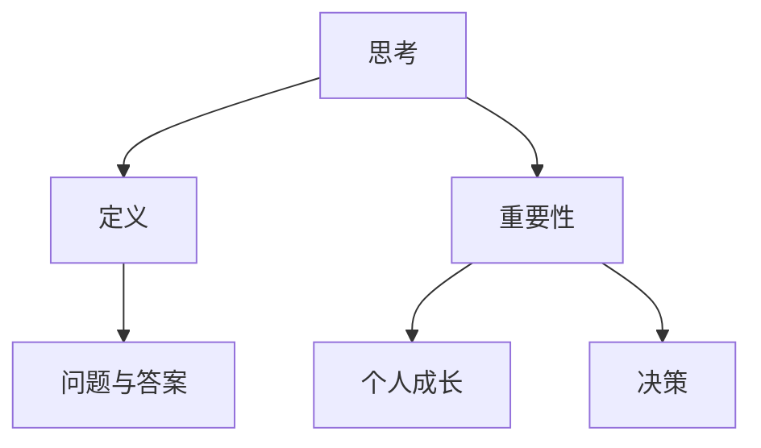
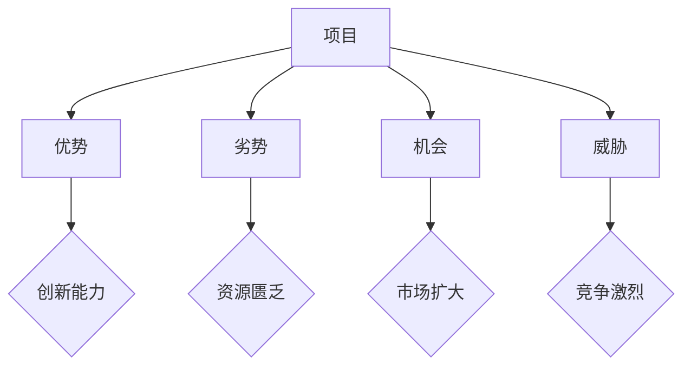

                 


## 文章标题：通过思考深化人生理解：在问题中寻找答案

### 关键词：思考、人生理解、问题解决、个人成长、决策

#### 摘要：
本文旨在探讨思考在深化人生理解中的重要性，通过分析问题与答案的关系，探讨如何通过有效的问题提出和解答方法，提高个人的思考能力和人生理解。文章将首先介绍思考的重要性，接着讨论问题的定义和分类，以及提出问题和寻找答案的技巧。随后，文章将深入探讨思考在个人认知、人际关系、职业发展等领域的应用，并探讨如何培养良好的思考习惯和思考的社会责任。最后，文章将总结思考对人生理解的重要性，并展望思考在未来的发展趋势。

## 《通过思考深化人生理解：在问题中寻找答案》目录大纲

### 第一部分：引言

#### 1.1 书籍背景和目的
##### 1.1.1 书籍的灵感来源
##### 1.1.2 书籍的目标读者
##### 1.1.3 书籍的主要观点

#### 1.2 思考的重要性
##### 1.2.1 思考如何帮助我们理解人生
##### 1.2.2 思考与人生选择的关系
##### 1.2.3 思考对个人成长的意义

### 第二部分：问题与答案

#### 2.1 问题的定义与分类
##### 2.1.1 问题的定义
##### 2.1.2 问题的分类
##### 2.1.3 问题的本质

#### 2.2 提出问题的技巧
##### 2.2.1 提问的类型
##### 2.2.2 有效提问的步骤
##### 2.2.3 提问的误区与解决方法

#### 2.3 寻找答案的方法
##### 2.3.1 独立思考
##### 2.3.2 寻求他人意见
##### 2.3.3 研究与调查

### 第三部分：思考与人生

#### 3.1 思考与自我认知
##### 3.1.1 自我认知的重要性
##### 3.1.2 思考如何帮助我们更好地认识自己
##### 3.1.3 自我反思的技巧

#### 3.2 思考与人际关系
##### 3.2.1 思考如何改善人际关系
##### 3.2.2 有效沟通的思考要素
##### 3.2.3 解决冲突的策略

#### 3.3 思考与职业发展
##### 3.3.1 思考如何规划职业发展
##### 3.3.2 职业决策的思考方法
##### 3.3.3 职业发展中遇到问题的解决策略

### 第四部分：思考的实践与应用

#### 4.1 思考习惯的培养
##### 4.1.1 培养思考习惯的重要性
##### 4.1.2 常见的思考障碍与克服方法
##### 4.1.3 培养思考习惯的实用技巧

#### 4.2 思考在生活中的应用
##### 4.2.1 思考如何改善生活质量
##### 4.2.2 思考如何提高工作效率
##### 4.2.3 思考在应对挑战时的作用

#### 4.3 思考的社会责任
##### 4.3.1 思考如何影响社会
##### 4.3.2 公民责任与思考
##### 4.3.3 思考在推动社会进步中的作用

### 第五部分：思考与人生理解

#### 5.1 思考与人生意义
##### 5.1.1 人生意义的探索
##### 5.1.2 思考如何帮助理解人生意义
##### 5.1.3 寻找人生意义的策略

#### 5.2 思考与价值观
##### 5.2.1 价值观的定义与作用
##### 5.2.2 思考如何塑造个人价值观
##### 5.2.3 价值观冲突的解决策略

#### 5.3 思考与人生目标
##### 5.3.1 人生目标的定义
##### 5.3.2 思考如何设定人生目标
##### 5.3.3 实现人生目标的策略

#### 5.4 思考与持续成长
##### 5.4.1 持续成长的重要性
##### 5.4.2 思考如何实现持续成长
##### 5.4.3 持续成长的策略与技巧

#### 5.5 思考与人生困境
##### 5.5.1 人生困境的类型
##### 5.5.2 思考如何应对人生困境
##### 5.5.3 从困境中成长的策略

#### 5.6 思考与人生决策
##### 5.6.1 人生决策的定义
##### 5.6.2 思考如何做出明智的人生决策
##### 5.6.3 人生决策的误区与解决方法

#### 5.7 思考与人生哲学
##### 5.7.1 人生哲学的概念
##### 5.7.2 思考如何形成人生哲学
##### 5.7.3 人生哲学的影响

### 第六部分：总结与反思

#### 6.1 思考的总结
##### 6.1.1 思考的重要成果
##### 6.1.2 思考对人生的积极影响
##### 6.1.3 思考的未来发展趋势

#### 6.2 反思与自我提升
##### 6.2.1 反思的重要性
##### 6.2.2 如何进行有效的反思
##### 6.2.3 反思如何促进个人成长

#### 6.3 展望未来
##### 6.3.1 未来的人生挑战与机遇
##### 6.3.2 思考在未来的作用
##### 6.3.3 未来的思考方向

### 附录

#### 附录 A：思考工具与方法
##### A.1 思维导图
##### A.2 思维工具箱
##### A.3 思考日记

#### 附录 B：思考资源推荐
##### B.1 书籍推荐
##### B.2 文章推荐
##### B.3 思考活动推荐

#### 附录 C：思考案例
##### C.1 个人案例
##### C.2 社会案例
##### C.3 企业案例

---

## 第一部分：引言

### 1.1 书籍背景和目的

#### 1.1.1 书籍的灵感来源

本文书籍的灵感来源于对人类智慧和思考模式的深入探索。在当今快速变化的社会中，人们面临着越来越多的复杂问题，需要更高效的思考能力和解决问题的方法。作者通过对历史上伟大的思想家和科学家的工作进行深入研究和分析，发现了思考在人类认知和进步中的核心作用。这些发现促使作者撰写本书，以帮助读者更好地理解思考的重要性，并学会如何在生活中应用有效的思考技巧。

#### 1.1.2 书籍的目标读者

本书的目标读者是那些渴望提升自我认知、改善人际关系、规划职业发展以及寻找人生意义的人。无论您是学生、职场人士还是生活规划者，本书都提供了丰富的思考方法和实用技巧，帮助您在各个方面取得更好的成就。同时，本书也适用于教育工作者、培训师和心理咨询师，他们可以借助本书中的内容来提升他人的思考能力。

#### 1.1.3 书籍的主要观点

本书的核心观点是：思考是深化人生理解的关键。通过有效的思考，我们能够更好地理解世界、自我和他人，从而做出更明智的决策，实现个人成长和目标。本书将带领读者一步步深入思考，了解思考的本质和方法，最终实现人生意义的追求。

### 1.2 思考的重要性

#### 1.2.1 思考如何帮助我们理解人生

思考是人类智慧的体现，它使我们能够从不同的角度看待问题，从而更全面地理解人生的复杂性和多样性。通过思考，我们能够探索问题的根本原因，发现潜在的机会和挑战，从而做出更明智的决策。思考让我们能够跳出惯性思维，看到问题的本质，从而更好地应对生活中的各种情境。

#### 1.2.2 思考与人生选择的关系

人生中的每一个选择都需要我们进行思考。通过思考，我们能够分析每个选择的潜在后果，评估其对我们个人目标和生活质量的影响。思考使我们能够更加理性地看待人生选择，从而做出更符合自己价值观和目标的决策。

#### 1.2.3 思考对个人成长的意义

思考是个人成长的重要推动力。通过思考，我们能够不断地反思自己的行为和决策，从过去的经验中学习，从而不断提升自己的认知和能力。思考使我们能够更加深入地认识自我，发现自己的潜能，并在不断成长的过程中实现自我超越。

## 第二部分：问题与答案

### 2.1 问题的定义与分类

#### 2.1.1 问题的定义

问题是指在我们认知范围内尚未解决或者理解不充分的状况、疑问或者挑战。问题可以来源于生活中的各种情境，如工作、学习、人际关系等，也可以是内心的困惑和疑虑。问题的存在激发了我们的思考，推动了我们寻求答案和解决问题的过程。

#### 2.1.2 问题的分类

问题可以根据其性质和特点进行分类。常见的分类方法包括：

- **客观问题**：这类问题与外部世界有关，如科学问题、工程技术问题等，通常可以通过实证研究和实验来解答。
- **主观问题**：这类问题与个人内心世界有关，如情感问题、价值观问题等，通常需要通过自我反思和内心探索来解决。
- **结构性问题**：这类问题涉及系统的结构和运作方式，如社会问题、组织问题等，通常需要通过系统分析和改进来解答。
- **复杂问题**：这类问题涉及多个领域和因素，如全球性问题、经济问题等，通常需要跨学科合作和综合思考来解答。

#### 2.1.3 问题的本质

问题的本质是认知与现实之间的差异。当我们意识到现实中的某些状况与我们预期的或者希望的情况不符时，就会产生问题。问题的存在激发了我们的好奇心和解决问题的动机，促使我们进行思考，寻找答案。

### 2.2 提出问题的技巧

#### 2.2.1 提问的类型

提问可以分为以下几种类型：

- **开放式提问**：这类提问通常使用疑问词（如谁、什么、为什么、如何等），鼓励回答者提供详细的信息和见解。
- **封闭式提问**：这类提问通常使用是非题的形式（如是不是、对不对等），适用于确认事实或者获取简单的信息。
- **引导式提问**：这类提问通过提出相关的问题，引导回答者深入思考和讨论。
- **反思式提问**：这类提问鼓励回答者反思自己的观点和决策过程，提高自我认知。

#### 2.2.2 有效提问的步骤

要提出有效的问题，可以遵循以下步骤：

1. **明确目的**：在提问之前，明确提问的目的，确定想要获取的信息或者解决的问题。
2. **准备问题**：根据目的，准备一系列相关的问题，确保问题具有明确性和针对性。
3. **选择合适的提问方式**：根据问题的类型和回答者的特点，选择合适的提问方式，以提高回答的准确性和深度。
4. **提问**：在合适的时机和情境下，提出问题，注意语气的温和和尊重。
5. **倾听和反思**：在回答者回答问题后，耐心倾听，并反思回答的内容，以进一步挖掘问题的深度。

#### 2.2.3 提问的误区与解决方法

常见的提问误区包括：

- **过于直接和粗暴**：解决方法是使用温和和尊重的语气提问，避免对回答者造成压力。
- **问题过于宽泛或模糊**：解决方法是明确问题的具体范围和目标，以提高回答的针对性。
- **问题顺序不当**：解决方法是合理安排问题的顺序，从简单到复杂，从具体到抽象，以提高提问的效果。

### 2.3 寻找答案的方法

#### 2.3.1 独立思考

独立思考是寻找答案的重要方法。通过独立思考，我们能够：

- **发展批判性思维**：独立思考使我们能够审视现有的观点和证据，评估其可靠性和合理性。
- **形成自己的见解**：独立思考使我们能够根据自己的经验和理解，形成独特的见解和观点。
- **提高创造力**：独立思考激发我们的创造力，帮助我们找到新颖和创新的解决方案。

独立思考的技巧包括：

- **主动寻求信息**：积极收集与问题相关的信息和资料，以便更好地理解问题。
- **分析证据**：分析证据的可靠性和相关性，判断其对我们寻找答案的价值。
- **形成假设**：基于已有的信息和知识，形成初步的假设，并对其进行验证。
- **反思和修正**：在思考过程中，不断反思和修正自己的观点和假设，以提高思考的质量。

#### 2.3.2 寻求他人意见

寻求他人意见是寻找答案的另一种重要方法。通过与他人交流，我们能够：

- **获得不同的观点**：他人的观点可以帮助我们更全面地理解问题，发现我们可能忽视的角度。
- **获取反馈和建议**：他人的反馈和建议可以帮助我们改进自己的思考过程和解决方案。
- **建立合作和协作**：与他人合作可以发挥各自的优势，共同寻找问题的答案。

寻求他人意见的技巧包括：

- **明确沟通目标**：在交流之前，明确沟通的目标和期望，以便更好地引导讨论。
- **积极倾听**：在交流过程中，积极倾听对方的观点和意见，避免打断或争辩。
- **提出建设性问题**：在交流过程中，提出建设性的问题，以深入探讨问题的各个方面。
- **反馈和总结**：在交流结束后，进行反馈和总结，以便双方都能从交流中获益。

#### 2.3.3 研究与调查

研究与调查是寻找答案的另一种重要方法。通过研究和调查，我们能够：

- **收集数据和证据**：研究和调查可以帮助我们收集相关的数据和证据，以便更好地支持我们的观点和假设。
- **验证假设**：通过研究和调查，我们可以验证自己的假设，判断其是否符合实际情况。
- **发现新的问题和挑战**：在研究和调查过程中，我们可能会发现新的问题和挑战，从而推动我们进一步思考和研究。

研究与调查的技巧包括：

- **选择合适的研究方法**：根据问题的性质和目标，选择合适的研究方法，如实验、观察、文献综述等。
- **设计研究方案**：设计详细的研究方案，包括研究目标、研究方法、数据收集和分析方法等。
- **收集和整理数据**：按照研究方案，收集和整理相关数据，确保数据的准确性和可靠性。
- **分析和解释数据**：对收集到的数据进行分析和解释，判断其对我们寻找答案的价值。

---

## 第三部分：思考与人生

### 3.1 思考与自我认知

#### 3.1.1 自我认知的重要性

自我认知是指个体对自己内心世界、性格、价值观和能力的认识和理解。自我认知的重要性体现在以下几个方面：

- **促进个人成长**：通过自我认知，我们能够更好地了解自己的优点和不足，从而有针对性地进行个人成长和改进。
- **提高决策能力**：自我认知使我们能够更加客观地评估自己的能力和价值观，从而做出更明智的决策。
- **改善人际关系**：了解自己的性格和价值观，有助于我们更好地与他人沟通和相处，建立和谐的人际关系。

#### 3.1.2 思考如何帮助我们更好地认识自己

思考是认识自己的重要途径。通过思考，我们能够：

- **审视自己的行为和决策**：思考使我们能够回顾自己的行为和决策，分析其背后的动机和原因，从而更好地了解自己的内心世界。
- **识别自己的优点和不足**：思考使我们能够客观地评估自己的能力和价值观，识别自己的优点和不足，从而有针对性地进行个人成长。
- **发现内心的需求和愿望**：思考使我们能够深入了解自己的内心世界，发现内心的需求和愿望，从而更好地规划自己的人生。

#### 3.1.3 自我反思的技巧

自我反思是深化自我认知的重要方法。以下是一些自我反思的技巧：

- **定期回顾自己的行为和决策**：定期回顾自己的行为和决策，分析其成功和失败的原因，从经验中学习。
- **记录思考和感受**：通过写日记或者思考日志，记录自己的思考和感受，以便更好地了解自己的内心世界。
- **与他人分享和讨论**：与亲朋好友或者专业人士分享自己的思考和感受，听取他们的意见和建议，从而深化自我认知。

### 3.2 思考与人际关系

#### 3.2.1 思考如何改善人际关系

思考在改善人际关系中发挥着重要作用。通过思考，我们能够：

- **理解他人的观点和感受**：思考使我们能够从他人的角度看待问题，理解他们的观点和感受，从而更好地沟通和相处。
- **处理冲突和解决矛盾**：思考使我们能够理智地处理冲突和解决矛盾，避免情绪化的决策和行动。
- **建立良好的沟通技巧**：思考使我们能够更好地运用沟通技巧，如倾听、表达、提问等，从而建立和谐的人际关系。

#### 3.2.2 有效沟通的思考要素

有效沟通需要具备以下几个思考要素：

- **明确沟通目标**：在沟通之前，明确沟通的目标和期望，以便更好地引导沟通的方向。
- **倾听和理解**：倾听对方的观点和感受，理解他们的需求和期望，从而更好地回应他们的需求。
- **表达清晰**：表达自己的观点和感受时，要尽量清晰明了，避免歧义和误解。
- **提问和反馈**：通过提问和反馈，了解对方的理解程度和需求，及时调整沟通策略。

#### 3.2.3 解决冲突的策略

解决冲突需要以下策略：

- **冷静分析**：在冲突发生时，保持冷静，分析冲突的原因和影响，找到合理的解决方案。
- **倾听和理解**：倾听对方的观点和感受，理解他们的需求和期望，从而更好地回应他们的需求。
- **寻找共同点**：在冲突双方之间寻找共同点，以建立共识和合作的基础。
- **寻求第三方的帮助**：如果冲突无法自行解决，可以寻求第三方的帮助，如调解人或者专业人士，以公正和中立的角度进行调解。

### 3.3 思考与职业发展

#### 3.3.1 思考如何规划职业发展

思考在规划职业发展中起着关键作用。通过思考，我们能够：

- **确定职业目标**：思考使我们能够明确自己的职业目标，从而更好地规划职业发展的方向。
- **分析自身优势和能力**：思考使我们能够客观地评估自己的优势和能力，找到适合自己的职业领域。
- **制定职业规划**：思考使我们能够制定详细的职业规划，包括短期目标和长期目标，以及实现这些目标的步骤和策略。

#### 3.3.2 职业决策的思考方法

在职业决策中，可以运用以下思考方法：

- **SWOT分析**：通过SWOT分析，评估自身的优势（Strengths）、劣势（Weaknesses）、机会（Opportunities）和威胁（Threats），从而做出更明智的决策。
- **目标设定**：设定清晰的职业目标，并将目标分解为具体的行动计划，以便更好地实现目标。
- **风险评估**：在做出职业决策时，评估可能的风险和挑战，并制定相应的应对策略。

#### 3.3.3 职业发展中遇到问题的解决策略

在职业发展中，可能会遇到各种问题，如职业瓶颈、职场冲突、职业倦怠等。以下是一些解决策略：

- **反思和调整**：在遇到问题时，反思自己的行为和决策，找出问题的根源，并调整自己的策略和方法。
- **寻求支持和建议**：在遇到困难时，寻求同事、上司或者专业人士的支持和建议，以获得新的视角和解决方案。
- **持续学习和成长**：通过学习和成长，提升自己的能力和素质，以更好地应对职业发展中的挑战。

---

## 第四部分：思考的实践与应用

### 4.1 思考习惯的培养

#### 4.1.1 培养思考习惯的重要性

思考习惯是提高思考能力的关键。培养良好的思考习惯，能够帮助我们更加有效地分析问题、解决问题，并在生活和工作中取得更好的成果。以下是一些培养思考习惯的重要性：

- **提高认知能力**：良好的思考习惯能够提升我们的认知能力，使我们能够更好地理解世界和自我。
- **增强问题解决能力**：通过培养思考习惯，我们能够更加高效地分析问题，找到解决问题的方法和策略。
- **促进个人成长**：思考习惯能够帮助我们不断地反思和总结，从而实现个人成长和进步。

#### 4.1.2 常见的思考障碍与克服方法

在培养思考习惯的过程中，我们可能会遇到一些障碍，如：

- **缺乏好奇心**：克服方法：培养对未知事物的好奇心，主动寻求新的知识和信息。
- **思维惯性**：克服方法：跳出舒适区，尝试新的思考角度和方法，打破固有的思维模式。
- **信息过载**：克服方法：学会筛选和处理信息，关注关键信息和核心问题，避免被大量信息所困扰。

#### 4.1.3 培养思考习惯的实用技巧

以下是一些培养思考习惯的实用技巧：

- **定期反思**：每天或每周花时间进行反思，回顾自己的行为和决策，总结经验教训。
- **阅读和写作**：通过阅读和写作，拓展自己的知识和视野，提高思考能力和表达能力。
- **提问和讨论**：积极提问和参与讨论，与他人交流和分享观点，从中获得新的思考和启发。
- **实践和应用**：将思考应用到实际生活和工作中，通过实践来验证和提升自己的思考能力。

### 4.2 思考在生活中的应用

#### 4.2.1 思考如何改善生活质量

思考在改善生活质量中发挥着重要作用。以下是一些思考方法，可以帮助我们改善生活质量：

- **优化日常习惯**：通过思考，优化日常生活中的习惯和行为，如合理规划时间、保持健康的生活方式等。
- **处理压力和焦虑**：通过思考，学会如何应对压力和焦虑，如通过冥想、运动等方式来缓解压力。
- **提升人际关系**：通过思考，改善与他人的沟通和相处方式，建立和谐的人际关系。
- **培养兴趣和爱好**：通过思考，发掘和培养自己的兴趣和爱好，丰富自己的生活内容。

#### 4.2.2 思考如何提高工作效率

思考在提高工作效率中起着关键作用。以下是一些思考方法，可以帮助我们提高工作效率：

- **时间管理**：通过思考，合理安排时间，制定明确的工作计划和时间表，避免时间浪费。
- **任务分解**：将复杂的工作任务分解为小步骤，逐步完成，提高工作的效率和质量。
- **目标设定**：设定明确的工作目标，并根据目标制定相应的计划和策略，确保工作有序进行。
- **自我激励**：通过思考，找到工作动力和激励因素，保持积极的工作态度和状态。

#### 4.2.3 思考在应对挑战时的作用

在应对挑战时，思考发挥着至关重要的作用。以下是一些思考方法，可以帮助我们应对挑战：

- **分析问题**：通过思考，分析问题的原因和影响，找到解决问题的方法和策略。
- **寻求支持**：通过思考，寻求他人的帮助和支持，共同应对挑战。
- **调整心态**：通过思考，调整自己的心态和情绪，保持积极和乐观的态度。
- **制定计划**：通过思考，制定具体的应对计划和策略，有条不紊地解决挑战。

### 4.3 思考的社会责任

#### 4.3.1 思考如何影响社会

思考不仅对个人成长和生活有着重要影响，同时也对社会发展产生深远影响。以下是一些思考如何影响社会的途径：

- **公共参与**：通过思考，积极参与公共事务和决策，为社会的发展和进步贡献智慧和力量。
- **社会责任**：通过思考，认识到自己在社会中的角色和责任，为社会做出积极的贡献。
- **传播知识**：通过思考和分享，传播知识和技术，推动社会的科学和文化发展。
- **创新和改进**：通过思考，不断探索和创新，为社会提供更好的解决方案和产品。

#### 4.3.2 公民责任与思考

作为公民，思考是我们的重要责任。以下是一些公民责任与思考的关联：

- **理性思考**：作为公民，要具备理性思考的能力，对公共事务和社会问题进行分析和判断。
- **公民教育**：通过思考，提高公民意识和素质，参与公民教育和培训。
- **参与决策**：积极参与社会和公共事务的决策过程，为社会的发展和进步贡献力量。
- **监督和问责**：通过思考，对政府和公共机构进行监督和问责，促进社会公正和透明。

#### 4.3.3 思考在推动社会进步中的作用

思考在推动社会进步中发挥着关键作用。以下是一些思考如何推动社会进步的途径：

- **科技创新**：通过思考，推动科技创新，为社会发展和进步提供新的动力和机遇。
- **社会改革**：通过思考，推动社会改革，解决社会问题，提高社会的公平和正义。
- **文化传承**：通过思考，传承和发扬优秀的文化传统，为社会的发展提供精神支撑。
- **国际合作**：通过思考，推动国际合作，解决全球性问题，促进世界和平与发展。

---

## 第五部分：思考与人生理解

### 5.1 思考与人生意义

#### 5.1.1 人生意义的探索

人生意义是一个深刻而复杂的问题，它关乎我们存在的价值和目的。思考人生意义的重要性体现在以下几个方面：

- **指导生活方向**：通过思考人生意义，我们能够明确自己的生活目标和价值取向，从而更好地规划人生道路。
- **提高生活质量**：思考人生意义有助于我们找到生活的动力和意义，从而提高生活质量和幸福感。
- **促进个人成长**：思考人生意义能够激发我们的内在动力，促使我们在各个方面进行个人成长和进步。

#### 5.1.2 思考如何帮助理解人生意义

思考帮助我们理解人生意义的过程可以分为以下几个步骤：

- **反思和探索**：通过反思和探索，我们能够深入了解自己的内心世界，发现自己对人生意义的看法和期望。
- **分析与评估**：分析评估自己的生活和价值观，确定对自己而言重要的事物和目标。
- **形成见解**：基于反思和分析，形成对人生意义的见解和观点，并将其融入到自己的生活中。
- **实践与验证**：将思考的结果付诸实践，通过实际行动验证和调整自己的理解和认识。

#### 5.1.3 寻找人生意义的策略

以下是一些寻找人生意义的策略：

- **设立目标**：设定明确的生活目标和价值观，以指导自己的行为和决策。
- **培养兴趣和爱好**：通过培养兴趣和爱好，丰富自己的生活内容，寻找人生的意义和乐趣。
- **参与社会实践**：通过参与社会活动和公益事业，为社会做出贡献，实现自己的人生价值。
- **持续学习和成长**：通过学习和成长，不断拓展自己的视野和能力，寻找新的生活意义和目标。

### 5.2 思考与价值观

#### 5.2.1 价值观的定义与作用

价值观是指个人或社会对事物重要性的评估和判断，它是指导我们行为和决策的内在标准。价值观的定义和作用如下：

- **定义**：价值观是个人或社会对事物重要性的评估和判断，它体现了我们的信仰、信念和追求。
- **作用**：价值观在我们的生活中起着至关重要的作用，它指导我们的行为和决策，影响我们的生活质量和个人成长。

#### 5.2.2 思考如何塑造个人价值观

塑造个人价值观需要通过以下几个步骤：

- **了解和反思**：通过思考和反思，了解自己的价值观，明确自己的信仰和信念。
- **选择和评估**：在了解和反思的基础上，选择符合自己价值观的事物和目标，并进行评估和调整。
- **实践和验证**：将个人价值观付诸实践，通过实际行动来验证和巩固自己的价值观。

#### 5.2.3 价值观冲突的解决策略

在现实生活中，我们可能会遇到价值观冲突，以下是一些解决策略：

- **理性思考**：通过理性思考和评估，分析价值观冲突的原因和影响，找到解决问题的方法。
- **沟通和协商**：与他人进行沟通和协商，尊重彼此的价值观，寻求共识和妥协。
- **调整和适应**：在必要时，调整和适应自己的价值观，以适应新的环境和社会要求。
- **保持平衡**：在处理价值观冲突时，保持平衡和公正，避免过度偏袒一方。

### 5.3 思考与人生目标

#### 5.3.1 人生目标的定义

人生目标是指个人在人生道路上期望实现的目标和理想，它是指导我们行动和决策的重要依据。人生目标的定义包括以下几个方面：

- **个人愿景**：人生目标体现了我们对未来的期望和愿景，是我们为之努力奋斗的方向。
- **行为准则**：人生目标指导我们的行为和决策，帮助我们做出符合自己价值观的选择。
- **实现路径**：人生目标为我们提供了实现目标的路径和策略，帮助我们在实现目标的过程中不断前进。

#### 5.3.2 思考如何设定人生目标

设定人生目标需要通过以下几个步骤：

- **自我评估**：通过自我评估，了解自己的兴趣、优势和价值观，明确自己的特长和潜力。
- **目标设定**：在了解自己的基础上，设定具体、明确的人生目标，并将其分解为短期和长期目标。
- **目标评估**：对设定的人生目标进行评估和调整，确保目标的可行性和合理性。
- **制定计划**：制定详细的行动计划，为实现人生目标提供具体的策略和步骤。

#### 5.3.3 实现人生目标的策略

以下是一些实现人生目标的策略：

- **目标分解**：将人生目标分解为具体的、可操作的任务，逐步实现。
- **时间管理**：合理安排时间，确保每个任务和目标都能按时完成。
- **资源整合**：整合自身的资源和能力，寻求外部的支持和帮助，以实现人生目标。
- **持续努力**：保持积极的心态和努力，不断克服困难和挑战，实现人生目标。

### 5.4 思考与持续成长

#### 5.4.1 持续成长的重要性

持续成长是指个人在知识、技能和素质等方面的不断进步和提高。持续成长的重要性体现在以下几个方面：

- **提升竞争力**：持续成长能够提升个人的竞争力，使我们在职场和社会中具备更高的优势。
- **实现人生价值**：持续成长使我们能够实现自己的人生价值，为社会和他人做出更大的贡献。
- **提高生活质量**：持续成长能够提高我们的生活质量和幸福感，使我们的生活更加充实和有意义。

#### 5.4.2 思考如何实现持续成长

实现持续成长需要通过以下几个步骤：

- **自我认知**：通过自我认知，了解自己的优势和不足，明确自己的成长方向。
- **目标设定**：设定具体的成长目标，并根据目标制定详细的计划和策略。
- **学习与进步**：不断学习和积累知识，提升自己的技能和能力，实现持续成长。
- **反思与总结**：通过反思和总结，不断总结成长的经验和教训，调整自己的成长策略。

#### 5.4.3 持续成长的策略与技巧

以下是一些持续成长的策略与技巧：

- **时间管理**：合理安排时间，确保有足够的时间用于学习和成长。
- **目标分解**：将成长目标分解为具体的任务和步骤，逐步实现。
- **自律与坚持**：保持自律和坚持，克服困难和挑战，实现持续成长。
- **寻求反馈**：主动寻求他人的反馈和建议，以了解自己的成长情况，调整成长策略。

### 5.5 思考与人生困境

#### 5.5.1 人生困境的类型

人生困境是指个人在生活和发展过程中遇到的困难和挑战。人生困境的类型包括以下几个方面：

- **职业困境**：如职业发展受阻、职业瓶颈等。
- **人际关系困境**：如人际关系紧张、冲突等。
- **心理困境**：如焦虑、抑郁、自我怀疑等。
- **生活困境**：如经济压力、生活压力等。

#### 5.5.2 思考如何应对人生困境

应对人生困境需要通过以下几个步骤：

- **分析困境**：通过思考和分析，了解困境的原因和影响，找到解决问题的方法和策略。
- **制定计划**：在分析困境的基础上，制定具体的行动计划，有条不紊地解决问题。
- **寻求支持**：寻求家人、朋友、专业人士的支持和帮助，共同应对困境。
- **调整心态**：保持积极的心态，相信自己能够克服困境，坚定信心，迎接挑战。

#### 5.5.3 从困境中成长的策略

从困境中成长需要以下几个策略：

- **反思与总结**：通过反思和总结，了解困境的教训和经验，调整自己的行为和决策。
- **学习与进步**：在困境中，通过学习和进步，提升自己的能力和素质，为未来的发展打下基础。
- **保持乐观**：保持乐观的心态，相信自己能够克服困境，迎接新的挑战。
- **寻求创新**：在困境中，勇于创新和尝试，寻找新的解决方案和途径，打破困境的束缚。

### 5.6 思考与人生决策

#### 5.6.1 人生决策的定义

人生决策是指个人在面对不同选择和情况时做出的决策，它关系到个人的发展和生活质量。人生决策的定义包括以下几个方面：

- **选择与权衡**：人生决策涉及到在不同选项之间进行选择和权衡，选择最符合个人需求和价值观的方案。
- **目标与策略**：人生决策旨在实现个人的目标和愿景，通过制定相应的策略和计划，实现人生目标。
- **影响与后果**：人生决策会对个人生活产生重要影响，包括职业发展、人际关系、生活质量等方面。

#### 5.6.2 思考如何做出明智的人生决策

做出明智的人生决策需要通过以下几个步骤：

- **明确目标**：在做出决策之前，明确自己的目标和价值观，确保决策符合自己的长期利益和价值观。
- **收集信息**：通过收集和分析相关信息，了解不同选择的优劣势和潜在后果，为决策提供依据。
- **权衡利弊**：在收集到足够的信息后，权衡不同选择的利弊，评估其对个人目标和价值观的影响。
- **制定计划**：根据权衡结果，制定具体的实施计划和策略，确保决策能够得到有效执行。

#### 5.6.3 人生决策的误区与解决方法

在人生决策过程中，我们可能会陷入一些误区，以下是一些常见的误区和解决方法：

- **盲目跟风**：解决方法：在决策时，要充分了解自己的需求和价值观，避免盲目跟风。
- **过度犹豫**：解决方法：在决策时，要明确自己的目标和价值观，提高决策的果断性，避免过度犹豫。
- **忽视后果**：解决方法：在决策时，要充分考虑不同选择的后果，评估其对个人生活的影响。
- **情绪化决策**：解决方法：在决策时，要保持冷静和理性，避免情绪化的决策。

### 5.7 思考与人生哲学

#### 5.7.1 人生哲学的概念

人生哲学是指对人生观、价值观和道德观的思考和总结，它是指导我们生活的重要思想体系。人生哲学的概念包括以下几个方面：

- **人生观**：人生观是指对人生意义、目标和价值的理解和认识，它是人生哲学的核心内容。
- **价值观**：价值观是指个人或社会对事物重要性的评估和判断，它是人生哲学的重要体现。
- **道德观**：道德观是指个人或社会对道德规范和伦理标准的理解和认识，它是人生哲学的重要组成部分。

#### 5.7.2 思考如何形成人生哲学

形成人生哲学需要通过以下几个步骤：

- **自我反思**：通过自我反思，了解自己的价值观、道德观和人生观，找到自己的思想基础。
- **学习和借鉴**：通过学习和借鉴他人的思想和观点，丰富自己的人生哲学体系。
- **实践与验证**：通过实践和验证，验证和调整自己的人生哲学，使其更加符合自己的实际情况。
- **持续更新**：随着时间和经验的积累，持续更新自己的人生哲学，使其与时俱进，适应新的环境和挑战。

#### 5.7.3 人生哲学的影响

人生哲学对我们的生活产生深远的影响，以下是一些影响方面：

- **价值观和道德观**：人生哲学塑造了我们的价值观和道德观，指导我们的行为和决策。
- **生活方式**：人生哲学影响了我们的生活方式，包括工作、学习、休闲等方面。
- **人际关系**：人生哲学影响了我们与他人的相处方式，指导我们建立和谐的人际关系。
- **心理状态**：人生哲学影响了我们的心理状态，帮助我们应对生活中的挑战和困难。

---

## 第六部分：总结与反思

### 6.1 思考的总结

思考是深化人生理解的关键，它贯穿于我们的日常生活和各个领域。通过有效的思考，我们能够更好地认识自我、改善人际关系、规划职业发展，并实现个人成长和目标。以下是思考的重要成果和影响：

- **提高认知能力**：思考使我们的认知能力得到提升，能够更全面、深入地理解问题和现象。
- **增强决策能力**：思考帮助我们做出明智的决策，减少错误和失误，提高生活质量和工作效率。
- **促进个人成长**：思考促使我们不断反思和总结，从中学习经验教训，实现自我超越和成长。
- **改善人际关系**：思考使我们能够更好地理解他人，建立和谐的人际关系，减少冲突和矛盾。

### 6.2 反思与自我提升

反思是思考的重要组成部分，通过反思，我们能够更好地了解自己的思考过程和成果，发现不足之处，并寻求改进的方法。以下是如何进行有效的反思和自我提升：

- **定期反思**：设定固定的时间进行反思，回顾自己的行为和决策，分析成功和失败的原因。
- **写反思日记**：将反思过程和结果记录下来，以便日后查阅和总结。
- **寻求反馈**：主动向他人请教意见和建议，了解自己的思考和行动是否得到他人的认可。
- **制定改进计划**：根据反思结果，制定具体的改进计划，逐步实施，并持续跟踪和评估。

### 6.3 展望未来

未来的人生将面临更多的挑战和机遇，思考将继续发挥重要作用。以下是思考在未来可能的发展方向：

- **科技与思考**：随着科技的快速发展，思考将更加依赖于大数据、人工智能等工具，以提高思考的效率和质量。
- **跨界思考**：未来思考将更加注重跨学科、跨领域的融合，以应对复杂问题的挑战。
- **社会思考**：思考将更加关注社会问题，如环境保护、社会公平、全球治理等，为社会进步贡献力量。
- **持续学习**：未来思考将更加注重持续学习和个人成长，以适应快速变化的社会环境。

---

## 附录

### 附录 A：思考工具与方法

#### A.1 思维导图

思维导图是一种图形化的思维工具，通过关键词和连接线，将思维过程可视化。它有助于梳理思路、激发创意、提高记忆效果。以下是一个简单的思维导图示例：



#### A.2 思维工具箱

思维工具箱包括多种工具，如SWOT分析、5W1H、鱼骨图等，用于不同场景下的思考和分析。以下是一个SWOT分析的示例：



#### A.3 思考日记

思考日记是一种记录思考和反思的方法，可以帮助我们回顾思考过程、总结经验教训。以下是一个思考日记的示例：

```
日期：2023年3月10日

今日思考：
1. 如何提高工作效率？
   - 制定详细的工作计划
   - 分解任务，逐步完成
   - 避免多任务处理，专注于单一任务

反思：
1. 今天的工作效率较低，主要是因为任务太多，没有合理安排时间。
2. 今后要更加注重时间管理，确保每个任务都能按时完成。
```

### 附录 B：思考资源推荐

#### B.1 书籍推荐

- 《思考，快与慢》[丹尼尔·卡尼曼]
- 《如何赢取友谊与影响他人》[戴尔·卡耐基]
- 《深度工作》[卡尔·纽波特]
- 《奇特的一生》[乔治·斯托兹]

#### B.2 文章推荐

- 《为什么我们总是忍不住玩手机》[科技生活]
- 《如何培养批判性思维》[哈佛商业评论]
- 《人工智能时代的思考方式》[机器之心]
- 《人类简史》[尤瓦尔·赫拉利]

#### B.3 思考活动推荐

- 思维导图工作坊
- 批判性思维研讨会
- 创意思考训练营
- 自我反思与成长工作坊

### 附录 C：思考案例

#### C.1 个人案例

张先生是一名职场人士，他意识到自己的工作效率较低，于是开始反思自己的思考方式。通过学习《深度工作》一书，他学会了如何将工作分解为小任务，并专注于单一任务。同时，他还制定了详细的工作计划，并定期进行反思和调整。经过一段时间的实践，他的工作效率显著提高，工作质量也得到了提升。

#### C.2 社会案例

某公司为了提高员工的思考能力，开展了思维导图和批判性思维的培训。通过这些培训，员工们学会了如何将复杂的问题进行分解，并从不同的角度进行分析。这些技能的提升，使公司在面对市场变化时，能够迅速做出应对策略，提高了竞争力。

#### C.3 企业案例

某科技公司注重员工的持续学习和成长，定期组织内部培训和技术分享会。这些活动不仅提高了员工的技能和知识水平，还促进了团队成员之间的交流和合作。在公司的支持下，员工们不断探索新的技术和解决方案，为公司的发展做出了重要贡献。

