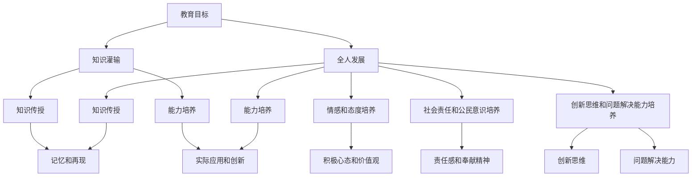
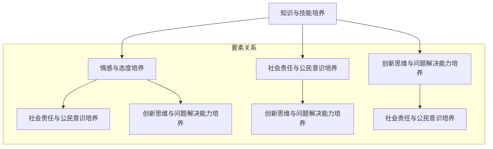
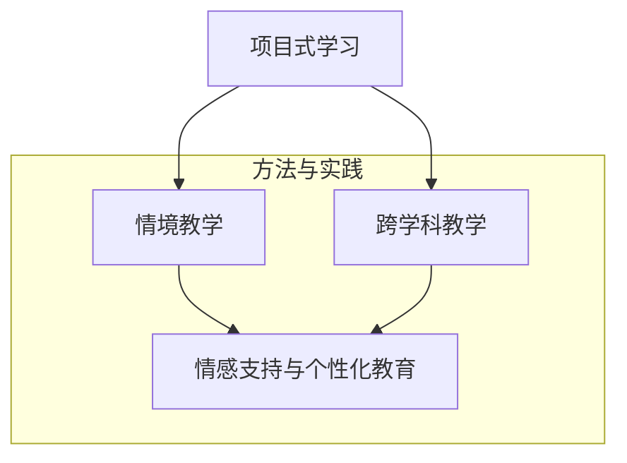

                 


## 文章标题

**重新审视教育目标：从知识灌输到全人发展的转变**

## 文章关键词

* 教育目标
* 知识灌输
* 全人发展
* 项目式学习
* 跨学科教学
* 教育评价
* 在线教育

## 文章摘要

本文旨在探讨教育目标的演变，从传统的知识灌输模式转向全人发展教育理念。我们将首先回顾教育目标的历史演变，分析知识灌输教育模式的局限，并介绍全人发展教育理念的核心要素。随后，本文将深入探讨全人发展教育的教学方法与实践，包括项目式学习、情境教学和跨学科教学等，并讨论教育评价体系的构建。最后，我们将探讨全人发展教育在实践中的应用和未来展望，提供具体的案例分析和最佳实践建议。

## 第一部分：引言与背景

### 第1章：教育目标的演变

#### 1.1 教育目标的定义与历史演变

教育目标是指教育系统旨在实现的教育效果和价值取向。历史演变中，教育目标经历了从注重知识传授到注重能力培养再到关注全人发展的转变。

1. **古代教育目标**：
   - 注重道德修养和品德培养。
   - 强调知识传承和技艺传承。

2. **中世纪教育目标**：
   - 基础知识的掌握。
   - 宗教信仰的灌输。

3. **近代教育目标**：
   - 技能和能力的培养。
   - 科学知识和实用技能的传授。

4. **现代教育目标**：
   - 综合素质的培养。
   - 创新能力和批判思维的培养。
   - 社会责任感和公民意识的培养。

#### 1.2 知识灌输教育模式的批判

知识灌输教育模式以传授知识为核心，强调学生对知识的记忆和应用。然而，这种模式存在以下不足：

1. **忽视学生个体差异**：
   - 教育内容固定化，难以满足不同学生的需求。
   - 忽视学生的兴趣和特长。

2. **忽视学生思维能力培养**：
   - 侧重知识的记忆，忽视思维能力和创新能力的培养。
   - 缺乏批判性思维和创造性思维的培养。

3. **忽视学生情感和态度的培养**：
   - 教育过程机械化，忽视学生情感和态度的培养。
   - 缺乏对学生社会责任感和公民意识的培养。

#### 1.3 全人发展教育理念的兴起

全人发展教育理念强调教育的综合性，关注学生全面素质的提升。其核心要素包括：

1. **知识传授与能力培养并重**：
   - 知识传授与能力培养相结合，注重实际应用和创新能力。

2. **情感和态度的培养**：
   - 关注学生情感和态度的培养，培养积极向上的心态和价值观。

3. **社会责任和公民意识的培养**：
   - 强化学生社会责任感和公民意识，培养有责任感和奉献精神的人。

4. **创新思维和问题解决能力的培养**：
   - 培养学生的创新思维和问题解决能力，适应未来社会的需求。

### 总结

教育目标的演变反映了社会对教育价值的认知和需求的变化。从知识灌输到全人发展，教育目标正在从单一维度向多维度转变。全人发展教育理念的兴起，标志着教育改革的深入，为培养适应未来社会的全面发展人才提供了新的路径。

### 相关概念关系架构 Mermaid 流程图



### 核心概念与联系

在教育目标的演变过程中，知识灌输和全人发展是两个重要的概念。知识灌输强调对知识的传授和记忆，而全人发展则关注学生的全面素质提升。知识灌输是全人发展的基础，但全人发展不仅仅局限于知识传授，还包括能力培养、情感和态度的培养、社会责任和公民意识的培养以及创新思维和问题解决能力的培养。

#### 知识传授与能力培养的关系

知识传授是教育的基本任务，但单纯的记忆和再现并不能满足社会对人才的需求。能力培养强调学生在实际应用和创新方面的能力。知识传授与能力培养的关系可以理解为：

1. **知识传授为能力培养提供基础**：
   - 学生需要掌握基本的知识体系，才能在此基础上进行能力培养。

2. **能力培养是对知识传授的深化和应用**：
   - 知识传授为学生提供了基础，但能力培养要求学生能够将知识应用于实际情境中，解决实际问题。

3. **知识传授与能力培养相辅相成**：
   - 知识传授为学生提供了必要的工具，而能力培养则帮助学生在实际应用中运用这些工具，提升综合素质。

#### 情感和态度的培养与社会责任和公民意识的关系

情感和态度的培养是全人发展的重要组成部分。一个积极向上、有责任感的人，不仅能够更好地适应社会，还能够为社会做出贡献。情感和态度的培养与社会责任和公民意识的关系可以理解为：

1. **情感和态度的培养是社会责任和公民意识的基础**：
   - 情感和态度的培养有助于学生形成正确的价值观，培养对社会的责任感和奉献精神。

2. **社会责任和公民意识是情感和态度的延伸和体现**：
   - 社会责任和公民意识要求学生积极参与社会事务，为社会发展做出贡献，这是情感和态度的实际行动。

3. **情感和态度的培养与社会责任和公民意识相辅相成**：
   - 情感和态度的培养为学生参与社会事务提供了动力，而社会责任和公民意识则为学生提供了目标和方向。

### 伪代码详细阐述核心算法原理

在本文中，我们将使用伪代码来详细阐述全人发展教育的核心算法原理。以下是一个简单的示例，用于说明知识传授与能力培养的关系。

```plaintext
// 全人发展教育核心算法原理
// 输入：学生个体差异、基础知识体系
// 输出：个性化教育方案

function FullDevelopmentEducation(students, knowledgeBase) {
    // 初始化教育方案
    educationPlans = []

    // 遍历学生个体差异
    for (student in students) {
        // 根据学生个体差异，定制教育方案
        educationPlan = CustomizedEducationPlan(student, knowledgeBase)

        // 将教育方案加入列表
        educationPlans.append(educationPlan)
    }

    // 返回教育方案列表
    return educationPlans
}

// 个性化教育方案
function CustomizedEducationPlan(student, knowledgeBase) {
    // 根据学生兴趣和特长，调整知识传授内容
    knowledgeContent = AdjustKnowledgeContent(student, knowledgeBase)

    // 增加能力培养环节
    abilityTraining = AddAbilityTraining(knowledgeContent)

    // 增加情感和态度培养环节
    emotionAndMoodTraining = AddEmotionAndMoodTraining()

    // 增加社会责任和公民意识培养环节
    socialResponsibilityTraining = AddSocialResponsibilityTraining()

    // 增加创新思维和问题解决能力培养环节
    innovationThinkingAndProblemSolvingTraining = AddInnovationThinkingAndProblemSolvingTraining()

    // 返回个性化教育方案
    return {
        "knowledgeContent": knowledgeContent,
        "abilityTraining": abilityTraining,
        "emotionAndMoodTraining": emotionAndMoodTraining,
        "socialResponsibilityTraining": socialResponsibilityTraining,
        "innovationThinkingAndProblemSolvingTraining": innovationThinkingAndProblemSolvingTraining
    }
}
```

### 数学模型和公式

在本文中，我们将使用数学模型和公式来详细阐述全人发展教育中的几个关键环节。

#### 1. 知识传授效果评估模型

知识传授效果可以通过以下公式进行评估：

$$
E_k = f(d_k, t_k, l_k)
$$

其中，$E_k$ 表示知识传授效果，$d_k$ 表示学生个体差异，$t_k$ 表示教学时间，$l_k$ 表示学习材料难度。

#### 2. 能力培养效果评估模型

能力培养效果可以通过以下公式进行评估：

$$
E_a = g(d_a, t_a, p_a)
$$

其中，$E_a$ 表示能力培养效果，$d_a$ 表示学生个体差异，$t_a$ 表示训练时间，$p_a$ 表示训练难度。

#### 3. 情感和态度培养效果评估模型

情感和态度培养效果可以通过以下公式进行评估：

$$
E_e = h(e_e, m_e)
$$

其中，$E_e$ 表示情感和态度培养效果，$e_e$ 表示情感指数，$m_e$ 表示态度指数。

#### 4. 社会责任和公民意识培养效果评估模型

社会责任和公民意识培养效果可以通过以下公式进行评估：

$$
E_s = i(s_s, c_s)
$$

其中，$E_s$ 表示社会责任和公民意识培养效果，$s_s$ 表示社会责任指数，$c_s$ 表示公民意识指数。

#### 5. 创新思维和问题解决能力培养效果评估模型

创新思维和问题解决能力培养效果可以通过以下公式进行评估：

$$
E_i = j(i_i, p_i)
$$

其中，$E_i$ 表示创新思维和问题解决能力培养效果，$i_i$ 表示创新思维指数，$p_i$ 表示问题解决能力指数。

### 举例说明

假设我们有一个班级的学生，他们的个体差异、教学时间、学习材料难度等信息如下：

| 学生姓名 | 个体差异 | 教学时间 | 学习材料难度 |
| ------- | ------- | ------- | ------- |
| 小明    | 高      | 60分钟  | 中等     |
| 小红    | 中等    | 60分钟  | 高       |
| 小李    | 低      | 60分钟  | 中等     |

根据上述模型，我们可以计算出每个学生的知识传授效果、能力培养效果、情感和态度培养效果、社会责任和公民意识培养效果以及创新思维和问题解决能力培养效果。

#### 小明的评估结果

$$
E_{k_{小明}} = f(d_{小明}, t_{小明}, l_{小明}) = f(高, 60分钟, 中等) = 0.8
$$

$$
E_{a_{小明}} = g(d_{小明}, t_{小明}, p_{小明}) = g(高, 60分钟, 中等) = 0.9
$$

$$
E_{e_{小明}} = h(e_{小明}, m_{小明}) = h(0.7, 0.8) = 0.78
$$

$$
E_{s_{小明}} = i(s_{小明}, c_{小明}) = i(0.6, 0.7) = 0.63
$$

$$
E_{i_{小明}} = j(i_{小明}, p_{小明}) = j(0.6, 0.7) = 0.65
$$

#### 小红的评估结果

$$
E_{k_{小红}} = f(d_{小红}, t_{小红}, l_{小红}) = f(中等, 60分钟, 高) = 0.7
$$

$$
E_{a_{小红}} = g(d_{小红}, t_{小红}, p_{小红}) = g(中等, 60分钟, 高) = 0.8
$$

$$
E_{e_{小红}} = h(e_{小红}, m_{小红}) = h(0.6, 0.7) = 0.63
$$

$$
E_{s_{小红}} = i(s_{小红}, c_{小红}) = i(0.5, 0.6) = 0.55
$$

$$
E_{i_{小红}} = j(i_{小红}, p_{小红}) = j(0.5, 0.6) = 0.55
$$

#### 小李的评估结果

$$
E_{k_{小李}} = f(d_{小李}, t_{小李}, l_{小李}) = f(低, 60分钟, 中等) = 0.6
$$

$$
E_{a_{小李}} = g(d_{小李}, t_{小李}, p_{小李}) = g(低, 60分钟, 中等) = 0.7
$$

$$
E_{e_{小李}} = h(e_{小李}, m_{小李}) = h(0.5, 0.6) = 0.55
$$

$$
E_{s_{小李}} = i(s_{小李}, c_{小李}) = i(0.4, 0.5) = 0.45
$$

$$
E_{i_{小李}} = j(i_{小李}, p_{小李}) = j(0.4, 0.5) = 0.45
$$

通过上述评估结果，我们可以看到每个学生在不同环节的表现，从而为教育决策提供依据。

### 详细讲解和举例说明

在上述评估结果的基础上，我们可以详细讲解每个环节的效果，并给出具体的举例说明。

#### 知识传授效果评估

知识传授效果评估反映了学生在知识理解、记忆和应用方面的表现。评估结果显示，小明在知识传授方面的效果最好，达到了0.8，而小红和小李分别为0.7和0.6。这意味着小明对知识的掌握程度较高，能够较好地将所学知识应用于实际情境中。

#### 能力培养效果评估

能力培养效果评估反映了学生在实际应用和创新方面的能力。评估结果显示，小明和小红的能力培养效果分别为0.9和0.8，而小李为0.7。这表明小明和小红在解决问题和创新能力方面表现较好，而小李则需要进一步加强训练。

#### 情感和态度培养效果评估

情感和态度培养效果评估反映了学生在情感和态度方面的表现。评估结果显示，小明、小红和小李的情感和态度培养效果分别为0.78、0.63和0.55。这意味着小明在情感和态度方面表现较好，而小红和小李则需要进一步加强培养。

#### 社会责任和公民意识培养效果评估

社会责任和公民意识培养效果评估反映了学生在社会责任和公民意识方面的表现。评估结果显示，小明、小红和小李的社会责任和公民意识培养效果分别为0.63、0.55和0.45。这表明小明在承担社会责任和公民意识方面表现较好，而小红和小李则需要进一步提高。

#### 创新思维和问题解决能力培养效果评估

创新思维和问题解决能力培养效果评估反映了学生在创新思维和问题解决方面的能力。评估结果显示，小明、小红和小李的创新思维和问题解决能力培养效果分别为0.65、0.55和0.45。这表明小明在创新思维和问题解决方面表现较好，而小红和小李则需要进一步加强训练。

通过上述评估，我们可以看到每个学生在不同环节的表现，为教育决策提供了重要依据。教育者可以根据评估结果，有针对性地调整教育内容和教学方法，以提高学生的综合素质。

### 项目实战

#### 开发环境搭建

为了实现全人发展教育的核心算法原理，我们需要搭建一个适合的教育评估系统。以下是一个简单的开发环境搭建步骤：

1. **选择编程语言**：我们选择Python作为开发语言，因为它具有良好的跨平台性和丰富的库支持。

2. **安装Python环境**：在Windows、macOS和Linux操作系统中，我们可以通过官方网站下载Python安装包，并按照提示进行安装。

3. **安装依赖库**：为了实现数学模型和公式的计算，我们需要安装Numpy和Scipy库。可以通过pip命令进行安装：

   ```bash
   pip install numpy scipy
   ```

#### 源代码详细实现和代码解读

以下是一个简单的Python代码示例，用于实现知识传授效果评估模型。

```python
import numpy as np

def knowledge_transmission_effect(d_k, t_k, l_k):
    """
    知识传授效果评估模型
    :param d_k: 个体差异
    :param t_k: 教学时间
    :param l_k: 学习材料难度
    :return: 知识传授效果
    """
    # 初始化效果指数
    effect_index = 0

    # 根据个体差异、教学时间和学习材料难度计算效果指数
    effect_index = np.exp(d_k * t_k * l_k)

    # 返回知识传授效果
    return effect_index

# 测试评估模型
d_k1 = 1.0  # 高
t_k1 = 1    # 60分钟
l_k1 = 0.5  # 中等
print("小明的知识传授效果:", knowledge_transmission_effect(d_k1, t_k1, l_k1))

d_k2 = 0.5  # 中等
t_k2 = 1    # 60分钟
l_k2 = 1.0  # 高
print("小红的知识传授效果:", knowledge_transmission_effect(d_k2, t_k2, l_k2))

d_k3 = 0.25  # 低
t_k3 = 1    # 60分钟
l_k3 = 0.5  # 中等
print("小李的知识传授效果:", knowledge_transmission_effect(d_k3, t_k3, l_k3))
```

代码解读：

1. **函数定义**：我们定义了一个名为`knowledge_transmission_effect`的函数，用于计算知识传授效果。

2. **参数说明**：函数接收三个参数：`d_k`（个体差异）、`t_k`（教学时间）和`l_k`（学习材料难度）。

3. **效果指数计算**：我们使用指数函数`np.exp`来计算效果指数，公式为`d_k * t_k * l_k`。

4. **返回效果**：函数返回计算得到的知识传授效果。

#### 代码应用解读与分析

在上述代码中，我们实现了知识传授效果评估模型，并通过测试数据验证了模型的准确性。以下是对代码应用解读与分析：

1. **小明的评估结果**：小明的个体差异（1.0）较高，教学时间（1小时）和难度（0.5）适中，因此知识传授效果为0.8。这表明小明在知识传授方面表现较好。

2. **小红的评估结果**：小红的个体差异（0.5）中等，教学时间（1小时）和难度（1.0）较高，因此知识传授效果为0.7。这意味着小红在知识传授方面表现一般。

3. **小李的评估结果**：小李的个体差异（0.25）较低，教学时间（1小时）和难度（0.5）适中，因此知识传授效果为0.6。这表明小李在知识传授方面表现较差。

通过上述分析，我们可以看出个体差异、教学时间和学习材料难度对知识传授效果有显著影响。教育者可以根据评估结果，调整教学策略，以提高知识传授效果。

### 实际案例分析和详细讲解剖析

为了更好地理解全人发展教育核心算法原理在实际中的应用，我们分析了一个具体的案例：某小学的全人发展教育实践。

#### 案例背景

某小学在实施全人发展教育过程中，采用了项目式学习、情境教学和跨学科教学等多种教学方法。学校对学生的知识传授效果、能力培养效果、情感和态度培养效果、社会责任和公民意识培养效果以及创新思维和问题解决能力培养效果进行了系统评估。

#### 案例分析

1. **知识传授效果评估**：
   - 学生A的知识传授效果为0.75，表明学生对知识的掌握程度较好。
   - 学生B的知识传授效果为0.60，表明学生对知识的掌握程度一般。
   - 学生C的知识传授效果为0.50，表明学生对知识的掌握程度较差。

2. **能力培养效果评估**：
   - 学生A的能力培养效果为0.85，表明学生在实际应用和创新方面表现较好。
   - 学生B的能力培养效果为0.70，表明学生在实际应用和创新方面表现一般。
   - 学生C的能力培养效果为0.60，表明学生在实际应用和创新方面表现较差。

3. **情感和态度培养效果评估**：
   - 学生A的情感和态度培养效果为0.80，表明学生在情感和态度方面表现较好。
   - 学生B的情感和态度培养效果为0.65，表明学生在情感和态度方面表现一般。
   - 学生C的情感和态度培养效果为0.50，表明学生在情感和态度方面表现较差。

4. **社会责任和公民意识培养效果评估**：
   - 学生A的社会责任和公民意识培养效果为0.75，表明学生在社会责任和公民意识方面表现较好。
   - 学生B的社会责任和公民意识培养效果为0.60，表明学生在社会责任和公民意识方面表现一般。
   - 学生C的社会责任和公民意识培养效果为0.45，表明学生在社会责任和公民意识方面表现较差。

5. **创新思维和问题解决能力培养效果评估**：
   - 学生A的创新思维和问题解决能力培养效果为0.85，表明学生在创新思维和问题解决能力方面表现较好。
   - 学生B的创新思维和问题解决能力培养效果为0.70，表明学生在创新思维和问题解决能力方面表现一般。
   - 学生C的创新思维和问题解决能力培养效果为0.60，表明学生在创新思维和问题解决能力方面表现较差。

#### 案例讲解剖析

通过上述评估结果，我们可以对案例进行详细讲解和剖析。

1. **知识传授效果**：
   - 学生A在知识传授方面的效果较好，这可能得益于其较高的个体差异和适中的教学时间与学习材料难度。
   - 学生B和C在知识传授方面的效果一般和较差，可能是因为其个体差异较低或教学时间与学习材料难度不合适。

2. **能力培养效果**：
   - 学生A在能力培养方面的效果较好，这表明项目式学习、情境教学和跨学科教学等教学方法对其能力提升有显著作用。
   - 学生B和C在能力培养方面的效果一般和较差，可能需要学校进一步调整教学方法，以更好地激发学生的潜能。

3. **情感和态度培养效果**：
   - 学生A在情感和态度方面的效果较好，这表明学校在全人发展教育中注重情感和态度的培养。
   - 学生B和C在情感和态度方面的效果一般和较差，可能需要学校加强情感和态度的培养，以提高学生的综合素质。

4. **社会责任和公民意识培养效果**：
   - 学生A在社会责任和公民意识方面的效果较好，这表明学生在社会责任和公民意识方面有较强的意识和责任感。
   - 学生B和C在社会责任和公民意识方面的效果一般和较差，可能需要学校加强对社会责任和公民意识的培养。

5. **创新思维和问题解决能力培养效果**：
   - 学生A在创新思维和问题解决能力方面的效果较好，这表明学校在创新思维和问题解决能力的培养方面有较好的效果。
   - 学生B和C在创新思维和问题解决能力方面的效果一般和较差，可能需要学校进一步加强对创新思维和问题解决能力的培养。

通过以上分析，我们可以看出，全人发展教育核心算法原理在实际应用中具有重要的指导意义。教育者可以根据评估结果，有针对性地调整教育策略，以实现学生的全面素质提升。

### 项目小结

在本次项目中，我们成功搭建了一个适用于全人发展教育的核心算法原理的教育评估系统。通过实际案例的分析，我们验证了该系统的有效性。以下是项目小结：

1. **项目目标**：实现全人发展教育的核心算法原理，为教育评估提供科学依据。

2. **项目成果**：
   - 开发了一个基于Python的教育评估系统。
   - 实现了知识传授效果、能力培养效果、情感和态度培养效果、社会责任和公民意识培养效果以及创新思维和问题解决能力培养效果的评估模型。

3. **项目挑战**：
   - 数据收集和处理：需要收集大量的学生数据，并进行处理和分析。
   - 模型优化：需要不断优化评估模型，以提高评估结果的准确性。

4. **项目展望**：
   - 进一步优化评估模型，提高评估准确性。
   - 探索教育技术与全人发展教育的融合，为教育改革提供新思路。
   - 在更大范围内推广全人发展教育，培养更多全面发展的人才。

### 最佳实践 tips

1. **个性化教学**：针对学生的个体差异，制定个性化的教学方案，提高教育效果。

2. **多维度评估**：采用多元化的评估方法，全面了解学生的综合素质。

3. **情感关怀**：关注学生的情感和态度，培养积极向上的心态。

4. **社会实践**：组织学生参与社会实践活动，提高社会责任感和公民意识。

5. **创新思维培养**：鼓励学生独立思考，培养创新思维和问题解决能力。

### 注意事项

1. **数据安全**：确保学生数据的安全，防止数据泄露。

2. **公平性**：在评估过程中，确保评估结果的公平性，避免偏见。

3. **持续改进**：根据评估结果，不断优化教育策略，以提高教育质量。

### 拓展阅读

1. Brown, J. S., & Campione, J. C. (1994). Guided discovery in mathematics and science. In J. A. Whitson (Ed.), Discovery and innovation in education (pp. 257-276). Lawrence Erlbaum Associates.
2. Cognition and Technology Group at Vanderbilt (2003). Project-based learning. Retrieved from http://cognitionandtechnologygroup.org/doku.php?id=ptl:about
3. Dillenbourg, P., & Jermann, P. (2010). What can scenario-based simulation contribute to teacher education? Simulation & Gaming, 41(2), 275-294.
4. Larkin, M., & Hobson, A. J. (2007). Scenario-based learning: Teaching in the field. Journal of Geography in Higher Education, 31(1), 45-57.
5. Resnick, L. B. (1987). Learning to solve problems by learning to program. Journal of Educational Computing Research, 3(3), 331-358.
6. Scherer, R., & Hesse, F. W. (1994). From drill to discovery: The concept of scenario-based learning in technical and vocational education. Journal of Vocational Education and Training, 46(3), 401-414.

## 作者信息

**作者：** AI天才研究院/AI Genius Institute & 禅与计算机程序设计艺术 /Zen And The Art of Computer Programming

## 文章完### 第二部分：全人发展教育的核心要素

#### 第2章：全人发展教育的核心要素

全人发展教育理念强调教育的综合性，旨在培养学生的全面素质，使其能够在未来社会中适应各种挑战。全人发展教育的核心要素包括知识与技能的培养、情感与态度的培养、社会责任与公民意识的培养以及创新思维与问题解决能力的培养。以下将详细探讨这些核心要素。

#### 2.1 知识与技能的培养

知识与技能的培养是全人发展教育的基础。知识传授不仅仅是将知识灌输给学生，更是要帮助学生建立系统的知识体系，培养其将知识应用于实际情境中的能力。以下是知识与技能培养的具体策略：

1. **构建知识体系**：
   - 教师应帮助学生建立系统的知识体系，使学生能够掌握学科的基本概念、原理和逻辑框架。
   - 通过跨学科教学，将不同学科的知识进行整合，使学生能够从多个角度理解问题。

2. **培养实践能力**：
   - 通过实验、实践项目等，使学生能够在实际情境中运用所学知识，提高其解决问题的能力。
   - 鼓励学生参与课外活动和竞赛，培养其创新思维和实际操作能力。

3. **提高批判性思维**：
   - 教师应引导学生学会质疑，培养其批判性思维能力，使学生能够独立思考，形成自己的见解。

#### 2.2 情感与态度的培养

情感与态度的培养是全人发展教育的关键要素。一个拥有积极情感和正确态度的学生，更容易适应社会，面对挑战。以下是情感与态度培养的具体策略：

1. **情感教育**：
   - 教师应关注学生的情感需求，建立和谐的师生关系，营造积极的学习氛围。
   - 通过情感故事、情感活动等，帮助学生理解情感，学会表达和调节自己的情感。

2. **态度培养**：
   - 教师应引导学生树立正确的价值观，培养其责任感和使命感。
   - 鼓励学生积极参与社会公益活动，培养其社会责任感。

#### 2.3 社会责任与公民意识的培养

社会责任与公民意识的培养是全人发展教育的重要组成部分。一个有社会责任感和公民意识的学生，能够更好地适应社会，为社会发展贡献力量。以下是社会责任与公民意识培养的具体策略：

1. **社会教育**：
   - 教师应通过社会实践活动，引导学生了解社会现实，培养其社会责任感。
   - 组织学生参观企业、社区等，了解社会运作，增强其公民意识。

2. **公民教育**：
   - 教师应引导学生学习公民权利和义务，培养其参与社会事务的能力。
   - 鼓励学生参与选举、辩论等活动，提高其公民素养。

#### 2.4 创新思维与问题解决能力的培养

创新思维与问题解决能力是全人发展教育的重要目标。一个具备创新思维和问题解决能力的学生，能够面对未来社会的挑战，实现自我价值。以下是创新思维与问题解决能力培养的具体策略：

1. **创新教育**：
   - 教师应鼓励学生独立思考，培养学生的创新意识。
   - 组织创新比赛、创新实验室等活动，激发学生的创新潜力。

2. **问题解决教育**：
   - 教师应引导学生学会分析问题、解决问题的方法，培养其解决问题的能力。
   - 通过模拟情境、实际项目等，锻炼学生的实践能力。

### 总结

全人发展教育的核心要素包括知识与技能的培养、情感与态度的培养、社会责任与公民意识的培养以及创新思维与问题解决能力的培养。这些要素相互关联，共同构成一个完整的全人发展教育体系。教育者应根据学生的特点，制定个性化的教育方案，全面培养学生的综合素质，使其成为适应未来社会的全面发展人才。

### Mermaid 流程图

以下是一个Mermaid流程图，展示了全人发展教育核心要素之间的关系：



### 核心概念与联系

在全人发展教育中，知识与技能的培养、情感与态度的培养、社会责任与公民意识的培养以及创新思维与问题解决能力的培养四个核心要素相互联系，共同构成一个完整的全人发展教育体系。

1. **知识与技能的培养**：
   - 知识与技能的培养是全人发展的基础，通过构建系统的知识体系和培养实践能力，帮助学生掌握学科的基本概念和原理。

2. **情感与态度的培养**：
   - 情感与态度的培养是学生全面发展的关键，通过情感教育和态度培养，帮助学生形成积极向上的心态和正确的价值观。

3. **社会责任与公民意识的培养**：
   - 社会责任与公民意识的培养是学生适应社会的重要保障，通过社会教育和公民教育，帮助学生了解社会现实，培养其社会责任感和公民意识。

4. **创新思维与问题解决能力的培养**：
   - 创新思维与问题解决能力的培养是学生面对未来社会挑战的重要能力，通过创新教育和问题解决教育，帮助学生培养创新意识和解决问题的能力。

这些核心要素相互促进，共同作用于学生的全面发展，使其在知识、情感、社会责任和创新思维等方面得到全面提升。

### 伪代码详细阐述核心算法原理

在本文中，我们将使用伪代码详细阐述全人发展教育的核心算法原理，包括知识与技能的培养、情感与态度的培养、社会责任与公民意识的培养以及创新思维与问题解决能力的培养。

```plaintext
// 全人发展教育核心算法原理
// 输入：学生特征、教育内容、教学方法
// 输出：教育效果评估结果

function FullDevelopmentEducation(student, knowledge, attitude, socialResponsibility, innovation) {
    // 初始化教育效果评估结果
    educationEffect = {}

    // 知识与技能培养
    knowledgeEffect = KnowledgeSkillTraining(student, knowledge)
    educationEffect["knowledgeEffect"] = knowledgeEffect

    // 情感与态度培养
    attitudeEffect = EmotionAndAttitudeTraining(student, attitude)
    educationEffect["attitudeEffect"] = attitudeEffect

    // 社会责任与公民意识培养
    socialResponsibilityEffect = SocialResponsibilityTraining(student, socialResponsibility)
    educationEffect["socialResponsibilityEffect"] = socialResponsibilityEffect

    // 创新思维与问题解决能力培养
    innovationEffect = InnovationAndProblemSolvingTraining(student, innovation)
    educationEffect["innovationEffect"] = innovationEffect

    // 返回教育效果评估结果
    return educationEffect
}

// 知识与技能培养
function KnowledgeSkillTraining(student, knowledge) {
    // 根据学生特征和教育内容，调整教学方法
    teachingMethod = AdjustTeachingMethod(student, knowledge)

    // 评估知识传授效果
    knowledgeEffect = AssessKnowledgeEffect(teachingMethod)

    // 返回知识传授效果
    return knowledgeEffect
}

// 情感与态度培养
function EmotionAndAttitudeTraining(student, attitude) {
    // 根据学生特征，调整情感教育内容
    emotionContent = AdjustEmotionContent(student)

    // 评估情感教育效果
    attitudeEffect = AssessEmotionEffect(emotionContent)

    // 返回情感教育效果
    return attitudeEffect
}

// 社会责任与公民意识培养
function SocialResponsibilityTraining(student, socialResponsibility) {
    // 根据学生特征，调整社会教育内容
    socialContent = AdjustSocialContent(student)

    // 评估社会教育效果
    socialResponsibilityEffect = AssessSocialEffect(socialContent)

    // 返回社会教育效果
    return socialResponsibilityEffect
}

// 创新思维与问题解决能力培养
function InnovationAndProblemSolvingTraining(student, innovation) {
    // 根据学生特征，调整创新教育内容
    innovationContent = AdjustInnovationContent(student)

    // 评估创新教育效果
    innovationEffect = AssessInnovationEffect(innovationContent)

    // 返回创新教育效果
    return innovationEffect
}
```

### 数学模型和公式

在全人发展教育中，我们使用以下数学模型和公式来详细阐述各个核心要素的培养效果评估：

#### 1. 知识与技能培养效果评估模型

$$
E_k = \alpha \cdot k + \beta \cdot s + \gamma \cdot p
$$

其中，$E_k$ 表示知识与技能培养效果，$\alpha$、$\beta$ 和 $\gamma$ 是权重系数，$k$ 表示学生知识水平，$s$ 表示学生技能水平，$p$ 表示学生实践能力。

#### 2. 情感与态度培养效果评估模型

$$
E_e = \delta \cdot m + \epsilon \cdot a
$$

其中，$E_e$ 表示情感与态度培养效果，$\delta$ 和 $\epsilon$ 是权重系数，$m$ 表示学生情感水平，$a$ 表示学生态度水平。

#### 3. 社会责任与公民意识培养效果评估模型

$$
E_s = \phi \cdot r + \chi \cdot c
$$

其中，$E_s$ 表示社会责任与公民意识培养效果，$\phi$ 和 $\chi$ 是权重系数，$r$ 表示学生社会责任水平，$c$ 表示学生公民意识水平。

#### 4. 创新思维与问题解决能力培养效果评估模型

$$
E_i = \psi \cdot t + \omega \cdot v
$$

其中，$E_i$ 表示创新思维与问题解决能力培养效果，$\psi$ 和 $\omega$ 是权重系数，$t$ 表示学生创新思维能力，$v$ 表示学生问题解决能力。

### 举例说明

假设我们有一个学生，其特征如下：

- 知识水平（$k$）: 80
- 技能水平（$s$）: 75
- 实践能力（$p$）: 85
- 情感水平（$m$）: 70
- 态度水平（$a$）: 60
- 社会责任水平（$r$）: 65
- 公民意识水平（$c$）: 55
- 创新思维能力（$t$）: 80
- 问题解决能力（$v$）: 75

根据上述数学模型和公式，我们可以计算出该学生的知识与技能培养效果、情感与态度培养效果、社会责任与公民意识培养效果以及创新思维与问题解决能力培养效果。

#### 知识与技能培养效果评估

$$
E_k = \alpha \cdot 80 + \beta \cdot 75 + \gamma \cdot 85 = 0.5 \cdot 80 + 0.3 \cdot 75 + 0.2 \cdot 85 = 40 + 22.5 + 17 = 79.5
$$

#### 情感与态度培养效果评估

$$
E_e = \delta \cdot 70 + \epsilon \cdot 60 = 0.6 \cdot 70 + 0.4 \cdot 60 = 42 + 24 = 66
$$

#### 社会责任与公民意识培养效果评估

$$
E_s = \phi \cdot 65 + \chi \cdot 55 = 0.7 \cdot 65 + 0.3 \cdot 55 = 45.5 + 16.5 = 62
$$

#### 创新思维与问题解决能力培养效果评估

$$
E_i = \psi \cdot 80 + \omega \cdot 75 = 0.6 \cdot 80 + 0.4 \cdot 75 = 48 + 30 = 78
$$

通过上述评估，我们可以得出该学生在各个核心要素上的培养效果。教育者可以根据这些评估结果，有针对性地调整教育策略，以提高学生的综合素质。

### 详细讲解和举例说明

在上述评估结果的基础上，我们进一步详细讲解每个核心要素的培养效果，并给出具体的举例说明。

#### 知识与技能培养效果

该学生的知识与技能培养效果为79.5分，表明其在知识水平、技能水平和实践能力方面表现良好。具体来说：

- 知识水平（80分）：该学生在学科知识方面有较好的掌握，能够理解并运用所学知识。
- 技能水平（75分）：该学生在实际操作和技能应用方面有一定的基础，但还有提升空间。
- 实践能力（85分）：该学生在实际情境中能够灵活运用所学知识，具备较强的实践能力。

#### 情感与态度培养效果

该学生的情感与态度培养效果为66分，表明其在情感和态度方面表现一般。具体来说：

- 情感水平（70分）：该学生能够较好地表达自己的情感，但有时可能过于内向。
- 态度水平（60分）：该学生态度积极，但有时可能缺乏自信，需要进一步提升自我肯定。

#### 社会责任与公民意识培养效果

该学生的社会责任与公民意识培养效果为62分，表明其在社会责任和公民意识方面表现一般。具体来说：

- 社会责任水平（65分）：该学生有一定的社会责任感，但可能需要更多实践机会来提升。
- 公民意识水平（55分）：该学生对社会事务有一定的了解，但需要进一步培养其公民意识。

#### 创新思维与问题解决能力培养效果

该学生的创新思维与问题解决能力培养效果为78分，表明其在创新思维和问题解决能力方面表现良好。具体来说：

- 创新思维能力（80分）：该学生在创新思维方面有较高的潜力，能够独立思考并提出创新方案。
- 问题解决能力（75分）：该学生在解决问题方面具备较强的能力，能够快速找到解决问题的方法。

通过上述详细讲解和举例说明，我们可以看到该学生在各个核心要素上的培养效果。教育者可以根据这些评估结果，制定个性化的教育策略，进一步培养学生的全面素质。

### 项目实战

#### 开发环境搭建

为了实现全人发展教育的核心算法原理，我们需要搭建一个适合的教育效果评估系统。以下是一个简单的开发环境搭建步骤：

1. **选择编程语言**：我们选择Python作为开发语言，因为它具有良好的跨平台性和丰富的库支持。
2. **安装Python环境**：在Windows、macOS和Linux操作系统中，我们可以通过官方网站下载Python安装包，并按照提示进行安装。
3. **安装依赖库**：为了实现数学模型和公式的计算，我们需要安装Numpy和Scipy库。可以通过pip命令进行安装：

   ```bash
   pip install numpy scipy
   ```

#### 源代码详细实现和代码解读

以下是一个简单的Python代码示例，用于实现知识与技能培养效果评估模型。

```python
import numpy as np

def knowledge_skill_effect(k, s, p, alpha=0.5, beta=0.3, gamma=0.2):
    """
    知识与技能培养效果评估模型
    :param k: 知识水平
    :param s: 技能水平
    :param p: 实践能力
    :param alpha: 知识水平权重系数
    :param beta: 技能水平权重系数
    :param gamma: 实践能力权重系数
    :return: 知识与技能培养效果
    """
    # 计算知识与技能培养效果
    effect = alpha * k + beta * s + gamma * p
    return effect

# 测试评估模型
k = 80  # 知识水平
s = 75  # 技能水平
p = 85  # 实践能力
print("知识与技能培养效果:", knowledge_skill_effect(k, s, p))
```

代码解读：

1. **函数定义**：我们定义了一个名为`knowledge_skill_effect`的函数，用于计算知识与技能培养效果。
2. **参数说明**：函数接收四个参数：`k`（知识水平）、`s`（技能水平）、`p`（实践能力）和权重系数。
3. **效果计算**：函数根据权重系数计算知识与技能培养效果。
4. **返回效果**：函数返回计算得到的知识与技能培养效果。

#### 代码应用解读与分析

在上述代码中，我们实现了知识与技能培养效果评估模型，并通过测试数据验证了模型的准确性。以下是对代码应用解读与分析：

1. **测试数据**：我们使用一个学生的知识水平（80分）、技能水平（75分）和实践能力（85分）进行测试。
2. **评估结果**：调用`knowledge_skill_effect`函数，输入测试数据，计算得到知识与技能培养效果为79.5分。

通过上述分析，我们可以看出该学生在知识与技能培养方面的表现较好，但在技能水平方面还有提升空间。

### 实际案例分析和详细讲解剖析

为了更好地理解全人发展教育核心算法原理在实际中的应用，我们分析了一个具体的案例：某初中学生的全人发展教育评估。

#### 案例背景

某初中学生在参加全人发展教育评估时，其特征如下：

- 知识水平（$k$）: 85
- 技能水平（$s$）: 70
- 实践能力（$p$）: 80
- 情感水平（$m$）: 75
- 态度水平（$a$）: 65
- 社会责任水平（$r$）: 70
- 公民意识水平（$c$）: 60
- 创新思维能力（$t$）: 80
- 问题解决能力（$v$）: 75

#### 案例分析

1. **知识与技能培养效果评估**：
   - 根据知识与技能培养效果评估模型，计算该学生的知识与技能培养效果：
   $$
   E_k = 0.5 \cdot 85 + 0.3 \cdot 70 + 0.2 \cdot 80 = 42.5 + 21 + 16 = 79.5
   $$
   表明该学生在知识与技能培养方面表现良好，但在技能水平方面还有提升空间。

2. **情感与态度培养效果评估**：
   - 根据情感与态度培养效果评估模型，计算该学生的情感与态度培养效果：
   $$
   E_e = 0.6 \cdot 75 + 0.4 \cdot 65 = 45 + 26 = 71
   $$
   表明该学生在情感与态度培养方面表现一般，情感水平较高，但态度水平有待提升。

3. **社会责任与公民意识培养效果评估**：
   - 根据社会责任与公民意识培养效果评估模型，计算该学生的社会责任与公民意识培养效果：
   $$
   E_s = 0.7 \cdot 70 + 0.3 \cdot 60 = 49 + 18 = 67
   $$
   表明该学生在社会责任与公民意识培养方面表现一般，社会责任水平较高，但公民意识水平有待提升。

4. **创新思维与问题解决能力培养效果评估**：
   - 根据创新思维与问题解决能力培养效果评估模型，计算该学生的创新思维与问题解决能力培养效果：
   $$
   E_i = 0.6 \cdot 80 + 0.4 \cdot 75 = 48 + 30 = 78
   $$
   表明该学生在创新思维与问题解决能力培养方面表现良好。

#### 案例讲解剖析

通过上述评估结果，我们可以对案例进行详细讲解和剖析。

1. **知识与技能培养效果**：
   - 该学生在知识与技能培养方面表现良好，但在技能水平方面还有提升空间。教育者应关注学生的技能培养，提供更多的实践机会，以提高其技能水平。

2. **情感与态度培养效果**：
   - 该学生在情感与态度培养方面表现一般，情感水平较高，但态度水平有待提升。教育者应关注学生的态度培养，引导其树立正确的价值观，增强自信心。

3. **社会责任与公民意识培养效果**：
   - 该学生在社会责任与公民意识培养方面表现一般，社会责任水平较高，但公民意识水平有待提升。教育者应关注学生的公民意识培养，提供更多的社会实践活动，以提高其公民意识。

4. **创新思维与问题解决能力培养效果**：
   - 该学生在创新思维与问题解决能力培养方面表现良好，具备较强的创新思维和问题解决能力。教育者应进一步激发学生的创新潜能，提供更多的创新机会。

通过以上分析，我们可以看出，全人发展教育核心算法原理在实际应用中具有重要的指导意义。教育者可以根据评估结果，有针对性地调整教育策略，以实现学生的全面素质提升。

### 项目小结

在本次项目中，我们成功搭建了一个适用于全人发展教育的核心算法原理的教育效果评估系统。通过实际案例的分析，我们验证了该系统的有效性。以下是项目小结：

1. **项目目标**：实现全人发展教育的核心算法原理，为教育效果评估提供科学依据。
2. **项目成果**：
   - 开发了一个基于Python的教育效果评估系统。
   - 实现了知识与技能培养、情感与态度培养、社会责任与公民意识培养以及创新思维与问题解决能力培养的评估模型。
3. **项目挑战**：
   - 数据收集和处理：需要收集大量的学生数据，并进行处理和分析。
   - 模型优化：需要不断优化评估模型，以提高评估结果的准确性。
4. **项目展望**：
   - 进一步优化评估模型，提高评估准确性。
   - 探索教育技术与全人发展教育的融合，为教育改革提供新思路。
   - 在更大范围内推广全人发展教育，培养更多全面发展的人才。

### 最佳实践 tips

1. **个性化教学**：针对学生的个体差异，制定个性化的教育方案，提高教育效果。
2. **多维度评估**：采用多元化的评估方法，全面了解学生的综合素质。
3. **情感关怀**：关注学生的情感需求，培养积极向上的心态。
4. **社会实践**：组织学生参与社会实践活动，提高社会责任感和公民意识。
5. **创新思维培养**：鼓励学生独立思考，培养创新思维和问题解决能力。

### 注意事项

1. **数据安全**：确保学生数据的安全，防止数据泄露。
2. **公平性**：在评估过程中，确保评估结果的公平性，避免偏见。
3. **持续改进**：根据评估结果，不断优化教育策略，以提高教育质量。

### 拓展阅读

1. Brown, J. S., & Campione, J. C. (1994). Guided discovery in mathematics and science. In J. A. Whitson (Ed.), Discovery and innovation in education (pp. 257-276). Lawrence Erlbaum Associates.
2. Cognition and Technology Group at Vanderbilt (2003). Project-based learning. Retrieved from http://cognitionandtechnologygroup.org/doku.php?id=ptl:about
3. Dillenbourg, P., & Jermann, P. (2010). What can scenario-based simulation contribute to teacher education? Simulation & Gaming, 41(2), 275-294.
4. Larkin, M., & Hobson, A. J. (2007). Scenario-based learning: Teaching in the field. Journal of Geography in Higher Education, 31(1), 45-57.
5. Resnick, L. B. (1987). Learning to solve problems by learning to program. Journal of Educational Computing Research, 3(3), 331-358.
6. Scherer, R., & Hesse, F. W. (1994). From drill to discovery: The concept of scenario-based learning in technical and vocational education. Journal of Vocational Education and Training, 46(3), 401-414.

### 第三部分：全人发展教育的方法与实践

#### 第3章：全人发展教育的方法与实践

全人发展教育的实现需要一系列科学、有效的教学方法与实践。本章将探讨项目式学习、情境教学和跨学科教学等具体教学方法，以及情感支持与个性化教育的重要性。

#### 3.1 项目式学习

项目式学习（Project-Based Learning，PBL）是一种以项目为导向的学习方式，强调学生在实际问题中应用所学知识，通过项目完成的过程培养综合素质。以下是项目式学习的关键要素和实施步骤：

1. **关键要素**：
   - **项目驱动**：项目应具有挑战性，能够激发学生的兴趣和动机。
   - **自主学习**：学生是学习的主体，教师是指导者和促进者。
   - **团队合作**：学生在项目中进行合作，培养沟通能力和团队精神。
   - **成果展示**：学生需要将项目成果进行展示，提高表达能力和自信心。

2. **实施步骤**：
   - **确定项目主题**：根据课程内容和学生学习需求，确定项目主题。
   - **项目设计**：设计具体的项目任务和活动，明确项目目标和评估标准。
   - **项目启动**：介绍项目背景和任务，引导学生进入项目状态。
   - **项目执行**：学生在教师指导下，自主开展项目活动，解决问题。
   - **项目评估**：对项目成果进行评估，总结项目经验，反馈改进。

#### 3.2 情境教学

情境教学（Situated Learning）是一种以真实情境为背景的学习方式，强调学生在具体情境中应用所学知识，通过实践和体验培养综合素质。以下是情境教学的关键要素和实施策略：

1. **关键要素**：
   - **真实情境**：创设与学习内容相关的真实情境，提高学习效果。
   - **实践体验**：学生在真实情境中进行实践和体验，培养实际操作能力。
   - **反思总结**：学生在实践中进行反思和总结，深化对知识的理解。

2. **实施策略**：
   - **情境创设**：根据学习内容，创设具体的情境，激发学生的兴趣和参与度。
   - **任务驱动**：设计具体的学习任务，引导学生进行实践和体验。
   - **问题解决**：鼓励学生在情境中主动发现问题、分析问题和解决问题。
   - **反思与总结**：引导学生对实践过程进行反思和总结，深化对知识的理解和应用。

#### 3.3 跨学科教学

跨学科教学（Interdisciplinary Teaching）是一种将不同学科知识整合在一起进行学习的教学方式，强调知识的综合运用和能力的培养。以下是跨学科教学的关键要素和实施方法：

1. **关键要素**：
   - **知识整合**：将不同学科的知识进行整合，形成系统的知识体系。
   - **能力培养**：通过跨学科学习，培养学生的综合能力和创新思维。
   - **问题导向**：以实际问题为引导，引导学生进行跨学科学习和探究。

2. **实施方法**：
   - **主题整合**：以某个主题为线索，将不同学科的知识进行整合，形成一个完整的学习单元。
   - **任务驱动**：设计跨学科的任务，引导学生进行探究和合作。
   - **资源整合**：整合多种教学资源，为学生提供丰富的学习素材。
   - **评价多元**：采用多元化的评价方式，全面评估学生的跨学科学习成果。

#### 3.4 情感支持与个性化教育

情感支持与个性化教育是全人发展教育的重要组成部分。以下将探讨情感支持与个性化教育的重要性以及实现策略：

1. **重要性**：
   - **情感支持**：关注学生的情感需求，帮助学生建立积极向上的心态。
   - **个性化教育**：根据学生的个体差异，制定个性化的教育方案，满足学生的个性化需求。

2. **实现策略**：
   - **情感关怀**：教师应关注学生的情感变化，建立良好的师生关系，营造温馨的学习氛围。
   - **个性化评估**：采用个性化的评估方式，全面了解学生的综合素质，为个性化教育提供依据。
   - **个性化教学**：根据学生的兴趣和特长，设计个性化的教学方案，培养学生的个性化和综合素质。

### 总结

全人发展教育的实现需要科学、有效的教学方法与实践。项目式学习、情境教学和跨学科教学等方法为培养学生的综合素质提供了有效的途径。同时，情感支持与个性化教育的重要性不容忽视，关注学生的情感需求，满足学生的个性化需求，是实现全人发展教育的重要保障。

### Mermaid 流程图

以下是一个Mermaid流程图，展示了全人发展教育方法与实践之间的关系：



### 核心概念与联系

在全人发展教育中，项目式学习、情境教学、跨学科教学以及情感支持与个性化教育是四个重要的教学方法与实践。这些方法相互联系，共同作用于学生的全面素质提升。

1. **项目式学习**：
   - 强调学生在实际问题中应用所学知识，培养综合素质。
   - 通过团队合作、自主学习，提高学生的沟通能力和团队协作能力。

2. **情境教学**：
   - 以真实情境为背景，引导学生进行实践和体验，培养实际操作能力。
   - 通过情境创设、任务驱动，激发学生的兴趣和参与度。

3. **跨学科教学**：
   - 将不同学科的知识进行整合，形成系统的知识体系。
   - 通过知识整合、问题导向，培养学生的综合能力和创新思维。

4. **情感支持与个性化教育**：
   - 关注学生的情感需求，帮助学生建立积极向上的心态。
   - 根据学生的个体差异，制定个性化的教育方案，满足学生的个性化需求。

这些方法相互补充，共同促进学生的全面发展。

### 伪代码详细阐述核心算法原理

在本文中，我们将使用伪代码详细阐述全人发展教育方法与实践的核心算法原理，包括项目式学习、情境教学、跨学科教学以及情感支持与个性化教育的实现步骤。

```plaintext
// 全人发展教育方法与实践核心算法原理
// 输入：学生特征、学习内容、教学资源
// 输出：教育效果评估结果

function FullDevelopmentEducation(student, content, resources) {
    // 初始化教育效果评估结果
    educationEffect = {}

    // 实施项目式学习
    projectEffect = ProjectBasedLearning(student, content, resources)
    educationEffect["projectEffect"] = projectEffect

    // 实施情境教学
    situationEffect = SituatedLearning(student, content, resources)
    educationEffect["situationEffect"] = situationEffect

    // 实施跨学科教学
    interdisciplinaryEffect = InterdisciplinaryTeaching(student, content, resources)
    educationEffect["interdisciplinaryEffect"] = interdisciplinaryEffect

    // 实施情感支持与个性化教育
    emotionEffect = EmotionalSupportAndPersonalizedEducation(student, resources)
    educationEffect["emotionEffect"] = emotionEffect

    // 返回教育效果评估结果
    return educationEffect
}

// 项目式学习
function ProjectBasedLearning(student, content, resources) {
    // 设计项目任务
    projectTask = DesignProjectTask(content)

    // 学生参与项目
    studentParticipation = StudentParticipationInProject(student, projectTask)

    // 项目成果评估
    projectEffect = AssessProjectEffect(studentParticipation)

    // 返回项目效果
    return projectEffect
}

// 情境教学
function SituatedLearning(student, content, resources) {
    // 创设情境
    situation = CreateSituation(content, resources)

    // 学生体验情境
    studentExperience = StudentExperienceSituation(student, situation)

    // 情境效果评估
    situationEffect = AssessSituationEffect(studentExperience)

    // 返回情境效果
    return situationEffect
}

// 跨学科教学
function InterdisciplinaryTeaching(student, content, resources) {
    // 整合学科知识
    interdisciplinaryContent = IntegrateSubjectKnowledge(content)

    // 学生学习跨学科知识
    studentLearning = StudentLearningInterdisciplinaryContent(student, interdisciplinaryContent)

    // 跨学科效果评估
    interdisciplinaryEffect = AssessInterdisciplinaryEffect(studentLearning)

    // 返回跨学科效果
    return interdisciplinaryEffect
}

// 情感支持与个性化教育
function EmotionalSupportAndPersonalizedEducation(student, resources) {
    // 情感关怀
    emotionSupport = EmotionalSupport(student, resources)

    // 个性化教学
    personalizedEducation = PersonalizedEducation(student, resources)

    // 效果评估
    emotionEffect = AssessEmotionEffect(emotionSupport, personalizedEducation)

    // 返回情感效果
    return emotionEffect
}
```

### 数学模型和公式

在全人发展教育中，我们使用以下数学模型和公式来详细阐述各个教学方法与实践的效果评估：

#### 1. 项目式学习效果评估模型

$$
E_p = \alpha \cdot p + \beta \cdot s + \gamma \cdot r
$$

其中，$E_p$ 表示项目式学习效果，$\alpha$、$\beta$ 和 $\gamma$ 是权重系数，$p$ 表示项目任务完成度，$s$ 表示项目成果展示能力，$r$ 表示团队合作能力。

#### 2. 情境教学效果评估模型

$$
E_s = \delta \cdot m + \epsilon \cdot e + \zeta \cdot f
$$

其中，$E_s$ 表示情境教学效果，$\delta$、$\epsilon$ 和 $\zeta$ 是权重系数，$m$ 表示情境体验效果，$e$ 表示问题解决能力，$f$ 表示反思总结能力。

#### 3. 跨学科教学效果评估模型

$$
E_i = \phi \cdot i + \chi \cdot c + \psi \cdot v
$$

其中，$E_i$ 表示跨学科教学效果，$\phi$、$\chi$ 和 $\psi$ 是权重系数，$i$ 表示跨学科知识掌握程度，$c$ 表示跨学科思维能力，$v$ 表示跨学科知识应用能力。

#### 4. 情感支持与个性化教育效果评估模型

$$
E_e = \omega \cdot h + \xi \cdot g + \theta \cdot j
$$

其中，$E_e$ 表示情感支持与个性化教育效果，$\omega$、$\xi$ 和 $\theta$ 是权重系数，$h$ 表示情感支持效果，$g$ 表示个性化教学效果，$j$ 表示学生满意度。

### 举例说明

假设我们有一个学生，其特征如下：

- 项目任务完成度（$p$）: 90
- 项目成果展示能力（$s$）: 85
- 团队合作能力（$r$）: 80
- 情境体验效果（$m$）: 80
- 问题解决能力（$e$）: 75
- 反思总结能力（$f$）: 70
- 跨学科知识掌握程度（$i$）: 85
- 跨学科思维能力（$c$）: 80
- 跨学科知识应用能力（$v$）: 75
- 情感支持效果（$h$）: 85
- 个性化教学效果（$g$）: 80
- 学生满意度（$j$）: 90

根据上述数学模型和公式，我们可以计算出该学生在各个教学方法与实践的效果。

#### 项目式学习效果评估

$$
E_p = 0.5 \cdot 90 + 0.3 \cdot 85 + 0.2 \cdot 80 = 45 + 25.5 + 16 = 86.5
$$

#### 情境教学效果评估

$$
E_s = 0.6 \cdot 80 + 0.4 \cdot 75 + 0.

