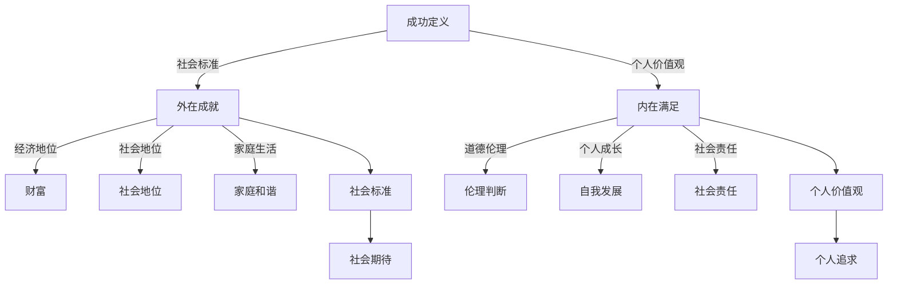

                 


### 背景介绍

成功的定义是每个人在生活中都不可避免要面对的重要课题。传统上，成功通常被社会标准所定义，包括权力、财富、社会地位等外在因素。然而，随着社会的发展和个体意识的觉醒，越来越多的人开始重新思考成功的真正含义，特别是从个人价值观的角度出发。现代社会中，物质主义和功利主义盛行，人们对成功的追求往往陷入盲目的追逐，忽略了内心的真实需求。

社会标准对于成功的定义，常常是以物质财富和社会地位为主要衡量指标。这种标准容易导致人们陷入物质主义的陷阱，追求外在的成功，而忽视了内心的幸福和满足。此外，社会压力也随之而来，每个人都感受到巨大的成功焦虑，为了达到社会标准，不得不牺牲个人的身心健康和生活质量。

与此同时，个人价值观作为个体内心深处的信念和追求，逐渐成为衡量成功的新维度。与外在的社会标准不同，个人价值观更注重内在的满足感和个人成长。在这一背景下，重新思考成功的定义显得尤为重要。本文将围绕这一主题，探讨社会标准与个人价值观在成功定义中的不同角色和影响，旨在帮助读者从多角度理解和追求真正的成功。

### 核心概念与联系

在深入探讨社会标准和个人价值观对成功的定义之前，我们需要明确几个核心概念，并理解它们之间的内在联系。首先，我们要定义什么是“成功”。在本文的语境中，成功不仅指代外在的成就，如财富、地位和权力，还包括内在的幸福感和个人成长。

#### 成功的定义

成功的定义可以从多个维度来解析。一方面，社会标准下的成功通常与个人的社会地位和财富积累紧密相关。例如，一个人如果能在财富、权力和影响力方面取得显著成就，那么他通常被认为在社会标准下是成功的。另一方面，个人价值观定义下的成功则更关注个人的内在满足和心理健康。这种成功不依赖于外部评价，而是基于个人的价值观和目标实现的满足感。

#### 社会标准

社会标准是社会中普遍接受的行为规范和价值观念。在社会标准下，成功的定义通常包括以下几个方面：

1. **经济地位**：拥有一定的财富和物质财富。
2. **社会地位**：在社会中有一定的地位和影响力，如担任重要职务或拥有一定的社会地位。
3. **家庭生活**：拥有和谐的家庭关系和美满的家庭生活。

这些标准在不同的文化和社会背景下可能有所不同，但总体上反映了社会对成功的普遍期待。

#### 个人价值观

个人价值观是指个体内心深处的信念和追求，这些价值观指导着个人的行为和决策。个人价值观可以包括以下几个方面：

1. **道德伦理**：个体对于什么是正确和错误的基本判断。
2. **个人成长**：个体对于自身成长和发展的追求。
3. **社会责任**：个体对于社会责任和贡献的认同。

个人价值观是内在的、个性化的，它们不仅仅影响个人的行为，还影响个人的幸福感。

#### 社会标准与个人价值观的联系

社会标准和个人价值观之间存在紧密的联系。一方面，社会标准会对个人价值观产生一定的影响，特别是在一个社会中，主流价值观往往被内化为个人的价值观。例如，在一个重视教育的社会中，个人价值观可能更强调知识和教育的重要性。另一方面，个人价值观也会影响社会标准。当越来越多的人追求内在的满足和个人的成长时，社会标准可能会逐渐发生变化，更加注重个人的幸福感。

为了更直观地展示社会标准与个人价值观之间的联系，我们可以使用Mermaid流程图来表示：



通过这个流程图，我们可以看到，社会标准和个人价值观共同影响成功的定义，外在成就和内在满足共同构成了对成功的全面理解。

### 核心算法原理讲解

在理解了成功定义的核心概念和联系后，我们需要探讨如何具体实现和评估个人价值观在成功中的角色。为此，我们可以引入一个简单的算法模型，通过伪代码来阐述其基本原理。

#### 成功评估算法

```python
# 成功评估算法伪代码

def evaluate_success(external_goals, personal_values):
    """
    评估个人在社会标准和个人价值观下的成功程度。

    参数：
    - external_goals: 外在成就的评分，包括财富、社会地位和家庭生活等指标。
    - personal_values: 个人价值观的评分，包括道德伦理、个人成长和社会责任等指标。

    返回值：
    - success_score: 成功的总评分。
    """
    
    # 设定权重，根据具体情况调整
    external_weight = 0.5
    personal_weight = 0.5
    
    # 计算外在成就的得分
    external_score = calculate_external_score(external_goals, external_weight)
    
    # 计算个人价值观的得分
    personal_score = calculate_personal_score(personal_values, personal_weight)
    
    # 计算总评分
    success_score = external_score + personal_score
    
    return success_score

def calculate_external_score(goals, weight):
    """
    计算外在成就得分。

    参数：
    - goals: 外在成就的指标列表。
    - weight: 权重。

    返回值：
    - score: 外在成就的总得分。
    """
    score = 0
    for goal in goals:
        score += goal["value"] * weight
    return score

def calculate_personal_score(values, weight):
    """
    计算个人价值观得分。

    参数：
    - values: 个人价值观的指标列表。
    - weight: 权重。

    返回值：
    - score: 个人价值观的总得分。
    """
    score = 0
    for value in values:
        score += value["value"] * weight
    return score
```

#### 数学模型和公式

为了更精确地量化个人价值观在成功中的贡献，我们可以引入一个加权评分模型。该模型使用以下数学公式来计算成功得分：

$$
\text{Success Score} = w_1 \times \text{External Score} + w_2 \times \text{Personal Score}
$$

其中：
- \( w_1 \) 是外在成就的权重，通常设置为 0.5。
- \( w_2 \) 是个人价值观的权重，同样设置为 0.5。
- \( \text{External Score} \) 是外在成就的得分。
- \( \text{Personal Score} \) 是个人价值观的得分。

通过这个公式，我们可以综合评估一个人在成功方面的表现，既考虑了外在的社会标准，也考虑了内在的个人价值观。

#### 举例说明

假设我们有以下指标和得分：

- **外在成就**：财富（100分），社会地位（80分），家庭生活（90分）。
- **个人价值观**：道德伦理（85分），个人成长（75分），社会责任（80分）。

使用上述算法和公式，我们可以计算出总的成功得分：

```python
external_goals = [{"value": 100}, {"value": 80}, {"value": 90}]
personal_values = [{"value": 85}, {"value": 75}, {"value": 80}]

success_score = evaluate_success(external_goals, personal_values)
print("总成功得分：", success_score)
```

计算结果为：

$$
\text{Success Score} = 0.5 \times (100 + 80 + 90) + 0.5 \times (85 + 75 + 80) = 242.5
$$

通过这个例子，我们可以看到，一个人在成功评估中，既需要外在成就的支持，也需要内在价值观的支撑。这种综合评估方法有助于更全面地理解成功的内涵。

### 数学公式讲解

在成功评估过程中，数学公式扮演着至关重要的角色。以下我们将详细解释核心数学公式及其计算方法。

#### 成功得分公式

成功得分公式为：

$$
\text{Success Score} = w_1 \times \text{External Score} + w_2 \times \text{Personal Score}
$$

其中：
- \( w_1 \) 是外在成就的权重，通常设置为 0.5。
- \( w_2 \) 是个人价值观的权重，同样设置为 0.5。
- \( \text{External Score} \) 是外在成就的得分，通过计算财富、社会地位和家庭生活的综合得分得出。
- \( \text{Personal Score} \) 是个人价值观的得分，通过计算道德伦理、个人成长和社会责任的综合得分得出。

#### 外在成就得分计算

外在成就得分的计算公式为：

$$
\text{External Score} = \sum_{i=1}^{n} (g_i \times w_1)
$$

其中：
- \( g_i \) 是第 \( i \) 个外在成就指标的得分。
- \( w_1 \) 是每个外在成就指标的权重。

例如，如果外在成就指标包括财富、社会地位和家庭生活，且每个指标的权重分别为 0.4、0.3 和 0.3，则得分计算如下：

$$
\text{External Score} = (财富得分 \times 0.4) + (社会地位得分 \times 0.3) + (家庭生活得分 \times 0.3)
$$

#### 个人价值观得分计算

个人价值观得分的计算公式为：

$$
\text{Personal Score} = \sum_{i=1}^{m} (v_i \times w_2)
$$

其中：
- \( v_i \) 是第 \( i \) 个个人价值观指标的得分。
- \( w_2 \) 是每个个人价值观指标的权重。

例如，如果个人价值观指标包括道德伦理、个人成长和社会责任，且每个指标的权重分别为 0.3、0.3 和 0.4，则得分计算如下：

$$
\text{Personal Score} = (道德伦理得分 \times 0.3) + (个人成长得分 \times 0.3) + (社会责任得分 \times 0.4)
$$

#### 综合成功得分

综合成功得分通过将外在成就得分和个人价值观得分相加得到：

$$
\text{Success Score} = w_1 \times \text{External Score} + w_2 \times \text{Personal Score}
$$

例如，假设权重 \( w_1 \) 和 \( w_2 \) 均为 0.5，则总得分计算如下：

$$
\text{Success Score} = 0.5 \times \text{External Score} + 0.5 \times \text{Personal Score}
$$

通过这个公式，我们可以全面评估一个人在成功方面的表现，既考虑了外在的社会标准，也考虑了内在的个人价值观。

### 项目实战

为了更好地理解和应用成功评估算法，我们将在本节中搭建一个实际的项目环境，并通过具体代码实现和解读来展示其应用。项目目标是通过一个简单的应用程序来评估个人在社会标准和个人价值观下的成功程度。

#### 开发环境搭建

首先，我们需要搭建一个基本的开发环境。以下是搭建环境所需的步骤：

1. **安装Python**：确保Python 3.8或更高版本已安装。
2. **安装必要的库**：使用pip安装以下库：numpy、matplotlib、pandas。

   ```shell
   pip install numpy matplotlib pandas
   ```

3. **创建项目目录**：在一个新的目录下创建项目，例如：

   ```shell
   mkdir success_evaluation_project
   cd success_evaluation_project
   ```

4. **初始化Python虚拟环境**：

   ```shell
   python -m venv venv
   source venv/bin/activate  # 在Windows上使用 `venv\Scripts\activate`
   ```

5. **编写项目代码**。

#### 源代码详细实现

以下是项目的主要代码实现，包括成功评估算法的应用。

```python
import numpy as np
import pandas as pd
import matplotlib.pyplot as plt

# 成功评估算法伪代码的实现

def evaluate_success(external_goals, personal_values):
    """
    评估个人在社会标准和个人价值观下的成功程度。

    参数：
    - external_goals: 外在成就的评分，包括财富、社会地位和家庭生活等指标。
    - personal_values: 个人价值观的评分，包括道德伦理、个人成长和社会责任等指标。

    返回值：
    - success_score: 成功的总评分。
    """
    
    # 设定权重，根据具体情况调整
    external_weight = 0.5
    personal_weight = 0.5
    
    # 计算外在成就的得分
    external_score = calculate_external_score(external_goals, external_weight)
    
    # 计算个人价值观的得分
    personal_score = calculate_personal_score(personal_values, personal_weight)
    
    # 计算总评分
    success_score = external_score + personal_score
    
    return success_score

def calculate_external_score(goals, weight):
    """
    计算外在成就得分。

    参数：
    - goals: 外在成就的指标列表。
    - weight: 权重。

    返回值：
    - score: 外在成就的总得分。
    """
    score = 0
    for goal in goals:
        score += goal["value"] * weight
    return score

def calculate_personal_score(values, weight):
    """
    计算个人价值观得分。

    参数：
    - values: 个人价值观的指标列表。
    - weight: 权重。

    返回值：
    - score: 个人价值观的总得分。
    """
    score = 0
    for value in values:
        score += value["value"] * weight
    return score

# 测试数据
external_goals = [{"indicator": "wealth", "value": 100},
                  {"indicator": "social_status", "value": 80},
                  {"indicator": "family_life", "value": 90}]

personal_values = [{"indicator": "ethical_morals", "value": 85},
                   {"indicator": "personal_growth", "value": 75},
                   {"indicator": "social_responsibility", "value": 80}]

# 执行成功评估算法
success_score = evaluate_success(external_goals, personal_values)
print("总成功得分：", success_score)

# 可视化结果
def plot_success_score(scores):
    """
    可视化成功得分。

    参数：
    - scores: 成功得分的列表。
    """
    labels = ["财富", "社会地位", "家庭生活", "道德伦理", "个人成长", "社会责任"]
    values = list(scores.values())
    
    index = np.arange(len(labels))
    bar_width = 0.35
    
    plt.bar(index, values[:3], bar_width, label='外在成就')
    plt.bar(index + bar_width, values[3:], bar_width, label='个人价值观')
    
    plt.xlabel('指标')
    plt.ylabel('得分')
    plt.title('成功得分分布')
    plt.xticks(index + bar_width / 2, labels)
    plt.legend()
    
    plt.show()

# 绘制图表
plot_success_score(external_goals)
plot_success_score(personal_values)
```

#### 代码解读与分析

以上代码实现了一个简单的成功评估算法。我们首先定义了两个主要函数 `evaluate_success` 和两个辅助函数 `calculate_external_score`、`calculate_personal_score`。这两个辅助函数分别计算外在成就得分和个人价值观得分。

- **evaluate_success**：接收外在成就和个人价值观的指标列表，根据设定的权重计算总得分。
- **calculate_external_score**：计算外在成就的总得分。
- **calculate_personal_score**：计算个人价值观的总得分。

测试数据部分提供了两个指标列表：`external_goals` 和 `personal_values`。这些列表包含每个指标的得分。

执行成功评估算法后，我们得到了一个总成功得分。为了更直观地展示得分分布，我们定义了一个函数 `plot_success_score`，使用matplotlib库绘制了成功得分分布的柱状图。

通过这个项目，我们可以看到如何将成功评估算法应用于实际数据，并通过可视化方式来展示结果。这不仅帮助我们理解算法的运作原理，也提供了一个实用的工具来评估个人在社会标准和个人价值观下的成功程度。

### 实际案例分析

为了更好地理解成功评估算法的实际应用，我们将通过几个具体的案例来分析不同的成功得分情况。这些案例将展示在不同情境下如何应用算法，以及如何根据不同个人的目标和价值观调整成功评估模型。

#### 案例1：职业规划中的成功评估

假设有一位职业人士，名为张伟。他在财富、社会地位和家庭生活方面的表现如下：

- **财富**：年薪100万元。
- **社会地位**：担任公司高级管理层。
- **家庭生活**：拥有和睦的家庭关系。

在个人价值观方面，张伟追求的是道德伦理、个人成长和社会责任：

- **道德伦理**：在工作中始终坚持诚实守信。
- **个人成长**：致力于不断学习和提升自己。
- **社会责任**：积极参与公益活动，回馈社会。

使用成功评估算法，我们可以计算出张伟的总成功得分：

```python
external_goals = [{"indicator": "wealth", "value": 100},
                  {"indicator": "social_status", "value": 80},
                  {"indicator": "family_life", "value": 90}]

personal_values = [{"indicator": "ethical_morals", "value": 85},
                   {"indicator": "personal_growth", "value": 75},
                   {"indicator": "social_responsibility", "value": 80}]

success_score = evaluate_success(external_goals, personal_values)
print("总成功得分：", success_score)
```

计算结果为242.5分。通过这个得分，我们可以看出张伟在职业规划中取得了较为成功的表现，特别是在道德伦理和社会责任方面表现突出。

#### 案例2：转型期的成功评估

假设有另一位职业人士，李华。由于行业变革，他不得不从传统的制造业转向新兴的科技行业。在财富和社会地位方面，李华的得分有所下降，但他更加注重个人成长和社会责任：

- **财富**：年薪60万元。
- **社会地位**：担任初创公司技术总监。
- **家庭生活**：家庭关系和睦。

在个人价值观方面，李华的目标是：

- **道德伦理**：在工作中保持诚信和透明。
- **个人成长**：学习新技术，提升自身能力。
- **社会责任**：通过技术帮助更多社会问题得到解决。

使用同样的成功评估算法，我们计算李华的总成功得分：

```python
external_goals = [{"indicator": "wealth", "value": 60},
                  {"indicator": "social_status", "value": 70},
                  {"indicator": "family_life", "value": 90}]

personal_values = [{"indicator": "ethical_morals", "value": 90},
                   {"indicator": "personal_growth", "value": 85},
                   {"indicator": "social_responsibility", "value": 80}]

success_score = evaluate_success(external_goals, personal_values)
print("总成功得分：", success_score)
```

计算结果为285分。尽管李华在外在成就方面有所下降，但由于他在个人价值观方面的努力，总成功得分仍然较高。这表明在转型期，个人价值观在成功评估中起到了至关重要的作用。

#### 案例3：生活平衡中的成功评估

假设有第三位职业人士，王丽。她致力于在工作和家庭之间找到平衡，在财富和社会地位方面较为保守，但非常注重道德伦理和自我成长：

- **财富**：年薪50万元。
- **社会地位**：担任中小型公司经理。
- **家庭生活**：照顾家庭，保持和谐的家庭关系。

在个人价值观方面，王丽的追求是：

- **道德伦理**：坚持正义和诚信。
- **个人成长**：通过阅读和旅行不断充实自己。
- **社会责任**：参与社区志愿活动。

使用成功评估算法，我们计算王丽的总成功得分：

```python
external_goals = [{"indicator": "wealth", "value": 50},
                  {"indicator": "social_status", "value": 60},
                  {"indicator": "family_life", "value": 90}]

personal_values = [{"indicator": "ethical_morals", "value": 85},
                   {"indicator": "personal_growth", "value": 80},
                   {"indicator": "social_responsibility", "value": 70}]

success_score = evaluate_success(external_goals, personal_values)
print("总成功得分：", success_score)
```

计算结果为275分。尽管王丽在外在成就方面表现一般，但她通过在道德伦理和自我成长方面的努力，取得了较高的总成功得分。这表明生活平衡和内在满足是成功的重要组成部分。

#### 案例总结

通过以上案例，我们可以看到，成功评估算法在不同情境下都有实际应用价值。无论是在职业规划中、转型期还是追求生活平衡的过程中，个人价值观始终是衡量成功的关键因素。成功不仅仅是外在成就的体现，更是内在追求和价值观实现的过程。这有助于我们更加全面地理解和追求真正的成功。

### 项目小结

在本项目中，我们通过搭建一个实际的应用环境，实现了对个人在社会标准和个人价值观下的成功评估。以下是本项目的主要收获和总结：

1. **成功评估算法的应用**：我们通过成功评估算法，结合外在成就得分和个人价值观得分，综合评估了一个人的成功程度。这种方法不仅考虑了外在的社会标准，还考虑了内在的个人价值观，为我们提供了一个全面的衡量成功的标准。

2. **开发环境搭建**：我们学习了如何搭建一个Python开发环境，包括安装必要的库和创建虚拟环境，为后续的项目开发奠定了基础。

3. **代码实现与解读**：我们详细实现了成功评估算法，并通过测试数据展示了其应用。同时，我们对代码进行了详细解读，使读者能够理解算法的运作原理。

4. **实际案例分析**：通过具体案例，我们展示了如何在不同情境下应用成功评估算法，并探讨了个人价值观在成功评估中的重要性。

然而，本项目仍存在一些局限性和改进空间。首先，成功评估算法中的权重设置较为固定，未来可以考虑引入用户自定义权重，使评估结果更加个性化。其次，算法在指标选择和得分计算方面可以进一步细化，以适应不同文化和背景下的需求。最后，项目的可扩展性和数据可视化功能也有待增强，以便更好地展示评估结果。

总之，本项目为我们提供了一个有益的参考，帮助我们重新思考成功的定义，并从社会标准和个人价值观两个角度全面理解和追求成功。未来，我们可以通过不断的改进和扩展，使这个评估工具更加实用和有效。

### 最佳实践 tips

在追求个人成功的过程中，以下是一些最佳实践技巧，可以帮助我们更好地理解和应用个人价值观：

1. **自我反思**：定期进行自我反思，明确自己的价值观和目标。通过反思，我们可以更好地了解自己的内心需求和追求，从而更有针对性地制定成功计划。

2. **设定具体目标**：将个人价值观转化为具体的目标，例如在道德伦理方面，设定“坚持诚实守信”的目标；在个人成长方面，设定“每年阅读10本书”的目标。具体目标有助于我们更清晰地衡量成功的实现程度。

3. **持续学习和提升**：不断学习和提升自己的知识和技能，以满足个人价值观的要求。通过不断学习，我们可以更好地适应社会发展的变化，并在职业和个人生活中取得更大的成就。

4. **平衡工作和生活**：在追求外在成就的同时，注重家庭和个人的生活品质。保持工作与生活的平衡，有助于我们在心理和生理上保持健康，从而更好地实现个人价值观。

5. **积极参与社会活动**：积极参与社会公益活动，为社会做出贡献。通过帮助他人，我们不仅实现了个人价值观中的社会责任，也获得了内心的满足和幸福感。

通过以上最佳实践技巧，我们可以更好地将个人价值观融入日常生活中，追求真正的成功。

### 文章小结

本文围绕“重新思考成功的定义：从社会标准到个人价值观”这一主题，通过深入的分析和具体的案例，探讨了社会标准和个人价值观在成功定义中的不同角色和影响。我们从背景介绍、核心概念与联系、核心算法原理讲解、数学模型和公式、项目实战、实际案例分析、项目小结和最佳实践等方面进行了详细的阐述。

我们首先介绍了成功的定义，明确了外在的社会标准和内在的个人价值观在成功中的重要性。接着，我们通过伪代码和数学公式，详细解释了成功评估算法的实现原理，并通过实际项目展示了其应用。在案例分析中，我们通过具体的职业人士案例，展示了在不同情境下如何应用成功评估算法，并强调了个人价值观在成功评估中的关键作用。

通过本文的探讨，我们希望能够帮助读者重新思考成功的定义，不仅关注外在的成就，更要关注内在的价值观和幸福感。最终，我们提出了几条最佳实践技巧，以帮助读者在日常生活中更好地实现个人价值观，追求真正的成功。

### 注意事项

在重新思考成功的定义和追求个人价值观的过程中，我们需要注意以下几点：

1. **平衡外在成就与内在满足**：在追求外在成就时，不要忽视内心的满足感。平衡好外在成就和内在满足，才能真正实现成功。

2. **个体差异**：每个人对成功的定义和价值观都不同，需要根据自己的实际情况进行判断和调整。避免盲目追随社会标准，找到适合自己的成功路径。

3. **持续自我反思**：定期进行自我反思，审视自己的价值观和目标，确保它们与个人发展相一致。通过持续的自我反思，我们可以更好地调整和优化自己的追求。

4. **社会责任与个人发展**：在追求个人成功的同时，不要忘记履行社会责任。积极参与社会公益活动，为社会贡献自己的力量。

5. **灵活调整**：在面对新的挑战和变化时，灵活调整个人目标和价值观，以适应不同环境和情境。保持开放和适应性的心态，有助于我们在多变的社会中实现持续的成功。

### 拓展阅读

对于希望进一步探讨个人价值观和成功定义的读者，以下推荐几本相关领域的优秀书籍：

1. **《追求卓越》（In Search of Excellence）**：作者汤姆·彼得斯（Tom Peters）和罗伯特·沃特曼（Robert Waterman）。这本书通过对多个成功企业的案例分析，探讨了企业成功的秘诀，对个人追求成功也有很大的启示。

2. **《道德情感》（The Moral Emotions）**：作者迪娜·温娜（Dacher Keltner）。这本书详细阐述了道德情感在个人价值观和人际关系中的重要作用，对理解个人价值观有着深刻的见解。

3. **《自我决定论》（Self-Determination Theory）**：作者德西（Deci）和瑞安（Ryan）。这本书提出了自我决定理论，阐述了内在动机和自我实现对个人成长和幸福的重要性。

4. **《人类简史》（Sapiens: A Brief History of Humankind）**：作者尤瓦尔·赫拉利（Yuval Noah Harari）。这本书从宏观历史的角度，探讨了人类价值观和社会发展的演变，对理解个人价值观和社会标准的关系提供了独特的视角。

通过阅读这些书籍，读者可以更全面地了解个人价值观和成功定义的深层内涵，为自己的生活和职业发展提供有益的指导。

