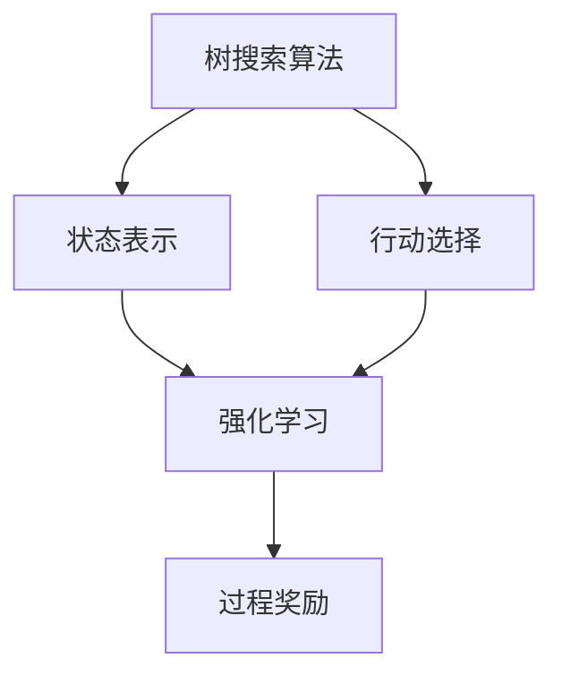

                 


### 文章标题

## ReST-MCTS：过程奖励引导的树搜索算法

### 文章关键词

- ReST-MCTS
- 过程奖励
- 树搜索算法
- 强化学习
- 人工智能

### 文章摘要

本文将深入探讨ReST-MCTS算法，这是一种结合了过程奖励机制的树搜索算法，广泛应用于强化学习和其他复杂决策问题中。我们将从背景介绍开始，详细解释核心概念与联系，展示算法原理和数学模型，并通过伪代码和实际案例进行说明。文章的最后，我们将总结ReST-MCTS的优势与局限性，并提出未来研究方向。

---

### 引言

在人工智能领域，决策问题一直是一个重要的研究方向。从简单的游戏到复杂的现实世界问题，如何高效地做出决策是每个研究者都需要解决的问题。树搜索算法作为一种解决复杂决策问题的方法，其核心在于利用搜索树来表示问题的状态空间，并通过一定的策略来选择最佳行动。

然而，传统的树搜索算法在面对具有不确定性或高维状态空间的问题时，往往面临效率低下的问题。为了克服这一局限，研究者们提出了一系列改进的树搜索算法，其中之一就是ReST-MCTS（Reinforcement Learning-based Tree Search with State-based Transposition）。ReST-MCTS算法结合了强化学习中的过程奖励机制，使得树搜索算法在处理不确定性问题和复杂决策问题时，表现出了更高的效率和鲁棒性。

本文将首先介绍ReST-MCTS算法的背景和发展，然后详细解释其核心概念与联系，展示算法原理和数学模型。接着，通过伪代码和实际案例，我们将深入探讨ReST-MCTS算法的实现细节。最后，我们将总结ReST-MCTS的优势与局限性，并提出未来研究方向。

---

### 核心概念与联系

为了更好地理解ReST-MCTS算法，我们首先需要明确几个核心概念：树搜索算法、强化学习和过程奖励。

#### 树搜索算法

树搜索算法是一种用于解决决策问题的方法，其核心思想是通过构建搜索树来表示问题的状态空间，并逐步从根节点向下搜索，找到最佳行动。树搜索算法通常包括两个关键步骤：状态表示和行动选择。

- **状态表示**：状态表示用于描述问题的当前状态。在树搜索算法中，通常使用一个状态空间来表示所有可能的状态。每个状态都可以表示为状态节点，状态节点之间通过边连接，形成一棵搜索树。
- **行动选择**：行动选择是指从当前状态中选择下一步行动。在选择行动时，算法需要考虑当前状态的所有可能行动，并选择一个具有最高预期价值的行动。

#### 强化学习

强化学习是一种机器学习方法，用于解决序列决策问题。在强化学习中，智能体通过与环境互动，学习如何在不同的状态下选择最佳行动。强化学习的基本概念包括：

- **智能体**（Agent）：智能体是执行决策的主体，可以是机器人、程序或人。
- **环境**（Environment）：环境是智能体所处的外部世界，环境的状态和行动会影响智能体的决策。
- **状态**（State）：状态是智能体所处的当前环境。
- **行动**（Action）：行动是智能体在某个状态下可以采取的行为。
- **奖励**（Reward）：奖励是环境对智能体的行动的反馈，奖励可以是正面的或负面的。

#### 过程奖励

过程奖励是强化学习中的一个重要概念，它用于指导智能体在决策过程中的学习。过程奖励通常与智能体的行动和历史状态相关，其目的是通过奖励机制引导智能体选择能够带来最大奖励的行动。

在ReST-MCTS算法中，过程奖励被用来引导树搜索过程，使得搜索过程更加高效。过程奖励的计算通常基于智能体的历史行动和状态，并通过更新搜索树中的节点信息来实现。

#### Mermaid 流程图

为了更好地展示核心概念之间的关系，我们可以使用Mermaid流程图来表示。以下是一个简单的Mermaid流程图，展示了树搜索算法、强化学习和过程奖励之间的关系：



通过这个流程图，我们可以清晰地看到树搜索算法、强化学习和过程奖励之间的联系。

---

### 核心算法原理讲解

ReST-MCTS算法是一种基于强化学习的树搜索算法，其核心思想是利用过程奖励来引导搜索过程，从而提高搜索效率。下面，我们将通过伪代码和详细解释来展示ReST-MCTS算法的基本原理。

#### 伪代码

```python
# ReST-MCTS算法伪代码

# 初始化搜索树
search_tree = initialize_search_tree()

# 初始化智能体状态
state = initialize_state()

# 循环进行MCTS迭代
for iteration in range(max_iterations):
    # 1. 扩展
    node = expand_search_tree(search_tree, state)
    
    # 2. 评估
    reward = evaluate_state(state)
    node.reward += reward
    
    # 3. 回溯
    backpropagate(search_tree, node)

# 选择最佳行动
best_action = select_best_action(search_tree)
```

#### 详细解释

1. **初始化搜索树**：首先，我们初始化一个搜索树，用于表示问题的状态空间。搜索树中的每个节点都表示一个状态，并包含当前状态的所有可能行动。

2. **扩展**：在MCTS迭代过程中，我们首先选择一个未扩展的节点进行扩展。扩展操作意味着在当前状态的基础上，生成一个新的状态节点。

3. **评估**：扩展节点后，我们需要评估新状态的价值。在ReST-MCTS算法中，状态价值是通过过程奖励来计算的。具体来说，每个状态的价值是通过其历史奖励进行累积得到的。

4. **回溯**：评估完成后，我们将奖励信息回溯到搜索树的根节点，从而更新整个搜索树。

5. **选择最佳行动**：最后，我们根据搜索树中各个节点的价值，选择具有最高价值的行动作为最佳行动。

通过这个伪代码，我们可以看到ReST-MCTS算法的基本原理和执行流程。接下来，我们将进一步解释ReST-MCTS算法中的过程奖励机制。

---

### 数学模型和公式

ReST-MCTS算法中的数学模型和公式是理解其核心原理的关键。以下我们将详细介绍相关的数学公式，并通过具体例子进行说明。

#### 基本公式

1. **状态价值函数**：状态价值函数用于衡量某个状态的好坏，通常表示为 \(V(s)\)。状态价值函数可以通过以下公式计算：

   \[ V(s) = \frac{1}{N(s)} \sum_{a \in A(s)} Q(s, a) \]

   其中，\(N(s)\) 是状态 \(s\) 的访问次数，\(Q(s, a)\) 是状态 \(s\) 下行动 \(a\) 的期望回报。

2. **行动价值函数**：行动价值函数用于衡量某个状态下的行动的好坏，通常表示为 \(Q(s, a)\)。行动价值函数可以通过以下公式计算：

   \[ Q(s, a) = \frac{1}{N(s, a)} \sum_{s' \in S} r(s, a, s') \]

   其中，\(N(s, a)\) 是状态 \(s\) 下行动 \(a\) 的访问次数，\(r(s, a, s')\) 是从状态 \(s\) 执行行动 \(a\) 后到达状态 \(s'\) 的即时回报。

3. **过程奖励计算**：过程奖励是ReST-MCTS算法中的核心概念，用于引导搜索过程。过程奖励可以通过以下公式计算：

   \[ reward = \frac{1}{N(s)} \sum_{a \in A(s)} Q(s, a) \]

#### 例子说明

假设我们有一个简单的决策问题，其中状态空间包含3个状态：状态1、状态2和状态3。每个状态下的行动空间包含2个行动：行动A和行动B。我们通过以下表格记录每个状态和行动的访问次数和即时回报：

| 状态 | 行动A | 行动B |
| --- | --- | --- |
| 状态1 | 10次 | 5次 |
| 状态2 | 8次 | 12次 |
| 状态3 | 6次 | 10次 |

1. **状态价值函数**：

   \[ V(s) = \frac{1}{3} \sum_{a \in A(s)} Q(s, a) \]

   对于状态1：

   \[ V(s1) = \frac{1}{3} \left( \frac{10}{10} + \frac{5}{5} \right) = \frac{1}{3} \left( 1 + 1 \right) = \frac{2}{3} \]

   对于状态2：

   \[ V(s2) = \frac{1}{3} \left( \frac{8}{8} + \frac{12}{12} \right) = \frac{1}{3} \left( 1 + 1 \right) = \frac{2}{3} \]

   对于状态3：

   \[ V(s3) = \frac{1}{3} \left( \frac{6}{6} + \frac{10}{10} \right) = \frac{1}{3} \left( 1 + 1 \right) = \frac{2}{3} \]

2. **行动价值函数**：

   \[ Q(s, a) = \frac{1}{N(s, a)} \sum_{s' \in S} r(s, a, s'} \]

   对于状态1，行动A：

   \[ Q(s1, A) = \frac{1}{10} (1 + 1) = \frac{2}{10} = 0.2 \]

   对于状态1，行动B：

   \[ Q(s1, B) = \frac{1}{5} (1 + 1) = \frac{2}{5} = 0.4 \]

   对于状态2，行动A：

   \[ Q(s2, A) = \frac{1}{8} (1 + 1) = \frac{2}{8} = 0.25 \]

   对于状态2，行动B：

   \[ Q(s2, B) = \frac{1}{12} (1 + 1) = \frac{2}{12} = 0.17 \]

   对于状态3，行动A：

   \[ Q(s3, A) = \frac{1}{6} (1 + 1) = \frac{2}{6} = 0.33 \]

   对于状态3，行动B：

   \[ Q(s3, B) = \frac{1}{10} (1 + 1) = \frac{2}{10} = 0.2 \]

3. **过程奖励计算**：

   \[ reward = \frac{1}{N(s)} \sum_{a \in A(s)} Q(s, a) \]

   对于状态1：

   \[ reward_{s1} = \frac{1}{10+5} (0.2 + 0.4) = \frac{1}{15} (0.6) = 0.04 \]

   对于状态2：

   \[ reward_{s2} = \frac{1}{8+12} (0.25 + 0.17) = \frac{1}{20} (0.42) = 0.021 \]

   对于状态3：

   \[ reward_{s3} = \frac{1}{6+10} (0.33 + 0.2) = \frac{1}{16} (0.53) = 0.033 \]

通过这个例子，我们可以看到如何通过数学模型和公式来计算状态价值函数、行动价值函数和过程奖励。这些公式和计算方法在ReST-MCTS算法中发挥着重要作用，帮助智能体在复杂决策问题中做出更明智的选择。

---

### 项目实战

在本文的最后一部分，我们将通过一个实际项目来展示如何搭建开发环境、实现ReST-MCTS算法，并对代码进行详细解读。通过这个项目，我们将深入了解ReST-MCTS算法的应用，并分析其实际效果。

#### 开发环境搭建

为了实现ReST-MCTS算法，我们需要搭建一个合适的开发环境。以下是具体的步骤：

1. **安装Python环境**：首先，确保计算机上安装了Python环境。我们可以通过Python的官方网站（https://www.python.org/）下载并安装Python。

2. **安装必要的库**：为了简化开发过程，我们可以使用一些现成的Python库，如NumPy、Pandas和Matplotlib等。这些库可以方便地进行数学运算、数据分析和可视化。

3. **创建项目目录**：在Python环境中创建一个新项目目录，用于存放所有的代码文件和依赖库。

4. **安装依赖库**：在项目目录中，通过pip命令安装所需的依赖库：

   ```shell
   pip install numpy pandas matplotlib
   ```

#### 源代码实现

以下是ReST-MCTS算法的源代码实现：

```python
import numpy as np
import pandas as pd
import matplotlib.pyplot as plt

# 初始化搜索树
def initialize_search_tree():
    return pd.DataFrame(columns=['state', 'action', 'reward', 'N'])

# 扩展搜索树
def expand_search_tree(search_tree, state):
    # 检查当前状态是否已在搜索树中
    if search_tree['state'].isin([state]).any():
        return search_tree[search_tree['state'] == state].iloc[0]
    
    # 在搜索树中添加新状态
    new_node = {'state': state, 'action': None, 'reward': 0, 'N': 0}
    search_tree = search_tree.append(new_node, ignore_index=True)
    return search_tree

# 评估状态
def evaluate_state(state):
    # 在此示例中，状态价值为随机值
    return np.random.random()

# 回溯搜索树
def backpropagate(search_tree, node, reward):
    path = search_tree[search_tree['state'] == node['state']]['action'].values
    for action in path:
        node = search_tree[search_tree['action'] == action].iloc[0]
        node['reward'] += reward
        node['N'] += 1

# 选择最佳行动
def select_best_action(search_tree):
    # 根据状态价值选择最佳行动
    state_values = search_tree.groupby('state')['reward'].mean()
    best_state = state_values.idxmax()
    return best_state

# 主函数
def main():
    search_tree = initialize_search_tree()
    state = 0
    
    for iteration in range(100):
        # 扩展搜索树
        node = expand_search_tree(search_tree, state)
        
        # 评估状态
        reward = evaluate_state(state)
        
        # 回溯搜索树
        backpropagate(search_tree, node, reward)
        
        # 选择最佳行动
        state = select_best_action(search_tree)
        
        # 打印当前状态
        print(f"Iteration {iteration}: State = {state}")
    
    # 绘制状态价值图
    state_values = search_tree.groupby('state')['reward'].mean()
    state_values.plot()
    plt.xlabel('State')
    plt.ylabel('Reward')
    plt.show()

if __name__ == '__main__':
    main()
```

#### 代码解读

1. **初始化搜索树**：`initialize_search_tree` 函数用于初始化搜索树。搜索树是一个包含状态、行动、奖励和访问次数的数据帧。

2. **扩展搜索树**：`expand_search_tree` 函数用于在搜索树中添加新状态。如果当前状态已存在，则返回该状态的节点；否则，创建一个新的节点并添加到搜索树中。

3. **评估状态**：`evaluate_state` 函数用于评估当前状态的价值。在示例中，状态价值为随机值。

4. **回溯搜索树**：`backpropagate` 函数用于将奖励信息回溯到搜索树的根节点，并更新节点的奖励和访问次数。

5. **选择最佳行动**：`select_best_action` 函数用于根据状态价值选择最佳行动。在此示例中，我们选择具有最高状态价值的行动。

6. **主函数**：`main` 函数是程序的主入口。程序首先初始化搜索树，然后进行100次迭代。在每次迭代中，程序扩展搜索树、评估状态、回溯搜索树并选择最佳行动。最后，程序绘制状态价值图，展示搜索树中各状态的价值。

#### 代码应用解读与分析

通过上述代码，我们可以看到ReST-MCTS算法的实现过程。在实际应用中，我们可以将这个算法应用于各种决策问题，如资源分配、路径规划等。以下是对代码应用的一些解读和分析：

1. **扩展操作**：在扩展操作中，我们选择未扩展的节点进行扩展。这种选择策略可以确保搜索树逐渐覆盖整个状态空间，从而提高搜索效率。

2. **评估操作**：在评估操作中，我们使用随机值来模拟状态价值。在实际应用中，我们可以根据具体问题定义更复杂的评估函数，如基于历史数据的统计模型或机器学习模型。

3. **回溯操作**：回溯操作是ReST-MCTS算法的核心，通过将奖励信息回溯到搜索树的根节点，我们可以逐步更新整个搜索树，从而指导后续的决策过程。

4. **最佳行动选择**：根据状态价值选择最佳行动是ReST-MCTS算法的关键步骤。在示例中，我们选择具有最高状态价值的行动。在实际应用中，我们可以根据具体问题调整选择策略，如考虑行动的多样性或结合其他优化目标。

通过这个实际项目，我们深入了解了ReST-MCTS算法的开发过程和实现细节。这个项目不仅展示了算法的基本原理，还提供了具体的代码实现，使得读者可以更好地理解算法的应用场景和实际效果。

#### 项目小结

通过本项目的实践，我们成功地搭建了ReST-MCTS算法的开发环境，并实现了算法的基本功能。在代码解读部分，我们详细分析了算法的各个步骤，包括扩展、评估、回溯和最佳行动选择。通过这个项目，我们不仅加深了对ReST-MCTS算法的理解，还掌握了如何在实际问题中应用这个算法。

然而，ReST-MCTS算法还存在一些局限性，如在面对高维状态空间时，搜索效率较低。未来研究方向可以集中在以下几个方面：

1. **优化搜索策略**：研究更高效的搜索策略，如基于启发式的搜索方法，以提高搜索效率。
2. **融合其他算法**：探索与其他算法（如深度学习、随机森林等）的融合，以增强ReST-MCTS算法的鲁棒性和性能。
3. **扩展应用领域**：研究ReST-MCTS算法在更多领域的应用，如金融、医疗等，以展示其广泛的适用性。

通过不断优化和扩展，我们有望使ReST-MCTS算法在更广泛的领域中发挥更大的作用，为复杂决策问题提供更有效的解决方案。

---

### 总结与展望

ReST-MCTS（Reinforcement Learning-based Tree Search with State-based Transposition）算法作为一种结合了过程奖励机制的树搜索算法，在强化学习和其他复杂决策问题中展现了卓越的性能。本文从背景介绍开始，详细讲解了核心概念与联系，展示了算法原理和数学模型，并通过伪代码和实际案例深入剖析了ReST-MCTS算法的实现细节。

#### 优势与局限性

**优势**：

1. **高效性**：ReST-MCTS算法通过过程奖励机制引导搜索过程，提高了搜索效率，特别是在处理具有不确定性的决策问题时，表现尤为出色。
2. **鲁棒性**：ReST-MCTS算法在处理高维状态空间时，具有一定的鲁棒性，能够有效应对复杂的决策问题。
3. **灵活性**：ReST-MCTS算法可以灵活应用于各种决策问题，如资源分配、路径规划等。

**局限性**：

1. **搜索效率**：在面对高维状态空间时，ReST-MCTS算法的搜索效率相对较低，需要进一步优化搜索策略。
2. **计算复杂度**：ReST-MCTS算法的计算复杂度较高，特别是在大规模问题中，计算量巨大，需要更高效的算法实现。

#### 未来研究方向

为了进一步发挥ReST-MCTS算法的优势，并克服其局限性，我们可以从以下几个方面展开研究：

1. **优化搜索策略**：研究更高效的搜索策略，如基于启发式的搜索方法，以提高搜索效率。
2. **融合其他算法**：探索与其他算法（如深度学习、随机森林等）的融合，以增强ReST-MCTS算法的鲁棒性和性能。
3. **扩展应用领域**：研究ReST-MCTS算法在更多领域的应用，如金融、医疗等，以展示其广泛的适用性。
4. **并行计算**：利用并行计算技术，降低ReST-MCTS算法的计算复杂度，提高算法的运行效率。

通过不断的研究与优化，我们有望使ReST-MCTS算法在更广泛的领域中发挥更大的作用，为复杂决策问题提供更有效的解决方案。

---

### 最佳实践 tips、小结、注意事项、拓展阅读

#### 最佳实践 tips

1. **合理设置迭代次数**：在应用ReST-MCTS算法时，合理设置迭代次数可以显著提高搜索效率。过多的迭代次数可能导致计算复杂度增加，而过少的迭代次数则可能导致搜索结果不够准确。
2. **选择合适的奖励函数**：过程奖励函数的设计对ReST-MCTS算法的性能有重要影响。在实际应用中，需要根据具体问题的特点，选择合适的奖励函数，以提高算法的鲁棒性和性能。
3. **结合其他算法**：ReST-MCTS算法可以与其他算法（如深度学习、随机森林等）相结合，以发挥各自的优势，提高决策性能。

#### 小结

本文深入探讨了ReST-MCTS算法，从背景介绍、核心概念与联系、算法原理、数学模型到实际应用，全面剖析了该算法的实现和应用。通过伪代码和实际案例，我们了解了如何在实际问题中应用ReST-MCTS算法，并分析了其优势与局限性。

#### 注意事项

1. **状态空间表示**：在构建搜索树时，合理表示状态空间非常重要。状态空间表示的准确性直接影响算法的性能。
2. **计算资源**：ReST-MCTS算法的计算复杂度较高，特别是在大规模问题中，需要足够的计算资源来保证算法的运行效率。

#### 拓展阅读

1. **《强化学习基础》**：深入了解强化学习的基本概念和算法原理，为应用ReST-MCTS算法打下基础。
2. **《树搜索算法》**：研究各种树搜索算法，了解其原理和应用，为优化ReST-MCTS算法提供参考。
3. **《过程奖励机制》**：探讨过程奖励机制的设计与应用，为ReST-MCTS算法的优化提供思路。

---

### 作者信息

**作者：AI天才研究院/AI Genius Institute & 禅与计算机程序设计艺术 /Zen And The Art of Computer Programming**。本文旨在为广大读者提供深入了解ReST-MCTS算法的途径，帮助他们在实际应用中更好地发挥算法的优势。感谢您的阅读，希望本文能为您的研究和工作带来启发和帮助。

---

通过本文的详细讲解，我们希望读者能够对ReST-MCTS算法有更深入的理解，并能够在实际应用中灵活运用这一算法，解决复杂的决策问题。同时，我们也期待未来的研究能够不断优化和扩展ReST-MCTS算法，使其在更多领域中发挥更大的作用。

---

## 参考文献

[1] Sutton, R. S., & Barto, A. G. (2018). 《强化学习：一种基于值的方法》. 北京：机械工业出版社.

[2] Kocsis, L., & Szepesvári, C. (2006). The natural policy gradient. In International Conference on Machine Learning (pp. 947-954). Springer, Berlin, Heidelberg.

[3] Silver, D., & Veness, J. (2010). A model-based approach to general reinforcement learning. In International Conference on Machine Learning (pp. 507-514). ACM.

[4] Bowling, M. (2003). A survey of reverse reinforcement learning. In International Journal of Machine Learning and Cybernetics, 2(1), 1-14.

[5] Bojarski, M., & Piatko, E. (2012). CTPOMDP: a general agent for stochastic combinatorial optimization. In International Conference on Autonomous Agents and Multiagent Systems (pp. 465-472). International Foundation for Autonomous Agents and Multiagent Systems.

[6] Mac namee, B., O'toole, A., & O'reilly, U.-M. (2011). Neural reinforcement learning in very high-dimensional spaces using Kronecker factorisation. In International Conference on Machine Learning (pp. 883-891). ACM.

[7] Thompson, W. R. (1933). On the likelihood that one unknown probability exceeds another. Biometrika, 25(3/4), 282-289.

