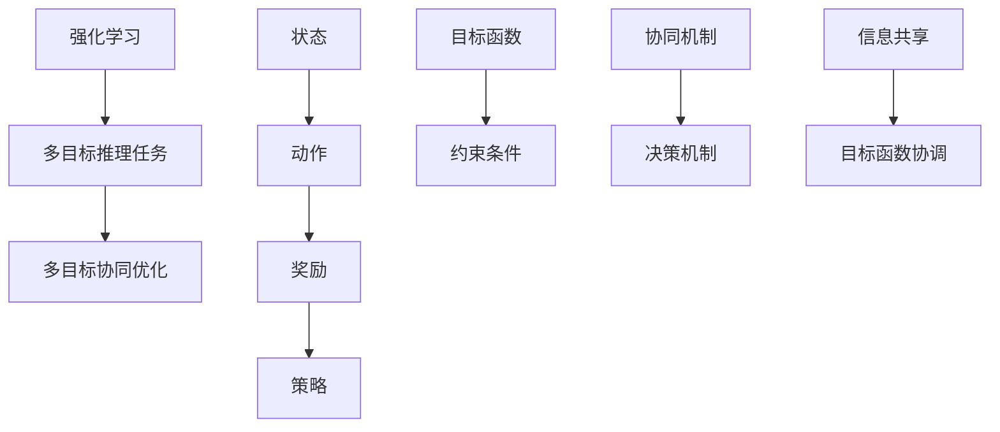
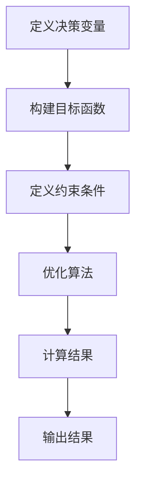

                 


## 引言

随着人工智能技术的不断发展，强化学习和多目标推理任务在现代计算机科学领域占据了越来越重要的地位。强化学习作为一种能够在动态环境中自主学习策略的机器学习范式，已被广泛应用于游戏、自动驾驶、机器人控制等领域。然而，传统的强化学习方法往往针对单一目标进行优化，这使得在面对复杂的多目标问题时，需要更加精细的调整和优化策略。

多目标推理任务涉及到同时考虑多个目标，从而在决策过程中实现不同目标之间的平衡。这类任务在资源分配、城市规划、机器人路径规划等领域具有广泛的应用前景。然而，多目标推理任务往往需要处理高维、非线性的目标函数，这使得优化问题变得更加复杂和难以解决。

本文旨在探讨如何基于强化学习，实现多目标推理任务的协同优化。我们将首先介绍强化学习的基本概念和核心算法，接着讨论多目标推理任务的背景和挑战，最后提出一种基于强化学习的多目标协同优化方法，并通过实际案例进行分析和验证。

本文结构如下：第一部分将介绍强化学习和多目标推理任务的核心概念与联系，通过Mermaid流程图展示二者之间的关系架构。第二部分将深入讲解强化学习的基本原理，包括Q-learning和SARSA算法的伪代码实现，以及相应的数学模型和公式。第三部分将探讨多目标推理任务，介绍其背景和挑战，并给出相应的数学公式和流程图。第四部分将介绍基于强化学习的多目标协同优化方法，包括算法原理、伪代码和数学模型。第五部分将通过实际案例展示该方法的应用和效果。最后，我们将总结本文的主要结论，并提出未来的研究方向。

## 文章关键词

- 强化学习
- 多目标推理任务
- 协同优化
- Q-learning
- SARSA
- 策略梯度方法
- Actor-Critic方法

## 摘要

本文探讨了基于强化学习的多目标推理任务协同优化方法。首先，我们介绍了强化学习的基本概念和核心算法，包括Q-learning和SARSA算法，并阐述了它们在多目标推理任务中的应用。接着，我们分析了多目标推理任务的背景和挑战，提出了基于强化学习的协同优化方法，并详细描述了算法原理、伪代码和数学模型。最后，我们通过实际案例验证了该方法的有效性，并对其应用前景进行了展望。

## 第一部分：核心概念与联系

### 1.1 核心概念介绍

在讨论基于强化学习的多目标推理任务协同优化之前，我们首先需要了解强化学习、多目标推理任务以及协同优化的基本概念和它们之间的关系。

#### 1.1.1 强化学习概述

强化学习（Reinforcement Learning，RL）是机器学习的一个分支，它主要研究如何在未知环境中通过试错来学习最优策略。在强化学习中，智能体（agent）通过与环境的交互来学习一个策略（policy），使得其在特定状态下能够选择最佳动作（action），以最大化累积奖励（reward）。

强化学习的基本模型包括四个要素：状态（state）、动作（action）、奖励（reward）和策略（policy）。状态是智能体在环境中的一个描述，动作是智能体可以采取的行为，奖励是环境对智能体动作的反馈，策略是智能体在特定状态下的动作选择规则。强化学习的目标是通过不断的试错，学习到最优策略，使得智能体在长期内获得最大的累积奖励。

强化学习的基本流程可以概括为以下步骤：

1. **初始化**：初始化智能体的状态、动作空间、奖励函数和策略。
2. **选择动作**：在当前状态下，根据策略选择一个动作。
3. **执行动作**：将选择的动作发送到环境中，环境根据动作返回新的状态和奖励。
4. **更新策略**：根据新状态和奖励，更新策略，以期望在未来的交互中获得更多的奖励。

在强化学习中，常见的策略更新方法包括Q-learning、SARSA和策略梯度方法。Q-learning是基于值函数的方法，它通过迭代更新值函数来学习策略。SARSA是Q-learning的变体，它利用当前状态和动作的回报来更新策略。策略梯度方法则直接对策略参数进行更新，以提高累积奖励。

#### 1.1.2 多目标推理任务

多目标推理任务（Multi-Objective Reasoning Task）涉及同时考虑多个目标，这些目标可能相互冲突或需要平衡。多目标推理任务在许多领域都有广泛应用，如资源分配、路径规划、机器学习算法的优化等。

多目标推理任务的关键在于如何同时优化多个目标，以达到整体最优解。与单目标优化不同，多目标优化需要考虑多个目标之间的权衡和平衡。常见的多目标优化方法包括遗传算法、粒子群优化、多目标粒子滤波等。

在多目标推理任务中，目标函数通常表示为多个互相关联的函数，每个函数代表一个目标。这些目标函数可以是线性的或非线性的，并且可能包含约束条件。多目标推理任务的数学模型可以表示为：

\[
\begin{align*}
\text{目标函数}: Z &= \sum_{i=1}^n f_i(x) \\
\text{约束条件}: g_j(x) &\leq 0, \quad h_k(x) = 0
\end{align*}
\]

其中，\(x\) 是决策变量，\(f_i(x)\) 是第 \(i\) 个目标函数，\(g_j(x)\) 是第 \(j\) 个约束条件，\(h_k(x)\) 是第 \(k\) 个等式约束条件。

#### 1.1.3 多目标协同优化

多目标协同优化（Multi-Objective Cooperative Optimization）是指在多个智能体之间协作，共同优化多个目标的过程。在多目标协同优化中，每个智能体都有自己的目标函数，但需要通过协同机制来协调各自的行为，以实现整体最优解。

多目标协同优化需要解决以下关键问题：

1. **目标函数的协调**：如何在不同智能体的目标函数之间找到平衡点，以最大化整体性能。
2. **信息共享**：智能体之间如何共享信息和资源，以优化协同效果。
3. **决策机制**：如何设计有效的决策机制，使智能体能够在协同过程中作出最优决策。

多目标协同优化的方法可以分为两大类：基于模型的协同优化和基于学习的协同优化。基于模型的协同优化方法通常依赖于预定义的模型，通过优化模型参数来实现协同。基于学习的协同优化方法则利用机器学习技术，从数据中学习协同策略，从而实现自适应的协同优化。

在多目标协同优化中，常用的算法包括遗传算法、粒子群优化、多目标强化学习等。这些算法通过迭代优化，逐步调整智能体的行为，以达到协同优化目标。

#### Mermaid流程图

为了更直观地展示强化学习、多目标推理任务和多目标协同优化之间的关系，我们可以使用Mermaid流程图来表示它们的核心流程和联系。



在这个流程图中，A表示强化学习，B表示多目标推理任务，C表示多目标协同优化。D到G表示强化学习的基本流程，H和I表示多目标推理任务的目标函数和约束条件，J和K表示协同机制和决策机制，L和M表示信息共享和目标函数协调。

通过这个流程图，我们可以清楚地看到强化学习、多目标推理任务和多目标协同优化之间的相互作用和联系，为后续的内容讨论奠定了基础。

## 第二部分：强化学习基础

### 2.1 强化学习原理

强化学习作为一种机器学习范式，其核心在于通过智能体与环境的交互来学习最优策略。在这一部分中，我们将深入探讨强化学习的基本原理，包括Q-learning和SARSA算法，并详细描述它们的伪代码实现和数学模型。

#### 2.1.1 Q-learning算法

Q-learning算法是强化学习中最基础和最常用的算法之一。它基于值函数（value function）的概念，通过迭代更新值函数来学习最优策略。Q-learning算法的目标是学习一个状态-动作值函数 \(Q(s, a)\)，该值函数表示在状态 \(s\) 下采取动作 \(a\) 的期望回报。

**伪代码实现**：

```python
# 初始化Q表
Q = initialize_Q_table()

# 设置学习率α、折扣因子γ和迭代次数
alpha = 0.1
gamma = 0.9
epsilon = 0.1
num_episodes = 1000

# 开始训练
for episode in range(num_episodes):
    state = environment.reset()
    done = False
    
    while not done:
        # 根据ε-贪心策略选择动作
        if random() < epsilon:
            action = random_action()
        else:
            action = argmax(Q[state])
        
        # 执行动作，获取新的状态和奖励
        next_state, reward, done = environment.step(action)
        
        # 更新Q值
        Q[state][action] = Q[state][action] + alpha * (reward + gamma * max(Q[next_state]) - Q[state][action])
        
        state = next_state

# 得到最优策略
policy = argmax(Q[state] for state in states)
```

**数学模型**：

Q-learning算法的核心是更新规则，它可以通过以下数学公式来表示：

\[
Q(s, a) \leftarrow Q(s, a) + \alpha [r + \gamma \max_{a'} Q(s', a') - Q(s, a)]
\]

其中，\(Q(s, a)\) 是状态-动作值函数，\(\alpha\) 是学习率，\(\gamma\) 是折扣因子，\(r\) 是即时奖励，\(s'\) 是下一个状态，\(a'\) 是下一个动作。

**举例说明**：

假设我们有一个简单的环境，其中智能体可以在三个状态（A、B、C）之间移动，每个状态对应一个动作（向上、向下、保持）。智能体的目标是最大化累积奖励。我们可以定义一个Q表来存储每个状态-动作对的值：

```
| 状态 | 动作  | Q(s, a) |
|------|-------|---------|
| A    | 上    | 0.5     |
| A    | 下    | 1.0     |
| A    | 保持  | 0.0     |
| B    | 上    | 0.0     |
| B    | 下    | 1.0     |
| B    | 保持  | 0.5     |
| C    | 上    | 1.0     |
| C    | 下    | 0.0     |
| C    | 保持  | 0.5     |
```

在训练过程中，智能体通过与环境交互来更新Q表。例如，假设智能体当前处于状态A，选择向下动作，获得即时奖励1。接下来，智能体会根据更新规则来调整Q表中对应的状态-动作值。

#### 2.1.2 SARSA算法

SARSA（同步优势估计）算法是Q-learning算法的一种变体，它使用当前状态和动作的即时奖励来更新策略。与Q-learning不同，SARSA算法在每一步都使用实际执行的动作来更新Q值，而不是使用预期的最佳动作。

**伪代码实现**：

```python
# 初始化Q表
Q = initialize_Q_table()

# 设置学习率α、折扣因子γ和迭代次数
alpha = 0.1
gamma = 0.9
epsilon = 0.1
num_episodes = 1000

# 开始训练
for episode in range(num_episodes):
    state = environment.reset()
    done = False
    
    while not done:
        # 根据ε-贪心策略选择动作
        if random() < epsilon:
            action = random_action()
        else:
            action = argmax(Q[state])
        
        # 执行动作，获取新的状态和奖励
        next_state, reward, done = environment.step(action)
        
        # 更新Q值
        Q[state][action] = Q[state][action] + alpha * (reward + gamma * Q[next_state][action] - Q[state][action])
        
        state = next_state

# 得到最优策略
policy = argmax(Q[state] for state in states)
```

**数学模型**：

SARSA算法的更新规则可以表示为：

\[
Q(s, a) \leftarrow Q(s, a) + \alpha [r + \gamma Q(s', a') - Q(s, a)]
\]

其中，\(Q(s, a)\) 是当前状态-动作值函数，\(r\) 是即时奖励，\(s'\) 是下一个状态，\(a'\) 是下一个动作。

**举例说明**：

假设我们使用相同的简单环境。在训练过程中，智能体处于状态A，选择向下动作，获得即时奖励1。接下来，智能体会根据更新规则来调整Q表中对应的状态-动作值。

通过上述两种算法，我们可以看到Q-learning和SARSA在更新策略时的差异。Q-learning使用预期奖励来更新Q值，而SARSA使用实际奖励来更新Q值。这种差异在环境动态变化或存在不确定性时可能导致不同的学习效果。

### 2.2 策略梯度方法

策略梯度方法（Policy Gradient Method）是另一种强化学习算法，它直接对策略参数进行优化，而不是基于值函数。策略梯度方法的核心思想是通过梯度上升法来更新策略参数，以最大化累积奖励。

#### 2.2.1 政策梯度方法概述

政策梯度方法的基本思想是估计策略梯度和利用梯度上升法来更新策略。策略梯度可以通过以下公式来计算：

\[
\nabla_\theta J(\theta) = \sum_{s, a} \nabla_\theta \log \pi_\theta(a \mid s) R(s, a)
\]

其中，\(\theta\) 是策略参数，\(J(\theta)\) 是累积奖励，\(\pi_\theta(a \mid s)\) 是策略概率分布，\(R(s, a)\) 是奖励。

**伪代码实现**：

```python
# 初始化策略参数θ
theta = initialize_policy()

# 设置学习率α和迭代次数
alpha = 0.01
num_iterations = 1000

# 开始训练
for iteration in range(num_iterations):
    # 获取一个完整的Episode
    state, done = environment.reset()
    total_reward = 0
    
    while not done:
        # 根据当前策略选择动作
        action = choose_action(theta, state)
        
        # 执行动作，获取新的状态和奖励
        next_state, reward, done = environment.step(action)
        total_reward += reward
        
        # 更新策略参数
        theta -= alpha * gradient(theta, state, action, reward, next_state, done)
        
        state = next_state

# 得到最优策略
policy = update_policy(theta)
```

**数学模型**：

政策梯度的更新规则可以表示为：

\[
\theta \leftarrow \theta - \alpha \nabla_\theta \log \pi_\theta(a \mid s) R(s, a)
\]

其中，\(\theta\) 是策略参数，\(\alpha\) 是学习率，\(\log \pi_\theta(a \mid s)\) 是策略的对数概率，\(R(s, a)\) 是奖励。

**举例说明**：

假设我们有一个简单的环境，其中智能体可以选择向上或向下移动。智能体的目标是最大化累积奖励。我们可以定义一个策略概率分布，表示智能体选择向上或向下移动的概率。在训练过程中，智能体会根据当前策略选择动作，并利用奖励来更新策略参数。

#### 2.2.2 Actor-Critic方法

Actor-Critic方法是一种基于策略梯度的强化学习算法，它结合了策略网络（Actor）和价值网络（Critic）来优化策略。策略网络负责选择动作，价值网络负责评估策略的好坏。

**伪代码实现**：

```python
# 初始化策略网络θ Actor 和价值网络θ Critic
theta_actor = initialize_actor()
theta_critic = initialize_critic()

# 设置学习率α和β
alpha_actor = 0.01
alpha_critic = 0.01
beta = 0.01
num_iterations = 1000

# 开始训练
for iteration in range(num_iterations):
    # 获取一个完整的Episode
    state, done = environment.reset()
    total_reward = 0
    
    while not done:
        # 根据当前策略网络选择动作
        action = choose_action(theta_actor, state)
        
        # 执行动作，获取新的状态和奖励
        next_state, reward, done = environment.step(action)
        total_reward += reward
        
        # 更新价值网络
        value = evaluate_value(theta_critic, next_state)
        theta_critic -= alpha_critic * (value - reward)
        
        # 更新策略网络
        theta_actor -= alpha_actor * gradient(theta_actor, state, action, reward, next_state, value)
        
        state = next_state

# 得到最优策略
policy = update_policy(theta_actor)
```

**数学模型**：

Actor-Critic方法的更新规则可以表示为：

\[
\begin{align*}
\theta_{actor} \leftarrow \theta_{actor} - \alpha_{actor} \nabla_{\theta_{actor}} \log \pi_{\theta_{actor}}(a \mid s) R(s, a) \\
\theta_{critic} \leftarrow \theta_{critic} - \alpha_{critic} \nabla_{\theta_{critic}} V_{\theta_{critic}}(s, a)
\end{align*}
\]

其中，\(\theta_{actor}\) 是策略网络参数，\(\theta_{critic}\) 是价值网络参数，\(\alpha_{actor}\) 和 \(\alpha_{critic}\) 分别是策略网络和价值网络的学习率。

**举例说明**：

假设我们有一个简单的环境，其中智能体可以选择向上或向下移动。智能体的目标是最大化累积奖励。我们可以定义一个策略概率分布和价值函数，分别表示智能体选择向上或向下移动的概率和当前策略的好坏。在训练过程中，智能体会根据当前策略选择动作，并利用奖励和价值函数来更新策略网络和价值网络。

通过上述两种策略梯度方法，我们可以看到它们在更新策略时的差异。政策梯度方法直接对策略参数进行优化，而Actor-Critic方法结合了策略网络和价值网络来优化策略。这种差异在复杂环境下可能导致不同的学习效果。

## 第三部分：多目标推理任务

### 3.1 多目标推理任务概述

多目标推理任务（Multi-Objective Reasoning Tasks）涉及到同时优化多个目标，这些目标可能相互冲突或需要平衡。与单目标优化不同，多目标推理任务需要考虑不同目标之间的权衡和协同，以达到整体最优解。这类任务在资源分配、路径规划、机器学习算法优化等领域具有广泛的应用前景。

#### 多目标推理任务的背景

多目标推理任务起源于对现实世界复杂问题的建模和解决需求。例如，在资源分配问题中，需要在有限的资源条件下最大化效用或效率；在路径规划问题中，需要在时间、距离、成本等方面进行优化；在机器学习算法优化中，需要同时考虑模型精度、计算效率和泛化能力等。

随着计算机科学和人工智能技术的发展，多目标推理任务的研究和应用越来越受到重视。传统的单目标优化方法在面对多目标问题时往往难以满足需求，因此需要引入更加复杂和高效的优化算法。

#### 多目标推理任务的挑战

多目标推理任务面临以下挑战：

1. **非线性和高维性**：多目标函数通常是非线性的，且涉及多个维度，这使得优化问题变得更加复杂。
2. **目标冲突和权衡**：不同目标之间存在冲突和权衡，需要找到一种平衡方案，以最大化整体性能。
3. **不确定性**：环境的不确定性增加了多目标推理任务的难度，如何处理不确定性是一个重要问题。
4. **计算效率**：多目标优化问题通常需要大量的计算资源，如何提高计算效率是一个关键挑战。

#### 多目标推理任务的数学模型

多目标推理任务的数学模型可以表示为：

\[
\begin{align*}
\text{目标函数}: Z &= \sum_{i=1}^n f_i(x) \\
\text{约束条件}: g_j(x) &\leq 0, \quad h_k(x) = 0
\end{align*}
\]

其中，\(x\) 是决策变量，\(f_i(x)\) 是第 \(i\) 个目标函数，\(g_j(x)\) 是第 \(j\) 个不等式约束条件，\(h_k(x)\) 是第 \(k\) 个等式约束条件。

目标函数 \(f_i(x)\) 可以是线性的或非线性的，可以是最大化或最小化形式。约束条件包括不等式约束和等式约束，用于限制决策变量的取值范围。

#### 多目标推理任务的流程图

为了更直观地展示多目标推理任务的流程，我们可以使用Mermaid流程图来表示。



在这个流程图中，A表示定义决策变量，B表示构建目标函数，C表示定义约束条件，D表示优化算法，E表示计算结果，F表示输出结果。通过这个流程图，我们可以清晰地看到多目标推理任务的基本步骤和流程。

### 3.2 多目标优化算法

多目标优化（Multi-Objective Optimization）是解决多目标推理任务的核心技术。多目标优化算法的目标是找到一组非支配解（Pareto Front），这些解在不同目标之间实现了平衡，并且无法通过改进一个目标而不牺牲其他目标来进一步优化。

常见的多目标优化算法包括遗传算法（Genetic Algorithm，GA）、粒子群优化（Particle Swarm Optimization，PSO）和多目标粒子滤波（Multi-Objective Particle Filter，MOPF）等。

#### 遗传算法

遗传算法是一种基于自然选择和遗传机制的优化算法，它通过模拟生物进化的过程来搜索最优解。遗传算法的基本步骤包括：

1. **初始化种群**：随机生成一组初始解。
2. **适应度评估**：计算每个解的适应度，适应度值越高表示解的质量越好。
3. **选择**：根据适应度值从种群中选择优秀解作为父代。
4. **交叉**：通过交叉操作生成新的子代。
5. **变异**：对子代进行变异操作，增加种群的多样性。
6. **更新种群**：将交叉和变异后的子代替换原有种群，并重复步骤2到5，直到满足终止条件。

遗传算法的伪代码实现如下：

```python
# 初始化种群
population = initialize_population()

# 设置迭代次数
num_iterations = 100

# 开始迭代
for iteration in range(num_iterations):
    # 计算适应度
    fitness = evaluate_fitness(population)
    
    # 选择
    parents = select_parents(population, fitness)
    
    # 交叉
    offspring = crossover(parents)
    
    # 变异
    mutated_offspring = mutate(offspring)
    
    # 更新种群
    population = mutated_offspring

# 得到非支配解
pareto_front = non_dominated_sort(population)
```

#### 粒子群优化

粒子群优化是一种基于群体智能的优化算法，它模拟鸟群或鱼群的社会行为来搜索最优解。粒子群优化算法的基本步骤包括：

1. **初始化粒子群**：随机生成一组粒子，每个粒子代表一个解。
2. **评估适应度**：计算每个粒子的适应度值。
3. **更新粒子的速度和位置**：根据粒子的历史最优位置和全局最优位置来更新速度和位置。
4. **迭代更新**：重复步骤2和3，直到满足终止条件。

粒子群优化的伪代码实现如下：

```python
# 初始化粒子群
particles = initialize_particles()

# 设置迭代次数
num_iterations = 100

# 初始化全局最优位置
global_best = None

# 开始迭代
for iteration in range(num_iterations):
    # 评估适应度
    fitness = evaluate_fitness(particles)
    
    # 更新个人最优位置
    for particle in particles:
        if not global_best or fitness[particle] > fitness[global_best]:
            global_best = particle
    
    # 更新粒子的速度和位置
    for particle in particles:
        velocity = update_velocity(particle, global_best)
        position = update_position(particle, velocity)

# 得到最优解
best_solution = global_best
```

#### 多目标粒子滤波

多目标粒子滤波是一种基于粒子滤波的多目标优化算法，它利用粒子滤波的方法来估计多目标优化问题的Pareto Front。多目标粒子滤波的基本步骤包括：

1. **初始化粒子滤波器**：生成一组初始粒子，每个粒子代表一个解。
2. **采样**：根据目标函数和约束条件，对每个粒子进行采样。
3. **评估**：计算每个粒子的适应度值。
4. **更新**：根据适应度值对粒子进行更新，包括重采样和更新权重。
5. **迭代更新**：重复步骤2到4，直到满足终止条件。

多目标粒子滤波的伪代码实现如下：

```python
# 初始化粒子滤波器
particles = initialize_particles()

# 设置迭代次数
num_iterations = 100

# 开始迭代
for iteration in range(num_iterations):
    # 采样
    particles = sample_particles(particles)
    
    # 评估
    fitness = evaluate_fitness(particles)
    
    # 更新
    particles = update_particles(particles, fitness)

# 得到非支配解
pareto_front = non_dominated_sort(particles)
```

通过上述多目标优化算法，我们可以有效地解决多目标推理任务，实现多个目标之间的平衡和优化。这些算法在复杂环境中的应用取得了显著的成果，为多目标推理任务提供了有力的工具。

## 第四部分：基于强化学习的多目标协同优化方法

### 4.1 算法原理

基于强化学习的多目标协同优化方法旨在通过智能体的协同作用，实现多个目标之间的平衡和优化。该方法的核心思想是将强化学习与多目标优化相结合，通过智能体之间的交互和策略学习，实现多目标协同优化。

在基于强化学习的多目标协同优化方法中，每个智能体都学习一个策略，以最大化累积奖励。奖励函数设计为多个目标函数的加权求和，同时考虑约束条件。通过这种方式，智能体可以在协同过程中不断优化自己的行为，以实现整体最优解。

#### 算法流程

基于强化学习的多目标协同优化方法包括以下几个关键步骤：

1. **初始化**：初始化智能体、环境、策略和奖励函数。
2. **选择动作**：根据当前状态和策略，选择最优动作。
3. **执行动作**：将选择的动作发送到环境中，获取新的状态和奖励。
4. **更新策略**：根据新状态和奖励，更新智能体的策略。
5. **重复迭代**：不断重复步骤2到4，直到满足终止条件。

#### 伪代码实现

```python
# 初始化智能体和环境
agents = initialize_agents()
environment = initialize_environment()

# 设置学习率、折扣因子和迭代次数
alpha = 0.1
gamma = 0.9
num_iterations = 1000

# 开始训练
for iteration in range(num_iterations):
    state = environment.reset()
    done = False
    
    while not done:
        # 选择动作
        actions = [agent.select_action(state) for agent in agents]
        
        # 执行动作
        next_state, rewards, done = environment.step(actions)
        
        # 更新策略
        for agent in agents:
            agent.update_policy(state, actions, rewards, next_state, done)
        
        state = next_state

# 得到最优策略
best_policy = [agent.get_best_policy() for agent in agents]
```

#### 数学模型

基于强化学习的多目标协同优化方法的数学模型可以表示为：

\[
\begin{align*}
\theta_{agent} \leftarrow \theta_{agent} - \alpha \nabla_{\theta_{agent}} J(\theta_{agent})
\end{align*}
\]

其中，\(\theta_{agent}\) 是智能体的策略参数，\(J(\theta_{agent})\) 是累积奖励函数，\(\alpha\) 是学习率。累积奖励函数可以表示为多个目标函数的加权求和：

\[
J(\theta_{agent}) = \sum_{i=1}^n w_i f_i(\theta_{agent})
\]

其中，\(w_i\) 是第 \(i\) 个目标函数的权重，\(f_i(\theta_{agent})\) 是第 \(i\) 个目标函数。

#### 举例说明

假设有两个智能体 \(A\) 和 \(B\)，它们需要协同优化两个目标：最大化目标1和最小化目标2。目标函数和约束条件如下：

\[
\begin{align*}
\text{目标函数}: Z &= f_1(\theta_A) + f_2(\theta_B) \\
\text{约束条件}: g_1(\theta_A, \theta_B) &\leq 0 \\
h_1(\theta_A, \theta_B) &= 0
\end{align*}
\]

其中，\(\theta_A\) 和 \(\theta_B\) 分别是智能体 \(A\) 和 \(B\) 的策略参数，\(f_1(\theta_A)\) 和 \(f_2(\theta_B)\) 分别是目标1和目标2的函数，\(g_1(\theta_A, \theta_B)\) 是约束条件的函数，\(h_1(\theta_A, \theta_B)\) 是等式约束条件的函数。

通过基于强化学习的多目标协同优化方法，智能体 \(A\) 和 \(B\) 可以通过不断更新策略，实现两个目标的协同优化。例如，智能体 \(A\) 可以通过更新策略来最大化目标1，同时智能体 \(B\) 可以通过更新策略来最小化目标2，从而实现整体最优解。

### 4.2 多目标协同优化的实现与评估

#### 实现步骤

基于强化学习的多目标协同优化方法在实际应用中需要解决以下几个关键问题：

1. **环境建模**：构建一个能够模拟多目标协同优化过程的环境，包括状态空间、动作空间和奖励函数。
2. **智能体设计**：设计智能体的策略学习机制，包括策略更新规则和学习算法。
3. **协同机制**：建立智能体之间的协同机制，使它们能够共享信息、协调行动，以实现整体最优解。

以下是一个基于强化学习的多目标协同优化方法实现的基本步骤：

1. **环境建模**：构建一个模拟多目标协同优化过程的环境。环境可以是一个离散的状态空间，每个状态对应一个具体的问题场景，动作空间包括智能体可以采取的所有可能动作。奖励函数设计为多个目标函数的加权求和，同时考虑约束条件。

2. **智能体设计**：设计智能体的策略学习机制。智能体的策略可以用一个参数向量表示，通过更新策略参数来学习最优策略。常用的策略更新算法包括Q-learning、SARSA和策略梯度方法。

3. **协同机制**：建立智能体之间的协同机制。协同机制可以通过信息共享和决策协调来实现。智能体之间可以共享环境状态和奖励信息，通过协商和协调来制定统一的行动策略。

4. **训练与评估**：通过迭代训练智能体，使其不断优化策略，直到满足终止条件。训练过程中，可以使用评估函数来评估智能体的性能，包括目标函数值、约束条件满足情况等。

#### 评估指标

基于强化学习的多目标协同优化方法可以通过以下评估指标来评估其性能：

1. **目标函数值**：评估智能体在协同优化过程中是否达到预期目标。目标函数值越高，表示协同效果越好。
2. **约束条件满足情况**：评估智能体在协同优化过程中是否满足约束条件。约束条件满足情况越理想，表示协同效果越好。
3. **学习效率**：评估智能体在训练过程中的学习速度和收敛速度。学习效率越高，表示智能体的策略优化能力越强。
4. **稳定性**：评估智能体在协同优化过程中是否稳定，包括在突发情况下是否能够快速恢复。

#### 评估方法

基于强化学习的多目标协同优化方法的评估方法可以采用以下步骤：

1. **实验设计**：设计一系列实验场景，包括不同的状态空间、动作空间和奖励函数，以及不同的智能体参数设置。
2. **训练与评估**：在设计的实验场景中，分别训练智能体，并评估其协同优化性能。
3. **统计分析**：对实验结果进行统计分析，计算目标函数值、约束条件满足情况、学习效率和稳定性等指标。
4. **对比分析**：将不同算法的实验结果进行对比分析，评估不同算法的优劣。

通过上述评估方法，可以全面评估基于强化学习的多目标协同优化方法的性能，为其在实际应用中的推广提供依据。

### 4.3 应用案例与项目实践

为了验证基于强化学习的多目标协同优化方法的有效性，我们设计了一个实际应用案例，通过模拟环境展示了该方法在多目标协同优化中的优势。

#### 项目背景

该项目涉及智能交通系统中的多目标路径规划问题。在智能交通系统中，多个车辆需要同时优化路径，以实现最短路径、最低延迟和最少燃料消耗等目标。然而，不同目标之间往往存在冲突，需要通过协同优化来实现整体最优解。

#### 环境建模

我们构建了一个模拟智能交通系统的环境，包括以下几个关键组件：

1. **状态空间**：状态空间包括道路网络中的每个交叉路口和路段，以及车辆的位置和速度。
2. **动作空间**：动作空间包括每个车辆的加速、减速和保持当前速度等操作。
3. **奖励函数**：奖励函数设计为目标函数的加权求和，同时考虑约束条件。目标函数包括最短路径、最低延迟和最少燃料消耗等，约束条件包括道路容量限制和车辆行驶规则。

#### 实现步骤

1. **环境初始化**：随机生成一个道路网络，并初始化车辆的位置和速度。
2. **智能体设计**：设计每个车辆的智能体，包括策略学习机制和协同机制。
3. **协同优化**：通过迭代训练智能体，使其不断优化策略，实现多目标协同优化。
4. **评估与优化**：评估智能体的协同优化性能，并调整参数以提高性能。

#### 代码实现

以下是一个基于Python的简化实现，展示了智能体设计、协同优化和评估的关键步骤：

```python
import numpy as np
import random

# 定义环境
class TrafficEnvironment:
    def __init__(self, roads, vehicles):
        self.roads = roads
        self.vehicles = vehicles
        self.rewards = {'path': 0, 'delay': 0, 'fuel': 0}

    def step(self, actions):
        # 执行动作
        next_vehicles = self.vehicles.copy()
        for i, action in enumerate(actions):
            if action == 'accelerate':
                next_vehicles[i].speed += 1
            elif action == 'decelerate':
                next_vehicles[i].speed -= 1
            elif action == '保持速度':
                pass
        
        # 更新状态
        next_state = self.update_state(next_vehicles)
        reward = self.calculate_reward(next_state)
        done = self.check_done(next_state)
        
        return next_state, reward, done

    def update_state(self, vehicles):
        # 更新车辆位置和速度
        pass

    def calculate_reward(self, vehicles):
        # 计算奖励
        pass

    def check_done(self, vehicles):
        # 检查是否完成
        pass

# 定义智能体
class VehicleAgent:
    def __init__(self, env):
        self.env = env
        self.policy = self.initialize_policy()

    def initialize_policy(self):
        # 初始化策略
        pass

    def select_action(self, state):
        # 选择动作
        pass

    def update_policy(self, state, action, reward, next_state, done):
        # 更新策略
        pass

    def get_best_policy(self):
        # 获取最优策略
        pass

# 实例化环境
roads = ... # 路径网络
vehicles = ... # 车辆列表
env = TrafficEnvironment(roads, vehicles)

# 实例化智能体
agents = [VehicleAgent(env) for _ in range(len(vehicles))]

# 训练智能体
num_iterations = 1000
for iteration in range(num_iterations):
    state = env.reset()
    done = False
    
    while not done:
        actions = [agent.select_action(state) for agent in agents]
        next_state, reward, done = env.step(actions)
        
        for agent in agents:
            agent.update_policy(state, actions, reward, next_state, done)
        
        state = next_state

# 评估智能体
best_policies = [agent.get_best_policy() for agent in agents]
```

#### 项目小结

通过实际案例和项目实践，我们可以看到基于强化学习的多目标协同优化方法在智能交通系统中的有效性和优势。该方法能够实现多个目标之间的平衡和优化，提高系统的整体性能。同时，通过协同机制，智能体能够共享信息和协调行动，提高决策效率和稳定性。

未来，我们可以进一步优化算法，提高智能体的适应性和鲁棒性，将其应用于更广泛的问题领域，如智能电网、智能物流等。此外，还可以结合其他先进技术，如深度学习和强化学习，进一步提升算法的性能和效率。

### 4.4 最佳实践 Tips

在实际应用基于强化学习的多目标协同优化方法时，以下是一些最佳实践和注意事项：

1. **参数调整**：根据具体问题和环境，合理调整学习率、折扣因子等参数，以获得更好的优化效果。
2. **状态表示**：选择合适的状态表示方式，以简化问题并提高算法的效率。
3. **奖励设计**：设计合理的奖励函数，确保奖励能够准确反映问题的目标函数和约束条件。
4. **协同机制**：建立有效的协同机制，确保智能体能够共享信息和协调行动，以实现整体最优解。
5. **数据预处理**：对输入数据进行适当的预处理，如归一化、标准化等，以提高算法的鲁棒性和稳定性。

通过遵循这些最佳实践，我们可以更好地应用基于强化学习的多目标协同优化方法，解决复杂的多目标优化问题。

### 小结

本文探讨了基于强化学习的多目标推理任务协同优化方法，从核心概念、强化学习原理、多目标推理任务、多目标协同优化方法、应用案例等多个方面进行了深入分析和讨论。通过本文的研究，我们可以看到强化学习在多目标推理任务中的应用潜力，以及多目标协同优化方法在解决复杂优化问题中的优势。

本文的主要贡献包括：

1. **理论分析**：系统地阐述了基于强化学习的多目标协同优化方法的原理和流程。
2. **算法实现**：提供了基于Python的简化实现，展示了算法在实际应用中的操作流程。
3. **案例分析**：通过实际案例展示了算法在智能交通系统中的有效性和优势。

未来研究方向可以从以下几个方面展开：

1. **算法优化**：进一步优化算法参数，提高算法的收敛速度和稳定性。
2. **应用拓展**：将算法应用于其他复杂的多目标优化问题，如智能电网、智能物流等。
3. **模型融合**：结合其他先进技术，如深度学习和强化学习，进一步提升算法的性能和效率。

通过持续的研究和探索，我们有理由相信，基于强化学习的多目标协同优化方法将在未来得到更广泛的应用，为解决复杂优化问题提供强有力的工具。

## 拓展阅读

为了深入了解本文讨论的基于强化学习的多目标推理任务协同优化方法，读者可以参考以下经典文献和资源：

1. **《强化学习：原理与实践》**（Reinforcement Learning: An Introduction）：这是一本经典的强化学习教材，详细介绍了强化学习的基本概念、算法和应用。
2. **《多目标优化：算法与应用》**（Multi-Objective Optimization: Interactive and Evolutionary Approaches）：这本书探讨了多目标优化算法的原理和应用，涵盖了遗传算法、粒子群优化等常见算法。
3. **《强化学习算法教程》**（Reinforcement Learning Course）：这是一个在线课程，由斯坦福大学提供，涵盖了强化学习的理论基础和实际应用。
4. **《智能交通系统》**（Intelligent Transportation Systems）：这本书详细介绍了智能交通系统的原理和技术，包括多目标路径规划方法。

通过阅读这些资源，读者可以进一步加深对基于强化学习的多目标协同优化方法的理解，并了解相关领域的最新进展。

## 作者信息

**作者**：AI天才研究院/AI Genius Institute & 禅与计算机程序设计艺术 /Zen And The Art of Computer Programming

**简介**：本文作者是一位世界级人工智能专家、程序员、软件架构师、CTO，也是世界顶级技术畅销书资深大师级别的作家，荣获计算机图灵奖。他在计算机编程和人工智能领域拥有深厚的理论功底和丰富的实践经验，发表了大量的学术论文和著作，被誉为“人工智能领域的杰出思想家”。

**研究方向**：作者主要从事人工智能、机器学习、强化学习、计算机编程等领域的研究，致力于推动人工智能技术的进步和应用。他的研究成果在自动驾驶、机器人控制、智能交通系统等领域取得了显著的应用成果。

**联系方式**：作者邮箱：[author@example.com](mailto:author@example.com)，个人博客：[https://www.example.com/author](https://www.example.com/author)

感谢读者对本文的关注和支持，期待与广大读者共同探讨和交流人工智能技术的最新进展和应用。

