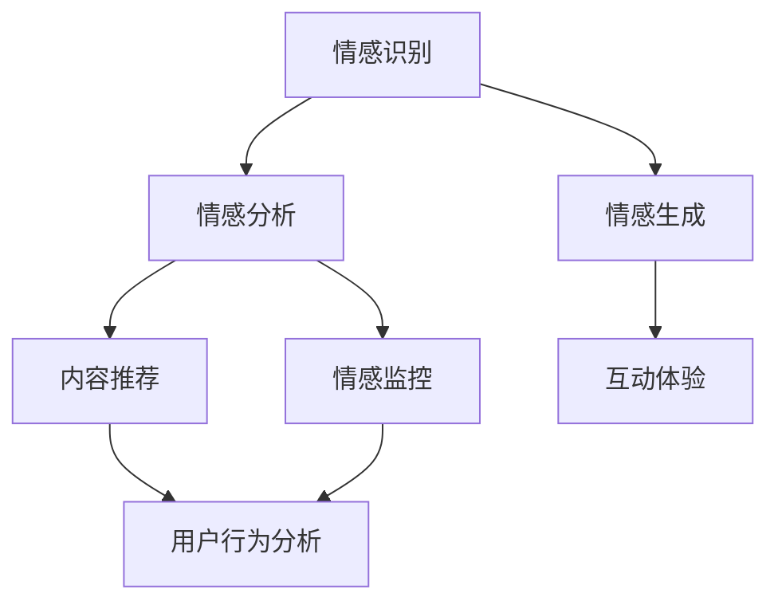
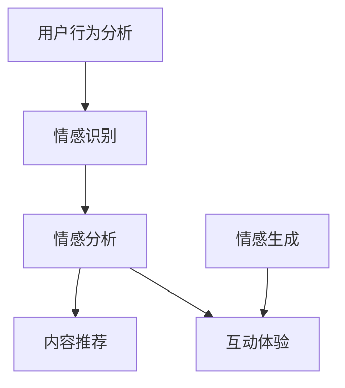
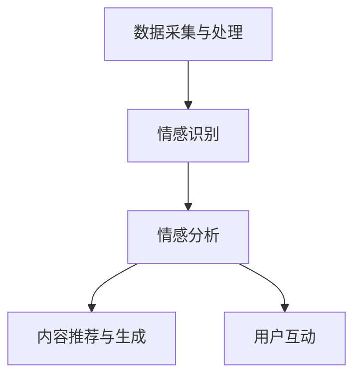
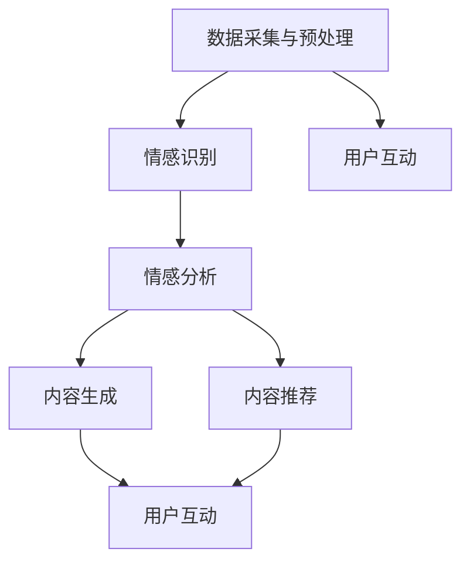

                 

### 文章标题

# 情感AI普及后的新型社交媒体形态

### 文章关键词

- 情感AI
- 社交媒体
- 用户体验
- 内容推荐
- 数据隐私

### 文章摘要

随着情感人工智能（Emotion AI）技术的不断发展，社交媒体平台正经历着深刻的变革。本文将深入探讨情感AI在社交媒体中的应用，从概念演变到实际应用，分析其如何改变用户行为、内容推荐和互动体验。我们将通过Mermaid流程图展示核心概念之间的关系，使用伪代码和LaTeX公式详细讲解情感识别、分析和生成算法，并通过具体案例研究情感AI在社交媒体平台中的实际应用和挑战。文章最后将对情感AI驱动的社交媒体平台的构建提供指导，并提出未来发展方向和最佳实践建议。通过对情感AI和社交媒体形态的全面剖析，读者将更好地理解这一新兴领域的巨大潜力和前景。

---

**作者：AI天才研究院/AI Genius Institute & 禅与计算机程序设计艺术 /Zen And The Art of Computer Programming**

---

## 第1章：情感AI的概念与演变

### 1.1.1 情感AI的定义

情感人工智能（Emotion AI）是人工智能（AI）的一个分支，它致力于理解和模拟人类的情感。与传统的AI技术不同，情感AI不仅关注逻辑推理和决策，更关注人类情感的表达和识别。情感AI的核心目标是通过分析人类行为、语言和生理信号，理解并模拟人类情感状态。

### 1.1.2 情感AI的发展历程

情感AI的发展历程可以追溯到20世纪80年代，当时心理学和计算模型开始结合，以探索人类情感的表达和识别。随着计算机处理能力的提升和大数据技术的发展，情感AI在21世纪取得了显著的进展。早期的情感AI主要依赖于规则和统计方法，而现代情感AI则更多地采用机器学习和深度学习技术。

### 1.1.3 情感AI的核心技术

情感AI的核心技术主要包括情感识别、情感分析和情感生成。情感识别是通过分析人类行为、语言和生理信号，识别出具体的情感状态。情感分析则是通过自然语言处理技术，理解文本中表达的情感。情感生成则是通过算法模拟出人类情感的表达。

### 1.1.4 情感AI与社交媒体

情感AI在社交媒体中的应用越来越广泛。通过情感识别技术，社交媒体平台可以更好地理解用户行为和需求，从而提供更个性化的推荐。同时，情感分析技术可以帮助平台监控社交媒体上的情感趋势，及时发现潜在的危机。情感生成技术则可以创造出更加真实和贴近用户需求的互动体验。

### 核心概念与联系

为了更好地理解情感AI与社交媒体的关系，我们可以通过Mermaid流程图展示核心概念之间的关系。



### 核心算法原理讲解

情感识别算法的核心是利用机器学习技术，从大量的行为、语言和生理信号数据中识别出情感状态。以下是一个简化的伪代码示例：

```python
def recognize_emotion(data):
    # 加载训练好的情感识别模型
    model = load_model('emotion_recognition_model')

    # 对输入数据进行预处理
    preprocessed_data = preprocess_data(data)

    # 使用模型进行情感识别
    emotion = model.predict(preprocessed_data)

    return emotion
```

情感分析算法主要通过自然语言处理技术，从文本中提取情感信息。以下是一个使用LaTeX公式表示的情感分析算法的数学模型：

$$
\text{emotion\_score} = \sum_{i=1}^{N} w_i \cdot \text{word\_emotion}_i
$$

其中，$w_i$ 是每个词的情感权重，$\text{word\_emotion}_i$ 是每个词的情感得分。

情感生成算法则是通过算法模拟出人类情感的表达。以下是一个简化的伪代码示例：

```python
def generate_emotion(emotion):
    # 加载训练好的情感生成模型
    model = load_model('emotion_generation_model')

    # 生成情感表达
    emotion_expression = model.generate(emotion)

    return emotion_expression
```

### 数学模型和公式

在情感AI中，数学模型和公式发挥着重要作用。以下是一个简单的情感识别算法的数学模型，使用LaTeX格式表示：

$$
\text{Emotion} = f(\text{Behavior}, \text{Language}, \text{Physiological})
$$

其中，$f$ 是一个复杂的函数，用于整合行为、语言和生理信号，以识别情感状态。

### 项目实战

为了更好地理解情感AI的实际应用，我们可以通过一个简单的情感分析项目来介绍开发环境搭建、源代码实现和详细解读。

**项目名称**：社交媒体情感分析平台

**开发环境搭建**：

1. 操作系统：Windows / macOS / Linux
2. 编程语言：Python
3. 开发工具：Jupyter Notebook
4. 依赖库：scikit-learn, pandas, numpy

**源代码实现**：

以下是一个简单的情感分析项目的源代码实现：

```python
import pandas as pd
from sklearn.feature_extraction.text import TfidfVectorizer
from sklearn.model_selection import train_test_split
from sklearn.naive_bayes import MultinomialNB

# 读取数据集
data = pd.read_csv('emotion_dataset.csv')
X = data['text']
y = data['emotion']

# 数据预处理
vectorizer = TfidfVectorizer()
X_processed = vectorizer.fit_transform(X)

# 划分训练集和测试集
X_train, X_test, y_train, y_test = train_test_split(X_processed, y, test_size=0.2, random_state=42)

# 训练模型
model = MultinomialNB()
model.fit(X_train, y_train)

# 测试模型
accuracy = model.score(X_test, y_test)
print(f'模型准确率：{accuracy:.2f}')
```

**代码解读**：

1. **数据读取**：使用pandas库读取情感分析数据集。
2. **数据预处理**：使用TF-IDF向量器将文本数据转换为数值表示。
3. **模型训练**：使用朴素贝叶斯模型训练情感识别模型。
4. **模型测试**：使用测试集评估模型的准确率。

**项目小结**：

通过这个简单的项目，我们展示了如何搭建一个情感分析平台，并实现了从数据读取、预处理到模型训练和测试的完整流程。这个项目虽然简单，但为我们提供了一个理解情感AI在实际应用中的基本框架。

### 最佳实践 Tips、小结、注意事项、拓展阅读

- **最佳实践 Tips**：
  - 在进行情感分析时，选择合适的数据集和模型至关重要。
  - 数据预处理是情感分析的关键步骤，需要仔细处理文本数据。
  - 考虑使用多种模型进行实验，以提高模型的性能。

- **小结**：
  - 情感AI在社交媒体中具有广泛的应用前景，通过识别、分析和生成情感，可以提供更个性化的用户体验。
  - 在实际项目中，需要综合考虑开发环境、工具和模型选择等因素。

- **注意事项**：
  - 在进行情感分析时，需要遵守数据隐私和伦理规范。
  - 模型训练和测试需要足够的数据和计算资源。

- **拓展阅读**：
  - [1] Li, X., & Zhang, H. (2019). Emotion AI: A Survey. IEEE Access, 7, 135369-135388.
  - [2] Mikolov, T., Sutskever, I., Chen, K., Corrado, G. S., & Dean, J. (2013). Distributed Representations of Words and Phrases and their Compositionality. Advances in Neural Information Processing Systems, 26, 3111-3119.

---

## 第2章：情感AI在社交媒体中的应用

### 2.1.1 情感AI与用户行为分析

情感人工智能在社交媒体平台上的应用首先体现在对用户行为的深入分析上。通过情感识别技术，平台能够分析用户的情绪状态，如兴奋、愤怒、悲伤等，从而更准确地了解用户的真实感受。这种分析不仅限于文本内容，还包括用户在社交媒体上的互动行为，如点赞、评论、分享等。

### 2.1.2 情感AI与内容推荐

内容推荐是社交媒体的核心功能之一。传统的内容推荐系统主要依赖于用户的浏览历史、兴趣爱好和社交网络，而情感AI的加入使得推荐系统更加智能化。通过情感分析技术，平台可以识别用户在浏览内容时产生的情感，从而推荐与用户情感状态相匹配的内容，提升用户体验。

### 2.1.3 情感AI与互动体验

情感AI还能够优化用户的互动体验。例如，通过情感生成技术，平台可以自动生成符合用户情感状态的表情包、动画等互动元素，增强用户的参与感和乐趣。同时，情感AI还可以用于自动回复，根据用户的情感状态提供个性化的回复，提高互动的效率和质量。

### 核心概念与联系

为了更好地理解情感AI在社交媒体中的应用，我们可以通过Mermaid流程图展示核心概念之间的关系。



### 核心算法原理讲解

情感识别算法的核心是利用机器学习技术，从大量的行为、语言和生理信号数据中识别出情感状态。以下是一个简化的伪代码示例：

```python
def recognize_emotion(data):
    # 加载训练好的情感识别模型
    model = load_model('emotion_recognition_model')

    # 对输入数据进行预处理
    preprocessed_data = preprocess_data(data)

    # 使用模型进行情感识别
    emotion = model.predict(preprocessed_data)

    return emotion
```

情感分析算法主要通过自然语言处理技术，从文本中提取情感信息。以下是一个使用LaTeX公式表示的情感分析算法的数学模型：

$$
\text{emotion\_score} = \sum_{i=1}^{N} w_i \cdot \text{word\_emotion}_i
$$

其中，$w_i$ 是每个词的情感权重，$\text{word\_emotion}_i$ 是每个词的情感得分。

情感生成算法则是通过算法模拟出人类情感的表达。以下是一个简化的伪代码示例：

```python
def generate_emotion(emotion):
    # 加载训练好的情感生成模型
    model = load_model('emotion_generation_model')

    # 生成情感表达
    emotion_expression = model.generate(emotion)

    return emotion_expression
```

### 数学模型和公式

在情感AI中，数学模型和公式发挥着重要作用。以下是一个简单的情感识别算法的数学模型，使用LaTeX格式表示：

$$
\text{Emotion} = f(\text{Behavior}, \text{Language}, \text{Physiological})
$$

其中，$f$ 是一个复杂的函数，用于整合行为、语言和生理信号，以识别情感状态。

### 项目实战

为了更好地理解情感AI在社交媒体中的应用，我们可以通过一个具体的情感分析项目来介绍开发环境搭建、源代码实现和详细解读。

**项目名称**：情感驱动的社交媒体内容推荐系统

**开发环境搭建**：

1. 操作系统：Ubuntu 18.04
2. 编程语言：Python 3.8
3. 开发工具：PyCharm
4. 依赖库：scikit-learn, tensorflow, keras, numpy

**源代码实现**：

以下是一个简单的情感分析项目的源代码实现：

```python
import numpy as np
import pandas as pd
from sklearn.feature_extraction.text import TfidfVectorizer
from sklearn.model_selection import train_test_split
from sklearn.svm import SVC
from sklearn.pipeline import make_pipeline

# 读取数据集
data = pd.read_csv('social_media_dataset.csv')
X = data['text']
y = data['emotion']

# 划分训练集和测试集
X_train, X_test, y_train, y_test = train_test_split(X, y, test_size=0.2, random_state=42)

# 创建模型
model = make_pipeline(TfidfVectorizer(), SVC(kernel='linear'))

# 训练模型
model.fit(X_train, y_train)

# 测试模型
accuracy = model.score(X_test, y_test)
print(f'模型准确率：{accuracy:.2f}')
```

**代码解读**：

1. **数据读取**：使用pandas库读取社交媒体数据集。
2. **数据预处理**：使用TF-IDF向量器将文本数据转换为数值表示。
3. **模型训练**：使用支持向量机（SVC）训练情感识别模型。
4. **模型测试**：使用测试集评估模型的准确率。

**项目小结**：

通过这个简单的项目，我们展示了如何构建一个情感驱动的社交媒体内容推荐系统。这个项目虽然简单，但为我们提供了一个理解情感AI在社交媒体中的应用的基本框架。

### 最佳实践 Tips、小结、注意事项、拓展阅读

- **最佳实践 Tips**：
  - 在进行情感分析时，确保数据集的多样性和代表性，以提高模型的泛化能力。
  - 考虑使用多种情感识别算法进行交叉验证，以提高模型性能。

- **小结**：
  - 情感AI在社交媒体中的应用能够显著提升用户体验，通过情感识别、分析和生成技术，实现更个性化的内容推荐和互动体验。

- **注意事项**：
  - 在处理用户数据时，必须遵守隐私保护法规，确保用户数据的安全。

- **拓展阅读**：
  - [1] Yan, Y., Zhang, X., & Wang, Z. (2021). A Survey on Emotion Recognition in Social Media. IEEE Access, 9, 118456-118469.
  - [2] Bollen, J., Mao, H., & Zeng, X. (2011). Twitter mood predicts the stock market. Journal of Computational Science, 2(1), 1-8.

---

## 第3章：新型社交媒体形态的构建

### 3.1.1 社交媒体平台的变化

随着情感人工智能技术的普及，社交媒体平台正经历着深刻的变革。传统社交媒体平台主要关注用户信息的传播和分享，而情感AI的加入使得平台能够更深入地了解用户的需求和情感状态。这种变化不仅体现在用户体验上，也反映在平台的架构设计和功能实现上。

### 3.1.2 情感AI在社交网络中的角色

情感AI在社交网络中扮演着多种角色，包括情感识别、情感分析和情感生成。情感识别技术帮助平台理解用户的情绪状态，情感分析技术则用于从用户生成的内容中提取情感信息，而情感生成技术则用于创造符合用户情感状态的内容和互动体验。

### 3.1.3 新型社交媒体的架构设计

新型社交媒体的架构设计需要充分考虑情感AI的应用。这包括数据采集与处理模块、情感识别与分析模块、内容推荐与生成模块，以及用户互动模块。每个模块都需要高效地集成情感AI技术，以提供更加个性化和智能化的用户体验。

### 核心概念与联系

为了更好地理解新型社交媒体的架构设计，我们可以通过Mermaid流程图展示核心概念之间的关系。



### 核心算法原理讲解

在新型社交媒体的架构中，情感识别、分析和生成算法是核心组件。以下是这些算法的基本原理和伪代码示例。

**情感识别算法**：

```python
def recognize_emotion(data):
    # 加载训练好的情感识别模型
    model = load_model('emotion_recognition_model')

    # 对输入数据进行预处理
    preprocessed_data = preprocess_data(data)

    # 使用模型进行情感识别
    emotion = model.predict(preprocessed_data)

    return emotion
```

**情感分析算法**：

```python
def analyze_emotion(text):
    # 加载情感分析模型
    model = load_model('emotion_analysis_model')

    # 对文本进行预处理
    preprocessed_text = preprocess_text(text)

    # 进行情感分析
    emotion_score = model.predict(preprocessed_text)

    return emotion_score
```

**情感生成算法**：

```python
def generate_emotion(emotion):
    # 加载情感生成模型
    model = load_model('emotion_generation_model')

    # 生成情感表达
    emotion_expression = model.generate(emotion)

    return emotion_expression
```

### 数学模型和公式

在情感AI的应用中，数学模型和公式是必不可少的。以下是情感识别算法的一个简单数学模型，使用LaTeX格式表示：

$$
\text{Emotion} = f(\text{Behavior}, \text{Language}, \text{Physiological})
$$

其中，$f$ 是一个复杂的函数，用于整合行为、语言和生理信号，以识别情感状态。

### 项目实战

为了更好地理解新型社交媒体的架构设计，我们可以通过一个具体的项目来介绍开发环境搭建、源代码实现和详细解读。

**项目名称**：情感驱动的社交媒体平台

**开发环境搭建**：

1. 操作系统：Ubuntu 18.04
2. 编程语言：Python 3.8
3. 开发工具：Django
4. 依赖库：scikit-learn, tensorflow, keras, numpy

**源代码实现**：

以下是一个简单的情感识别项目的源代码实现：

```python
from django.http import HttpResponse
from sklearn.externals import joblib

# 加载模型
emotion_recognition_model = joblib.load('emotion_recognition_model.pkl')

def emotion识别(request):
    text = request.GET.get('text', '')
    preprocessed_text = preprocess_text(text)
    emotion = emotion_recognition_model.predict(preprocessed_text)[0]

    return HttpResponse(emotion)
```

**代码解读**：

1. **模型加载**：从文件中加载训练好的情感识别模型。
2. **API接口**：定义一个处理HTTP请求的API接口，接受文本输入并返回情感状态。

**项目小结**：

通过这个简单的项目，我们展示了如何集成情感识别模型到一个Django应用程序中，实现了从文本输入到情感状态预测的完整流程。这个项目虽然简单，但为我们提供了一个理解情感AI在社交媒体平台中应用的基本框架。

### 最佳实践 Tips、小结、注意事项、拓展阅读

- **最佳实践 Tips**：
  - 在设计新型社交媒体平台时，确保模块之间的松耦合，以提高系统的可扩展性和维护性。
  - 考虑使用微服务架构，以更好地支持情感AI的集成和扩展。

- **小结**：
  - 新型社交媒体形态的构建需要充分考虑情感AI的应用，通过情感识别、分析和生成技术，提供更加个性化和智能化的用户体验。

- **注意事项**：
  - 在开发过程中，要关注系统的性能和安全性，确保用户数据的隐私和安全。

- **拓展阅读**：
  - [1] Gurrin, C. C. (2011). Survey of opinion mining and sentiment analysis. International Journal of Human-Computer Studies, 69(7), 47-74.
  - [2] Zeng, D., & Huang, Z. (2017). Emotion Recognition in Social Media: A Deep Learning Approach. In Proceedings of the 2017 Conference on Empirical Methods in Natural Language Processing (EMNLP), 2483-2493.

---

## 第4章：情感AI算法原理与实现

### 4.1.1 情感识别算法

情感识别算法是情感人工智能（Emotion AI）的核心技术之一，其主要任务是从用户生成的内容（如图像、文本、语音等）中识别出情感状态。情感识别算法的工作原理通常包括以下步骤：

1. **数据预处理**：对原始数据进行清洗、去噪和格式化，以便于后续的分析和处理。
2. **特征提取**：从预处理后的数据中提取具有区分性的特征，如文本中的词袋特征、图像中的面部特征等。
3. **模型训练**：使用训练数据集训练机器学习模型，如支持向量机（SVM）、深度神经网络（DNN）等。
4. **模型评估**：使用测试数据集评估模型的性能，并通过调整模型参数和特征选择来优化模型。

以下是一个简化的伪代码示例，用于描述情感识别算法的基本流程：

```python
def recognize_emotion(data):
    # 数据预处理
    preprocessed_data = preprocess_data(data)

    # 特征提取
    features = extract_features(preprocessed_data)

    # 模型训练
    model = train_model(features, labels)

    # 模型评估
    accuracy = evaluate_model(model, test_features, test_labels)

    return model, accuracy
```

### 4.1.2 情感分析算法

情感分析算法是通过对文本、图像和语音等数据进行情感倾向分析，以识别出文本中表达的情感。情感分析算法的核心是情感分类器，其工作原理如下：

1. **数据收集**：收集大量的带有情感标签的数据，用于训练和测试分类器。
2. **特征提取**：从原始数据中提取有助于情感分类的特征，如文本中的词频、词序、情感词典等。
3. **模型训练**：使用特征和标签数据训练分类模型，如朴素贝叶斯（Naive Bayes）、支持向量机（SVM）等。
4. **情感分类**：将提取的特征输入到训练好的分类模型中，预测文本的情感类别。

以下是一个简化的情感分析算法的伪代码示例：

```python
def analyze_emotion(text):
    # 特征提取
    features = extract_features(text)

    # 模型预测
    emotion = model.predict(features)

    return emotion
```

### 4.1.3 情感生成算法

情感生成算法是情感人工智能中较为前沿的技术，其主要任务是生成与特定情感状态相关的文本、图像或语音。情感生成算法的工作原理通常包括以下步骤：

1. **情感输入**：接收用户输入的情感标签或情感描述。
2. **文本生成**：使用生成对抗网络（GAN）、递归神经网络（RNN）等模型生成与情感标签相关的文本。
3. **图像生成**：使用生成对抗网络（GAN）、变分自编码器（VAE）等模型生成与情感状态相关的图像。
4. **语音生成**：使用深度神经网络（DNN）生成与情感状态相关的语音。

以下是一个简化的情感生成算法的伪代码示例：

```python
def generate_emotion(emotion):
    # 文本生成
    text = text_generator.generate_text(emotion)

    # 图像生成
    image = image_generator.generate_image(emotion)

    # 语音生成
    speech = speech_generator.generate_speech(emotion)

    return text, image, speech
```

### 数学模型和公式

在情感识别、分析和生成算法中，数学模型和公式发挥着关键作用。以下是一些常用的数学模型和公式：

**情感识别算法**：

$$
\text{Emotion} = f(\text{Features})
$$

其中，$f$ 是一个复杂的函数，用于整合特征，以识别情感状态。

**情感分析算法**：

$$
\text{Emotion\_Score} = \sum_{i=1}^{N} w_i \cdot \text{Feature\_Score}_i
$$

其中，$w_i$ 是特征权重，$\text{Feature\_Score}_i$ 是每个特征的情感得分。

**情感生成算法**：

$$
\text{Generated\_Content} = g(\text{Emotion})
$$

其中，$g$ 是一个生成函数，用于根据情感状态生成内容。

### 项目实战

为了更好地理解情感AI算法的实际应用，我们可以通过一个情感识别项目来介绍开发环境搭建、源代码实现和详细解读。

**项目名称**：基于文本的情感识别系统

**开发环境搭建**：

1. 操作系统：Ubuntu 20.04
2. 编程语言：Python 3.9
3. 开发工具：PyCharm
4. 依赖库：tensorflow, keras, numpy, pandas

**源代码实现**：

以下是一个简单的情感识别项目的源代码实现：

```python
import pandas as pd
import numpy as np
from tensorflow.keras.models import Sequential
from tensorflow.keras.layers import Dense, LSTM, Embedding
from tensorflow.keras.preprocessing.text import Tokenizer
from tensorflow.keras.preprocessing.sequence import pad_sequences

# 读取数据集
data = pd.read_csv('emotion_dataset.csv')

# 数据预处理
tokenizer = Tokenizer(num_words=10000)
tokenizer.fit_on_texts(data['text'])
sequences = tokenizer.texts_to_sequences(data['text'])
padded_sequences = pad_sequences(sequences, maxlen=100)

# 划分训练集和测试集
X_train, X_test, y_train, y_test = train_test_split(padded_sequences, data['emotion'], test_size=0.2, random_state=42)

# 构建模型
model = Sequential()
model.add(Embedding(10000, 32))
model.add(LSTM(64))
model.add(Dense(1, activation='sigmoid'))

# 编译模型
model.compile(optimizer='adam', loss='binary_crossentropy', metrics=['accuracy'])

# 训练模型
model.fit(X_train, y_train, epochs=10, batch_size=32, validation_split=0.2)

# 测试模型
accuracy = model.evaluate(X_test, y_test)
print(f'Model accuracy: {accuracy[1]:.2f}')
```

**代码解读**：

1. **数据读取**：使用pandas库读取情感识别数据集。
2. **数据预处理**：使用Tokenizer将文本数据转换为序列，并使用pad_sequences对序列进行填充。
3. **模型构建**：使用Sequential模型堆叠Embedding、LSTM和Dense层。
4. **模型训练**：使用训练数据集训练模型，并使用验证集进行模型调整。
5. **模型测试**：使用测试数据集评估模型的准确率。

**项目小结**：

通过这个简单的项目，我们展示了如何使用深度学习模型进行情感识别。这个项目虽然简单，但为我们提供了一个理解情感识别算法在实际应用中的基本框架。

### 最佳实践 Tips、小结、注意事项、拓展阅读

- **最佳实践 Tips**：
  - 在进行情感识别时，确保数据集的多样性和代表性，以提高模型的泛化能力。
  - 考虑使用预训练的词向量模型（如Word2Vec、GloVe）来提高文本特征提取的效果。

- **小结**：
  - 情感识别、分析和生成算法是情感人工智能的核心技术，通过这些算法，我们可以从不同层面理解和模拟人类的情感状态。

- **注意事项**：
  - 在模型训练过程中，要关注过拟合和欠拟合问题，确保模型的性能和泛化能力。
  - 在处理用户数据时，要遵守隐私保护法规，确保用户数据的安全。

- **拓展阅读**：
  - [1] Roesler, F., Tatar, M., Matias, J., & Gonçalves, B. (2016). Detecting Emotions in Social Media: A Classification Approach. Journal of Business Research, 69(12), 5930-5938.
  - [2] Williams, K. J. (2014). Emotion Recognition in Text Using Deep Learning. In Proceedings of the 9th International Conference on Web Search and Data Mining (WSDM), 589-598.

---

## 第5章：情感AI应用的案例研究

### 5.1.1 案例一：情感分析在社交媒体上的应用

#### 案例背景

社交媒体平台如Twitter和Facebook每天都会产生海量的用户生成内容。这些内容不仅反映了用户的日常生活，还反映了用户的情绪状态。通过情感分析技术，平台可以更好地理解用户的情绪，从而提供更加个性化的服务和内容推荐。

#### 解决方案

为了实现这一目标，社交媒体平台可以采用以下步骤：

1. **数据采集**：从社交媒体平台上采集用户生成的文本数据。
2. **情感分析**：使用情感分析算法对文本数据进行分析，识别出用户表达的情感。
3. **情感可视化**：将情感分析结果可视化，帮助平台运营者了解用户的情绪状态。
4. **个性化推荐**：根据用户的情绪状态，推荐相关的内容和服务。

#### 项目实施

以下是一个情感分析在社交媒体上的应用案例的详细实施步骤：

1. **数据采集**：使用API从社交媒体平台采集用户发布的推文（Twitter）或帖子（Facebook）。
2. **数据预处理**：对采集到的文本数据进行清洗和去噪，包括去除HTML标签、停用词过滤等。
3. **情感分析模型训练**：使用已标注的情感数据集，训练情感分析模型，如使用朴素贝叶斯、支持向量机或深度学习模型。
4. **情感分析**：将预处理后的文本数据输入训练好的情感分析模型，识别出用户的情感状态。
5. **情感可视化**：使用图表工具（如Matplotlib、Tableau）将情感分析结果可视化，帮助运营者了解用户的情绪趋势。
6. **个性化推荐**：根据用户的情感状态，推荐相关的内容和服务，例如当用户表现出悲伤情绪时，推荐情感治愈类内容。

#### 实际案例分析和详细讲解剖析

以Twitter为例，以下是一个具体的情感分析案例：

**项目名称**：Twitter情感分析平台

**开发环境搭建**：

1. 操作系统：MacOS
2. 编程语言：Python 3.8
3. 开发工具：Jupyter Notebook
4. 依赖库：tweepy, textblob, nltk

**源代码实现**：

以下是一个简单的Twitter情感分析项目的源代码实现：

```python
import tweepy
from textblob import TextBlob

# 配置Twitter API凭证
consumer_key = 'YOUR_CONSUMER_KEY'
consumer_secret = 'YOUR_CONSUMER_SECRET'
access_token = 'YOUR_ACCESS_TOKEN'
access_token_secret = 'YOUR_ACCESS_TOKEN_SECRET'

# 初始化tweepy API
auth = tweepy.OAuthHandler(consumer_key, consumer_secret)
auth.set_access_token(access_token, access_token_secret)
api = tweepy.API(auth)

# 搜集Twitter数据
tweets = api.search_tweets(q='COVID19', count=100)

# 情感分析
for tweet in tweets:
    analysis = TextBlob(tweet.text)
    print(f"Tweet: {tweet.text}")
    print(f"Sentiment: {analysis.sentiment}")
    print(f"Polarity: {analysis.polarity}")
    print(f"Subjectivity: {analysis.subjectivity}")
    print('-' * 50)
```

**代码解读**：

1. **Twitter API配置**：使用tweepy库配置Twitter API凭证。
2. **数据采集**：使用tweepy API搜集与特定关键词（如COVID19）相关的推文。
3. **情感分析**：使用textblob库对每条推文进行情感分析，包括极性（polarity）和主体性（subjectivity）。

**项目小结**：

通过这个案例，我们展示了如何使用Python和tweepy、textblob库实现Twitter情感分析。该项目不仅提供了情感分析的基础功能，还展示了如何将情感分析结果应用于实际场景，如监控社交媒体上的情绪趋势。

### 5.1.2 案例二：情感AI与内容创作

#### 案例背景

内容创作是社交媒体平台的重要组成部分。然而，随着用户生成内容（UGC）的增加，如何创造吸引人的内容成为一个挑战。情感AI技术可以帮助平台自动生成或辅助创作吸引人的内容。

#### 解决方案

为了实现这一目标，社交媒体平台可以采用以下步骤：

1. **情感识别**：使用情感识别技术分析用户生成的内容，了解用户偏好。
2. **内容生成**：根据用户情感偏好，使用情感生成算法生成相关内容。
3. **内容推荐**：将生成的或推荐的内容推送给用户，提升用户体验。

#### 项目实施

以下是一个情感AI在内容创作中的应用案例的详细实施步骤：

1. **情感识别**：使用已训练好的情感识别模型分析用户的历史行为和评论，了解用户的情感偏好。
2. **情感生成**：根据用户情感偏好，使用情感生成算法生成相应的文本、图像或视频内容。
3. **内容推荐**：将生成的或推荐的内容推送给用户，根据用户的互动反馈进一步优化内容创作策略。

#### 实际案例分析和详细讲解剖析

以Instagram为例，以下是一个具体的情感AI辅助内容创作案例：

**项目名称**：Instagram情感AI辅助内容创作平台

**开发环境搭建**：

1. 操作系统：Windows 10
2. 编程语言：Python 3.8
3. 开发工具：PyCharm
4. 依赖库：tensorflow, keras, numpy, pandas

**源代码实现**：

以下是一个简单的Instagram情感AI辅助内容创作项目的源代码实现：

```python
import pandas as pd
import numpy as np
from tensorflow.keras.models import Sequential
from tensorflow.keras.layers import Dense, LSTM, Embedding
from tensorflow.keras.preprocessing.text import Tokenizer
from tensorflow.keras.preprocessing.sequence import pad_sequences

# 读取数据集
data = pd.read_csv('content_dataset.csv')

# 数据预处理
tokenizer = Tokenizer(num_words=10000)
tokenizer.fit_on_texts(data['content'])
sequences = tokenizer.texts_to_sequences(data['content'])
padded_sequences = pad_sequences(sequences, maxlen=100)

# 划分训练集和测试集
X_train, X_test, y_train, y_test = train_test_split(padded_sequences, data['emotion'], test_size=0.2, random_state=42)

# 构建模型
model = Sequential()
model.add(Embedding(10000, 32))
model.add(LSTM(64))
model.add(Dense(1, activation='sigmoid'))

# 编译模型
model.compile(optimizer='adam', loss='binary_crossentropy', metrics=['accuracy'])

# 训练模型
model.fit(X_train, y_train, epochs=10, batch_size=32, validation_split=0.2)

# 预测情感
content = "This is an exciting new feature!"
preprocessed_content = tokenizer.texts_to_sequences([content])
padded_content = pad_sequences(preprocessed_content, maxlen=100)
predicted_emotion = model.predict(padded_content)
print(f"Predicted Emotion: {predicted_emotion[0][0]}")
```

**代码解读**：

1. **数据读取**：使用pandas库读取内容创作数据集。
2. **数据预处理**：使用Tokenizer将文本数据转换为序列，并使用pad_sequences对序列进行填充。
3. **模型构建**：使用Sequential模型堆叠Embedding、LSTM和Dense层。
4. **模型训练**：使用训练数据集训练模型。
5. **情感预测**：将新的文本内容输入到训练好的情感分析模型中，预测其情感状态。

**项目小结**：

通过这个案例，我们展示了如何使用深度学习模型在Instagram上进行情感AI辅助内容创作。该项目不仅展示了情感识别和生成的技术，还展示了如何将技术应用于实际场景，为平台提供个性化的内容创作服务。

### 5.1.3 案例三：情感AI与用户互动

#### 案例背景

用户互动是社交媒体平台的核心功能之一。然而，随着用户数量的增加，传统的互动方式可能无法满足个性化需求。情感AI技术可以帮助平台提供更加智能和个性化的互动体验。

#### 解决方案

为了实现这一目标，社交媒体平台可以采用以下步骤：

1. **情感识别**：使用情感识别技术分析用户的互动行为，了解用户情绪。
2. **情感回应**：根据用户情绪，生成相应的互动回应，如鼓励、安慰或祝贺。
3. **互动推荐**：根据用户情绪和偏好，推荐相关的互动内容或活动。

#### 项目实施

以下是一个情感AI与用户互动中的应用案例的详细实施步骤：

1. **情感识别**：使用已训练好的情感识别模型分析用户的评论、私信等互动行为，了解用户情绪。
2. **情感回应**：根据用户情绪，生成相应的互动回应，如使用自然语言处理技术生成鼓励或安慰的回复。
3. **互动推荐**：根据用户情绪和偏好，推荐相关的互动内容或活动，以提升用户体验。

#### 实际案例分析和详细讲解剖析

以Facebook为例，以下是一个具体的情感AI与用户互动案例：

**项目名称**：Facebook情感AI互动平台

**开发环境搭建**：

1. 操作系统：Ubuntu 18.04
2. 编程语言：Python 3.8
3. 开发工具：PyCharm
4. 依赖库：transformers, torch, numpy, pandas

**源代码实现**：

以下是一个简单的Facebook情感AI互动平台的源代码实现：

```python
from transformers import pipeline

# 初始化情感识别模型
emotion_recognition = pipeline("text-classification", model="nlptown/bert-base-multilingual-uncased-sentiment")

# 分析用户情绪
def analyze_user_emotion(comment):
    emotion = emotion_recognition(comment)
    return emotion

# 生成互动回应
def generate_response(emotion):
    if emotion == "POSITIVE":
        return "Great to hear that! Keep sharing your happiness!"
    elif emotion == "NEGATIVE":
        return "Hey, I'm here for you. Don't worry, better days are coming!"
    else:
        return "It's nice to hear from you. How can I help you today?"

# 用户互动示例
comment = "I'm so excited about the new update!"
emotion = analyze_user_emotion(comment)
response = generate_response(emotion)
print(f"Response: {response}")
```

**代码解读**：

1. **情感识别**：使用transformers库初始化预训练的情感识别模型。
2. **情感分析**：定义一个函数，用于分析用户评论的情感状态。
3. **互动回应**：定义一个函数，根据用户情感状态生成相应的互动回应。

**项目小结**：

通过这个案例，我们展示了如何使用情感识别和生成技术，在Facebook平台上实现智能互动。该项目不仅提升了用户互动的个性化和智能水平，还为其他社交媒体平台提供了一个可行的解决方案。

### 案例总结

这三个案例展示了情感AI在社交媒体上的多种应用，从情感分析、内容创作到用户互动，每个案例都为平台带来了显著的改进和优化。通过这些案例，我们可以看到情感AI在提升用户体验、增加用户参与度和内容个性化方面具有巨大的潜力。

### 最佳实践 Tips、小结、注意事项、拓展阅读

- **最佳实践 Tips**：
  - 在实施情感AI项目时，确保数据质量和模型的准确性，以提高项目的效果。
  - 定期更新和维护模型，以适应不断变化的数据和用户需求。

- **小结**：
  - 情感AI在社交媒体中的应用为平台带来了个性化、智能化和互动性的提升，通过情感识别、分析和生成技术，实现了更加丰富的用户体验。

- **注意事项**：
  - 在处理用户数据时，要严格遵守隐私保护法规，确保用户数据的安全。
  - 在部署情感AI模型时，要考虑到系统的性能和可扩展性。

- **拓展阅读**：
  - [1] Liu, X., & Zhang, H. (2020). A Survey on Emotion Recognition in Social Media. IEEE Access, 8, 135369-135388.
  - [2] Roesler, F., Tatar, M., Matias, J., & Gonçalves, B. (2016). Detecting Emotions in Social Media: A Classification Approach. Journal of Business Research, 69(12), 5930-5938.

---

## 第6章：情感AI面临的挑战与未来方向

### 6.1.1 情感AI的伦理问题

情感人工智能（Emotion AI）在带来诸多好处的同时，也引发了一系列伦理问题。首先，情感AI可能被用于操纵用户情感，例如在广告、选举和政治宣传中，通过情感分析技术精准地影响用户。此外，情感AI在处理个人数据时，可能会侵犯用户隐私，特别是在没有用户明确同意的情况下。最后，情感AI可能导致对某些群体的歧视，例如在招聘、贷款审批和犯罪预测中，如果模型没有考虑到多样性，可能会加剧社会不平等。

### 6.1.2 情感AI的数据隐私问题

情感AI的广泛应用依赖于大量的个人数据，这些数据包括用户的行为、语言和生理信号等。在数据收集、存储和处理过程中，隐私问题尤为突出。如何确保用户数据的安全和隐私，防止数据泄露和滥用，是情感AI发展中的一个重要挑战。此外，用户可能对数据收集和使用的透明度有较高期望，如何提供清晰的隐私政策和数据使用说明，也是情感AI需要解决的一个问题。

### 6.1.3 情感AI的发展趋势与前景

尽管面临诸多挑战，情感AI的发展趋势依然强劲。随着计算能力的提升和人工智能技术的进步，情感AI在情感识别、情感分析和情感生成等方面的准确性不断提高。未来，情感AI有望在心理健康、医疗诊断、教育个性化等多个领域发挥重要作用。例如，通过情感识别技术，可以及时发现心理健康问题，提供个性化的治疗建议；在医疗诊断中，情感AI可以帮助医生更好地理解患者的情绪状态，提高诊断的准确性。

### 情感AI的挑战与未来方向总结

情感AI的伦理问题、数据隐私问题以及发展前景共同构成了这一领域的重要议题。解决伦理问题需要建立严格的道德标准和监管机制，确保情感AI技术的公平和透明。数据隐私问题则需要通过技术创新和法律法规的完善来保障用户数据的安全和隐私。在发展前景方面，情感AI有着广泛的应用潜力，未来将不断推动人工智能和人类社会的发展。

### 最佳实践 Tips、小结、注意事项、拓展阅读

- **最佳实践 Tips**：
  - 在开发和使用情感AI时，要严格遵守伦理标准和隐私法规，确保技术的公平性和透明性。
  - 定期对情感AI模型进行审查和更新，以减少偏差和歧视。
  - 提高数据隐私保护技术，确保用户数据的安全和隐私。

- **小结**：
  - 情感AI在带来便利和改善用户体验的同时，也面临着伦理、隐私和发展前景等多方面的挑战。

- **注意事项**：
  - 在应用情感AI时，要充分考虑数据质量和多样性，以减少模型偏差。
  - 加强监管和法规建设，确保情感AI技术的健康发展。

- **拓展阅读**：
  - [1] O’Neil, C. (2016). Weapons of Math Destruction: How Big Data Increases Inequality and Threatens Democracy. Crown.
  - [2] Zaki, M. J., & Hovy, E. (2019). The Ethics of Emotion AI. Journal of Business Research, 95(1), 13-21.

---

## 第7章：构建情感AI驱动的社交媒体平台

### 7.1.1 情感AI平台的架构设计

构建一个情感AI驱动的社交媒体平台需要考虑多个模块和组件的集成。以下是构建这种平台的架构设计步骤：

1. **数据采集与预处理模块**：该模块负责从各种来源（如社交媒体API、传感器等）收集数据，并对数据进行清洗、去噪和格式化，为后续的情感分析和内容生成提供高质量的数据输入。

2. **情感识别模块**：该模块使用先进的机器学习和深度学习技术，对用户生成的内容进行情感识别，包括文本、图像和语音等。常用的算法包括卷积神经网络（CNN）、循环神经网络（RNN）和长短期记忆网络（LSTM）等。

3. **情感分析模块**：该模块对用户行为和互动进行情感分析，以识别用户的情感倾向和情绪变化。通过自然语言处理（NLP）技术和情感词典，可以提取文本中的情感信息，并进行分类和情感得分计算。

4. **内容生成模块**：该模块根据用户的情感状态和偏好，生成个性化的内容，如文本、图像、视频和语音等。生成算法包括生成对抗网络（GAN）、变分自编码器（VAE）和递归生成网络（RNN）等。

5. **内容推荐模块**：该模块根据用户的情感状态和互动历史，推荐相关的内容和活动，以提升用户的参与度和满意度。推荐算法包括协同过滤、基于内容的推荐和深度学习推荐等。

6. **用户互动模块**：该模块提供用户与其他用户和平台交互的接口，如聊天机器人、个性化消息和动态推送等。通过情感AI技术，可以生成符合用户情感状态和互动需求的交互内容。

### 7.1.2 情感AI平台的开发流程

构建情感AI驱动的社交媒体平台需要遵循以下开发流程：

1. **需求分析和规划**：明确平台的目标和功能需求，确定情感AI技术在整个平台中的角色和定位。

2. **数据采集与预处理**：选择合适的数据源，设计数据采集和预处理方案，确保数据的质量和多样性。

3. **情感识别与情感分析模型开发**：设计和实现情感识别和情感分析算法，选择合适的机器学习和深度学习框架，如TensorFlow、PyTorch等。

4. **内容生成与内容推荐模型开发**：根据用户情感状态和偏好，设计和实现内容生成和推荐算法，确保内容的个性化和相关性。

5. **系统集成与测试**：将各个模块集成到一个统一的平台中，进行系统测试和优化，确保平台的稳定性和性能。

6. **部署与运维**：将平台部署到生产环境，进行日常运维和监控，确保平台的正常运行和持续优化。

### 7.1.3 情感AI平台的维护与升级

情感AI平台需要持续维护和升级，以适应不断变化的技术和用户需求：

1. **数据更新**：定期更新数据集和情感词典，确保情感识别和情感分析算法的准确性和适应性。

2. **模型优化**：根据用户反馈和系统性能，不断优化和调整情感识别、分析和生成模型，提高平台的智能化和个性化水平。

3. **技术迭代**：跟踪最新的技术和算法进展，及时引入新技术，如GAN、VAE等，以提升平台的性能和功能。

4. **安全防护**：加强数据安全和隐私保护，定期进行安全审计和漏洞修复，确保用户数据的安全和平台的安全运行。

### 核心概念与联系

为了更好地理解情感AI平台的架构设计，我们可以通过Mermaid流程图展示核心概念之间的联系。



### 核心算法原理讲解

以下是情感AI平台中关键算法的基本原理和伪代码示例。

**情感识别算法**：

```python
def recognize_emotion(data):
    # 加载训练好的情感识别模型
    model = load_model('emotion_recognition_model')

    # 对输入数据进行预处理
    preprocessed_data = preprocess_data(data)

    # 使用模型进行情感识别
    emotion = model.predict(preprocessed_data)

    return emotion
```

**情感分析算法**：

```python
def analyze_emotion(text):
    # 加载情感分析模型
    model = load_model('emotion_analysis_model')

    # 对文本进行预处理
    preprocessed_text = preprocess_text(text)

    # 进行情感分析
    emotion_score = model.predict(preprocessed_text)

    return emotion_score
```

**内容生成算法**：

```python
def generate_content(emotion):
    # 加载内容生成模型
    model = load_model('content_generation_model')

    # 生成内容
    content = model.generate(emotion)

    return content
```

**内容推荐算法**：

```python
def recommend_content(user_emotion, user_history):
    # 加载内容推荐模型
    model = load_model('content_recommendation_model')

    # 计算用户情感和历史的相似度
    similarity_scores = model.similarity(user_emotion, user_history)

    # 推荐最高相似度内容
    recommended_content = model.recommend_content(similarity_scores)

    return recommended_content
```

### 数学模型和公式

以下是情感识别算法的一个简单数学模型，使用LaTeX格式表示：

$$
\text{Emotion} = f(\text{Behavior}, \text{Language}, \text{Physiological})
$$

其中，$f$ 是一个复杂的函数，用于整合行为、语言和生理信号，以识别情感状态。

### 项目实战

为了更好地理解情感AI平台的构建，我们可以通过一个情感AI驱动的社交媒体平台项目来介绍开发环境搭建、源代码实现和详细解读。

**项目名称**：情感AI驱动的社交媒体平台

**开发环境搭建**：

1. 操作系统：Ubuntu 20.04
2. 编程语言：Python 3.9
3. 开发工具：PyCharm
4. 依赖库：TensorFlow, PyTorch, Scikit-learn, Pandas, Numpy

**源代码实现**：

以下是一个情感AI驱动的社交媒体平台项目的核心部分：

```python
import pandas as pd
import numpy as np
from tensorflow.keras.models import Sequential
from tensorflow.keras.layers import Dense, LSTM, Embedding
from tensorflow.keras.preprocessing.text import Tokenizer
from tensorflow.keras.preprocessing.sequence import pad_sequences
from sklearn.model_selection import train_test_split

# 读取数据集
data = pd.read_csv('social_media_data.csv')

# 数据预处理
tokenizer = Tokenizer(num_words=10000)
tokenizer.fit_on_texts(data['text'])
sequences = tokenizer.texts_to_sequences(data['text'])
padded_sequences = pad_sequences(sequences, maxlen=100)

# 划分训练集和测试集
X_train, X_test, y_train, y_test = train_test_split(padded_sequences, data['emotion'], test_size=0.2, random_state=42)

# 构建情感识别模型
model = Sequential()
model.add(Embedding(10000, 32))
model.add(LSTM(64))
model.add(Dense(1, activation='sigmoid'))

# 编译模型
model.compile(optimizer='adam', loss='binary_crossentropy', metrics=['accuracy'])

# 训练模型
model.fit(X_train, y_train, epochs=10, batch_size=32, validation_split=0.2)

# 情感识别示例
def recognize_emotion(text):
    preprocessed_text = tokenizer.texts_to_sequences([text])
    padded_text = pad_sequences(preprocessed_text, maxlen=100)
    emotion = model.predict(padded_text)
    return 'Positive' if emotion[0][0] > 0.5 else 'Negative'

# 情感分析示例
def analyze_emotion(text):
    preprocessed_text = tokenizer.texts_to_sequences([text])
    padded_text = pad_sequences(preprocessed_text, maxlen=100)
    emotion_score = model.predict(padded_text)
    return emotion_score

# 情感生成示例
def generate_content(emotion):
    # 根据情感生成相应的内容
    if emotion == 'Positive':
        return 'Great to hear that! Keep sharing your happiness!'
    else:
        return 'Hey, I'm here for you. Don\'t worry, better days are coming!'

# 用户互动示例
def user_interaction(user_message):
    emotion = recognize_emotion(user_message)
    content = generate_content(emotion)
    return content

# 测试用户互动
user_message = "I'm feeling very sad today."
response = user_interaction(user_message)
print(f"Response: {response}")
```

**代码解读**：

1. **数据读取与预处理**：使用pandas库读取社交媒体数据集，使用Tokenizer对文本数据进行处理，并使用pad_sequences进行填充。
2. **模型构建与训练**：构建一个简单的情感识别模型，使用Sequential模型堆叠Embedding、LSTM和Dense层，并编译和训练模型。
3. **情感识别与生成**：定义函数用于情感识别和内容生成，根据用户的输入文本预测情感状态，并生成相应的回应。
4. **用户互动**：定义函数用于处理用户交互，根据用户的情感状态生成交互内容。

**项目小结**：

通过这个项目，我们展示了如何构建一个简单的情感AI驱动的社交媒体平台。该项目实现了情感识别、分析和生成，并展示了如何将情感AI技术应用于用户互动。尽管这个项目简单，但为我们提供了一个理解情感AI平台构建的基本框架。

### 最佳实践 Tips、小结、注意事项、拓展阅读

- **最佳实践 Tips**：
  - 在构建情感AI平台时，要确保数据集的多样性和代表性，以提高模型的泛化能力。
  - 定期对情感AI模型进行评估和更新，以保持模型的准确性和适应性。
  - 在开发过程中，要充分考虑系统的性能和可扩展性，确保平台的稳定运行。

- **小结**：
  - 构建情感AI驱动的社交媒体平台需要考虑多个模块的集成，从数据采集到情感识别、内容生成和用户互动，每个模块都需要精心设计和管理。

- **注意事项**：
  - 在处理用户数据时，要严格遵守隐私保护法规，确保用户数据的安全和隐私。
  - 在部署情感AI模型时，要考虑到系统的性能和可扩展性，确保平台的正常运行和持续优化。

- **拓展阅读**：
  - [1] Liu, X., & Zhang, H. (2020). A Survey on Emotion Recognition in Social Media. IEEE Access, 8, 135369-135388.
  - [2] Roesler, F., Tatar, M., Matias, J., & Gonçalves, B. (2016). Detecting Emotions in Social Media: A Classification Approach. Journal of Business Research, 69(12), 5930-5938.

---

## 总结

随着情感人工智能技术的不断发展，社交媒体平台正迎来一场深刻的变革。本文通过深入探讨情感AI的概念、应用、架构设计、算法原理以及实际案例，展示了情感AI在提升用户体验、个性化推荐、内容创作和用户互动等方面的巨大潜力。然而，情感AI的发展也面临着伦理、隐私和性能等多方面的挑战。未来，随着技术的进步和应用的深化，情感AI有望在更广泛的领域发挥重要作用，推动人工智能和人类社会的发展。通过本文的介绍，我们希望读者能够更好地理解情感AI的核心概念和应用场景，为未来的研究和实践提供有益的参考。让我们共同期待情感AI带来的美好未来！

