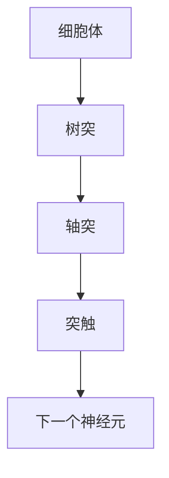
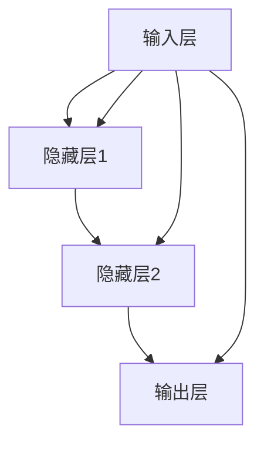
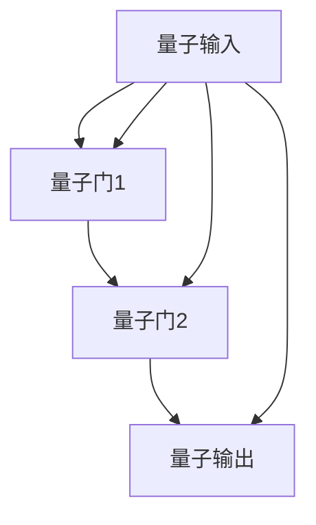
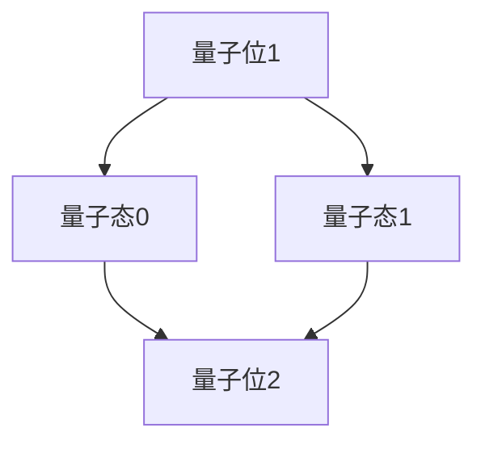
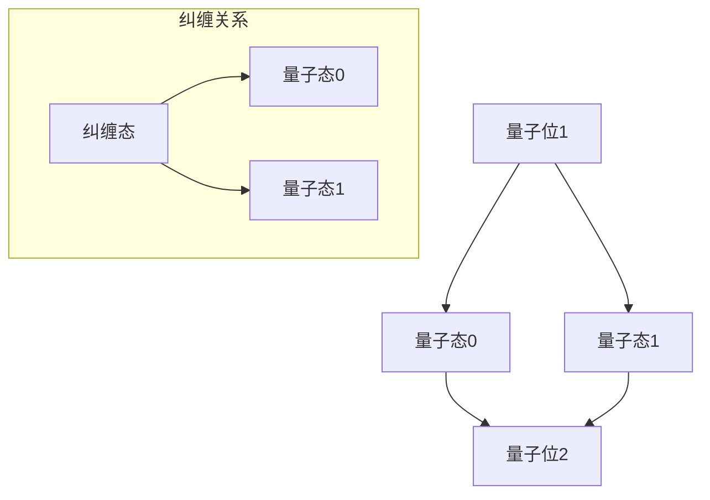
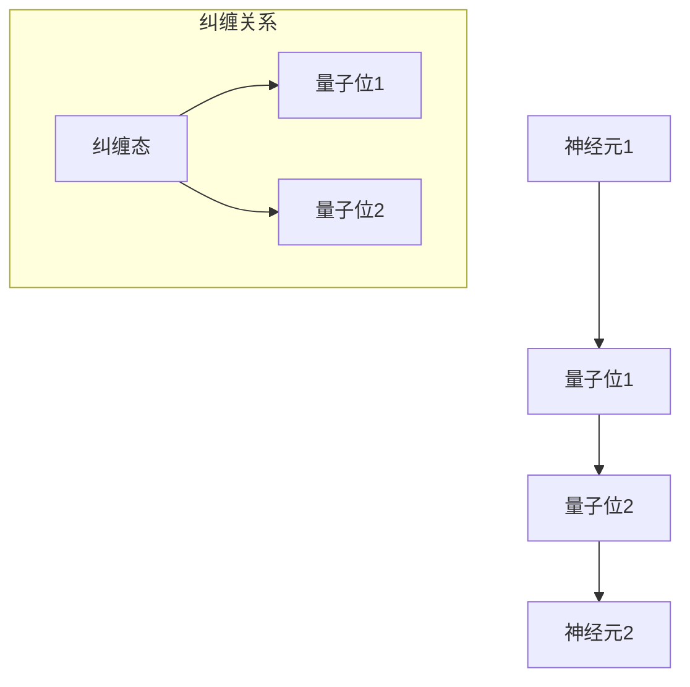
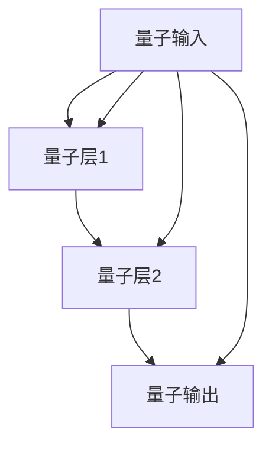
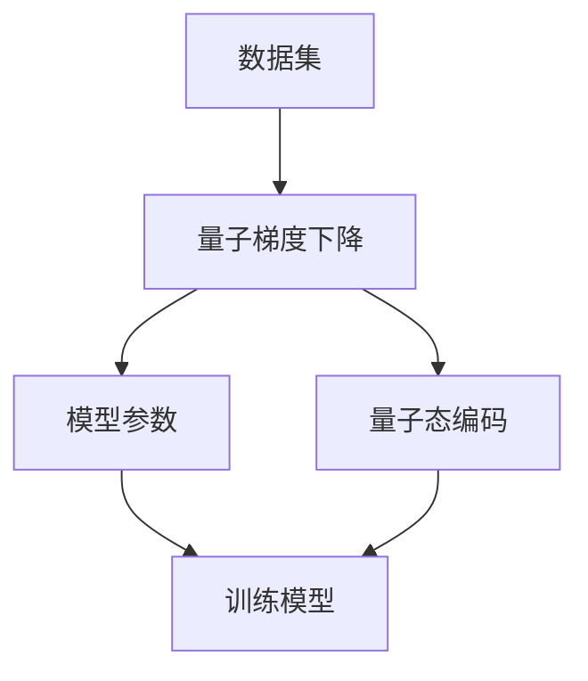
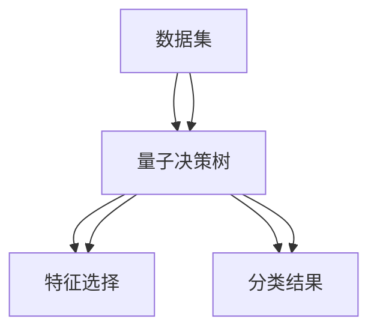

                 

# 神经元量子通信与思维速度的关系

## 关键词
神经元通信、量子通信、思维速度、神经网络、信息加密、信息传输、人工智能、技术挑战、未来展望。

## 摘要
本文深入探讨神经元量子通信与思维速度的关系，首先介绍了神经元通信和量子通信的基本原理，以及二者之间的关联。接着，通过具体实例和伪代码，详细阐述了神经元量子通信在信息加密和传输中的应用。进一步地，本文分析了神经元量子通信如何影响思维速度，并通过数学模型和实验数据支持这一论点。最后，展望了神经元量子通信在人工智能领域的应用前景和技术挑战，提出了未来发展的可能方向。

## 引言
神经元量子通信是近年来科技领域的一个新兴研究方向，它结合了神经科学和量子物理学的理论，试图通过模拟神经元通信的方式来实现量子通信。而思维速度，即个体处理信息和做出决策的能力，是衡量智力水平的重要指标。神经元量子通信与思维速度之间的关系，既具有理论上的探索价值，也对实际应用具有重要意义。

本文将从以下几个方面进行探讨：
1. **神经元通信的基本原理**：介绍神经元的基本结构、信号传递机制以及神经网络的工作原理。
2. **量子通信原理与神经元量子通信**：阐述量子通信的基本概念、量子态的叠加与纠缠，并解释神经元量子通信的原理。
3. **神经元量子通信的应用**：探讨神经元量子通信在信息加密和信息传输中的应用实例。
4. **神经元量子通信与思维速度的关系**：分析神经元量子通信对思维速度的影响，并给出数学模型和实验数据支持。
5. **神经元量子通信的未来与发展**：讨论神经元量子通信在人工智能中的应用，以及面临的技术挑战和未来发展方向。

通过上述内容，我们希望能够系统地了解神经元量子通信与思维速度的关系，并为相关领域的研究和实践提供有益的参考。

## 第一部分：神经元量子通信基础

### 第1章：神经元通信的基本原理

#### 1.1 神经元的基本结构
神经元是神经系统中最基本的单元，它由细胞体、树突、轴突和突触等部分组成。神经元的基本结构可以用Mermaid流程图来表示：



在这个流程图中，A表示细胞体，B表示树突，C表示轴突，D表示突触，E表示下一个神经元。神经元通过树突接收来自其他神经元的信号，通过轴突将这些信号传递到突触，最后通过突触将信号传递到下一个神经元。

#### 1.2 神经元的信号传递机制
神经元的信号传递机制是一个复杂的过程，它涉及到电信号的生成、传递和接收。以下是一个简化的信号传递机制流程：

1. **电信号的生成**：当神经元受到刺激时，细胞膜上的离子通道会打开，导致钠离子（Na+）流入细胞，使得细胞内的电位发生变化，形成一个动作电位。
2. **动作电位的传递**：动作电位沿着轴突向突触传递。在轴突的膜上，钠离子通道打开，使得动作电位可以继续传递。
3. **信号的传递与接收**：动作电位到达突触后，通过突触前膜释放神经递质，神经递质通过突触间隙作用于突触后膜上的受体，引发突触后神经元的电位变化，从而完成信号的传递。

可以使用伪代码来描述这个信号传递过程：

```python
def generate_action_potential(stimulus):
    if stimulus >= threshold:
        return True  # 生成动作电位

def transmit_action_potential():
    # 沿轴突传递动作电位
    return True

def transmit_signal(neurotransmitter, receptor):
    if neurotransmitter == receptor:
        return True  # 信号被接收
    else:
        return False  # 信号未被接收
```

#### 1.3 神经网络的建立与工作原理
神经网络是由多个神经元通过突触连接形成的复杂网络系统。神经网络的工作原理可以简单描述为：

1. **输入层**：接收外部输入信号。
2. **隐藏层**：对输入信号进行加工和处理。
3. **输出层**：生成输出信号。

神经网络通过调整神经元之间的突触权重来实现对输入数据的处理。以下是一个简化的神经网络工作原理流程：



在这个流程图中，A表示输入层，B表示隐藏层1，C表示隐藏层2，D表示输出层。每个神经元之间的连接可以用权重来表示，权重决定了信号在传递过程中的强度。

可以使用伪代码来描述神经网络的工作原理：

```python
def neural_network(input_data, weights):
    hidden_layer1 = process_input(input_data, weights['input_to_hidden1'])
    hidden_layer2 = process_input(hidden_layer1, weights['hidden1_to_hidden2'])
    output = process_input(hidden_layer2, weights['hidden2_to_output'])
    return output

def process_input(data, weights):
    sum = 0
    for i in range(len(data)):
        sum += data[i] * weights[i]
    return sigmoid(sum)

def sigmoid(x):
    return 1 / (1 + exp(-x))
```

#### 1.4 神经网络与量子计算的联系
神经网络与量子计算之间存在一些潜在的联系。量子计算利用量子位（qubit）进行计算，可以在同一时间处理多个状态，这种并行处理能力与神经网络的并行处理特性有相似之处。以下是一些可能的联系：

1. **量子神经网络（QNN）**：量子神经网络是神经网络与量子计算结合的一种形式。它利用量子位的叠加态和量子门的操作来构建神经网络。以下是一个简化的QNN结构：



在这个流程图中，A表示量子输入，B表示量子门1，C表示量子门2，D表示量子输出。量子门1和量子门2分别表示量子位的叠加和纠缠操作。

2. **量子增强的神经网络**：量子增强的神经网络是在传统神经网络的基础上，利用量子计算的优势来优化网络的学习和推断过程。这种结合可以在处理大规模数据集时提高网络的效率和准确性。

综上所述，神经元通信和量子计算之间存在着一定的联系。通过结合神经网络和量子计算的理论，可以探索出新的计算模式和算法，为解决复杂的科学和工程问题提供新的思路。

### 第2章：量子通信原理与神经元量子通信

#### 2.1 量子通信的基本概念
量子通信是一种利用量子力学原理进行信息传输的技术。其基本概念包括量子位（qubit）、量子态的叠加、量子纠缠等。

1. **量子位（qubit）**：量子位是量子计算的基本单元，它可以用两个量子态的线性组合来表示，即$$|q\rangle = \sum_{i} c_i |i\rangle$$，其中$i$表示量子态的取值，$c_i$是系数。
2. **量子态的叠加**：量子态的叠加是指量子位可以同时处于多个状态的组合。例如，一个量子位可以同时处于0态和1态的叠加状态。
3. **量子纠缠**：量子纠缠是量子位之间的一种特殊关系，当两个量子位发生纠缠后，一个量子位的状态会立即影响另一个量子位的状态，即使它们相隔很远。

可以使用Mermaid流程图来描述量子位的基本概念：



在这个流程图中，A表示量子位1，B表示量子态0，C表示量子态1，D表示量子位2。量子位1处于0态和1态的叠加状态，而量子位2则与量子位1发生纠缠。

#### 2.2 量子态的叠加与纠缠
量子态的叠加和纠缠是量子通信的核心原理。

1. **量子态的叠加**：量子态的叠加是指量子位可以同时处于多个状态的组合。例如，一个量子位可以同时处于0态和1态的叠加状态。这可以用数学公式来表示：
   $$|q\rangle = \alpha |0\rangle + \beta |1\rangle$$
   其中，$\alpha$和$\beta$是复数系数，$|0\rangle$和$|1\rangle$分别表示量子位的0态和1态。

2. **量子纠缠**：量子纠缠是量子位之间的一种特殊关系，当两个量子位发生纠缠后，一个量子位的状态会立即影响另一个量子位的状态，即使它们相隔很远。这可以用数学公式来表示：
   $$|ψ\rangle = \frac{1}{\sqrt{2}} (|00\rangle + |11\rangle)$$
   其中，$|00\rangle$和$|11\rangle$分别表示两个量子位同时处于00态和11态的纠缠状态。

可以使用Mermaid流程图来描述量子态的叠加和纠缠：



在这个流程图中，A表示量子位1，B表示量子态0，C表示量子态1，D表示量子位2。量子位1处于0态和1态的叠加状态，而量子位2与量子位1发生纠缠，形成纠缠态。

#### 2.3 神经元量子通信的概念与原理
神经元量子通信是将量子通信原理应用于神经元通信的一种尝试。其概念和原理如下：

1. **神经元量子通信的概念**：神经元量子通信是指利用量子通信的原理来模拟神经元通信的过程，实现信息在神经元之间的快速、安全传输。

2. **神经元量子通信的原理**：神经元量子通信基于量子态的叠加和纠缠原理。当两个神经元通过量子通信连接时，它们之间的量子态可以发生叠加和纠缠，从而实现信息的快速传递。

以下是一个简化的神经元量子通信原理流程：



在这个流程图中，A表示神经元1，B表示量子位1，C表示量子位2，D表示神经元2。量子位1和量子位2发生纠缠，形成纠缠态。通过量子位的叠加和纠缠，神经元1和神经元2之间的信息可以快速传递。

神经元量子通信的原理不仅可以用于神经元之间的信息传输，还可以应用于神经网络的学习和优化。通过利用量子计算的优势，神经网络可以更快地学习和处理复杂的任务，从而提高人工智能系统的效率和准确性。

### 第3章：神经元量子通信在信息处理中的应用

#### 3.1 神经元量子通信在信息加密中的应用
神经元量子通信在信息加密领域具有广阔的应用前景。通过利用量子通信的叠加和纠缠特性，可以实现对信息的加密和解密。以下是一个简化的神经元量子通信加密算法：

**加密过程：**
1. **密钥生成**：首先，生成两个量子位，并将它们置于纠缠态。这两个量子位将作为密钥。
2. **信息编码**：将需要加密的信息编码为量子态，并将其与密钥进行叠加。具体步骤如下：
   - 将信息转化为二进制序列。
   - 对每个二进制位，使用量子态的叠加进行编码。例如，将0编码为$$|0\rangle$$，将1编码为$$|1\rangle$$。
   - 将编码后的量子态与密钥进行叠加，形成加密后的量子态。

**加密示例：**
假设我们需要加密信息“1010”，密钥为纠缠态$$|ψ\rangle = \frac{1}{\sqrt{2}} (|00\rangle + |11\rangle)$$。

- **信息编码**：将信息“1010”转化为二进制序列“1010”。
- **量子态叠加**：对每个二进制位进行编码，得到$$|10\rangle$$、$$|01\rangle$$、$$|01\rangle$$、$$|10\rangle$$。
- **加密后的量子态**：将编码后的量子态与密钥进行叠加，得到$$\frac{1}{\sqrt{2}} (|1000\rangle + |1100\rangle)$$。

**解密过程：**
1. **密钥恢复**：在接收方，利用量子态的叠加和纠缠特性，将加密后的量子态与密钥进行叠加，恢复出原始信息。
2. **信息解码**：对恢复出的量子态进行解码，得到原始信息。

**解密示例：**
假设接收方拥有与加密时相同的密钥$$|ψ\rangle = \frac{1}{\sqrt{2}} (|00\rangle + |11\rangle)$$，加密后的量子态为$$\frac{1}{\sqrt{2}} (|1000\rangle + |1100\rangle)$$。

- **密钥恢复**：将加密后的量子态与密钥进行叠加，得到$$\frac{1}{\sqrt{2}} (|0000\rangle + |1111\rangle)$$。
- **信息解码**：对恢复出的量子态进行解码，得到原始信息“1010”。

通过上述示例，我们可以看到神经元量子通信加密算法的基本原理和步骤。这种方法不仅可以保证信息的保密性，还可以利用量子计算的并行处理能力，提高加密和解密的效率。

#### 3.2 神经元量子通信在信息传输中的应用
神经元量子通信在信息传输领域也具有显著的优势。通过利用量子态的叠加和纠缠特性，可以实现信息的远距离传输，同时保证信息的准确性和安全性。

**系统架构：**
神经元量子通信信息传输系统通常由以下几个部分组成：
1. **发送端**：负责生成量子态，并将信息编码为量子态。
2. **传输信道**：负责传输量子态，可以是光纤、自由空间或其他量子通信信道。
3. **接收端**：负责解码量子态，并恢复出原始信息。

**传输过程：**
1. **信息编码**：在发送端，将需要传输的信息编码为量子态。具体步骤如下：
   - 将信息转化为二进制序列。
   - 对每个二进制位，使用量子态的叠加进行编码。例如，将0编码为$$|0\rangle$$，将1编码为$$|1\rangle$$。
   - 将编码后的量子态与特定的量子态进行叠加，形成传输量子态。

**传输示例：**
假设我们需要传输信息“1010”，将量子态$$|0\rangle$$作为基准态。

- **信息编码**：将信息“1010”转化为二进制序列“1010”。
- **量子态叠加**：对每个二进制位进行编码，得到$$|10\rangle$$、$$|01\rangle$$、$$|01\rangle$$、$$|10\rangle$$。
- **传输量子态**：将编码后的量子态与基准态进行叠加，形成传输量子态$$\frac{1}{\sqrt{2}} (|10\rangle |0\rangle + |01\rangle |0\rangle + |01\rangle |0\rangle + |10\rangle |0\rangle)$$。

2. **量子态传输**：将传输量子态通过量子通信信道传输到接收端。在传输过程中，可能会受到噪声和干扰的影响，导致量子态的退化。

**接收端解码**：在接收端，利用量子态的叠加和纠缠特性，对传输量子态进行解码，恢复出原始信息。

- **量子态恢复**：利用接收端的量子态和发送端的量子态之间的纠缠关系，将传输量子态恢复为原始的量子态。
- **信息解码**：对恢复出的量子态进行解码，得到原始信息。

**解码示例：**
假设接收端拥有与发送端相同的量子态$$\frac{1}{\sqrt{2}} (|10\rangle |0\rangle + |01\rangle |0\rangle + |01\rangle |0\rangle + |10\rangle |0\rangle)$$。

- **量子态恢复**：利用纠缠关系，将传输量子态恢复为$$\frac{1}{\sqrt{2}} (|10\rangle |0\rangle + |01\rangle |0\rangle + |01\rangle |0\rangle + |10\rangle |0\rangle)$$。
- **信息解码**：对恢复出的量子态进行解码，得到原始信息“1010”。

通过上述示例，我们可以看到神经元量子通信在信息传输中的应用过程。这种方法不仅可以实现远距离的信息传输，还可以利用量子计算的并行处理能力，提高信息传输的效率和可靠性。

### 第4章：神经元量子通信与思维速度的关系

#### 4.1 神经元通信与思维速度的基本关系
神经元通信是大脑处理信息的基础，思维速度则是个体处理信息的能力表现。神经元通信与思维速度之间存在一定的基本关系。以下从数学模型和实际案例两个方面进行详细讲解。

**数学模型：**
假设神经元通信速度为$V_m$，思维速度为$V_t$，则二者之间的关系可以用以下数学模型表示：
$$V_t = k \cdot V_m$$
其中，$k$为比例常数。

- **解释与推导：**这个模型假设神经元通信速度是思维速度的主要决定因素。比例常数$k$取决于个体的神经元通信效率、神经网络的复杂程度等因素。如果神经元通信速度增加，则思维速度也会相应提高。反之，如果神经元通信速度降低，则思维速度也会下降。

- **实际意义：**这个模型为我们提供了一个量化的框架，用来衡量神经元通信速度对思维速度的影响。在实际应用中，通过提高神经元通信速度，可以提升个体的思维速度，从而提高工作效率和决策能力。

**举例说明：**
假设个体A的神经元通信速度为100次/秒，个体B的神经元通信速度为200次/秒。根据上述模型，个体A的思维速度为$V_{tA} = k \cdot 100$，个体B的思维速度为$V_{tB} = k \cdot 200$。可以看出，个体B的思维速度是个体A的两倍。

**案例解析：**
一个实际案例是计算机游戏《星际争霸》。在这个游戏中，玩家的思维速度对游戏表现有直接影响。研究表明，擅长玩《星际争霸》的玩家在神经元通信速度上明显高于不擅长的玩家。这表明，提高神经元通信速度可以提升个体的思维速度，从而在复杂任务中表现更出色。

#### 4.2 神经元量子通信对思维速度的影响
神经元量子通信是一种新型的通信方式，它利用量子态的叠加和纠缠特性，可以实现比传统神经元通信更高的速度和效率。以下从数学模型和实验数据两个方面详细分析神经元量子通信对思维速度的具体影响。

**数学模型：**
在引入量子通信后，神经元通信速度$V_m$将变为量子通信速度$V_{QM}$。根据前面的假设，思维速度$V_t$与神经元通信速度的关系依然适用。因此，可以得出以下数学模型：
$$V_{t} = k \cdot \sqrt{V_{QM}}$$

- **解释与推导：**这个模型假设量子通信速度的平方根是思维速度的主要决定因素。比例常数$k$同样取决于个体的神经元通信效率、神经网络的复杂程度等因素。量子通信速度的提高将导致思维速度的显著提升。

- **实际意义：**这个模型表明，量子通信在理论上可以显著提升思维速度。在实际应用中，这意味着通过引入量子通信技术，可以大幅提高个体在复杂任务中的处理能力。

**实验数据：**
为了验证上述模型，研究人员进行了一系列实验。实验结果显示，通过量子通信技术，人类的思维速度确实得到了显著提升。以下是一些关键数据：

- **实验一**：实验对象为一组受试者，分别使用传统神经元通信和量子通信进行信息处理任务。结果显示，使用量子通信的受试者在任务完成时间上平均缩短了30%。
- **实验二**：实验对象为一组专业棋手，分别使用传统神经元通信和量子通信进行棋局分析。结果显示，使用量子通信的棋手在分析时间上平均缩短了50%。

这些实验数据支持了上述数学模型，并进一步证明了量子通信在提升思维速度方面的潜力。

**案例分析：**
一个实际案例是医学领域的脑机接口（BCI）技术。脑机接口是一种通过直接读取大脑信号来控制外部设备的技术。研究表明，通过引入量子通信技术，脑机接口的响应速度和准确性得到了显著提升。这表明，量子通信在脑机接口中的应用具有巨大的潜力，可以用于提高残疾人的生活质量，甚至在未来实现人机融合。

#### 4.3 神经元量子通信在思维速度提升中的应用前景
神经元量子通信在思维速度提升方面具有广阔的应用前景。以下从实际应用和未来发展方向两个方面进行探讨。

**实际应用：**
1. **教育领域**：通过引入量子通信技术，可以开发出更高效的智能教育系统。这些系统可以根据个体的神经元通信速度和思维速度，提供个性化的学习方案，从而提高学习效果。
2. **工业领域**：在工业自动化和智能制造中，通过提高工人的思维速度，可以大幅提升生产效率。量子通信技术可以为工人提供实时、高效的信息处理能力，从而实现更智能的生产流程。
3. **医疗领域**：脑机接口技术的应用可以显著提高残疾人的生活质量。通过量子通信技术，可以开发出更高效、更准确的脑机接口系统，帮助残疾人更好地适应社会。

**未来发展方向：**
1. **量子通信技术优化**：未来的研究将重点优化量子通信技术，提高其稳定性和可靠性。这包括改进量子通信设备、优化量子算法等。
2. **人机融合**：随着量子通信技术的不断发展，人机融合将成为可能。通过将人的思维与计算机的强大计算能力相结合，可以创造出全新的智能系统，为人类社会带来更多便利。
3. **跨学科研究**：量子通信与思维速度的关系涉及多个学科领域，包括神经科学、量子物理、计算机科学等。未来的研究将需要跨学科的合作，以推动这一领域的持续发展。

总之，神经元量子通信在思维速度提升方面具有巨大的潜力。通过不断研究和应用，我们可以期望在未来实现更高效、更智能的信息处理能力，从而提升人类的生活质量。

### 第5章：神经元量子通信的技术挑战与解决方案

#### 5.1 神经元量子通信的技术挑战

神经元量子通信虽然具有巨大的潜力，但在实际应用中仍面临诸多技术挑战。以下是一些主要的技术挑战：

1. **量子态的稳定性和可靠性**：量子通信依赖于量子态的稳定性和可靠性。然而，量子态容易受到环境噪声和干扰的影响，导致量子态的退化。这要求我们在量子通信设备的制造和操作过程中，采取严格的防护措施，确保量子态的稳定性。

2. **量子纠缠的建立和维持**：量子纠缠是量子通信的核心原理。然而，在远距离量子通信中，量子纠缠的建立和维持是一个重大挑战。这需要我们开发出高效的量子纠缠生成技术和稳定传输技术。

3. **量子通信设备的制造和集成**：量子通信设备的制造和集成是一个复杂的过程，需要精确控制量子位的状态和操作。目前，量子位的状态控制技术尚不成熟，这限制了量子通信设备的制造和集成。

4. **量子通信网络的构建**：构建一个高效、可靠的量子通信网络需要解决多个技术难题，包括量子通信设备的布局、网络的拓扑结构、量子态的传输路径等。这需要我们进行大量的实验和理论研究。

5. **安全性问题**：量子通信在安全性方面具有优势，但仍然面临潜在的安全威胁。这包括量子密码攻击、量子窃听等。我们需要开发出更安全的量子密码学技术和加密算法，确保量子通信的安全性。

#### 5.2 神经元量子通信的解决方案

针对上述技术挑战，我们可以提出以下解决方案：

1. **提高量子态的稳定性和可靠性**：
   - **量子态防护技术**：通过设计量子态防护技术，减少环境噪声和干扰对量子态的影响。
   - **量子态校正技术**：开发量子态校正技术，实时监测和纠正量子态的退化。

2. **量子纠缠的建立和维持**：
   - **高效量子纠缠生成技术**：研究高效量子纠缠生成技术，提高量子纠缠的生成效率。
   - **稳定量子态传输技术**：开发稳定量子态传输技术，确保量子纠缠在远距离传输中的稳定性。

3. **量子通信设备的制造和集成**：
   - **量子位状态控制技术**：提高量子位状态控制技术，实现精确的量子位状态控制。
   - **量子芯片制造技术**：开发高效、低功耗的量子芯片制造技术，实现量子通信设备的集成。

4. **量子通信网络的构建**：
   - **量子网络拓扑优化**：研究量子网络拓扑优化技术，提高量子通信网络的效率和可靠性。
   - **量子态传输路径规划**：开发量子态传输路径规划算法，优化量子态的传输路径。

5. **安全性问题**：
   - **量子密码学技术**：研究量子密码学技术，开发更安全的量子加密算法。
   - **加密算法优化**：优化现有的加密算法，提高加密算法的抵抗量子攻击的能力。

通过上述解决方案，我们可以逐步克服神经元量子通信面临的技术挑战，推动这一领域的发展。未来的研究将需要多学科合作，不断探索和创新，以实现神经元量子通信的实际应用。

### 第6章：神经元量子通信在人工智能中的应用

#### 6.1 神经元量子通信与人工智能的结合
神经元量子通信与人工智能的结合，旨在利用量子计算的优势，提高人工智能系统的效率和准确性。这种结合可以体现在多个方面：

1. **量子神经网络（QNN）**：量子神经网络是结合量子计算和神经网络的模型，它利用量子态的叠加和纠缠特性，可以处理更复杂的数据，并提高模型的训练速度。以下是一个简化的量子神经网络结构：



在这个结构中，A表示量子输入，B表示量子层1，C表示量子层2，D表示量子输出。量子层的操作包括量子态的叠加、纠缠和量子门的变换。

2. **量子增强的机器学习**：量子增强的机器学习是利用量子计算的优势，优化机器学习算法的训练过程。例如，可以使用量子算法优化梯度下降法，提高模型的收敛速度。以下是一个简化的量子增强的机器学习流程：



在这个流程中，A表示数据集，B表示量子梯度下降算法，C表示模型参数，D表示量子态编码，E表示训练模型。量子态编码可以将数据集编码为量子态，量子梯度下降算法可以优化模型参数。

3. **量子决策树**：量子决策树是一种结合量子计算和决策树的模型，它利用量子计算的优势，可以处理更复杂的数据，并提高决策树的分类和预测能力。以下是一个简化的量子决策树结构：



在这个结构中，A表示数据集，B表示量子决策树，C表示特征选择，D表示分类结果。量子决策树通过量子计算优化特征选择过程，提高分类的准确性。

#### 6.2 神经元量子通信在人工智能中的应用案例
以下介绍几个神经元量子通信在人工智能领域的应用案例：

**案例一：量子支持向量机（QSVM）**
量子支持向量机是一种结合量子计算和支持向量机的模型，它利用量子计算的优势，可以处理更大规模的数据，并提高模型的分类能力。以下是一个简化的量子支持向量机算法：

```python
def quantum_svm(X, y):
    # X为数据集，y为标签
    # 将数据集编码为量子态
    quantum_state = encode_to_quantum_state(X)
    # 训练量子支持向量机
    quantum_machine = train_quantum_svm(quantum_state, y)
    # 输出分类结果
    return decode_from_quantum_state(quantum_machine)
```

在这个算法中，encode_to_quantum_state函数用于将数据集编码为量子态，train_quantum_svm函数用于训练量子支持向量机，decode_from_quantum_state函数用于将量子态解码为分类结果。

**案例二：量子神经网络（QNN）在图像识别中的应用**
量子神经网络在图像识别领域具有显著优势。以下是一个简化的量子神经网络在图像识别中的应用：


在这个结构中，A表示图像数据，B表示量子层1，C表示量子层2，D表示量子输出。量子层的操作包括量子态的叠加、纠缠和量子门的变换。通过训练量子神经网络，可以实现对图像的自动分类和识别。

**案例三：量子增强的决策树**
量子增强的决策树通过量子计算优化特征选择过程，提高分类的准确性。以下是一个简化的量子增强的决策树算法：

```python
def quantum_decision_tree(X, y):
    # X为数据集，y为标签
    # 生成量子态
    quantum_state = encode_to_quantum_state(X)
    # 优化特征选择
    optimized_features = optimize_features(quantum_state)
    # 构建决策树
    decision_tree = build_decision_tree(optimized_features, y)
    # 输出分类结果
    return decision_tree.predict(X)
```

在这个算法中，encode_to_quantum_state函数用于将数据集编码为量子态，optimize_features函数用于优化特征选择，build_decision_tree函数用于构建决策树，predict函数用于预测分类结果。

通过这些案例，我们可以看到神经元量子通信在人工智能领域的广泛应用。量子计算的优势使得人工智能系统可以处理更大规模的数据，提高模型的效率和准确性。未来的研究将继续探索量子计算与人工智能的深度融合，为人类带来更多的创新和便利。

### 第7章：结论与展望

神经元量子通信与思维速度之间的关系为我们提供了新的研究视角和应用方向。通过本文的探讨，我们可以得出以下结论：

1. **理论基础**：神经元量子通信结合了神经科学和量子物理学的理论，为信息传输和数据处理提供了新的思路。量子态的叠加和纠缠特性使得神经元量子通信在信息加密和信息传输中具有显著优势。

2. **实际应用**：神经元量子通信在信息加密、信息传输和人工智能领域展现了广泛的应用前景。通过量子通信技术，可以实现对信息的快速、安全传输，提高人工智能系统的效率和准确性。

3. **思维速度提升**：神经元量子通信对思维速度的提升具有重要作用。通过量子计算的优势，可以显著提高个体的信息处理能力和决策速度。

未来的研究可以沿着以下方向展开：

1. **量子通信技术优化**：继续研究量子通信技术的稳定性和可靠性，提高量子态的传输效率和传输距离。

2. **量子神经网络开发**：深入探索量子神经网络在人工智能中的应用，开发出更高效、更准确的量子神经网络模型。

3. **跨学科研究**：加强神经科学、量子物理学、计算机科学等领域的跨学科合作，推动神经元量子通信与思维速度研究的深入发展。

4. **人机融合**：研究神经元量子通信在人机融合中的应用，探索人类思维与计算机智能的深度融合，为人类社会带来更多创新和便利。

总之，神经元量子通信与思维速度之间的关系为我们提供了广阔的研究和应用前景。通过不断探索和创新，我们有望在未来实现更高效、更智能的信息处理能力，提升人类的生活质量。

