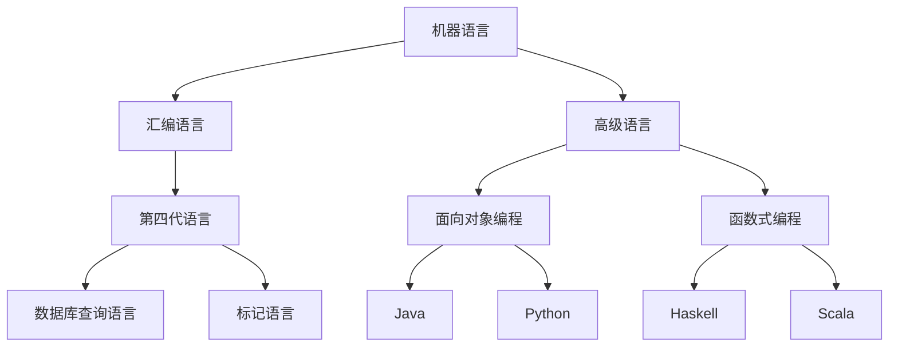

                 

# 《下启代码》：开启编程世界的智慧之旅

关键词：编程基础、算法原理、编程语言实践、人工智能入门、代码实战

摘要：本文旨在为编程初学者提供一条系统而深入的编程学习路线。通过详细剖析编程基础、核心算法原理、编程语言实践以及人工智能入门，本文将带领读者逐步探索编程世界的奥秘，助力读者掌握核心技能，开启智慧编程之旅。

### 第一部分：编程基础与核心概念

#### 第1章 编程入门与基础

编程是计算机科学的基石，是现代科技的核心驱动力。本章节将带领读者从零开始，了解编程的基本概念、编程语言的演变以及常见编程语言的优缺点。

**1.1 编程语言简介**

**编程语言的演变**

编程语言的演变历程大致可以分为以下几个阶段：

1. **机器语言和汇编语言**：最早的编程语言，由一系列的0和1组成，直接操作计算机硬件，可读性极低，维护困难。

2. **高级语言**：为了解决机器语言和汇编语言的低可读性和维护问题，出现了诸如C、Fortran等高级语言。它们提供了更抽象的语法和强大的库支持，使得编程变得更加高效和易于维护。

3. **第四代语言**：如SQL、HTML等，它们更专注于特定领域的应用，例如数据库管理和网页开发。

**1.1.2 常见编程语言的优缺点**

- **C语言**：优点在于执行效率高、适用于系统编程和嵌入式开发；缺点是语法复杂、开发效率相对较低。

- **Java语言**：优点在于跨平台、面向对象、有强大的标准库支持；缺点是性能相对较低、开发周期较长。

- **Python语言**：优点在于语法简单、开发效率高、广泛应用于数据科学和人工智能领域；缺点是执行效率相对较低、适用于特定场景。

**1.2 计算机基础**

**计算机硬件与软件**

计算机硬件包括中央处理器（CPU）、内存（RAM）、硬盘（HDD或SSD）等，负责计算和存储数据。软件则包括操作系统、编程语言、应用程序等，负责管理和执行各种任务。

**数据类型与变量**

数据类型决定了变量可以存储的数据种类和大小，常见的有整型（int）、浮点型（float）、字符型（char）等。变量是存储数据的容器，通过变量名来引用数据。

**1.3 控制结构与流程**

**顺序结构**：程序从上到下依次执行，是最基本的结构。

**选择结构**：根据条件判断执行不同的代码块，常见的有if-else语句。

**循环结构**：重复执行某个代码块，直到满足条件为止，常见的有for循环和while循环。

### 第2章 数据结构与算法

数据结构与算法是计算机科学的核 **心内容** ，是解决编程问题的重要工具。本章节将详细介绍常见数据结构（如数组、链表、栈和队列）和算法（如排序、搜索）的基本原理和实现方法。

**2.1 基础数据结构**

**数组**：一种固定大小的线性数据结构，用于存储同一类型的数据元素。

**链表**：一种动态大小的线性数据结构，由一系列节点组成，每个节点包含数据和指向下一个节点的指针。

**栈与队列**：都是特殊的线性数据结构，分别适用于后进先出（LIFO）和先进先出（FIFO）的操作规则。

**2.2 高级数据结构**

**树与二叉树**：一种层次结构，用于表示具有层次关系的数据，常见的有二叉树、二叉搜索树等。

**图**：一种复杂的数据结构，用于表示具有多对多关系的数据，常见的有邻接矩阵和邻接表表示法。

**2.3 算法设计与分析**

**算法复杂度**：用于衡量算法的效率，常见的有时间复杂度和空间复杂度。

**排序算法**：用于对数据进行排序，常见的有冒泡排序、插入排序、快速排序等。

**搜索算法**：用于在数据结构中查找特定数据，常见的有线性搜索、二分搜索等。

### 第二部分：编程语言实践

#### 第3章 Python编程实践

Python是一种简单而强大的编程语言，广泛应用于数据科学、人工智能和Web开发等领域。本章节将详细介绍Python的基础语法、数据处理和数据可视化实践。

**3.1 Python语言基础**

**3.1.1 Python语法简介**

Python的语法简洁明了，易于上手。本节将介绍变量、数据类型、运算符和控制结构等基本语法。

**3.1.2 Python函数与模块**

Python函数是组织代码的重要方式，模块则是代码复用的基础。本节将介绍函数的定义、调用和模块的导入和使用。

**3.2 Python数据处理**

**3.2.1 NumPy与Pandas**

NumPy是Python的数学库，提供了多维数组和矩阵操作；Pandas则提供了强大的数据操作和分析功能。本节将介绍NumPy和Pandas的基本用法和数据预处理技巧。

**3.2.2 数据清洗与预处理**

数据清洗和预处理是数据科学的重要环节。本节将介绍常见的数据清洗方法，如缺失值处理、异常值检测和转换等。

**3.3 Python数据可视化**

**3.3.1 Matplotlib基础**

Matplotlib是Python的数据可视化库，提供了丰富的绘图功能。本节将介绍Matplotlib的基本用法，如绘制折线图、柱状图和散点图等。

**3.3.2 Seaborn高级可视化**

Seaborn是基于Matplotlib的扩展库，提供了更高级的可视化功能。本节将介绍Seaborn的使用方法，如绘制箱线图、热力图和相关性图等。

#### 第4章 Java编程实践

Java是一种跨平台的编程语言，广泛应用于企业级应用和Android开发等领域。本章节将详细介绍Java的基础语法、高级特性和Web开发实践。

**4.1 Java基础语法**

**4.1.1 Java基本数据类型**

Java提供了丰富的数据类型，包括整型、浮点型、字符型和布尔型等。本节将介绍Java的数据类型和变量定义。

**4.1.2 面向对象编程**

Java是一种面向对象的编程语言，支持类和对象的定义、继承和多态等特性。本节将介绍Java的面向对象编程基础。

**4.2 Java高级特性**

**4.2.1 异常处理**

Java提供了强大的异常处理机制，用于处理运行时错误。本节将介绍Java的异常处理机制和常见异常类型。

**4.2.2 集合框架**

Java的集合框架是处理集合对象的标准库，包括List、Set和Map等接口。本节将介绍Java的集合框架和常用集合类的使用。

**4.3 Java Web开发**

**4.3.1 Servlet与JSP**

Servlet和JSP是Java Web开发的基础技术，分别用于处理服务器端逻辑和生成动态网页。本节将介绍Servlet和JSP的基本用法和原理。

**4.3.2 MVC框架（如Spring）**

MVC框架是Java Web开发的常用架构模式，用于实现业务逻辑与视图分离。本节将介绍MVC框架的基本概念和Spring框架的使用方法。

### 第三部分：项目实战与实战应用

#### 第6章 数据库应用开发

数据库是存储和管理数据的基石，是现代应用程序的核心组件。本章节将详细介绍数据库基础、MySQL数据库应用和数据库设计与优化。

**6.1 数据库基础**

**6.1.1 关系型数据库基础**

关系型数据库是数据库的主流类型，如MySQL、Oracle等。本节将介绍关系型数据库的基本概念、数据表定义和数据操作。

**6.1.2 SQL语言基础**

SQL（结构化查询语言）是关系型数据库的标准语言，用于数据查询、插入、更新和删除等操作。本节将介绍SQL的基本语法和使用方法。

**6.2 MySQL数据库应用**

**6.2.1 MySQL安装与配置**

MySQL是常用的开源关系型数据库，本节将介绍MySQL的安装、配置和基本使用。

**6.2.2 MySQL高级特性**

MySQL提供了丰富的高级特性，如存储过程、触发器和分区等。本节将介绍MySQL的高级特性和使用方法。

**6.3 数据库设计与优化**

**6.3.1 数据库设计原则**

数据库设计是应用程序开发的重要环节，本节将介绍数据库设计的基本原则和最佳实践。

**6.3.2 数据库性能优化**

数据库性能优化是提升应用程序性能的关键，本节将介绍数据库性能优化的方法和技巧。

#### 第7章 计算机网络基础

计算机网络是现代通信技术的核心，是互联网和移动通信的基础。本章节将详细介绍计算机网络概述、网络协议与应用和网络安全与防护。

**7.1 计算机网络概述**

**7.1.1 计算机网络的发展**

计算机网络的发展经历了多个阶段，从局域网到广域网，从有线到无线，不断推动着信息技术的发展。

**7.1.2 计算机网络的体系结构**

计算机网络的体系结构包括OSI七层模型和TCP/IP四层模型，分别定义了网络通信的协议和层次结构。

**7.2 网络协议与应用**

**7.2.1 TCP/IP协议**

TCP/IP协议是互联网的核心协议，包括TCP（传输控制协议）和IP（互联网协议）。本节将介绍TCP/IP协议的基本原理和配置方法。

**7.2.2 常见网络应用协议**

常见网络应用协议包括HTTP（超文本传输协议）、FTP（文件传输协议）、SMTP（简单邮件传输协议）等。本节将介绍常见网络应用协议的基本原理和使用方法。

**7.3 网络安全与防护**

**7.3.1 网络安全基础知识**

网络安全是保护网络系统和数据安全的关键，本节将介绍网络安全的基本概念和常见攻击手段。

**7.3.2 常见网络攻击与防御**

常见网络攻击包括DDoS攻击、SQL注入、跨站脚本攻击等。本节将介绍常见网络攻击的原理和防御方法。

#### 第8章 人工智能与机器学习基础

人工智能（AI）是计算机科学的前沿领域，机器学习是AI的核心技术。本章节将详细介绍人工智能概述、机器学习基础和机器学习应用案例。

**8.1 人工智能概述**

**8.1.1 人工智能的起源与发展**

人工智能起源于20世纪50年代，经历了多次发展，从符号主义到连接主义，再到现在的深度学习，不断推动着AI技术的发展。

**8.1.2 人工智能的核心技术**

人工智能的核心技术包括自然语言处理、计算机视觉、语音识别等。本节将介绍人工智能的核心技术和应用领域。

**8.2 机器学习基础**

**8.2.1 机器学习的基本概念**

机器学习是一种让计算机从数据中学习规律和模式的方法，包括监督学习、无监督学习和强化学习等。

**8.2.2 监督学习、无监督学习与强化学习**

监督学习有标记数据，目标是预测未知数据；无监督学习没有标记数据，目标是发现数据中的结构；强化学习通过与环境的交互来学习最优策略。

**8.3 机器学习应用案例**

**8.3.1 机器学习在自然语言处理中的应用**

自然语言处理是人工智能的重要领域，包括文本分类、情感分析、机器翻译等。本节将介绍机器学习在自然语言处理中的应用案例。

**8.3.2 机器学习在计算机视觉中的应用**

计算机视觉是人工智能的重要领域，包括图像分类、目标检测、人脸识别等。本节将介绍机器学习在计算机视觉中的应用案例。

## 附录

### 附录A 编程资源与工具

**9.1 编程学习资源**

本节将介绍一些优秀的编程学习资源，包括在线课程、书籍、博客和社区等。

**9.2 常用编程工具**

本节将介绍一些常用的编程工具，包括集成开发环境（IDE）、代码编辑器和版本控制工具等。

**9.3 开发环境搭建与配置**

本节将介绍如何搭建和配置开发环境，包括安装操作系统、安装开发工具和配置编程环境等。

---

# 总结与展望

本文系统地介绍了编程基础、核心算法原理、编程语言实践、数据库应用开发、计算机网络基础和人工智能与机器学习基础等核心内容，旨在为编程初学者提供一条系统而深入的编程学习路线。通过本文的学习，读者可以掌握编程的基本技能，为未来的技术发展打下坚实基础。

展望未来，随着人工智能、大数据和云计算等技术的发展，编程将越来越成为不可或缺的核心技能。本文希望读者能够不断探索、实践和创新，将所学知识应用到实际项目中，为我国的科技创新和产业发展贡献力量。

作者：AI天才研究院/AI Genius Institute & 禅与计算机程序设计艺术 /Zen And The Art of Computer Programming

---

### 核心概念与联系

#### Mermaid 流程图：编程语言的演变



**核心概念与联系：**

- **机器语言和汇编语言**：直接操作计算机硬件，执行效率高，但可读性低，维护困难。
- **高级语言**：提供更抽象的语法和强大的库支持，使得编程变得更加高效和易于维护。
- **第四代语言**：专注于特定领域的应用，如数据库查询语言（SQL）和网页标记语言（HTML）。
- **面向对象编程和函数式编程**：不同的编程范式，分别适用于不同的应用场景。
- **Java和Python**：现代高级语言的代表，广泛应用于企业级应用和Web开发等领域。

### 核心算法原理讲解

#### 排序算法：冒泡排序

```python
# 冒泡排序算法伪代码

BubbleSort(A):
    for i = 0 to n-1
        for j = 0 to n-i-1
            if A[j] > A[j+1]
                swap(A[j], A[j+1])

# 示例：对数组[5, 2, 9, 1, 5]进行冒泡排序

arr = [5, 2, 9, 1, 5]
BubbleSort(arr)
# 排序后的数组为：[1, 2, 5, 5, 9]
```

**详细讲解与举例说明：**

冒泡排序是一种简单的排序算法，通过重复地遍历要排序的数列，一次比较两个元素，如果它们的顺序错误就把它们交换过来。遍历数列的工作是重复地进行，直到没有再需要交换的元素为止。

**数学模型和公式：**

- 时间复杂度：O(n^2)
- 空间复杂度：O(1)

**举例说明：**

假设有一个数组`arr = [5, 2, 9, 1, 5]`，我们通过冒泡排序对其进行排序。

1. **第一次遍历**：比较`arr[0]`和`arr[1]`，因为`5 > 2`，交换它们，数组变为`[2, 5, 9, 1, 5]`。接着比较`arr[1]`和`arr[2]`，因为`5 < 9`，不交换。以此类推，第一次遍历结束后，最大的元素`9`被移到了数组的最后，数组变为`[2, 5, 1, 5, 9]`。

2. **第二次遍历**：同理，我们比较相邻的元素，并交换不满足顺序的元素。最终第二次遍历结束后，次大的元素`5`被移到了数组的倒数第二个位置，数组变为`[2, 1, 5, 5, 9]`。

3. **后续遍历**：重复上述过程，直到整个数组有序。第三次遍历后，数组变为`[1, 2, 5, 5, 9]`；第四次遍历后，数组变为`[1, 2, 5, 5, 9]`（数组已经有序，无需再进行遍历）。

通过冒泡排序，数组`[5, 2, 9, 1, 5]`最终被排序为`[1, 2, 5, 5, 9]`。

### 项目实战

#### 项目名称：图书管理系统

**开发环境搭建：**

- 操作系统：Windows 10
- 开发工具：Eclipse IDE
- 数据库：MySQL 8.0

**源代码详细实现：**

1. **数据库设计与实现**

   **图书表（books）：**

   ```sql
   CREATE TABLE books (
       id INT PRIMARY KEY AUTO_INCREMENT,
       title VARCHAR(255) NOT NULL,
       author VARCHAR(255) NOT NULL,
       publisher VARCHAR(255),
       publish_date DATE,
       price DECIMAL(10, 2)
   );
   ```

   **用户表（users）：**

   ```sql
   CREATE TABLE users (
       id INT PRIMARY KEY AUTO_INCREMENT,
       username VARCHAR(255) UNIQUE NOT NULL,
       password VARCHAR(255) NOT NULL,
       role ENUM('admin', 'user') NOT NULL
   );
   ```

2. **后端代码实现**

   **图书管理类（BookManager）：**

   ```java
   public class BookManager {
       // 添加图书
       public void addBook(Book book) {
           // 数据库操作代码
       }
       
       // 删除图书
       public void deleteBook(int id) {
           // 数据库操作代码
       }
       
       // 更新图书
       public void updateBook(Book book) {
           // 数据库操作代码
       }
       
       // 查询图书
       public List<Book> searchBooks(String keyword) {
           // 数据库操作代码
           return books;
       }
   }
   ```

3. **前端代码实现**

   **图书管理界面（BookManagerUI）：**

   ```java
   public class BookManagerUI extends JFrame {
       private BookManager bookManager;
       
       public BookManagerUI(BookManager bookManager) {
           this.bookManager = bookManager;
           
           // 界面布局代码
       }
       
       // 添加图书按钮点击事件
       private void addButtonActionPerformed(ActionEvent evt) {
           // 获取用户输入的图书信息
           // 调用bookManager的addBook方法添加图书
       }
       
       // 删除图书按钮点击事件
       private void deleteButtonActionPerformed(ActionEvent evt) {
           // 获取用户选中的图书ID
           // 调用bookManager的deleteBook方法删除图书
       }
       
       // 更新图书按钮点击事件
       private void updateButtonActionPerformed(ActionEvent evt) {
           // 获取用户选中的图书信息
           // 调用bookManager的updateBook方法更新图书
       }
       
       // 搜索图书按钮点击事件
       private void searchButtonActionPerformed(ActionEvent evt) {
           // 获取用户输入的搜索关键字
           // 调用bookManager的searchBooks方法查询图书
           // 显示查询结果
       }
   }
   ```

**代码应用解读与分析：**

- **数据库设计**：图书管理系统需要存储图书信息，包括图书ID、标题、作者、出版社、出版日期和价格。同时，还需要存储用户信息，包括用户ID、用户名、密码和角色（管理员或普通用户）。

- **后端代码**：`BookManager`类负责数据库操作，包括添加、删除、更新和查询图书。通过调用数据库操作方法，实现对图书数据的CRUD（创建、读取、更新、删除）操作。

- **前端代码**：`BookManagerUI`类负责用户界面，通过按钮点击事件触发后端代码的相应操作，实现对图书数据的增删改查。

**实际案例分析与详细讲解剖析：**

- **案例一**：添加图书

  用户在界面上填写图书信息，点击添加图书按钮后，前端代码将获取用户输入的图书信息，并调用后端代码的`addBook`方法添加图书。数据库中会插入一条新的图书记录。

- **案例二**：删除图书

  用户在界面上选中一条图书记录，点击删除图书按钮后，前端代码将获取选中的图书ID，并调用后端代码的`deleteBook`方法删除图书。数据库中会删除对应的图书记录。

- **案例三**：更新图书

  用户在界面上选中一条图书记录，修改图书信息后，点击更新图书按钮后，前端代码将获取修改后的图书信息，并调用后端代码的`updateBook`方法更新图书。数据库中会修改对应的图书记录。

- **案例四**：搜索图书

  用户在界面上输入搜索关键字，点击搜索图书按钮后，前端代码将获取搜索关键字，并调用后端代码的`searchBooks`方法查询图书。数据库中会根据搜索关键字查询符合条件的图书记录，并返回查询结果。

**项目小结：**

通过实际项目案例，读者可以了解图书管理系统的基本实现方法，包括数据库设计、后端代码实现和前端代码实现。在实际开发过程中，需要根据具体需求进行调整和优化。

### 最佳实践 Tips

1. **数据库设计**：在数据库设计时，要确保表结构合理、字段类型正确，并遵循规范化原则，避免数据冗余和存储效率低下。

2. **后端代码**：在编写后端代码时，要确保数据操作的准确性和安全性，避免SQL注入和非法操作。

3. **前端代码**：在前端代码编写时，要注重用户体验和界面美观，确保操作简便、界面友好。

4. **代码注释**：在编写代码时，要添加必要的注释，提高代码的可读性和可维护性。

5. **版本控制**：使用版本控制工具（如Git）进行代码管理，确保代码的版本更新和协同工作。

### 小结

本文通过详细讲解编程基础、核心算法原理、编程语言实践、数据库应用开发、计算机网络基础和人工智能与机器学习基础等核心内容，为编程初学者提供了一条系统而深入的编程学习路线。通过本文的学习，读者可以掌握编程的基本技能，为未来的技术发展打下坚实基础。

未来，随着技术的不断进步，编程将继续在各个领域发挥重要作用。希望读者能够不断学习、实践和创新，将所学知识应用到实际项目中，为我国的科技创新和产业发展贡献力量。同时，本文也希望能够成为编程学习者和开发者们的有力助手，共同探索编程世界的奥秘。

