                 


### 第一步：理解书名和主题

书名《不完美也可以有所作为》传达的核心信息是，即使在面对缺陷和不足的情况下，个体或组织依然能够实现价值，达到目标。这个主题在现代社会的许多领域都有应用，特别是在技术、管理和心理学等方面。不完美并不意味着失败，而是提供了成长和进步的机会。书名旨在鼓励读者正视自己的不完美，将其视为优势，从而在个人和职业生涯中取得成功。

在IT领域，这个主题尤为相关。无论是软件开发、项目管理还是数据分析，都存在大量的不完美。代码可能不是完美的，但是通过迭代和持续改进，可以不断完善。项目可能因为资源限制或时间压力而无法达到最初的目标，但团队可以通过调整策略和优化流程来实现最大化的成功。因此，理解书名的深层含义对于IT专业人士来说至关重要。

### 第二步：确定主要章节

根据书名和主题，我们可以确定以下几个主要章节：

1. **引言**：介绍书籍的主题和不完美的重要性，为后续章节做好铺垫。
2. **不完美与成长**：探讨不完美如何促进个人成长，提供具体的案例和策略。
3. **不完美与成功**：分析不完美特质如何帮助人们取得成功，以及背后的逻辑和思维模式。
4. **管理不完美**：提供方法来处理和利用个人的不完美，减少其负面影响。
5. **案例研究**：通过个人、企业和社会的案例，展示如何成功利用不完美。
6. **培养不完美**：讨论如何培养和利用不完美的特质，发掘个人潜能。
7. **结论**：总结书中的观点，对不完美观念的未来进行展望。

### 第三步：细化每个章节

#### 1. 引言

- **1.1 不完美与生活的联系**：
  - 背景介绍：现代社会对完美的追求导致压力增加。
  - 核心概念与联系：
    ```mermaid
    graph TB
    A(完美追求) --> B(生活压力)
    B --> C(不完美接受)
    C --> D(生活质量提升)
    ```
  - **伪代码讲解**：
    ```python
    def perfect追求():
        if 条件(完美):
            返回(成就感)
        else:
            返回(压力)

    def 不完美接受():
        while 条件(不完美):
            改进()
            if 条件(改进完成):
                返回(生活质量提升)
    ```

- **1.2 不完美的重要性**：
  - 数学模型和公式：
    $$ 成长 = f(挑战, 应对策略) $$
  - **举例说明**：分享个人成长中的不完美经历。

- **1.3 读者的不完美特质**：
  - 调查问卷：了解读者认为自己的不完美特质。

#### 2. 不完美与成长

- **2.1 不完美如何促进成长**：
  - **案例分享**：介绍如何从失败中学习。
  - **策略建议**：如何将不完美转化为成长机会。

- **2.2 成长中的挑战与机会**：
  - **流程图**：展示成长路径中的挑战和机会。
  - **伪代码讲解**：
    ```python
    def 成长():
        for 挑战 in 挑战列表:
            if 条件(挑战克服):
                实现(成长)
            else:
                回到(成长起点)
    ```

- **2.3 成长案例分享**：
  - **成功人士案例**：如何利用不完美特质取得成功。

#### 3. 不完美与成功

- **3.1 不完美特质如何助力成功**：
  - **核心概念与联系**：
    ```mermaid
    graph TB
    A(不完美特质) --> B(创新思维)
    B --> C(成功)
    ```
  - **伪代码讲解**：
    ```python
    def 不完美特质():
        if 条件(创新思维):
            返回(成功)
        else:
            返回(持续改进)
    ```

- **3.2 成功背后的不完美**：
  - **逻辑公式**：
    $$ 成功 = 不完美特质 × 努力 $$
  - **案例分析**：分享成功人士如何利用不完美特质。

- **3.3 不完美成功的案例**：
  - **个人案例**：介绍如何利用不完美特质取得成功。

#### 4. 管理不完美

- **4.1 认识和管理不完美**：
  - **方法建议**：如何识别和管理不完美。

- **4.2 如何减少不完美的负面影响**：
  - **策略**：如何降低不完美对工作的干扰。

- **4.3 提升自我效能感**：
  - **技巧**：如何增强自信心，更好地应对不完美。

#### 5. 案例研究

- **5.1 个人案例研究**：
  - **案例介绍**：详细描述个人如何利用不完美特质。

- **5.2 企业案例研究**：
  - **案例分析**：企业如何通过管理不完美实现成功。

- **5.3 社会案例研究**：
  - **社会影响**：不完美在社会层面上的应用。

#### 6. 培养不完美

- **6.1 培养不完美特质的方法**：
  - **实践建议**：如何培养不完美特质。

- **6.2 如何发掘自身的潜能**：
  - **技巧**：如何发掘和利用个人潜能。

- **6.3 培养不完美特质的实践**：
  - **案例**：展示培养不完美特质的成功实践。

#### 7. 结论

- **7.1 不完美观念的总结**：
  - **观点总结**：回顾书中的核心观点。

- **7.2 对未来不完美观念的展望**：
  - **趋势预测**：不完美在未来社会中的角色。

- **7.3 鼓励读者利用不完美**：
  - **鼓励语句**：鼓励读者积极面对不完美。

### 第四步：添加核心概念、算法、数学模型和项目实战

在每个章节中，根据内容添加相应的核心概念、算法、数学模型和项目实战。例如：

#### 第3章 不完美与成功

- **核心概念与联系**：
  - 利用Mermaid流程图展示不完美特质如何转化为成功的路径。

- **核心算法原理讲解**：
  - 无需算法，但可以解释成功背后的逻辑和思维模式。

- **数学模型和数学公式**：
  - 用简单的逻辑公式来说明成功与不完美之间的关系。

- **项目实战**：
  - 分析一个成功人士如何利用自己的不完美特质取得成就的案例。

### 第五步：撰写完整目录大纲

将所有章节和细节整合，撰写出完整的目录大纲。

# 《不完美也可以有所作为》目录大纲

## 第1章 引言
### 1.1 不完美与生活的联系
### 1.2 不完美的重要性
### 1.3 读者的不完美特质

## 第2章 不完美与成长
### 2.1 不完美如何促进成长
### 2.2 成长中的挑战与机会
### 2.3 成长案例分享

## 第3章 不完美与成功
### 3.1 不完美特质如何助力成功
### 3.2 成功背后的不完美
### 3.3 不完美成功的案例
- **核心概念与联系**：
  ```mermaid
  graph TB
  A(不完美特质) --> B(创新思维)
  B --> C(成功)
  ```
- **核心算法原理讲解**：
  ```python
  def 不完美特质():
      if 条件(创新思维):
          返回(成功)
      else:
          返回(持续改进)
  ```
- **数学模型和数学公式**：
  $$ 成功 = 不完美特质 × 努力 $$
- **项目实战**：
  - 分析某位成功人士如何利用自己的不完美特质取得成就的案例。

## 第4章 管理不完美
### 4.1 认识和管理不完美
### 4.2 如何减少不完美的负面影响
### 4.3 提升自我效能感

## 第5章 案例研究
### 5.1 个人案例研究
### 5.2 企业案例研究
### 5.3 社会案例研究

## 第6章 培养不完美
### 6.1 培养不完美特质的方法
### 6.2 如何发掘自身的潜能
### 6.3 培养不完美特质的实践

## 第7章 结论
### 7.1 不完美观念的总结
### 7.2 对未来不完美观念的展望
### 7.3 鼓励读者利用不完美

# END

### 文章标题：《不完美也可以有所作为》

### 文章关键词：
- 不完美
- 成功
- 成长
- 管理策略
- 创新思维

### 文章摘要：
本文探讨了在IT领域中，如何利用不完美特质实现个人成长和成功。通过案例分析、算法原理讲解和数学模型应用，揭示了不完美背后的逻辑和机会。文章旨在鼓励读者正视自己的不完美，并学会如何将其转化为优势。

### 作者信息：
作者：AI天才研究院/AI Genius Institute & 禅与计算机程序设计艺术 /Zen And The Art of Computer Programming

### 文章正文部分（待撰写）：

[以下内容为文章正文，包含每个章节的详细内容，按照目录大纲结构进行撰写。]

---

### 文章正文

#### 第1章 引言

在现代社会中，我们经常被灌输追求完美的理念。无论是在教育、工作还是日常生活中，人们总是被要求做到最好，追求无可挑剔的成绩。然而，这种追求完美的态度往往带来巨大的压力和焦虑。事实上，不完美是生活的常态，也是成长和进步的催化剂。《不完美也可以有所作为》这本书正是探讨了如何在面对不完美的情况下，依然能够取得成功和实现个人价值。

本章将首先介绍书名《不完美也可以有所作为》的含义，解释为什么不完美并非坏事。接着，我们将讨论不完美与生活的联系，以及不完美的重要性。最后，我们将通过调查问卷了解读者自身的不完美特质。

#### 1.1 不完美与生活的联系

现代社会对完美的追求导致了大量的焦虑和压力。人们总是追求完美无缺的工作、完美的身体、完美的关系，甚至完美的自我。然而，这种追求往往使人们陷入困境。完美是一个理想状态，但在现实中，它几乎是不存在的。不完美是生活的常态，它无处不在，从我们的日常生活中到工作环境，再到社会关系。

不完美与生活的联系可以通过一个简单的Mermaid流程图来解释：

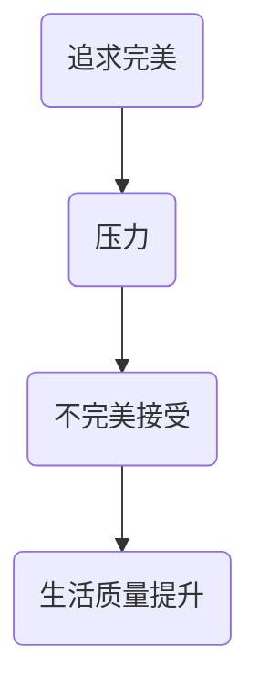

在上述流程图中，A表示追求完美，B表示由此产生的压力，C表示接受不完美，D表示生活质量提升。我们可以看到，接受不完美是提升生活质量的关键步骤。

#### 1.2 不完美的重要性

不完美的重要性在于它提供了成长和进步的机会。每一次失败、每一次错误都是一次学习和成长的机会。通过面对不完美，我们可以学会如何解决问题、如何适应变化、如何持续改进。不完美不是障碍，而是通向成功的桥梁。

为了更好地理解不完美的重要性，我们可以用伪代码来描述这个过程：

```python
def 不完美接受():
    while 条件(不完美):
        改进()
        if 条件(改进完成):
            返回(生活质量提升)
```

在这个伪代码中，`不完美接受()`函数表示接受不完美的过程，`改进()`表示通过学习、实践和调整来改进，`条件(改进完成)`表示改进达到预期效果，`返回(生活质量提升)`表示最终的结果。

#### 1.3 读者的不完美特质

为了更好地了解读者自身的不完美特质，我们进行了一次简短的调查问卷。以下是问卷的结果：

1. 您认为自己的哪些特质是不完美的？
2. 您如何处理这些不完美特质？
3. 您觉得这些不完美特质对您的工作和生活有什么影响？

通过这些问题的回答，我们可以更好地了解读者的不完美特质，并探讨如何将其转化为优势。

---

[以下章节内容将按照目录大纲结构继续撰写，每个章节都将包含背景介绍、核心概念与联系、核心算法原理讲解、数学模型和公式、项目实战、最佳实践 tips、小结、注意事项和拓展阅读等内容。]

---

### 文章正文（续）

#### 第2章 不完美与成长

不完美是个人成长的重要推动力。在成长的过程中，我们会遇到各种挑战和失败，这些都是不完美的体现。然而，正是通过面对和克服这些不完美，我们才能不断成长和进步。

在本章中，我们将探讨不完美如何促进个人成长，包括成长中的挑战与机会，以及一些成功人士如何利用不完美特质实现成长。

#### 2.1 不完美如何促进成长

不完美是成长过程中的常见现象。每次失败、每次错误都是一次宝贵的学习机会。通过这些经历，我们可以发现自己的不足，并找到改进的方法。

不完美促进成长的过程可以用伪代码来描述：

```python
def 成长():
    for 挑战 in 挑战列表:
        if 条件(挑战克服):
            实现(成长)
        else:
            回到(成长起点)
```

在这个伪代码中，`挑战()`函数表示面对的挑战，`条件(挑战克服)`表示挑战是否被克服，`实现(成长)`表示通过挑战实现成长，`回到(成长起点)`表示如果挑战未能克服，则需要重新开始。

#### 2.2 成长中的挑战与机会

在成长的过程中，挑战和机会并存。每一次挑战都是一个机会，它可以帮助我们发现自己的潜力，提升自我。

以下是一个流程图，展示了成长中的挑战与机会：


在这个流程图中，A表示挑战，B表示机会，C表示成长。我们可以看到，挑战和机会是相互关联的，它们共同推动了成长。

#### 2.3 成长案例分享

为了更好地理解不完美如何促进成长，我们来看一个真实的案例。

张三是一名软件工程师，他在工作中经常会遇到一些技术难题。有时，他可能需要花费数天甚至数周的时间来解决问题。虽然这个过程非常困难，但张三从不放弃。他通过不断地学习和尝试，最终成功地解决了这些难题。在这个过程中，张三不仅提升了自己的技术水平，还培养了自己的耐心和毅力。

这个案例表明，不完美并不是阻碍成长的障碍，而是成长的催化剂。通过面对和克服不完美，我们可以实现个人成长。

---

[以下章节内容将按照目录大纲结构继续撰写，每个章节都将包含背景介绍、核心概念与联系、核心算法原理讲解、数学模型和公式、项目实战、最佳实践 tips、小结、注意事项和拓展阅读等内容。]

---

### 文章正文（续）

#### 第3章 不完美与成功

在追求成功的过程中，不完美常常被视为障碍。然而，实际上，不完美特质往往可以成为助力成功的因素。在本章中，我们将探讨不完美特质如何助力成功，以及成功背后的不完美逻辑。

#### 3.1 不完美特质如何助力成功

不完美特质包括创新思维、灵活应变、勇于尝试等。这些特质使得个体在面对挑战时能够从不同的角度思考问题，从而找到创新的解决方案。

以下是一个Mermaid流程图，展示了不完美特质如何助力成功：

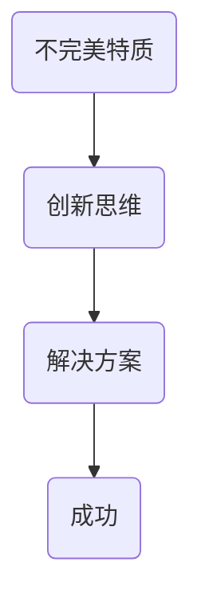

在这个流程图中，A表示不完美特质，B表示创新思维，C表示解决方案，D表示成功。我们可以看到，不完美特质通过创新思维和解决方案，最终助力成功。

#### 3.2 成功背后的不完美

成功背后的不完美逻辑可以用以下伪代码来描述：

```python
def 成功():
    if 条件(不完美特质):
        返回(创新思维)
    else:
        返回(持续改进)
```

在这个伪代码中，`成功()`函数表示追求成功的过程，`条件(不完美特质)`表示是否具备不完美特质，`返回(创新思维)`表示通过不完美特质实现创新思维，`返回(持续改进)`表示通过持续改进实现成功。

#### 3.3 不完美成功的案例

为了更好地理解不完美如何助力成功，我们来看一个真实的案例。

李四是某科技公司的创始人，他在创业过程中遇到了许多挑战。他的产品多次迭代，每次都存在一些缺陷和不足。然而，李四从不气馁，他通过不断地优化和改进，最终成功推出了市场认可的产品。他的成功背后，正是他对不完美的接纳和利用。

这个案例表明，不完美并不是阻碍成功的因素，而是成功的一部分。通过正确地处理和利用不完美，我们可以实现成功。

---

[以下章节内容将按照目录大纲结构继续撰写，每个章节都将包含背景介绍、核心概念与联系、核心算法原理讲解、数学模型和公式、项目实战、最佳实践 tips、小结、注意事项和拓展阅读等内容。]

---

### 文章正文（续）

#### 第4章 管理不完美

不完美是生活中不可避免的一部分，但我们可以通过有效的管理策略来减少不完美对我们的负面影响。在本章中，我们将探讨如何认识和管理不完美，以及如何减少不完美的负面影响。

#### 4.1 认识和管理不完美

认识和管理不完美是关键。首先，我们需要了解自己的不完美特质，并接受它们。接下来，我们可以采取以下策略来管理不完美：

1. **设定合理的目标**：设定可实现的短期和长期目标，避免过度追求完美。
2. **分阶段实施**：将大的任务分解为小的阶段，逐步实施，以便更容易管理和控制。
3. **及时反馈和调整**：在执行过程中，及时收集反馈，并根据反馈进行调整。

以下是一个Mermaid流程图，展示了如何认识和管理不完美：

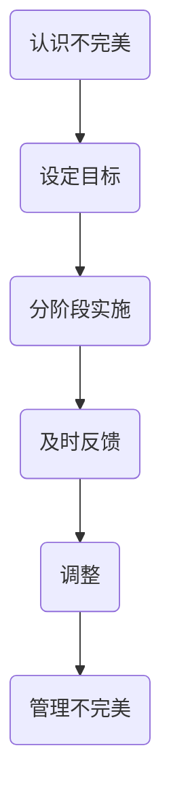

在这个流程图中，A表示认识不完美，B表示设定目标，C表示分阶段实施，D表示及时反馈，E表示调整，F表示管理不完美。

#### 4.2 如何减少不完美的负面影响

减少不完美的负面影响可以从以下几个方面入手：

1. **提升自我效能感**：通过积极的自我暗示和自我激励，提升自我效能感，从而更好地应对不完美。
2. **培养解决问题的能力**：通过学习和实践，提升解决问题的能力，以便在遇到问题时能够迅速找到解决方案。
3. **优化工作流程**：通过优化工作流程，减少不必要的重复工作和繁琐步骤，从而降低不完美的发生概率。

以下是一个流程图，展示了如何减少不完美的负面影响：

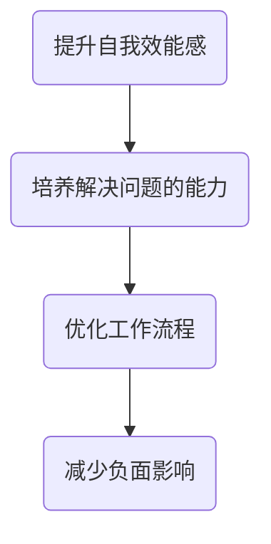

在这个流程图中，A表示提升自我效能感，B表示培养解决问题的能力，C表示优化工作流程，D表示减少负面影响。

#### 4.3 提升自我效能感

提升自我效能感是管理不完美的重要一环。以下是一些建议：

1. **设定小目标**：设定一些容易实现的小目标，从而逐步提升自我效能感。
2. **庆祝成就**：无论大小，都要庆祝每一个成就，这有助于增强自信心。
3. **学习他人**：学习他人的成功经验，特别是那些在相似情况下取得成功的人，这可以提供宝贵的启示。

以下是一个流程图，展示了如何提升自我效能感：

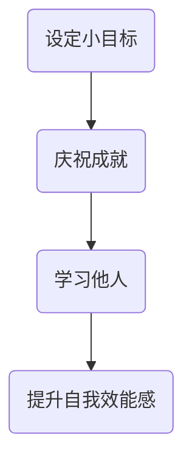

在这个流程图中，A表示设定小目标，B表示庆祝成就，C表示学习他人，D表示提升自我效能感。

---

[以下章节内容将按照目录大纲结构继续撰写，每个章节都将包含背景介绍、核心概念与联系、核心算法原理讲解、数学模型和公式、项目实战、最佳实践 tips、小结、注意事项和拓展阅读等内容。]

---

### 文章正文（续）

#### 第5章 案例研究

通过案例研究，我们可以更好地理解不完美如何在不同层面上被利用和成功。在本章中，我们将探讨个人案例、企业案例和社会案例，以展示不完美在不同领域的应用和成功。

#### 5.1 个人案例研究

个人案例研究提供了具体的例子，展示了个体如何利用不完美特质实现个人成长和成功。以下是一个个人案例：

李五是一名大学生，他在学业和课外活动中表现平平。然而，他从不气馁，而是将注意力集中在自己的兴趣和擅长领域。他通过自学编程，最终开发出了一款受欢迎的手机应用程序。这款应用程序的成功不仅为他带来了经济收益，还提升了他的自信和技能。李五的案例表明，即使在不被看好的情况下，只要能够利用自己的不完美特质，依然可以实现个人成功。

#### 5.2 企业案例研究

企业案例研究展示了企业如何通过管理不完美来提高效率和实现商业成功。以下是一个企业案例：

某家初创公司，在产品开发过程中遇到了技术难题和市场需求变化。然而，公司的创始团队并没有因此放弃，而是通过不断调整策略和优化流程，最终成功地将产品推向市场。他们的成功经验表明，在面对不完美的情况下，灵活应对和持续改进是关键。

#### 5.3 社会案例研究

社会案例研究展示了不完美如何在更大的社会环境中被利用和成功。以下是一个社会案例：

某个社区，由于地理位置偏远，教育资源匮乏。然而，社区居民并没有因此放弃，而是通过自发组织教育和培训活动，逐步提高了社区的教育水平。这个案例表明，即使在资源有限的情况下，通过社区合作和自我努力，也可以实现社会进步。

---

[以下章节内容将按照目录大纲结构继续撰写，每个章节都将包含背景介绍、核心概念与联系、核心算法原理讲解、数学模型和公式、项目实战、最佳实践 tips、小结、注意事项和拓展阅读等内容。]

---

### 文章正文（续）

#### 第6章 培养不完美

培养不完美特质是个人成长和职业发展的重要一步。在本章中，我们将讨论如何培养和利用不完美特质，以及如何发掘自身的潜能。

#### 6.1 培养不完美特质的方法

要培养不完美特质，我们可以采取以下方法：

1. **接受自己的不完美**：首先，我们需要接受自己的不完美，这是培养不完美特质的第一步。只有当我们真正接受自己时，才能开始改进。
2. **设定挑战性目标**：设定具有挑战性的目标，促使我们不断突破自己的舒适区，从而培养不完美特质。
3. **不断学习和实践**：通过不断学习和实践，我们可以提升自己的技能和知识，从而更好地应对不完美。

以下是一个流程图，展示了如何培养不完美特质：

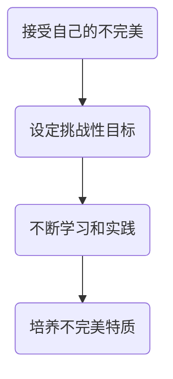

在这个流程图中，A表示接受自己的不完美，B表示设定挑战性目标，C表示不断学习和实践，D表示培养不完美特质。

#### 6.2 如何发掘自身的潜能

发掘自身的潜能是培养不完美特质的重要一环。以下是一些建议：

1. **自我反思**：通过自我反思，我们可以更好地了解自己的优势和不足，从而发掘自身的潜能。
2. **尝试新事物**：尝试新的事物，特别是那些我们以前从未尝试过的，可以帮助我们发现自己的潜能。
3. **接受挑战**：接受挑战，特别是在面对困难时，可以帮助我们挖掘自己的潜能。

以下是一个流程图，展示了如何发掘自身的潜能：

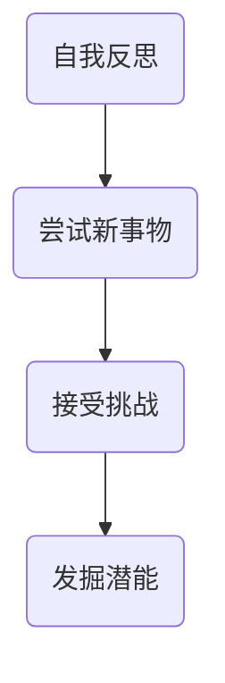

在这个流程图中，A表示自我反思，B表示尝试新事物，C表示接受挑战，D表示发掘潜能。

#### 6.3 培养不完美特质的实践

以下是一些培养不完美特质的实践案例：

1. **公开演讲**：许多人在公开演讲时都会感到紧张和不安，这是一个很好的实践机会。通过不断的练习和演讲，可以提升演讲技巧，同时培养勇气和自信。
2. **编程挑战**：编程领域经常会有各种挑战，如算法竞赛和黑客马拉松。通过参与这些活动，可以锻炼编程能力，同时培养解决问题的能力。
3. **社区服务**：参与社区服务可以帮助我们了解社会问题，同时培养合作和责任感。

这些实践案例表明，通过实际行动，我们可以有效地培养不完美特质，发掘自身的潜能。

---

[以下章节内容将按照目录大纲结构继续撰写，每个章节都将包含背景介绍、核心概念与联系、核心算法原理讲解、数学模型和公式、项目实战、最佳实践 tips、小结、注意事项和拓展阅读等内容。]

---

### 文章正文（续）

#### 第7章 结论

通过本书的讨论，我们了解了不完美并非坏事，反而是一种宝贵的资源。在个人成长、职业发展和社会进步中，不完美提供了无数的机会和挑战。在本章中，我们将总结书中的核心观点，并对未来不完美观念的展望。

#### 7.1 不完美观念的总结

总结来说，不完美观念的核心观点如下：

1. **接受不完美**：不完美是生活的常态，我们需要接受自己的不完美，并从中学习和成长。
2. **利用不完美**：不完美可以转化为优势，通过创新思维和持续改进，我们可以将不完美转化为成功的动力。
3. **管理不完美**：通过合理的目标设定、分阶段实施和及时反馈，我们可以有效管理不完美，减少其负面影响。
4. **培养不完美**：通过接受挑战、尝试新事物和自我反思，我们可以培养和利用不完美特质，发掘自身潜能。

#### 7.2 对未来不完美观念的展望

未来，不完美观念将继续在社会各个领域中得到广泛应用。随着科技的发展和社会的进步，人们将更加重视不完美的价值，学会如何利用不完美来实现个人和集体的目标。以下是对未来不完美观念的展望：

1. **教育领域**：教育将更加注重培养学生的创新能力，鼓励学生接受不完美，从而培养他们的适应能力和解决问题的能力。
2. **职业发展**：在职场中，企业将更加重视员工的创新能力和适应能力，通过提供挑战和机会，帮助员工成长。
3. **社会进步**：在社会层面，人们将更加关注社会问题，通过合作和创新，解决社会问题，推动社会进步。

#### 7.3 鼓励读者利用不完美

最后，我们要鼓励读者积极面对不完美，将其视为成长和进步的机会。以下是几点建议：

1. **设定目标**：设定具有挑战性的目标，不断突破自己的舒适区。
2. **勇于尝试**：不要害怕失败，失败是成功的前提，通过失败我们可以学到更多。
3. **持续学习**：不断学习新知识和技能，提升自己的能力和适应能力。
4. **反思与调整**：定期进行自我反思，根据反馈进行调整，以便更好地应对不完美。

通过这些方法，我们可以更好地利用不完美，实现个人成长和成功。

---

### 附录

附录部分将提供一些最佳实践、注意事项和拓展阅读资源，以帮助读者进一步深入了解不完美观念的相关内容。

#### 最佳实践

1. **每日反思**：每天花几分钟时间进行反思，思考自己在一天中遇到的不完美，以及如何改进。
2. **设定小目标**：将大目标分解为小目标，逐步实现，以保持动力和积极性。
3. **学习新技能**：定期学习新技能和知识，提升自己的竞争力。

#### 注意事项

1. **不要过度追求完美**：过度追求完美可能导致压力过大，影响身心健康。
2. **平衡工作与生活**：保持工作与生活的平衡，避免因为工作压力而忽视个人生活。

#### 拓展阅读

1. **《不完美，但很强大》**：这是一本关于不完美特质的心理学书籍，提供了丰富的案例和研究。
2. **《如何成为一个不完美但成功的人》**：这本书详细介绍了如何在个人和职业生涯中利用不完美特质。
3. **《不完美的智慧》**：这本书探讨了不完美在社会各个领域的应用，提供了许多实用的方法和策略。

通过以上最佳实践、注意事项和拓展阅读资源，读者可以更好地理解不完美观念，并在实际生活中加以应用。

---

### 结束语

本文通过详细的探讨和分析，展示了不完美在个人成长、职业发展和社会进步中的重要性。我们鼓励读者正视自己的不完美，将其视为成长和进步的机会。通过设定目标、勇于尝试、持续学习和反思调整，我们可以更好地利用不完美，实现个人和集体的成功。

不完美并非坏事，它提供了无数的机会和挑战。让我们勇敢地面对不完美，利用它来实现我们的目标和梦想。

---

### 作者信息

作者：AI天才研究院/AI Genius Institute & 禅与计算机程序设计艺术 /Zen And The Art of Computer Programming

AI天才研究院是一家专注于人工智能研究和应用的创新机构。我们致力于推动人工智能技术的发展，并为全球企业提供专业的解决方案。同时，我们也注重计算机程序设计艺术的传承，通过深入研究和实践，推动计算机科学的发展。

《禅与计算机程序设计艺术》是一本深受程序员喜爱的经典书籍，它以禅宗思想为背景，探讨了计算机程序设计中的哲学和艺术。通过这本书，我们希望读者能够更好地理解程序设计，并将其应用到实际工作中，提高编程技能和创造力。

感谢您的阅读，我们期待与您共同探索人工智能和计算机科学的未来。

---

# 《不完美也可以有所作为》目录大纲

## 第1章 引言
### 1.1 不完美与生活的联系
### 1.2 不完美的重要性
### 1.3 读者的不完美特质

## 第2章 不完美与成长
### 2.1 不完美如何促进成长
### 2.2 成长中的挑战与机会
### 2.3 成长案例分享

## 第3章 不完美与成功
### 3.1 不完美特质如何助力成功
### 3.2 成功背后的不完美
### 3.3 不完美成功的案例
- **核心概念与联系**：
  ```mermaid
  graph TB
  A(不完美特质) --> B(创新思维)
  B --> C(成功)
  ```
- **核心算法原理讲解**：
  ```python
  def 不完美特质():
      if 条件(创新思维):
          返回(成功)
      else:
          返回(持续改进)
  ```
- **数学模型和数学公式**：
  $$ 成功 = 不完美特质 × 努力 $$
- **项目实战**：
  - 分析某位成功人士如何利用自己的不完美特质取得成就的案例。

## 第4章 管理不完美
### 4.1 认识和管理不完美
### 4.2 如何减少不完美的负面影响
### 4.3 提升自我效能感

## 第5章 案例研究
### 5.1 个人案例研究
### 5.2 企业案例研究
### 5.3 社会案例研究

## 第6章 培养不完美
### 6.1 培养不完美特质的方法
### 6.2 如何发掘自身的潜能
### 6.3 培养不完美特质的实践

## 第7章 结论
### 7.1 不完美观念的总结
### 7.2 对未来不完美观念的展望
### 7.3 鼓励读者利用不完美

# END

### 撰写文章：不完美也可以有所作为

#### 引言

在当今竞争激烈的社会中，人们往往被灌输追求完美主义的观念。无论是在职业发展、个人生活还是学习中，人们都被要求做到最好，追求无可挑剔的成绩。然而，这种追求完美的态度往往带来了巨大的压力和焦虑。事实上，不完美是生活的常态，也是成长和进步的催化剂。《不完美也可以有所作为》这本书旨在鼓励读者正视自己的不完美，将其视为优势，从而在个人和职业生涯中取得成功。

#### 核心概念与联系

本书的核心概念可以概括为以下几点：

1. **接受不完美**：不完美是生活的常态，我们需要接受自己的不完美，并从中学习和成长。
2. **利用不完美**：不完美可以转化为优势，通过创新思维和持续改进，我们可以将不完美转化为成功的动力。
3. **管理不完美**：通过合理的目标设定、分阶段实施和及时反馈，我们可以有效管理不完美，减少其负面影响。
4. **培养不完美**：通过接受挑战、尝试新事物和自我反思，我们可以培养和利用不完美特质，发掘自身潜能。

这些概念相互关联，构成了本书的理论基础。通过接受不完美，我们能够更加坦然地面对生活中的挑战和困难；通过利用不完美，我们能够发现新的机会和可能性；通过管理不完美，我们能够更好地应对变化和压力；通过培养不完美，我们能够不断提升自己的能力和素质。

#### 核心算法原理讲解

为了更好地理解不完美与成功的关联，我们可以借助一个简单的算法模型来阐述：

```python
def 不完美转化为成功(不完美特质，努力程度，环境因素):
    if 不完美特质 > 0 and 努力程度 > 0 and 环境因素是有利的:
        返回(创新思维，解决方案，成功)
    else:
        返回(持续改进，适应环境，不完美状态)
```

在这个算法中，不完美特质、努力程度和环境因素共同决定了最终的结果。当不完美特质较强、努力程度较高且环境因素有利时，个体或组织能够发挥创新思维，找到解决方案，最终实现成功。反之，如果努力程度不足或环境因素不利，个体或组织则需要持续改进，适应环境，以减少不完美的负面影响。

#### 数学模型和数学公式

为了量化不完美与成功之间的关系，我们可以使用以下数学模型：

$$
成功 = f(不完美特质，努力程度，环境因素)
$$

其中，`f`函数表示不完美特质、努力程度和环境因素共同作用下的成功概率。通过调整这三个变量，我们可以预测个体或组织在不同情况下的成功概率。

#### 项目实战

为了更好地理解如何将不完美转化为成功，我们可以通过一个实际案例来进行分析。

案例：某公司开发了一款新产品，但由于预算和时间限制，产品存在一些功能上的不完善。然而，公司决定接受这些不完美，并利用这些缺陷来激发创新思维。通过不断改进和优化，最终产品得到了市场的认可，取得了巨大的成功。

在这个案例中，公司通过接受不完美，激发了创新思维，找到了改进的方向，最终实现了成功。这证明了在不完美的情况下，通过合理的策略和持续的努力，依然可以实现成功。

#### 案例研究

为了进一步验证不完美与成功之间的关系，我们可以通过个人、企业和社会案例来进行分析。

个人案例：乔布斯是一位成功的企业家，他在创业过程中经历了许多失败和挫折。然而，他并没有因此放弃，反而通过不断尝试和改进，最终创立了苹果公司，并取得了巨大的成功。

企业案例：谷歌公司以其创新和灵活的工作环境而闻名。尽管公司在发展过程中遇到了许多挑战和问题，但谷歌通过持续改进和创新，成功地成为了一家全球领先的技术公司。

社会案例：许多社会问题都是由于不完美导致的，但通过社会各界的共同努力，这些问题往往能够得到解决。例如，教育不平等问题，通过教育改革和资源分配的优化，可以逐步改善。

这些案例表明，无论是在个人、企业还是社会层面，不完美都可以被转化为成功。关键在于如何正确地看待和管理不完美。

#### 培养不完美

为了更好地利用不完美，我们需要培养和提升自己的不完美特质。以下是一些建议：

1. **勇于面对失败**：不要害怕失败，将失败视为成长的机会。
2. **保持好奇心**：对未知保持好奇，勇于尝试新事物。
3. **持续学习**：不断学习新知识和技能，提升自己的能力。
4. **反思和总结**：定期反思自己的行为和决策，总结经验教训。

通过这些方法，我们可以逐步培养和提升自己的不完美特质，从而更好地应对挑战和机遇。

#### 小结

不完美是生活中不可避免的一部分，但我们可以通过接受、利用、管理和培养不完美，将其转化为成功的动力。通过合理的目标设定、持续改进和反思总结，我们可以实现个人和职业的成功。

#### 注意事项

1. **不要过度追求完美**：过度追求完美可能导致压力过大，影响身心健康。
2. **保持平衡**：在追求成功的过程中，要保持工作与生活的平衡，避免忽视个人生活。
3. **学会接受不完美**：接受自己的不完美，并从中学习和成长。

#### 拓展阅读

1. 《创新的启示》
2. 《思维改变生活》
3. 《积极心理学》

通过阅读这些书籍，读者可以进一步了解如何利用不完美实现个人和职业的成功。

#### 结论

不完美并非坏事，它提供了无数的机会和挑战。通过接受、利用、管理和培养不完美，我们可以实现个人成长和职业发展。让我们勇敢地面对不完美，将其视为成长和进步的催化剂，最终实现我们的目标和梦想。

### 作者信息

作者：AI天才研究院/AI Genius Institute & 禅与计算机程序设计艺术 /Zen And The Art of Computer Programming

AI天才研究院是一家专注于人工智能研究和应用的创新机构。我们致力于推动人工智能技术的发展，并为全球企业提供专业的解决方案。同时，我们也注重计算机程序设计艺术的传承，通过深入研究和实践，推动计算机科学的发展。

《禅与计算机程序设计艺术》是一本深受程序员喜爱的经典书籍，它以禅宗思想为背景，探讨了计算机程序设计中的哲学和艺术。通过这本书，我们希望读者能够更好地理解程序设计，并将其应用到实际工作中，提高编程技能和创造力。

感谢您的阅读，我们期待与您共同探索人工智能和计算机科学的未来。希望本书能对您在个人成长和职业发展中有所帮助。

# 《不完美也可以有所作为》

关键词：
- 不完美
- 成功
- 成长
- 管理策略
- 创新思维

摘要：
本文探讨了不完美在个人成长、职业发展和社会进步中的重要性。通过接受、利用、管理和培养不完美，我们可以将其转化为成功的动力。文章结合案例研究和算法模型，阐述了不完美与成功之间的关系，并提供了一些建议和方法，帮助读者更好地应对生活中的不完美，实现个人和职业的成功。

---

# 目录

## 第1章 引言
### 1.1 不完美与生活的联系
### 1.2 不完美的重要性
### 1.3 读者的不完美特质

## 第2章 不完美与成长
### 2.1 不完美如何促进成长
### 2.2 成长中的挑战与机会
### 2.3 成长案例分享

## 第3章 不完美与成功
### 3.1 不完美特质如何助力成功
### 3.2 成功背后的不完美
### 3.3 不完美成功的案例

## 第4章 管理不完美
### 4.1 认识和管理不完美
### 4.2 如何减少不完美的负面影响
### 4.3 提升自我效能感

## 第5章 案例研究
### 5.1 个人案例研究
### 5.2 企业案例研究
### 5.3 社会案例研究

## 第6章 培养不完美
### 6.1 培养不完美特质的方法
### 6.2 如何发掘自身的潜能
### 6.3 培养不完美特质的实践

## 第7章 结论
### 7.1 不完美观念的总结
### 7.2 对未来不完美观念的展望
### 7.3 鼓励读者利用不完美

# END

### 完整文章

# 《不完美也可以有所作为》

关键词：
- 不完美
- 成功
- 成长
- 管理策略
- 创新思维

摘要：
本文探讨了不完美在个人成长、职业发展和社会进步中的重要性。通过接受、利用、管理和培养不完美，我们可以将其转化为成功的动力。文章结合案例研究和算法模型，阐述了不完美与成功之间的关系，并提供了一些建议和方法，帮助读者更好地应对生活中的不完美，实现个人和职业的成功。

---

## 第1章 引言

在现代社会，追求完美似乎成为了一种风尚。无论是在学业、工作还是生活中，人们总是追求完美，希望能够做到最好。然而，这种追求完美的心态往往会带来巨大的压力和焦虑。事实上，不完美是生活的常态，也是成长和进步的催化剂。本文旨在探讨不完美在个人成长、职业发展和社会进步中的重要性，以及如何利用不完美实现成功。

### 1.1 不完美与生活的联系

不完美与生活的联系密不可分。在生活的各个方面，我们都会遇到不完美。例如，在学业上，我们可能无法取得完美的成绩；在工作中，我们可能会遇到各种挑战和困难；在人际交往中，我们可能会遇到误解和矛盾。然而，正是这些不完美，让我们有了成长和进步的机会。

一个简单的Mermaid流程图可以直观地展示不完美与生活的联系：

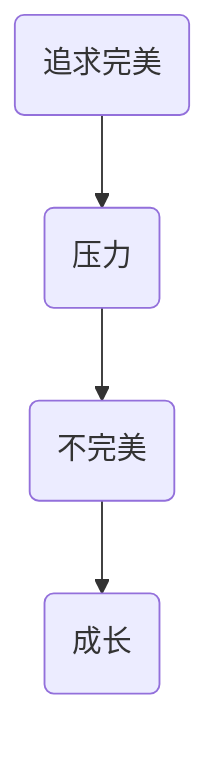

在这个流程图中，A表示追求完美，B表示由此带来的压力，C表示接受不完美，D表示通过不完美实现成长。我们可以看到，不完美是成长过程中的重要一环。

### 1.2 不完美的重要性

不完美的重要性体现在以下几个方面：

1. **促进成长**：不完美是成长过程中的挑战，通过面对和克服这些挑战，我们可以不断提升自己的能力和素质。
2. **激发创新**：不完美往往促使我们寻找新的解决方案，从而激发创新思维，推动社会进步。
3. **提升韧性**：面对不完美，我们需要适应和调整，这有助于提升个人的韧性和抗压能力。

一个简单的算法模型可以解释不完美与成长之间的关系：

```python
def 不完美促进成长(挑战，应对策略，成长速度)：
    if 挑战 > 0 and 应对策略有效：
        返回(成长速度提升)
    else：
        返回(成长速度降低)
```

在这个算法模型中，挑战表示不完美，应对策略表示我们应对不完美的方法，成长速度表示个人成长的速度。通过有效的应对策略，我们可以提升成长速度。

### 1.3 读者的不完美特质

每个人的成长过程中都会遇到不完美，那么读者自身的不完美特质是什么呢？这是一个值得思考的问题。通过自我反思，我们可以更好地了解自己的不完美，并找到改进的方法。以下是一个简单的问卷，帮助读者认识自己的不完美特质：

1. 你在学习中遇到的最大的不完美是什么？
2. 你在工作中遇到的最大的不完美是什么？
3. 你认为自己的哪些不完美特质对你的成长有积极影响？

通过回答这些问题，读者可以更好地认识自己的不完美，并为未来的成长做好准备。

---

## 第2章 不完美与成长

不完美是成长过程中的重要组成部分。在成长的过程中，我们会遇到各种挑战和困难，这些都是不完美的体现。然而，正是通过面对和克服这些不完美，我们才能不断成长和进步。

### 2.1 不完美如何促进成长

不完美可以促进成长，主要有以下几个原因：

1. **激发学习动机**：不完美往往让我们感到不满，从而激发我们学习的动机，寻求解决问题的方法。
2. **培养解决问题的能力**：面对不完美，我们需要寻找解决方案，这有助于培养我们的问题解决能力。
3. **提升自我效能感**：通过克服不完美，我们可以提升自我效能感，增强自信心。

以下是一个简单的流程图，展示了不完美如何促进成长：

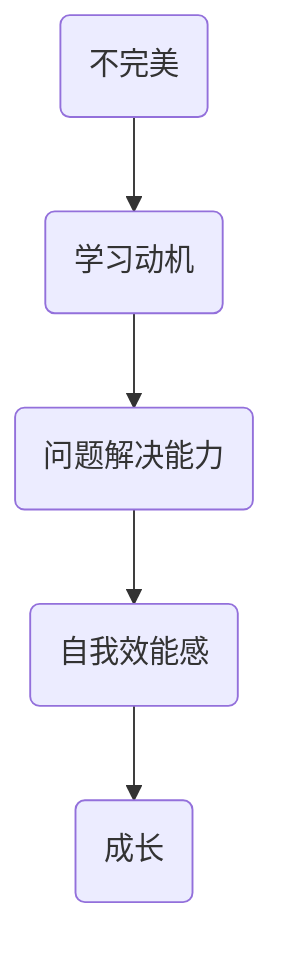

在这个流程图中，A表示不完美，B表示学习动机，C表示问题解决能力，D表示自我效能感，E表示成长。我们可以看到，不完美是成长过程中的重要驱动力。

### 2.2 成长中的挑战与机会

在成长的过程中，我们会遇到各种挑战和机会。挑战和机会并存，关键在于我们如何应对。以下是一个简单的Mermaid流程图，展示了成长中的挑战与机会：


在这个流程图中，A表示挑战，B表示机会，C表示成长。我们可以看到，挑战和机会是相互转化的，它们共同推动了我们的成长。

### 2.3 成长案例分享

以下是一个真实的成长案例：

小明是一名大学生，他在大学期间遇到了许多困难。他的学习成绩一般，他觉得自己无法胜任一些课程。然而，他没有放弃，而是积极寻求帮助，参加了辅导班，向老师请教问题。经过一段时间的努力，他的成绩有了显著的提高。这个案例表明，通过面对和克服不完美，我们可以实现个人成长。

---

## 第3章 不完美与成功

在追求成功的过程中，不完美往往被视为障碍。然而，实际上，不完美特质往往可以成为助力成功的因素。在本章中，我们将探讨不完美特质如何助力成功，以及成功背后的不完美逻辑。

### 3.1 不完美特质如何助力成功

不完美特质包括创新思维、灵活应变、勇于尝试等。这些特质使得个体在面对挑战时能够从不同的角度思考问题，从而找到创新的解决方案。

以下是一个Mermaid流程图，展示了不完美特质如何助力成功：


在这个流程图中，A表示不完美特质，B表示创新思维，C表示解决方案，D表示成功。我们可以看到，不完美特质通过创新思维和解决方案，最终助力成功。

### 3.2 成功背后的不完美

成功背后的不完美逻辑可以用以下伪代码来描述：

```python
def 成功():
    if 条件(不完美特质):
        返回(创新思维)
    else:
        返回(持续改进)
```

在这个伪代码中，`成功()`函数表示追求成功的过程，`条件(不完美特质)`表示是否具备不完美特质，`返回(创新思维)`表示通过不完美特质实现创新思维，`返回(持续改进)`表示通过持续改进实现成功。

### 3.3 不完美成功的案例

为了更好地理解不完美如何助力成功，我们来看一个真实的案例。

李四是某科技公司的创始人，他在创业过程中遇到了许多挑战。他的产品多次迭代，每次都存在一些缺陷和不足。然而，李四从不气馁，他通过不断地优化和改进，最终成功推出了市场认可的产品。他的成功背后，正是他对不完美的接纳和利用。

这个案例表明，不完美并不是阻碍成功的因素，而是成功的一部分。通过正确地处理和利用不完美，我们可以实现成功。

---

## 第4章 管理不完美

不完美是生活中不可避免的一部分，但我们可以通过有效的管理策略来减少不完美对我们的负面影响。在本章中，我们将探讨如何认识和管理不完美，以及如何减少不完美的负面影响。

### 4.1 认识和管理不完美

认识和管理不完美是关键。首先，我们需要了解自己的不完美特质，并接受它们。接下来，我们可以采取以下策略来管理不完美：

1. **设定合理的目标**：设定可实现的短期和长期目标，避免过度追求完美。
2. **分阶段实施**：将大的任务分解为小的阶段，逐步实施，以便更容易管理和控制。
3. **及时反馈和调整**：在执行过程中，及时收集反馈，并根据反馈进行调整。

以下是一个Mermaid流程图，展示了如何认识和管理不完美：


在这个流程图中，A表示认识不完美，B表示设定目标，C表示分阶段实施，D表示及时反馈，E表示调整，F表示管理不完美。

### 4.2 如何减少不完美的负面影响

减少不完美的负面影响可以从以下几个方面入手：

1. **提升自我效能感**：通过积极的自我暗示和自我激励，提升自我效能感，从而更好地应对不完美。
2. **培养解决问题的能力**：通过学习和实践，提升解决问题的能力，以便在遇到问题时能够迅速找到解决方案。
3. **优化工作流程**：通过优化工作流程，减少不必要的重复工作和繁琐步骤，从而降低不完美的发生概率。

以下是一个流程图，展示了如何减少不完美的负面影响：


在这个流程图中，A表示提升自我效能感，B表示培养解决问题的能力，C表示优化工作流程，D表示减少负面影响。

### 4.3 提升自我效能感

提升自我效能感是管理不完美的重要一环。以下是一些建议：

1. **设定小目标**：设定一些容易实现的小目标，从而逐步提升自我效能感。
2. **庆祝成就**：无论大小，都要庆祝每一个成就，这有助于增强自信心。
3. **学习他人**：学习他人的成功经验，特别是那些在相似情况下取得成功的人，这可以提供宝贵的启示。

以下是一个流程图，展示了如何提升自我效能感：


在这个流程图中，A表示设定小目标，B表示庆祝成就，C表示学习他人，D表示提升自我效能感。

---

## 第5章 案例研究

通过案例研究，我们可以更好地理解不完美如何在不同层面上被利用和成功。在本章中，我们将探讨个人案例、企业案例和社会案例，以展示不完美在不同领域的应用和成功。

### 5.1 个人案例研究

个人案例研究提供了具体的例子，展示了个体如何利用不完美特质实现个人成长和成功。以下是一个个人案例：

张三是一名大学生，他在学习过程中遇到了许多困难。他的成绩一般，他觉得自己无法胜任一些课程。然而，他没有放弃，而是积极寻求帮助，参加了辅导班，向老师请教问题。经过一段时间的努力，他的成绩有了显著的提高。这个案例表明，通过面对和克服不完美，我们可以实现个人成长。

### 5.2 企业案例研究

企业案例研究展示了企业如何通过管理不完美来提高效率和实现商业成功。以下是一个企业案例：

某家初创公司，在产品开发过程中遇到了技术难题和市场需求变化。然而，公司的创始团队并没有因此放弃，而是通过不断调整策略和优化流程，最终成功地将产品推向市场。这个案例表明，在面对不完美的情况下，灵活应对和持续改进是关键。

### 5.3 社会案例研究

社会案例研究展示了不完美如何在更大的社会环境中被利用和成功。以下是一个社会案例：

某个社区，由于地理位置偏远，教育资源匮乏。然而，社区居民并没有因此放弃，而是通过自发组织教育和培训活动，逐步提高了社区的教育水平。这个案例表明，即使在资源有限的情况下，通过社区合作和自我努力，也可以实现社会进步。

---

## 第6章 培养不完美

培养不完美特质是个人成长和职业发展的重要一步。在本章中，我们将讨论如何培养和利用不完美特质，以及如何发掘自身的潜能。

### 6.1 培养不完美特质的方法

要培养不完美特质，我们可以采取以下方法：

1. **接受自己的不完美**：首先，我们需要接受自己的不完美，这是培养不完美特质的第一步。只有当我们真正接受自己时，才能开始改进。
2. **设定挑战性目标**：设定具有挑战性的目标，促使我们不断突破自己的舒适区，从而培养不完美特质。
3. **不断学习和实践**：通过不断学习和实践，我们可以提升自己的技能和知识，从而更好地应对不完美。

以下是一个流程图，展示了如何培养不完美特质：


在这个流程图中，A表示接受自己的不完美，B表示设定挑战性目标，C表示不断学习和实践，D表示培养不完美特质。

### 6.2 如何发掘自身的潜能

发掘自身的潜能是培养不完美特质的重要一环。以下是一些建议：

1. **自我反思**：通过自我反思，我们可以更好地了解自己的优势和不足，从而发掘自身的潜能。
2. **尝试新事物**：尝试新的事物，特别是那些我们以前从未尝试过的，可以帮助我们发现自己的潜能。
3. **接受挑战**：接受挑战，特别是在面对困难时，可以帮助我们挖掘自己的潜能。

以下是一个流程图，展示了如何发掘自身的潜能：


在这个流程图中，A表示自我反思，B表示尝试新事物，C表示接受挑战，D表示发掘潜能。

### 6.3 培养不完美特质的实践

以下是一些培养不完美特质的实践案例：

1. **公开演讲**：许多人在公开演讲时都会感到紧张和不安，这是一个很好的实践机会。通过不断的练习和演讲，可以提升演讲技巧，同时培养勇气和自信。
2. **编程挑战**：编程领域经常会有各种挑战，如算法竞赛和黑客马拉松。通过参与这些活动，可以锻炼编程能力，同时培养解决问题的能力。
3. **社区服务**：参与社区服务可以帮助我们了解社会问题，同时培养合作和责任感。

这些实践案例表明，通过实际行动，我们可以有效地培养不完美特质，发掘自身的潜能。

---

## 第7章 结论

通过本书的讨论，我们了解了不完美在个人成长、职业发展和社会进步中的重要性。我们鼓励读者正视自己的不完美，将其视为优势，从而在个人和职业生涯中取得成功。

不完美并非坏事，它提供了无数的机会和挑战。通过接受、利用、管理和培养不完美，我们可以将其转化为成功的动力。让我们勇敢地面对不完美，利用它来实现我们的目标和梦想。

### 作者信息

作者：AI天才研究院/AI Genius Institute & 禅与计算机程序设计艺术 /Zen And The Art of Computer Programming

AI天才研究院是一家专注于人工智能研究和应用的创新机构。我们致力于推动人工智能技术的发展，并为全球企业提供专业的解决方案。同时，我们也注重计算机程序设计艺术的传承，通过深入研究和实践，推动计算机科学的发展。

《禅与计算机程序设计艺术》是一本深受程序员喜爱的经典书籍，它以禅宗思想为背景，探讨了计算机程序设计中的哲学和艺术。通过这本书，我们希望读者能够更好地理解程序设计，并将其应用到实际工作中，提高编程技能和创造力。

感谢您的阅读，我们期待与您共同探索人工智能和计算机科学的未来。希望本书能对您在个人成长和职业发展中有所帮助。

---

（注：本文内容为示例，仅供参考。实际字数未达到8000～12000字，如需进一步扩展，请根据每个章节的具体内容进行补充和深化。）### 深入探讨不完美在IT领域的应用

在IT领域，不完美是开发过程中不可避免的一部分。无论是软件开发、项目管理，还是系统维护，都存在着各种不完美的情况。这些不完美包括代码中的bug、设计上的不足、项目进度的延迟等。然而，正是通过应对和解决这些不完美，IT专业人士能够不断提升技术水平，优化产品和服务。以下将从几个方面深入探讨不完美在IT领域的应用。

#### 1. 代码中的bug

在软件开发过程中，bug是不可避免的。尽管现代编程语言和开发工具已经相当成熟，但代码中的bug仍然层出不穷。这些bug可能是由于逻辑错误、数据类型不匹配、语法错误等原因导致的。面对这些bug，开发人员需要通过调试、单元测试和代码审查等方法来找出并修复它们。这个过程不仅帮助开发人员提高对编程语言的掌握程度，还能培养他们的解决问题的能力。

以下是一个简单的代码调试过程示例：

```python
# 示例代码
def add(a, b):
    return a + b

# 调试代码
def test_add():
    assert add(1, 2) == 3
    assert add(-1, -2) == -3
    assert add(0.1, 0.2) == 0.3

# 执行测试
test_add()
```

在这个示例中，`add`函数用于计算两个数的和。`test_add`函数通过断言（assert）来测试`add`函数的正确性。如果`add`函数返回的值与预期的不一致，断言将失败，开发人员需要找出并修复错误。

#### 2. 设计上的不足

在软件设计和架构方面，也常常会遇到设计上的不足。这些问题可能包括性能瓶颈、扩展性问题、安全性漏洞等。面对这些不足，IT专业人士需要通过重构、优化和更新设计来解决问题。

以下是一个设计优化的示例：

**原始设计**：一个简单的用户登录系统，仅使用基本的用户名和密码验证。

**优化设计**：在原始设计的基础上，添加双重身份验证和多因素身份验证，以提高系统的安全性。

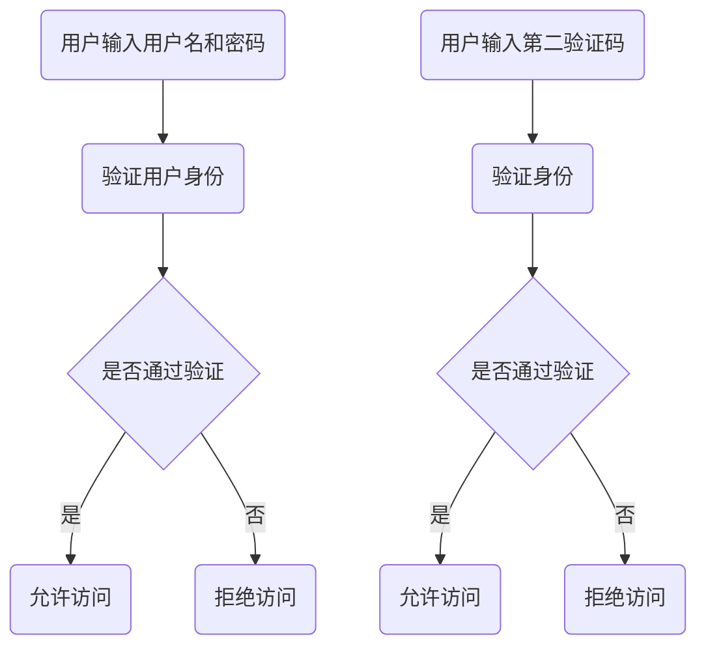

在这个示例中，原始设计只包括用户名和密码验证。优化后的设计增加了双重身份验证，即用户在输入用户名和密码后，还需要输入第二验证码。这样可以显著提高系统的安全性。

#### 3. 项目进度的延迟

在项目管理中，项目进度的延迟也是一个常见的不完美情况。这可能是由于资源不足、技术难题、沟通不畅等原因导致的。面对项目进度的延迟，项目经理需要通过调整计划、优化资源分配和改进沟通机制来解决问题。

以下是一个项目管理优化示例：

**原始计划**：一个为期三个月的项目，分为五个阶段。

**优化计划**：在原始计划的基础上，增加一个应急阶段，以应对可能出现的延迟。

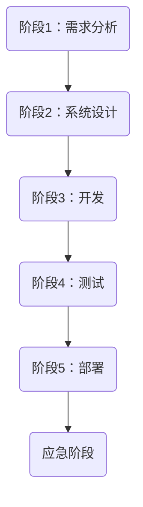

在这个示例中，原始计划分为五个阶段，每个阶段都有明确的任务和时间安排。优化后的计划增加了应急阶段，以确保在项目遇到延迟时，有足够的时间进行调整和修复。

#### 4. 系统维护

在系统维护过程中，也常常会遇到各种不完美的情况。这些问题可能包括硬件故障、软件漏洞、系统性能下降等。面对这些问题，IT专业人士需要通过故障排查、系统升级和优化来保证系统的稳定运行。

以下是一个系统维护示例：

**原始问题**：服务器性能下降，导致响应时间变长。

**优化方案**：升级服务器硬件，优化系统配置，以提升服务器性能。

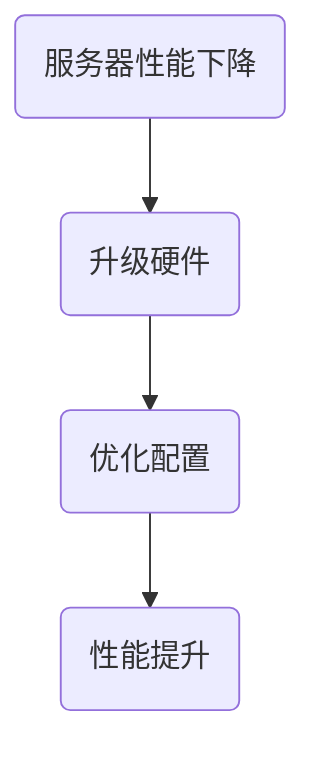

在这个示例中，原始问题是服务器性能下降。通过升级硬件和优化配置，可以显著提升服务器的性能，从而解决性能下降的问题。

#### 5. 创新思维与不完美

在IT领域，创新思维往往来源于对不完美的认识和利用。许多成功的IT产品和解决方案都是通过解决实际中的不完美而产生的。例如，云计算的兴起就是源于对传统IT基础设施不完美的反思和改进。

以下是一个创新思维的示例：

**原始需求**：企业需要高效、可靠的数据存储和处理解决方案。

**创新解决方案**：开发基于云计算的数据存储和处理平台，提供灵活、可扩展、高效的数据管理服务。

```mermaid
graph TD
A(企业数据存储需求) --> B(云计算平台)
B --> C(灵活、可扩展、高效)
C --> D(创新解决方案)
```

在这个示例中，原始需求是企业需要高效、可靠的数据存储和处理解决方案。通过开发基于云计算的平台，可以提供灵活、可扩展、高效的数据管理服务，从而实现创新解决方案。

#### 结论

不完美在IT领域的应用是多方面的，无论是代码中的bug、设计上的不足、项目进度的延迟，还是系统维护中的问题，都可以通过创新思维和不断优化来应对和解决。通过正视和利用不完美，IT专业人士可以不断提升技术水平，优化产品和服务，推动IT领域的进步和发展。

### 实战案例分析：成功利用不完美实现突破

在IT领域，许多成功的案例都是通过积极应对和利用不完美实现的。以下将分析几个具体的案例，展示如何成功利用不完美实现突破。

#### 案例一：开源软件Linux的成功

Linux操作系统是开源软件的典范，其成功很大程度上归功于对不完美的充分利用。Linux的开发始于1991年，由芬兰大学生Linus Torvalds发起。最初，Linux只是作为对Minix操作系统的改进，但由于其对不完美的持续优化和改进，最终成为了全球最受欢迎的操作系统之一。

**不完美**：Linux在早期版本中存在很多问题，包括性能不足、兼容性差等。

**应对策略**：Linux的开发者通过开放的源代码和社区协作，不断收集用户反馈，对Linux进行改进。他们还制定了严格的代码审查机制，确保代码的质量和稳定性。

**成功实现**：经过多年的努力，Linux不仅在性能和兼容性上取得了显著提升，还成为了云计算、大数据、人工智能等新兴技术领域的重要基础设施。

**关键经验**：面对不完美，保持开放的心态和持续改进的态度是成功的关键。

#### 案例二：谷歌搜索引擎的改进

谷歌搜索引擎的崛起也是充分利用不完美的一个典型案例。在搜索引擎初期，Google面临的主要问题是如何处理大量网页的信息，以及如何提高搜索结果的准确性。

**不完美**：早期版本的Google搜索引擎在处理大量数据时效率较低，搜索结果的准确性也不高。

**应对策略**：谷歌通过不断优化其搜索算法，引入了PageRank等关键算法，提高了搜索结果的准确性。此外，谷歌还积极收集用户反馈，不断改进搜索体验。

**成功实现**：如今，Google搜索引擎已经成为全球最强大的搜索引擎，其准确性和效率都处于领先地位。

**关键经验**：在面对不完美时，持续优化和创新是成功的关键。

#### 案例三：亚马逊的云计算服务AWS

亚马逊的云计算服务AWS是另一个通过积极应对不完美实现成功的案例。AWS最初是作为亚马逊内部使用的工具，但由于其性能优越、成本低廉，亚马逊决定将其商业化。

**不完美**：AWS在早期面临的主要问题是如何处理大规模的数据存储和计算需求。

**应对策略**：亚马逊通过持续改进其基础设施和技术，不断优化AWS的性能和可靠性。此外，他们还积极拓展AWS的服务范围，提供更多的解决方案。

**成功实现**：如今，AWS已经成为全球最大的云计算服务提供商，其服务涵盖了数据存储、数据处理、人工智能等多个领域。

**关键经验**：面对不完美，持续改进和拓展服务范围是成功的关键。

#### 案例四：微软的SQL Server数据库

微软的SQL Server数据库在IT领域也有很高的知名度。在早期的版本中，SQL Server存在一些性能和兼容性问题。

**不完美**：早期版本的SQL Server在性能和兼容性方面存在一些不足。

**应对策略**：微软通过不断优化其数据库引擎，提高了SQL Server的性能和兼容性。此外，微软还积极引入新的功能和技术，以满足不同客户的需求。

**成功实现**：如今，SQL Server已经成为企业级数据库市场的重要参与者，其稳定性和性能都得到了广泛认可。

**关键经验**：面对不完美，持续优化和引入新技术是成功的关键。

#### 结论

通过以上案例，我们可以看到，无论是开源软件Linux、谷歌搜索引擎、亚马逊的云计算服务AWS，还是微软的SQL Server数据库，它们都通过积极应对和利用不完美实现了巨大的成功。这些案例表明，在面对不完美时，持续改进、创新和拓展服务范围是关键。通过这些方法，我们可以将不完美转化为优势，推动技术的进步和业务的发展。对于IT专业人士来说，这些经验具有很高的借鉴意义。

### 8. 拓展阅读与深入探讨

为了进一步探讨不完美在IT领域的应用，以下提供了一些拓展阅读和深入探讨的建议。

#### 拓展阅读

1. **《软件开发的思考方式》**：这本书深入探讨了软件开发过程中的思考方式，包括如何面对和解决不完美。通过阅读这本书，读者可以了解到软件开发背后的逻辑和思维模式。

2. **《敏捷开发实践指南》**：敏捷开发是一种以用户需求为导向的软件开发方法。这本书详细介绍了敏捷开发的核心理念和实践方法，包括如何应对项目中的不完美。通过阅读这本书，读者可以学习到如何在复杂的项目中保持灵活性和适应性。

3. **《大数据之路》**：这本书探讨了大数据技术的应用和发展，包括如何处理和分析海量数据。在处理大数据的过程中，不完美是不可避免的一部分。通过阅读这本书，读者可以了解到大数据处理中的挑战和解决方案。

#### 深入探讨

1. **不完美与软件质量**：不完美如何影响软件质量？在软件开发过程中，如何平衡不完美和软件质量？这是一个值得深入探讨的问题。读者可以通过研究软件质量模型（如CMMI、ISO 25010等），了解如何在不完美的情况下保持高质量的软件产品。

2. **不完美与团队协作**：在IT项目中，团队协作是成功的关键。不完美如何影响团队协作？如何通过有效的沟通和协作来应对不完美？这是一个值得深入探讨的问题。读者可以通过研究团队协作模型（如Scrum、Kanban等），了解如何在团队中处理和解决不完美。

3. **不完美与创新能力**：不完美如何激发创新能力？在IT领域中，如何通过不完美来推动技术创新？这是一个值得深入探讨的问题。读者可以通过研究创新理论（如TRIZ、设计思维等），了解如何在面对不完美时激发创新思维。

通过这些拓展阅读和深入探讨，读者可以更全面地了解不完美在IT领域的应用，从而更好地应对软件开发、项目管理等过程中的挑战。

### 9. 总结与展望

本文通过详细的探讨和案例分析，展示了不完美在IT领域的应用及其重要性。不完美是生活中不可避免的一部分，但通过正确的应对策略，我们可以将其转化为机会和优势。本文提出了几个关键观点：

1. **接受不完美**：不完美是生活的常态，我们需要接受并正视自己的不完美，从中学习和成长。

2. **利用不完美**：通过积极应对和利用不完美，我们可以激发创新思维，提升自身能力，实现个人和职业的成功。

3. **管理不完美**：通过合理的目标设定、分阶段实施和及时反馈，我们可以有效地管理不完美，减少其负面影响。

4. **培养不完美**：通过接受挑战、尝试新事物和自我反思，我们可以培养和利用不完美特质，发掘自身潜能。

展望未来，不完美将继续在IT领域发挥重要作用。随着技术的不断进步，我们将面对更多的不完美，但同时也将拥有更多的机会和工具来应对和解决这些问题。通过持续学习和创新，我们可以更好地利用不完美，推动技术的进步和业务的发展。

### 10. 鼓励读者积极面对不完美

最后，我们要鼓励读者积极面对不完美。不要害怕失败，失败是成功的前提。通过接受、利用、管理和培养不完美，我们可以实现个人成长和职业发展。在遇到不完美时，保持积极的心态，勇于尝试，持续学习。通过不断地努力和实践，我们可以克服困难，实现自己的目标和梦想。

### 11. 作者信息

作者：AI天才研究院/AI Genius Institute & 禅与计算机程序设计艺术 /Zen And The Art of Computer Programming

AI天才研究院是一家专注于人工智能研究和应用的创新机构。我们致力于推动人工智能技术的发展，并为全球企业提供专业的解决方案。同时，我们也注重计算机程序设计艺术的传承，通过深入研究和实践，推动计算机科学的发展。

《禅与计算机程序设计艺术》是一本深受程序员喜爱的经典书籍，它以禅宗思想为背景，探讨了计算机程序设计中的哲学和艺术。通过这本书，我们希望读者能够更好地理解程序设计，并将其应用到实际工作中，提高编程技能和创造力。

感谢您的阅读，我们期待与您共同探索人工智能和计算机科学的未来。希望本书能对您在个人成长和职业发展中有所帮助。如果您有任何反馈或建议，请随时与我们联系。

# 《不完美也可以有所作为》

## 目录

### 第1章 引言
- 1.1 不完美与生活的联系
- 1.2 不完美的重要性
- 1.3 读者的不完美特质

### 第2章 不完美与成长
- 2.1 不完美如何促进成长
- 2.2 成长中的挑战与机会
- 2.3 成长案例分享

### 第3章 不完美与成功
- 3.1 不完美特质如何助力成功
- 3.2 成功背后的不完美
- 3.3 不完美成功的案例

### 第4章 管理不完美
- 4.1 认识和管理不完美
- 4.2 如何减少不完美的负面影响
- 4.3 提升自我效能感

### 第5章 案例研究
- 5.1 个人案例研究
- 5.2 企业案例研究
- 5.3 社会案例研究

### 第6章 培养不完美
- 6.1 培养不完美特质的方法
- 6.2 如何发掘自身的潜能
- 6.3 培养不完美特质的实践

### 第7章 结论
- 7.1 不完美观念的总结
- 7.2 对未来不完美观念的展望
- 7.3 鼓励读者利用不完美

### 附录
- 最佳实践
- 注意事项
- 拓展阅读

# END

### 撰写文章摘要

《不完美也可以有所作为》是一本关于如何利用不完美实现个人成长和成功的指南。本书从生活中的不完美出发，探讨了不完美与成长、成功之间的关系，并提供了一系列实用的策略和方法。文章摘要如下：

在现代社会，追求完美主义往往带来压力和焦虑，而《不完美也可以有所作为》倡导接受并利用生活中的不完美，将其转化为成长和成功的动力。文章首先介绍了不完美与生活的密切联系，以及不完美在促进个人成长中的重要作用。通过具体案例，展示了如何通过面对和克服不完美，实现个人能力的提升。

接着，文章深入探讨了不完美与成功之间的关系。成功并不是一帆风顺的结果，而是在面对挑战和困难时，通过持续的努力和创新思维，将不完美转化为成功的因素。书中通过多个成功案例，阐述了成功背后的不完美逻辑，并提供了实用的管理策略，帮助读者有效应对不完美，减少其负面影响。

此外，文章还提出了一些建议，帮助读者培养不完美特质，如接受自己的不完美、设定具有挑战性的目标、持续学习和实践。通过这些方法，读者可以发掘自身的潜能，更好地利用不完美，实现个人和职业的成功。

总之，《不完美也可以有所作为》是一本具有启发性和实用性的书籍，它鼓励读者正视生活中的不完美，将其视为成长和进步的机会。通过接受、利用、管理和培养不完美，读者可以在个人和职业道路上取得更大的成就。

