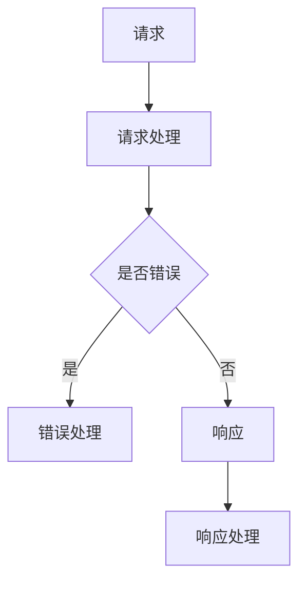

                 

### 文章标题

《为什么要做接口契约》

---

#### 文章关键词

接口契约、微服务、RESTful API、设计原则、最佳实践

#### 摘要

接口契约是现代软件开发中不可或缺的一部分，它确保了不同系统组件之间的交互清晰、稳定且高效。本文将详细探讨接口契约的定义、重要性、设计原则、实现方法及其在现实项目中的应用，旨在帮助开发者更好地理解和应用接口契约，提升软件开发的整体质量。

## 引言

在软件开发的实践中，我们常常面临这样一个问题：如何确保系统中的各个组件能够高效且稳定地交互？答案是接口契约。接口契约作为一种规范化的协议，它定义了系统组件之间交互的规则和期望。通过接口契约，开发者可以确保不同模块之间能够无缝对接，从而提高系统的可维护性、扩展性和可靠性。

然而，为什么我们需要接口契约？本文将围绕这个问题展开讨论，通过以下几个部分来深入探讨接口契约的各个方面：

1. **接口契约的定义与核心概念**：介绍接口契约的基本概念，阐述其核心原理和架构。
2. **接口契约的重要性**：分析接口契约在软件开发中的应用价值，探讨其在不同场景中的优势。
3. **接口契约的设计原则**：详细阐述接口契约的设计原则，包括可靠性、可扩展性、易用性等。
4. **接口契约的实现方法**：讲解接口契约的实现过程，包括设计流程、实现技术和测试方法。
5. **接口契约的应用场景**：分析接口契约在实际开发中的应用，展示其在不同领域和项目中的具体应用。
6. **接口契约的最佳实践**：提供接口契约的最佳实践，包括命名规范、版本管理和安全策略。
7. **接口契约案例分析**：通过实际案例，展示接口契约在项目中的具体实现和效果。

## 接口契约的定义与核心概念

### 核心概念

接口契约（API Contract）是一种用于描述系统组件之间交互规范的文档或协议。它定义了服务的输入（请求）、输出（响应）以及可能出现的错误情况。接口契约的核心概念包括以下几个方面：

1. **请求与响应**：接口契约明确了请求的数据格式、参数类型和响应的数据格式、状态码等。
2. **错误处理**：接口契约定义了可能出现的错误类型及其处理方式，确保系统在不同情况下都能稳定运行。
3. **版本管理**：接口契约支持版本管理，以便在功能升级或修改时，能够兼容旧版本系统。
4. **安全性**：接口契约包括安全协议、认证和授权机制，确保数据传输的安全性和隐私性。

### 核心概念之间的联系

接口契约的核心概念之间存在着紧密的联系。以下是一个简化的Mermaid流程图，展示了接口契约的基本架构：



在这个流程图中，请求经过处理后，可能触发错误或得到响应。错误处理和响应处理是接口契约的核心环节，确保了交互的完整性和稳定性。

### 接口契约的发展历史

接口契约的概念起源于早期的软件工程领域，随着计算机技术的发展，接口契约逐渐演变成为现代软件开发中的一种重要规范。以下是接口契约的发展历程：

1. **早期接口规范**：在20世纪80年代，随着面向对象编程的兴起，接口契约逐渐成为软件设计的一部分。早期的接口规范主要依赖于编程语言本身提供的特性，如C++中的纯虚函数。
2. **RESTful API**：随着Web服务的普及，RESTful API成为了接口契约的主要形式。RESTful API基于HTTP协议，通过URL和HTTP方法描述接口操作，提供了简洁、统一的接口规范。
3. **现代接口契约框架**：随着微服务架构的兴起，接口契约逐渐从一种简单的文档规范演变为一种完善的自动化测试和验证框架。现代接口契约框架如Swagger、OpenAPI等，提供了强大的接口设计和文档生成功能。

## 接口契约的重要性

接口契约在软件开发中具有重要作用，主要体现在以下几个方面：

### 1. 提高系统可维护性

接口契约明确了系统组件之间的交互规则，有助于开发者更好地理解和管理系统的复杂性。通过接口契约，开发者可以确保系统的各个部分都能够按照预期工作，从而提高系统的可维护性。

### 2. 提升开发效率

接口契约为开发者提供了一个统一的接口规范，减少了因为接口不兼容而导致的开发工作重复。通过接口契约，开发者可以更快地开始开发，降低了沟通成本和调试难度，从而提升整体开发效率。

### 3. 确保接口兼容性

接口契约支持版本管理，使得系统在功能升级或修改时能够保持与旧版本系统的兼容性。通过版本控制和契约更新，开发者可以确保不同版本的服务能够无缝对接，避免因接口变更而导致系统故障。

### 4. 提高系统安全性

接口契约包括安全协议、认证和授权机制，确保数据传输的安全性和隐私性。通过接口契约，开发者可以确保系统在处理敏感数据时遵循安全规范，减少安全漏洞和风险。

### 5. 支持自动化测试

接口契约为自动化测试提供了基础，使得测试人员可以编写测试脚本，对接口的每个操作进行验证。通过自动化测试，开发者可以及时发现接口问题，确保系统稳定运行。

### 6. 促进代码复用

接口契约鼓励开发者编写可复用的代码组件，通过接口契约，开发者可以轻松地将一个组件集成到多个系统中，从而提高代码的复用率。

## 接口契约的设计原则

设计接口契约时，需要遵循一系列原则，以确保接口的可靠性、可扩展性、易用性和安全性。以下是几个关键的设计原则：

### 1. 可靠性

接口契约必须确保系统组件之间的交互是可靠和稳定的。为了实现这一目标，需要考虑以下几个方面：

- **错误处理**：接口契约应定义明确的错误处理机制，确保在出现错误时系统能够恢复正常运行。
- **超时处理**：接口契约应设置合理的请求和响应超时时间，以防止长时间的无响应情况。
- **重试机制**：接口契约应支持请求重试，以应对临时性故障。

### 2. 可扩展性

接口契约应具备良好的可扩展性，以适应系统功能的不断变化和升级。以下是一些建议：

- **版本管理**：接口契约应支持版本管理，使得系统在功能升级时能够与旧版本保持兼容。
- **参数扩展**：接口契约应允许参数的扩展，以便在功能增加时，接口能够灵活调整。
- **模块化设计**：接口契约应采用模块化设计，使得功能模块之间能够独立扩展和更新。

### 3. 易用性

接口契约的设计应尽量简单易懂，以提高开发者的使用体验。以下是一些实现易用性的方法：

- **清晰命名**：接口命名应简洁明了，能够直观地反映接口的功能。
- **文档说明**：接口契约应提供详细的文档说明，包括接口的用途、参数说明、返回值等。
- **一致接口风格**：接口契约应遵循一致的接口风格，如参数顺序、数据格式等，以减少开发者的学习成本。

### 4. 安全性

接口契约必须确保数据传输的安全性和系统的完整性。以下是一些建议：

- **认证与授权**：接口契约应支持认证和授权机制，确保只有授权用户能够访问接口。
- **加密传输**：接口契约应采用加密传输方式，如HTTPS，以防止数据在传输过程中被窃取。
- **防攻击**：接口契约应具备防攻击能力，如防SQL注入、防XSS攻击等，确保系统的安全性。

## 接口契约的实现方法

### 1. 设计流程

接口契约的实现过程可以分为以下几个步骤：

- **需求分析**：明确接口契约的需求，包括功能需求、性能需求、安全性需求等。
- **接口设计**：根据需求分析，设计接口的输入输出参数、状态码、错误处理等。
- **文档编写**：编写接口契约文档，详细描述接口的规范和使用方法。
- **代码实现**：根据接口设计文档，实现接口的代码，包括请求处理、响应处理、错误处理等。
- **测试验证**：编写测试脚本，对接口进行测试，确保接口符合预期行为。

### 2. 实现技术

接口契约的实现技术多种多样，以下是一些常见的技术：

- **RESTful API**：基于HTTP协议，使用URL和HTTP方法描述接口操作。
- **SOAP**：基于XML的接口协议，提供详细的描述和类型定义。
- **GraphQL**：一种查询语言，允许客户端指定需要的数据，提高接口的灵活性。
- **RabbitMQ**：基于消息队列的接口实现，适用于高并发和分布式系统。

### 3. 测试方法

接口契约的测试是确保接口质量的关键环节，以下是一些常用的测试方法：

- **单元测试**：对接口的每个操作进行单元测试，确保其功能正确。
- **集成测试**：对接口与其他系统的集成进行测试，确保系统能够稳定运行。
- **性能测试**：测试接口的性能，包括响应时间、并发处理能力等。
- **安全测试**：测试接口的安全性，包括认证、授权、加密传输等。

## 接口契约的应用场景

接口契约在软件开发中具有广泛的应用场景，以下是一些典型的应用案例：

### 1. 微服务架构

在微服务架构中，接口契约是确保服务之间交互规范的重要手段。通过接口契约，开发者可以明确每个服务的功能、输入输出参数和错误处理，从而实现服务的解耦和高效协作。

### 2. RESTful API

RESTful API是接口契约的常见应用场景。通过定义清晰的接口契约，开发者可以确保前后端分离的系统中，前端和后端能够无缝对接，提高系统的可维护性和扩展性。

### 3. Web服务

Web服务中，接口契约用于描述服务的功能和操作。通过接口契约，开发者可以确保客户端能够正确调用服务，并处理可能出现的错误情况。

### 4. 移动应用

在移动应用开发中，接口契约用于描述与后端服务的交互规范。通过接口契约，开发者可以确保移动应用能够稳定、高效地访问后端服务，提高用户体验。

### 5. 物联网

在物联网应用中，接口契约用于描述设备与服务器之间的交互。通过接口契约，开发者可以确保设备能够正确发送和接收数据，实现设备的远程监控和管理。

### 6. 第三方集成

在第三方集成场景中，接口契约用于确保不同系统之间的交互规范。通过接口契约，开发者可以确保第三方系统能够正确接入和调用本地系统，提高集成效率。

## 接口契约的最佳实践

为了确保接口契约的质量和可维护性，开发者可以遵循以下最佳实践：

### 1. 命名规范

接口命名应遵循一致的命名规范，如使用小写字母和下划线分隔。例如：`get_user_info`。

### 2. 版本管理

接口契约应支持版本管理，如使用`v1`、`v2`等前缀标识不同版本的接口。

### 3. 文档编写

接口契约文档应详细描述接口的功能、输入输出参数、状态码、错误处理等，并使用Markdown或Swagger等工具生成文档。

### 4. 安全策略

接口契约应包括安全策略，如认证、授权、加密传输等，确保数据传输的安全性和系统的完整性。

### 5. 测试覆盖

接口契约应经过全面的测试，包括单元测试、集成测试、性能测试和安全测试等，确保接口的稳定性和可靠性。

### 6. 持续集成

接口契约应纳入持续集成和持续部署流程，确保每次代码变更后，接口契约都能自动测试和验证。

## 接口契约案例分析

### 案例一：电商平台接口契约设计

电商平台通常需要处理大量的用户请求和数据交互，接口契约的设计至关重要。以下是一个简单的接口契约设计案例：

#### 接口描述

获取用户信息

#### 接口路径

`GET /user/{user_id}`

#### 请求参数

- `user_id`：用户ID，必选

#### 响应格式

```json
{
  "code": 200,
  "message": "操作成功",
  "data": {
    "id": "123456",
    "username": "张三",
    "email": "zhangsan@example.com"
  }
}
```

#### 错误处理

- `code`: 400，错误消息：请求参数错误
- `code`: 401，错误消息：未授权访问
- `code`: 500，错误消息：服务器错误

通过这个案例，我们可以看到接口契约如何明确地描述接口的规范，确保开发者在实现和测试时能够有据可依。

### 案例二：金融服务平台接口契约实现

金融服务平台接口契约的设计需要考虑更高的安全性和稳定性。以下是一个简单的接口契约实现案例：

#### 接口描述

查询账户余额

#### 接口路径

`GET /account/alance` 

#### 请求参数

- `account_id`：账户ID，必选
- `access_token`：访问令牌，必选

#### 响应格式

```json
{
  "code": 200,
  "message": "操作成功",
  "data": {
    "account_id": "987654",
    "balance": 12345.67
  }
}
```

#### 错误处理

- `code`: 400，错误消息：请求参数错误
- `code`: 401，错误消息：未授权访问
- `code`: 403，错误消息：禁止访问
- `code`: 500，错误消息：服务器错误

通过这个案例，我们可以看到接口契约在金融服务平台中的具体实现，以及如何通过接口契约确保数据传输的安全性和系统的稳定性。

### 案例三：物联网设备接口契约应用

在物联网应用中，设备与服务器之间的交互需要通过接口契约来规范。以下是一个简单的物联网设备接口契约应用案例：

#### 接口描述

控制智能灯泡

#### 接口路径

`POST /device/light/control` 

#### 请求参数

- `device_id`：设备ID，必选
- `action`：操作类型，必选（如`on`、`off`、`brighter`、`darker`）
- `parameters`：操作参数，可选（如亮度、颜色等）

#### 响应格式

```json
{
  "code": 200,
  "message": "操作成功",
  "data": {
    "device_id": "555555",
    "status": "success"
  }
}
```

#### 错误处理

- `code`: 400，错误消息：请求参数错误
- `code`: 401，错误消息：未授权访问
- `code`: 404，错误消息：设备未找到
- `code`: 500，错误消息：服务器错误

通过这个案例，我们可以看到接口契约在物联网设备中的应用，以及如何通过接口契约实现设备的远程控制。

## 项目小结

通过本文的案例分析，我们可以看到接口契约在各个应用场景中的重要作用。接口契约不仅能够明确系统组件之间的交互规范，提高系统的稳定性和可维护性，还能够提升开发效率和安全性能。在未来的软件开发中，接口契约将继续发挥重要作用，成为确保系统质量的重要手段。

## 最佳实践 tips

1. **文档优先**：在实现接口之前，首先编写详细的接口契约文档，确保所有开发人员都能清楚地了解接口规范。
2. **版本管理**：使用版本控制工具管理接口契约文档和代码，确保每次修改都有详细的记录和说明。
3. **自动化测试**：编写自动化测试脚本，对接口契约进行全面的测试，确保接口符合预期行为。
4. **安全防护**：在接口契约中集成安全策略，如认证、授权和加密传输，确保数据传输的安全性和系统的完整性。

## 注意事项

1. **避免过度设计**：接口契约的设计应尽量简洁明了，避免过度设计导致复杂度增加。
2. **一致性**：确保接口契约在不同系统中保持一致性，以避免因接口不一致导致的集成问题。
3. **及时更新**：接口契约应根据系统功能的变更及时更新，确保文档与实际代码的一致性。

## 拓展阅读

1. 《RESTful API 设计最佳实践》
2. 《微服务架构设计模式》
3. 《接口自动化测试实战》
4. 《网络安全与加密技术》

---

## 作者信息

作者：AI天才研究院/AI Genius Institute & 禅与计算机程序设计艺术 /Zen And The Art of Computer Programming

