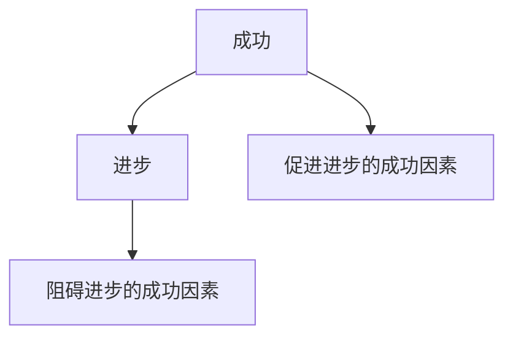

                 

## 文章标题

### 《使你成功的也阻止你进步》

> 关键词：成功、进步、自我提升、动力、障碍、策略

**摘要：**
本文从多个角度探讨了成功与进步之间的关系。通过解析成功的定义与衡量标准，分析成功的影响因素，探讨进步的障碍与挑战，最终提出有效的成功与进步结合的策略和实践方法。文章旨在帮助读者认识到成功在带来成就的同时，也可能成为阻碍进一步发展的因素，从而激励读者在成功的道路上不断进步。

## 引言

### 成功与进步的辩证关系

成功与进步是现代社会中人们不断追求的目标。成功通常被定义为一个特定目标或标准的确立与达成，而进步则意味着不断超越自我，追求更高层次的发展。然而，成功与进步之间的关系并非单向的，它们存在着一种辩证的关系。成功可以成为推动进步的动力，但有时也可能成为阻碍进步的障碍。

### 成功的双刃剑作用

成功在个人成长中的重要性不言而喻。它不仅能够带来物质上的回报，还能提升个人的社会地位和自尊心。然而，成功也可能成为一种双刃剑。在某些情况下，成功可能会使人产生满足感，从而止步不前，失去了追求更高目标的动力。此外，成功可能会使人过于专注于维持现有的成就，而忽视了持续学习和创新的重要性。

### 进步的必要性

进步是个人和社会持续发展的关键。通过不断学习、创新和挑战自我，个人可以不断提升自己的能力和价值。然而，进步并非一蹴而就，它需要持续的努力和自我激励。在某些情况下，成功可能会成为进步的阻碍，因为它可能使人们陷入舒适区，不愿意面对新的挑战和变化。

### 本文的目的

本文旨在深入探讨成功与进步之间的关系，分析它们之间的辩证关系，并提出有效的结合策略和实践方法。通过本文的探讨，读者可以更好地理解成功与进步的复杂性，从而在追求成功的同时，保持进步的动力。

## 第一部分：成功与进步的概念解析

### 第1章：成功与进步的概念解析

#### 1.1 成功的定义与标准

成功是一个多维度的概念，它涉及个人、社会和物质层面的成就。在个人层面，成功通常包括事业、家庭、财富、健康和自我实现等方面。在社会层面，成功意味着对社会的贡献和认可。在物质层面，成功则体现在财富和资源上的积累。

成功的标准因人而异，每个人都有自己的成功定义。一些人可能将财富和地位视为成功的关键指标，而另一些人则可能更注重个人成就和社会贡献。以下是一些常见的成功标准：

- **财富积累**：拥有一定数量的财富和资产。
- **职业成就**：在职业生涯中取得显著的成就和晋升。
- **家庭幸福**：拥有和谐的家庭关系和幸福的家庭生活。
- **社会地位**：在社会中获得较高的地位和尊重。
- **自我实现**：实现个人潜能和追求有意义的目标。
- **健康与幸福**：拥有良好的健康状况和幸福感。

#### 1.2 进步的衡量与目标

进步是一个动态的过程，它意味着不断超越自我，追求更高的目标和更广阔的发展空间。衡量进步的标准也因人而异，但以下是一些常见的衡量标准：

- **技能提升**：通过学习和实践，不断提升自己的技能和知识水平。
- **职业发展**：在职业生涯中取得显著的进步和提升。
- **个人成长**：在心理、情感和社交能力方面取得进步。
- **创新与创造**：通过创新和创造，为个人和社会带来新的价值和贡献。
- **生活质量**：通过改善生活条件和生活方式，提高生活质量。

进步的目标通常包括以下几个方面：

- **设定明确的个人目标**：通过设定短期和长期的目标，明确前进的方向。
- **持续学习和自我提升**：通过不断学习新知识和技能，提升自己的能力和竞争力。
- **面对挑战和克服障碍**：勇于接受新的挑战，通过克服困难和障碍，实现自我突破。
- **适应变化和变化环境**：在不断变化的环境中，灵活调整自己的行为和策略，以适应新的要求和挑战。

#### 1.3 成功与进步的辩证关系

成功与进步之间的关系是复杂的，它们既有相互促进的一面，也有相互制约的一面。

**相互促进：**

- 成功可以成为推动进步的动力。当个人取得一定的成功时，这种成功可以激励他们继续努力，追求更高的目标。
- 进步可以为成功奠定基础。通过不断学习和提升自己的能力，个人可以为未来的成功创造更好的条件。

**相互制约：**

- 成功可能导致满足感，从而使人失去追求进步的动力。当个人取得显著的成功时，他们可能会感到满足，从而停止进一步的追求和努力。
- 成功可能会使人陷入舒适区，不愿意面对新的挑战。在取得成功后，人们可能会过于专注于维护现有的成就，而忽视了进一步的发展和创新。

**图1-1 成功与进步的辩证关系图**

通过图1-1，我们可以清晰地看到成功与进步之间的辩证关系。成功可以成为推动进步的动力，但同时也可能成为阻碍进步的因素。因此，在追求成功的同时，我们需要保持清醒的头脑，不断激发进步的动力，以实现持续的发展。

### 第2章：成功的影响因素

#### 2.1 个人因素

个人因素是成功的关键驱动力，它们直接影响个人的行为、决策和成就。以下是一些重要的个人因素：

**1. 愿景与目标**

愿景和目标是个人成功的重要驱动力。一个明确的愿景可以帮助个人确定自己的方向和目标，从而在追求成功的道路上保持动力和专注。目标应具体、可衡量、可实现，并具有挑战性。

**2. 动机与动力**

动机是推动个人努力实现目标的心理驱动力。内在动机通常来自于个人对目标的热爱和兴趣，而外在动机则可能来自于社会压力、奖励或惩罚。无论是内在动机还是外在动机，它们都可以激发个人的积极性和动力。

**3. 技能与知识**

技能和知识是个人成功的基础。通过不断学习和提升自己的技能，个人可以增强自己的竞争力，提高工作效率，从而实现职业和个人的成功。

**4. 自我效能感**

自我效能感是指个人对自己能否成功完成任务的信念。高自我效能感的人通常更愿意接受挑战，更有信心克服困难，从而实现更高的成就。

**5. 人际关系**

人际关系对于个人成功至关重要。良好的社交技能可以帮助个人建立强大的社交网络，获得支持和资源，从而在职业和个人生活中取得成功。

#### 2.2 社会因素

社会因素是影响个人成功的另一重要方面，它们包括家庭、社会环境和文化背景等。

**1. 家庭背景**

家庭背景对个人的成长和发展具有重要影响。家庭的支持、教育资源和价值观可以显著影响个人的成功概率。来自支持性家庭的个人通常更容易获得成功。

**2. 社会环境**

社会环境包括经济、政治和文化环境等。一个稳定、繁荣的社会环境可以提供更多的机会和资源，从而有利于个人的发展。此外，社会的价值观和风气也会影响个人的行为和决策。

**3. 文化背景**

文化背景对个人的成功观念和行为模式产生深远影响。不同的文化背景可能对成功有不同的定义和期望，这会影响个人对成功的追求和实现。

#### 2.3 环境因素

环境因素是指个人所处的外部环境，它们可以显著影响个人的成功概率。

**1. 资源与机会**

资源与机会是个人成功的关键因素。一个丰富的资源库和大量的机会可以为个人提供实现成功所需的条件。例如，良好的教育资源和就业机会可以显著提高个人的成功概率。

**2. 竞争与压力**

竞争和压力是环境因素中的两个方面。适度的竞争可以激发个人的积极性和创造力，但过度的竞争和压力可能导致焦虑和挫折感，影响个人的表现和成功。

**3. 政策与法律**

政策与法律是影响个人成功的重要环境因素。一个公平、透明和稳定的政策环境可以为个人提供公平的竞争机会，促进个人发展。相反，不公正的政策和法律可能阻碍个人的成功。

通过分析个人、社会和环境因素对成功的影响，我们可以更全面地理解成功的复杂性。成功不仅仅是个人努力的结果，还受到外部环境和社会因素的影响。了解这些因素可以帮助我们在追求成功的过程中做出更明智的决策，从而实现更高的成就。

### 第3章：进步的障碍与挑战

#### 3.1 满足现状的困境

在追求进步的过程中，满足现状是一种常见的障碍。当个人取得一定的成功时，他们可能会感到满足，从而停止进一步的追求和努力。这种满足感可能导致以下几种困境：

**1. 自我满足感**

自我满足感是一种自我认同和自尊的提升，但当它变得过于强烈时，可能会阻碍个人的进步。个人可能会认为自己已经足够好，不需要再努力提升自己，从而停滞不前。

**2. 舒适区**

舒适区是指个人习惯于当前的生活方式和工作环境，不愿意冒险尝试新事物。在舒适区中，个人可能会感到安全和满足，但这也意味着他们放弃了成长和进步的机会。

**3. 成就固化**

成就固化是指个人将过去的成就视为自己能力的固定标志，从而忽视了持续学习和提升的必要性。这种心态可能导致个人停滞不前，无法适应不断变化的环境。

**4. 习惯性思维**

习惯性思维是指个人在面对新挑战时，倾向于使用过去成功的方法和经验。这种方法虽然在过去有效，但在新的环境和条件下可能不再适用，从而阻碍个人的进步。

为了克服满足现状的困境，个人需要不断提醒自己保持谦虚和开放的心态，勇于接受新的挑战和变化。以下是一些策略：

- **设定新的目标**：通过设定新的、更高的目标，激励自己不断追求进步。
- **持续学习**：保持好奇心和求知欲，通过学习新的知识和技能，不断提升自己的能力。
- **面对挑战**：勇于接受新的挑战，将挑战视为成长和进步的机会。
- **反思与调整**：定期反思自己的行为和决策，及时调整策略，以适应新的环境和条件。

#### 3.2 固步自封的思维

固步自封的思维是一种不愿意接受新观念和新方法的思维模式。它可能源于个人对现状的满意，或对变化的恐惧。以下是一些固步自封思维的表现：

**1. 坚持传统方法**

固步自封的思维往往导致个人坚持使用传统的方法和工具，而不愿尝试新的技术和方法。这种方法虽然在某些情况下可能有效，但在快速变化的环境中，传统方法可能无法满足新的需求。

**2. 对新观念的抵触**

个人可能会对新观念和新方法产生抵触情绪，认为它们不符合自己的经验和价值观。这种抵触情绪可能阻碍个人的学习和进步。

**3. 缺乏创新意识**

固步自封的思维往往导致个人缺乏创新意识，不愿意尝试新的解决方案和方法。这种缺乏创新意识可能会使个人在竞争激烈的环境中落后。

为了克服固步自封的思维，个人需要培养开放的心态和创新意识。以下是一些策略：

- **接受新观念**：保持开放的心态，对新观念和新方法持包容和接受的态度。
- **鼓励创新**：创造一个鼓励创新和尝试的环境，激发个人的创造力和创新意识。
- **学习新技术**：主动学习新的技术和方法，不断提升自己的技能和知识水平。
- **跨学科学习**：通过跨学科学习，拓宽自己的知识面，从而激发新的灵感和创意。

#### 3.3 持续学习的必要性

持续学习是个人进步的关键。在一个快速变化的世界中，知识和技能的更新速度越来越快，个人需要不断学习以适应新的环境和要求。以下是一些持续学习的必要性：

**1. 知识更新**

随着技术的快速发展，许多旧有的知识和技能可能很快变得过时。持续学习可以帮助个人保持知识的更新，从而提高自己的竞争力。

**2. 技能提升**

持续学习不仅可以更新知识，还可以提升技能。通过学习新的技能，个人可以扩展自己的能力，提高工作效率，从而实现职业和个人发展。

**3. 应对变化**

持续学习可以帮助个人更好地应对环境的变化。在快速变化的环境中，只有具备持续学习能力的人才能迅速适应新的条件，抓住机遇。

**4. 提升创造力**

持续学习可以激发个人的创造力和创新意识。通过学习新的知识和技能，个人可以打破思维定式，发现新的解决方案，从而推动自己的进步。

为了实现持续学习，个人需要采取以下策略：

- **设定学习目标**：明确自己的学习目标，确保学习方向和内容具有针对性和实用性。
- **制定学习计划**：制定详细的学习计划，确保学习时间和内容的安排合理。
- **参与学习社区**：加入学习社区，与他人交流和分享学习经验，从而获得更多的学习资源和灵感。
- **利用在线资源**：利用各种在线学习平台和资源，如MOOCs（大规模开放在线课程）、博客和在线教程，方便地获取知识和技能。

通过克服满足现状的困境、固步自封的思维和持续学习的必要性，个人可以在追求成功的同时保持进步的动力。成功是一种阶段性的成就，而进步是一种持续的过程。只有在不断追求进步的过程中，个人才能真正实现自我价值，实现更高层次的成功。

### 第4章：成功的策略

#### 4.1 设定明确的目标

设定明确的目标是成功的关键策略之一。明确的目标可以帮助个人集中精力，避免分散注意力，从而更高效地实现目标。以下是如何设定明确目标的步骤：

**1. 确定目标**

首先，个人需要明确自己的目标是什么。目标可以是长期的，也可以是短期的，但必须具体、明确和具有挑战性。例如，设定一个目标：“在未来两年内，实现职业生涯的显著提升。”

**2. 分解目标**

将大目标分解为小目标，有助于个人更清晰地了解每个阶段的目标和任务。例如，可以将上述目标分解为：“第一个季度内，获得一次晋升机会；第二个季度内，完成一项重要的项目。”

**3. 制定行动计划**

为每个小目标制定详细的行动计划，确保每个步骤都有具体的执行措施。例如，为实现晋升目标，可以制定以下行动计划：“提升专业技能，参与内部培训课程；积极与上级沟通，展示工作成果。”

**4. 定期评估**

定期评估目标的完成情况，及时调整行动计划。这有助于个人保持目标导向，确保按计划推进。

#### 4.2 制定可行的计划

制定可行的计划是实现目标的关键。以下是如何制定可行计划的步骤：

**1. 分析资源**

分析个人拥有的资源和可能利用的资源，包括时间、资金、人力和物质资源。这有助于确定实现目标所需的条件和限制。

**2. 制定步骤**

将目标分解为一系列具体的步骤，确保每一步都是可执行的。例如，为实现职业提升，可以制定以下步骤：“参加相关培训课程；主动承担更具挑战性的任务；定期向上级汇报工作进展。”

**3. 设定时间表**

为每个步骤设定具体的时间表，确保计划具有明确的时间节点。例如，可以设定：“第一个步骤在一个月内完成；第二个步骤在三个月内完成。”

**4. 评估风险**

评估计划中的潜在风险，并制定应对策略。这有助于降低计划执行中的不确定性。

#### 4.3 持续的努力与实践

持续的努力和实践是实现目标的关键。以下是一些策略：

**1. 坚持不懈**

成功往往需要长时间的坚持和努力。在实现目标的过程中，可能会遇到各种困难和挑战，但坚持不懈是克服困难的关键。

**2. 反馈与调整**

定期反思和评估自己的行为和决策，及时调整计划。这有助于个人在实现目标的过程中保持灵活性和适应性。

**3. 寻求支持**

在实现目标的过程中，寻求他人的支持和帮助是非常重要的。这可以是家人、朋友、同事或导师等。他们可以提供鼓励、建议和支持，帮助个人克服困难，实现目标。

**4. 保持积极心态**

积极的心态是实现目标的重要动力。在面对挑战和困难时，保持积极的心态有助于个人保持动力和信心，克服困难，实现目标。

通过设定明确的目标、制定可行的计划以及持续的努力和实践，个人可以有效地实现目标，迈向成功。成功不是一蹴而就的，它需要时间和努力，但只要坚持不懈，最终一定能够实现。

### 第5章：进步的方法

#### 5.1 持续学习的技巧

持续学习是个人进步的重要方法。以下是一些持续学习的技巧：

**1. 确定学习目标**

首先，明确自己的学习目标。这些目标可以是技能提升、知识拓展或个人成长等方面。具体、明确的目标准确地指导学习的方向，确保学习时间和精力的有效利用。

**2. 制定学习计划**

制定详细的学习计划，包括学习内容、时间安排和进度检查等。这有助于个人合理安排学习时间，确保学习进度不受干扰。

**3. 利用多种学习资源**

利用各种学习资源，如在线课程、书籍、博客、视频教程和研讨会等。不同类型的资源可以提供不同的学习视角和知识深度，丰富个人的学习体验。

**4. 定期复习和总结**

定期复习所学内容，巩固记忆，加深理解。同时，总结学习过程中的经验和教训，不断优化学习方法。

**5. 参与学习社区**

加入学习社区，与他人分享学习经验和心得，获取新的见解和观点。这不仅可以扩展知识面，还可以建立人脉，为个人进步提供更多机会。

**6. 创新学习方法**

尝试不同的学习方法，如深度学习、互动式学习、项目式学习和反思性学习等。创新学习方法可以提高学习效果，激发学习兴趣。

#### 5.2 创新的思维方式

创新思维方式是推动个人进步的关键。以下是一些创新的思维方式：

**1. 换位思考**

尝试从他人的角度思考问题，理解不同的观点和需求。这有助于发现新的解决方案和改进机会。

**2. 系统思维**

运用系统思维，理解各个部分之间的相互关系和影响。这有助于发现问题的根本原因，并制定更全面的解决方案。

**3. 模拟与假设**

通过模拟和假设，尝试不同的情境和解决方案。这有助于锻炼思维的灵活性和创新性，提高问题解决能力。

**4. 求异思维**

鼓励提出独特的观点和想法，不拘泥于传统思维模式。这有助于打破思维定式，激发创新思维。

**5. 视觉化思维**

运用视觉化工具，如思维导图、图表和模型等，将复杂的信息和概念可视化。这有助于理解和记忆，提高思维效率。

#### 5.3 面对挑战的勇气

面对挑战的勇气是个人进步的重要品质。以下是一些策略，帮助个人面对挑战：

**1. 正确认识挑战**

理解挑战是个人成长和进步的机会，而非障碍。正确认识挑战有助于保持积极的心态和应对策略。

**2. 设定小目标**

将大挑战分解为一系列小目标，逐一克服。这有助于降低挑战的难度，提高成功的机会。

**3. 学习借鉴经验**

从他人的经验和教训中学习，了解如何应对类似挑战。这有助于减少不确定性，提高应对策略的有效性。

**4. 保持积极心态**

在面对挑战时，保持积极的心态和信心。这有助于克服焦虑和压力，提高应对能力和成功率。

**5. 建立支持网络**

寻求家人、朋友和同事的支持和鼓励。这有助于提供心理支持，减轻压力，提高应对挑战的能力。

通过持续学习、创新思维方式和面对挑战的勇气，个人可以不断提升自己的能力和素质，实现持续进步。进步不仅是个人成长的体现，也是实现更高层次成功的关键。在追求成功的过程中，保持进步的动力和策略，是每个人都需要不断探索和实践的重要课题。

### 第6章：成功与进步的结合

#### 6.1 如何在成功中找到进步的空间

在成功的基础上找到进步的空间是持续发展的关键。以下是一些策略，帮助个人在成功中找到进步的空间：

**1. 保持好奇心和求知欲**

成功往往使人产生满足感，但好奇心和求知欲可以激发个人继续探索新知识和技能。通过不断学习和探索，个人可以在成功的基础上找到进步的空间。

**2. 设定更高目标**

在成功后，设定更高、更具挑战性的目标，激励个人继续努力。这不仅可以保持进步的动力，还可以推动个人在更高层次上实现发展。

**3. 反思成功经验**

反思成功的过程，分析其中的关键因素和成功经验。通过总结成功经验，个人可以识别出可以进一步改进和优化的方面，从而在成功中找到进步的空间。

**4. 寻求反馈和改进**

主动寻求他人的反馈和建议，了解自己在成功过程中可能存在的不足。通过接受反馈并进行改进，个人可以在成功的基础上找到进步的空间。

**5. 持续创新**

在成功的基础上，持续创新，探索新的解决方案和方法。创新不仅可以推动个人进步，还可以为成功增添新的维度和可能性。

#### 6.2 如何在进步中保持成功的动力

在追求进步的过程中，保持成功的动力是关键。以下是一些策略，帮助个人在进步中保持成功的动力：

**1. 设定明确的目标**

设定具体、明确的进步目标，确保每个目标都与个人的长期愿景相一致。明确的目标可以帮助个人保持方向感和动力。

**2. 制定可行的计划**

为每个目标制定详细的行动计划，确保每个步骤都是可执行和可测量的。可行的计划有助于个人有条不紊地推进进步，同时保持成功的动力。

**3. 庆祝小成就**

在进步的过程中，庆祝每一个小成就。这不仅可以提高个人的自信心和积极性，还可以增强成功的动力。

**4. 寻求支持和鼓励**

在进步的过程中，寻求家人、朋友和同事的支持和鼓励。他们的支持和鼓励可以提供心理支持，帮助个人克服困难和挑战，保持动力。

**5. 保持积极心态**

在面对挑战和困难时，保持积极的心态和信心。积极的心态有助于个人克服挫折，保持成功的动力。

**6. 激发内在动机**

激发个人的内在动机，如兴趣、热爱和成就感。内在动机是持久动力的源泉，可以帮助个人在进步的道路上保持动力。

通过在成功中找到进步的空间和保持进步的动力，个人可以实现持续的发展，迈向更高的成功。成功和进步是相辅相成的，只有两者相结合，个人才能在追求卓越的道路上不断前行。

### 第7章：成功与进步的典型人物分析

#### 7.1 马云的成功与进步之路

马云，阿里巴巴集团的创始人，是中国最成功的企业家之一。他的成功故事充满传奇色彩，同时也为我们展示了如何在成功中保持进步。

**1. 成功的过程**

- **创业初期**：1999年，马云创办了阿里巴巴。当时，互联网在中国还处于起步阶段，但马云看到了电子商务的巨大潜力。他带领团队克服了重重困难，逐步建立起阿里巴巴的电商帝国。
- **业务拓展**：随着业务的快速发展，阿里巴巴不断拓展业务领域，从最初的B2B业务发展到C2C（淘宝）、B2C（天猫）等多个业务板块，成为中国最大的电商平台。
- **国际化**：马云还积极推动阿里巴巴的国际化，拓展海外市场，使阿里巴巴成为全球知名的企业。

**2. 进步的动力**

- **持续学习**：马云是一位持续学习者，他经常参加各种论坛和研讨会，不断吸取新的知识和见解。他还致力于公益事业，通过成立马云公益基金会，推动教育和社会发展。
- **创新思维**：马云强调创新思维，鼓励团队不断探索新的商业模式和解决方案。这种创新思维使得阿里巴巴在竞争激烈的市场中始终保持领先地位。
- **领导力**：马云以其独特的领导力赢得了团队的信任和尊重。他善于激励和培养人才，使阿里巴巴成为一个充满活力和创新精神的组织。

**3. 成功与进步的结合**

- **成功奠定基础**：马云的成功为他带来了巨大的资源和影响力，使他有更多机会去尝试新的项目和业务。这种成功不仅为他的个人事业奠定了基础，也为整个企业带来了新的机遇。
- **进步推动成功**：在成功的基础上，马云不断寻求进步，推动阿里巴巴在多个领域实现创新和发展。这种进步不仅保持了企业的竞争力，也为他的个人成就增添了新的维度。

#### 7.2 乔布斯的成功与进步之路

史蒂夫·乔布斯，苹果公司的创始人之一，被誉为现代科技产业的领军人物。他的成功和进步之路为人们提供了宝贵的启示。

**1. 成功的过程**

- **创业初期**：1976年，乔布斯与史蒂夫·沃兹尼亚克共同创办了苹果公司。他们推出了世界上第一台个人电脑Apple I，从而开启了个人电脑的时代。
- **产品创新**：乔布斯带领苹果推出了多个划时代的创新产品，如Macintosh电脑、iPod、iPhone和iPad等。这些产品不仅改变了人们的生活方式，也使苹果公司成为全球最具价值的科技公司之一。
- **领导变革**：乔布斯以其独特的领导力和创新思维，引领苹果公司不断实现变革和发展。他的成功不仅体现在产品上，还体现在对整个科技产业的推动上。

**2. 进步的动力**

- **对技术的热爱**：乔布斯对技术的热爱是他不断进步的动力。他不仅关注产品的技术细节，还善于将技术转化为用户友好的产品体验。
- **追求完美**：乔布斯追求完美，他总是追求卓越，不满足于平庸。他的这种追求完美的心态使他不断推动自己和团队实现突破。
- **持续学习**：乔布斯是一位终身学习者，他经常参加各种讲座和研讨会，不断吸取新的知识和见解。他的持续学习使他始终保持对新技术和趋势的敏感。

**3. 成功与进步的结合**

- **成功奠定基础**：乔布斯的成功为他带来了巨大的资源和影响力，使他有机会去实现更多创新和变革。这种成功不仅为他的个人事业奠定了基础，也为整个科技产业带来了新的机遇。
- **进步推动成功**：在成功的基础上，乔布斯不断寻求进步，推动苹果公司实现技术创新和产品变革。他的进步不仅保持了苹果的竞争力，也为他的个人成就增添了新的高度。

#### 7.3 贝佐斯的成功与进步之路

杰夫·贝佐斯，亚马逊公司的创始人，是现代企业家中的佼佼者。他的成功和进步之路展示了如何在竞争激烈的市场中取得持续的发展。

**1. 成功的过程**

- **创业初期**：1994年，贝佐斯创办了亚马逊公司。当时，电子商务还是一个新兴领域，但贝佐斯看到了其巨大的潜力。他带领团队推出了在线书店，逐步建立起亚马逊的商业帝国。
- **业务拓展**：亚马逊不断拓展业务领域，从最初的在线书店发展到零售、云计算、人工智能等多个领域，成为全球最具影响力的科技公司之一。
- **创新战略**：贝佐斯以其独特的创新战略，使亚马逊在竞争激烈的市场中始终保持领先地位。他善于抓住市场机会，推动公司不断实现业务创新和变革。

**2. 进步的动力**

- **客户至上**：贝佐斯始终将客户需求放在首位，他坚信“客户至上”的理念，致力于提供最好的服务和体验。
- **持续创新**：贝佐斯强调持续创新，他鼓励团队不断探索新的技术和商业模式，推动公司实现持续发展。
- **战略眼光**：贝佐斯以其敏锐的战略眼光，准确把握市场趋势和变化，使亚马逊在多个领域实现突破。

**3. 成功与进步的结合**

- **成功奠定基础**：贝佐斯的成功为他带来了巨大的资源和影响力，使他有机会去实现更多创新和变革。这种成功不仅为他的个人事业奠定了基础，也为整个科技产业带来了新的机遇。
- **进步推动成功**：在成功的基础上，贝佐斯不断寻求进步，推动亚马逊在多个领域实现创新和发展。他的进步不仅保持了公司的竞争力，也为他的个人成就增添了新的维度。

通过分析马云、乔布斯和贝佐斯的成功与进步之路，我们可以看到，成功不仅仅是阶段性成就的标志，更是推动持续进步的动力。这些成功人物的经验和教训为我们提供了宝贵的启示，帮助我们更好地在追求成功的同时，保持进步的动力。

### 第8章：成功与进步的组织实践

#### 8.1 企业文化在成功与进步中的作用

企业文化是组织成功与进步的重要驱动力。一个健康、积极的企业文化可以激发员工的创造力、凝聚力和奉献精神，从而推动组织实现持续发展。以下是企业文化建设在成功与进步中的几个关键作用：

**1. 激发员工动力**

积极的企业文化可以为员工提供明确的价值导向和行为准则，激发他们的工作动力。通过设立共同的目标和愿景，企业文化可以激发员工的积极性和主动性，使他们更愿意为组织的目标付出努力。

**2. 增强团队凝聚力**

企业文化可以促进员工之间的沟通和合作，增强团队凝聚力。通过共同的文化价值观和行为准则，员工可以更好地理解和支持彼此，形成紧密的团队关系。这种凝聚力有助于提高团队的工作效率和创新能力。

**3. 促进创新与变革**

积极的企业文化鼓励创新和变革，为员工提供探索新方法和尝试新事物的空间。这种文化氛围可以激发员工的创造力和创新意识，使组织在激烈的市场竞争中保持竞争力。

**4. 塑造品牌形象**

企业文化对品牌形象具有重要影响。一个积极、健康的企业文化可以为品牌塑造良好的形象，增强消费者的信任和忠诚度。这有助于提高组织的市场地位和竞争力。

为了构建积极的企业文化，组织可以采取以下措施：

- **明确核心价值观**：确定组织的核心价值观，确保员工对这些价值观有清晰的理解和认同。
- **领导者带头**：领导者应以身作则，积极践行企业文化，为员工树立榜样。
- **建立沟通渠道**：建立有效的沟通渠道，鼓励员工表达意见和建议，增强员工的参与感和归属感。
- **提供培训和发展机会**：为员工提供培训和发展机会，帮助他们不断提升自己的能力和技能，从而更好地融入企业文化。
- **奖励与认可**：对践行企业文化的员工给予奖励和认可，激励更多员工积极参与文化建设。

#### 8.2 教育系统对成功与进步的影响

教育系统在个人成功与进步中扮演着至关重要的角色。一个有效的教育系统不仅可以培养个人的知识和技能，还可以塑造他们的价值观和思维方式。以下是从教育系统的角度分析其对成功与进步的影响：

**1. 知识传授**

教育系统通过传授各种知识和技能，为个人的成功与进步奠定基础。学科知识、技术技能和软技能都是个人在职业生涯中取得成功的关键因素。一个有效的教育系统应该提供多样化的课程和教学方式，以满足不同学生的需求。

**2. 价值观塑造**

教育系统不仅传授知识，还塑造个人的价值观和道德观。通过培养学生的责任感和公民意识，教育系统可以为社会的和谐发展贡献力量。一个良好的教育系统应该注重价值观的传递，帮助学生形成正确的人生观和世界观。

**3. 创新与创造力**

教育系统应该鼓励学生的创新和创造力。通过提供开放的学习环境和创新项目，教育系统可以帮助学生培养创新思维和解决问题的能力。这些能力在未来的职业生涯中至关重要，可以推动个人的成功与进步。

**4. 终身学习**

教育系统应该鼓励终身学习，帮助学生养成持续学习和自我提升的习惯。在一个快速变化的世界中，知识和技能的更新速度越来越快，终身学习是个人保持竞争力的关键。一个有效的教育系统应该为学生提供持续学习的机会和支持。

为了提升教育系统对成功与进步的影响，可以从以下几个方面进行改进：

- **课程多样化**：提供多样化的课程，以满足学生的不同兴趣和需求。
- **教师培训**：加强对教师的培训，提高他们的教学水平和创新能力。
- **教育资源**：增加教育资源的投入，提供高质量的教学设施和学习工具。
- **实践机会**：为学生提供更多的实践机会，使他们能够在实际情境中应用所学知识和技能。
- **国际化**：加强国际交流与合作，为学生提供全球视野和跨文化理解。

通过积极的教育系统，个人可以在知识和技能的基础上实现成功与进步，为社会的持续发展贡献力量。

#### 8.3 社会支持在成功与进步中的角色

社会支持在个人成功与进步中起着至关重要的作用。社会支持不仅包括家庭和朋友的支持，还包括社区、组织和政府等层面的支持。以下是社会支持在成功与进步中的几个关键角色：

**1. 心理支持**

心理支持是个人在追求成功和进步过程中最基本的需求。一个支持性的环境可以帮助个人克服挫折和困难，保持积极的心态。家庭和朋友的支持可以为个人提供情感上的安慰和鼓励，使他们在面对挑战时更加坚强。

**2. 资源获取**

社会支持可以帮助个人获取实现成功所需的资源。这些资源包括教育、培训、资金、技术和其他社会资源。一个支持性的社会可以提供更多的机会和资源，帮助个人在追求成功的过程中获得竞争优势。

**3. 社会网络**

社会网络是个人在职业和社会生活中取得成功的重要工具。通过建立和维护广泛的社会网络，个人可以获取更多的信息、机会和资源。社会支持可以提供网络拓展的机会，帮助个人在职业和社会生活中建立强大的支持系统。

**4. 社会规范**

社会规范可以影响个人的行为和价值观，促进个人在追求成功和进步中的自我提升。一个支持性的社会规范可以鼓励创新和努力，抑制自私和懒惰的行为。通过社会规范的建设，社会可以促进个人的成功和进步。

为了发挥社会支持在成功与进步中的作用，可以从以下几个方面进行努力：

- **建立支持性社区**：创建一个支持性的社区环境，为个人提供心理、资源和网络支持。
- **促进社会参与**：鼓励个人积极参与社会活动和公益事业，增强社会凝聚力。
- **提供教育资源**：为个人提供高质量的教育资源，帮助他们不断提升自己的知识和技能。
- **优化社会政策**：制定和优化社会政策，为个人提供更多的机会和资源，促进社会公平和正义。
- **加强心理健康服务**：提供心理健康服务，帮助个人在追求成功和进步的过程中保持良好的心理状态。

通过社会支持的全面参与和建设，个人可以在追求成功和进步的道路上获得更多的动力和资源，实现个人和社会的共同发展。

### 附录：成功与进步的参考资源

#### 8.1 成功学经典著作推荐

- **《思考，快与慢》（Daniel Kahneman）**
  这本书揭示了人类思维的两面性，即快速直觉思考和慢速理性思考，帮助读者更好地理解决策过程，提升成功的可能性。

- **《追求卓越》（Peter F. Drucker）**
  这本书是管理大师彼得·德鲁克的代表作，详细阐述了企业成功的原则和方法，对企业家和管理者具有深刻的启示作用。

- **《高效能人士的七个习惯》（Stephen R. Covey）**
  这本书提出了一套成功和进步的七个习惯，帮助读者在个人和职业生活中实现高效和持续发展。

- **《财富第六波》（Paul R. R. Gilding）**
  这本书分析了未来经济和社会发展的趋势，为个人和企业在新时代中的成功提供了有益的参考。

#### 8.2 进步理论的学术研究

- **《进步的阶梯：技术与社会变革》（Walter Issacson）**
  这本书探讨了技术进步对社会和经济的影响，揭示了科技进步如何推动个人和整个社会的进步。

- **《创新者的窘境》（Clayton M. Christensen）**
  这本书提出了“破坏性创新”理论，解释了为什么一些成功的公司会陷入困境，以及如何通过创新保持竞争优势。

- **《智能时代：人工智能的未来》（李开复）**
  这本书深入探讨了人工智能的发展及其对个人和社会的影响，为读者提供了在智能时代保持进步的理论基础。

#### 8.3 成功与进步相关的在线课程

- **“成功心理学”（Coursera）**
  这门课程由宾夕法尼亚大学的积极心理学教授开设，涵盖了成功心理学的基础理论和方法，帮助读者了解如何通过心理学方法提升个人成功。

- **“领导力与个人发展”（edX）**
  这门课程由哈佛大学开设，提供了关于领导力和个人发展的深入理解，帮助学员提升自我认知和领导能力。

- **“人工智能：一种现代方法”（Udacity）**
  这门课程深入介绍了人工智能的基本原理和应用，帮助学员掌握人工智能的核心知识，为未来的成功打下基础。

通过阅读经典著作、关注学术研究和参与在线课程，读者可以获取丰富的成功与进步的知识和工具，从而在追求个人和职业发展过程中不断进步。

### 结论

成功与进步是个人成长和发展的核心主题。通过本文的探讨，我们深入分析了成功与进步之间的辩证关系，探讨了成功的影响因素、进步的障碍与挑战，以及实现成功与进步的策略和实践方法。我们认识到，成功不仅带来了成就和满足感，也可能成为阻碍进一步发展的因素。因此，在追求成功的过程中，保持进步的动力和策略至关重要。

本文通过典型人物分析、组织实践和社会支持等多个角度，提供了丰富的事例和经验，帮助读者更好地理解成功与进步的复杂性和互动性。我们鼓励读者在追求成功的同时，保持持续学习和创新的态度，勇敢面对挑战，不断提升自己的能力和素质。

成功与进步是一个持续的过程，需要我们不断努力和探索。希望本文能够为读者在追求成功与进步的道路上提供启示和动力，帮助他们在实现个人价值的同时，为社会的发展做出贡献。

### 作者信息

作者：AI天才研究院/AI Genius Institute & 禅与计算机程序设计艺术 /Zen And The Art of Computer Programming

AI天才研究院致力于推动人工智能技术的创新和发展，为全球用户提供领先的人工智能解决方案。同时，作者也是《禅与计算机程序设计艺术》一书的作者，该书在计算机编程和人工智能领域具有深远的影响力。通过本文，作者希望与读者共同探讨成功与进步的奥秘，为个人的成长和社会的发展贡献力量。

