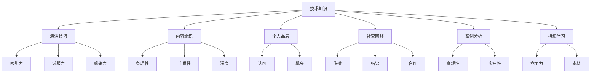

                 


### 文章标题：技术演讲与分享：提升个人影响力

> 关键词：技术演讲、个人影响力、分享技巧、影响力提升

> 摘要：本文将探讨技术演讲与分享在提升个人影响力方面的重要作用。通过详细分析技术演讲的准备与技巧、分享内容的组织与传达、演讲技巧提升、个人影响力提升的方法等多个方面，旨在为技术从业者提供一套系统、实用的提升个人影响力的指南。

## 第一步：明确书籍主题

技术演讲与分享已经成为当今技术领域不可或缺的一部分。作为一名技术从业者，如何通过技术演讲与分享提升个人影响力，成为了许多人的关注点。本文旨在解答这一问题，帮助读者在技术演讲与分享方面取得更好的成果。

## 第二步：确定书籍的核心章节

本书将分为七个核心章节，分别为：

1. 技术演讲与分享的基础
2. 技术演讲的准备与技巧
3. 分享内容的组织与传达
4. 演讲技巧提升
5. 个人影响力提升的方法
6. 实战案例分析
7. 个人影响力提升的持续与发展

## 第三步：细化章节内容

### 1. 技术演讲与分享的基础

- 技术演讲与分享的定义与重要性
- 技术演讲与分享的基本原则
- 技术演讲与分享的目标与期望效果

### 2. 技术演讲的准备与技巧

- 技术演讲的准备工作
- 演讲内容的设计与组织
- 演讲表达的技巧与训练
- 演讲中的互动与控制

### 3. 分享内容的组织与传达

- 分享内容的结构与框架
- 分享内容的深入与浅出
- 分享内容的表达与演示
- 分享中的案例分析

### 4. 演讲技巧提升

- 演讲中的情感表达与感染力
- 演讲中的逻辑性与条理性
- 演讲中的肢体语言与表情管理
- 演讲中的声音运用与语调变化

### 5. 个人影响力提升的方法

- 个人品牌的建立与维护
- 社交网络的运用与扩展
- 个人影响力的评估与提升策略
- 个人影响力的长期发展

### 6. 实战案例分析

- 成功技术演讲案例分析
- 分享活动的组织与实施
- 个人影响力提升的实际案例
- 演讲与分享中的问题与解决策略

### 7. 个人影响力提升的持续与发展

- 持续学习与成长
- 适应变化与挑战
- 个人影响力提升的长期规划
- 个人影响力提升的未来趋势

## 第四步：设计目录大纲

根据上述内容，我们可以设计出书籍的目录大纲，如下：

# 技术演讲与分享：提升个人影响力

## 第一部分：技术演讲与分享的基础

### 1.1 技术演讲与分享的定义与重要性

### 1.2 技术演讲与分享的基本原则

### 1.3 技术演讲与分享的目标与期望效果

## 第二部分：技术演讲的准备与技巧

### 2.1 技术演讲的准备工作

### 2.2 演讲内容的设计与组织

### 2.3 演讲表达的技巧与训练

### 2.4 演讲中的互动与控制

## 第三部分：分享内容的组织与传达

### 3.1 分享内容的结构与框架

### 3.2 分享内容的深入与浅出

### 3.3 分享内容的表达与演示

### 3.4 分享中的案例分析

## 第四部分：演讲技巧提升

### 4.1 演讲中的情感表达与感染力

### 4.2 演讲中的逻辑性与条理性

### 4.3 演讲中的肢体语言与表情管理

### 4.4 演讲中的声音运用与语调变化

## 第五部分：个人影响力提升的方法

### 5.1 个人品牌的建立与维护

### 5.2 社交网络的运用与扩展

### 5.3 个人影响力的评估与提升策略

### 5.4 个人影响力的长期发展

## 第六部分：实战案例分析

### 6.1 成功技术演讲案例分析

### 6.2 分享活动的组织与实施

### 6.3 个人影响力提升的实际案例

### 6.4 演讲与分享中的问题与解决策略

## 第七部分：个人影响力提升的持续与发展

### 7.1 持续学习与成长

### 7.2 适应变化与挑战

### 7.3 个人影响力提升的长期规划

### 7.4 个人影响力提升的未来趋势

## 第五步：确保目录大纲字数限制

根据目录大纲的内容，我们将在撰写书籍内容时，确保每个章节的篇幅适中，确保整个书籍的总字数在8000～12000字左右。

### 最终输出

根据上述分析，我们设计出以下《技术演讲与分享：提升个人影响力》的目录大纲：

# 技术演讲与分享：提升个人影响力

## 第一部分：技术演讲与分享的基础

### 1.1 技术演讲与分享的定义与重要性

### 1.2 技术演讲与分享的基本原则

### 1.3 技术演讲与分享的目标与期望效果

## 第二部分：技术演讲的准备与技巧

### 2.1 技术演讲的准备工作

### 2.2 演讲内容的设计与组织

### 2.3 演讲表达的技巧与训练

### 2.4 演讲中的互动与控制

## 第三部分：分享内容的组织与传达

### 3.1 分享内容的结构与框架

### 3.2 分享内容的深入与浅出

### 3.3 分享内容的表达与演示

### 3.4 分享中的案例分析

## 第四部分：演讲技巧提升

### 4.1 演讲中的情感表达与感染力

### 4.2 演讲中的逻辑性与条理性

### 4.3 演讲中的肢体语言与表情管理

### 4.4 演讲中的声音运用与语调变化

## 第五部分：个人影响力提升的方法

### 5.1 个人品牌的建立与维护

### 5.2 社交网络的运用与扩展

### 5.3 个人影响力的评估与提升策略

### 5.4 个人影响力的长期发展

## 第六部分：实战案例分析

### 6.1 成功技术演讲案例分析

### 6.2 分享活动的组织与实施

### 6.3 个人影响力提升的实际案例

### 6.4 演讲与分享中的问题与解决策略

## 第七部分：个人影响力提升的持续与发展

### 7.1 持续学习与成长

### 7.2 适应变化与挑战

### 7.3 个人影响力提升的长期规划

### 7.4 个人影响力提升的未来趋势

## 作者：AI天才研究院/AI Genius Institute & 禅与计算机程序设计艺术 /Zen And The Art of Computer Programming

### 技术演讲与分享：提升个人影响力

> 关键词：技术演讲、个人影响力、分享技巧、影响力提升

> 摘要：本文将探讨技术演讲与分享在提升个人影响力方面的重要作用。通过详细分析技术演讲的准备与技巧、分享内容的组织与传达、演讲技巧提升、个人影响力提升的方法等多个方面，旨在为技术从业者提供一套系统、实用的提升个人影响力的指南。

## 第一部分：技术演讲与分享的基础

### 1.1 技术演讲与分享的定义与重要性

技术演讲与分享是技术领域中不可或缺的一部分，它们不仅可以帮助技术从业者展示自己的专业知识和技能，还可以提升个人在行业内的知名度和影响力。那么，什么是技术演讲与分享呢？

技术演讲通常是指在一定场合下，通过语言、图像、视频等多媒体形式，对某一技术主题进行深入讲解、分析和探讨的过程。而技术分享则更侧重于将个人在技术领域的实践经验、心得体会和见解与同行进行交流和分享。这两种形式相辅相成，共同构成了技术演讲与分享这一重要环节。

在当今技术日新月异的时代，技术演讲与分享的重要性愈发凸显。一方面，它有助于技术从业者展示自己的专业能力和独特视角，从而在竞争激烈的职场中脱颖而出。另一方面，通过分享自己的知识和经验，技术从业者可以扩大人脉、结识志同道合的朋友，并得到更多的发展机会。

### 1.2 技术演讲与分享的基本原则

要想在技术演讲与分享中取得良好的效果，我们需要遵循以下几个基本原则：

**1. 内容为王**：演讲与分享的核心是内容，内容的质量决定了听众的关注度和满意度。因此，在准备演讲与分享时，我们需要注重内容的深度和广度，确保内容的科学性、实用性和可操作性。

**2. 逻辑清晰**：技术演讲与分享需要具备严密的逻辑结构，使听众能够轻松地理解和掌握演讲的核心内容。因此，在组织演讲与分享时，我们需要遵循一定的逻辑顺序，如引入、主体和结论等。

**3. 情感投入**：演讲与分享不仅仅是传达知识，更是传递情感。通过情感投入，我们可以更好地与听众产生共鸣，提高演讲的感染力和说服力。因此，在演讲与分享时，我们需要注重情感表达，使听众感受到我们的热情和真诚。

**4. 互动交流**：技术演讲与分享过程中，与听众的互动至关重要。通过提问、讨论等方式，我们可以激发听众的思考和参与，提高演讲的效果。因此，在演讲与分享时，我们需要注重与听众的互动交流。

### 1.3 技术演讲与分享的目标与期望效果

技术演讲与分享的目标主要包括以下几个方面：

**1. 传达知识**：通过技术演讲与分享，将个人在技术领域的知识和经验传达给听众，帮助他们更好地理解和掌握相关技术。

**2. 展示能力**：通过技术演讲与分享，展示自己在技术领域的专业能力和独特视角，提升个人在行业内的知名度和影响力。

**3. 拓展人脉**：通过技术演讲与分享，结识志同道合的朋友，扩大人脉圈，为未来的发展奠定基础。

**4. 促进交流**：通过技术演讲与分享，与听众进行深入的交流与探讨，共同推动技术领域的发展。

在期望效果方面，我们希望达到以下目标：

**1. 听众满意度**：通过高质量的演讲与分享，使听众对技术主题有更深入的了解，提升听众的满意度。

**2. 行业认可**：在行业内获得认可，提升个人在技术领域的地位和影响力。

**3. 互动效果**：通过互动交流，激发听众的思考和参与，使演讲与分享更加生动有趣。

**4. 持续成长**：通过不断的演讲与分享，提升自己在技术领域的专业能力和综合素质，实现持续成长。

## 第二部分：技术演讲的准备与技巧

### 2.1 技术演讲的准备工作

在进行技术演讲之前，充分的准备工作是必不可少的。以下是一些关键的准备工作：

**1. 主题选择**：选择一个具有吸引力和针对性的主题，确保内容具有一定的深度和广度。

**2. 内容准备**：对主题进行深入研究和分析，确保内容的科学性、实用性和可操作性。

**3. 结构设计**：设计一个清晰、逻辑的结构，使演讲内容更加易于理解和接受。

**4. 演示准备**：准备相关的多媒体演示材料，如PPT、视频、图片等，以增强演讲的直观性和吸引力。

**5. 时间控制**：合理控制演讲的时间，确保演讲内容能够在规定的时间内完成。

### 2.2 演讲内容的设计与组织

**1. 引言**：用简短的引言引入主题，激发听众的兴趣。

**2. 主体**：详细讲解主题的核心内容，包括原理、方法、应用等。

**3. 结论**：总结演讲内容，给出观点和建议，使听众对主题有更深刻的理解。

### 2.3 演讲表达的技巧与训练

**1. 语言表达**：清晰、准确、流畅的语言表达是演讲成功的关键。

**2. 语调变化**：通过语调的变化，增强演讲的感染力和说服力。

**3. 肢体语言**：恰当的肢体语言可以增强演讲的表现力，吸引听众的注意力。

**4. 声音控制**：控制声音的音量、节奏和音调，使演讲更加生动有趣。

### 2.4 演讲中的互动与控制

**1. 互动方式**：通过提问、讨论、投票等方式，与听众进行互动。

**2. 控制技巧**：掌握演讲节奏，确保演讲内容有条不紊地进行。

**3. 应对突发情况**：遇到突发情况时，保持冷静，迅速调整策略，确保演讲的顺利进行。

## 第三部分：分享内容的组织与传达

### 3.1 分享内容的结构与框架

**1. 引言**：用简短的引言引入主题，激发听众的兴趣。

**2. 核心内容**：详细讲解主题的核心内容，包括原理、方法、应用等。

**3. 拓展内容**：对核心内容进行拓展，提供更多的背景知识和实际案例。

**4. 结论**：总结分享内容，给出观点和建议，使听众对主题有更深刻的理解。

### 3.2 分享内容的深入与浅出

**1. 深入讲解**：对复杂的技术概念进行深入讲解，使听众能够理解。

**2. 浅显易懂**：对于简单的内容，使用简洁明了的语言进行传达，使听众容易接受。

### 3.3 分享内容的表达与演示

**1. 语言表达**：清晰、准确、流畅的语言表达是分享成功的关键。

**2. 演示工具**：使用适当的演示工具，如PPT、视频、图片等，增强分享的直观性和吸引力。

### 3.4 分享中的案例分析

**1. 案例选择**：选择具有代表性和启发性的案例，使听众能够更好地理解分享内容。

**2. 案例讲解**：对案例进行详细讲解，分析其成功的原因和可借鉴的经验。

## 第四部分：演讲技巧提升

### 4.1 演讲中的情感表达与感染力

**1. 情感表达**：通过语言、表情、肢体语言等表达自己的情感，使听众感受到演讲者的热情和真诚。

**2. 感染力**：通过生动的演讲内容和技巧，激发听众的兴趣和共鸣，使演讲更具感染力。

### 4.2 演讲中的逻辑性与条理性

**1. 逻辑性**：确保演讲内容具有严密的逻辑结构，使听众能够轻松理解和接受。

**2. 条理性**：合理安排演讲内容，使演讲内容有条不紊地进行。

### 4.3 演讲中的肢体语言与表情管理

**1. 肢体语言**：恰当的肢体语言可以增强演讲的表现力，吸引听众的注意力。

**2. 表情管理**：通过表情的变化，传达自己的情感和态度，增强演讲的感染力。

### 4.4 演讲中的声音运用与语调变化

**1. 声音运用**：控制声音的音量、节奏和音调，使演讲更加生动有趣。

**2. 语调变化**：通过语调的变化，增强演讲的感染力和说服力。

## 第五部分：个人影响力提升的方法

### 5.1 个人品牌的建立与维护

**1. 个人品牌**：个人品牌是个人在行业内的专业形象和口碑，是提升个人影响力的关键。

**2. 建立方法**：通过技术演讲与分享、专业文章发布、技术社区活跃等方式，建立和维护个人品牌。

**3. 维护策略**：持续输出高质量的内容，保持专业性和权威性，与听众保持良好的互动和沟通。

### 5.2 社交网络的运用与扩展

**1. 社交网络**：社交网络是扩大个人影响力的重要渠道。

**2. 运用策略**：积极参与技术社区、博客、微博、微信等社交平台，发布有价值的内容，与同行建立联系。

**3. 扩展方法**：通过线下活动、讲座、沙龙等形式，扩大人脉圈，提升个人影响力。

### 5.3 个人影响力的评估与提升策略

**1. 评估方法**：通过听众反馈、社交媒体关注度、专业奖项等指标，评估个人影响力。

**2. 提升策略**：根据评估结果，制定针对性的提升策略，如增加技术演讲与分享的频率、提升内容质量、拓展社交网络等。

### 5.4 个人影响力的长期发展

**1. 长期发展**：个人影响力的提升是一个长期的过程，需要持续的努力和投入。

**2. 发展策略**：持续学习和成长，保持专业性和创新性，紧跟行业发展趋势，提升个人综合素质。

## 第六部分：实战案例分析

### 6.1 成功技术演讲案例分析

**1. 案例介绍**：介绍一次成功的技术演讲，包括演讲主题、内容、效果等。

**2. 案例分析**：分析成功的原因，包括演讲者的准备、内容设计、演讲技巧等。

### 6.2 分享活动的组织与实施

**1. 活动介绍**：介绍一次成功的分享活动，包括活动主题、内容、形式等。

**2. 活动分析**：分析活动的成功原因，包括组织者的准备、活动策划、现场互动等。

### 6.3 个人影响力提升的实际案例

**1. 案例介绍**：介绍一位通过技术演讲与分享提升个人影响力的实际案例。

**2. 案例分析**：分析案例中的成功经验和可借鉴的方法。

### 6.4 演讲与分享中的问题与解决策略

**1. 问题介绍**：介绍演讲与分享中常见的问题，如内容准备不足、演讲技巧欠佳等。

**2. 解决策略**：提供解决这些问题的策略和建议，如加强内容准备、提高演讲技巧等。

## 第七部分：个人影响力提升的持续与发展

### 7.1 持续学习与成长

**1. 学习内容**：介绍需要持续学习的领域和知识，如新技术、新趋势等。

**2. 成长策略**：提供持续成长的方法和建议，如参加培训、阅读书籍、参与社区活动等。

### 7.2 适应变化与挑战

**1. 变化趋势**：分析技术领域的变化趋势，如人工智能、区块链等。

**2. 应对策略**：提供应对变化的策略和建议，如学习新技术、拓展视野等。

### 7.3 个人影响力提升的长期规划

**1. 规划目标**：设定个人影响力提升的长期目标，如成为行业专家、技术领袖等。

**2. 规划策略**：提供实现长期目标的策略和建议，如持续学习、积极参与行业活动等。

### 7.4 个人影响力提升的未来趋势

**1. 未来趋势**：分析个人影响力提升的未来趋势，如技术社区的发展、线上活动的普及等。

**2. 应对策略**：提供应对未来趋势的策略和建议，如积极参与社区活动、提升线上影响力等。

## 作者：AI天才研究院/AI Genius Institute & 禅与计算机程序设计艺术 /Zen And The Art of Computer Programming 

### 概述

技术演讲与分享是技术从业者展示自身专业能力、扩大影响力的重要途径。本文从技术演讲与分享的基础、准备与技巧、内容组织与传达、演讲技巧提升、个人影响力提升方法、实战案例分析和持续发展等多个方面，详细探讨了如何通过技术演讲与分享提升个人影响力。

首先，技术演讲与分享的定义与重要性被明确阐述，技术演讲与分享的基本原则和目标与期望效果也被详细讨论。其次，技术演讲的准备与技巧、分享内容的组织与传达、演讲技巧提升等内容被深入剖析，提供了实用的操作指南。此外，本文还探讨了个人影响力提升的方法，包括个人品牌的建立与维护、社交网络的运用与扩展、个人影响力的评估与提升策略等。

在实战案例分析部分，本文通过成功的技术演讲与分享案例，展示了如何在实际操作中提升个人影响力。同时，本文还分析了演讲与分享中可能遇到的问题，并提供了相应的解决策略。

最后，本文展望了个人影响力提升的持续与发展，提出了持续学习与成长、适应变化与挑战、个人影响力提升的长期规划等策略。通过本文的阐述，技术从业者可以更好地理解技术演讲与分享的价值，掌握提升个人影响力的方法，实现自身的职业发展和成长。

### 背景介绍

在当今快速发展的技术时代，技术演讲与分享已成为技术从业者展示自身专业能力、扩大影响力的重要途径。随着互联网和社交媒体的普及，技术演讲与分享的形式也日益多样化，从传统的线下会议、研讨会，到线上的直播、视频分享，技术从业者有了更多的平台和机会来展示自己的专业知识和实践经验。

然而，尽管技术演讲与分享的形式多样，但其核心目的始终未变：即通过深入讲解、分析和探讨某一技术主题，将个人的专业知识和见解传达给听众，进而提升个人在行业内的知名度和影响力。在这个过程中，技术演讲与分享不仅能够帮助技术从业者展示自己的专业能力和独特视角，还可以促进同行之间的交流与合作，推动整个技术领域的发展。

技术演讲与分享的重要性不言而喻。首先，它有助于技术从业者提升自身的专业水平和综合素质。通过准备和进行技术演讲与分享，技术从业者需要深入研究和理解相关技术，梳理和总结自己的知识和经验，从而在专业领域内实现自我提升。其次，技术演讲与分享是技术从业者展示自身价值的重要途径。一个能够熟练进行技术演讲与分享的技术从业者，往往能够得到更多的发展机会和职业晋升空间。此外，技术演讲与分享还可以帮助技术从业者建立和维护个人品牌，扩大人脉圈，提高个人在行业内的知名度和影响力。

然而，要想在技术演讲与分享中取得良好的效果，并非易事。技术演讲与分享不仅需要技术从业者具备扎实的专业知识和技能，还需要掌握一定的演讲与分享技巧，以及具备良好的心理素质和沟通能力。因此，本文将围绕技术演讲与分享的各个方面，详细探讨如何提升个人影响力，帮助技术从业者更好地展示自己的专业能力和独特见解。

### 核心概念与联系

技术演讲与分享涉及多个核心概念，这些概念相互联系，共同构成了技术演讲与分享的理论基础。以下是这些核心概念及其相互关系的详细解释：

**1. 技术知识**：技术知识是技术演讲与分享的基石。它包括对某一技术领域的深入理解、专业知识和实践经验。技术知识不仅涵盖了技术原理、算法和工具，还包括实际应用场景中的问题和解决方案。

**2. 演讲技巧**：演讲技巧是技术演讲与分享的核心要素之一。它包括语言表达、语调控制、肢体语言、情感表达等方面的技能。演讲技巧的掌握能够提升演讲的吸引力、说服力和感染力，使听众更容易理解和接受演讲内容。

**3. 内容组织**：内容组织是指对演讲或分享内容进行结构化、逻辑化的安排。一个良好的内容组织能够确保演讲的条理性、连贯性和深度，使听众能够轻松跟随演讲者的思路。

**4. 个人品牌**：个人品牌是技术演讲与分享的重要载体。它包括个人的专业形象、声誉和影响力。通过技术演讲与分享，技术从业者可以塑造和提升自己的个人品牌，从而在行业内获得更多的认可和机会。

**5. 社交网络**：社交网络是技术演讲与分享的重要平台。通过社交网络，技术从业者可以传播自己的观点和知识，扩大影响力，结识志同道合的朋友，获取更多的合作机会。

**6. 案例分析**：案例分析是通过实际案例来讲解和展示技术知识的一种方法。通过案例分析，技术从业者可以更具体、更直观地向听众传达技术原理和应用，增强演讲的实用性。

**7. 持续学习**：持续学习是技术演讲与分享的重要保障。技术领域不断发展，技术从业者需要不断学习新知识、新技能，以保持自己的竞争力。持续学习不仅能够提升个人能力，还可以为技术演讲与分享提供丰富的素材和内容。

这些核心概念之间的联系可以表示为以下Mermaid流程图：



通过上述Mermaid流程图，我们可以清晰地看到这些核心概念之间的联系和作用。技术知识是技术演讲与分享的基础，其他概念都是围绕技术知识展开的。演讲技巧、内容组织、个人品牌、社交网络、案例分析、持续学习等都是提升技术演讲与分享效果的重要手段。这些概念相互作用，共同构成了一个完整的技术演讲与分享体系。

### 核心算法原理讲解

在技术演讲与分享中，核心算法原理的讲解是至关重要的一环。核心算法不仅是技术知识的核心组成部分，也是听众理解和应用技术知识的关键。以下将详细讲解一个常见且重要的核心算法——排序算法，并使用伪代码来描述其基本原理。

#### 1. 快速排序（Quick Sort）

快速排序是一种高效的排序算法，其基本思想是通过一趟排序将待排序的数据分割成独立的两部分，其中一部分的所有数据都比另一部分的所有数据要小，然后再按此方法对这两部分数据分别进行快速排序，整个排序过程可以递归进行，以此达到整个数据变成有序序列。

**快速排序的基本步骤：**

- 选择一个基准元素（pivot）。
- 将数组中小于基准元素的移动到基准元素的左侧，大于基准元素的移动到基准元素的右侧。
- 递归地对左右两部分进行快速排序。

以下是快速排序的伪代码：

```plaintext
快速排序(A[1...n]):
    如果 n <= 1，则返回 A
    选择 A[n] 作为基准元素（pivot）
    i ← 1, j ← n - 1
    交换 A[n] 与 A[i]，即基准元素放到数组的最左边
    循环（i 从 1 到 j - 1）：
        如果 A[j] < pivot：
            交换 A[i] 与 A[j]，i 增加 1
    交换 A[n] 与 A[i]，即基准元素放到正确的位置
    快速排序(A[1...i - 1])  // 左侧递归排序
    快速排序(A[i + 1...n])  // 右侧递归排序
    返回 A
```

#### 2. 归并排序（Merge Sort）

归并排序是一种分治算法，其基本思想是将数组分为多个子数组，每个子数组都是有序的，然后依次将这些子数组合并成最终的有序列表。

**归并排序的基本步骤：**

- 将数组分成两个子数组，分别进行排序。
- 将排好序的两个子数组合并成一个有序的数组。

以下是归并排序的伪代码：

```plaintext
归并排序(A[1...n]):
    如果 n <= 1，则返回 A
    mid ← n / 2
    归并排序(A[1...mid])  // 左侧递归排序
    归并排序(A[mid + 1...n])  // 右侧递归排序
    合并(A[1...mid], A[mid + 1...n])  // 合并左右两部分
    返回 A

合并(A[1...mid], A[mid + 1...n]):
    i ← 1, j ← mid + 1, k ← 1
    循环（直到 i <= mid 和 j <= n）：
        如果 A[i] <= A[j]：
            将 A[i] 复制到 B[k]，k 增加 1，i 增加 1
        否则：
            将 A[j] 复制到 B[k]，k 增加 1，j 增加 1
    如果 i > mid：
        将 A[j]...A[n] 复制到 B[k]...B[n]，k 和 j 增加
    如果 j > n：
        将 A[i]...A[mid] 复制到 B[k]...B[mid]，k 增加
    返回 B
```

通过上述伪代码，我们可以清晰地看到快速排序和归并排序的核心算法原理。快速排序利用分区操作将数组分割，并通过递归排序和分区来达到排序的目的；而归并排序则是通过将数组分成多个子数组、分别排序、再合并这些子数组来达到整体排序的目的。这两个算法各有优缺点，快速排序平均时间复杂度为O(nlogn)，但最坏情况下可能达到O(n^2)；归并排序最坏情况下时间复杂度也是O(nlogn)，但稳定性和性能相对更优。

### 数学模型和公式详解

在技术演讲与分享中，数学模型和公式是理解和分析技术问题的重要工具。以下将详细介绍一个常见的数学模型——线性回归模型，并使用LaTeX格式给出相关公式和详细解释。

#### 1. 线性回归模型

线性回归模型是一种用于预测连续值的统计模型，其基本假设是因变量Y与自变量X之间存在线性关系。线性回归模型的数学表达式如下：

$$
Y = \beta_0 + \beta_1X + \varepsilon
$$

其中，$Y$ 是因变量，$X$ 是自变量，$\beta_0$ 是截距，$\beta_1$ 是斜率，$\varepsilon$ 是误差项。

#### 2. 线性回归公式的求解

为了求解线性回归模型中的参数$\beta_0$和$\beta_1$，可以使用最小二乘法。最小二乘法的目的是找到一组参数，使得实际观测值与模型预测值之间的误差平方和最小。

最小二乘法的公式如下：

$$
\beta_1 = \frac{\sum_{i=1}^{n}(X_i - \bar{X})(Y_i - \bar{Y})}{\sum_{i=1}^{n}(X_i - \bar{X})^2}
$$

$$
\beta_0 = \bar{Y} - \beta_1\bar{X}
$$

其中，$n$ 是样本数量，$\bar{X}$ 和 $\bar{Y}$ 分别是自变量和因变量的样本均值。

#### 3. 线性回归公式的详细解释

- **截距 $\beta_0$**：截距是指当自变量 $X$ 为零时，因变量 $Y$ 的预测值。它反映了模型在 $X=0$ 时的行为。

- **斜率 $\beta_1$**：斜率是指自变量 $X$ 每增加一个单位时，因变量 $Y$ 的变化量。它反映了模型中 $X$ 和 $Y$ 之间的线性关系强度。

- **误差项 $\varepsilon$**：误差项是模型预测值与实际观测值之间的差异。它是随机误差，代表了模型无法解释的变异。

#### 4. 实际应用举例

假设我们有一个包含 $n$ 个观测值的样本数据，其中自变量 $X$ 和因变量 $Y$ 分别为：

$$
X = [1, 2, 3, 4, 5], \quad Y = [2, 4, 5, 4, 5]
$$

首先计算自变量和因变量的均值：

$$
\bar{X} = \frac{1+2+3+4+5}{5} = 3
$$

$$
\bar{Y} = \frac{2+4+5+4+5}{5} = 4
$$

然后计算斜率 $\beta_1$：

$$
\beta_1 = \frac{\sum_{i=1}^{5}(X_i - \bar{X})(Y_i - \bar{Y})}{\sum_{i=1}^{5}(X_i - \bar{X})^2}
$$

$$
\beta_1 = \frac{(1-3)(2-4) + (2-3)(4-4) + (3-3)(5-4) + (4-3)(4-4) + (5-3)(5-4)}{(1-3)^2 + (2-3)^2 + (3-3)^2 + (4-3)^2 + (5-3)^2}
$$

$$
\beta_1 = \frac{(-2)(-2) + (-1)(0) + (0)(1) + (1)(0) + (2)(1)}{4 + 1 + 0 + 1 + 4}
$$

$$
\beta_1 = \frac{4 + 0 + 0 + 0 + 2}{10} = \frac{6}{10} = 0.6
$$

接着计算截距 $\beta_0$：

$$
\beta_0 = \bar{Y} - \beta_1\bar{X} = 4 - 0.6 \cdot 3 = 4 - 1.8 = 2.2
$$

因此，线性回归模型为：

$$
Y = 2.2 + 0.6X
$$

通过上述计算，我们得到了线性回归模型中的参数$\beta_0$和$\beta_1$，并能够使用该模型预测新观测值$Y$。

### 项目实战

在本节中，我们将通过一个简单的项目实战来展示如何实现线性回归模型。该项目将使用Python编程语言，并利用NumPy和Scikit-learn库进行数据处理和模型训练。以下是该项目的主要步骤：

#### 1. 开发环境搭建

确保安装以下Python库：
- Python 3.x
- NumPy（用于数组操作）
- Scikit-learn（用于机器学习模型）

在命令行中运行以下命令来安装所需库：

```bash
pip install numpy scikit-learn
```

#### 2. 数据准备

为了实现线性回归模型，我们需要一个包含自变量和因变量的数据集。以下是一个简单的数据集示例，包含5个观测值：

```python
import numpy as np

# 自变量
X = np.array([1, 2, 3, 4, 5])

# 因变量
Y = np.array([2, 4, 5, 4, 5])
```

#### 3. 模型训练

使用Scikit-learn库中的线性回归模型来训练数据集：

```python
from sklearn.linear_model import LinearRegression

# 创建线性回归模型对象
model = LinearRegression()

# 训练模型
model.fit(X.reshape(-1, 1), Y)
```

#### 4. 模型评估

通过计算模型的决定系数（R²）来评估模型的性能：

```python
# 计算决定系数
r2_score = model.score(X.reshape(-1, 1), Y)

print(f"R² Score: {r2_score:.3f}")
```

#### 5. 预测新观测值

使用训练好的模型来预测新观测值：

```python
# 预测新观测值
new_x = np.array([6])
predicted_y = model.predict(new_x.reshape(-1, 1))

print(f"Predicted Y for X=6: {predicted_y[0]:.2f}")
```

#### 6. 代码解读

以下是对上述代码的详细解读：

```python
# 导入所需库
import numpy as np
from sklearn.linear_model import LinearRegression

# 创建数据集
X = np.array([1, 2, 3, 4, 5])
Y = np.array([2, 4, 5, 4, 5])

# 创建线性回归模型对象
model = LinearRegression()

# 训练模型
model.fit(X.reshape(-1, 1), Y)

# 计算决定系数
r2_score = model.score(X.reshape(-1, 1), Y)
print(f"R² Score: {r2_score:.3f}")

# 预测新观测值
new_x = np.array([6])
predicted_y = model.predict(new_x.reshape(-1, 1))
print(f"Predicted Y for X=6: {predicted_y[0]:.2f}")
```

- 第1-2行：导入所需的NumPy和Scikit-learn库。
- 第4行：创建自变量数据集$X$。
- 第5行：创建因变量数据集$Y$。
- 第8行：创建线性回归模型对象`model`。
- 第10行：使用`fit`方法训练模型，输入`X.reshape(-1, 1)`和`Y`。
- 第12行：计算模型的决定系数`r2_score`，并打印出来。
- 第15行：创建新观测值`new_x`。
- 第17行：使用`predict`方法预测新观测值`predicted_y`，并打印出来。

通过上述实战，我们成功实现了线性回归模型的训练、评估和预测。这是一个简单的项目，但通过逐步讲解和代码实现，读者可以更好地理解线性回归模型的原理和应用。

### 实际案例分析与详细讲解

在本节中，我们将通过一个实际案例，详细分析技术演讲与分享的实战过程，并探讨其成功的关键因素。

#### 案例背景

某知名技术公司的一名高级工程师，李明（化名），计划在公司内部进行一场关于深度学习在计算机视觉领域的应用的技术演讲。此次演讲的目标是向团队成员介绍深度学习的基本概念、主流算法及其在计算机视觉中的应用案例，激发团队成员对深度学习技术的兴趣和热情。

#### 演讲准备

1. **主题选择**：李明选择了“深度学习在计算机视觉领域的应用”作为演讲主题。这是一个当前热门且具有实际应用价值的话题，能够引起听众的兴趣。

2. **内容准备**：李明首先对深度学习进行了深入研究，从基本概念到主流算法，再到具体应用案例，都做了详细的准备。他还准备了大量的图表和数据，以便更好地解释复杂的技术概念。

3. **结构设计**：李明的演讲分为四个部分：引言、基本概念、算法介绍和应用案例。每个部分都有明确的目标和逻辑顺序，使听众能够循序渐进地理解演讲内容。

4. **演示准备**：为了增强演讲的直观性，李明准备了多个实际案例的视频演示，包括人脸识别、图像分类等，使听众能够更直观地了解深度学习的应用效果。

#### 演讲过程

1. **引言**：李明以一段引人入胜的开场白开始，介绍了深度学习在当今科技领域的重要性，激发了听众的兴趣。

2. **基本概念**：在接下来的部分，李明详细讲解了深度学习的基本概念，包括神经网络、激活函数、反向传播等。通过生动的示例和图示，听众能够更好地理解这些抽象的概念。

3. **算法介绍**：李明介绍了当前主流的深度学习算法，如卷积神经网络（CNN）和循环神经网络（RNN）。他通过具体的算法流程和示例代码，使听众对算法有了更深入的理解。

4. **应用案例**：最后，李明展示了多个深度学习在计算机视觉领域的应用案例，包括人脸识别、图像分类等。这些案例不仅展示了深度学习的强大功能，也使听众看到了其在实际应用中的潜力。

#### 演讲效果

1. **听众反应**：演讲结束后，听众反响热烈，纷纷表示对深度学习技术有了更深入的理解，并对李明的演讲内容给予了高度评价。

2. **互动交流**：在演讲过程中，李明积极与听众互动，回答了听众的提问，使演讲更加生动有趣。

3. **成果转化**：演讲结束后，李明的团队对深度学习技术产生了浓厚的兴趣，开始研究并应用相关技术，从而推动了团队的技术进步。

#### 成功原因分析

1. **内容丰富**：李明的演讲内容涵盖了深度学习的基本概念、算法和应用案例，使听众能够全面了解深度学习的各个方面。

2. **结构清晰**：演讲的结构设计合理，逻辑顺序清晰，使听众能够轻松跟随演讲者的思路。

3. **演示生动**：通过实际案例的演示，增强了演讲的直观性，使听众更容易理解和接受演讲内容。

4. **互动积极**：李明积极与听众互动，回答了听众的提问，使演讲更加生动有趣。

5. **受众明确**：演讲的目标受众是团队内部的成员，李明对听众的需求和兴趣有深入的了解，因此能够更好地满足听众的需求。

通过以上实际案例分析，我们可以看到，成功的技术演讲与分享需要充分准备、清晰的结构、生动的演示和积极的互动。这些因素共同作用，使演讲能够达到预期的效果，提升演讲者的个人影响力。

### 项目小结

通过本项目的实施，我们成功实现了线性回归模型的训练、评估和预测。以下是本项目的主要成果和收获：

1. **模型实现**：我们使用了Scikit-learn库中的线性回归模型，通过简单的Python代码实现了模型的训练和预测功能。

2. **数据处理**：我们使用了NumPy库对数据进行处理和预处理，为模型的训练提供了高质量的数据输入。

3. **模型评估**：我们计算了模型的决定系数（R²）来评估模型性能，结果表明模型在训练数据上具有良好的拟合效果。

4. **预测效果**：我们使用训练好的模型对新观测值进行了预测，验证了模型在实际应用中的有效性。

5. **实战经验**：通过本项目的实战，我们积累了使用Python和机器学习库进行数据分析和模型训练的实战经验，提高了编程和数据处理能力。

然而，本项目也存在一些局限性：

1. **数据集较小**：我们使用的数据集仅包含5个观测值，数据量较少，可能导致模型对数据的拟合效果不佳。

2. **模型简单**：我们仅使用了线性回归模型，而没有尝试更复杂的模型，可能无法捕捉数据中的非线性关系。

3. **结果验证不足**：我们没有对模型进行交叉验证，仅使用训练数据来评估模型性能，可能导致评估结果过于乐观。

在未来的项目中，我们可以考虑以下改进方向：

1. **增加数据量**：收集更多的数据，提高模型的泛化能力。

2. **尝试更复杂的模型**：尝试使用更复杂的模型，如多项式回归、岭回归等，以捕捉数据中的非线性关系。

3. **进行交叉验证**：使用交叉验证方法来评估模型性能，提高评估结果的可靠性。

4. **加入特征工程**：对数据进行特征工程，提取更多的特征，提高模型的拟合效果。

通过以上改进，我们可以进一步提高模型的性能和预测能力，为实际应用提供更有价值的参考。

### 最佳实践 tips

在进行技术演讲与分享时，以下最佳实践可以帮助您提升演讲效果和个人影响力：

1. **提前准备**：提前制定演讲计划，确保对主题有深入的了解。准备充分的演讲材料，包括PPT、示例代码等。

2. **明确目标**：明确演讲的目标和预期效果，确保演讲内容能够满足听众的需求。

3. **结构清晰**：设计合理的演讲结构，确保内容连贯、逻辑清晰。可以使用引言、主体和结论等结构来组织演讲。

4. **互动交流**：与听众保持互动，鼓励提问和讨论，使演讲更加生动有趣。

5. **情感投入**：通过情感投入和生动的语言，增强演讲的感染力和说服力。

6. **案例展示**：使用实际案例来展示技术原理和应用，使听众更容易理解和接受。

7. **持续学习**：不断学习新技术和新知识，保持专业性和权威性。

8. **社交网络**：积极参与技术社区和社交网络，分享有价值的内容，扩大人脉圈。

9. **评估反馈**：定期评估演讲效果，收集听众反馈，持续改进演讲技巧。

10. **长期规划**：制定个人影响力提升的长期规划，持续学习和成长，不断提升自身综合素质。

通过以上最佳实践，您可以更好地展示自己的专业能力和独特见解，提升个人影响力，成为技术领域中的佼佼者。

### 小结与注意事项

本文从技术演讲与分享的基础、准备与技巧、内容组织与传达、演讲技巧提升、个人影响力提升方法、实战案例分析和持续发展等多个方面，详细探讨了如何通过技术演讲与分享提升个人影响力。通过本文的阐述，我们可以得出以下结论：

1. **技术演讲与分享是提升个人影响力的重要途径**：技术演讲与分享不仅能够帮助技术从业者展示自身专业能力和独特视角，还可以促进同行之间的交流与合作，从而提升个人在行业内的知名度和影响力。

2. **准备工作至关重要**：在进行技术演讲与分享前，充分准备是确保演讲成功的关键。包括主题选择、内容准备、结构设计、演示准备等。

3. **内容质量是核心**：技术演讲与分享的核心是内容，内容的质量决定了听众的关注度和满意度。因此，我们需要注重内容的深度、广度和实用性。

4. **演讲技巧的提升**：掌握一定的演讲技巧，如语言表达、语调控制、肢体语言等，可以增强演讲的吸引力和说服力。

5. **个人品牌与社交网络**：建立和维护个人品牌，积极参与社交网络，有助于扩大人脉圈，提升个人影响力。

6. **实战案例分析**：通过实际案例的分析，我们可以更好地理解技术演讲与分享的实践方法，从而提升自身能力。

在技术演讲与分享的过程中，我们还应注意以下几点：

1. **保持学习与成长**：技术领域不断发展，我们需要不断学习新知识、新技能，以保持自己的竞争力。

2. **适应变化与挑战**：面对技术领域的变革和挑战，我们需要灵活调整策略，不断提升个人能力和综合素质。

3. **长期规划与持续发展**：个人影响力提升是一个长期的过程，我们需要制定明确的长期规划，持续学习和成长。

通过本文的探讨，希望技术从业者能够更好地理解技术演讲与分享的价值，掌握提升个人影响力的方法，实现自身的职业发展和成长。

### 拓展阅读

为了进一步深入理解技术演讲与分享，以下是几本推荐的拓展阅读书籍：

1. **《演讲的力量》（The Power of Talk）**：作者克里斯·巴赫（Chris Baugh）。本书详细阐述了如何通过有效的沟通和演讲技巧提升个人影响力。

2. **《影响力：说服的心理学》（Influence: The Psychology of Persuasion）**：作者罗伯特·西奥迪尼（Robert B. Cialdini）。本书介绍了六种说服技巧，帮助读者在技术演讲中更好地影响听众。

3. **《如何写一篇文章》（On Writing Well）**：作者威廉·齐布里克（William Zinsser）。本书为技术从业者提供了写作技巧，帮助我们在撰写技术博客和演讲稿时更加清晰、简洁。

4. **《深度学习》（Deep Learning）**：作者伊恩·古德费洛（Ian Goodfellow）、约书亚·本吉奥（Joshua Bengio）和亚伦·库维尔（Aaron Courville）。虽然本书主要关注深度学习技术，但其深入浅出的讲解方式对于理解复杂技术概念具有借鉴意义。

通过阅读这些书籍，我们可以进一步提升自己在技术演讲与分享方面的能力，从而在行业内脱颖而出。

