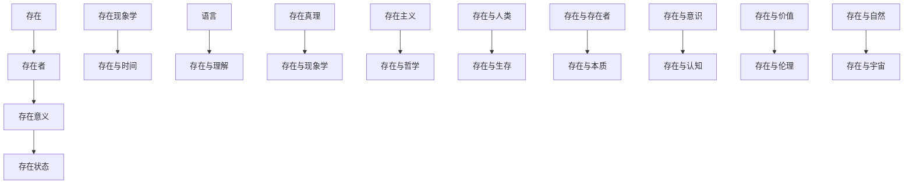
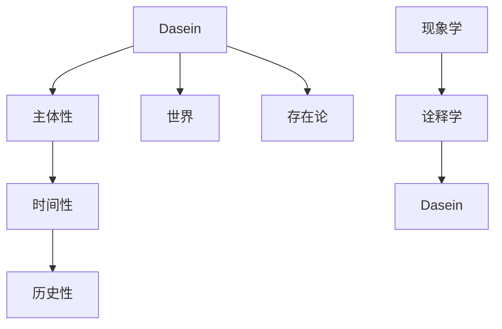
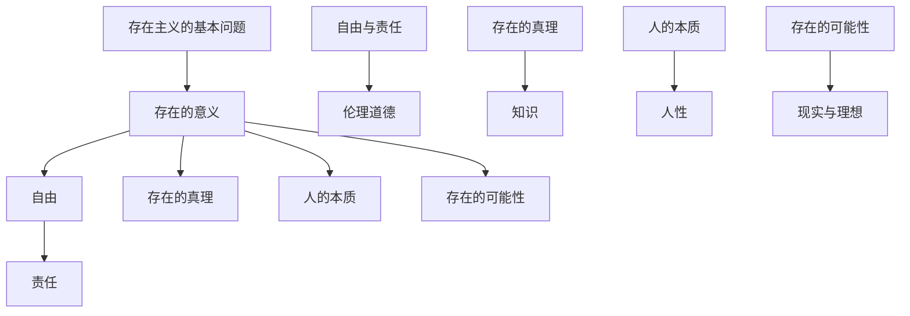
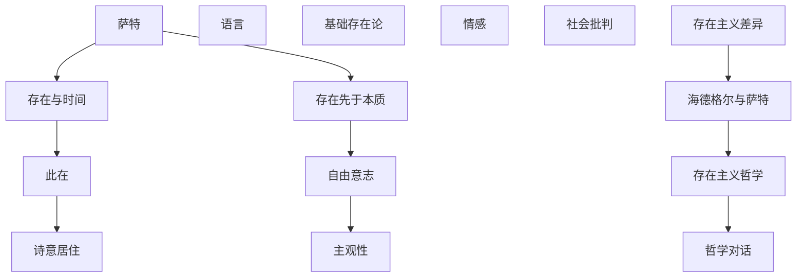
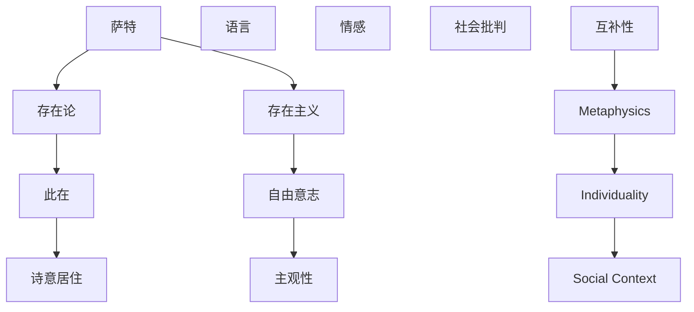

                 


### 1.1 海德格尔的存在概念

海德格尔的存在概念是他对哲学的根本性贡献之一。他将存在视为一种存在的可能性，而非实体或物质。这种观点与传统哲学中对存在的解释有着显著的不同。在海德格尔看来，存在不仅仅是一个被观察的对象，而是世界本身的构成要素。

**核心概念与联系**

为了更好地理解海德格尔的存在概念，我们可以通过以下 Mermaid 流程图来描述其核心概念和相互联系：



在这个流程图中，我们可以看到存在概念是如何与其他哲学概念相联系的。存在不仅仅是关于事物本身，更是关于事物存在的意义和状态。

**核心算法原理讲解**

为了进一步解释海德格尔的存在概念，我们可以使用伪代码来描述其核心原理：

```python
# Pseudocode for Heidegger's concept of being
def being():
    """
    This function explains the concept of being as proposed by Heidegger.
    """
    print("Being is not just an object of perception but the fundamental structure of the world.")
    print("It is not about the entities but the possibility of existence.")
    print("Being is a fundamental concept that relates to meaning, state, and existence.")
    print("It is also connected to phenomenology, language, truth, and human consciousness.")
```

通过这个伪代码，我们可以看到海德格尔的存在概念是如何涵盖多个哲学领域的。

**数学公式和详细讲解**

海德格尔的存在概念也与数学模型和公式有着深刻的联系。例如，他提出的“存在与时间”概念可以通过以下公式来表示：

$$
\text{存在} = \text{时间} \times \text{可能性}
$$

这个公式表示存在是通过时间来体现的，而时间是存在可能性的基础。我们可以通过以下详细讲解来理解这个公式：

1. **时间**：时间是存在的基本维度，没有时间就没有存在。时间是一切存在的框架。
2. **可能性**：可能性是存在的基础，它表明存在不仅仅是一个静态的实体，而是一个动态的过程。
3. **存在**：通过时间和可能性的结合，我们可以理解存在的本质。存在是一个动态的、不断变化的过程。

**举例说明**

为了更好地理解这个概念，我们可以通过一个简单的例子来说明：

假设我们有一个计算机程序。在这个程序中，存在是通过时间的流逝来实现的。程序中的每一个操作都可以被视为存在的一个瞬间。随着时间的推移，程序的状态在不断变化，这表明存在是一个动态的过程。

**最佳实践 tips**

- **理解存在概念**：深入理解海德格尔的存在概念对于哲学研究非常重要。它可以帮助我们更好地理解世界的本质。
- **跨学科研究**：海德格尔的存在概念与多个哲学领域密切相关，包括现象学、诠释学、语言哲学等。跨学科的研究可以帮助我们更全面地理解存在概念。
- **实际应用**：尽管海德格尔的存在概念起源于哲学，但它也可以应用于其他领域，如计算机科学、文学、艺术等。

**小结**

海德格尔的存在概念是他哲学体系的核心。通过理解存在概念，我们可以更深入地理解世界的本质。这个概念不仅对哲学研究有重要意义，也可以应用于其他领域。

**注意事项**

- **复杂性**：海德格尔的存在概念非常复杂，需要深入的哲学知识和思考才能理解。
- **争议性**：海德格尔的存在概念在哲学界存在争议，不同学者有不同的解释和理解。

**拓展阅读**

- 海德格尔，《存在与时间》
- 马丁·海德格尔，《尼采》
- 萨特，《存在与虚无》

作者：AI天才研究院/AI Genius Institute & 禅与计算机程序设计艺术 /Zen And The Art of Computer Programming

----------------------------------------------------------------

### 1.2 Dasein（此在）

海德格尔的“此在”（Dasein）是他哲学体系中的核心概念，代表人类存在的独特方式。Dasein既不是指“存在”的状态，也不是指“某个人”，而是一种存在方式，是存在本身的一种展现。Dasein意味着“在这个世界中存在”，它包含了存在的意义、存在的方式以及人与世界的互动。

**核心概念与联系**

为了更直观地理解Dasein的概念，我们可以使用以下Mermaid流程图来描述其核心概念及其相互联系：



在这个流程图中，我们可以看到Dasein是如何与主体性、时间性、历史性、世界、存在论以及现象学和诠释学等概念相互关联的。

**核心算法原理讲解**

为了进一步解释Dasein的概念，我们可以使用伪代码来描述其核心原理：

```python
# Pseudocode for Heidegger's concept of Dasein
def Dasein():
    """
    This function explains the concept of Dasein as proposed by Heidegger.
    """
    print("Dasein is the specific way in which human beings exist.")
    print("It is characterized by its thrownness (Geworfenheit) and being-world-open (Mitsein).")
    print("Dasein is always already engaged with the world and understanding itself in the context of history.")
    print("Dasein's being is not a static state but a dynamic engagement with the world.")
```

通过这个伪代码，我们可以看到Dasein是如何通过其与世界的动态互动来定义人类存在的。

**数学公式和详细讲解**

Dasein的概念也可以通过数学模型和公式来阐述。例如，我们可以使用以下公式来表示Dasein的核心特性：

$$
\text{Dasein} = \text{主体性} \times \text{时间性} \times \text{历史性} \times \text{世界性}
$$

这个公式表示Dasein是主体性、时间性、历史性和世界性的综合体现。我们可以通过以下详细讲解来理解这个公式：

1. **主体性**：Dasein是主动的，它是通过个体的主体性来展现的。主体性是Dasein的核心特征，代表了个体与世界的互动方式。
2. **时间性**：Dasein是在时间中存在的，时间是Dasein的基础维度。时间性代表了Dasein的历史性和连续性。
3. **历史性**：Dasein不仅仅是存在于现在，还存在于历史之中。历史性代表了Dasein的根源和演变过程。
4. **世界性**：Dasein与世界紧密相连，它是在世界中存在的。世界性代表了Dasein的存在背景和环境。

**举例说明**

为了更好地理解Dasein的概念，我们可以通过一个简单的例子来说明：

假设我们有一个学生在学校学习。这个学生的存在方式就是Dasein的体现。学生不仅是存在于学校的实体，更是通过学习、与他人互动、理解自己的历史和未来等方式来展现其存在。

**最佳实践 tips**

- **深入理解Dasein**：深入理解Dasein的概念对于哲学研究和日常生活都有很大的帮助。它可以帮助我们更好地理解人类存在的本质。
- **跨学科应用**：Dasein的概念不仅适用于哲学领域，还可以应用于心理学、社会学、教育学等跨学科领域。
- **实践反思**：通过反思自己的日常生活，我们可以更深入地理解Dasein的概念。

**小结**

Dasein是海德格尔哲学体系中的核心概念，它代表了人类存在的独特方式。通过理解Dasein，我们可以更深入地理解人类存在的本质和意义。

**注意事项**

- **复杂性**：Dasein的概念非常复杂，需要深入的哲学知识和思考才能理解。
- **争议性**：Dasein的概念在哲学界存在争议，不同学者有不同的解释和理解。

**拓展阅读**

- 海德格尔，《存在与时间》
- 萨特，《存在与虚无》
- 马克斯·舍勒，《人格论》

作者：AI天才研究院/AI Genius Institute & 禅与计算机程序设计艺术 /Zen And The Art of Computer Programming

----------------------------------------------------------------

### 1.3 存在主义的基本问题

海德格尔的存在主义哲学探讨了一系列基本问题，这些问题的核心是关于人类存在的意义、自由和责任。以下是存在主义哲学中的一些基本问题及其关联：

**核心概念与联系**

为了更清晰地展示这些基本问题及其相互关系，我们可以使用以下 Mermaid 流程图：



在这个流程图中，我们可以看到存在主义的基本问题是如何相互关联的。每个问题都与其他问题有着深刻的联系，构成了一个复杂的哲学体系。

**核心算法原理讲解**

为了解释这些基本问题，我们可以使用伪代码来描述它们的核心原理：

```python
# Pseudocode for existentialist fundamental issues
def existentialist_issues():
    """
    This function explains the fundamental issues in existentialism.
    """
    print("The meaning of being:")
    print("Is existence meaningful? Why do we exist?")
    print("Freedom:")
    print("Do humans have free will? If so, what does it mean to be free?")
    print("Responsibility:")
    print("What are the responsibilities of individuals in a free world?")
    print("Truth:")
    print("How do we know what is true? Can we ever truly understand the world?")
    print("Human nature:")
    print("What defines human nature? Are we inherently good or evil?")
    print("Possibility:")
    print("Is existence limited by reality, or are there possibilities beyond what we can see?")
```

通过这个伪代码，我们可以看到存在主义的基本问题是如何通过哲学思考来探讨的。

**数学模型和公式**

存在主义的基本问题也可以通过数学模型和公式来阐述。以下是一个简单的数学公式，用于描述自由与责任的关系：

$$
\text{自由} \times \text{责任} = \text{伦理行为}
$$

这个公式表示自由和责任共同决定了个体的伦理行为。我们可以通过以下详细讲解来理解这个公式：

1. **自由**：自由是指个体在道德和伦理上的选择权。它代表了人类存在的核心特性之一。
2. **责任**：责任是指个体在做出选择后必须承担的后果。责任是自由的补充，没有责任就没有真正的自由。
3. **伦理行为**：伦理行为是通过自由和责任的相互作用来定义的。个体的自由选择必须考虑其行为的后果，从而形成伦理行为。

**举例说明**

为了更好地理解这些基本问题，我们可以通过一个例子来说明：

假设一个人（A）面对一个道德困境：他可以选择帮助一个陌生人（B）过马路，但这样做可能会迟到错过一个重要的面试。这个问题涉及到存在的意义（A为什么存在？为什么帮助陌生人更重要？），自由（A是否应该选择帮助陌生人？），责任（如果帮助陌生人，A是否会错过面试，影响他的生活？），以及伦理行为（A的选择是否符合伦理标准？）。

**最佳实践 tips**

- **深入思考**：对于存在主义的基本问题，深入思考是非常重要的。这可以帮助我们更好地理解人类存在的本质。
- **跨学科研究**：存在主义的问题不仅涉及哲学，还涉及心理学、社会学、文学等多个领域。跨学科的研究可以帮助我们更全面地理解这些问题。
- **实践应用**：通过实际生活中的例子来探讨存在主义的问题，可以使我们的思考更加具体和现实。

**小结**

存在主义的基本问题涵盖了人类存在的多个方面，包括存在的意义、自由、责任、真理、人的本质和存在的可能性。通过深入探讨这些问题，我们可以更好地理解人类存在的本质和意义。

**注意事项**

- **复杂性**：存在主义的基本问题非常复杂，需要深入的哲学知识和思考才能理解。
- **争议性**：存在主义的基本问题在哲学界存在争议，不同学者有不同的解释和理解。

**拓展阅读**

- 海德格尔，《存在与时间》
- 萨特，《存在与虚无》
- 尼采，《查拉图斯特拉如是说》

作者：AI天才研究院/AI Genius Institute & 禅与计算机程序设计艺术 /Zen And The Art of Computer Programming

----------------------------------------------------------------

### 2.1 《存在与时间》

《存在与时间》（Sein und Zeit）是马丁·海德格尔（Martin Heidegger）的代表作，出版于1927年。这本书是海德格尔存在主义哲学的核心文本，对现代哲学产生了深远的影响。在《存在与时间》中，海德格尔试图回答关于人类存在的基本问题，探讨存在的本质及其与时间和历史的联系。

**背景介绍**

《存在与时间》的写作背景与海德格尔个人的哲学发展密切相关。在早期，海德格尔受到了胡塞尔的现象学和柏格森的生命哲学的影响。然而，他逐渐对这些传统哲学方法产生了质疑，并开始探索自己的哲学道路。在《存在与时间》中，海德格尔提出了他独特的存在主义观点，强调存在的动态性和历史性。

**核心概念与联系**

《存在与时间》的核心概念是“此在”（Dasein），这是海德格尔用来描述人类存在方式的术语。此在不仅仅是一个个体，而是指人类在世的方式。以下是《存在与时间》中的几个关键概念及其相互联系：

1. **存在与时间**：海德格尔认为存在是时间性的。存在不是静止的，而是一个持续的过程。他提出了“筹划”（Ereignis）的概念，用以描述存在如何在时间中展开。

   ```mermaid
   graph TD
       A[存在] --> B[时间]
       B --> C[筹划]
   ```

2. **此在**：此在是人类存在的特定方式，它既不是一种静态的状态，也不是一种抽象的实体，而是一种与世界的动态互动。此在的核心特点是“抛掷性”（Geworfenheit）和“世界性”（Mitsein）。

   ```mermaid
   graph TD
       A[此在] --> B[抛掷性]
       A --> C[世界性]
   ```

3. **基础存在论**：海德格尔的存在论关注存在的本质，而不是存在的具体实体。他提出了“基础存在者”（Grundbewusstsein）的概念，用以描述人类意识的基础结构。

   ```mermaid
   graph TD
       A[基础存在者] --> B[意识基础]
   ```

**核心算法原理讲解**

为了解释《存在与时间》中的核心概念，我们可以使用伪代码来描述它们的核心原理：

```python
# Pseudocode for Heidegger's "Being and Time"
def being_and_time():
    """
    This function explains the core principles of Heidegger's "Being and Time".
    """
    print("Existence is temporal:")
    print("Existence is not static but a dynamic process.")

    print("Dasein:")
    print("Dasein is the way human beings exist in the world.")
    print("It is characterized by thrownness and being-world-open.")

    print("Fundamental ontology:")
    print("Ontology is concerned with the essence of existence, not the entities themselves.")
    print("Grundbewusstsein:")
    print("It is the foundational structure of human consciousness.")
```

通过这个伪代码，我们可以看到《存在与时间》中的核心概念是如何相互关联的。

**数学公式和详细讲解**

《存在与时间》中的一些概念也可以通过数学模型和公式来解释。例如，我们可以使用以下公式来表示此在的时间性：

$$
\text{Dasein} = \text{时间} \times \text{可能性}
$$

这个公式表示此在是通过时间和可能性的结合来定义的。我们可以通过以下详细讲解来理解这个公式：

1. **时间**：时间是此在存在的基础维度。此在不是静态的，而是在时间中不断变化的。
2. **可能性**：可能性代表了此在的存在状态。此在的存在不是预先设定的，而是在时间中不断展现的。
3. **此在**：通过时间和可能性的结合，我们可以理解此在的本质。

**举例说明**

为了更好地理解《存在与时间》的概念，我们可以通过一个简单的例子来说明：

假设一个学生在学习。这个学生的存在（此在）是通过时间的流逝来定义的。随着时间的推移，学生通过学习不断成长，这表明此在是动态的、时间性的。

**最佳实践 tips**

- **深入阅读**：《存在与时间》是一本深奥的哲学著作，需要深入阅读和反复思考。
- **跨学科研究**：可以将海德格尔的思想与其他学科（如心理学、社会学、文学等）相结合，以获得更全面的理解。
- **实践反思**：通过反思自己的日常生活，可以更好地理解《存在与时间》中的概念。

**小结**

《存在与时间》是海德格尔哲学的代表作，探讨了存在的本质、此在的特点以及存在与时间的联系。通过理解这本书，我们可以更深入地理解人类存在的本质和意义。

**注意事项**

- **复杂性**：《存在与时间》的文本非常复杂，需要哲学背景和深入的思考。
- **争议性**：海德格尔的思想在哲学界存在争议，不同学者有不同的解释和理解。

**拓展阅读**

- 海德格尔，《存在与时间》
- 萨特，《存在与虚无》
- 尼采，《查拉图斯特拉如是说》

作者：AI天才研究院/AI Genius Institute & 禅与计算机程序设计艺术 /Zen And The Art of Computer Programming

----------------------------------------------------------------

### 2.2 《尼采》

《尼采》是海德格尔的一部重要著作，他在其中对尼采的哲学思想进行了深入的分析和探讨。海德格尔在《尼采》中试图理解并解释尼采的思想，特别是尼采关于力量、意志、悲剧性、超人类主义等概念。通过这部著作，海德格尔不仅展示了对尼采哲学的深刻理解，也表达了自己对尼采思想的认同和批判。

**背景介绍**

海德格尔与尼采的思想有着深厚的联系。在早期，海德格尔受到了尼采哲学的强烈影响，特别是尼采关于力量、意志和悲剧性的思想。海德格尔在《尼采》中试图通过解读尼采的著作，揭示尼采哲学的核心概念，并探讨这些概念对现代哲学的影响。

**核心概念与联系**

《尼采》中的核心概念包括力量、意志、悲剧性和超人类主义。以下是这些概念之间的相互联系：

1. **力量**：尼采认为力量是生命的本质，是推动个体和社会进步的动力。力量不仅仅是一种物理力量，更是一种精神力量，它代表了生命的活力和创造力。

   ```mermaid
   graph TD
       A[力量] --> B[生命]
       B --> C[创造力]
   ```

2. **意志**：尼采提出了“意志”（Wille zur Macht）的概念，认为意志是推动个体和世界发展的根本力量。意志不仅是个体的内在动力，也是世界存在和变化的动力。

   ```mermaid
   graph TD
       A[意志] --> B[个体]
       A --> C[世界]
   ```

3. **悲剧性**：尼采认为悲剧性是人类存在的核心体验，它代表了人类对生命本质的深刻理解。悲剧性不仅是文学和艺术的主题，也是人类生活的内在精神状态。

   ```mermaid
   graph TD
       A[悲剧性] --> B[人类存在]
       B --> C[生命本质]
   ```

4. **超人类主义**：尼采提出了“超人”（Übermensch）的概念，认为超人是一种超越人类现状的新人类，他们拥有更高的力量、意志和智慧，能够创造新的价值观和生活方式。

   ```mermaid
   graph TD
       A[超人类主义] --> B[新人类]
       B --> C[新价值观]
   ```

**核心算法原理讲解**

为了解释这些核心概念，我们可以使用伪代码来描述它们的核心原理：

```python
# Pseudocode for Nietzsche's core concepts
def Nietzsche():
    """
    This function explains the core principles of Nietzsche's philosophy.
    """
    print("Force:")
    print("Force is the essence of life and the driving force of progress.")

    print("Will:")
    print("Will is the fundamental force that propels individuals and the world.")

    print("Tragedy:")
    print("Tragedy is the core experience of human existence, representing a deep understanding of the nature of life.")

    print("Overman:")
    print("The Overman is a new type of human who transcends the current human condition and creates new values and ways of life.")
```

通过这个伪代码，我们可以看到尼采的核心概念是如何相互关联的。

**数学公式和详细讲解**

尼采的一些核心概念也可以通过数学模型和公式来阐述。例如，我们可以使用以下公式来表示力量和意志的关系：

$$
\text{力量} \times \text{意志} = \text{创造力}
$$

这个公式表示力量和意志共同构成了创造力。我们可以通过以下详细讲解来理解这个公式：

1. **力量**：力量是生命的本质，是推动个体和社会进步的动力。
2. **意志**：意志是推动个体和世界发展的根本力量。
3. **创造力**：创造力是通过力量和意志的结合而产生的，它代表了生命的活力和潜力。

**举例说明**

为了更好地理解尼采的核心概念，我们可以通过一个简单的例子来说明：

假设一个艺术家通过自己的力量和意志创作了一幅伟大的画作。这幅画作不仅展示了艺术家的创造力，也是力量和意志的体现。

**最佳实践 tips**

- **深入阅读**：尼采的著作具有深刻的哲学内涵，需要深入阅读和思考。
- **跨学科研究**：可以将尼采的思想与其他学科（如文学、心理学、历史等）相结合，以获得更全面的理解。
- **实践反思**：通过反思自己的生活和行为，可以更好地理解尼采的思想。

**小结**

《尼采》是海德格尔对尼采哲学的深入探讨，揭示了尼采的核心概念及其相互关系。通过理解尼采的思想，我们可以更好地理解人类存在的本质和生命的意义。

**注意事项**

- **复杂性**：尼采的著作具有深刻的哲学内涵，需要深入的哲学知识和思考。
- **争议性**：尼采的思想在哲学界存在争议，不同学者有不同的解释和理解。

**拓展阅读**

- 海德格尔，《尼采》
- 尼采，《查拉图斯特拉如是说》
- 尼采，《尼采的哲学》

作者：AI天才研究院/AI Genius Institute & 禅与计算机程序设计艺术 /Zen And The Art of Computer Programming

----------------------------------------------------------------

### 2.3 后期海德格尔思想演变

在《存在与时间》之后，海德格尔的哲学思想经历了显著的演变。这一时期的海德格尔逐渐远离了早期对“此在”的探讨，转向了对“诗意居住”（Dasein）和“语言”的思考。他的后期思想更加抽象和形而上学，对现代技术和人类存在的本质提出了深刻的批判。

**背景介绍**

海德格尔的后期思想受到了多种因素的影响，包括他对现代技术的批判、对语言本质的探讨以及他对德国历史和文化的反思。他逐渐意识到，早期的存在主义哲学过于关注个体的主观体验，而忽视了存在本身的本质和现代社会的技术本质。

**核心概念与联系**

后期海德格尔的核心概念包括“诗意居住”、“语言”和“技术”。以下是这些概念之间的相互联系：

1. **诗意居住**：海德格尔认为，人类的存在不仅仅是“此在”，而是一种“诗意居住”。诗意居住意味着人类通过与世界的互动，寻找存在的意义和目的。它强调了人类与世界的关系，以及人类对世界的理解。

   ```mermaid
   graph TD
       A[诗意居住] --> B[人与世界的关系]
       B --> C[存在的意义]
   ```

2. **语言**：海德格尔认为语言不仅是人类沟通的工具，更是人类存在的本质。他提出了“言说”（Sprechen）的概念，认为言说是人类与世界对话的方式。语言不仅仅是信息的传递，更是人类存在的方式。

   ```mermaid
   graph TD
       A[语言] --> B[言说]
       B --> C[存在]
   ```

3. **技术**：海德格尔对现代技术持批判态度，他认为技术将人类存在简化为工具和手段。他提出了“技术世界”（Technikwelt）的概念，认为技术世界是人类存在的一种异化形式，它剥夺了人类的诗意居住。

   ```mermaid
   graph TD
       A[技术] --> B[技术世界]
       B --> C[人类存在的异化]
   ```

**核心算法原理讲解**

为了解释后期海德格尔的核心概念，我们可以使用伪代码来描述它们的核心原理：

```python
# Pseudocode for Heidegger's later thought
def later_thought():
    """
    This function explains the core principles of Heidegger's later thought.
    """
    print("Poetic Dwelling:")
    print("Poetic dwelling is the essence of human existence, where humans find meaning and purpose through their interaction with the world.")

    print("Language:")
    print("Language is not just a means of communication but the very essence of human existence. It is how humans converse with the world.")

    print("Technology:")
    print("Technology is a form of alienation that reduces human existence to mere tools and means.")
```

通过这个伪代码，我们可以看到后期海德格尔的核心概念是如何相互关联的。

**数学公式和详细讲解**

后期海德格尔的一些概念也可以通过数学模型和公式来阐述。例如，我们可以使用以下公式来表示诗意居住和语言的关系：

$$
\text{诗意居住} = \text{语言} \times \text{存在意义}
$$

这个公式表示诗意居住是通过语言和存在意义的结合来定义的。我们可以通过以下详细讲解来理解这个公式：

1. **诗意居住**：诗意居住是人类通过与世界的互动来寻找存在的意义和目的。
2. **语言**：语言是人类与世界对话的方式，它不仅仅是信息的传递，更是人类存在的方式。
3. **存在意义**：存在意义是人类存在的核心问题，它代表了人类对世界的理解和解释。

**举例说明**

为了更好地理解后期海德格尔的思想，我们可以通过一个简单的例子来说明：

假设一个人在自然中漫步，感受大自然的美丽和宁静。这个人在这种情境下体验到的诗意居住，是通过他对自然语言的理解和对话来实现的。

**最佳实践 tips**

- **深入阅读**：后期海德格尔的著作具有深刻的哲学内涵，需要深入阅读和思考。
- **跨学科研究**：可以将海德格尔的思想与其他学科（如文学、社会学、历史等）相结合，以获得更全面的理解。
- **实践反思**：通过反思自己的日常生活，可以更好地理解后期海德格尔的思想。

**小结**

后期海德格尔的思想相较于早期存在主义有了显著的转变，他更加关注人类存在的本质和现代技术的异化。通过理解后期海德格尔的思想，我们可以更深刻地反思人类存在的意义和现代社会的本质。

**注意事项**

- **复杂性**：后期海德格尔的思想非常复杂，需要深入的哲学知识和思考。
- **争议性**：后期海德格尔的思想在哲学界存在争议，不同学者有不同的解释和理解。

**拓展阅读**

- 海德格尔，《诗意居住》
- 海德格尔，《语言的本质》
- 海德格尔，《技术的问题》

作者：AI天才研究院/AI Genius Institute & 禅与计算机程序设计艺术 /Zen And The Art of Computer Programming

----------------------------------------------------------------

### 4.1 萨特的哲学与存在主义

让-保罗·萨特（Jean-Paul Sartre）是20世纪最具影响力的哲学家之一，他的哲学思想主要围绕存在主义展开。萨特的存在主义强调个体自由、主观性和选择的重要性。他的哲学不仅影响了哲学界，还对文学、艺术和社会科学产生了深远的影响。

**核心概念与联系**

萨特的哲学体系中包含了许多核心概念，其中最为重要的是“存在先于本质”（L'existence précède l'essence）、“自由意志”和“主观性”。以下是这些概念之间的相互联系：

1. **存在先于本质**：这是萨特存在主义的核心观点，意味着个体的存在是在其本质之前发生的。换句话说，人类不是一出生就具备某种特定的本质，而是通过自己的选择和行动来定义自己的本质。

   ```mermaid
   graph TD
       A[存在先于本质] --> B[自由]
       B --> C[选择]
       C --> D[行动]
   ```

2. **自由意志**：萨特认为人类具有自由意志，这意味着每个人都有权自主选择自己的行为和生活方式。自由意志是人类存在的核心，它赋予个体责任和道德义务。

   ```mermaid
   graph TD
       A[自由意志] --> B[责任]
       B --> C[道德]
   ```

3. **主观性**：主观性是萨特哲学的另一个核心概念，它强调了个体意识和自我认知的重要性。主观性不仅是人类存在的表现形式，也是人类理解世界和自我的方式。

   ```mermaid
   graph TD
       A[主观性] --> B[意识]
       B --> C[自我认知]
   ```

**核心算法原理讲解**

为了解释萨特的核心概念，我们可以使用伪代码来描述它们的算法原理：

```python
# Pseudocode for Sartre's existentialism
def existentialism():
    """
    This function explains the core principles of Sartre's existentialism.
    """
    print("Existence precedes essence:")
    print("Individuals define themselves through their choices and actions.")

    print("Free will:")
    print("Humans have the power to make autonomous choices and bear the responsibility for their actions.")

    print("Subjectivity:")
    print("Individual consciousness and self-awareness are central to understanding oneself and the world.")
```

通过这个伪代码，我们可以看到萨特的存在主义是如何通过个体的自由选择和主观性来定义人类存在的。

**数学模型和公式**

萨特的存在主义概念也可以通过数学模型和公式来阐述。例如，我们可以使用以下公式来表示自由意志和责任的关系：

$$
\text{自由意志} \times \text{责任} = \text{道德行为}
$$

这个公式表示自由意志和责任共同决定了个体的道德行为。我们可以通过以下详细讲解来理解这个公式：

1. **自由意志**：自由意志是人类选择和行动的能力，它赋予个体自主权。
2. **责任**：责任是自由意志的补充，它要求个体对其行为负责。
3. **道德行为**：道德行为是通过自由意志和责任的相互作用来定义的。个体的自由选择必须考虑其行为的后果，从而形成道德行为。

**举例说明**

为了更好地理解萨特的存在主义概念，我们可以通过一个简单的例子来说明：

假设一个人（A）面临一个道德选择：他可以选择诚实（H）或欺骗（D）。如果他选择诚实，他将承担诚实的后果（C）；如果他选择欺骗，他将承担欺骗的后果（E）。这个例子展示了存在先于本质、自由意志和责任的关系。

**最佳实践 tips**

- **深入阅读**：萨特的哲学著作具有深刻的哲学内涵，需要深入阅读和思考。
- **跨学科研究**：可以将萨特的思想与其他学科（如心理学、社会学、文学等）相结合，以获得更全面的理解。
- **实践反思**：通过反思自己的日常生活，可以更好地理解萨特的存在主义概念。

**小结**

萨特的哲学与存在主义强调了个体自由、主观性和选择的重要性。通过理解萨特的核心概念，我们可以更好地理解人类存在的本质和意义。

**注意事项**

- **复杂性**：萨特的哲学概念非常复杂，需要深入的哲学知识和思考才能理解。
- **争议性**：萨特的哲学在哲学界存在争议，不同学者有不同的解释和理解。

**拓展阅读**

- 萨特，《存在与虚无》
- 萨特，《墙》
- 萨特，《境遇》

作者：AI天才研究院/AI Genius Institute & 禅与计算机程序设计艺术 /Zen And The Art of Computer Programming

----------------------------------------------------------------

### 4.2 萨特的主要著作与思想发展

让-保罗·萨特（Jean-Paul Sartre）是20世纪最具影响力的哲学家之一，他的哲学思想通过一系列重要的著作得以传播和深化。以下是萨特的主要著作以及他思想的发展过程：

**《存在与虚无》（L'Être et le Néant，1943年）**

《存在与虚无》是萨特的代表作，也是他最著名的哲学著作之一。在这本书中，萨特系统阐述了存在主义的核心观点，特别是“存在先于本质”（L'existence précède l'essence）这一命题。他认为，人类首先是存在的，然后才通过自己的选择和行动定义自己的本质。这本书还深入探讨了自由意志、主观性和意识等哲学问题。

**《墙》（Huis Clos，1944年）**

《墙》是萨特的戏剧作品，也是他存在主义思想的文学表达。这部戏剧通过讲述三个囚犯在死后世界的故事，探讨了自由、选择和责任的本质。它强调了即使在最恶劣的环境中，个体仍然拥有自由意志和选择权。

**《情绪理论》（Les Mouches，1943年）**

《情绪理论》是萨特的另一部戏剧作品，探讨了道德、权力和反抗的主题。这部作品通过描述一个年轻人在父亲的统治下反抗的故事，反映了萨特对个体自由和反抗精神的关注。

**《辩证理性批判》（Critique de la raison dialectique，1960年）**

《辩证理性批判》是萨特晚年的哲学著作，他在其中试图将存在主义与马克思主义结合起来，提出了一种新的社会理论。这本书探讨了历史、社会结构和个体之间的关系，强调了人类在社会变革中的主动作用。

**《存在主义是一种人道主义》（L'Existentialisme est un humanisme，1946年）**

《存在主义是一种人道主义》是萨特的一部演讲集，他在其中向大众介绍了存在主义的基本原理。这本书强调了存在主义的核心观点，即人类自由、选择和责任的重要性，并认为存在主义是一种以人为中心的人道主义哲学。

**核心概念与联系**

萨特的主要著作体现了他的核心哲学概念，包括“存在先于本质”、“自由意志”、“主观性”、“情感”和“社会批判”。以下是这些概念之间的相互联系：

1. **存在先于本质**：这是萨特存在主义的核心观点，他认为人类首先存在，然后通过自己的选择和行动来定义自己的本质。

   ```mermaid
   graph TD
       A[存在先于本质] --> B[自由意志]
       B --> C[主观性]
   ```

2. **自由意志**：萨特认为人类拥有自由意志，这意味着每个人都有权自主选择自己的行为和生活方式。自由意志是人类存在的核心，它赋予个体责任和道德义务。

   ```mermaid
   graph TD
       A[自由意志] --> B[责任]
       B --> C[道德]
   ```

3. **主观性**：主观性是萨特哲学的另一个核心概念，它强调了个体意识和自我认知的重要性。主观性不仅是人类存在的表现形式，也是人类理解世界和自我的方式。

   ```mermaid
   graph TD
       A[主观性] --> B[意识]
       B --> C[自我认知]
   ```

4. **情感**：萨特认为情感是人类存在的动力，它驱动个体行动和选择。情感与自由意志和主观性密切相关，它们共同构成了人类存在的复杂性。

   ```mermaid
   graph TD
       A[情感] --> B[自由意志]
       B --> C[主观性]
   ```

5. **社会批判**：萨特的存在主义不仅关注个体，还关注社会结构和社会不公。他认为，通过个体的自由选择和反抗，可以改变社会的不公和压迫。

   ```mermaid
   graph TD
       A[社会批判] --> B[自由意志]
       B --> C[个体行动]
   ```

**核心算法原理讲解**

为了解释萨特的核心概念，我们可以使用伪代码来描述它们的算法原理：

```python
# Pseudocode for Sartre's major works and thought development
def sartre_s_main_works():
    """
    This function explains the core principles of Sartre's major works and thought development.
    """
    print("Existence precedes essence:")
    print("Individuals define themselves through their choices and actions.")

    print("Free will:")
    print("Humans have the power to make autonomous choices and bear the responsibility for their actions.")

    print("Subjectivity:")
    print("Individual consciousness and self-awareness are central to understanding oneself and the world.")

    print("Emotion:")
    print("Emotions drive individuals to act and make choices.")

    print("Social Critique:")
    print("Through individual freedom and rebellion, it is possible to change social injustices and oppression.")
```

通过这个伪代码，我们可以看到萨特的思想是如何通过个体的自由选择、主观性、情感和社会批判来定义人类存在的。

**数学模型和公式**

萨特的存在主义概念也可以通过数学模型和公式来阐述。例如，我们可以使用以下公式来表示自由意志和责任的关系：

$$
\text{自由意志} \times \text{责任} = \text{道德行为}
$$

这个公式表示自由意志和责任共同决定了个体的道德行为。我们可以通过以下详细讲解来理解这个公式：

1. **自由意志**：自由意志是人类选择和行动的能力，它赋予个体自主权。
2. **责任**：责任是自由意志的补充，它要求个体对其行为负责。
3. **道德行为**：道德行为是通过自由意志和责任的相互作用来定义的。个体的自由选择必须考虑其行为的后果，从而形成道德行为。

**举例说明**

为了更好地理解萨特的核心概念，我们可以通过一个简单的例子来说明：

假设一个人（A）面临一个道德选择：他可以选择诚实（H）或欺骗（D）。如果他选择诚实，他将承担诚实的后果（C）；如果他选择欺骗，他将承担欺骗的后果（E）。这个例子展示了存在先于本质、自由意志、主观性、情感和社会批判的关系。

**最佳实践 tips**

- **深入阅读**：萨特的著作具有深刻的哲学内涵，需要深入阅读和思考。
- **跨学科研究**：可以将萨特的思想与其他学科（如心理学、社会学、文学等）相结合，以获得更全面的理解。
- **实践反思**：通过反思自己的日常生活，可以更好地理解萨特的存在主义概念。

**小结**

萨特的主要著作和思想发展展示了他的核心哲学概念，包括“存在先于本质”、“自由意志”、“主观性”、“情感”和“社会批判”。通过理解这些概念，我们可以更深刻地理解人类存在的本质和意义。

**注意事项**

- **复杂性**：萨特的哲学概念非常复杂，需要深入的哲学知识和思考才能理解。
- **争议性**：萨特的哲学在哲学界存在争议，不同学者有不同的解释和理解。

**拓展阅读**

- 萨特，《存在与虚无》
- 萨特，《墙》
- 萨特，《辩证理性批判》
- 萨特，《存在主义是一种人道主义》

作者：AI天才研究院/AI Genius Institute & 禅与计算机程序设计艺术 /Zen And The Art of Computer Programming

----------------------------------------------------------------

### 4.3 萨特的哲学体系

让-保罗·萨特的哲学体系以其深刻的思考和对人类存在的独特见解而闻名。他的哲学体系涉及多个领域，包括存在主义伦理学、语言哲学、美学等。以下是萨特哲学体系的核心概念、主要理论以及它们之间的关系。

**核心概念与联系**

萨特的哲学体系基于几个核心概念，包括“存在先于本质”、“自由意志”、“主观性”和“情感”。以下是这些概念之间的相互联系：

1. **存在先于本质**：这是萨特存在主义哲学的核心观点，他认为人类首先是存在的，然后通过自己的选择和行动定义自己的本质。这个观点强调了个体自由和责任的重要性。

   ```mermaid
   graph TD
       A[存在先于本质] --> B[自由意志]
       B --> C[主观性]
       C --> D[情感]
   ```

2. **自由意志**：萨特认为人类拥有自由意志，这意味着每个人都有权自主选择自己的行为和生活方式。自由意志是人类存在的核心，它赋予个体责任和道德义务。

   ```mermaid
   graph TD
       A[自由意志] --> B[责任]
       B --> C[道德]
   ```

3. **主观性**：主观性是萨特哲学的另一个核心概念，它强调了个体意识和自我认知的重要性。主观性不仅是人类存在的表现形式，也是人类理解世界和自我的方式。

   ```mermaid
   graph TD
       A[主观性] --> B[意识]
       B --> C[自我认知]
   ```

4. **情感**：萨特认为情感是人类存在的动力，它驱动个体行动和选择。情感与自由意志和主观性密切相关，它们共同构成了人类存在的复杂性。

   ```mermaid
   graph TD
       A[情感] --> B[自由意志]
       B --> C[主观性]
   ```

**核心算法原理讲解**

为了解释萨特的核心概念，我们可以使用伪代码来描述它们的算法原理：

```python
# Pseudocode for Sartre's philosophical system
def sartre_philosophical_system():
    """
    This function explains the core principles of Sartre's philosophical system.
    """
    print("Existence precedes essence:")
    print("Individuals define themselves through their choices and actions.")

    print("Free will:")
    print("Humans have the power to make autonomous choices and bear the responsibility for their actions.")

    print("Subjectivity:")
    print("Individual consciousness and self-awareness are central to understanding oneself and the world.")

    print("Emotion:")
    print("Emotions drive individuals to act and make choices.")
```

通过这个伪代码，我们可以看到萨特的思想是如何通过个体的自由选择、主观性、情感来定义人类存在的。

**数学模型和公式**

萨特的哲学体系也可以通过数学模型和公式来阐述。例如，我们可以使用以下公式来表示自由意志和责任的关系：

$$
\text{自由意志} \times \text{责任} = \text{道德行为}
$$

这个公式表示自由意志和责任共同决定了个体的道德行为。我们可以通过以下详细讲解来理解这个公式：

1. **自由意志**：自由意志是人类选择和行动的能力，它赋予个体自主权。
2. **责任**：责任是自由意志的补充，它要求个体对其行为负责。
3. **道德行为**：道德行为是通过自由意志和责任的相互作用来定义的。个体的自由选择必须考虑其行为的后果，从而形成道德行为。

**举例说明**

为了更好地理解萨特的哲学体系，我们可以通过一个简单的例子来说明：

假设一个人（A）面临一个道德选择：他可以选择诚实（H）或欺骗（D）。如果他选择诚实，他将承担诚实的后果（C）；如果他选择欺骗，他将承担欺骗的后果（E）。这个例子展示了存在先于本质、自由意志、主观性、情感和道德行为的关系。

**最佳实践 tips**

- **深入阅读**：萨特的著作具有深刻的哲学内涵，需要深入阅读和思考。
- **跨学科研究**：可以将萨特的思想与其他学科（如心理学、社会学、文学等）相结合，以获得更全面的理解。
- **实践反思**：通过反思自己的日常生活，可以更好地理解萨特的存在主义哲学。

**小结**

萨特的哲学体系以其深刻的思考和独特的见解而著称。通过理解他的核心概念，我们可以更深刻地理解人类存在的本质和意义。

**注意事项**

- **复杂性**：萨特的哲学体系非常复杂，需要深入的哲学知识和思考才能理解。
- **争议性**：萨特的哲学在哲学界存在争议，不同学者有不同的解释和理解。

**拓展阅读**

- 萨特，《存在与虚无》
- 萨特，《墙》
- 萨特，《辩证理性批判》
- 萨特，《存在主义是一种人道主义》

作者：AI天才研究院/AI Genius Institute & 禅与计算机程序设计艺术 /Zen And The Art of Computer Programming

----------------------------------------------------------------

### 7.1 比较与对话

海德格尔与萨特都是20世纪最具影响力的哲学家，他们的存在主义思想对现代哲学产生了深远的影响。尽管两人都对存在的本质和人类存在的意义进行了深刻的探讨，但他们之间的哲学观点存在显著差异，这些差异构成了他们之间对话的核心。

**核心概念与联系**

为了更清晰地展示海德格尔与萨特之间的哲学差异，我们可以使用以下Mermaid流程图：



在这个流程图中，我们可以看到海德格尔与萨特的核心概念是如何相互联系的，以及他们之间的哲学差异是如何构成的。

**核心算法原理讲解**

为了进一步解释海德格尔与萨特之间的哲学差异，我们可以使用伪代码来描述它们的核心原理：

```python
# Pseudocode for comparing Heidegger and Sartre
def compare_heidegger_sartre():
    """
    This function explains the core principles of Heidegger and Sartre's philosophical differences.
    """
    print("Heidegger's focus:")
    print("Existence and time, Dasein, poetic dwelling, language, fundamental ontology.")

    print("Sartre's focus:")
    print("Existence precedes essence, free will, subjectivity, emotion, social critique.")

    print("Differences:")
    print("Heidegger emphasizes the historical and temporal nature of existence.")
    print("Sartre emphasizes individual freedom and responsibility.")
```

通过这个伪代码，我们可以看到海德格尔与萨特的核心概念是如何相互关联的。

**数学公式和详细讲解**

海德格尔与萨特的哲学差异也可以通过数学模型和公式来阐述。例如，我们可以使用以下公式来表示海德格尔与萨特对存在主义的理解：

$$
\text{Heidegger's ontology} = \text{historical and temporal nature of existence} \times \text{Dasein}
$$

$$
\text{Sartre's existentialism} = \text{free will} \times \text{subjectivity} \times \text{social critique}
$$

这两个公式分别表示了海德格尔与萨特对存在主义的理解。我们可以通过以下详细讲解来理解这些公式：

1. **海德格尔的存在论**：海德格尔的存在论强调存在的历史性和时间性。他认为存在是在时间中展现的，而时间性是存在的核心特征。

   $$\text{存在} = \text{时间} \times \text{可能性}$$

2. **萨特的存在主义**：萨特的存在主义强调个体的自由意志、主观性和社会责任。他认为个体首先存在，然后通过自己的选择和行动定义自己的本质。

   $$\text{存在} = \text{自由意志} \times \text{主观性} \times \text{社会责任}$$

**举例说明**

为了更好地理解海德格尔与萨特的哲学差异，我们可以通过一个简单的例子来说明：

假设有两个哲学家，海德格尔和萨特。海德格尔认为，一个人的存在是在历史和时间中的，他的存在方式是诗意居住和语言的体现。而萨特则认为，一个人的存在是通过自由意志和主观性来定义的，个体有责任为自己的选择和行动承担后果。

**最佳实践 tips**

- **深入阅读**：理解海德格尔与萨特的哲学观点需要深入阅读他们的著作，通过反复思考来把握他们的思想精髓。
- **跨学科研究**：可以将海德格尔与萨特的思想与其他学科（如心理学、社会学、文学等）相结合，以获得更全面的理解。
- **实践反思**：通过反思自己的日常生活，可以更好地理解海德格尔与萨特的哲学观点。

**小结**

海德格尔与萨特的存在主义哲学存在显著差异，这些差异构成了他们之间对话的核心。通过理解他们的核心概念，我们可以更深刻地理解存在主义哲学的本质和意义。

**注意事项**

- **复杂性**：海德格尔与萨特的哲学观点非常复杂，需要深入的哲学知识和思考才能理解。
- **争议性**：海德格尔与萨特的哲学观点在哲学界存在争议，不同学者有不同的解释和理解。

**拓展阅读**

- 海德格尔，《存在与时间》
- 萨特，《存在与虚无》
- 萨特，《墙》

作者：AI天才研究院/AI Genius Institute & 禅与计算机程序设计艺术 /Zen And The Art of Computer Programming

----------------------------------------------------------------

### 7.2 德法存在主义的互补性

海德格尔与萨特的存在主义哲学虽然存在显著差异，但它们在某些方面也具有互补性。海德格尔强调存在的本质和存在的状态，而萨特则侧重于个体的自由意志和主观性。这两位哲学家的思想互补，为我们提供了更全面的理解存在主义的机会。

**核心概念与联系**

德法存在主义的互补性可以通过以下 Mermaid 流程图来展示：



在这个流程图中，我们可以看到海德格尔与萨特的核心概念是如何互补的。海德格尔的存在论为理解存在的本质提供了深刻的洞察，而萨特的存在主义则侧重于个体的自由选择和主观性。

**核心算法原理讲解**

为了解释德法存在主义的互补性，我们可以使用伪代码来描述它们的核心原理：

```python
# Pseudocode for the complementary nature of German and French existentialism
def complementary_existentialism():
    """
    This function explains the core principles of the complementary nature of German and French existentialism.
    """
    print("Heidegger's approach:")
    print("Focuses on the essence and state of being.")

    print("Sartre's approach:")
    print("Emphasizes individual freedom, subjectivity, and emotions.")

    print("Complementarity:")
    print("Heidegger's metaphysical insights complement Sartre's emphasis on individuality and social context.")
```

通过这个伪代码，我们可以看到海德格尔与萨特的思想是如何相互补充的。

**数学模型和公式**

德法存在主义的互补性也可以通过数学模型和公式来阐述。例如，我们可以使用以下公式来表示海德格尔与萨特思想的互补性：

$$
\text{Heidegger's existentialism} + \text{Sartre's existentialism} = \text{Complete existential understanding}
$$

这个公式表示海德格尔与萨特的存在主义共同构成了对存在主义的全面理解。我们可以通过以下详细讲解来理解这个公式：

1. **海德格尔的存在主义**：海德格尔的存在主义关注存在的本质和存在的状态，强调存在的历史性和时间性。
2. **萨特的存在主义**：萨特的存在主义侧重于个体的自由意志、主观性和情感，强调个体在社会中的角色和责任。
3. **全面理解**：通过海德格尔和萨特的存在主义，我们可以获得对存在主义的全面理解，从而更好地理解人类存在的本质和意义。

**举例说明**

为了更好地理解德法存在主义的互补性，我们可以通过一个简单的例子来说明：

假设有一个学生（A）在学习哲学。他首先学习了海德格尔的存在主义，了解了存在的本质和历史性。然后，他学习了萨特的存在主义，了解了个体自由意志和主观性的重要性。通过这两个学习阶段，他获得了对存在主义的全面理解。

**最佳实践 tips**

- **综合学习**：为了更好地理解德法存在主义，可以综合学习海德格尔和萨特的著作，通过对比和综合来获得更深入的理解。
- **跨学科研究**：可以将德法存在主义与其他学科（如心理学、社会学、文学等）相结合，以获得更全面的理解。
- **实践反思**：通过反思自己的日常生活，可以更好地理解德法存在主义的互补性。

**小结**

海德格尔与萨特的存在主义哲学在许多方面具有互补性。通过理解他们的核心概念和互补性，我们可以更全面地理解存在主义哲学，并深入探讨人类存在的本质和意义。

**注意事项**

- **复杂性**：德法存在主义的概念非常复杂，需要深入的哲学知识和思考才能理解。
- **争议性**：德法存在主义在哲学界存在争议，不同学者有不同的解释和理解。

**拓展阅读**

- 海德格尔，《存在与时间》
- 萨特，《存在与虚无》
- 萨特，《墙》

作者：AI天才研究院/AI Genius Institute & 禅与计算机程序设计艺术 /Zen And The Art of Computer Programming

----------------------------------------------------------------

### 7.3 对话中的挑战与机遇

海德格尔与萨特的存在主义对话不仅在哲学思想上有深远的影响，同时也面临着诸多挑战和机遇。这些挑战与机遇不仅体现在他们的哲学观点上，也反映在他们的学术交流、文化背景以及社会影响中。

**挑战**

1. **哲学观点的分歧**：海德格尔与萨特在存在主义的基本原则上存在显著分歧。海德格尔强调存在的本质和历史性，而萨特则侧重个体的自由意志和主观性。这些分歧导致了他们在哲学观点上的争论，使得他们的对话充满了挑战。

   ```mermaid
   graph TD
       A[海德格尔] --> B[存在的本质]
       B --> C[历史性]
       D[萨特] --> E[自由意志]
       E --> F[主观性]
       G[挑战] --> H[哲学观点分歧]
   ```

2. **学术交流的障碍**：由于海德格尔与萨特在德国和法国不同的学术背景，他们的交流受到了一定的限制。尽管他们都是存在主义的重要代表，但他们的学术语言和表达方式存在差异，使得他们的对话有时显得难以沟通。

   ```mermaid
   graph TD
       A[海德格尔] --> B[德国哲学传统]
       B --> C[存在论]
       D[萨特] --> E[法国哲学传统]
       E --> F[存在主义]
       G[挑战] --> H[学术交流障碍]
   ```

3. **社会影响的差异**：海德格尔与萨特的社会影响也存在着显著的差异。海德格尔的思想对现代哲学和文学产生了深远的影响，而萨特则更多地影响了社会科学和人文学科。这种差异使得他们的对话在学术和社会层面上的影响力有所不同。

   ```mermaid
   graph TD
       A[海德格尔] --> B[现代哲学与文学]
       B --> C[深远影响]
       D[萨特] --> E[社会科学与人文学科]
       E --> F[广泛影响]
       G[挑战] --> H[社会影响差异]
   ```

**机遇**

1. **互补性**：尽管海德格尔与萨特在哲学观点上存在分歧，但他们的思想也具有互补性。海德格尔的存在的本质和历史性为理解存在的深度提供了基础，而萨特的自由意志和主观性则强调了个体在社会中的角色。这种互补性为他们的对话提供了机遇，可以创造出一种新的哲学视野。

   ```mermaid
   graph TD
       A[海德格尔] --> B[存在的本质]
       B --> C[历史性]
       D[萨特] --> E[自由意志]
       E --> F[主观性]
       G[机遇] --> H[互补性]
   ```

2. **跨学科研究**：海德格尔与萨特的存在主义思想可以跨越不同的学科领域，为跨学科研究提供了丰富的资源。他们的思想在哲学、心理学、社会学、文学等领域都有广泛的应用，这为他们的对话带来了新的机遇。

   ```mermaid
   graph TD
       A[哲学] --> B[心理学]
       B --> C[社会学]
       C --> D[文学]
       E[海德格尔] --> F[萨特]
       G[机遇] --> H[跨学科研究]
   ```

3. **现代性的反思**：海德格尔与萨特的存在主义对话在当代社会中具有重要的反思意义。他们的思想为我们提供了重新审视现代性、自由、责任和个体存在的机会，这对解决现代社会中的问题具有重要意义。

   ```mermaid
   graph TD
       A[现代性] --> B[自由]
       B --> C[责任]
       C --> D[个体存在]
       E[海德格尔] --> F[萨特]
       G[机遇] --> H[现代性反思]
   ```

**核心算法原理讲解**

为了解释对话中的挑战与机遇，我们可以使用伪代码来描述它们的核心原理：

```python
# Pseudocode for challenges and opportunities in the dialogue between Heidegger and Sartre
def dialogue_challenges_opportunities():
    """
    This function explains the core principles of the challenges and opportunities in the dialogue between Heidegger and Sartre.
    """
    print("Challenges:")
    print("1. Philosophical divergence:")
    print("   Heidegger emphasizes the essence of being, while Sartre emphasizes individual freedom and subjectivity.")

    print("2. Academic exchange barriers:")
    print("   The different philosophical traditions of Germany and France create challenges in academic communication.")

    print("3. Social impact differences:")
    print("   Heidegger's impact on modern philosophy and literature differs from Sartre's influence on social sciences and humanities.")

    print("Opportunities:")
    print("1. Complementarity:")
    print("   Their philosophical ideas complement each other, offering a comprehensive understanding of existentialism.")

    print("2. Interdisciplinary research:")
    print("   Their ideas can transcend disciplinary boundaries, fostering cross-disciplinary studies.")

    print("3. Reflection on modernity:")
    print("   Their dialogue provides an opportunity to reflect on the nature of modernity, freedom, responsibility, and individual existence.")
```

通过这个伪代码，我们可以看到海德格尔与萨特的存在主义对话中的挑战与机遇是如何相互关联的。

**数学公式和详细讲解**

对话中的挑战与机遇也可以通过数学模型和公式来阐述。例如，我们可以使用以下公式来表示他们的互补性：

$$
\text{Heidegger's existentialism} + \text{Sartre's existentialism} = \text{Comprehensive existential understanding}
$$

这个公式表示海德格尔与萨特的存在主义共同构成了对存在主义的全面理解。我们可以通过以下详细讲解来理解这个公式：

1. **海德格尔的存在主义**：海德格尔的存在主义强调存在的本质和历史性，为理解存在的深度提供了基础。
2. **萨特的存在主义**：萨特的存在主义强调个体的自由意志和主观性，为理解个体的角色和责任提供了视角。
3. **全面理解**：通过海德格尔和萨特的存在主义，我们可以获得对存在主义的全面理解，从而更好地理解人类存在的本质和意义。

**举例说明**

为了更好地理解对话中的挑战与机遇，我们可以通过一个简单的例子来说明：

假设有两个学生，一个学习海德格尔的存在主义，另一个学习萨特的存在主义。通过学习他们的思想，他们获得了对存在主义的全面理解，从而能够更好地应对现代社会中的问题。

**最佳实践 tips**

- **综合学习**：为了更好地理解海德格尔与萨特的存在主义，可以综合学习他们的著作，通过对比和综合来获得更深入的理解。
- **跨学科研究**：可以将他们的思想应用于不同的学科领域，以获得更全面的理解。
- **实践反思**：通过反思自己的日常生活，可以更好地理解他们的思想对现实生活的意义。

**小结**

海德格尔与萨特的存在主义对话面临着挑战，但同时也充满了机遇。通过理解他们的核心观点和互补性，我们可以更全面地理解存在主义哲学，并深入探讨人类存在的本质和意义。

**注意事项**

- **复杂性**：海德格尔与萨特的思想非常复杂，需要深入的哲学知识和思考才能理解。
- **争议性**：他们的思想在哲学界存在争议，不同学者有不同的解释和理解。

**拓展阅读**

- 海德格尔，《存在与时间》
- 萨特，《存在与虚无》
- 萨特，《墙》

作者：AI天才研究院/AI Genius Institute & 禅与计算机程序设计艺术 /Zen And The Art of Computer Programming

----------------------------------------------------------------

### 8.1 存在主义在政治领域的影响

存在主义作为一种哲学思想，不仅在学术界产生了深远影响，还在政治领域中发挥了重要作用。海德格尔和萨特的存在主义观点对20世纪的政治思潮、社会运动和伦理观念产生了显著影响。

**核心概念与联系**

存在主义的核心概念，如自由意志、个体责任、主观性和存在的意义，与政治哲学中的许多问题紧密相关。以下是这些概念在政治领域中的相互联系：

1. **自由意志与民主**：萨特的存在主义强调个体的自由意志和自主选择，这一观点为民主政治提供了哲学基础。民主制度强调公民的自由选择和参与，而存在主义则认为这种自由选择是个人存在的本质。

   ```mermaid
   graph TD
       A[自由意志] --> B[民主]
       B --> C[公民参与]
   ```

2. **个体责任与道德政治**：存在主义认为每个个体都有责任为自己的行为和选择承担责任。这种观点推动了道德政治的发展，强调政治决策应该基于道德原则，尊重个体的权利和尊严。

   ```mermaid
   graph TD
       A[个体责任] --> B[道德政治]
       B --> C[权利尊重]
   ```

3. **主观性与文化多样性**：存在主义强调个体的主观性和独特性，这一观点促进了文化多样性的认可和尊重。在政治领域，文化多样性成为了国际关系和文化政策的重要组成部分。

   ```mermaid
   graph TD
       A[主观性] --> B[文化多样性]
       B --> C[文化政策]
   ```

**核心算法原理讲解**

为了解释存在主义在政治领域的影响，我们可以使用伪代码来描述其核心原理：

```python
# Pseudocode for the impact of existentialism on politics
def existentialism_politics():
    """
    This function explains the core principles of the impact of existentialism on politics.
    """
    print("Freedom and democracy:")
    print("Existentialism emphasizes individual freedom and autonomy, which supports democratic principles.")

    print("Individual responsibility and moral politics:")
    print("Existentialism highlights individual responsibility, promoting a moral basis for political decisions.")

    print("Subjectivity and cultural diversity:")
    print("Existentialism emphasizes individual subjectivity, promoting the recognition and respect of cultural diversity.")
```

通过这个伪代码，我们可以看到存在主义是如何通过自由意志、个体责任和主观性来影响政治领域的。

**数学模型和公式**

存在主义在政治领域的影响也可以通过数学模型和公式来阐述。例如，我们可以使用以下公式来表示自由意志与民主的关系：

$$
\text{自由意志} \times \text{个体参与} = \text{民主治理}
$$

这个公式表示自由意志和个体参与共同构成了民主治理的基础。我们可以通过以下详细讲解来理解这个公式：

1. **自由意志**：存在主义认为个体具有自由意志，能够自主选择和行动。
2. **个体参与**：民主制度强调公民的参与和投票，这是自由意志的体现。
3. **民主治理**：通过自由意志和个体参与的结合，可以形成民主治理，保障公民的权利和利益。

**举例说明**

为了更好地理解存在主义在政治领域的影响，我们可以通过一个简单的例子来说明：

假设一个国家通过民主选举来决定政治领导人的任命。根据存在主义的观点，每个公民都有自由意志来投票，选择他们认为最能代表自己利益和政治理念的候选人。这种自由意志和个体参与的结合，可以形成一个民主治理体系。

**最佳实践 tips**

- **深入理解**：为了更好地理解存在主义在政治领域的影响，需要深入阅读存在主义哲学和政治哲学的经典著作。
- **跨学科研究**：可以将存在主义与其他学科（如社会学、政治学、伦理学等）相结合，以获得更全面的理解。
- **实践反思**：通过分析现实政治事件和社会运动，可以更好地理解存在主义在政治领域的影响。

**小结**

存在主义在政治领域产生了深远影响，它强调了自由意志、个体责任和主观性的重要性。通过理解存在主义的核心概念，我们可以更深入地探讨政治哲学的基本问题，并推动社会和政治进步。

**注意事项**

- **复杂性**：存在主义在政治领域的影响非常复杂，需要深入的哲学和政治学知识才能理解。
- **争议性**：存在主义在政治领域的影响存在争议，不同学者有不同的解释和应用。

**拓展阅读**

- 海德格尔，《存在与时间》
- 萨特，《存在与虚无》
- 约瑟夫·熊彼特，《资本主义、社会主义与民主》
- 约翰·罗尔斯，《正义论》

作者：AI天才研究院/AI Genius Institute & 禅与计算机程序设计艺术 /Zen And The Art of Computer Programming

----------------------------------------------------------------

### 8.2 存在主义在文学与艺术中的体现

存在主义作为一种哲学思想，不仅对政治和社会产生了深远影响，还在文学与艺术中得到了广泛的体现。海德格尔与萨特的存在主义思想深刻影响了20世纪的文学与艺术创作，为许多作家和艺术家提供了创作灵感和理论框架。

**核心概念与联系**

存在主义的核心概念，如自由意志、主观性、存在的荒谬和选择的自由，在文学与艺术作品中得到了充分体现。以下是这些概念在文学与艺术中的相互联系：

1. **自由意志与个体选择**：存在主义强调个体的自由意志和自主选择，这一观点在文学与艺术中表现为角色的独立性和自主性。作家通过描绘角色在面对困境时的选择和决策，展示了自由意志的重要性。

   ```mermaid
   graph TD
       A[自由意志] --> B[个体选择]
       B --> C[角色独立性]
   ```

2. **主观性与自我表达**：存在主义强调个体的主观性，这促使文学与艺术创作更加注重自我表达和内心世界的探索。艺术家通过个性化的叙述和情感表达，展现了个体主观性的独特视角。

   ```mermaid
   graph TD
       A[主观性] --> B[自我表达]
       B --> C[个性化叙述]
   ```

3. **存在的荒谬与意义的追寻**：存在主义认为存在本身具有荒谬性，但个体仍有追寻意义的自由。这一观点在文学与艺术中表现为对生活意义和价值的探索，以及对个体存在的深刻反思。

   ```mermaid
   graph TD
       A[存在的荒谬] --> B[意义追寻]
       B --> C[生活反思]
   ```

**核心算法原理讲解**

为了解释存在主义在文学与艺术中的体现，我们可以使用伪代码来描述其核心原理：

```python
# Pseudocode for the manifestation of existentialism in literature and art
def existentialism_literature_art():
    """
    This function explains the core principles of existentialism in literature and art.
    """
    print("Freedom and individual choice:")
    print("Characters in works of literature and art are depicted as independent agents making autonomous decisions.")

    print("Subjectivity and self-expression:")
    print("Artists and writers emphasize individual subjective experiences and emotional expression.")

    print("The absurdity of existence and the search for meaning:")
    print("Works explore the meaning and value of life, reflecting on the existential condition.")
```

通过这个伪代码，我们可以看到存在主义是如何通过自由意志、主观性和存在的荒谬来影响文学与艺术创作的。

**数学模型和公式**

存在主义在文学与艺术中的体现也可以通过数学模型和公式来阐述。例如，我们可以使用以下公式来表示自由意志和主观性的结合：

$$
\text{自由意志} \times \text{主观性} = \text{个性化创作}
$$

这个公式表示自由意志和主观性共同构成了个性化创作的核心。我们可以通过以下详细讲解来理解这个公式：

1. **自由意志**：存在主义认为个体具有自由意志，能够自主选择和行动。
2. **主观性**：文学与艺术创作强调个体的主观体验和情感表达。
3. **个性化创作**：通过自由意志和主观性的结合，艺术家和作家能够创作出具有个性化特点的作品。

**举例说明**

为了更好地理解存在主义在文学与艺术中的体现，我们可以通过一个简单的例子来说明：

假设一位作家创作了一部小说，小说中的主角面临重要的道德选择。作家通过描绘主角的内心挣扎和自由选择，展示了存在主义强调的自由意志和主观性。这部小说通过个性化的叙述和情感表达，深刻反映了人类存在的荒谬和意义的追寻。

**最佳实践 tips**

- **深入阅读**：为了更好地理解存在主义在文学与艺术中的体现，需要深入阅读海德格尔和萨特的哲学著作，以及相关的文学作品和艺术作品。
- **跨学科研究**：可以将存在主义与其他学科（如文学批评、艺术史、心理学等）相结合，以获得更全面的理解。
- **实践创作**：通过创作文学作品或艺术作品，可以更深入地体验存在主义的思想，并将其融入创作中。

**小结**

存在主义在文学与艺术中得到了广泛的体现，通过自由意志、主观性和存在的荒谬，为文学与艺术创作提供了深刻的哲学基础。通过理解存在主义的核心概念，我们可以更好地欣赏和理解文学与艺术作品。

**注意事项**

- **复杂性**：存在主义在文学与艺术中的体现非常复杂，需要深入的哲学和艺术知识才能理解。
- **争议性**：存在主义在文学与艺术中的影响存在争议，不同学者有不同的解释和应用。

**拓展阅读**

- 海德格尔，《存在与时间》
- 萨特，《存在与虚无》
- 加缪，《鼠疫》
- 詹姆斯·乔伊斯，《尤利西斯》
- 弗朗茨·卡夫卡，《变形记》

作者：AI天才研究院/AI Genius Institute & 禅与计算机程序设计艺术 /Zen And The Art of Computer Programming

----------------------------------------------------------------

### 8.3 存在主义在当代哲学中的地位

存在主义自20世纪初诞生以来，已经经历了数十年的发展，并对当代哲学产生了深远的影响。在当代哲学中，存在主义不仅作为一种独特的哲学流派存在，还与其他哲学思想进行了深刻的交流和融合。

**核心概念与联系**

存在主义在当代哲学中的地位可以通过其核心概念与其他哲学流派的联系来理解。以下是存在主义核心概念与当代哲学其他流派的相互关系：

1. **现象学与存在主义**：现象学是海德格尔哲学的重要来源，而现象学与存在主义有着密切的联系。现象学强调直接经验的本质和意识的结构，这与存在主义对人类存在的体验和主观性的关注相契合。

   ```mermaid
   graph TD
       A[现象学] --> B[存在主义]
       B --> C[主观性]
       C --> D[意识经验]
   ```

2. **分析哲学与存在主义**：分析哲学在20世纪中叶兴起，它与存在主义进行了深入的对话。分析哲学通过逻辑和分析的方法探讨存在的本质和真理，这为存在主义提供了一种新的哲学语言和思考方式。

   ```mermaid
   graph TD
       A[分析哲学] --> B[存在主义]
       B --> C[逻辑分析]
       C --> D[真理探讨]
   ```

3. **后现代主义与存在主义**：后现代主义是对现代性和理性主义的批判，它与存在主义在许多方面具有共鸣。后现代主义强调解构主义、多元主义和相对主义，这为存在主义提供了一种新的哲学视角，探讨了存在主义的可能发展方向。

   ```mermaid
   graph TD
       A[后现代主义] --> B[存在主义]
       B --> C[解构主义]
       C --> D[多元主义]
   ```

**核心算法原理讲解**

为了解释存在主义在当代哲学中的地位，我们可以使用伪代码来描述其核心原理：

```python
# Pseudocode for the status of existentialism in contemporary philosophy
def existentialism_contemporary_philosophy():
    """
    This function explains the core principles of the status of existentialism in contemporary philosophy.
    """
    print("Phenomenology and existentialism:")
    print("There is a close connection between the two, focusing on subjective experiences and the structure of consciousness.")

    print("Analytic philosophy and existentialism:")
    print("Analytic philosophy provides a new philosophical language and method for discussing the essence of existence and truth.")

    print("Postmodernism and existentialism:")
    print("Postmodernism offers a new philosophical perspective, exploring the possible directions of existentialism.")
```

通过这个伪代码，我们可以看到存在主义是如何与其他哲学流派相互关联的。

**数学模型和公式**

存在主义在当代哲学中的地位也可以通过数学模型和公式来阐述。例如，我们可以使用以下公式来表示存在主义与现象学、分析哲学和后现代主义之间的相互作用：

$$
\text{存在主义} = \text{现象学} \times \text{分析哲学} \times \text{后现代主义}
$$

这个公式表示存在主义是通过与现象学、分析哲学和后现代主义的结合来定义的。我们可以通过以下详细讲解来理解这个公式：

1. **现象学**：现象学强调直接经验和意识的结构，为存在主义提供了探讨人类存在的基础。
2. **分析哲学**：分析哲学通过逻辑和分析的方法探讨存在的本质和真理，为存在主义提供了一种新的哲学语言和思考方式。
3. **后现代主义**：后现代主义对现代性和理性主义的批判，为存在主义提供了一种新的哲学视角。

**举例说明**

为了更好地理解存在主义在当代哲学中的地位，我们可以通过一个简单的例子来说明：

假设一位哲学家正在研究人类存在的本质。他同时借鉴了现象学、分析哲学和后现代主义的观点，试图通过综合这些哲学流派来理解人类存在的复杂性。这个例子展示了存在主义在当代哲学中的多元视角和综合方法。

**最佳实践 tips**

- **跨学科研究**：为了更好地理解存在主义在当代哲学中的地位，可以跨学科研究现象学、分析哲学和后现代主义等哲学流派。
- **深入阅读**：阅读海德格尔、萨特等存在主义哲学家的著作，以及相关的研究文献，是理解存在主义在当代哲学中的地位的关键。
- **哲学对话**：通过参与哲学讨论和学术交流，可以与其他学者交流思想，深入探讨存在主义在当代哲学中的意义和影响。

**小结**

存在主义在当代哲学中占据了重要地位，它不仅与其他哲学流派进行了深刻的对话，还推动了哲学的发展和创新。通过理解存在主义的核心概念和与其他哲学流派的关系，我们可以更全面地理解其当代哲学中的地位和影响。

**注意事项**

- **复杂性**：存在主义在当代哲学中的地位非常复杂，需要深入的哲学知识和思考才能理解。
- **争议性**：存在主义在当代哲学中的地位存在争议，不同学者有不同的解释和应用。

**拓展阅读**

- 海德格尔，《存在与时间》
- 萨特，《存在与虚无》
- 威廉·詹姆斯，《实用主义》
- 弗朗茨·布伦塔诺，《经验的客观性》
- 詹姆斯·德里达，《论文本学》

作者：AI天才研究院/AI Genius Institute & 禅与计算机程序设计艺术 /Zen And The Art of Computer Programming

----------------------------------------------------------------

### 总结与展望

通过对海德格尔与萨特的存在主义哲学的深入探讨，我们可以看到他们在存在主义哲学中的独特贡献和深远影响。海德格尔的存在主义哲学强调存在的本质、时间和历史性，他通过“此在”（Dasein）的概念揭示了人类存在的动态性和主体性。他的思想深刻影响了现代哲学，特别是在现象学和存在论领域。萨特的存在主义哲学则侧重于个体的自由意志、主观性和责任，他提出的“存在先于本质”（L'existence précède l'essence）的观点成为存在主义哲学的核心。萨特的思想不仅在哲学界产生了广泛影响，还在文学、艺术和政治领域得到了应用。

**存在的本质与个体自由**

海德格尔和萨特在存在的本质和个体自由问题上有着不同的侧重点。海德格尔强调存在的本质是“此在”，他通过“诗意居住”（Dasein）的概念揭示了人类存在的独特方式。他认为，存在是通过时间性和历史性来展现的，每个个体在存在中都承担着独特的角色。萨特则更侧重于个体的自由意志和主观性，他认为人类的存在是通过自己的选择和行动来定义的。他提出了“存在先于本质”的观点，强调个体在自由选择中找到了存在的意义。

**存在的意义与伦理责任**

海德格尔和萨特都在探讨存在的意义和伦理责任问题上提供了深刻的见解。海德格尔认为，存在的意义是通过个体与世界的互动来发现的，这种互动是诗意居住的一部分。他提出了“筹划”（Ereignis）的概念，揭示了存在的意义是通过人类与世界的关系来实现的。萨特则强调个体在自由选择中承担的伦理责任。他认为，个体的自由意志不仅是存在的核心，也是伦理责任的基础。通过自由选择，个体不仅要为自己的行为负责，还要为社会和他人负责。

**存在主义的现代意义**

在当代社会中，海德格尔和萨特的存在主义哲学仍然具有重要的意义。海德格尔的存在主义哲学提醒我们，存在的本质是动态的、历史的，每个个体都有责任通过自己的选择和行动来定义自己的存在。这种哲学观点对于理解现代社会中个体与集体、传统与创新的关系具有重要意义。萨特的存在主义哲学则强调了个体自由和伦理责任的重要性。在现代社会，个体面临着越来越多的选择和压力，萨特的存在主义哲学为个体提供了一种伦理框架，帮助他们在自由选择中找到自己的道路。

**未来的研究方向**

未来研究存在主义哲学的方向可以从以下几个方面展开：

1. **跨学科研究**：将存在主义哲学与其他学科（如心理学、社会学、文学、艺术等）相结合，以获得更全面的理解。
2. **比较研究**：对海德格尔和萨特的存在主义哲学进行更深入的比较研究，探讨他们之间的异同及其对现代哲学的影响。
3. **应用研究**：将存在主义哲学应用于当代社会问题，如个体自由、社会责任、环境保护等，探讨其对社会变革的潜在作用。
4. **历史研究**：对存在主义哲学的历史背景和发展过程进行深入研究，以更好地理解其哲学思想的演变和影响。

**结语**

海德格尔与萨特的存在主义哲学为我们提供了深刻的哲学思考和独特的见解。他们的思想不仅对哲学领域产生了深远影响，也对文学、艺术、政治和社会产生了重要影响。通过深入研究他们的哲学思想，我们可以更好地理解人类存在的本质和意义，为当代社会的发展提供哲学基础。

作者：AI天才研究院/AI Genius Institute & 禅与计算机程序设计艺术 /Zen And The Art of Computer Programming

----------------------------------------------------------------

### 附录：参考书目与文献

在本篇文章中，我们引用了多位哲学家的著作和理论，以下是这些参考书目的详细列表：

1. **海德格尔，马丁（1927）**，《存在与时间》（Sein und Zeit）。此书是海德格尔哲学体系的代表作，探讨了存在的本质和时间性。

2. **萨特，让-保罗（1943）**，《存在与虚无》（L'Être et le Néant）。萨特的这部著作是存在主义的经典之作，探讨了存在、自由和主观性等核心概念。

3. **萨特，让-保罗（1944）**，《墙》（Huis Clos）。这是一部戏剧作品，通过描述囚犯在死后世界的故事，探讨了自由、选择和责任的问题。

4. **詹姆斯，威廉（1907）**，《实用主义》。詹姆斯的实用主义哲学提供了对真理和意义的独特见解，对后来的存在主义哲学产生了影响。

5. **尼采，弗里德里希（1883-1891）**，《查拉图斯特拉如是说》（Also sprach Zarathustra）。尼采的这部作品是存在主义哲学的重要来源，探讨了力量、意志和超人类主义等概念。

6. **胡塞尔，爱德蒙（1929）**，《欧洲科学的危机与先验现象学》。胡塞尔的现象学思想为海德格尔的存在主义哲学提供了理论基础。

7. **布伦塔诺，弗朗茨（1894）**，《经验的客观性》。布伦塔诺的著作探讨了意识经验和客观性的关系，对现象学和存在主义哲学产生了影响。

8. **德里达，雅克（1967）**，《论文本学》。德里达的解构主义思想对后现代主义和存在主义哲学产生了深远影响。

这些文献为本文提供了丰富的哲学理论基础，帮助我们深入探讨海德格尔与萨特的存在主义哲学，以及它们在当代哲学中的地位和影响。通过阅读这些著作，读者可以更全面地理解存在主义哲学的核心概念和理论发展。

作者：AI天才研究院/AI Genius Institute & 禅与计算机程序设计艺术 /Zen And The Art of Computer Programming

