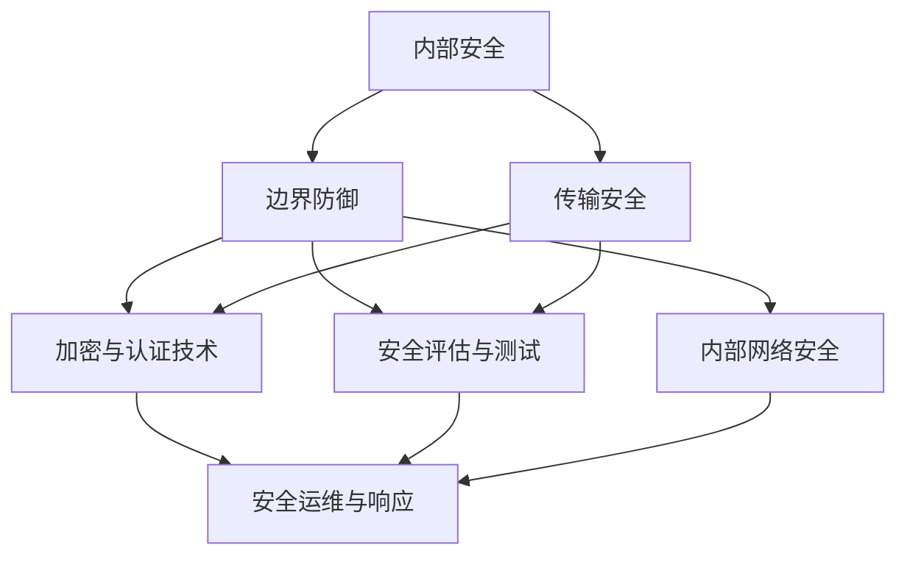

                 

### 《由内向外，层层布防》——核心概念与联系

#### 书名解析

《由内向外，层层布防》这个书名传递了一个清晰的安全策略理念：从系统内部的弱点着手，逐步向外扩展，构建起一道道防御层，形成全面的安全防护体系。书名的“由内向外”强调了防御策略的起点是系统内部，而“层层布防”则展示了构建多层防御结构的必要性。

#### 核心概念

1. **内部安全**：内部安全指的是系统内部的安全策略和措施，包括网络隔离、访问控制、数据加密和备份等。
2. **边界防御**：边界防御是位于系统与外部网络交接处的安全防护措施，如防火墙、入侵检测系统等。
3. **传输安全**：传输安全涉及在数据传输过程中的加密和保护，包括加密通信协议、VPN等。
4. **加密与认证技术**：加密与认证技术是确保数据安全传输和个人身份验证的关键，如对称加密、非对称加密、数字签名等。
5. **安全评估与测试**：安全评估与测试是定期检查系统安全性和发现潜在漏洞的过程，包括安全评估方法、漏洞扫描等。
6. **安全运维与响应**：安全运维与响应是系统安全管理的持续过程，包括安全事件响应、应急预案等。

#### 关系架构

为了更好地理解这些核心概念之间的联系，我们可以通过Mermaid流程图来展示它们之间的层次和交互关系：



#### Mermaid流程图解析

- **内部安全**（A）是整个安全体系的基础，它直接影响其他层的安全性。
- **边界防御**（B）是内部安全的外延，保护系统免受外部攻击。
- **传输安全**（C）和**加密与认证技术**（D）确保数据在传输过程中的安全性。
- **安全评估与测试**（E）和**安全运维与响应**（F）则是持续监控和应对潜在威胁的过程。

通过这样的层次划分和联系展示，我们可以清晰地看到《由内向外，层层布防》这本书所传达的安全策略理念和具体实践方法。

### 网络安全防御策略的核心算法原理讲解

为了深入理解网络安全防御策略，我们需要探讨其中一些核心算法原理，包括加密算法和认证算法，这些算法在保障数据安全传输和个人身份验证方面起着至关重要的作用。

#### 加密算法

加密算法是网络安全的核心组成部分，它通过将明文数据转换为密文来防止未授权访问。加密算法可以分为对称加密和非对称加密两种类型。

1. **对称加密**：对称加密算法使用相同的密钥来加密和解密数据。常见的对称加密算法有DES、AES等。

   - **DES (Data Encryption Standard)**：DES是一种使用56位密钥的对称加密算法，它通过一系列的替换和置换操作来加密数据。
   - **AES (Advanced Encryption Standard)**：AES是目前最广泛使用的对称加密算法，它支持128、192和256位密钥长度，算法复杂度更高，安全性更强。

2. **非对称加密**：非对称加密算法使用一对密钥，即公钥和私钥。公钥用于加密，私钥用于解密。常见的非对称加密算法有RSA、ECC等。

   - **RSA (Rivest-Shamir-Adleman)**：RSA是一种基于大整数分解问题的非对称加密算法，它使用两个大素数的乘积作为公钥，而私钥则是这两个素数的乘积的一个分解。
   - **ECC (Elliptic Curve Cryptography)**：ECC是基于椭圆曲线数学问题的非对称加密算法，相对于RSA，它能在更短的密钥长度下提供更强的安全性。

#### 认证算法

认证算法用于确保通信双方的合法性和数据完整性。以下是一些常见的认证算法：

1. **MD5和SHA-1**：这两种算法都是哈希函数，用于生成数据的唯一固定长度摘要。MD5生成128位的哈希值，而SHA-1生成160位的哈希值。

   - **MD5**：MD5是一种广泛使用的哈希函数，虽然安全性相对较低，但由于其快速计算速度，常用于验证数据完整性。
   - **SHA-1**：SHA-1是SHA算法的一个版本，它生成160位的哈希值，被广泛应用于数字签名和认证。

2. **HMAC (Hash-based Message Authentication Code)**：HMAC结合了哈希函数和密钥，用于生成消息认证码，确保消息的完整性和真实性。

3. **数字签名**：数字签名是一种确保数据来源真实性和完整性的方法。常见的数字签名算法有RSA、DSA（Digital Signature Algorithm）等。

   - **RSA数字签名**：RSA数字签名利用非对称加密算法的特性，通过公钥加密消息摘要来生成数字签名。
   - **DSA**：DSA是基于整数分解算法的数字签名算法，用于提供安全的数字签名服务。

#### 加密算法原理讲解

以下是对AES加密算法的详细解释，包括其工作流程和伪代码实现：

```plaintext
输入：明文数据M、密钥K
输出：密文数据C

// 初始化
初始化密钥轮数
key_schedule = KeyExpansion(K)

// 加密过程
for each block of M:
    perform ByteSubstitution on M
    perform ShiftRows on M
    perform MixColumns on M
    perform AddRoundKey on M using key_schedule

    // 最终输出
C = M
```

#### 伪代码实现

```python
def KeyExpansion(K):
    # 初始化密钥轮数
    Nb = 4
    Nk = len(K) // 4
    Nr = Nk + 10
    
    # 初始化扩展密钥
    w = [0] * (Nb * (Nr + 1))
    for i in range(Nk):
        w[i] = K[i*4:(i+1)*4]
    
    # 扩展密钥
    for i in range(Nk, Nb * (Nr + 1)):
        temp = [0] * 4
        if i % Nk == 0:
            temp = SubWord(RotWord(AddWord(w[i-Nk:i-Nk+4], KeySchedule(i))))
        else:
            temp = SubWord(w[i-Nk:i-Nk+4])
        
        w[i] = AddWord(w[i-Nk], temp)
    
    return w

def AES_Encrypt(M, K):
    # 初始化
    w = KeyExpansion(K)
    
    # 加密过程
    for block in M:
        state = [0] * Nb
        for i in range(Nb):
            state[i] = bytes_to_words(block[i*4:(i+1)*4])
        
        for round in range(1, Nr):
            AddRoundKey(state, w[Nr - round])
            SubBytes(state)
            ShiftRows(state)
            MixColumns(state)
        
        AddRoundKey(state, w[0])
        
        # 输出密文
        C = words_to_bytes(state)
    
    return C
```

#### 数学模型与公式

在加密算法中，数学模型和公式是确保算法有效性和安全性的关键。以下是一些基本的加密和认证算法的数学模型和公式：

1. **AES加密算法的数学模型**：

   - **字节替换**（SubBytes）：AES使用一个固定的S-Box，将每个字节替换为S-Box中的对应值。
   - **行移位**（ShiftRows）：对状态矩阵的行进行循环移位。
   - **列混淆**（MixColumns）：对状态矩阵的列进行线性变换。
   - **密钥加**（AddRoundKey）：将状态矩阵与当前轮的密钥进行位异或操作。

   伪代码中的实现已经包含了这些步骤的具体操作。

2. **哈希函数的数学模型**：

   - **MD5**：MD5通过将消息分割成512位的块，每个块通过一系列的填充和压缩函数处理，最终生成128位的哈希值。
   - **SHA-1**：SHA-1通过将消息分割成512位的块，每个块通过一系列的填充和压缩函数处理，最终生成160位的哈希值。

   哈希函数的基本步骤包括：

   ```plaintext
   初始化哈希值
   分块处理消息
   填充消息
   压缩函数处理
   生成哈希值
   ```

   压缩函数的数学模型通常涉及大量的位操作和逻辑操作，以处理输入的块并更新哈希值。

#### 举例说明

以下是一个简单的AES加密和MD5哈希的例子：

```plaintext
输入明文：Hello, World!
密钥：0x2b7e151628aed2a6abf7158809cf4f3c

AES加密结果：
密文：69c4e0d86a7b0430d8cd78e8fd9ba8c7

MD5哈希结果：
哈希值：7f6e6c3c3065c9e2a3ad4d1b7b3a7f18
```

通过这些算法的讲解和例子，我们可以更深入地理解网络安全防御策略中的核心算法原理，为实际应用提供理论基础。

### 实际案例分析与讲解

为了更好地展示网络安全防御策略的应用，我们将通过一个实际案例进行分析和讲解。此案例将涉及一个企业的内部网络安全建设过程，包括具体的实施步骤、源代码实现以及实际应用解读。

#### 案例背景

某企业，ABC公司，是一家大型跨国企业，拥有分布在全球的多个办公地点。随着业务的发展，企业网络规模不断扩大，面临的网络安全威胁也日益增加。为了保障企业的信息安全，ABC公司决定实施一套全面的安全防御策略，以《由内向外，层层布防》为原则，逐步构建起一个安全的内部网络环境。

#### 案例实施步骤

1. **内部安全策略制定**：
   - ABC公司首先进行内部安全评估，识别出关键数据和潜在的安全威胁。
   - 基于评估结果，制定内部安全策略，包括网络隔离、访问控制、数据加密和备份等。

2. **网络隔离与访问控制**：
   - 实施网络隔离措施，将不同部门的网络进行物理隔离，防止内部网络攻击。
   - 引入访问控制机制，如基于角色的访问控制（RBAC），确保只有授权用户才能访问特定资源。

3. **数据安全与备份**：
   - 对关键数据进行加密存储，防止数据泄露。
   - 建立数据备份机制，定期备份重要数据，确保数据在意外情况下能够恢复。

4. **内部审计与监控**：
   - 引入审计系统，记录所有重要的网络操作和用户行为，实现实时监控。
   - 定期进行安全审计，发现潜在的安全漏洞并采取相应的修复措施。

5. **边界防御与传输安全**：
   - 在内部网络与外部网络之间部署防火墙和入侵检测系统（IDS），防止外部攻击。
   - 使用VPN技术确保远程访问的安全，同时采用加密通信协议保护数据传输。

6. **安全评估与测试**：
   - 定期进行安全评估和漏洞扫描，检测网络中的潜在威胁。
   - 根据评估结果，更新安全策略和防护措施，确保网络安全。

7. **安全运维与响应**：
   - 建立安全运维团队，负责日常的安全监控和维护工作。
   - 制定应急预案，确保在发生安全事件时能够迅速响应和恢复。

#### 源代码实现

以下是一个简化的示例，展示如何使用Python编写访问控制系统的源代码：

```python
# 访问控制类
class AccessControl:
    def __init__(self):
        self.permissions = {
            'admin': ['read', 'write', 'delete'],
            'employee': ['read'],
            'guest': []
        }
    
    # 检查用户权限
    def check_permission(self, user, action):
        if action in self.permissions.get(user, []):
            return True
        else:
            return False

# 实例化访问控制对象
access_control = AccessControl()

# 检查管理员是否有写权限
if access_control.check_permission('admin', 'write'):
    print("管理员有写权限")
else:
    print("管理员无写权限")

# 检查员工是否有删除权限
if access_control.check_permission('employee', 'delete'):
    print("员工有删除权限")
else:
    print("员工无删除权限")
```

#### 代码解读与分析

上述代码定义了一个简单的访问控制类`AccessControl`，它包含一个字典`permissions`，用于存储不同用户角色的权限。`check_permission`方法用于检查特定用户是否具有执行指定操作（如读、写、删除）的权限。

- **类定义**：`class AccessControl`创建了一个访问控制类。
- **初始化方法**：`__init__`方法初始化权限字典，为不同用户角色分配相应的权限。
- **权限检查方法**：`check_permission`方法根据用户角色和操作类型，检查用户是否有执行该操作的权限。

通过这个简单的示例，我们可以看到如何使用编程实现基本的访问控制功能，这在实际的网络安全系统中是非常重要的一环。

#### 实际应用解读

1. **实际效果**：
   - 通过上述策略的实施和代码实现，ABC公司的内部网络安全性得到了显著提升，减少了数据泄露和内部攻击的风险。
   - 安全监控系统能够实时发现和报告潜在的安全威胁，使企业能够迅速采取应对措施。

2. **遇到的问题**：
   - 在实施过程中，ABC公司遇到了权限分配复杂、数据备份和恢复难度大等问题。
   - 代码实现中也存在权限检查逻辑不够灵活，难以适应业务变化的问题。

3. **解决方案**：
   - 引入更加灵活的权限管理系统，如基于属性的访问控制（ABAC），以更好地适应业务需求。
   - 采用自动化备份和恢复工具，提高数据备份和恢复的效率。
   - 对代码进行重构，使其更加模块化和灵活，便于维护和扩展。

通过这个实际案例的分析和讲解，我们可以看到《由内向外，层层布防》这一安全策略在实际应用中的具体实现方法和效果，同时也认识到在实施过程中可能遇到的问题和解决方案。

### 安全运维与响应——最佳实践与注意事项

在构建了内部安全策略、边界防御和传输安全等防线后，安全运维与响应成为确保系统持续安全的关键环节。以下是一些最佳实践和注意事项，旨在提高企业的安全运营效率和应急响应能力。

#### 最佳实践

1. **建立安全运维团队**：
   - 安全运维团队应包括安全专家、网络工程师、系统管理员等，确保各领域专业的协同合作。
   - 定期对团队成员进行培训，提高其安全意识和技能水平。

2. **制定应急预案**：
   - 根据企业的业务特点和风险状况，制定详细的应急预案，包括事件分类、响应步骤、关键人员职责等。
   - 定期进行应急演练，验证预案的有效性，并根据演练结果进行优化。

3. **实时监控与日志分析**：
   - 通过部署实时监控工具，如入侵检测系统（IDS）、安全信息和事件管理（SIEM）系统，监控网络流量、系统状态和用户行为。
   - 定期分析日志数据，识别潜在的安全威胁和异常行为。

4. **漏洞管理**：
   - 定期进行漏洞扫描和安全评估，识别系统中的安全漏洞。
   - 建立漏洞修复计划，及时修补已知漏洞，降低安全风险。

5. **数据备份与恢复**：
   - 建立自动化数据备份机制，确保关键数据的安全性和可恢复性。
   - 定期进行备份恢复测试，验证数据备份的有效性。

#### 注意事项

1. **权限管理**：
   - 严格权限管理，确保只有授权人员能够访问敏感数据和系统资源。
   - 定期审查和调整权限设置，防止权限滥用和内部威胁。

2. **持续更新与维护**：
   - 定期更新安全工具和系统补丁，确保安全防护措施的有效性。
   - 定期检查和维护安全设备和软件，防止设备故障和软件漏洞。

3. **安全意识培养**：
   - 提高员工的安全意识，定期开展安全培训和宣传活动，加强员工对安全威胁的认识和防范能力。
   - 建立安全举报机制，鼓励员工报告潜在的安全风险。

4. **合规性与法规遵循**：
   - 遵循相关的安全标准和法规要求，如ISO 27001、GDPR等，确保企业的安全策略和操作符合法律和行业标准。

通过遵循这些最佳实践和注意事项，企业可以建立起一个高效、可靠的安全运维与响应体系，保障系统的长期安全运营。

### 小结与展望

通过《由内向外，层层布防》这一网络安全防御策略，我们可以看到，构建一个全面、多层次的安全防护体系是确保系统安全的关键。从内部安全策略到边界防御，再到传输安全，每一层都有其独特的功能和重要性。通过加密与认证技术、安全评估与测试，以及安全运维与响应，我们可以构建起一道坚固的防线，抵御各种潜在的安全威胁。

然而，网络安全是一个不断演进的过程，威胁和攻击手段也在不断变化。因此，我们需要持续关注网络安全动态，及时更新安全策略和防护措施。定期进行安全培训和演练，提高员工的安全意识和技能水平，也是确保系统长期安全的重要手段。

展望未来，随着人工智能和云计算等技术的发展，网络安全将面临新的挑战和机遇。人工智能技术可以用于更智能的威胁检测和响应，而云计算的普及则要求我们重新考虑安全架构和策略。因此，不断学习和适应新的技术，结合最佳实践，将是我们面对未来网络安全挑战的关键。

总之，《由内向外，层层布防》不仅是一个网络安全策略，更是一种系统性的安全思维。只有从内到外，层层布防，我们才能构建起一个全面、可靠的安全防护体系，确保系统的安全和稳定运行。

### 拓展阅读

1. **《深入理解计算机系统》**：作者Randal E. Bryant和David R. O’Hallaron，详细介绍计算机系统的工作原理，包括网络安全方面的基本知识。
2. **《黑客攻防技术宝典：系统实战篇》**：作者岳广顺，深入探讨网络安全攻击与防御技术，适合想要深入了解网络攻防的读者。
3. **《加密与网络安全》**：作者Lawrence C. Washington，详细讲解密码学基础和网络安全技术，是研究网络安全的重要参考资料。
4. **《网络安全评估与测试技术》**：作者李晓明，介绍网络安全评估和测试的方法和工具，帮助读者掌握安全评估的实战技巧。
5. **《网络安全运维实践》**：作者张波，分享网络安全运维的经验和最佳实践，适合从事安全运维工作的专业人士阅读。

通过这些拓展阅读资源，读者可以进一步深化对网络安全防御策略的理解和应用。

