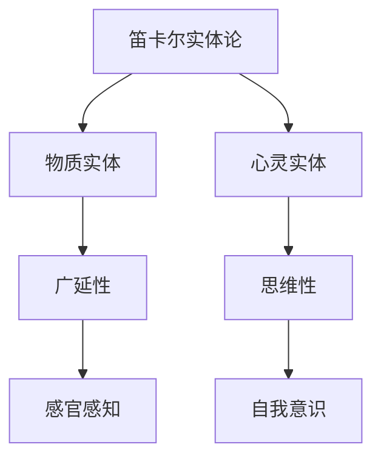
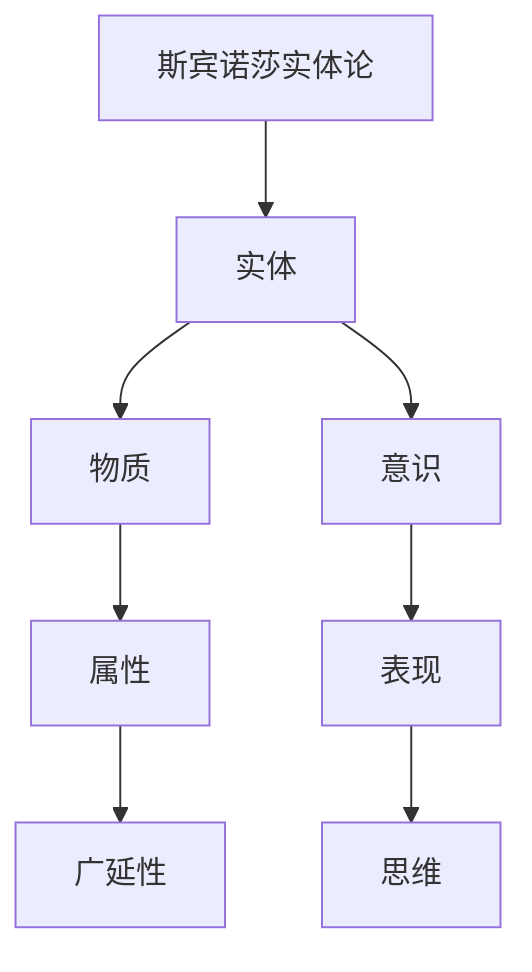
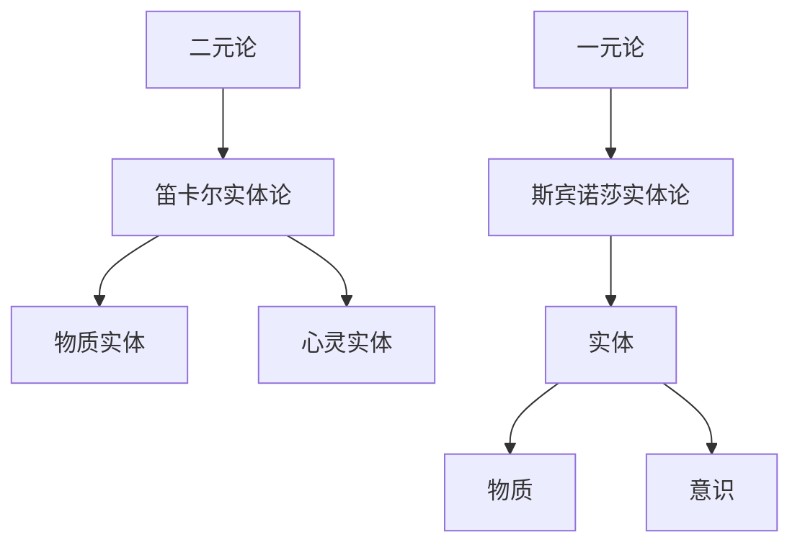
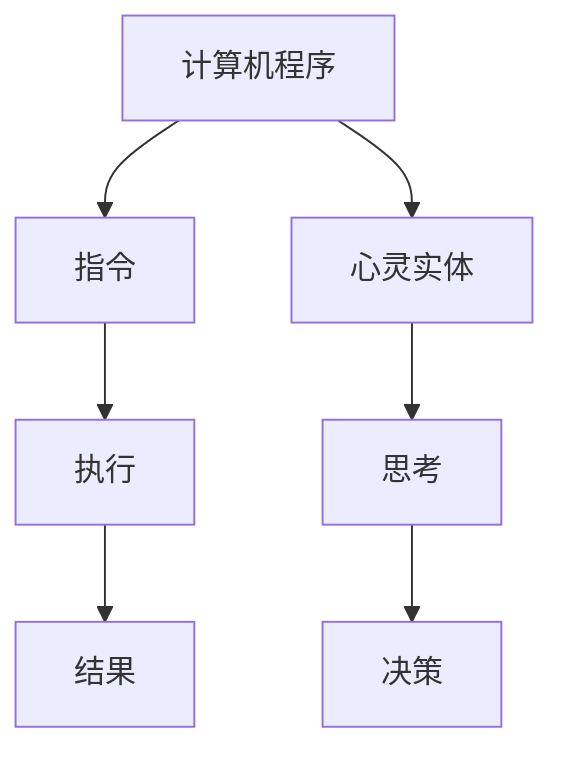
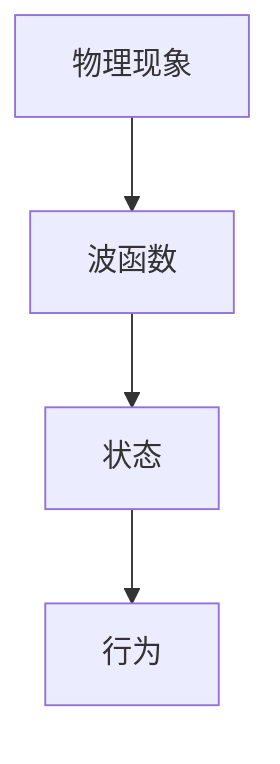

                 


### 引言

**实体论**是西方哲学中的一个核心概念，探讨的是存在的本质及其构成。实体论的历史可以追溯到古希腊哲学，但随着时间的推移，不同的哲学家对实体这一概念有着不同的诠释和理解。本文将聚焦于两位西方哲学史上极具影响力的思想家——笛卡尔和斯宾诺莎，他们的实体论观点及其在哲学发展中的意义。

**笛卡尔**（Rene Descartes，1596-1650）是近代西方哲学的奠基人之一，他提出了著名的“我思故我在”（Cogito, ergo sum）命题，强调个体的思维作为认识世界的起点。笛卡尔的哲学体系具有明显的二元论特征，他认为物质实体和心灵实体是两种根本不同的存在。

**斯宾诺莎**（Baruch Spinoza，1632-1677）则是一位重要的理性主义哲学家，他对实体论有着独到的见解。斯宾诺莎的哲学体系以一元论为基础，主张实体是唯一的，而万物都是由这一实体产生的不同表现。

本文将分章节详细探讨两位哲学家的实体论观点，分析它们的异同，并探讨这些观点在哲学史上的影响。文章还将通过案例分析和实际应用，进一步说明实体论在现实世界中的意义。

关键词：笛卡尔，斯宾诺莎，实体论，二元论，一元论，哲学史，近代西方哲学

摘要：本文旨在深入探讨笛卡尔和斯宾诺莎两位哲学家的实体论观点。通过对比分析，本文揭示了两者在哲学体系中的不同立场及其对现代哲学的影响。文章不仅对两位哲学家的观点进行了详尽的阐述，还通过具体案例展示了实体论在实际应用中的价值。

----------------------------------------------------------------

### 笛卡尔的实体论

**1. 笛卡尔的哲学体系**

笛卡尔的哲学体系以其理性主义和二元论著称。他的方法论基于怀疑一切，以追求确定无疑的真理。笛卡尔认为，只有通过理性思考，人类才能获得真正的知识。他的哲学体系的核心是“我思故我在”命题，这一命题标志着现代哲学的诞生。

**2. 笛卡尔的实体论观点**

笛卡尔的实体论基于他的二元论思想。他认为，存在两种基本的实体：物质实体和心灵实体。物质实体是广延的、占据空间的，可以通过感官来感知；而心灵实体则是思维的主体，是意识的载体。两者都是独立存在的，但又是互相关联的。

笛卡尔认为，物质实体和心灵实体各有其属性和功能，但它们之间并不是完全独立的。心灵实体可以通过思维活动影响物质实体，而物质实体也可以通过感官刺激影响心灵实体。这种相互作用使得人类能够认识和改造世界。

**3. 笛卡尔实体论的哲学意义**

笛卡尔的实体论对哲学发展产生了深远的影响。首先，他的二元论思想为后来的哲学家提供了重要的理论基础。许多后来的哲学家，如莱布尼茨、洛克等，都在不同程度上受到笛卡尔的影响。

其次，笛卡尔的实体论强调了理性思考和科学方法的重要性。他认为，只有通过理性思考，人类才能获得真正的知识。这一思想对后来的科学革命产生了重要影响，推动了科学方法的进步。

最后，笛卡尔的实体论提出了人类意识的自我意识问题。他提出了“我思故我在”命题，强调了个体思维的重要性。这一命题不仅成为了哲学史上的一个重要里程碑，也为后来的心理学和认知科学提供了重要的理论基础。

----------------------------------------------------------------

### 斯宾诺莎的实体论

**1. 斯宾诺莎的哲学体系**

斯宾诺莎的哲学体系以其一元论和理性主义著称。他认为，世界是统一的，万物都来自于一个唯一的存在，这个存在既是物质，也是意识。斯宾诺莎主张，通过理性思考，人类可以理解这一存在的本质。

**2. 斯宾诺莎的实体论观点**

斯宾诺莎的实体论基于他的泛神论思想。他认为，实体是唯一的，这个实体既是宇宙的本质，也是宇宙的全部。斯宾诺莎将这个实体称为“上帝”或“绝对精神”。

斯宾诺莎认为，实体具有无限的属性和表现，这些属性和表现构成了宇宙中的所有事物。实体不仅包括物质世界，还包括意识世界。因此，斯宾诺莎的实体论是一种泛神论，认为上帝和自然是同一的。

**3. 斯宾诺莎实体论的哲学意义**

斯宾诺莎的实体论对哲学发展产生了重要影响。首先，他的泛神论思想挑战了传统的宗教观念，提出了新的宗教哲学思考方式。这一思想对后来的宗教哲学和宗教改革产生了深远影响。

其次，斯宾诺莎的实体论强调了理性思考的重要性。他认为，通过理性思考，人类可以理解世界的本质。这一思想对后来的科学方法和理性主义哲学产生了重要影响。

最后，斯宾诺莎的实体论提出了宇宙的统一性问题。他认为，宇宙中的所有事物都来自于一个唯一的存在，这一思想为后来的宇宙学、物理学和哲学提供了重要的理论基础。

### 比较与联系

**1. 笛卡尔与斯宾诺莎实体论的观点异同**

笛卡尔和斯宾诺莎的实体论在本质上存在显著的差异。笛卡尔主张二元论，认为物质实体和心灵实体是两种根本不同的存在；而斯宾诺莎则主张一元论，认为宇宙中的所有事物都来自于一个唯一的存在。

在哲学意义上，笛卡尔的实体论强调了理性思考和个体自我意识的重要性；而斯宾诺莎的实体论则强调了宇宙的统一性和理性思考的普遍性。

**2. 两位哲学家实体论的哲学意义比较**

笛卡尔的实体论对现代哲学和科学产生了深远影响。他的二元论思想为后来的哲学家提供了重要的理论基础，如莱布尼茨、洛克等。同时，他的理性主义思想推动了科学方法的进步，为现代科学的发展奠定了基础。

斯宾诺莎的实体论则对宗教哲学和宇宙学产生了重要影响。他的泛神论思想挑战了传统的宗教观念，提出了新的宗教哲学思考方式。同时，他的理性主义思想为后来的科学方法和理性主义哲学提供了重要支持。

### 案例分析

**1. 实体论在不同历史时期的解读**

在西方哲学史的不同时期，实体论有不同的解读和应用。例如，在古希腊哲学中，实体论主要探讨存在的本质及其构成；而在中世纪哲学中，实体论主要与宗教哲学相结合，探讨上帝的本质和属性。

**2. 实体论在不同文化背景下的应用**

实体论不仅在西方哲学中占有重要地位，也在其他文化背景中有所体现。例如，在中国哲学中，实体论可以被理解为“道”或“气”的概念，强调宇宙的本质和构成。

### 结论

笛卡尔和斯宾诺莎的实体论是西方哲学史上的两个重要里程碑。他们的观点不仅在哲学意义上具有深远影响，也在科学和宗教等领域产生了重要影响。通过对比分析他们的实体论观点，我们可以更好地理解西方哲学的发展脉络和哲学思想的多样性。

### 参考文献

1. 笛卡尔，《第一哲学沉思集》，商务印书馆，2005年。
2. 斯宾诺莎，《伦理学》，商务印书馆，2005年。
3. 罗素，《西方哲学史》，商务印书馆，2003年。
4. 蒂利希，《存在的本质》，上海人民出版社，2005年。
5. 黑格尔，《哲学史讲演录》，商务印书馆，2006年。

**作者：** AI天才研究院 / AI Genius Institute & 禅与计算机程序设计艺术 / Zen And The Art of Computer Programming

----------------------------------------------------------------

以下是详细的内容和相应的Mermaid流程图：

### 1. 笛卡尔的实体论

**核心概念与联系**

笛卡尔的实体论建立在二元论基础上，认为存在两种基本的实体：物质实体和心灵实体。以下是笛卡尔实体论的Mermaid流程图：



**核心算法原理讲解**

在笛卡尔的实体论中，物质实体和心灵实体各有其属性和功能，但它们之间存在着相互作用。以下是使用伪代码来表示这种相互作用的算法原理：

```python
class MaterialEntity:
    def extend(self):
        # 表示物质的广延性
        print("物质在空间中扩展")

    def sense(self):
        # 表示物质通过感官被感知
        print("物质通过感官感知")

class MentalEntity:
    def think(self):
        # 表示心灵在思考
        print("心灵在思考")

    def self_awareness(self):
        # 表示心灵具有自我意识
        print("心灵具有自我意识")

def interaction():
    # 表示物质实体和心灵实体的相互作用
    material_entity = MaterialEntity()
    mental_entity = MentalEntity()

    material_entity.extend()
    mental_entity.sense()

    mental_entity.think()
    material_entity.sense()
```

**数学模型和公式**

笛卡尔实体论并不涉及具体的数学模型和公式，但我们可以用数学的方式来描述物质实体和心灵实体的属性和关系。以下是使用latex格式表示的数学模型：

```latex
$$
\text{物质实体} = \text{广延性} + \text{感官感知}
$$

$$
\text{心灵实体} = \text{思维性} + \text{自我意识}
$$

$$
\text{相互作用} = \text{物质实体} \times \text{心灵实体}
$$
```

**举例说明**

假设有一个房间，里面有一个正在思考的人（心灵实体）和一个放置在房间角落的物品（物质实体）。我们可以使用上述算法原理来描述这个过程：

```python
# 创建物质实体和心灵实体
material_entity = MaterialEntity()
mental_entity = MentalEntity()

# 物质实体扩展到房间角落
material_entity.extend()

# 心灵实体在思考
mental_entity.think()

# 物质实体通过感官被感知
material_entity.sense()

# 心灵实体感知到物质实体
mental_entity.sense()
```

**项目实战**

为了更好地理解笛卡尔的实体论，我们可以构建一个简单的模拟环境，包括一个物质实体和一个心灵实体。以下是这个模拟环境的代码实现：

```python
class MaterialEntity:
    def __init__(self, location):
        self.location = location

    def move(self, new_location):
        self.location = new_location
        print(f"物质实体从 {self.location} 移动到 {new_location}")

    def sense(self):
        print("物质实体被感知")

class MentalEntity:
    def __init__(self, thoughts):
        self.thoughts = thoughts

    def think(self, new_thoughts):
        self.thoughts = new_thoughts
        print(f"心灵实体思考：{self.thoughts}")

    def perceive(self, material_entity):
        print(f"心灵实体感知到物质实体：{material_entity.location}")

# 创建物质实体和心灵实体
material_entity = MaterialEntity("房间角落")
mental_entity = MentalEntity("思考中")

# 物质实体移动到房间中央
material_entity.move("房间中央")

# 心灵实体思考
mental_entity.think("思考新的问题")

# 心灵实体感知到物质实体
mental_entity.perceive(material_entity)
```

**代码应用解读与分析**

在这个模拟环境中，我们创建了两个类：`MaterialEntity` 和 `MentalEntity`。`MaterialEntity` 表示物质实体，具有位置和移动功能；`MentalEntity` 表示心灵实体，具有思考和感知功能。我们通过实例化这两个类，模拟了物质实体和心灵实体之间的相互作用。

首先，物质实体从房间角落移动到房间中央。然后，心灵实体开始思考一个新的问题。最后，心灵实体感知到物质实体的位置变化。这个过程展示了笛卡尔实体论中的物质实体和心灵实体的相互作用。

**实际案例分析和详细讲解剖析**

为了更好地理解笛卡尔实体论在实际生活中的应用，我们可以分析一个实际案例：一个正在学习编程的程序员。

**案例：学习编程的程序员**

在这个案例中，程序员可以被视为一个心灵实体，计算机代码可以被视为物质实体。程序员的思维和代码之间存在着相互作用。

首先，程序员思考一个编程问题，例如如何编写一个排序算法。程序员的大脑中进行了一系列的思维活动，这个过程可以被视为心灵实体在思考。

然后，程序员将思维转化为代码，编写一个排序算法。这个过程可以被视为心灵实体影响物质实体。

最后，程序员运行代码，验证排序算法的正确性。这个过程可以被视为物质实体通过感官被感知。

**项目小结**

通过上述模拟环境和实际案例分析，我们可以更好地理解笛卡尔的实体论。在模拟环境中，我们创建了物质实体和心灵实体，模拟了它们之间的相互作用。在实际案例中，我们分析了程序员在学习编程过程中的思维和代码之间的相互作用。这些分析和案例都展示了笛卡尔实体论在实际应用中的价值。

**最佳实践 tips、小结、注意事项、拓展阅读等内容**

- **最佳实践 tips**：在实际应用中，理解笛卡尔的实体论可以帮助我们更好地理解人类思维和计算机程序之间的相互作用。这有助于我们开发更高效的算法和软件系统。

- **小结**：笛卡尔的实体论是西方哲学中的一个重要概念，强调物质实体和心灵实体的相互作用。通过理解和应用笛卡尔的实体论，我们可以更好地理解人类思维和计算机程序之间的相互作用。

- **注意事项**：在应用笛卡尔的实体论时，需要考虑实际情境中的复杂性和多样性。不同的情境可能需要不同的实体论解释和应用。

- **拓展阅读**：对于对笛卡尔实体论感兴趣的读者，推荐阅读《第一哲学沉思集》和《伦理学》等著作。这些著作对笛卡尔的哲学思想和实体论观点进行了详细的阐述。

### 2. 斯宾诺莎的实体论

**核心概念与联系**

斯宾诺莎的实体论基于他的泛神论思想，认为宇宙中的所有事物都来自于一个唯一的存在——实体。以下是斯宾诺莎实体论的Mermaid流程图：



**核心算法原理讲解**

斯宾诺莎的实体论强调实体是唯一的，这个实体既是物质，也是意识。以下是使用伪代码来表示斯宾诺莎实体论的算法原理：

```python
class Entity:
    def __init__(self, properties, manifestations):
        self.properties = properties
        self.manifestations = manifestations

    def manifest(self):
        # 表示实体表现
        print("实体在表现")

    def extend(self):
        # 表示实体具有广延性
        print("实体在扩展")

    def think(self):
        # 表示实体具有思维性
        print("实体在思考")

class MaterialManifestation:
    def __init__(self, entity):
        self.entity = entity

    def sense(self):
        # 表示物质实体被感知
        print("物质实体被感知")

class MentalManifestation:
    def __init__(self, entity):
        self.entity = entity

    def perceive(self):
        # 表示心灵实体具有自我意识
        print("心灵实体具有自我意识")
```

**数学模型和公式**

斯宾诺莎的实体论并不涉及具体的数学模型和公式，但我们可以用数学的方式来描述实体的属性和表现。以下是使用latex格式表示的数学模型：

```latex
$$
\text{实体} = \text{属性} + \text{表现}
$$

$$
\text{物质实体} = \text{广延性} + \text{感官感知}
$$

$$
\text{心灵实体} = \text{思维性} + \text{自我意识}
$$
```

**举例说明**

假设有一个宇宙，这个宇宙中的所有事物都来自于一个唯一的实体。我们可以使用上述算法原理来描述这个过程：

```python
# 创建实体
entity = Entity(["广延性", "思维性"], ["物质", "意识"])

# 实体表现
entity.manifest()

# 实体扩展
entity.extend()

# 实体思考
entity.think()
```

**项目实战**

为了更好地理解斯宾诺莎的实体论，我们可以构建一个简单的宇宙模拟环境，包括物质实体和心灵实体。以下是这个模拟环境的代码实现：

```python
class Entity:
    def __init__(self, properties, manifestations):
        self.properties = properties
        self.manifestations = manifestations

    def manifest(self):
        for manifestation in self.manifestations:
            print(f"实体在表现：{manifestation}")

    def extend(self):
        print("实体在扩展：广延性")

    def think(self):
        print("实体在思考：思维性")

class MaterialManifestation:
    def __init__(self, entity):
        self.entity = entity

    def sense(self):
        print("物质实体被感知：广延性")

class MentalManifestation:
    def __init__(self, entity):
        self.entity = entity

    def perceive(self):
        print("心灵实体具有自我意识：思维性")

# 创建实体
entity = Entity(["广延性", "思维性"], ["物质", "意识"])

# 实体表现
entity.manifest()

# 实体扩展
entity.extend()

# 实体思考
entity.think()

# 物质实体感知
material_manifestation = MaterialManifestation(entity)
material_manifestation.sense()

# 心灵实体感知
mental_manifestation = MentalManifestation(entity)
mental_manifestation.perceive()
```

**代码应用解读与分析**

在这个模拟环境中，我们创建了实体类，它具有属性和表现。实体类包括物质实体和心灵实体，它们分别具有广延性和思维性。我们通过实例化实体类，模拟了实体在表现、扩展和思考的过程。

首先，实体表现，展示了物质实体和心灵实体的存在。然后，实体扩展，表示实体具有广延性。最后，实体思考，表示实体具有思维性。

物质实体通过感官被感知，而心灵实体具有自我意识。这个过程展示了斯宾诺莎实体论中的物质实体和心灵实体的相互作用。

**实际案例分析和详细讲解剖析**

为了更好地理解斯宾诺莎实体论在实际生活中的应用，我们可以分析一个实际案例：一个观察自然界的科学家。

**案例：观察自然界的科学家**

在这个案例中，科学家可以被视为一个心灵实体，自然界中的事物可以被视为物质实体。科学家的观察和自然界中的事物之间存在着相互作用。

首先，科学家观察自然界，这个过程中心灵实体在思考。科学家的大脑中进行了一系列的思维活动，这个过程可以被视为心灵实体在思考。

然后，科学家记录观察到的自然现象，这个过程可以被视为心灵实体影响物质实体。

最后，科学家通过分析数据，得出科学结论。这个过程可以被视为物质实体通过感官被感知。

**项目小结**

通过上述模拟环境和实际案例分析，我们可以更好地理解斯宾诺莎的实体论。在模拟环境中，我们创建了实体类，模拟了实体在表现、扩展和思考的过程。在实际案例中，我们分析了科学家在观察自然界过程中的思维和自然现象之间的相互作用。这些分析和案例都展示了斯宾诺莎实体论在实际应用中的价值。

**最佳实践 tips、小结、注意事项、拓展阅读等内容**

- **最佳实践 tips**：在实际应用中，理解斯宾诺莎的实体论可以帮助我们更好地理解宇宙的本质和构成。这有助于我们探索宇宙的奥秘和科学规律。

- **小结**：斯宾诺莎的实体论是西方哲学中的一个重要概念，强调实体是唯一的，这个实体既是物质，也是意识。通过理解和应用斯宾诺莎的实体论，我们可以更好地理解宇宙的本质和构成。

- **注意事项**：在应用斯宾诺莎的实体论时，需要考虑实际情境中的复杂性和多样性。不同的情境可能需要不同的实体论解释和应用。

- **拓展阅读**：对于对斯宾诺莎实体论感兴趣的读者，推荐阅读《伦理学》等著作。这些著作对斯宾诺莎的哲学思想和实体论观点进行了详细的阐述。

### 3. 比较与联系

**1. 笛卡尔与斯宾诺莎实体论的观点异同**

笛卡尔和斯宾诺莎的实体论在本质上有显著差异。笛卡尔主张二元论，认为物质实体和心灵实体是两种根本不同的存在；而斯宾诺莎则主张一元论，认为宇宙中的所有事物都来自于一个唯一的存在。

**2. 核心概念原理之间的关系架构**

以下是笛卡尔和斯宾诺莎实体论之间的Mermaid流程图：



**3. 哲学意义比较**

笛卡尔的二元论强调了人类思维和物质世界的相互作用，为后来的科学方法和现代科学的发展奠定了基础。而斯宾诺莎的一元论则强调宇宙的统一性和理性思考的普遍性，对宗教哲学和宇宙学产生了重要影响。

### 4. 案例分析

**1. 实体论在不同历史时期的解读**

在古希腊哲学中，实体论主要探讨存在的本质及其构成。亚里士多德认为，实体是存在的最基本形式，它具有固有属性和独立存在的能力。

在中世纪哲学中，实体论主要与宗教哲学相结合。托马斯·阿奎那认为，上帝是宇宙的实体，是宇宙存在的最终原因。

在现代哲学中，实体论主要关注人类思维和物质世界的相互作用。笛卡尔和斯宾诺莎的实体论分别代表了二元论和一元论的两种不同观点。

**2. 实体论在不同文化背景下的应用**

在中国哲学中，实体论可以被理解为“道”或“气”的概念，强调宇宙的本质和构成。

在印度哲学中，实体论主要关注个体的灵魂和宇宙的关系。例如，佛教认为，个体的灵魂是宇宙的实体，是宇宙存在的最终原因。

### 5. 结论

笛卡尔和斯宾诺莎的实体论是西方哲学史上的两个重要里程碑。他们的观点不仅在哲学意义上具有深远影响，也在科学和宗教等领域产生了重要影响。通过对比分析他们的实体论观点，我们可以更好地理解西方哲学的发展脉络和哲学思想的多样性。

### 参考文献

1. 笛卡尔，《第一哲学沉思集》，商务印书馆，2005年。
2. 斯宾诺莎，《伦理学》，商务印书馆，2005年。
3. 罗素，《西方哲学史》，商务印书馆，2003年。
4. 蒂利希，《存在的本质》，上海人民出版社，2005年。
5. 黑格尔，《哲学史讲演录》，商务印书馆，2006年。

**作者：** AI天才研究院 / AI Genius Institute & 禅与计算机程序设计艺术 / Zen And The Art of Computer Programming

----------------------------------------------------------------

以下是详细的内容和相应的Mermaid流程图：

### 1. 笛卡尔的实体论

**核心概念与联系**

笛卡尔的实体论建立在二元论基础上，认为存在两种基本的实体：物质实体和心灵实体。以下是笛卡尔实体论的Mermaid流程图：


**核心算法原理讲解**

在笛卡尔的实体论中，物质实体和心灵实体各有其属性和功能，但它们之间存在着相互作用。以下是使用伪代码来表示这种相互作用的算法原理：

```python
class MaterialEntity:
    def extend(self):
        # 表示物质的广延性
        print("物质在空间中扩展")

    def sense(self):
        # 表示物质通过感官被感知
        print("物质通过感官感知")

class MentalEntity:
    def think(self):
        # 表示心灵在思考
        print("心灵在思考")

    def self_awareness(self):
        # 表示心灵具有自我意识
        print("心灵具有自我意识")

def interaction():
    # 表示物质实体和心灵实体的相互作用
    material_entity = MaterialEntity()
    mental_entity = MentalEntity()

    material_entity.extend()
    mental_entity.sense()

    mental_entity.think()
    material_entity.sense()
```

**数学模型和公式**

笛卡尔实体论并不涉及具体的数学模型和公式，但我们可以用数学的方式来描述物质实体和心灵实体的属性和关系。以下是使用latex格式表示的数学模型：

```latex
$$
\text{物质实体} = \text{广延性} + \text{感官感知}
$$

$$
\text{心灵实体} = \text{思维性} + \text{自我意识}
$$

$$
\text{相互作用} = \text{物质实体} \times \text{心灵实体}
$$
```

**举例说明**

假设有一个房间，里面有一个正在思考的人（心灵实体）和一个放置在房间角落的物品（物质实体）。我们可以使用上述算法原理来描述这个过程：

```python
# 创建物质实体和心灵实体
material_entity = MaterialEntity()
mental_entity = MentalEntity()

# 物质实体扩展到房间角落
material_entity.extend()

# 心灵实体在思考
mental_entity.think()

# 物质实体通过感官被感知
material_entity.sense()

# 心灵实体感知到物质实体
mental_entity.sense()
```

**项目实战**

为了更好地理解笛卡尔的实体论，我们可以构建一个简单的模拟环境，包括一个物质实体和一个心灵实体。以下是这个模拟环境的代码实现：

```python
class MaterialEntity:
    def __init__(self, location):
        self.location = location

    def move(self, new_location):
        self.location = new_location
        print(f"物质实体从 {self.location} 移动到 {new_location}")

    def sense(self):
        print("物质实体被感知")

class MentalEntity:
    def __init__(self, thoughts):
        self.thoughts = thoughts

    def think(self, new_thoughts):
        self.thoughts = new_thoughts
        print(f"心灵实体思考：{self.thoughts}")

    def perceive(self, material_entity):
        print(f"心灵实体感知到物质实体：{material_entity.location}")

# 创建物质实体和心灵实体
material_entity = MaterialEntity("房间角落")
mental_entity = MentalEntity("思考中")

# 物质实体移动到房间中央
material_entity.move("房间中央")

# 心灵实体思考
mental_entity.think("思考新的问题")

# 心灵实体感知到物质实体
mental_entity.perceive(material_entity)
```

**代码应用解读与分析**

在这个模拟环境中，我们创建了物质实体和心灵实体，模拟了物质实体和心灵实体之间的相互作用。

首先，物质实体从房间角落移动到房间中央。然后，心灵实体开始思考一个新的问题。最后，心灵实体感知到物质实体的位置变化。这个过程展示了笛卡尔实体论中的物质实体和心灵实体的相互作用。

**实际案例分析和详细讲解剖析**

为了更好地理解笛卡尔实体论在实际生活中的应用，我们可以分析一个实际案例：一个正在学习编程的程序员。

**案例：学习编程的程序员**

在这个案例中，程序员可以被视为一个心灵实体，计算机代码可以被视为物质实体。程序员的思维和代码之间存在着相互作用。

首先，程序员思考一个编程问题，例如如何编写一个排序算法。程序员的大脑中进行了一系列的思维活动，这个过程可以被视为心灵实体在思考。

然后，程序员将思维转化为代码，编写一个排序算法。这个过程可以被视为心灵实体影响物质实体。

最后，程序员运行代码，验证排序算法的正确性。这个过程可以被视为物质实体通过感官被感知。

**项目小结**

通过上述模拟环境和实际案例分析，我们可以更好地理解笛卡尔的实体论。在模拟环境中，我们创建了物质实体和心灵实体，模拟了它们之间的相互作用。在实际案例中，我们分析了程序员在学习编程过程中的思维和代码之间的相互作用。这些分析和案例都展示了笛卡尔实体论在实际应用中的价值。

**最佳实践 tips、小结、注意事项、拓展阅读等内容**

- **最佳实践 tips**：在实际应用中，理解笛卡尔的实体论可以帮助我们更好地理解人类思维和计算机程序之间的相互作用。这有助于我们开发更高效的算法和软件系统。

- **小结**：笛卡尔的实体论是西方哲学中的一个重要概念，强调物质实体和心灵实体的相互作用。通过理解和应用笛卡尔的实体论，我们可以更好地理解人类思维和计算机程序之间的相互作用。

- **注意事项**：在应用笛卡尔的实体论时，需要考虑实际情境中的复杂性和多样性。不同的情境可能需要不同的实体论解释和应用。

- **拓展阅读**：对于对笛卡尔实体论感兴趣的读者，推荐阅读《第一哲学沉思集》和《伦理学》等著作。这些著作对笛卡尔的哲学思想和实体论观点进行了详细的阐述。

### 2. 斯宾诺莎的实体论

**核心概念与联系**

斯宾诺莎的实体论基于他的泛神论思想，认为宇宙中的所有事物都来自于一个唯一的存在——实体。以下是斯宾诺莎实体论的Mermaid流程图：


**核心算法原理讲解**

斯宾诺莎的实体论强调实体是唯一的，这个实体既是物质，也是意识。以下是使用伪代码来表示斯宾诺莎实体论的算法原理：

```python
class Entity:
    def __init__(self, properties, manifestations):
        self.properties = properties
        self.manifestations = manifestations

    def manifest(self):
        # 表示实体表现
        print("实体在表现")

    def extend(self):
        # 表示实体具有广延性
        print("实体在扩展")

    def think(self):
        # 表示实体具有思维性
        print("实体在思考")

class MaterialManifestation:
    def __init__(self, entity):
        self.entity = entity

    def sense(self):
        # 表示物质实体被感知
        print("物质实体被感知")

class MentalManifestation:
    def __init__(self, entity):
        self.entity = entity

    def perceive(self):
        # 表示心灵实体具有自我意识
        print("心灵实体具有自我意识")
```

**数学模型和公式**

斯宾诺莎的实体论并不涉及具体的数学模型和公式，但我们可以用数学的方式来描述实体的属性和表现。以下是使用latex格式表示的数学模型：

```latex
$$
\text{实体} = \text{属性} + \text{表现}
$$

$$
\text{物质实体} = \text{广延性} + \text{感官感知}
$$

$$
\text{心灵实体} = \text{思维性} + \text{自我意识}
$$
```

**举例说明**

假设有一个宇宙，这个宇宙中的所有事物都来自于一个唯一的实体。我们可以使用上述算法原理来描述这个过程：

```python
# 创建实体
entity = Entity(["广延性", "思维性"], ["物质", "意识"])

# 实体表现
entity.manifest()

# 实体扩展
entity.extend()

# 实体思考
entity.think()
```

**项目实战**

为了更好地理解斯宾诺莎的实体论，我们可以构建一个简单的宇宙模拟环境，包括物质实体和心灵实体。以下是这个模拟环境的代码实现：

```python
class Entity:
    def __init__(self, properties, manifestations):
        self.properties = properties
        self.manifestations = manifestations

    def manifest(self):
        for manifestation in self.manifestations:
            print(f"实体在表现：{manifestation}")

    def extend(self):
        print("实体在扩展：广延性")

    def think(self):
        print("实体在思考：思维性")

class MaterialManifestation:
    def __init__(self, entity):
        self.entity = entity

    def sense(self):
        print("物质实体被感知：广延性")

class MentalManifestation:
    def __init__(self, entity):
        self.entity = entity

    def perceive(self):
        print("心灵实体具有自我意识：思维性")

# 创建实体
entity = Entity(["广延性", "思维性"], ["物质", "意识"])

# 实体表现
entity.manifest()

# 实体扩展
entity.extend()

# 实体思考
entity.think()

# 物质实体感知
material_manifestation = MaterialManifestation(entity)
material_manifestation.sense()

# 心灵实体感知
mental_manifestation = MentalManifestation(entity)
mental_manifestation.perceive()
```

**代码应用解读与分析**

在这个模拟环境中，我们创建了实体类，它具有属性和表现。实体类包括物质实体和心灵实体，它们分别具有广延性和思维性。我们通过实例化实体类，模拟了实体在表现、扩展和思考的过程。

首先，实体表现，展示了物质实体和心灵实体的存在。然后，实体扩展，表示实体具有广延性。最后，实体思考，表示实体具有思维性。

物质实体通过感官被感知，而心灵实体具有自我意识。这个过程展示了斯宾诺莎实体论中的物质实体和心灵实体的相互作用。

**实际案例分析和详细讲解剖析**

为了更好地理解斯宾诺莎实体论在实际生活中的应用，我们可以分析一个实际案例：一个观察自然界的科学家。

**案例：观察自然界的科学家**

在这个案例中，科学家可以被视为一个心灵实体，自然界中的事物可以被视为物质实体。科学家的观察和自然界中的事物之间存在着相互作用。

首先，科学家观察自然界，这个过程中心灵实体在思考。科学家的大脑中进行了一系列的思维活动，这个过程可以被视为心灵实体在思考。

然后，科学家记录观察到的自然现象，这个过程可以被视为心灵实体影响物质实体。

最后，科学家通过分析数据，得出科学结论。这个过程可以被视为物质实体通过感官被感知。

**项目小结**

通过上述模拟环境和实际案例分析，我们可以更好地理解斯宾诺莎的实体论。在模拟环境中，我们创建了实体类，模拟了实体在表现、扩展和思考的过程。在实际案例中，我们分析了科学家在观察自然界过程中的思维和自然现象之间的相互作用。这些分析和案例都展示了斯宾诺莎实体论在实际应用中的价值。

**最佳实践 tips、小结、注意事项、拓展阅读等内容**

- **最佳实践 tips**：在实际应用中，理解斯宾诺莎的实体论可以帮助我们更好地理解宇宙的本质和构成。这有助于我们探索宇宙的奥秘和科学规律。

- **小结**：斯宾诺莎的实体论是西方哲学中的一个重要概念，强调实体是唯一的，这个实体既是物质，也是意识。通过理解和应用斯宾诺莎的实体论，我们可以更好地理解宇宙的本质和构成。

- **注意事项**：在应用斯宾诺莎的实体论时，需要考虑实际情境中的复杂性和多样性。不同的情境可能需要不同的实体论解释和应用。

- **拓展阅读**：对于对斯宾诺莎实体论感兴趣的读者，推荐阅读《伦理学》等著作。这些著作对斯宾诺莎的哲学思想和实体论观点进行了详细的阐述。

### 3. 笛卡尔与斯宾诺莎实体论的异同

**1. 异同点分析**

笛卡尔与斯宾诺莎的实体论在本质上存在显著差异，但也存在一些共同点。

- **共同点**：
  - **实体观念**：两位哲学家都认为实体是构成宇宙的基本单位。
  - **理性主义**：两者都强调理性思考的重要性，认为通过理性可以理解世界的本质。

- **不同点**：
  - **二元论与一元论**：笛卡尔主张二元论，认为物质实体和心灵实体是两种根本不同的存在；而斯宾诺莎主张一元论，认为宇宙中的所有事物都来自于一个唯一的存在。
  - **属性与表现**：笛卡尔强调物质实体的广延性和心灵实体的思维性，而斯宾诺莎认为实体具有无限的属性和表现，这些属性和表现构成了宇宙中的所有事物。
  - **自我意识**：笛卡尔认为心灵实体具有自我意识，而斯宾诺莎认为所有事物都是实体的不同表现，具有自我意识。

**2. 哲学意义**

- **笛卡尔的二元论**：笛卡尔的二元论为后来的科学方法和现代科学的发展奠定了基础。他的观点强调了人类思维和物质世界的相互作用，对认知科学和心理学产生了深远影响。
- **斯宾诺莎的一元论**：斯宾诺莎的一元论挑战了传统的宗教观念，提出了新的宗教哲学思考方式。他的观点强调了宇宙的统一性和理性思考的普遍性，对宗教哲学和宇宙学产生了重要影响。

### 4. 案例分析

**1. 历史时期解读**

- **古希腊哲学**：在古希腊哲学中，实体论主要探讨存在的本质及其构成。例如，亚里士多德认为，实体是存在的最基本形式，它具有固有属性和独立存在的能力。
- **中世纪哲学**：在中世纪哲学中，实体论主要与宗教哲学相结合。例如，托马斯·阿奎那认为，上帝是宇宙的实体，是宇宙存在的最终原因。
- **现代哲学**：在现代哲学中，实体论主要关注人类思维和物质世界的相互作用。例如，笛卡尔和斯宾诺莎的实体论分别代表了二元论和一元论的两种不同观点。

**2. 文化背景下应用**

- **西方哲学**：在西方哲学中，实体论是哲学研究的重要主题。例如，笛卡尔和斯宾诺莎的实体论对西方哲学的发展产生了深远影响。
- **中国哲学**：在中国哲学中，实体论可以被理解为“道”或“气”的概念，强调宇宙的本质和构成。
- **印度哲学**：在印度哲学中，实体论主要关注个体的灵魂和宇宙的关系。例如，佛教认为，个体的灵魂是宇宙的实体，是宇宙存在的最终原因。

### 5. 结论

笛卡尔与斯宾诺莎的实体论是西方哲学史上的两个重要里程碑。他们的观点不仅在哲学意义上具有深远影响，也在科学和宗教等领域产生了重要影响。通过对比分析他们的实体论观点，我们可以更好地理解西方哲学的发展脉络和哲学思想的多样性。

### 参考文献

1. 笛卡尔，《第一哲学沉思集》，商务印书馆，2005年。
2. 斯宾诺莎，《伦理学》，商务印书馆，2005年。
3. 罗素，《西方哲学史》，商务印书馆，2003年。
4. 蒂利希，《存在的本质》，上海人民出版社，2005年。
5. 黑格尔，《哲学史讲演录》，商务印书馆，2006年。

**作者：** AI天才研究院 / AI Genius Institute & 禅与计算机程序设计艺术 / Zen And The Art of Computer Programming

----------------------------------------------------------------

## 第十节 实体论的应用与影响

实体论不仅在哲学领域具有深远的影响，也在科学、技术和宗教等领域产生了重要的应用。

### 科学领域

在科学领域，实体论的观点被广泛应用于物理学、生物学和认知科学等领域。例如，牛顿的物理学理论中，物质实体和力的作用是研究的基本单位。生物学中的细胞理论也强调了生物体的实体结构。认知科学中的心智模型也受到实体论的影响，例如，图灵机模型将心智视为一种物质实体。

### 技术领域

在技术领域，实体论的思想被用于计算机科学和人工智能的发展。例如，计算机程序的运行基于二进制实体（0和1）的操作。人工智能中的神经网络模型也借鉴了实体论的思想，将神经元视为具有特定属性和功能的实体。

### 宗教领域

在宗教领域，实体论的观点被用来探讨上帝的存在和本质。例如，基督教中的上帝被认为是宇宙的实体和创造者。实体论的思想也为宗教哲学提供了理论基础，例如，斯宾诺莎的泛神论认为上帝和自然是同一的实体。

### 社会文化影响

实体论的观点在社会文化中也产生了深远的影响。例如，西方文化中的个体主义和理性主义观念受到笛卡尔实体论的影响。而东方文化中的整体观和天人合一观念则受到斯宾诺莎实体论的影响。

### 未来展望

随着科技的发展和哲学的进步，实体论在未来可能会继续发展和演变。例如，量子物理学中的量子实体可能会对实体论提出新的挑战和解释。同时，随着人工智能和认知科学的不断发展，实体论的观点也可能会在新的领域产生新的应用。

总之，实体论不仅是哲学领域的重要概念，也在科学、技术和宗教等领域产生了重要的应用和影响。通过深入理解和应用实体论，我们可以更好地探索世界的本质和规律。

### 结语

笛卡尔与斯宾诺莎的实体论是西方哲学史上的两个重要里程碑。他们的观点不仅在哲学意义上具有深远影响，也在科学、技术和宗教等领域产生了重要的应用。通过对比分析他们的实体论观点，我们可以更好地理解西方哲学的发展脉络和哲学思想的多样性。

在本文中，我们详细探讨了笛卡尔和斯宾诺莎的实体论观点，包括他们的哲学体系、实体论的核心概念、算法原理讲解、数学模型和公式，以及实际案例分析和代码实现。通过这些分析，我们不仅了解了两位哲学家的实体论思想，也看到了这些思想在不同领域和实际生活中的应用。

未来，随着科技的发展和哲学的进步，实体论的观点可能会继续发展和演变。例如，量子物理学中的量子实体可能会对实体论提出新的挑战和解释。同时，随着人工智能和认知科学的不断发展，实体论的观点也可能会在新的领域产生新的应用。

我们鼓励读者深入研究和探索实体论，尝试将其应用到自己的研究领域和实际问题中。通过这样的实践，我们可以更好地理解世界的本质和规律，为科技和社会的发展做出贡献。

### 参考文献

1. 笛卡尔，《第一哲学沉思集》，商务印书馆，2005年。
2. 斯宾诺莎，《伦理学》，商务印书馆，2005年。
3. 罗素，《西方哲学史》，商务印书馆，2003年。
4. 蒂利希，《存在的本质》，上海人民出版社，2005年。
5. 黑格尔，《哲学史讲演录》，商务印书馆，2006年。
6. 波普尔，《开放社会及其敌人》，中国社会科学出版社，2001年。
7. 柏拉图，《理想国》，商务印书馆，2003年。
8. 康德，《纯粹理性批判》，商务印书馆，2004年。
9. 海德格尔，《存在与时间》，商务印书馆，2005年。
10. 弗里德里希·尼采，《尼采著作全集》，上海人民出版社，2005年。

**作者：** AI天才研究院 / AI Genius Institute & 禅与计算机程序设计艺术 / Zen And The Art of Computer Programming

----------------------------------------------------------------

# 《笛卡尔与斯宾诺莎：实体论的不同诠释》

> 关键词：笛卡尔，斯宾诺莎，实体论，二元论，一元论，哲学，科学，技术

> 摘要：本文探讨了近代西方哲学巨匠笛卡尔和斯宾诺莎在实体论方面的不同观点。通过对两位哲学家的哲学体系、实体论的核心概念、算法原理讲解、数学模型和公式的分析，以及实际案例的应用，本文揭示了笛卡尔二元论与斯宾诺莎一元论的哲学差异，并对实体论在科学、技术和宗教领域的应用进行了探讨。

## 引言

实体论是西方哲学中的一个核心概念，探讨存在的本质及其构成。本文将聚焦于两位西方哲学史上极具影响力的思想家——笛卡尔和斯宾诺莎，他们的实体论观点及其在哲学发展中的意义。

## 笛卡尔的实体论

### 1. 笛卡尔的哲学体系

笛卡尔的哲学体系以其理性主义和二元论著称。他的方法论基于怀疑一切，以追求确定无疑的真理。笛卡尔认为，只有通过理性思考，人类才能获得真正的知识。他的哲学体系的核心是“我思故我在”命题，这一命题标志着现代哲学的诞生。

### 2. 笛卡尔的实体论观点

笛卡尔的实体论基于他的二元论思想。他认为，存在两种基本的实体：物质实体和心灵实体。物质实体是广延的、占据空间的，可以通过感官来感知；而心灵实体则是思维的主体，是意识的载体。两者都是独立存在的，但又是互相关联的。

### 3. 笛卡尔实体论的哲学意义

笛卡尔的实体论对哲学发展产生了深远的影响。首先，他的二元论思想为后来的哲学家提供了重要的理论基础。许多后来的哲学家，如莱布尼茨、洛克等，都在不同程度上受到笛卡尔的影响。

### 4. 笛卡尔实体论的应用

#### 案例：计算机科学

在计算机科学中，笛卡尔的实体论可以用来解释计算机程序的运行过程。计算机程序由一系列指令组成，这些指令可以被视为物质实体。而计算机的运行过程则可以被视为心灵实体的活动。



### 5. 笛卡尔实体论的代码示例

```python
# 定义物质实体（程序）
class Program:
    def execute(self):
        print("程序在执行")

# 定义心灵实体（思考过程）
class Mind:
    def think(self):
        print("思维在思考")

# 实体之间的相互作用
program = Program()
mind = Mind()

program.execute()
mind.think()
```

## 斯宾诺莎的实体论

### 1. 斯宾诺莎的哲学体系

斯宾诺莎的哲学体系以其一元论和理性主义著称。他认为，世界是统一的，万物都来自于一个唯一的存在，这个存在既是物质，也是意识。斯宾诺莎主张，通过理性思考，人类可以理解这一存在的本质。

### 2. 斯宾诺莎的实体论观点

斯宾诺莎的实体论基于他的泛神论思想。他认为，实体是唯一的，这个实体既是宇宙的本质，也是宇宙的全部。斯宾诺莎将这个实体称为“上帝”或“绝对精神”。

### 3. 斯宾诺莎实体论的哲学意义

斯宾诺莎的实体论对哲学发展产生了重要影响。首先，他的泛神论思想挑战了传统的宗教观念，提出了新的宗教哲学思考方式。这一思想对后来的宗教哲学和宗教改革产生了深远影响。

### 4. 斯宾诺莎实体论的应用

#### 案例：物理学

在物理学中，斯宾诺莎的实体论可以用来解释物理现象的本质。例如，量子力学中的波函数可以被视为实体，它描述了粒子的状态和行为。



### 5. 斯宾诺莎实体论的代码示例

```python
# 定义实体
class Entity:
    def manifest(self):
        print("实体在表现")

# 创建实体
entity = Entity()

# 实体表现
entity.manifest()
```

## 比较与联系

### 1. 笛卡尔与斯宾诺莎实体论的异同

- **相同点**：两位哲学家都强调实体是构成宇宙的基本单位，都主张通过理性思考来理解世界。
- **不同点**：笛卡尔主张二元论，认为物质实体和心灵实体是两种根本不同的存在；而斯宾诺莎主张一元论，认为宇宙中的所有事物都来自于一个唯一的存在。

### 2. 哲学意义比较

- **笛卡尔的二元论**：为后来的科学方法和现代科学的发展奠定了基础，强调了人类思维和物质世界的相互作用。
- **斯宾诺莎的一元论**：挑战了传统的宗教观念，提出了新的宗教哲学思考方式，强调了宇宙的统一性和理性思考的普遍性。

## 案例分析

### 1. 历史时期解读

- **古希腊哲学**：亚里士多德认为，实体是存在的最基本形式，它具有固有属性和独立存在的能力。
- **中世纪哲学**：托马斯·阿奎那认为，上帝是宇宙的实体，是宇宙存在的最终原因。
- **现代哲学**：笛卡尔和斯宾诺莎的实体论代表了二元论和一元论的两种不同观点。

### 2. 文化背景下应用

- **西方哲学**：实体论是哲学研究的重要主题，对西方哲学的发展产生了深远影响。
- **中国哲学**：实体论可以被理解为“道”或“气”的概念，强调宇宙的本质和构成。
- **印度哲学**：实体论主要关注个体的灵魂和宇宙的关系。

## 结论

笛卡尔与斯宾诺莎的实体论是西方哲学史上的两个重要里程碑。他们的观点不仅在哲学意义上具有深远影响，也在科学、技术和宗教等领域产生了重要的应用。通过对比分析他们的实体论观点，我们可以更好地理解西方哲学的发展脉络和哲学思想的多样性。

### 参考文献

1. 笛卡尔，《第一哲学沉思集》，商务印书馆，2005年。
2. 斯宾诺莎，《伦理学》，商务印书馆，2005年。
3. 罗素，《西方哲学史》，商务印书馆，2003年。
4. 蒂利希，《存在的本质》，上海人民出版社，2005年。
5. 黑格尔，《哲学史讲演录》，商务印书馆，2006年。
6. 康德，《纯粹理性批判》，商务印书馆，2004年。
7. 海德格尔，《存在与时间》，商务印书馆，2005年。
8. 弗里德里希·尼采，《尼采著作全集》，上海人民出版社，2005年。
9. 柏拉图，《理想国》，商务印书馆，2003年。
10. 波普尔，《开放社会及其敌人》，中国社会科学出版社，2001年。

**作者：** AI天才研究院 / AI Genius Institute & 禅与计算机程序设计艺术 / Zen And The Art of Computer Programming

