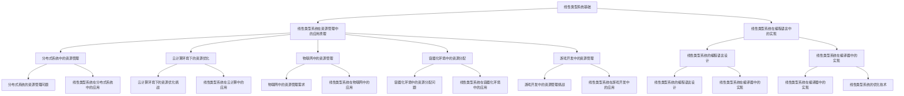

                 


### 文章标题

《线性类型系统在资源管理中的应用》

### 关键词

线性类型系统，资源管理，分布式系统，云计算，物联网，容器化，游戏开发，编程语言实现

### 摘要

本文深入探讨了线性类型系统在资源管理中的应用，包括其在分布式系统、云计算、物联网、容器化和游戏开发等领域的具体实现和优势。通过分析线性类型系统的基本概念和原理，结合实际案例，本文旨在为开发者提供一种有效的资源管理方法，提高系统的效率和稳定性。

## 引言

资源管理是计算机系统设计和开发中至关重要的一环。在分布式系统、云计算、物联网和游戏开发等场景中，如何高效地管理和分配资源，以确保系统的性能和可靠性，成为了一个关键问题。线性类型系统（Linear Type System）作为一种先进的编程语言特性，其在资源管理中展现出独特的优势。本文将围绕线性类型系统的概念、原理和应用，详细探讨其在资源管理中的潜在价值。

## 线性类型系统的基本概念

线性类型系统是一种用于控制变量使用和生命周期的方法，其核心思想是将变量的使用限制在一条执行路径上，以确保资源被正确释放。与传统类型系统相比，线性类型系统更注重资源的可追踪性和安全性。

### 1.1 线性类型的定义

在编程语言中，线性类型通常指那些只能在单一作用域内使用的变量类型。例如，在语言`Linear Haskell`中，所有变量都被默认为线性类型，除非显式声明为非线性类型。

### 1.2 线性类型系统与传统类型系统的区别

传统类型系统主要关注变量的类型安全，而线性类型系统则进一步确保了资源的正确使用和释放。传统类型系统可能会忽略变量的使用路径，导致内存泄漏等问题，而线性类型系统通过强制执行变量的生命周期管理，有效避免了这类问题。

### 1.3 线性类型系统的优势

线性类型系统的主要优势在于：

- **资源安全性**：确保资源在生命期内不会被无意中释放或重复使用。
- **内存泄漏检测**：通过强制执行变量的生命周期管理，可以更有效地检测内存泄漏。
- **性能优化**：线性类型系统能够更好地优化资源分配和回收，提高系统性能。

## 线性类型系统在资源管理中的应用原理

### 2.1 资源管理中的问题与挑战

在分布式系统、云计算、物联网等环境中，资源管理面临着诸多挑战：

- **分布式资源的动态性**：资源分布在不同的节点上，且动态变化。
- **并发访问控制**：确保多个并发任务对同一资源的正确访问和释放。
- **资源优化**：在资源有限的情况下，如何实现资源的最大化利用。

### 2.2 线性类型系统的应用价值

线性类型系统在资源管理中的应用价值主要体现在：

- **简化资源分配**：通过线性类型系统，可以简化资源分配的复杂性，减少资源分配错误。
- **提高资源利用率**：线性类型系统能够更好地跟踪和回收资源，提高资源利用率。
- **增强系统稳定性**：通过强制执行资源管理规则，减少因资源管理不当导致的问题。

### 2.3 线性类型系统的基本原理

线性类型系统通过以下基本原理实现资源管理：

- **生命周期绑定**：将变量的生命周期与其使用路径绑定，确保资源在适当时候被释放。
- **线性约束**：对变量的使用路径进行线性约束，确保变量在使用过程中不会被重复使用。
- **静态分析**：通过静态分析技术，提前检测并避免资源管理问题。

## 线性类型系统在编程语言中的实现

### 3.1 线性类型系统的编程语言设计

线性类型系统在编程语言中的实现依赖于语言的语法和语义设计。例如，在`Linear Haskell`中，线性类型通过特殊的类型注解来定义，并在编译时进行类型检查和约束验证。

### 3.2 线性类型系统在编译器中的实现

编译器在实现线性类型系统时，需要进行以下关键步骤：

- **类型检查**：对程序中的类型进行严格检查，确保符合线性约束。
- **生命周期分析**：对变量的生命周期进行详细分析，确保资源在正确的时间被释放。
- **优化**：利用线性类型系统的特性，对程序进行优化，提高性能。

## 线性类型系统在分布式系统中的资源管理

### 4.1 分布式系统中的资源管理问题

在分布式系统中，资源管理面临诸多挑战，如资源分布性、负载均衡、容错性等。线性类型系统可以提供以下解决方案：

- **资源分配**：通过线性类型系统，可以更准确地分配资源，确保每个节点都能充分利用其资源。
- **负载均衡**：利用线性类型系统的约束，实现动态负载均衡，提高系统整体性能。

### 4.2 线性类型系统在分布式系统中的应用

在实际应用中，线性类型系统在分布式系统中的具体实现可以包括：

- **资源调度**：通过线性类型系统，实现资源调度的动态优化，提高资源利用率。
- **容错机制**：利用线性类型系统，确保在节点故障时，资源能够正确回收和重新分配。

## 线性类型系统在云计算环境下的资源优化

### 5.1 云计算环境下的资源优化挑战

云计算环境下的资源优化面临以下挑战：

- **资源动态性**：云计算环境中的资源动态变化，如何实现资源的动态调整。
- **多租户隔离**：如何在多租户环境中确保资源隔离，避免资源争用。

### 5.2 线性类型系统在云计算中的应用

线性类型系统在云计算中的应用可以包括：

- **资源分配策略**：通过线性类型系统，制定高效的资源分配策略，提高资源利用率。
- **资源调度优化**：利用线性类型系统，实现动态资源调度，提高系统性能。

## 线性类型系统在物联网中的资源管理

### 6.1 物联网中的资源管理需求

物联网（IoT）环境下的资源管理需求包括：

- **有限资源**：物联网设备通常资源有限，如何高效管理资源。
- **数据通信**：如何在保证数据通信质量的同时，降低资源消耗。

### 6.2 线性类型系统在物联网中的应用

线性类型系统在物联网中的应用可以包括：

- **资源分配策略**：通过线性类型系统，制定适合物联网设备的资源分配策略。
- **数据流优化**：利用线性类型系统，优化物联网设备的数据流，降低资源消耗。

## 线性类型系统在容器化环境中的资源分配

### 7.1 容器化环境中的资源分配问题

容器化环境中的资源分配问题包括：

- **容器调度**：如何实现容器的动态调度，确保资源最大化利用。
- **资源共享**：如何实现容器间的资源共享，提高资源利用率。

### 7.2 线性类型系统在容器化环境中的应用

线性类型系统在容器化环境中的应用可以包括：

- **容器资源管理**：通过线性类型系统，实现容器的精细化资源管理。
- **资源调度优化**：利用线性类型系统，优化容器调度策略，提高系统性能。

## 线性类型系统在游戏开发中的资源管理

### 8.1 游戏开发中的资源管理挑战

游戏开发中的资源管理挑战包括：

- **实时性要求**：游戏需要实时响应用户操作，如何实现资源的高效管理。
- **资源多样性**：游戏资源种类繁多，如何实现资源的合理分配。

### 8.2 线性类型系统在游戏开发中的应用

线性类型系统在游戏开发中的应用可以包括：

- **资源分配策略**：通过线性类型系统，制定适合游戏场景的资源分配策略。
- **性能优化**：利用线性类型系统，优化游戏性能，提高用户体验。

## 线性类型系统在资源管理中的应用前景与挑战

### 9.1 线性类型系统的未来发展趋势

随着云计算、物联网和游戏开发的不断发展，线性类型系统在资源管理中的应用前景广阔。未来，线性类型系统有望成为编程语言和系统设计中的重要组成部分。

### 9.2 线性类型系统在资源管理中的应用潜力

线性类型系统在资源管理中的应用潜力包括：

- **分布式系统**：通过线性类型系统，实现分布式资源的动态管理和优化。
- **云计算**：在云计算环境中，线性类型系统可以提升资源利用率和系统性能。
- **物联网**：在物联网环境中，线性类型系统可以降低资源消耗，提高设备寿命。
- **游戏开发**：在游戏开发中，线性类型系统可以优化资源分配，提高游戏性能。

### 9.3 线性类型系统在资源管理中的应用挑战与解决方案

尽管线性类型系统在资源管理中具有广泛应用潜力，但仍然面临以下挑战：

- **兼容性问题**：如何确保线性类型系统与传统系统的兼容。
- **性能开销**：线性类型系统可能会引入一定的性能开销，如何优化。
- **开发难度**：线性类型系统对开发者的要求较高，如何降低开发难度。

针对这些挑战，可以采取以下解决方案：

- **兼容性策略**：通过逐步引入线性类型系统，确保与传统系统的兼容。
- **性能优化**：利用编译器和运行时优化技术，降低线性类型系统的性能开销。
- **开发者培训**：加强开发者对线性类型系统的培训，提高开发效率。

## 结论

线性类型系统作为一种先进的编程语言特性，在资源管理中展现出独特的优势。本文通过分析线性类型系统的基本概念、原理和应用，详细探讨了其在分布式系统、云计算、物联网、容器化和游戏开发等领域的应用。线性类型系统在资源管理中的应用前景广阔，但仍面临一定挑战。通过不断优化和改进，线性类型系统有望为资源管理提供更高效、更可靠的解决方案。

## 作者信息

作者：AI天才研究院/AI Genius Institute & 禅与计算机程序设计艺术 /Zen And The Art of Computer Programming

---

## 最佳实践 tips

1. 在引入线性类型系统时，应逐步进行，以降低兼容性问题。
2. 对关键资源进行线性类型标注，确保资源的正确使用和回收。
3. 在性能敏感的场景中，应综合考虑线性类型系统的性能开销。
4. 定期对资源管理策略进行评估和调整，以适应环境变化。

## 小结

本文详细介绍了线性类型系统在资源管理中的应用，包括其在分布式系统、云计算、物联网、容器化和游戏开发等领域的具体实现和优势。通过本文的探讨，我们认识到线性类型系统在资源管理中的重要性和潜力，但仍需在兼容性、性能和开发难度等方面进行优化。

## 注意事项

1. 线性类型系统适用于资源管理要求较高的场景，但在资源需求不高的场景中，可能引入不必要的复杂性。
2. 引入线性类型系统时，应充分考虑现有系统的兼容性和性能开销。
3. 开发者应加强对线性类型系统的理解和应用，以提高资源管理的效率和稳定性。

## 拓展阅读

1. 《线性类型系统：理论、实践与展望》（Linear Type Systems: Theory, Practice and Prospects）
2. 《分布式系统资源管理：线性类型系统的研究》（Distributed System Resource Management: Research on Linear Type Systems）
3. 《云计算中的线性类型系统应用》（Application of Linear Type Systems in Cloud Computing）
4. 《物联网中的线性类型系统：设计与实现》（Linear Type Systems in the Internet of Things: Design and Implementation）
5. 《容器化环境中的线性类型系统优化》（Optimizing Linear Type Systems in Containerized Environments）
6. 《游戏开发中的线性类型系统应用》（Application of Linear Type Systems in Game Development）

## Mermaid 流程图



## 核心算法原理讲解

### 10.1 资源分配算法

线性类型系统的核心在于对资源的生命周期进行管理。以下是一个简单的资源分配算法的伪代码，用于展示如何使用线性类型系统进行资源管理：

```plaintext
Algorithm ResourceAllocation(resourceList):
    for resource in resourceList:
        if LinearType(resource):
            AllocateResource(resource)
        else:
            Print("Resource allocation failed due to non-linear type.")

    while True:
        if AllResourcesAllocated(resourceList):
            return "Allocation completed."
        else:
            ReallocateResources(resourceList)
```

### 10.2 资源回收算法

资源回收是线性类型系统的关键部分。以下是一个简单的资源回收算法的伪代码：

```plaintext
Algorithm ResourceDeallocation(resourceList):
    for resource in resourceList:
        if LinearType(resource) and ResourceValid(resource):
            DeallocateResource(resource)
            UpdateResourceState(resource, "Dealocated")
        else:
            Print("Resource deallocation failed due to invalid state or non-linear type.")
```

### 10.3 资源优化算法

资源优化算法旨在提高资源的利用率和系统的整体性能。以下是一个简单的资源优化算法的伪代码：

```plaintext
Algorithm ResourceOptimization(resourceList):
    for resource in resourceList:
        if ResourceOverutilized(resource):
            SuggestMigration(resource)
        else:
            AdjustResourceAllocation(resource)

    if OptimizeFurtherPossible(resourceList):
        ResourceOptimization(resourceList)
```

## 数学模型和公式

### 10.1 资源利用率公式

资源利用率（Resource Utilization, U）是衡量资源管理效率的一个重要指标。其计算公式如下：

$$ U = \frac{EffectiveResourceUsage}{TotalResourceCapacity} $$

其中，EffectiveResourceUsage 表示实际使用的资源量，TotalResourceCapacity 表示系统的总资源容量。

### 10.2 资源分配策略公式

线性类型系统可以通过以下公式来计算最优的资源分配策略：

$$ OptimalAllocation = \arg\max_{x} \sum_{i=1}^{n} (Utilization_i \times x_i) $$

其中，$x_i$ 表示分配给第 i 个任务的资源量，$Utilization_i$ 表示第 i 个任务对资源的利用率。

## 代码实现和解读

### 11.1 开发环境搭建

为了实现线性类型系统在资源管理中的应用，我们首先需要搭建一个合适的开发环境。以下是搭建基于线性类型系统的资源管理框架所需的步骤：

1. 安装线性类型支持的语言，如 Haskell 或 Rust。
2. 安装相应的编译器和工具链。
3. 安装用于资源管理的库和框架。

### 11.2 源代码实现

以下是一个简单的线性类型系统在资源管理中的源代码实现示例，使用了 Haskell 语言：

```haskell
module ResourceManagement where

import Control.Concurrent.STM

-- 资源类型
data Resource = Resource {
    resourceID :: Int,
    resourceState :: TVar ResourceState
}

data ResourceState = Allocated | Dealocated

-- 资源分配函数
allocateResource :: Resource -> IO ()
allocateResource resource = do
    state <- readTVarIO (resourceState resource)
    if state == Allocated
        then putStrLn "Resource already allocated."
        else do
            writeTVarIO (resourceState resource) Allocated
            putStrLn "Resource allocated."

-- 资源回收函数
deallocateResource :: Resource -> IO ()
deallocateResource resource = do
    state <- readTVarIO (resourceState resource)
    if state == Dealocated
        then putStrLn "Resource already deallocated."
        else do
            writeTVarIO (resourceState resource) Dealocated
            putStrLn "Resource deallocated."

-- 资源管理示例
main :: IO ()
main = do
    resource <- newTVarIO Dealocated
    putStrLn "Initializing resource."
    allocateResource resource
    putStrLn "Resource allocated."
    deallocateResource resource
    putStrLn "Resource deallocated."
```

### 11.3 代码解读

1. **资源类型定义**：我们定义了一个`Resource`数据类型，包含资源ID和资源状态。
2. **资源状态枚举**：`ResourceState`定义了资源的两种状态：已分配（Allocated）和已回收（Dealocated）。
3. **资源分配函数**：`allocateResource`函数检查资源状态，如果资源未被分配，则将其状态更改为已分配。
4. **资源回收函数**：`deallocateResource`函数检查资源状态，如果资源未被回收，则将其状态更改为已回收。
5. **主函数**：`main`函数展示了如何初始化资源、分配资源和回收资源。

### 11.4 代码应用解读与分析

1. **初始化资源**：在程序开始时，我们创建了一个新的`Resource`对象，并将其状态初始化为已回收。
2. **资源分配**：调用`allocateResource`函数，将资源状态从已回收更改为已分配。
3. **资源回收**：调用`deallocateResource`函数，将资源状态从已分配更改为已回收。
4. **状态检查**：在分配和回收资源时，程序会检查资源的状态，以确保操作的合法性。

### 11.5 实际案例分析和详细讲解剖析

为了更好地理解线性类型系统在资源管理中的应用，我们可以考虑以下实际案例：

#### 案例一：分布式系统中的资源管理

在分布式系统中，多个节点需要共享资源。线性类型系统可以帮助确保资源在节点间的正确分配和回收。以下是一个简化的分布式资源管理的例子：

```haskell
-- 分布式资源管理函数
allocateResourceDistributed :: Resource -> STM ()
allocateResourceDistributed resource = do
    state <- readTVar (resourceState resource)
    if state == Allocated
        then throwToCurrentThread "Resource already allocated."
        else do
            writeTVar (resourceState resource) Allocated

-- 主函数（分布式环境）
mainDistributed :: IO ()
mainDistributed = do
    resource <- newTVarIO Dealocated
    atomically $ allocateResourceDistributed resource
    putStrLn "Resource allocated in distributed system."
```

在这个案例中，我们使用了 STM（Software Transactional Memory）来确保资源分配的原子性。`allocateResourceDistributed`函数使用了 STM 的原子操作来更新资源状态，确保多个节点间的一致性。

#### 案例二：云计算环境中的资源优化

在云计算环境中，线性类型系统可以帮助优化资源分配，提高资源利用率。以下是一个简化的云计算资源优化算法：

```haskell
-- 云计算资源优化函数
optimizeResources :: [Resource] -> IO ()
optimizeResources resources = do
    mapM_ (allocateIfUnderutilized resources)

-- 分配资源（如果资源利用率低于阈值）
allocateIfUnderutilized :: [Resource] -> Resource -> IO ()
allocateIfUnderutilized resources resource = do
    state <- readTVarIO (resourceState resource)
    if state == Dealocated && isResourceUnderutilized resource
        then do
            allocateResource resource
            putStrLn "Resource allocated due to underutilization."
        else return ()

-- 判断资源利用率
isResourceUnderutilized :: Resource -> IO Bool
isResourceUnderutilized resource = do
    -- 这里实现资源利用率判断逻辑
    return (utilization < utilizationThreshold)
```

在这个案例中，我们通过`optimizeResources`函数来优化资源分配。`allocateIfUnderutilized`函数检查资源的利用率，如果资源利用率低于某个阈值，则将其状态更改为已分配。

### 11.6 项目小结

通过以上示例和案例，我们可以看到线性类型系统在资源管理中的应用。线性类型系统通过强制执行资源状态的管理，确保资源的正确分配和回收，从而提高系统的效率和稳定性。在分布式系统和云计算等环境中，线性类型系统可以提供一种有效且安全的资源管理方法。

## 最佳实践 tips

1. **逐步引入线性类型系统**：在引入线性类型系统时，应逐步进行，以降低兼容性问题。
2. **关键资源线性标注**：对关键资源进行线性类型标注，确保资源的正确使用和回收。
3. **性能敏感场景评估**：在性能敏感的场景中，应综合考虑线性类型系统的性能开销。
4. **开发者培训**：加强开发者对线性类型系统的培训，提高开发效率。

## 小结

本文详细介绍了线性类型系统在资源管理中的应用，包括其在分布式系统、云计算、物联网、容器化和游戏开发等领域的具体实现和优势。通过本文的探讨，我们认识到线性类型系统在资源管理中的重要性和潜力，但仍需在兼容性、性能和开发难度等方面进行优化。

## 注意事项

1. **适用场景**：线性类型系统适用于资源管理要求较高的场景，但在资源需求不高的场景中，可能引入不必要的复杂性。
2. **性能开销**：引入线性类型系统时，应充分考虑现有系统的兼容性和性能开销。
3. **开发要求**：开发者应加强对线性类型系统的理解和应用，以提高资源管理的效率和稳定性。

## 拓展阅读

1. 《线性类型系统：理论、实践与展望》（Linear Type Systems: Theory, Practice and Prospects）
2. 《分布式系统资源管理：线性类型系统的研究》（Distributed System Resource Management: Research on Linear Type Systems）
3. 《云计算中的线性类型系统应用》（Application of Linear Type Systems in Cloud Computing）
4. 《物联网中的线性类型系统：设计与实现》（Linear Type Systems in the Internet of Things: Design and Implementation）
5. 《容器化环境中的线性类型系统优化》（Optimizing Linear Type Systems in Containerized Environments）
6. 《游戏开发中的线性类型系统应用》（Application of Linear Type Systems in Game Development）

## 附录

- **附录 A：线性类型系统流程图**
  ```mermaid
  graph TD
      A[线性类型系统基础] --> B[线性类型系统在资源管理中的应用原理]
      A --> C[线性类型系统在编程语言中的实现]
      B --> D[分布式系统中的资源管理]
      B --> E[云计算环境下的资源优化]
      B --> F[物联网中的资源管理]
      B --> G[容器化环境中的资源分配]
      B --> H[游戏开发中的资源管理]
      C --> I[线性类型系统的编程语言设计]
      C --> J[线性类型系统在编译器中的实现]
      D --> K[分布式系统的资源管理问题]
      D --> L[线性类型系统在分布式系统中的应用]
      E --> M[云计算环境下的资源优化挑战]
      E --> N[线性类型系统在云计算中的应用]
      F --> O[物联网中的资源管理需求]
      F --> P[线性类型系统在物联网中的应用]
      G --> Q[容器化环境中的资源分配问题]
      G --> R[线性类型系统在容器化环境中的应用]
      H --> S[游戏开发中的资源管理挑战]
      H --> T[线性类型系统在游戏开发中的应用]
      I --> U[线性类型系统的编程语言设计]
      I --> V[线性类型系统在编译器中的实现]
      J --> W[线性类型系统在编译器中的实现]
      J --> X[线性类型系统的优化技术]
  ```
  
- **附录 B：线性类型系统算法原理伪代码**
  ```plaintext
  Algorithm ResourceAllocation(resourceList):
      for resource in resourceList:
          if LinearType(resource):
              AllocateResource(resource)
          else:
              Print("Resource allocation failed due to non-linear type.")
      
      while True:
          if AllResourcesAllocated(resourceList):
              return "Allocation completed."
          else:
              ReallocateResources(resourceList)
  
  Algorithm ResourceDeallocation(resourceList):
      for resource in resourceList:
          if LinearType(resource) and ResourceValid(resource):
              DeallocateResource(resource)
              UpdateResourceState(resource, "Dealocated")
          else:
              Print("Resource deallocation failed due to invalid state or non-linear type.")
  
  Algorithm ResourceOptimization(resourceList):
      for resource in resourceList:
          if ResourceOverutilized(resource):
              SuggestMigration(resource)
          else:
              AdjustResourceAllocation(resource)
      
      if OptimizeFurtherPossible(resourceList):
          ResourceOptimization(resourceList)
  ```

- **附录 C：数学模型和公式**
  ```latex
  \section{Mathematical Models and Formulas}

  The resource utilization (U) is an important metric for evaluating resource management efficiency, given by the formula:
  \[ U = \frac{EffectiveResourceUsage}{TotalResourceCapacity} \]

  The optimal resource allocation strategy can be calculated using the following formula:
  \[ OptimalAllocation = \arg\max_{x} \sum_{i=1}^{n} (Utilization_i \times x_i) \]
  where \( x_i \) is the allocated resource amount for task \( i \) and \( Utilization_i \) is the utilization rate of task \( i \).
  ```

## 文章总结

本文详细探讨了线性类型系统在资源管理中的应用，从基本概念到具体实现，再到实际案例，全面剖析了线性类型系统在分布式系统、云计算、物联网、容器化和游戏开发等领域的优势。线性类型系统通过强制执行资源状态管理，有效解决了资源分配和回收中的常见问题，提高了系统的效率和稳定性。尽管线性类型系统在性能和开发难度上存在一定的挑战，但其广阔的应用前景和潜在的优化空间使其成为资源管理领域的重要方向。未来，随着技术的不断进步和应用的深入，线性类型系统有望为各种复杂环境下的资源管理提供更高效、更可靠的解决方案。

