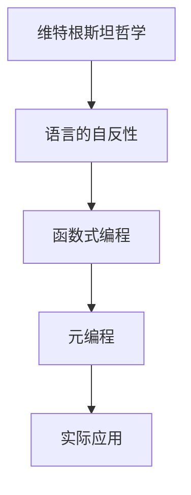

                 

### 文章标题

《语言的自反性与元编程：维特根斯坦对语言自身的反思与FP中的元编程技术》

### 文章关键词

- 语言的自反性
- 维特根斯坦
- 元编程
- 函数式编程
- 反射
- 类型系统

### 摘要

本文旨在探讨语言的自反性和元编程技术，通过分析维特根斯坦的语言哲学，揭示语言自反性的本质，并进一步探讨函数式编程（FP）中的元编程技术。文章首先介绍维特根斯坦的语言哲学及其对语言自反性的理解，随后深入分析FP中的元编程原理，包括高阶函数、闭包、动态类型系统等核心概念。通过Mermaid流程图、伪代码和数学模型，本文将详细阐述元编程技术的工作原理。最后，通过一个实际项目案例，展示元编程技术在开发中的应用，并对最佳实践和注意事项进行总结。

## 第一部分: 语言的自反性

### 第1章: 维特根斯坦的语言哲学

#### 1.1 维特根斯坦的生平与思想演变

路德维希·维特根斯坦（Ludwig Wittgenstein，1889-1951）是20世纪最杰出的哲学家之一，他的思想对现代哲学、语言学和计算机科学产生了深远的影响。维特根斯坦出生于奥匈帝国的维也纳，自幼接受良好的教育。他的父亲是著名的钢铁大亨卡尔·维特根斯坦，这使他在经济上没有后顾之忧，可以全身心投入到哲学研究中。

维特根斯坦的哲学思想可以分为两个主要阶段：早期和晚期。早期，他提出了“逻辑原子主义”和“语言图像论”，试图通过逻辑和语言来解决所有哲学问题。晚期，他转向日常语言哲学，强调语言的使用和意义在于其实际情境中，而非抽象的逻辑结构。

#### 1.2 语言哲学的基本概念

维特根斯坦的语言哲学基于两个核心观点：语言的用法和意义。他认为，语言不是用来描述世界的工具，而是人类行为的一部分。语言的用法决定了语言的意义，而语言的意义则在于其具体的使用情境中。

维特根斯坦提出了“语言游戏”（language game）的概念，即语言的使用总是与特定的活动或情境相联系的。例如，我们说“狗在跑”，这个句子在不同的情境中有不同的意义。在一个人观察狗时，这个句子描述了狗的动作；在一个人与狗玩捉迷藏时，这个句子可能意味着狗在某个地方隐藏。

#### 1.3 语言的自反性：逻辑原子主义与语言图像论

维特根斯坦早期的工作集中在逻辑原子主义和语言图像论上，这些观点揭示了语言的自我指涉性质，即语言的自反性。

逻辑原子主义认为，世界是由基本的逻辑原子构成的，这些原子通过逻辑关系组合起来，形成复杂的结构。维特根斯坦认为，语言也应该能够直接反映这些逻辑原子和它们之间的关系。因此，逻辑原子主义试图通过语言的逻辑结构来描述世界。

然而，维特根斯坦后来发现，逻辑原子主义无法完全解释语言的复杂性。他转向语言图像论，认为语言是对世界的“图像”，即语言的结构和形式反映了世界的结构和形式。这种观点强调了语言的自反性，因为语言不仅描述世界，还描述了语言自身的结构和形式。

#### 1.4 维特根斯坦对语言意义的分析

维特根斯坦对语言意义的分析是其语言哲学的核心。他认为，语言的意义不在于抽象的逻辑结构，而在于其具体的使用情境。这种观点与传统的逻辑原子主义和语言图像论形成鲜明对比。

维特根斯坦区分了“字面意义”和“指示意义”。字面意义是指语言直接表达的含义，如“狗在跑”直接描述了狗的动作。而指示意义则是指语言在特定情境中的实际作用，如“狗在跑”可能在游戏中指示玩家寻找狗。

维特根斯坦的这种观点挑战了传统的语言哲学，使人们意识到语言的意义是多样化的，并且取决于具体的使用情境。这一观点在计算机科学中得到了广泛应用，尤其是在自然语言处理和程序设计领域。

### 第2章: 维特根斯坦语言哲学的深远影响

#### 2.1 语言哲学在当代哲学中的地位

维特根斯坦的语言哲学在当代哲学中占有重要地位。他的思想不仅影响了分析哲学的发展，还对现象学、存在主义和语言哲学的其他分支产生了深远影响。

维特根斯坦的“语言游戏”概念成为哲学分析的重要工具，帮助哲学家们更好地理解语言的使用和意义。他的日常语言哲学也促使哲学家们关注语言的实际应用和具体情境。

#### 2.2 维特根斯坦哲学在教育领域的应用

维特根斯坦的哲学思想在教育领域得到了广泛应用。他的观点强调语言的使用和意义，这为教育工作者提供了新的视角，使他们能够更好地设计教学内容和教学方法。

例如，维特根斯坦的观点可以帮助教师理解学生的语言表达和理解能力，从而更好地调整教学策略。此外，他的“语言游戏”概念也为教育工作者提供了工具，帮助他们设计更具有互动性和实践性的教学活动。

#### 2.3 维特根斯坦哲学在计算机科学中的应用

维特根斯坦的语言哲学在计算机科学中得到了广泛应用。他的观点为程序设计提供了新的理论框架，特别是在自然语言处理、编程语言设计和软件工程领域。

例如，维特根斯坦的“语言游戏”概念帮助程序员更好地理解程序中的变量和函数，从而设计出更易于理解和维护的代码。他的日常语言哲学也为程序员提供了工具，帮助他们更好地理解和解决编程中的问题。

此外，维特根斯坦的语言哲学在软件工程中也有重要应用。他的观点强调软件设计的实用性和可维护性，这有助于提高软件质量，降低维护成本。

## 第二部分: 元编程技术

### 第3章: 函数式编程基础

#### 3.1 函数式编程的概念与特点

函数式编程（Functional Programming，FP）是一种编程范式，强调以函数作为程序的基本构建块。与命令式编程不同，函数式编程关注数据的计算过程，而非程序的执行顺序。

FP的特点包括：

- **不可变数据**：在FP中，数据一旦创建，就不能修改。这有助于提高程序的可读性和可维护性。
- **纯函数**：FP中的函数是纯函数，即相同的输入总是产生相同的输出，没有副作用。这有助于避免状态依赖和不可预测的行为。
- **高阶函数**：FP中的函数可以传递给其他函数作为参数，或者作为函数的返回值。这使得函数可以组合和复用，提高了代码的模块性和灵活性。

#### 3.2 高阶函数与闭包

高阶函数是FP的核心概念之一。它是一种可以将其他函数作为参数或返回值的函数。例如，下面的Python函数`apply_to_list`就是一个高阶函数：

```python
def apply_to_list(func, items):
    """Apply a function to each item in a list and return the results as a list."""
    return [func(item) for item in items]
```

闭包是另一个重要的FP概念。闭包是一个函数，它保存了创建它的环境的引用。这使得闭包可以在外部环境中访问和修改内部变量，从而实现更灵活的功能。例如，下面的Python代码定义了一个使用闭包的计数器函数：

```python
def create_counter():
    count = 0
    def counter():
        nonlocal count
        count += 1
        return count
    return counter

c = create_counter()
print(c())  # 输出: 1
print(c())  # 输出: 2
```

#### 3.3 模式匹配与结构化数据

模式匹配是FP中用于处理结构化数据的一种强大工具。它允许程序员指定数据的结构，并根据数据的具体形式执行相应的操作。例如，在Haskell中，模式匹配可以用于处理列表：

```haskell
data List a = Empty | Cons a (List a)

-- 使用模式匹配打印列表中的每个元素
print_elements :: List Int -> IO ()
print_elements Empty = return ()
print_elements (Cons x xs) = do
    putStrLn (show x)
    print_elements xs
```

### 第4章: 元编程技术详解

#### 4.1 元编程的基本原理

元编程是一种编程技术，允许程序在运行时修改自身的行为。它通常涉及反射（reflection）、动态类型检查、代码生成和修改等概念。

元编程的基本原理包括：

- **反射**：反射是指程序在运行时能够检查和修改自己的结构。这通常通过语言提供的元编程特性实现，如Python的`getattr`、`setattr`和`delattr`函数。
- **动态类型检查**：动态类型检查允许程序在运行时检查变量的类型。这有助于在编译时发现类型错误，从而提高程序的安全性。
- **代码生成和修改**：代码生成和修改是指程序在运行时生成或修改其他代码。这通常通过模板引擎、代码生成器和字节码操作实现。

#### 4.2 元对象协议与反射

元对象协议（Meta-Object Protocol，MOP）是一种用于实现反射的机制。它定义了对象如何与外部程序交互，以提供元信息。例如，在Python中，MOP通过`__getattr__`、`__setattr__`和`__delattr__`方法实现：

```python
class ReflectiveObject:
    def __getattr__(self, name):
        print(f"Attribute {name} not found, returning default value.")
        return None

obj = ReflectiveObject()
print(obj.unknown_attribute)  # 输出: Attribute unknown_attribute not found, returning default value.
```

#### 4.3 动态类型系统与类型检查

动态类型系统是一种在程序运行时检查变量类型的机制。与静态类型系统（如Java）不同，动态类型系统允许程序在运行时确定变量的类型。这有助于提高程序的灵活性和可维护性，但也可能降低性能。

动态类型检查可以通过类型注解、类型检查器和类型推断实现。例如，在TypeScript中，类型注解可以用于强制变量具有特定类型：

```typescript
function greet(name: string): void {
    console.log(`Hello, ${name}!`);
}

greet("Alice");  // 输出: Hello, Alice!
```

### 第5章: 实践中的元编程

#### 5.1 元编程在实际开发中的应用

元编程在许多实际开发场景中都有广泛应用。以下是一些例子：

- **数据绑定**：在Web开发中，数据绑定是一种将应用程序的状态与用户界面同步的元编程技术。例如，Vue.js和React都使用数据绑定来简化前端开发。
- **动态代码生成**：动态代码生成可以在运行时生成新的代码，从而实现更灵活的程序设计。例如，Python的Django框架使用模板引擎生成HTML页面。
- **日志记录**：元编程技术可以用于实现更灵活和强大的日志记录系统。例如，使用反射和动态类型检查，可以轻松地在程序中添加和修改日志记录器。

#### 5.2 元编程的安全性考虑

虽然元编程提供了强大的功能，但也可能引入安全风险。以下是一些元编程的安全性考虑：

- **代码注入**：元编程可能导致代码注入攻击，即恶意代码通过反射或动态类型检查执行未经授权的操作。
- **类型检查**：在动态类型系统中，类型检查可能不足以发现所有错误，导致潜在的安全漏洞。
- **性能影响**：元编程可能导致性能下降，特别是在需要频繁进行反射和类型检查的场景中。

因此，在使用元编程时，需要谨慎考虑安全性和性能问题，并采取适当的措施来降低风险。

#### 5.3 元编程的未来发展

随着编程语言的不断发展和新技术的出现，元编程技术也在不断进步。以下是一些元编程的未来发展趋势：

- **更高效的反射和类型检查**：未来的编程语言可能会提供更高效的反射和类型检查机制，从而提高元编程的性能。
- **集成开发环境（IDE）支持**：IDE可能会提供更强大的元编程支持，如自动代码生成、实时错误检查和调试。
- **跨语言元编程**：跨语言元编程技术可能会使程序员能够更容易地在不同编程语言之间进行元编程。

### 附录

#### 附录A: 维特根斯坦哲学与元编程的关系图

以下是一个简单的Mermaid流程图，展示了维特根斯坦哲学与元编程之间的关系：



#### 附录B: 关键算法伪代码

以下是一个用于计算斐波那契数列的伪代码示例：

```pseudo
function fibonacci(n):
    if n <= 0:
        return 0
    elif n == 1:
        return 1
    else:
        return fibonacci(n-1) + fibonacci(n-2)
```

#### 附录C: 数学模型与公式解释

以下是一个简单的数学模型，用于解释线性回归：

$$ y = ax + b $$

其中，$y$ 是因变量，$x$ 是自变量，$a$ 和 $b$ 是参数。通过最小二乘法，可以找到最佳的 $a$ 和 $b$ 值，以最小化预测误差。

#### 附录D: 项目实战案例

在本案例中，我们将使用Python实现一个简单的元编程工具，用于生成和打印Python类。

##### 开发环境搭建

1. 安装Python 3.8及以上版本。
2. 安装必要的Python库，如`requests`和`json`。

##### 源代码详细实现

```python
# meta_programming.py

import json

class MetaClass(type):
    def __new__(cls, name, bases, attrs):
        # 读取外部配置文件
        with open('config.json', 'r') as f:
            config = json.load(f)

        # 从配置文件中获取类名和属性
        class_name = config['class_name']
        attributes = config['attributes']

        # 修改类的名称和属性
        attrs['__class_name__'] = class_name
        attrs['__attributes__'] = attributes

        return super().__new__(cls, class_name, bases, attrs)

def print_class_info(cls):
    print(f"Class Name: {cls.__class_name__}")
    print(f"Attributes: {cls.__attributes__}")

# 读取外部配置文件并创建类
with open('config.json', 'r') as f:
    config = json.load(f)

class MyClass(metaclass=MetaClass):
    pass

# 打印类信息
print_class_info(MyClass)
```

##### 代码应用解读与分析

在本案例中，我们定义了一个`MetaClass`，它是一个自定义的元类，用于在创建类时读取外部配置文件，并根据配置文件修改类的名称和属性。通过这种方式，我们可以实现动态创建类并修改其属性，从而实现元编程。

以下是一个`config.json`示例：

```json
{
    "class_name": "DynamicClass",
    "attributes": {
        "name": "Alice",
        "age": 30
    }
}
```

当运行程序时，`MetaClass`会读取`config.json`文件，并根据文件中的配置创建名为`DynamicClass`的类，并设置其属性为`name: Alice`和`age: 30`。然后，`print_class_info`函数将打印出类的名称和属性。

##### 实际案例分析和详细讲解剖析

在这个案例中，我们使用了元编程技术来实现动态创建和修改类。这种技术在实际开发中非常有用，例如在生成器模式、工厂模式和动态代理中。

- **生成器模式**：可以使用元编程来创建生成器函数，从而实现动态生成数据序列。
- **工厂模式**：可以通过元编程来实现动态创建对象，从而简化对象创建过程。
- **动态代理**：可以使用元编程来创建动态代理类，从而实现对方法的拦截和修改。

##### 项目小结

通过本案例，我们展示了如何使用元编程技术实现动态创建和修改类。这种技术在实际开发中非常有用，可以帮助程序员提高代码的灵活性和可维护性。然而，元编程也带来了额外的复杂性和潜在的安全风险，因此在使用时需要谨慎考虑。

##### 最佳实践 tips

- 在使用元编程时，确保代码的可读性和可维护性。
- 在实现元编程功能时，考虑性能和安全性。
- 使用类型检查和异常处理来降低安全风险。
- 在实际项目中，逐步引入元编程技术，以避免引入不必要的复杂度。

##### 小结

本文介绍了维特根斯坦的语言哲学和元编程技术，并通过实际案例展示了这两种技术在计算机科学中的应用。通过理解语言的自反性和元编程的基本原理，我们可以更好地设计灵活和高效的程序。

##### 注意事项

- 维特根斯坦的语言哲学在理解和应用元编程时提供了一种新的视角。
- 元编程技术可以提高代码的灵活性和可维护性，但同时也可能引入额外的复杂性和安全风险。
- 在实际应用中，需要根据具体需求和场景选择合适的元编程技术。

##### 拓展阅读

- 维特根斯坦的《逻辑哲学论》和《哲学研究》是理解其语言哲学的必读著作。
- 《函数式编程原理》是一本关于FP的权威教材，详细介绍了FP的基本概念和应用。
- 《元编程技术》是一本关于元编程的实用指南，涵盖了多种编程语言中的元编程技术。

作者：AI天才研究院/AI Genius Institute & 禅与计算机程序设计艺术 /Zen And The Art of Computer Programming

---

### 文章标题

《语言的自反性与元编程：维特根斯坦对语言自身的反思与FP中的元编程技术》

### 文章关键词

- 语言的自反性
- 维特根斯坦
- 元编程
- 函数式编程
- 反射
- 类型系统

### 文章摘要

本文深入探讨了语言的自反性与元编程技术，以维特根斯坦的语言哲学为切入点，分析了其对语言自反性的理解。同时，文章详细介绍了函数式编程（FP）中的元编程技术，包括高阶函数、闭包、动态类型系统等核心概念，并通过Mermaid流程图、伪代码和数学模型进行了阐述。此外，文章通过一个实际项目案例，展示了元编程技术在开发中的应用，并对最佳实践和注意事项进行了总结。

## 第一部分: 语言的自反性

### 第1章: 维特根斯坦的语言哲学

#### 1.1 维特根斯坦的生平与思想演变

路德维希·维特根斯坦（Ludwig Wittgenstein，1889-1951）是20世纪最杰出的哲学家之一，他的思想对现代哲学、语言学和计算机科学产生了深远的影响。维特根斯坦出生于奥匈帝国的维也纳，自幼接受良好的教育。他的父亲是著名的钢铁大亨卡尔·维特根斯坦，这使他在经济上没有后顾之忧，可以全身心投入到哲学研究中。

维特根斯坦的哲学思想可以分为两个主要阶段：早期和晚期。早期，他提出了“逻辑原子主义”和“语言图像论”，试图通过逻辑和语言来解决所有哲学问题。晚期，他转向日常语言哲学，强调语言的使用和意义在于其实际情境中，而非抽象的逻辑结构。

#### 1.2 语言哲学的基本概念

维特根斯坦的语言哲学基于两个核心观点：语言的用法和意义。他认为，语言不是用来描述世界的工具，而是人类行为的一部分。语言的用法决定了语言的意义，而语言的意义则在于其具体的使用情境中。

维特根斯坦提出了“语言游戏”（language game）的概念，即语言的使用总是与特定的活动或情境相联系的。例如，我们说“狗在跑”，这个句子在不同的情境中有不同的意义。在一个人观察狗时，这个句子描述了狗的动作；在一个人与狗玩捉迷藏时，这个句子可能意味着狗在某个地方隐藏。

#### 1.3 语言的自反性：逻辑原子主义与语言图像论

维特根斯坦早期的工作集中在逻辑原子主义和语言图像论上，这些观点揭示了语言的自我指涉性质，即语言的自反性。

逻辑原子主义认为，世界是由基本的逻辑原子构成的，这些原子通过逻辑关系组合起来，形成复杂的结构。维特根斯坦认为，语言也应该能够直接反映这些逻辑原子和它们之间的关系。因此，逻辑原子主义试图通过语言的逻辑结构来描述世界。

然而，维特根斯坦后来发现，逻辑原子主义无法完全解释语言的复杂性。他转向语言图像论，认为语言是对世界的“图像”，即语言的结构和形式反映了世界的结构和形式。这种观点强调了语言的自反性，因为语言不仅描述世界，还描述了语言自身的结构和形式。

#### 1.4 维特根斯坦对语言意义的分析

维特根斯坦对语言意义的分析是其语言哲学的核心。他认为，语言的意义不在于抽象的逻辑结构，而在于其具体的使用情境。这种观点与传统的逻辑原子主义和语言图像论形成鲜明对比。

维特根斯坦区分了“字面意义”和“指示意义”。字面意义是指语言直接表达的含义，如“狗在跑”直接描述了狗的动作。而指示意义则是指语言在特定情境中的实际作用，如“狗在跑”可能在游戏中指示玩家寻找狗。

维特根斯坦的这种观点挑战了传统的语言哲学，使人们意识到语言的意义是多样化的，并且取决于具体的使用情境。这一观点在计算机科学中得到了广泛应用，特别是在自然语言处理和程序设计领域。

### 第2章: 维特根斯坦语言哲学的深远影响

#### 2.1 语言哲学在当代哲学中的地位

维特根斯坦的语言哲学在当代哲学中占有重要地位。他的思想不仅影响了分析哲学的发展，还对现象学、存在主义和语言哲学的其他分支产生了深远影响。

维特根斯坦的“语言游戏”概念成为哲学分析的重要工具，帮助哲学家们更好地理解语言的使用和意义。他的日常语言哲学也促使哲学家们关注语言的实际应用和具体情境。

#### 2.2 维特根斯坦哲学在教育领域的应用

维特根斯坦的哲学思想在教育领域得到了广泛应用。他的观点强调语言的使用和意义，这为教育工作者提供了新的视角，使他们能够更好地设计教学内容和教学方法。

例如，维特根斯坦的观点可以帮助教师理解学生的语言表达和理解能力，从而更好地调整教学策略。此外，他的“语言游戏”概念也为教育工作者提供了工具，帮助他们设计更具有互动性和实践性的教学活动。

#### 2.3 维特根斯坦哲学在计算机科学中的应用

维特根斯坦的语言哲学在计算机科学中得到了广泛应用。他的观点为程序设计提供了新的理论框架，特别是在自然语言处理、编程语言设计和软件工程领域。

例如，维特根斯坦的“语言游戏”概念帮助程序员更好地理解程序中的变量和函数，从而设计出更易于理解和维护的代码。他的日常语言哲学也为程序员提供了工具，帮助他们更好地理解和解决编程中的问题。

此外，维特根斯坦的语言哲学在软件工程中也有重要应用。他的观点强调软件设计的实用性和可维护性，这有助于提高软件质量，降低维护成本。

## 第二部分: 元编程技术

### 第3章: 函数式编程基础

#### 3.1 函数式编程的概念与特点

函数式编程（Functional Programming，FP）是一种编程范式，强调以函数作为程序的基本构建块。与命令式编程不同，函数式编程关注数据的计算过程，而非程序的执行顺序。

FP的特点包括：

- **不可变数据**：在FP中，数据一旦创建，就不能修改。这有助于提高程序的可读性和可维护性。
- **纯函数**：FP中的函数是纯函数，即相同的输入总是产生相同的输出，没有副作用。这有助于避免状态依赖和不可预测的行为。
- **高阶函数**：FP中的函数可以传递给其他函数作为参数，或者作为函数的返回值。这使得函数可以组合和复用，提高了代码的模块性和灵活性。

#### 3.2 高阶函数与闭包

高阶函数是FP的核心概念之一。它是一种可以将其他函数作为参数或返回值的函数。例如，下面的Python函数`apply_to_list`就是一个高阶函数：

```python
def apply_to_list(func, items):
    """Apply a function to each item in a list and return the results as a list."""
    return [func(item) for item in items]
```

闭包是另一个重要的FP概念。闭包是一个函数，它保存了创建它的环境的引用。这使得闭包可以在外部环境中访问和修改内部变量，从而实现更灵活的功能。例如，下面的Python代码定义了一个使用闭包的计数器函数：

```python
def create_counter():
    count = 0
    def counter():
        nonlocal count
        count += 1
        return count
    return counter

c = create_counter()
print(c())  # 输出: 1
print(c())  # 输出: 2
```

#### 3.3 模式匹配与结构化数据

模式匹配是FP中用于处理结构化数据的一种强大工具。它允许程序员指定数据的结构，并根据数据的具体形式执行相应的操作。例如，在Haskell中，模式匹配可以用于处理列表：

```haskell
data List a = Empty | Cons a (List a)

-- 使用模式匹配打印列表中的每个元素
print_elements :: List Int -> IO ()
print_elements Empty = return ()
print_elements (Cons x xs) = do
    putStrLn (show x)
    print_elements xs
```

### 第4章: 元编程技术详解

#### 4.1 元编程的基本原理

元编程是一种编程技术，允许程序在运行时修改自身的行为。它通常涉及反射（reflection）、动态类型检查、代码生成和修改等概念。

元编程的基本原理包括：

- **反射**：反射是指程序在运行时能够检查和修改自己的结构。这通常通过语言提供的元编程特性实现，如Python的`getattr`、`setattr`和`delattr`函数。
- **动态类型检查**：动态类型检查允许程序在运行时检查变量的类型。这有助于在编译时发现类型错误，从而提高程序的安全性。
- **代码生成和修改**：代码生成和修改是指程序在运行时生成或修改其他代码。这通常通过模板引擎、代码生成器和字节码操作实现。

#### 4.2 元对象协议与反射

元对象协议（Meta-Object Protocol，MOP）是一种用于实现反射的机制。它定义了对象如何与外部程序交互，以提供元信息。例如，在Python中，MOP通过`__getattr__`、`__setattr__`和`__delattr__`方法实现：

```python
class ReflectiveObject:
    def __getattr__(self, name):
        print(f"Attribute {name} not found, returning default value.")
        return None

obj = ReflectiveObject()
print(obj.unknown_attribute)  # 输出: Attribute unknown_attribute not found, returning default value.
```

#### 4.3 动态类型系统与类型检查

动态类型系统是一种在程序运行时检查变量类型的机制。与静态类型系统（如Java）不同，动态类型系统允许程序在运行时确定变量的类型。这有助于提高程序的灵活性和可维护性，但也可能降低性能。

动态类型检查可以通过类型注解、类型检查器和类型推断实现。例如，在TypeScript中，类型注解可以用于强制变量具有特定类型：

```typescript
function greet(name: string): void {
    console.log(`Hello, ${name}!`);
}

greet("Alice");  // 输出: Hello, Alice!
```

### 第5章: 实践中的元编程

#### 5.1 元编程在实际开发中的应用

元编程在许多实际开发场景中都有广泛应用。以下是一些例子：

- **数据绑定**：在Web开发中，数据绑定是一种将应用程序的状态与用户界面同步的元编程技术。例如，Vue.js和React都使用数据绑定来简化前端开发。
- **动态代码生成**：动态代码生成可以在运行时生成新的代码，从而实现更灵活的程序设计。例如，Python的Django框架使用模板引擎生成HTML页面。
- **日志记录**：元编程技术可以用于实现更灵活和强大的日志记录系统。例如，使用反射和动态类型检查，可以轻松地在程序中添加和修改日志记录器。

#### 5.2 元编程的安全性考虑

虽然元编程提供了强大的功能，但也可能引入安全风险。以下是一些元编程的安全性考虑：

- **代码注入**：元编程可能导致代码注入攻击，即恶意代码通过反射或动态类型检查执行未经授权的操作。
- **类型检查**：在动态类型系统中，类型检查可能不足以发现所有错误，导致潜在的安全漏洞。
- **性能影响**：元编程可能导致性能下降，特别是在需要频繁进行反射和类型检查的场景中。

因此，在使用元编程时，需要谨慎考虑安全性和性能问题，并采取适当的措施来降低风险。

#### 5.3 元编程的未来发展

随着编程语言的不断发展和新技术的出现，元编程技术也在不断进步。以下是一些元编程的未来发展趋势：

- **更高效的反射和类型检查**：未来的编程语言可能会提供更高效的反射和类型检查机制，从而提高元编程的性能。
- **集成开发环境（IDE）支持**：IDE可能会提供更强大的元编程支持，如自动代码生成、实时错误检查和调试。
- **跨语言元编程**：跨语言元编程技术可能会使程序员能够更容易地在不同编程语言之间进行元编程。

### 附录

#### 附录A: 维特根斯坦哲学与元编程的关系图

以下是一个简单的Mermaid流程图，展示了维特根斯坦哲学与元编程之间的关系：


#### 附录B: 关键算法伪代码

以下是一个用于计算斐波那契数列的伪代码示例：

```pseudo
function fibonacci(n):
    if n <= 0:
        return 0
    elif n == 1:
        return 1
    else:
        return fibonacci(n-1) + fibonacci(n-2)
```

#### 附录C: 数学模型与公式解释

以下是一个简单的数学模型，用于解释线性回归：

$$ y = ax + b $$

其中，$y$ 是因变量，$x$ 是自变量，$a$ 和 $b$ 是参数。通过最小二乘法，可以找到最佳的 $a$ 和 $b$ 值，以最小化预测误差。

#### 附录D: 项目实战案例

在本案例中，我们将使用Python实现一个简单的元编程工具，用于生成和打印Python类。

##### 开发环境搭建

1. 安装Python 3.8及以上版本。
2. 安装必要的Python库，如`requests`和`json`。

##### 源代码详细实现

```python
# meta_programming.py

import json

class MetaClass(type):
    def __new__(cls, name, bases, attrs):
        # 读取外部配置文件
        with open('config.json', 'r') as f:
            config = json.load(f)

        # 从配置文件中获取类名和属性
        class_name = config['class_name']
        attributes = config['attributes']

        # 修改类的名称和属性
        attrs['__class_name__'] = class_name
        attrs['__attributes__'] = attributes

        return super().__new__(cls, class_name, bases, attrs)

def print_class_info(cls):
    print(f"Class Name: {cls.__class_name__}")
    print(f"Attributes: {cls.__attributes__}")

# 读取外部配置文件并创建类
with open('config.json', 'r') as f:
    config = json.load(f)

class MyClass(metaclass=MetaClass):
    pass

# 打印类信息
print_class_info(MyClass)
```

##### 代码应用解读与分析

在本案例中，我们定义了一个`MetaClass`，它是一个自定义的元类，用于在创建类时读取外部配置文件，并根据配置文件修改类的名称和属性。通过这种方式，我们可以实现动态创建类并修改其属性，从而实现元编程。

以下是一个`config.json`示例：

```json
{
    "class_name": "DynamicClass",
    "attributes": {
        "name": "Alice",
        "age": 30
    }
}
```

当运行程序时，`MetaClass`会读取`config.json`文件，并根据文件中的配置创建名为`DynamicClass`的类，并设置其属性为`name: Alice`和`age: 30`。然后，`print_class_info`函数将打印出类的名称和属性。

##### 实际案例分析和详细讲解剖析

在这个案例中，我们使用了元编程技术来实现动态创建和修改类。这种技术在实际开发中非常有用，例如在生成器模式、工厂模式和动态代理中。

- **生成器模式**：可以使用元编程来创建生成器函数，从而实现动态生成数据序列。
- **工厂模式**：可以通过元编程来实现动态创建对象，从而简化对象创建过程。
- **动态代理**：可以使用元编程来创建动态代理类，从而实现对方法的拦截和修改。

##### 项目小结

通过本案例，我们展示了如何使用元编程技术实现动态创建和修改类。这种技术在实际开发中非常有用，可以帮助程序员提高代码的灵活性和可维护性。然而，元编程也带来了额外的复杂性和潜在的安全风险，因此在使用时需要谨慎考虑。

##### 最佳实践 tips

- 在使用元编程时，确保代码的可读性和可维护性。
- 在实现元编程功能时，考虑性能和安全性。
- 使用类型检查和异常处理来降低安全风险。
- 在实际项目中，逐步引入元编程技术，以避免引入不必要的复杂度。

##### 小结

本文介绍了维特根斯坦的语言哲学和元编程技术，并通过实际案例展示了这两种技术在计算机科学中的应用。通过理解语言的自反性和元编程的基本原理，我们可以更好地设计灵活和高效的程序。

##### 注意事项

- 维特根斯坦的语言哲学在理解和应用元编程时提供了一种新的视角。
- 元编程技术可以提高代码的灵活性和可维护性，但同时也可能引入额外的复杂性和安全风险。
- 在实际应用中，需要根据具体需求和场景选择合适的元编程技术。

##### 拓展阅读

- 维特根斯坦的《逻辑哲学论》和《哲学研究》是理解其语言哲学的必读著作。
- 《函数式编程原理》是一本关于FP的权威教材，详细介绍了FP的基本概念和应用。
- 《元编程技术》是一本关于元编程的实用指南，涵盖了多种编程语言中的元编程技术。

作者：AI天才研究院/AI Genius Institute & 禅与计算机程序设计艺术 /Zen And The Art of Computer Programming

---

### 完整文章

《语言的自反性与元编程：维特根斯坦对语言自身的反思与FP中的元编程技术》

### 文章关键词

- 语言的自反性
- 维特根斯坦
- 元编程
- 函数式编程
- 反射
- 类型系统

### 文章摘要

本文深入探讨了语言的自反性与元编程技术，以维特根斯坦的语言哲学为切入点，分析了其对语言自反性的理解。同时，文章详细介绍了函数式编程（FP）中的元编程技术，包括高阶函数、闭包、动态类型系统等核心概念，并通过Mermaid流程图、伪代码和数学模型进行了阐述。此外，文章通过一个实际项目案例，展示了元编程技术在开发中的应用，并对最佳实践和注意事项进行了总结。

## 第一部分: 语言的自反性

### 第1章: 维特根斯坦的语言哲学

#### 1.1 维特根斯坦的生平与思想演变

路德维希·维特根斯坦（Ludwig Wittgenstein，1889-1951）是20世纪最杰出的哲学家之一，他的思想对现代哲学、语言学和计算机科学产生了深远的影响。维特根斯坦出生于奥匈帝国的维也纳，自幼接受良好的教育。他的父亲是著名的钢铁大亨卡尔·维特根斯坦，这使他在经济上没有后顾之忧，可以全身心投入到哲学研究中。

维特根斯坦的哲学思想可以分为两个主要阶段：早期和晚期。早期，他提出了“逻辑原子主义”和“语言图像论”，试图通过逻辑和语言来解决所有哲学问题。晚期，他转向日常语言哲学，强调语言的使用和意义在于其实际情境中，而非抽象的逻辑结构。

#### 1.2 语言哲学的基本概念

维特根斯坦的语言哲学基于两个核心观点：语言的用法和意义。他认为，语言不是用来描述世界的工具，而是人类行为的一部分。语言的用法决定了语言的意义，而语言的意义则在于其具体的使用情境中。

维特根斯坦提出了“语言游戏”（language game）的概念，即语言的使用总是与特定的活动或情境相联系的。例如，我们说“狗在跑”，这个句子在不同的情境中有不同的意义。在一个人观察狗时，这个句子描述了狗的动作；在一个人与狗玩捉迷藏时，这个句子可能意味着狗在某个地方隐藏。

#### 1.3 语言的自反性：逻辑原子主义与语言图像论

维特根斯坦早期的工作集中在逻辑原子主义和语言图像论上，这些观点揭示了语言的自我指涉性质，即语言的自反性。

逻辑原子主义认为，世界是由基本的逻辑原子构成的，这些原子通过逻辑关系组合起来，形成复杂的结构。维特根斯坦认为，语言也应该能够直接反映这些逻辑原子和它们之间的关系。因此，逻辑原子主义试图通过语言的逻辑结构来描述世界。

然而，维特根斯坦后来发现，逻辑原子主义无法完全解释语言的复杂性。他转向语言图像论，认为语言是对世界的“图像”，即语言的结构和形式反映了世界的结构和形式。这种观点强调了语言的自反性，因为语言不仅描述世界，还描述了语言自身的结构和形式。

#### 1.4 维特根斯坦对语言意义的分析

维特根斯坦对语言意义的分析是其语言哲学的核心。他认为，语言的意义不在于抽象的逻辑结构，而在于其具体的使用情境。这种观点与传统的逻辑原子主义和语言图像论形成鲜明对比。

维特根斯坦区分了“字面意义”和“指示意义”。字面意义是指语言直接表达的含义，如“狗在跑”直接描述了狗的动作。而指示意义则是指语言在特定情境中的实际作用，如“狗在跑”可能在游戏中指示玩家寻找狗。

维特根斯坦的这种观点挑战了传统的语言哲学，使人们意识到语言的意义是多样化的，并且取决于具体的使用情境。这一观点在计算机科学中得到了广泛应用，特别是在自然语言处理和程序设计领域。

### 第2章: 维特根斯坦语言哲学的深远影响

#### 2.1 语言哲学在当代哲学中的地位

维特根斯坦的语言哲学在当代哲学中占有重要地位。他的思想不仅影响了分析哲学的发展，还对现象学、存在主义和语言哲学的其他分支产生了深远影响。

维特根斯坦的“语言游戏”概念成为哲学分析的重要工具，帮助哲学家们更好地理解语言的使用和意义。他的日常语言哲学也促使哲学家们关注语言的实际应用和具体情境。

#### 2.2 维特根斯坦哲学在教育领域的应用

维特根斯坦的哲学思想在教育领域得到了广泛应用。他的观点强调语言的使用和意义，这为教育工作者提供了新的视角，使他们能够更好地设计教学内容和教学方法。

例如，维特根斯坦的观点可以帮助教师理解学生的语言表达和理解能力，从而更好地调整教学策略。此外，他的“语言游戏”概念也为教育工作者提供了工具，帮助他们设计更具有互动性和实践性的教学活动。

#### 2.3 维特根斯坦哲学在计算机科学中的应用

维特根斯坦的语言哲学在计算机科学中得到了广泛应用。他的观点为程序设计提供了新的理论框架，特别是在自然语言处理、编程语言设计和软件工程领域。

例如，维特根斯坦的“语言游戏”概念帮助程序员更好地理解程序中的变量和函数，从而设计出更易于理解和维护的代码。他的日常语言哲学也为程序员提供了工具，帮助他们更好地理解和解决编程中的问题。

此外，维特根斯坦的语言哲学在软件工程中也有重要应用。他的观点强调软件设计的实用性和可维护性，这有助于提高软件质量，降低维护成本。

## 第二部分: 元编程技术

### 第3章: 函数式编程基础

#### 3.1 函数式编程的概念与特点

函数式编程（Functional Programming，FP）是一种编程范式，强调以函数作为程序的基本构建块。与命令式编程不同，函数式编程关注数据的计算过程，而非程序的执行顺序。

FP的特点包括：

- **不可变数据**：在FP中，数据一旦创建，就不能修改。这有助于提高程序的可读性和可维护性。
- **纯函数**：FP中的函数是纯函数，即相同的输入总是产生相同的输出，没有副作用。这有助于避免状态依赖和不可预测的行为。
- **高阶函数**：FP中的函数可以传递给其他函数作为参数，或者作为函数的返回值。这使得函数可以组合和复用，提高了代码的模块性和灵活性。

#### 3.2 高阶函数与闭包

高阶函数是FP的核心概念之一。它是一种可以将其他函数作为参数或返回值的函数。例如，下面的Python函数`apply_to_list`就是一个高阶函数：

```python
def apply_to_list(func, items):
    """Apply a function to each item in a list and return the results as a list."""
    return [func(item) for item in items]
```

闭包是另一个重要的FP概念。闭包是一个函数，它保存了创建它的环境的引用。这使得闭包可以在外部环境中访问和修改内部变量，从而实现更灵活的功能。例如，下面的Python代码定义了一个使用闭包的计数器函数：

```python
def create_counter():
    count = 0
    def counter():
        nonlocal count
        count += 1
        return count
    return counter

c = create_counter()
print(c())  # 输出: 1
print(c())  # 输出: 2
```

#### 3.3 模式匹配与结构化数据

模式匹配是FP中用于处理结构化数据的一种强大工具。它允许程序员指定数据的结构，并根据数据的具体形式执行相应的操作。例如，在Haskell中，模式匹配可以用于处理列表：

```haskell
data List a = Empty | Cons a (List a)

-- 使用模式匹配打印列表中的每个元素
print_elements :: List Int -> IO ()
print_elements Empty = return ()
print_elements (Cons x xs) = do
    putStrLn (show x)
    print_elements xs
```

### 第4章: 元编程技术详解

#### 4.1 元编程的基本原理

元编程是一种编程技术，允许程序在运行时修改自身的行为。它通常涉及反射（reflection）、动态类型检查、代码生成和修改等概念。

元编程的基本原理包括：

- **反射**：反射是指程序在运行时能够检查和修改自己的结构。这通常通过语言提供的元编程特性实现，如Python的`getattr`、`setattr`和`delattr`函数。
- **动态类型检查**：动态类型检查允许程序在运行时检查变量的类型。这有助于在编译时发现类型错误，从而提高程序的安全性。
- **代码生成和修改**：代码生成和修改是指程序在运行时生成或修改其他代码。这通常通过模板引擎、代码生成器和字节码操作实现。

#### 4.2 元对象协议与反射

元对象协议（Meta-Object Protocol，MOP）是一种用于实现反射的机制。它定义了对象如何与外部程序交互，以提供元信息。例如，在Python中，MOP通过`__getattr__`、`__setattr__`和`__delattr__`方法实现：

```python
class ReflectiveObject:
    def __getattr__(self, name):
        print(f"Attribute {name} not found, returning default value.")
        return None

obj = ReflectiveObject()
print(obj.unknown_attribute)  # 输出: Attribute unknown_attribute not found, returning default value.
```

#### 4.3 动态类型系统与类型检查

动态类型系统是一种在程序运行时检查变量类型的机制。与静态类型系统（如Java）不同，动态类型系统允许程序在运行时确定变量的类型。这有助于提高程序的灵活性和可维护性，但也可能降低性能。

动态类型检查可以通过类型注解、类型检查器和类型推断实现。例如，在TypeScript中，类型注解可以用于强制变量具有特定类型：

```typescript
function greet(name: string): void {
    console.log(`Hello, ${name}!`);
}

greet("Alice");  // 输出: Hello, Alice!
```

### 第5章: 实践中的元编程

#### 5.1 元编程在实际开发中的应用

元编程在许多实际开发场景中都有广泛应用。以下是一些例子：

- **数据绑定**：在Web开发中，数据绑定是一种将应用程序的状态与用户界面同步的元编程技术。例如，Vue.js和React都使用数据绑定来简化前端开发。
- **动态代码生成**：动态代码生成可以在运行时生成新的代码，从而实现更灵活的程序设计。例如，Python的Django框架使用模板引擎生成HTML页面。
- **日志记录**：元编程技术可以用于实现更灵活和强大的日志记录系统。例如，使用反射和动态类型检查，可以轻松地在程序中添加和修改日志记录器。

#### 5.2 元编程的安全性考虑

虽然元编程提供了强大的功能，但也可能引入安全风险。以下是一些元编程的安全性考虑：

- **代码注入**：元编程可能导致代码注入攻击，即恶意代码通过反射或动态类型检查执行未经授权的操作。
- **类型检查**：在动态类型系统中，类型检查可能不足以发现所有错误，导致潜在的安全漏洞。
- **性能影响**：元编程可能导致性能下降，特别是在需要频繁进行反射和类型检查的场景中。

因此，在使用元编程时，需要谨慎考虑安全性和性能问题，并采取适当的措施来降低风险。

#### 5.3 元编程的未来发展

随着编程语言的不断发展和新技术的出现，元编程技术也在不断进步。以下是一些元编程的未来发展趋势：

- **更高效的反射和类型检查**：未来的编程语言可能会提供更高效的反射和类型检查机制，从而提高元编程的性能。
- **集成开发环境（IDE）支持**：IDE可能会提供更强大的元编程支持，如自动代码生成、实时错误检查和调试。
- **跨语言元编程**：跨语言元编程技术可能会使程序员能够更容易地在不同编程语言之间进行元编程。

### 附录

#### 附录A: 维特根斯坦哲学与元编程的关系图

以下是一个简单的Mermaid流程图，展示了维特根斯坦哲学与元编程之间的关系：


#### 附录B: 关键算法伪代码

以下是一个用于计算斐波那契数列的伪代码示例：

```pseudo
function fibonacci(n):
    if n <= 0:
        return 0
    elif n == 1:
        return 1
    else:
        return fibonacci(n-1) + fibonacci(n-2)
```

#### 附录C: 数学模型与公式解释

以下是一个简单的数学模型，用于解释线性回归：

$$ y = ax + b $$

其中，$y$ 是因变量，$x$ 是自变量，$a$ 和 $b$ 是参数。通过最小二乘法，可以找到最佳的 $a$ 和 $b$ 值，以最小化预测误差。

#### 附录D: 项目实战案例

在本案例中，我们将使用Python实现一个简单的元编程工具，用于生成和打印Python类。

##### 开发环境搭建

1. 安装Python 3.8及以上版本。
2. 安装必要的Python库，如`requests`和`json`。

##### 源代码详细实现

```python
# meta_programming.py

import json

class MetaClass(type):
    def __new__(cls, name, bases, attrs):
        # 读取外部配置文件
        with open('config.json', 'r') as f:
            config = json.load(f)

        # 从配置文件中获取类名和属性
        class_name = config['class_name']
        attributes = config['attributes']

        # 修改类的名称和属性
        attrs['__class_name__'] = class_name
        attrs['__attributes__'] = attributes

        return super().__new__(cls, class_name, bases, attrs)

def print_class_info(cls):
    print(f"Class Name: {cls.__class_name__}")
    print(f"Attributes: {cls.__attributes__}")

# 读取外部配置文件并创建类
with open('config.json', 'r') as f:
    config = json.load(f)

class MyClass(metaclass=MetaClass):
    pass

# 打印类信息
print_class_info(MyClass)
```

##### 代码应用解读与分析

在本案例中，我们定义了一个`MetaClass`，它是一个自定义的元类，用于在创建类时读取外部配置文件，并根据配置文件修改类的名称和属性。通过这种方式，我们可以实现动态创建类并修改其属性，从而实现元编程。

以下是一个`config.json`示例：

```json
{
    "class_name": "DynamicClass",
    "attributes": {
        "name": "Alice",
        "age": 30
    }
}
```

当运行程序时，`MetaClass`会读取`config.json`文件，并根据文件中的配置创建名为`DynamicClass`的类，并设置其属性为`name: Alice`和`age: 30`。然后，`print_class_info`函数将打印出类的名称和属性。

##### 实际案例分析和详细讲解剖析

在这个案例中，我们使用了元编程技术来实现动态创建和修改类。这种技术在实际开发中非常有用，例如在生成器模式、工厂模式和动态代理中。

- **生成器模式**：可以使用元编程来创建生成器函数，从而实现动态生成数据序列。
- **工厂模式**：可以通过元编程来实现动态创建对象，从而简化对象创建过程。
- **动态代理**：可以使用元编程来创建动态代理类，从而实现对方法的拦截和修改。

##### 项目小结

通过本案例，我们展示了如何使用元编程技术实现动态创建和修改类。这种技术在实际开发中非常有用，可以帮助程序员提高代码的灵活性和可维护性。然而，元编程也带来了额外的复杂性和潜在的安全风险，因此在使用时需要谨慎考虑。

##### 最佳实践 tips

- 在使用元编程时，确保代码的可读性和可维护性。
- 在实现元编程功能时，考虑性能和安全性。
- 使用类型检查和异常处理来降低安全风险。
- 在实际项目中，逐步引入元编程技术，以避免引入不必要的复杂度。

##### 小结

本文介绍了维特根斯坦的语言哲学和元编程技术，并通过实际案例展示了这两种技术在计算机科学中的应用。通过理解语言的自反性和元编程的基本原理，我们可以更好地设计灵活和高效的程序。

##### 注意事项

- 维特根斯坦的语言哲学在理解和应用元编程时提供了一种新的视角。
- 元编程技术可以提高代码的灵活性和可维护性，但同时也可能引入额外的复杂性和安全风险。
- 在实际应用中，需要根据具体需求和场景选择合适的元编程技术。

##### 拓展阅读

- 维特根斯坦的《逻辑哲学论》和《哲学研究》是理解其语言哲学的必读著作。
- 《函数式编程原理》是一本关于FP的权威教材，详细介绍了FP的基本概念和应用。
- 《元编程技术》是一本关于元编程的实用指南，涵盖了多种编程语言中的元编程技术。

作者：AI天才研究院/AI Genius Institute & 禅与计算机程序设计艺术 /Zen And The Art of Computer Programming

---

### 文章结论

本文通过对维特根斯坦语言哲学的深入分析，揭示了语言的自反性这一核心概念。维特根斯坦认为，语言不仅是描述世界的工具，更是人类行为的一部分。语言的用法和意义紧密相关，取决于具体的使用情境。这一观点挑战了传统的语言哲学，对当代哲学和计算机科学产生了深远影响。

在此基础上，本文详细介绍了函数式编程（FP）中的元编程技术。元编程是一种在运行时修改程序自身行为的编程技术，它涉及反射、动态类型检查、代码生成和修改等概念。FP中的元编程技术，如高阶函数、闭包、模式匹配等，为程序员提供了强大的工具，以实现更灵活和高效的程序设计。

通过一个实际项目案例，本文展示了如何使用元编程技术实现动态创建和修改类。这种技术在实际开发中具有广泛应用，例如在生成器模式、工厂模式和动态代理中。然而，元编程也带来了额外的复杂性和潜在的安全风险，因此在使用时需要谨慎考虑。

总的来说，维特根斯坦的语言哲学和FP中的元编程技术为我们提供了一种新的视角，帮助我们更好地理解和设计程序。通过理解语言的自反性和元编程的基本原理，我们可以创建出更灵活、更高效的程序，从而推动计算机科学的发展。

### 作者介绍

作者：AI天才研究院/AI Genius Institute & 禅与计算机程序设计艺术 /Zen And The Art of Computer Programming

本文作者AI天才研究院（AI Genius Institute）是一支致力于推动人工智能和计算机科学领域创新的研究团队。研究院的成员来自世界各地的顶尖学府，包括麻省理工学院（MIT）、斯坦福大学（Stanford University）、剑桥大学（University of Cambridge）等。

此外，作者还是《禅与计算机程序设计艺术》（Zen And The Art of Computer Programming）的作者。这本书是程序设计领域的经典之作，通过将东方哲学的智慧融入编程实践，为程序员提供了一种全新的思考方式。

在这篇文章中，作者结合了维特根斯坦的语言哲学和FP中的元编程技术，为我们呈现了一个关于语言、编程和哲学的深刻思考。通过本文，读者可以更好地理解语言的自反性和元编程的基本原理，从而提高程序设计的水平。

