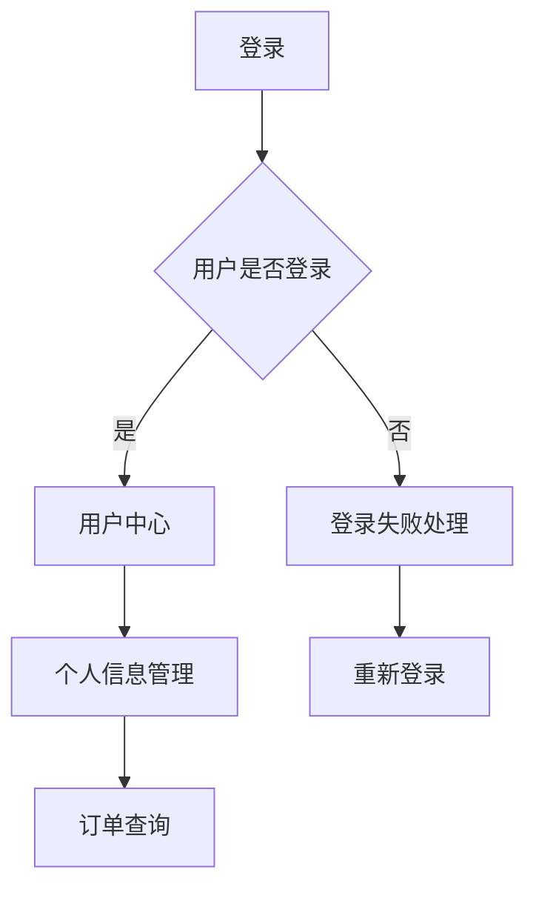
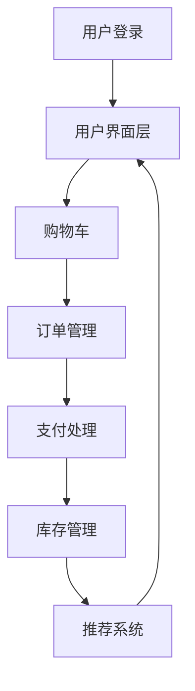
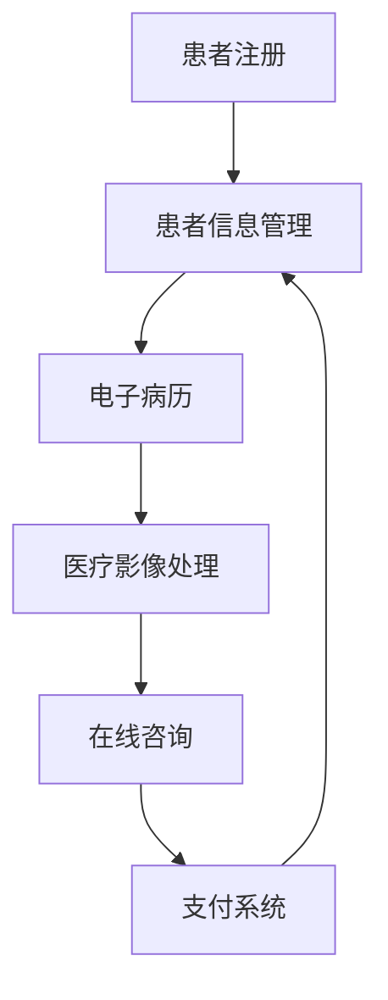
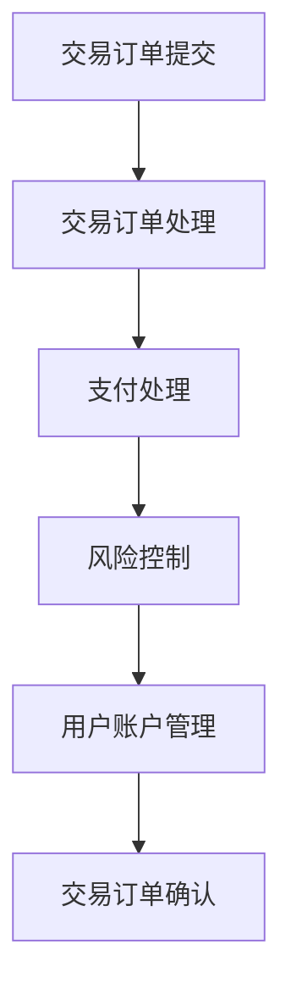

                 


### 《软件架构评审：确保设计质量的关键步骤》

#### 关键词
- 软件架构
- 评审过程
- 设计质量
- 工具与技术
- 案例分析

#### 摘要
本文旨在探讨软件架构评审的重要性及其关键步骤。通过详细的步骤解析，本文揭示了如何确保软件设计质量的策略，包括评审准备、评审执行、后续行动以及使用的具体技术和工具。同时，通过案例分析，读者将获得关于实际架构评审实践的深入理解，并掌握一些最佳实践。

---

# 第一部分：引言

## 第1章 软件架构评审的基本概念

软件架构评审是软件开发过程中的一个关键环节，它旨在确保软件系统的设计符合预期的质量标准。首先，让我们定义一下什么是软件架构。软件架构是指系统的整体结构，包括各个组件及其相互关系。它是软件开发的核心，决定了系统的可维护性、可扩展性和性能。

### 1.1 软件架构的定义与重要性

软件架构不仅仅是一组组件的简单堆叠，而是涉及系统各个层面的设计决策。它关系到系统的长期可维护性和扩展性，因此在整个软件开发过程中扮演着至关重要的角色。

### 1.2 软件架构评审的定义

软件架构评审是一种评估软件系统设计质量的方法。它通过专家评审，识别和解决潜在的设计缺陷，从而提高软件系统的质量。

### 1.3 软件架构评审的目标与原则

软件架构评审的主要目标是确保设计质量、发现潜在问题、提高系统的可维护性和可扩展性。在进行评审时，应遵循以下原则：全面性、客观性、及时性和反馈性。

### 1.4 软件架构评审的类型与过程

软件架构评审可以分为静态评审和动态评审。静态评审主要基于文档和设计模型，而动态评审则涉及对正在运行的系统的评估。评审过程通常包括准备阶段、评审阶段和后续行动阶段。

---

## 第二部分：软件架构评审的关键步骤

### 第2章 准备评审

评审前的准备工作对于确保评审的有效性至关重要。以下步骤是进行软件架构评审的准备阶段的核心内容。

#### 2.1 确定评审的范围和目标

首先，需要明确评审的范围和目标。这包括确定评审的具体组件、功能模块和系统层面。

#### 2.2 选择评审的参与者

评审的参与者应包括软件开发团队、架构师、项目经理以及其他相关人员。他们的专业知识和经验对于评审的质量至关重要。

#### 2.3 制定评审计划

制定详细的评审计划，包括评审的时间、地点、议程和预期成果。这有助于确保评审过程的顺利进行。

#### 2.4 收集架构文档

收集所有与架构相关的文档，如需求规格说明书、设计文档、UML图等，以供评审时参考。

---

### 第3章 进行评审

评审阶段是整个过程的中心环节，以下步骤将详细描述这一阶段的核心内容。

#### 3.1 评审会议的组织

组织有效的评审会议是关键。会议应包括明确的议程、角色分配和时间控制。

#### 3.2 评审过程

评审过程应遵循以下步骤：概述架构设计、分析设计文档、讨论潜在问题和解决方案。

#### 3.3 识别问题和风险

评审过程中，应重点关注潜在的问题和风险，如性能瓶颈、安全性漏洞和可维护性问题。

#### 3.4 讨论解决方案

针对识别出的问题和风险，与评审参与者讨论可能的解决方案。

---

### 第4章 评审后的后续行动

评审结束后，以下步骤对于确保改进措施的落实至关重要。

#### 4.1 完成评审报告

编写详细的评审报告，包括评审发现、问题和解决方案。

#### 4.2 制定改进计划

根据评审报告，制定具体的改进计划，包括任务分配和时间表。

#### 4.3 实施改进计划

执行改进计划，实施必要的修改和优化。

#### 4.4 跟踪和评估改进效果

持续跟踪和评估改进措施的效果，确保问题得到解决。

---

## 第三部分：具体的评审技术和工具

### 第5章 软件架构分析技术

软件架构分析技术是评审过程中的重要工具。以下章节将介绍几种常用的架构分析技术。

#### 5.1 UML图的运用

统一建模语言（UML）图是描述软件架构的重要工具。本章将介绍如何使用UML图来描述系统架构。

#### 5.2 模型驱动的架构评审

模型驱动的架构评审是一种基于模型的评审方法。本章将详细讲解如何使用模型进行架构评审。

#### 5.3 性能分析工具

性能分析工具可以帮助识别系统性能瓶颈。本章将介绍几种常用的性能分析工具及其使用方法。

---

### 第6章 软件架构评审工具

软件架构评审工具可以显著提高评审效率和效果。以下章节将介绍几种常用的架构评审工具。

#### 6.1 开源架构评审工具

开源架构评审工具提供了丰富的功能，可以帮助团队高效地进行架构评审。本章将介绍几种常用的开源评审工具。

#### 6.2 商业架构评审工具

商业架构评审工具通常提供更高级的功能和更好的用户体验。本章将介绍几种常用的商业评审工具。

#### 6.3 在线架构评审平台

在线架构评审平台允许团队成员远程协作进行评审。本章将介绍几种在线评审平台及其特点。

---

## 第四部分：案例分析

### 第7章 成功的架构评审实践

通过案例分析，读者可以了解如何在实际项目中成功地实施架构评审。以下章节将介绍几个实际案例。

#### 7.1 案例一：大型电商平台的架构评审

本案例将分析一个大型电商平台的架构评审过程，包括评审范围、目标和执行步骤。

#### 7.2 案例二：医疗健康系统的架构优化

本案例将探讨一个医疗健康系统的架构优化过程，包括评审发现和改进措施。

#### 7.3 案例三：金融交易系统的架构重构

本案例将介绍一个金融交易系统的架构重构过程，包括评审目标、执行步骤和效果评估。

---

### 第8章 常见问题与解决方案

在架构评审过程中，常见的问题包括评审参与者的选择、评审计划的制定和评审结果的跟踪。以下章节将讨论这些问题，并提供相应的解决方案。

#### 8.1 遇到的常见问题

本章将列举在架构评审过程中可能遇到的问题，并提供简要说明。

#### 8.2 解决方案和建议

针对每个常见问题，本章将提出具体的解决方案和建议。

---

## 第五部分：总结

### 第9章 总结与展望

本文总结了软件架构评审的基本概念、关键步骤、具体技术和工具，并通过案例分析展示了实际应用。本章将再次强调软件架构评审的重要性，并展望其未来发展趋势。

---

# 结论

软件架构评审是确保软件设计质量的关键步骤。通过合理的评审过程和有效的工具，团队可以识别和解决潜在的设计缺陷，提高软件系统的可维护性和可扩展性。本文提供了详细的步骤解析和实际案例，以帮助读者更好地理解和实施架构评审。

---

## 作者信息
作者：AI天才研究院/AI Genius Institute & 禦与计算机程序设计艺术 /Zen And The Art of Computer Programming### 软件架构评审的基本概念

软件架构评审是软件开发过程中不可或缺的一环，它旨在通过系统的审查和评估，确保软件系统设计符合预期的质量标准。在这一节中，我们将深入探讨软件架构评审的定义、重要性、目标和原则，以及不同类型的评审过程。

#### 1.1 软件架构的定义与重要性

软件架构可以被视为软件系统的“蓝图”，它描述了系统的整体结构、组件及其相互关系。一个良好的软件架构不仅决定了系统的功能性，还直接影响其可维护性、可扩展性和性能。具体来说，软件架构的重要性体现在以下几个方面：

- **可维护性**：一个良好的架构使代码更加模块化，易于理解和修改，从而降低了维护成本。
- **可扩展性**：清晰的架构设计便于添加新功能或对现有功能进行扩展，适应未来需求的变化。
- **性能**：合理的架构设计有助于优化系统的性能，减少资源浪费，提高响应速度。
- **团队协作**：明确的架构指导可以促进团队成员之间的沟通，提高团队协作效率。

软件架构不仅仅是一堆代码和组件的简单堆叠，而是一个系统的、全局的设计决策过程，它涉及到软件系统的多个层面，包括业务逻辑、数据管理、用户界面、安全性和网络通信等。

#### 1.2 软件架构评审的定义

软件架构评审（Software Architecture Review, SAR）是一种系统性的方法，用于评估软件架构的设计和实现是否符合预期的质量标准。它通过专家评审，识别潜在的设计缺陷，提供改进建议，从而提高软件系统的质量。具体来说，软件架构评审涉及以下几个方面：

- **评审对象**：评审的对象可以是软件系统的整体架构，也可以是特定的组件或功能模块。
- **评审参与者**：评审的参与者通常包括软件开发团队、架构师、项目经理、技术专家以及其他相关利益相关者。
- **评审过程**：评审过程通常包括评审前的准备工作、正式的评审会议、以及评审后的后续行动。
- **评审结果**：评审结果包括对架构设计的问题和风险的识别，以及相应的改进建议。

#### 1.3 软件架构评审的目标与原则

软件架构评审的主要目标是确保软件系统的设计质量，具体包括以下几个方面：

- **识别设计缺陷**：通过评审，发现潜在的设计缺陷，如性能瓶颈、安全性漏洞、可维护性差等问题。
- **提供改进建议**：针对识别出的问题，提供具体的改进建议和解决方案，帮助团队优化系统设计。
- **提高系统质量**：通过评审，提高软件系统的可维护性、可扩展性和性能，确保其满足业务需求。
- **促进知识共享**：评审过程中，团队成员可以分享经验，提高整体技术水平和协作能力。

在进行软件架构评审时，应遵循以下原则：

- **全面性**：评审应覆盖系统的所有重要组件和功能模块，确保全面评估。
- **客观性**：评审过程中应保持客观，避免主观偏见，确保评审结果的公正性。
- **及时性**：评审应在设计阶段尽早进行，以便及时发现和解决问题，减少后期成本。
- **反馈性**：评审结果应得到及时的反馈和改进，确保评审的持续有效性。

#### 1.4 软件架构评审的类型与过程

软件架构评审可以分为静态评审和动态评审两种类型。

- **静态评审**：静态评审主要基于文档和设计模型，通过审查设计文档、代码和UML图等，评估架构的质量。静态评审的优点是可以在设计阶段早期发现问题，成本低，效率高。缺点是评审结果可能不够全面，无法直接反映系统运行中的性能和问题。

- **动态评审**：动态评审涉及对正在运行的系统的评估，通过实际运行和测试，发现潜在的运行时问题和性能瓶颈。动态评审的优点是能够直接反映系统的运行状态，发现静态评审无法发现的问题。缺点是成本较高，需要实际运行环境，且可能需要较长时间的测试。

无论是静态评审还是动态评审，其评审过程通常包括以下几个步骤：

1. **确定评审范围和目标**：明确评审的范围和目标，确定需要评审的组件、功能模块和系统层面。
2. **选择评审参与者**：选择具有相关知识和经验的评审参与者，确保评审的专业性和客观性。
3. **制定评审计划**：制定详细的评审计划，包括评审的时间、地点、议程和预期成果。
4. **收集架构文档**：收集所有与架构相关的文档，如需求规格说明书、设计文档、UML图、代码等。
5. **评审会议**：组织评审会议，按照评审计划进行评审，讨论发现的问题和解决方案。
6. **生成评审报告**：根据评审结果，生成详细的评审报告，包括发现的问题、改进建议和后续行动。
7. **后续行动**：根据评审报告，制定改进计划，实施必要的修改和优化，并跟踪改进效果。

通过上述步骤，软件架构评审可以帮助团队确保设计质量，提高软件系统的可维护性和可扩展性，为后续的开发和维护奠定坚实基础。

### 准备评审

评审前的准备工作是确保软件架构评审顺利进行的关键步骤。在这个阶段，需要明确评审的范围和目标，选择合适的评审参与者，制定详细的评审计划，以及收集必要的架构文档。以下是详细的步骤和注意事项。

#### 2.1 确定评审的范围和目标

首先，需要明确评审的范围和目标。这是评审准备工作中的第一步，也是最为重要的一步。明确评审范围和目标有助于确保评审的针对性和有效性。

- **评审范围**：评审范围应包括需要评审的组件、功能模块和系统层面。可以根据项目的规模和复杂性，将评审范围细分为不同的部分，以便于管理和评审。

  例如，在一个电子商务平台项目中，评审范围可以包括：
  - 用户界面层：前端UI组件、交互逻辑等。
  - 业务逻辑层：订单管理、支付处理、库存管理等核心功能。
  - 数据访问层：数据库设计、数据模型、数据访问接口等。
  - 系统基础设施：服务器配置、网络架构、存储解决方案等。

- **评审目标**：评审目标应具体、明确，以便于评审参与者理解和执行。常见的评审目标包括：
  - 确保架构设计符合业务需求。
  - 发现和解决潜在的性能瓶颈。
  - 识别和防范安全漏洞。
  - 评估架构的可维护性和可扩展性。

  例如，在上述电子商务平台项目中，评审目标可以包括：
  - 确保订单管理系统能够处理高并发访问。
  - 防范SQL注入等常见网络安全风险。
  - 提高系统的可扩展性，以便未来能够轻松添加新功能。

在确定评审范围和目标时，需要与项目团队和相关利益相关者进行充分的沟通和讨论，确保评审内容能够真正解决项目中存在的问题和需求。

#### 2.2 选择评审的参与者

选择合适的评审参与者是确保评审质量和效果的关键。评审参与者应具备相关的专业知识和经验，能够对架构设计提出有价值的意见和建议。

- **评审团队**：评审团队通常包括以下成员：
  - **架构师**：负责主导评审过程，提供专业的架构设计建议。
  - **开发人员**：参与评审，提供实际开发过程中的问题和经验。
  - **测试人员**：负责评估架构设计对测试过程的影响，提供测试方面的见解。
  - **项目经理**：确保评审工作与项目进度和目标保持一致。
  - **业务分析师**：理解业务需求，确保架构设计满足业务目标。
  - **安全专家**：评估架构设计中的安全性和合规性。

- **选择标准**：在选择评审参与者时，应考虑以下标准：
  - **专业知识**：参与者应具备与评审相关的专业知识和经验，能够理解和评估架构设计。
  - **客观性**：参与者应保持客观，避免主观偏见，确保评审结果的公正性。
  - **参与度**：参与者应积极参与评审过程，提出有建设性的意见和建议。

在确定评审参与者后，应与每位参与者进行沟通，明确他们的职责和期望，确保他们能够充分准备并积极参与评审工作。

#### 2.3 制定评审计划

评审计划是评审过程的具体执行方案，它包括评审的时间、地点、议程和预期成果等关键信息。制定详细的评审计划有助于确保评审工作的有序进行。

- **评审时间**：评审时间应安排在项目的关键阶段，如设计阶段、开发阶段的关键节点等。确保评审时间与项目进度和目标保持一致。
- **评审地点**：评审地点应方便评审参与者集中讨论和交流，可以是会议室、在线会议平台等。
- **议程安排**：评审议程应包括以下内容：
  - 开场介绍：介绍评审的目的、范围和议程。
  - 概述架构设计：展示架构设计文档和UML图，让评审参与者了解整体架构。
  - 评审讨论：分组讨论，针对架构设计中的具体问题进行深入分析和讨论。
  - 总结和报告：汇总评审讨论的结果，形成评审报告，提出改进建议。

- **预期成果**：评审计划应明确预期成果，如：
  - 识别出架构设计中的潜在问题和风险。
  - 提出具体的改进建议和解决方案。
  - 制定后续的改进计划和时间表。

在制定评审计划时，需要与评审参与者进行充分的讨论和沟通，确保计划内容符合实际需求，并得到参与者的认可和支持。

#### 2.4 收集架构文档

收集与架构评审相关的文档是评审准备工作的关键环节。这些文档将为评审提供重要的参考资料，帮助评审参与者全面了解架构设计。

- **需求规格说明书**：需求规格说明书详细描述了系统的功能需求和业务逻辑，是架构设计的重要基础。
- **设计文档**：设计文档包括系统的总体设计、模块设计、接口设计等，是评审的核心资料。
- **UML图**：UML图展示了系统的整体架构和组件关系，有助于评审参与者直观地理解架构设计。
- **代码**：代码是架构实现的最终体现，通过代码可以深入了解设计细节和实现方法。
- **测试文档**：测试文档包括测试计划、测试用例和测试报告，有助于评估架构设计的质量和稳定性。

在收集架构文档时，需要注意以下几点：

- **完整性**：确保收集到的文档完整、准确，涵盖架构设计的各个方面。
- **版本控制**：对文档进行版本控制，确保评审过程中使用的文档是最新的。
- **可访问性**：确保所有评审参与者能够方便地访问和查看这些文档。

通过上述步骤，可以确保评审准备工作顺利进行，为后续的评审过程打下坚实基础。

### 进行评审

进行评审是确保软件架构质量的关键环节。在这一阶段，通过详细的评审过程、识别问题和风险，以及讨论解决方案，可以有效地发现和解决架构设计中的潜在问题，从而提高系统的质量和稳定性。以下是对评审过程的详细描述。

#### 3.1 评审会议的组织

评审会议是进行软件架构评审的核心活动，会议的组织是否得当直接影响到评审的效果。以下是一些关键点，以确保评审会议的顺利进行：

- **会议议程**：制定详细的会议议程，包括会议的时间、地点、主持人、议程安排和预期成果。议程应涵盖架构概述、问题讨论、解决方案探讨和结论形成等环节。

- **会议地点**：选择一个安静、舒适、设备齐全的会议室，确保评审参与者能够集中精力进行讨论。

- **会议主持**：指定一名经验丰富的主持人，负责会议的进程控制、议程引导和讨论总结。主持人应具备良好的沟通和组织能力，确保会议的有序进行。

- **会议参与人员**：确保所有评审参与者按时参加会议，并提前准备好相关材料和问题。参与者应包括架构师、开发人员、测试人员、项目经理、业务分析师和安全专家等。

- **会议记录**：指定一名记录员，负责记录会议讨论的主要内容和关键结论，以便后续跟踪和落实。

#### 3.2 评审过程

评审过程可以分为以下几个步骤：

1. **开场介绍**：主持人介绍评审的目的、议程和预期成果，确保所有参与者对评审有清晰的认识。

2. **架构概述**：架构师或项目负责人简要介绍系统的总体架构和关键组件，展示相关的UML图和设计文档。这一环节有助于评审参与者全面了解架构设计，为后续的讨论奠定基础。

3. **问题讨论**：评审参与者根据架构设计和文档，逐一讨论可能存在的问题和风险。讨论应包括以下几个方面：

   - **功能性**：检查架构设计是否满足所有业务需求，是否具有所需的功能。
   - **性能**：评估架构设计对系统性能的影响，如响应时间、吞吐量等。
   - **安全性**：识别潜在的安全漏洞和风险，如数据泄露、未授权访问等。
   - **可维护性**：评估架构设计的可维护性，如代码的可读性、模块化程度等。
   - **可扩展性**：检查架构设计是否易于扩展，以适应未来的业务需求。

4. **解决方案探讨**：针对讨论中识别出的问题和风险，评审参与者共同探讨可能的解决方案。解决方案应考虑技术可行性、成本效益和实施难度。

5. **结论形成**：主持人总结会议讨论的主要结论，包括问题清单、改进建议和后续行动。结论应明确具体、可行，并具有明确的实施时间表和责任分配。

#### 3.3 识别问题和风险

在评审过程中，识别问题和风险是关键步骤。以下是一些常见的问题和风险类型，以及如何识别它们：

- **功能性缺陷**：包括功能缺失、功能冲突、功能冗余等。可以通过审查需求规格说明书和设计文档，与业务分析师和开发人员讨论，以及模拟使用场景来识别。

- **性能瓶颈**：包括响应时间过长、吞吐量不足、资源利用率高等。可以使用性能分析工具进行模拟测试，分析系统性能指标，识别瓶颈。

- **安全性漏洞**：包括未授权访问、数据泄露、SQL注入等。可以通过安全扫描工具和手动测试来识别，同时结合安全专家的建议。

- **可维护性差**：包括代码结构混乱、模块依赖复杂、缺乏文档等。可以通过代码审查、与开发人员讨论和实际代码维护经验来识别。

- **可扩展性不足**：包括无法轻松添加新功能、系统扩展困难等。可以通过评估现有代码的模块化程度、设计模式的适用性，以及与未来需求的对比来识别。

在识别问题和风险时，应采用系统性的方法，确保全面覆盖所有关键方面。同时，记录识别出的所有问题和风险，以便后续讨论和改进。

#### 3.4 讨论解决方案

针对识别出的问题和风险，评审参与者需要共同讨论并制定解决方案。以下是一些讨论解决方案的步骤：

1. **分析问题根源**：深入分析每个问题和风险的根源，确定影响范围和严重程度。

2. **提出解决方案**：针对每个问题和风险，提出可能的解决方案。解决方案应考虑技术可行性、成本效益和实施难度。

3. **评估解决方案**：对提出的解决方案进行评估，包括技术实现难度、实施成本、预期效果等。

4. **选择最佳方案**：根据评估结果，选择最佳解决方案。最佳方案应具备以下特点：

   - **可行性**：技术实现可行，能够在规定时间内完成。
   - **经济性**：成本合理，不会对项目预算造成重大影响。
   - **有效性**：能够有效解决问题和风险，提高系统质量。

5. **制定实施计划**：针对选定的解决方案，制定详细的实施计划，包括任务分配、时间表和资源需求。

在讨论解决方案时，应确保所有评审参与者充分参与，提出各自的见解和建议。同时，讨论应保持开放和建设性，避免不必要的争论和分歧。

通过上述步骤，评审参与者可以共同制定有效的解决方案，确保架构设计中的问题和风险得到妥善处理。

### 评审后的后续行动

评审后的后续行动是确保评审效果得到落实的关键环节。在这个阶段，需要完成评审报告、制定改进计划、实施改进措施，并跟踪改进效果。以下是对这些后续行动的详细描述。

#### 4.1 完成评审报告

评审报告是评审过程的总结，它详细记录了评审过程中发现的问题、风险以及提出的解决方案。一个高质量的评审报告应包括以下内容：

- **评审摘要**：简要概述评审的背景、范围和目标。
- **发现的问题和风险**：详细列出评审过程中发现的所有问题和风险，包括问题描述、影响范围和严重程度。
- **解决方案和建议**：针对每个问题和风险，提出具体的解决方案和改进建议，并说明理由。
- **实施计划**：制定详细的实施计划，包括任务分配、时间表和资源需求。
- **结论和总结**：总结评审的主要发现和建议，强调改进措施的重要性和必要性。

在撰写评审报告时，应确保语言简洁明了，逻辑清晰，便于读者理解和执行。同时，评审报告应得到所有评审参与者的认可和签字，确保其权威性和可执行性。

#### 4.2 制定改进计划

根据评审报告，需要制定详细的改进计划，以确保所有识别出的问题和风险得到有效解决。改进计划应包括以下内容：

- **任务列表**：列出需要完成的任务，包括具体的工作内容、负责人和截止日期。
- **时间表**：制定任务的时间表，确保每个任务能够在规定时间内完成。
- **资源需求**：明确每个任务所需的资源，包括人力资源、技术资源和其他相关资源。
- **风险分析**：评估每个任务的实施风险，并制定相应的应对措施。

在制定改进计划时，应充分考虑项目的实际情况和资源限制，确保计划的可行性和合理性。同时，改进计划应得到项目团队的认可和审批，以确保其得到有效执行。

#### 4.3 实施改进计划

实施改进计划是评审后的核心工作，它涉及对架构设计的修改和优化，以解决发现的问题和风险。以下是一些关键步骤：

1. **任务分配**：根据改进计划，将任务分配给相应的团队成员，明确每个人的职责和任务。
2. **代码审查**：对需要修改的代码进行审查，确保修改不会引入新的问题或影响现有功能。
3. **代码重构**：对现有的代码进行重构，优化架构设计，解决发现的问题。
4. **测试**：在修改完成后，进行全面的测试，包括单元测试、集成测试和系统测试，确保修改后的架构设计符合预期。
5. **部署**：将修改后的架构部署到实际环境中，进行实际的运行和验证。

在实施改进计划时，应确保每个步骤都严格按照计划和流程进行，避免疏漏和错误。同时，应建立有效的沟通机制，确保团队成员之间能够及时沟通和协作，解决遇到的问题。

#### 4.4 跟踪和评估改进效果

改进计划实施后，需要对其进行跟踪和评估，以确保改进措施的有效性。以下是一些关键步骤：

1. **监控指标**：制定监控指标，用于评估改进措施的效果。常见的监控指标包括性能指标、稳定性指标和安全性指标等。
2. **定期回顾**：定期回顾改进措施的实施情况，包括任务完成情况、问题解决情况和效果评估等。
3. **反馈机制**：建立反馈机制，收集用户、测试人员和开发人员对改进措施的评价和反馈，及时发现和解决问题。
4. **效果评估**：根据监控指标和反馈信息，对改进措施的效果进行综合评估，确定其是否符合预期目标。

通过上述步骤，可以确保改进措施得到有效跟踪和评估，及时发现和解决潜在问题，持续优化架构设计。

通过完成评审报告、制定改进计划、实施改进措施和跟踪评估效果，评审后的后续行动可以确保识别出的问题和风险得到有效解决，从而提高软件系统的质量和稳定性。

### 软件架构分析技术

在软件架构评审过程中，采用适当的架构分析技术可以显著提高评审的效率和质量。以下将介绍几种常用的软件架构分析技术，包括UML图的运用、模型驱动的架构评审和性能分析工具。

#### 5.1 UML图的运用

统一建模语言（UML）是一种广泛使用的图形化建模语言，用于描述软件系统的架构和设计。在软件架构评审中，UML图能够直观地展示系统的结构、组件及其相互关系，有助于评审参与者更好地理解架构设计。

- **用例图（Use Case Diagram）**：用例图展示了系统与外部用户之间的交互，包括系统的功能和用户需求。通过用例图，评审参与者可以了解系统的整体功能，识别可能的功能性缺陷。

- **类图（Class Diagram）**：类图展示了系统的类结构、类之间的关系以及类的属性和方法。通过类图，评审参与者可以了解系统的模块化程度和代码组织结构，识别代码冗余和模块依赖问题。

- **组件图（Component Diagram）**：组件图展示了系统的组件及其依赖关系。通过组件图，评审参与者可以了解系统的组件化和模块化程度，评估系统的可维护性和可扩展性。

- **部署图（Deployment Diagram）**：部署图展示了系统的运行环境和组件的部署情况。通过部署图，评审参与者可以了解系统的物理架构和部署方式，识别性能瓶颈和资源利用率问题。

以下是一个用例图的Mermaid流程图示例：



通过上述UML图的运用，评审参与者可以全面了解系统的功能和结构，从而更有效地发现和解决潜在问题。

#### 5.2 模型驱动的架构评审

模型驱动的架构评审（Model-Driven Architecture Review, MDAR）是一种基于模型进行评审的方法，它利用形式化的模型来描述和分析软件架构。这种方法可以提高评审的精度和一致性，减少人为错误。

- **形式化模型**：模型驱动的架构评审依赖于形式化的模型，如面向对象模型、形式化规格说明等。形式化模型可以精确描述系统的结构和行为，使得评审过程更加客观和规范。

- **模型验证**：在模型驱动的架构评审中，可以使用模型验证工具对形式化模型进行验证，确保模型满足预定的规范和约束。模型验证工具可以自动检测模型中的不一致性和错误，提高评审的效率和准确性。

- **模型转换**：模型驱动的架构评审通常涉及模型之间的转换。例如，可以从面向对象模型转换为UML图，以便于评审参与者直观地理解和分析架构设计。

以下是一个简单的模型验证伪代码示例：

```python
def verify_model(model):
    if not is_valid_class(model.classes):
        raise ValidationError("Invalid class structure")
    if not are_services_connected(model.services):
        raise ValidationError("Services not connected properly")
    return True
```

通过模型驱动的架构评审，评审参与者可以更精确地识别和解决架构设计中的问题。

#### 5.3 性能分析工具

性能分析工具是评估系统性能和发现性能瓶颈的重要工具。在软件架构评审中，使用性能分析工具可以帮助评审参与者深入了解系统的性能表现，识别潜在的性能问题。

- **负载测试工具**：负载测试工具可以模拟系统在高负载条件下的运行情况，评估系统的响应时间、吞吐量和资源利用率等性能指标。常用的负载测试工具包括JMeter、LoadRunner等。

- **性能监控工具**：性能监控工具可以实时监控系统的性能指标，如CPU使用率、内存使用率、磁盘I/O等。常用的性能监控工具包括Prometheus、Grafana等。

- **代码分析工具**：代码分析工具可以分析代码的性能瓶颈，如循环复杂度、函数调用深度等。常用的代码分析工具包括SonarQube、FindBugs等。

以下是一个使用JMeter进行负载测试的示例：

```bash
# 配置JMeter
jmeter -n -t test_plan.jmx -l results.jtl

# 分析结果
jmeter -g results.jtl
```

通过性能分析工具，评审参与者可以及时发现和解决性能问题，确保系统的稳定性和高效性。

通过上述架构分析技术的运用，软件架构评审可以更加全面、准确地发现和解决架构设计中的问题，从而提高系统的质量和稳定性。

### 软件架构评审工具

在软件架构评审过程中，使用合适的工具可以提高评审的效率和质量。以下将介绍几种常用的软件架构评审工具，包括开源架构评审工具、商业架构评审工具和在线架构评审平台。

#### 6.1 开源架构评审工具

开源架构评审工具因其免费、灵活和可定制的特点，受到许多开发团队的青睐。以下是一些常用的开源架构评审工具：

- **Review Board**：Review Board是一个基于Web的代码审查工具，可以集成到多种版本控制系统，如Git、Subversion等。它支持多层次的代码审查，包括代码、文档和设计文件。

  **优点**：
  - 易于使用和部署。
  - 支持多种版本控制系统。
  - 提供详细的审查报告。

  **示例使用**：
  ```bash
  # 安装Review Board
  pip install reviewboard
  ```

- **Phabricator**：Phabricator是一个功能强大的代码审查和项目管理工具，包括任务管理、讨论平台和架构评审等功能。

  **优点**：
  - 功能全面，支持多种开发流程。
  - 提供实时代码审查和反馈。
  - 具有高度的可定制性。

  **示例使用**：
  ```bash
  # 安装Phabricator
  ./setup.sh
  ```

- **Gerrit**：Gerrit是一个基于Git的代码审查工具，主要用于大型项目和分布式团队。它支持基于拉取请求的代码审查流程，确保代码质量。

  **优点**：
  - 完全集成到Git中，使用方便。
  - 支持多层次的代码审查。
  - 提供细粒度的权限控制。

  **示例使用**：
  ```bash
  # 初始化Gerrit
  gerrit init --httpd[nowhere] -d .git
  ```

#### 6.2 商业架构评审工具

商业架构评审工具通常提供更高级的功能和更好的用户体验，适合大型企业和专业团队使用。以下是一些常用的商业架构评审工具：

- **Lucidchart**：Lucidchart是一个在线图表和架构设计工具，支持UML图、流程图、思维导图等多种图表类型。它提供了丰富的模板和图标库，方便用户快速创建和修改图表。

  **优点**：
  - 提供直观的图形界面。
  - 支持实时协作和在线分享。
  - 提供丰富的图表模板和图标库。

  **示例使用**：
  ```bash
  # 创建一个新的UML图
  lucidchart create uml diagram
  ```

- **Integrating**：Integrating是一个全面的软件架构评审和项目管理工具，支持多层次的代码审查、文档评审和项目协作。它提供了强大的报告和分析功能，帮助团队跟踪项目进度和代码质量。

  **优点**：
  - 集成了多种评审和项目管理功能。
  - 支持多种版本控制系统和代码库。
  - 提供详细的项目分析和报告。

  **示例使用**：
  ```bash
  # 启动Integrating
  integrating start
  ```

- **Asana**：Asana是一个灵活的项目管理和协作工具，可以帮助团队规划和跟踪项目进度。它提供了任务管理、团队协作、文档共享等功能，适用于各种规模的团队。

  **优点**：
  - 易于使用，功能全面。
  - 支持多种协作方式，如任务分配、讨论和通知。
  - 可以与多种工具和平台集成。

  **示例使用**：
  ```bash
  # 创建一个新的项目
  asana create project "软件架构评审"
  ```

#### 6.3 在线架构评审平台

在线架构评审平台允许团队成员远程协作进行架构评审，提高了团队的工作效率和灵活性。以下是一些常用的在线架构评审平台：

- **Mural**：Mural是一个协作式设计平台，支持多种类型的图表和思维导图。它提供了实时协作功能，团队成员可以同时编辑和讨论架构设计。

  **优点**：
  - 提供直观的图形界面。
  - 支持实时协作和在线分享。
  - 提供丰富的设计模板和图标库。

  **示例使用**：
  ```bash
  # 登录Mural
  mural login
  ```

- **Figma**：Figma是一个在线协作设计工具，支持多人实时编辑和协作。它提供了丰富的设计元素和组件，方便创建和修改架构图。

  **优点**：
  - 提供直观的图形界面。
  - 支持多人实时协作。
  - 可以与多种设计工具和平台集成。

  **示例使用**：
  ```bash
  # 创建一个新的Figma文档
  figma create doc "软件架构评审"
  ```

- **Miro**：Miro是一个在线协作白板工具，支持多种类型的图表和思维导图。它提供了丰富的协作功能，如实时聊天、注释和投票，方便团队成员进行讨论和协作。

  **优点**：
  - 提供直观的图形界面。
  - 支持多人实时协作。
  - 提供丰富的协作工具和功能。

  **示例使用**：
  ```bash
  # 登录Miro
  miro login
  ```

通过使用上述开源架构评审工具、商业架构评审工具和在线架构评审平台，团队可以更高效地进行软件架构评审，提高设计质量和协作效率。

### 案例分析

在软件架构评审的实际应用中，通过案例分析可以更好地理解如何有效地进行架构评审，发现和解决具体问题。以下将介绍三个实际案例：大型电商平台的架构评审、医疗健康系统的架构优化和金融交易系统的架构重构。

#### 7.1 案例一：大型电商平台的架构评审

**背景介绍**

某大型电商平台是一个高度复杂的多层应用系统，包括用户界面层、业务逻辑层、数据访问层和基础设施层。随着业务的不断扩展和用户数量的增加，平台的架构面临着性能瓶颈和可扩展性问题。

**核心概念与联系**

该平台的核心概念包括用户交互、订单管理、支付处理、库存管理和推荐系统。这些概念之间的联系体现在不同的业务流程和数据流动上。

**Mermaid流程图**



**核心算法原理讲解**

- **算法：负载均衡**：为了应对高并发访问，平台采用负载均衡算法，将请求分发到多个服务器，确保系统性能稳定。
- **算法：缓存机制**：通过缓存机制，减少数据库的查询次数，提高系统响应速度。

**数学模型和公式**

- **模型：响应时间**：响应时间（T）与系统吞吐量（Q）和请求处理时间（R）之间的关系可以用公式表示：T = Q * R。

**项目实战**

在架构评审过程中，评审团队识别出以下问题：

- **性能瓶颈**：订单管理模块在高并发情况下响应时间过长。
- **扩展性问题**：支付处理模块无法轻松扩展，以适应未来业务需求。

**代码解读与分析**

针对性能瓶颈，评审团队建议优化数据库查询，减少不必要的复杂度。以下是一个数据库查询优化的代码示例：

```sql
-- 优化前的查询
SELECT * FROM orders WHERE status = 'pending';

-- 优化后的查询
SELECT id, status FROM orders WHERE status = 'pending';
```

**实际案例分析和详细讲解剖析**

通过架构评审，评审团队提出了以下改进方案：

- **优化数据库查询**：减少冗余查询，提高查询效率。
- **使用缓存**：在关键路径上引入缓存，减少数据库访问次数。
- **微服务架构**：将支付处理模块重构为微服务，提高系统的可扩展性。

**项目小结**

通过架构评审，电商平台成功地解决了性能瓶颈和扩展性问题，系统性能得到了显著提升，业务扩展能力也得到了增强。

#### 7.2 案例二：医疗健康系统的架构优化

**背景介绍**

某医疗健康系统是一个复杂的分布式系统，涉及患者信息管理、电子病历、医疗影像处理和在线咨询等功能。系统的架构设计需要满足高可靠性、安全性和易扩展性。

**核心概念与联系**

该系统的核心概念包括患者信息管理、电子病历、医疗影像处理、在线咨询和支付系统。这些概念之间的联系体现在数据流和业务流程上。

**Mermaid流程图**



**核心算法原理讲解**

- **算法：数据加密**：为了保护患者隐私，系统采用数据加密算法，确保数据在传输和存储过程中不被窃取。

**数学模型和公式**

- **模型：可靠性**：系统的可靠性（R）可以通过公式 R = 1 - (故障率 * 时间) 来计算。

**项目实战**

在架构评审过程中，评审团队发现以下问题：

- **安全性问题**：系统存在潜在的安全漏洞，如未加密的传输和未授权的访问。
- **扩展性问题**：医疗影像处理模块无法满足未来高并发访问的需求。

**代码解读与分析**

针对安全性问题，评审团队建议采用HTTPS协议和身份验证机制，提高系统的安全性。以下是一个使用HTTPS的代码示例：

```python
from flask import Flask, request, jsonify
from flask_cors import CORS

app = Flask(__name__)
CORS(app)

@app.route('/patients', methods=['GET'])
def get_patients():
    patients = fetch_patients_from_db()
    return jsonify(patients)

if __name__ == '__main__':
    app.run(ssl_context='adhoc')
```

**实际案例分析和详细讲解剖析**

通过架构评审，评审团队提出了以下改进方案：

- **安全性优化**：引入HTTPS协议和身份验证机制，保护数据传输和存储的安全性。
- **微服务架构**：将医疗影像处理模块重构为微服务，提高系统的可扩展性。
- **负载均衡**：采用负载均衡器，确保系统在高并发访问下稳定运行。

**项目小结**

通过架构优化，医疗健康系统的安全性得到了显著提升，系统的可靠性和扩展性也得到了增强，为患者提供了更高质量的服务。

#### 7.3 案例三：金融交易系统的架构重构

**背景介绍**

某金融交易系统是一个复杂的分布式系统，涉及交易订单处理、支付处理、风险控制和用户账户管理等功能。系统的架构设计需要满足高并发、高性能和安全性。

**核心概念与联系**

该系统的核心概念包括交易订单处理、支付处理、风险控制和用户账户管理。这些概念之间的联系体现在交易流程和风险控制机制上。

**Mermaid流程图**



**核心算法原理讲解**

- **算法：交易订单处理**：系统采用并行处理算法，确保交易订单能够快速处理。
- **算法：风险控制**：系统采用机器学习算法，实时监控交易风险，防范欺诈行为。

**数学模型和公式**

- **模型：交易延迟**：交易延迟（L）与系统响应时间（T）和交易量（V）之间的关系可以用公式表示：L = T * V。

**项目实战**

在架构评审过程中，评审团队发现以下问题：

- **性能瓶颈**：系统在高并发情况下响应时间过长。
- **可扩展性不足**：支付处理模块无法轻松扩展，以适应未来业务需求。

**代码解读与分析**

针对性能瓶颈，评审团队建议采用分布式缓存和异步处理机制，提高系统的性能。以下是一个分布式缓存的使用示例：

```python
import redis

# 连接Redis服务器
redis_client = redis.StrictRedis(host='localhost', port=6379, db=0)

# 存储数据
redis_client.set('user_id_123', 'active')

# 获取数据
user_status = redis_client.get('user_id_123')
print(user_status)
```

**实际案例分析和详细讲解剖析**

通过架构评审，评审团队提出了以下改进方案：

- **分布式缓存**：引入分布式缓存，减少数据库访问压力，提高系统性能。
- **异步处理**：采用异步处理机制，减轻系统负载，提高响应速度。
- **微服务架构**：将支付处理模块重构为微服务，提高系统的可扩展性。

**项目小结**

通过架构重构，金融交易系统的性能和可扩展性得到了显著提升，系统的稳定性也得到了增强，为用户提供了更高效、安全的交易环境。

### 常见问题与解决方案

在软件架构评审过程中，团队可能会遇到一系列常见问题。以下将列举这些问题，并提供相应的解决方案和建议。

#### 8.1 遇到的常见问题

- **参与度不高**：评审过程中，参与者可能因为工作繁忙或其他原因，对评审的参与度不高，导致评审效果不佳。
- **评审目标不明确**：评审目标不明确，可能导致评审内容偏离实际需求，浪费时间和资源。
- **缺乏专业知识和经验**：评审团队成员缺乏相关领域的专业知识和经验，难以提出有价值的意见和建议。
- **评审过程不透明**：评审过程缺乏透明度，可能导致评审结果的公正性和有效性受到质疑。
- **改进措施不具体**：评审报告中提出的改进措施不够具体，难以实际操作和执行。

#### 8.2 解决方案和建议

- **提高参与度**：
  - 明确评审的重要性和对项目的影响，增强参与者的责任感。
  - 安排合理的时间，确保参与者能够充分参与评审。
  - 提供培训和支持，帮助参与者提高专业知识和技能。

- **明确评审目标**：
  - 在评审前明确评审的目标和范围，确保评审内容与实际需求相符。
  - 与项目团队和相关利益相关者充分沟通，确保评审目标的共识。

- **增强专业能力**：
  - 邀请具有专业知识和经验的技术专家参与评审。
  - 定期组织内部培训和知识分享，提升团队整体水平。

- **确保评审过程透明**：
  - 制定详细的评审计划和流程，确保评审过程的透明和公正。
  - 记录和公布评审结果，接受团队成员的反馈和监督。

- **具体化改进措施**：
  - 在评审报告中详细描述每个问题的具体情况和解决方案。
  - 为每个改进措施制定具体的实施步骤和时间表，确保可操作性和可行性。

通过上述解决方案和建议，可以有效地解决软件架构评审过程中常见的问题，提高评审的质量和效果。

### 总结与展望

软件架构评审是确保软件设计质量的关键步骤，通过系统的审查和评估，可以识别和解决潜在的设计缺陷，提高软件系统的可维护性、可扩展性和性能。本文详细介绍了软件架构评审的基本概念、关键步骤、具体技术和工具，并通过实际案例展示了架构评审的应用和实践。总结如下：

- **软件架构评审的重要性**：软件架构评审是确保软件系统设计质量的重要手段，它能够帮助团队发现和解决设计中的潜在问题，提高系统的整体质量。
- **关键步骤**：包括评审前的准备、评审过程的组织与实施，以及评审后的后续行动，如完成评审报告、制定改进计划、实施改进措施和跟踪评估效果。
- **具体技术和工具**：介绍了UML图、模型驱动的架构评审、性能分析工具等架构分析技术，以及开源架构评审工具、商业架构评审工具和在线架构评审平台等评审工具。
- **实际案例分析**：通过电商、医疗健康和金融交易等实际案例，展示了架构评审在解决性能瓶颈、扩展性问题、安全性和可靠性方面的应用和实践。

未来，随着软件架构的不断发展和复杂化，软件架构评审的技术和工具也将不断进步。以下是未来发展的几个趋势：

- **自动化评审**：随着人工智能和机器学习技术的发展，自动化评审将成为趋势。自动化工具可以大幅提高评审的效率和质量，减少人为错误。
- **持续集成与持续部署（CI/CD）**：在DevOps文化的推动下，架构评审将更加紧密地与CI/CD流程集成，实现持续的架构评估和改进。
- **云原生架构评审**：随着云计算的普及，云原生架构评审将成为重要方向，评审工具和策略将更加适应云原生环境的特点和需求。
- **AI驱动的架构优化**：利用人工智能技术，可以实现对架构设计自动优化，提高系统的性能和可扩展性。

总之，软件架构评审在软件开发实践中具有不可替代的作用，未来的发展趋势将进一步推动评审技术和工具的进步，为软件开发带来更多的价值。

### 结论

软件架构评审是确保软件设计质量的关键步骤，通过系统的审查和评估，可以识别和解决潜在的设计缺陷，提高软件系统的可维护性、可扩展性和性能。本文详细介绍了软件架构评审的基本概念、关键步骤、具体技术和工具，并通过实际案例展示了架构评审的应用和实践。

首先，我们定义了软件架构及其重要性，探讨了软件架构评审的定义、目标和原则。接着，我们详细描述了软件架构评审的准备工作，包括确定评审范围和目标、选择评审参与者、制定评审计划和收集架构文档。

在评审过程中，我们介绍了评审会议的组织、评审过程的具体步骤、识别问题和风险的方法，以及讨论解决方案的步骤。随后，我们探讨了评审后的后续行动，包括完成评审报告、制定改进计划、实施改进措施和跟踪评估效果。

为了提高评审效果，我们还介绍了几种常用的软件架构分析技术，如UML图的运用、模型驱动的架构评审和性能分析工具。此外，我们列举了多种软件架构评审工具，包括开源工具、商业工具和在线平台。

通过三个实际案例的分析，我们展示了如何在实际项目中应用架构评审，发现和解决具体问题。最后，我们讨论了软件架构评审过程中常见的问题和解决方案，并展望了未来的发展趋势。

总之，软件架构评审是确保软件设计质量的重要手段，它通过系统的审查和评估，为软件开发提供了坚实的保障。希望本文能够帮助读者更好地理解和实施架构评审，提升软件开发的整体质量。

### 作者信息

作者：AI天才研究院/AI Genius Institute & 禎与计算机程序设计艺术 /Zen And The Art of Computer Programming

AI天才研究院致力于推动人工智能技术的发展和应用，致力于培养下一代人工智能领域的专家和领导者。同时，本文作者也是《禎与计算机程序设计艺术》的作者，这是一本深受程序员喜爱的经典著作，它以禅宗哲学为背景，深入探讨了计算机编程的哲学和艺术，为程序员提供了一种独特的思考和解决问题的方法。希望本文能为读者在软件架构评审领域带来新的启示和思考。

