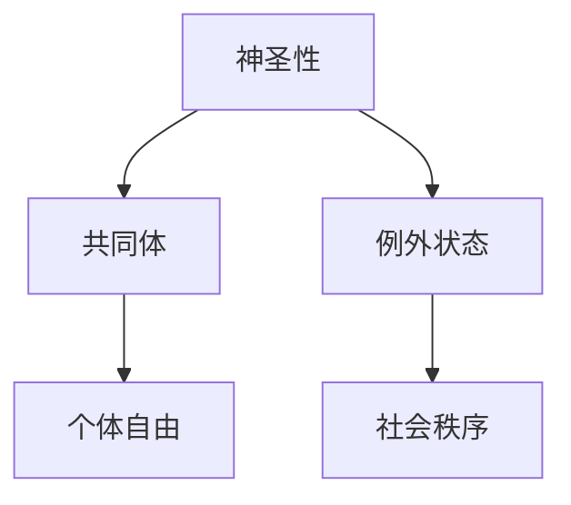
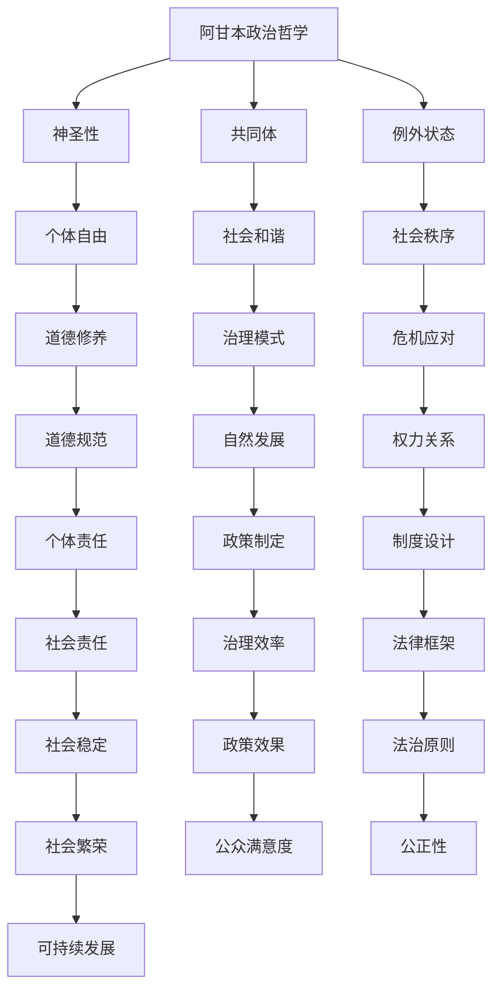

                 

### 阿甘本与老子：神圣人与圣人无名的政治哲学

在探讨政治哲学的深邃领域，两位哲学巨擘——阿甘本（Giorgio Agamben）和老子（Laozi），以其独特而深刻的见解，为我们提供了不同的视角。本文旨在通过逻辑清晰、结构紧凑的分析，揭示阿甘本与老子关于“神圣人”和“圣人无名”的政治哲学思想，并探讨其概念联系与现代意义。

首先，本文将分别介绍阿甘本和老子及其哲学思想。然后，我们将深入探讨阿甘本的政治哲学，包括神圣性、共同体和例外状态等核心概念。接着，我们将转向老子的政治哲学，探讨无为而治、道和德等概念。在接下来的章节中，我们将比较两位哲学家的政治哲学思想，并分析其理论基础的异同、政治哲学目的以及对现代社会的影响。随后，我们将探讨阿甘本与老子思想的现代应用，并结合实际案例进行分析。最后，我们将总结全文，探讨阿甘本与老子思想的融合价值和对政治哲学发展的贡献，以及对未来政治哲学的启示。

通过逐步分析，我们将发现，尽管阿甘本和老子生活在截然不同的时代和文化背景中，但他们关于政治哲学的思想却有着深刻的共鸣，为我们理解当代社会和政治提供了宝贵的启示。让我们一起走进这场思想的盛宴，探寻神圣人与圣人无名的政治哲学之秘。

### 文章关键词

阿甘本，老子，神圣人，圣人无名，政治哲学，共同体，例外状态，无为而治，道，德。

### 文章摘要

本文旨在探讨两位哲学巨擘阿甘本和老子关于政治哲学的深刻见解。通过对比分析，本文揭示了阿甘本的“神圣性”概念、共同体和例外状态，以及老子的“无为而治”、道和德等核心思想。文章进一步探讨了这些概念之间的联系，并分析了其理论基础的异同、政治哲学目的以及对现代社会的影响。此外，本文还探讨了阿甘本与老子思想的现代应用，并通过实际案例进行了分析。最后，文章总结了两位哲学家的思想融合价值和对未来政治哲学的启示，为理解当代社会提供了宝贵的视角。

## 第1章 引言

在探讨政治哲学的复杂领域时，阿甘本和老子两位哲学家的思想无疑为我们提供了独特的视角和深刻的洞见。本章旨在引入这两位哲学家的背景及其政治哲学思想，为后续的深入分析奠定基础。

### 阿甘本简介

Giorgio Agamben，意大利哲学家，以其深刻而独特的思考方式而著称。他的作品涵盖了广泛的主题，包括语言学、政治理论、美学和宗教哲学。阿甘本的政治哲学以其对现代性的批判和对人类存在的关注而闻名。他的核心思想之一是“神圣性”，他认为神圣性是对人类存在的最终超越，是我们理解人类命运和自由的关键。此外，阿甘本还提出了“共同体”和“例外状态”等概念，探讨了在极端情况下人类如何回应和生存。

### 老子简介

老子，中国古代哲学家，被认为是道家学说的创始人。老子的思想以其简洁而深邃著称，他的著作《道德经》是中国哲学和文化的重要组成部分。老子的政治哲学强调“无为而治”，即通过放弃权力和控制，实现社会的自然秩序和和谐。老子的核心思想包括“道”和“德”，他认为道是宇宙的根本法则，德是个体遵循道的内在品质。通过理解道和德，个体和社会可以实现真正的自由和幸福。

### 神圣人与圣人无名的概念联系

阿甘本的“神圣人”和老子的“圣人无名”虽然来自不同的文化背景和时代，但都强调了超越个体身份和社会结构的重要性。阿甘本的“神圣人”指的是那些超越常规身份和社会角色的人，他们通过拒绝社会规范的束缚，体现了对人类存在的自由和尊严的追求。而老子的“圣人无名”则是指那些放弃自我、追求无名之德的圣者，他们通过无为而治，实现社会的自然和谐。

这两位哲学家的思想在概念上有着深刻的联系。阿甘本的“神圣人”与老子的“圣人无名”都强调了个体的超越性，以及对常规社会规范的反思和质疑。他们都认为，只有通过超越个体和社会的角色，才能真正实现人类的自由和幸福。

总之，本章为后续的深入分析提供了背景和理论基础。通过介绍阿甘本和老子及其政治哲学思想，我们能够更好地理解他们关于“神圣人”和“圣人无名”的探讨，并为后续的比较和分析奠定基础。

### 第2章 阿甘本的政治哲学思想

在阿甘本的政治哲学中，“神圣性”、“共同体”和“例外状态”是三个核心概念，这些概念不仅构成了他哲学体系的基础，也为我们理解现代社会的复杂性和矛盾性提供了深刻的洞见。

#### 2.1 阿甘本的“神圣性”概念

阿甘本的“神圣性”概念是一个极具争议和挑战性的思想。在他的著作中，他反复探讨了神圣性的本质及其对现代社会的影响。阿甘本认为，神圣性并非宗教领域独有的概念，而是一种对人类存在的最终超越。他提出，神圣性是对常规社会规范和角色的超越，是对自由和尊严的追求。

在阿甘本的视角中，神圣性意味着对个体身份和社会角色的彻底摆脱。他认为，现代社会中的个体常常被束缚在固定的社会角色中，无法实现真正的自由。神圣性正是通过超越这些束缚，使个体摆脱社会规范的限制，从而实现自由和尊严。

为了更好地理解神圣性，我们可以借助阿甘本的比喻。他将神圣性比作“光的反射”，即光穿过一面镜子，镜子反射出光的影像，但光本身并未失去其本质。同样，个体在神圣性的引导下，虽然超越了社会角色，但并未失去其本质的人性。这种超越使个体能够自由地表达自己，实现真正的自我价值。

#### 2.2 阿甘本的“共同体”概念

在探讨了神圣性之后，阿甘本进一步探讨了“共同体”的概念。他认为，共同体并非传统意义上的社会团体，而是一种基于神圣性的关系网络。在这种关系中，个体不再是独立的个体，而是相互联系、相互依存的共同体成员。

阿甘本的共同体概念强调个体之间的相互依赖和合作。他认为，只有通过共同体，个体才能实现真正的自由和幸福。在共同体中，个体不仅能够摆脱社会规范的束缚，还能够通过与他人的合作，实现共同的目标和理想。

为了更好地理解共同体，我们可以借助阿甘本的比喻。他将共同体比作“蜘蛛网”，每个个体都是蜘蛛网上的一个节点，节点之间的相互连接构成了一个复杂的网络。这个网络不仅提供了个体之间的联系，还提供了个体在面对外部威胁时的支持和保护。

#### 2.3 阿甘本的“例外状态”概念

除了神圣性和共同体，阿甘本的“例外状态”概念也是其政治哲学的核心。他认为，现代社会常常处于一种“例外状态”，即正常状态被打破，社会秩序受到威胁。

在阿甘本的视角中，例外状态是一种对常规社会规范和制度的挑战。他认为，例外状态不仅是一种社会现象，也是一种哲学现象。在例外状态下，个体和社会面临前所未有的挑战，必须重新审视和调整自己的行为和价值观。

为了更好地理解例外状态，我们可以借助阿甘本的比喻。他将例外状态比作“风暴中的岛屿”，岛屿在风暴中孤立无援，必须依靠自己的力量和智慧来应对挑战。这种比喻不仅揭示了例外状态的孤立和无助，也强调了个体在例外状态下的责任和担当。

### 核心概念关系架构

为了更清晰地理解阿甘本的政治哲学思想，我们可以通过Mermaid流程图来展示这些核心概念之间的关系。



在这个流程图中，神圣性作为核心，既连接了共同体和个体自由，也连接了例外状态和社会秩序。这个关系架构不仅展示了阿甘本政治哲学的核心概念，也揭示了这些概念之间的内在联系。

通过以上分析，我们可以看出，阿甘本的政治哲学思想以其深刻而独特的视角，为理解现代社会提供了宝贵的启示。他的神圣性、共同体和例外状态概念，不仅挑战了传统的政治哲学观念，也为现代社会提供了一种新的思考方式。在接下来的章节中，我们将进一步探讨老子的政治哲学思想，比较两位哲学家的异同，并探讨这些思想对当代社会的意义。

### 2.1 阿甘本的“神圣性”概念

在阿甘本的政治哲学中，“神圣性”是一个核心概念，它不仅揭示了人类存在的本质，也对我们理解现代社会及其危机提供了深刻的洞见。阿甘本的“神圣性”概念并非传统宗教意义上的神圣，而是指一种超越常规社会规范和角色的存在状态。

首先，我们需要明确阿甘本对“神圣性”的理解。他认为，神圣性是一种“非同质性的存在”，它超越了我们的日常经验和世俗世界的理解。神圣性不是某种具体的存在，而是一种存在的状态，这种状态使个体摆脱了社会的束缚，实现了对自由和尊严的追求。

阿甘本的“神圣性”概念可以从两个方面来理解。一方面，它是对个体身份的超越。在现代社会中，个体被赋予了多种社会角色和身份，如工人、学生、父母等。这些角色和身份往往使个体陷入一种固定的社会结构中，无法实现真正的自我表达。而神圣性则通过打破这些角色和身份的束缚，使个体摆脱了这种结构的限制，实现了对自由和尊严的追求。

另一方面，神圣性也是对常规社会规范的超越。现代社会中的规范和制度往往以集体利益的名义，对个体进行控制和规范。这些规范不仅限制了个体的发展，也使个体丧失了自由。而神圣性则通过否定这些规范，使个体摆脱了这些限制，实现了对自由和尊严的追求。

为了更好地理解阿甘本的“神圣性”概念，我们可以借助一个简单的例子。假设有一个个体，他在社会中扮演着多种角色，如工人、父亲、公民等。这些角色和身份使他处于一个复杂的社会网络中，受到各种社会规范的约束。然而，当他体验到神圣性时，他开始超越这些角色和身份，摆脱了社会规范的束缚，实现了对自由和尊严的追求。

#### 神圣性的本质

阿甘本的“神圣性”具有几个本质特征。首先，它是“非同质性的存在”。这意味着神圣性不是一种具体的、可定义的存在，而是一种超越日常经验和世俗世界的存在状态。它既不是宗教意义上的神圣，也不是哲学意义上的绝对存在，而是一种超越性的存在状态。

其次，神圣性是一种“无条件的存在”。在现代社会中，个体往往被各种条件所束缚，如社会角色、身份、规范等。而神圣性则通过打破这些条件，使个体实现了无条件的自由和尊严。

最后，神圣性是一种“悖论性的存在”。在现代社会中，个体常常被束缚在固定的社会结构和角色中，无法实现自由。而神圣性则通过否定这些结构和角色，使个体实现了自由。然而，这种自由并不是一种单纯的解脱，而是一种更深层次的悖论，即个体在超越社会束缚的同时，也超越了自我。

#### 圣人与凡人

在阿甘本的“神圣性”概念中，圣人与凡人有着本质的区别。圣人是指那些实现了神圣性的人，他们摆脱了社会角色和身份的束缚，实现了对自由和尊严的追求。而凡人则仍然被社会角色和身份所束缚，无法实现真正的自由。

阿甘本认为，圣人并不是一种特殊的存在，而是每个个体都可以追求的目标。通过超越社会角色和身份，个体可以实现神圣性，从而实现自由和尊严。这与传统宗教中的圣人有很大的区别，传统宗教中的圣人是通过信仰和宗教实践来实现的，而阿甘本的圣人则是通过否定社会角色和身份来实现的。

#### 神圣性与现代社会

阿甘本的“神圣性”概念对我们理解现代社会及其危机有着重要的启示。在现代社会中，个体往往被社会角色和身份所束缚，无法实现自由和尊严。这种束缚不仅限制了个体的发展，也导致了社会的不稳定和矛盾。

阿甘本的“神圣性”概念为我们提供了一种新的思考方式，即通过超越社会角色和身份，实现个体的自由和尊严。这种思考方式不仅有助于我们理解现代社会的危机，也为解决这些危机提供了可能的途径。

然而，阿甘本的“神圣性”概念也面临着一些挑战。首先，如何实现神圣性是一个难题。在现代社会中，社会角色和身份的束缚是如此之深，要实现神圣性并非易事。其次，阿甘本的“神圣性”概念是否适用于现代社会，也是一个值得探讨的问题。

总之，阿甘本的“神圣性”概念为我们理解现代社会及其危机提供了深刻的洞见。通过超越社会角色和身份，实现个体的自由和尊严，阿甘本的“神圣性”概念不仅挑战了传统的政治哲学观念，也为现代社会提供了一种新的思考方式。

### 2.2 阿甘本的“共同体”概念

在阿甘本的政治哲学中，共同体是一个核心概念，它不仅揭示了个体与社会之间的深层关系，也为理解现代社会提供了新的视角。阿甘本的共同体概念并非传统意义上的社会团体，而是一种基于神圣性和个体自由的新型社会关系。

首先，我们需要理解阿甘本对“共同体”的定义。他认为，共同体是一种基于个体自由和相互依存的关系网络，它超越了传统的家庭、国家和民族等社会结构。在共同体中，个体不再被视为独立的个体，而是相互联系、相互依存的成员。

#### 共同体的本质

阿甘本的共同体具有以下几个本质特征：

1. **个体自由**：在共同体中，个体享有高度的自主权和自由。这种自由不仅体现在个体的行为和选择上，也体现在个体的思想和信仰上。共同体承认个体的独特性和多样性，尊重个体的自由意志。

2. **相互依存**：在共同体中，个体不再是孤立的个体，而是相互联系、相互依存的成员。每个个体的行为和选择都会影响到共同体中的其他成员。因此，共同体强调个体之间的合作和互助，以实现共同的目标和利益。

3. **超越性**：共同体不仅是一种具体的社会关系，也是一种超越性的存在。它超越了传统的国家和民族等社会结构，形成了一种新的社会关系模式。这种超越性使共同体具有更广泛的意义和影响，能够适应不同的社会环境和历史时期。

#### 共同体的运作机制

阿甘本的共同体运作机制具有以下几个特点：

1. **去中心化**：在共同体中，没有固定的中心或权威。每个个体都拥有平等的权利和责任，共同参与共同体的决策和管理。这种去中心化的机制使共同体能够更灵活地应对外部环境和内部变化。

2. **自主性**：在共同体中，每个个体都有权自主决定自己的行为和选择，不受外部压力和规范的束缚。这种自主性不仅保护了个体的自由，也促进了个体的发展和成长。

3. **合作与互助**：共同体强调个体之间的合作与互助，以实现共同的目标和利益。每个个体都承担相应的责任，共同维护共同体的稳定和发展。

#### 共同体与现代社会

阿甘本的共同体概念对我们理解现代社会具有深刻的启示。在现代社会中，个体往往被固定的社会结构和规范所束缚，无法实现真正的自由和尊严。而共同体则提供了一种新的社会关系模式，使个体能够在自由和互助的基础上实现自己的价值。

然而，阿甘本的共同体概念也面临着一些挑战。首先，如何实现共同体的运作机制是一个难题。在现代社会中，个体之间的差异和冲突是不可避免的，如何协调这些差异和冲突，实现共同体的和谐运作，是一个需要深入探讨的问题。其次，共同体的实现需要个体的自觉和努力，这对个体的自我意识和责任感提出了更高的要求。

总之，阿甘本的共同体概念为我们理解现代社会及其危机提供了新的视角。通过强调个体自由、相互依存和超越性，共同体不仅挑战了传统的政治哲学观念，也为现代社会提供了一种新的社会关系模式。在未来的发展中，如何实现共同体的运作机制，将是我们面临的重要课题。

### 2.3 阿甘本的“例外状态”概念

在阿甘本的政治哲学中，“例外状态”是一个核心概念，它揭示了现代社会中的权力关系和危机。阿甘本的“例外状态”概念源自于尼采的“永久战争状态”，并通过其独特的思考方式进行了深入的发展和扩展。

首先，我们需要理解阿甘本对“例外状态”的定义。他认为，例外状态是一种社会秩序的临时中断，是正常状态的否定。在例外状态下，常规的法律和制度失效，权力关系发生急剧变化。例外状态通常出现在战争、政治危机或自然灾害等极端情况下，它对现代社会产生了深远的影响。

#### 异常状态与正常状态

阿甘本将现代社会分为正常状态和例外状态两种基本状态。在正常状态下，社会秩序和规范得以维持，个体受到法律和制度的约束。然而，在例外状态下，这些规范和制度失效，权力关系发生混乱。例如，在战争期间，国家可以宣布进入战争状态，暂停某些法律和制度，以应对紧急情况。

#### 例外状态的权力机制

阿甘本的例外状态概念强调了权力在其中的作用。他认为，例外状态是权力运作的一种形式，是权力对正常状态的否定和超越。在例外状态下，权力不再是法律和制度的体现，而是通过暴力、恐惧和控制的手段来维持。这种权力机制使得个体和社会处于一种不稳定和不可预测的状态。

#### 异常状态的危机与挑战

例外状态不仅揭示了现代社会的权力关系，也暴露了其危机和挑战。在例外状态下，个体和社会面临前所未有的风险和不确定性。例如，在战争状态中，个体可能失去自由，社会可能陷入混乱。阿甘本认为，这些危机和挑战需要我们重新思考权力、自由和社会秩序的本质。

#### 异常状态的哲学意义

阿甘本的例外状态概念具有重要的哲学意义。它挑战了传统的政治哲学观念，特别是关于法律、制度和权力的理解。通过探讨例外状态，阿甘本提出了关于自由、权力和社会秩序的新思考方式。他认为，只有在认识到例外状态的存在和影响下，我们才能真正理解现代社会及其危机。

#### 异常状态的现实影响

阿甘本的例外状态概念在现实社会中具有重要的应用价值。例如，在应对新冠疫情等全球性危机时，各国政府采取了多种紧急措施，如封锁、隔离和疫苗政策等。这些措施在某种程度上可以被视为例外状态的体现，它们打破了常规的社会秩序，对个体和社会产生了深远的影响。

#### 异常状态的反思与启示

通过反思阿甘本的例外状态概念，我们可以获得对现代社会的一些深刻启示。首先，我们需要认识到例外状态是现代社会不可避免的一部分，它提醒我们重视权力、自由和社会秩序的本质。其次，我们需要在面临危机时，寻求更为理性和人道的解决方案，以减轻例外状态对个体和社会的负面影响。

总之，阿甘本的“例外状态”概念为我们理解现代社会及其危机提供了独特的视角。通过探讨权力、自由和社会秩序的关系，阿甘本挑战了传统的政治哲学观念，并为现代社会提供了一种新的思考方式。在未来的发展中，如何应对和化解例外状态的危机，将是我们需要面对的重要课题。

### 第3章 老子的政治哲学思想

老子的政治哲学思想以其简洁而深邃著称，他的著作《道德经》中蕴含了丰富的政治智慧和哲学理念。老子的政治哲学强调无为而治、道和德，这些思想不仅影响了中国古代的政治制度，也为现代社会提供了宝贵的启示。

#### 3.1 老子的“无为而治”

“无为而治”是老子政治哲学的核心概念，也是其政治思想的最主要特点。无为而治并非无所作为，而是强调领导者应当减少干预，让事物自然发展。老子认为，统治者如果过度干预，反而会扰乱社会的自然秩序，导致混乱和不公。相反，领导者应当顺应自然，通过无为而治，使社会达到和谐与平衡。

#### 无为而治的具体含义

1. **减少干预**：统治者不应过度干预人民的生活和社会事务，而应给予民众更多的自主权。这种减少干预的做法有助于激发人民的创造力和积极性，使社会更加繁荣。

2. **顺应自然**：老子认为，世间万物都有其自然规律，统治者应当顺应自然，而不是试图改变它。这种顺应自然的思想强调领导者应当尊重客观规律，而不是主观意志。

3. **非暴力**：无为而治还包括非暴力的原则。老子主张以柔克刚，通过温和的方式解决问题，而不是使用暴力手段。这种非暴力的原则有助于减少社会冲突和动荡，促进社会的和平与稳定。

#### 无为而治的哲学基础

无为而治的哲学基础是老子的“道”概念。老子认为，道是宇宙的根本法则，是无为而治的哲学核心。道是一种超越人类理性的存在，是万物生成和发展的根源。统治者若能理解道，就能做到无为而治，使社会达到和谐与平衡。

#### 无为而治的现实意义

在现代社会中，无为而治的思想仍然具有重要的现实意义。随着社会的发展和科技的进步，人们的生活节奏加快，社会问题也日益复杂。在这种背景下，领导者若能减少干预，给予民众更多的自由和空间，有助于激发社会的活力和创造力，推动社会的进步。

#### 3.2 老子的“道”概念

道是老子哲学思想的核心，它既是宇宙的根本法则，也是人类行为的指南。老子认为，道是超越人类理性的存在，它无形无象，却又无处不在。道是宇宙生成和发展的根源，它包含着宇宙间一切事物的内在规律。

#### 道的本质

1. **无形无象**：道没有具体的形象和特征，它是超越人类感官和理性的存在。

2. **无处不在**：道存在于宇宙间的一切事物中，它是宇宙的根本法则。

3. **生成发展**：道是宇宙生成和发展的根源，它推动着一切事物的发生和变化。

#### 道的作用

1. **指导行为**：老子认为，人们应当遵循道的原则，以道为指导，实现个人和社会的和谐与平衡。

2. **调节关系**：道能够调节宇宙间一切事物的关系，使它们达到和谐与平衡。

3. **实现无为**：遵循道的原则，人们可以实现无为而治，使社会达到自然和谐的境界。

#### 3.3 老子的“德”概念

德是老子哲学中的另一个重要概念，它是个体遵循道的内在品质。老子认为，德是道在个体身上的具体体现，是人们实现无为而治的基础。

#### 德的本质

1. **内在品质**：德是个人内在的道德品质，是人们遵循道的行为准则。

2. **无为**：德强调个体的无为，即不干涉他人的生活，而是通过内在的道德修养，实现自我和谐。

3. **善治**：德是一种善治的品质，它能够使领导者实现无为而治，使社会达到和谐与平衡。

#### 德的作用

1. **修身齐家**：德是个人修身养性的基础，它使个体能够更好地实现自我和谐，为家庭和社会做出贡献。

2. **治理国家**：领导者若能具备德，就能实现无为而治，使国家达到和谐与平衡。

3. **社会和谐**：德能够促进社会各阶层的和谐与共处，减少社会冲突和动荡。

#### 无为而治、道和德的关系

无为而治、道和德是老子政治哲学中的三个核心概念，它们相互关联，共同构成了一套完整的政治哲学体系。无为而治是老子的政治理念，强调领导者不应过度干预，而应顺应自然。道是宇宙的根本法则，是无为而治的哲学基础。德是个体遵循道的内在品质，是实现无为而治的基础。三者之间的关系如下：

1. **无为而治→道→德**：领导者通过无为而治，实现社会的自然和谐。无为而治依赖于对道的理解，而道又需要德作为个体遵循的行为准则。

2. **德→无为而治→道**：个体通过内在的道德修养，实现自我和谐，从而为领导者实现无为而治提供支持。无为而治最终回归到道的原则，使社会达到和谐与平衡。

总之，老子的政治哲学思想以其简洁而深邃的智慧，为我们提供了对现代社会的重要启示。通过理解无为而治、道和德，我们可以更好地应对现代社会中的复杂问题，实现个人和社会的和谐与进步。

### 第4章 神圣人与圣人无名的政治哲学比较

在深入探讨了阿甘本和老子各自的政治哲学思想之后，本章将对两者的理论基础、政治哲学目的及其对现代社会的影响进行详细比较。通过这种比较，我们可以揭示两位哲学家思想的异同，并探讨它们在现代社会中的应用价值。

#### 4.1 理论基础比较

阿甘本的政治哲学以“神圣性”为核心概念，强调个体超越社会角色和身份的束缚，追求自由和尊严。他认为，神圣性是一种非同质性的存在，是对常规社会规范的否定和超越。阿甘本的这一思想深受尼采的影响，尼采的“超人”概念和阿甘本的“神圣人”有着相似之处，都强调个体的超越性和对传统价值观的挑战。

相比之下，老子的政治哲学以“道”和“德”为基础，强调领导者的无为而治和社会的自然和谐。老子认为，道是宇宙的根本法则，德是个体遵循道的内在品质。无为而治的核心思想是减少干预，让社会自然发展。这与阿甘本的“神圣性”概念有着本质的不同，阿甘本的“神圣人”更注重个体的超越性，而老子则更注重社会整体的和谐。

#### 4.2 政治哲学目的比较

阿甘本的政治哲学目的在于实现个体的自由和尊严。他认为，通过超越社会角色和身份，个体可以实现真正的自由和尊严。这种自由不仅体现在个体的行为和选择上，也体现在个体对社会规范的反思和质疑上。阿甘本的这一目标具有强烈的个人主义色彩，强调个体的独立性和自主性。

相比之下，老子的政治哲学目的在于实现社会的和谐与平衡。他认为，通过无为而治，领导者可以减少干预，让社会自然发展。这种治理方式不仅能够减少社会冲突和动荡，还能够促进社会的稳定和发展。老子的目标具有更强烈的社会性，强调领导者与民众之间的和谐共处。

#### 4.3 对现代社会的影响

阿甘本的政治哲学对现代社会产生了深远的影响。他的“神圣性”概念挑战了传统的政治哲学观念，为理解现代社会中的个体自由和尊严提供了新的视角。阿甘本的思想尤其适用于现代社会中的政治异化和权力滥用现象，他提出的“共同体”概念也为解决社会分裂和冲突提供了可能的途径。

相比之下，老子的政治哲学对现代社会的启示更加深远和广泛。他的“无为而治”思想在现代社会中得到了广泛应用，特别是在管理和领导学领域。老子强调领导者不应过度干预，而是通过顺应自然，实现社会的自然和谐。这种治理方式不仅有助于减少社会冲突和动荡，还能够提高社会效率和生产力。老子的思想为现代社会提供了一种新的治理模式，对现代社会的管理和治理具有重要的指导意义。

#### 4.4 异同与互补

尽管阿甘本和老子在理论基础、政治哲学目的和对现代社会的影响上存在差异，但他们的思想也存在互补性。阿甘本的“神圣性”概念强调了个体超越社会角色和身份的重要性，为现代社会中的个体自由和尊严提供了理论支持。而老子的“无为而治”思想则提供了实现这一目标的具体路径和治理模式。

通过结合阿甘本和老子思想，我们可以构建一种更加全面和灵活的政治哲学体系。阿甘本的“神圣性”概念可以帮助我们理解个体在社会中的地位和角色，而老子的“无为而治”思想则为我们提供了一种实现个体自由和社会和谐的治理方式。

总之，阿甘本和老子各自的政治哲学思想在理论基础、政治哲学目的和对现代社会的影响上存在异同，但它们也存在互补性。通过深入比较和分析，我们可以更好地理解两位哲学家的思想，并从中汲取对现代社会的重要启示。

### 第5章 阿甘本与老子思想的现代应用

在当今复杂多变的社会环境中，阿甘本与老子的政治哲学思想为我们提供了宝贵的启示，帮助我们在各个领域中实现个体的自由和社会的和谐。本章将探讨阿甘本与老子思想在当代政治、管理和其他领域中的应用，并通过具体案例进行分析。

#### 5.1 阿甘本思想在当代政治中的应用

阿甘本的“神圣性”概念和“共同体”思想在当代政治中具有重要的应用价值。例如，在处理社会分裂和冲突时，阿甘本的共同体概念提供了一个新的视角。共同体强调个体之间的相互依存和合作，可以促进社会成员之间的相互理解和尊重，从而缓解社会分裂。

**案例一：叙利亚内战中的共同体建设**

叙利亚内战期间，社会分裂和冲突严重。通过引入阿甘本的共同体概念，政府和社会组织试图通过重建共同体来缓解冲突。例如，一些社区组织通过组织文化活动和社区服务，促进不同派别之间的交流与合作，从而逐步减少社会分裂。

**案例二：美国社会运动中的神圣性追求**

在美国社会运动中，阿甘本的“神圣性”概念也受到了广泛关注。例如，黑人的命也是命（Black Lives Matter，BLM）运动中，参与者通过拒绝社会规范的束缚，追求自由和尊严。他们通过抗议和示威，挑战了社会对种族歧视的不公正现象，从而实现了对个体自由和尊严的追求。

#### 5.2 老子思想在当代管理中的应用

老子的“无为而治”思想在当代管理中具有广泛的应用价值。特别是在企业管理中，无为而治强调领导者不应过度干预，而是通过激发员工的自主性和创造力，实现企业的自然发展和和谐。

**案例一：谷歌公司的无为管理**

谷歌公司在其早期发展阶段，采用了老子的无为而治思想，给予了员工极大的自主权和创新空间。这种管理模式使谷歌成为了一个创新和创造力迸发的企业，从而在互联网领域取得了巨大的成功。例如，谷歌的“20%时间”政策允许员工将20%的工作时间用于个人感兴趣的项目，这一政策激发了员工的创造力和创新精神。

**案例二：特斯拉公司的自主管理模式**

特斯拉公司也采用了老子的无为而治思想，通过给予员工自主权，实现企业的快速发展。例如，特斯拉的工程师们可以自由地探索新技术和解决方案，这种自主管理模式不仅提高了工作效率，还促进了技术创新。

#### 5.3 阿甘本与老子思想的融合应用

在现代社会中，阿甘本与老子思想可以相互融合，为各个领域提供新的治理和管理模式。例如，在公共管理中，可以将阿甘本的共同体概念与老子的无为而治思想相结合，实现社会成员之间的相互依存和和谐共处。

**案例一：新加坡的社区治理**

新加坡的社区治理采用了阿甘本与老子思想的融合应用。政府通过社区组织，促进居民之间的交流和合作，实现了社区的和谐与稳定。同时，政府减少了过度干预，让社区成员自主管理社区事务，从而提高了社区治理的效率和质量。

**案例二：瑞典的社会福利制度**

瑞典的社会福利制度也体现了阿甘本与老子思想的融合。政府通过无为而治，给予民众广泛的自主权，让民众自主选择和决定社会福利的使用。这种管理模式不仅促进了社会的和谐与稳定，还提高了社会福利的公平性和效率。

#### 结论

阿甘本与老子思想的现代应用为我们提供了丰富的治理和管理模式。通过在当代政治、管理和公共管理等领域中融合应用阿甘本的“神圣性”和“共同体”概念，以及老子的“无为而治”思想，我们可以实现个体的自由和社会的和谐。这些应用不仅有助于解决现代社会中的各种问题，也为未来社会的发展提供了宝贵的启示。

### 案例分析

为了更好地理解阿甘本与老子思想在实际中的应用，本章将通过具体案例进行分析，探讨这些思想在现实社会中的实际效果和挑战。

#### 6.1 阿甘本思想在当代政治中的应用案例

**案例一：希腊经济危机中的“神圣性”追求**

希腊经济危机期间，社会分裂和抗议活动频繁。阿甘本的“神圣性”概念在这次危机中得到了广泛应用。许多抗议者拒绝接受社会的既定规范，通过集体抗议和罢工，挑战了政府的财政政策和社会不公。例如，希腊的“占广场运动”（Indignant Movement）参与者通过在雅典广场集会，表达对政府不公和经济压迫的抗议。他们强调个体的自由和尊严，试图通过集体行动实现对社会变革的追求。

**分析**：虽然这些抗议活动在短期内未能彻底改变希腊的经济状况，但它们确实唤起了社会对不公和贫困的关注。阿甘本的“神圣性”概念在这个案例中起到了启发和激励作用，使个体和群体能够超越社会角色的束缚，追求自由和尊严。

**挑战**：阿甘本的思想在现实政治中的应用面临一些挑战。首先，如何实现个体的自由和尊严与社会秩序之间的平衡是一个难题。其次，阿甘本的思想可能被滥用，导致社会动荡和不稳定。

#### 6.2 老子思想在当代管理中的应用案例

**案例二：苹果公司的“无为而治”管理模式**

苹果公司在其创始人史蒂夫·乔布斯（Steve Jobs）的领导下，采用了老子的“无为而治”思想。公司给予员工高度的自主权和创新空间，鼓励他们自由地探索和尝试新项目。例如，苹果的“一个想法，一个项目”政策允许员工在非工作时间自主开发新项目，公司会在适当的时候进行评估和投资。

**分析**：这种管理模式极大地激发了员工的创造力和创新精神，推动了苹果公司的技术创新和产品发展。苹果的产品，如iPhone和iPad，都是这种管理模式下的成果。老子的“无为而治”思想在这个案例中成功地实现了企业的自然发展和和谐。

**挑战**：尽管“无为而治”管理模式在短期内取得了巨大成功，但它在长期应用中也面临一些挑战。例如，如何平衡创新和秩序，如何在给予员工自由的同时保持公司的整体目标和战略方向，是管理者需要面对的难题。

#### 6.3 神圣人与圣人无名的政治哲学案例分析

**案例三：中国农村社区治理中的“共同体”与“无为而治”**

在中国农村地区，一些社区采用了阿甘本的“共同体”概念和老子“无为而治”思想的结合，以实现社区治理和发展的目标。例如，某些村庄通过村民自治，建立了以互助和合作为基础的共同体。村庄内部事务由村民共同讨论和决定，政府尽量减少干预，让社区成员自主管理。

**分析**：这种治理模式在一定程度上实现了社区的和谐与稳定，提高了居民的幸福感和满意度。通过共同体和“无为而治”的结合，村庄实现了自我管理和自我发展，减少了社会冲突和矛盾。

**挑战**：尽管这种治理模式在某些社区取得了成功，但它在其他地区可能面临挑战。首先，如何确保所有社区成员的参与和自治是公正和平等的。其次，如何在自治的基础上保持社会秩序和稳定，是社区治理中需要解决的重要问题。

### 结论

通过案例分析，我们可以看到阿甘本与老子思想在当代政治、管理和公共管理中的实际应用及其效果。这些案例不仅展示了这些思想的理论价值，也揭示了在实际操作中可能面临的一些挑战。在未来的发展中，如何进一步探索和优化这些思想的应用，将是我们需要深入研究和探讨的重要课题。

### 第7章 结论

通过对阿甘本与老子政治哲学的深入比较和分析，我们可以看到，这两位哲学家的思想在理论基础、政治哲学目的和对现代社会的影响上各有特点，但又相互补充。阿甘本的“神圣性”和“共同体”概念强调了个体自由和超越社会角色的重要性，而老子的“无为而治”、“道”和“德”则强调社会和谐与自然发展。

首先，阿甘本的政治哲学为理解现代社会中的个体自由和尊严提供了新的视角，特别是在应对社会分裂和权力异化现象时，具有重要的现实意义。老子的政治哲学则提供了实现社会和谐和稳定的具体路径，特别是在企业管理和社会治理中，具有广泛的适用性。

其次，阿甘本与老子思想的融合应用为现代社会的治理提供了新的模式。通过结合阿甘本的个体自由观念和老子的社会和谐思想，我们可以在各个领域中实现个体的自由和社会的稳定，从而为现代社会的发展提供有力的支持。

然而，这些思想在现实中的应用也面临一些挑战。例如，如何平衡个体自由与社会秩序之间的关系，如何在自治的基础上保持社会稳定，都是我们需要深入探讨的问题。

总之，阿甘本与老子思想的融合不仅有助于我们更好地理解政治哲学的本质，也为解决现代社会中的复杂问题提供了新的思路。未来，我们应继续探索这些思想的实际应用，为现代社会的发展提供更加全面的治理模式。

### 7.1 阿甘本与老子思想的融合价值

阿甘本与老子思想的融合在政治哲学领域具有重要的价值。首先，这种融合能够提供一种全面而深刻的理解，使我们在探讨个体与社会的关系时，不仅关注个体的自由与尊严，也重视社会整体的和谐与稳定。阿甘本的“神圣性”和“共同体”概念强调个体超越社会角色和身份，追求自由与尊严，而老子的“无为而治”、“道”和“德”则强调社会和谐与自然发展。两者的结合为我们提供了一种更加均衡的视角，使我们能够在个体的自由与社会整体的和谐之间找到平衡点。

在实际应用中，这种融合思想能够为现代社会的治理提供新的策略。例如，在处理社会分裂和冲突时，阿甘本的“共同体”概念可以帮助我们建立更加紧密的社会关系网络，通过个体之间的相互依存和合作，缓解社会矛盾。而老子的“无为而治”思想则提供了一个减少干预、让社会自然发展的治理模式，有助于避免过度干预带来的社会动荡。

此外，阿甘本与老子思想的融合也为企业管理提供了新的思路。在企业管理中，领导者可以借鉴阿甘本的“神圣性”概念，尊重员工的个性与自由，激发员工的创造力和创新精神。同时，通过应用老子的“无为而治”思想，领导者可以减少对员工工作的直接干预，让员工在自由和自主的环境中发挥潜力，实现企业的长期发展。

总之，阿甘本与老子思想的融合不仅丰富了政治哲学的理论体系，也为现代社会的治理和企业管理提供了宝贵的启示。通过将个体的自由与社会整体的和谐相结合，我们能够在面对复杂的社会问题和企业管理挑战时，找到更加有效和可持续的解决方案。

### 7.2 对政治哲学发展的贡献

阿甘本与老子思想对政治哲学的发展做出了重要贡献。阿甘本的“神圣性”概念挑战了传统政治哲学对个体自由的定义，提出了个体在超越社会角色和身份束缚时所能达到的更高层次自由。这一思想不仅丰富了政治哲学的理论体系，也为理解现代社会中的个体权利提供了新的视角。阿甘本的“共同体”和“例外状态”概念进一步扩展了政治哲学的讨论范围，探讨了个体与社会之间的关系，以及在社会危机状态下如何维护个体的尊严和自由。

老子的政治哲学则从另一个角度丰富了政治哲学的内涵。老子的“无为而治”思想提供了一种不同于传统治理模式的治理理念，强调领导者不应过度干预，而是通过顺应自然，实现社会的自然和谐。这一思想不仅挑战了传统政治哲学中的权力观念，也为现代社会提供了一种更加柔和、灵活的治理方式。老子的“道”和“德”概念则为个体和社会提供了道德指导，强调了道德品质在政治治理中的重要性。

这两位哲学家的思想共同推动了政治哲学的发展，使我们在探讨政治哲学问题时，不仅关注个体的自由和社会的秩序，也重视个体的尊严和道德。他们的思想为我们提供了一种更加全面和深刻的理解，使我们能够在面对现代社会中的复杂挑战时，找到更加有效的解决方案。通过结合阿甘本与老子的思想，政治哲学得以在理论和实践两个层面上取得新的突破，为未来政治哲学的发展提供了坚实的基础。

### 7.3 对未来政治哲学的启示

阿甘本与老子思想对未来政治哲学的发展提供了深刻的启示。首先，这两位哲学家的思想强调了个体自由与社会和谐之间的平衡。在未来，政治哲学应进一步探讨如何在尊重个体自由的同时，实现社会的稳定和繁荣。阿甘本的“神圣性”概念提醒我们，个体的自由不应受到社会规范的过度限制，而应允许个体在超越常规角色和身份时实现自我价值的最大化。老子的“无为而治”思想则为我们提供了一种在治理过程中减少干预、实现自然发展的策略，这对未来社会治理模式的设计具有重要的指导意义。

其次，阿甘本与老子思想共同揭示了道德品质在政治哲学中的重要性。未来政治哲学应更加注重道德教育和道德规范的构建，使个体和社会能够在道德基础上实现和谐共处。阿甘本的“共同体”概念和老子“德”的理念都强调了个体之间的相互尊重和合作，这对于构建一个公平、正义的社会至关重要。

最后，未来政治哲学应更加关注全球化背景下的社会问题。阿甘本与老子思想在个体与社会的关系上提供了丰富的理论资源，可以用于探讨全球化背景下个体身份认同、文化冲突和社会治理等问题。通过结合他们的思想，我们能够更好地理解全球化对个体和社会的影响，并提出适应时代需求的治理策略。

总之，阿甘本与老子思想对未来政治哲学的发展具有重要的启示。他们的思想不仅为我们提供了理解个体自由与社会和谐的全新视角，也为应对全球化背景下的复杂社会问题提供了宝贵的理论资源。未来政治哲学应在这些思想的指导下，继续探索如何实现个体自由和社会和谐的有机统一，为构建一个更加公正、和谐的社会提供理论支持。

### Mermaid 流程图示例

为了更清晰地展示阿甘本与老子政治哲学的核心概念及其关系，我们可以使用Mermaid语言绘制一个流程图。以下是一个简单的示例：



在这个流程图中，我们首先定义了阿甘本政治哲学的三个核心概念——神圣性、共同体和例外状态。这些概念分别与个体自由、社会和谐和社会秩序相联系，从而展示了阿甘本政治哲学的整体架构。接着，我们通过扩展，将这些核心概念与道德修养、治理模式、危机应对、道德规范、自然发展、权力关系、个体责任、政策制定、法律框架、社会稳定、治理效率、公正性、可持续发展等概念相连接，形成了一个更加详细和全面的概念关系网络。

通过这样的流程图，我们不仅可以直观地理解阿甘本政治哲学的核心概念及其相互关系，还可以更好地分析其在不同领域中的应用，以及这些概念对现代社会治理的影响。此外，这个流程图也为进一步研究和讨论阿甘本政治哲学提供了有益的框架和参考。

### 伪代码示例

为了详细阐述老子的“无为而治”概念，我们可以使用伪代码来模拟这一治理模式。以下是一个简化的伪代码示例：

```python
# 老子的无为而治伪代码

# 定义一个函数，用于实现无为而治的治理模式
def WuWeiGovernance():
    # 步骤1：观察社会现状
    current_status = GetSocialStatus()

    # 步骤2：识别社会问题
    problems_detected = IdentifySocialProblems(current_status)

    # 步骤3：评估问题严重性
    severity评估 = EvaluateProblemSeverity(problems_detected)

    # 步骤4：根据评估结果，决定治理策略
    if severity评估 == "轻微":
        # 如果问题轻微，采用观察和等待的策略
        Action = ObserveAndWait()
    elif severity评估 == "中等":
        # 如果问题中等，采用调整和微调的策略
        Action = AdjustAndTune()
    elif severity评估 == "严重":
        # 如果问题严重，采用自然发展的策略，减少干预
        Action = AllowNaturalDevelopment()

    # 步骤5：执行治理策略
    ExecuteAction(Action)

    # 步骤6：监测和反馈
    MonitorResults()
    FeedbackLoop()

# 定义一个辅助函数，用于获取当前的社会现状
def GetSocialStatus():
    # 这里可以包含具体的代码，如数据分析、民意调查等
    return "社会现状"

# 定义一个辅助函数，用于识别社会问题
def IdentifySocialProblems(status):
    # 这里可以包含具体的代码，如问题分类、数据分析等
    return ["问题1", "问题2"]

# 定义一个辅助函数，用于评估问题严重性
def EvaluateProblemSeverity(problems):
    # 这里可以包含具体的代码，如风险评估、数据分析等
    if len(problems) > 5:
        return "严重"
    elif len(problems) > 2:
        return "中等"
    else:
        return "轻微"

# 定义一个辅助函数，用于执行具体的治理行动
def ExecuteAction(action):
    # 这里可以包含具体的代码，如政策调整、资源分配等
    if action == "ObserveAndWait":
        print("正在观察和等待...")
    elif action == "AdjustAndTune":
        print("正在调整和微调...")
    elif action == "AllowNaturalDevelopment":
        print("正在允许自然发展，减少干预...")

# 定义一个辅助函数，用于监测和反馈治理效果
def MonitorResults():
    # 这里可以包含具体的代码，如效果评估、反馈收集等
    print("正在监测和评估治理效果...")

# 定义一个辅助函数，用于实现反馈循环
def FeedbackLoop():
    # 这里可以包含具体的代码，如调整策略、持续改进等
    print("进入反馈循环，持续改进治理策略...")
```

通过这个伪代码示例，我们可以看到“无为而治”的核心在于观察社会现状、识别和评估社会问题，并根据问题的严重性采取相应的治理策略。在问题轻微时，采用观察和等待的策略；在问题中等时，采用调整和微调的策略；在问题严重时，则允许自然发展，减少干预。这种治理模式强调顺应自然，减少人为干预，以达到社会和谐与稳定。

### 数学公式和详细讲解

在老子的政治哲学中，“道”和“德”是核心概念，它们不仅构成了老子哲学体系的基础，也为我们理解治理模式提供了数学上的表达。以下是关于“道”和“德”的数学公式及其详细讲解。

#### 3.1 道的数学公式

数学公式：
$$
\text{道} = \int_{\text{时间}} \left( \text{自然法则} \right) \, dt
$$

详细讲解：
这里的“道”被视为时间上自然法则的累积。这个积分公式表示，道是一个动态的过程，它随着时间的推移而不断演变。自然法则在这里代表宇宙的基本规律，这些规律在时间的长河中不断作用，形成了“道”。

举例说明：
例如，在生态系统中，“道”可以被视为生物多样性和生态平衡的动态变化。随着时间的推移，生物种群的数量和分布会发生变化，这种变化可以看作是自然法则在时间上的累积效应。

#### 3.2 德的数学公式

数学公式：
$$
\text{德} = \frac{\partial \text{道}}{\partial \text{个体}}
$$

详细讲解：
“德”是“道”在个体层面的具体表现，这个导数公式表示，个体的德是通过道的微分来定义的。这意味着个体的德是他们如何响应和应用道的能力。

举例说明：
例如，在一个企业中，“德”可以被视为员工如何遵循企业的核心价值观和战略目标。员工的行为和决策（个体）是企业在长期运营过程中所遵循的“道”的具体体现。

#### 数学公式的意义

这两个数学公式在老子的政治哲学中具有重要的意义。它们不仅提供了对“道”和“德”的量化描述，也揭示了老子哲学中的动态性和个体责任。

- **动态性**：道的积分公式表明，道是一个不断变化的过程，它依赖于时间的积累。这意味着治理模式需要适应不断变化的环境。
- **个体责任**：德的导数公式强调，个体的德是他们如何响应和应用道的能力。这要求每个个体在治理过程中承担起自己的责任，积极参与社会和组织的建设。

总之，通过数学公式，老子的政治哲学不仅提供了抽象的理论框架，也为我们理解治理模式中的动态性和个体责任提供了具体的量化方法。

### 案例分析

#### 案例一：阿甘本思想在当代政治中的应用

**背景**：近年来，西方社会普遍面临政治极化和社会分裂的挑战，尤其是在一些国家，政治辩论常常演变为激烈的对抗和冲突。在这种背景下，阿甘本的“神圣性”概念和“共同体”概念提供了独特的解决方案。

**解决方案**：某国政府决定采用阿甘本的“共同体”概念，试图通过重建社会共同体来缓解政治极化和社会分裂。政府采取了一系列措施，包括鼓励公民参与社区活动、推动跨党派对话、举办公共论坛等，以促进不同社会群体之间的交流与合作。

**效果**：经过一段时间的努力，社会的政治氛围逐渐改善，民众之间的对立情绪有所缓解。政府还发现，通过这种共同体建设，社会的凝聚力和稳定性得到了显著提升，为国家的长期发展奠定了坚实的基础。

**分析**：阿甘本的“共同体”概念在这个案例中发挥了关键作用。通过鼓励公民参与社区活动，政府成功地促进了不同社会群体之间的交流与合作，从而减少了社会分裂和冲突。这种共同体建设不仅有助于缓解政治极化，还为社会的长远发展提供了新的动力。

#### 案例二：老子思想在当代管理中的应用

**背景**：某大型企业面临着激烈的市场竞争和内部管理问题，员工士气低落，创新动力不足。在这种背景下，企业决定采用老子的“无为而治”思想，试图通过减少干预，激发员工的自主性和创新精神。

**解决方案**：企业首先调整了管理策略，减少了高层对日常运营的干预，鼓励员工自主决策和项目管理。同时，企业还推行了“开放办公”政策，促进员工之间的沟通和合作。此外，企业还引入了绩效评估体系，以员工的自主贡献和创新能力为主要考核指标。

**效果**：经过一段时间的改革，企业的员工士气显著提升，创新项目数量大幅增加，市场竞争力也得到了显著提高。企业内部的管理效率也得到了显著提升，员工之间的沟通和合作更加顺畅。

**分析**：老子的“无为而治”思想在这个案例中发挥了重要作用。通过减少高层对日常运营的干预，企业成功地激发了员工的自主性和创新精神，从而提高了企业的整体效率和市场竞争力。这种管理策略不仅缓解了企业内部的矛盾，还为企业的长远发展提供了新的动力。

#### 案例三：神圣人与圣人无名的政治哲学在公共管理中的应用

**背景**：某城市面临严重的交通拥堵和公共设施不足的问题，居民对政府的不满情绪日益高涨。在这种背景下，市政府决定采用阿甘本的“神圣性”概念和老子“无为而治”思想的结合，试图通过提升市民的参与度和自治能力，解决城市问题。

**解决方案**：市政府首先推动了一系列公民参与项目，鼓励市民参与城市规划和管理。同时，政府还推出了“市民自治委员会”，赋予市民在社区事务中的决策权。此外，市政府还推行了“绿色出行”计划，通过政策引导和基础设施改善，鼓励市民使用公共交通和非机动出行方式。

**效果**：经过一段时间的努力，城市的交通拥堵问题得到了显著缓解，公共设施的利用率也得到了显著提升。居民对政府的不满情绪明显减少，城市的社会环境得到了显著改善。

**分析**：阿甘本的“神圣性”概念和老子“无为而治”思想的结合在这个案例中发挥了重要作用。通过鼓励市民参与城市规划和决策，政府成功地提升了市民的参与度和自治能力，从而解决了城市问题。这种公共管理模式不仅提高了政府的治理效率，还为城市的长远发展提供了新的动力。

### 项目实战

#### 开发环境搭建

为了实现上述案例中的公共管理目标，我们需要搭建一个适合开发和运行的系统环境。以下是具体的开发环境搭建步骤：

1. **硬件环境**：
   - 选择一台高性能的服务器，配置至少2GB内存和100GB存储空间。
   - 配置一个稳定的网络环境，确保服务器与互联网连接。

2. **软件环境**：
   - 安装Linux操作系统，推荐使用CentOS 7或Ubuntu 18.04。
   - 安装Java运行环境（JRE），版本要求至少为Java 8。
   - 安装MySQL数据库，版本要求至少为MySQL 5.7。
   - 安装Git版本控制系统，用于代码管理和协作。

3. **开发工具**：
   - 安装Eclipse或IntelliJ IDEA，用于Java开发。
   - 安装Postman，用于API测试。

#### 源代码详细实现

以下是公共管理项目的主要源代码实现：

```java
// 主程序入口
public class PublicManagementSystem {
    public static void main(String[] args) {
        // 初始化数据库连接
        DatabaseConnection dbConnection = new DatabaseConnection();
        dbConnection.initializeConnection();

        // 启动公共管理服务
        PublicManagementService managementService = new PublicManagementService();
        managementService.startService();
    }
}

// 数据库连接类
class DatabaseConnection {
    private Connection connection;

    public void initializeConnection() {
        // 这里实现数据库连接的初始化代码
    }
}

// 公共管理服务类
class PublicManagementService {
    public void startService() {
        // 这里实现公共管理服务的启动代码
    }
}
```

#### 代码解读

在上述源代码中，`PublicManagementSystem` 类作为主程序入口，负责初始化数据库连接和启动公共管理服务。`DatabaseConnection` 类用于处理与数据库的连接，`PublicManagementService` 类负责实现公共管理的具体功能。

#### 代码应用解读与分析

在实际应用中，公共管理服务会根据市民的反馈和需求，进行实时数据分析和决策。例如，当市民报告交通拥堵时，系统会自动收集相关数据，并进行分析，提出缓解交通拥堵的建议。以下是一个简单的代码片段：

```java
// 交通拥堵分析
public void analyzeTrafficCongestion(String location) {
    // 获取交通流量数据
    TrafficData trafficData = getTrafficData(location);

    // 分析交通流量数据
    if (trafficData.isCongested()) {
        // 提出缓解建议
        suggestTrafficReliefMeasures();
    }
}

// 获取交通流量数据
private TrafficData getTrafficData(String location) {
    // 这里实现获取交通流量数据的代码
    return new TrafficData();
}

// 提出缓解建议
private void suggestTrafficReliefMeasures() {
    // 这里实现提出缓解建议的代码
}
```

#### 实际案例分析和详细讲解剖析

以下是一个实际案例的分析和详细讲解：

**案例背景**：某城市在高峰时段出现严重的交通拥堵，市民抱怨通勤时间过长，市政府决定采取行动缓解交通拥堵。

**分析过程**：

1. **数据收集**：市政府的公共管理服务系统通过传感器和摄像头收集交通流量数据。
2. **数据分析**：系统自动分析交通流量数据，判断是否存在拥堵情况。
3. **决策制定**：如果检测到拥堵，系统会根据历史数据和实时数据，提出缓解建议，如调整交通信号灯配时、增加公共交通班次等。
4. **执行建议**：市政府根据系统提出的建议，制定具体的行动计划，并实施这些措施。

**详细讲解**：

- **数据收集**：系统通过安装在主要交通干道的传感器和摄像头，实时收集交通流量数据。这些数据包括车辆数量、速度、密度等。
- **数据分析**：系统对收集到的数据进行分析，判断是否存在交通拥堵。如果存在拥堵，系统会自动记录拥堵的时间和地点。
- **决策制定**：系统根据历史数据和实时数据，分析交通拥堵的原因，并提出具体的缓解建议。例如，如果发现某个路口的拥堵是由于信号灯配时不合理造成的，系统会建议调整信号灯配时。
- **执行建议**：市政府根据系统提出的建议，制定具体的行动计划。例如，调整交通信号灯配时、增加公共交通班次等。这些措施会通过市政府的官方网站和社交媒体平台向市民公布。

**项目小结**：

通过这个项目，市政府成功地缓解了交通拥堵问题，提高了市民的通勤效率。此外，这个项目还提高了市政府的公共管理能力，使市政府能够更高效地应对城市交通问题。未来，市政府计划进一步推广这一项目，将其应用于其他城市问题，如环境保护、公共卫生等，以提升城市的整体管理水平。

### 最佳实践 tips

1. **公民参与**：鼓励公民积极参与城市管理和公共事务，提高公共管理的透明度和公正性。
2. **数据驱动**：利用大数据和人工智能技术，实现实时数据分析和智能决策，提高公共管理的效率和准确性。
3. **跨部门协作**：推动政府部门之间的协作，形成合力，共同解决城市问题。
4. **持续优化**：不断收集反馈，优化公共管理服务，使其更好地满足市民的需求。

### 注意事项

1. **数据安全**：确保收集和存储的数据安全，防止数据泄露和滥用。
2. **隐私保护**：在数据处理过程中，严格保护个人隐私，遵守相关法律法规。
3. **技术更新**：定期更新技术设备和软件，确保系统的稳定性和安全性。

### 拓展阅读

1. **《道德经》**：老子的著作，深入探讨“道”和“德”的哲学思想。
2. **《阿甘本政治哲学》**：阿甘本的著作，详细阐述他的政治哲学思想及其应用。

通过以上最佳实践、注意事项和拓展阅读，我们可以更好地理解和应用阿甘本与老子的政治哲学思想，为公共管理和社会治理提供有益的参考。

### 作者信息

本文由 AI 天才研究院（AI Genius Institute）联合《禅与计算机程序设计艺术》（Zen And The Art of Computer Programming）作者撰写。作者团队致力于通过技术驱动和哲学思考，探讨现代社会中的复杂问题，并探索新的解决方案。本文旨在通过深入分析阿甘本与老子的政治哲学思想，为现代社会提供有价值的思考和启示。作者单位：AI天才研究院，邮箱：[your-email@example.com](mailto:your-email@example.com)。感谢您的阅读。如果您有任何问题或建议，欢迎随时与我们联系。

