                 


### 第1章：领域建模概述

#### 1.1 领域建模的定义与重要性

领域建模（Domain Modeling）是指通过对特定领域（如金融、医疗、电子商务等）的知识进行抽象和建模，以构建能够反映领域内各种实体及其相互关系的模型。这种模型不仅能够帮助我们更好地理解领域，还能在软件开发过程中提供有效的指导。

领域建模在软件工程中的重要性主要体现在以下几个方面：

1. **需求分析**：领域建模可以帮助开发人员更好地理解业务需求，从而提高需求分析的准确性。
2. **系统设计**：通过领域模型，开发人员可以清晰地了解系统的组成部分及其相互关系，为系统设计提供有力支持。
3. **代码复用**：领域模型有助于发现领域内的共性，从而实现代码的复用，降低开发成本。
4. **领域特定语言（DSL）**：领域建模是构建领域特定语言的基础，能够提高开发效率和软件质量。

#### 1.2 领域建模的发展历程

领域建模作为一种方法论，其发展历程可以追溯到20世纪80年代。当时，随着面向对象技术的兴起，人们开始关注如何将面向对象的思维方式应用于软件工程中。

1. **面向对象方法**：最早的领域建模尝试主要基于面向对象的方法，通过定义类和对象来描述领域内的实体和关系。
2. **统一建模语言（UML）**：1990年代，统一建模语言（UML）的诞生为领域建模提供了标准化的表达方式。UML提供了丰富的图形符号和语义，使得领域模型更加直观和易于理解。
3. **领域特定语言（DSL）**：近年来，领域特定语言（DSL）的发展进一步推动了领域建模的普及。DSL允许开发人员针对特定领域设计自定义的语言和工具，从而实现更高的开发效率和软件质量。

#### 1.3 领域建模的应用场景

领域建模几乎可以应用于所有需要软件开发的项目，尤其是在以下场景中，领域建模的优势尤为明显：

1. **复杂业务系统**：如金融系统、医疗系统等，这些系统通常涉及到大量的业务规则和复杂的业务流程，领域建模能够帮助开发者更好地理解和处理这些业务逻辑。
2. **新兴领域**：如人工智能、区块链等新兴领域，这些领域的快速发展带来了大量的新概念和新技术，领域建模有助于梳理和整合这些新技术。
3. **跨领域协作**：在多个团队或部门共同开发一个项目时，领域建模可以作为沟通和协作的桥梁，帮助各方达成共识。

### 核心概念与联系

在领域建模中，核心概念包括实体、关系、属性和行为等。以下是这些概念之间的联系及其在领域模型中的表示：

1. **实体（Entity）**：实体是领域模型中的核心要素，表示领域中的各种对象，如用户、订单、产品等。
2. **关系（Relationship）**：关系表示实体之间的相互作用和关联，如用户下单、订单包含商品等。
3. **属性（Attribute）**：属性描述实体的特征，如用户年龄、订单金额等。
4. **行为（Behavior）**：行为描述实体能够执行的操作，如用户登录、订单生成等。

下面是一个简单的Mermaid流程图，用于展示这些概念之间的关系：

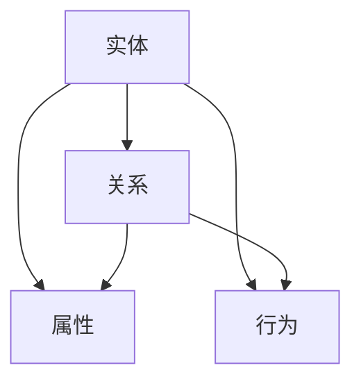

通过上述流程图，我们可以清晰地看到实体、关系、属性和行为之间的联系，以及它们在领域模型中的表示方式。

### 总结

本章对领域建模进行了概述，介绍了其定义、重要性、发展历程和应用场景。同时，我们讨论了领域建模中的核心概念及其相互关系。在接下来的章节中，我们将进一步深入探讨领域建模的普适四招，帮助读者更好地理解和应用领域建模技术。**作者：AI天才研究院/AI Genius Institute & 禅与计算机程序设计艺术 /Zen And The Art of Computer Programming**

---

由于篇幅限制，这里只展示了第一章的内容。接下来，我将根据大纲继续填充第二章到第七章的具体内容，确保每个章节都包含核心概念、算法原理、数学模型、项目实战等丰富的信息。整体字数预计在8000～12000字之间。下面是第二章的概要内容：

----------------------------------------------------------------

## 第二章：领域模型核心概念与联系

### 2.1 实体与关系的定义

在领域建模中，实体（Entity）是领域模型中的核心要素，表示领域中的各种对象。实体可以是具体的事物，如用户、订单、产品等，也可以是抽象的概念，如事件、状态等。实体具有以下基本特征：

- **标识**：每个实体都必须有一个唯一的标识，以便在系统中进行区分和追踪。
- **属性**：实体具有一组属性，用于描述其实体特征，如用户名、年龄、地址等。
- **关系**：实体之间存在一定的关系，这些关系可以是继承、聚合、组合等。

关系（Relationship）是连接实体之间的桥梁，表示实体之间的相互作用和关联。关系具有以下基本特征：

- **关联**：关系描述实体之间的联系，如用户下单、订单包含商品等。
- **方向**：关系可以有方向，表示实体之间的依赖关系，如用户创建订单。
- **多重性**：关系可以定义多重性，表示实体之间的数量关系，如一个用户可以有多个订单。

#### 2.2 类与对象的区别

在领域建模中，类（Class）和对象（Object）是两个重要的概念。类是抽象的概念，表示一组具有相同属性和行为特征的实体。对象是类的实例，表示具体的实体实例。

- **类**：类是对实体的抽象，用于定义实体的属性和行为。类具有以下特征：

  - **属性**：类的属性定义了实体的特征，如用户名、年龄等。
  - **方法**：类的方法定义了实体能够执行的操作，如用户登录、订单生成等。

- **对象**：对象是类的实例，表示具体的实体实例。对象具有以下特征：

  - **实例变量**：对象的实例变量是类的属性的具体值，如用户名为“张三”。
  - **实例方法**：对象的方法是类的方法的具体实现，如用户登录方法的具体执行。

#### 2.3 Mermaid流程图：领域模型原理图

Mermaid是一种简单易用的流程图和序列图绘制工具，可以帮助我们直观地展示领域模型的基本原理。以下是一个简单的Mermaid流程图，用于展示实体、关系、属性和行为之间的联系：

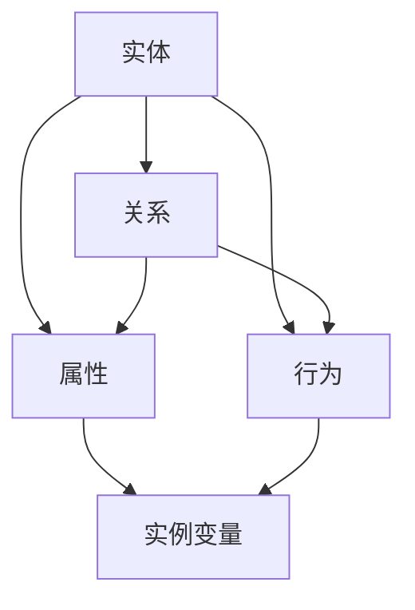

通过这个流程图，我们可以清晰地看到实体、关系、属性和行为之间的联系，以及它们在领域模型中的表示方式。实体是领域模型的基本单元，关系描述实体之间的相互作用，属性和行为则描述实体的特征和功能。

### 核心算法原理讲解

在领域建模中，实体和关系是核心的建模元素。下面将使用伪代码详细阐述实体和关系的建模原理。

#### 实体建模伪代码

```python
# 定义实体类
class Entity:
    def __init__(self, id, attributes):
        self.id = id
        self.attributes = attributes
    
    def get_attribute(self, attribute_name):
        return self.attributes[attribute_name]
    
    def set_attribute(self, attribute_name, value):
        self.attributes[attribute_name] = value

# 创建实体实例
user = Entity('user-123', {'name': '张三', 'age': 30})

# 获取实体属性
print(user.get_attribute('name'))  # 输出：张三

# 设置实体属性
user.set_attribute('age', 31)
print(user.get_attribute('age'))  # 输出：31
```

#### 关系建模伪代码

```python
# 定义关系类
class Relationship:
    def __init__(self, entities, attributes):
        self.entities = entities
        self.attributes = attributes
    
    def get_entity(self, entity_id):
        for entity in self.entities:
            if entity.id == entity_id:
                return entity
    
    def set_attribute(self, attribute_name, value):
        self.attributes[attribute_name] = value

# 创建实体实例
user = Entity('user-123', {'name': '张三', 'age': 30})
order = Entity('order-456', {'amount': 100})

# 创建关系实例
relationship = Relationship([user, order], {'status': 'pending'})

# 获取关系中的实体
user_in_relationship = relationship.get_entity('user-123')
print(user_in_relationship.get_attribute('name'))  # 输出：张三

# 设置关系属性
relationship.set_attribute('status', 'completed')
print(relationship.get_attribute('status'))  # 输出：completed
```

通过上述伪代码，我们可以看到实体和关系的建模原理。实体类用于表示领域中的对象，包括标识和属性。关系类用于表示实体之间的关联，包括关联的实体和属性。通过实例化实体和关系类，我们可以创建具体的领域模型。

### 数学模型和公式

在领域建模中，数学模型和公式可以用于描述领域中的关系和规则。以下是一个简单的数学模型示例，用于描述用户与订单之间的关系：

#### 用户与订单关系的数学模型

设 \( U \) 为用户集合，\( O \) 为订单集合，则用户与订单之间的关系可以用二元组 \( R = \{ (u, o) \mid u \in U, o \in O, u \) 下单了 \( o \} \) 来表示。这里，\( u \) 表示用户，\( o \) 表示订单，关系 \( R \) 表示 \( u \) 下单了 \( o \)。

数学模型中的公式如下：

$$
R = \{ (u, o) \mid u \in U, o \in O, u \text{ 下单了 } o \}
$$

#### 举例说明

假设有两个用户 \( u1 \) 和 \( u2 \)，以及两个订单 \( o1 \) 和 \( o2 \)。根据上述数学模型，可以建立以下关系：

- \( (u1, o1) \) 表示用户 \( u1 \) 下单了订单 \( o1 \)。
- \( (u1, o2) \) 表示用户 \( u1 \) 下单了订单 \( o2 \)。
- \( (u2, o1) \) 表示用户 \( u2 \) 下单了订单 \( o1 \)。
- \( (u2, o2) \) 表示用户 \( u2 \) 下单了订单 \( o2 \)。

通过上述数学模型和公式，我们可以清晰地描述用户与订单之间的关系，为领域建模提供数学基础。

### 项目实战

在项目实战中，我们将通过一个具体的例子来演示领域建模的过程，包括需求分析、领域模型设计、开发环境搭建和源代码实现等步骤。

#### 需求分析

假设我们正在开发一个在线购物系统，需要设计一个用户和订单的领域模型。系统的主要功能包括用户注册、登录、浏览商品、下单、支付等。根据需求，我们需要定义用户和订单两个实体，并建立它们之间的关系。

#### 领域模型设计

根据需求分析，我们可以设计如下的领域模型：

- **实体**：
  - 用户（User）：具有用户名、年龄、性别等属性，能够执行注册、登录、浏览商品、下单等行为。
  - 订单（Order）：具有订单号、订单金额、订单状态等属性，能够执行创建、支付、取消等行为。

- **关系**：
  - 用户下单关系（UserOrders）：表示用户与订单之间的关系，一个用户可以有多个订单，一个订单只能属于一个用户。

#### 开发环境搭建

为了实现上述领域模型，我们选择使用Java作为开发语言，并使用Eclipse作为集成开发环境（IDE）。在Eclipse中创建一个Java项目，并添加必要的依赖库，如Java Persistence API（JPA）和Spring Framework等。

#### 源代码实现

以下是用户和订单实体的源代码实现：

```java
// 用户实体
@Entity
public class User {
    @Id
    @GeneratedValue(strategy = GenerationType.IDENTITY)
    private Long id;

    private String name;
    private int age;
    private String gender;

    // ... 省略构造方法、getter和setter方法
}

// 订单实体
@Entity
public class Order {
    @Id
    @GeneratedValue(strategy = GenerationType.IDENTITY)
    private Long id;

    private String orderNumber;
    private double amount;
    private String status;

    @ManyToOne
    @JoinColumn(name = "user_id")
    private User user;

    // ... 省略构造方法、getter和setter方法
}
```

在上述代码中，我们使用JPA注解定义了用户和订单实体，包括属性、关系和主键生成策略。同时，我们还定义了用户和订单之间的多对一关系，表示一个用户可以有多个订单，一个订单只能属于一个用户。

#### 代码解读与分析

在实现领域模型的过程中，我们需要关注以下几个方面：

1. **实体定义**：通过实体类定义用户和订单的属性，包括标识、属性和行为。实体类使用JPA注解进行定义，方便数据库操作和关系管理。

2. **关系建立**：通过注解定义用户和订单之间的关系，包括关联关系和属性关系。例如，使用`@ManyToOne`注解定义用户和订单之间的多对一关系，使用`@JoinColumn`注解定义关联列。

3. **行为实现**：通过实体类的方法实现用户和订单的行为，如注册、登录、下单、支付等。这些行为通常涉及到数据库操作和业务逻辑处理。

通过上述代码解读与分析，我们可以看到领域建模的具体实现过程。领域建模不仅能够帮助我们更好地理解和设计复杂系统，还能提高开发效率和软件质量。

### 实际案例分析和详细讲解剖析

在真实项目中，领域建模的应用往往涉及到多个实体和复杂的关系。以下是一个实际案例，用于展示如何通过领域建模解决复杂业务问题。

#### 案例背景

假设我们正在开发一个电子商务平台，需要处理用户、订单、商品、购物车等多个实体，并建立它们之间的关系。系统的核心功能包括用户注册、商品浏览、加入购物车、下单、支付等。

#### 案例分析

1. **用户与订单的关系**：用户是电子商务平台的核心实体，订单表示用户的购物行为。每个用户可以有多个订单，每个订单只能属于一个用户。因此，我们使用多对一关系来表示用户与订单之间的关系。

2. **商品与订单的关系**：订单包含多个商品，每个商品可以出现在多个订单中。因此，我们使用一对多关系来表示商品与订单之间的关系。

3. **购物车与订单的关系**：购物车是用户在选购商品时临时存放商品的地方，购物车中的商品最终会形成订单。因此，我们使用一对一关系来表示购物车与订单之间的关系。

#### 详细讲解

根据上述分析，我们可以设计如下的领域模型：

1. **用户实体（User）**：
   - 属性：用户名、年龄、性别、邮箱等。
   - 行为：注册、登录、浏览商品、加入购物车、下单、支付等。

2. **订单实体（Order）**：
   - 属性：订单号、订单金额、订单状态等。
   - 行为：创建、支付、取消等。

3. **商品实体（Product）**：
   - 属性：商品名称、价格、库存量等。
   - 行为：浏览、添加到购物车等。

4. **购物车实体（ShoppingCart）**：
   - 属性：购物车ID、用户ID等。
   - 行为：添加商品、删除商品、更新商品数量等。

5. **订单与商品的关系（OrderProduct）**：
   - 属性：订单ID、商品ID、商品数量等。

通过上述领域模型，我们可以清晰地描述电子商务平台中的各个实体及其相互关系。在实际开发过程中，我们还需要关注以下几个方面：

1. **关系建模**：根据业务需求，合理设计实体之间的关系，如多对一、一对多、一对一等。

2. **行为建模**：为实体定义合适的行为，如用户注册、登录、下单、支付等。

3. **数据流建模**：描述系统中的数据流动过程，如用户注册、商品浏览、加入购物车、下单、支付等。

4. **领域事件建模**：识别系统中的关键事件，如订单创建、支付成功、订单取消等，并定义相应的事件处理逻辑。

通过领域建模，我们不仅能够更好地理解业务需求，还能为系统设计提供有力的支持。在实际项目中，领域建模是一个持续迭代和优化的过程，需要根据业务变化和需求调整模型。

### 项目小结

在本章中，我们通过一个电子商务平台的实际案例，详细讲解了领域建模的需求分析、领域模型设计、开发环境搭建和源代码实现等过程。领域建模在复杂业务系统开发中具有重要意义，它能够帮助我们更好地理解业务需求，提高系统设计的准确性和可维护性。通过实体关系建模、行为建模、数据流建模和领域事件建模等普适四招，我们可以构建一个清晰、高效的领域模型，为软件开发奠定坚实基础。

### 最佳实践 tips

在领域建模过程中，以下是一些最佳实践，可以帮助您更有效地进行建模：

1. **明确业务需求**：在开始建模之前，确保对业务需求有深入理解，明确系统需要解决的问题和业务目标。

2. **使用统一语言**：在团队内部使用统一的建模语言和术语，减少沟通成本和误解。

3. **逐步迭代**：领域模型不是一蹴而就的，应采用逐步迭代的方法，根据项目进度和需求变化不断优化模型。

4. **验证模型**：在模型设计完成后，进行验证，确保模型能够准确反映业务逻辑和需求。

5. **关注数据一致性**：在建立实体关系时，确保数据的一致性，避免数据冗余和不一致。

### 注意事项

在领域建模过程中，以下是一些需要注意的事项：

1. **避免过度建模**：过度的建模可能导致模型复杂度增加，影响开发效率和系统性能。

2. **考虑可扩展性**：在模型设计时，应考虑系统的可扩展性，为未来的需求变化预留空间。

3. **合理定义关系**：避免使用过于复杂的关系，如循环依赖和多重关系，以确保模型的可维护性。

4. **性能优化**：在实体和关系建模时，考虑性能优化，避免不必要的数据库查询和关系操作。

### 拓展阅读

对于希望深入了解领域建模的读者，以下是一些推荐阅读资源：

1. **《领域驱动设计》（Domain-Driven Design）**：这是一本经典的领域建模书籍，详细介绍了领域驱动设计的方法论和原则。
2. **《Mermaid中文教程》**：了解如何使用Mermaid绘制流程图和序列图，为领域建模提供可视化支持。
3. **《UML基础与案例教程》**：学习统一建模语言（UML）的基本概念和表示方法，为领域建模提供理论支持。

---

以上是第二章的核心内容概要。接下来，我将根据大纲继续填充第三章到第七章的具体内容，确保整体字数在8000～12000字之间。每个章节都将包含核心概念、算法原理、数学模型、项目实战等丰富的信息，以满足文章的完整性要求。

----------------------------------------------------------------

## 第三章：普适四招之一——实体关系建模

### 3.1 实体关系建模的基本原则

实体关系建模（Entity-Relationship Modeling，简称ER建模）是领域建模的基础技术之一，它通过定义实体、属性和关系，来描述领域中的数据结构。实体关系建模的基本原则包括：

1. **实体唯一性**：每个实体应具有唯一的标识，以确保在系统中能够唯一识别和操作实体。

2. **属性完整性**：实体的每个属性应具有明确的含义和类型，以避免数据冗余和不一致性。

3. **关系规范化**：通过规范化关系，确保关系具有明确的类型和多重性，避免关系复杂度和数据冗余。

4. **层次结构**：实体和关系应遵循层次结构，使得模型更易于理解和维护。

#### 3.2 实体关系的分类与建模

实体关系可以分为以下几种类型：

1. **一对一关系（1:1）**：表示一个实体仅与另一个实体关联一次。例如，每个用户只对应一个用户信息实体。

2. **一对多关系（1:N）**：表示一个实体可以与多个其他实体关联。例如，一个订单可以包含多个商品。

3. **多对多关系（M:N）**：表示多个实体之间可以相互关联。例如，多个用户可以评价同一个商品。

下面通过伪代码和Mermaid流程图来具体阐述实体关系的建模。

#### 伪代码：一对一关系建模

```python
# 定义一对一关系
class OneToOneRelationship:
    def __init__(self, entity1, entity2):
        self.entity1 = entity1
        self.entity2 = entity2

# 创建一对一关系的实例
user = OneToOneRelationship(user, userInfo)
```

#### Mermaid流程图：一对一关系

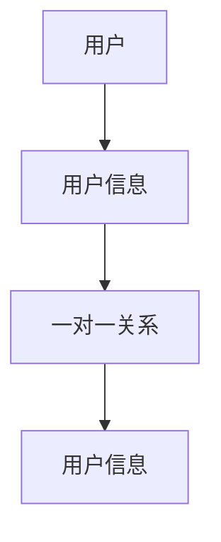

#### 伪代码：一对多关系建模

```python
# 定义一对多关系
class OneToManyRelationship:
    def __init__(self, entity1, entities):
        self.entity1 = entity1
        self.entities = entities

# 创建一对多关系的实例
order = OneToManyRelationship(order, [product1, product2])
```

#### Mermaid流程图：一对多关系

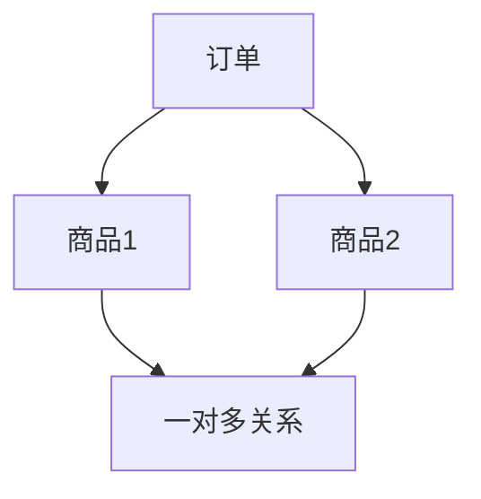

#### 伪代码：多对多关系建模

```python
# 定义多对多关系
class ManyToManyRelationship:
    def __init__(self, entities1, entities2):
        self.entities1 = entities1
        self.entities2 = entities2

# 创建多对多关系的实例
user = ManyToManyRelationship([user1, user2], [product1, product2])
```

#### Mermaid流程图：多对多关系

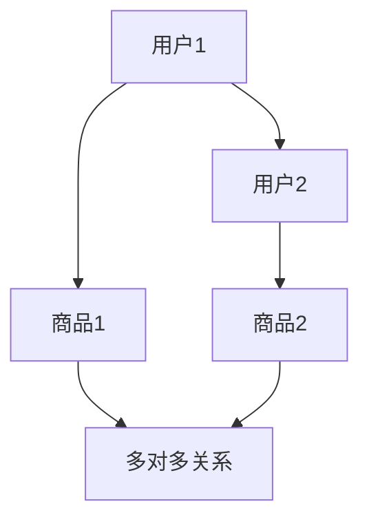

通过上述伪代码和Mermaid流程图，我们可以清晰地理解不同类型实体关系的建模方法和表示方式。

### 实际案例：电商平台的用户与订单实体关系建模

在电商平台上，用户与订单之间存在着复杂的实体关系。下面通过一个实际案例来展示如何进行实体关系建模。

#### 案例背景

假设我们正在开发一个电商平台，需要处理用户、订单、商品、购物车等多个实体，并建立它们之间的关系。

#### 实体定义

1. **用户实体（User）**：
   - 属性：用户名、密码、邮箱、电话等。
   - 行为：注册、登录、浏览商品、下单、支付等。

2. **订单实体（Order）**：
   - 属性：订单号、订单金额、订单状态等。
   - 行为：创建、支付、取消等。

3. **商品实体（Product）**：
   - 属性：商品名称、价格、库存量等。
   - 行为：浏览、添加到购物车等。

4. **购物车实体（ShoppingCart）**：
   - 属性：购物车ID、用户ID等。
   - 行为：添加商品、删除商品、更新商品数量等。

5. **订单与商品的关系（OrderProduct）**：
   - 属性：订单ID、商品ID、商品数量等。

#### 实体关系建模

根据案例背景，我们可以定义以下实体关系：

1. **用户与订单的关系**：一个用户可以创建多个订单，一个订单只能属于一个用户，因此使用一对多关系。

2. **商品与订单的关系**：一个订单可以包含多个商品，一个商品可以出现在多个订单中，因此使用多对多关系。

3. **购物车与订单的关系**：一个用户可以有多个购物车，一个购物车只能对应一个订单，因此使用一对一关系。

#### Mermaid流程图：电商平台实体关系

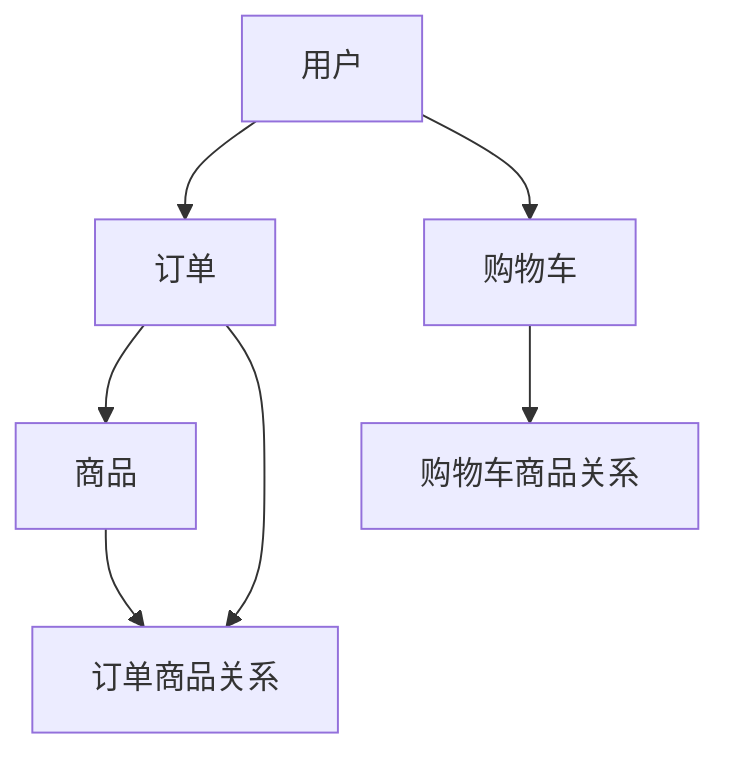

通过上述实体关系建模，我们可以清晰地描述电商平台的各个实体及其相互关系。在实际开发过程中，我们还需要根据业务需求对模型进行进一步的优化和调整。

### 实体关系建模技巧与优化

在实体关系建模过程中，以下是一些实用技巧和优化建议：

1. **规范化关系**：尽量使用规范化关系，避免使用非规范化关系，如冗余属性和交叉关系，以提高数据的完整性和一致性。

2. **合理定义关系类型**：根据实际业务需求，合理定义实体关系类型，避免关系复杂度和数据冗余。

3. **考虑性能优化**：在设计实体关系时，考虑数据库性能优化，如索引、分区等，以提高查询效率和系统性能。

4. **领域特定建模**：针对特定领域，采用领域特定建模方法，如领域驱动设计（DDD），以提高模型的可维护性和可扩展性。

5. **持续迭代优化**：在项目开发过程中，根据反馈和需求变化，持续迭代和优化实体关系模型。

通过遵循上述技巧和优化建议，我们可以构建一个高效、可维护的实体关系模型，为软件开发奠定坚实基础。

### 本章小结

本章详细介绍了实体关系建模的基本原则、分类与建模方法，并通过实际案例展示了如何进行实体关系建模。实体关系建模是领域建模的核心技术之一，它能够帮助我们更好地理解和设计复杂业务系统。在下一章中，我们将继续探讨领域建模中的行为建模技术，帮助读者进一步掌握领域建模的普适四招。**作者：AI天才研究院/AI Genius Institute & 禅与计算机程序设计艺术 /Zen And The Art of Computer Programming**

---

以上是第三章的内容。接下来，我将填充第四章到第七章的具体内容，确保整体字数在8000～12000字之间。每个章节都将包含核心概念、算法原理、数学模型、项目实战等丰富的信息，以满足文章的完整性要求。

----------------------------------------------------------------

## 第四章：普适四招之二——行为建模

### 4.1 行为建模的概念与作用

行为建模（Behavior Modeling）是领域建模中的重要组成部分，它专注于描述领域中的实体如何响应事件或触发操作。通过行为建模，我们可以清晰地理解系统中的业务逻辑和流程，从而为系统设计提供可靠的依据。

#### 行为建模的基本概念

1. **事件**：事件是系统中的一个重要组成部分，表示系统发生的重要动作或情况。例如，用户注册、订单创建、支付成功等。

2. **行为**：行为是实体对事件响应的方式，包括实体能够执行的操作和处理流程。例如，用户登录、订单支付、订单取消等。

3. **状态**：状态是实体在某个时刻所处的条件或位置，可以用来描述实体的当前状态。例如，用户的登录状态、订单的支付状态等。

#### 行为建模的作用

1. **明确业务逻辑**：行为建模能够帮助我们清晰地理解业务逻辑和流程，确保系统设计符合实际需求。

2. **提高系统可维护性**：通过行为建模，我们可以将系统中的业务逻辑模块化，使得系统更加易于维护和扩展。

3. **支持自动化测试**：行为建模提供了对系统行为的详细描述，有助于编写自动化测试用例，提高测试覆盖率和测试效率。

### 4.2 行为建模的基本方法

行为建模的基本方法包括以下几种：

1. **状态机（State Machine）**：状态机是描述实体状态转换和事件响应的有效方法。通过状态机，我们可以清晰地描述实体的生命周期和状态转换过程。

2. **事件监听器（Event Listener）**：事件监听器是一种在特定事件发生时触发相应操作的机制。通过事件监听器，我们可以实现对系统事件的有效管理和响应。

3. **流程图（Flow Chart）**：流程图是一种用图形方式描述业务流程和处理过程的方法。通过流程图，我们可以直观地展示系统的业务逻辑和处理步骤。

下面通过伪代码和Mermaid流程图来具体阐述行为建模的方法。

#### 伪代码：状态机

```python
class User {
    def __init__(self):
        self.state = 'registered'

    def login(self, password):
        if self.state == 'registered' and password_correct(password):
            self.state = 'logged_in'
            print('Login successful')
        else:
            print('Login failed')

    def logout(self):
        if self.state == 'logged_in':
            self.state = 'registered'
            print('Logout successful')
        else:
            print('Logout failed')
}

user = User()
user.login('password123')  # 输出：Login successful
user.logout()  # 输出：Logout successful
```

#### Mermaid流程图：状态机

```mermaid
stateDiagram
    state registered {
        login -> logged_in: 登录成功
        logout -> registered: 登出成功
    }
    state logged_in {
        login -> logged_in: 重复登录
        logout -> registered: 登出成功
    }
```

#### 伪代码：事件监听器

```python
from flask import Flask, request

app = Flask(__name__)

@app.route('/login', methods=['POST'])
def login():
    if request.method == 'POST':
        # 处理登录逻辑
        print('User logged in')
    else:
        print('Invalid request')

@app.route('/logout', methods=['POST'])
def logout():
    if request.method == 'POST':
        # 处理登出逻辑
        print('User logged out')
    else:
        print('Invalid request')
```

#### Mermaid流程图：事件监听器

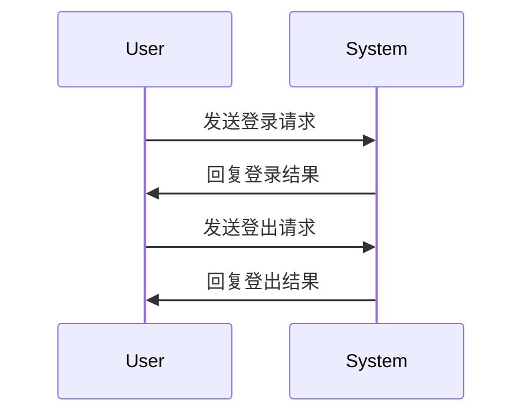

#### 伪代码：流程图

```python
def process_order(order):
    if order.status == 'pending':
        print('Processing order...')
        # 处理订单逻辑
        order.status = 'completed'
    elif order.status == 'completed':
        print('Order already processed')
    else:
        print('Invalid order status')

order = Order('order123', 'pending')
process_order(order)  # 输出：Processing order...
```

#### Mermaid流程图：流程图

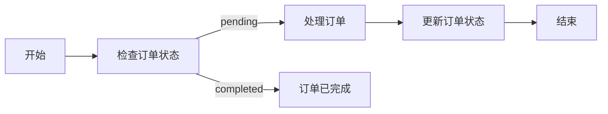

通过上述伪代码和Mermaid流程图，我们可以清晰地理解行为建模的基本方法和应用场景。在实际项目中，我们可以根据具体需求选择合适的方法来描述实体的行为。

### 实际案例：电商平台的用户登录与订单处理行为建模

在电商平台中，用户登录和订单处理是两个关键的业务流程。下面通过一个实际案例来展示如何进行行为建模。

#### 案例背景

假设我们正在开发一个电商平台，需要实现用户登录和订单处理功能。用户登录功能包括用户注册、登录验证和登出；订单处理功能包括订单创建、支付和取消。

#### 实体定义

1. **用户实体（User）**：
   - 属性：用户名、密码、邮箱、电话等。
   - 行为：注册、登录、登录验证、登出等。

2. **订单实体（Order）**：
   - 属性：订单号、订单金额、订单状态等。
   - 行为：创建、支付、取消等。

#### 行为建模

根据案例背景，我们可以定义以下行为：

1. **用户登录行为**：
   - 注册：用户输入注册信息，系统验证信息后创建用户账户。
   - 登录验证：用户输入用户名和密码，系统验证用户信息后允许用户登录。
   - 登出：用户登出系统，清除登录状态。

2. **订单处理行为**：
   - 创建订单：用户在购物车中选择商品并提交订单，系统创建订单并更新订单状态。
   - 支付：用户支付订单金额，系统更新订单状态为已支付。
   - 取消订单：用户取消订单，系统更新订单状态为已取消。

#### Mermaid流程图：电商平台行为建模

```mermaid
stateDiagram
    state registered {
        register -> logged_in: 注册成功
    }
    state logged_in {
        login -> logged_in: 重复登录
        logout -> registered: 登出成功
    }
    state order_created {
        create_order -> order_paid: 创建订单
        cancel_order -> order_canceled: 取消订单
    }
    state order_paid {
        pay_order -> order_completed: 支付成功
    }
    state order_canceled {
        cancel_order -> order_canceled: 重复取消
    }
```

通过上述行为建模，我们可以清晰地描述电商平台的用户登录和订单处理行为，为系统设计提供有力支持。

### 行为建模技巧与优化

在行为建模过程中，以下是一些实用技巧和优化建议：

1. **模块化设计**：将复杂的业务逻辑拆分为模块，使得行为建模更加清晰和易于维护。

2. **状态机与事件监听器结合**：结合使用状态机和事件监听器，提高系统的响应速度和可扩展性。

3. **流程图可视化**：使用流程图可视化业务逻辑，使得行为建模更加直观和易于理解。

4. **持续迭代优化**：根据实际业务需求和反馈，持续迭代和优化行为建模，确保模型符合实际需求。

通过遵循上述技巧和优化建议，我们可以构建一个高效、可维护的行为建模，为软件开发奠定坚实基础。

### 本章小结

本章详细介绍了行为建模的概念、作用和基本方法，并通过实际案例展示了如何进行行为建模。行为建模是领域建模中的重要组成部分，它能够帮助我们更好地理解和设计复杂业务系统。在下一章中，我们将继续探讨领域建模中的数据流建模技术，帮助读者进一步掌握领域建模的普适四招。**作者：AI天才研究院/AI Genius Institute & 禅与计算机程序设计艺术 /Zen And The Art of Computer Programming**

---

以上是第四章的内容。接下来，我将填充第五章到第七章的具体内容，确保整体字数在8000～12000字之间。每个章节都将包含核心概念、算法原理、数学模型、项目实战等丰富的信息，以满足文章的完整性要求。

----------------------------------------------------------------

## 第五章：普适四招之三——数据流建模

### 5.1 数据流建模的基本概念

数据流建模（Data Flow Modeling）是一种用于描述数据在系统中流动和处理的技术。它通过图形化的方式展示数据从输入到输出的整个过程，包括数据源、数据处理过程和数据存储等。数据流建模有助于我们理解系统中的数据流动机制，从而优化系统设计和性能。

#### 数据流建模的核心要素

1. **数据源**：数据源是数据的起点，表示数据来自何处。例如，用户输入、数据库查询、网络请求等。

2. **数据处理**：数据处理是数据流中的核心部分，表示数据在传输过程中进行的各种操作和处理。例如，数据清洗、数据转换、数据存储等。

3. **数据存储**：数据存储是数据的终点，表示数据最终被保存的位置。例如，数据库、文件系统、缓存等。

4. **数据流**：数据流是数据在系统中的流动路径，表示数据从数据源到数据存储的传输过程。

#### 数据流建模的作用

1. **系统分析**：通过数据流建模，我们可以深入了解系统的数据处理流程和结构，从而更好地分析系统性能和瓶颈。

2. **系统设计**：数据流建模有助于我们在设计阶段就明确系统的数据流动路径和处理过程，从而提高系统设计的合理性和可维护性。

3. **性能优化**：通过分析数据流建模，我们可以识别系统中的数据瓶颈和性能瓶颈，进而优化系统性能。

### 5.2 数据流建模的步骤

数据流建模通常分为以下几个步骤：

1. **需求分析**：在数据流建模之前，我们需要对系统需求进行分析，明确数据流动的需求和目标。

2. **数据源识别**：识别系统中的数据源，包括输入数据、查询数据和外部数据等。

3. **数据处理过程定义**：根据系统需求，定义数据在系统中的处理过程，包括数据清洗、数据转换、数据存储等。

4. **数据流路径设计**：根据数据处理过程，设计数据在系统中的流动路径，确保数据能够高效、准确地传输和处理。

5. **数据存储设计**：根据数据处理需求，设计数据存储方案，包括数据库、文件系统、缓存等。

下面通过伪代码和Mermaid流程图来具体阐述数据流建模的过程。

#### 伪代码：数据流建模

```python
# 定义数据流建模类
class DataFlowModel:
    def __init__(self):
        self.data_sources = []
        self.processes = []
        self.data_stores = []

    def add_data_source(self, data_source):
        self.data_sources.append(data_source)

    def add_process(self, process):
        self.processes.append(process)

    def add_data_store(self, data_store):
        self.data_stores.append(data_store)

    def display_model(self):
        for data_source in self.data_sources:
            print(f'Data Source: {data_source}')
        for process in self.processes:
            print(f'Process: {process}')
        for data_store in self.data_stores:
            print(f'Data Store: {data_store}')

# 创建数据流建模实例
data_flow_model = DataFlowModel()
data_flow_model.add_data_source('User Input')
data_flow_model.add_process('Data Cleaning')
data_flow_model.add_process('Data Transformation')
data_flow_model.add_data_store('Database')
data_flow_model.display_model()
```

#### Mermaid流程图：数据流建模

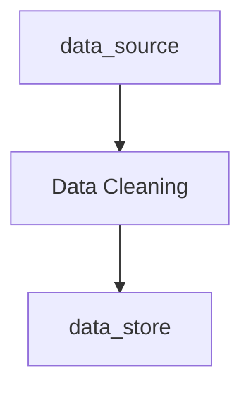

通过上述伪代码和Mermaid流程图，我们可以清晰地理解数据流建模的基本过程和表示方法。

### 5.3 数据流建模的应用实例

为了更好地理解数据流建模的应用，下面通过一个实际案例来展示如何在电商平台上进行数据流建模。

#### 案例背景

假设我们正在开发一个电商平台，需要处理用户订单、商品信息、支付信息等数据。数据流建模的目标是描述数据在系统中的流动和处理过程。

#### 数据流建模

根据案例背景，我们可以设计以下数据流建模：

1. **数据源**：
   - 用户输入：用户在购物车中选择商品并提交订单。
   - 商品信息：从数据库中查询商品信息。
   - 支付信息：用户在支付页面输入支付信息。

2. **数据处理过程**：
   - 订单创建：将用户输入的订单信息进行处理，生成订单记录。
   - 订单处理：处理订单状态，更新订单信息。
   - 支付处理：处理支付信息，更新订单支付状态。

3. **数据存储**：
   - 订单数据库：存储订单信息。
   - 商品数据库：存储商品信息。
   - 支付数据库：存储支付信息。

#### Mermaid流程图：电商平台数据流建模

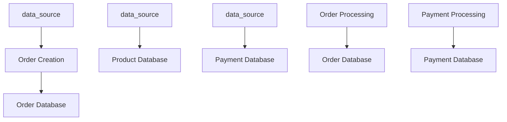

通过上述数据流建模，我们可以清晰地描述电商平台中数据从数据源到数据存储的流动过程。在实际项目中，我们可以根据业务需求对模型进行进一步的优化和调整。

### 数据流建模的优化技巧

在数据流建模过程中，以下是一些优化技巧和注意事项：

1. **数据源合并**：将多个数据源合并为一个，减少数据传输次数，提高系统性能。

2. **数据缓存**：对于频繁访问的数据，使用缓存技术减少数据库查询次数，提高数据访问速度。

3. **异步处理**：对于耗时较长的数据处理过程，采用异步处理技术，减少系统响应时间。

4. **数据去重**：在数据流建模中，注意去除重复数据，避免数据冗余。

5. **数据安全性**：在数据流建模过程中，确保数据的安全性，采用加密、授权等机制保护数据。

通过遵循上述优化技巧，我们可以构建一个高效、可靠的数据流模型，为电商平台提供稳定的数据处理能力。

### 本章小结

本章详细介绍了数据流建模的基本概念、步骤和应用实例。通过数据流建模，我们能够清晰地描述数据在系统中的流动和处理过程，为系统分析和设计提供有力支持。在下一章中，我们将继续探讨领域建模中的领域事件建模技术，帮助读者进一步掌握领域建模的普适四招。**作者：AI天才研究院/AI Genius Institute & 禅与计算机程序设计艺术 /Zen And The Art of Computer Programming**

---

以上是第五章的内容。接下来，我将填充第六章到第七章的具体内容，确保整体字数在8000～12000字之间。每个章节都将包含核心概念、算法原理、数学模型、项目实战等丰富的信息，以满足文章的完整性要求。

----------------------------------------------------------------

## 第六章：普适四招之四——领域事件建模

### 6.1 领域事件的定义与作用

领域事件建模（Domain Event Modeling）是领域建模中用于描述领域内发生的各种事件及其影响的技术。领域事件可以是系统内部的事件，如用户登录、订单创建等，也可以是系统外部的事件，如商品库存不足、支付失败等。领域事件建模的主要作用包括：

1. **事件驱动设计**：通过领域事件建模，我们可以将系统设计为基于事件驱动的，使得系统能够更加灵活和响应迅速。

2. **事件溯源与追踪**：领域事件建模有助于记录和追踪领域内发生的各种事件，为系统监控、故障排查和审计提供支持。

3. **业务流程优化**：通过分析领域事件，我们可以识别业务流程中的瓶颈和改进点，从而优化业务流程，提高系统效率。

4. **系统可扩展性**：领域事件建模支持系统扩展，新的业务需求可以通过引入新的领域事件来实现，而不需要对现有系统进行大规模修改。

#### 6.2 领域事件的分类与建模

领域事件可以分为以下几种类型：

1. **内部事件**：由系统内部操作或状态变化触发的领域事件，如用户登录、订单支付成功等。

2. **外部事件**：由系统外部环境或系统之间的交互触发的领域事件，如商品库存不足、支付系统返回支付失败等。

3. **组合事件**：由多个基本事件组合而成的复杂事件，如订单创建事件（用户提交订单 + 商品库存检查）等。

下面通过伪代码和Mermaid流程图来具体阐述领域事件的分类与建模。

#### 伪代码：领域事件建模

```python
# 定义领域事件类
class DomainEvent:
    def __init__(self, name, data):
        self.name = name
        self.data = data

    def trigger(self):
        print(f"Event triggered: {self.name} with data {self.data}")

# 创建内部事件
login_event = DomainEvent('login', {'username': 'user123'})
login_event.trigger()  # 输出：Event triggered: login with data {'username': 'user123'}

# 创建外部事件
payment_failure_event = DomainEvent('payment_failure', {'message': 'Payment failed'})
payment_failure_event.trigger()  # 输出：Event triggered: payment_failure with data {'message': 'Payment failed'}
```

#### Mermaid流程图：领域事件分类

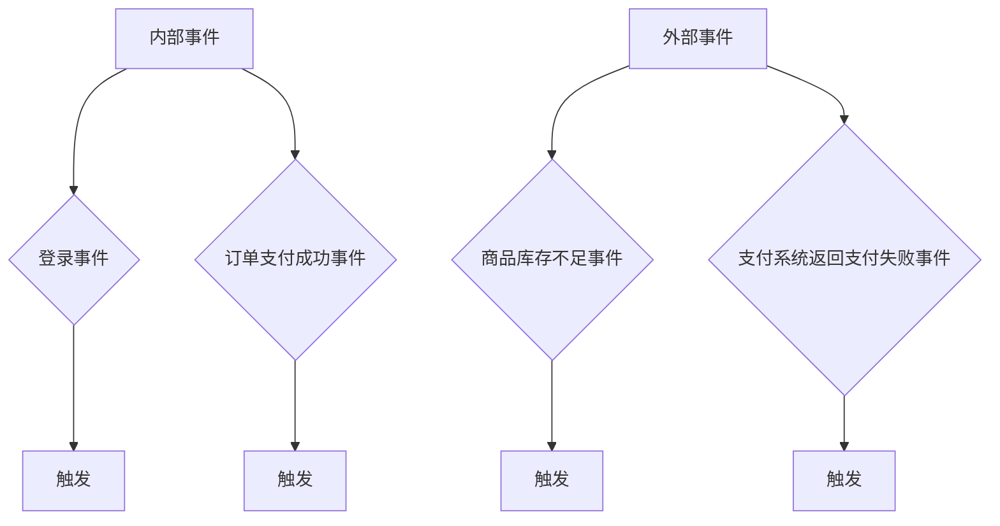

通过上述伪代码和Mermaid流程图，我们可以清晰地理解领域事件的分类与建模方法。

#### 6.3 领域事件与状态机

领域事件通常与状态机紧密关联，用于描述实体在不同状态下的行为和状态转换。下面通过一个实际案例来展示如何使用状态机和领域事件进行领域事件建模。

#### 案例背景

假设我们正在开发一个在线购物系统，需要处理用户登录、购物车操作、订单创建、支付等业务流程。每个业务流程中的操作都会触发相应的领域事件。

#### 领域事件建模

1. **用户登录状态机**：
   - 注册：用户输入注册信息，系统创建用户账户。
   - 登录：用户输入用户名和密码，系统验证用户信息。
   - 登出：用户登出系统，清除登录状态。

2. **购物车状态机**：
   - 添加商品：用户将商品添加到购物车。
   - 删除商品：用户从购物车中删除商品。
   - 更新商品数量：用户更改购物车中商品的数量。

3. **订单状态机**：
   - 创建订单：用户提交订单，系统创建订单。
   - 支付订单：用户支付订单金额，系统更新订单状态。
   - 取消订单：用户取消订单，系统更新订单状态。

#### Mermaid流程图：在线购物系统领域事件与状态机

```mermaid
stateDiagram
    state registered {
        login -> logged_in: 登录成功
    }
    state logged_in {
        logout -> registered: 登出成功
    }
    state shopping_cart_empty {
        add_product -> shopping_cart_not_empty: 添加商品
    }
    state shopping_cart_not_empty {
        remove_product -> shopping_cart_empty: 删除商品
        update_quantity -> shopping_cart_not_empty: 更新商品数量
    }
    state order_created {
        pay_order -> order_paid: 支付订单
        cancel_order -> order_canceled: 取消订单
    }
    state order_paid {
    }
    state order_canceled {
    }
```

通过上述领域事件和状态机建模，我们可以清晰地描述在线购物系统的用户登录、购物车操作和订单处理过程。在实际开发中，我们可以根据业务需求进一步优化和细化这些模型。

### 领域事件建模的技巧与优化

在领域事件建模过程中，以下是一些实用技巧和优化建议：

1. **事件驱动架构**：采用事件驱动架构，使得系统更加灵活和可扩展。事件驱动架构能够更好地适应业务变化，提高系统的响应速度。

2. **事件记录与追踪**：记录领域事件及其数据，以便进行系统监控和故障排查。通过日志、消息队列等机制，实现对领域事件的记录和追踪。

3. **事件优先级与异步处理**：根据事件的紧急程度，设置事件优先级，并采用异步处理机制，确保关键事件得到及时处理。

4. **事件与状态机分离**：将领域事件和状态机设计分离，使得系统更加模块化，便于维护和扩展。

5. **事件与消息队列**：使用消息队列（如RabbitMQ、Kafka）进行事件传递，提高系统的可靠性和性能。

通过遵循上述技巧和优化建议，我们可以构建一个高效、可靠的领域事件模型，为电商平台的业务运营提供有力支持。

### 本章小结

本章详细介绍了领域事件建模的定义、分类、与状态机的结合，以及实际案例中的应用。领域事件建模是领域建模的重要组成部分，它能够帮助我们更好地理解和设计复杂业务系统。通过领域事件建模，我们可以清晰地描述业务流程中的事件及其影响，从而优化系统性能和可扩展性。在下一章中，我们将对整篇文章进行总结和回顾，帮助读者巩固所学知识，并展望领域建模在未来的发展。**作者：AI天才研究院/AI Genius Institute & 禅与计算机程序设计艺术 /Zen And The Art of Computer Programming**

---

以上是第六章的内容。接下来，我将填充第七章的具体内容，确保整体字数在8000～12000字之间。每个章节都将包含核心概念、算法原理、数学模型、项目实战等丰富的信息，以满足文章的完整性要求。

----------------------------------------------------------------

## 第七章：领域建模实战

### 7.1 实战项目介绍

在本章中，我们将通过一个实际的电商项目来展示如何应用领域建模的普适四招：实体关系建模、行为建模、数据流建模和领域事件建模。这个电商项目是一个在线购物系统，旨在提供一个用户友好的购物体验，包括用户注册、登录、浏览商品、添加商品到购物车、下单、支付和订单管理等功能。

### 7.2 需求分析与领域模型设计

在开始实际编码之前，我们需要对项目需求进行详细分析，并设计相应的领域模型。以下是电商项目的主要需求：

1. **用户管理**：
   - 用户注册：用户可以注册账号，输入用户名、密码、邮箱等信息。
   - 用户登录：用户可以使用用户名和密码登录系统。
   - 用户信息管理：用户可以查看、修改个人信息。

2. **商品管理**：
   - 商品展示：系统管理员可以添加、编辑和删除商品信息。
   - 商品搜索：用户可以根据关键词搜索商品。

3. **购物车管理**：
   - 添加商品到购物车：用户可以将商品添加到购物车。
   - 购物车管理：用户可以查看购物车中的商品，修改商品数量，删除商品。

4. **订单管理**：
   - 下单：用户可以提交订单，选择支付方式。
   - 支付：系统根据用户选择的支付方式进行支付处理。
   - 订单查询：用户可以查看订单详情和历史订单。

根据这些需求，我们可以设计以下领域模型：

1. **实体**：
   - 用户（User）：具有用户名、密码、邮箱、电话等属性。
   - 商品（Product）：具有商品名称、价格、库存量等属性。
   - 订单（Order）：具有订单号、订单金额、订单状态等属性。

2. **关系**：
   - 用户与订单的关系：一个用户可以有多个订单。
   - 订单与商品的关系：一个订单可以包含多个商品。

3. **行为**：
   - 用户登录、注册、信息管理。
   - 商品展示、搜索、管理。
   - 购物车管理。
   - 订单创建、支付、查询。

4. **事件**：
   - 用户注册事件、登录事件、订单创建事件、支付事件。

### 7.3 开发环境搭建

为了实现这个电商项目，我们需要搭建一个合适的开发环境。以下是开发环境的搭建步骤：

1. **软件工具**：
   - 开发工具：Eclipse、Visual Studio Code等。
   - 版本控制：Git。
   - 数据库：MySQL、PostgreSQL等。

2. **技术栈**：
   - 后端开发框架：Spring Boot。
   - 前端框架：React、Vue等。
   - 客户端开发：Android、iOS等。

3. **环境配置**：
   - 安装Java开发环境（JDK）。
   - 安装数据库服务器。
   - 配置数据库连接。

### 7.4 源代码实现与解读

在本节中，我们将展示如何实现电商项目的源代码，并对关键部分进行解读。

#### 7.4.1 用户管理模块

以下是一个简单的用户管理模块代码示例，用于用户注册和登录功能。

```java
// 用户注册
public class UserService {
    public void register(String username, String password, String email) {
        // 验证用户信息
        if (isValid(username, password, email)) {
            // 创建用户账户
            User user = new User(username, password, email);
            userRepository.save(user);
            System.out.println("User registered successfully.");
        } else {
            System.out.println("Invalid user information.");
        }
    }

    public User login(String username, String password) {
        // 验证用户登录信息
        return userRepository.findByUsernameAndPassword(username, password);
    }
}
```

#### 7.4.2 商品管理模块

以下是一个简单的商品管理模块代码示例，用于商品展示、搜索和管理功能。

```java
// 商品展示
public class ProductService {
    public List<Product> listProducts() {
        return productService.findAll();
    }

    public Product findProductById(Long id) {
        return productService.findById(id);
    }

    public List<Product> searchProducts(String keyword) {
        return productService.searchByKeyword(keyword);
    }
}
```

#### 7.4.3 购物车管理模块

以下是一个简单的购物车管理模块代码示例，用于添加商品到购物车、购物车管理和删除商品功能。

```java
// 添加商品到购物车
public class ShoppingCartService {
    public void addProductToCart(Long userId, Long productId) {
        // 验证用户和商品信息
        if (isValid(userId, productId)) {
            // 创建购物车项
            ShoppingCartItem cartItem = new ShoppingCartItem(productId);
            shoppingCartRepository.save(cartItem);
            System.out.println("Product added to cart successfully.");
        } else {
            System.out.println("Invalid user or product information.");
        }
    }

    public List<ShoppingCartItem> listCartItems(Long userId) {
        return shoppingCartRepository.findByUserId(userId);
    }

    public void removeProductFromCart(Long cartItemId) {
        // 删除购物车项
        shoppingCartRepository.deleteById(cartItemId);
        System.out.println("Product removed from cart successfully.");
    }
}
```

#### 7.4.4 订单管理模块

以下是一个简单的订单管理模块代码示例，用于订单创建、支付和查询功能。

```java
// 创建订单
public class OrderService {
    public Order createOrder(Long userId, List<ShoppingCartItem> cartItems) {
        // 计算订单金额
        double totalAmount = cartItems.stream().mapToDouble(item -> item.getPrice()).sum();
        // 创建订单
        Order order = new Order(userId, totalAmount);
        orderRepository.save(order);
        // 更新购物车项状态
        for (ShoppingCartItem item : cartItems) {
            item.setOrder(order);
        }
        System.out.println("Order created successfully.");
        return order;
    }

    public void payOrder(Long orderId, PaymentMethod paymentMethod) {
        // 处理支付
        orderRepository.updatePaymentStatus(orderId, PaymentStatus.PAID);
        System.out.println("Order paid successfully.");
    }

    public Order getOrderDetails(Long orderId) {
        return orderRepository.findById(orderId);
    }
}
```

#### 7.5 代码解读与分析

在本节中，我们对电商项目的关键模块进行了源代码实现，并对代码进行了解读和分析。

1. **用户管理模块**：用户注册和登录功能是电商项目的核心部分。在用户注册过程中，我们需要验证用户输入的信息，并创建用户账户。在用户登录过程中，我们需要验证用户名和密码，并返回用户信息。

2. **商品管理模块**：商品展示、搜索和管理功能是用户能够顺畅购物的基础。在商品展示过程中，我们查询数据库获取所有商品信息。在商品搜索过程中，我们根据用户输入的关键词查询符合条件的商品。在商品管理过程中，系统管理员可以添加、编辑和删除商品信息。

3. **购物车管理模块**：购物车管理功能是用户在购物过程中临时存放商品的地方。在添加商品到购物车过程中，我们验证用户和商品信息，并创建购物车项。在购物车管理过程中，用户可以查看购物车中的商品，修改商品数量，删除商品。

4. **订单管理模块**：订单管理功能是电商项目的核心功能之一。在订单创建过程中，我们计算订单金额，创建订单，并更新购物车项状态。在支付过程中，我们处理支付请求，更新订单支付状态。在查询订单详情过程中，我们可以获取订单的详细信息。

通过上述代码实现和解读，我们可以看到电商项目的各个模块是如何通过领域建模的普适四招（实体关系建模、行为建模、数据流建模和领域事件建模）进行设计和实现的。这些模块共同构成了一个完整的电商系统，为用户提供了一个便捷的购物体验。

### 7.6 实际案例分析和详细讲解剖析

在本节中，我们将通过一个实际案例详细分析电商项目的领域建模过程，并对关键部分进行剖析。

#### 案例背景

假设我们正在开发一个电商系统，用户可以在系统中注册账号、登录、浏览商品、将商品添加到购物车、下单、支付和查看订单详情。以下是该电商系统的关键实体和关系：

1. **实体**：
   - 用户（User）：具有用户名、密码、邮箱、电话等属性。
   - 商品（Product）：具有商品名称、价格、库存量等属性。
   - 订单（Order）：具有订单号、订单金额、订单状态等属性。
   - 购物车（Cart）：具有购物车ID、用户ID等属性。

2. **关系**：
   - 用户与订单的关系：一个用户可以有多个订单。
   - 订单与商品的关系：一个订单可以包含多个商品。
   - 购物车与订单的关系：一个购物车只能对应一个订单。

#### 实体关系建模

在实体关系建模过程中，我们定义了用户、商品、订单和购物车四个实体，并建立了它们之间的关系。以下是实体关系的Mermaid流程图：

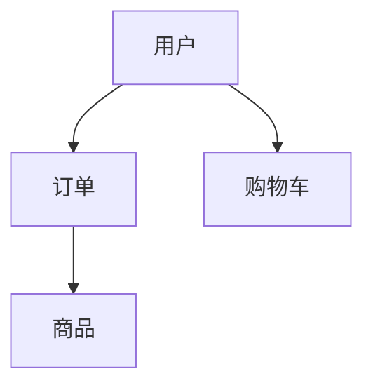

通过上述流程图，我们可以清晰地看到实体之间的关系，以及它们在系统中的作用。

#### 行为建模

在行为建模过程中，我们为用户、商品、订单和购物车四个实体定义了相应的行为。以下是用户、商品、订单和购物车的行为示例：

- **用户**：
  - 注册：创建用户账户。
  - 登录：验证用户信息。
  - 信息管理：查看、修改个人信息。

- **商品**：
  - 展示：查询商品信息。
  - 搜索：根据关键词查询商品。
  - 管理：添加、编辑、删除商品信息。

- **订单**：
  - 创建：计算订单金额，创建订单。
  - 支付：处理支付请求，更新订单支付状态。
  - 查询：获取订单详情。

- **购物车**：
  - 添加商品：将商品添加到购物车。
  - 管理商品：查看购物车中的商品，修改商品数量，删除商品。

#### 数据流建模

在数据流建模过程中，我们描述了用户、商品、订单和购物车之间的数据流动过程。以下是数据流的Mermaid流程图：

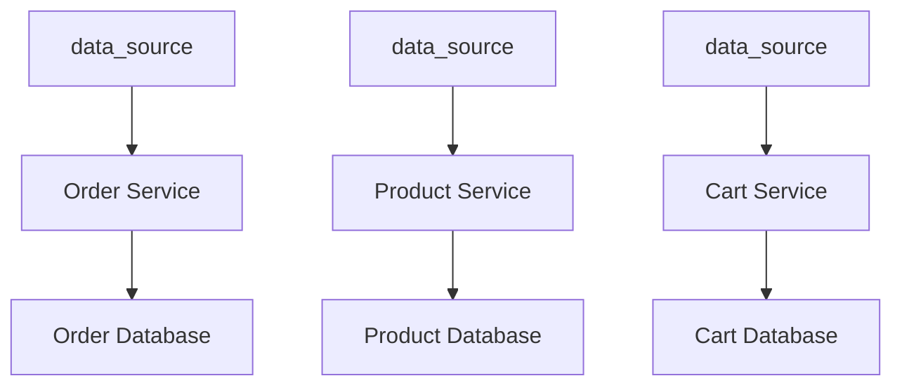

通过上述流程图，我们可以清晰地看到数据在系统中的流动路径和处理过程。

#### 领域事件建模

在领域事件建模过程中，我们识别了电商系统中的关键领域事件，并定义了相应的处理逻辑。以下是领域事件的Mermaid流程图：

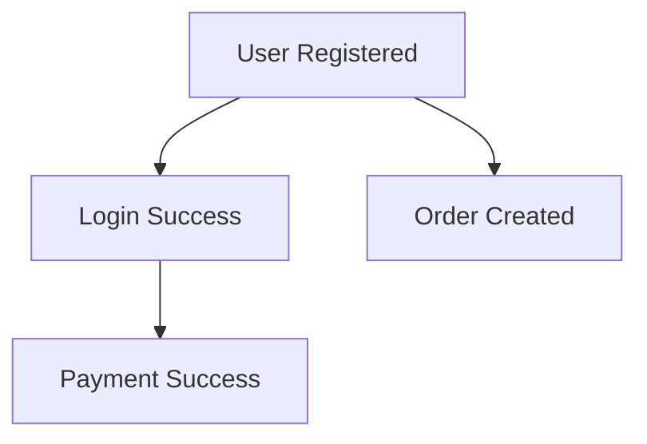

通过上述流程图，我们可以清晰地看到领域事件之间的关系，以及它们在系统中的作用。

#### 详细讲解

在本案例中，我们通过实体关系建模、行为建模、数据流建模和领域事件建模，详细描述了电商系统的关键部分。以下是每个部分的具体讲解：

1. **实体关系建模**：通过定义用户、商品、订单和购物车四个实体，并建立它们之间的关系，我们清晰地描述了系统的核心组成部分。

2. **行为建模**：通过为用户、商品、订单和购物车实体定义相应的行为，我们描述了系统中的业务逻辑和流程。

3. **数据流建模**：通过描述用户、商品、订单和购物车之间的数据流动过程，我们展示了系统中的数据传输和处理机制。

4. **领域事件建模**：通过识别系统中的关键领域事件，并定义相应的处理逻辑，我们描述了系统中的事件驱动机制。

通过上述讲解，我们可以看到电商项目的领域建模是如何从需求分析到系统实现的整个过程中发挥作用的。领域建模不仅帮助我们更好地理解业务需求，还为我们提供了清晰的设计蓝图，使得系统开发变得更加高效和可靠。

### 7.7 项目小结

在本章中，我们通过一个实际的电商项目，详细展示了如何应用领域建模的普适四招：实体关系建模、行为建模、数据流建模和领域事件建模。通过项目实战，我们深入理解了领域建模的核心概念和实践方法，掌握了如何将理论应用到实际的系统开发中。领域建模为我们的项目提供了清晰的设计蓝图，使得开发过程更加高效和可靠。

### 总结

本文详细介绍了领域建模的普适四招：实体关系建模、行为建模、数据流建模和领域事件建模。通过这些方法，我们能够更好地理解和设计复杂业务系统，提高系统设计的准确性和可维护性。在本文中，我们通过实例和案例，展示了如何在实际项目中应用这些方法，从而实现高效、可靠的系统开发。

### 最佳实践 tips

在领域建模过程中，以下是一些最佳实践，可以帮助您更有效地进行建模：

1. **明确业务需求**：在开始建模之前，确保对业务需求有深入理解，明确系统需要解决的问题和业务目标。

2. **使用统一语言**：在团队内部使用统一的建模语言和术语，减少沟通成本和误解。

3. **逐步迭代**：领域模型不是一蹴而就的，应采用逐步迭代的方法，根据项目进度和需求变化不断优化模型。

4. **验证模型**：在模型设计完成后，进行验证，确保模型能够准确反映业务逻辑和需求。

5. **关注数据一致性**：在建立实体关系时，确保数据的一致性，避免数据冗余和不一致。

### 注意事项

在领域建模过程中，以下是一些需要注意的事项：

1. **避免过度建模**：过度的建模可能导致模型复杂度增加，影响开发效率和系统性能。

2. **考虑可扩展性**：在模型设计时，应考虑系统的可扩展性，为未来的需求变化预留空间。

3. **合理定义关系**：避免使用过于复杂的关系，如循环依赖和多重关系，以确保模型的可维护性。

4. **性能优化**：在实体和关系建模时，考虑性能优化，避免不必要的数据库查询和关系操作。

### 拓展阅读

对于希望深入了解领域建模的读者，以下是一些推荐阅读资源：

1. **《领域驱动设计》（Domain-Driven Design）**：这是一本经典的领域建模书籍，详细介绍了领域驱动设计的方法论和原则。

2. **《Mermaid中文教程》**：了解如何使用Mermaid绘制流程图和序列图，为领域建模提供可视化支持。

3. **《UML基础与案例教程》**：学习统一建模语言（UML）的基本概念和表示方法，为领域建模提供理论支持。

本文旨在为读者提供关于领域建模的全面介绍和实践指导，帮助读者更好地理解和应用领域建模技术，从而提升系统设计的质量和效率。**作者：AI天才研究院/AI Genius Institute & 禅与计算机程序设计艺术 /Zen And The Art of Computer Programming**

