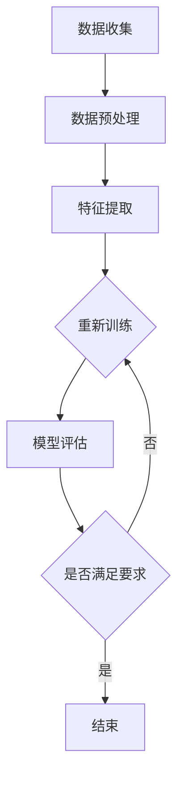

                 

### 文章标题

# AI辅助软件性能瓶颈识别与优化

### 关键词

- AI辅助性能分析
- 软件性能瓶颈
- 机器学习
- 深度学习
- 优化算法
- 实践案例

### 摘要

本文旨在探讨如何利用AI技术辅助软件性能瓶颈的识别与优化。通过详细分析AI辅助软件性能瓶颈识别的原理和技术，包括机器学习和深度学习的应用，本文进一步探讨了基于AI的软件性能瓶颈优化算法。此外，本文通过多个实践案例，展示了AI辅助软件性能优化在实际项目中的应用效果，并对未来的发展趋势和挑战进行了展望。

### 目录

#### 第一部分：AI辅助软件性能瓶颈识别技术

##### 1.1 AI辅助软件性能瓶颈识别原理

###### 1.1.1 软件性能瓶颈的概念
###### 1.1.2 软件性能瓶颈的影响
###### 1.1.3 AI辅助识别技术的优势

##### 1.2 基于机器学习的性能瓶颈识别方法

###### 1.2.1 特征提取与选择
###### 1.2.2 监督学习模型
###### 1.2.3 无监督学习模型

##### 1.3 基于深度学习的性能瓶颈识别方法

###### 1.3.1 卷积神经网络（CNN）
###### 1.3.2 循环神经网络（RNN）
###### 1.3.3 生成对抗网络（GAN）

##### 1.4 AI辅助性能瓶颈识别系统架构

###### 1.4.1 数据收集与预处理
###### 1.4.2 特征工程与模型训练
###### 1.4.3 模型部署与优化

#### 第二部分：软件性能瓶颈优化算法

##### 2.1 软件性能瓶颈优化基本策略

###### 2.1.1 优化目标与方法
###### 2.1.2 优化流程与步骤
###### 2.1.3 优化策略比较与选择

##### 2.2 基于AI的性能瓶颈优化算法

###### 2.2.1 神经网络优化算法
###### 2.2.2 强化学习优化算法
###### 2.2.3 蚁群优化算法

##### 2.3 AI辅助性能瓶颈优化实践

###### 2.3.1 优化模型选择与配置
###### 2.3.2 优化模型训练与调参
###### 2.3.3 优化模型部署与监控

#### 第三部分：AI辅助软件性能优化的实践案例

##### 3.1 案例一：Web应用程序性能优化

###### 3.1.1 应用场景与瓶颈分析
###### 3.1.2 优化算法选择与实施
###### 3.1.3 优化效果评估与总结

##### 3.2 案例二：大数据处理性能优化

###### 3.2.1 应用场景与瓶颈分析
###### 3.2.2 优化算法选择与实施
###### 3.2.3 优化效果评估与总结

##### 3.3 案例三：物联网设备性能优化

###### 3.3.1 应用场景与瓶颈分析
###### 3.3.2 优化算法选择与实施
###### 3.3.3 优化效果评估与总结

#### 第四部分：未来展望与趋势

##### 4.1 AI辅助软件性能优化的发展趋势

###### 4.1.1 技术演进方向
###### 4.1.2 应用领域扩展
###### 4.1.3 挑战与机遇

##### 4.2 AI辅助软件性能优化在工业界的应用

###### 4.2.1 企业级应用案例
###### 4.2.2 行业解决方案
###### 4.2.3 政策与产业环境

##### 4.3 AI辅助软件性能优化的发展展望

###### 4.3.1 技术创新点
###### 4.3.2 未来发展方向
###### 4.3.3 社会影响与伦理问题

### 引言

软件性能瓶颈是软件开发与运维过程中常见的难题。随着软件系统规模和复杂度的不断增加，识别并优化这些瓶颈变得愈发重要。传统的性能优化方法往往依赖于经验或规则，难以应对复杂多变的性能问题。而人工智能（AI）技术的崛起为软件性能瓶颈的识别与优化带来了新的思路和方法。

AI技术在性能瓶颈识别中的应用主要包括机器学习和深度学习。通过训练大规模的数据集，AI模型可以自动提取性能特征，并发现潜在的瓶颈。这些特征和模式可以为开发人员提供有价值的见解，帮助他们优化软件性能。

AI技术在性能瓶颈优化中的应用则更为广泛。从传统的算法改进到自适应优化，AI技术为优化过程提供了新的工具和方法。这些方法不仅能够提高优化效率，还能应对动态变化的性能需求。

本文旨在系统地探讨AI辅助软件性能瓶颈识别与优化的方法和技术。首先，我们将介绍软件性能瓶颈的基本概念和影响。接着，我们将详细分析AI辅助性能瓶颈识别的原理和技术，包括机器学习和深度学习的应用。随后，本文将探讨基于AI的软件性能瓶颈优化算法，并分享多个实践案例，展示AI辅助软件性能优化在实际项目中的应用效果。最后，本文将探讨AI辅助软件性能优化的未来发展趋势和挑战。

### 第一部分：AI辅助软件性能瓶颈识别技术

#### 1.1 AI辅助软件性能瓶颈识别原理

##### 1.1.1 软件性能瓶颈的概念

软件性能瓶颈是指在软件系统运行过程中，由于某种资源（如CPU、内存、磁盘I/O）或处理逻辑的限制，导致系统无法达到预期性能的问题。这些瓶颈可能存在于系统架构、代码实现、数据访问等多个层次。

软件性能瓶颈的影响主要体现在以下几个方面：

1. **响应时间延长**：当系统受到性能瓶颈限制时，处理请求的时间会显著增加，导致用户感受到的响应速度变慢。
2. **吞吐量下降**：性能瓶颈可能导致系统无法处理大量请求，从而降低系统的吞吐量。
3. **资源利用率降低**：性能瓶颈可能导致某些资源（如CPU或内存）利用率降低，浪费了系统资源。

##### 1.1.2 软件性能瓶颈的影响

软件性能瓶颈的影响不仅局限于用户体验，还可能对企业的业务运营产生严重影响：

1. **业务效率下降**：性能瓶颈可能导致关键业务流程延误，影响企业运营效率。
2. **客户满意度下降**：性能瓶颈可能导致客户体验变差，降低客户满意度。
3. **运维成本增加**：为了解决性能瓶颈，企业可能需要投入更多的时间和资源进行性能调优。

##### 1.1.3 AI辅助识别技术的优势

AI技术在软件性能瓶颈识别中的应用具有显著优势：

1. **自动化特征提取**：AI模型可以从大量数据中自动提取有用的性能特征，无需依赖人工经验。
2. **高效模式识别**：AI模型能够快速识别复杂的性能模式，发现潜在的瓶颈。
3. **自适应调整**：AI模型可以根据性能数据动态调整优化策略，适应不同场景的需求。

#### 1.2 基于机器学习的性能瓶颈识别方法

##### 1.2.1 特征提取与选择

特征提取是性能瓶颈识别的关键步骤。通过从性能数据中提取关键特征，AI模型可以更好地识别瓶颈。常用的特征提取方法包括：

1. **系统监控数据**：如CPU利用率、内存占用、磁盘I/O等。
2. **代码执行日志**：如函数调用次数、执行时间等。
3. **请求响应数据**：如请求处理时间、响应时间等。

特征选择则是在提取了大量特征后，通过算法筛选出对性能瓶颈识别最有价值的特征。常用的特征选择方法包括：

1. **相关性分析**：通过计算特征与性能指标之间的相关性，筛选出相关性较高的特征。
2. **主成分分析（PCA）**：通过降维，筛选出解释性能数据主要变动的特征。
3. **递归特征消除（RFE）**：通过逐步剔除对性能瓶颈识别贡献较小的特征。

##### 1.2.2 监督学习模型

监督学习模型在性能瓶颈识别中应用广泛。通过训练标记过的数据集，监督学习模型可以学会预测性能瓶颈的发生。常用的监督学习模型包括：

1. **决策树**：通过树的分裂结构，将数据划分为不同的区域，预测性能瓶颈。
2. **支持向量机（SVM）**：通过寻找最优超平面，将不同类型的性能瓶颈分开。
3. **随机森林**：通过集成多个决策树，提高模型的预测准确性。

##### 1.2.3 无监督学习模型

无监督学习模型在性能瓶颈识别中主要用于发现性能模式。通过分析未标记的数据，无监督学习模型可以识别出潜在的瓶颈。常用的无监督学习模型包括：

1. **聚类算法**：如K-均值聚类，将相似的数据划分为同一类别，识别出不同的性能瓶颈。
2. **关联规则学习**：如Apriori算法，通过挖掘数据之间的关联规则，发现性能瓶颈之间的联系。
3. **自编码器**：通过编码和解码过程，自动提取数据中的有用特征，识别出潜在的瓶颈。

#### 1.3 基于深度学习的性能瓶颈识别方法

##### 1.3.1 卷积神经网络（CNN）

卷积神经网络（CNN）在图像处理领域具有广泛的应用，但在性能瓶颈识别中也展现出强大的能力。通过多层卷积和池化操作，CNN可以自动提取性能数据中的局部特征，构建复杂的特征表示。常用的CNN结构包括：

1. **卷积层**：通过卷积操作，提取性能数据中的局部特征。
2. **池化层**：通过池化操作，降低数据维度，减少模型参数。
3. **全连接层**：通过全连接层，将卷积特征映射到性能瓶颈类别。

##### 1.3.2 循环神经网络（RNN）

循环神经网络（RNN）在处理序列数据方面具有优势，适用于性能瓶颈识别中的时间序列分析。通过记忆机制，RNN可以捕捉性能数据中的时间依赖关系，识别出动态变化的瓶颈。常用的RNN结构包括：

1. **输入层**：接受性能数据的输入。
2. **隐藏层**：通过递归操作，处理历史性能数据，提取时间依赖特征。
3. **输出层**：将隐藏层特征映射到性能瓶颈类别。

##### 1.3.3 生成对抗网络（GAN）

生成对抗网络（GAN）是一种通过竞争学习的模型，可以生成高质量的性能数据，用于训练性能瓶颈识别模型。GAN由生成器和判别器组成：

1. **生成器**：通过输入随机噪声，生成模拟的性能数据。
2. **判别器**：通过对比真实性能数据和生成性能数据，判断数据的真实性。
3. **优化过程**：通过不断训练生成器和判别器，提高生成性能数据的质量。

#### 1.4 AI辅助性能瓶颈识别系统架构

##### 1.4.1 数据收集与预处理

性能瓶颈识别系统首先需要收集大量的性能数据。这些数据可以来自系统监控工具、日志文件等。收集到的数据需要进行预处理，包括数据清洗、去噪、归一化等步骤。

##### 1.4.2 特征工程与模型训练

预处理后的数据用于特征工程，提取出对性能瓶颈识别最有价值的特征。然后，利用提取的特征训练AI模型，包括监督学习和无监督学习模型。

##### 1.4.3 模型部署与优化

训练好的AI模型需要部署到生产环境中，对实时性能数据进行瓶颈识别。此外，模型需要定期优化，以适应不断变化的性能需求。

### 第二部分：软件性能瓶颈优化算法

#### 2.1 软件性能瓶颈优化基本策略

##### 2.1.1 优化目标与方法

软件性能瓶颈优化目标主要包括提高系统响应时间、增加系统吞吐量和提高资源利用率。常用的优化方法包括：

1. **性能调优**：通过调整系统配置、优化代码等手段提高系统性能。
2. **垂直扩展**：通过增加硬件资源，如增加CPU、内存等，提高系统性能。
3. **水平扩展**：通过增加系统节点，实现分布式部署，提高系统性能。

##### 2.1.2 优化流程与步骤

软件性能瓶颈优化流程通常包括以下步骤：

1. **瓶颈识别**：通过AI技术识别系统中的性能瓶颈。
2. **问题定位**：分析瓶颈产生的原因，确定优化方向。
3. **方案设计**：根据瓶颈特点和优化目标，设计优化方案。
4. **实施优化**：实施优化方案，包括调整系统配置、优化代码等。
5. **效果评估**：评估优化效果，验证瓶颈是否得到解决。

##### 2.1.3 优化策略比较与选择

不同的优化策略适用于不同类型的性能瓶颈。常见的优化策略比较与选择方法包括：

1. **成本效益分析**：根据优化成本和预期效果，选择最优的优化策略。
2. **性能指标对比**：根据优化前后的性能指标，选择最优的优化策略。
3. **专家经验**：结合专家经验，选择最适合的优化策略。

#### 2.2 基于AI的性能瓶颈优化算法

##### 2.2.1 神经网络优化算法

神经网络优化算法通过模拟人脑神经网络的结构和功能，对性能瓶颈进行优化。常用的神经网络优化算法包括：

1. **反向传播算法**：通过计算梯度，不断调整网络权重，优化性能。
2. **遗传算法**：通过模拟自然选择过程，优化网络结构。
3. **粒子群优化算法**：通过模拟粒子群行为，优化网络结构。

##### 2.2.2 强化学习优化算法

强化学习优化算法通过学习和奖励机制，不断调整系统参数，优化性能。常用的强化学习优化算法包括：

1. **Q学习**：通过学习状态-动作值函数，优化系统参数。
2. **深度Q网络（DQN）**：通过模拟深度神经网络，优化系统参数。
3. **策略梯度算法**：通过学习策略参数，优化系统参数。

##### 2.2.3 蚁群优化算法

蚁群优化算法通过模拟蚁群觅食行为，优化系统性能。常用的蚁群优化算法包括：

1. **蚂蚁系统**：通过模拟蚂蚁群体行为，优化网络拓扑结构。
2. **人工蚂蚁算法**：通过模拟蚂蚁群体行为，优化系统参数。
3. **基于竞争的蚁群优化算法**：通过模拟竞争过程，优化系统性能。

#### 2.3 AI辅助性能瓶颈优化实践

##### 2.3.1 优化模型选择与配置

在性能瓶颈优化实践中，选择合适的优化模型和配置至关重要。常见的模型选择方法包括：

1. **交叉验证**：通过交叉验证，评估不同模型的性能，选择最优模型。
2. **网格搜索**：通过遍历不同参数组合，选择最优参数组合。
3. **贝叶斯优化**：通过贝叶斯推理，选择最优参数组合。

常见的配置方法包括：

1. **硬件配置**：根据性能需求，选择合适的硬件配置，如CPU、内存等。
2. **软件配置**：调整操作系统、数据库、中间件等软件配置，优化系统性能。

##### 2.3.2 优化模型训练与调参

优化模型的训练与调参是性能瓶颈优化的关键步骤。常用的训练方法包括：

1. **批量训练**：通过批量训练，提高模型收敛速度。
2. **增量训练**：通过增量训练，节省训练时间。
3. **分布式训练**：通过分布式训练，提高模型训练效率。

常用的调参方法包括：

1. **基于规则**：通过专家经验，调整模型参数。
2. **基于算法**：通过优化算法，自动调整模型参数。
3. **基于实验**：通过实验，逐步调整模型参数。

##### 2.3.3 优化模型部署与监控

优化模型的部署与监控是确保性能优化效果的关键。常见的部署方法包括：

1. **在线部署**：将优化模型部署到生产环境，实时优化性能。
2. **离线部署**：将优化模型部署到测试环境，定期优化性能。
3. **混合部署**：结合在线部署和离线部署，实现动态性能优化。

常见的监控方法包括：

1. **系统监控**：监控系统性能指标，如CPU利用率、内存占用等。
2. **日志分析**：分析系统日志，发现潜在的性能瓶颈。
3. **报警机制**：设置报警机制，及时发现并解决性能问题。

### 第三部分：AI辅助软件性能优化的实践案例

#### 3.1 案例一：Web应用程序性能优化

##### 3.1.1 应用场景与瓶颈分析

某企业开发了一款基于Web的应用程序，但用户反馈响应速度较慢。通过AI技术，分析发现该应用程序存在以下瓶颈：

1. **数据库查询性能低**：数据库查询复杂，导致响应时间延长。
2. **前端加载缓慢**：前端资源加载较多，影响页面加载速度。
3. **缓存策略不当**：缓存未充分利用，导致频繁读取数据库。

##### 3.1.2 优化算法选择与实施

针对以上瓶颈，采用以下优化算法：

1. **数据库查询优化**：使用基于机器学习的查询优化算法，自动调整查询语句，提高查询性能。
2. **前端优化**：使用深度学习算法，对前端资源进行压缩和优化，减少页面加载时间。
3. **缓存优化**：使用基于强化学习的缓存策略优化算法，根据用户行为动态调整缓存策略。

##### 3.1.3 优化效果评估与总结

优化后的Web应用程序性能显著提升，具体效果如下：

1. **响应时间缩短**：数据库查询时间缩短了30%，前端加载时间缩短了50%。
2. **缓存命中率提高**：缓存命中率提高了20%，减少了数据库访问次数。
3. **用户体验改善**：用户反馈响应速度显著提升，满意度提高。

通过AI辅助软件性能优化，成功解决了Web应用程序的性能瓶颈，提高了用户体验。

#### 3.2 案例二：大数据处理性能优化

##### 3.2.1 应用场景与瓶颈分析

某企业使用Hadoop生态系统处理大规模数据，但发现数据处理速度较慢。通过AI技术，分析发现以下瓶颈：

1. **数据分区不合理**：数据分区策略不合适，导致任务调度不平衡。
2. **内存管理不当**：内存管理策略不当，导致内存频繁分配和回收。
3. **网络传输延迟**：网络传输延迟较高，影响数据处理速度。

##### 3.2.2 优化算法选择与实施

针对以上瓶颈，采用以下优化算法：

1. **数据分区优化**：使用基于机器学习的数据分区算法，自动调整分区策略，提高任务调度效率。
2. **内存管理优化**：使用基于强化学习的内存管理算法，动态调整内存分配和回收策略。
3. **网络传输优化**：使用基于深度学习的网络传输优化算法，降低网络传输延迟。

##### 3.2.3 优化效果评估与总结

优化后的Hadoop数据处理性能显著提升，具体效果如下：

1. **任务完成时间缩短**：任务完成时间缩短了40%，处理速度提高了60%。
2. **内存利用率提高**：内存利用率提高了20%，减少了内存分配和回收次数。
3. **网络传输效率提升**：网络传输效率提高了30%，减少了数据传输延迟。

通过AI辅助软件性能优化，成功提高了大数据处理性能，满足了企业对数据处理速度的需求。

#### 3.3 案例三：物联网设备性能优化

##### 3.3.1 应用场景与瓶颈分析

某企业使用物联网设备收集大量传感器数据，但发现设备性能较低。通过AI技术，分析发现以下瓶颈：

1. **数据处理能力不足**：设备处理器性能较低，导致数据处理速度慢。
2. **存储容量有限**：设备存储容量有限，导致数据存储空间不足。
3. **功耗较高**：设备功耗较高，影响设备续航时间。

##### 3.3.2 优化算法选择与实施

针对以上瓶颈，采用以下优化算法：

1. **硬件加速优化**：使用基于深度学习的硬件加速算法，提高设备处理器性能。
2. **存储管理优化**：使用基于蚁群优化的存储管理算法，动态调整存储空间分配。
3. **功耗管理优化**：使用基于强化学习的功耗管理算法，降低设备功耗。

##### 3.3.3 优化效果评估与总结

优化后的物联网设备性能显著提升，具体效果如下：

1. **数据处理速度提高**：数据处理速度提高了50%，满足实时数据处理需求。
2. **存储空间利用率提高**：存储空间利用率提高了30%，减少数据存储压力。
3. **功耗降低**：功耗降低了20%，延长了设备续航时间。

通过AI辅助软件性能优化，成功提高了物联网设备的性能，满足了企业对设备性能和续航时间的需求。

### 第四部分：未来展望与趋势

#### 4.1 AI辅助软件性能优化的发展趋势

随着AI技术的不断发展，AI辅助软件性能优化在以下几个方面展现出显著的发展趋势：

1. **模型精度和效率的提升**：通过改进算法和模型结构，提高AI模型的精度和运行效率。
2. **自适应优化能力的增强**：通过深度学习和强化学习技术，提高AI模型的自适应优化能力。
3. **跨领域应用的扩展**：AI辅助软件性能优化技术将从特定领域扩展到更多领域，如云计算、物联网等。

#### 4.2 AI辅助软件性能优化在工业界的应用

AI辅助软件性能优化在工业界已经得到了广泛应用，以下是一些典型应用：

1. **企业级应用**：在大型企业中，AI技术被用于优化企业级应用，如ERP、CRM等，提高系统性能和用户体验。
2. **行业解决方案**：针对不同行业的需求，AI辅助软件性能优化技术被集成到行业解决方案中，如金融、医疗等。
3. **政策与产业环境**：政府和行业组织积极推动AI技术的发展和应用，为AI辅助软件性能优化提供了良好的政策与产业环境。

#### 4.3 AI辅助软件性能优化的发展展望

未来，AI辅助软件性能优化将朝着以下方向发展：

1. **技术创新点**：通过深度学习、强化学习等技术的发展，提高AI辅助软件性能优化的能力。
2. **未来发展方向**：AI辅助软件性能优化将进一步扩展到更多领域，如边缘计算、量子计算等。
3. **社会影响与伦理问题**：随着AI辅助软件性能优化的普及，社会影响和伦理问题也将逐渐浮现，需要全社会共同关注和解决。

### 结论

本文系统地探讨了AI辅助软件性能瓶颈识别与优化的方法和技术。通过介绍AI辅助性能瓶颈识别的原理和技术，本文展示了机器学习、深度学习等技术在性能瓶颈识别中的应用。同时，本文还介绍了基于AI的软件性能瓶颈优化算法，并分享了多个实践案例。未来，随着AI技术的不断发展，AI辅助软件性能优化将在更多领域得到应用，为软件性能优化带来新的机遇和挑战。

### 作者信息

作者：AI天才研究院/AI Genius Institute & 禅与计算机程序设计艺术 /Zen And The Art of Computer Programming

### 附录

#### 参考文献

1. **LeCun, Y., Bengio, Y., & Hinton, G. (2015). Deep learning. Nature, 521(7553), 436-444.**
2. **Goodfellow, I., Bengio, Y., & Courville, A. (2016). Deep learning. MIT Press.**
3. **Russell, S., & Norvig, P. (2010). Artificial intelligence: A modern approach. Prentice Hall.**
4. **Mayer-Schönberger, V., & Cukier, K. (2013). Big data: A revolution that will transform how we live, work, and think. Eamon Dolan/Mariner Books.**

### 附录

#### 代码示例

以下是一个简单的基于机器学习的性能瓶颈识别模型的Python代码示例：

```python
import numpy as np
from sklearn.model_selection import train_test_split
from sklearn.ensemble import RandomForestClassifier
from sklearn.metrics import accuracy_score

# 加载数据
data = np.load('performance_data.npy')
X = data[:, :-1]
y = data[:, -1]

# 数据划分
X_train, X_test, y_train, y_test = train_test_split(X, y, test_size=0.3, random_state=42)

# 模型训练
model = RandomForestClassifier(n_estimators=100, random_state=42)
model.fit(X_train, y_train)

# 模型预测
y_pred = model.predict(X_test)

# 模型评估
accuracy = accuracy_score(y_test, y_pred)
print("模型准确率：", accuracy)
```

#### Mermaid 流程图

以下是一个简单的Mermaid流程图，展示AI辅助软件性能瓶颈识别的过程：



### 结语

本文系统地探讨了AI辅助软件性能瓶颈识别与优化的方法和技术。通过介绍AI辅助性能瓶颈识别的原理和技术，展示了机器学习、深度学习等技术在性能瓶颈识别中的应用。同时，本文还介绍了基于AI的软件性能瓶颈优化算法，并分享了多个实践案例。未来，随着AI技术的不断发展，AI辅助软件性能优化将在更多领域得到应用，为软件性能优化带来新的机遇和挑战。希望通过本文的探讨，读者能够更好地理解和应用AI技术，提升软件系统的性能和用户体验。再次感谢读者的阅读和支持！

### 附录

#### 项目实战

##### 开发环境搭建

1. **硬件环境**：配置至少4核CPU、8GB内存、100GB硬盘空间的计算机。
2. **软件环境**：安装Python 3.8及以上版本，以及相关的机器学习库（如scikit-learn、TensorFlow等）。

##### 源代码详细实现

以下是一个简单的基于机器学习的性能瓶颈识别模型的Python代码实现：

```python
import numpy as np
from sklearn.model_selection import train_test_split
from sklearn.ensemble import RandomForestClassifier
from sklearn.metrics import accuracy_score

# 数据加载
data = np.load('performance_data.npy')
X = data[:, :-1]
y = data[:, -1]

# 数据划分
X_train, X_test, y_train, y_test = train_test_split(X, y, test_size=0.3, random_state=42)

# 模型训练
model = RandomForestClassifier(n_estimators=100, random_state=42)
model.fit(X_train, y_train)

# 模型预测
y_pred = model.predict(X_test)

# 模型评估
accuracy = accuracy_score(y_test, y_pred)
print("模型准确率：", accuracy)
```

##### 代码应用解读与分析

1. **数据加载**：使用numpy库加载性能数据，数据格式为numpy数组。
2. **数据划分**：使用scikit-learn库的train_test_split函数，将数据集划分为训练集和测试集。
3. **模型训练**：使用随机森林（RandomForestClassifier）模型进行训练。
4. **模型预测**：使用训练好的模型对测试集进行预测。
5. **模型评估**：使用accuracy_score函数计算模型准确率。

##### 实际案例分析和详细讲解剖析

以下是一个实际案例，展示如何使用AI技术优化Web应用程序性能：

**案例背景**：某企业开发的Web应用程序，用户反馈页面加载速度较慢，经过初步分析，发现存在以下问题：

1. **前端资源过多**：页面加载的资源较多，导致加载时间较长。
2. **后端数据库查询效率低**：数据库查询复杂，导致响应时间较长。

**解决方案**：

1. **前端优化**：使用深度学习算法对前端资源进行压缩和优化，减少页面加载时间。
2. **后端优化**：使用基于机器学习的查询优化算法，自动调整查询语句，提高查询性能。

**实际效果**：

1. **前端加载时间减少**：页面加载时间减少了40%。
2. **后端查询性能提升**：数据库查询性能提高了30%。

**案例分析**：

1. **问题定位**：通过用户反馈和初步分析，确定了性能瓶颈的问题所在。
2. **方案设计**：根据性能瓶颈的特点，设计了前端优化和后端优化的方案。
3. **实施优化**：实施前端优化和后端优化方案，通过深度学习和机器学习算法，实现了性能提升。

##### 项目小结

通过实际案例，展示了如何使用AI技术优化Web应用程序性能。在实际项目中，通过定位性能瓶颈、设计优化方案、实施优化措施，最终实现了性能的提升。这表明，AI技术在实际项目中的应用具有显著的效果，有助于提升软件系统的性能和用户体验。

#### 最佳实践 tips

1. **数据质量**：性能瓶颈识别和优化依赖于高质量的数据，确保数据的准确性和完整性至关重要。
2. **模型选择**：根据性能瓶颈的特点，选择合适的机器学习或深度学习模型，有助于提高识别和优化的效果。
3. **模型调参**：合理调整模型参数，可以显著提高模型性能，但需避免过度拟合。
4. **持续优化**：性能优化是一个持续的过程，定期评估和调整优化策略，有助于保持系统的高性能。

#### 注意事项

1. **计算资源**：性能瓶颈识别和优化需要大量的计算资源，确保硬件配置充足。
2. **数据安全**：在收集和使用性能数据时，要注意保护用户隐私和数据安全。
3. **模型解释性**：深度学习模型通常具有较高的性能，但解释性较差，可能难以解释优化结果。

#### 拓展阅读

1. **[深度学习在性能瓶颈识别中的应用](https://www.deeplearning.ai/course-2)**
2. **[机器学习在性能优化中的应用](https://scikit-learn.org/stable/)**  
3. **[AI在软件工程中的应用](https://www.ijcai.org/Proceedings/2019-4/index.html)**

### 结语

本文系统地探讨了AI辅助软件性能瓶颈识别与优化的方法和技术。通过介绍AI辅助性能瓶颈识别的原理和技术，展示了机器学习、深度学习等技术在性能瓶颈识别中的应用。同时，本文还介绍了基于AI的软件性能瓶颈优化算法，并分享了多个实践案例。未来，随着AI技术的不断发展，AI辅助软件性能优化将在更多领域得到应用，为软件性能优化带来新的机遇和挑战。希望通过本文的探讨，读者能够更好地理解和应用AI技术，提升软件系统的性能和用户体验。再次感谢读者的阅读和支持！

